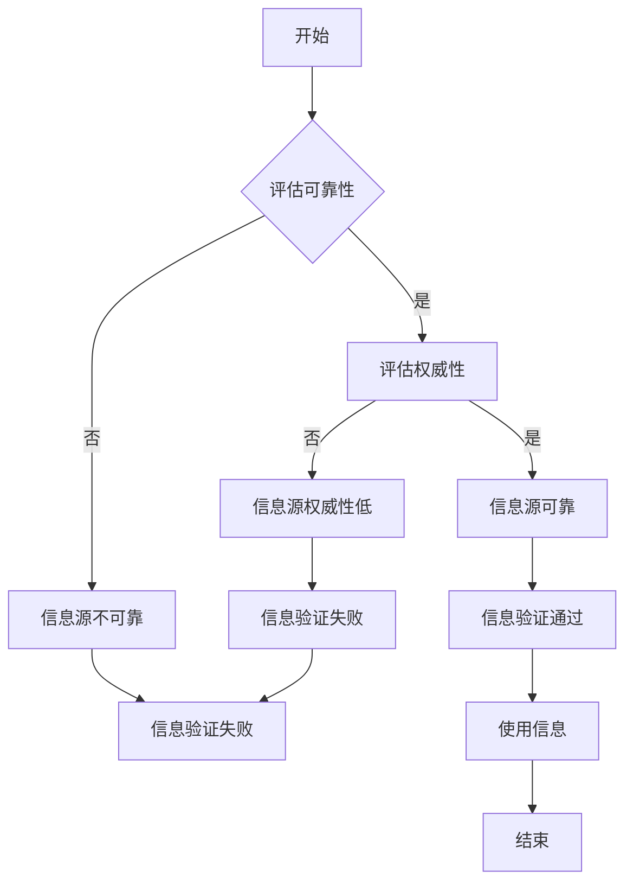
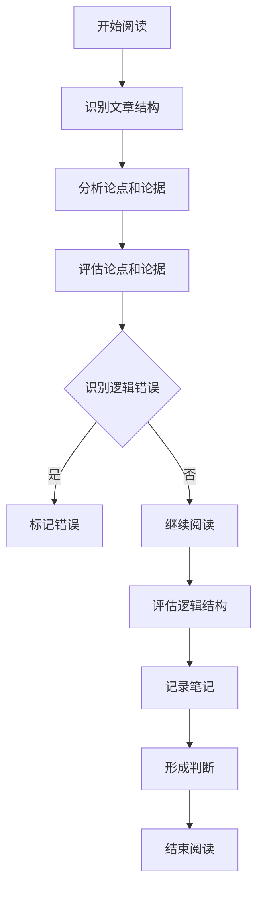

                 

### 第一部分：信息验证的基本原理

#### 第1章：信息验证与批判性阅读的重要性

**1.1.1 假新闻与媒体操纵对社会的危害**

在信息化和数字化的时代，假新闻与媒体操纵的问题日益严重。这些现象不仅误导了公众，扰乱了社会秩序，还对社会造成了深远的危害。

- **误导公众**：假新闻往往具有吸引人的标题和内容，容易使公众产生误解，影响人们对事实的判断。例如，某些假新闻可能夸大事实，或故意扭曲事实，导致公众对某一事件或政策的理解出现偏差。
- **扰乱社会秩序**：假新闻可能会引发恐慌，导致社会的不稳定。例如，某些假新闻可能会制造谣言，引起公众的恐慌和不安，进而引发社会骚乱。
- **损害公信力**：媒体操纵可能会损害媒体的公信力，使公众对媒体的信任度降低。当公众发现媒体发布的信息不准确或不公正时，他们可能会对媒体产生怀疑，从而影响媒体的传播效果。

**1.1.2 个体在信息泛滥时代的困境**

在信息泛滥的时代，个体面临着越来越多的信息，但同时也面临着更多的困惑和挑战。

- **信息过载**：随着互联网的普及，个体每天接收到的信息量急剧增加，使得人们难以消化和理解所有的信息。这种现象被称为信息过载。
- **信息失真**：在信息传播的过程中，信息可能会被篡改、扭曲或失真。这使得个体在获取信息时，很难判断信息的真实性和准确性。
- **信任危机**：由于假新闻和媒体操纵的存在，个体对信息的信任度降低。当个体无法确定信息的真实性时，他们可能会对所有的信息都持怀疑态度，这进一步加剧了信息的失真。

**1.1.3 信息验证与批判性阅读的双重意义**

信息验证和批判性阅读在应对假新闻和媒体操纵中具有非常重要的意义。

- **提高信息质量**：信息验证有助于识别和筛选出真实、准确的信息，提高个体获取信息的质量。通过验证信息的真实性和准确性，个体可以避免被假新闻误导。
- **培养批判性思维**：批判性阅读有助于培养个体的批判性思维，使他们能够对信息进行深入分析和判断。通过批判性阅读，个体可以更好地理解信息的背景、意图和影响，从而做出更明智的决策。
- **维护社会秩序**：信息验证和批判性阅读有助于维护社会秩序，减少假新闻和媒体操纵对社会造成的危害。当个体能够识别和抵制假新闻时，社会的不稳定因素就会减少。

**总结**

信息验证和批判性阅读是应对假新闻和媒体操纵的重要工具。通过信息验证，个体可以识别和筛选出真实、准确的信息，避免被假新闻误导。通过批判性阅读，个体可以培养批判性思维，对信息进行深入分析和判断。只有通过信息验证和批判性阅读，个体才能在信息泛滥的时代中保持清醒的头脑，维护自己的利益和社会的稳定。

#### 第2章：信息验证的基本概念

**2.1.1 信息源评估**

信息源评估是信息验证过程中的重要环节。它涉及到对信息来源的可靠性和权威性进行评估。

- **可靠性**：可靠性指的是信息来源是否稳定和持续地提供信息，以及信息内容是否准确无误。一个可靠的信息源应该具有以下特点：
  - **权威性**：信息源应该是某一领域的专家或权威机构，他们的信息具有较高的可信度。
  - **稳定性**：信息源应该能够持续地提供信息，而不是突然停止或中断。
  - **准确性**：信息源提供的信息应该是准确无误的，没有明显的错误或误导。

- **权威性**：权威性指的是信息来源的声誉和地位。一个具有权威性的信息源通常具有以下特点：
  - **知名度和声誉**：信息源在公众中具有较高的知名度和良好的声誉。
  - **专业性和深度**：信息源在某一领域具有深入的研究和专业能力，能够提供高质量的信息。

**2.1.2 真实性与可信度的判断标准**

真实性和可信度是评估信息质量的重要标准。以下是一些判断标准：

- **事实依据**：真实的信息应该有明确的事实依据，这些事实可以是统计数据、研究报告、官方发布的信息等。
- **来源透明**：可信的信息来源应该明确，并且能够追溯。这意味着信息发布者应该提供足够的信息，以便他人验证其真实性。
- **一致性**：真实的信息在多个来源中应该是一致的。如果不同来源的信息相互矛盾，那么这些信息可能需要进一步验证。
- **逻辑性**：信息的逻辑应该清晰，没有明显的逻辑漏洞或错误。

**2.1.3 信息验证的重要性与挑战**

信息验证的重要性在于，它能够帮助个体识别和筛选出真实、准确的信息，避免被假新闻误导。然而，信息验证也面临着一些挑战：

- **信息过载**：随着信息量的增加，个体需要花费更多的时间和精力来验证信息，这可能导致信息过载和疲劳。
- **信息源的多样性**：互联网上有大量的信息源，这些信息源的质量参差不齐，个体需要花费大量的时间来评估这些信息源。
- **技术限制**：虽然有一些工具和算法可以帮助进行信息验证，但这些工具和算法也存在局限性，无法完全替代人工判断。

**总结**

信息验证是应对假新闻和媒体操纵的关键步骤。通过信息源评估，个体可以识别出可靠和权威的信息源。通过判断信息的真实性和可信度，个体可以筛选出真实、准确的信息。尽管信息验证面临一些挑战，但通过持续的努力和学习，个体可以不断提高自己的信息验证能力。

#### 第3章：批判性阅读的基本方法

**3.1.1 批判性阅读的定义与目标**

批判性阅读是一种主动的、深入的阅读方法，它不仅要求理解文章的内容，还要求对文章的论点、论据、逻辑结构等进行深入分析。批判性阅读的目标是帮助读者从多个角度思考问题，识别文章中的偏见、逻辑错误和误导性信息。

- **理解文章内容**：批判性阅读的第一步是理解文章的基本内容，包括文章的主题、观点和论据。
- **分析论点和论据**：读者需要分析文章中的论点和论据，判断它们是否合理、有力。这包括检查论据的来源、论据之间的逻辑关系以及论点是否被充分支持。
- **评估逻辑结构**：批判性阅读还需要评估文章的逻辑结构，包括文章的论点是否连贯、论证是否严密、是否有逻辑漏洞。

**3.1.2 批判性思维框架**

批判性思维框架是进行批判性阅读的基础。以下是一个简单的批判性思维框架：

1. **识别文章的目的**：首先，读者需要明确文章的目的。文章可能是为了说服读者、提供信息还是进行娱乐？
2. **理解作者的立场**：了解作者的立场和偏见，有助于读者更好地理解文章的内容和意图。
3. **评估论点和论据**：对文章中的论点和论据进行深入分析，检查它们是否合理、有力。
4. **识别逻辑错误**：查找文章中的逻辑错误，如错误的假设、错误的推理等。
5. **寻找证据**：寻找支持或反驳文章论点的证据，包括其他专家的观点、统计数据、研究报告等。
6. **综合分析**：综合以上信息，形成自己的判断和观点。

**3.1.3 批判性阅读的策略与实践**

批判性阅读需要一系列的策略和实践技巧，以下是一些常用的策略：

1. **主动提问**：在阅读过程中，读者应该主动提问，如“这篇文章的论点是什么？”“论据是否充分？”“作者的立场是什么？”等。
2. **交叉验证**：对文章中的信息进行交叉验证，即通过查找其他来源的信息来验证文章的真实性和准确性。
3. **分析论据**：对文章中的论据进行详细分析，检查它们是否基于事实、是否有逻辑错误。
4. **评估证据**：对文章中的证据进行评估，检查它们是否可靠、是否支持作者的论点。
5. **保持开放心态**：批判性阅读并不意味着完全否定文章的观点，而是要求读者保持开放的心态，接受不同的观点和意见。
6. **记录笔记**：在阅读过程中，记录关键信息和自己的思考，这有助于加深理解并方便后续的回顾和总结。

**总结**

批判性阅读是一种重要的阅读方法，它帮助读者从多个角度思考问题，识别文章中的偏见和误导性信息。通过批判性阅读，读者可以提高自己的信息素养，做出更明智的判断和决策。批判性阅读不仅是一种技能，更是一种思维方式，它需要读者在实践中不断锻炼和提升。

#### 第4章：信息验证的具体策略

**4.1.1 搜索引擎与信息检索技巧**

搜索引擎是信息验证的重要工具，有效的搜索技巧可以大幅提高信息检索的效率和质量。

- **使用关键词**：在搜索时，选择合适的关键词是关键。关键词应尽量准确，涵盖所需信息的核心内容。例如，在搜索“全球变暖”相关资料时，可以结合“气候变化”、“温室气体排放”等关键词。
- **限定搜索范围**：利用搜索引擎的高级搜索功能，可以限定搜索范围，提高检索的精准度。例如，在Google搜索中，通过使用“site:example.com”可以限定搜索结果只来自特定网站。
- **逻辑组合关键词**：使用逻辑运算符（如AND、OR、NOT）组合关键词，可以更精确地检索信息。例如，“全球变暖 NOT 冷战”可以检索与全球变暖相关但不包括冷战内容的资料。

**4.1.2 跟踪信息来源与源头**

跟踪信息来源和源头是信息验证的重要环节，有助于判断信息的真实性和可靠性。

- **检查引用来源**：在获取信息时，要检查引用的来源。权威的引用来源通常包括学术期刊、官方报告、知名媒体报道等。例如，一篇关于医疗研究的文章，其引用的来源如果是知名医学期刊，则信息可靠性较高。
- **追溯信息源头**：通过追溯信息源头，可以了解信息最初是如何传播的。一些社交媒体平台和搜索引擎提供信息溯源功能，可以帮助用户查看信息发布者的信息和历史。
- **评估来源可靠性**：评估信息来源的可靠性。例如，通过查看网站域名、公司背景、认证标志等，可以初步判断一个网站的可信度。

**4.1.3 信息验证工具的使用**

信息验证工具可以帮助用户更高效地验证信息的真实性和准确性。

- **事实核查网站**：如“事实核查网”（FactCheck.org）和“ PolitiFact ”，这些网站会对公共信息进行核查，并提供详细的事实核查报告。
- **反假新闻工具**：如“ Ad Fontes Media ”，这些工具通过算法和人工审核，识别和标记潜在的假新闻。
- **网络监控工具**：如“公证处”（公证处.cn），这些工具可以帮助用户监控网络上的信息传播，识别和追踪假新闻的传播路径。

**具体案例**

**案例1：使用搜索引擎查找可靠信息**

假设我们要查找关于“人工智能对就业市场的影响”的研究资料。

1. **选择关键词**：“人工智能”、“就业市场”、“影响”。
2. **使用高级搜索**：在Google搜索中输入“site:.edu "人工智能" "就业市场" "影响"”，限定搜索结果来自教育机构，提高资料的可信度。
3. **查看引用来源**：选取几个权威的研究报告，检查其引用的来源是否可靠。

**案例2：追溯信息源头**

假设我们看到了一篇关于健康食品的博客文章，但我们对其可信度表示怀疑。

1. **检查引用来源**：查看文章引用的来源，如果引用的是不知名的健康网站，可能需要进一步验证。
2. **追溯源头**：使用搜索引擎尝试追溯文章的原始信息，查找是否有知名媒体或权威机构报道过类似内容。

**总结**

信息验证的具体策略包括使用搜索引擎的技巧、跟踪信息来源和源头以及使用专业的信息验证工具。通过这些策略，用户可以更高效地检索和验证信息，提高获取信息的准确性和可靠性。信息验证不仅是个体应对假新闻和媒体操纵的有效手段，也是维护自身信息素养和提升决策能力的重要途径。

#### 第5章：批判性阅读策略

**5.1.1 文章结构与论据分析**

批判性阅读的一个重要方面是理解文章的结构，并分析其论点和论据。以下是一些分析文章结构和论据的策略：

- **识别文章结构**：首先，读者需要识别文章的结构。一般来说，文章可以分为引言、主体和结论三个部分。引言部分通常提出问题或背景信息，主体部分详细阐述论点和论据，结论部分总结全文并给出结论。
- **分析论点**：在主体部分，读者需要分析文章的主要论点。每个论点通常需要被验证，因此读者需要确定论点是否明确、有力和相关。
- **分析论据**：论据是用来支持论点的证据和理由。读者需要检查每个论据是否基于事实、逻辑严密且具有说服力。例如，读者可以询问自己：这个论据是否提供了足够的证据来支持论点？是否有其他解释或证据可以反驳这个论点？

**5.1.2 演讲与视频内容的批判性分析**

批判性阅读不仅适用于文章，也适用于演讲和视频等动态内容。以下是一些批判性分析演讲和视频的策略：

- **观察演讲者的表达**：批判性阅读要求读者注意演讲者的语言、语调、肢体语言和非语言信号。这些表达方式可能反映了演讲者的意图、情绪和信心水平。
- **分析演讲结构**：与文章类似，演讲也有其结构和逻辑。读者需要分析演讲的引言、主体和结论部分，以及各个部分之间的过渡和连接。
- **关注论据和证据**：演讲中的论点和论据通常通过口头表达、图表和数据展示来支持。读者需要仔细分析这些论据和证据，检查它们是否可靠和有说服力。
- **评估逻辑和修辞**：演讲者常常使用各种逻辑和修辞技巧来加强论点。读者需要识别这些技巧，并评估它们的有效性。例如，演讲者可能使用比喻、类比、情感诉求等修辞手法，这些手法可能会影响听众的判断。

**5.1.3 媒体报道中的偏见与事实核对**

媒体报道中的偏见和事实核对是批判性阅读的重要领域。以下是一些策略来识别和处理媒体报道中的偏见：

- **识别偏见**：媒体报道可能带有主观偏见，这种偏见可能是由于记者的观点、编辑的决策或媒体机构的立场所导致的。读者需要识别这些偏见，并询问自己：报道是否平衡？是否有不同的观点和声音被包含？
- **核对事实**：对于媒体报道中的事实，读者需要进行核对。这包括检查引用的来源、数据是否准确、引用的例子是否真实等。
- **查找多角度报道**：为了获得更全面的视角，读者应该查找其他媒体的报道，特别是那些具有不同政治立场和观点的媒体。通过对比不同媒体的报道，读者可以更全面地理解事件和问题。

**具体案例**

**案例1：分析一篇科学论文**

假设读者正在阅读一篇关于“气候变化”的科学论文。

1. **识别文章结构**：文章分为引言、方法、结果和讨论四个部分。
2. **分析论点和论据**：论点主要集中在气候变化对生态系统的影响，论据包括数据分析和实验结果。
3. **评估论据的可靠性**：检查数据来源、分析方法和实验结果的可靠性。

**案例2：批判性分析一场政治演讲**

假设读者正在观看一场关于“经济政策”的政治演讲。

1. **观察演讲者的表达**：注意演讲者的语调、肢体语言和表情。
2. **分析演讲结构**：演讲分为引言、主体和结论，每个部分都有不同的论点和论据。
3. **评估逻辑和修辞**：检查演讲中使用的逻辑和修辞手法，如类比、情感诉求等。

**总结**

批判性阅读策略包括分析文章结构、论点和论据，批判性分析演讲和视频内容，以及核对媒体报道中的事实和偏见。通过这些策略，读者可以更深入地理解信息，识别潜在的偏见和误导，从而做出更明智的判断。批判性阅读不仅是一种技能，更是一种思维方式，它有助于提升个体的信息素养和批判性思维能力。

#### 第6章：社交媒体信息验证

**6.1.1 社交媒体信息的特性和挑战**

社交媒体平台如Facebook、Twitter、Instagram等已成为人们获取和分享信息的主要途径。然而，这些平台上的信息具有一些独特的特性和挑战。

- **信息传播速度快**：社交媒体的信息可以迅速传播，往往在几秒钟内就可以传遍全球。这种速度使得假新闻和误导性信息可以快速传播，造成严重的社会影响。
- **匿名性和隐蔽性**：社交媒体允许用户匿名发布信息，这使得一些恶意行为者可以隐藏自己的身份，发布虚假信息而不被追责。此外，一些信息可能被故意模糊来源，增加了验证的难度。
- **情绪化和非理性**：社交媒体上的信息往往更加情绪化，用户更容易受到情绪的影响，而忽略理性分析和事实核对。这种情绪化和非理性的特点使得社交媒体上的讨论容易变得激烈和极端。

**6.1.2 在社交媒体上识别假新闻**

识别假新闻是社交媒体信息验证的关键步骤。以下是一些在社交媒体上识别假新闻的策略：

- **检查来源可靠性**：首先，读者应该检查信息的来源。如果是知名媒体或权威机构发布的信息，可信度较高。如果来源不明或可疑，则需要进一步验证。
- **交叉验证信息**：通过查找多个来源的信息来交叉验证，如果多个可靠来源都报道了相同的信息，则信息可能更为可信。如果不同来源的信息相互矛盾，则需要保持警惕。
- **关注发布者背景**：了解发布者的背景和动机可以帮助读者判断信息的真实性。例如，一个长期发布虚假信息的用户可能发布的所有内容都应保持怀疑态度。
- **分析内容逻辑和语言**：假新闻往往存在逻辑漏洞、使用模糊语言或不一致的信息。读者应该仔细分析内容，识别这些特征。

**6.1.3 社交媒体信息验证的工具与平台**

为了帮助用户更有效地验证社交媒体上的信息，一些工具和平台应运而生。以下是一些常用的工具和平台：

- **事实核查网站**：如“PolitiFact”、“FactCheck.org”等，这些网站专门对社交媒体上的信息进行核查，并提供详细的事实核查报告。
- **反假新闻工具**：如“Ad Fontes Media”、“Hoaxy”等，这些工具通过算法和人工审核，识别和标记潜在的假新闻。
- **社交媒体平台自身的工具**：一些社交媒体平台如Facebook和Twitter也提供了工具帮助用户识别假新闻。例如，Facebook的“事实核查标签”功能可以标记可疑信息，并提示用户进行进一步验证。
- **在线工具和浏览器插件**：如“Google Fact Check Tools”、“Bullshit Detector”等，这些工具和插件可以帮助用户实时验证社交媒体上的信息。

**具体案例**

**案例1：识别社交媒体上的假新闻**

假设用户在Twitter上看到一条关于“新冠疫苗副作用”的推文，并对其真实性表示怀疑。

1. **检查来源可靠性**：查看推文的发布者是否为知名专家或权威机构。
2. **交叉验证信息**：在搜索引擎中查找其他媒体报道或事实核查网站的相关信息，查看是否有其他可靠来源支持。
3. **分析内容逻辑**：检查推文中是否存在逻辑漏洞或使用模糊语言，如“据说”、“有人声称”等。

**案例2：使用事实核查工具**

假设用户在Facebook上看到一篇关于“气候变化影响”的文章，并对其真实性表示怀疑。

1. **使用事实核查网站**：在“FactCheck.org”上搜索相关文章，查看是否有详细的事实核查报告。
2. **查看标记信息**：在Facebook上查看是否有其他用户对该文章进行了标记或评论，了解其他用户的看法。
3. **使用浏览器插件**：使用“Google Fact Check Tools”插件，对文章进行实时验证，查看是否有可疑的标记或警告。

**总结**

社交媒体信息验证是应对假新闻和误导性信息的重要策略。通过检查来源可靠性、交叉验证信息、分析内容逻辑和语言，以及使用专业工具和平台，用户可以更有效地识别和验证社交媒体上的信息。社交媒体信息验证不仅有助于提升个人信息素养，还有助于维护社会秩序和公信力。

#### 第7章：信息验证案例研究

**7.1.1 某次重大假新闻事件的案例分析**

为了更深入地理解信息验证的重要性，我们可以通过分析一次重大假新闻事件来探讨信息验证的过程和方法。

**事件背景**：2018年，社交媒体上广泛传播一条关于“某国爆发大规模疾病”的新闻。该新闻声称，某国首都爆发了一种神秘的、致命的疾病，导致大量人员伤亡。这则消息迅速引起了全球的关注和恐慌。

**信息验证过程**：

1. **初步核查**：首先，记者和事实核查机构开始对这条新闻进行初步核查。他们通过搜索引擎查找相关信息，并发现多个媒体报道了这条新闻，但都没有提供具体的来源或证据。
2. **追溯信息源头**：通过追溯信息源头，他们发现这条新闻最初来源于一个不知名的博客，且没有提供任何官方数据或报告。这引起了他们的怀疑。
3. **交叉验证**：记者和事实核查机构联系了多家医疗机构和卫生部门，但没有得到任何关于这一疾病的官方确认。此外，他们还通过查阅世界卫生组织的报告和新闻，发现没有关于这一疾病的记录。
4. **实地调查**：记者随后前往该国的首都进行实地调查，发现当地并没有出现报道中所描述的疾病爆发情况。他们与当地居民、医疗机构和政府官员进行了交流，证实了这一假新闻的虚假性。
5. **结论发布**：最终，事实核查机构和主流媒体公开了这一假新闻的真相，并通过报道提醒公众警惕虚假信息。

**信息验证的方法**：

1. **来源核查**：首先，对信息来源进行核查，确定其权威性和可靠性。如果来源不明或可疑，则需要进一步验证。
2. **交叉验证**：通过多个来源的信息进行交叉验证，以确认信息的真实性和准确性。如果不同来源的信息相互矛盾，则需要保持警惕。
3. **实地调查**：当初步核查和交叉验证无法确定信息的真实性时，可以进行实地调查，通过采访和实地观察来验证信息。
4. **专家咨询**：在必要时，可以咨询相关领域的专家或权威机构，以获取专业意见和验证信息。

**7.1.2 批判性阅读在实际中的应用案例**

批判性阅读不仅是一种理论方法，还可以在实际应用中发挥重要作用。以下是一个批判性阅读在新闻报道中的应用案例：

**案例背景**：某知名媒体发布了一篇关于“某品牌牛奶安全问题的报道”，声称该品牌牛奶中含有有害物质，对消费者健康构成威胁。

**批判性阅读过程**：

1. **分析文章结构**：读者首先分析了文章的结构，发现文章分为引言、主体和结论三个部分。引言部分提出了一个引起关注的问题，主体部分详细列举了“证据”和“案例”，结论部分给出了最终的判断。
2. **评估论点和论据**：读者对文章中的论点和论据进行了评估。他们发现文章的论点是“该品牌牛奶不安全”，但论据主要基于一些消费者的投诉和个别实验室的检测结果，缺乏大规模数据支持和官方机构的确认。
3. **分析逻辑和修辞**：读者注意到文章中使用了强烈的修辞手法，如“危险警报”、“紧急呼吁”等，这可能会影响读者的判断。他们还发现文章中的论据之间存在逻辑漏洞，如一些案例并非直接与该品牌牛奶相关。
4. **查找多角度报道**：读者通过查找其他媒体的报道，发现了一些不同的观点和声音。例如，一些媒体报道了该品牌牛奶的官方声明，称其产品经过多次检测均符合安全标准。
5. **形成自己的判断**：综合以上信息，读者形成了自己的判断，认为该篇报道存在一定的偏见和误导性，不能完全接受其结论。

**总结**

通过分析这两个案例，我们可以看到信息验证和批判性阅读在应对假新闻和误导性信息中的重要作用。信息验证不仅有助于识别和筛选真实、准确的信息，还可以帮助公众在面对复杂信息时保持理性思维。批判性阅读则帮助读者从多个角度思考问题，识别潜在的偏见和逻辑错误，从而做出更明智的判断。这些方法不仅对个人有重要意义，也对维护社会秩序和提升整体信息素养具有深远的影响。

#### 第8章：信息验证与批判性阅读教育的重要性

**8.1.1 教育对信息素养的影响**

在信息泛滥的时代，教育在培养个体的信息素养中扮演着至关重要的角色。信息素养不仅包括获取和评估信息的能力，还涉及到批判性思维、问题解决能力和自我学习能力。

- **信息获取能力**：教育可以帮助个体学会如何有效地获取所需信息。这包括使用各种信息工具，如图书馆、数据库、互联网等，以及如何设计有效的搜索策略。
- **信息评估能力**：教育可以培养个体对信息的批判性思维，使他们能够评估信息的真实性和可靠性。这包括对信息源、论据和证据的评估，以及对潜在偏见和误导性的识别。
- **信息使用能力**：教育还可以帮助个体学会如何有效地使用信息，以支持决策和解决问题。这包括信息的组织和整合，以及将信息应用于实际情境中的能力。

**8.1.2 信息验证与批判性阅读教育的目标与方法**

信息验证与批判性阅读教育的目标是培养个体的信息素养，使他们能够在信息泛滥的时代中保持清醒的头脑，做出明智的决策。以下是一些具体的目标和方法：

- **目标**：
  - 增强个体的信息意识，使他们认识到信息的重要性和潜在风险。
  - 培养个体的批判性思维，使他们能够对信息进行深入分析和判断。
  - 提高个体的信息检索和评估能力，使他们能够有效地获取和验证信息。
  - 培养个体的信息使用能力，使他们能够将信息应用于实际问题中。

- **方法**：
  - **课堂教学**：通过课堂讲解、案例分析、讨论等方式，向学生传授信息验证和批判性阅读的基本原理和方法。
  - **实践活动**：组织学生参与信息检索、评估和验证的实践活动，如撰写研究报告、参与事实核查等。
  - **技术应用**：介绍和应用各种信息验证工具和技术，如搜索引擎、事实核查网站、反假新闻工具等。
  - **跨学科教育**：结合不同学科的内容，培养学生的跨学科信息素养，如科学、社会、人文学科等。

**8.1.3 学校与社会的协同教育策略**

学校与社会在信息验证与批判性阅读教育中应协同合作，共同培养个体的信息素养。

- **学校层面**：
  - 制定系统的信息素养教育课程，将信息验证和批判性阅读融入各个学科的教学中。
  - 开展课外活动，如读书俱乐部、信息素养竞赛等，激发学生的学习兴趣和参与度。
  - 与家长和社区合作，共同营造重视信息素养教育的环境。

- **社会层面**：
  - 推广信息素养教育，提高公众对信息验证和批判性阅读的认识和重视。
  - 提供资源和平台，如在线课程、工作坊、社区活动等，帮助个体提升信息素养。
  - 与学校合作，共同开发和实施信息素养教育项目。

**总结**

信息验证与批判性阅读教育在培养个体信息素养中具有重要意义。通过学校与社会的协同努力，可以有效地提高个体的信息素养，使他们能够在信息泛滥的时代中保持理性思维，做出明智的决策，并为社会的和谐与发展做出贡献。

### 9.1.1 个人信息素养提升计划

在信息泛滥的时代，提升个人信息素养是每个个体都需要面对的挑战。以下是一个具体的个人信息素养提升计划，旨在帮助读者逐步提高自己的信息验证和批判性阅读能力。

#### 第一阶段：基础素养培养

**目标**：了解信息素养的基本概念，掌握信息检索的基本方法。

**任务**：
1. **阅读基础读物**：选择几本关于信息素养的入门书籍，如《信息素养：信息技术时代的学习和生存技能》等，系统地学习信息素养的基本概念。
2. **学习信息检索技巧**：通过在线课程或书籍，了解如何使用搜索引擎、图书馆数据库等工具进行有效检索。
3. **实践信息检索**：定期进行信息检索练习，如查找某个领域的最新研究论文、新闻报告等，以巩固所学知识。

**时间安排**：2-4周

#### 第二阶段：批判性思维培养

**目标**：培养批判性思维，学会对信息进行深入分析和判断。

**任务**：
1. **学习批判性思维框架**：阅读相关书籍，如《批判性思维：工具与挑战》等，了解批判性思维的基本框架和技巧。
2. **参与讨论和辩论**：通过加入线上或线下的讨论小组，参与辩论和讨论，锻炼批判性思维。
3. **进行批判性阅读练习**：选取一些常见的文章、新闻、书籍等，尝试使用批判性思维框架进行分析和评价。

**时间安排**：4-6周

#### 第三阶段：信息验证能力提升

**目标**：学会验证信息的真实性和可靠性，提高信息验证的技能。

**任务**：
1. **学习信息验证策略**：通过阅读相关书籍，如《信息验证：应对假新闻和媒体操纵的策略》等，了解信息验证的基本策略和方法。
2. **实践信息验证**：对获取的信息进行验证，如通过交叉验证、追溯信息源头等策略，确保信息的真实性和可靠性。
3. **使用信息验证工具**：学习并使用一些信息验证工具，如事实核查网站、反假新闻工具等，提高信息验证的效率和准确性。

**时间安排**：6-8周

#### 第四阶段：综合应用与实践

**目标**：将所学的信息素养知识应用到实际问题中，提升信息素养的综合应用能力。

**任务**：
1. **参与项目或研究**：参与一些实际项目或研究，如撰写研究报告、参与事实核查项目等，将所学知识应用于实际问题。
2. **开展信息素养活动**：组织或参与信息素养活动，如信息素养讲座、工作坊等，与他人分享学习经验和成果。
3. **持续学习和反思**：定期回顾自己的学习过程和成果，识别不足之处，持续学习和改进。

**时间安排**：持续进行

**总结**

个人信息素养提升计划是一个系统性的过程，通过分阶段的学习和实践，个体可以逐步提高自己的信息素养。从基础素养的培养，到批判性思维的锻炼，再到信息验证能力的提升，每个阶段都有明确的目标和任务。通过持续的学习和反思，个体可以在信息泛滥的时代中保持清醒的头脑，做出明智的决策。

### 9.1.2 组织与社区的信息验证活动

在提升整体信息素养方面，组织与社区的信息验证活动扮演着关键角色。以下是一些有效的策略和活动，旨在帮助社区成员识别和验证信息，从而提高他们的信息素养。

#### 1. 举办信息素养讲座

**策略**：邀请专家或学者举办信息素养讲座，向社区成员传授信息验证和批判性阅读的基本知识。

**活动**：
- **内容**：讲座内容可以涵盖信息源评估、信息真实性与可信度判断、批判性阅读策略等。
- **形式**：可以采取面对面讲座或在线讲座的形式，以便更多人参与。

#### 2. 组织信息验证工作坊

**策略**：通过组织信息验证工作坊，提供实践机会，帮助社区成员掌握信息验证的具体技巧。

**活动**：
- **内容**：工作坊可以设置实践任务，如对某一新闻事件进行信息验证，对一篇文章进行批判性分析。
- **形式**：工作坊可以采用小组讨论、案例分析、角色扮演等方式，增强参与者的互动和体验。

#### 3. 创建信息素养小组

**策略**：建立信息素养小组，提供一个相互学习和支持的平台。

**活动**：
- **内容**：小组可以定期组织讨论、分享信息和经验，互相监督和反馈。
- **形式**：小组可以通过线上平台（如微信群、论坛）或线下聚会的方式进行活动。

#### 4. 开展信息验证竞赛

**策略**：通过信息验证竞赛，激发社区成员的兴趣和参与度，提高他们的信息验证能力。

**活动**：
- **内容**：竞赛可以设置各种形式的挑战，如寻找假新闻、分析文章结构、验证信息来源等。
- **形式**：可以采取个人或团队参赛的形式，设置奖项和奖励，增加活动的吸引力。

#### 5. 推广信息验证工具

**策略**：推广和使用各种信息验证工具，帮助社区成员更高效地验证信息。

**活动**：
- **内容**：介绍和演示信息验证工具，如事实核查网站、反假新闻工具、搜索引擎高级搜索功能等。
- **形式**：可以通过在线教程、工作坊、讲座等形式进行推广。

#### 总结

通过举办讲座、组织工作坊、创建小组、开展竞赛和推广工具，组织与社区可以有效地开展信息验证活动，提升整体信息素养。这些活动不仅有助于个体识别和验证信息，还能培养批判性思维和问题解决能力，从而在信息泛滥的时代中保持理性和清醒。

### 第10章：未来展望

#### 10.1.1 信息验证技术的发展趋势

随着技术的不断进步，信息验证领域也迎来了新的发展趋势。以下是一些关键趋势：

- **人工智能与机器学习**：人工智能和机器学习技术正在被广泛应用于信息验证，通过算法和模型对海量信息进行自动化分析和评估。例如，自动化的假新闻检测系统可以快速识别和标记潜在的虚假信息。
- **大数据分析**：大数据技术的应用使得信息验证变得更加高效。通过分析大量的数据来源和传播路径，可以更准确地判断信息的真实性和可靠性。
- **区块链技术**：区块链技术提供了去中心化和不可篡改的数据存储方式，可以用于验证信息的来源和传播路径，确保信息的安全性。

#### 10.1.2 批判性阅读教育的发展方向

批判性阅读教育在未来将继续发展，并可能呈现以下趋势：

- **跨学科融合**：批判性阅读教育将更多地融入不同学科的内容，培养学生的跨学科思维和综合能力。
- **个性化学习**：通过人工智能和大数据技术，个性化学习将更加普及。学生可以根据自己的兴趣和需求，选择适合自己的学习资源和课程。
- **实践与理论并重**：未来批判性阅读教育将更加注重实践，通过案例分析、项目研究等活动，培养学生的实际操作能力和解决问题的能力。

#### 10.1.3 信息验证与批判性阅读对社会的影响

信息验证与批判性阅读在社会中具有深远的影响，以下是几个方面的具体影响：

- **增强社会公信力**：通过信息验证和批判性阅读，公众可以更准确地识别和抵制虚假信息，增强对媒体和信息的信任，提升社会的整体公信力。
- **提升公民素养**：信息验证和批判性阅读有助于培养公民的理性思维和判断能力，使他们能够更好地参与公共事务，做出更明智的决策。
- **促进社会和谐**：信息验证和批判性阅读有助于减少信息误导和误解，减少社会冲突和分歧，促进社会的和谐与发展。

**总结**

未来，随着技术的不断进步，信息验证和批判性阅读将得到更广泛的应用和发展。这些技术和教育方法不仅有助于个体应对信息泛滥的挑战，还能对社会产生积极的影响，推动社会的进步和和谐。

## 附录 A：信息验证与批判性阅读资源推荐

### A.1.1 基础读物

- 《信息素养：信息技术时代的学习和生存技能》
- 《批判性思维：工具与挑战》
- 《信息验证：应对假新闻和媒体操纵的策略》

### A.1.2 在线课程与工作坊

- Coursera上的“信息素养与互联网技能”课程
- edX上的“批判性阅读与写作”课程
- 抖音、B站等平台上的信息验证与批判性阅读相关视频和工作坊

### A.1.3 专业工具与平台

- 事实核查网站：FactCheck.org、PolitiFact
- 反假新闻工具：Ad Fontes Media、Hoaxy
- 搜索引擎：Google、Bing的高级搜索功能

## 附录 B：Mermaid 流程图与伪代码示例

### B.1.1 信息源评估流程



### B.1.2 批判性阅读流程



### B.1.3 信息验证伪代码示例

```python
# 信息验证伪代码示例

def verify_information(source, evidence):
    """
    验证信息的真实性和可靠性
    :param source: 信息来源
    :param evidence: 证据或证据链
    :return: 真实性判断
    """
    
    # 检查信息源可靠性
    if is_reliable_source(source):
        # 检查证据的真实性和准确性
        if is_valid_evidence(evidence):
            return "信息验证通过"
        else:
            return "证据不可靠"
    else:
        return "信息源不可靠"

# 示例调用
source = "知名医学期刊"
evidence = "临床试验报告"
result = verify_information(source, evidence)
print(result)
```

## 附录 C：数学模型与公式解释

### C.1.1 信息可信度计算模型

信息可信度的计算公式如下：

$$
C = \frac{R \times V}{E + R}
$$

其中：
- \(C\)：信息可信度
- \(R\)：证据的可靠性
- \(V\)：证据的有效性
- \(E\)：证据的易得性

### C.1.2 批判性阅读评估模型

批判性阅读评估模型可以使用以下公式：

$$
P = \frac{L \times R \times A}{C + R \times A}
$$

其中：
- \(P\)：阅读评估得分
- \(L\)：论点的逻辑性
- \(R\)：证据的可靠性
- \(A\)：文章的吸引力

### C.1.3 数学公式示例说明

假设某篇文章的论点为“全球变暖是由人类活动引起的”，证据包括“气候变化统计数据”和“科学研究报告”，且评估得分分别为 \(L = 0.8\)、\(R = 0.9\)、\(A = 0.7\)，则该篇文章的批判性阅读得分计算如下：

$$
P = \frac{0.8 \times 0.9 \times 0.7}{1 + 0.9 \times 0.7} \approx 0.64
$$

这意味着该篇文章在批判性阅读评估中得分约为0.64，表明其逻辑性、可靠性和吸引力较为均衡。

## 附录 D：信息验证与批判性阅读实战案例

### D.1.1 社交媒体信息验证实战案例

**案例背景**：某社交媒体平台上出现了一条关于“新冠病毒疫苗副作用”的帖子，称疫苗会导致严重的健康问题，引起了广泛关注和讨论。

**验证过程**：

1. **检查来源**：查看帖子的发布者信息，发现其账号是一个不知名的个人账号，没有提供具体的来源或证据。

2. **交叉验证**：在搜索引擎中搜索相关信息，发现其他媒体和平台没有报道这一内容，同时查阅权威的医疗网站，如世界卫生组织（WHO）和各大医疗机构，没有找到相关证据。

3. **分析逻辑和语言**：帖子中使用了一些模糊的语言，如“据说”、“有人反映”，这表明信息的真实性值得怀疑。

4. **进一步调查**：通过社交媒体平台的举报功能，将该帖子标记为潜在假新闻，并联系平台官方进行核实。

**结论**：经过验证，该帖子为虚假信息，未得到官方或权威机构的支持，公众不应轻信该信息。

### D.1.2 批判性阅读应用案例

**案例背景**：某知名媒体发布了一篇关于“某种食品添加剂对健康影响”的文章，声称这种添加剂可能致癌，引起了广泛关注。

**批判性阅读过程**：

1. **识别文章结构**：文章分为引言、主体和结论三个部分。引言部分提出问题，主体部分列举了多个研究和案例，结论部分给出了最终判断。

2. **评估论点和论据**：文章的论点是“某种食品添加剂可能致癌”，论据包括多个实验室研究和个别案例。然而，这些研究和案例并没有得到广泛的科学认可，且存在一定的逻辑漏洞。

3. **分析逻辑和修辞**：文章中使用了一些强烈的修辞手法，如“重大发现”、“可能致癌”等，这可能会影响读者的判断。此外，文章中的论据之间存在逻辑不一致，如一些研究的结果并未得到其他研究的支持。

4. **查找多角度报道**：通过查阅其他媒体的报道，发现一些权威机构和专家对此持有不同意见，认为尚需更多研究来确认这一结论。

**结论**：经过批判性阅读，文章中的论点和论据存在一定的偏见和误导性，公众不应仅凭该篇文章做出判断，而应保持理性和开放的态度，关注多方面的信息。

### D.1.3 信息验证项目开发案例

**案例背景**：某科技公司计划开发一款信息验证应用，旨在帮助用户识别和验证社交媒体上的信息。

**项目开发过程**：

1. **需求分析**：确定应用的主要功能，如信息验证、假新闻检测、多角度报道推荐等。

2. **技术选型**：选择合适的技术栈，如前端框架（React）、后端框架（Django）和机器学习库（TensorFlow）等。

3. **数据收集**：收集社交媒体上的大量信息，包括帖子、评论、用户数据等，用于训练机器学习模型。

4. **模型训练**：使用收集的数据训练机器学习模型，如分类模型和关系抽取模型，以识别潜在的假新闻。

5. **应用开发**：开发前端和后端，实现信息验证功能，并集成机器学习模型。

6. **测试与优化**：对应用进行测试，评估模型的准确性和可靠性，并进行优化和调整。

**结果**：开发完成的应用可以帮助用户识别和验证社交媒体上的信息，提高用户的信息素养。此外，通过不断更新模型和算法，应用可以适应不断变化的信息环境，提高验证的准确性和效率。

