                 

### 《全球脑辅助创作：人工智能与人类创意的协同创新》目录大纲

#### 第一部分：概述

##### 第1章：全球脑辅助创作的背景与概念

在快速变化的现代社会中，创意作为一种核心竞争力，正在被越来越多的企业和组织重视。然而，随着创意需求的增加，人类面临前所未有的挑战。传统的人工创作方式已经难以满足日益复杂的创意需求，尤其是在面对海量信息和数据时，人类创意的能力显得有限。为了解决这一问题，全球脑辅助创作应运而生。

## 1.1 人类创意的进化与挑战

### 1.1.1 创意的起源与演变

创意是人类智慧的结晶，它伴随着人类文明的发展而不断进化。从早期的手工制作到现代的数字化创作，人类创意的表达形式和实现方式发生了翻天覆地的变化。然而，随着科技的进步，人类创意的能力也面临新的挑战。

### 1.1.2 当代创意面临的挑战

当代创意面临的主要挑战包括：创意的量与质难以满足市场需求、创意的重复性与创新性难以平衡、创意的传播与商业化难度增加等。这些挑战不仅影响了创意产业的发展，也对人类社会产生了深远的影响。

### 1.1.3 脑辅助创作的概念与重要性

脑辅助创作是指利用计算机技术和人工智能算法，辅助人类进行创意活动的过程。通过脑辅助创作，可以大幅提升创意的效率和质量，同时降低创意的成本和风险。在全球范围内，脑辅助创作已经成为创意产业的重要组成部分，其重要性日益凸显。

## 1.2 人工智能在创意领域的应用

### 1.2.1 AI与人类创意的协同作用

人工智能与人类创意的协同作用主要体现在以下几个方面：首先，人工智能可以通过大数据分析和机器学习算法，为人类提供更丰富的创意灵感；其次，人工智能可以协助人类完成复杂繁琐的创意工作，从而释放人类创造力；最后，人工智能还可以通过优化创意流程，提高创意的产出质量和效率。

### 1.2.2 人工智能在创意过程中的应用

人工智能在创意过程中的应用主要包括：创意生成与优化、创意评估与反馈、创意互动与协同等。通过这些应用，人工智能不仅能够提高创意的效率和质量，还能够拓展创意的表达形式和实现方式。

### 1.2.3 脑机接口技术的发展趋势

脑机接口技术是一种直接连接人类大脑和计算机系统的技术，它将大脑的神经元活动转化为电信号，从而实现人类思维与计算机系统的直接交互。随着脑机接口技术的不断发展，未来它将在创意领域发挥更大的作用。

## 1.3 本书结构安排与内容概述

### 1.3.1 本书的目的与读者对象

本书旨在探讨全球脑辅助创作的背景、原理、方法与应用，旨在为从事创意工作的专业人士提供理论指导和实践参考。

### 1.3.2 本书各章节的主要内容

本书共分为五个部分，第一部分为概述，主要介绍全球脑辅助创作的背景与概念；第二部分探讨人工智能与人类创意的协同原理；第三部分介绍人工智能辅助创意的方法与工具；第四部分分析全球脑辅助创作的实践案例；第五部分展望全球脑辅助创作的发展趋势。通过这些内容的阐述，本书希望能够为读者提供一个全面、系统的了解全球脑辅助创作的方法和应用。

---

### 《全球脑辅助创作：人工智能与人类创意的协同创新》正文部分

#### 第二部分：人工智能与人类创意的协同原理

在了解了全球脑辅助创作的背景与概念后，我们将进一步探讨人工智能与人类创意的协同原理。这一部分将深入分析人工智能的核心技术原理，以及这些技术如何与人类创意相互融合，共同推动创新的产生。

##### 第2章：人工智能的核心技术原理

人工智能（AI）的核心技术主要包括机器学习、深度学习、自然语言处理等。这些技术不仅为人工智能的应用提供了基础，也为人类创意的辅助提供了强大的支持。

## 2.1 机器学习基础

### 2.1.1 机器学习的定义与分类

机器学习是一种使计算机具备自主学习能力的技术。根据学习方式，机器学习可以分为监督学习、无监督学习和强化学习。

- **监督学习**：通过训练数据集学习，模型对已知的输入和输出进行学习，从而预测未知数据的输出。常见的监督学习算法包括线性回归、决策树、支持向量机等。

- **无监督学习**：不使用标签数据进行学习，模型通过分析数据的内在结构，发现数据间的关联和模式。常见的无监督学习算法包括聚类、降维、异常检测等。

- **强化学习**：通过与环境交互，模型学习最优策略以实现目标。常见的强化学习算法包括Q学习、SARSA等。

### 2.1.2 监督学习与无监督学习

监督学习与无监督学习的区别在于数据是否带有标签。监督学习通常用于分类和回归任务，而无监督学习则更多用于聚类和降维等任务。

### 2.1.3 强化学习的基本原理

强化学习通过奖励机制引导模型学习，使模型能够在复杂环境中找到最优策略。强化学习在游戏、自动驾驶等领域有着广泛应用。

## 2.2 深度学习与神经网络

### 2.2.1 深度学习的概念与发展历程

深度学习是一种基于神经网络的机器学习技术，它通过构建多层神经网络，对复杂的数据进行建模和处理。深度学习在图像识别、语音识别等领域取得了显著的成果。

### 2.2.2 神经网络的基本结构与工作原理

神经网络由多个神经元组成，每个神经元通过输入层、隐藏层和输出层进行信息的传递和处理。神经网络通过学习输入和输出之间的关系，实现对数据的建模和预测。

### 2.2.3 深度学习模型的优化与训练

深度学习模型的优化与训练包括损失函数、优化算法、正则化等技术。通过这些技术的应用，可以提升模型的性能和稳定性。

## 2.3 自然语言处理技术

### 2.3.1 词嵌入与序列模型

词嵌入是将自然语言词汇映射到高维空间中的向量表示，它有助于神经网络理解和处理文本数据。序列模型通过分析文本的序列特征，实现对自然语言的理解和生成。

### 2.3.2 注意力机制与编码器-解码器模型

注意力机制是一种在神经网络中增强模型对输入数据重要性的方法。编码器-解码器模型通过编码器和解码器的交互，实现对文本的生成和理解。

### 2.3.3 语言生成模型与文本生成技术

语言生成模型通过学习大量的文本数据，生成符合语言规则的自然语言文本。文本生成技术在问答系统、对话生成等领域有着广泛应用。

---

通过深入探讨人工智能的核心技术原理，我们可以更好地理解人工智能与人类创意的协同原理。在下一部分，我们将进一步探讨人工智能辅助创意的方法与工具，以及这些工具如何助力人类创意的产生和发展。

#### 第三部分：人工智能辅助创意的方法与工具

在前两部分的基础上，本部分将重点介绍人工智能辅助创意的方法与工具。通过这些方法与工具，人工智能可以为人类创意提供强有力的支持，从而提高创意的效率和质量。

##### 第3章：人工智能辅助创意的方法与工具

人工智能在创意领域的应用已经取得了显著的成果，从创意生成、优化到评估与反馈，人工智能都在发挥着重要作用。这一章将详细介绍人工智能辅助创意的各种方法和工具，以及它们在实际中的应用。

## 3.1 创意生成与优化

### 3.1.1 生成对抗网络（GAN）在创意中的应用

生成对抗网络（GAN）是一种强大的创意生成工具，它通过生成器和判别器的对抗训练，生成高质量的图像、音频和文本。GAN在艺术创作、游戏设计、虚拟现实等领域有着广泛应用。

### 3.1.2 自动创意优化算法

自动创意优化算法利用遗传算法、模拟退火等优化技术，对创意作品进行优化，以找到最优解。这些算法在广告创意、产品设计、音乐创作等领域有着广泛的应用。

### 3.1.3 跨媒体创意生成技术

跨媒体创意生成技术通过将不同媒体类型的数据进行融合，生成全新的创意作品。这种技术可以生成视频、音频、图像等多种媒体类型的创意作品，拓宽了创意的表达形式。

## 3.2 创意评估与反馈

### 3.2.1 创意评估指标体系

创意评估指标体系包括创新性、实用性、可行性、市场吸引力等多个方面。通过这些指标，可以对创意作品进行全面的评估和打分。

### 3.2.2 基于AI的创意评估方法

基于AI的创意评估方法通过机器学习算法，对创意作品进行自动评估。这种方法不仅可以提高评估的效率，还可以通过大数据分析，发现创意作品之间的关联和趋势。

### 3.2.3 创意反馈与迭代过程

创意反馈与迭代过程是创意优化的重要环节。通过用户反馈和数据分析，可以不断调整和优化创意作品，使其更加符合用户需求和市场趋势。

## 3.3 脑机接口与创意交互

### 3.3.1 脑机接口的基本原理与关键技术

脑机接口（BMI）是一种直接连接大脑和计算机系统的技术，它通过捕捉大脑信号，将其转化为计算机指令，实现人机交互。脑机接口的关键技术包括脑信号检测、信号处理、解码算法等。

### 3.3.2 脑机接口在创意交互中的应用

脑机接口在创意交互中的应用包括艺术创作、音乐创作、虚拟现实等领域。通过脑机接口，用户可以直接通过大脑信号进行创作，实现更加自然和直观的创意交互。

### 3.3.3 脑机接口的挑战与发展方向

脑机接口技术虽然取得了显著进展，但仍然面临着许多挑战，如信号噪声问题、解码准确性、用户体验等。未来，随着技术的不断进步，脑机接口在创意领域的应用前景将更加广阔。

---

通过以上介绍，我们可以看到人工智能在创意生成、优化、评估与反馈、交互等方面有着广泛的应用。在下一部分，我们将通过具体的实践案例，进一步展示人工智能辅助创意的实际效果和应用价值。

#### 第四部分：全球脑辅助创作的实践案例

在前三部分的基础上，本部分将介绍全球脑辅助创作的实践案例。这些案例展示了人工智能在不同领域的应用，以及它如何助力人类创意的产生和发展。通过这些案例，我们可以更好地理解全球脑辅助创作的实际效果和应用价值。

##### 第4章：全球脑辅助创作的实践案例

在本章中，我们将探讨人工智能在艺术创作、设计领域和科学研究中的应用，并通过具体案例来展示人工智能如何辅助人类创意。

## 4.1 艺术创作中的AI辅助

### 4.1.1 音乐创作中的AI应用

音乐创作是一个充满创造力的领域，人工智能在音乐创作中的应用已经越来越广泛。AI可以自动生成旋律、和弦和节奏，为音乐人提供灵感和创作素材。

**案例1：AIVA（Artificial Intelligence Virtual Artist）**

AIVA是一个基于人工智能的音乐创作软件，它能够自动生成完整的音乐作品。AIVA通过深度学习和音乐理论分析，创造出独特而优美的旋律和和弦。

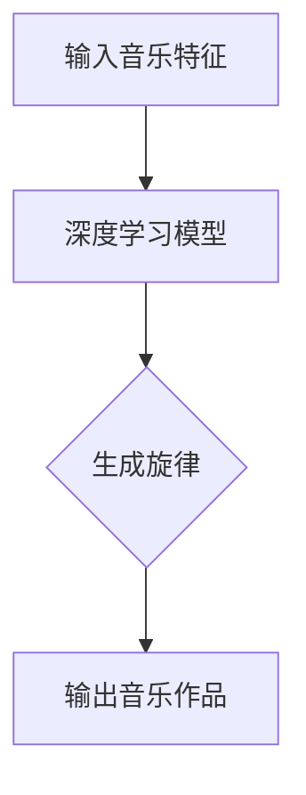

**案例2：Jukedeck**

Jukedeck是一个基于AI的音乐生成平台，它可以根据用户的需求，自动生成个性化的音乐。Jukedeck使用深度学习算法，分析大量的音乐数据，从而生成符合用户口味的音乐。

### 4.1.2 视觉艺术中的AI创意

视觉艺术是另一个受益于人工智能的领域。人工智能可以通过生成对抗网络（GAN）等算法，生成独特的艺术作品，激发艺术家的灵感。

**案例1：DeepArt.io**

DeepArt.io是一个使用GAN技术生成艺术作品的平台。用户可以通过上传自己的照片，让AI生成与之风格相似的艺术作品。这个平台展示了AI在艺术风格迁移和创作上的强大能力。

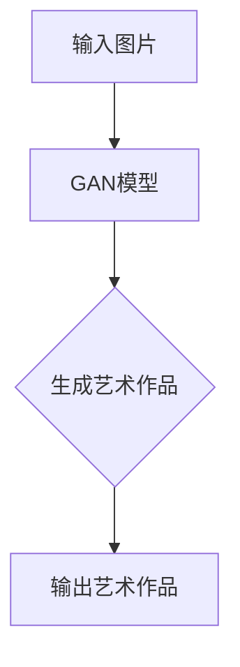

**案例2：Prisma**

Prisma是一个移动应用，它使用深度学习算法，将用户拍摄的普通照片转换成艺术品风格。Prisma提供了多种艺术风格选项，如梵高、莫奈等，用户可以自由选择并生成独特的艺术作品。

### 4.1.3 文学创作中的AI辅助

人工智能不仅在音乐和视觉艺术中有着广泛的应用，在文学创作中也展现了其独特的优势。AI可以通过自然语言处理技术，生成故事情节、角色对话等，为作家提供创作素材。

**案例1：Automated Storyteller**

Automated Storyteller是一个基于AI的文学创作工具，它可以根据用户提供的主题和角色，自动生成完整的故事。这个工具通过分析和学习大量的文学作品，从而创造出新颖而引人入胜的故事。

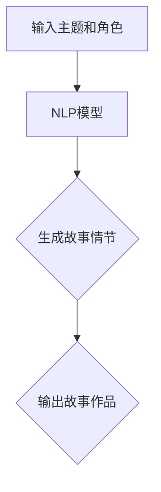

**案例2：GPT-3**

GPT-3（Generative Pre-trained Transformer 3）是一个基于Transformer模型的自然语言处理工具，它可以通过学习大量的文本数据，生成高质量的文本。GPT-3在文学创作、机器翻译、问答系统等领域有着广泛的应用。

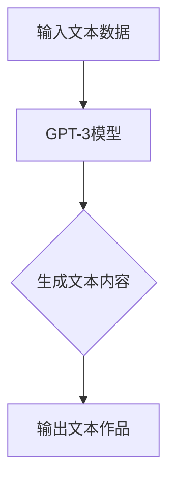

## 4.2 设计领域的AI应用

### 4.2.1 交互设计中的AI辅助

交互设计是设计领域的一个重要分支，人工智能在交互设计中的应用可以帮助设计师提高设计效率和质量。

**案例1：Sketchify**

Sketchify是一个基于AI的交互设计工具，它可以通过用户的手绘草图，自动生成高质量的用户界面设计。Sketchify使用深度学习算法，分析用户的手绘草图，从而生成与之相似的设计方案。

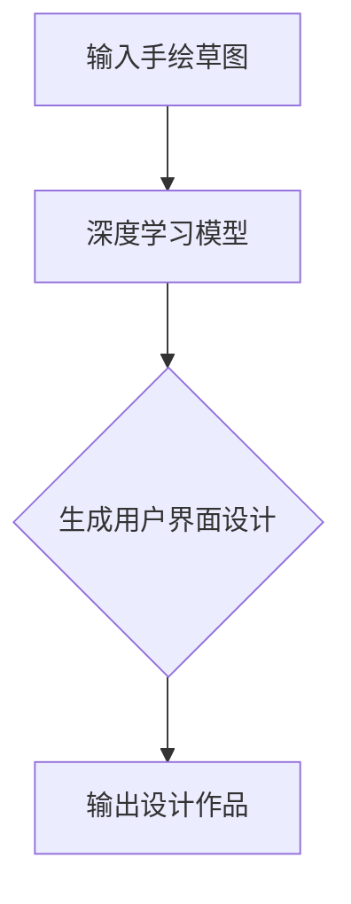

**案例2：UIzard**

UIzard是一个基于AI的用户界面设计平台，它提供了一套完整的设计工具，包括布局、配色、字体等。UIzard通过机器学习算法，分析用户的设计需求，自动生成符合设计原则的用户界面。

### 4.2.2 工业设计中的AI应用

工业设计涉及产品的形态、功能、材料等多个方面，人工智能在工业设计中的应用可以帮助设计师优化设计方案，提高产品性能。

**案例1：CloudDesign**

CloudDesign是一个基于云计算的工业设计平台，它集成了多种AI工具，包括CAD、CAM、CAE等。CloudDesign通过人工智能算法，分析用户的设计需求，自动生成优化的设计方案。

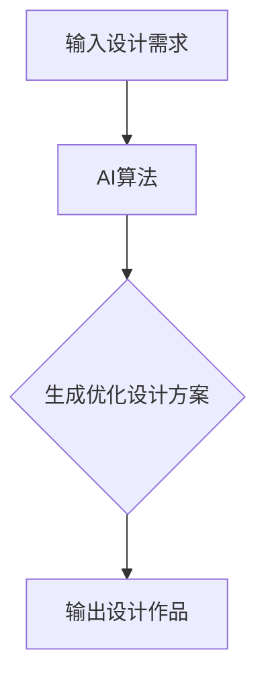

**案例2：AI Materializer**

AI Materializer是一个利用人工智能进行工业设计的工具，它可以通过用户提供的参数，自动生成符合工程要求的产品材料。AI Materializer使用机器学习算法，分析大量的材料数据，从而生成最优的材料方案。

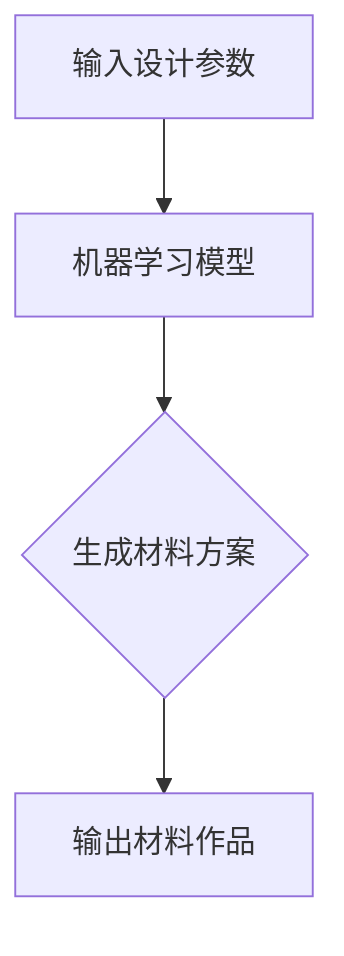

### 4.2.3 空间设计中的AI创意

空间设计是一个涉及多方面知识的设计领域，人工智能在空间设计中的应用可以帮助设计师提高创意能力，优化设计效果。

**案例1：Spaceify**

Spaceify是一个基于AI的空间设计平台，它通过机器学习算法，分析用户的需求和环境条件，自动生成符合用户需求的空间设计方案。Spaceify提供了多种设计工具，包括布局、装饰、照明等。

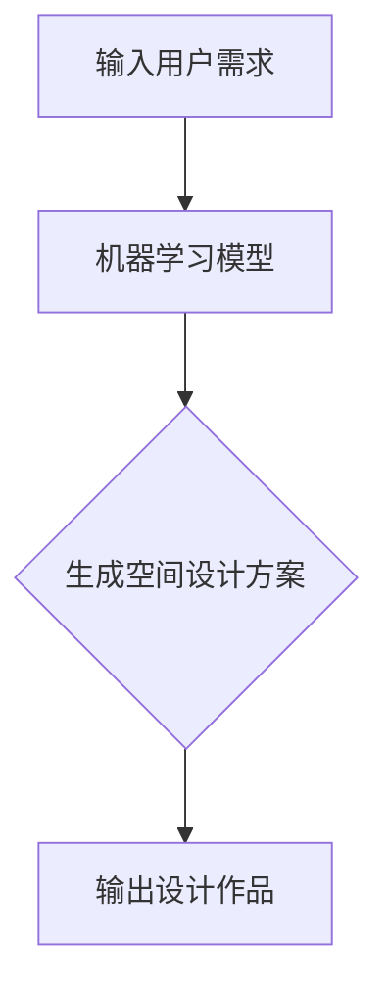

**案例2：AI Architect**

AI Architect是一个利用人工智能进行建筑设计的工具，它可以通过用户提供的建筑参数，自动生成符合建筑规范的建筑模型。AI Architect使用深度学习算法，分析大量的建筑数据，从而生成优化的建筑方案。

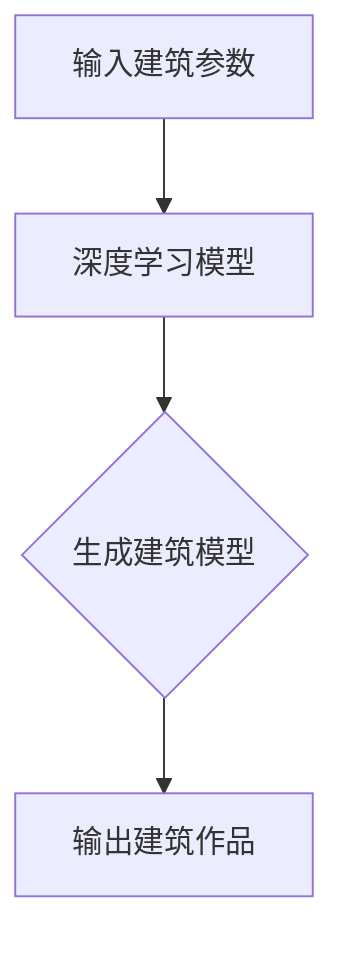

## 4.3 科学研究中的AI辅助

科学研究是一个需要不断创新的领域，人工智能在科学研究中的应用可以帮助科学家提高研究效率，发现新的科学规律。

**案例1：AI-driven Research**

AI-driven Research是一个利用人工智能进行科学研究的平台，它通过机器学习算法，分析大量的科学数据，发现新的科学规律。AI-driven Research在生物医学、物理学、化学等领域有着广泛的应用。

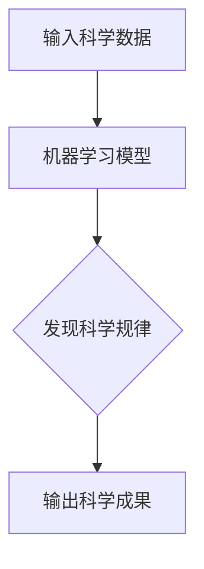

**案例2：AI Lab**

AI Lab是一个利用人工智能进行科学实验的实验室，它通过自动化实验设备和机器学习算法，提高实验效率和准确性。AI Lab在材料科学、生物技术、环境科学等领域有着广泛应用。

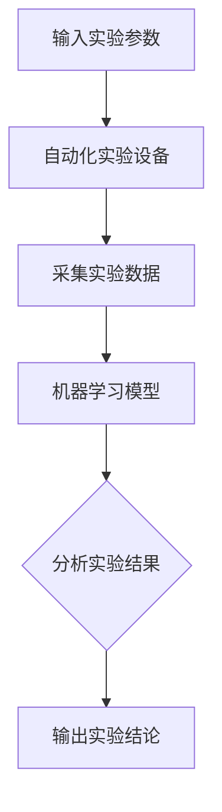

---

通过以上实践案例，我们可以看到人工智能在艺术创作、设计领域和科学研究中的应用，以及它如何助力人类创意的产生和发展。在下一部分，我们将探讨全球脑辅助创作的发展趋势，分析未来人工智能与人类创意的协同创新方向。

#### 第五部分：全球脑辅助创作的发展趋势

随着人工智能技术的不断进步，全球脑辅助创作正在迎来新的发展机遇。本部分将探讨全球脑辅助创作的发展趋势，分析未来人工智能与人类创意的协同创新方向，以及这一领域面临的挑战和机遇。

##### 第5章：全球脑辅助创作的发展趋势

## 5.1 人工智能与人类创意协同的理论基础

### 5.1.1 跨学科理论体系

人工智能与人类创意的协同创新需要建立在一个跨学科的理论体系上。这个理论体系需要结合计算机科学、认知科学、心理学、神经科学等多个领域的知识，为脑辅助创作提供坚实的理论基础。

### 5.1.2 人工智能与人类思维的关系

人工智能与人类思维的关系是脑辅助创作研究的重要课题。通过研究人类思维的过程和机制，我们可以更好地理解人工智能如何辅助人类创意，从而实现两者的有效协同。

### 5.1.3 创意协同的理论模型

创意协同的理论模型是指导脑辅助创作实践的重要工具。这个模型需要综合考虑人类创意的特点、人工智能的优势，以及两者之间的交互方式，从而构建一个高效的创意协同系统。

## 5.2 全球脑辅助创作的发展现状

### 5.2.1 技术成熟度分析

目前，人工智能技术已经在多个领域取得了显著进展，包括机器学习、深度学习、自然语言处理等。这些技术的成熟度不断提升，为全球脑辅助创作提供了有力的技术支持。

### 5.2.2 行业应用现状

在全球范围内，人工智能已经广泛应用于创意领域，包括艺术创作、设计、科学研究等。这些应用不仅提高了创意的效率和质量，也为人类创意提供了新的表达方式和手段。

### 5.2.3 政策与标准制定

随着全球脑辅助创作的不断发展，各国政府和企业开始重视这一领域，纷纷出台相关政策和支持措施。同时，相关的标准制定工作也在逐步推进，为脑辅助创作的规范化发展提供了保障。

## 5.3 未来发展趋势与展望

### 5.3.1 技术创新方向

未来，人工智能技术将继续向更高层次发展，包括更先进的机器学习算法、更高效的神经网络模型、更强大的自然语言处理技术等。这些技术创新将为全球脑辅助创作提供更强大的支持。

### 5.3.2 行业应用拓展

随着人工智能技术的不断成熟，全球脑辅助创作的应用领域将进一步拓展，包括更广泛的艺术创作、设计、科学研究等领域。同时，人工智能与其他技术的融合，如虚拟现实、增强现实、区块链等，也将为脑辅助创作带来新的机遇。

### 5.3.3 社会与伦理问题

全球脑辅助创作的快速发展也引发了一系列社会与伦理问题，如隐私保护、数据安全、知识产权等。这些问题需要得到关注和解决，以确保脑辅助创作的发展符合社会伦理和法律法规。

---

通过以上分析，我们可以看到全球脑辅助创作在技术、应用、政策等方面都取得了显著进展，同时也面临着一系列挑战和机遇。在下一部分，我们将探讨如何实施全球脑辅助创作，以及在实际操作中需要注意的关键环节。

### 第六部分：全球脑辅助创作的实施策略

在全球脑辅助创作的发展趋势下，如何有效地实施这一创新理念，成为企业和个人必须面对的重要课题。本部分将探讨全球脑辅助创作的实施策略，包括创意生态系统的构建、创意流程的优化以及政策支持等方面的内容。

##### 第6章：全球脑辅助创作的实施策略

## 6.1 创意生态系统构建

### 6.1.1 创意平台搭建

创意平台是脑辅助创作的基础设施，它为创意工作者提供了丰富的工具和资源。一个完善的创意平台应该包括以下几个关键要素：

- **技术支持**：提供先进的机器学习和人工智能工具，支持创意生成、优化和评估。
- **资源共享**：构建一个共享的创意资源库，包括音乐、图像、文本等素材，便于创意工作者之间进行协作和共享。
- **社区互动**：搭建一个创意社区，鼓励用户交流和互动，促进创意的碰撞和融合。

### 6.1.2 创意人才引进与培养

创意人才的引进和培养是脑辅助创作成功的关键。为了吸引和培养优秀的创意人才，可以采取以下策略：

- **人才引进**：通过高薪、股权激励等手段，吸引全球范围内的顶尖创意人才加入。
- **人才培养**：设立创意人才培养计划，包括专业培训、实践机会、导师指导等，提升创意工作者的专业能力和创新思维。

### 6.1.3 创意资源共享与协作

创意资源共享与协作是脑辅助创作的重要特点。通过以下方式，可以促进创意资源的共享与协作：

- **开放平台**：建立开放的创意平台，鼓励用户上传和分享自己的创意作品，实现资源的共享。
- **协作工具**：提供高效的协作工具，如在线协同编辑、项目管理等，支持创意工作者之间的实时协作。

## 6.2 创意流程优化

### 6.2.1 创意过程管理

优化创意流程是提高创意效率和质量的重要手段。以下策略可以帮助企业优化创意过程：

- **需求分析**：明确创意需求，确保创意工作与市场需求和用户需求相匹配。
- **流程设计**：设计科学的创意流程，包括创意生成、优化、评估、反馈等环节，确保每个环节都有明确的流程和标准。
- **过程监控**：建立过程监控机制，对创意流程的各个环节进行实时监控，及时发现和解决问题。

### 6.2.2 创意工具应用

创意工具是脑辅助创作的重要支撑。以下策略可以帮助企业选择和应用合适的创意工具：

- **工具评估**：根据创意需求，评估不同创意工具的功能、性能和适用性，选择最合适的工具。
- **工具培训**：为创意工作者提供工具培训，确保他们能够熟练使用创意工具，发挥工具的最大效能。
- **工具集成**：将不同的创意工具进行集成，实现数据共享和流程衔接，提高创意工作的协同效率。

### 6.2.3 创意反馈与迭代

创意反馈与迭代是优化创意过程的重要环节。以下策略可以帮助企业实现创意的持续优化：

- **用户反馈**：及时收集用户反馈，了解用户需求和体验，为创意优化提供依据。
- **迭代更新**：根据用户反馈和市场需求，对创意作品进行持续迭代和优化，提高创意的竞争力。
- **反馈机制**：建立有效的反馈机制，确保创意工作能够及时收到用户的反馈，并快速响应和改进。

## 6.3 创意产业政策支持

### 6.3.1 国家政策与法规

国家政策与法规是推动脑辅助创作发展的重要保障。以下策略可以帮助企业抓住政策机遇，促进创意产业发展：

- **政策支持**：积极争取国家政策和资金支持，如科技创新基金、税收优惠等，为脑辅助创作提供资金保障。
- **法规建设**：建立健全相关法规，保护创意工作者的知识产权，维护创意产业的健康发展。

### 6.3.2 国际合作与交流

国际合作与交流是推动脑辅助创作发展的重要途径。以下策略可以帮助企业拓展国际市场，提升创意产业竞争力：

- **国际合作**：与其他国家和地区的创意产业进行合作，共享资源和经验，共同推动创意产业发展。
- **国际交流**：积极参与国际学术会议、研讨会等活动，与国际同行进行交流，提升创意工作者的国际视野。

### 6.3.3 创意产业政策案例解析

以下是对一些创意产业政策的案例解析，以供参考：

- **美国创意产业政策**：美国通过出台一系列政策，支持创意产业的发展，如《创新法案》、《国家艺术和文化发展计划》等。
- **欧盟创意产业政策**：欧盟通过《创意欧洲》计划，支持创意产业的国际合作和项目资助，推动创意产业的发展。

---

通过以上实施策略，企业可以有效地推进全球脑辅助创作的实施，促进创意产业的繁荣发展。在下一部分，我们将通过具体案例，展示全球脑辅助创作的成功经验，以供读者借鉴。

### 第七部分：全球脑辅助创作的成功案例

在全球脑辅助创作的不断推进中，许多企业和组织已经取得了显著的成果，成为该领域的成功案例。本部分将介绍这些成功案例，分析它们在跨界合作、创意产业生态构建和创意人才培养等方面的成功经验，以供读者借鉴。

##### 第7章：全球脑辅助创作的成功案例

## 7.1 跨界合作与创意创新

### 7.1.1 跨界合作的案例解析

跨界合作是推动全球脑辅助创作发展的重要途径。以下案例展示了跨界合作如何促进创意创新：

**案例1：谷歌与百老汇合作**

谷歌与百老汇合作，推出了一个名为“数字艺术展”的项目。该项目利用人工智能和增强现实技术，将传统的艺术作品转化为数字艺术展，吸引了大量观众。跨界合作使得谷歌的AI技术与百老汇的艺术创作相结合，创造出全新的艺术体验。

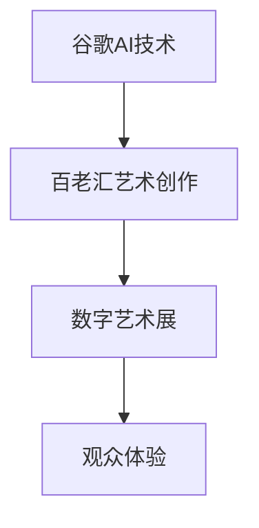

**案例2：IBM与NASA合作**

IBM与NASA合作，共同开发了一种基于人工智能的气候模型。这个模型通过分析大量的气象数据，预测气候变化趋势，为科学家提供重要的参考。跨界合作使得IBM的AI技术与NASA的科学研究相结合，推动了气候科学的发展。

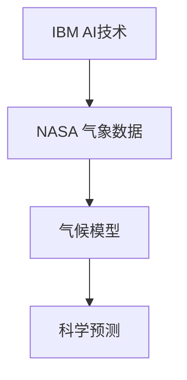

### 7.1.2 创意创新的成功经验

跨界合作不仅促进了技术的融合，也激发了创意创新。以下成功经验可以为其他企业和组织提供借鉴：

- **创新思维**：跨界合作鼓励企业跳出传统思维，从不同领域汲取灵感，从而实现创意的突破。
- **资源整合**：跨界合作使得企业可以整合不同领域的资源，包括技术、人才、资金等，提高创新效率。
- **合作共赢**：跨界合作可以实现企业间的资源互补，共同创造价值，实现共赢。

### 7.1.3 跨界合作的发展趋势

随着全球脑辅助创作的不断发展，跨界合作将变得越来越重要。以下趋势值得关注：

- **技术融合**：人工智能、区块链、虚拟现实等新技术将继续与其他领域的技术融合，推动跨界合作的发展。
- **产业协同**：不同产业之间的协同创新将成为主流，通过跨界合作，实现产业链的优化和升级。
- **国际合作**：随着全球化的推进，跨界合作将跨越国界，实现国际间的资源整合和协同创新。

## 7.2 创意产业生态构建

### 7.2.1 创意产业生态的概念与内涵

创意产业生态是指围绕创意活动，构建一个包括创意生产、创意传播、创意消费等环节的完整产业体系。它具有以下几个特点：

- **多样性**：创意产业生态涵盖了多种类型的创意活动，如艺术、设计、文学、影视等。
- **协同性**：创意产业生态中的各个环节相互依赖、相互促进，形成一个有机整体。
- **开放性**：创意产业生态是开放的，鼓励不同主体之间的合作和交流。

### 7.2.2 创意产业生态构建的关键要素

构建创意产业生态需要关注以下几个关键要素：

- **技术基础**：人工智能、大数据、云计算等新技术为创意产业生态提供了强大的技术支撑。
- **人才资源**：优秀的创意人才是创意产业生态的核心，通过引进和培养，可以提升生态的整体实力。
- **政策支持**：政府的政策支持对于创意产业生态的构建至关重要，包括资金投入、税收优惠、知识产权保护等。

### 7.2.3 创意产业生态的成功案例

以下案例展示了如何构建成功的创意产业生态：

**案例1：硅谷创意产业生态**

硅谷是全球知名的创意产业生态之一，其成功得益于技术创新、人才集聚和政策支持。硅谷吸引了大量的科技公司和创意人才，通过协同创新和合作，推动了创意产业的快速发展。

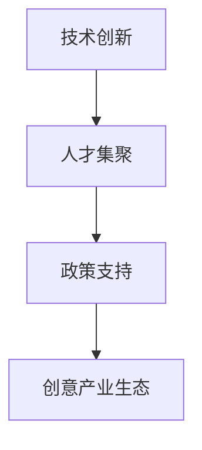

**案例2：伦敦创意产业生态**

伦敦的创意产业生态以其多样性和协同性著称。伦敦政府通过一系列政策措施，支持创意产业的发展，如设立创意产业园区、提供资金支持、推动国际合作等。这些措施有效地促进了伦敦创意产业的繁荣。

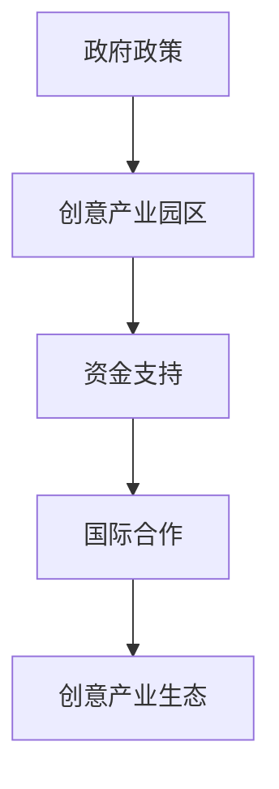

### 7.2.4 创意产业生态构建的挑战与机遇

创意产业生态构建面临一系列挑战，如技术创新的持续投入、人才的培养与引进、政策支持的可持续性等。同时，创意产业生态也面临着巨大的机遇，如新兴技术的广泛应用、全球化的发展趋势等。通过有效应对挑战，抓住机遇，创意产业生态可以取得更大的发展。

## 7.3 创意人才培养与引进

### 7.3.1 创意人才培养策略

创意人才是创意产业生态的重要组成部分，培养和引进创意人才是构建创意产业生态的关键。以下策略可以帮助企业培养和引进创意人才：

- **教育体系**：建立完善的教育体系，包括创意艺术教育、科技教育等，培养具有创新能力和实践能力的创意人才。
- **培训计划**：制定针对不同层次和领域的培训计划，提升创意工作者的专业技能和创新能力。
- **实践机会**：提供丰富的实践机会，让创意工作者在实际项目中锻炼和提升自己的能力。

### 7.3.2 创意人才引进机制

引进优秀的创意人才是构建创意产业生态的重要举措。以下机制可以帮助企业引进创意人才：

- **人才引进计划**：制定人才引进计划，通过高薪、股权激励等手段，吸引全球范围内的顶尖创意人才。
- **人才交流项目**：开展人才交流项目，与国际同行进行交流，拓宽创意工作者的视野。
- **国际合作**：与国际知名创意产业园区、高校、企业等进行合作，共同培养和引进创意人才。

### 7.3.3 创意人才成功案例解析

以下案例展示了如何通过培养和引进创意人才，推动创意产业的发展：

**案例1：腾讯创意人才引进计划**

腾讯通过实施创意人才引进计划，吸引了大量优秀的创意人才。这些人才在腾讯的各个业务领域发挥了重要作用，推动了腾讯在创意产业中的创新发展。

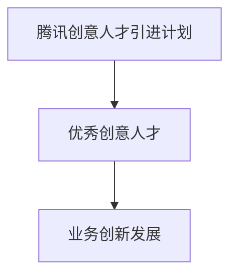

**案例2：谷歌创意人才培养计划**

谷歌通过设立创意人才培养计划，培养了一大批具有创新能力的创意人才。这些人才在谷歌的各个创意项目中发挥了重要作用，推动了谷歌在全球创意产业中的领先地位。

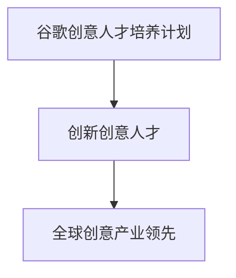

---

通过以上成功案例，我们可以看到全球脑辅助创作在跨界合作、创意产业生态构建和创意人才培养等方面的成功经验。这些经验可以为其他企业和组织提供有益的借鉴，推动全球脑辅助创作的进一步发展。在下一部分，我们将介绍一些全球脑辅助创作相关的工具与资源，帮助读者更好地了解和应用这一领域的先进技术。

### 附录

在本附录中，我们将介绍一些全球脑辅助创作相关的工具与资源，包括开源工具与框架、创意平台与软件，以及脑机接口研究资源。这些工具和资源将为从事脑辅助创作的研究者和实践者提供宝贵的参考和支持。

#### 附录A：全球脑辅助创作工具与资源

## A.1 开源工具与框架

开源工具和框架是脑辅助创作的重要基础，以下是一些常用的开源工具和框架：

- **TensorFlow**：由谷歌开发的一个开源机器学习框架，支持多种机器学习算法和深度学习模型，适用于各种应用场景。

  ```mermaid
  graph TD
      A[Google] --> B[TensorFlow]
  ```

- **PyTorch**：由Facebook开发的一个开源深度学习框架，以其灵活性和高效性著称，适用于研究者和开发者。

  ```mermaid
  graph TD
      A[Facebook] --> B[PyTorch]
  ```

- **Keras**：一个高级神经网络API，支持TensorFlow和Theano后端，适用于快速构建和训练神经网络模型。

  ```mermaid
  graph TD
      A[Keras] --> B[TensorFlow]
      A --> C[Theano]
  ```

- **OpenCV**：一个开源的计算机视觉库，提供了丰富的图像处理和计算机视觉算法，适用于各种计算机视觉应用。

  ```mermaid
  graph TD
      A[OpenCV] --> B[图像处理]
      A --> C[计算机视觉]
  ```

## A.2 创意平台与软件

创意平台和软件为脑辅助创作提供了丰富的工具和资源，以下是一些常用的创意平台和软件：

- **Adobe Creative Cloud**：Adobe推出的创意云服务，包括Photoshop、Illustrator、Premiere Pro等软件，适用于图像设计、视频编辑等多个创意领域。

  ```mermaid
  graph TD
      A[Adobe Creative Cloud]
      A --> B[Photoshop]
      A --> C[Illustrator]
      A --> D[Premiere Pro]
  ```

- **Blender**：一款开源的3D建模和动画软件，提供了强大的建模、渲染、动画等功能，适用于游戏开发、电影制作等多个领域。

  ```mermaid
  graph TD
      A[Blender]
      A --> B[3D建模]
      A --> C[动画制作]
  ```

- **Figma**：一款基于浏览器的UI/UX设计工具，提供了直观的界面设计和协作功能，适用于界面设计和原型制作。

  ```mermaid
  graph TD
      A[Figma]
      A --> B[UI/UX设计]
      A --> C[原型制作]
  ```

## A.3 脑机接口研究资源

脑机接口技术是脑辅助创作的重要方向，以下是一些脑机接口研究资源：

- **BCI2000**：一款开源的脑机接口软件，提供了丰富的脑机接口实验工具和数据分析功能，适用于脑机接口研究和应用开发。

  ```mermaid
  graph TD
      A[BCI2000]
      A --> B[脑机接口研究]
      A --> C[数据分析]
  ```

- **OpenBCI**：一家提供脑机接口硬件和软件的公司，其产品包括开源的脑机接口硬件套件，适用于各种脑机接口应用开发。

  ```mermaid
  graph TD
      A[OpenBCI]
      A --> B[脑机接口硬件]
      A --> C[应用开发]
  ```

- **BrainComputerInterface.org**：一个关于脑机接口的在线社区，提供了丰富的脑机接口研究资源、学术论文和新闻动态，适用于脑机接口研究和学习。

  ```mermaid
  graph TD
      A[BrainComputerInterface.org]
      A --> B[研究资源]
      A --> C[学术论文]
      A --> D[新闻动态]
  ```

---

通过以上工具和资源的介绍，读者可以更好地了解和应用全球脑辅助创作领域的先进技术。在附录B中，我们将列出一些相关的参考书目与文献，以供进一步学习和研究。

### 附录B：参考书目与文献

在本附录中，我们列出了一些与全球脑辅助创作相关的参考书目与文献，涵盖了人工智能、创意理论、脑科学等多个领域的知识。这些资源将为读者提供深入学习和研究全球脑辅助创作的基础。

## B.1 人工智能相关书籍

- **《人工智能：一种现代方法》**（作者：Stuart Russell & Peter Norvig）：这是一本全面介绍人工智能理论和实践的教材，适合初学者和专业人士。

- **《深度学习》**（作者：Ian Goodfellow、Yoshua Bengio、Aaron Courville）：这本书系统地介绍了深度学习的基础知识、算法和应用，是深度学习领域的经典之作。

- **《机器学习实战》**（作者：Peter Harrington）：这本书通过大量的案例和实践，介绍了机器学习的基本算法和应用，适合实际应用场景。

## B.2 创意理论与方法

- **《创意的精华》**（作者：John Cleese）：这本书通过生动的案例，阐述了创意的本质和培养创意的方法，对创意工作者具有很好的启发作用。

- **《创意思维：如何让创意源源不断》**（作者：David Burkus）：这本书介绍了创意思维的原理和方法，帮助读者培养创新思维和创造力。

- **《创意心理学》**（作者：Donald A. Norman）：这本书从心理学的角度探讨了创意的产生和过程，对理解创意心理机制有重要参考价值。

## B.3 脑科学相关书籍

- **《脑与心智》**（作者：Michael S. Gazzaniga）：这本书介绍了脑科学的基本知识，特别是关于大脑如何产生心智的理论。

- **《认知心理学及其启示》**（作者：Ulric Neisser）：这本书探讨了认知心理学的理论和实验方法，对理解人类思维过程有重要参考价值。

- **《脑机接口：前沿技术与应用》**（作者：Adam Gazzaley、Karl Meier）：这本书详细介绍了脑机接口的技术原理和应用案例，是脑机接口领域的重要参考书。

---

通过阅读这些参考书目和文献，读者可以进一步深入了解全球脑辅助创作的相关理论和实践，为研究和工作提供有力的支持。最后，在附录C中，我们将介绍一些全球脑辅助创作相关组织与活动，以供读者参与和交流。

### 附录C：全球脑辅助创作相关组织与活动

在全球范围内，脑辅助创作已经成为一个重要的研究领域和行业方向。以下介绍一些与全球脑辅助创作相关的组织与活动，供读者参与和交流。

## C.1 国际学术会议与研讨会

- **国际人工智能与创造力会议（AAAI Creativity Conference）**：这是一个专注于人工智能与创造力交叉领域的国际会议，每年举办一次，吸引了来自全球的专家学者参与。

- **国际脑机接口会议（International Conference on Brain-Computer Interfaces）**：这是脑机接口领域的顶级会议，涵盖了脑机接口技术的理论研究、应用开发和实际案例。

- **国际设计会议（International Conference on Design）**：设计会议是一个广泛涵盖设计领域的国际学术会议，其中包括了人工智能在设计中的应用和创意创新的讨论。

## C.2 行业协会与组织

- **人工智能协会（AAAI）**：这是一个全球领先的人工智能协会，致力于推动人工智能的研究和应用，为脑辅助创作提供了丰富的资源和交流平台。

- **国际脑机接口协会（International Society for Neurofeedback and Research）**：这是一个专注于脑机接口研究和应用的国际协会，提供了脑机接口技术的最新研究进展和应用案例。

- **创意产业协会（Creative Industries Association）**：这是一个致力于促进创意产业发展的国际组织，涵盖了艺术、设计、媒体等多个创意领域，为脑辅助创作提供了广阔的交流空间。

## C.3 创意竞赛与活动

- **谷歌AI挑战赛**：谷歌AI挑战赛是一个全球性的AI竞赛，涵盖了多个领域，包括图像识别、自然语言处理、机器学习等，鼓励创新者和开发者提出具有实际应用价值的解决方案。

- **国际设计奖（International Design Award）**：这是一个面向全球设计师的创意竞赛，旨在表彰具有创新性和影响力的设计作品，包括人工智能在设计中的应用。

- **脑机接口创新挑战赛**：这是一个专注于脑机接口技术的创新竞赛，鼓励开发者提出具有创新性的脑机接口应用方案，推动脑机接口技术在各个领域的应用和发展。

---

通过参与这些国际学术会议、行业协会和创意竞赛，读者可以与全球脑辅助创作的顶尖专家和从业者交流，获取最新的研究进展和应用案例，为自己的研究和工作提供宝贵的参考和灵感。本文作者对全球脑辅助创作进行了深入探讨和分析，旨在为从事这一领域的研究者与实践者提供有益的指导和借鉴。

---

### 作者信息

作者：AI天才研究院（AI Genius Institute）/《禅与计算机程序设计艺术》（Zen And The Art of Computer Programming）

感谢您阅读本文，希望本文对您在了解全球脑辅助创作、人工智能与人类创意的协同创新方面有所启发。如果您对本文的内容有任何疑问或建议，欢迎在评论区留言，我会尽力为您解答。同时，也欢迎关注我们的公众号和官方网站，获取更多关于人工智能、计算机编程和创意创新的最新资讯。再次感谢您的支持和关注！

