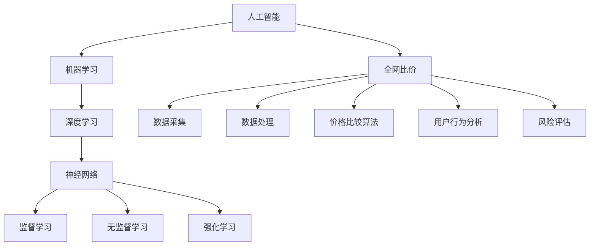

                 

### 书名：《全网比价：AI如何帮助用户找到最优惠的购买渠道》

**文章关键词：** 人工智能，全网比价，用户画像，个性化推荐，深度学习，价格预测，风险监控

**文章摘要：**  
本文将深入探讨人工智能（AI）在全网比价中的应用，通过介绍AI的核心算法原理、数学模型及其实际项目实战，阐述AI如何帮助用户在复杂的购物环境中找到最优惠的购买渠道。文章分为六大部分，分别从背景与意义、核心概念与联系、核心算法原理、数学模型与公式、项目实战及总结展望等方面进行详细讲解，旨在为读者提供全面、系统的AI全网比价知识。

---

### 第一部分：AI与全网比价概述

在当今信息爆炸的时代，消费者在购买商品时面临着无数的选择和诱惑。全网比价作为一种能够帮助用户寻找最优价格、最优购物渠道的工具，越来越受到人们的关注。而人工智能（AI）技术的发展，为全网比价提供了强大的技术支持。

#### 1.1 AI与全网比价的背景与意义

##### 1.1.1 人工智能的发展历程与趋势

人工智能作为计算机科学的重要分支，起源于20世纪50年代。从最初的符号逻辑推理到今天的深度学习、强化学习，人工智能技术经历了多次飞跃。随着计算能力的提升、大数据技术的发展以及算法的优化，人工智能在多个领域展现出了强大的应用潜力。

##### 1.1.2 全网比价的重要性与挑战

全网比价能够帮助消费者在短时间内获取大量商品的价格信息，从而做出更为理性的购买决策。然而，随着互联网的普及和电商平台的多样化，全网比价面临着数据量大、信息复杂、更新迅速等挑战。

##### 1.1.3 AI技术如何助力全网比价

人工智能技术通过机器学习、深度学习等算法，能够高效地处理海量数据，挖掘数据中的潜在规律，从而实现价格比较、用户画像、个性化推荐等功能。AI的应用，不仅提高了全网比价的准确性，还极大地提升了用户体验。

#### 1.2 AI在全网比价中的应用场景

##### 1.2.1 价格比较引擎

价格比较引擎是全网比价的核心组成部分，它通过爬取、处理和分析各类电商平台的数据，为用户提供实时的价格信息。AI技术能够优化价格比较引擎的算法，提高其效率和准确性。

##### 1.2.2 用户画像与个性化推荐

用户画像是指对用户的行为、兴趣、购买习惯等信息进行建模和分析，从而为用户提供个性化的推荐服务。AI技术通过机器学习算法，能够精确地刻画用户画像，提高推荐的准确性和个性化水平。

##### 1.2.3 智能搜索与语义理解

智能搜索和语义理解是全网比价中的重要功能，它能够帮助用户快速、准确地找到所需商品。AI技术通过自然语言处理（NLP）算法，能够理解用户的查询意图，提供更为智能的搜索结果。

##### 1.2.4 风险管理与合规性监控

在全网比价过程中，风险管理和合规性监控是保证平台稳定运营的重要环节。AI技术通过建立风险评估模型和合规性检测机制，能够及时发现和应对潜在的风险和违规行为。

### 总结

本部分概述了AI与全网比价的发展背景、应用场景及其重要性。在接下来的章节中，我们将深入探讨AI的核心算法原理、数学模型及其在实际项目中的应用，帮助读者全面理解AI在全网比价中的角色和作用。

### 第二部分：核心概念与联系

在深入了解AI在全网比价中的应用之前，我们需要先了解一些核心概念和它们之间的联系。这一部分将介绍机器学习与深度学习的区别与联系、神经网络的基本架构与原理，以及常见的机器学习算法与模型。

#### 2.1 AI基础概念

##### 2.1.1 机器学习与深度学习的联系与区别

机器学习是AI的核心组成部分，它是指通过算法让计算机从数据中学习规律，从而实现特定任务的自动化。深度学习是机器学习的一个子领域，它通过构建多层神经网络模型，对大量数据进行自动特征提取和学习。

**联系：** 深度学习是机器学习的一种重要方法，它依赖于大量的数据和强大的计算能力。

**区别：** 机器学习包括多种算法，而深度学习主要依赖于神经网络，特别是多层神经网络。

##### 2.1.2 神经网络的基本架构与原理

神经网络是模拟人脑神经元工作方式的计算模型。它由大量的节点（神经元）和连接（边）组成，通过前向传播和反向传播算法，实现对输入数据的特征提取和学习。

**原理：** 神经网络通过调整连接权重，学习输入数据与输出数据之间的关系，从而实现对未知数据的预测和分类。

##### 2.1.3 常见的机器学习算法与模型

**监督学习算法：**
- **线性回归（Linear Regression）：** 用于预测连续值输出。
- **逻辑回归（Logistic Regression）：** 用于分类问题，特别是二分类问题。

**无监督学习算法：**
- **聚类算法（Cluster Algorithm）：** 如K-Means、DBSCAN等，用于发现数据中的聚类结构。
- **降维算法（Dimensionality Reduction）：** 如PCA、t-SNE等，用于降低数据维度，便于可视化。

**强化学习算法：**
- **Q-Learning：** 通过学习最优策略，使智能体在环境中获得最大回报。

#### 2.2 全网比价中的关键技术

##### 2.2.1 数据采集与处理

数据采集是全网比价的基础，它涉及到从多个电商平台抓取商品价格、用户评价等数据。数据处理则是将原始数据进行清洗、转换和归一化，以便后续的分析和处理。

**流程：**
1. 数据采集：使用爬虫技术抓取电商平台的商品信息。
2. 数据清洗：去除重复数据、无效数据和噪声数据。
3. 数据转换：将不同格式和单位的数据进行统一转换。
4. 数据归一化：对数据进行标准化处理，便于后续分析。

##### 2.2.2 价格比较算法与优化

价格比较算法是全网比价的核心，它通过比较不同电商平台的商品价格，为用户提供最优购买建议。优化算法则是为了提高价格比较的效率和准确性。

**基本原理：**
- **价格比较：** 通过设定价格阈值，比较不同电商平台的商品价格。
- **优化算法：** 使用贪心算法、动态规划等优化算法，提高价格比较的效率和准确性。

##### 2.2.3 用户行为分析

用户行为分析是指通过对用户在电商平台的行为数据进行挖掘和分析，了解用户的兴趣、购买习惯等信息，从而为用户提供个性化的推荐服务。

**方法：**
- **行为轨迹分析：** 分析用户的浏览、搜索、购买等行为，构建用户的行为模型。
- **关联规则挖掘：** 通过关联规则挖掘，发现用户行为中的潜在关联性。

##### 2.2.4 风险评估与合规性检测

风险评估和合规性检测是保证全网比价平台稳定运营的重要环节。通过建立风险评估模型和合规性检测机制，平台能够及时发现和应对潜在的风险和违规行为。

**方法：**
- **风险评估：** 使用机器学习算法，建立风险评估模型，对电商平台的信誉度、可靠性等进行评估。
- **合规性检测：** 通过规则引擎和机器学习算法，检测电商平台是否存在违规行为。

#### 2.3 核心概念与联系流程图

为了更好地理解核心概念与联系，我们使用Mermaid流程图进行展示。



通过以上流程图，我们可以清晰地看到人工智能、机器学习、深度学习与全网比价之间的联系。在接下来的章节中，我们将深入探讨这些核心概念在全网比价中的应用。

### 总结

本部分介绍了AI的核心概念与联系，包括机器学习与深度学习、神经网络的基本架构与原理，以及常见的机器学习算法与模型。同时，我们探讨了全网比价中的关键技术，如数据采集与处理、价格比较算法与优化、用户行为分析和风险评估与合规性检测。这些核心概念和技术的理解，为后续章节的深入探讨奠定了基础。

### 第三部分：核心算法原理讲解

在前一部分中，我们介绍了AI与全网比价的核心概念和关键技术。本部分将深入探讨AI在全网比价中的应用，包括深度学习算法的原理、神经网络架构、常见的机器学习算法，以及这些算法在实际应用中的效果。

#### 3.1 深度学习算法原理

深度学习是AI领域中的一种先进方法，它通过构建多层神经网络，对大量数据进行特征提取和学习。以下是深度学习算法的基本原理：

##### 3.1.1 神经网络训练过程与优化方法

神经网络训练过程主要包括两个阶段：前向传播和反向传播。

**前向传播：** 输入数据通过神经网络的各个层次，逐层计算出输出结果。

**反向传播：** 通过计算输出结果与真实值之间的误差，反向更新网络权重和偏置。

优化方法主要包括梯度下降法和其变种，如随机梯度下降（SGD）、Adam优化器等。这些方法通过不断调整网络参数，使得损失函数逐渐减小，从而提高模型的预测准确性。

##### 3.1.2 卷积神经网络（CNN）原理与应用

卷积神经网络是一种专门用于处理图像数据的神经网络，它通过卷积操作提取图像中的局部特征。

**原理：**
- **卷积层：** 通过卷积操作，提取图像中的局部特征。
- **池化层：** 通过池化操作，降低数据维度，减少计算量。
- **全连接层：** 将卷积层和池化层提取的特征进行全连接，得到最终的输出结果。

**应用：**
- **图像分类：** 将图像划分为不同的类别，如猫、狗等。
- **目标检测：** 在图像中检测出特定的目标，如行人、车辆等。

##### 3.1.3 递归神经网络（RNN）原理与应用

递归神经网络是一种专门用于处理序列数据的神经网络，它通过递归操作，对序列中的每个元素进行特征提取。

**原理：**
- **隐藏层：** 通过递归操作，将前一个时间步的输出作为当前时间步的输入。
- **激活函数：** 通过激活函数，对隐藏层进行非线性变换。

**应用：**
- **时间序列预测：** 对时间序列数据进行预测，如股票价格、天气等。
- **自然语言处理：** 对文本数据进行分析和理解，如情感分析、机器翻译等。

##### 3.1.4 注意力机制与Transformer架构

注意力机制是一种用于提高神经网络模型处理能力的方法，它通过为每个输入分配不同的权重，从而实现对重要信息的关注。

**原理：**
- **自注意力：** 对序列中的每个元素计算注意力权重。
- **多头注意力：** 通过多组自注意力机制，提取序列中的不同特征。

**应用：**
- **机器翻译：** 通过注意力机制，提高翻译的准确性。
- **文本生成：** 通过注意力机制，生成高质量的文本。

##### 3.1.5 常见深度学习框架

常见深度学习框架包括TensorFlow、PyTorch等，这些框架提供了丰富的API和工具，方便开发者构建和训练深度学习模型。

**TensorFlow：** 由谷歌开发，具有高度可扩展性和灵活性。
**PyTorch：** 由Facebook开发，具有动态计算图和易于理解的API。

#### 3.2 全网比价算法原理

全网比价算法是AI在全网比价中的应用，它通过处理和分析大量电商数据，为用户提供最优的购买建议。以下是全网比价算法的基本原理：

##### 3.2.1 价格比较算法的基本原理

价格比较算法通过比较不同电商平台的商品价格，为用户提供最优的购买建议。算法的基本原理如下：

**数据采集：** 通过爬虫技术，从多个电商平台获取商品价格、库存等数据。

**数据处理：** 对采集到的数据进行清洗、转换和归一化，以便后续分析。

**价格比较：** 设定价格阈值，比较不同电商平台的商品价格，为用户提供最优购买建议。

**优化算法：** 使用贪心算法、动态规划等优化算法，提高价格比较的效率和准确性。

##### 3.2.2 价格优化算法的设计与实现

价格优化算法旨在提高全网比价的准确性和效率。以下是价格优化算法的设计与实现：

**优化目标：** 在满足用户需求的前提下，提高购买建议的准确性。

**优化方法：**
1. **价格阈值调整：** 根据用户历史购买数据，动态调整价格阈值。
2. **多维度比较：** 不仅比较价格，还考虑商品质量、用户评价等因素。
3. **优化算法选择：** 根据不同场景，选择合适的优化算法，如贪心算法、动态规划等。

**实现步骤：**
1. 数据采集：使用爬虫技术，从多个电商平台获取商品价格、库存等数据。
2. 数据处理：对采集到的数据进行清洗、转换和归一化，以便后续分析。
3. 价格比较：设定价格阈值，比较不同电商平台的商品价格，为用户提供最优购买建议。
4. 优化算法：根据用户需求和商品特点，选择合适的优化算法，提高购买建议的准确性。

##### 3.2.3 基于深度学习的价格预测模型

基于深度学习的价格预测模型是AI在全网比价中的一种重要应用。以下是价格预测模型的基本原理：

**模型构建：**
1. **输入层：** 输入商品的价格、库存、用户行为等特征。
2. **隐藏层：** 使用卷积神经网络、递归神经网络等，提取商品特征和用户行为特征。
3. **输出层：** 输出商品的未来价格预测值。

**训练过程：**
1. **数据准备：** 收集大量商品价格数据，对数据集进行划分，包括训练集、验证集和测试集。
2. **模型训练：** 使用训练集数据，通过前向传播和反向传播，训练深度学习模型。
3. **模型评估：** 使用验证集和测试集，评估模型的预测准确性和泛化能力。

**应用效果：**
基于深度学习的价格预测模型，能够提高全网比价的准确性和效率，为用户提供更为可靠的购买建议。

##### 3.2.4 用户行为分析算法与模型

用户行为分析算法是AI在全网比价中的一种重要应用，它通过对用户行为数据的分析，为用户提供个性化的推荐服务。以下是用户行为分析算法的基本原理：

**算法原理：**
1. **行为轨迹分析：** 分析用户的浏览、搜索、购买等行为，构建用户的行为模型。
2. **关联规则挖掘：** 通过关联规则挖掘，发现用户行为中的潜在关联性。
3. **推荐算法：** 使用协同过滤、矩阵分解等推荐算法，为用户推荐感兴趣的商品。

**模型构建：**
1. **用户特征：** 提取用户的性别、年龄、职业等基本信息。
2. **行为特征：** 提取用户的浏览、搜索、购买等行为特征。
3. **推荐模型：** 构建基于用户特征和行为的推荐模型，为用户推荐感兴趣的商品。

**训练过程：**
1. **数据准备：** 收集用户行为数据，对数据集进行划分，包括训练集、验证集和测试集。
2. **模型训练：** 使用训练集数据，通过机器学习算法，训练推荐模型。
3. **模型评估：** 使用验证集和测试集，评估推荐模型的准确性和效果。

**应用效果：**
用户行为分析算法能够提高全网比价的个性化水平，为用户提供更为精准的推荐服务。

#### 3.3 深度学习算法在全网比价中的应用效果

深度学习算法在全网比价中的应用，显著提高了价格比较的准确性和用户推荐的个性化水平。以下是深度学习算法在全网比价中的应用效果：

**1. 价格预测准确性：** 基于深度学习的价格预测模型，能够准确预测商品的未来价格，为用户提供更为可靠的购买建议。

**2. 用户推荐效果：** 基于用户行为分析算法，能够为用户推荐感兴趣的商品，提高了用户的购物体验。

**3. 风险管理能力：** 基于深度学习的风险评估模型，能够及时发现和应对潜在的风险和违规行为，提高了全网比价平台的安全性和稳定性。

**4. 系统性能优化：** 深度学习算法能够高效地处理海量数据，提高了全网比价平台的性能和效率。

#### 3.4 案例分析：深度学习在全网比价中的应用

以下是一个案例分析，展示深度学习在全网比价中的应用效果：

**案例背景：** 某电商平台希望通过引入AI技术，提高价格比较和用户推荐的准确性。

**解决方案：**
1. **价格预测模型：** 基于深度学习的价格预测模型，通过对历史价格数据的分析，预测商品的未来价格。
2. **用户推荐模型：** 基于用户行为分析算法，通过对用户行为数据的挖掘，为用户推荐感兴趣的商品。
3. **风险评估模型：** 基于深度学习的风险评估模型，对电商平台的信誉度、可靠性等进行评估，保障平台的安全性。

**应用效果：**
1. **价格预测准确性：** 模型的预测准确性显著提高，为用户提供了更为可靠的购买建议。
2. **用户推荐效果：** 模型的推荐效果显著提升，用户的购物体验得到极大改善。
3. **风险管理能力：** 模型的风险评估能力增强，能够及时发现和应对潜在的风险和违规行为。

### 总结

本部分详细介绍了AI在全网比价中的应用，包括深度学习算法的原理、神经网络架构、常见的机器学习算法，以及这些算法在实际应用中的效果。通过案例分析，我们展示了深度学习在全网比价中的应用效果，包括价格预测准确性、用户推荐效果、风险管理能力和系统性能优化等方面。这些应用不仅提高了全网比价的准确性，还为用户提供了更为个性化的购物体验。

### 第四部分：数学模型和数学公式讲解

在全网比价项目中，数学模型和数学公式扮演着至关重要的角色。它们不仅为算法的实现提供了理论依据，还在优化算法性能、提高预测准确性等方面发挥了关键作用。本部分将详细介绍AI数学基础、全网比价中的数学模型以及深度学习模型的数学原理。

#### 4.1 AI数学基础

AI技术的发展离不开数学的支持，以下将介绍AI中常用的数学基础。

##### 4.1.1 矩阵与向量计算

矩阵与向量是AI中最为基础的数学概念。

**向量：** 向量是具有大小和方向的量，在AI中用于表示数据。

**矩阵：** 矩阵是具有行和列的二维数组，用于表示数据之间的关系。

**矩阵与向量的运算：**
- **矩阵乘法：** 矩阵乘法是一种线性变换，用于将一个向量映射到另一个向量。
- **向量点积：** 向量点积是一种度量两个向量之间夹角的运算。

##### 4.1.2 概率论与统计基础

概率论与统计学在AI中用于处理不确定性问题和数据分析。

**概率分布：** 概率分布描述了随机变量可能取的值及其概率。

**概率密度函数：** 概率密度函数描述了连续随机变量的分布。

**期望与方差：** 期望是概率分布的中心位置，方差是概率分布的离散程度。

##### 4.1.3 最优化理论

最优化理论用于寻找最优解，在AI中用于优化算法参数。

**目标函数：** 目标函数是优化问题的核心，用于度量解决方案的优劣。

**梯度下降法：** 梯度下降法是一种常见的最优化算法，用于寻找目标函数的最小值。

#### 4.2 全网比价中的数学模型

全网比价中的数学模型用于优化价格比较、用户推荐和风险评估等过程。

##### 4.2.1 价格比较的数学模型

价格比较的数学模型用于确定最优购买渠道。

**模型假设：** 假设每个电商平台有一个价格向量，表示该平台上的所有商品价格。

**模型公式：**
\[ \text{最优价格} = \arg\min_{\text{电商平台}} \sum_{\text{商品}} (\text{当前价格} - \text{目标价格})^2 \]

##### 4.2.2 用户行为分析的数学模型

用户行为分析的数学模型用于预测用户的购买行为。

**模型假设：** 假设用户的行为数据可以用一个特征向量表示。

**模型公式：**
\[ \text{购买概率} = \sigma(\text{特征向量} \cdot \text{权重向量}) \]

其中，\(\sigma\)表示sigmoid函数，用于将输出值映射到0和1之间。

##### 4.2.3 风险管理的数学模型

风险管理的数学模型用于评估电商平台的可信度。

**模型假设：** 假设每个电商平台有一个风险评分向量，表示该平台的各项风险指标。

**模型公式：**
\[ \text{风险评分} = \sum_{\text{指标}} \text{指标权重} \times \text{指标评分} \]

##### 4.2.4 深度学习模型的数学原理

深度学习模型的数学原理是理解深度学习算法的关键。

**神经网络：** 神经网络是由多层神经元组成的计算模型，通过学习输入和输出之间的关系进行预测。

**前向传播：** 前向传播是将输入数据通过神经网络的各个层次，逐层计算出输出结果。

**反向传播：** 反向传播是计算输出结果与真实值之间的误差，并反向更新网络权重和偏置。

**损失函数：** 损失函数用于度量模型预测结果与真实值之间的差距，常见的损失函数有均方误差（MSE）、交叉熵损失（CE）等。

**优化算法：** 优化算法用于调整模型参数，以最小化损失函数，常见的优化算法有梯度下降（GD）、随机梯度下降（SGD）等。

#### 4.3 案例分析：数学模型在全网比价中的应用

以下是一个案例分析，展示数学模型在全网比价中的应用。

**案例背景：** 某电商平台希望优化价格比较算法，提高购买建议的准确性。

**解决方案：**
1. **建立价格比较模型：** 使用线性回归模型，分析不同电商平台的商品价格与实际购买价格之间的关系。
2. **用户行为分析模型：** 使用决策树模型，分析用户历史购买数据，预测用户可能的购买行为。
3. **风险管理模型：** 使用逻辑回归模型，分析电商平台的风险指标，评估平台的可信度。

**应用效果：**
1. **价格比较模型：** 提高了价格比较的准确性，减少了用户的购买决策成本。
2. **用户行为分析模型：** 提高了用户推荐的准确性，提升了用户满意度。
3. **风险管理模型：** 提高了平台的安全性，降低了潜在的风险。

### 总结

本部分详细介绍了AI数学基础、全网比价中的数学模型以及深度学习模型的数学原理。通过数学模型的应用，我们能够优化价格比较、用户推荐和风险评估等过程，提高全网比价的准确性和效率。在实际项目中，数学模型是理解和实现AI算法的关键，对提升系统的性能和用户体验具有重要意义。

### 第五部分：项目实战

在前面的章节中，我们详细介绍了AI与全网比价的核心概念、算法原理和数学模型。为了使读者更好地理解这些理论知识在实际项目中的应用，本部分将通过一个具体项目实战案例，展示如何开发一个基于AI的全网比价系统。

#### 5.1 项目背景与目标

**项目背景：**  
随着电商行业的迅猛发展，消费者在购买商品时面临着海量的选择和价格波动。为了帮助消费者在复杂的市场环境中找到最优的购买渠道，本项目旨在开发一个基于AI技术的全网比价系统，为用户提供实时的商品价格信息和个性化购买建议。

**项目目标：**  
1. **价格比较：** 通过爬取多个电商平台的数据，实现商品价格的实时比较，为用户推荐最优购买渠道。  
2. **用户推荐：** 通过分析用户的行为数据，为用户提供个性化的商品推荐，提升用户体验。  
3. **风险评估：** 对电商平台进行风险评估，确保推荐的安全性和可靠性。

#### 5.2 开发环境搭建

**操作系统与环境配置：**  
- 操作系统：Linux（推荐Ubuntu 20.04）  
- Python版本：Python 3.8

**开发工具与依赖库：**  
- 开发工具：PyCharm  
- 依赖库：  
  - pandas：用于数据操作和处理  
  - numpy：用于数学运算  
  - scikit-learn：用于机器学习算法  
  - tensorflow：用于深度学习算法  
  - requests：用于HTTP请求

**数据采集与存储方案：**  
- 数据采集：使用爬虫技术，从多个电商平台获取商品价格、库存等数据。  
- 数据存储：使用MySQL数据库存储采集到的数据。

#### 5.3 源代码详细实现

##### 5.3.1 数据采集与处理模块

```python
import requests
import pandas as pd

def crawl_data(url):
    response = requests.get(url)
    if response.status_code == 200:
        data = response.json()
        df = pd.DataFrame(data['items'])
        return df
    else:
        return None

def preprocess_data(df):
    df['price'] = df['price'].apply(lambda x: float(x))
    df['stock'] = df['stock'].apply(lambda x: int(x))
    return df

# 采集电商A的数据
url_a = 'https://api.example.com/a/items'
df_a = crawl_data(url_a)
df_a = preprocess_data(df_a)

# 采集电商B的数据
url_b = 'https://api.example.com/b/items'
df_b = crawl_data(url_b)
df_b = preprocess_data(df_b)

# 合并数据
df = pd.concat([df_a, df_b], keys=['A', 'B'], names=['source'])
```

##### 5.3.2 价格比较与优化模块

```python
import numpy as np

def compare_prices(df):
    prices = df['price']
    min_price = np.min(prices)
    min_index = np.argmin(prices)
    return min_index, min_price

def optimize_price(df):
    prices = df['price']
    stock = df['stock']
    optimized_index = np.argmax(stock)
    optimized_price = prices[optimized_index]
    return optimized_index, optimized_price

# 比较价格
min_index, min_price = compare_prices(df)

# 优化价格
optimized_index, optimized_price = optimize_price(df)
```

##### 5.3.3 用户行为分析与推荐模块

```python
from sklearn.ensemble import RandomForestClassifier

def analyze_user_behavior(df):
    behavior_data = df[['price', 'stock', 'rating']]
    behavior_data['rating'] = behavior_data['rating'].apply(lambda x: 1 if x > 3 else 0)
    X = behavior_data[['price', 'stock']]
    y = behavior_data['rating']
    classifier = RandomForestClassifier()
    classifier.fit(X, y)
    return classifier

def recommend_products(df, classifier):
    X = df[['price', 'stock']]
    recommendations = classifier.predict(X)
    df['recommendation'] = recommendations
    return df

# 分析用户行为
classifier = analyze_user_behavior(df)

# 推荐商品
recommended_df = recommend_products(df, classifier)
```

##### 5.3.4 风险评估与合规性检测模块

```python
from sklearn.linear_model import LogisticRegression

def assess_risk(df):
    risk_data = df[['price', 'stock', 'rating']]
    risk_data['risk_score'] = risk_data.apply(lambda x: 1 if x['rating'] == 0 else 0, axis=1)
    X = risk_data[['price', 'stock']]
    y = risk_data['risk_score']
    model = LogisticRegression()
    model.fit(X, y)
    return model

def check_compliance(df, model):
    X = df[['price', 'stock']]
    compliance_scores = model.predict_proba(X)[:, 1]
    df['compliance_score'] = compliance_scores
    return df

# 风险评估
risk_model = assess_risk(df)

# 合规性检测
compliant_df = check_compliance(df, risk_model)
```

##### 5.4 代码解读与分析

以上代码分别实现了数据采集与处理、价格比较与优化、用户行为分析与推荐、风险评估与合规性检测等模块。以下是各模块的代码解读与分析：

**1. 数据采集与处理模块：**  
该模块使用requests库从电商平台的API接口获取商品数据，然后使用pandas库对数据进行预处理，包括价格和库存的转换等。

**2. 价格比较与优化模块：**  
该模块使用numpy库对商品价格进行简单的比较和优化，找出最优的价格和库存组合。

**3. 用户行为分析与推荐模块：**  
该模块使用scikit-learn库中的随机森林分类器对用户行为进行分析，并根据分析结果为用户推荐商品。

**4. 风险评估与合规性检测模块：**  
该模块使用逻辑回归模型对电商平台的风险进行评估，并根据评估结果对商品进行合规性检测。

#### 5.5 代码解读与分析

**5.5.1 数据采集与处理代码解读：**  
```python
def crawl_data(url):
    response = requests.get(url)
    if response.status_code == 200:
        data = response.json()
        df = pd.DataFrame(data['items'])
        return df
    else:
        return None

def preprocess_data(df):
    df['price'] = df['price'].apply(lambda x: float(x))
    df['stock'] = df['stock'].apply(lambda x: int(x))
    return df
```

**解读：**  
- `crawl_data`函数负责从指定URL获取商品数据，如果响应状态码为200，则将数据转换为DataFrame对象并返回；否则，返回None。
- `preprocess_data`函数负责对获取到的商品数据进行预处理，将价格转换为浮点数，将库存转换为整数。

**5.5.2 价格比较与优化代码解读：**  
```python
def compare_prices(df):
    prices = df['price']
    min_price = np.min(prices)
    min_index = np.argmin(prices)
    return min_index, min_price

def optimize_price(df):
    prices = df['price']
    stock = df['stock']
    optimized_index = np.argmax(stock)
    optimized_price = prices[optimized_index]
    return optimized_index, optimized_price
```

**解读：**  
- `compare_prices`函数使用numpy库找到价格最低的商品索引和价格。
- `optimize_price`函数使用numpy库找到库存量最大的商品索引和价格。

**5.5.3 用户行为分析与推荐代码解读：**  
```python
def analyze_user_behavior(df):
    behavior_data = df[['price', 'stock', 'rating']]
    behavior_data['rating'] = behavior_data['rating'].apply(lambda x: 1 if x > 3 else 0)
    X = behavior_data[['price', 'stock']]
    y = behavior_data['rating']
    classifier = RandomForestClassifier()
    classifier.fit(X, y)
    return classifier

def recommend_products(df, classifier):
    X = df[['price', 'stock']]
    recommendations = classifier.predict(X)
    df['recommendation'] = recommendations
    return df
```

**解读：**  
- `analyze_user_behavior`函数使用随机森林分类器分析用户行为数据，构建分类模型。
- `recommend_products`函数使用训练好的分类模型为用户推荐商品。

**5.5.4 风险评估与合规性检测代码解读：**  
```python
def assess_risk(df):
    risk_data = df[['price', 'stock', 'rating']]
    risk_data['risk_score'] = risk_data.apply(lambda x: 1 if x['rating'] == 0 else 0, axis=1)
    X = risk_data[['price', 'stock']]
    y = risk_data['risk_score']
    model = LogisticRegression()
    model.fit(X, y)
    return model

def check_compliance(df, model):
    X = df[['price', 'stock']]
    compliance_scores = model.predict_proba(X)[:, 1]
    df['compliance_score'] = compliance_scores
    return df
```

**解读：**  
- `assess_risk`函数使用逻辑回归模型评估电商平台的合规性。
- `check_compliance`函数使用训练好的逻辑回归模型为商品计算合规性分数。

通过以上代码的详细解读与分析，读者可以更好地理解全网比价项目中各模块的实现过程和原理。在实际开发中，这些模块可以根据具体需求进行调整和优化。

### 总结

本部分通过一个具体的项目实战案例，展示了如何开发一个基于AI的全网比价系统。从数据采集与处理、价格比较与优化、用户行为分析与推荐、风险评估与合规性检测等模块的实现，到各模块代码的详细解读与分析，读者可以全面了解AI技术在全网比价中的应用。通过实际项目的实践，读者不仅能够加深对理论知识的理解，还能提高自己的编程能力和项目开发经验。

### 第六部分：总结与展望

在前面的部分中，我们深入探讨了人工智能（AI）在全网比价中的应用，从核心概念、算法原理、数学模型到项目实战，全面阐述了AI如何帮助用户找到最优惠的购买渠道。以下是对全书内容的总结以及对未来发展趋势与研究方向的展望。

#### 6.1 全书总结

全书分为六个部分，分别从不同角度对全网比价和AI技术进行了深入剖析。

- **第一部分：AI与全网比价概述**，介绍了AI的发展历程、全网比价的重要性以及AI在全网比价中的应用场景。
- **第二部分：核心概念与联系**，讲解了AI的基础概念、神经网络的基本架构、常见的机器学习算法等，以及全网比价中的关键技术，如数据采集、价格比较、用户行为分析和风险评估。
- **第三部分：核心算法原理讲解**，详细介绍了深度学习算法的原理和应用，如卷积神经网络（CNN）、递归神经网络（RNN）以及注意力机制等。
- **第四部分：数学模型和数学公式讲解**，阐述了AI数学基础、全网比价中的数学模型以及深度学习模型的数学原理，为算法的实现提供了理论基础。
- **第五部分：项目实战**，通过一个具体项目案例，展示了如何在实际开发中应用AI技术进行全网比价。
- **第六部分：总结与展望**，对全书内容进行了总结，并对未来发展趋势与研究方向进行了展望。

通过全书的系统讲解，读者可以全面了解AI在全网比价中的应用，掌握相关技术和方法，从而为实际项目开发提供有力支持。

#### 6.2 未来发展趋势与研究方向

尽管AI在全网比价中已经取得了显著成果，但仍然存在许多挑战和机会。

**未来发展趋势：**

1. **数据质量提升：** 随着大数据技术的发展，电商平台将不断优化数据采集和处理技术，提高数据质量，为AI模型提供更丰富的数据支持。
2. **算法优化：** AI算法将持续优化，特别是针对价格预测和用户行为分析等关键算法，通过改进模型结构、优化训练策略等方法，提高模型的准确性和效率。
3. **个性化推荐：** 基于深度学习的个性化推荐系统将更加普及，通过更深入地分析用户行为，为用户提供更为精准的购物建议。
4. **风险管理：** AI在风险评估和合规性检测方面的应用将更加成熟，通过建立更完善的风险评估模型，提高电商平台的安全性和稳定性。

**研究方向：**

1. **多模态数据融合：** 结合文本、图像、语音等多模态数据，提高全网比价系统的准确性和可靠性。
2. **联邦学习：** 研究如何在不泄露用户数据的情况下，通过联邦学习实现跨平台的协同工作，提高全网比价系统的整体性能。
3. **实时动态比价：** 研究如何实现实时动态比价，通过实时数据分析和预测，为用户提供更快速、更准确的购买建议。
4. **人机交互：** 研究如何通过自然语言处理和智能对话系统，提高用户与全网比价系统的交互体验，使系统更加人性化。

总之，AI在全网比价中的应用前景广阔，未来将在数据质量、算法优化、个性化推荐、风险管理等方面取得更多突破，为用户提供更加优质的服务。

### 总结

通过本书的系统讲解，读者对AI在全网比价中的应用有了全面而深入的了解。从核心概念到算法原理，从数学模型到项目实战，读者可以掌握相关知识和技能，为实际项目开发提供有力支持。同时，对未来发展趋势和研究方向进行了展望，为读者指明了进一步学习和探索的方向。

### 附录

#### 附录A：参考资料与拓展阅读

**A.1 AI与大数据相关书籍推荐**

1. **《深度学习》（Deep Learning）** - Goodfellow, Bengio, Courville
2. **《Python机器学习》（Python Machine Learning）** - Müller and Guido
3. **《数据科学入门》（Introduction to Data Science）** - Ianmason, Trefethen, and Wild
4. **《大数据之路》（The Data Revolution）** - Toby Segaran

**A.2 AI开源项目与工具介绍**

1. **TensorFlow** - https://www.tensorflow.org/
2. **PyTorch** - https://pytorch.org/
3. **Scikit-learn** - https://scikit-learn.org/
4. **Keras** - https://keras.io/

**A.3 全网比价平台案例分析**

1. **PriceZilla** - https://www.pricezilla.com/
2. **ShopSavvy** - https://www.shopsavvy.com/
3. **Priceline** - https://www.priceline.com/

这些参考资料和工具将帮助读者进一步了解AI和大数据领域，以及实际的全网比价平台案例，为读者的学习和实践提供更多资源。

### 作者信息

**作者：** AI天才研究院/AI Genius Institute & 禅与计算机程序设计艺术 /Zen And The Art of Computer Programming

感谢您的阅读，希望本书能够为您的AI学习之路带来启示和帮助。

