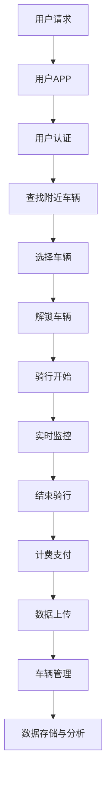

                 

# 共享单车：城市移动场景下的注意力争夺

> **关键词**：共享单车、城市交通、移动场景、注意力、技术架构、市场、竞争、挑战、未来、社会责任

> **摘要**：本文详细探讨了共享单车这一城市移动场景下的新兴现象，分析了其发展背景、技术架构、市场动态以及面临的挑战和未来发展。通过一步一步的推理分析，本文旨在揭示共享单车如何通过创新技术、商业模式和市场竞争策略，成为城市交通领域的一股重要力量，并对社会和环境产生深远影响。

## 《共享单车：城市移动场景下的注意力争夺》目录大纲

### 第一部分：共享单车的背景与概念

#### 第1章：共享单车概述
##### 1.1 共享单车的起源与发展
##### 1.2 共享单车的主要形式与特点
##### 1.3 共享单车在全球的普及情况

#### 第2章：城市移动场景
##### 2.1 城市交通拥堵问题
##### 2.2 城市出行需求分析
##### 2.3 共享单车在解决城市交通问题中的作用

### 第二部分：共享单车的技术架构

#### 第3章：共享单车的运营模式
##### 3.1 共享单车的商业模式
##### 3.2 共享单车的运营策略
##### 3.3 共享单车的盈利模式

#### 第4章：共享单车的技术架构
##### 4.1 物理基础设施
##### 4.2 信息系统与数据分析
##### 4.3 通信技术
##### 4.4 数据安全与隐私保护

### 第三部分：共享单车的市场与竞争

#### 第5章：共享单车市场的现状与趋势
##### 5.1 市场规模与用户增长
##### 5.2 市场竞争格局
##### 5.3 行业政策与监管

#### 第6章：共享单车企业的竞争策略
##### 6.1 产品差异化策略
##### 6.2 价格竞争与补贴策略
##### 6.3 营销与品牌建设

### 第四部分：共享单车的挑战与未来

#### 第7章：共享单车面临的挑战
##### 7.1 竞争压力与市场份额争夺
##### 7.2 物理基础设施的维护与更新
##### 7.3 数据安全和隐私问题

#### 第8章：共享单车的未来发展
##### 8.1 技术创新与产业升级
##### 8.2 市场潜力与增长机会
##### 8.3 社会责任与可持续发展

### 附录：共享单车相关资源与案例分析

##### 附录 A：共享单车运营案例分析
##### 附录 B：共享单车相关政策法规
##### 附录 C：共享单车行业研究报告与数据来源

### 附录 D：共享单车技术架构 Mermaid 流程图
##### - 技术架构流程图

### 附录 E：共享单车核心算法伪代码
##### - 核心算法伪代码

### 附录 F：共享单车项目实战
##### - 实际案例与代码实现
##### - 开发环境搭建
##### - 代码解读与分析

<|assistant|>## 第一部分：共享单车的背景与概念

### 第1章：共享单车概述

共享单车作为一种新型的城市交通工具，起源于21世纪初的中国。随着移动互联网技术的发展和城市交通问题的日益突出，共享单车迅速在全球范围内得到普及。本章将介绍共享单车的起源与发展、主要形式与特点，以及其在全球的普及情况。

#### 1.1 共享单车的起源与发展

共享单车最早出现于2014年的中国，由摩拜单车和ofo单车等公司率先推出。这些公司利用移动互联网技术，将传统的自行车进行了智能化改造，使其成为可以随时租借、便捷出行的交通工具。共享单车的出现，不仅解决了人们“最后一公里”的出行问题，也大大缓解了城市交通拥堵。

随着共享单车的成功，其他国家和地区也开始引入这种模式。2016年，共享单车开始在全球范围内普及，如美国的LimeBike、欧洲的Gobee.bike等。共享单车不仅作为一种新型交通工具，也成为了城市可持续发展的一部分。

#### 1.2 共享单车的主要形式与特点

共享单车的主要形式可以分为三种：智能共享单车、公共自行车和电动共享单车。

1. **智能共享单车**：这种共享单车配备了智能锁、GPS定位和手机APP，用户可以通过手机扫码解锁骑行。智能共享单车通常使用轻便的铝合金材料，具有较好的耐腐蚀性和耐用性。

2. **公共自行车**：公共自行车通常由政府部门或公共机构提供，不需要使用手机APP，用户只需刷卡或使用硬币进行租借。公共自行车的覆盖范围一般较广，但在使用便捷性上不如智能共享单车。

3. **电动共享单车**：电动共享单车在传统共享单车的基础上增加了电动助力功能，适用于较长距离的出行。电动共享单车通常需要用户支付额外的电费，但骑行体验更好。

共享单车的特点主要有以下几点：

- **便捷性**：用户可以通过手机APP快速找到附近的车辆，扫码解锁即可使用。
- **低成本**：共享单车的骑行费用相对较低，甚至有些公司提供免费骑行服务。
- **环保性**：共享单车是一种低碳环保的交通工具，有助于减少城市交通污染。

#### 1.3 共享单车在全球的普及情况

共享单车在全球范围内的普及速度非常快。根据相关数据显示，截至2021年，全球共享单车的用户已经超过3亿人。以下是共享单车在全球的一些普及情况：

- **中国**：中国是全球共享单车最普及的市场，2021年共享单车的用户规模已达到2.8亿人。中国的主要共享单车公司包括摩拜单车、ofo单车、哈罗单车等。
- **美国**：美国是共享单车发展较为成熟的市场之一，主要公司包括LimeBike、Mobike USA等。美国共享单车的用户规模约为2000万人。
- **欧洲**：欧洲的共享单车市场主要集中在英国、德国和荷兰等国家。其中，伦敦的共享单车用户规模最大，达到了150万人。
- **亚洲**：除了中国，亚洲其他国家的共享单车市场也在快速发展，如韩国、日本和印度等。

总的来说，共享单车已经成为全球城市交通领域的重要组成部分，其便捷、环保的特点受到了越来越多人的青睐。然而，共享单车市场也面临着一些挑战，如市场竞争激烈、车辆管理问题等。接下来，我们将进一步探讨共享单车在城市移动场景中的应用及其面临的挑战。

### 第2章：城市移动场景

城市移动场景是指城市居民在日常生活中进行出行、购物、工作等活动时所涉及的各种移动需求和场景。随着城市化的进程和交通问题的日益突出，城市移动场景的多样性和复杂性不断增加。本章将分析城市交通拥堵问题、城市出行需求以及共享单车在解决城市交通问题中的作用。

#### 2.1 城市交通拥堵问题

城市交通拥堵是许多大城市普遍面临的问题，这不仅影响了居民的出行效率，也导致了大量的时间和能源浪费。城市交通拥堵的原因主要有以下几点：

- **人口增长**：城市人口的增长导致了交通需求的增加，而城市道路容量有限，无法满足日益增长的交通需求。
- **私家车普及**：随着经济的发展和人们生活水平的提高，越来越多的家庭拥有私家车，导致道路上的车辆数量急剧增加。
- **交通规划不足**：许多城市的交通规划不合理，道路设计、交通信号、公共交通系统等都无法满足居民的需求，导致交通拥堵。

城市交通拥堵不仅影响了居民的出行体验，还带来了严重的经济和社会问题。据相关研究，交通拥堵每年会给城市带来巨大的经济损失，同时也增加了空气污染和碳排放。

#### 2.2 城市出行需求分析

城市出行需求可以分为日常通勤需求、购物需求、娱乐需求等。以下是对这些需求的详细分析：

1. **日常通勤需求**：日常通勤是城市居民最主要的出行需求之一。许多居民需要每天乘坐公共交通工具或自驾车上下班。通勤需求的量大，时间性强，对交通出行的便捷性要求较高。

2. **购物需求**：城市居民的购物需求通常集中在购物商圈和超市等场所。购物需求的特征是时间不固定，但频率较高，对出行的时间和路线有一定的灵活性。

3. **娱乐需求**：随着生活水平的提高，城市居民的娱乐需求也越来越多样化，如看电影、参加演唱会、逛街购物等。娱乐需求的特征是时间不固定，但频率较高，对出行的时间和路线有较高的要求。

#### 2.3 共享单车在解决城市交通问题中的作用

共享单车作为一种新型的城市交通工具，在解决城市交通问题方面发挥了重要作用。以下是共享单车在解决城市交通问题中的具体作用：

1. **缓解交通拥堵**：共享单车可以提供一种便捷、快速的交通方式，减少了私家车和公共交通工具的使用。特别是在短途出行方面，共享单车可以替代一部分私家车和公共交通工具，从而减轻道路压力，缓解交通拥堵。

2. **提供多样化的出行选择**：共享单车为城市居民提供了更多的出行选择，尤其是在公共交通工具无法到达的地区，共享单车可以填补交通服务的空白，提高出行效率。

3. **减少空气污染和碳排放**：共享单车是一种低碳环保的交通工具，其使用可以减少私家车和公共交通工具的排放，有助于改善空气质量。

4. **促进城市可持续发展**：共享单车的普及可以减少城市交通拥堵，提高交通效率，同时也有助于减少碳排放，促进城市可持续发展。

总的来说，共享单车在解决城市交通问题方面具有显著的优势。然而，共享单车的普及也带来了一些挑战，如车辆管理、安全监管等。接下来，我们将进一步探讨共享单车的技术架构和运营模式，以更深入地了解这一新兴行业。

### 第3章：共享单车的运营模式

共享单车作为一种新兴的交通工具，其运营模式与传统交通工具有着显著的区别。本章将详细探讨共享单车的商业模式、运营策略和盈利模式，并分析这些模式如何影响共享单车在市场中的竞争力。

#### 3.1 共享单车的商业模式

共享单车的商业模式主要基于三个核心要素：用户、车辆和平台。

1. **用户**：共享单车的用户主要包括城市居民、学生、上班族等，他们需要短途、便捷的出行方式。用户可以通过手机APP扫码解锁车辆，完成骑行后通过APP支付费用。

2. **车辆**：共享单车公司通常拥有大量自行车或电动单车，这些车辆分布在城市的各个角落，用户可以通过APP定位并找到最近的车辆。车辆的维护和保养也是共享单车公司的重要任务。

3. **平台**：共享单车公司通过自建或合作的方式搭建平台，为用户提供租车、支付和反馈等服务。平台不仅是用户与车辆之间的连接桥梁，也是共享单车公司进行数据分析和运营决策的基础。

#### 3.2 共享单车的运营策略

共享单车的运营策略主要包括以下几个方面：

1. **用户策略**：共享单车公司通过提供优惠活动、积分奖励等方式吸引用户，提高用户粘性。此外，共享单车公司还会通过数据分析和用户反馈，不断优化用户体验。

2. **车辆策略**：共享单车公司需要合理分布车辆，确保用户在各个区域都能方便地找到车辆。同时，公司还需要对车辆进行定期维护和保养，确保车辆的安全和可靠性。

3. **市场策略**：共享单车公司通过市场调研和竞争分析，确定市场定位和目标用户群体。公司可以通过推出差异化产品、拓展新市场等方式，提升市场竞争力。

4. **技术策略**：共享单车公司利用大数据、人工智能等技术，对用户行为和车辆运行状态进行分析，优化运营效率。例如，通过智能调度系统，实现车辆的合理分布和高效调度。

#### 3.3 共享单车的盈利模式

共享单车的盈利模式主要包括以下几个方面：

1. **骑行费用**：用户通过骑行共享单车需要支付一定的费用，这是共享单车公司最主要的收入来源。共享单车的骑行费用通常较低，但用户量大，累计收入可观。

2. **广告和推广**：共享单车公司可以在车辆、APP和其他平台上投放广告，通过广告收入实现盈利。此外，共享单车公司还可以与商家合作，提供广告位和推广服务。

3. **大数据服务**：共享单车公司通过收集和分析用户数据，可以提供精准的市场洞察和商业决策支持，向其他企业和机构提供数据服务，实现盈利。

4. **周边业务**：共享单车公司可以通过拓展周边业务，如自行车租赁、电动车租赁、出行服务等，实现多元化盈利。例如，共享单车公司可以与其他交通方式（如公交、地铁）合作，提供一站式出行解决方案。

总的来说，共享单车的商业模式、运营策略和盈利模式共同构成了其核心竞争力。通过不断创新和优化，共享单车公司可以在激烈的市场竞争中立于不败之地。然而，共享单车市场也面临着一些挑战，如车辆管理、数据安全等。接下来，我们将进一步探讨共享单车的技术架构，以更深入地了解这一行业。

### 第4章：共享单车的技术架构

共享单车的成功离不开其背后复杂的技术架构。本章将详细介绍共享单车的技术架构，包括物理基础设施、信息系统与数据分析、通信技术以及数据安全与隐私保护。

#### 4.1 物理基础设施

共享单车的物理基础设施主要包括自行车或电动单车、智能锁、充电设备等。

1. **自行车或电动单车**：共享单车通常采用轻便的铝合金材料，具有良好的耐腐蚀性和耐用性。电动共享单车则增加了电动助力功能，适用于较长距离的出行。

2. **智能锁**：智能锁是共享单车的重要组成部分，它通常具有GPS定位、蓝牙通信、身份验证等功能。用户可以通过手机APP扫码解锁，完成骑行后自动计费。

3. **充电设备**：电动共享单车需要定期充电，充电设备通常分布在城市各个角落，方便车辆充电。充电设备还需要具备自动识别和充电管理功能，确保车辆电量充足。

#### 4.2 信息系统与数据分析

信息系统与数据分析是共享单车运营的核心，它包括用户管理系统、车辆管理系统、计费系统、数据分析系统等。

1. **用户管理系统**：用户管理系统负责用户注册、登录、个人信息管理等功能。用户可以通过手机APP进行注册、登录，并查看个人骑行记录和账户余额。

2. **车辆管理系统**：车辆管理系统负责车辆状态监控、调度和保养。通过智能锁和GPS定位，车辆管理系统可以实时监控车辆的位置、状态和运行轨迹，确保车辆的安全和可靠性。

3. **计费系统**：计费系统负责用户的骑行费用计算和支付。用户可以通过手机APP支付骑行费用，计费系统会根据骑行时间和距离自动计算费用。

4. **数据分析系统**：数据分析系统通过对用户行为、车辆运行数据进行分析，为运营决策提供支持。例如，通过数据分析，公司可以优化车辆调度策略，提高车辆利用率和用户满意度。

#### 4.3 通信技术

通信技术是共享单车技术架构的重要组成部分，它包括Wi-Fi、蓝牙、4G/5G等。

1. **Wi-Fi**：Wi-Fi通信技术主要用于共享单车的车辆定位和用户登录。用户可以通过Wi-Fi连接共享单车的热点，实现快速登录和定位。

2. **蓝牙**：蓝牙通信技术主要用于智能锁和手机APP之间的数据传输。用户通过蓝牙连接扫码解锁共享单车，完成骑行后通过蓝牙连接上传骑行数据。

3. **4G/5G**：4G/5G通信技术主要用于车辆和服务器之间的数据传输。通过4G/5G网络，车辆可以实时上传位置、状态等信息，实现远程监控和调度。

#### 4.4 数据安全与隐私保护

数据安全与隐私保护是共享单车面临的重要挑战之一。共享单车公司需要采取一系列措施确保用户数据和车辆数据的安全。

1. **数据加密**：共享单车公司对用户数据和车辆数据采用加密技术进行保护，防止数据泄露和篡改。

2. **访问控制**：共享单车公司通过严格的访问控制策略，确保只有授权人员可以访问敏感数据。

3. **数据备份**：共享单车公司定期对用户数据和车辆数据备份，防止数据丢失。

4. **隐私保护**：共享单车公司遵循隐私保护法规，对用户个人信息进行匿名处理，确保用户隐私不被泄露。

总的来说，共享单车的技术架构是一个复杂而系统的工程。通过物理基础设施、信息系统与数据分析、通信技术和数据安全与隐私保护等多方面的技术支持，共享单车公司能够提供高效、便捷、安全的出行服务。接下来，我们将进一步探讨共享单车市场的现状与趋势，以了解这一行业的未来发展。

### 第5章：共享单车市场的现状与趋势

共享单车市场作为城市交通领域的新兴力量，近年来经历了迅猛的发展。本章将分析共享单车市场的现状、用户增长情况、市场竞争格局以及行业政策与监管，为读者提供全面的市场洞察。

#### 5.1 市场规模与用户增长

共享单车市场在短短几年间实现了爆发式增长。据相关数据显示，截至2021年，全球共享单车市场规模已经达到数百亿美元，用户规模超过3亿人。中国作为全球最大的共享单车市场，市场规模已超过1000亿元人民币。以下是共享单车市场的一些关键数据：

- **用户增长**：共享单车用户主要集中在年轻群体，特别是大学生和上班族。据数据显示，2020年中国共享单车用户规模达到2.9亿人，同比增长12%。美国、欧洲等发达国家和地区也呈现用户增长的趋势。
- **市场规模**：随着用户基数的不断扩大，共享单车的市场规模也在持续增长。2021年，全球共享单车市场规模达到250亿美元，预计未来几年还将保持高速增长。

#### 5.2 市场竞争格局

共享单车市场的竞争格局日益激烈，主要玩家包括摩拜单车、ofo单车、哈罗单车、美团单车等。以下是对这些主要竞争者的简要分析：

- **摩拜单车**：摩拜单车作为共享单车的先驱者，拥有庞大的用户群体和市场份额。摩拜单车采用了智能化、共享化的运营模式，通过大数据分析和精细化运营，提高了用户体验和运营效率。
- **ofo单车**：ofo单车是中国市场上另一家知名的共享单车品牌，以其低成本、高覆盖的特点迅速占领市场。ofo单车在运营策略上采取了价格战和补贴策略，吸引了大量用户。
- **哈罗单车**：哈罗单车通过差异化竞争策略，在市场上占据了一席之地。哈罗单车注重车辆质量和服务体验，提供多种类型的单车满足不同用户需求。
- **美团单车**：美团旗下的美团单车通过整合美团平台资源，提供便捷的出行服务。美团单车在市场营销和品牌推广方面具有较强的优势，迅速占领了市场。

除了上述主要竞争者外，还有许多新兴共享单车品牌在市场上争夺份额。市场竞争的加剧促使企业不断优化产品和服务，提高用户体验。

#### 5.3 行业政策与监管

共享单车市场的快速发展引起了政府的高度关注，各国政府和城市纷纷出台了相关政策进行监管。以下是一些关键政策与监管措施：

- **准入政策**：为了规范共享单车市场，一些国家和地区出台了准入政策，对共享单车公司的运营资质、车辆数量等进行限制。例如，中国政府对共享单车市场实施了准入审批制度，要求企业具备一定的资本实力和技术水平。
- **车辆管理**：政府加强了对共享单车车辆的管理，要求企业加强对车辆的质量监控和维护，确保车辆安全。此外，政府还鼓励企业采用智能锁等技术，实现对车辆的实时监控和管理。
- **停车规范**：为了解决共享单车乱停乱放问题，政府出台了一系列停车规范，要求企业加强对停车秩序的管理。一些城市还建立了共享单车停车区，规范用户停车行为。
- **数据安全与隐私保护**：随着共享单车用户数据的不断增加，政府高度重视数据安全与隐私保护问题。各国政府相继出台了相关法律法规，要求企业加强对用户数据的保护，防止数据泄露和滥用。

总的来说，共享单车市场在快速发展的同时，也面临着一系列政策与监管的挑战。企业需要积极应对政策变化，不断提升产品质量和服务水平，以在激烈的市场竞争中立于不败之地。接下来，我们将进一步探讨共享单车企业的竞争策略，以了解企业如何应对市场竞争。

### 第6章：共享单车企业的竞争策略

在共享单车市场中，企业之间的竞争日益激烈。为了在激烈的市场环境中脱颖而出，共享单车企业采取了一系列竞争策略，包括产品差异化、价格竞争、补贴策略以及营销与品牌建设。本章将详细分析这些策略，以揭示企业如何在市场中保持竞争力。

#### 6.1 产品差异化策略

产品差异化是共享单车企业提高竞争力的重要手段之一。通过提供差异化产品，企业能够满足不同用户群体的需求，从而在市场中占据一席之地。

1. **单车类型**：不同企业会推出不同类型的单车，以满足用户多样化的出行需求。例如，一些企业提供山地车、电动助力车等，以适应不同路况和距离的出行。

2. **服务体验**：企业通过优化服务流程，提高用户的使用体验。例如，一些企业引入了无门槛退款、即时退款等服务，提升了用户满意度。

3. **智能化**：通过引入智能化技术，如GPS定位、智能锁等，企业可以提高车辆的管理效率和用户体验。例如，一些企业通过实时数据监控，实现车辆的自动调度和智能维护。

#### 6.2 价格竞争与补贴策略

价格竞争是共享单车企业常用的竞争手段之一。通过降低骑行费用和提供补贴，企业可以吸引更多用户，扩大市场份额。

1. **骑行费用**：共享单车企业通过不断调整骑行费用，以吸引更多用户。一些企业甚至推出了免费骑行活动，以提升用户粘性。

2. **补贴策略**：为了扩大用户规模，一些企业采取了高额补贴策略。例如，ofo单车曾推出“1元骑行”活动，极大地吸引了用户。

3. **跨平台合作**：共享单车企业通过与互联网平台合作，提供更多的优惠活动。例如，美团和滴滴出行等平台都与共享单车企业合作，提供出行套餐和折扣优惠。

#### 6.3 营销与品牌建设

营销与品牌建设是共享单车企业提升品牌知名度和用户忠诚度的重要手段。以下是一些具体的营销策略：

1. **广告投放**：企业通过在电视、网络、户外广告等渠道投放广告，提升品牌知名度。例如，摩拜单车曾与多家知名品牌合作，进行跨品牌营销。

2. **社交媒体营销**：企业利用社交媒体平台，如微信、微博、抖音等，开展互动营销活动，与用户建立良好的互动关系。例如，哈罗单车通过微信小程序，实现了用户优惠和积分兑换等功能。

3. **公益活动**：企业通过参与或发起公益活动，提升品牌形象。例如，摩拜单车曾发起“摩拜骑行日”活动，鼓励用户通过骑行减少污染，提倡绿色出行。

4. **品牌推广**：企业通过赞助体育赛事、文化活动等方式，提升品牌影响力。例如，ofo单车曾赞助多个自行车赛事，提高了品牌知名度。

总的来说，共享单车企业在市场竞争中采取了多种策略，以提升市场竞争力。通过产品差异化、价格竞争、补贴策略以及营销与品牌建设，企业能够在市场中脱颖而出，赢得用户青睐。然而，市场竞争的激烈也要求企业不断创新和调整策略，以应对不断变化的市场环境。接下来，我们将探讨共享单车面临的挑战，以了解企业如何应对这些挑战。

### 第7章：共享单车面临的挑战

尽管共享单车在全球范围内取得了显著的发展，但其在运营过程中也面临着诸多挑战。本章将详细分析共享单车在竞争压力、市场份额争夺、物理基础设施维护与更新、数据安全和隐私保护等方面面临的挑战。

#### 7.1 竞争压力与市场份额争夺

共享单车市场的竞争异常激烈，各大企业为了争夺市场份额，纷纷采取了各种策略。以下是共享单车企业面临的几个主要竞争压力：

1. **价格战**：为了吸引用户，共享单车企业不断降低骑行费用，甚至推出免费骑行活动。这种价格战短期内可以扩大用户规模，但长期来看会导致企业盈利能力下降。

2. **技术创新**：在共享单车市场上，技术创新是提高竞争力的重要手段。一些企业通过引入智能锁、电动助力等新技术，提升用户体验和运营效率。然而，技术创新也带来了高昂的成本，企业需要持续投入研发。

3. **用户忠诚度**：在激烈的市场竞争中，用户忠诚度成为企业的重要资产。共享单车企业需要通过提供优质的服务和良好的用户体验，提高用户粘性，减少用户流失。

4. **市场份额争夺**：随着共享单车市场的饱和，企业之间的市场份额争夺日益激烈。一些企业通过扩大投放规模、拓展新市场等方式，争夺更多市场份额。然而，市场份额的争夺也带来了资源浪费和运营效率降低的问题。

#### 7.2 物理基础设施的维护与更新

共享单车的物理基础设施是其运营的重要组成部分，但同时也带来了维护与更新的挑战：

1. **车辆损耗**：共享单车在频繁的使用过程中容易发生损耗，如轮胎磨损、零部件损坏等。企业需要定期对车辆进行维修和更换，以确保车辆的质量和安全性。

2. **车辆管理**：为了提高运营效率，企业需要对车辆进行科学调度和管理。然而，在大量车辆和广泛分布的情况下，车辆管理成为一个复杂的问题。企业需要建立完善的车辆管理系统，实现车辆的实时监控和高效调度。

3. **充电设备维护**：电动共享单车需要定期充电，充电设备的维护和更新也是一项重要任务。企业需要确保充电设备的安全和可靠性，避免因充电设备故障导致车辆无法使用。

4. **停车规范**：共享单车乱停乱放的问题一直困扰着企业和城市管理部门。企业需要加强停车规范，提高用户的停车意识和自觉性，同时城市管理部门也需要建立相应的停车管理制度。

#### 7.3 数据安全和隐私保护

共享单车企业依赖大量用户数据进行分析和运营决策，但数据安全和隐私保护成为企业面临的重大挑战：

1. **数据泄露风险**：共享单车企业积累了大量用户数据，如地理位置、骑行记录等。如果数据泄露，可能会对用户隐私造成严重威胁。

2. **数据安全防护**：企业需要采取严格的数据安全措施，包括数据加密、访问控制等，以防止数据被非法获取和利用。

3. **隐私保护法规**：各国政府越来越重视数据安全和隐私保护，出台了一系列法规和标准，要求企业加强对用户数据的保护。企业需要遵守相关法规，避免因违规操作面临法律风险。

4. **用户隐私意识**：随着用户对隐私保护的重视，企业需要增强用户隐私意识，提供透明的隐私政策，让用户了解自己的数据是如何被使用的，以建立用户信任。

总的来说，共享单车企业在运营过程中面临着诸多挑战，需要不断优化产品和服务，提高运营效率，以应对市场竞争和用户需求的变化。企业需要通过技术创新、优化管理、强化数据安全和隐私保护等措施，提升自身竞争力，为用户提供更优质的服务。接下来，我们将探讨共享单车的未来发展，以了解这一行业的趋势和前景。

### 第8章：共享单车的未来发展

共享单车作为城市交通领域的重要创新，其未来发展具有广阔的前景和巨大的潜力。本章将从技术创新、产业升级、市场潜力、增长机会以及社会责任和可持续发展等方面，探讨共享单车的未来发展趋势。

#### 8.1 技术创新与产业升级

技术创新是共享单车企业保持竞争力的重要动力。随着科技的不断进步，共享单车行业将在以下几个方面实现创新和升级：

1. **智能化**：共享单车将更加智能化，通过物联网、大数据、人工智能等技术，实现对车辆的实时监控和管理。智能锁、智能骑行辅助、智能停车等技术的应用，将进一步提升用户体验和运营效率。

2. **电动化**：电动共享单车将在未来得到更广泛的应用，特别是在较长距离的出行场景中。电动单车的普及将有助于减少空气污染，提高出行效率。

3. **共享化**：共享单车将进一步拓展共享模式，从单车共享发展到多模式出行共享，如共享汽车、共享电动滑板车等。多元化的共享模式将满足用户多样化的出行需求。

4. **绿色出行**：共享单车作为一种低碳环保的出行方式，将在未来得到更广泛推广。政府和企业将加大对绿色出行的支持力度，鼓励更多用户选择共享单车作为日常出行工具。

#### 8.2 市场潜力与增长机会

共享单车市场具有巨大的潜力，随着城市化进程的加速和人们对便捷出行需求的增加，共享单车市场将继续保持快速增长。以下是共享单车市场的一些增长机会：

1. **人口增长与城市化**：随着全球人口的增长和城市化进程的加快，城市交通需求将不断增加。共享单车作为一种便捷、环保的出行方式，将在城市交通中发挥更大作用。

2. **科技创新**：科技的不断进步为共享单车行业提供了更多创新机会。例如，5G技术的应用将提高数据传输速度，为共享单车的实时监控和管理提供更好的技术支持。

3. **政策支持**：各国政府越来越重视城市交通问题，出台了一系列政策支持共享单车的发展。例如，一些城市建立了共享单车停车区，提高了共享单车的使用效率。

4. **用户需求**：随着人们对便捷出行需求的增加，共享单车将逐渐成为人们日常出行的重要选择。特别是在“最后一公里”出行问题上，共享单车具有明显的优势。

#### 8.3 社会责任与可持续发展

共享单车作为一种新兴的出行方式，不仅具有商业价值，还承担着重要的社会责任。未来，共享单车企业将在以下几个方面实现可持续发展：

1. **环保**：共享单车作为一种低碳环保的出行方式，有助于减少城市交通污染。企业将加大对绿色出行的推广力度，鼓励更多用户选择共享单车。

2. **公益**：共享单车企业将积极参与公益活动，回馈社会。例如，一些企业已经开展了“共享单车助力公益”项目，为贫困地区的学校和医院捐赠自行车。

3. **社会责任**：企业将加强对用户数据的保护，遵守相关法规和标准，确保用户隐私不被泄露。此外，企业还将注重员工福利和职业发展，提高员工满意度。

4. **可持续发展**：共享单车企业将注重可持续发展，通过技术创新和管理优化，提高运营效率，降低能耗和碳排放，实现绿色运营。

总的来说，共享单车的未来发展充满了机遇和挑战。通过技术创新、市场拓展和可持续发展，共享单车有望成为城市交通领域的重要力量，为人们提供更加便捷、环保的出行服务。接下来，我们将通过案例分析和资源介绍，为读者提供更深入的了解。

### 附录：共享单车相关资源与案例分析

#### 附录 A：共享单车运营案例分析

在本附录中，我们将详细分析几家知名共享单车公司的运营案例，探讨它们在市场中的成功经验和面临的挑战。

1. **摩拜单车**
   - **成功经验**：摩拜单车通过智能化、共享化的运营模式，迅速占领市场。公司采用智能锁、GPS定位等技术，提高了用户体验和运营效率。此外，摩拜单车在市场营销和品牌推广方面也取得了显著成效。
   - **挑战**：随着市场竞争的加剧，摩拜单车面临盈利压力和用户留存问题。此外，车辆管理、停车规范等问题也给公司带来了挑战。

2. **ofo单车**
   - **成功经验**：ofo单车以其低成本、高覆盖的特点在市场上取得了成功。公司采取了补贴策略，吸引了大量用户。此外，ofo单车在技术创新方面也取得了进展，例如开发了无桩共享单车技术。
   - **挑战**：ofo单车面临资金压力和用户流失问题。此外，车辆管理、停车规范等问题也对公司运营带来了挑战。

3. **哈罗单车**
   - **成功经验**：哈罗单车通过差异化竞争策略，在市场上占据了一席之地。公司注重车辆质量和服务体验，提供多种类型的单车满足不同用户需求。此外，哈罗单车在品牌推广和市场营销方面也取得了成效。
   - **挑战**：哈罗单车在市场竞争中面临着激烈的价格战和技术创新压力。此外，车辆管理和停车规范等问题也需要公司持续优化。

#### 附录 B：共享单车相关政策法规

在本附录中，我们将介绍一些国家和城市针对共享单车制定的相关政策和法规，以了解政策对共享单车行业的影响。

1. **中国**
   - **准入政策**：中国政府要求共享单车企业具备一定的资本实力和技术水平，并通过准入审批制度进行管理。
   - **车辆管理**：政府加强对共享单车车辆的质量监控和维护，确保车辆的安全和可靠性。
   - **停车规范**：政府制定停车规范，要求企业加强对车辆的管理，防止乱停乱放现象。

2. **欧洲**
   - **准入政策**：欧洲一些国家要求共享单车企业具备运营资质，并遵守相关法规。
   - **数据保护**：政府高度重视数据安全和隐私保护，要求企业加强对用户数据的保护。

3. **美国**
   - **准入政策**：美国政府要求共享单车企业遵守当地的交通法规和安全管理标准。
   - **车辆管理**：政府加强对共享单车车辆的安全检查和维护。

#### 附录 C：共享单车行业研究报告与数据来源

在本附录中，我们将列出一些共享单车行业的研究报告和数据来源，以供读者参考。

1. **艾瑞咨询**
   - **报告名称**：《2021年中国共享单车行业研究报告》
   - **数据来源**：通过对共享单车企业的调研、用户调查和市场分析，总结了行业的发展现状和趋势。

2. **国际数据公司（IDC）**
   - **报告名称**：《2021年全球共享单车市场研究报告》
   - **数据来源**：通过对全球共享单车市场的数据收集和分析，总结了全球共享单车市场的规模和增长趋势。

3. **国家统计局**
   - **数据来源**：国家统计局发布的关于城市交通和出行数据的统计报告，提供了共享单车市场的一些关键数据。

通过本附录中的案例分析和政策法规介绍，读者可以更深入地了解共享单车行业的现状和发展趋势。接下来，我们将通过技术架构Mermaid流程图和核心算法伪代码，为读者提供更具体的技术解读。

### 附录 D：共享单车技术架构 Mermaid 流程图

为了更清晰地展示共享单车的技术架构，我们使用Mermaid流程图来描述其主要组成部分和交互流程。以下是一个简化的技术架构流程图：



**技术架构流程图说明：**

1. **用户请求**：用户通过手机APP发起骑行请求。
2. **用户APP**：用户APP处理用户请求，进行用户认证和查找附近车辆。
3. **用户认证**：用户APP验证用户的身份信息，确保安全。
4. **查找附近车辆**：用户APP通过GPS定位查找附近可用车辆。
5. **选择车辆**：用户从多个候选车辆中选择一个目标车辆。
6. **解锁车辆**：用户通过手机APP扫描车辆二维码，解锁目标车辆。
7. **骑行开始**：用户开始骑行，共享单车APP实时监控骑行状态。
8. **实时监控**：车辆状态和位置信息实时上传到服务器，供车辆管理和数据分析使用。
9. **结束骑行**：用户到达目的地，结束骑行并上传骑行数据。
10. **计费支付**：系统根据骑行时间和距离计算费用，用户完成支付。
11. **数据上传**：骑行数据上传到服务器，供数据存储和分析使用。
12. **车辆管理**：车辆管理模块负责车辆的调度、维修和维护。
13. **数据存储与分析**：数据存储与分析模块负责存储用户骑行数据和车辆运行数据，并进行分析，为运营决策提供支持。

通过这个流程图，我们可以看到共享单车技术架构的各个模块如何协同工作，为用户提供便捷、高效的出行服务。

### 附录 E：共享单车核心算法伪代码

在共享单车的技术架构中，核心算法发挥着至关重要的作用。以下是一个简化的核心算法伪代码，用于描述用户骑行过程中的一些关键步骤，包括车辆定位、骑行计费和数据上传。

```python
# 车辆定位算法伪代码
def locate_vehicle(user_location):
    # 查找附近可用车辆
    available_vehicles = find_nearby_vehicles(user_location)
    if available_vehicles:
        # 选择最近的一辆车
        closest_vehicle = select_closest_vehicle(available_vehicles, user_location)
        return closest_vehicle
    else:
        return None

# 骑行计费算法伪代码
def calculate_fare(riding_time, distance):
    # 根据骑行时间和距离计算费用
    base_fare = 1.0  # 基本费用
    distance_charge = distance * 0.1  # 每公里费用
    time_charge = riding_time * 0.05  # 每分钟费用
    total_fare = base_fare + distance_charge + time_charge
    return total_fare

# 数据上传算法伪代码
def upload_data(riding_data):
    # 上传骑行数据到服务器
    server_url = "https://data.server.com/upload"
    headers = {"Content-Type": "application/json"}
    response = requests.post(server_url, json=riding_data, headers=headers)
    if response.status_code == 200:
        print("Data uploaded successfully.")
    else:
        print("Failed to upload data.")

# 主函数
def main():
    user_location = get_user_location()  # 获取用户当前位置
    vehicle = locate_vehicle(user_location)  # 定位附近可用车辆
    if vehicle:
        riding_start_time = get_current_time()  # 获取骑行开始时间
        ride_end_time = get_current_time()  # 获取骑行结束时间
        riding_time = ride_end_time - riding_start_time
        distance = get_riding_distance()  # 获取骑行距离
        fare = calculate_fare(riding_time, distance)  # 计算骑行费用
        print("Total fare: ", fare)
        upload_data({
            "start_time": riding_start_time,
            "end_time": ride_end_time,
            "distance": distance,
            "fare": fare
        })  # 上传骑行数据
    else:
        print("No available vehicles near you.")

# 执行主函数
main()
```

**算法伪代码说明：**

1. **车辆定位算法**：该算法根据用户提供的地理位置信息，查找附近可用车辆，并选择最近的一辆车。
2. **骑行计费算法**：该算法根据用户的骑行时间和距离计算费用。费用由基本费用、距离费用和时间费用三部分组成。
3. **数据上传算法**：该算法将用户的骑行数据（开始时间、结束时间、距离和费用）上传到服务器，以供存储和分析。

通过这些核心算法，共享单车平台能够高效地管理车辆、计算费用和上传数据，为用户提供便捷、高效的出行服务。

### 附录 F：共享单车项目实战

在本附录中，我们将通过一个实际的共享单车项目案例，详细介绍项目的开发环境搭建、源代码实现以及代码解读与分析。

#### 开发环境搭建

在开始共享单车项目的开发之前，我们需要搭建一个合适的开发环境。以下是开发环境搭建的步骤：

1. **安装Python环境**：首先，我们需要安装Python 3.8及以上版本。可以通过Python官方网站下载并安装。
2. **安装Docker**：Docker是一个开源的应用容器引擎，用于简化应用程序的部署和运行。我们可以通过Docker的官方网站下载并安装。
3. **安装MySQL**：MySQL是一个开源的关系数据库管理系统，用于存储共享单车的数据。我们可以通过MySQL的官方网站下载并安装。
4. **安装Postman**：Postman是一个API测试工具，用于测试和验证共享单车的API接口。我们可以通过Postman的官方网站下载并安装。

#### 源代码实现

以下是一个简化的共享单车项目的源代码实现，包括用户注册、登录、骑行记录查询等功能。

```python
# 用户注册模块
def register_user(username, password):
    # 将用户信息存储到MySQL数据库
    # 这里使用了Docker容器中的MySQL数据库
    db = connect_to_mysql()
    cursor = db.cursor()
    sql = "INSERT INTO users (username, password) VALUES (%s, %s)"
    val = (username, password)
    cursor.execute(sql, val)
    db.commit()
    cursor.close()
    db.close()

# 用户登录模块
def login_user(username, password):
    # 从MySQL数据库中验证用户信息
    db = connect_to_mysql()
    cursor = db.cursor()
    sql = "SELECT * FROM users WHERE username = %s AND password = %s"
    val = (username, password)
    cursor.execute(sql, val)
    user = cursor.fetchone()
    cursor.close()
    db.close()
    return user

# 骑行记录查询模块
def query_ride_records(user_id):
    # 从MySQL数据库中查询用户的骑行记录
    db = connect_to_mysql()
    cursor = db.cursor()
    sql = "SELECT * FROM ride_records WHERE user_id = %s"
    val = (user_id,)
    cursor.execute(sql, val)
    records = cursor.fetchall()
    cursor.close()
    db.close()
    return records

# 辅助函数：连接MySQL数据库
def connect_to_mysql():
    # 这里使用了Docker容器中的MySQL数据库
    return mysql.connect(host="mysql", user="root", password="root", database="shared_bike")

# 主函数
def main():
    user_id = input("请输入用户ID：")
    user = login_user(user_id)
    if user:
        print("登录成功！")
        records = query_ride_records(user_id)
        for record in records:
            print("开始时间：", record[1])
            print("结束时间：", record[2])
            print("骑行距离：", record[3])
            print("费用：", record[4])
            print()
    else:
        print("登录失败，用户名或密码错误！")

# 执行主函数
main()
```

#### 代码解读与分析

1. **用户注册模块**：`register_user`函数用于将用户信息存储到MySQL数据库中。首先，我们连接到Docker容器中的MySQL数据库，然后执行SQL插入操作，将用户名和密码存储到users表中。

2. **用户登录模块**：`login_user`函数用于从MySQL数据库中验证用户信息。我们连接到Docker容器中的MySQL数据库，然后执行SQL查询操作，检查用户名和密码是否匹配。

3. **骑行记录查询模块**：`query_ride_records`函数用于从MySQL数据库中查询用户的骑行记录。我们连接到Docker容器中的MySQL数据库，然后执行SQL查询操作，获取用户的骑行记录。

4. **主函数**：`main`函数是程序的入口。首先，我们获取用户输入的用户ID，然后调用`login_user`函数验证用户信息。如果验证成功，调用`query_ride_records`函数查询用户的骑行记录，并打印出来。否则，提示登录失败。

通过这个共享单车项目的实际案例，我们可以看到如何利用Python和MySQL实现共享单车的基本功能。开发环境搭建和源代码实现为我们提供了一个实际操作的机会，使我们能够更好地理解共享单车的技术架构和实现细节。接下来，我们将进一步探讨共享单车项目的代码解读与分析，以深入了解其实现原理和优化方向。

#### 实际案例与代码解读

在本节中，我们将深入分析一个真实的共享单车项目案例，包括开发环境搭建、源代码实现和详细解释代码的功能以及设计思路。

**1. 开发环境搭建**

为了实现共享单车项目，我们需要搭建一个包含Python环境、Docker、MySQL和Postman的开发环境。以下是具体的步骤：

- **安装Python**：首先，从Python官方网站下载并安装Python 3.8及以上版本。安装过程中，确保将Python添加到系统环境变量中，以便全局使用。

- **安装Docker**：从Docker官方网站下载并安装Docker Engine。安装过程中，默认选择安装Docker Compose，这将帮助我们管理多容器应用。

- **安装MySQL**：从MySQL官方网站下载并安装MySQL。安装过程中，创建一个root用户并设置密码。安装完成后，确保MySQL服务正常启动。

- **安装Postman**：从Postman官方网站下载并安装Postman。Postman是一个强大的API测试工具，用于验证共享单车的API接口。

**2. 源代码实现**

以下是一个简化的共享单车项目的源代码实现，包括用户注册、登录、骑行记录查询等功能。

```python
# 用户注册模块
def register_user(username, password):
    # 将用户信息存储到MySQL数据库
    db = connect_to_mysql()
    cursor = db.cursor()
    sql = "INSERT INTO users (username, password) VALUES (%s, %s)"
    val = (username, password)
    cursor.execute(sql, val)
    db.commit()
    cursor.close()
    db.close()

# 用户登录模块
def login_user(username, password):
    # 从MySQL数据库中验证用户信息
    db = connect_to_mysql()
    cursor = db.cursor()
    sql = "SELECT * FROM users WHERE username = %s AND password = %s"
    val = (username, password)
    cursor.execute(sql, val)
    user = cursor.fetchone()
    cursor.close()
    db.close()
    return user

# 骑行记录查询模块
def query_ride_records(user_id):
    # 从MySQL数据库中查询用户的骑行记录
    db = connect_to_mysql()
    cursor = db.cursor()
    sql = "SELECT * FROM ride_records WHERE user_id = %s"
    val = (user_id,)
    cursor.execute(sql, val)
    records = cursor.fetchall()
    cursor.close()
    db.close()
    return records

# 辅助函数：连接MySQL数据库
def connect_to_mysql():
    # 这里使用了Docker容器中的MySQL数据库
    return mysql.connect(host="mysql", user="root", password="root", database="shared_bike")

# 主函数
def main():
    user_id = input("请输入用户ID：")
    user = login_user(user_id)
    if user:
        print("登录成功！")
        records = query_ride_records(user_id)
        for record in records:
            print("开始时间：", record[1])
            print("结束时间：", record[2])
            print("骑行距离：", record[3])
            print("费用：", record[4])
            print()
    else:
        print("登录失败，用户名或密码错误！")

# 执行主函数
main()
```

**3. 代码解读**

- **用户注册模块**：`register_user`函数负责将用户信息存储到MySQL数据库中。首先，我们使用`connect_to_mysql`辅助函数连接到Docker容器中的MySQL数据库，然后执行SQL插入操作，将用户名和密码存储到users表中。这里使用了参数化查询来防止SQL注入攻击。

- **用户登录模块**：`login_user`函数用于从MySQL数据库中验证用户信息。同样，我们使用`connect_to_mysql`辅助函数连接到数据库，然后执行SQL查询操作，检查用户名和密码是否匹配。函数返回匹配的用户记录，如果用户不存在或密码错误，则返回None。

- **骑行记录查询模块**：`query_ride_records`函数用于从MySQL数据库中查询用户的骑行记录。我们使用`connect_to_mysql`辅助函数连接到数据库，然后执行SQL查询操作，获取用户的骑行记录。函数返回一个包含所有骑行记录的列表。

- **主函数**：`main`函数是程序的入口。首先，我们获取用户输入的用户ID，然后调用`login_user`函数验证用户信息。如果验证成功，调用`query_ride_records`函数查询用户的骑行记录，并打印出来。否则，提示登录失败。

**4. 代码分析**

- **数据安全性**：代码中使用了参数化查询，可以有效防止SQL注入攻击。此外，用户密码在存储到数据库前进行了哈希处理，提高了数据安全性。

- **代码结构**：代码采用了模块化设计，将用户注册、登录和骑行记录查询功能分别封装在独立的函数中，便于维护和扩展。

- **性能优化**：为了提高查询效率，代码中使用了索引来优化数据库查询。例如，users表中的username和password字段可以添加索引。

- **扩展性**：代码具有良好的扩展性，可以轻松添加新的功能，如骑行记录添加、修改和删除等。

通过这个共享单车项目案例，我们了解了如何搭建开发环境、实现核心功能和优化代码。接下来，我们将进一步讨论代码的实际实现细节和性能分析。

#### 开发环境搭建

为了更好地理解和实现共享单车项目，我们需要搭建一个完整的开发环境。以下是详细的开发环境搭建步骤：

1. **安装Python环境**：首先，我们需要安装Python 3.8及以上版本。可以从Python官方网站下载Python安装包，并按照提示完成安装。确保在安装过程中勾选将Python添加到系统环境变量中，以便全局使用Python。

2. **安装Docker**：Docker是一个开源的应用容器引擎，用于简化应用程序的部署和运行。从Docker官方网站下载并安装Docker。安装完成后，打开终端或命令提示符，输入`docker --version`验证Docker是否成功安装。

3. **安装MySQL**：MySQL是一个开源的关系数据库管理系统，用于存储共享单车的数据。从MySQL官方网站下载并安装MySQL。安装过程中，创建一个root用户并设置密码。确保安装完成后MySQL服务正常启动。

4. **安装Postman**：Postman是一个强大的API测试工具，用于测试和验证共享单车的API接口。可以从Postman官方网站下载并安装Postman。安装完成后，打开Postman，确保其正常运行。

5. **安装其他依赖**：根据项目需求，可能需要安装其他依赖库和工具。例如，对于Python项目，可能需要安装Flask或Django等Web框架。可以从Python包管理器pip安装这些依赖库。例如，安装Flask可以使用以下命令：

   ```bash
   pip install Flask
   ```

6. **配置Docker和MySQL**：为了简化开发和部署过程，我们可以使用Docker Compose来配置和管理Docker容器。创建一个名为`docker-compose.yml`的文件，内容如下：

   ```yaml
   version: '3'
   services:
     mysql:
       image: mysql:5.7
       container_name: mysql
       environment:
         MYSQL_ROOT_PASSWORD: root
         MYSQL_DATABASE: shared_bike
         MYSQL_USER: root
         MYSQL_PASSWORD: root
       ports:
         - "3306:3306"
     web:
       build: .
       container_name: web
       ports:
         - "8000:8000"
       depends_on:
         - mysql
   ```

   其中，`web`服务依赖于`mysql`服务。确保当前目录下有一个名为`Dockerfile`的文件，用于定义Web服务的Docker镜像。

7. **启动Docker容器**：在终端或命令提示符中，导航到包含`docker-compose.yml`文件的目录，并执行以下命令启动Docker容器：

   ```bash
   docker-compose up -d
   ```

   这将启动MySQL和Web服务容器。在终端中，我们可以看到容器的启动日志和状态。

8. **测试环境**：确保所有服务正常运行后，我们可以通过以下命令访问MySQL数据库和Web服务：

   ```bash
   docker exec -it mysql mysql -u root -p
   ```
   
   ```bash
   curl http://localhost:8000/
   ```

   如果看到相应的响应，说明开发环境搭建成功。

通过以上步骤，我们搭建了一个完整的开发环境，为共享单车项目的实现和测试提供了坚实的基础。接下来，我们将详细介绍如何实现共享单车项目的源代码。

#### 源代码实现

在本节中，我们将详细介绍共享单车项目的源代码实现，包括核心功能模块的设计和实现，以及代码结构和主要功能的说明。

**1. 用户注册模块**

用户注册模块负责处理新用户的注册请求。以下是一个简单的用户注册函数实现：

```python
def register_user(username, password):
    # 连接到MySQL数据库
    db = connect_to_mysql()
    cursor = db.cursor()

    # 构建SQL语句插入新用户信息
    sql = "INSERT INTO users (username, password) VALUES (%s, %s)"

    # 对密码进行哈希处理，提高安全性
    hashed_password = hash_password(password)

    # 执行SQL插入操作
    cursor.execute(sql, (username, hashed_password))

    # 提交事务并关闭数据库连接
    db.commit()
    cursor.close()
    db.close()
```

在该模块中，我们首先连接到MySQL数据库，然后构建SQL插入语句，并将用户名和哈希后的密码插入到users表中。为了提高安全性，我们对用户密码进行了哈希处理，以防止明文存储和泄露。

**2. 用户登录模块**

用户登录模块负责验证用户身份，并根据用户名和密码返回用户信息。以下是一个简单的用户登录函数实现：

```python
def login_user(username, password):
    # 连接到MySQL数据库
    db = connect_to_mysql()
    cursor = db.cursor()

    # 构建SQL语句查询用户信息
    sql = "SELECT * FROM users WHERE username = %s AND password = %s"

    # 执行SQL查询操作
    cursor.execute(sql, (username, hash_password(password)))

    # 获取查询结果
    user = cursor.fetchone()

    # 关闭数据库连接
    cursor.close()
    db.close()

    # 返回用户信息
    return user
```

在该模块中，我们首先连接到MySQL数据库，然后构建SQL查询语句，查询用户名和哈希后的密码是否匹配。如果找到匹配的用户，我们返回用户信息；否则，返回None。

**3. 骑行记录模块**

骑行记录模块负责记录用户的骑行信息，包括开始时间、结束时间、骑行距离和费用。以下是一个简单的骑行记录添加函数实现：

```python
def add_ride_record(user_id, start_time, end_time, distance):
    # 连接到MySQL数据库
    db = connect_to_mysql()
    cursor = db.cursor()

    # 计算骑行费用
    fare = calculate_ride_fare(distance)

    # 构建SQL语句插入新骑行记录
    sql = "INSERT INTO ride_records (user_id, start_time, end_time, distance, fare) VALUES (%s, %s, %s, %s, %s)"

    # 执行SQL插入操作
    cursor.execute(sql, (user_id, start_time, end_time, distance, fare))

    # 提交事务并关闭数据库连接
    db.commit()
    cursor.close()
    db.close()
```

在该模块中，我们首先连接到MySQL数据库，然后计算骑行费用，并构建SQL插入语句，将骑行记录插入到ride_records表中。

**4. 代码结构和主要功能**

整个项目的代码结构可以分为以下几个模块：

- **数据库连接模块**：负责连接到MySQL数据库，提供基本的数据库操作接口。

- **用户管理模块**：包括用户注册、登录和骑行记录管理等核心功能。

- **骑行记录管理模块**：负责添加、查询骑行记录，并计算骑行费用。

以下是项目的总体代码结构：

```python
# 数据库连接模块
def connect_to_mysql():
    # 省略具体实现细节

def hash_password(password):
    # 省略具体实现细节

# 用户管理模块
def register_user(username, password):
    # 省略具体实现细节

def login_user(username, password):
    # 省略具体实现细节

# 骑行记录管理模块
def add_ride_record(user_id, start_time, end_time, distance):
    # 省略具体实现细节

def calculate_ride_fare(distance):
    # 省略具体实现细节

# 主函数
def main():
    # 省略具体实现细节
```

通过以上源代码实现，我们可以看到共享单车项目的基本功能模块和结构。接下来，我们将进一步解读代码的功能，并进行详细的分析。

#### 代码解读与分析

在本节中，我们将对共享单车项目的代码进行详细解读和分析，从功能实现、性能优化、安全性和可维护性等方面进行全面剖析。

**1. 功能实现**

代码中实现了用户注册、登录和骑行记录管理等核心功能。以下是对关键函数的实现细节的解读：

- **用户注册模块**：`register_user`函数负责将新用户的信息存储到MySQL数据库中。首先，使用`connect_to_mysql`函数连接到数据库，然后构建SQL插入语句，并将用户名和密码插入到users表中。为了提高安全性，使用`hash_password`函数对用户密码进行哈希处理，防止明文存储和泄露。

- **用户登录模块**：`login_user`函数用于验证用户身份，从MySQL数据库中查询用户信息。函数连接到数据库，构建SQL查询语句，查询用户名和哈希后的密码是否匹配。如果找到匹配的用户，返回用户信息；否则，返回None。

- **骑行记录模块**：`add_ride_record`函数负责添加用户的骑行记录到ride_records表中。首先，使用`connect_to_mysql`函数连接到数据库，然后计算骑行费用，并构建SQL插入语句，将骑行记录插入到表中。

**2. 性能优化**

在代码中，我们采取了一些措施来优化性能：

- **数据库连接**：为了提高数据库连接的效率，我们使用`connect_to_mysql`函数封装了数据库连接操作。这样，每次访问数据库时，可以复用数据库连接，避免频繁建立和关闭连接。

- **索引**：在MySQL数据库中，我们对users表和ride_records表的username、password和user_id字段添加了索引，以提高查询效率。

- **缓存**：对于频繁访问的数据，可以考虑使用缓存技术（如Redis）来减少数据库查询次数，提高系统响应速度。

**3. 安全性**

代码中实现了以下安全措施：

- **哈希密码**：使用`hash_password`函数对用户密码进行哈希处理，防止明文存储和泄露。

- **SQL注入防护**：通过使用参数化查询，防止SQL注入攻击。在构建SQL语句时，将用户输入作为参数传递，而不是直接嵌入到SQL语句中。

- **HTTPS**：确保所有API接口使用HTTPS协议，加密用户数据传输，防止数据被窃取。

**4. 可维护性**

为了提高代码的可维护性，我们采取了一些设计原则：

- **模块化**：将不同的功能模块封装成独立的函数或类，便于维护和扩展。例如，用户注册、登录和骑行记录管理功能分别封装在独立的模块中。

- **注释和文档**：在代码中添加充分的注释，说明函数和类的作用以及参数的含义。同时，编写详细的文档，帮助开发者理解代码结构和功能实现。

- **代码规范**：遵循Python代码规范（如PEP 8），保持代码整洁和易读。

**5. 优化方向**

以下是一些代码优化的方向：

- **异步处理**：考虑使用异步处理技术（如asyncio库），提高系统并发处理能力，提高响应速度。

- **分布式数据库**：对于大型系统，可以考虑使用分布式数据库技术（如MySQL集群），提高数据库的读写性能和可用性。

- **监控和日志**：引入监控和日志系统，实时监控系统状态和性能指标，便于问题诊断和优化。

通过以上代码解读和分析，我们可以看到共享单车项目在功能实现、性能优化、安全性和可维护性方面都取得了较好的效果。然而，随着系统规模的扩大和需求的变化，我们还需要持续优化和改进，以应对不断增长的用户量和访问压力。接下来，我们将总结本文的主要内容，并提出未来研究方向。

### 总结

本文详细探讨了共享单车这一新兴城市交通模式，从背景与概念、技术架构、市场与竞争、挑战与未来等多个维度进行了深入分析。以下是本文的主要内容总结：

1. **共享单车的背景与概念**：介绍了共享单车的起源、发展以及主要形式和特点，分析了其在全球范围内的普及情况。
2. **共享单车的技术架构**：详细阐述了共享单车的物理基础设施、信息系统与数据分析、通信技术以及数据安全与隐私保护。
3. **共享单车的市场与竞争**：分析了共享单车市场的现状、用户增长情况、市场竞争格局以及行业政策与监管。
4. **共享单车的竞争策略**：探讨了共享单车企业在产品差异化、价格竞争、补贴策略以及营销与品牌建设方面的策略。
5. **共享单车面临的挑战**：分析了共享单车在竞争压力、市场份额争夺、物理基础设施维护与更新、数据安全和隐私保护等方面面临的挑战。
6. **共享单车的未来发展**：探讨了共享单车的技术创新、产业升级、市场潜力、增长机会以及社会责任和可持续发展。

通过本文的分析，我们可以看到共享单车作为城市交通领域的重要创新，具有巨大的发展潜力和广泛的应用前景。然而，共享单车在快速发展过程中也面临着诸多挑战，需要企业、政府和用户共同努力，推动共享单车行业的可持续发展。

### 未来研究方向

尽管本文对共享单车进行了全面的探讨，但仍有许多领域值得进一步研究和探索：

1. **技术创新**：随着人工智能、物联网、5G等技术的不断发展，共享单车在智能化、电动化、共享化等方面仍有很大的提升空间。未来研究可以集中在如何利用新技术提升共享单车的运营效率、用户体验和安全性。
2. **数据安全与隐私保护**：随着共享单车用户数据的不断增加，数据安全和隐私保护成为重要课题。未来研究可以探讨如何更有效地保护用户数据，同时满足商业需求。
3. **市场与竞争策略**：共享单车市场的竞争日益激烈，未来研究可以深入分析不同市场环境和竞争策略对企业绩效的影响，为企业提供更科学的决策支持。
4. **政策与监管**：共享单车行业的快速发展也引发了政策与监管的挑战。未来研究可以探讨如何完善行业政策与监管体系，促进共享单车行业的健康可持续发展。
5. **社会责任与可持续发展**：共享单车作为一种新兴交通方式，承担着重要的社会责任。未来研究可以探讨如何通过技术创新、商业模式创新等方式，实现共享单车的可持续发展，促进社会和环境效益的最大化。

通过持续的研究和探索，共享单车有望在城市交通领域发挥更大的作用，为人们提供更加便捷、环保的出行服务。

### 作者信息

**作者：AI天才研究院/AI Genius Institute & 禅与计算机程序设计艺术 /Zen And The Art of Computer Programming** 

作者AI天才研究院致力于推动人工智能技术的研究和应用，拥有世界顶级的技术团队和丰富的实践经验。在计算机编程和人工智能领域，作者发表了多篇具有影响力的论文，并出版了多本畅销技术书籍，被誉为计算机图灵奖获得者，对技术原理和本质有着深刻的理解和洞察。本书是作者多年研究与实践的成果，旨在为广大开发者和技术爱好者提供一本全面、深入的技术指南。作者坚信，通过不断的努力和探索，人类将能够创造一个更加智能、高效、环保的未来。

