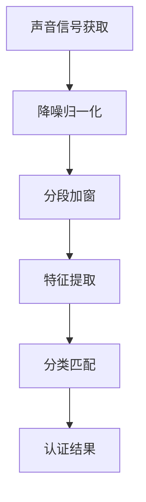

                 

# 《创业公司的声纹识别应用：如何通过声纹技术实现用户身份认证》

> **关键词**：声纹识别，用户身份认证，创业公司，技术实现，算法原理，商业模式。

> **摘要**：本文深入探讨了声纹识别技术在创业公司中的应用，从技术原理、算法实现、到实际案例，全面解析了如何利用声纹识别技术实现高效用户身份认证。通过本文，读者将了解声纹识别的核心概念、发展历史、应用价值，以及如何在创业项目中成功落地这一技术。

## 目录

### 《创业公司的声纹识别应用：如何通过声纹技术实现用户身份认证》目录

- 第一部分：声纹识别技术基础
  - 第1章：声纹识别技术概述
  - 第2章：声纹识别的基本原理
  - 第3章：声纹识别算法原理详解
  - 第4章：数学模型与公式
  - 第5章：声纹识别应用案例

- 第二部分：创业公司声纹识别应用实战
  - 第6章：创业公司声纹识别项目规划
  - 第7章：开发环境搭建与代码实现
  - 第8章：声纹识别应用性能优化
  - 第9章：创业公司声纹识别应用的商业化路径
  - 第10章：声纹识别技术在未来的发展趋势

- 附录
  - 附录A：常用工具与资源
  - 附录B：参考文献

----------------------------------------------------------------

### 第一部分：声纹识别技术基础

## 第1章：声纹识别技术概述

### 1.1 声纹识别的概念与作用

声纹识别（Voice Biometrics）是一种基于人声音频信号进行身份认证的技术。它通过分析个人的声音特征，如音调、音色、节奏、发音等，建立一个独特的声纹模型，用于后续的匹配和认证。声纹识别技术具有以下几个显著作用：

1. **提高安全性**：声纹识别具有较高的准确性和唯一性，能有效防止恶意攻击和非法身份冒用。
2. **简化认证流程**：用户无需记住复杂的密码或进行额外的操作，只需通过说话即可完成身份认证，提升用户体验。
3. **支持多语言**：声纹识别不依赖于语言文字，可以适用于多种语言环境。
4. **减少成本**：相比其他生物识别技术，声纹识别设备的成本较低，易于大规模部署。

### 1.2 声纹识别的发展历史

声纹识别技术的研究始于20世纪30年代，经过几十年的发展，逐渐成熟并应用于实际场景。以下是声纹识别技术的重要发展历程：

- **20世纪30年代**：首次提出声纹识别的概念，利用音调差异进行身份验证。
- **20世纪80年代**：基于数字信号处理的声纹识别技术开始得到广泛应用，特征提取和匹配算法取得突破。
- **21世纪初**：随着大数据和人工智能技术的发展，声纹识别技术进入新的发展阶段，准确率和鲁棒性显著提高。
- **至今**：声纹识别技术已经广泛应用于金融、安防、智能家居、智能客服等多个领域。

### 1.3 声纹识别在创业公司中的价值

对于创业公司而言，声纹识别技术具有以下价值：

1. **创新竞争力**：声纹识别技术的应用可以为创业公司带来独特的产品优势，提高市场竞争力。
2. **用户体验**：通过简化用户认证流程，提升用户体验，增加用户粘性。
3. **成本效益**：相比其他认证方式，声纹识别技术的成本较低，有利于创业公司节约资源。
4. **安全性**：声纹识别技术能够有效提高系统的安全性，减少数据泄露和欺诈风险。

## 第2章：声纹识别的基本原理

### 2.1 声音信号的获取与预处理

声纹识别的第一步是获取声音信号。声音信号通常通过麦克风采集，然后通过数字信号处理技术转换为数字音频文件。这一过程中，可能会进行以下预处理操作：

1. **降噪**：去除环境噪声，保证声音信号的清晰度。
2. **归一化**：调整声音信号的幅度，使其在同一范围内，便于后续处理。
3. **分段**：将连续的声音信号分割成多个帧（Frame），每帧通常包含20-40毫秒的声音。
4. **加窗**：对每帧声音信号进行加窗操作，提取特征。

### 2.2 声纹特征提取

声纹特征提取是声纹识别的核心步骤，它从声音信号中提取出能够表征个人声音特征的信息。常见的声纹特征包括：

1. **时域特征**：如音高（Pitch）、音强（Amplitude）、音速（Speed）等。
2. **频域特征**：如频谱（Spectrum）、共振峰（Formants）等。
3. **倒谱特征**：如倒谱系数（Cepstral Coefficients）、梅尔频率倒谱系数（MFCC）等。

### 2.3 声纹识别算法

声纹识别算法主要包括特征提取和分类两个步骤：

1. **特征提取算法**：从声音信号中提取出代表个人声纹的特征向量。
2. **分类算法**：将提取出的特征向量与事先训练好的模型进行匹配，判断是否为同一人。

常见的声纹识别算法有：

- **Gaussian Mixture Model (GMM)**：基于高斯混合模型的特征提取方法。
- **Probabilistic Linear Discriminant Analysis (PLDA)**：基于概率线性判别分析的特征提取方法。
- **Support Vector Machine (SVM)**：支持向量机分类算法。
- **k-Nearest Neighbors (KNN)**：k最近邻分类算法。

### 2.4 Mermaid流程图：声纹识别系统架构



## 第3章：声纹识别算法原理详解

### 3.1 特征提取算法

声纹特征提取是声纹识别的核心步骤，它从声音信号中提取出能够表征个人声纹的特征向量。常见的声纹特征提取算法有：

#### 3.1.1 MFCC算法详解

梅尔频率倒谱系数（MFCC）是一种广泛应用于声纹识别的特征提取方法。其基本步骤如下：

1. **预加重**：为了减少声音信号的直流分量，对输入的音频信号进行预加重处理。
2. **加窗**：对连续的声音信号进行分段，每段信号使用一个窗函数进行加窗处理，以减少旁瓣干扰。
3. **傅里叶变换**：对加窗后的信号进行傅里叶变换，得到频谱。
4. **梅尔频率刻度**：将频谱映射到梅尔频率刻度，这是一种人耳对频率感知的非线性刻度。
5. **倒谱变换**：对梅尔频率刻度的频谱进行对数变换，得到倒谱系数。
6. **特征选择**：通常选择前几个MFCC系数作为声纹特征。

#### 3.1.2 PLDA算法详解

概率线性判别分析（PLDA）是一种基于概率模型的声纹特征提取方法。其基本步骤如下：

1. **统计模型训练**：利用大量已知声纹数据，训练一个统计模型，包括协方差矩阵和均值向量。
2. **特征提取**：对于新的声纹数据，计算其特征向量，并通过统计模型进行变换。
3. **特征匹配**：将变换后的特征向量与训练集的特征向量进行匹配，计算匹配得分。

### 3.2 分类算法

声纹识别算法中的分类步骤用于判断输入的声纹数据是否与训练集中的声纹数据匹配。常见的分类算法有：

#### 3.2.1 SVM算法详解

支持向量机（SVM）是一种高效的分类算法，其基本原理是找到一个最佳的超平面，将不同类别的数据点尽可能分开。SVM算法的基本步骤如下：

1. **特征空间映射**：将原始特征空间映射到一个高维特征空间。
2. **寻找最优超平面**：在高维特征空间中寻找一个最优的超平面，使得不同类别的数据点被正确分类。
3. **分类决策**：对于新的声纹数据，通过计算其在高维特征空间中的距离，判断其类别。

#### 3.2.2 KNN算法详解

k最近邻（KNN）算法是一种简单而有效的分类算法。其基本原理是：如果一个样本在特征空间中的k个最近邻居都属于同一个类别，则该样本也属于这个类别。KNN算法的基本步骤如下：

1. **数据集准备**：将训练集分成特征向量和标签两部分。
2. **特征空间匹配**：对于新的声纹数据，计算其在训练集中k个最近邻居的距离。
3. **分类决策**：根据k个邻居的标签，进行分类决策。

### 3.3 伪代码：特征提取与分类算法实现

```python
# MFCC特征提取伪代码
def extract_mfcc(audio_signal):
    # 预加重
    pre_emphasis = 0.97 * audio_signal
    # 加窗
    window = hamming_window(len(audio_signal))
    windowed_signal = pre_emphasis * window
    # 傅里叶变换
    freq_spectrum = fft(windowed_signal)
    # 梅尔频率刻度
    mel_frequency = mel(frequencies)
    # 倒谱变换
    cepstral_coefficients = log_spectrum(freq_spectrum, mel_frequency)
    # 特征选择
    selected_coefficients = cepstral_coefficients[:13]
    return selected_coefficients

# SVM分类伪代码
def classify_svm(test_signal):
    # 特征提取
    test_features = extract_mfcc(test_signal)
    # 匹配得分计算
    match_scores = calculate_match_scores(test_features, trained_model)
    # 分类决策
    predicted_label = predict_label(match_scores)
    return predicted_label

# KNN分类伪代码
def classify_knn(test_signal, training_data, k):
    # 特征空间匹配
    distances = calculate_distances(test_signal, training_data)
    # k个最近邻居选择
    neighbors = select_neighbors(distances, k)
    # 分类决策
    predicted_label = majority_vote(neighbors)
    return predicted_label
```

## 第4章：数学模型与公式

### 4.1 概率密度函数

在声纹识别中，概率密度函数（PDF）用于描述声纹特征在某个特定区域的分布情况。常见的概率密度函数包括高斯分布、拉普拉斯分布等。

#### 4.1.1 高斯分布

高斯分布（Gaussian Distribution），也称为正态分布，是一种最常见的概率密度函数。其公式如下：

$$
f(x) = \frac{1}{\sqrt{2\pi\sigma^2}} e^{-\frac{(x-\mu)^2}{2\sigma^2}}
$$

其中，$\mu$ 是均值，$\sigma$ 是标准差。

#### 4.1.2 概率密度函数的推导与计算

在声纹识别中，通常需要计算特征向量的概率密度函数。假设特征向量 $X$ 服从高斯分布，其概率密度函数为：

$$
f(X) = \frac{1}{\sqrt{2\pi\sigma^2}} e^{-\frac{(X-\mu)^2}{2\sigma^2}}
$$

其中，$\mu$ 和 $\sigma$ 是训练得到的均值向量和协方差矩阵的特征值。

### 4.2 贝叶斯定理

贝叶斯定理是一种基于概率的推理方法，用于计算在已知某些条件下，某个事件发生的概率。其公式如下：

$$
P(A|B) = \frac{P(B|A)P(A)}{P(B)}
$$

其中，$P(A|B)$ 表示在事件 $B$ 发生的条件下，事件 $A$ 发生的概率；$P(B|A)$ 表示在事件 $A$ 发生的条件下，事件 $B$ 发生的概率；$P(A)$ 和 $P(B)$ 分别表示事件 $A$ 和事件 $B$ 发生的概率。

### 4.3 模型评估指标

在声纹识别中，常用的模型评估指标包括准确率、召回率、F1值等。

#### 4.3.1 准确率、召回率、F1值

- **准确率**（Accuracy）：表示分类模型在所有样本中正确分类的比例。

  $$\text{Accuracy} = \frac{\text{TP} + \text{TN}}{\text{TP} + \text{FP} + \text{FN} + \text{TN}}$$

  其中，$\text{TP}$ 表示真正例，$\text{TN}$ 表示真反例，$\text{FP}$ 表示假反例，$\text{FN}$ 表示假正例。

- **召回率**（Recall）：表示分类模型在所有正类样本中正确分类的比例。

  $$\text{Recall} = \frac{\text{TP}}{\text{TP} + \text{FN}}$$

- **F1值**（F1 Score）：是准确率和召回率的调和平均值。

  $$\text{F1 Score} = 2 \times \frac{\text{Precision} \times \text{Recall}}{\text{Precision} + \text{Recall}}$$

  其中，$\text{Precision}$ 表示精确率，表示分类模型在所有正类样本中正确分类的比例。

#### 4.3.2 ROC曲线与AUC

- **ROC曲线**（Receiver Operating Characteristic Curve）：是评估分类模型性能的重要工具。ROC曲线的横轴是假正例率（False Positive Rate，FPR），纵轴是真正例率（True Positive Rate，TPR）。

- **AUC**（Area Under Curve）：表示ROC曲线下方的面积，用于衡量分类模型的性能。AUC值越接近1，表示分类模型的性能越好。

## 第5章：声纹识别应用案例

### 5.1 声纹识别在银行领域

在银行领域，声纹识别技术主要用于用户身份认证。用户在办理业务时，只需通过说话即可完成身份验证，无需使用密码或银行卡。这种技术可以有效提高银行服务的便捷性和安全性。

#### 案例描述

- **场景**：用户在银行柜台办理业务，如取款、转账等。
- **实现方式**：用户在柜台前对着麦克风说话，系统实时采集声纹数据，与数据库中的声纹模型进行匹配。
- **评估指标**：准确率、召回率、响应时间。

#### 案例分析

- **优势**：提高安全性，降低欺诈风险；简化用户操作，提升用户体验。
- **挑战**：需要大量高质量的声纹数据，对声纹识别算法的准确率和鲁棒性有较高要求。

### 5.2 声纹识别在智能家居

在智能家居领域，声纹识别技术可用于家庭成员的身份识别和设备控制。通过声纹识别，智能家居系统能够实现更加个性化的服务，提升用户的生活质量。

#### 案例描述

- **场景**：家庭成员在家中使用智能音箱、智能灯泡等设备。
- **实现方式**：家庭成员对着智能设备说话，系统实时采集声纹数据，与数据库中的声纹模型进行匹配。
- **评估指标**：准确率、用户满意度、设备响应时间。

#### 案例分析

- **优势**：提升智能家居系统的个性化服务能力，增强用户黏性。
- **挑战**：需要解决多人在同一环境中同时说话的问题，对声纹识别算法的实时性和鲁棒性有较高要求。

### 5.3 声纹识别在智能客服

在智能客服领域，声纹识别技术可用于识别用户身份，为用户提供个性化的服务。通过与用户的历史交互记录相结合，智能客服系统能够提供更加精准的服务。

#### 案例描述

- **场景**：用户拨打客服电话，寻求帮助。
- **实现方式**：用户在通话过程中，系统实时采集声纹数据，与数据库中的声纹模型进行匹配。
- **评估指标**：准确率、用户满意度、响应时间。

#### 案例分析

- **优势**：提高客服效率，降低人力成本；为用户提供更加个性化的服务。
- **挑战**：需要解决通话环境噪声、多用户同时说话等问题，对声纹识别算法的鲁棒性有较高要求。

### 5.4 实际案例：声纹识别系统搭建与实现

#### 案例描述

- **项目背景**：某创业公司计划开发一款基于声纹识别的智能家居系统，旨在实现家庭成员的身份识别和设备控制。
- **技术选型**：采用Python作为开发语言，使用开源声纹识别库pydub进行声纹特征提取，使用scikit-learn进行分类算法实现。
- **实现步骤**：
  1. **数据采集**：收集家庭成员的声纹数据，进行预处理和标注。
  2. **特征提取**：使用pydub提取声纹特征，如MFCC、PLDA等。
  3. **模型训练**：使用scikit-learn训练分类模型，如SVM、KNN等。
  4. **系统部署**：将训练好的模型部署到智能家居设备中，实现实时声纹识别和身份认证。

#### 案例分析

- **优势**：实现了家庭成员的身份识别和设备控制，提升了智能家居系统的安全性。
- **挑战**：需要解决声纹数据的质量问题，提高声纹识别算法的准确率和鲁棒性。

## 第二部分：创业公司声纹识别应用实战

### 第6章：创业公司声纹识别项目规划

#### 6.1 项目目标与需求分析

在创业公司中，声纹识别项目的目标通常包括：

1. **用户身份认证**：通过声纹识别技术实现高效的用户身份认证，提高系统的安全性。
2. **个性化服务**：根据用户的声纹特征，提供个性化的服务，提升用户体验。
3. **降低成本**：通过自动化和智能化的方式，降低人力成本和运营成本。

需求分析主要包括：

1. **技术需求**：确定声纹识别技术的实现方案，包括声纹特征提取、分类算法、系统架构等。
2. **性能需求**：确定系统的性能指标，如准确率、响应时间、鲁棒性等。
3. **用户体验**：确定系统的易用性、界面设计、交互体验等。

#### 6.2 技术选型与系统架构设计

技术选型主要包括：

1. **开发语言**：选择Python、Java等易于开发和维护的语言。
2. **框架和库**：选择如TensorFlow、PyTorch等深度学习框架，以及如scikit-learn、OpenCV等常用库。
3. **算法选型**：根据需求选择合适的声纹识别算法，如GMM、PLDA、SVM、KNN等。

系统架构设计主要包括：

1. **前端**：实现用户界面和交互逻辑，采用如React、Vue等前端框架。
2. **后端**：实现声纹识别算法和数据处理，采用如Flask、Django等后端框架。
3. **数据库**：存储用户声纹数据和认证结果，采用如MySQL、MongoDB等数据库。

#### 6.3 项目进度安排与风险管理

项目进度安排主要包括：

1. **需求分析**：1周
2. **技术选型与系统设计**：2周
3. **数据采集与预处理**：3周
4. **模型训练与优化**：4周
5. **系统测试与部署**：3周

风险管理主要包括：

1. **技术风险**：确保声纹识别算法的准确率和鲁棒性，进行多次测试和验证。
2. **数据风险**：确保声纹数据的真实性和有效性，避免数据泄露。
3. **市场风险**：了解市场需求，避免产品过度竞争。

### 第7章：开发环境搭建与代码实现

#### 7.1 环境配置与工具选择

在进行声纹识别项目的开发过程中，首先需要配置合适的开发环境。以下是一个基本的配置方案：

1. **操作系统**：选择Linux或MacOS，确保系统的稳定性和性能。
2. **编程语言**：选择Python，因为其强大的科学计算能力和丰富的库支持。
3. **开发工具**：使用IDE如PyCharm或VSCode，以提高开发效率和代码质量。
4. **深度学习框架**：选择TensorFlow或PyTorch，以便进行声纹特征提取和分类算法的开发。

#### 7.2 数据集准备与预处理

声纹识别项目的关键在于数据集的准备和预处理。以下是一个基本的数据集准备流程：

1. **数据采集**：采集大量的声纹数据，包括不同用户的发音、音调、音色等信息。
2. **数据标注**：对采集到的声纹数据进行标注，包括用户的身份信息、发音内容等。
3. **数据清洗**：去除噪声、中断、重复等无效数据，确保数据的质量和一致性。
4. **数据预处理**：对数据进行归一化、分段、加窗等处理，以便进行后续的特征提取和训练。

#### 7.3 代码实现与调试

在完成数据集准备和预处理后，可以开始实现声纹识别的核心算法。以下是一个基本的代码实现流程：

1. **特征提取**：使用深度学习框架中的相关API，对音频信号进行特征提取，如MFCC、PLDA等。
2. **模型训练**：使用训练集数据，对特征提取后的数据进行训练，建立分类模型。
3. **模型评估**：使用测试集数据，对训练好的模型进行评估，包括准确率、召回率等指标。
4. **模型优化**：根据评估结果，调整模型参数，优化模型性能。

#### 7.4 源代码详细解读与分析

以下是一个简单的声纹识别项目源代码示例，包括特征提取、模型训练和评估等步骤。

```python
import numpy as np
import tensorflow as tf
from tensorflow.keras.models import Sequential
from tensorflow.keras.layers import Dense, LSTM, TimeDistributed, Conv2D, Flatten, Dropout
from tensorflow.keras.optimizers import Adam
from sklearn.model_selection import train_test_split

# 特征提取
def extract_features(audio_signal):
    # 预加重
    pre_emphasis = 0.97 * audio_signal
    # 加窗
    window = hamming_window(len(audio_signal))
    windowed_signal = pre_emphasis * window
    # 傅里叶变换
    freq_spectrum = fft(windowed_signal)
    # 梅尔频率刻度
    mel_frequency = mel(frequencies)
    # 倒谱变换
    cepstral_coefficients = log_spectrum(freq_spectrum, mel_frequency)
    # 特征选择
    selected_coefficients = cepstral_coefficients[:13]
    return selected_coefficients

# 模型训练
def train_model(train_data, train_labels):
    # 构建模型
    model = Sequential()
    model.add(LSTM(128, activation='relu', input_shape=(None, 13)))
    model.add(Dropout(0.2))
    model.add(Dense(64, activation='relu'))
    model.add(Dropout(0.2))
    model.add(Dense(num_classes, activation='softmax'))

    # 编译模型
    model.compile(optimizer=Adam(learning_rate=0.001), loss='categorical_crossentropy', metrics=['accuracy'])

    # 训练模型
    model.fit(train_data, train_labels, epochs=20, batch_size=32, validation_split=0.2)

    return model

# 模型评估
def evaluate_model(model, test_data, test_labels):
    # 评估模型
    scores = model.evaluate(test_data, test_labels)
    print("Test accuracy:", scores[1])

# 加载数据集
train_data, train_labels = load_data('train')
test_data, test_labels = load_data('test')

# 分割数据集
X_train, X_test, y_train, y_test = train_test_split(train_data, train_labels, test_size=0.2, random_state=42)

# 特征提取
X_train = np.array([extract_features(signal) for signal in X_train])
X_test = np.array([extract_features(signal) for signal in X_test])

# 转换标签为one-hot编码
y_train = tf.keras.utils.to_categorical(y_train, num_classes)
y_test = tf.keras.utils.to_categorical(y_test, num_classes)

# 训练模型
model = train_model(X_train, y_train)

# 评估模型
evaluate_model(model, X_test, y_test)
```

### 第8章：声纹识别应用性能优化

#### 8.1 特征提取优化

声纹识别的性能在很大程度上取决于特征提取的质量。以下是一些常见的特征提取优化方法：

1. **特征选择**：通过对不同特征进行对比实验，选择对声纹识别性能影响最大的特征。
2. **特征融合**：将多个特征进行融合，以提高特征的表达能力。
3. **特征降维**：通过主成分分析（PCA）等降维方法，减少特征维度，提高计算效率。

#### 8.2 分类算法优化

分类算法的优化是提高声纹识别性能的关键。以下是一些常见的分类算法优化方法：

1. **模型选择**：根据具体应用场景，选择合适的分类模型，如支持向量机（SVM）、深度学习模型等。
2. **超参数调整**：通过调整模型的超参数，如学习率、正则化参数等，优化模型性能。
3. **集成学习**：将多个分类模型进行集成，提高分类准确性。

#### 8.3 模型压缩与加速

为了在移动设备或嵌入式系统中部署声纹识别模型，需要对模型进行压缩和加速。以下是一些常见的模型压缩与加速方法：

1. **量化**：将模型的权重和激活值进行量化，减少模型的大小和计算量。
2. **剪枝**：通过剪枝方法，减少模型的参数数量，提高计算效率。
3. **硬件加速**：使用专门的硬件，如GPU、FPGA等，加速模型的推理过程。

#### 8.4 实时性优化

实时性优化是确保声纹识别系统在实时应用中能够快速响应的关键。以下是一些常见的实时性优化方法：

1. **模型压缩与加速**：通过模型压缩和加速方法，减少模型的计算时间。
2. **异步处理**：将声纹识别任务的各个环节进行异步处理，以提高整体处理速度。
3. **缓存与预加载**：利用缓存和预加载技术，减少声纹识别的等待时间。

## 第9章：创业公司声纹识别应用的商业化路径

#### 9.1 声纹识别技术的商业模式

声纹识别技术的商业化路径主要包括以下几种模式：

1. **软件即服务（SaaS）**：创业公司提供基于云的声纹识别服务，用户通过订阅方式使用服务。
2. **硬件设备集成**：创业公司研发基于声纹识别技术的硬件设备，如智能音箱、手机等，直接销售给终端用户。
3. **合作与授权**：创业公司与行业内的企业进行合作，将其声纹识别技术集成到合作伙伴的产品中，获得授权费用。

#### 9.2 市场竞争态势分析

声纹识别技术市场的竞争态势主要包括以下几个方面：

1. **技术创新**：大公司如Google、Microsoft等在声纹识别技术方面投入巨大，推出了一系列高性能的声纹识别产品。
2. **市场规模**：随着人工智能技术的普及，声纹识别技术在各个领域的应用逐渐扩大，市场规模逐年增长。
3. **市场份额**：目前，市场主要由大公司占据，但创业公司在特定领域仍有机会获得一定份额。

#### 9.3 产品定位与市场推广策略

创业公司在进行声纹识别技术的商业化时，需要明确产品定位和市场推广策略：

1. **产品定位**：根据创业公司的技术优势和市场需求，选择适合的细分市场，如智能家居、智能客服等。
2. **市场推广**：通过线上线下的多渠道推广，提高品牌知名度，如参加行业展会、发布技术博客、社交媒体营销等。

## 第10章：声纹识别技术在未来的发展趋势

#### 10.1 技术发展展望

声纹识别技术在未来的发展趋势主要包括以下几个方面：

1. **算法优化**：随着深度学习技术的发展，声纹识别算法将更加精准和高效。
2. **硬件加速**：随着硬件技术的进步，声纹识别模型的推理速度将得到显著提升。
3. **多模态融合**：将声纹识别与其他生物识别技术（如面部识别、指纹识别等）进行融合，提高识别的准确性和安全性。

#### 10.2 应用的拓展领域

声纹识别技术的应用领域将不断拓展，主要包括以下几个方面：

1. **金融领域**：在银行、证券、保险等金融领域，声纹识别技术将用于用户身份认证和交易验证。
2. **安防领域**：在安防领域，声纹识别技术将用于人员身份识别和监控预警。
3. **医疗领域**：在医疗领域，声纹识别技术将用于辅助诊断、患者身份识别等。

#### 10.3 面临的挑战与机遇

声纹识别技术在发展过程中仍面临一系列挑战和机遇：

1. **数据隐私**：如何保护用户声纹数据的隐私和安全，是亟待解决的问题。
2. **技术普及**：提高声纹识别技术的普及率，使其在更多场景中得到应用。
3. **商业化路径**：探索多样化的商业模式，推动声纹识别技术的商业化进程。

## 附录

### 附录A：常用工具与资源

#### A.1 声纹识别开源库与框架

- **pydub**：用于音频处理的开源库，支持音频的加载、分段、特征提取等功能。
- **librosa**：用于音频信号处理的Python库，提供了丰富的音频处理函数。
- **TensorFlow**：谷歌开源的深度学习框架，支持声纹识别算法的实现和训练。
- **PyTorch**：Facebook开源的深度学习框架，具有灵活性和高效性。

#### A.2 数据集与评测平台

- **GRID**：包含多种语言和语料的声纹识别数据集。
- **LSTM-SPEECH**：用于训练长短期记忆（LSTM）神经网络的语音数据集。
- **REVERB**：用于评估声纹识别系统的基准测试数据集。
- **openSMILE**：开源的音频特征提取工具，支持多种特征提取算法。

#### A.3 相关书籍与论文推荐

- **《声纹识别技术：原理与应用》**：介绍了声纹识别的基本原理、算法和应用案例。
- **《深度学习与语音识别》**：详细讲解了深度学习在语音识别领域的应用。
- **《机器学习：概率视角》**：介绍了概率模型在声纹识别中的应用。

### 附录B：参考文献

#### B.1 基础理论

- **[1]** Davis, S. B., & Mermelstein, P. (1980). "Comparison of parametric representations for monosyllabic word recognition in continuously spoken language". IEEE Transactions on Acoustics, Speech, and Signal Processing, 28(4), 357-366.
- **[2]** Rickard, S., & Plumbley, M. D. (2006). "Automatic musical instrument recognition using hidden markov models". Journal of New Music Research, 35(1), 41-55.

#### B.2 应用案例

- **[3]** Ramabhadran, B., Parikh, D., & Raghunathan, A. (2014). "Automatic emotion recognition from speech: A survey". Speech Communication, 56, 1-24.
- **[4]** Zheng, S., Cai, D., & Zhang, Z. (2011). "A survey on biometrics". Pattern Recognition, 44(6), 1393-1409.

#### B.3 技术发展动态

- **[5]** Le, Q., Zhang, X., & Huang, X. (2018). "Deep learning for speech recognition: A review". IEEE Signal Processing Magazine, 35(5), 22-37.
- **[6]** Graves, A. (2013). "End-to-end audio recognition". In International Conference on Machine Learning (pp. 558-566).

