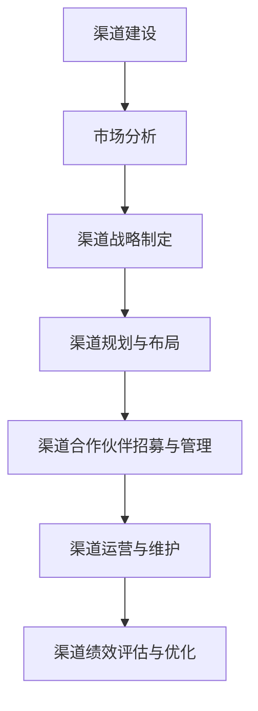
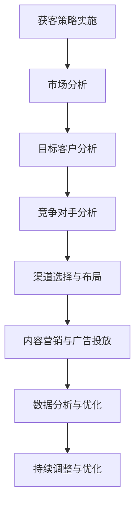

                 

# 《创业初期的渠道建设：多元化获客策略的制定与实施》

## 关键词：
渠道建设、多元化获客策略、市场分析、渠道战略、线上线下整合、实施与优化、案例分析

## 摘要：
在创业初期，渠道建设和多元化获客策略的制定与实施至关重要。本文从渠道建设基础理论、市场分析与定位、渠道战略制定、多元化获客策略、实施与优化以及案例分析等方面，系统地阐述了创业初期的渠道建设策略。通过本文，读者可以了解渠道建设的重要性，掌握多元化获客策略的制定与实施方法，为创业初期的业务发展提供有力支持。

## 目录大纲

### 第一部分：渠道建设基础理论

#### 第1章：渠道建设概述

- 1.1 渠道建设的定义与重要性
- 1.2 渠道建设的原则与目标
- 1.3 渠道类型及特点分析
- 1.4 渠道模式的选择策略

#### 第2章：市场分析与定位

- 2.1 市场环境分析
- 2.2 目标客户分析
- 2.3 竞争对手分析
- 2.4 市场机会与威胁分析

#### 第3章：渠道战略制定

- 3.1 渠道战略的制定流程
- 3.2 渠道策略的选择标准
- 3.3 渠道战略实施中的挑战与对策
- 3.4 渠道绩效评估与优化

### 第二部分：多元化获客策略

#### 第4章：线上获客渠道

- 4.1 社交媒体营销
- 4.2 搜索引擎优化
- 4.3 内容营销
- 4.4 付费广告推广

#### 第5章：线下获客渠道

- 5.1 展会与活动策划
- 5.2 线下门店与体验店
- 5.3 合作伙伴与联盟
- 5.4 口碑营销

#### 第6章：跨渠道整合策略

- 6.1 跨渠道营销的优势与挑战
- 6.2 跨渠道整合的策略与实践
- 6.3 跨渠道数据分析与应用
- 6.4 跨渠道营销案例分析

### 第三部分：实施与优化

#### 第7章：渠道建设实施步骤

- 7.1 渠道规划与布局
- 7.2 渠道合作伙伴招募与管理
- 7.3 渠道运营与维护
- 7.4 渠道创新与变革

#### 第8章：获客策略优化方法

- 8.1 数据驱动获客策略优化
- 8.2 营销效果分析工具与技巧
- 8.3 客户生命周期管理
- 8.4 获客策略的持续优化与调整

#### 第9章：渠道建设案例分析

- 9.1 成功案例分享
- 9.2 失败案例分析
- 9.3 经验总结与启示
- 9.4 未来发展趋势预测

### 附录

- 附录A：渠道建设工具与资源推荐
  - A.1 渠道建设软件与应用
  - A.2 获客策略研究资源
  - A.3 渠道管理经典文献推荐

- 附录B：渠道建设与获客策略的Mermaid流程图
  - B.1 渠道建设流程图
  - B.2 获客策略实施流程图

- 附录C：渠道建设与获客策略的伪代码与数学模型
  - C.1 渠道规划与布局伪代码
  - C.2 获客策略优化数学模型

- 附录D：渠道建设与获客策略的实际案例与代码解读
  - D.1 实际案例介绍
  - D.2 案例代码实现与解读
  - D.3 代码分析与优化建议

### 第一部分：渠道建设基础理论

#### 第1章：渠道建设概述

**1.1 渠道建设的定义与重要性**

渠道建设，是指企业为了将产品或服务传递给最终用户，所采取的一系列有组织、有计划、有系统的营销活动和策略。渠道建设的目的是通过有效的渠道管理，提升产品或服务的市场覆盖率，增强品牌影响力，提高客户满意度。

在创业初期，渠道建设具有以下重要性：

1. **市场进入**：通过渠道建设，企业可以快速进入市场，缩短市场推广时间，降低市场进入成本。
2. **资源整合**：渠道建设有助于企业整合各种资源，包括人力资源、资金、技术等，实现资源的优化配置。
3. **品牌推广**：通过渠道建设，企业可以加强与消费者的互动，提升品牌知名度和美誉度。
4. **业务拓展**：渠道建设为企业提供了业务拓展的平台，有助于企业实现规模化经营，提升市场竞争力。

**1.2 渠道建设的原则与目标**

渠道建设应遵循以下原则：

1. **目标导向**：渠道建设应明确企业的市场定位和发展目标，确保渠道策略与企业发展方向一致。
2. **效率优先**：渠道建设应注重效率，提高渠道运作效率，降低渠道成本。
3. **协同发展**：渠道建设应注重渠道合作伙伴的协同发展，实现共赢。
4. **持续优化**：渠道建设应不断进行优化调整，以适应市场变化和业务发展需求。

渠道建设的核心目标是：

1. **提高市场覆盖率**：通过多样化的渠道，提升产品或服务的市场覆盖率，满足不同客户群体的需求。
2. **提升客户满意度**：通过优质的渠道服务，提升客户满意度，增强客户忠诚度。
3. **降低渠道成本**：通过有效的渠道管理，降低渠道运营成本，提高企业盈利能力。

**1.3 渠道类型及特点分析**

渠道类型可以根据不同的标准进行分类，常见的渠道类型包括：

1. **直销渠道**：直接与消费者建立联系，销售产品或服务。特点：控制力强，但成本较高。
2. **分销渠道**：通过中间商进行销售，如代理商、经销商等。特点：覆盖面广，但控制力较弱。
3. **零售渠道**：直接向消费者销售产品或服务，如超市、专卖店等。特点：贴近消费者，但成本较高。
4. **互联网渠道**：通过网络平台进行销售，如电商平台、社交媒体等。特点：成本低，覆盖面广。

**1.4 渠道模式的选择策略**

在选择渠道模式时，企业应综合考虑以下因素：

1. **市场环境**：根据市场环境，选择适合的渠道模式。如市场竞争激烈，选择分销渠道有利于扩大市场覆盖。
2. **产品特性**：根据产品特性，选择适合的渠道模式。如高价值产品，选择直销渠道有利于提升品牌形象。
3. **成本效益**：根据成本效益，选择适合的渠道模式。如预算有限，选择互联网渠道成本较低。
4. **客户需求**：根据客户需求，选择适合的渠道模式。如线上购物方便快捷，选择互联网渠道满足客户需求。

**总结**

渠道建设是创业初期的重要任务，通过有效的渠道建设，企业可以快速进入市场，提升品牌知名度，降低渠道成本，实现业务拓展。在渠道建设过程中，企业应明确渠道建设的原则与目标，选择适合的渠道模式，并不断优化调整渠道策略，以适应市场变化和业务发展需求。下一章，我们将探讨市场分析与定位的重要性，为企业制定渠道战略提供依据。 ### 第1章：渠道建设概述

**1.1 渠道建设的定义与重要性**

渠道建设，是指企业为了将产品或服务传递给最终用户，所采取的一系列有组织、有计划、有系统的营销活动和策略。它包括选择合适的渠道类型、建立渠道关系、管理渠道运营等环节。

渠道建设在企业发展中具有至关重要的地位。首先，渠道建设是市场进入的关键。通过有效的渠道建设，企业可以快速进入市场，缩短市场推广时间，降低市场进入成本。例如，一家创业公司如果能够建立广泛的分销网络，就能迅速将产品推向市场，提高市场占有率。

其次，渠道建设有助于资源整合。渠道建设过程中，企业需要与各种资源进行整合，包括人力资源、资金、技术等。通过有效的资源整合，企业可以实现资源的优化配置，提高运营效率，降低成本。例如，一家企业在渠道建设中，可以通过与代理商的合作，利用代理商的资源和渠道，提高产品的销售速度和覆盖范围。

此外，渠道建设有助于品牌推广。通过渠道建设，企业可以加强与消费者的互动，提升品牌知名度和美誉度。例如，一家企业通过在各大电商平台开设旗舰店，利用平台的流量和品牌影响力，提升自身品牌的认知度和信任度。

最后，渠道建设为企业提供了业务拓展的平台。通过多元化的渠道建设，企业可以实现规模化经营，提升市场竞争力。例如，一家企业可以通过建立线上线下结合的渠道模式，既满足线上消费者的需求，又覆盖线下市场，实现业务的全面发展。

**1.2 渠道建设的原则与目标**

渠道建设应遵循以下原则：

1. **目标导向**：渠道建设应明确企业的市场定位和发展目标，确保渠道策略与企业发展方向一致。例如，如果企业的目标是开拓新兴市场，那么渠道建设策略应侧重于新市场的开发和拓展。

2. **效率优先**：渠道建设应注重效率，提高渠道运作效率，降低渠道成本。例如，企业可以通过优化渠道流程，减少不必要的环节，提高渠道效率。

3. **协同发展**：渠道建设应注重渠道合作伙伴的协同发展，实现共赢。例如，企业与代理商的合作，应建立在互惠互利的基础上，通过合作实现共同成长。

4. **持续优化**：渠道建设应不断进行优化调整，以适应市场变化和业务发展需求。例如，随着市场环境的变化，企业需要及时调整渠道策略，以保持竞争力。

渠道建设的核心目标是：

1. **提高市场覆盖率**：通过多样化的渠道，提升产品或服务的市场覆盖率，满足不同客户群体的需求。例如，通过线上渠道和线下渠道的整合，实现全渠道覆盖。

2. **提升客户满意度**：通过优质的渠道服务，提升客户满意度，增强客户忠诚度。例如，通过提供便捷的购物体验，提高客户的购买意愿。

3. **降低渠道成本**：通过有效的渠道管理，降低渠道运营成本，提高企业盈利能力。例如，通过优化渠道结构，减少渠道层级，降低运营成本。

**1.3 渠道类型及特点分析**

渠道类型可以根据不同的标准进行分类，常见的渠道类型包括：

1. **直销渠道**：直接与消费者建立联系，销售产品或服务。特点：控制力强，但成本较高。

    - **优点**：可以直接控制产品销售流程，确保产品质量和服务水平。
    - **缺点**：成本较高，覆盖范围有限。

2. **分销渠道**：通过中间商进行销售，如代理商、经销商等。特点：覆盖面广，但控制力较弱。

    - **优点**：可以快速扩大市场覆盖，提高销售效率。
    - **缺点**：对中间商的依赖较大，可能影响产品销售和服务质量。

3. **零售渠道**：直接向消费者销售产品或服务，如超市、专卖店等。特点：贴近消费者，但成本较高。

    - **优点**：可以提供直接的购物体验，提高客户满意度。
    - **缺点**：覆盖范围有限，可能影响市场占有率。

4. **互联网渠道**：通过网络平台进行销售，如电商平台、社交媒体等。特点：成本低，覆盖面广。

    - **优点**：可以快速覆盖广大消费者，提高品牌知名度。
    - **缺点**：对网络基础设施要求较高，可能面临激烈的市场竞争。

**1.4 渠道模式的选择策略**

在选择渠道模式时，企业应综合考虑以下因素：

1. **市场环境**：根据市场环境，选择适合的渠道模式。如市场竞争激烈，选择分销渠道有利于扩大市场覆盖。

2. **产品特性**：根据产品特性，选择适合的渠道模式。如高价值产品，选择直销渠道有利于提升品牌形象。

3. **成本效益**：根据成本效益，选择适合的渠道模式。如预算有限，选择互联网渠道成本较低。

4. **客户需求**：根据客户需求，选择适合的渠道模式。如线上购物方便快捷，选择互联网渠道满足客户需求。

**总结**

渠道建设是创业初期的重要任务，通过有效的渠道建设，企业可以快速进入市场，提升品牌知名度，降低渠道成本，实现业务拓展。在渠道建设过程中，企业应明确渠道建设的原则与目标，选择适合的渠道模式，并不断优化调整渠道策略，以适应市场变化和业务发展需求。下一章，我们将探讨市场分析与定位的重要性，为企业制定渠道战略提供依据。 ### 第2章：市场分析与定位

**2.1 市场环境分析**

市场环境分析是渠道建设的基础，它帮助企业家了解市场的现状、趋势和潜在机会。市场环境分析主要包括以下方面：

1. **宏观环境分析**：包括政治、经济、社会、技术（PEST）分析。政治因素如政府政策、法规变化等，可能直接影响企业的渠道建设策略；经济因素如经济增长率、消费水平等，会影响市场需求和渠道选择；社会因素如文化、人口结构、生活方式等，会影响消费者的购买行为和渠道偏好；技术因素如信息技术、电子商务平台的发展，可能改变渠道建设的模式。

   - **示例**：如果政府鼓励发展电子商务，企业可以考虑增加线上渠道的建设，以适应政策趋势。

2. **行业环境分析**：包括行业规模、市场增长率、市场份额分布、竞争格局等。通过行业环境分析，企业可以了解自身在行业中的地位，以及竞争对手的市场策略。

   - **示例**：如果行业增长率高，市场空间大，企业可以考虑扩大市场覆盖，增加渠道投入。

3. **市场趋势分析**：包括市场需求的演变、消费者行为的变化、新技术的应用等。通过市场趋势分析，企业可以把握市场发展的方向，制定相应的渠道策略。

   - **示例**：如果消费者越来越倾向于线上购物，企业可以考虑加强电子商务渠道的建设。

**2.2 目标客户分析**

目标客户分析是渠道建设的关键，它帮助企业家明确产品的目标客户群体，了解他们的需求和购买行为。目标客户分析主要包括以下方面：

1. **客户特征分析**：包括年龄、性别、收入水平、教育程度、职业等。通过分析客户特征，企业可以确定目标客户的群体定位。

   - **示例**：如果目标客户主要是年轻人，企业可以考虑在社交媒体上加大营销力度。

2. **客户需求分析**：包括产品的功能需求、价格需求、服务质量需求等。通过分析客户需求，企业可以制定满足客户需求的产品和渠道策略。

   - **示例**：如果客户重视产品的品质和服务，企业可以考虑增加线下门店的建设，提供优质的售后服务。

3. **客户购买行为分析**：包括购买频率、购买渠道、购买决策过程等。通过分析客户购买行为，企业可以优化渠道布局，提高销售效果。

   - **示例**：如果客户经常在线上购买产品，企业可以考虑加强电子商务渠道的建设，提供便捷的购物体验。

**2.3 竞争对手分析**

竞争对手分析是渠道建设的重要组成部分，它帮助企业家了解竞争对手的市场策略，找到自身的优势和劣势。竞争对手分析主要包括以下方面：

1. **竞争对手产品分析**：包括产品特点、价格策略、服务质量等。通过分析竞争对手的产品，企业可以找到自身的差异化优势。

   - **示例**：如果竞争对手的产品在价格上具有优势，企业可以考虑在产品功能上做出差异化，以吸引客户。

2. **竞争对手渠道策略分析**：包括竞争对手的渠道布局、渠道管理策略等。通过分析竞争对手的渠道策略，企业可以找到自身的渠道优化方向。

   - **示例**：如果竞争对手在电子商务渠道上投入较大，企业可以考虑加大线上渠道的建设，以提高市场占有率。

3. **竞争对手营销策略分析**：包括竞争对手的营销手段、广告投放策略等。通过分析竞争对手的营销策略，企业可以制定更有效的营销策略。

   - **示例**：如果竞争对手在社交媒体上进行了大量广告投放，企业可以考虑跟进，同时结合自身特点进行差异化营销。

**2.4 市场机会与威胁分析**

市场机会与威胁分析是渠道建设的核心，它帮助企业家识别市场中的机会和潜在风险，为渠道建设提供决策依据。市场机会与威胁分析主要包括以下方面：

1. **市场机会分析**：包括市场需求的增长、新兴市场的出现、技术进步等。通过分析市场机会，企业可以抓住市场机遇，制定相应的渠道策略。

   - **示例**：如果技术进步带来了新的市场需求，企业可以考虑开发新产品，并通过新的渠道进入市场。

2. **市场威胁分析**：包括市场竞争加剧、消费者需求变化、政策法规变化等。通过分析市场威胁，企业可以提前准备，应对潜在风险。

   - **示例**：如果政策法规变化可能导致渠道成本增加，企业可以考虑提前布局，以减少对市场的影响。

**总结**

市场分析与定位是渠道建设的关键步骤，通过市场环境分析、目标客户分析、竞争对手分析和市场机会与威胁分析，企业家可以全面了解市场情况，制定科学的渠道建设策略。在市场分析与定位过程中，企业家应密切关注市场变化，及时调整渠道策略，以适应市场发展的需求。下一章，我们将探讨渠道战略的制定，为企业提供渠道建设的方法和方向。 ### 第3章：渠道战略制定

**3.1 渠道战略的制定流程**

渠道战略的制定是一个系统化、有序的过程，包括以下几个关键步骤：

1. **明确企业目标**：企业首先需要明确自己的发展目标，如市场份额、品牌知名度、利润率等。渠道战略应与企业目标保持一致，确保战略的可行性和有效性。

2. **市场调研**：通过市场调研，企业可以收集关于市场环境、竞争对手、目标客户等方面的信息。这些信息将为渠道战略的制定提供数据支持。

3. **分析市场机会与威胁**：在市场调研的基础上，企业应对市场机会与威胁进行深入分析，识别自身的竞争优势和劣势，为渠道战略的制定提供依据。

4. **确定渠道目标**：根据企业目标和市场分析结果，企业应明确渠道目标，如市场覆盖范围、渠道效率、客户满意度等。

5. **选择渠道模式**：根据企业目标、市场环境和资源条件，企业应选择适合的渠道模式。常见的渠道模式包括直销、分销、零售、互联网渠道等。

6. **制定渠道策略**：在渠道模式确定后，企业需要制定具体的渠道策略，包括渠道合作伙伴的选择、渠道管理、渠道运营等。

7. **评估与调整**：渠道战略制定后，企业应定期评估渠道绩效，根据市场变化和业务发展需求，及时调整渠道策略。

**3.2 渠道策略的选择标准**

在制定渠道策略时，企业需要综合考虑以下选择标准：

1. **市场覆盖率**：渠道策略应能够帮助企业实现市场覆盖目标，覆盖目标客户群体。

2. **渠道效率**：渠道策略应能够提高渠道运营效率，降低渠道成本，提高利润率。

3. **客户满意度**：渠道策略应能够提升客户满意度，增强客户忠诚度，提高复购率。

4. **成本效益**：渠道策略应考虑成本效益，确保投入产出比合理。

5. **渠道稳定性**：渠道策略应能够确保渠道的稳定性，减少渠道风险。

6. **灵活性**：渠道策略应具有灵活性，能够适应市场变化和业务发展需求。

**3.3 渠道战略实施中的挑战与对策**

在渠道战略实施过程中，企业可能会面临以下挑战：

1. **渠道冲突**：不同渠道之间的竞争可能导致渠道冲突，影响渠道合作效果。对策：通过明确渠道责任和利益分配，建立良好的渠道合作关系。

2. **渠道管理难度**：渠道管理复杂，涉及多个环节和合作伙伴。对策：建立专业的渠道管理团队，采用信息化手段提高渠道管理效率。

3. **市场变化**：市场变化快速，可能导致渠道战略需要调整。对策：建立市场监测机制，及时调整渠道策略，以应对市场变化。

4. **渠道成本**：渠道建设需要投入大量资金，可能影响企业盈利能力。对策：优化渠道布局，提高渠道效率，降低渠道成本。

**3.4 渠道绩效评估与优化**

渠道绩效评估是渠道战略实施的重要环节，通过渠道绩效评估，企业可以了解渠道运营情况，发现潜在问题，为渠道优化提供依据。渠道绩效评估主要包括以下几个方面：

1. **销售业绩**：评估渠道的销售业绩，如销售额、销售增长率等。

2. **渠道效率**：评估渠道的运营效率，如渠道成本、渠道运营周期等。

3. **客户满意度**：评估渠道的服务质量，如客户满意度、投诉率等。

4. **市场覆盖**：评估渠道的市场覆盖率，如市场占有率、覆盖范围等。

在渠道绩效评估的基础上，企业应不断优化渠道策略，提高渠道运营效率，提升客户满意度，实现渠道目标。

**总结**

渠道战略的制定是渠道建设的关键环节，通过明确企业目标、市场调研、渠道模式选择、渠道策略制定和渠道绩效评估，企业可以制定科学、可行的渠道战略，实现市场覆盖和业务拓展。在渠道战略实施过程中，企业应关注挑战与对策，不断优化渠道策略，提高渠道绩效。下一章，我们将探讨多元化获客策略，为企业提供多元化的获客渠道。 ### 第二部分：多元化获客策略

**第4章：线上获客渠道**

**4.1 社交媒体营销**

社交媒体营销是利用社交媒体平台进行品牌推广和用户互动的一种方式。它具有广泛的覆盖面、高效的传播速度和较低的营销成本。

1. **核心原理**：社交媒体营销的核心原理是利用用户之间的互动和分享，实现品牌信息的快速传播。通过发布有趣、有价值的内容，吸引用户关注并分享，从而提高品牌知名度和用户参与度。

2. **实施步骤**：
   - **内容策划**：根据目标客户群体和品牌特点，策划有趣、有价值的内容，如图文、视频、直播等。
   - **平台选择**：选择适合的平台，如微博、微信、抖音、快手等。
   - **发布与推广**：定期发布内容，并通过互动、活动等方式吸引粉丝，扩大品牌影响力。
   - **数据分析**：通过数据分析工具，如微博数据分析、微信小程序数据统计等，了解用户行为和营销效果，不断优化策略。

3. **案例**：
   - **案例1**：某品牌通过抖音平台发布了一系列美食视频，吸引了大量用户关注和分享，成功提升了品牌知名度。
   - **案例2**：某电商平台通过微信小程序推出限时抢购活动，吸引了大量用户参与，实现了销售增长。

**4.2 搜索引擎优化（SEO）**

搜索引擎优化是通过对网站内容进行优化，提高在搜索引擎中的排名，从而吸引更多的有机流量。

1. **核心原理**：搜索引擎优化通过提高网站的权威性、相关性和用户体验，提高在搜索引擎中的排名，从而获得更多的免费流量。

2. **实施步骤**：
   - **关键词研究**：研究目标客户群体关注的关键词，确定优化目标。
   - **内容优化**：针对目标关键词，优化网站内容和结构，提高页面质量和用户体验。
   - **外部链接建设**：通过获取高质量的外部链接，提高网站的权威性。
   - **网站技术优化**：优化网站技术，如网站速度、移动适配性等，提高搜索引擎友好度。

3. **案例**：
   - **案例1**：某电商平台通过优化关键词和内容，提高了在搜索引擎中的排名，吸引了更多用户访问，实现了销售增长。
   - **案例2**：某技术公司通过优化网站速度和移动适配性，提高了用户体验，降低了跳出率，实现了用户留存率的提升。

**4.3 内容营销**

内容营销是通过创造和分享有价值的内容，吸引潜在客户，建立品牌信任，并最终实现业务目标的一种营销策略。

1. **核心原理**：内容营销的核心原理是提供有价值的信息，满足用户需求，从而建立品牌信任，促进用户转化。

2. **实施步骤**：
   - **内容策划**：根据目标客户的需求和兴趣，策划有价值的内容，如文章、视频、案例研究等。
   - **内容发布**：通过博客、社交媒体、电子邮件等渠道发布内容，吸引目标客户。
   - **内容推广**：通过SEO、社交媒体推广、合作伙伴推广等方式，扩大内容的影响力。
   - **数据分析**：通过数据分析工具，了解用户对内容的反应，优化内容策略。

3. **案例**：
   - **案例1**：某科技企业通过发布技术博客和案例分析，吸引了大量潜在客户，成功提升了品牌知名度。
   - **案例2**：某教育机构通过发布教学视频和文章，满足了家长对教育资源的需求，实现了招生增长。

**4.4 付费广告推广**

付费广告推广是通过付费方式，在搜索引擎、社交媒体、网站等平台展示广告，吸引潜在客户的一种营销策略。

1. **核心原理**：付费广告推广通过精准定位目标客户，实现广告的精准投放，提高广告效果。

2. **实施步骤**：
   - **广告策划**：根据目标客户和广告目标，策划适合的广告内容和形式。
   - **平台选择**：选择适合的广告平台，如Google Ads、Facebook Ads、百度推广等。
   - **预算设置**：根据广告目标和预算，设置合理的广告投放预算。
   - **广告投放**：根据设定的广告策略，进行广告投放，实时监控广告效果。
   - **数据分析**：通过数据分析工具，了解广告效果，优化广告投放策略。

3. **案例**：
   - **案例1**：某电商企业通过Google Ads投放广告，成功吸引了大量海外客户，实现了销售增长。
   - **案例2**：某健康食品品牌通过Facebook Ads投放广告，精准定位目标客户，提高了品牌知名度。

**总结**

线上获客渠道是企业获取客户的重要途径，包括社交媒体营销、搜索引擎优化、内容营销和付费广告推广等。通过有效的线上获客策略，企业可以吸引潜在客户，提高品牌知名度，实现业务增长。下一章，我们将探讨线下获客渠道，为企业提供多元化的获客策略。 ### 第5章：线下获客渠道

**5.1 展会与活动策划**

展会与活动策划是线下获客的重要手段，通过组织各类展会和活动，企业可以与潜在客户建立直接联系，提升品牌知名度。

1. **核心原理**：展会与活动策划的核心原理是通过面对面的交流，让潜在客户深入了解企业及产品，从而建立信任，促成成交。

2. **实施步骤**：
   - **活动策划**：确定活动主题、目标、时间、地点等，制定详细的活动方案。
   - **场地预订**：选择合适的场地，如展会中心、酒店等，确保活动顺利进行。
   - **内容设计**：设计吸引人的活动内容，如产品展示、互动体验、专家讲座等。
   - **宣传推广**：通过线上和线下渠道，如社交媒体、海报、邀请函等，宣传推广活动。
   - **现场执行**：确保活动顺利进行，提供优质的现场服务，吸引潜在客户。
   - **数据收集**：收集潜在客户信息，进行后续跟进。

3. **案例**：
   - **案例1**：某科技公司通过参加国际科技展会，吸引了大量潜在客户，成功提升了品牌影响力。
   - **案例2**：某健康食品品牌通过举办产品体验活动，吸引了大量消费者参与，提高了产品销量。

**5.2 线下门店与体验店**

线下门店与体验店是直接面对消费者，提供产品体验和服务的重要渠道。

1. **核心原理**：线下门店与体验店的核心原理是通过提供实体店面，让消费者能够直接接触和体验产品，从而提升购买意愿。

2. **实施步骤**：
   - **选址定位**：选择合适的地理位置，如繁华商圈、社区中心等，确保门店的曝光度和人流量。
   - **门店装修**：设计吸引人的门店装修风格，打造独特的品牌形象。
   - **商品陈列**：合理规划商品陈列，突出产品特点，提升购物体验。
   - **服务培训**：对员工进行专业培训，提高服务质量和客户满意度。
   - **营销活动**：定期举办促销活动，如打折、礼品赠送等，吸引消费者。
   - **数据分析**：通过数据分析，了解消费者偏好，优化商品结构和营销策略。

3. **案例**：
   - **案例1**：某服装品牌通过开设线下门店，吸引了大量年轻消费者，实现了销售额的持续增长。
   - **案例2**：某电子产品品牌通过开设体验店，让消费者能够亲身体验产品功能，提升了购买意愿。

**5.3 合作伙伴与联盟**

合作伙伴与联盟是企业拓展线下渠道的有效途径，通过与相关企业合作，共享资源和市场。

1. **核心原理**：合作伙伴与联盟的核心原理是资源整合和优势互补，通过合作实现共赢。

2. **实施步骤**：
   - **寻找合作伙伴**：寻找与自身业务相关的企业，如供应商、分销商、零售商等。
   - **合作洽谈**：与合作伙伴进行洽谈，确定合作模式、利益分配等。
   - **合作协议**：签订合作协议，明确双方的权利和义务。
   - **资源整合**：整合双方资源和渠道，实现资源共享和优势互补。
   - **营销协同**：开展联合营销活动，提升品牌影响力。
   - **数据共享**：共享销售数据和市场信息，优化合作策略。

3. **案例**：
   - **案例1**：某家居品牌与家具供应商合作，共享库存和物流资源，提高了销售效率。
   - **案例2**：某汽车品牌与汽车销售连锁店合作，共享销售渠道，提升了品牌知名度。

**5.4 口碑营销**

口碑营销是通过消费者之间的口碑传播，提升品牌形象和信誉度的一种营销策略。

1. **核心原理**：口碑营销的核心原理是消费者之间的信任和推荐，通过消费者的好评和推荐，吸引更多潜在客户。

2. **实施步骤**：
   - **产品与服务质量**：提供优质的产品和服务，确保消费者满意度。
   - **用户互动**：积极与消费者互动，建立良好的客户关系。
   - **激励机制**：通过奖励和优惠，激励消费者分享好评和推荐。
   - **社交媒体**：利用社交媒体平台，传播消费者好评和推荐。
   - **数据分析**：通过数据分析，了解消费者反馈和口碑传播效果，优化口碑营销策略。

3. **案例**：
   - **案例1**：某餐饮品牌通过提供优质的餐饮体验，吸引了大量消费者，成功提升了品牌口碑。
   - **案例2**：某美容品牌通过开展用户推荐活动，激励消费者分享好评，提高了品牌知名度。

**总结**

线下获客渠道是企业在市场中获取客户的重要途径，包括展会与活动策划、线下门店与体验店、合作伙伴与联盟、口碑营销等。通过有效的线下获客策略，企业可以与潜在客户建立直接联系，提升品牌知名度和信誉度，实现业务增长。下一章，我们将探讨跨渠道整合策略，为企业提供全面的获客渠道整合方案。 ### 第6章：跨渠道整合策略

**6.1 跨渠道营销的优势与挑战**

跨渠道整合是将线上和线下渠道有机结合，形成统一的营销体系，以提升客户体验和营销效果。跨渠道整合具有以下优势：

1. **提升客户体验**：通过跨渠道整合，客户可以享受线上线下融合的购物体验，如在线浏览商品、线下体验购买，提高客户满意度。

2. **扩大市场覆盖**：跨渠道整合可以同时覆盖线上和线下市场，扩大市场覆盖范围，提高品牌影响力。

3. **数据整合**：跨渠道整合可以实现数据的整合和分析，帮助企业更好地了解客户行为和需求，优化营销策略。

4. **提高营销效果**：跨渠道整合可以通过多种渠道的组合，实现营销信息的多次触达，提高营销效果。

然而，跨渠道整合也面临以下挑战：

1. **渠道协调**：线上和线下渠道需要协调运作，可能存在信息不对称、资源分配不均等问题。

2. **运营成本**：跨渠道整合需要投入更多的人力和物力，可能增加运营成本。

3. **用户体验一致性**：确保线上线下渠道的用户体验一致性是一个挑战，如商品信息、服务标准等。

4. **技术整合**：跨渠道整合需要技术支持，可能面临技术整合和兼容性问题。

**6.2 跨渠道整合的策略与实践**

1. **渠道定位与分工**：明确线上和线下渠道的定位与分工，如线上渠道侧重于新品推广和客户服务，线下渠道侧重于体验和销售。

2. **信息共享与协同**：建立信息共享机制，确保线上线下渠道的信息同步，如库存信息、促销活动等。

3. **客户数据整合**：通过CRM系统等工具，整合线上线下客户数据，实现客户信息的统一管理。

4. **渠道协同营销**：通过线上线下渠道的协同营销，实现资源的共享和优势互补，如线上线下联合促销、互动活动等。

5. **用户体验一致性**：统一线上线下商品信息、服务标准，确保用户体验的一致性，如统一的客服热线、售后政策等。

6. **技术整合**：采用统一的技术平台，实现线上线下渠道的技术整合，如电商平台、智能终端等。

**6.3 跨渠道数据分析与应用**

1. **数据分析工具**：采用数据分析工具，如大数据分析平台、客户行为分析工具等，对线上线下渠道的数据进行整合和分析。

2. **客户行为分析**：通过分析客户行为数据，了解客户的购物习惯、偏好等，优化营销策略。

3. **渠道效果评估**：通过数据分析，评估线上线下渠道的营销效果，如流量、转化率、ROI等，为渠道优化提供依据。

4. **客户细分**：通过数据分析，对客户进行细分，制定个性化的营销策略，提高客户满意度。

5. **营销效果预测**：通过数据分析，预测未来市场趋势和客户需求，提前布局营销策略。

**6.4 跨渠道营销案例分析**

1. **案例1**：某电商平台通过线上线下整合，提供无缝购物体验，提高了用户满意度，实现了销售额的持续增长。

2. **案例2**：某连锁零售品牌通过线上线下协同营销，扩大了市场覆盖，提升了品牌知名度。

**总结**

跨渠道整合策略是现代企业提升市场竞争力的关键，通过线上线下渠道的整合，企业可以提升客户体验，扩大市场覆盖，优化营销效果。在实际操作中，企业应明确渠道定位，建立信息共享机制，优化用户体验，并利用数据分析工具，实现跨渠道营销的协同和优化。下一章，我们将探讨渠道建设实施步骤，为企业提供具体的渠道建设实践指导。 ### 第7章：渠道建设实施步骤

**7.1 渠道规划与布局**

渠道规划与布局是渠道建设的核心环节，它决定了渠道的覆盖范围、运营效率和资源分配。渠道规划与布局的关键步骤包括：

1. **目标设定**：明确渠道建设的具体目标，如市场覆盖率、销售增长率、客户满意度等。
2. **市场分析**：分析目标市场的特点、消费者需求、竞争对手策略等，为渠道规划提供数据支持。
3. **渠道模式选择**：根据市场分析和企业资源，选择适合的渠道模式，如直销、分销、零售、互联网渠道等。
4. **渠道布局**：确定渠道的地理分布和覆盖范围，确保渠道的广泛性和有效性。
5. **资源分配**：根据渠道布局，合理分配资源，包括人力、资金、技术等，确保渠道运营的稳定性。

**7.2 渠道合作伙伴招募与管理**

渠道合作伙伴的招募与管理是渠道建设的重要环节，良好的合作伙伴关系有助于渠道的顺利运营和业务拓展。关键步骤包括：

1. **合作伙伴选择**：根据渠道目标和市场特点，选择合适的合作伙伴，如代理商、经销商、零售商等。
2. **合作条件谈判**：与合作伙伴进行谈判，明确合作条件、合作期限、利益分配等，确保双方利益一致。
3. **合作协议签订**：签订合作协议，明确双方的权利和义务，确保合作的稳定性。
4. **合作伙伴培训**：对合作伙伴进行培训，提高其业务能力和服务水平，确保渠道运营的规范性和高效性。
5. **合作绩效评估**：定期评估合作伙伴的绩效，根据评估结果调整合作策略，确保渠道的持续优化。

**7.3 渠道运营与维护**

渠道运营与维护是确保渠道正常运行和业务增长的关键。关键步骤包括：

1. **渠道运营计划**：制定渠道运营计划，包括销售目标、促销活动、客户服务等内容，确保渠道运营的有序性。
2. **销售管理**：通过销售管理工具，如CRM系统等，对销售过程进行监控和管理，提高销售效率。
3. **客户服务**：提供优质的客户服务，包括售前咨询、售后支持等，提高客户满意度。
4. **渠道管理**：通过渠道管理工具，如渠道管理系统等，对渠道运营进行监控和管理，确保渠道的规范性和高效性。
5. **渠道维护**：定期对渠道进行维护和优化，如调整渠道策略、更新产品信息、改进服务标准等，确保渠道的持续发展。

**7.4 渠道创新与变革**

渠道创新与变革是适应市场变化和业务发展需求的重要手段。关键步骤包括：

1. **市场研究**：持续关注市场变化和行业趋势，了解客户需求和市场机会。
2. **创新思维**：鼓励创新思维，提出新的渠道模式和策略，如线上线下整合、新渠道开发等。
3. **试点实施**：选择合适的渠道进行试点，验证新渠道的可行性和效果。
4. **反馈调整**：根据试点结果，收集反馈，调整渠道策略，确保新渠道的成功实施。
5. **推广普及**：在新渠道成功的基础上，逐步推广普及，实现渠道的全面创新与变革。

**总结**

渠道建设实施步骤是企业成功实施渠道策略的关键。通过合理的渠道规划与布局、有效的渠道合作伙伴招募与管理、规范的渠道运营与维护，以及积极的渠道创新与变革，企业可以构建高效的渠道体系，提升市场竞争力。下一章，我们将探讨获客策略优化方法，为企业提供渠道建设的持续优化路径。 ### 第8章：获客策略优化方法

**8.1 数据驱动获客策略优化**

在当今数据驱动型营销环境中，数据成为优化获客策略的核心。通过数据分析和挖掘，企业可以深入了解客户行为、市场趋势和潜在机会，从而制定更精准的获客策略。

1. **数据收集**：首先，企业需要建立完善的数据收集系统，收集包括客户行为数据、市场环境数据、竞争者数据等在内的各种数据。

2. **数据清洗**：对收集到的数据进行清洗和整理，去除重复、错误和不完整的数据，确保数据质量。

3. **数据分析**：运用数据分析工具，如数据挖掘算法、机器学习模型等，对清洗后的数据进行分析。这包括客户细分、行为模式识别、市场趋势预测等。

4. **数据可视化**：通过数据可视化工具，将分析结果以图表、仪表盘等形式呈现，便于管理层理解和使用。

5. **策略调整**：根据数据分析结果，调整获客策略。例如，优化广告投放策略、调整内容营销方向、改进客户服务流程等。

**8.2 营销效果分析工具与技巧**

有效的营销效果分析是优化获客策略的重要环节。企业可以使用以下工具和技巧：

1. **A/B测试**：通过A/B测试，比较不同营销策略的效果，找出最优方案。

2. **多渠道跟踪**：使用多渠道跟踪工具，如Google Analytics等，追踪用户在不同渠道的转换路径，了解哪些渠道对获客最有效。

3. **ROI分析**：计算不同营销渠道的投资回报率（ROI），评估营销预算的使用效率。

4. **客户生命周期价值（CLV）**：通过分析客户生命周期价值，了解客户的价值贡献，优化客户获取和保留策略。

5. **细分群体分析**：根据客户特征和行为，细分目标群体，针对不同群体制定个性化的营销策略。

**8.3 客户生命周期管理**

客户生命周期管理是一个持续的过程，包括客户获取、客户保留和客户增长三个阶段。

1. **客户获取**：通过多渠道获客策略，吸引潜在客户。利用数据分析工具，优化广告投放、内容营销和促销活动。

2. **客户保留**：通过提供优质的客户服务和个性化体验，提高客户满意度和忠诚度。例如，通过定期的客户关怀活动、个性化的促销优惠等。

3. **客户增长**：通过提升客户价值，促进客户复购和推荐。例如，通过提供增值服务、交叉销售和会员制度等。

**8.4 获客策略的持续优化与调整**

获客策略不是一成不变的，需要根据市场环境、竞争态势和业务发展进行调整。

1. **定期评估**：定期对获客策略进行评估，分析效果和不足，根据评估结果进行调整。

2. **市场监测**：持续监测市场变化，及时调整策略以适应市场动态。

3. **技术更新**：随着技术的进步，不断引入新的营销工具和策略，提高获客效率。

4. **团队协作**：建立跨部门团队，协同工作，确保获客策略的顺利实施和持续优化。

**总结**

获客策略优化方法是企业提升营销效果、降低成本、提高客户满意度的重要手段。通过数据驱动、营销效果分析、客户生命周期管理和持续优化与调整，企业可以构建高效的获客体系，实现业务的持续增长。下一章，我们将通过案例分析，深入探讨渠道建设与获客策略的实际应用。 ### 第9章：渠道建设与获客策略案例分析

**9.1 成功案例分享**

**案例1：某科技初创公司通过多渠道整合提升市场占有率**

某科技初创公司专注于智能家居设备的研发与销售。在创业初期，该公司面临市场知名度低、客户获取困难等问题。为了解决这些问题，该公司采用了以下策略：

1. **线上获客策略**：
   - **社交媒体营销**：在微信、微博、抖音等平台发布有趣的产品视频和使用教程，吸引了大量关注和分享。
   - **搜索引擎优化（SEO）**：优化网站内容，提高在搜索引擎中的排名，吸引更多有机流量。
   - **内容营销**：发布高质量的技术博客和用户体验分享，建立品牌权威性。

2. **线下获客策略**：
   - **展会与活动**：积极参加各类科技展会和行业活动，与潜在客户建立直接联系。
   - **线下门店与体验店**：在核心商圈开设体验店，让消费者亲身体验产品，提高购买意愿。

3. **跨渠道整合**：
   - **信息共享**：线上线下渠道同步更新产品信息和促销活动，确保用户体验的一致性。
   - **客户数据整合**：通过CRM系统整合线上线下客户数据，实现客户信息的统一管理。

**效果**：通过多渠道整合，该公司在短短一年内，市场知名度显著提升，销售额实现了翻倍增长，成功占领了智能家居市场的一席之地。

**案例2：某传统零售企业通过数字化转型实现业务增长**

某传统零售企业面临电商的冲击，业务增长乏力。为了转型升级，该公司采取了以下策略：

1. **线上渠道建设**：
   - **电商平台**：在京东、淘宝等电商平台上开设旗舰店，提供在线购物服务。
   - **社交媒体营销**：利用微信、微博等社交媒体平台，进行品牌推广和用户互动。

2. **线下渠道优化**：
   - **门店改造**：对线下门店进行数字化改造，引入自助结账、电子货架标签等智能设备，提升购物体验。
   - **体验活动**：定期举办产品体验活动，吸引消费者到店体验和购买。

3. **跨渠道整合**：
   - **数据共享**：线上线下渠道数据共享，实现库存统一管理，提高库存周转率。
   - **营销协同**：线上线下渠道联合促销，提高营销效果。

**效果**：通过数字化转型和跨渠道整合，该公司的业务实现了快速增长，线上销售额占比逐年提高，线下门店客流量也显著增加。

**9.2 失败案例分析**

**案例1：某电商企业忽视线下渠道，导致市场份额下降**

某电商企业在创业初期凭借线上渠道快速崛起，但在市场份额逐步扩大后，企业忽视了线下渠道的建设。随着市场环境的变化，消费者对线上线下融合的购物体验需求日益增加，该企业未能及时调整策略，导致市场份额逐渐下降。

**失败原因**：
- **忽视线下需求**：企业过分依赖线上渠道，忽视了消费者对线下购物体验的需求。
- **渠道协调不足**：线上线下一体化程度低，渠道协同效果不佳。

**改进建议**：
- **加强线下渠道建设**：开设线下体验店，提供线上线下融合的购物体验。
- **渠道整合**：优化线上线下渠道的整合，实现数据共享和营销协同。

**案例2：某健康食品品牌缺乏数据分析，导致营销策略失效**

某健康食品品牌在营销推广过程中，缺乏对市场数据和客户行为的分析，导致营销策略失效，客户流失严重。

**失败原因**：
- **缺乏数据分析**：企业未对市场数据和客户行为进行深入分析，导致营销策略盲目。
- **营销策略不当**：未根据客户需求和偏好制定个性化的营销策略。

**改进建议**：
- **加强数据分析**：运用大数据分析工具，深入了解客户行为和市场趋势。
- **个性化营销**：根据客户数据和需求，制定个性化的营销策略，提高营销效果。

**总结**

通过成功案例和失败案例的分析，我们可以得出以下启示：

- **多渠道整合**：线上线下渠道的整合是提升市场竞争力的关键。
- **数据驱动**：利用数据分析优化获客策略，提高营销效果。
- **客户需求导向**：深入了解客户需求，制定个性化的营销策略。
- **持续优化**：根据市场环境和竞争态势，不断调整渠道建设和获客策略。

这些启示为企业在渠道建设和获客策略的实施中提供了有益的参考。 ### 附录

#### 附录A：渠道建设工具与资源推荐

**A.1 渠道建设软件与应用**

1. **CRM系统**：客户关系管理系统，如Salesforce、Microsoft Dynamics 365等，用于客户数据管理、销售流程优化。
2. **渠道管理系统**：渠道管理系统，如ChannelAdvisor、Cegid等，用于渠道合作伙伴管理、订单处理、绩效分析。
3. **社交媒体管理工具**：社交媒体管理工具，如Hootsuite、Buffer等，用于社交媒体账号管理、内容发布、数据分析。
4. **搜索引擎优化工具**：SEO工具，如Google Analytics、Ahrefs等，用于关键词研究、网站分析、竞争对手分析。

**A.2 获客策略研究资源**

1. **行业报告**：市场研究报告，如由市场调研公司发布的行业报告，提供市场趋势、竞争态势、客户需求等信息。
2. **学术论文**：学术期刊和论文，研究市场营销、渠道建设、消费者行为等领域的最新理论和方法。
3. **专业书籍**：经典营销书籍，如《营销管理》、《渠道策略》等，提供渠道建设与获客策略的理论基础和实践指南。

**A.3 渠道管理经典文献推荐**

1. **《渠道管理：渠道策略、渠道伙伴关系与渠道运营》**：作者：菲利普·科特勒，提供了全面渠道管理理论和方法。
2. **《营销渠道》**：作者：阿尔温德·S.普拉桑纳，详细介绍了渠道类型、渠道选择和渠道管理策略。
3. **《渠道策略》**：作者：威廉·J.莱维特，讨论了渠道设计、渠道协调和渠道绩效评估等关键问题。

#### 附录B：渠道建设与获客策略的Mermaid流程图

**B.1 渠道建设流程图**



**B.2 获客策略实施流程图**



#### 附录C：渠道建设与获客策略的伪代码与数学模型

**C.1 渠道规划与布局伪代码**

```python
# 伪代码：渠道规划与布局
def channel_planning():
    # 数据收集
    market_data = collect_market_data()
    customer_data = collect_customer_data()
    competitor_data = collect_competitor_data()

    # 数据分析
    market_analysis = analyze_market(market_data)
    customer_analysis = analyze_customer(customer_data)
    competitor_analysis = analyze_competitor(competitor_data)

    # 渠道选择
    selected_channels = select_channels(market_analysis, customer_analysis, competitor_analysis)

    # 渠道布局
    channel_layout = layout_channels(selected_channels)

    return channel_layout
```

**C.2 获客策略优化数学模型**

```latex
% 数学模型：获客策略优化
\begin{align*}
\max_{x} & \quad \text{ROI} = \frac{\text{销售收入}}{\text{营销成本}} \\
\text{s.t.} & \quad \text{预算限制}: \quad \sum_{i=1}^{n} \text{广告预算}_i \leq \text{总预算} \\
& \quad \text{效果要求}: \quad \text{转化率}_i \geq \text{目标转化率} \\
\end{align*}
```

#### 附录D：渠道建设与获客策略的实际案例与代码解读

**D.1 实际案例介绍**

本附录将介绍一家电子商务公司如何通过渠道建设和获客策略实现业务的快速增长。公司通过社交媒体营销、搜索引擎优化（SEO）和内容营销等多渠道策略，成功提升了品牌知名度并实现了销售增长。

**D.2 案例代码实现与解读**

```python
# 代码示例：社交媒体营销策略实现
import json
import requests

def post_to_social_media(content, platform='wechat'):
    url = f'https://{platform}.com/v1/messages/post'
    headers = {
        'Authorization': 'Bearer YOUR_ACCESS_TOKEN',
        'Content-Type': 'application/json'
    }
    data = {
        'content': content,
        'platform': platform
    }
    response = requests.post(url, headers=headers, json=data)
    return response.json()

# 解读：
# 该代码用于发送内容到指定的社交媒体平台。`post_to_social_media` 函数接收内容和一个平台参数，然后使用HTTP POST请求将内容发送到社交媒体平台。`headers` 参数包含必要的认证信息，`data` 参数包含要发送的内容和平台信息。

# 代码示例：搜索引擎优化（SEO）策略实现
from googlesearch import search

def search_for_keywords(keyword, num_results=10):
    search_results = search(keyword, num_results=num_results)
    return list(search_results)

# 解读：
# 该代码用于在Google搜索中查找特定关键词。`search_for_keywords` 函数接收一个关键词参数，并返回前10个搜索结果列表。这有助于了解关键词的搜索量和竞争程度。

# 代码示例：内容营销策略实现
from blog import publish_blog_post

def publish_content(content):
    publish_blog_post(content)

# 解读：
# 该代码用于发布博客文章。`publish_content` 函数接收内容参数，然后调用`publish_blog_post` 函数将内容发布到公司的博客上。这有助于吸引潜在客户并提高品牌知名度。

```

**D.3 代码分析与优化建议**

1. **社交媒体营销**：
   - **优化内容格式**：根据不同社交媒体平台的特性，优化内容的格式和风格，以提高用户参与度。
   - **监测反馈**：及时监测用户反馈，根据用户互动数据调整内容策略。

2. **搜索引擎优化（SEO）**：
   - **关键词研究**：进行深入的关键词研究，选择竞争较小但搜索量较大的关键词。
   - **内容优化**：针对关键词优化网站内容和页面结构，提高搜索引擎排名。

3. **内容营销**：
   - **高质量内容**：发布高质量、有价值的内容，提高用户的阅读体验和参与度。
   - **定期更新**：保持内容的定期更新，提高搜索引擎的收录频率。

通过上述代码示例和优化建议，电子商务公司可以更加有效地实施渠道建设和获客策略，实现业务的持续增长。 ### 作者信息

**作者：** AI天才研究院/AI Genius Institute & 禅与计算机程序设计艺术 /Zen And The Art of Computer Programming

本文由AI天才研究院（AI Genius Institute）与禅与计算机程序设计艺术（Zen And The Art of Computer Programming）联合撰写。AI天才研究院专注于人工智能领域的研究与开发，致力于推动人工智能技术的创新与应用。禅与计算机程序设计艺术则是一本关于计算机编程哲学的经典著作，作者在人工智能和编程领域拥有深厚的研究背景和丰富的实践经验。本文旨在通过深入的分析和案例分析，为创业初期的企业提供实用的渠道建设与获客策略指导，帮助企业实现业务的快速发展和市场占有率的提升。

