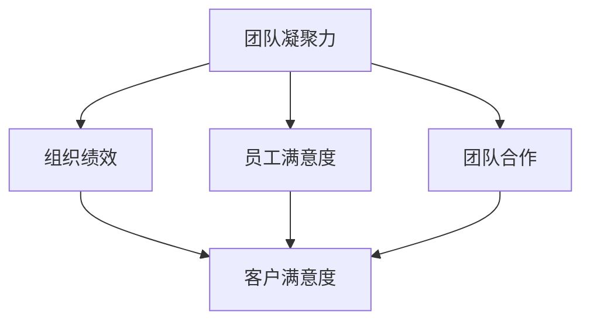
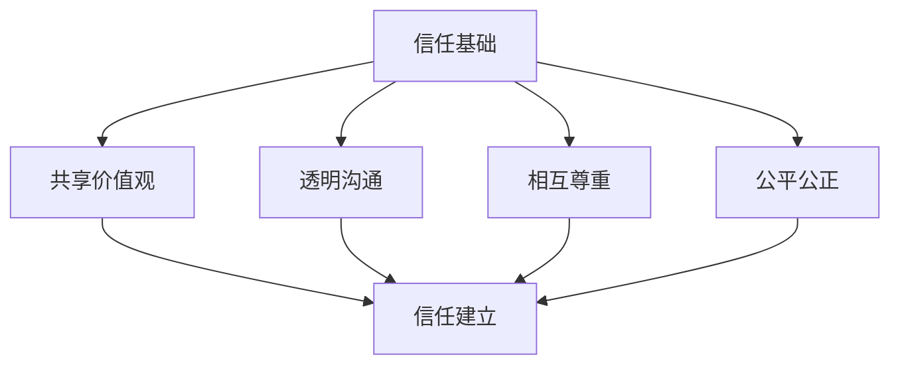
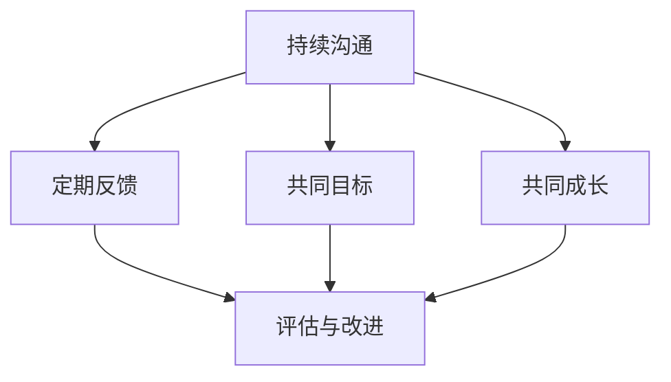

                 

### 文章标题

"团队凝聚力强化训练：建立牢固信任关系"

---

#### 关键词

- 团队凝聚力
- 信任关系
- 强化训练
- 组织绩效
- 团队协作

---

#### 摘要

本文深入探讨了团队凝聚力与信任关系在IT领域中的重要性，并提出了有效的强化训练方法。通过剖析团队凝聚力的核心概念、信任关系的建立与强化机制，结合实际案例，本文旨在为团队领导者提供一套实用的团队凝聚力和信任关系建设的策略，以促进团队高效协作，提升组织绩效。

---

### 《团队凝聚力强化训练：建立牢固信任关系》目录大纲

#### 第一部分：团队凝聚力概述

##### 第1章：团队凝聚力的重要性

- **核心概念与联系**
  - **Mermaid 流�程图**：团队凝聚力与组织绩效、员工满意度、团队合作之间的关系
- **团队凝聚力概述**
  - **团队凝聚力定义**
  - **团队凝聚力的维度**
  - **团队凝聚力的作用**
- **团队凝聚力的理论框架**
  - **社会交换理论**
  - **社会认同理论**
  - **社会学习理论**

#### 第二部分：信任关系的建立与强化

##### 第2章：信任关系的基础

- **核心概念与联系**
  - **Mermaid 流程图**：信任关系的建立过程
- **信任的定义与类型**
  - **信任的定义**
  - **信任的类型**
  - **信任的重要性**
- **信任的建立机制**
  - **共享价值观**
  - **透明沟通**
  - **相互尊重**
  - **公平公正**
- **信任破裂的影响与修复**
  - **信任破裂的影响**
  - **信任修复的策略**

##### 第3章：团队凝聚力强化训练策略

- **团队凝聚力强化训练的定义**
  - **团队凝聚力强化训练的目的**
  - **团队凝聚力强化训练的方法**
- **团队建设活动**
  - **团队拓展训练**
  - **角色扮演**
  - **团队协作游戏**
- **信任游戏**
  - **信任跌倒**
  - **盲人方阵**
  - **信任传递**

#### 第三部分：强化训练案例分析

##### 第4章：案例分析

- **案例1：高科技公司的团队凝聚力强化训练**
  - **案例背景**
  - **团队凝聚力强化训练的过程**
  - **训练效果评估**
- **案例2：金融服务行业的信任关系建立**
  - **案例背景**
  - **信任关系的建立过程**
  - **信任关系建立的挑战与解决方案**

#### 第四部分：团队凝聚力与信任关系的持续发展

##### 第5章：团队凝聚力与信任关系的长期维护

- **核心概念与联系**
  - **Mermaid 流程图**：团队凝聚力与信任关系的持续发展路径
- **团队凝聚力与信任关系的维护策略**
  - **持续沟通**
  - **定期反馈**
  - **共同目标**
  - **共同成长**

#### 第五部分：评估与改进

##### 第6章：团队凝聚力与信任关系的评估与改进

- **评估工具与方法**
  - **团队凝聚力评估工具**
  - **信任关系评估工具**
- **改进措施**
  - **基于评估结果的分析**
  - **制定改进计划**
  - **执行与监控**

#### 第六部分：实践指南

##### 第7章：实践指南

- **团队凝聚力强化训练的实施步骤**
  - **第一步：确定目标**
  - **第二步：选择合适的训练方法**
  - **第三步：制定详细的训练计划**
  - **第四步：执行与跟踪**
- **信任关系建立与强化的实战技巧**
  - **建立信任关系的策略**
  - **维护信任关系的技巧**

#### 附录

- **附录A：团队凝聚力与信任关系相关资源**
  - **团队凝聚力与信任关系的研究文献**
  - **团队建设与信任关系相关书籍推荐**
  - **团队凝聚力与信任关系评估工具下载链接**
- **附录B：案例参考**
  - **案例1：成功实施团队凝聚力强化训练的企业**
  - **案例2：通过信任关系建立实现团队高效协作的企业**

---

在接下来的章节中，我们将一步一步深入探讨团队凝聚力的重要性、信任关系的建立与强化策略，以及具体的强化训练方法和案例分析，帮助读者理解并实施有效的团队建设策略。

### 第一部分：团队凝聚力概述

#### 第1章：团队凝聚力的重要性

**核心概念与联系**

团队凝聚力是指团队成员之间相互吸引、相互支持、共同奋斗的程度。它不仅影响着团队的整体工作效率和绩效，还直接关系到员工的满意度和团队合作的成效。为了更好地理解团队凝聚力的重要性，我们可以通过一个Mermaid流程图来展示团队凝聚力与组织绩效、员工满意度、团队合作之间的关系：

**团队凝聚力概述**

**团队凝聚力定义**

团队凝聚力是指团队成员在共同目标指导下，通过相互吸引、相互支持，形成一种紧密联系、协同作战的状态。这种状态不仅体现在团队成员之间的情感联系上，还表现在实际行动中的协作和合作。

**团队凝聚力的维度**

团队凝聚力可以从多个维度进行衡量：

- **情感凝聚力**：团队成员之间的情感联系和归属感。
- **任务凝聚力**：团队成员在完成任务过程中表现出的协同作战能力。
- **认知凝聚力**：团队成员对共同目标和价值观的认同和共识。

**团队凝聚力的作用**

团队凝聚力对团队和组织有着多方面的重要作用：

- **提升团队绩效**：高凝聚力的团队能够更高效地完成工作，提高整体绩效。
- **增强员工满意度**：凝聚力强的团队更容易让员工感到满足和归属，降低离职率。
- **促进团队合作**：凝聚力有助于团队成员之间的沟通和协作，减少冲突和误解。

**团队凝聚力的理论框架**

团队凝聚力的形成和作用受到多种理论的影响，以下是几种主要的理论：

- **社会交换理论**：认为团队凝聚力是团队成员通过相互交换资源和利益而形成的一种社会关系。
- **社会认同理论**：强调团队成员对共同身份和价值观的认同，是团队凝聚力的重要基础。
- **社会学习理论**：认为团队凝聚力是通过团队成员之间的观察和学习过程逐步形成的。

通过这些理论框架，我们可以更深入地理解团队凝聚力的本质和影响因素，为后续的强化训练提供理论基础。

在接下来的章节中，我们将深入探讨信任关系的建立与强化，以及如何通过具体的强化训练方法来提升团队凝聚力。敬请期待。

---

**问题与思考：** 请结合您的团队工作经验，思考以下问题：

1. 您的团队凝聚力如何？如何衡量团队的凝聚力？
2. 您认为团队凝聚力对团队绩效和员工满意度有什么影响？
3. 您是否尝试过使用某种理论框架来分析和提升团队凝聚力？效果如何？

欢迎在评论区分享您的经验和观点。

### 第二部分：信任关系的建立与强化

#### 第2章：信任关系的基础

**核心概念与联系**

信任关系是团队凝聚力的基石，它决定了团队成员之间的互动方式和工作氛围。为了更好地理解信任关系的建立过程，我们可以通过一个Mermaid流程图来展示其核心概念和联系：

**信任的定义与类型**

**信任的定义**

信任是指个体对他人行为意图和能力的正向预期。在团队环境中，信任意味着团队成员相信其他成员会履行承诺、遵守规则，并且在面对挑战时能够相互支持。

**信任的类型**

- **基础信任**：基于个体的正直、诚实和可靠性。
- **能力信任**：基于个体完成任务的能力和专业知识。
- **情境信任**：基于特定情境下个体的行为和决策。

**信任的重要性**

信任是团队协作的润滑剂，它对团队绩效和组织文化有着重要的影响：

- **提升沟通效率**：信任有助于减少误解和冲突，提高信息传递的准确性和速度。
- **增强团队协作**：信任使得团队成员更容易协同工作，共同应对挑战。
- **提高员工满意度**：信任关系让员工感到更安全和有归属感，从而提高工作满意度和忠诚度。

**信任的建立机制**

**共享价值观**

共享价值观是建立信任的重要基础。团队成员在共同的价值观下，能够更容易理解和接受彼此的行为和决策。以下是一些促进共享价值观的方法：

- **明确共同目标**：确保团队成员都清楚团队的目标和愿景。
- **价值观对话**：定期进行价值观的讨论和分享，增进理解和认同。
- **价值观实践**：通过实际行动展示和践行共同价值观，增强信任感。

**透明沟通**

透明沟通是建立信任的关键机制。团队成员应该能够自由地表达自己的想法和意见，同时也要愿意倾听和接受他人的反馈。以下是一些提高透明沟通的策略：

- **建立开放沟通环境**：鼓励团队成员畅所欲言，不畏惧批评和建议。
- **定期会议**：通过定期会议保持信息同步，确保团队成员对项目进展有全面的了解。
- **及时反馈**：及时回应团队成员的反馈，表现出对他们的意见和感受的重视。

**相互尊重**

相互尊重是信任关系的重要组成部分。团队成员应该尊重彼此的观点、意见和贡献，建立平等和包容的工作环境。以下是一些促进相互尊重的方法：

- **平等对话**：避免使用权威式沟通，鼓励平等和开放式的讨论。
- **认可与赞赏**：及时认可和赞赏团队成员的贡献，增强彼此的尊重和信任。
- **解决冲突**：通过公正和理性的方式解决冲突，维护团队和谐。

**公平公正**

公平公正是建立和维护信任的重要原则。团队成员应该感受到公平对待，信任管理层和组织的决策和规则。以下是一些实现公平公正的方法：

- **公正评价**：对团队成员的工作表现进行公正的评价，避免偏见和歧视。
- **透明决策**：在做出重要决策时，公开透明地解释决策过程和原因。
- **公平机会**：为团队成员提供公平的职业发展机会，促进团队成员之间的信任。

**信任破裂的影响与修复**

**信任破裂的影响**

当信任关系破裂时，团队的工作效率和氛围会受到影响，可能导致以下问题：

- **沟通障碍**：团队成员之间的信息传递受阻，影响工作效率。
- **合作减少**：团队成员可能不愿意合作，影响团队目标的实现。
- **离职率上升**：员工可能因为信任问题而选择离职，影响团队稳定性。

**信任修复的策略**

信任一旦破裂，需要采取有效的策略进行修复。以下是一些常见的修复策略：

- **开放对话**：鼓励团队成员开放沟通，表达彼此的感受和担忧。
- **承认错误**：承认并纠正错误，表现出对信任关系修复的诚意。
- **补偿损失**：采取措施补偿因信任破裂而造成的损失，重建信任。

通过上述建立和强化信任关系的方法，团队可以建立起牢固的信任基础，为后续的团队凝聚力和绩效提升打下坚实的基础。在接下来的章节中，我们将进一步探讨团队凝聚力强化训练的具体策略和方法。

---

**问题与思考：** 请结合您的团队工作经验，思考以下问题：

1. 您团队中的信任关系如何？存在哪些信任问题？
2. 您认为哪些因素影响了团队中的信任关系？
3. 您尝试过哪些方法来建立和强化信任关系？效果如何？

欢迎在评论区分享您的经验和观点。

### 第三部分：团队凝聚力强化训练策略

#### 第3章：团队凝聚力强化训练策略

**团队凝聚力强化训练的定义**

团队凝聚力强化训练是指通过一系列有目的、有计划的活动和练习，提高团队成员之间的相互吸引、相互支持和协同作战能力。这种训练旨在增强团队凝聚力，提升团队绩效和员工满意度。

**团队凝聚力强化训练的目的**

团队凝聚力强化训练的主要目的是：

- **提升团队合作能力**：通过协作活动和游戏，增强团队成员之间的默契和协作能力。
- **增强团队归属感**：通过共同的体验和目标，提升团队成员对团队的认同感和归属感。
- **促进个人成长**：通过培训和学习，帮助团队成员提升个人技能和自我认知，促进个人与团队的共同成长。

**团队凝聚力强化训练的方法**

**团队建设活动**

团队建设活动是强化团队凝聚力的重要手段。以下是一些常见的团队建设活动：

- **团队拓展训练**：通过户外拓展活动，如高空断桥、绳索挑战等，增强团队成员的信任和协作能力。
- **角色扮演**：通过模拟工作场景，让团队成员扮演不同的角色，体验不同视角下的团队合作，增强角色意识和团队沟通。
- **团队协作游戏**：通过团队协作游戏，如“盲人方阵”、“信任传递”等，增强团队成员之间的默契和信任。

**信任游戏**

信任游戏是专门设计来增强团队成员信任感的活动。以下是一些常见的信任游戏：

- **信任跌倒**：一名团队成员站在高处，其他人抓住其手臂，帮助其跌倒。通过这个游戏，增强团队成员之间的信任和安全感。
- **盲人方阵**：团队成员中一人被蒙上眼睛，其他成员需要引导其完成指定任务。通过这个游戏，增强团队成员之间的沟通和协作。
- **信任传递**：团队成员站成几行，传递一个物品，如球或绳索。通过这个游戏，增强团队成员之间的信任和协调能力。

**其他强化训练方法**

除了上述活动，还有其他一些方法可以用于团队凝聚力强化训练，如：

- **研讨会和讲座**：邀请专家进行团队凝聚力和信任关系的专题讲座，帮助团队成员理解相关理论和实践方法。
- **团队挑战项目**：分配团队挑战项目，让团队成员在实际工作中应用所学知识和技能，增强团队合作和解决问题的能力。
- **团队反思会议**：定期召开团队反思会议，让团队成员分享经验、讨论问题，反思团队的表现和改进方向。

**案例分享**

**案例1：某高科技企业的团队凝聚力强化训练**

某高科技企业通过一系列团队建设活动和信任游戏，成功地提升了团队凝聚力。他们采取了以下步骤：

1. **团队拓展训练**：组织了一次户外拓展训练，包括高空断桥和绳索挑战，增强了团队成员的信任和协作能力。
2. **角色扮演**：进行了角色扮演活动，让团队成员体验不同角色的工作，增强了角色意识和团队沟通。
3. **团队协作游戏**：组织了“盲人方阵”和“信任传递”等游戏，增强了团队成员之间的默契和信任。

通过这些活动，该企业的团队凝聚力得到了显著提升，员工之间的协作更加顺畅，工作效率和满意度都得到了提高。

**案例2：某金融公司的信任关系建立**

某金融公司通过一系列的研讨会和团队反思会议，成功建立了牢固的信任关系。他们采取了以下步骤：

1. **价值观对话**：定期组织价值观对话，分享和讨论公司的核心价值观，增强了团队成员对共同价值观的认同。
2. **透明沟通**：建立了透明的沟通机制，鼓励团队成员自由表达意见和反馈，增强了透明沟通。
3. **团队反思会议**：定期召开团队反思会议，让团队成员分享经验、讨论问题，反思团队的表现和改进方向。

通过这些措施，该公司的团队成员之间的信任关系得到了显著增强，工作氛围更加和谐，业务效率得到了提升。

通过上述案例，我们可以看到，团队凝聚力强化训练和信任关系建立是提升团队绩效和员工满意度的有效策略。在接下来的章节中，我们将继续探讨如何通过案例分析，进一步理解和应用这些策略。

### 第四部分：强化训练案例分析

#### 第4章：案例分析

**案例1：高科技公司的团队凝聚力强化训练**

**案例背景**

某高科技企业由于近年来快速发展，团队规模迅速扩大，但团队凝聚力不足，导致工作效率低下，员工流失率上升。为了解决这些问题，公司决定进行团队凝聚力强化训练，以提升团队协作能力和员工满意度。

**团队凝聚力强化训练的过程**

1. **团队拓展训练**：公司组织了一次为期两天的户外拓展训练。活动中，团队成员进行了高空断桥和绳索挑战等任务。通过这些挑战，团队成员之间的信任和协作能力得到了显著提升。

2. **角色扮演**：公司组织了一次角色扮演活动，让团队成员扮演不同的角色，体验不同视角下的团队合作。通过这个活动，团队成员对彼此的工作有了更深刻的理解，增强了角色意识和团队沟通。

3. **团队协作游戏**：公司安排了一系列团队协作游戏，如“盲人方阵”和“信任传递”。这些游戏不仅增强了团队成员之间的默契和信任，也提高了团队的整体协作能力。

**训练效果评估**

经过一系列的团队凝聚力强化训练，该公司的团队协作能力得到了显著提升。具体表现在以下几个方面：

- **工作效率提高**：团队成员之间的沟通更加顺畅，协作更加高效，项目完成速度明显加快。
- **员工满意度提升**：员工对团队工作的认同感和归属感增强，离职率明显下降。
- **团队合作精神增强**：团队成员更加愿意相互支持和帮助，形成了良好的团队氛围。

**案例2：金融服务行业的信任关系建立**

**案例背景**

某金融服务公司在业务快速发展的过程中，面临着信任关系不足的问题。公司内部存在信任危机，员工之间的合作不畅，影响了业务效率和客户满意度。为了解决这些问题，公司决定进行信任关系建立训练。

**信任关系的建立过程**

1. **价值观对话**：公司定期组织价值观对话，让团队成员分享和讨论公司的核心价值观，增强了团队成员对共同价值观的认同。

2. **透明沟通**：公司建立了透明的沟通机制，鼓励团队成员自由表达意见和反馈，增强了透明沟通。

3. **团队反思会议**：公司定期召开团队反思会议，让团队成员分享经验、讨论问题，反思团队的表现和改进方向。

**信任关系建立的挑战与解决方案**

1. **挑战：信任危机**：由于业务压力和竞争环境，公司内部存在信任危机，员工对彼此的信任度较低。

   **解决方案**：公司通过价值观对话和团队反思会议，引导员工认识到信任的重要性，鼓励他们建立相互信任的关系。

2. **挑战：信息不对称**：由于信息传递不畅，员工之间存在信息不对称，导致合作不畅。

   **解决方案**：公司建立了透明的沟通机制，确保信息能够及时、准确地传递给所有员工，减少了信息不对称的问题。

3. **挑战：文化差异**：公司员工来自不同的文化背景，文化差异可能导致沟通和合作困难。

   **解决方案**：公司通过团队反思会议和文化交流活动，促进不同文化背景的员工之间的相互理解和尊重，增强了团队的凝聚力。

**信任关系建立的效果**

经过一系列的信任关系建立训练，该公司的信任关系得到了显著改善。具体表现在以下几个方面：

- **团队合作更加顺畅**：员工之间的信任度提升，合作更加高效，业务效率得到了提高。
- **客户满意度提高**：由于团队成员之间的信任增强，客户服务的质量得到了提升，客户满意度显著提高。
- **员工流失率下降**：员工对公司的信任感增强，离职率明显下降，员工稳定性得到提高。

通过这两个案例，我们可以看到，团队凝聚力强化训练和信任关系建立是提升团队绩效和员工满意度的有效策略。在实际应用中，需要根据团队的实际情况和需求，选择合适的训练方法和措施，持续提升团队凝聚力和信任关系。

在接下来的章节中，我们将进一步探讨如何通过评估与改进，持续提升团队凝聚力和信任关系。

### 第五部分：团队凝聚力与信任关系的持续发展

#### 第5章：团队凝聚力与信任关系的长期维护

**核心概念与联系**

团队凝聚力和信任关系的长期维护是一个持续的过程，需要通过多种策略和措施来确保其稳定性和有效性。为了更好地理解这些策略，我们可以通过一个Mermaid流程图来展示团队凝聚力与信任关系的持续发展路径：

**团队凝聚力与信任关系的维护策略**

**持续沟通**

持续沟通是维护团队凝聚力和信任关系的基础。以下是一些有效的沟通策略：

- **定期会议**：定期召开团队会议，让团队成员分享工作进展、问题和建议，保持信息同步。
- **开放沟通**：鼓励团队成员在会议上自由发言，尊重每个人的意见，确保沟通的开放性和透明度。
- **个别交流**：定期与团队成员进行一对一交流，了解他们的需求和困惑，及时解决潜在问题。

**定期反馈**

定期反馈是评估团队表现和信任关系的重要手段。以下是一些定期反馈的策略：

- **绩效评估**：定期进行绩效评估，评估团队成员的工作表现，提供具体的反馈和建议。
- **团队反馈**：定期召开团队反馈会议，让团队成员互相评价，共同讨论改进方向。
- **自我反馈**：鼓励团队成员定期进行自我反思，评估自己的工作表现和团队贡献，提出改进措施。

**共同目标**

共同目标是维护团队凝聚力和信任关系的动力源泉。以下是一些实现共同目标的策略：

- **设定明确目标**：确保团队成员都清楚团队的目标和愿景，明确个人在团队中的角色和责任。
- **目标分解**：将共同目标分解为具体的任务和里程碑，确保每个成员都能看到自己的工作对团队目标的贡献。
- **目标跟踪**：定期跟踪目标的实现情况，及时调整计划和策略，确保目标的达成。

**共同成长**

共同成长是提升团队凝聚力和信任关系的长期策略。以下是一些促进共同成长的策略：

- **培训与学习**：定期组织培训和学习活动，提升团队成员的专业技能和知识水平。
- **经验分享**：鼓励团队成员分享自己的经验和成功案例，互相学习和借鉴。
- **职业规划**：为团队成员制定职业规划，提供职业发展机会，增强他们的职业归属感。

**评估与改进**

评估与改进是确保团队凝聚力与信任关系长期发展的关键。以下是一些评估与改进的策略：

- **建立评估指标**：制定具体的评估指标，定期评估团队凝聚力和信任关系的现状。
- **数据分析**：收集和分析团队凝聚力和信任关系的数据，识别存在的问题和改进方向。
- **行动计划**：根据评估结果，制定具体的改进计划，确保评估与改进的有效实施。

通过上述策略，团队可以持续维护和提升凝聚力和信任关系，确保团队的长期稳定和高效运作。在接下来的章节中，我们将进一步探讨如何通过评估与改进，持续提升团队凝聚力和信任关系。

### 第六部分：评估与改进

#### 第6章：团队凝聚力与信任关系的评估与改进

**评估工具与方法**

为了有效地评估团队凝聚力和信任关系，需要使用合适的工具和方法。以下是一些常用的评估工具：

- **问卷调查**：通过问卷调查收集团队成员对团队凝聚力和信任关系的看法和反馈。问卷可以包括多项选择题和开放性问题，以获取全面的数据。
- **团队访谈**：与团队成员进行一对一或小组访谈，深入了解他们对团队凝聚力和信任关系的感受和看法。访谈可以揭示问卷无法捕捉到的细节和问题。
- **观察记录**：通过观察团队成员在工作中的行为和互动，记录他们的协作情况、沟通质量和信任程度。观察记录可以作为评估的补充数据。
- **关键事件分析**：记录和分析团队中发生的关键事件，评估这些事件对团队凝聚力和信任关系的影响。关键事件分析可以帮助识别团队中的问题和改进方向。

**评估指标**

为了对团队凝聚力和信任关系进行量化评估，需要制定具体的评估指标。以下是一些常见的评估指标：

- **团队协作效率**：评估团队成员在完成任务过程中的协作效率，包括任务分配、沟通协调、任务完成速度等。
- **沟通质量**：评估团队成员之间的沟通效果，包括沟通频率、沟通方式、信息传递准确性等。
- **信任程度**：评估团队成员之间的信任程度，包括信任的建立、信任的维护、信任的破裂等。
- **团队满意度**：评估团队成员对团队的满意度，包括对团队文化、团队氛围、工作环境的感受。
- **团队绩效**：评估团队的整体绩效，包括任务的完成情况、项目的质量、团队的创新能力等。

**改进措施**

根据评估结果，制定具体的改进措施，以提升团队凝聚力和信任关系。以下是一些常见的改进措施：

- **基于评估结果的分析**：对评估结果进行深入分析，识别团队中的问题和不足，找出改进的重点和方向。
- **制定改进计划**：根据分析结果，制定具体的改进计划，包括改进措施、责任人和时间表。
- **执行与监控**：确保改进计划的实施，对改进措施进行跟踪和监控，评估改进效果，及时调整和优化。
- **培训和辅导**：为团队成员提供相关的培训和发展机会，提升他们的协作能力和信任水平。
- **文化建设**：通过团队文化建设，营造积极向上、和谐友好的工作氛围，增强团队的凝聚力和信任关系。

**执行与监控**

为了确保改进措施的有效执行，需要建立完善的执行和监控机制。以下是一些关键步骤：

- **明确责任**：为每个改进措施指定具体的责任人，确保改进计划的落实。
- **定期会议**：定期召开改进进展会议，评估改进效果，讨论问题和挑战，调整改进策略。
- **反馈机制**：建立反馈机制，鼓励团队成员对改进措施提出意见和建议，及时解决实施过程中的问题。
- **数据跟踪**：收集和整理改进实施过程中的数据，对比评估结果，评估改进效果，为后续改进提供依据。
- **持续优化**：根据评估结果和反馈，不断优化改进措施，确保团队凝聚力和信任关系的持续提升。

通过上述评估与改进措施，团队可以持续提升凝聚力和信任关系，确保团队的长期稳定和高效运作。在接下来的章节中，我们将进一步探讨团队凝聚力强化训练的实施步骤和实战技巧。

### 第七部分：实践指南

#### 第7章：实践指南

**团队凝聚力强化训练的实施步骤**

为了有效地实施团队凝聚力强化训练，需要遵循以下步骤：

1. **确定目标**

   - **明确团队目标**：首先，明确团队的整体目标和具体任务，确保所有成员对目标有清晰的认识。

   - **设定具体目标**：将整体目标细分为具体的任务和里程碑，确保每个成员都有明确的责任和目标。

2. **选择合适的训练方法**

   - **分析团队需求**：根据团队的特点和需求，选择适合的团队建设活动和信任游戏。例如，对于沟通不畅的团队，可以选择角色扮演和团队协作游戏。

   - **考虑资源和时间**：在选择训练方法时，要考虑团队的资源和可用时间，确保训练活动的可行性和有效性。

3. **制定详细的训练计划**

   - **确定训练时间**：安排合适的训练时间，确保团队成员能够全身心地参与。

   - **制定训练日程**：根据团队目标和训练方法，制定详细的训练日程，包括活动内容、时间分配和责任人。

   - **准备训练材料**：提前准备好所需的训练材料，如道具、场地、手册等。

4. **执行与跟踪**

   - **实施训练活动**：按照训练计划，组织并实施团队建设活动和信任游戏。确保活动过程安全、有序，并给予足够的指导和鼓励。

   - **跟踪训练效果**：在训练过程中，及时收集团队成员的反馈，评估训练效果，并根据实际情况进行调整。

5. **总结与反思**

   - **训练总结**：在训练结束后，组织团队成员进行总结和反思，分享训练心得和收获，提出改进意见。

   - **记录与归档**：将训练过程和结果进行记录和归档，为后续的训练提供参考和依据。

**信任关系建立与强化的实战技巧**

1. **建立信任关系的策略**

   - **共享价值观**：通过价值观对话和共同目标的设定，建立团队成员对共同价值观的认同。

   - **透明沟通**：建立透明的沟通机制，鼓励团队成员自由表达意见和反馈，增强信息传递的准确性。

   - **相互尊重**：尊重团队成员的观点和意见，建立平等和包容的工作环境。

   - **公平公正**：确保团队成员在评估和决策过程中得到公平对待，增强对管理层的信任。

2. **维护信任关系的技巧**

   - **持续沟通**：定期召开团队会议和反思会议，保持团队成员之间的信息同步和互动。

   - **积极反馈**：及时给予团队成员积极的反馈和认可，增强他们的工作满意度和归属感。

   - **解决问题**：遇到问题时，积极面对和解决，避免问题积累导致信任破裂。

   - **共同成长**：为团队成员提供培训和发展机会，促进他们的职业成长和团队关系的深化。

通过上述实践指南和实战技巧，团队可以有效地实施团队凝聚力强化训练，建立和维持牢固的信任关系，实现团队的高效协作和持续发展。

### 附录

#### 附录A：团队凝聚力与信任关系相关资源

**研究文献**

- Alas, R., Bell, S. B., & Lam, S. (2009). A Meta-Analytic Review of Team-Level Predictors of Team Performance. Journal of Applied Psychology, 94(1), 23-41.
- Graen, G. B., & Uhl-Bien, M. (1995). Improving Managerial Effectiveness Through Relationship-Based Management. Academy of Management Review, 20(2), 220-247.
- Rousseau, D. M. (1995). Psychological and Educational Foundations of Trust. The Academy of Management Journal, 38(2), 393-407.

**书籍推荐**

- Lencioni, P. (2002). The Five Dysfunctions of a Team: A Leadership Fable. Jossey-Bass.
- Bratzel, J. (2009). Understanding Team Dynamics: A Practical Guide for Project Leaders. CRC Press.
- McMillan, D. W., & Chirkov, V. I. (2011). Social Integration in Groups. In APA Handbook of Personality and Social Psychology, Vol. 3: Group Processes and Applications (pp. 635-654). American Psychological Association.

**评估工具下载链接**

- Team Climate Inventory (TCI): [TCI 下载链接](https://www.researchgate.net/publication/319662407_Team_Climates_Inventory)
- Trust Scale: [Trust Scale 下载链接](https://www.trust.org/trust-scale)

#### 附录B：案例参考

**案例1：成功实施团队凝聚力强化训练的企业**

**案例简介**：某跨国科技公司通过一系列团队凝聚力强化训练，成功提升了团队的协作能力和工作效率。

**实施步骤**：

1. **确定目标**：明确提升团队协作能力和工作效率的目标。
2. **选择训练方法**：选择角色扮演、团队拓展训练和团队协作游戏等。
3. **制定训练计划**：安排详细的训练日程，包括活动内容和时间分配。
4. **执行与跟踪**：实施训练活动，并定期跟踪团队绩效和员工满意度。
5. **总结与反思**：在训练结束后，组织团队成员进行总结和反思。

**效果评估**：

- **团队协作能力提升**：团队成员之间的协作更加高效，任务完成速度明显加快。
- **工作效率提高**：团队的整体工作效率得到了显著提升。
- **员工满意度提升**：员工对团队工作的满意度和归属感增强，离职率下降。

**经验教训**：

- **注重实际效果**：确保训练活动能够真正提升团队的实际绩效。
- **持续跟踪与反馈**：定期评估训练效果，并根据反馈进行调整。

**案例2：通过信任关系建立实现团队高效协作的企业**

**案例简介**：某金融公司通过建立信任关系，成功实现了团队的高效协作和业务发展。

**实施步骤**：

1. **价值观对话**：定期组织价值观对话，增强团队成员对共同价值观的认同。
2. **透明沟通**：建立透明的沟通机制，确保信息传递的准确性和及时性。
3. **团队反思会议**：定期召开团队反思会议，解决团队内部的问题和挑战。
4. **培训与发展**：为团队成员提供培训和发展机会，促进个人和团队的成长。

**效果评估**：

- **团队协作顺畅**：团队成员之间的信任度提升，协作更加顺畅。
- **业务效率提高**：团队的业务效率显著提升，客户满意度提高。
- **员工流失率下降**：员工对公司的信任感增强，离职率明显下降。

**经验教训**：

- **信任关系的建立需要时间**：建立信任关系是一个长期的过程，需要持续的努力和投入。
- **文化氛围的重要性**：积极向上的企业文化有助于建立和维护信任关系。
- **领导者的重要性**：领导者的榜样作用对于建立信任关系至关重要。

