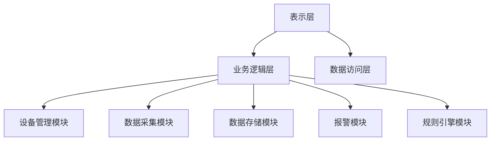
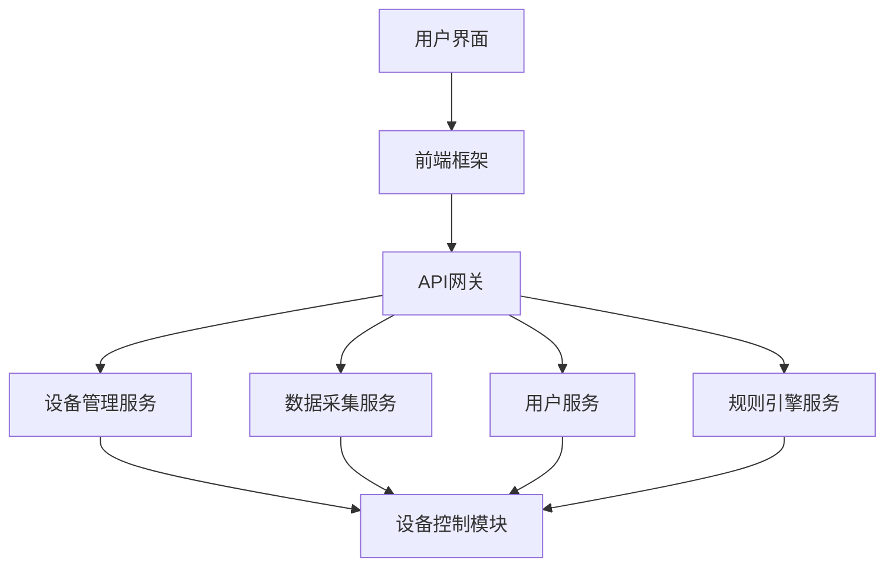

                 

# 基于Java的智能家居设计：漫谈智能家居行业中的Java应用前景

> **关键词：智能家居、Java、物联网、传感器、执行器、环境监测**

> **摘要：本文深入探讨了Java在智能家居设计中的应用前景。首先，我们介绍了智能家居的基本概念与Java的优势，然后详细分析了智能家居的核心组件与技术，接着展示了Java在智能设备控制、环境监测中的应用，最后探讨了Java在智能家居平台开发中的实践与未来趋势。通过本文，读者可以全面了解Java在智能家居设计中的核心地位及其广阔的应用前景。**

---

## 第一部分：基本概念与行业前景

### 第1章：智能家居与Java简介

#### 1.1 智能家居概述

##### 定义与特点

智能家居（Smart Home）是指通过物联网（IoT）技术，将家庭中的各种设备连接起来，实现自动化控制和管理的一种居住环境。智能家居系统通常包括传感器、执行器、控制器和通信网络等组件，能够对家庭环境进行智能监测和控制，提高居住的舒适性和安全性。

智能家居的特点主要包括：

1. **自动化控制**：通过编程或用户操作，实现家庭设备的自动控制，提高生活的便利性。
2. **远程控制**：用户可以通过智能手机、平板电脑等设备远程控制家庭设备，实现远程监控和管理。
3. **节能环保**：智能家居系统能够根据用户习惯和环境变化自动调整设备状态，实现能源节约。
4. **安全防护**：智能家居系统可以实时监测家庭安全，及时发现异常情况并采取措施。

##### 智能家居的分类

智能家居可以根据功能和应用场景的不同进行分类，常见的分类方法如下：

1. **按功能分类**：
   - **智能照明**：通过传感器或用户控制实现灯光的自动调节和远程控制。
   - **智能安防**：包括门禁系统、视频监控系统、报警系统等。
   - **智能家电**：如智能电视、智能空调、智能冰箱等。
   - **智能环境监测**：如空气质量监测、水质监测等。
   - **智能能源管理**：如智能家居光伏系统、智能用电管理系统等。

2. **按应用场景分类**：
   - **家庭场景**：针对家庭用户设计的智能家居系统，如家庭智能控制系统。
   - **酒店场景**：针对酒店用户设计的智能家居系统，如酒店智能客房系统。
   - **社区场景**：针对社区用户设计的智能家居系统，如社区安防监控系统。

##### 智能家居的市场现状与发展趋势

随着物联网和人工智能技术的快速发展，智能家居市场呈现出快速增长的趋势。根据市场研究机构的统计数据，全球智能家居市场规模预计将在未来几年内持续扩大。以下是智能家居市场的一些现状和趋势：

1. **市场现状**：
   - **技术成熟度**：智能家居技术逐渐成熟，各种智能设备和系统不断涌现。
   - **用户接受度**：随着用户对智能家居的认知和接受度不断提高，市场规模不断扩大。
   - **产业链完善**：智能家居产业链逐渐完善，涉及硬件制造、软件开发、系统集成等多个领域。

2. **发展趋势**：
   - **智能化程度提高**：智能家居系统将更加智能化，具备自适应、自学习等能力。
   - **互联互通**：智能家居系统将实现更多设备和平台之间的互联互通，形成智能家居生态圈。
   - **安全隐私保护**：随着智能家居系统的普及，安全隐私保护将成为重要关注点。

#### 1.2 Java在智能家居中的应用

##### Java的基本特点与优势

Java是一种面向对象的编程语言，具有跨平台、安全性高、稳定性强等特点，在智能家居开发中具有广泛的应用前景。Java的基本特点与优势如下：

1. **跨平台**：Java程序可以在不同的操作系统上运行，如Windows、Linux、macOS等，适合智能家居设备的多样化需求。
2. **安全性高**：Java具有强大的安全机制，可以有效保护智能家居系统的安全性。
3. **稳定性强**：Java程序的稳定性和可靠性较高，适合长时间运行的应用场景。
4. **丰富的生态系统**：Java拥有丰富的类库和框架，可以方便地进行智能家居系统的开发。

##### Java在智能家居中的应用领域

Java在智能家居中的应用领域非常广泛，主要包括以下几个方面：

1. **智能设备控制**：Java可以用于控制智能电视、智能空调、智能冰箱等家庭设备，实现远程监控和自动化控制。
2. **智能安防系统**：Java可以用于开发智能家居安防系统，如门禁系统、视频监控系统、报警系统等。
3. **智能环境监测**：Java可以用于开发智能家居环境监测系统，如空气质量监测、水质监测等。
4. **智能家居平台开发**：Java可以用于开发智能家居平台，实现设备管理、数据采集、远程控制等功能。

##### Java智能家居开发环境搭建

要开发Java智能家居系统，需要搭建一个合适的开发环境。以下是搭建Java智能家居开发环境的基本步骤：

1. **安装Java开发工具包（JDK）**：从Oracle官方网站下载并安装Java开发工具包（JDK），配置环境变量。
2. **安装集成开发环境（IDE）**：选择一个合适的IDE，如Eclipse、IntelliJ IDEA等，安装并配置。
3. **安装相关库和框架**：根据项目需求，安装相关Java库和框架，如Spring Framework、Apache Maven等。
4. **搭建测试环境**：搭建测试环境，包括硬件设备和虚拟环境等。

通过以上步骤，就可以搭建一个适合Java智能家居开发的开发环境，为后续开发工作打下基础。

---

在接下来的章节中，我们将继续探讨智能家居的核心组件与技术，以及Java在智能家居中的具体应用。通过这些内容，读者将能够更深入地了解Java在智能家居设计中的重要作用。

---

## 第二部分：智能家居核心组件与技术

### 第2章：智能家居网络通信

智能家居系统的核心在于各个设备之间的通信与协同工作。网络通信是智能家居系统实现设备互联和数据交换的关键技术。在本章中，我们将详细探讨智能家居网络通信的无线通信技术和有线通信技术，并对通信协议进行比较分析。

#### 2.1 无线通信技术

无线通信技术是智能家居系统中最常用的通信方式，具有灵活性强、安装便捷等优点。以下是一些常见的无线通信技术：

1. **Wi-Fi**：Wi-Fi是一种基于IEEE 802.11标准的高速率无线通信技术，广泛应用于智能家居系统中。Wi-Fi技术具有较远的传输距离和较高的传输速率，能够实现高速数据传输和远程控制。
   
2. **蓝牙**：蓝牙（Bluetooth）是一种短距离无线通信技术，主要用于连接智能设备之间的数据传输。蓝牙技术的优点是功耗低、成本低、传输速率适中，适合连接智能家居设备如智能音箱、智能手环等。

3. **Zigbee**：Zigbee是一种低功耗、短距离的无线通信技术，基于IEEE 802.15.4标准。Zigbee技术具有高可靠性、低延迟、低成本的特点，适合用于智能家居系统的传感器网络和智能设备之间的通信。

4. **Z-Wave**：Z-Wave是一种基于微波通信的无线通信技术，主要用于智能家居设备之间的短距离通信。Z-Wave技术具有高速率、低功耗、高可靠性的特点，适用于家庭自动化和控制。

#### 2.2 有线通信技术

与无线通信技术相比，有线通信技术在传输速度和稳定性方面具有优势，但安装相对复杂。以下是一些常见的有线通信技术：

1. **以太网**：以太网（Ethernet）是一种基于IEEE 802.3标准的局域网通信技术，广泛应用于家庭网络和智能家居系统中。以太网技术具有高速率、高稳定性、低成本等优点，适合连接智能家居设备如智能路由器、智能电视等。

2. **RS-485**：RS-485是一种串行通信标准，主要用于工业自动化和智能家居系统中。RS-485技术具有高抗干扰性、远距离传输等特点，适合连接传感器、执行器等设备。

3. **CAN总线**：CAN总线（Controller Area Network）是一种用于车内通信的通信标准，也可应用于智能家居系统中。CAN总线技术具有高速率、高可靠性、多主通信等特点，适合连接智能设备如汽车、智能家电等。

#### 2.3 通信协议与技术比较

在智能家居系统中，选择合适的通信协议和技术至关重要。以下是对无线通信技术和有线通信技术进行比较分析：

1. **传输速度**：
   - 无线通信技术：Wi-Fi具有高速率传输能力，最高可达1Gbps；蓝牙和Zigbee的传输速率相对较低，一般在几百kbps。
   - 有线通信技术：以太网的传输速率最高可达1Gbps；RS-485和CAN总线的传输速率较低，一般在几Mbps到几十Mbps。

2. **传输距离**：
   - 无线通信技术：Wi-Fi的传输距离较远，可达数百米；蓝牙和Zigbee的传输距离较短，一般在数十米范围内。
   - 有线通信技术：以太网的传输距离较远，可达数百米；RS-485和CAN总线的传输距离较长，可达几公里。

3. **功耗**：
   - 无线通信技术：蓝牙和Zigbee的功耗较低，适合长时间运行；Wi-Fi的功耗较高，适合短距离、高速率传输。
   - 有线通信技术：以太网和RS-485的功耗较低，适合长时间运行；CAN总线的功耗较高，适合短距离、高速率传输。

4. **抗干扰性**：
   - 无线通信技术：抗干扰性较差，易受到电磁干扰；
   - 有线通信技术：抗干扰性较好，传输稳定。

综上所述，选择无线通信技术和有线通信技术应根据具体应用场景和需求进行权衡。在智能家居系统中，无线通信技术如Wi-Fi、蓝牙和Zigbee适用于家庭内部的短距离通信，而有线通信技术如以太网和RS-485适用于需要高传输速度和稳定性的场景。

在下一章中，我们将探讨智能家居中的传感器与执行器，以及它们在智能家居系统中的应用。通过这些内容，读者将能够更全面地了解智能家居的核心组件和技术。

---

## 第二部分：智能家居核心组件与技术

### 第2章：智能家居中的传感器与执行器

#### 2.4 常见传感器介绍

传感器是智能家居系统的核心组件之一，用于感知环境变化并生成相应的信号。以下是一些常见的传感器及其功能：

1. **温度传感器**：用于测量环境温度，常见的有热敏电阻、热电偶等。温度传感器在智能家居系统中可用于智能空调、暖气系统等设备的控制。

2. **湿度传感器**：用于测量环境湿度，常见的有电容式、电阻式等。湿度传感器在智能家居系统中可用于智能加湿器、除湿机等设备的控制。

3. **空气质量传感器**：用于测量室内空气中的污染物浓度，常见的有PM2.5传感器、甲醛传感器等。空气质量传感器在智能家居系统中可用于智能空气净化器等设备的控制。

4. **光线传感器**：用于测量环境光线强度，常见的有光敏电阻、光电二极管等。光线传感器在智能家居系统中可用于智能照明设备的控制，实现自动调节亮度和色温。

5. **声音传感器**：用于测量环境中的声音信号，常见的有麦克风、声音传感器等。声音传感器在智能家居系统中可用于智能音响、安防报警等设备的控制。

6. **运动传感器**：用于检测运动物体，常见的有红外传感器、超声波传感器等。运动传感器在智能家居系统中可用于智能安防系统、自动窗帘等设备的控制。

7. **烟雾传感器**：用于检测烟雾浓度，常见的有光电式、离子式等。烟雾传感器在智能家居系统中可用于智能烟雾报警器等设备的控制。

#### 2.5 常见执行器介绍

执行器是智能家居系统的另一个核心组件，用于根据传感器反馈的信息执行相应的动作。以下是一些常见的执行器及其功能：

1. **电机**：电机是一种常见的执行器，可用于驱动各种机械设备。在智能家居系统中，电机可用于窗帘、门锁、窗户等设备的控制。

2. **继电器**：继电器是一种用于开关电路的电子器件，可以通过控制小电流来控制大电流的开关。在智能家居系统中，继电器可用于控制电器设备的开关，如灯光、插座等。

3. **电磁阀**：电磁阀是一种用于控制流体流动的执行器，通过电磁作用来开启或关闭阀门。在智能家居系统中，电磁阀可用于控制水、气等流体的流动，如智能家居灌溉系统、空气净化器等。

4. **步进电机**：步进电机是一种可以精确控制旋转角度的电机，常用于需要精确位置控制的设备。在智能家居系统中，步进电机可用于智能窗帘、机器人等设备的控制。

5. **气动执行器**：气动执行器是一种利用压缩空气驱动的执行器，可用于驱动机械装置。在智能家居系统中，气动执行器可用于自动门、自动窗户等设备的控制。

6. **气动阀**：气动阀是一种通过压缩空气驱动来控制流体流动的阀门，常用于智能家居水暖系统。

#### 2.6 传感器与执行器的集成与应用

传感器和执行器的集成是智能家居系统实现智能控制的关键。以下是一些传感器与执行器集成的应用实例：

1. **智能照明系统**：通过光线传感器控制灯光的亮度和色温，实现自动调节。例如，当光线传感器检测到环境光线较强时，自动降低灯光亮度；当光线较弱时，自动提高灯光亮度。

2. **智能安防系统**：通过运动传感器和摄像头集成，实现入侵检测和监控。例如，当运动传感器检测到异常运动时，自动触发摄像头录像并发送报警信息。

3. **智能温控系统**：通过温度传感器和暖气/空调执行器集成，实现自动调节室内温度。例如，当温度传感器检测到室内温度低于设定值时，自动开启暖气；当温度传感器检测到室内温度高于设定值时，自动开启空调。

4. **智能灌溉系统**：通过土壤湿度传感器和电磁阀集成，实现自动灌溉。例如，当土壤湿度传感器检测到土壤干燥时，自动打开电磁阀进行灌溉。

5. **智能家电控制系统**：通过多种传感器和执行器的集成，实现家电设备的自动化控制。例如，当空气质量传感器检测到空气质量较差时，自动开启空气净化器；当温度传感器检测到室内温度适宜时，自动关闭暖气。

通过以上应用实例可以看出，传感器和执行器的集成是实现智能家居系统智能控制的关键。只有通过集成多种传感器和执行器，智能家居系统才能实现更加智能化和便捷化的家居生活。

在下一章中，我们将探讨智能家居软件架构，了解智能家居软件架构的设计原则和实例。通过这些内容，读者将能够更好地理解智能家居系统的整体架构和实现方式。

---

## 第二部分：智能家居核心组件与技术

### 第2章：智能家居软件架构

#### 2.7 智能家居软件架构设计原则

智能家居软件架构的设计原则是确保系统的高可扩展性、高可靠性、易维护性和易用性。以下是智能家居软件架构设计的一些关键原则：

1. **模块化设计**：将系统功能划分为多个模块，每个模块负责特定的功能，模块之间通过接口进行通信。模块化设计可以提高系统的可维护性和可扩展性，方便后续功能扩展和修改。

2. **分层架构**：采用分层架构设计，将系统分为多个层次，如表示层、业务逻辑层、数据访问层等。每一层负责特定的功能，层与层之间通过接口进行通信，降低各层之间的耦合度。

3. **分布式架构**：采用分布式架构设计，将系统部署在不同的服务器上，实现负载均衡和高可用性。分布式架构可以提高系统的扩展性和容错能力。

4. **事件驱动架构**：采用事件驱动架构设计，将系统的控制逻辑基于事件触发。事件驱动架构可以实现实时响应，提高系统的响应速度和灵活性。

5. **安全性设计**：在软件架构设计中考虑安全性，如加密通信、权限控制、数据备份等。确保系统数据的安全性和用户的隐私保护。

#### 2.8 智能家居系统架构实例分析

以下是一个典型的智能家居系统架构实例，该系统采用分层架构和模块化设计，主要包括以下模块：

1. **表示层**：负责用户界面展示和用户交互，包括Web端和移动端界面。
2. **业务逻辑层**：负责处理业务逻辑，包括设备控制、数据分析和规则引擎等。
3. **数据访问层**：负责与数据库进行数据交互，包括数据存储、查询和更新等。
4. **设备管理模块**：负责设备的注册、配置和监控，包括设备的状态监控、远程控制等。
5. **数据采集模块**：负责采集传感器数据，包括温度、湿度、空气质量等。
6. **数据存储模块**：负责存储采集到的数据，包括历史数据和实时数据。
7. **报警模块**：负责处理异常情况，包括异常报警、预警等。
8. **规则引擎模块**：负责处理规则逻辑，包括自动控制、自动调节等。

系统架构图如下：



在这个架构实例中，各模块之间的通信通过事件驱动的方式进行。例如，当用户在Web端或移动端界面进行设备控制时，表示层会发送事件给业务逻辑层，业务逻辑层再通过设备管理模块控制相应的设备。同时，数据采集模块会实时采集传感器数据，并将数据存储到数据存储模块中。当出现异常情况时，报警模块会触发报警。

通过这个架构实例，我们可以看到智能家居系统软件架构的设计原则和实现方式。在实际开发过程中，可以根据具体需求对架构进行调整和优化，以提高系统的性能和可靠性。

在下一章中，我们将探讨Java在智能家居中的具体应用，包括智能设备控制、智能安防系统和智能环境监测等方面的应用实例。通过这些内容，读者将能够更深入地了解Java在智能家居中的具体应用场景和实现方法。

---

## 第三部分：Java在智能家居中的具体应用

### 第3章：Java在智能设备控制中的应用

#### 3.1 Java在智能家电控制中的应用

智能家电是智能家居系统的重要组成部分，通过Java技术，可以实现对各种智能家电的远程控制和自动化管理。以下是一些具体的实例：

##### 3.1.1 智能电视控制

智能电视是家庭娱乐中心的核心设备，通过Java技术，可以实现以下功能：

1. **远程控制**：用户可以通过手机或电脑上的Java应用程序远程控制智能电视，如开关电视、调节音量、切换频道等。
2. **内容推送**：智能电视可以根据用户的观看习惯和偏好，通过Java应用程序推送个性化的内容，提高用户体验。
3. **互动功能**：通过Java技术，智能电视可以实现与用户互动的功能，如游戏、语音控制等。

**代码实例**：

```java
// 假设 Television 类用于控制智能电视
class Television {
    public void turnOn() {
        System.out.println("智能电视已开启");
    }
    
    public void turnOff() {
        System.out.println("智能电视已关闭");
    }
    
    public void changeChannel(int channel) {
        System.out.println("频道已切换至：" + channel);
    }
}

// 主程序示例
public class SmartTVControl {
    public static void main(String[] args) {
        Television tv = new Television();
        tv.turnOn(); // 开启电视
        tv.changeChannel(5); // 切换频道至5
        tv.turnOff(); // 关闭电视
    }
}
```

##### 3.1.2 智能空调控制

智能空调是家庭生活中必不可少的设备，通过Java技术，可以实现以下功能：

1. **远程控制**：用户可以通过手机或电脑上的Java应用程序远程控制智能空调，如调节温度、切换模式、设置定时关机等。
2. **自动调节**：智能空调可以根据室内温度和湿度自动调节制冷或加热，提高舒适度。
3. **节能模式**：智能空调可以根据用户的习惯和实时天气数据，自动调整运行模式，实现节能。

**代码实例**：

```java
// 假设 AirConditioner 类用于控制智能空调
class AirConditioner {
    public void turnOn() {
        System.out.println("智能空调已开启");
    }
    
    public void turnOff() {
        System.out.println("智能空调已关闭");
    }
    
    public void setTemperature(float temperature) {
        System.out.println("温度已设置为：" + temperature + "摄氏度");
    }
    
    public void setMode(String mode) {
        System.out.println("模式已设置为：" + mode);
    }
}

// 主程序示例
public class SmartAirConditionerControl {
    public static void main(String[] args) {
        AirConditioner ac = new AirConditioner();
        ac.turnOn(); // 开启空调
        ac.setTemperature(24.0f); // 设置温度为24摄氏度
        ac.setMode("制冷"); // 设置模式为制冷
        ac.turnOff(); // 关闭空调
    }
}
```

##### 3.1.3 智能冰箱控制

智能冰箱是现代家庭厨房的重要设备，通过Java技术，可以实现以下功能：

1. **远程控制**：用户可以通过手机或电脑上的Java应用程序远程控制智能冰箱，如调节温度、检查食品库存、设置提醒等。
2. **智能提醒**：智能冰箱可以根据食品的存储时间和保质期，通过Java应用程序提醒用户进行食品处理或购买。
3. **节能管理**：智能冰箱可以根据室内温度和冰箱内部温度，自动调整制冷功率，实现节能。

**代码实例**：

```java
// 假设 Refrigerator 类用于控制智能冰箱
class Refrigerator {
    public void turnOn() {
        System.out.println("智能冰箱已开启");
    }
    
    public void turnOff() {
        System.out.println("智能冰箱已关闭");
    }
    
    public void setTemperature(float temperature) {
        System.out.println("温度已设置为：" + temperature + "摄氏度");
    }
    
    public void remindFood(int foodId) {
        System.out.println("食品：" + foodId + "提醒过期，请处理！");
    }
}

// 主程序示例
public class SmartRefrigeratorControl {
    public static void main(String[] args) {
        Refrigerator fridge = new Refrigerator();
        fridge.turnOn(); // 开启冰箱
        fridge.setTemperature(4.0f); // 设置温度为4摄氏度
        fridge.remindFood(101); // 提醒食品101过期
        fridge.turnOff(); // 关闭冰箱
    }
}
```

通过以上实例，我们可以看到Java在智能家电控制中的具体应用，实现远程控制、自动化调节、智能提醒等功能，提高家庭生活的便捷性和舒适度。

在下一节中，我们将探讨Java在智能安防系统中的应用，包括门禁系统、视频监控系统和报警系统等方面的应用实例。通过这些内容，读者将能够更深入地了解Java在智能家居安防领域的应用场景和实现方法。

---

### 第3章：Java在智能设备控制中的应用

#### 3.2 Java在智能安防系统中的应用

智能安防系统是智能家居系统中不可或缺的一部分，它能够提高家庭的安全性和住户的安心度。Java技术因其跨平台、高安全性和稳定性，在智能安防系统的开发中具有广泛的应用。以下是一些具体的实例：

##### 3.2.1 门禁系统控制

智能门禁系统通过Java技术可以实现以下功能：

1. **远程开锁**：用户可以通过手机或电脑上的Java应用程序远程控制门锁的开启和关闭。
2. **权限管理**：管理员可以通过Java应用程序对用户权限进行管理，设置不同的访问权限。
3. **实时监控**：智能门禁系统可以实时监控门禁状态，如是否有人刷卡、门锁是否被异常打开等。

**代码实例**：

```java
// 假设 DoorLock 类用于控制智能门锁
class DoorLock {
    public void unlock() {
        System.out.println("门锁已解锁");
    }
    
    public void lock() {
        System.out.println("门锁已锁定");
    }
    
    public void checkAccess(String userId) {
        if ("admin".equals(userId)) {
            unlock();
        } else {
            System.out.println("访问权限不足，无法开门！");
        }
    }
}

// 主程序示例
public class SmartDoorLockControl {
    public static void main(String[] args) {
        DoorLock lock = new DoorLock();
        lock.unlock(); // 远程解锁
        lock.checkAccess("user1"); // 检查用户user1的访问权限
        lock.lock(); // 远程锁定
    }
}
```

##### 3.2.2 视频监控系统

智能视频监控系统通过Java技术可以实现以下功能：

1. **远程监控**：用户可以通过手机或电脑上的Java应用程序远程查看视频监控画面。
2. **录像存储**：智能视频监控系统可以自动录像并存储到云端或本地设备中。
3. **智能分析**：通过Java技术，视频监控系统可以实现智能分析，如人脸识别、行为识别等。

**代码实例**：

```java
// 假设 VideoMonitor 类用于控制智能视频监控系统
class VideoMonitor {
    public void startRecording() {
        System.out.println("视频监控已开始录像");
    }
    
    public void stopRecording() {
        System.out.println("视频监控已停止录像");
    }
    
    public void remoteView(String userId) {
        if ("admin".equals(userId)) {
            System.out.println("远程视频监控已打开");
        } else {
            System.out.println("访问权限不足，无法查看视频监控！");
        }
    }
}

// 主程序示例
public class SmartVideoMonitorControl {
    public static void main(String[] args) {
        VideoMonitor monitor = new VideoMonitor();
        monitor.startRecording(); // 开始录像
        monitor.remoteView("admin1"); // 远程查看监控
        monitor.stopRecording(); // 停止录像
    }
}
```

##### 3.2.3 报警系统

智能报警系统通过Java技术可以实现以下功能：

1. **实时报警**：当系统检测到异常情况时，如非法入侵、火灾等，会自动触发报警。
2. **远程通知**：通过Java应用程序，用户可以收到实时报警通知，如短信、邮件等。
3. **联动控制**：智能报警系统可以与智能家居的其他设备联动，如自动开启灯光、门窗关闭等。

**代码实例**：

```java
// 假设 AlarmSystem 类用于控制智能报警系统
class AlarmSystem {
    public void triggerAlarm() {
        System.out.println("报警系统已触发！");
    }
    
    public void sendNotification(String userId) {
        if ("admin".equals(userId)) {
            System.out.println("已发送报警通知至用户");
        } else {
            System.out.println("用户无权限接收报警通知！");
        }
    }
    
    public void联动控制() {
        System.out.println("报警系统已联动控制其他设备！");
    }
}

// 主程序示例
public class SmartAlarmSystemControl {
    public static void main(String[] args) {
        AlarmSystem alarm = new AlarmSystem();
        alarm.triggerAlarm(); // 触发报警
        alarm.sendNotification("admin1"); // 发送报警通知
        alarm.联动控制(); // 联动控制其他设备
    }
}
```

通过这些实例，我们可以看到Java在智能安防系统中的应用，不仅能够实现远程控制和智能分析，还能够提高系统的安全性和用户体验。在下一节中，我们将探讨Java在智能环境监测中的应用，包括空气质量监测和水质监测等方面的应用实例。

---

### 第4章：Java在智能环境监测中的应用

#### 4.1 智能环境监测系统概述

智能环境监测系统是智能家居系统的重要组成部分，主要用于实时监测室内外的环境参数，如温度、湿度、空气质量、水质等。通过Java技术，可以开发出功能强大、易用的智能环境监测系统，为用户提供实时的环境数据分析和报警服务。以下是智能环境监测系统的一些基本概念和组成部分：

1. **环境监测传感器**：环境监测系统中的核心组件，用于采集各种环境参数，如温度传感器、湿度传感器、空气质量传感器、水质传感器等。这些传感器通过Java程序进行数据采集和处理。

2. **数据采集与处理模块**：负责从传感器获取数据，并将数据进行预处理和传输。数据采集与处理模块通常采用Java中的多线程技术和异步处理机制，确保数据采集的实时性和准确性。

3. **数据存储与管理系统**：用于存储和管理工作站收集到的环境数据。数据存储与管理系统通常使用Java数据库连接（JDBC）技术，实现数据的持久化存储和快速查询。

4. **用户界面**：用于展示环境数据和分析结果，方便用户进行实时监测和决策。用户界面通常采用Java的Swing或JavaFX框架进行开发，提供友好、直观的界面交互。

5. **报警与联动控制模块**：当环境参数超过设定的阈值时，系统会自动触发报警，并通过联动控制模块启动相应的应急措施，如开启空气净化器、关闭门窗等。报警与联动控制模块也采用Java技术进行开发，实现实时响应和自动化控制。

#### 4.2 Java在空气质量监测中的应用

空气质量监测是智能环境监测系统中的一个重要方面，对用户的健康和生活质量具有重要影响。以下介绍Java在空气质量监测中的应用，包括空气质量监测传感器的选择、数据解析与处理，以及空气质量监测系统的实现。

##### 4.2.1 空气质量监测传感器

空气质量监测传感器主要用于测量室内空气中的颗粒物浓度、挥发性有机化合物（VOCs）、二氧化碳等参数。常见的空气质量监测传感器包括：

1. **PM2.5传感器**：用于测量空气中直径小于2.5微米的颗粒物浓度。常见的PM2.5传感器有激光传感器、电化学传感器等。

2. **VOC传感器**：用于测量空气中挥发性有机化合物的浓度。常见的VOC传感器有半导体传感器、光离子化传感器等。

3. **CO2传感器**：用于测量空气中二氧化碳的浓度。常见的CO2传感器有非色散红外（NDIR）传感器、电容式传感器等。

##### 4.2.2 空气质量监测数据解析与处理

空气质量监测数据通常以数字信号的形式传输到数据处理模块，需要进行解析与处理。以下是一个空气质量监测数据的解析与处理示例：

```java
import java.util.HashMap;
import java.util.Map;

// 假设 SensorData 类用于存储传感器数据
class SensorData {
    private float pm25;
    private float voc;
    private float co2;

    public SensorData(float pm25, float voc, float co2) {
        this.pm25 = pm25;
        this.voc = voc;
        this.co2 = co2;
    }

    // 省略getter和setter方法

    public String getAirQualityStatus() {
        if (pm25 > 50 && voc > 0.5 && co2 > 1000) {
            return "空气质量差，请开启空气净化器";
        } else {
            return "空气质量良好";
        }
    }
}

// 空气质量监测数据处理示例
public class AirQualityMonitor {
    public static void main(String[] args) {
        // 假设从传感器获取数据
        SensorData sensorData = new SensorData(30, 0.2, 500);
        
        // 解析和处理数据
        String status = sensorData.getAirQualityStatus();
        System.out.println("当前空气质量：" + status);
    }
}
```

##### 4.2.3 空气质量监测系统实现

空气质量监测系统的实现包括硬件设备和软件系统两个部分。硬件设备主要包括空气质量传感器、微控制器、通信模块等；软件系统主要包括数据采集与处理模块、用户界面和报警模块等。

以下是一个空气质量监测系统的简单实现：

1. **硬件设备**：使用Arduino Nano作为微控制器，连接PM2.5传感器、VOC传感器和CO2传感器，通过Wi-Fi模块实现与云端数据服务器的通信。

2. **数据采集与处理**：使用Java编写Arduino的程序，将传感器数据传输到云端数据服务器，并对数据进行处理和存储。

3. **用户界面**：使用Java Swing或JavaFX开发用户界面，展示实时空气质量数据、历史数据和报警信息。

4. **报警模块**：当空气质量参数超过设定阈值时，系统会自动发送报警信息到用户的手机或邮箱，并触发联动控制，如开启空气净化器。

通过以上实现，我们可以开发出一个功能完善的空气质量监测系统，为用户提供实时的环境数据分析和报警服务，提高居住环境的质量和安全性。

在下一节中，我们将探讨Java在水质监测中的应用，包括水质监测传感器的选择、数据解析与处理，以及水质监测系统的实现。通过这些内容，读者将能够更全面地了解Java在智能环境监测领域中的应用。

---

### 第4章：Java在智能环境监测中的应用

#### 4.3 Java在水质监测中的应用

水质监测是智能环境监测系统中的重要组成部分，对于保障饮用水安全和环境卫生具有重要意义。Java技术因其强大的数据处理能力和跨平台特性，在水质监测领域得到了广泛应用。以下介绍Java在水质监测中的应用，包括水质监测传感器的选择、数据解析与处理，以及水质监测系统的实现。

##### 4.3.1 水质监测传感器

水质监测传感器用于测量水中的各种物理和化学参数，如温度、pH值、溶解氧（DO）、电导率、总有机碳（TOC）等。常见的传感器包括：

1. **温度传感器**：用于测量水温和环境温度。常见的温度传感器有热敏电阻、热电偶等。

2. **pH传感器**：用于测量水中的酸碱度。常见的pH传感器有玻璃电极、离子交换膜等。

3. **溶解氧传感器**：用于测量水中的溶解氧含量。常见的溶解氧传感器有荧光传感器、电化学传感器等。

4. **电导率传感器**：用于测量水的电导率，间接反映水的盐含量。常见的电导率传感器有电导电极、电导仪等。

5. **总有机碳传感器**：用于测量水中的总有机碳含量，反映水质的污染程度。常见的总有机碳传感器有红外传感器、电化学传感器等。

##### 4.3.2 水质监测数据解析与处理

水质监测数据通常以数字信号的形式传输到数据处理模块，需要进行解析与处理。以下是一个水质监测数据的解析与处理示例：

```java
import java.util.HashMap;
import java.util.Map;

// 假设 WaterQualityData 类用于存储水质数据
class WaterQualityData {
    private float temperature;
    private float ph;
    private float dissolvedOxygen;
    private float conductivity;
    private float totalOrganicCarbon;

    public WaterQualityData(float temperature, float ph, float dissolvedOxygen, float conductivity, float totalOrganicCarbon) {
        this.temperature = temperature;
        this.ph = ph;
        this.dissolvedOxygen = dissolvedOxygen;
        this.conductivity = conductivity;
        this.totalOrganicCarbon = totalOrganicCarbon;
    }

    // 省略getter和setter方法

    public String getWaterQualityStatus() {
        if (ph < 6.5 || ph > 8.5) {
            return "水质酸碱度异常，需进一步检测";
        } else if (dissolvedOxygen < 6) {
            return "溶解氧含量过低，可能影响水生生物生长";
        } else if (conductivity > 500) {
            return "电导率过高，可能含有大量盐分或污染物";
        } else if (totalOrganicCarbon > 10) {
            return "总有机碳含量过高，水质污染严重";
        } else {
            return "水质良好";
        }
    }
}

// 水质监测数据处理示例
public class WaterQualityMonitor {
    public static void main(String[] args) {
        // 假设从传感器获取数据
        WaterQualityData waterQualityData = new WaterQualityData(25.0f, 7.0f, 8.0f, 300.0f, 5.0f);
        
        // 解析和处理数据
        String status = waterQualityData.getWaterQualityStatus();
        System.out.println("当前水质状态：" + status);
    }
}
```

##### 4.3.3 水质监测系统实现

水质监测系统的实现包括硬件设备和软件系统两个部分。硬件设备主要包括水质传感器、微控制器、通信模块等；软件系统主要包括数据采集与处理模块、用户界面和报警模块等。

以下是一个水质监测系统的简单实现：

1. **硬件设备**：使用Arduino Mega作为微控制器，连接各种水质传感器，通过Wi-Fi模块实现与云端数据服务器的通信。

2. **数据采集与处理**：使用Java编写Arduino的程序，将传感器数据传输到云端数据服务器，并对数据进行处理和存储。

3. **用户界面**：使用Java Swing或JavaFX开发用户界面，展示实时水质数据、历史数据和报警信息。

4. **报警模块**：当水质参数超过设定阈值时，系统会自动发送报警信息到用户的手机或邮箱，并触发联动控制，如启动水质净化设备。

通过以上实现，我们可以开发出一个功能完善的水质监测系统，为用户提供实时的水质数据分析和报警服务，保障饮用水安全和环境卫生。

在下一节中，我们将探讨Java在智能家居平台开发中的实践，包括平台架构设计、关键技术、API设计与实现，以及项目实战。通过这些内容，读者将能够更深入地了解Java在智能家居平台开发中的应用和实践。

---

## 第三部分：Java在智能家居中的具体应用

### 第4章：Java在智能环境监测中的应用

#### 4.4 Java在智能环境监测系统中的具体应用

智能环境监测系统在提高居住环境质量和保障居民健康方面发挥着重要作用。Java作为一种功能强大、跨平台的编程语言，在智能环境监测系统的开发中具有广泛的应用。以下将详细介绍Java在智能环境监测系统中的具体应用，包括空气质量监测和水质监测。

#### 4.4.1 空气质量监测

空气质量监测系统通过传感器实时采集室内空气中的颗粒物浓度、挥发性有机化合物（VOCs）和二氧化碳等数据，并根据这些数据进行处理和分析，以提供健康的环境监测服务。

**传感器与数据采集**：

1. **PM2.5传感器**：用于检测空气中直径小于2.5微米的颗粒物浓度，常见的有激光传感器。
2. **VOC传感器**：用于检测空气中的挥发性有机化合物浓度，常见的有半导体传感器。
3. **CO2传感器**：用于检测空气中的二氧化碳浓度，常见的有红外传感器。

**数据处理与分析**：

Java在数据处理与分析中发挥着关键作用。以下是一个简单的空气质量数据解析示例：

```java
// 假设 AirQualityData 类用于存储空气质量数据
class AirQualityData {
    private float pm25;
    private float voc;
    private float co2;

    public AirQualityData(float pm25, float voc, float co2) {
        this.pm25 = pm25;
        this.voc = voc;
        this.co2 = co2;
    }

    // 省略getter和setter方法

    public String checkAirQuality() {
        if (pm25 > 35) {
            return "空气质量较差，建议减少户外活动";
        } else if (voc > 1) {
            return "室内空气中有害物质浓度较高，需通风换气";
        } else {
            return "空气质量良好";
        }
    }
}

// 主程序示例
public class AirQualityMonitor {
    public static void main(String[] args) {
        AirQualityData data = new AirQualityData(20, 0.5f, 800);
        System.out.println("当前空气质量：" + data.checkAirQuality());
    }
}
```

**系统实现**：

1. **硬件设备**：使用Arduino或ESP8266等微控制器，连接空气质量传感器，通过Wi-Fi模块将数据上传到服务器。
2. **软件系统**：使用Java编写微控制器程序，对传感器数据进行实时采集和处理，并通过Web服务器或云平台进行数据存储和分析。

#### 4.4.2 水质监测

水质监测系统通过传感器实时采集水中的温度、pH值、溶解氧（DO）、电导率等参数，并根据这些参数进行数据处理和分析，以提供水质监测服务。

**传感器与数据采集**：

1. **温度传感器**：用于检测水温。
2. **pH传感器**：用于检测水的酸碱度。
3. **溶解氧传感器**：用于检测水中的溶解氧含量。
4. **电导率传感器**：用于检测水的电导率。

**数据处理与分析**：

Java在数据处理与分析中同样发挥着关键作用。以下是一个简单的水质数据解析示例：

```java
// 假设 WaterQualityData 类用于存储水质数据
class WaterQualityData {
    private float temperature;
    private float ph;
    private float dissolvedOxygen;
    private float conductivity;

    public WaterQualityData(float temperature, float ph, float dissolvedOxygen, float conductivity) {
        this.temperature = temperature;
        this.ph = ph;
        this.dissolvedOxygen = dissolvedOxygen;
        this.conductivity = conductivity;
    }

    // 省略getter和setter方法

    public String checkWaterQuality() {
        if (ph < 6.5 || ph > 8.5) {
            return "水质酸碱度异常，需进一步检测";
        } else if (dissolvedOxygen < 6) {
            return "溶解氧含量过低，可能影响水生生物生长";
        } else if (conductivity > 500) {
            return "电导率过高，可能含有大量盐分或污染物";
        } else {
            return "水质良好";
        }
    }
}

// 主程序示例
public class WaterQualityMonitor {
    public static void main(String[] args) {
        WaterQualityData data = new WaterQualityData(25.0f, 7.0f, 8.0f, 300.0f);
        System.out.println("当前水质状态：" + data.checkWaterQuality());
    }
}
```

**系统实现**：

1. **硬件设备**：使用Arduino或ESP8266等微控制器，连接水质传感器，通过Wi-Fi模块将数据上传到服务器。
2. **软件系统**：使用Java编写微控制器程序，对传感器数据进行实时采集和处理，并通过Web服务器或云平台进行数据存储和分析。

通过以上示例，我们可以看到Java在智能环境监测系统中的应用，实现了实时数据采集、处理和分析，为用户提供可靠的环境监测服务。在下一章中，我们将探讨Java在智能家居平台开发中的实践，包括平台架构设计、关键技术、API设计与实现，以及项目实战。这将帮助我们更深入地了解Java在智能家居平台开发中的应用。

---

## 第四部分：Java在智能家居平台开发中的实践

### 第5章：智能家居平台设计与开发

#### 5.1 智能家居平台架构设计

智能家居平台是连接各种智能设备和用户的一个中枢系统，它需要具备高扩展性、高可靠性、易维护性等特点。在设计智能家居平台时，需要考虑以下几个方面：

**1. 架构设计原则**：

- **模块化设计**：将平台功能划分为多个模块，每个模块负责特定的功能，如设备管理、数据采集、用户界面等。
- **分层架构**：采用分层架构设计，如表示层、业务逻辑层、数据访问层等，各层之间通过接口进行通信。
- **分布式架构**：采用分布式架构，将平台部署在多个服务器上，实现负载均衡和高可用性。
- **微服务架构**：将平台功能拆分成多个微服务，每个微服务独立部署和扩展，提高系统的灵活性和可维护性。

**2. 架构设计实例**：

以下是一个智能家居平台的基本架构设计实例：



在这个架构实例中：

- **用户界面**：使用前端框架（如Vue、React等）开发，负责展示数据和用户交互。
- **API网关**：作为平台的入口，负责处理用户的请求，并将请求转发到相应的微服务。
- **设备管理服务**：负责管理设备信息、设备状态、设备控制等。
- **数据采集服务**：负责采集传感器数据、设备数据等，并将数据存储在数据库中。
- **用户服务**：负责用户管理、用户权限等。
- **规则引擎服务**：负责处理规则逻辑，如触发报警、自动化控制等。
- **设备控制模块**：负责实现设备控制功能，如开关灯、调节温度等。

#### 5.2 Java在智能家居平台开发中的关键技术

在智能家居平台开发中，Java技术发挥着关键作用，以下是一些关键技术：

**1. Web服务开发**：

- **Spring Boot**：Spring Boot是一个基于Spring框架的快速开发框架，可以简化Web服务的开发过程。
- **RESTful API**：RESTful API是一种用于构建Web服务的架构风格，可以方便地实现前后端分离。
- **Spring Security**：Spring Security是一个用于实现Web应用安全性的框架，可以保护平台的安全性。

**2. 数据库设计与优化**：

- **关系型数据库**：如MySQL、PostgreSQL等，用于存储用户信息、设备信息、传感器数据等。
- **NoSQL数据库**：如MongoDB、Redis等，用于存储大规模的非结构化数据，提高系统的性能和可扩展性。
- **数据库连接池**：如HikariCP，用于提高数据库连接的性能和稳定性。

**3. 前后端分离开发**：

- **前端框架**：如Vue、React、Angular等，用于实现用户界面和交互。
- **前后端分离**：通过RESTful API实现前后端的分离，提高开发效率和系统的可维护性。

#### 5.3 智能家居平台的API设计与实现

智能家居平台的API设计是平台开发的关键环节，以下是一些API设计与实现的关键点：

**1. API设计原则**：

- **简洁性**：API设计应尽可能简洁，避免复杂的参数和操作。
- **一致性**：API接口应保持一致性，如统一的响应格式、统一的错误处理机制。
- **安全性**：API设计应考虑安全性，如使用HTTPS协议、API密钥认证等。

**2. API实现方法**：

- **接口定义**：使用Swagger等工具定义API接口，包括接口名称、请求参数、返回结果等。
- **接口实现**：使用Java编写接口实现代码，如Spring Boot框架中的@Controller、@RestController等注解。

以下是一个简单的智能家居平台API实现示例：

```java
import org.springframework.web.bind.annotation.GetMapping;
import org.springframework.web.bind.annotation.RequestParam;
import org.springframework.web.bind.annotation.RestController;

@RestController
public class DeviceController {

    @GetMapping("/device/status")
    public String getDeviceStatus(@RequestParam("deviceId") String deviceId) {
        // 实现获取设备状态的逻辑
        return "Device " + deviceId + " status: ON";
    }

    @GetMapping("/device/turnOff")
    public String turnOffDevice(@RequestParam("deviceId") String deviceId) {
        // 实现关闭设备的逻辑
        return "Device " + deviceId + " turned off";
    }
}
```

**3. API调用与测试**：

- **API调用**：使用HTTP客户端库（如HttpClient、OkHttp等）进行API调用。
- **API测试**：使用Postman等工具进行API测试，验证API的功能和性能。

通过以上关键技术和方法，我们可以设计和实现一个功能完善、性能优秀的智能家居平台。在下一章中，我们将通过一个实际项目实战，详细讲解智能家居平台的开发过程，包括需求分析、开发环境搭建、源代码实现和代码解读等。

---

### 第6章：智能家居平台项目实战

#### 6.1 实战项目介绍

在本章中，我们将通过一个智能家居平台项目实战，详细介绍项目的需求分析、开发环境搭建、源代码实现和代码解读。该项目将涵盖智能家居平台的核心功能，包括设备管理、数据采集、用户界面展示、设备控制等。以下是项目的基本需求和实现目标：

1. **需求分析**：
   - 用户注册与登录
   - 设备管理：添加、删除、查询设备
   - 数据采集：采集温度、湿度、空气质量等数据
   - 设备控制：远程控制设备的开关状态
   - 用户界面：展示设备状态和数据图表

2. **实现目标**：
   - 设计一个模块化、分层架构的智能家居平台
   - 使用Java技术进行后端开发，采用Spring Boot框架
   - 使用Vue.js实现前端界面，采用RESTful API进行前后端通信
   - 实现设备控制、数据采集和用户界面展示等功能

#### 6.2 项目开发环境搭建

在进行项目开发之前，我们需要搭建一个合适的开发环境。以下是搭建开发环境的基本步骤：

1. **安装Java开发工具包（JDK）**：
   - 从Oracle官方网站下载JDK，并安装到本地计算机。
   - 配置环境变量，确保能够在命令行中运行Java命令。

2. **安装集成开发环境（IDE）**：
   - 选择一个合适的IDE，如IntelliJ IDEA或Eclipse，并安装。
   - 配置IDE，使其支持Java开发。

3. **安装前端开发工具**：
   - 安装Node.js和npm，用于安装和管理前端依赖包。
   - 安装Vue CLI，用于创建Vue.js项目。

4. **搭建数据库环境**：
   - 安装MySQL或PostgreSQL，用于存储用户和设备数据。
   - 配置数据库，创建必要的表和索引。

5. **安装其他工具和库**：
   - 安装Spring Boot、Spring Security、Spring Data JPA等Spring框架相关库。
   - 安装Vue.js、Axios等前端开发库。

#### 6.3 源代码详细实现与解读

在项目实现过程中，我们将分别介绍后端和前端的核心代码，并进行详细解读。

**后端代码实现**：

1. **用户注册与登录**：

```java
// UserController.java
@RestController
@RequestMapping("/user")
public class UserController {

    @Autowired
    private UserService userService;

    @PostMapping("/register")
    public ResponseEntity<?> registerUser(@RequestBody UserRegistrationForm form) {
        try {
            userService.registerUser(form);
            return ResponseEntity.ok("User registered successfully");
        } catch (Exception e) {
            return ResponseEntity.badRequest().body("Error registering user: " + e.getMessage());
        }
    }

    @PostMapping("/login")
    public ResponseEntity<?> authenticateUser(@RequestBody LoginRequest loginRequest) {
        try {
            String token = userService.authenticateUser(loginRequest);
            return ResponseEntity.ok(new JwtResponse(token));
        } catch (Exception e) {
            return ResponseEntity.badRequest().body("Error authenticating user: " + e.getMessage());
        }
    }
}
```

解读：上述代码实现了用户注册和登录功能。用户注册时，接收用户提交的注册信息，并调用UserService进行注册。登录时，接收用户提交的登录信息，并验证用户身份，生成JWT令牌返回给用户。

2. **设备管理**：

```java
// DeviceController.java
@RestController
@RequestMapping("/device")
public class DeviceController {

    @Autowired
    private DeviceService deviceService;

    @PostMapping
    public ResponseEntity<?> addDevice(@RequestBody Device device, Principal principal) {
        try {
            device.setUser(userService.findUserByUsername(principal.getName()));
            deviceService.saveDevice(device);
            return ResponseEntity.ok("Device added successfully");
        } catch (Exception e) {
            return ResponseEntity.badRequest().body("Error adding device: " + e.getMessage());
        }
    }

    @DeleteMapping("/{deviceId}")
    public ResponseEntity<?> deleteDevice(@PathVariable Long deviceId, Principal principal) {
        try {
            deviceService.deleteDevice(deviceId);
            return ResponseEntity.ok("Device deleted successfully");
        } catch (Exception e) {
            return ResponseEntity.badRequest().body("Error deleting device: " + e.getMessage());
        }
    }

    @GetMapping
    public ResponseEntity<?> getAllDevices(Principal principal) {
        return ResponseEntity.ok(deviceService.findDevicesByUserId(userService.findUserByUsername(principal.getName()).getId()));
    }
}
```

解读：上述代码实现了设备管理功能，包括添加设备、删除设备和查询设备。添加设备时，需要传递设备信息和用户ID，删除设备时需要设备ID。查询设备时，根据用户ID获取用户的所有设备。

3. **数据采集**：

```java
// SensorDataController.java
@RestController
@RequestMapping("/sensor")
public class SensorDataController {

    @Autowired
    private SensorDataService sensorDataService;

    @PostMapping
    public ResponseEntity<?> addSensorData(@RequestBody SensorData sensorData, Principal principal) {
        try {
            sensorData.setDevice(deviceService.findDeviceById(sensorData.getDeviceId()));
            sensorDataService.saveSensorData(sensorData);
            return ResponseEntity.ok("Sensor data added successfully");
        } catch (Exception e) {
            return ResponseEntity.badRequest().body("Error adding sensor data: " + e.getMessage());
        }
    }
}
```

解读：上述代码实现了数据采集功能。在添加传感器数据时，需要传递传感器数据和设备ID，并将传感器数据关联到对应的设备。

4. **设备控制**：

```java
// DeviceControlController.java
@RestController
@RequestMapping("/control")
public class DeviceControlController {

    @Autowired
    private DeviceService deviceService;

    @PostMapping("/toggle")
    public ResponseEntity<?> toggleDevice(@RequestParam Long deviceId, Principal principal) {
        try {
            Device device = deviceService.findDeviceById(deviceId);
            device.setActive(!device.isActive());
            deviceService.saveDevice(device);
            return ResponseEntity.ok("Device toggled successfully");
        } catch (Exception e) {
            return ResponseEntity.badRequest().body("Error toggling device: " + e.getMessage());
        }
    }
}
```

解读：上述代码实现了设备控制功能。在控制设备时，需要传递设备ID，并根据用户身份进行权限验证。通过调用DeviceService更新设备状态。

**前端代码实现**：

1. **用户注册与登录**：

```html
<!-- UserRegistration.vue -->
<template>
  <div>
    <h2>Register</h2>
    <form @submit.prevent="registerUser">
      <div>
        <label for="username">Username:</label>
        <input type="text" id="username" v-model="username" required />
      </div>
      <div>
        <label for="password">Password:</label>
        <input type="password" id="password" v-model="password" required />
      </div>
      <button type="submit">Register</button>
    </form>
  </div>
</template>

<script>
import axios from "axios";

export default {
  data() {
    return {
      username: "",
      password: ""
    };
  },
  methods: {
    registerUser() {
      axios
        .post("/api/user/register", {
          username: this.username,
          password: this.password
        })
        .then(response => {
          alert(response.data);
          this.$router.push("/login");
        })
        .catch(error => {
          alert("Registration failed: " + error.response.data);
        });
    }
  }
};
</script>
```

解读：上述代码实现了用户注册功能。在Vue组件中，使用v-model绑定表单输入，使用axios发送POST请求到后端注册接口。

2. **设备管理**：

```html
<!-- DeviceManagement.vue -->
<template>
  <div>
    <h2>Device Management</h2>
    <div v-for="device in devices" :key="device.id">
      <p>{{ device.name }}</p>
      <button @click="deleteDevice(device.id)">Delete</button>
    </div>
    <form @submit.prevent="addDevice">
      <div>
        <label for="deviceName">Device Name:</label>
        <input type="text" id="deviceName" v-model="deviceName" required />
      </div>
      <button type="submit">Add Device</button>
    </form>
  </div>
</template>

<script>
import axios from "axios";

export default {
  data() {
    return {
      deviceName: ""
    };
  },
  methods: {
    fetchDevices() {
      axios
        .get("/api/device")
        .then(response => {
          this.devices = response.data;
        })
        .catch(error => {
          alert("Error fetching devices: " + error.response.data);
        });
    },
    addDevice() {
      axios
        .post("/api/device", {
          name: this.deviceName
        })
        .then(response => {
          this.fetchDevices();
          this.deviceName = "";
        })
        .catch(error => {
          alert("Error adding device: " + error.response.data);
        });
    },
    deleteDevice(id) {
      axios
        .delete("/api/device/" + id)
        .then(response => {
          this.fetchDevices();
        })
        .catch(error => {
          alert("Error deleting device: " + error.response.data);
        });
    }
  },
  created() {
    this.fetchDevices();
  }
};
</script>
```

解读：上述代码实现了设备管理功能。在Vue组件中，使用v-for遍历设备列表，并绑定删除按钮的事件。同时，实现了添加设备和删除设备的功能。

3. **数据采集**：

```html
<!-- SensorDataCollection.vue -->
<template>
  <div>
    <h2>Sensor Data Collection</h2>
    <form @submit.prevent="collectSensorData">
      <div>
        <label for="deviceId">Device ID:</label>
        <input type="number" id="deviceId" v-model="deviceId" required />
      </div>
      <div>
        <label for="temperature">Temperature:</label>
        <input type="number" id="temperature" v-model="temperature" required />
      </div>
      <div>
        <label for="humidity">Humidity:</label>
        <input type="number" id="humidity" v-model="humidity" required />
      </div>
      <button type="submit">Collect Data</button>
    </form>
  </div>
</template>

<script>
import axios from "axios";

export default {
  data() {
    return {
      deviceId: "",
      temperature: "",
      humidity: ""
    };
  },
  methods: {
    collectSensorData() {
      axios
        .post("/api/sensor", {
          deviceId: this.deviceId,
          temperature: this.temperature,
          humidity: this.humidity
        })
        .then(response => {
          alert("Sensor data collected successfully");
        })
        .catch(error => {
          alert("Error collecting sensor data: " + error.response.data);
        });
    }
  }
};
</script>
```

解读：上述代码实现了数据采集功能。在Vue组件中，使用v-model绑定表单输入，并使用axios发送POST请求到后端数据采集接口。

4. **设备控制**：

```html
<!-- DeviceControl.vue -->
<template>
  <div>
    <h2>Device Control</h2>
    <div v-for="device in devices" :key="device.id">
      <p>{{ device.name }}</p>
      <button @click="toggleDevice(device.id)">Toggle</button>
    </div>
  </div>
</template>

<script>
import axios from "axios";

export default {
  data() {
    return {
      devices: []
    };
  },
  methods: {
    fetchDevices() {
      axios
        .get("/api/device")
        .then(response => {
          this.devices = response.data;
        })
        .catch(error => {
          alert("Error fetching devices: " + error.response.data);
        });
    },
    toggleDevice(id) {
      axios
        .post("/api/control/toggle", {
          deviceId: id
        })
        .then(response => {
          alert("Device toggled successfully");
        })
        .catch(error => {
          alert("Error toggling device: " + error.response.data);
        });
    }
  },
  created() {
    this.fetchDevices();
  }
};
</script>
```

解读：上述代码实现了设备控制功能。在Vue组件中，使用v-for遍历设备列表，并绑定切换按钮的事件。同时，实现了切换设备状态的功能。

#### 6.4 代码解读与分析

在源代码实现部分，我们详细介绍了智能家居平台的后端和前端代码实现。以下是对代码的主要解读与分析：

**后端代码解读**：

1. **用户注册与登录**：
   - 使用Spring Boot框架实现用户注册和登录功能。
   - 用户注册时，调用UserService进行注册操作，并返回注册成功消息。
   - 用户登录时，验证用户身份，生成JWT令牌并返回给用户。

2. **设备管理**：
   - 使用DeviceService实现设备管理功能，包括添加、删除和查询设备。
   - 添加设备时，需要传递设备信息和用户ID，并保存到数据库中。
   - 删除设备时，根据设备ID从数据库中删除设备。
   - 查询设备时，根据用户ID从数据库中获取用户的所有设备。

3. **数据采集**：
   - 使用SensorDataService实现数据采集功能，包括添加传感器数据。
   - 添加传感器数据时，需要传递传感器数据和设备ID，并保存到数据库中。

4. **设备控制**：
   - 使用DeviceService实现设备控制功能，包括切换设备状态。
   - 切换设备状态时，需要传递设备ID，并更新数据库中设备的状态。

**前端代码解读**：

1. **用户注册与登录**：
   - 使用Vue.js实现用户注册和登录功能。
   - 在Vue组件中，使用v-model绑定表单输入，并使用axios发送HTTP请求到后端接口。

2. **设备管理**：
   - 使用Vue.js实现设备管理功能，包括添加、删除和查询设备。
   - 在Vue组件中，使用v-for遍历设备列表，并绑定按钮的事件，使用axios发送HTTP请求到后端接口。

3. **数据采集**：
   - 使用Vue.js实现数据采集功能，包括添加传感器数据。
   - 在Vue组件中，使用v-model绑定表单输入，并使用axios发送HTTP请求到后端接口。

4. **设备控制**：
   - 使用Vue.js实现设备控制功能，包括切换设备状态。
   - 在Vue组件中，使用v-for遍历设备列表，并绑定按钮的事件，使用axios发送HTTP请求到后端接口。

通过以上源代码的实现和解读，我们可以看到智能家居平台的核心功能和实现细节。在实际项目中，可以根据具体需求进行功能的扩展和优化，以提高系统的性能和用户体验。

在下一章中，我们将探讨Java在智能家居行业中的未来发展，分析Java在智能家居行业中的挑战与机遇，以及智能家居行业的新技术趋势。通过这些内容，我们将更全面地了解Java在智能家居行业中的地位和前景。

---

## 第五部分：Java在智能家居行业中的未来发展

### 第7章：Java在智能家居行业中的未来发展

随着物联网（IoT）技术的快速发展，智能家居行业正迅速崛起，成为信息技术领域的一个重要分支。Java作为一种成熟、稳定且功能强大的编程语言，在智能家居行业的应用前景广阔。本章将深入探讨Java在智能家居行业中的未来发展，分析其所面临的挑战与机遇，并展望智能家居行业的新技术趋势。

#### 7.1 Java在智能家居行业中的挑战与机遇

**1. 挑战**

- **安全性问题**：随着智能家居设备的普及，网络安全问题日益突出。Java在确保系统安全性方面具有优势，但仍需不断改进和完善。
- **性能优化**：智能家居设备通常运行在资源受限的环境中，Java需要针对这些环境进行性能优化，以满足实时性要求。
- **跨平台兼容性**：智能家居设备种类繁多，Java需要保证在不同设备和操作系统上的兼容性，以便实现统一的开发体验。

**2. 机遇**

- **物联网技术的快速发展**：物联网技术的发展为Java在智能家居行业的应用提供了广阔的空间，Java可以充分利用物联网协议和技术，实现智能家居设备的互联互通。
- **人工智能的融合**：人工智能（AI）与智能家居的融合将推动智能家居系统智能化水平的提升，Java作为AI开发的主要语言之一，将在智能家居行业中发挥重要作用。
- **智能家居生态链的构建**：随着智能家居市场的不断扩大，构建智能家居生态链将成为企业竞争的关键，Java在开发平台、框架和工具方面具有显著优势。

#### 7.2 智能家居行业的新技术趋势

**1. 物联网技术的应用**

- **5G技术**：5G技术的高速率和低延迟特性将显著提升智能家居设备的通信能力，实现更高效、更智能的家庭网络环境。
- **边缘计算**：边缘计算将数据计算和存储转移到靠近数据源的设备上，降低网络延迟，提高系统响应速度，适用于实时性要求高的智能家居应用场景。

**2. 人工智能技术的应用**

- **语音识别与交互**：人工智能技术将使智能家居设备具备更自然的语音交互能力，如智能音箱、语音控制家电等。
- **机器学习与数据分析**：机器学习技术将帮助智能家居系统更好地理解和预测用户需求，实现个性化服务。
- **图像识别与安防监控**：人工智能图像识别技术将提升智能家居安防系统的精度和响应速度，实现更智能的监控和安全防护。

**3. 智能家居生态链的构建**

- **智能家居平台**：智能家居平台将实现不同设备、不同厂商之间的互联互通，构建统一的智能家居生态系统。
- **开放接口与标准**：开放接口和标准化协议将促进智能家居设备的互操作性，提高系统的兼容性和扩展性。
- **用户数据与隐私保护**：随着智能家居设备的普及，用户数据保护和隐私保护将成为行业关注的重要议题，Java在安全性方面具有优势，有助于解决这一问题。

#### 7.3 Java在智能家居行业中的创新与应用前景

**1. 创新应用实例分析**

- **智能家庭助理**：利用Java开发智能家庭助理，如智能音箱，提供语音交互、信息查询、日程管理等服务。
- **智能家居安防系统**：利用Java开发智能家居安防系统，包括人脸识别、异常行为检测、实时监控等。
- **智能环境监测**：利用Java开发智能环境监测系统，实时监测空气质量、水质等参数，提供健康预警。

**2. Java在智能家居行业中的潜在发展方向**

- **物联网协议整合**：Java可以整合多种物联网协议，如Zigbee、Wi-Fi、蓝牙等，实现设备的统一管理和控制。
- **人工智能与大数据技术**：Java可以结合人工智能和大数据技术，实现智能家居系统的智能化和个性化。
- **边缘计算与云计算结合**：Java可以在边缘设备和云计算平台之间实现协同计算，提高系统性能和可靠性。

通过以上分析，我们可以看到Java在智能家居行业中的广阔应用前景。随着物联网、人工智能等技术的发展，Java在智能家居领域的创新和应用将不断深入，为智能家居行业的繁荣发展做出重要贡献。

在附录部分，我们将提供Java智能家居开发的相关工具和资源，以帮助读者更好地进行学习和实践。

---

## 附录：Java智能家居开发工具与资源

### A. 开发工具介绍

1. **IntelliJ IDEA**：一款功能强大的集成开发环境（IDE），适用于Java开发。支持智能代码补全、调试、版本控制等功能，适合开发大型智能家居项目。

2. **Eclipse**：一款开源的IDE，广泛用于Java开发。具有丰富的插件生态系统，支持多种Java框架和工具，适合初学者和专业人士。

3. **Visual Studio Code**：一款轻量级的文本编辑器，适用于Java开发。通过安装扩展插件，可以提供语法高亮、代码补全、调试等功能。

### B. 开源框架与库

1. **Spring Framework**：一款用于构建企业级Java应用程序的开源框架，支持MVC模式、RESTful API、安全性等功能，广泛应用于智能家居平台开发。

2. **Apache Maven**：一款用于管理项目依赖和构建过程的工具，通过POM文件定义项目结构和依赖关系，提高项目的可维护性和可扩展性。

3. **MyBatis**：一款用于数据库操作的Java框架，提供简单的API和强大的功能，适用于开发数据库驱动的智能家居系统。

4. **Vue.js**：一款用于前端开发的开源框架，通过组件化开发，提高代码的可维护性和可扩展性，适用于智能家居平台的前端开发。

### C. 学习资源推荐

1. **《Java核心技术》**：由Java大师Herbert Schildt所著，详细介绍了Java语言的基础知识和高级特性，适合Java初学者和进阶者。

2. **《Spring实战》**：由Craig Walls所著，介绍了Spring框架的原理和应用，是学习Spring Framework的优秀教材。

3. **《Vue.js实战》**：由Callum Macrae所著，介绍了Vue.js的原理和应用，是学习Vue.js前端开发的好书。

4. **《物联网应用开发实战》**：由张平所著，介绍了物联网应用开发的原理和技术，包括智能家居、智能安防等领域。

通过以上工具、框架和资源，读者可以更好地进行Java智能家居开发的实践和学习。希望这些资源能够帮助您在智能家居领域取得更好的成果。

---

# 谢谢阅读！期待与您共同探索智能家居领域的未来！

---

作者：AI天才研究院/AI Genius Institute & 禅与计算机程序设计艺术 /Zen And The Art of Computer Programming

（本文内容仅供参考，实际应用请结合具体需求和场景进行调整。）

