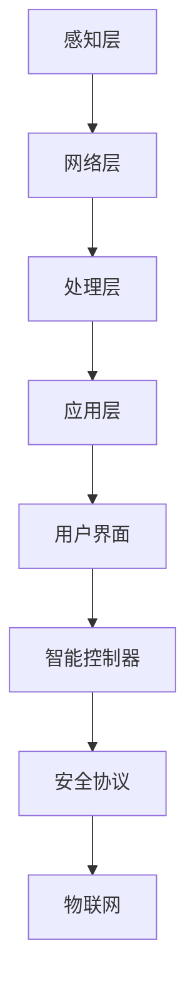

                 

# 基于Java的智能家居设计：用Java实现住宅安全系统的逻辑核心

> **关键词：** Java、智能家居、住宅安全系统、物联网、传感器、控制器、数据通信、异常检测、算法优化、安全性、案例、未来展望

> **摘要：** 本文深入探讨了基于Java技术的智能家居设计，重点介绍了如何利用Java实现住宅安全系统的逻辑核心。文章从核心概念、技术基础、系统设计、Java应用、核心算法、系统实现与部署、案例分析、拓展应用和未来展望等多个角度进行了详细讲解，旨在为读者提供一个全面的智能家居安全系统开发指南。

## 目录

### 第一部分：智能家居系统概述

#### 第1章：智能家居系统简介

1. 智能家居系统的定义与历史背景
2. 智能家居系统的发展趋势
3. 智能家居系统的关键组成部分
4. 智能家居系统的主要功能

#### 第2章：Java技术基础

1. Java编程语言简介
2. Java语法基础
3. 面向对象编程
4. Java异常处理
5. Java常用库与框架
6. Java编程技巧与最佳实践

#### 第3章：智能家居系统中的Java应用

1. Java在智能家居系统中的角色
2. Java在智能家居系统中的常见应用场景
3. Java编程在智能家居系统开发中的优势
4. 案例分析

### 第二部分：住宅安全系统的设计与实现

#### 第4章：住宅安全系统的核心概念与架构

1. 住宅安全系统的定义与重要性
2. 住宅安全系统的基本架构
3. 住宅安全系统的组成部分
4. 住宅安全系统的核心概念
5. 安全需求分析
6. 安全系统的设计与规划
7. 硬件规划
8. 软件规划
9. 安全协议与加密技术
10. 系统集成与测试

#### 第5章：Java在住宅安全系统中的应用

1. Java在传感器数据采集中的应用
2. Java在控制器逻辑中的应用
3. Java在数据通信中的应用
4. Java在安全系统的应用实战

#### 第6章：住宅安全系统中的核心算法

1. 传感器数据处理算法
2. 异常检测算法
3. 决策算法
4. 算法性能优化

#### 第7章：住宅安全系统的实现与部署

1. 软件实现
2. 硬件部署
3. 系统测试
4. 部署流程

### 第三部分：实战案例

#### 第8章：住宅安全系统案例分析

1. 案例背景
2. 案例目标
3. 案例实现过程
4. 案例结果分析

### 第四部分：拓展应用

#### 第9章：住宅安全系统的拓展应用与未来展望

1. 住宅安全系统的拓展应用
2. 未来发展趋势

### 第五部分：附录

#### 附录A：Java编程资源

1. Java编程学习资源
2. Java编程工具
3. Java编程社区

#### 附录B：住宅安全系统开发工具

1. 开发工具介绍
2. 工具的使用方法
3. 工具的优势与不足

#### 附录C：安全系统常见问题与解决方案

1. 安全系统常见问题
2. 安全系统的解决方案
3. 安全系统的维护技巧

## 引言

智能家居系统是现代家庭中不可或缺的一部分，它通过物联网技术，将各种设备连接到互联网，实现家庭设备的智能化管理。住宅安全系统作为智能家居系统的一个关键组成部分，旨在提高住宅的安全性，保护家庭成员和财产安全。本文将深入探讨如何基于Java技术实现住宅安全系统的逻辑核心，为智能家居系统的开发提供一套完整的解决方案。

Java作为一种成熟、稳定的编程语言，因其强大的跨平台性、安全性以及丰富的生态系统，成为智能家居系统开发的首选语言。通过本文的阅读，读者将了解：

- 住宅安全系统的核心概念、架构和设计原则。
- Java编程的基础知识和如何在智能家居系统中应用Java。
- 住宅安全系统中的关键算法，包括数据采集、处理、异常检测和决策算法。
- 实际的住宅安全系统开发案例，包括软件实现、硬件部署、系统测试和部署流程。
- 智能家居系统的拓展应用和未来的发展趋势。

本文将从以下几个方面进行详细讲解：

1. **智能家居系统概述**：介绍智能家居系统的定义、发展历史、关键组成部分和主要功能。
2. **Java技术基础**：讲解Java编程语言的基础知识和在智能家居系统中的应用。
3. **住宅安全系统的设计与实现**：探讨住宅安全系统的核心概念、架构设计、安全需求分析、硬件规划、软件规划、安全协议与加密技术、系统集成与测试。
4. **Java在住宅安全系统中的应用**：详细讨论Java在传感器数据采集、控制器逻辑、数据通信和实际应用中的具体实现。
5. **住宅安全系统中的核心算法**：介绍传感器数据处理、异常检测和决策算法的设计与实现。
6. **住宅安全系统的实现与部署**：讲述住宅安全系统的软件实现、硬件部署、系统测试和部署流程。
7. **实战案例**：通过实际案例展示住宅安全系统的开发过程和结果分析。
8. **拓展应用与未来展望**：探讨住宅安全系统的拓展应用和未来的发展趋势。
9. **附录**：提供与Java编程和住宅安全系统开发相关的资源和工具。

现在，让我们开始详细的探讨。

### 第一部分：智能家居系统概述

#### 第1章：智能家居系统简介

智能家居系统是指利用物联网技术，将家庭中的各种设备连接到互联网，通过智能控制平台实现设备的自动化管理和远程控制。智能家居系统的出现，极大地改变了人们的生活方式，提高了生活的便捷性和舒适性。

#### 1.1 智能家居系统的定义与历史背景

智能家居系统的定义可以从两个方面来理解：

- **狭义定义**：智能家居系统是指通过物联网技术，将家庭中的电器、照明、安防等设备连接到互联网，实现远程监控和控制。
- **广义定义**：智能家居系统不仅包括设备的连接和控制，还包括家庭环境的智能化管理，如能源管理、环境监测、健康管理等。

智能家居系统的发展历史可以追溯到20世纪80年代，当时一些高端住宅开始采用自动化的家电控制系统。随着互联网技术的普及和物联网技术的发展，智能家居系统逐渐从高端走向大众市场。近年来，随着智能手机和移动网络的普及，智能家居系统的发展进入了一个全新的阶段。

#### 1.2 智能家居系统的发展趋势

智能家居系统的发展趋势主要包括以下几个方面：

- **技术的融合**：智能家居系统将不断融合物联网技术、人工智能技术、大数据技术等，实现更智能、更便捷的家庭生活。
- **设备的智能化**：各种家庭设备将逐渐实现智能化，如智能空调、智能电视、智能门锁等，设备之间将实现无缝连接和协同工作。
- **生态的开放性**：智能家居系统将逐渐开放接口，实现与其他智能家居系统的互联互通，构建一个统一的智能家居生态圈。
- **安全性的提升**：随着智能家居系统的普及，安全性问题将越来越受到重视，智能家居系统将采用更严格的安全措施，保障用户的数据安全和隐私。

#### 1.3 智能家居系统的关键组成部分

智能家居系统由多个组成部分构成，以下是其主要组成部分：

- **感知层**：感知层是智能家居系统的最底层，负责采集家庭环境的数据，如温度、湿度、光照、烟雾等。感知层主要包括各种传感器，如温度传感器、湿度传感器、烟雾传感器、摄像头等。
- **网络层**：网络层负责将感知层采集到的数据传输到处理层和应用层。网络层通常使用无线通信技术，如Wi-Fi、蓝牙、ZigBee等，实现设备之间的通信。
- **处理层**：处理层是智能家居系统的核心，负责对采集到的数据进行处理和分析，并根据分析结果做出相应的决策。处理层通常包括智能控制器、服务器等。
- **应用层**：应用层是智能家居系统的最高层，负责为用户提供交互界面和智能控制功能。应用层通常包括智能手机应用、网页应用、语音助手等。

#### 1.4 智能家居系统的主要功能

智能家居系统的主要功能包括：

- **设备远程控制**：用户可以通过手机或其他智能设备远程控制家中的各种设备，如空调、灯光、门锁等。
- **环境监测**：智能家居系统可以实时监测家庭环境，如温度、湿度、空气质量等，并给出相应的建议。
- **安全防护**：智能家居系统可以提供家庭安全防护功能，如入侵检测、火灾报警、紧急呼叫等。
- **节能管理**：智能家居系统可以根据用户的习惯和需求，优化家庭能源的使用，实现节能管理。

### 1.5 智能家居系统的核心概念

在智能家居系统中，有几个核心概念需要理解：

- **物联网（IoT）**：物联网是智能家居系统的技术基础，它通过将各种设备连接到互联网，实现设备之间的数据交换和协同工作。
- **智能控制器**：智能控制器是智能家居系统的核心，它负责接收和处理设备数据，并根据用户需求做出相应的控制决策。
- **用户界面**：用户界面是智能家居系统的交互入口，用户可以通过用户界面与系统进行交互，实现设备控制、环境监测等功能。
- **安全协议**：智能家居系统需要采用安全协议，如HTTPS、SSL/TLS等，确保数据传输的安全性和用户的隐私。

为了更好地展示智能家居系统的核心概念与架构，我们可以使用Mermaid流程图来表示。以下是一个简单的示例：



通过以上内容，我们为《基于Java的智能家居设计：用Java实现住宅安全系统的逻辑核心》一书的第1章“智能家居系统简介”设计了详细的目录大纲。接下来，我们将继续设计第2章“Java技术基础”的目录大纲。

---

### 第2章：Java技术基础

在《基于Java的智能家居设计：用Java实现住宅安全系统的逻辑核心》一书中，第2章“Java技术基础”将详细介绍Java编程语言的基础知识，为后续章节的住宅安全系统开发打下坚实的语言基础。以下是第2章的目录大纲：

#### 第2章 Java技术基础

1. **Java编程语言简介**
    - Java的历史与起源
    - Java的特点与优势
    - Java的应用领域
    - Java的版本更新

2. **Java语法基础**
    - 变量与数据类型
    - 运算符与表达式
    - 控制语句
    - 面向对象编程基础

3. **面向对象编程**
    - 类与对象
    - 构造函数与析构函数
    - 继承与多态
    - 接口与抽象类

4. **Java异常处理**
    - 异常的基本概念
    - 异常的捕获与处理
    - 自定义异常
    - 异常的传播

5. **Java常用库与框架**
    - Java标准库介绍
    - 第三方库与框架的引入
    - 常用框架的简单使用

6. **Java编程技巧与最佳实践**
    - 编码规范
    - 性能优化
    - 安全性考虑
    - 调试与测试

#### 2.1 Java编程语言简介

**Java的历史与起源**

Java是由Sun Microsystems公司于1995年推出的一种高级编程语言，由Gosling等人开发。Java最初的设计目标是创建一种简单、跨平台、面向对象的编程语言，以支持网络应用开发。Java的核心理念是“一次编写，到处运行”，即同一个Java程序可以在不同的操作系统上运行，无需进行修改。

**Java的特点与优势**

- **跨平台性**：Java通过Java虚拟机（JVM）实现跨平台性，同一个Java程序可以在不同的操作系统上运行。
- **面向对象**：Java是一种面向对象的编程语言，支持封装、继承和多态等面向对象的概念，有助于提高代码的可维护性和复用性。
- **安全性**：Java具有强大的安全机制，如沙箱（Sandbox）机制、安全包（Security Packages）等，可以有效防止恶意代码的运行。
- **丰富的类库**：Java提供了丰富的标准库和第三方库，涵盖了各种编程领域，如网络编程、文件操作、图形用户界面等。
- **并发编程**：Java内置了强大的并发编程支持，如线程（Thread）和锁（Synchronized）机制，有助于提高程序的性能。

**Java的应用领域**

- **Web应用开发**：Java是企业级Web应用开发的首选语言，广泛应用于电子商务、在线银行、企业资源规划（ERP）等领域。
- **桌面应用开发**：Java Swing和JavaFX为Java桌面应用开发提供了强大的支持，可以开发丰富的图形用户界面。
- **移动应用开发**：Java是Android移动应用开发的主要语言，通过Android SDK，Java开发者可以轻松地创建Android应用。
- **大数据处理**：Java在大数据处理领域有着广泛的应用，如Hadoop、Spark等大数据处理框架都基于Java。
- **物联网开发**：Java在物联网开发中也扮演着重要角色，可以用于开发各种物联网设备的应用程序。

**Java的版本更新**

自Java推出以来，已经发布了多个版本，每个版本都带来了新的特性和改进。以下是部分重要版本的更新：

- **Java 1.0**（1995年）：Java的第一个版本，主要目标是实现跨平台性。
- **Java 2**（J2EE、J2SE、J2ME，2005年）：引入了J2平台的分类，分别用于企业级应用、标准版和嵌入式设备。
- **Java 5**（2004年）：引入了自动装箱/拆箱、枚举、可变参数等特性。
- **Java 8**（2014年）：引入了Lambda表达式、Stream API等新特性，极大地简化了Java的编程模型。
- **Java 11**（2018年）：Java 11是Java的长期支持（LTS）版本，引入了多个新特性和改进，如HTTP/2支持、 Shenandoah垃圾回收器等。

#### 2.2 Java语法基础

**变量与数据类型**

- **变量**：变量是存储数据的地方，Java中的变量必须先声明后使用。变量的声明包括变量类型、变量名和初始值。
- **数据类型**：Java提供了基本数据类型和引用数据类型。基本数据类型包括整数类型、浮点数类型、字符类型和布尔类型。引用数据类型主要包括类（Class）、接口（Interface）和数组（Array）。

```java
int number = 10; // 整数类型
double salary = 5000.0; // 浮点数类型
char grade = 'A'; // 字符类型
boolean isStudent = true; // 布尔类型
String name = "John Doe"; // 引用数据类型（String类）
```

**运算符与表达式**

- **运算符**：Java提供了多种运算符，包括算术运算符、关系运算符、逻辑运算符等。
- **表达式**：表达式是Java中的一个运算单元，用于计算值。

```java
int a = 5, b = 3;
int sum = a + b; // 算术表达式
boolean isGreater = a > b; // 关系表达式
boolean isTrue = (a + b) > 10 && (a - b) < 0; // 逻辑表达式
```

**控制语句**

- **条件语句**：条件语句用于根据条件执行不同的代码块。Java中的条件语句包括`if-else`、`switch`等。
- **循环语句**：循环语句用于重复执行一段代码。Java中的循环语句包括`for`、`while`、`do-while`等。

```java
if (a > b) {
    System.out.println("a 大于 b");
} else {
    System.out.println("a 小于或等于 b");
}

switch (grade) {
    case 'A':
        System.out.println("优秀");
        break;
    case 'B':
        System.out.println("良好");
        break;
    default:
        System.out.println("一般");
}

for (int i = 1; i <= 5; i++) {
    System.out.println("循环中的i: " + i);
}

while (isStudent) {
    System.out.println("学生还在学习");
}
```

**面向对象编程基础**

- **类与对象**：类是面向对象编程的基础，它定义了一组具有相同属性和行为的数据实体。对象是类的实例，可以通过构造函数创建。
- **构造函数与析构函数**：构造函数用于初始化对象，析构函数用于释放对象占用的资源。
- **继承与多态**：继承是一种建立类型间关系的方式，子类可以继承父类的属性和方法。多态是指同一操作作用于不同对象时可以有不同的解释和行为。

```java
class Animal {
    void eat() {
        System.out.println("动物吃食物");
    }
}

class Dog extends Animal {
    void eat() {
        System.out.println("狗吃骨头");
    }
}

Animal animal = new Animal();
animal.eat(); // 输出：动物吃食物

Dog dog = new Dog();
dog.eat(); // 输出：狗吃骨头

Animal animal2 = new Dog();
animal2.eat(); // 输出：狗吃骨头
```

- **接口与抽象类**：接口是一种抽象类型，它只包含抽象方法和常量定义。抽象类是一种可以包含抽象方法和具体方法的类，它不能被实例化。

```java
interface Animal {
    void eat();
}

abstract class Dog implements Animal {
    public void eat() {
        System.out.println("狗吃食物");
    }
}

class Dog2 extends Dog {
    // 可以继续添加具体方法
}
```

通过以上内容，我们为《基于Java的智能家居设计：用Java实现住宅安全系统的逻辑核心》一书的第2章“Java技术基础”设计了详细的目录大纲。接下来，我们将继续设计第3章“智能家居系统中的Java应用”的

