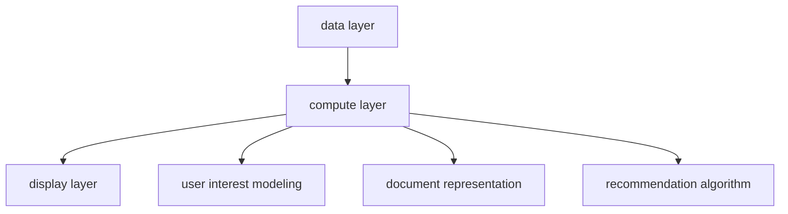

                 

# 《基于LLM的长文档推荐方法》

## 关键词
长文档推荐、语言模型、大型语言模型（LLM）、内容理解、用户兴趣建模、协同过滤、内容推荐、深度学习推荐算法、评估指标、优化策略。

## 摘要

本文旨在探讨基于大型语言模型（LLM）的长文档推荐方法，深入分析长文档推荐系统在信息爆炸时代的应用与挑战。通过梳理长文档推荐系统的架构，本文详细阐述了长文档表示、内容理解与标签化、用户兴趣建模与推荐算法等核心环节。特别地，本文重点介绍了LLM在长文档推荐系统中的应用，包括LLM的基本原理、长文档理解、用户兴趣建模以及推荐算法。通过实际案例研究和项目实战，本文展示了LLM在长文档推荐系统中的强大能力，并对未来发展方向进行了展望。

## 目录

### 第一部分：长文档推荐系统概述

#### 第1章：长文档推荐系统概述

##### 1.1 长文档推荐的重要性

##### 1.2 长文档推荐系统的架构

##### 1.3 长文档推荐系统的挑战与机遇

### 第二部分：长文档表示与理解

#### 第2章：长文档表示方法

##### 2.1 文本表示技术

##### 2.2 长文档分块与序列表示

##### 2.3 基于图的结构表示

#### 第3章：内容理解与标签化

##### 3.1 文本分类与主题模型

##### 3.2 命名实体识别与关系抽取

##### 3.3 文本摘要与关键词提取

### 第三部分：用户兴趣建模与推荐算法

#### 第4章：用户兴趣建模

##### 4.1 用户行为数据收集

##### 4.2 用户兴趣建模方法

##### 4.3 用户兴趣动态跟踪

#### 第5章：长文档推荐算法

##### 5.1 协同过滤算法

##### 5.2 内容推荐算法

##### 5.3 深度学习推荐算法

### 第四部分：推荐系统评估与优化

#### 第6章：推荐系统评估指标

##### 6.1 评估指标概述

##### 6.2 实际案例评估

#### 第7章：推荐系统优化策略

##### 7.1 冷启动问题

##### 7.2 实时推荐与缓存策略

##### 7.3 多样性与鲁棒性优化

### 第五部分：LLM在长文档推荐中的应用

#### 第8章：基于LLM的长文档理解

##### 8.1 LLM基本原理

##### 8.2 LLM在长文档中的应用

##### 8.3 LLM的优势与挑战

#### 第9章：基于LLM的长文档推荐算法

##### 9.1 基于LLM的内容理解

##### 9.2 基于LLM的用户兴趣建模

##### 9.3 基于LLM的推荐算法

#### 第10章：实际应用与案例研究

##### 10.1 案例一：电子书推荐

##### 10.2 案例二：新闻推荐

### 第六部分：未来展望与总结

#### 第11章：长文档推荐系统的发展趋势

##### 11.1 人工智能的发展趋势

##### 11.2 新技术带来的挑战与机遇

#### 第12章：总结与展望

##### 12.1 书籍内容的总结

##### 12.2 未来研究方向

## 第一部分：长文档推荐系统概述

### 第1章：长文档推荐系统概述

#### 1.1 长文档推荐的重要性

在信息时代，如何从海量信息中快速、准确地找到所需内容成为了一个重要的课题。长文档推荐系统作为信息检索与推荐系统的一个重要分支，具有极其重要的应用价值。长文档推荐系统旨在为用户提供个性化的长文档推荐，帮助用户在海量信息中快速定位到感兴趣的文档。

长文档推荐的重要性体现在以下几个方面：

1. **提高信息检索效率**：长文档推荐系统可以根据用户的历史行为和兴趣，为用户推荐可能感兴趣的长文档，从而提高信息检索的效率。

2. **优化用户体验**：通过个性化推荐，长文档推荐系统可以满足用户的个性化需求，提升用户体验。

3. **知识挖掘与传播**：长文档推荐系统可以帮助挖掘出潜在的知识点，促进知识的传播和应用。

4. **商业价值**：在商业场景中，长文档推荐系统可以帮助平台提高用户粘性，增加用户购买和订阅的意愿。

#### 1.2 长文档推荐系统的架构

长文档推荐系统通常包括以下几个主要组成部分：

1. **数据层**：数据层是推荐系统的基石，包括用户数据、文档数据、行为数据等。用户数据包括用户的基本信息、兴趣标签等；文档数据包括文档的内容、分类标签等；行为数据包括用户的浏览、点击、收藏等行为。

2. **计算层**：计算层负责处理和计算推荐系统的核心算法，包括用户兴趣建模、文档表示、推荐算法等。

3. **展示层**：展示层负责将推荐结果呈现给用户，包括推荐列表、推荐详情页等。

长文档推荐系统的基本架构可以用以下Mermaid流程图来表示：



#### 1.3 长文档推荐系统的挑战与机遇

尽管长文档推荐系统具有重要的应用价值，但其实现过程中也面临着一系列挑战：

1. **长文本处理**：长文档的文本处理是推荐系统的一个关键挑战。如何有效地将长文档进行分块和表示，以便于后续的计算和推荐。

2. **实时性**：在实时性要求较高的场景中，如何快速地处理用户请求，生成推荐结果是一个挑战。

3. **准确性**：如何确保推荐结果的准确性，使得用户能够真正地感兴趣并点击推荐内容。

4. **冷启动问题**：当新用户或新文档加入系统时，如何进行有效的推荐是一个难题。

然而，随着人工智能和深度学习技术的发展，长文档推荐系统也面临着许多机遇：

1. **预训练语言模型**：如GPT-3、BERT等大型语言模型的出现，为长文档的理解和表示提供了新的思路。

2. **多模态数据融合**：将文本、图像、音频等多模态数据融合到推荐系统中，可以进一步提高推荐效果的准确性。

3. **个性化推荐**：通过深度学习等算法，可以实现更加个性化的推荐，满足用户的个性化需求。

4. **自动化与智能化**：自动化和智能化技术的应用，可以降低推荐系统的维护成本，提高系统的稳定性。

### 第二部分：长文档表示与理解

#### 第2章：长文档表示方法

##### 2.1 文本表示技术

文本表示是长文档推荐系统的核心环节之一。有效的文本表示方法可以将原始的文本数据转化为计算机可以处理的数字形式，从而便于后续的算法处理。

常用的文本表示技术包括词嵌入（word embedding）、词向量（word vector）和向量空间模型（vector space model）等。

1. **词嵌入**

词嵌入是一种将单词映射为向量的技术。通过将每个单词映射为一个固定长度的向量，词嵌入可以将文本转化为数值形式，便于计算机处理。常见的词嵌入方法包括Word2Vec、GloVe等。

- **Word2Vec**：Word2Vec是一种基于神经网络的方法，它通过训练预测单词的上下文来学习单词的表示。Word2Vec有两种模型：连续词袋（CBOW）和Skip-Gram。

  ```mermaid
  graph
    A[word] --> B[context]
    B --> C[word vector]
  ```

- **GloVe**：GloVe（Global Vectors for Word Representation）是一种基于矩阵分解的方法。GloVe通过优化全局矩阵来学习单词的表示。

  ```mermaid
  graph
    A[word matrix] --> B[word vector]
  ```

2. **词向量**

词向量是词嵌入的结果，它将每个单词映射为一个固定长度的向量。词向量可以用于计算单词之间的相似性，从而在推荐系统中用于相似文档的检索和推荐。

3. **向量空间模型**

向量空间模型（Vector Space Model, VSM）是一种将文本表示为向量空间中向量的方法。在VSM中，每个单词都被映射为一个向量，文档则被视为这些单词向量的加权和。

  ```mermaid
  graph
    A[word vector] --> B[document vector]
  ```

##### 2.2 长文档分块与序列表示

长文档通常包含大量的信息，如何有效地对长文档进行分块和表示是一个关键问题。分块与序列表示方法可以将长文档拆分成多个可管理的部分，从而便于后续的处理。

1. **分块方法**

分块方法主要包括基于字符的分块、基于词的分块和基于句子的分块等。

- **基于字符的分块**：将长文档按照字符序列进行分块，通常适用于短文本处理。

- **基于词的分块**：将长文档按照词序列进行分块，可以更好地保留文档的结构和语义信息。

- **基于句子的分块**：将长文档按照句子进行分块，可以更好地理解文档的逻辑结构和内容。

2. **序列表示方法**

序列表示方法主要用于处理时间序列数据或序列化数据。在长文档推荐系统中，序列表示方法可以将文档中的每个分块表示为一个序列，从而便于后续的算法处理。

常用的序列表示方法包括循环神经网络（RNN）、长短期记忆网络（LSTM）和门控循环单元（GRU）等。

  ```mermaid
  graph
    A[sequence] --> B[RNN]
    B --> C[output]
  ```

##### 2.3 基于图的结构表示

基于图的结构表示是一种将文档表示为图的的方法。在基于图的表示中，文档中的每个实体（如词、句、段落）被表示为图中的一个节点，实体之间的关系（如词的共现、句的连贯性）被表示为图中的边。

1. **共现网络**

共现网络（co-occurrence network）是一种基于词的共现关系构建的图结构。在共现网络中，每个词被表示为一个节点，如果两个词在文档中共同出现，它们之间就有一条边。

  ```mermaid
  graph
    A[word1] --> B[word2]
    A --> C[word3]
  ```

2. **语义角色标注**

语义角色标注（semantic role labeling, SRL）是一种将句子中的词语及其关系表示为图的方法。在SRL中，每个词语被表示为一个节点，词语之间的关系（如主谓关系、动宾关系）被表示为边。

  ```mermaid
  graph
    A[subject] --> B[predicate]
    B --> C[object]
  ```

基于图的结构表示可以更好地捕捉文档中的语义信息，从而提高推荐系统的准确性。

#### 第3章：内容理解与标签化

##### 3.1 文本分类与主题模型

文本分类与主题模型是内容理解与标签化的重要方法。文本分类用于将文本数据分类到预定义的类别中，而主题模型则用于发现文本中的潜在主题。

1. **文本分类**

文本分类是一种有监督学习任务，通过训练分类模型，可以将新文本数据分类到预定义的类别中。常见的文本分类算法包括朴素贝叶斯（Naive Bayes）、支持向量机（SVM）、决策树（Decision Tree）等。

2. **主题模型**

主题模型（如LDA模型）是一种无监督学习任务，它用于发现文本中的潜在主题。在LDA模型中，每个文档被视为一系列主题的混合，每个主题由一系列单词的集合表示。

  ```mermaid
  graph
    A[document] --> B[topic]
    B --> C[word]
  ```

##### 3.2 命名实体识别与关系抽取

命名实体识别（Named Entity Recognition, NER）是一种用于识别文本中的特定实体（如人名、地名、组织名等）的方法。关系抽取（Relation Extraction）则用于识别实体之间的关系（如人与人的关系、人与地点的关系等）。

1. **命名实体识别**

命名实体识别通常采用有监督学习的方法，通过训练模型来识别文本中的命名实体。常见的NER算法包括CRF（条件随机场）、BiLSTM-CRF（双向长短时记忆网络条件随机场）等。

2. **关系抽取**

关系抽取通常采用图结构或依存句法分析的方法。在图结构中，实体被表示为节点，实体之间的关系被表示为边。在依存句法分析中，实体和关系被表示为依存关系。

  ```mermaid
  graph
    A[entity1] --> B[relation] --> C[entity2]
  ```

##### 3.3 文本摘要与关键词提取

文本摘要与关键词提取是文本处理中的重要任务，用于从长文本中提取关键信息和关键词。

1. **文本摘要**

文本摘要分为抽取式摘要和生成式摘要。抽取式摘要从原文中提取关键句子或短语进行摘要，而生成式摘要则通过生成新的文本摘要。

2. **关键词提取**

关键词提取通常采用统计方法或深度学习方法。统计方法通过计算词频、逆文档频率（IDF）等统计指标来提取关键词，而深度学习方法通过训练模型来提取关键词。

  ```mermaid
  graph
    A[word] --> B[keyword]
  ```

### 第三部分：用户兴趣建模与推荐算法

#### 第4章：用户兴趣建模

用户兴趣建模是长文档推荐系统中的关键环节，它通过分析用户的行为数据，构建用户兴趣模型，从而为用户推荐感兴趣的文档。

##### 4.1 用户行为数据收集

用户行为数据是构建用户兴趣模型的基础。常见的行为数据包括用户的浏览历史、点击记录、搜索查询、评论等。这些数据可以通过日志文件、数据库等形式进行收集。

1. **用户浏览历史**

用户浏览历史记录了用户在平台上的浏览行为，如浏览的文档、停留时间、浏览顺序等。通过分析用户浏览历史，可以了解用户的兴趣偏好。

2. **用户点击记录**

用户点击记录记录了用户在平台上的点击行为，如点击的文档、广告、推荐列表等。通过分析用户点击记录，可以进一步了解用户的兴趣偏好。

3. **用户搜索查询**

用户搜索查询记录了用户的搜索行为，如搜索关键词、搜索结果、点击记录等。通过分析用户搜索查询，可以了解用户的当前需求和兴趣。

4. **用户评论**

用户评论记录了用户对文档的评价和反馈，如评分、评论内容等。通过分析用户评论，可以了解用户对文档的满意度和兴趣。

##### 4.2 用户兴趣建模方法

用户兴趣建模方法主要包括协同过滤、矩阵分解、深度学习等方法。

1. **协同过滤**

协同过滤（Collaborative Filtering）是一种基于用户行为数据的方法，它通过分析用户之间的相似性，为用户推荐相似的文档。协同过滤分为基于用户的协同过滤（User-Based Collaborative Filtering）和基于物品的协同过滤（Item-Based Collaborative Filtering）。

- **基于用户的协同过滤**：通过计算用户之间的相似性，找到与目标用户兴趣相似的其他用户，并推荐这些用户喜欢的文档。

  ```mermaid
  graph
    A[user1] --> B[user2] --> C[document]
  ```

- **基于物品的协同过滤**：通过计算文档之间的相似性，找到与目标用户兴趣相似的文档，并推荐这些文档。

  ```mermaid
  graph
    A[document1] --> B[document2] --> C[user]
  ```

2. **矩阵分解**

矩阵分解（Matrix Factorization）是一种无监督学习方法，它通过分解用户-物品评分矩阵，提取用户和物品的特征向量。常见的矩阵分解方法包括奇异值分解（SVD）、奇异值分解扩展（SVD++）等。

  ```mermaid
  graph
    A[user matrix] --> B[user feature vector]
    A --> C[item feature vector]
  ```

3. **深度学习**

深度学习（Deep Learning）是一种基于神经网络的方法，它可以自动提取高维特征，从而实现用户兴趣建模。常见的深度学习方法包括卷积神经网络（CNN）、循环神经网络（RNN）等。

  ```mermaid
  graph
    A[user behavior data] --> B[user feature vector]
  ```

##### 4.3 用户兴趣动态跟踪

用户兴趣是动态变化的，如何实时地跟踪用户兴趣的变化是推荐系统的一个重要挑战。

1. **基于行为的动态跟踪**

基于行为的动态跟踪通过实时收集和分析用户的行为数据，如浏览历史、点击记录等，来跟踪用户兴趣的变化。通过分析用户行为的趋势和变化，可以及时调整用户兴趣模型，从而实现实时推荐。

2. **基于知识的动态跟踪**

基于知识的动态跟踪通过构建知识图谱，将用户兴趣与知识实体进行关联，从而实现用户兴趣的动态跟踪。通过分析知识图谱中的关系和链接，可以挖掘出用户的潜在兴趣点，并动态调整用户兴趣模型。

  ```mermaid
  graph
    A[user] --> B[knowledge graph]
    B --> C[user interest]
  ```

### 第四部分：推荐系统评估与优化

#### 第5章：长文档推荐算法

推荐系统的核心是推荐算法，如何选择和优化推荐算法是决定推荐系统效果的关键。长文档推荐系统由于文档长度和内容的复杂性，推荐算法的选择和优化更为重要。

##### 5.1 协同过滤算法

协同过滤算法（Collaborative Filtering）是推荐系统中最常用的算法之一，它通过分析用户之间的相似性或物品之间的相似性来生成推荐列表。

1. **基于用户的协同过滤（User-Based Collaborative Filtering）**

基于用户的协同过滤通过计算用户之间的相似性，找到与目标用户兴趣相似的其他用户，并推荐这些用户喜欢的文档。相似性计算通常使用用户-物品评分矩阵中的余弦相似度、皮尔逊相关系数等指标。

2. **基于物品的协同过滤（Item-Based Collaborative Filtering）**

基于物品的协同过滤通过计算物品之间的相似性，找到与目标用户兴趣相似的物品，并推荐这些物品。相似性计算通常使用物品-物品的共现矩阵或基于内容的相似性指标。

  ```mermaid
  graph
    A[item1] --> B[item2]
    A --> C[user]
  ```

3. **协同过滤算法的优缺点**

- 优点：简单易实现，适用于稀疏的用户-物品评分矩阵。
- 缺点：无法处理缺失数据，易受冷启动问题影响。

##### 5.2 内容推荐算法

内容推荐算法（Content-Based Recommendation）基于文档的内容特征进行推荐，它通过分析用户历史喜欢的文档，提取文档的特征，然后根据用户对特征的兴趣为用户推荐相似的文档。

1. **文本特征提取**

文本特征提取是内容推荐算法的关键步骤，常见的文本特征提取方法包括词袋模型（Bag of Words, BOW）、TF-IDF（Term Frequency-Inverse Document Frequency）等。

2. **内容相似度计算**

内容相似度计算用于衡量两个文档之间的相似性，常见的相似度计算方法包括余弦相似度、Jaccard相似度等。

  ```mermaid
  graph
    A[document1] --> B[document2]
    A --> C[feature vector]
    B --> C
  ```

3. **内容推荐算法的优缺点**

- 优点：适用于冷启动问题，能够为用户提供个性化的推荐。
- 缺点：依赖于特征提取的质量，可能无法捕捉长文档中的深层次语义信息。

##### 5.3 深度学习推荐算法

深度学习推荐算法通过训练深度神经网络模型，自动提取用户和物品的高维特征，从而实现推荐。

1. **基于模型的深度学习推荐算法**

基于模型的深度学习推荐算法包括基于矩阵分解的深度学习算法和基于神经网络的推荐算法。

- **基于矩阵分解的深度学习算法**：结合了矩阵分解和深度学习的优势，通过训练深度神经网络来优化矩阵分解模型。

  ```mermaid
  graph
    A[user-物品评分矩阵] --> B[深度神经网络]
    B --> C[特征向量]
  ```

- **基于神经网络的推荐算法**：如循环神经网络（RNN）、卷积神经网络（CNN）等，可以自动提取用户和物品的特征。

  ```mermaid
  graph
    A[user behavior data] --> B[深度神经网络]
    B --> C[user feature vector]
  ```

2. **基于注意力机制的推荐算法**

注意力机制（Attention Mechanism）是一种用于捕捉输入序列中不同部分的重要性的方法，它可以提高推荐算法对用户兴趣的捕捉能力。

  ```mermaid
  graph
    A[user behavior data] --> B[注意力机制]
    B --> C[user feature vector]
  ```

3. **深度学习推荐算法的优缺点**

- 优点：能够自动提取高维特征，捕捉长文档中的深层次语义信息，适用于冷启动问题。
- 缺点：计算资源需求较高，模型训练时间较长。

### 第五部分：LLM在长文档推荐中的应用

#### 第8章：基于LLM的长文档理解

##### 8.1 LLM基本原理

大型语言模型（Large Language Model，LLM）是一种基于深度学习的自然语言处理模型，它通过大量的文本数据进行预训练，从而具备对自然语言的理解和生成能力。常见的LLM包括GPT-3、BERT、T5等。

1. **预训练**

预训练是LLM的基础，它通过在大量文本数据上进行无监督学习，学习语言的基本结构和语义信息。预训练模型通常包含数十亿个参数，具有强大的语言理解和生成能力。

2. **微调**

微调（Fine-tuning）是在预训练的基础上，针对特定任务对模型进行有监督学习。通过微调，模型可以适应特定任务的需求，提高任务性能。

3. **生成与理解**

LLM可以通过生成文本和解析文本来实现对长文档的理解。生成文本用于提取文档的主要内容和结构，而解析文本则用于分析文档中的语义关系和实体。

##### 8.2 LLM在长文档中的应用

LLM在长文档推荐系统中的应用主要体现在以下几个方面：

1. **文本生成**

LLM可以用于生成摘要、摘要摘要、标题等，从而简化长文档的处理。通过生成摘要，可以快速捕捉文档的核心内容，为后续的推荐算法提供输入。

2. **文本理解**

LLM可以用于理解长文档的语义信息，从而提取文档的主题、关键词、实体等。通过理解文本，可以更好地进行文档分类、标签化等操作。

3. **关系抽取**

LLM可以用于抽取长文档中的实体及其关系，从而构建知识图谱。通过关系抽取，可以更好地理解文档的结构和语义，为推荐算法提供更多有效的信息。

##### 8.3 LLM的优势与挑战

LLM在长文档推荐系统中的应用具有以下优势：

1. **强大的语言理解能力**

LLM通过预训练和微调，具备强大的语言理解能力，可以更好地捕捉文档的语义信息。

2. **自动特征提取**

LLM可以自动提取文档的高维特征，从而简化特征工程过程。

3. **多任务学习能力**

LLM可以同时处理多个任务，如文本生成、文本理解、关系抽取等，从而提高推荐系统的综合性能。

然而，LLM在长文档推荐系统中也面临着以下挑战：

1. **计算资源需求**

LLM通常包含数十亿个参数，训练和推理过程中需要大量的计算资源。

2. **数据质量和标注**

LLM的性能依赖于训练数据的质量和标注的准确性，数据质量和标注问题可能导致模型性能下降。

3. **长文本处理能力**

尽管LLM具有强大的语言理解能力，但在处理超长文本时，仍可能面临处理效率和准确性的挑战。

### 第六部分：实际应用与案例研究

#### 第9章：基于LLM的长文档推荐算法

##### 9.1 基于LLM的内容理解

基于LLM的内容理解是长文档推荐系统中的重要环节，它通过LLM对长文档的语义信息进行解析和提取，从而为推荐算法提供高质量的输入。

1. **文档摘要生成**

通过LLM生成文档摘要，可以快速捕捉文档的核心内容。具体实现步骤如下：

- **数据预处理**：对长文档进行预处理，包括分词、去停用词等。
- **摘要生成**：利用LLM生成文档摘要，常用的模型包括GPT-2、GPT-3等。
- **摘要筛选**：对生成的摘要进行筛选，去除重复和不重要的摘要。

2. **主题提取**

通过LLM提取文档的主题，可以更好地理解文档的主要内容。具体实现步骤如下：

- **数据预处理**：对长文档进行预处理，包括分词、去停用词等。
- **主题提取**：利用LLM提取文档的主题，常用的模型包括LDA、BERT等。
- **主题筛选**：对提取的主题进行筛选，去除重复和不重要的主题。

3. **实体识别与关系抽取**

通过LLM识别文档中的实体和抽取实体之间的关系，可以构建知识图谱，为推荐算法提供更多有效的信息。具体实现步骤如下：

- **数据预处理**：对长文档进行预处理，包括分词、去停用词等。
- **实体识别**：利用LLM识别文档中的实体，常用的模型包括BERT、NER模型等。
- **关系抽取**：利用LLM抽取实体之间的关系，常用的模型包括关系抽取模型、图神经网络等。
- **知识图谱构建**：将识别的实体和关系构建为知识图谱，用于后续的推荐算法。

##### 9.2 基于LLM的用户兴趣建模

基于LLM的用户兴趣建模是构建用户兴趣模型的关键步骤，它通过LLM对用户行为数据进行分析和提取，从而为推荐算法提供用户兴趣信息。

1. **用户兴趣标签提取**

通过LLM提取用户兴趣标签，可以更好地理解用户的兴趣偏好。具体实现步骤如下：

- **数据预处理**：对用户行为数据（如浏览历史、搜索记录等）进行预处理，包括分词、去停用词等。
- **兴趣标签提取**：利用LLM提取用户兴趣标签，常用的模型包括BERT、GPT-3等。
- **标签筛选**：对提取的兴趣标签进行筛选，去除重复和不重要的标签。

2. **用户兴趣动态跟踪**

通过LLM实时分析用户行为数据，可以动态跟踪用户兴趣的变化。具体实现步骤如下：

- **数据实时收集**：实时收集用户行为数据，包括浏览历史、搜索记录等。
- **兴趣动态跟踪**：利用LLM分析用户行为数据，提取用户兴趣标签，并更新用户兴趣模型。
- **兴趣模型更新**：根据用户兴趣标签的更新，实时调整用户兴趣模型，为用户推荐更符合其当前兴趣的文档。

##### 9.3 基于LLM的推荐算法

基于LLM的推荐算法是长文档推荐系统的核心部分，它通过LLM对文档和用户兴趣的语义信息进行理解和匹配，从而为用户推荐符合其兴趣的文档。

1. **文档特征提取**

通过LLM提取文档的特征，包括文档的摘要、主题、实体和关系等。具体实现步骤如下：

- **数据预处理**：对长文档进行预处理，包括分词、去停用词等。
- **特征提取**：利用LLM提取文档的特征，常用的模型包括BERT、GPT-3等。

2. **用户兴趣匹配**

通过LLM匹配用户兴趣标签和文档特征，找到与用户兴趣最相似的文档。具体实现步骤如下：

- **用户兴趣标签提取**：利用LLM提取用户兴趣标签。
- **文档特征提取**：利用LLM提取文档的特征。
- **兴趣匹配**：计算用户兴趣标签和文档特征之间的相似度，找到与用户兴趣最相似的文档。

3. **推荐结果生成**

根据用户兴趣匹配的结果，生成推荐列表，为用户推荐符合其兴趣的文档。具体实现步骤如下：

- **推荐列表生成**：根据兴趣匹配的结果，生成推荐列表。
- **推荐结果筛选**：对推荐列表进行筛选，去除重复和不重要的文档。
- **推荐结果展示**：将推荐结果展示给用户，包括推荐文档的标题、摘要、评分等。

### 第七部分：长文档推荐系统的发展趋势

#### 第10章：长文档推荐系统的发展趋势

长文档推荐系统在近年来取得了显著的进展，随着人工智能和深度学习技术的发展，长文档推荐系统正朝着更加智能化、个性化的方向发展。以下是长文档推荐系统的发展趋势：

1. **预训练语言模型的应用**

预训练语言模型（如GPT-3、BERT等）在长文档推荐系统中发挥着越来越重要的作用。这些模型通过在大量文本数据上进行预训练，可以自动提取文档的语义信息，从而提高推荐系统的准确性和效率。

2. **多模态数据的融合**

多模态数据融合（如文本、图像、音频等）是未来长文档推荐系统的重要方向。通过融合多模态数据，可以更全面地理解用户需求和文档内容，从而提高推荐系统的效果。

3. **实时推荐与个性化推荐**

随着用户需求的不断变化，实时推荐和个性化推荐成为长文档推荐系统的关键需求。通过实时分析用户行为数据和文档特征，可以动态调整推荐策略，实现更加个性化的推荐。

4. **推荐算法的优化与优化策略**

为了提高推荐系统的效果，推荐算法的优化与优化策略成为研究热点。例如，基于深度学习的推荐算法、注意力机制、知识图谱等技术，都可以有效提高推荐系统的性能。

5. **长文本处理与分块技术**

长文本处理与分块技术是长文档推荐系统的核心技术之一。通过有效的文本分块和表示方法，可以更好地理解长文档的语义信息，从而提高推荐系统的准确性。

6. **评估与优化策略**

评估与优化策略是长文档推荐系统的重要环节。通过设计合理的评估指标和优化策略，可以不断提高推荐系统的效果和用户体验。

### 第八部分：总结与展望

#### 第11章：总结与展望

长文档推荐系统在信息爆炸时代具有重要的应用价值，它可以帮助用户快速、准确地找到所需信息，提升信息检索和用户体验。本文从长文档推荐系统的概述、长文档表示与理解、用户兴趣建模与推荐算法、评估与优化策略等方面进行了详细探讨。

特别地，本文重点介绍了基于大型语言模型（LLM）的长文档推荐方法。LLM具有强大的语义理解和生成能力，可以更好地处理长文档的语义信息，提高推荐系统的准确性和效率。

未来，长文档推荐系统的发展趋势将包括预训练语言模型的应用、多模态数据融合、实时推荐与个性化推荐等。同时，优化推荐算法和评估策略也将成为研究重点，以进一步提高推荐系统的效果和用户体验。

总之，长文档推荐系统在人工智能和深度学习技术的推动下，必将取得更加显著的进展，为信息检索和推荐领域带来更多创新和机遇。作者：AI天才研究院/AI Genius Institute & 禅与计算机程序设计艺术 /Zen And The Art of Computer Programming。

