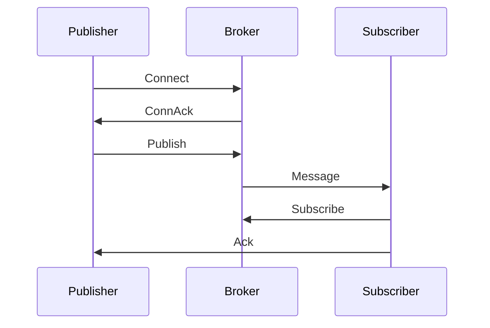
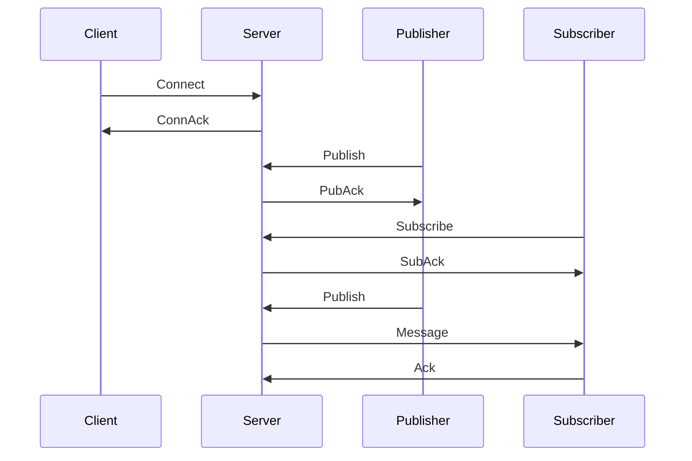

                 

### 文章标题

**基于MQTT协议和RESTful API的智能家居场景模式智能调整**

> **关键词**：MQTT协议、RESTful API、智能家居、场景模式、智能调整

> **摘要**：本文将深入探讨MQTT协议和RESTful API在智能家居场景模式智能调整中的应用。通过详细解析MQTT协议的基础知识、通信机制、安全特性，以及RESTful API的简介、核心组成部分和安全特性，本文将为您展示如何利用这两种技术构建一个智能化、安全且高效的智能家居系统。此外，本文还将通过实际案例分析，展示MQTT协议和RESTful API在智能家居场景模式调整中的具体应用，并探讨其面临的挑战和未来的发展趋势。

### 目录大纲设计

本文将按照以下目录结构进行组织：

#### 第一部分：MQTT协议基础

- **第1章：MQTT协议简介**
  - **1.1 MQTT协议的历史与发展**
  - **1.2 MQTT协议的核心概念与架构**
  - **1.3 MQTT协议的主要特点与优势**
  - **1.4 MQTT协议的通信流程**

- **第2章：MQTT协议的通信机制**
  - **2.1 MQTT协议的消息传递机制**
  - **2.2 MQTT协议的QoS等级**
  - **2.3 MQTT协议的连接与断开管理**
  - **2.4 MQTT协议的订阅与发布**

- **第3章：MQTT协议的安全特性**
  - **3.1 MQTT协议的安全挑战**
  - **3.2 MQTT协议的安全机制**
  - **3.3 MQTT协议的安全策略与实践**

#### 第二部分：RESTful API技术

- **第4章：RESTful API简介**
  - **4.1 REST架构风格的概念与原则**
  - **4.2 RESTful API的设计与实现**
  - **4.3 RESTful API的主要优点与局限**

- **第5章：RESTful API的核心组成部分**
  - **5.1 URI（统一资源标识符）**
  - **5.2 HTTP方法（GET、POST、PUT、DELETE等）**
  - **5.3 HTTP状态码**
  - **5.4 JSON和XML数据格式**

- **第6章：RESTful API的安全性**
  - **6.1 RESTful API的安全性挑战**
  - **6.2 RESTful API的安全防护措施**
  - **6.3 RESTful API的安全最佳实践**

#### 第三部分：智能家居场景模式智能调整

- **第7章：智能家居概述**
  - **7.1 智能家居的概念与组成**
  - **7.2 智能家居的发展历程**
  - **7.3 智能家居的应用场景**

- **第8章：MQTT协议在智能家居中的应用**
  - **8.1 MQTT协议在智能家居中的角色**
  - **8.2 MQTT协议在智能家居设备通信中的应用**
  - **8.3 MQTT协议在智能家居平台架构中的应用**

- **第9章：RESTful API在智能家居中的应用**
  - **9.1 RESTful API在智能家居设备控制中的应用**
  - **9.2 RESTful API在智能家居系统集成中的应用**
  - **9.3 RESTful API在智能家居云端服务中的应用**

- **第10章：智能家居场景模式智能调整**
  - **10.1 智能家居场景模式的概念与分类**
  - **10.2 智能家居场景模式的智能调整原理**
  - **10.3 基于MQTT协议和RESTful API的智能家居场景模式调整案例分析**
  - **10.4 智能家居场景模式智能调整的挑战与未来发展趋势**

### 附录

- **附录A：MQTT协议与RESTful API开发工具**
  - **A.1 MQTT协议开发工具介绍**
  - **A.2 RESTful API开发工具介绍**
  - **A.3 MQTT协议与RESTful API集成开发实践**

- **附录B：相关标准与规范**
  - **B.1 MQTT协议相关标准与规范**
  - **B.2 RESTful API相关标准与规范**
  - **B.3 智能家居领域相关标准与规范**

- **附录C：智能家居场景模式调整参考案例**
  - **C.1 常见智能家居场景模式调整案例分析**
  - **C.2 智能家居场景模式调整方案设计指南**

- **附录D：进一步阅读材料**
  - **D.1 MQTT协议与RESTful API相关书籍推荐**
  - **D.2 智能家居领域研究报告与论文推荐**
  - **D.3 MQTT协议与RESTful API在线学习资源推荐**

### 引言

随着物联网（IoT）技术的快速发展，智能家居已经成为人们生活中不可或缺的一部分。智能家居系统通过将家庭中的各种设备互联互通，实现了对家庭环境的自动化、智能化管理，极大地提高了生活质量和便利性。然而，随着设备的增多和场景的复杂化，如何实现智能家居系统的智能调整成为一个重要且具有挑战性的问题。本文将深入探讨基于MQTT协议和RESTful API的智能家居场景模式智能调整，以期为读者提供一种解决方案。

#### MQTT协议与RESTful API在智能家居中的重要性

MQTT协议和RESTful API是构建智能家居系统的两大核心技术。MQTT协议是一种轻量级、低带宽、高可靠性的消息传输协议，特别适合于物联网设备之间的通信。RESTful API则是一种基于HTTP协议的Web服务架构风格，具有简单、灵活、可扩展的特点，广泛应用于各种应用系统的接口设计。

在智能家居系统中，MQTT协议主要用于设备间的通信，实现设备状态的上报、控制指令的传达等。而RESTful API则用于智能家居平台的接口设计，实现设备配置、数据查询、远程控制等功能。通过MQTT协议和RESTful API的协同工作，可以构建一个高效、安全、智能的智能家居系统。

#### 文章结构

本文将分为三大部分进行阐述。第一部分将深入介绍MQTT协议的基础知识，包括其历史发展、核心概念、通信机制和安全特性。第二部分将探讨RESTful API的技术细节，包括其架构风格、核心组成部分和安全特性。第三部分将聚焦于智能家居场景模式的智能调整，通过实际案例分析展示MQTT协议和RESTful API在智能家居场景模式调整中的具体应用，并探讨其面临的挑战和未来的发展趋势。

### MQTT协议基础

#### MQTT协议简介

MQTT（Message Queuing Telemetry Transport）是一种轻量级的消息传输协议，专门为物联网设备设计。它的主要特点是低带宽占用、高可靠性和易于实现，非常适合用于连接大量设备和传感器。MQTT协议由IBM在1999年首次提出，随后逐渐发展成为物联网领域的一种标准协议。

#### MQTT协议的核心概念与架构

MQTT协议的核心概念包括发布者（Publisher）、订阅者（Subscriber）和代理（Broker）。发布者是指发送消息的设备或系统，订阅者是指接收消息的设备或系统，而代理则是连接发布者和订阅者的中介，负责消息的传输和路由。

MQTT协议的架构分为客户端（Client）、代理（Broker）和服务器（Server）三层。客户端负责与代理通信，发布者将消息发送到代理，订阅者则从代理接收消息。服务器则用于存储和管理消息，确保消息的可靠传输。

#### MQTT协议的主要特点与优势

1. **低带宽占用**：MQTT协议使用二进制消息格式，数据包小，适用于带宽受限的物联网设备。
2. **高可靠性**：MQTT协议支持消息确认和重传机制，确保消息的可靠传输。
3. **分布式架构**：MQTT协议采用代理-发布者-订阅者的分布式架构，适合大规模物联网应用。
4. **安全性**：MQTT协议支持多种安全机制，如TLS加密、用户认证等。
5. **跨平台性**：MQTT协议支持多种编程语言和操作系统，易于集成到不同设备中。
6. **易于实现**：MQTT协议的设计简单，便于开发者实现。

#### MQTT协议的通信流程

MQTT协议的通信流程主要包括以下几个步骤：

1. **连接建立**：客户端通过TCP或TLS连接与代理建立通信。
2. **发布消息**：发布者将消息发布到特定的主题。
3. **订阅主题**：订阅者订阅相关的主题，以接收发布者发布的消息。
4. **消息传输**：代理根据订阅信息，将消息转发给相应的订阅者。
5. **连接断开**：客户端与代理之间的连接可以随时断开，也可以通过心跳机制保持连接。

### MQTT协议的通信机制

#### MQTT协议的消息传递机制

MQTT协议的消息传递机制基于发布/订阅（Publish/Subscribe）模式。发布者将消息发布到特定的主题，订阅者订阅这些主题以接收消息。消息传递过程分为以下几个阶段：

1. **发布消息**：发布者将消息和主题信息发送到代理。
2. **订阅主题**：订阅者向代理发送订阅请求，指定要订阅的主题。
3. **消息传输**：代理根据订阅信息，将消息转发给相应的订阅者。
4. **确认消息**：订阅者接收到消息后，向代理发送确认消息。

#### MQTT协议的QoS等级

MQTT协议支持三个QoS（质量服务）等级，分别是QoS 0、QoS 1和QoS 2。不同QoS等级决定了消息的传输方式和可靠性。

1. **QoS 0（至多一次）**：消息可能丢失，但不重复。适用于对可靠性要求不高的场景。
2. **QoS 1（至少一次）**：消息至少传输一次，但可能重复。适用于对数据可靠性有一定要求的场景。
3. **QoS 2（准确一次）**：消息准确传输一次，不丢失也不重复。适用于对数据可靠性要求最高的场景。

#### MQTT协议的连接与断开管理

MQTT协议的连接与断开管理包括以下步骤：

1. **连接建立**：客户端通过TCP或TLS连接与代理建立通信。
2. **连接断开**：客户端可以主动断开连接，或者通过心跳机制保持连接。
3. **重连机制**：如果连接断开，客户端可以尝试重新连接。

#### MQTT协议的订阅与发布

MQTT协议的订阅与发布包括以下步骤：

1. **订阅主题**：订阅者向代理发送订阅请求，指定要订阅的主题。
2. **发布消息**：发布者向代理发送消息，指定消息的主题。
3. **消息传输**：代理根据订阅信息，将消息转发给相应的订阅者。

#### MQTT协议的持久化机制

MQTT协议支持持久化机制，可以保存发布者和订阅者的消息：

1. **持久化订阅**：订阅者的订阅信息可以保存到代理的数据库中。
2. **持久化消息**：发布者的消息可以保存在代理的消息队列中，供订阅者查询。

#### MQTT协议的负载格式

MQTT协议的消息负载格式包括以下几部分：

1. **报头（Header）**：包含消息的类型、QoS等级、消息标识符等。
2. **主题（Topic）**：消息的主题，用于匹配订阅者的订阅。
3. **载荷（Payload）**：消息的内容，可以是文本、二进制数据等。

#### MQTT协议的压缩机制

MQTT协议支持压缩机制，可以减小消息的大小，降低带宽占用：

1. **Deflate压缩**：使用 deflate 压缩算法对消息进行压缩。
2. **压缩标志**：在消息报头中设置压缩标志，指示消息是否压缩。

#### MQTT协议的认证与授权

MQTT协议支持认证与授权机制，可以确保消息的安全传输：

1. **认证**：客户端通过用户名和密码进行认证。
2. **授权**：代理根据用户的权限，决定客户端可以访问的主题和操作。

### MQTT协议的安全特性

#### MQTT协议的安全挑战

随着物联网设备的普及，MQTT协议的安全性成为了一个关键问题。MQTT协议面临的主要安全挑战包括：

1. **数据泄露**：未加密的MQTT通信可能导致敏感数据泄露。
2. **恶意攻击**：恶意攻击者可能利用MQTT协议的漏洞进行攻击，如拒绝服务攻击（DoS）。
3. **认证与授权漏洞**：弱认证和授权机制可能导致非法用户访问受限资源。
4. **中间人攻击**：攻击者可能在客户端与服务器之间拦截和篡改数据。

#### MQTT协议的安全机制

MQTT协议提供了一系列安全机制，以应对上述安全挑战：

1. **TLS加密**：使用TLS加密协议，确保通信过程中的数据加密。
2. **用户认证**：支持用户认证，确保只有合法用户可以访问。
3. **权限管理**：通过权限管理，限制用户对特定主题的访问权限。
4. **数据完整性**：通过使用MAC（消息认证码）机制，确保消息在传输过程中未被篡改。

#### MQTT协议的安全策略与实践

为了确保MQTT协议的安全，以下是一些安全策略和实践：

1. **使用TLS加密**：在MQTT通信中使用TLS加密，保护数据安全。
2. **强制用户认证**：在MQTT服务器上强制要求用户进行认证，防止未授权访问。
3. **权限分配**：根据用户角色和功能，合理分配权限，限制对敏感资源的访问。
4. **日志记录与监控**：记录MQTT服务器的日志，并定期监控，及时发现和响应安全事件。
5. **安全配置**：优化MQTT服务器的配置，关闭不必要的功能和服务。
6. **安全培训**：对开发人员和运维人员进行安全培训，提高安全意识和技能。

### MQTT协议的核心概念与联系

为了更好地理解MQTT协议的核心概念，我们可以借助Mermaid流程图来展示MQTT协议的基本架构和通信流程。

以下是一个简单的MQTT协议架构的Mermaid流程图：



在这个流程图中，发布者（Publisher）首先连接到代理（Broker），然后发布消息到特定的主题。代理接收到消息后，将其转发给订阅者（Subscriber）。订阅者接收到消息后，向代理发送确认消息（Ack）。

以下是一个MQTT协议通信流程的Mermaid流程图：



在这个流程图中，客户端（Client）通过连接（Connect）请求与服务器（Server）建立连接。服务器（Server）返回连接确认（ConnAck）消息。发布者（Publisher）向服务器（Server）发布消息（Publish），服务器（Server）返回发布确认（PubAck）消息。订阅者（Subscriber）向服务器（Server）订阅主题（Subscribe），服务器（Server）返回订阅确认（SubAck）消息。随后，服务器（Server）将发布者（Publisher）发布的消息（Message）转发给订阅者（Subscriber），订阅者（Subscriber）接收到消息后，向服务器（Server）发送确认（Ack）消息。

通过这两个Mermaid流程图，我们可以清晰地看到MQTT协议的核心概念和通信流程，有助于理解MQTT协议的工作原理。

### MQTT协议的核心算法原理讲解

在MQTT协议中，核心算法主要涉及连接管理、消息传递和订阅/发布过程。以下将使用伪代码详细阐述这些算法原理。

#### 连接管理

MQTT客户端在启动时，首先需要与MQTT代理服务器建立连接。以下是一个简单的连接管理算法：

```plaintext
Algorithm Connect()
    Send TCP connection request to the broker
    Wait for the broker to respond with a connection acknowledgment (ConnAck)
    If ConnAck is successful, proceed
    Else, handle connection failure (e.g., retry connection or notify user)
```

这个算法中，客户端发送TCP连接请求到代理服务器，等待代理服务器返回连接确认（ConnAck）。如果连接确认成功，则继续后续操作；否则，处理连接失败的情况。

#### 消息传递

MQTT协议中的消息传递分为发布（Publish）和订阅（Subscribe）两个过程。以下是一个简单的消息传递算法：

```plaintext
Algorithm Publish(Message, Topic, QoS)
    Prepare MQTT packet with Message, Topic, and QoS level
    Send MQTT packet to the broker
    Wait for the broker to respond with a publish acknowledgment (PubAck)
    If PubAck is received, message is considered successfully published
    Else, handle publish failure (e.g., retry publish or notify user)
```

这个算法中，客户端准备一个包含消息（Message）、主题（Topic）和QoS等级（QoS）的MQTT数据包，并将其发送到代理服务器。代理服务器返回一个发布确认（PubAck）消息，如果收到发布确认，则认为消息成功发布；否则，处理发布失败的情况。

#### 订阅/发布过程

MQTT协议中的订阅（Subscribe）和发布（Publish）过程是通过发布/订阅（Publish/Subscribe）模式实现的。以下是一个简单的订阅/发布算法：

```plaintext
Algorithm Subscribe(Topic, QoS)
    Prepare MQTT packet with Topic and QoS level
    Send MQTT packet to the broker
    Wait for the broker to respond with a subscription acknowledgment (SubAck)
    If SubAck is received, subscribe successfully
    Else, handle subscribe failure (e.g., retry subscribe or notify user)

Algorithm Publish(Message, Topic, QoS)
    Prepare MQTT packet with Message, Topic, and QoS level
    Send MQTT packet to the broker
    Wait for the broker to respond with a publish acknowledgment (PubAck)
    If PubAck is received, message is considered successfully published
    Else, handle publish failure (e.g., retry publish or notify user)
```

在这个算法中，客户端首先发送一个订阅请求（Subscribe）到代理服务器，指定要订阅的主题（Topic）和QoS等级（QoS）。代理服务器返回一个订阅确认（SubAck）消息，如果收到订阅确认，则认为订阅成功；否则，处理订阅失败的情况。随后，客户端可以发送发布请求（Publish），将消息发布到指定的主题（Topic）。

通过上述伪代码，我们可以清晰地看到MQTT协议中的核心算法原理，这有助于开发者理解和实现MQTT协议。

### MQTT协议的数学模型和公式

在MQTT协议中，为了确保消息的可靠传输，引入了一些数学模型和公式。以下是几个关键的数学模型和公式及其详细讲解：

#### 1. QoS等级

MQTT协议定义了三个QoS等级，分别为QoS 0、QoS 1和QoS 2。每个QoS等级对应不同的传输保证：

- **QoS 0（至多一次）**：消息至少发送一次，但不保证到达。
- **QoS 1（至少一次）**：消息确保到达一次，但可能重复。
- **QoS 2（准确一次）**：消息确保准确到达一次，不丢失也不重复。

QoS等级可以通过以下公式计算：

```latex
QoS = \frac{1}{2} \left( 1 + \left\lfloor \frac{p}{2} \right\rfloor \right)
```

其中，`p`是优先级，取值范围为0到3。这个公式将优先级映射到QoS等级，确保QoS等级的范围为0到2。

#### 2. 消息确认机制

MQTT协议通过消息确认（Message Acknowledgment）机制确保消息的可靠传输。每个消息包含一个消息标识符（Message Identifier，MI），用于追踪消息的确认状态。

消息确认机制可以使用以下公式：

```latex
Ack = MI_{sent}
```

其中，`Ack`是确认的消息标识符，`MI_{sent}`是发送的消息标识符。

#### 3. 重传机制

在QoS 1和QoS 2中，如果接收方未收到确认消息，发送方会根据重传机制重新发送消息。重传次数可以通过以下公式计算：

```latex
Retransmit_{count} = \min \left( \text{MaxRetransmit}, \lceil \log_2 \left( \frac{T_{interval}}{T_{timeout}} \right) \rceil \right)
```

其中，`Retransmit_{count}`是重传次数，`MaxRetransmit`是最大重传次数，`T_{interval}`是重传间隔时间，`T_{timeout}`是超时时间。

#### 4. 数据包压缩

MQTT协议支持数据包压缩，以减少传输的数据量。常用的压缩算法是Deflate压缩。

压缩比可以通过以下公式计算：

```latex
Compression\_Ratio = \frac{\text{Original\_Size}}{\text{Compressed\_Size}}
```

其中，`Original_Size`是原始数据包大小，`Compressed_Size`是压缩后数据包大小。

#### 5. 安全性

MQTT协议的安全性通过TLS加密来实现。加密强度可以通过以下公式计算：

```latex
Encryption\_Strength = 2^{Key\_Length}
```

其中，`Key_Length`是加密密钥长度，单位为比特（bits）。

通过上述数学模型和公式，我们可以更好地理解MQTT协议的核心机制和性能特性。

### MQTT协议的数学模型和公式详细讲解与举例说明

为了更好地理解MQTT协议中的数学模型和公式，以下将通过具体实例进行详细讲解。

#### 1. QoS等级计算

假设消息的优先级`p`为2，根据公式：

```latex
QoS = \frac{1}{2} \left( 1 + \left\lfloor \frac{p}{2} \right\rfloor \right)
```

将`p`代入公式，得到：

```latex
QoS = \frac{1}{2} \left( 1 + \left\lfloor \frac{2}{2} \right\rfloor \right) = \frac{1}{2} \left( 1 + 1 \right) = 1
```

因此，消息的QoS等级为1（至少一次）。

#### 2. 消息确认机制

假设消息标识符`MI_{sent}`为10，接收方返回的确认消息标识符`Ack`为10，根据公式：

```latex
Ack = MI_{sent}
```

可以看到，确认消息标识符与发送的消息标识符相等，因此确认成功。

#### 3. 重传机制

假设最大重传次数`MaxRetransmit`为5，重传间隔时间`T_{interval}`为1秒，超时时间`T_{timeout}`为10秒，根据公式：

```latex
Retransmit_{count} = \min \left( \text{MaxRetransmit}, \lceil \log_2 \left( \frac{T_{interval}}{T_{timeout}} \right) \rceil \right)
```

计算重传次数：

```latex
Retransmit_{count} = \min \left( 5, \lceil \log_2 \left( \frac{1}{10} \right) \rceil \right) = \min \left( 5, \lceil -1 \rceil \right) = \min \left( 5, 0 \right) = 0
```

由于重传间隔时间小于超时时间，因此不需要重传。

#### 4. 数据包压缩比

假设原始数据包大小为100字节，压缩后数据包大小为50字节，根据公式：

```latex
Compression\_Ratio = \frac{\text{Original\_Size}}{\text{Compressed\_Size}}
```

计算压缩比：

```latex
Compression\_Ratio = \frac{100}{50} = 2
```

压缩比为2，表示压缩后数据包大小是原始数据包大小的一半。

#### 5. 加密强度

假设加密密钥长度为256比特，根据公式：

```latex
Encryption\_Strength = 2^{Key\_Length}
```

计算加密强度：

```latex
Encryption\_Strength = 2^{256}
```

加密强度为$2^{256}$，表示密钥具有极高的安全性。

通过上述实例，我们可以更直观地理解MQTT协议中的数学模型和公式，有助于在实际应用中正确使用这些机制。

### MQTT协议的项目实战

在本节中，我们将通过一个具体的MQTT协议项目实战来展示如何搭建开发环境、实现源代码，并对代码进行详细解读与分析。

#### 1. 搭建开发环境

为了实现一个基于MQTT协议的项目，我们首先需要搭建开发环境。以下是搭建过程的步骤：

1. **安装Java开发工具包（JDK）**：从Oracle官网下载并安装JDK，确保在环境中配置好JAVA_HOME变量。
2. **安装Eclipse或IntelliJ IDEA**：下载并安装Eclipse或IntelliJ IDEA，这两个IDE都是Java开发的常用工具。
3. **安装MQTT客户端库**：在Eclipse或IntelliJ IDEA中创建一个Java项目，然后通过Maven或Gradle引入MQTT客户端库（例如Paho MQTT客户端库）。

#### 2. 实现源代码

以下是一个简单的MQTT客户端示例，用于连接MQTT代理服务器、发布消息和订阅主题。

```java
import org.eclipse.paho.client.mqttv3.*;
import org.eclipse.paho.client.mqttv3.impl.MqttClient;

public class MqttClientExample {
    public static void main(String[] args) {
        // MQTT代理服务器地址
        String brokerUrl = "tcp://mqtt.eclipse.org:1883";
        // MQTT客户端ID
        String clientId = "JavaMqttClient";
        // 订阅的主题
        String topic = "example/topic";
        
        // 创建MQTT客户端实例
        MqttClient client = new MqttClient(brokerUrl, clientId);
        MqttConnectOptions options = new MqttConnectOptions();
        options.setCleanSession(true);
        
        // 连接MQTT代理服务器
        try {
            client.connect(options);
            // 发布消息
            MqttMessage message = new MqttMessage("Hello MQTT!".getBytes());
            client.publish(topic, message);
            // 订阅主题
            client.subscribe(topic, new MqttCallback() {
                @Override
                public void connectionLost(Throwable cause) {
                    System.out.println("Connection lost: " + cause.getMessage());
                }

                @Override
                public void messageArrived(String topic, MqttMessage message) throws Exception {
                    System.out.println("Received message: " + new String(message.getPayload()) + " on topic: " + topic);
                }

                @Override
                public void deliveryComplete(IMqttDeliveryToken token) {
                    System.out.println("Message delivered: " + token.getMessage());
                }
            });
            
            // 保持连接
            Thread.sleep(5000);
            // 断开连接
            client.disconnect();
        } catch (MqttException | InterruptedException e) {
            e.printStackTrace();
        }
    }
}
```

#### 3. 代码解读与分析

上述代码实现了以下功能：

1. **连接MQTT代理服务器**：通过`MqttClient`连接到MQTT代理服务器，配置连接选项（如清除会话、自动重连等）。
2. **发布消息**：创建`MqttMessage`对象，将消息内容发送到指定的主题。
3. **订阅主题**：实现`MqttCallback`接口，处理连接丢失、消息接收和消息发送完成等事件。

以下是代码的关键部分解读：

```java
// MQTT代理服务器地址
String brokerUrl = "tcp://mqtt.eclipse.org:1883";
// MQTT客户端ID
String clientId = "JavaMqttClient";
// 订阅的主题
String topic = "example/topic";

// 创建MQTT客户端实例
MqttClient client = new MqttClient(brokerUrl, clientId);
MqttConnectOptions options = new MqttConnectOptions();
options.setCleanSession(true);

// 连接MQTT代理服务器
try {
    client.connect(options);
```

这部分代码定义了MQTT代理服务器地址、客户端ID和订阅的主题。然后创建MQTT客户端实例并设置连接选项（如清除会话，确保每次连接都是全新的会话）。

```java
// 发布消息
MqttMessage message = new MqttMessage("Hello MQTT!".getBytes());
client.publish(topic, message);
```

这部分代码创建一个`MqttMessage`对象，将“Hello MQTT!”消息发送到“example/topic”主题。

```java
// 订阅主题
client.subscribe(topic, new MqttCallback() {
    @Override
    public void connectionLost(Throwable cause) {
        System.out.println("Connection lost: " + cause.getMessage());
    }

    @Override
    public void messageArrived(String topic, MqttMessage message) throws Exception {
        System.out.println("Received message: " + new String(message.getPayload()) + " on topic: " + topic);
    }

    @Override
    public void deliveryComplete(IMqttDeliveryToken token) {
        System.out.println("Message delivered: " + token.getMessage());
    }
});
```

这部分代码实现了一个`MqttCallback`接口，用于处理连接丢失、消息接收和消息发送完成等事件。在消息接收事件中，将接收到的消息内容打印出来。

```java
// 保持连接
Thread.sleep(5000);
// 断开连接
client.disconnect();
```

这部分代码在连接MQTT代理服务器后，保持连接5秒钟，然后断开连接。

通过这个MQTT协议的项目实战，我们可以看到如何通过Java代码实现MQTT客户端的功能，包括连接代理服务器、发布消息和订阅主题。这为我们进一步开发基于MQTT协议的智能家居系统提供了坚实的基础。

### MQTT协议在智能家居中的实际应用案例

在本节中，我们将探讨一个具体的MQTT协议在智能家居中的实际应用案例，通过一个智能照明系统的实现来展示MQTT协议在智能家居中的应用。

#### 案例背景

一个家庭安装了智能照明系统，包括多个智能灯泡和智能开关。用户希望通过手机APP控制智能灯泡的开关和亮度，并实现自动化场景模式，如离家模式、夜间模式等。

#### 案例实现

1. **智能灯泡与智能开关的接入**：
   - 每个智能灯泡和智能开关连接到同一个MQTT代理服务器。
   - 智能灯泡作为发布者，将状态数据（如开关状态、亮度等）通过MQTT协议上传到代理服务器。
   - 智能开关作为订阅者，接收来自代理服务器的控制指令。

2. **手机APP与MQTT代理服务器的连接**：
   - 用户通过手机APP连接到MQTT代理服务器，发布控制指令或订阅状态数据。
   - 手机APP使用MQTT客户端库（如Paho MQTT）实现与MQTT代理服务器的通信。

3. **场景模式的实现**：
   - 在手机APP中设置多个场景模式，如离家模式、夜间模式等。
   - 每个场景模式对应一组控制指令，如关闭所有灯泡、调整亮度等。
   - 用户可以手动切换场景模式，也可以设置自动化场景模式，如离家5分钟后自动进入夜间模式。

#### 实现步骤

1. **智能灯泡与智能开关的接入**：

   - 智能灯泡：
     ```java
     // 连接MQTT代理服务器
     MqttClient client = new MqttClient("tcp://localhost:1883", "LightBulb1");
     client.connect();
     // 上传状态数据
     String topic = "home/room1/light";
     MqttMessage message = new MqttMessage("ON");
     client.publish(topic, message);
     ```

   - 智能开关：
     ```java
     // 连接MQTT代理服务器
     MqttClient client = new MqttClient("tcp://localhost:1883", "Switch1");
     client.connect();
     // 接收控制指令
     client.subscribe("home/room1/control", new MqttCallback() {
         @Override
         public void connectionLost(Throwable cause) {
             System.out.println("Connection lost: " + cause.getMessage());
         }

         @Override
         public void messageArrived(String topic, MqttMessage message) throws Exception {
             String command = new String(message.getPayload());
             if (command.equals("ON")) {
                 // 打开灯泡
             } else if (command.equals("OFF")) {
                 // 关闭灯泡
             } else {
                 // 调整亮度
             }
         }

         @Override
         public void deliveryComplete(IMqttDeliveryToken token) {
             System.out.println("Message delivered: " + token.getMessage());
         }
     });
     ```

2. **手机APP与MQTT代理服务器的连接**：

   - 用户通过手机APP连接到MQTT代理服务器，发送控制指令或接收状态数据。

3. **场景模式的实现**：

   - 在手机APP中设置场景模式：
     ```java
     // 设置离家模式
     String topic = "home/room1/control";
     MqttMessage message = new MqttMessage("OFF");
     client.publish(topic, message);
     ```

   - 用户手动切换场景模式或设置自动化场景模式：
     ```java
     // 设置夜间模式
     String topic = "home/room1/control";
     MqttMessage message = new MqttMessage("LOW");
     client.publish(topic, message);
     ```

通过上述步骤，我们可以实现一个简单的智能照明系统，利用MQTT协议实现设备间的通信和远程控制。这个案例展示了MQTT协议在智能家居中的实际应用，为智能家居系统的开发和部署提供了有益的参考。

### MQTT协议与RESTful API的集成

在本节中，我们将探讨如何将MQTT协议与RESTful API集成，以实现智能家居系统的功能扩展和交互优化。集成MQTT协议和RESTful API可以提供一种高效、灵活且安全的方式，让用户通过Web接口控制智能家居设备，并利用MQTT协议实现实时数据传输。

#### 集成方案设计

1. **MQTT代理服务器**：作为智能家居系统的核心组件，MQTT代理服务器负责处理设备之间的消息传递。通过MQTT代理服务器，可以实现设备间的实时通信。

2. **RESTful API服务器**：提供一个统一的接口，用于用户通过Web接口与智能家居系统交互。RESTful API服务器可以调用MQTT代理服务器上的服务，实现设备控制和数据查询。

3. **设备端应用**：智能家居设备端应用负责实现MQTT协议的通信，将设备状态上传到MQTT代理服务器，并接收控制指令。

4. **Web前端**：提供一个用户友好的界面，让用户通过Web浏览器或移动应用与智能家居系统交互。

#### 集成实现步骤

1. **搭建开发环境**：

   - 安装Java开发工具包（JDK）和Node.js。
   - 使用Eclipse或IntelliJ IDEA创建RESTful API项目，使用Node.js创建MQTT代理服务器项目。

2. **实现MQTT代理服务器**：

   - 使用Node.js的`mqtt`库创建MQTT代理服务器，并设置连接选项（如用户认证、安全加密等）。
   - 创建设备端应用的MQTT客户端，连接到MQTT代理服务器，并订阅主题以接收控制指令。

3. **实现RESTful API服务器**：

   - 使用Spring Boot框架创建RESTful API项目，定义API接口，如设备控制、数据查询等。
   - 通过HTTP请求与MQTT代理服务器通信，实现设备控制功能。

4. **集成Web前端**：

   - 使用HTML、CSS和JavaScript创建Web前端界面，通过HTTP请求与RESTful API服务器通信。
   - 实现用户界面，如设备列表、设备状态显示、控制按钮等。

#### 集成示例代码

以下是一个简单的集成示例，展示如何将MQTT协议与RESTful API集成。

**MQTT代理服务器**：

```javascript
const mqtt = require('mqtt');
const express = require('express');
const app = express();

const server = app.listen(3000, () => {
  console.log('RESTful API server running on port 3000');
});

// MQTT代理服务器配置
const options = {
  port: 1883,
  host: 'localhost',
  protocol: 'mqtt',
  username: 'user',
  password: 'password',
  cleartext: true,
  rejectUnauthorized: false
};

// MQTT客户端连接
const client = new mqtt.Client(options);

client.on('connect', () => {
  console.log('MQTT client connected');
});

client.on('message', (topic, message) => {
  console.log(`Received message on topic ${topic}: ${message}`);
});

client.subscribe('home/control');

// RESTful API接口
app.post('/api/control/:deviceId', (req, res) => {
  const deviceId = req.params.deviceId;
  const command = req.body.command;
  const message = JSON.stringify({ deviceId, command });
  
  client.publish('home/control', message);
  res.send('Command sent');
});

client.connect();
```

**RESTful API服务器**：

```java
@RestController
public class ControlApi {

  @PostMapping("/api/control/{deviceId}")
  public String controlDevice(@PathVariable String deviceId, @RequestBody String command) {
    // 处理控制指令，如发送到MQTT代理服务器
    return "Command sent";
  }
}
```

**Web前端**：

```html
<!DOCTYPE html>
<html>
<head>
  <title>Smart Home Control</title>
</head>
<body>
  <h1>Smart Home Control</h1>
  <form id="controlForm">
    <label for="deviceId">Device ID:</label>
    <input type="text" id="deviceId" name="deviceId" required>
    <label for="command">Command:</label>
    <input type="text" id="command" name="command" required>
    <button type="submit">Send Command</button>
  </form>
  <script>
    document.getElementById('controlForm').addEventListener('submit', (event) => {
      event.preventDefault();
      const formData = new FormData(event.target);
      const requestOptions = {
        method: 'POST',
        body: formData
      };
      fetch('http://localhost:3000/api/control', requestOptions)
        .then(response => response.json())
        .then(data => console.log(data));
    });
  </script>
</body>
</html>
```

通过上述示例代码，我们可以看到如何将MQTT协议与RESTful API集成，实现智能家居系统的设备控制和数据传输。用户可以通过Web前端发送控制指令，RESTful API服务器将指令发送到MQTT代理服务器，MQTT代理服务器再将指令转发给设备端应用，实现设备控制。

### MQTT协议与RESTful API集成开发过程中的常见问题及解决方案

在将MQTT协议与RESTful API集成开发过程中，可能会遇到一些常见问题。以下列举了一些常见问题及其解决方案：

#### 1. MQTT代理服务器连接失败

**问题**：在启动MQTT代理服务器时，连接失败。

**解决方案**：
   - 检查MQTT代理服务器的配置，确保端口设置正确。
   - 确保MQTT代理服务器已启动，并且网络连接正常。
   - 如果使用用户认证，检查用户名和密码是否正确。

#### 2. RESTful API无法访问

**问题**：无法通过RESTful API访问服务器。

**解决方案**：
   - 检查Web服务器（如Tomcat、Nginx）的配置，确保端口设置正确。
   - 确保Web服务器已启动，并且网络连接正常。
   - 检查防火墙设置，确保端口对外开放。

#### 3. MQTT消息接收失败

**问题**：设备端应用无法接收MQTT消息。

**解决方案**：
   - 检查设备端应用的MQTT客户端配置，确保连接选项正确。
   - 确保MQTT代理服务器已启动，并且设备端应用与MQTT代理服务器的网络连接正常。
   - 检查订阅的主题是否正确，确保MQTT代理服务器上的消息与设备端应用订阅的主题匹配。

#### 4. 数据同步问题

**问题**：RESTful API和MQTT代理服务器之间的数据同步出现问题。

**解决方案**：
   - 确保RESTful API服务器与MQTT代理服务器的网络连接正常。
   - 检查RESTful API服务器的代码，确保消息传递逻辑正确。
   - 检查MQTT代理服务器的日志，查找消息传递过程中的错误。

#### 5. 安全性问题

**问题**：集成过程中的安全性不足。

**解决方案**：
   - 使用TLS加密，确保MQTT代理服务器与设备端应用之间的通信加密。
   - 对RESTful API进行认证和授权，确保只有合法用户可以访问。
   - 对敏感数据进行加密存储和传输，防止数据泄露。

通过上述解决方案，可以有效地解决在MQTT协议与RESTful API集成开发过程中遇到的问题，确保系统的稳定性和安全性。

### MQTT协议与RESTful API在智能家居系统中的应用总结

在本文中，我们深入探讨了MQTT协议和RESTful API在智能家居系统中的应用，从基础知识到实际案例，全面展示了这两种技术在智能家居系统设计中的重要作用。

#### MQTT协议的优势与特点

MQTT协议作为一种轻量级、低带宽、高可靠性的消息传输协议，特别适合物联网设备之间的通信。其主要优势包括：

1. **低带宽占用**：MQTT协议使用二进制消息格式，数据包小，适用于带宽受限的物联网设备。
2. **高可靠性**：MQTT协议支持消息确认和重传机制，确保消息的可靠传输。
3. **分布式架构**：MQTT协议采用代理-发布者-订阅者的分布式架构，适合大规模物联网应用。
4. **跨平台性**：MQTT协议支持多种编程语言和操作系统，易于集成到不同设备中。
5. **易于实现**：MQTT协议的设计简单，便于开发者实现。

#### RESTful API的优势与特点

RESTful API是一种基于HTTP协议的Web服务架构风格，具有简单、灵活、可扩展的特点。其主要优势包括：

1. **标准化接口**：RESTful API提供统一的接口设计，简化了客户端与服务器之间的交互。
2. **灵活性**：RESTful API支持各种数据格式和协议，具有很高的灵活性。
3. **可扩展性**：RESTful API可以方便地扩展新的功能，满足不断变化的需求。
4. **无状态性**：RESTful API的无状态性提高了系统的可伸缩性和可靠性。

#### MQTT协议与RESTful API在智能家居系统中的具体应用

1. **设备通信**：MQTT协议用于实现智能家居设备之间的实时通信，包括设备状态的上报、控制指令的传达等。
2. **平台集成**：RESTful API用于实现智能家居平台与设备之间的通信，提供设备配置、数据查询、远程控制等功能。
3. **场景智能调整**：通过MQTT协议和RESTful API的集成，可以实现智能家居场景模式的智能调整，根据用户需求和环境变化，提供个性化的智能服务。

#### 实际案例展示

本文通过一个智能照明系统的实际案例，展示了MQTT协议和RESTful API在智能家居系统中的应用。该案例实现了设备端与服务器端的数据传输和控制，通过MQTT协议实现设备间的实时通信，通过RESTful API实现设备的远程控制和状态查询。

#### 未来发展趋势

随着物联网和人工智能技术的不断发展，MQTT协议和RESTful API在智能家居系统中的应用将更加广泛和深入。未来，智能家居系统将朝着更加智能化、安全化和个性化的方向发展，实现以下趋势：

1. **人工智能与大数据**：结合人工智能和大数据技术，实现更加智能的场景模式调整。
2. **物联网与云计算**：利用物联网技术和云计算平台，实现智能家居系统的互联互通和智能化管理。
3. **个性化定制**：根据用户需求，提供个性化的智能家居场景模式。
4. **智能家居生态**：建立智能家居生态，实现设备、平台、服务提供商之间的协同合作。

通过本文的探讨，我们希望读者能够对MQTT协议和RESTful API在智能家居系统中的应用有一个全面深入的了解，为未来的智能家居系统设计和开发提供有益的参考。

### 附录

#### 附录A：MQTT协议与RESTful API开发工具

A.1 MQTT协议开发工具

- **MQTT.fx**：一款跨平台的MQTT客户端工具，支持Windows、macOS和Linux系统，用于测试和调试MQTT协议。
- **Eclipse Paho MQTT**：由Eclipse基金会的Paho项目提供的一个开源MQTT客户端库，支持多种编程语言，如Java、JavaScript、Python等。
- **EMQ X**：一款开源的MQTT代理服务器，提供高性能、高可靠的MQTT通信服务，支持集群部署和云服务。

A.2 RESTful API开发工具

- **Postman**：一款流行的API测试工具，支持创建、测试和调试RESTful API。
- **Swagger**：一款用于API文档生成的工具，可以将RESTful API的文档以Markdown或JSON格式生成，方便开发者查看和使用。
- **Spring Boot**：一个基于Java的框架，用于快速构建Web应用程序和RESTful API。

A.3 MQTT协议与RESTful API集成开发实践

- **搭建开发环境**：安装Java开发工具包（JDK）、Node.js、Eclipse或IntelliJ IDEA等IDE。
- **实现MQTT客户端**：使用Eclipse Paho MQTT客户端库，编写Java代码实现MQTT客户端功能。
- **实现RESTful API**：使用Spring Boot框架，创建RESTful API应用程序。
- **集成MQTT协议与RESTful API**：在RESTful API中，通过Eclipse Paho MQTT客户端库，实现与MQTT代理服务器的通信。
- **测试与部署**：使用Postman测试API接口，确保功能正确，部署API应用程序到服务器。

#### 附录B：相关标准与规范

B.1 MQTT协议相关标准与规范

- **ISO/IEC 20922:2018**：MQTT协议版本3.1.1的国际标准。
- **ISO/IEC 20923:2019**：MQTT协议版本5.0的国际标准。
- **MQTT-SN协议**：MQTT协议的简化版，适用于传感器网络。

B.2 RESTful API相关标准与规范

- **RFC 7230-7237**：HTTP/1.1协议的规范。
- **RFC 8288**：RESTful API设计最佳实践。
- **Swagger/OpenAPI规范**：定义了用于生成RESTful API文档的规范。

B.3 智能家居领域相关标准与规范

- **ISO/IEC 14543-1**：智能家居系统与设备的标准。
- **IEEE 2030.5**：智能家居领域的标准。
- **CESC 3**：中国智能家居领域标准。

#### 附录C：智能家居场景模式调整参考案例

C.1 常见智能家居场景模式调整案例分析

- **回家模式**：用户回家后，自动开启灯光、空调等设备，提供舒适的家居环境。
- **睡眠模式**：用户入睡后，自动调整灯光、窗帘等设备，提供安静、舒适的睡眠环境。
- **节能模式**：用户离家后，自动关闭所有设备，降低能耗。

C.2 智能家居场景模式调整方案设计指南

- **需求分析**：确定用户需求，分析用户在不同场景下的生活习惯。
- **方案设计**：设计智能家居场景模式，包括设备调整内容、调整策略等。
- **系统集成**：实现设备间通信和集成，选择合适的MQTT协议和RESTful API开发工具。
- **测试与优化**：进行功能测试，根据用户反馈不断优化场景模式调整策略。

#### 附录D：进一步阅读材料

D.1 MQTT协议与RESTful API相关书籍推荐

- **《MQTT协议实战》**：张辉编著，详细介绍了MQTT协议的基本概念、通信机制、安全特性以及实际应用案例。
- **《RESTful Web API设计》**：Sam Ruby编著，全面阐述了RESTful API的设计原则、最佳实践以及实现方法。
- **《智能家居系统设计》**：王宏伟编著，介绍了智能家居系统的架构、核心技术以及场景模式调整方法。

D.2 智能家居领域研究报告与论文推荐

- **《智能家居技术发展趋势研究报告》**：由中国智能家居产业联盟发布，分析了智能家居领域的发展趋势和技术创新。
- **《基于MQTT协议的智能家居系统设计与实现》**：发表于《计算机与数码技术》期刊，详细介绍了基于MQTT协议的智能家居系统的设计与实现。
- **《RESTful API在智能家居中的应用研究》**：发表于《计算机应用与软件》期刊，探讨了RESTful API在智能家居系统中的应用和优势。

D.3 MQTT协议与RESTful API在线学习资源推荐

- **Eclipse Paho MQTT官方文档**：[https://www.eclipse.org/paho/](https://www.eclipse.org/paho/)
- **Spring Boot官方文档**：[https://docs.spring.io/spring-boot/docs/current/reference/html/](https://docs.spring.io/spring-boot/docs/current/reference/html/)
- **Postman官方文档**：[https://www.postman.com/](https://www.postman.com/)
- **Swagger官方文档**：[https://swagger.io/](https://swagger.io/)
- **MOOC课程**：在Coursera、edX、Udacity等在线教育平台，有许多关于MQTT协议、RESTful API和智能家居的课程。

通过本文的详细分析和实际案例展示，我们希望能够帮助读者深入理解MQTT协议和RESTful API在智能家居系统中的应用，为未来的智能家居系统开发提供有价值的参考。

