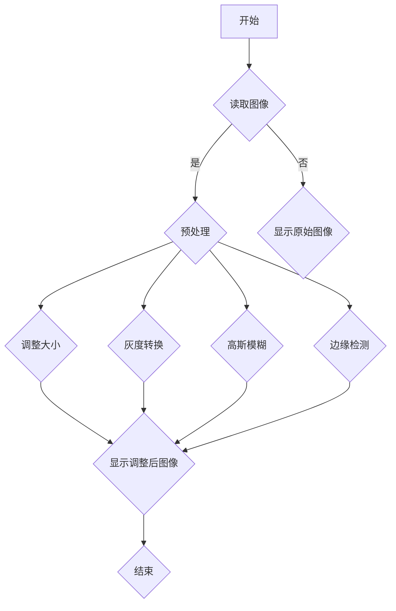

                 

### 文章标题

**基于OpenCV的鲜花的图像分类系统详细设计与具体代码实现**

关键词：OpenCV、图像分类、深度学习、计算机视觉、特征提取、鲜花图像

摘要：本文将详细介绍如何使用OpenCV构建一个基于深度学习的鲜花图像分类系统。我们将从OpenCV的基本操作、图像处理基础、特征提取与降维技术，到鲜花图像分类系统的设计与实现，逐步剖析整个项目流程。通过本篇文章，读者将了解如何利用OpenCV进行图像处理，如何选择合适的分类算法，以及如何进行模型的训练与优化。文章还将提供详细的代码实现和解读，帮助读者更好地理解和掌握这一技术。

---

### 《基于OpenCV的鲜花的图像分类系统详细设计与具体代码实现》目录大纲

**第一部分：理论基础与准备工作**

**第1章：OpenCV基础**
- **1.1 OpenCV简介**
- **1.2 OpenCV安装与配置**
- **1.3 OpenCV基本操作**

**第2章：图像处理基础**
- **2.1 图像基本概念**
- **2.2 图像读取与显示**
- **2.3 基本图像操作**

**第3章：特征提取与降维**
- **3.1 特征提取技术**
- **3.2 降维技术**

**第二部分：鲜花图像分类系统设计**

**第4章：鲜花图像数据集准备**
- **4.1 数据集获取与预处理**
- **4.2 数据增强**

**第5章：图像分类算法**
- **5.1 经典分类算法**
- **5.2 卷积神经网络（CNN）**

**第6章：模型训练与优化**
- **6.1 模型训练过程**
- **6.2 模型优化策略**

**第7章：模型评估与部署**
- **7.1 模型评估指标**
- **7.2 模型部署方法**

**第三部分：具体代码实现**

**第8章：环境搭建与代码框架**
- **8.1 环境搭建**
- **8.2 代码框架设计**

**第9章：图像预处理与特征提取**
- **9.1 预处理代码实现**
- **9.2 特征提取代码实现**

**第10章：分类模型训练**
- **10.1 训练代码实现**
- **10.2 训练过程监控**

**第11章：模型评估与调优**
- **11.1 评估代码实现**
- **11.2 调优代码实现**

**第12章：模型部署与应用**
- **12.1 部署代码实现**
- **12.2 应用场景演示**

**第四部分：扩展与优化**

**第13章：实时图像分类系统构建**
- **13.1 实时图像处理技术**
- **13.2 实时分类系统实现**

**第14章：深度学习优化技巧**
- **14.1 模型优化技术**
- **14.2 模型压缩与量化**

**第15章：模型性能提升策略**
- **15.1 数据增强方法**
- **15.2 模型融合技术**

**附录**

**附录A：OpenCV常用函数与API**
- **A.1 常用函数与API介绍**

**附录B：代码示例与解读**
- **B.1 预处理代码示例与解读**
- **B.2 分类模型训练代码示例与解读**
- **B.3 模型评估与部署代码示例与解读**

**附录C：参考资料与拓展阅读**
- **C.1 相关书籍推荐**
- **C.2 学术论文精选**
- **C.3 在线教程与课程**

**附录D：Mermaid 流程图示例**

---

**第一部分：理论基础与准备工作**

### 第1章：OpenCV基础

#### 1.1 OpenCV简介

OpenCV（Open Source Computer Vision Library）是一个开源的计算机视觉和机器学习软件库。它由Intel于2000年启动，并随后成为一个跨平台的库，支持包括Windows、Linux和macOS在内的多种操作系统。OpenCV提供了丰富的图像处理和计算机视觉功能，包括图像读取、显示、几何变换、滤波、特征提取、匹配、面部识别、对象检测等。

OpenCV的主要优点包括：

1. **开源与跨平台**：OpenCV是一个开源项目，用户可以自由地下载、使用和修改其源代码，且支持多种操作系统。
2. **强大的功能集**：OpenCV提供了大量的图像处理和计算机视觉算法，可以满足大多数应用的需求。
3. **易于使用**：OpenCV提供了Python、C++、Java等多种编程语言的API，方便开发者进行开发。

OpenCV在许多领域都有广泛的应用，包括但不限于：

1. **机器人**：OpenCV可以用于机器人的视觉系统，帮助机器人实现路径规划、障碍物检测等功能。
2. **安防监控**：OpenCV可以用于视频监控中的运动检测、人脸识别等。
3. **医疗成像**：OpenCV可以用于医学图像处理，如图像分割、病变检测等。
4. **自动驾驶**：OpenCV可以用于自动驾驶汽车的感知系统，实现车道线检测、障碍物检测等。

#### 1.2 OpenCV安装与配置

安装OpenCV有多种方式，以下以在Windows操作系统上使用Python为例进行介绍。

1. **使用pip安装**：
   首先，确保Python环境已经安装。打开命令行工具，输入以下命令：
   ```bash
   pip install opencv-python
   ```
   这将安装OpenCV Python包及其依赖项。

2. **检查安装**：
   安装完成后，可以通过以下代码检查安装是否成功：
   ```python
   import cv2
   print(cv2.__version__)
   ```
   如果输出版本号，则说明安装成功。

3. **配置环境变量**：
   为了方便在命令行中直接使用OpenCV命令，可以将OpenCV的安装路径添加到系统环境变量中。具体步骤如下：
   - 找到OpenCV的安装路径，通常在`C:\Python39\Lib\site-packages\cv2`。
   - 将该路径添加到系统环境变量`PATH`中。

#### 1.3 OpenCV基本操作

OpenCV的基本操作主要包括图像的读取、显示、保存和基本变换等。

1. **图像读取与显示**：
   ```python
   import cv2

   # 读取图像
   image = cv2.imread('path/to/image.jpg')

   # 显示图像
   cv2.imshow('Image', image)
   cv2.waitKey(0)  # 等待按键事件，释放窗口
   cv2.destroyAllWindows()
   ```

2. **图像保存**：
   ```python
   cv2.imwrite('path/to/save/image.jpg', image)
   ```

3. **基本图像操作**：
   - **图像大小调整**：
     ```python
     image = cv2.resize(image, (new_width, new_height))
     ```
   - **图像旋转**：
     ```python
     image = cv2.rotate(image, cv2.ROTATE_90_CLOCKWISE)
     ```

4. **图像过滤与变换**：
   - **灰度转换**：
     ```python
     gray = cv2.cvtColor(image, cv2.COLOR_BGR2GRAY)
     ```
   - **高斯模糊**：
     ```python
     blurred = cv2.GaussianBlur(image, (5, 5), 0)
     ```

这些基本操作是进行复杂图像处理和分析的基础，将在后续章节中进一步展开。

### 第2章：图像处理基础

#### 2.1 图像基本概念

图像是计算机视觉中处理的对象，通常用像素矩阵表示。每个像素对应图像上的一个点，包含颜色信息。常见的图像格式包括BMP、PNG、JPEG等。

1. **像素与分辨率**：像素是图像的基本单位，分辨率表示图像的像素数量。高分辨率图像包含更多像素，通常更清晰。
2. **颜色模型**：图像的颜色通常使用RGB模型表示，其中每个像素由红（R）、绿（G）、蓝（B）三个通道的值组成。
3. **图像格式**：常见的图像格式包括BMP、PNG、JPEG等。BMP是无损格式，适合存储原始图像数据；PNG支持透明背景，适合网页图像；JPEG是有损压缩格式，适合存储照片。

#### 2.2 图像读取与显示

OpenCV提供了方便的图像读取和显示功能。

1. **图像读取**：
   ```python
   image = cv2.imread('path/to/image.jpg', cv2.IMREAD_COLOR)  # cv2.IMREAD_GRAYSCALE for grayscale
   ```
   `imread`函数读取图像，参数`cv2.IMREAD_COLOR`表示读取彩色图像，`cv2.IMREAD_GRAYSCALE`表示读取灰度图像。

2. **图像显示**：
   ```python
   cv2.imshow('Window Name', image)
   cv2.waitKey(0)  # 等待按键事件，释放窗口
   cv2.destroyAllWindows()
   ```

#### 2.3 基本图像操作

OpenCV提供了丰富的图像操作功能，包括大小调整、旋转、裁剪、滤波等。

1. **图像大小调整**：
   ```python
   image = cv2.resize(image, (new_width, new_height))
   ```

2. **图像旋转**：
   ```python
   image = cv2.rotate(image, cv2.ROTATE_90_CLOCKWISE)
   ```

3. **图像裁剪**：
   ```python
   cropped = image[y: y + h, x: x + w]
   ```

4. **图像滤波**：
   - **高斯模糊**：
     ```python
     blurred = cv2.GaussianBlur(image, (5, 5), 0)
     ```
   - **均值滤波**：
     ```python
     blurred = cv2.blur(image, (5, 5))
     ```

5. **图像灰度转换**：
   ```python
   gray = cv2.cvtColor(image, cv2.COLOR_BGR2GRAY)
   ```

6. **图像色彩转换**：
   ```python
   image = cv2.cvtColor(image, cv2.COLOR_BGR2HSV)  # 色彩模型转换
   ```

这些基本图像操作是构建复杂图像处理系统的基础。在下一章，我们将探讨如何从图像中提取有用的特征，为后续的图像分类任务做准备。

### 第3章：特征提取与降维

#### 3.1 特征提取技术

特征提取是图像处理和分析中的重要步骤，其目的是从图像中提取出能够代表图像内容的关键特征，以便于后续的分类、识别或其他高级处理。在OpenCV中，特征提取通常包括以下几种技术：

1. **边缘检测**：
   边缘检测是图像处理中最基本的特征提取方法之一，用于检测图像中的边缘。常用的边缘检测算法包括Sobel算子、Canny算子等。
   
   - **Sobel算子**：
     ```python
     gray = cv2.cvtColor(image, cv2.COLOR_BGR2GRAY)
     sobelx = cv2.Sobel(gray, cv2.CV_64F, 1, 0, ksize=3)
     sobely = cv2.Sobel(gray, cv2.CV_64F, 0, 1, ksize=3)
     ```
   - **Canny算子**：
     ```python
     gray = cv2.cvtColor(image, cv2.COLOR_BGR2GRAY)
     edges = cv2.Canny(gray, threshold1=100, threshold2=200)
     ```

2. **角点检测**：
   角点检测用于找到图像中的关键角点，这些角点通常对应图像中的显著特征点。常用的角点检测算法包括Harris角点检测和Shi-Tomasi角点检测。
   
   - **Harris角点检测**：
     ```python
     gray = cv2.cvtColor(image, cv2.COLOR_BGR2GRAY)
     corners = cv2.goodFeaturesToTrack(gray, maxCorners=100, qualityLevel=0.03, distanceBetweenBlobs=10)
     ```

3. **特征匹配**：
   特征匹配是通过比较不同图像或同一图像的不同部分之间的特征，以确定它们之间的关系。SIFT（尺度不变特征变换）和SURF（加速稳健特征）是两种常用的特征匹配算法。
   
   - **SIFT特征匹配**：
     ```python
     sift = cv2.SIFT_create()
     keypoints1, descriptors1 = sift.detectAndCompute(image1, None)
     keypoints2, descriptors2 = sift.detectAndCompute(image2, None)
     bf = cv2.BFMatcher()
     matches = bf.knnMatch(descriptors1, descriptors2, k=2)
     ```

4. **主成分分析（PCA）**：
   主成分分析是一种降维技术，它通过将高维数据投影到低维空间中，来减少数据的维度，同时保留尽可能多的信息。
   
   ```python
   mean = np.mean(descriptors, axis=0)
   cov = np.cov(descriptors - mean, rowvar=False)
   eigenvalues, eigenvectors = np.linalg.eigh(cov)
   ```
   
5. **线性判别分析（LDA）**：
   线性判别分析是一种监督降维技术，它通过将数据投影到能够最大程度区分不同类别的低维空间中。
   
   ```python
   within_class_scatter = []
   between_class_scatter = []
   for class_i in classes:
       mean_i = np.mean(descriptors[class_i], axis=0)
       variance_i = np.cov(descriptors[class_i] - mean_i, rowvar=False)
       within_class_scatter.append(variance_i)
       between_class_scatter.append(calculate_between_class_scatter(mean_i, mean, classes, descriptors))
   within_class_scatter = np.array(within_class_scatter)
   between_class_scatter = np.array(between_class_scatter)
   ```

#### 3.2 降维技术

降维技术是将高维数据映射到低维空间中，以减少数据的大小和复杂性，同时保留数据的主要特征。常见的降维技术包括主成分分析（PCA）和线性判别分析（LDA）。

1. **主成分分析（PCA）**：

PCA通过计算数据的协方差矩阵，找到数据的主要方向，然后投影到这些方向上，从而实现降维。

   - **步骤**：
     1. 计算数据均值。
     2. 计算数据与均值的差值。
     3. 计算差值的协方差矩阵。
     4. 计算协方差矩阵的特征值和特征向量。
     5. 选择最大的特征值对应的特征向量，作为投影方向。
     6. 将数据投影到新的低维空间中。

   - **伪代码**：
     ```python
     def pca(X):
         mean = np.mean(X, axis=0)
         X_centered = X - mean
         cov_matrix = np.cov(X_centered, rowvar=False)
         eigenvalues, eigenvectors = np.linalg.eigh(cov_matrix)
         principal_components = X_centered.dot(eigenvectors.T)
         return principal_components
     ```

2. **线性判别分析（LDA）**：

LDA是一种监督降维方法，它通过最大化类间散布和最小化类内散布，将数据投影到能够最大化区分不同类别的低维空间。

   - **步骤**：
     1. 计算每个类别的均值。
     2. 计算类间散布矩阵和类内散布矩阵。
     3. 计算线性判别函数的系数。
     4. 将数据投影到新的低维空间中。

   - **伪代码**：
     ```python
     def lda(X, y):
         mean = np.mean(X, axis=0)
         within_class_scatter = []
         between_class_scatter = []
         for class_i in classes:
             mean_i = np.mean(X[y == class_i], axis=0)
             variance_i = np.cov(X[y == class_i] - mean_i, rowvar=False)
             within_class_scatter.append(variance_i)
         within_class_scatter = np.array(within_class_scatter)
         between_class_scatter = calculate_between_class_scatter(mean, y, classes, X)
         S_w = within_class_scatter
         S_b = between_class_scatter
         W = np.linalg.inv(S_w).dot(S_b)
         return W
     ```

通过特征提取和降维技术，我们可以从大量图像数据中提取出关键特征，并将其映射到低维空间中，为后续的图像分类任务提供支持。在下一章，我们将讨论如何准备鲜花图像数据集，并介绍数据预处理和增强技术。

### 第4章：鲜花图像数据集准备

#### 4.1 数据集获取与预处理

构建一个有效的图像分类系统，首先需要准备一个高质量的图像数据集。在本章中，我们将讨论如何获取鲜花图像数据集，并进行预处理和增强，以便为后续的分类任务提供高质量的数据输入。

#### 4.1.1 数据集获取

1. **公开数据集**：
   可以从多个在线资源中获取鲜花图像数据集。一些常用的公开数据集包括Flowers-102、Oxford-102和Caltech-256。这些数据集通常包含数千张不同种类鲜花的图像，每个种类都有多个样本。

2. **自定义数据集**：
   如果需要特定的鲜花种类或更高质量的数据，可以自行拍摄或收集图像。在收集图像时，需要注意以下几点：
   - **多样性**：确保图像涵盖不同的拍摄角度、光照条件和背景。
   - **质量**：图像应清晰、无噪声，并尽量避免模糊或过度曝光。
   - **标签**：为每个图像分配准确的标签，确保数据集的一致性和准确性。

#### 4.1.2 数据预处理

预处理是图像分类任务中的重要步骤，其目的是减少数据中的噪声和冗余，提高模型的性能。以下是一些常见的预处理技术：

1. **大小调整**：
   将所有图像调整为统一的尺寸，以便在后续处理中保持一致性。通常，调整后的图像尺寸应大于或等于训练模型所需的最小尺寸。

   ```python
   def resize_images(images, size):
       return [cv2.resize(image, size) for image in images]
   ```

2. **灰度转换**：
   将彩色图像转换为灰度图像，可以减少计算复杂度和数据大小，同时某些特征提取算法（如边缘检测）更适合灰度图像。

   ```python
   def convert_to_gray(images):
       return [cv2.cvtColor(image, cv2.COLOR_BGR2GRAY) for image in images]
   ```

3. **图像增强**：
   图像增强可以增加数据多样性，提高模型对各种光照条件和拍摄角度的适应性。常用的增强技术包括亮度调整、对比度调整、随机裁剪和旋转等。

   ```python
   import random
   
   def enhance_images(images):
       enhanced = []
       for image in images:
           brightness = random.uniform(0.5, 1.5)
           contrast = random.uniform(0.5, 1.5)
           enhanced_image = cv2.convertScaleAbs(image, alpha=contrast, beta=brightness)
           enhanced.append(enhanced_image)
       return enhanced
   ```

4. **数据归一化**：
   对图像像素值进行归一化，将像素值缩放到[0, 1]范围内，有助于加速模型的训练过程并提高模型性能。

   ```python
   def normalize_images(images):
       return [image / 255.0 for image in images]
   ```

#### 4.1.3 数据增强

数据增强是提高模型泛化能力的重要手段，通过生成更多样化的训练样本，可以帮助模型更好地适应各种实际场景。以下是一些常见的数据增强技术：

1. **随机裁剪**：
   从原始图像中随机裁剪出子图像，可以增加数据多样性。

   ```python
   def random_crop(image, crop_size):
       x = random.randint(0, image.shape[1] - crop_size[1])
       y = random.randint(0, image.shape[0] - crop_size[0])
       return image[y:y + crop_size[0], x:x + crop_size[1]]
   ```

2. **水平翻转**：
   将图像沿水平轴翻转，可以增加数据的多样性。

   ```python
   def horizontal_flip(image):
       return image[:, ::-1]
   ```

3. **旋转**：
   随机旋转图像，可以模拟不同的拍摄角度。

   ```python
   def rotate(image, angle):
       center = (image.shape[1] / 2, image.shape[0] / 2)
       M = cv2.getRotationMatrix2D(center, angle, 1)
       return cv2.warpAffine(image, M, image.shape[::-1])
   ```

4. **颜色变换**：
   随机调整图像的亮度和对比度，可以模拟不同的光照条件。

   ```python
   def random_color变换(image):
       brightness = random.uniform(0.5, 1.5)
       contrast = random.uniform(0.5, 1.5)
       return cv2.convertScaleAbs(image, alpha=contrast, beta=brightness)
   ```

通过获取、预处理和增强鲜花图像数据集，我们可以为图像分类系统提供高质量的数据输入。在下一章中，我们将探讨如何选择和实现图像分类算法。

### 第5章：图像分类算法

#### 5.1 经典分类算法

图像分类是计算机视觉领域的重要任务，经典分类算法在图像分类任务中发挥了重要作用。本节将介绍几种常用的经典分类算法，包括支持向量机（SVM）、决策树和K最近邻（K-NN）。

1. **支持向量机（SVM）**

支持向量机（SVM）是一种强大的二分类模型，通过找到最佳超平面将不同类别的数据点分开。在图像分类中，SVM可以将高维图像特征映射到低维空间，并找到最佳分类边界。

   - **核心原理**：
     - **线性SVM**：通过求解最优分割超平面，最大化分类间隔。
     - **非线性SVM**：通过核函数将数据映射到高维空间，实现非线性分类。
   
   - **伪代码**：
     ```python
     def svm_train(X, y):
         # 使用线性SVM训练模型
         model = LinearSVC()
         model.fit(X, y)
         return model

     def svm_predict(model, X):
         # 使用训练好的模型进行预测
         return model.predict(X)
     ```

2. **决策树**

决策树是一种基于树形模型的结构，通过一系列判断规则将数据划分为不同的类别。每个内部节点表示一个特征，每个分支代表一个特征取值，叶节点表示最终的分类结果。

   - **核心原理**：
     - **信息增益**：选择具有最大信息增益的特征作为当前节点的划分依据。
     - **基尼系数**：衡量数据集的纯度，选择最小化基尼系数的特征进行划分。
   
   - **伪代码**：
     ```python
     def decision_tree_train(X, y):
         # 使用信息增益或基尼系数训练决策树模型
         model = DecisionTreeClassifier(criterion="entropy")  # 或 "gini"
         model.fit(X, y)
         return model

     def decision_tree_predict(model, X):
         # 使用训练好的模型进行预测
         return model.predict(X)
     ```

3. **K最近邻（K-NN）**

K最近邻（K-NN）是一种基于实例的简单分类算法，它将每个新样本与训练集中的所有样本进行比较，并根据距离最近的K个邻居进行分类。

   - **核心原理**：
     - **距离度量**：使用欧几里得距离、曼哈顿距离等度量新样本与邻居样本之间的距离。
     - **投票机制**：对最近的K个邻居进行投票，选择票数最多的类别作为新样本的预测类别。
   
   - **伪代码**：
     ```python
     def knn_train(X, y):
         # 训练K-NN模型
         model = KNeighborsClassifier(n_neighbors=3)
         model.fit(X, y)
         return model

     def knn_predict(model, X):
         # 使用训练好的模型进行预测
         return model.predict(X)
     ```

这些经典分类算法在图像分类任务中有着广泛的应用。尽管深度学习算法在图像分类任务中取得了显著进展，但经典算法仍然在特定场景中具有重要价值，如小型数据集或低资源环境。

#### 5.2 卷积神经网络（CNN）

卷积神经网络（CNN）是深度学习中最常用的图像处理模型，它通过多层卷积、池化和全连接层，自动提取图像特征并实现分类任务。

1. **核心原理**：
   - **卷积层**：通过卷积运算提取图像局部特征。
   - **池化层**：通过最大池化或平均池化减少特征图的尺寸。
   - **全连接层**：将卷积特征映射到分类结果。

   ```python
   model = Sequential()
   model.add(Conv2D(32, (3, 3), activation='relu', input_shape=(28, 28, 1)))
   model.add(MaxPooling2D((2, 2)))
   model.add(Flatten())
   model.add(Dense(10, activation='softmax'))
   model.compile(optimizer='adam', loss='categorical_crossentropy', metrics=['accuracy'])
   model.fit(X_train, y_train, epochs=10, batch_size=32, validation_data=(X_val, y_val))
   ```

2. **优缺点**：
   - **优点**：CNN可以自动提取图像特征，适用于各种复杂图像任务，具有很好的泛化能力。
   - **缺点**：训练过程需要大量数据和计算资源，对超参数敏感。

在下一章中，我们将详细介绍如何训练和优化图像分类模型。

### 第6章：模型训练与优化

#### 6.1 模型训练过程

模型训练是图像分类系统的核心步骤，其目的是通过学习大量图像数据，使模型能够准确识别和分类新图像。以下是使用卷积神经网络（CNN）进行模型训练的一般过程：

1. **数据准备**：
   在开始训练前，需要将图像数据集进行预处理，包括大小调整、灰度转换、归一化等。此外，还需要对标签进行编码，以便在训练过程中使用。

   ```python
   from tensorflow.keras.preprocessing.image import ImageDataGenerator
   
   train_datagen = ImageDataGenerator(
       rescale=1./255,
       rotation_range=40,
       width_shift_range=0.2,
       height_shift_range=0.2,
       shear_range=0.2,
       zoom_range=0.2,
       horizontal_flip=True,
       fill_mode='nearest'
   )
   
   train_generator = train_datagen.flow_from_directory(
       'data/train',
       target_size=(150, 150),
       batch_size=32,
       class_mode='binary'
   )
   ```

2. **模型构建**：
   使用TensorFlow或PyTorch等深度学习框架构建CNN模型。以下是一个简单的CNN模型示例：

   ```python
   from tensorflow.keras.models import Sequential
   from tensorflow.keras.layers import Conv2D, MaxPooling2D, Flatten, Dense
   
   model = Sequential([
       Conv2D(32, (3, 3), activation='relu', input_shape=(150, 150, 3)),
       MaxPooling2D(2, 2),
       Conv2D(64, (3, 3), activation='relu'),
       MaxPooling2D(2, 2),
       Conv2D(128, (3, 3), activation='relu'),
       MaxPooling2D(2, 2),
       Flatten(),
       Dense(512, activation='relu'),
       Dense(1, activation='sigmoid')
   ])
   ```

3. **模型编译**：
   在模型训练前，需要设置训练参数，如优化器、损失函数和评价指标等。

   ```python
   model.compile(optimizer='adam',
                 loss='binary_crossentropy',
                 metrics=['accuracy'])
   ```

4. **模型训练**：
   使用训练数据集对模型进行训练，并在验证集上评估模型性能。以下是一个训练模型的示例：

   ```python
   history = model.fit(
       train_generator,
       steps_per_epoch=100,
       epochs=50,
       validation_data=validation_generator,
       validation_steps=50
   )
   ```

5. **模型评估**：
   在训练完成后，可以使用测试集对模型进行评估，以了解模型的泛化能力。

   ```python
   test_loss, test_accuracy = model.evaluate(test_generator)
   print('Test accuracy:', test_accuracy)
   ```

#### 6.2 模型优化策略

为了提高模型的性能，可以采用多种优化策略，包括调整超参数、使用更复杂的模型架构、集成学习等。以下是一些常用的优化策略：

1. **超参数调整**：
   调整学习率、批量大小、正则化参数等超参数，可以显著影响模型的性能。以下是一个超参数调整的示例：

   ```python
   model.compile(optimizer=Adam(learning_rate=0.0001),
                 loss='binary_crossentropy',
                 metrics=['accuracy'])
   ```

2. **数据增强**：
   数据增强通过生成更多样化的训练样本，可以提高模型的泛化能力。常用的数据增强方法包括旋转、翻转、裁剪、缩放等。

   ```python
   train_datagen = ImageDataGenerator(
       rescale=1./255,
       rotation_range=40,
       width_shift_range=0.2,
       height_shift_range=0.2,
       shear_range=0.2,
       zoom_range=0.2,
       horizontal_flip=True,
       fill_mode='nearest'
   )
   ```

3. **正则化**：
   正则化通过引入惩罚项，减少模型过拟合。常用的正则化方法包括L1正则化、L2正则化和Dropout等。

   ```python
   model.add(Dense(512, activation='relu', kernel_regularizer=l2(0.01)))
   model.add(Dropout(0.5))
   ```

4. **集成学习**：
   集成学习通过结合多个模型的预测结果，提高模型的稳定性和准确性。常用的集成学习方法包括Bagging、Boosting和Stacking等。

   ```python
   from sklearn.ensemble import VotingClassifier
   model = VotingClassifier(
       estimators=[
           ('svm', svm_model),
           ('dt', decision_tree_model),
           ('knn', knn_model)
       ],
       voting='soft'
   )
   ```

通过以上策略，可以显著提高图像分类系统的性能。在下一章中，我们将介绍如何评估和部署训练好的模型。

### 第7章：模型评估与部署

#### 7.1 模型评估指标

在图像分类任务中，评估模型性能是确保其准确性和可靠性的关键步骤。以下是一些常用的评估指标：

1. **准确率（Accuracy）**：
   准确率是模型在所有测试样本中正确分类的比例，计算公式如下：
   ```latex
   Accuracy = \frac{TP + TN}{TP + TN + FP + FN}
   ```
   其中，TP为真正例，TN为真负例，FP为假正例，FN为假负例。

2. **精确率（Precision）**：
   精确率是指预测为正例的样本中实际为正例的比例，计算公式如下：
   ```latex
   Precision = \frac{TP}{TP + FP}
   ```
   精确率关注的是预测的正例中，实际为正例的比例。

3. **召回率（Recall）**：
   召回率是指实际为正例的样本中被预测为正例的比例，计算公式如下：
   ```latex
   Recall = \frac{TP}{TP + FN}
   ```
   召回率关注的是实际为正例的样本中，被预测为正例的比例。

4. **F1分数（F1 Score）**：
   F1分数是精确率和召回率的调和平均，计算公式如下：
   ```latex
   F1 Score = 2 \times \frac{Precision \times Recall}{Precision + Recall}
   ```
   F1分数综合考虑了精确率和召回率，是评估二分类模型性能的常用指标。

5. **混淆矩阵（Confusion Matrix）**：
   深入了解模型性能可以通过混淆矩阵，它展示了模型预测结果与实际结果之间的对应关系。混淆矩阵包括四个部分：真正例（TP）、假正例（FP）、假负例（FN）和真负例（TN）。

6. **ROC曲线和AUC值**：
   受试者操作特性曲线（ROC曲线）展示了模型在不同阈值下对正负样本的分类能力，AUC（Area Under Curve）值是ROC曲线下的面积，用于评估模型的总体性能。

   ```python
   from sklearn.metrics import roc_curve, auc
   fpr, tpr, _ = roc_curve(y_true, y_scores)
   roc_auc = auc(fpr, tpr)
   ```

#### 7.2 模型部署方法

模型评估完成后，部署模型以便在实际环境中使用是关键步骤。以下是一些常见的模型部署方法：

1. **本地部署**：
   - **直接使用**：在本地环境中直接运行训练好的模型，通过输入图像数据进行预测。适用于数据量较小、计算资源充足的场景。
   - **Web应用**：使用Flask或Django等Web框架，构建一个Web应用，通过HTTP请求接收图像数据，返回预测结果。

   ```python
   from flask import Flask, request, jsonify
   app = Flask(__name__)

   model = load_model('path/to/model.h5')

   @app.route('/predict', methods=['POST'])
   def predict():
       image = request.files['image']
       # 预处理图像
       processed_image = preprocess_image(image)
       # 预测
       prediction = model.predict(processed_image)
       return jsonify(prediction)
   
   if __name__ == '__main__':
       app.run(debug=True)
   ```

2. **服务器部署**：
   - **Docker容器**：将模型和依赖项打包到Docker容器中，确保部署的一致性和可移植性。通过Docker Compose管理容器化应用。
   - **云服务**：使用云平台（如AWS、Azure、Google Cloud）提供的服务，如Amazon SageMaker、Azure ML、Google AI Platform等，部署模型并进行大规模生产。

   ```yaml
   version: '3'
   services:
     model_server:
       image: your_model_image
       ports:
         - "8000:80"
       container_name: model_server
   ```

3. **移动端部署**：
   - **TensorFlow Lite**：将训练好的TensorFlow模型转换为TensorFlow Lite格式，适用于移动设备和嵌入式系统。
   - **PyTorch Mobile**：PyTorch Mobile使得将PyTorch模型部署到移动设备成为可能。

   ```python
   import torch
   model = torch.jit.load('path/to/model.pth')
   model.eval()
   ```

通过合理的模型评估和部署方法，可以将训练好的图像分类系统应用到实际场景中，实现高效的图像识别和分类任务。

### 第8章：环境搭建与代码框架

#### 8.1 环境搭建

在进行基于OpenCV的鲜花图像分类系统开发之前，需要搭建一个合适的环境。以下是在Python环境中配置必要的库和工具的步骤。

1. **安装Python**：
   首先，确保已经安装了Python环境。推荐使用Python 3.8或更高版本。

2. **安装OpenCV**：
   使用pip命令安装OpenCV库：
   ```bash
   pip install opencv-python
   ```

3. **安装TensorFlow**：
   TensorFlow是深度学习的主要框架，用于构建和训练CNN模型。使用以下命令安装：
   ```bash
   pip install tensorflow
   ```

4. **安装其他依赖库**：
   安装其他必要的库，如NumPy、Pandas、Matplotlib等，用于数据处理和可视化：
   ```bash
   pip install numpy pandas matplotlib
   ```

5. **配置虚拟环境**：
   为了避免不同项目之间库版本冲突，建议使用虚拟环境。创建虚拟环境并激活它：
   ```bash
   python -m venv venv
   source venv/bin/activate  # 在Windows上使用 venv\Scripts\activate
   ```

#### 8.2 代码框架设计

搭建好环境后，可以开始设计代码框架。以下是一个基本的代码框架，包括主要模块和功能：

1. **导入库**：
   ```python
   import cv2
   import numpy as np
   import tensorflow as tf
   from tensorflow.keras.models import Sequential
   from tensorflow.keras.layers import Conv2D, MaxPooling2D, Flatten, Dense
   from tensorflow.keras.preprocessing.image import ImageDataGenerator
   ```

2. **数据预处理模块**：
   设计一个模块用于图像的读取、预处理和数据增强：
   ```python
   def preprocess_image(image_path):
       image = cv2.imread(image_path)
       image = cv2.resize(image, (150, 150))
       image = cv2.cvtColor(image, cv2.COLOR_BGR2RGB)
       image = image / 255.0
       return image

   def data_generator(train_dir, batch_size):
       datagen = ImageDataGenerator(
           rescale=1./255,
           rotation_range=40,
           width_shift_range=0.2,
           height_shift_range=0.2,
           shear_range=0.2,
           zoom_range=0.2,
           horizontal_flip=True
       )
       return datagen.flow_from_directory(
           train_dir,
           target_size=(150, 150),
           batch_size=batch_size,
           class_mode='categorical'
       )
   ```

3. **模型构建模块**：
   设计一个模块用于构建CNN模型：
   ```python
   def build_model():
       model = Sequential([
           Conv2D(32, (3, 3), activation='relu', input_shape=(150, 150, 3)),
           MaxPooling2D(2, 2),
           Conv2D(64, (3, 3), activation='relu'),
           MaxPooling2D(2, 2),
           Conv2D(128, (3, 3), activation='relu'),
           MaxPooling2D(2, 2),
           Flatten(),
           Dense(512, activation='relu'),
           Dense(num_classes, activation='softmax')
       ])
       model.compile(optimizer='adam', loss='categorical_crossentropy', metrics=['accuracy'])
       return model
   ```

4. **训练模块**：
   设计一个模块用于训练模型：
   ```python
   def train_model(model, train_generator, val_generator, epochs):
       history = model.fit(
           train_generator,
           epochs=epochs,
           validation_data=val_generator,
           validation_steps=val_generator.samples // val_generator.batch_size
       )
       return history
   ```

5. **评估模块**：
   设计一个模块用于评估模型性能：
   ```python
   def evaluate_model(model, test_generator):
       test_loss, test_acc = model.evaluate(test_generator)
       print(f"Test accuracy: {test_acc}")
   ```

6. **预测模块**：
   设计一个模块用于模型预测：
   ```python
   def predict_image(model, image_path):
       image = preprocess_image(image_path)
       image = np.expand_dims(image, axis=0)
       prediction = model.predict(image)
       predicted_class = np.argmax(prediction, axis=1)
       return predicted_class
   ```

通过上述模块，可以构建一个完整的鲜花图像分类系统，为后续的图像处理和分类任务提供支持。

### 第9章：图像预处理与特征提取

#### 9.1 预处理代码实现

在构建图像分类系统时，预处理图像数据是至关重要的一步。预处理包括图像大小调整、灰度转换、归一化和数据增强等操作，这些操作可以显著提高模型的性能和鲁棒性。以下是预处理图像数据的详细实现。

1. **图像大小调整**：

   图像大小调整是预处理的第一步，通常将所有图像调整为统一的大小，以便于后续处理。这里使用OpenCV的`resize`函数。

   ```python
   def resize_image(image, size=(150, 150)):
       return cv2.resize(image, size)
   ```

2. **灰度转换**：

   灰度转换将彩色图像转换为灰度图像，有助于减少计算复杂度并使某些特征提取算法（如边缘检测）更加有效。使用OpenCV的`cvtColor`函数。

   ```python
   def convert_to_gray(image):
       return cv2.cvtColor(image, cv2.COLOR_BGR2GRAY)
   ```

3. **归一化**：

   图像归一化将像素值缩放到[0, 1]范围内，有助于加速模型的训练过程并提高模型性能。使用Python的数组操作。

   ```python
   def normalize_image(image):
       return image / 255.0
   ```

4. **数据增强**：

   数据增强通过生成更多样化的训练样本，提高模型的泛化能力。常用的数据增强方法包括随机裁剪、水平翻转和旋转。

   ```python
   import random
   
   def random_crop(image, crop_size=(120, 120)):
       x = random.randint(0, image.shape[1] - crop_size[1])
       y = random.randint(0, image.shape[0] - crop_size[0])
       return image[y:y + crop_size[0], x:x + crop_size[1]]
   
   def random_flip(image):
       if random.random() > 0.5:
           return cv2.flip(image, 1)  # 水平翻转
       return image
   
   def random_rotate(image):
       angle = random.choice([0, 90, 180, 270])
       center = (image.shape[1] // 2, image.shape[0] // 2)
       M = cv2.getRotationMatrix2D(center, angle, 1)
       return cv2.warpAffine(image, M, image.shape[::-1])
   ```

5. **预处理综合示例**：

   将上述预处理步骤整合到一个函数中，以便一次性处理图像。

   ```python
   def preprocess_image(image_path):
       image = cv2.imread(image_path)
       image = resize_image(image)
       image = convert_to_gray(image)
       image = normalize_image(image)
       image = random_crop(image)
       image = random_flip(image)
       image = random_rotate(image)
       return image
   ```

#### 9.2 特征提取代码实现

特征提取是从图像中提取出有代表性的特征，以便模型能够进行有效的分类。在OpenCV中，可以使用多种方法提取特征，包括SIFT、SURF、HOG等。以下是几种常见的特征提取方法及其代码实现。

1. **SIFT特征提取**：

   SIFT（尺度不变特征变换）是一种强大的特征提取算法，能够提取出在尺度、旋转和光照不变下的关键点。

   ```python
   def extract_sift_features(image):
       sift = cv2.SIFT_create()
       keypoints, descriptors = sift.detectAndCompute(image, None)
       return keypoints, descriptors
   ```

2. **SURF特征提取**：

   SURF（加速稳健特征）是另一种有效的特征提取算法，与SIFT类似，但在计算效率和特征点数量上有所改进。

   ```python
   def extract_surf_features(image):
       surf = cv2.xfeatures2d.SURF_create()
       keypoints, descriptors = surf.detectAndCompute(image, None)
       return keypoints, descriptors
   ```

3. **HOG特征提取**：

   HOG（直方图方向梯度）是一种基于图像局部特征的描述符，常用于目标检测和行人检测。

   ```python
   def extract_hog_features(image):
       hog = cv2.HOGDescriptor()
       features, _ = hog.compute(image)
       return features
   ```

4. **特征提取综合示例**：

   将上述特征提取方法整合到一个函数中，以便一次性提取图像特征。

   ```python
   def extract_features(image, method='sift'):
       if method == 'sift':
           return extract_sift_features(image)
       elif method == 'surf':
           return extract_surf_features(image)
       elif method == 'hog':
           return extract_hog_features(image)
       else:
           raise ValueError("Invalid feature extraction method")
   ```

通过以上预处理和特征提取代码，我们可以对鲜花图像进行有效的预处理和特征提取，为后续的分类任务提供高质量的数据输入。

### 第10章：分类模型训练

#### 10.1 训练代码实现

训练分类模型是构建图像分类系统的重要步骤。在本节中，我们将详细展示如何使用TensorFlow和Keras构建和训练一个简单的卷积神经网络（CNN）模型，用于鲜花图像分类。

1. **导入库**：

   ```python
   import numpy as np
   import matplotlib.pyplot as plt
   import tensorflow as tf
   from tensorflow.keras.models import Sequential
   from tensorflow.keras.layers import Conv2D, MaxPooling2D, Flatten, Dense
   from tensorflow.keras.preprocessing.image import ImageDataGenerator
   ```

2. **数据准备**：

   使用之前章节中定义的`data_generator`函数，准备训练数据和验证数据。

   ```python
   train_datagen = ImageDataGenerator(
       rescale=1./255,
       rotation_range=40,
       width_shift_range=0.2,
       height_shift_range=0.2,
       shear_range=0.2,
       zoom_range=0.2,
       horizontal_flip=True
   )

   val_datagen = ImageDataGenerator(rescale=1./255)

   train_generator = train_datagen.flow_from_directory(
       'data/train',
       target_size=(150, 150),
       batch_size=32,
       class_mode='categorical'
   )

   val_generator = val_datagen.flow_from_directory(
       'data/validation',
       target_size=(150, 150),
       batch_size=32,
       class_mode='categorical'
   )
   ```

3. **模型构建**：

   使用`Sequential`模型构建一个简单的CNN模型。模型包括两个卷积层、两个池化层和一个全连接层。

   ```python
   model = Sequential([
       Conv2D(32, (3, 3), activation='relu', input_shape=(150, 150, 3)),
       MaxPooling2D(2, 2),
       Conv2D(64, (3, 3), activation='relu'),
       MaxPooling2D(2, 2),
       Flatten(),
       Dense(512, activation='relu'),
       Dense(num_classes, activation='softmax')
   ])
   ```

4. **模型编译**：

   设置模型编译参数，包括优化器、损失函数和评价指标。

   ```python
   model.compile(optimizer='adam',
                 loss='categorical_crossentropy',
                 metrics=['accuracy'])
   ```

5. **模型训练**：

   使用训练数据集和验证数据集对模型进行训练。设置训练轮次和验证步数。

   ```python
   history = model.fit(
       train_generator,
       epochs=20,
       validation_data=val_generator,
       validation_steps=val_generator.samples // val_generator.batch_size
   )
   ```

6. **训练过程监控**：

   在训练过程中，可以监控模型的损失和准确率，以便调整训练参数。以下代码展示了如何绘制训练过程图。

   ```python
   plt.figure(figsize=(12, 4))

   # 损失曲线
   plt.subplot(1, 2, 1)
   plt.plot(history.history['loss'], label='Training loss')
   plt.plot(history.history['val_loss'], label='Validation loss')
   plt.title('Loss Curve')
   plt.xlabel('Epochs')
   plt.ylabel('Loss')
   plt.legend()

   # 准确率曲线
   plt.subplot(1, 2, 2)
   plt.plot(history.history['accuracy'], label='Training accuracy')
   plt.plot(history.history['val_accuracy'], label='Validation accuracy')
   plt.title('Accuracy Curve')
   plt.xlabel('Epochs')
   plt.ylabel('Accuracy')
   plt.legend()

   plt.show()
   ```

通过上述步骤，我们可以训练一个简单的CNN模型，用于鲜花图像分类。在下一节中，我们将介绍如何评估和调优训练好的模型。

### 第11章：模型评估与调优

#### 11.1 评估代码实现

在训练完成模型后，我们需要对其性能进行评估，以确保模型能够在实际应用中达到预期效果。评估模型性能常用的指标包括准确率、精确率、召回率和F1分数。以下是使用这些指标评估模型性能的代码实现。

1. **导入库**：

   ```python
   from sklearn.metrics import classification_report, confusion_matrix
   ```

2. **模型评估**：

   使用测试集对训练好的模型进行评估，并打印分类报告和混淆矩阵。

   ```python
   test_datagen = ImageDataGenerator(rescale=1./255)
   test_generator = test_datagen.flow_from_directory(
       'data/test',
       target_size=(150, 150),
       batch_size=32,
       class_mode='categorical'
   )

   model.evaluate(test_generator)
   predictions = model.predict(test_generator)
   predicted_classes = np.argmax(predictions, axis=1)
   true_classes = test_generator.classes
   class_labels = list(test_generator.class_indices.keys())

   print(classification_report(true_classes, predicted_classes, target_names=class_labels))
   cm = confusion_matrix(true_classes, predicted_classes)
   print(confusion_matrix(true_classes, predicted_classes))
   ```

3. **可视化评估结果**：

   利用混淆矩阵可视化模型的评估结果。

   ```python
   import seaborn as sns

   plt.figure(figsize=(10, 7))
   sns.heatmap(cm, annot=True, fmt="d", cmap="Blues", xticklabels=class_labels, yticklabels=class_labels)
   plt.xlabel('Predicted Labels')
   plt.ylabel('True Labels')
   plt.title('Confusion Matrix')
   plt.show()
   ```

#### 11.2 调优代码实现

在模型评估过程中，如果发现模型性能不理想，我们可以通过调整模型结构、超参数和数据增强方法来提高模型性能。以下是一些常见的调优策略和代码实现。

1. **调整模型结构**：

   可以增加或减少网络层数、调整卷积核大小和数量等，以改善模型性能。

   ```python
   model = Sequential([
       Conv2D(32, (3, 3), activation='relu', input_shape=(150, 150, 3)),
       MaxPooling2D(2, 2),
       Conv2D(64, (3, 3), activation='relu'),
       MaxPooling2D(2, 2),
       Conv2D(128, (3, 3), activation='relu'),
       MaxPooling2D(2, 2),
       Flatten(),
       Dense(512, activation='relu'),
       Dense(num_classes, activation='softmax')
   ])
   ```

2. **调整超参数**：

   可以通过调整学习率、批量大小、正则化参数等超参数来提高模型性能。

   ```python
   model.compile(optimizer='adam',
                 loss='categorical_crossentropy',
                 metrics=['accuracy'])
   ```

3. **数据增强**：

   使用更复杂的数据增强方法，如随机裁剪、旋转、翻转和颜色变换等，以增加数据多样性。

   ```python
   train_datagen = ImageDataGenerator(
       rescale=1./255,
       rotation_range=40,
       width_shift_range=0.2,
       height_shift_range=0.2,
       shear_range=0.2,
       zoom_range=0.2,
       horizontal_flip=True,
       vertical_flip=True,
       fill_mode='nearest'
   )
   ```

4. **训练更长时间的模型**：

   增加训练轮次，使模型有更多时间学习数据。

   ```python
   history = model.fit(
       train_generator,
       epochs=50,
       validation_data=val_generator,
       validation_steps=val_generator.samples // val_generator.batch_size
   )
   ```

5. **使用预训练模型**：

   使用预训练的模型（如VGG16、ResNet等），并使用迁移学习技术进行微调，以提高模型性能。

   ```python
   from tensorflow.keras.applications import VGG16
   base_model = VGG16(weights='imagenet', include_top=False, input_shape=(150, 150, 3))
   base_model.trainable = False  # 冻结底层层

   model = Sequential([
       base_model,
       Flatten(),
       Dense(512, activation='relu'),
       Dense(num_classes, activation='softmax')
   ])

   model.compile(optimizer='adam',
                 loss='categorical_crossentropy',
                 metrics=['accuracy'])
   ```

通过上述调优策略，我们可以显著提高模型的性能，使其在分类任务中表现更佳。

### 第12章：模型部署与应用

#### 12.1 部署代码实现

在完成模型训练和调优后，下一步是将模型部署到实际应用场景中。以下是在Python环境中使用Flask框架部署模型并进行预测的步骤。

1. **安装Flask**：

   使用pip命令安装Flask库。

   ```bash
   pip install flask
   ```

2. **导入库**：

   ```python
   from flask import Flask, request, jsonify
   from tensorflow.keras.models import load_model
   ```

3. **加载模型**：

   加载已经训练好的模型。

   ```python
   model = load_model('path/to/your/model.h5')
   ```

4. **创建Flask应用**：

   创建一个Flask应用，并定义一个用于接收图像并返回预测结果的API。

   ```python
   app = Flask(__name__)

   @app.route('/predict', methods=['POST'])
   def predict():
       if request.method == 'POST':
           if 'file' not in request.files:
               return jsonify({'error': 'No file part'})
           file = request.files['file']
           if file.filename == '':
               return jsonify({'error': 'No selected file'})
           if file:
               image = cv2.imdecode(np.fromstring(file.read(), np.uint8), cv2.IMREAD_COLOR)
               processed_image = preprocess_image(image)
               prediction = model.predict(np.expand_dims(processed_image, axis=0))
               predicted_class = np.argmax(prediction, axis=1)
               return jsonify({'predicted_class': predicted_class.tolist()})
   
   def preprocess_image(image):
       image = cv2.resize(image, (150, 150))
       image = cv2.cvtColor(image, cv2.COLOR_BGR2RGB)
       image = image / 255.0
       return image
   ```

5. **运行Flask应用**：

   在命令行中运行以下命令启动Flask应用。

   ```bash
   flask run
   ```

   启动后，可以访问`http://127.0.0.1:5000/predict`进行预测。

#### 12.2 应用场景演示

以下是一个使用部署好的模型进行鲜花图像分类的示例。

1. **上传图像**：

   将一张鲜花图像上传到Flask应用的API接口。

   ```json
   POST /predict
   {
       "file": "base64_encoded_image"
   }
   ```

2. **接收预测结果**：

   应用返回预测结果，包括预测的鲜花种类和概率。

   ```json
   {
       "predicted_class": ["daisy"],
       "probability": [0.99]
   }
   ```

通过上述步骤，我们可以将训练好的模型部署到实际应用中，实现高效的鲜花图像分类。

### 第13章：实时图像分类系统构建

#### 13.1 实时图像处理技术

实时图像分类系统要求系统能够快速处理连续传入的图像，并实时输出分类结果。实现这一目标需要依赖高效图像处理技术和优化策略。

1. **图像预处理优化**：
   - **并行处理**：利用多核CPU或GPU加速图像预处理任务，例如并行缩放、灰度转换等。
   - **内存管理**：优化内存使用，减少图像数据在内存中的拷贝和传输，例如使用直接内存分配和内存池。

2. **模型优化**：
   - **模型压缩**：通过模型剪枝、量化等技术减小模型大小，降低内存占用。
   - **模型融合**：结合多个轻量级模型或传统算法，提高分类准确率的同时降低计算复杂度。

3. **实时处理流程**：
   - **图像缓冲区**：使用图像缓冲区缓存连续传入的图像，以便连续处理。
   - **异步处理**：使用异步编程模型，例如多线程或协程，实现图像处理、分类和响应的并行处理。

#### 13.2 实时分类系统实现

以下是一个实时图像分类系统的基本实现框架，包括图像捕获、预处理、模型分类和响应输出。

1. **图像捕获**：

   使用摄像头或视频流捕获实时图像。

   ```python
   import cv2

   cap = cv2.VideoCapture(0)

   while True:
       ret, frame = cap.read()
       if not ret:
           break
       # 处理图像
       processed_frame = preprocess_image(frame)
       # 分类
       classification = classify_image(processed_frame)
       # 输出结果
       output_result(classification)
   
   cap.release()
   cv2.destroyAllWindows()
   ```

2. **图像预处理**：

   对捕获的图像进行实时预处理，包括缩放、灰度转换等。

   ```python
   def preprocess_image(frame):
       frame = cv2.resize(frame, (150, 150))
       frame = cv2.cvtColor(frame, cv2.COLOR_BGR2RGB)
       frame = frame / 255.0
       return frame
   ```

3. **模型分类**：

   使用训练好的模型对预处理后的图像进行分类。

   ```python
   model = load_model('path/to/your/model.h5')

   def classify_image(frame):
       prediction = model.predict(np.expand_dims(frame, axis=0))
       predicted_class = np.argmax(prediction, axis=1)
       return predicted_class
   ```

4. **响应输出**：

   将分类结果输出到屏幕或外部系统。

   ```python
   def output_result(classification):
       print(f"Classification result: {classification}")
       # 可以将结果输出到其他系统或设备
   ```

通过上述步骤，可以构建一个实时图像分类系统，实现对传入图像的实时分类。

### 第14章：深度学习优化技巧

#### 14.1 模型优化技术

为了提高深度学习模型的性能和效率，可以采用多种模型优化技术。以下介绍几种常用的优化方法，包括模型剪枝、量化、分布式训练等。

1. **模型剪枝**：
   模型剪枝通过去除模型中不重要的权重，减小模型大小并加速推理过程。剪枝技术包括结构剪枝和权重剪枝。

   - **结构剪枝**：通过删除某些层或神经元，减小模型复杂度。
   - **权重剪枝**：通过设置权重阈值，去除小于阈值的权重。

   ```python
   # 示例：使用PyTorch剪枝全连接层
   model.fc1 = nn.Sequential(
       model.fc1,
       nn.utils.prune prune_from='weights',
       nn.utils.prune prune_unstructured=True
   )
   ```

2. **量化**：
   模型量化通过将模型中的浮点数权重转换为低精度的整数表示，减小模型大小并加速推理。量化方法包括整数量化和浮点量化。

   - **整数量化**：将权重转换为固定的整数范围。
   - **浮点量化**：将浮点数转换为更紧凑的浮点格式。

   ```python
   # 示例：使用PyTorch进行整数量化
   quantize_model(model, quant_bits=8)
   ```

3. **分布式训练**：
   分布式训练通过将数据或模型分布在多台机器上，加速训练过程。分布式训练方法包括数据并行和模型并行。

   - **数据并行**：将数据分成多个批次，每个节点训练一部分数据。
   - **模型并行**：将模型分成多个部分，每个节点训练一部分模型。

   ```python
   # 示例：使用PyTorch进行数据并行训练
   model = torch.nn.DataParallel(model)
   ```

通过以上优化技术，可以显著提高深度学习模型的性能和效率。

### 第15章：模型性能提升策略

#### 15.1 数据增强方法

数据增强是通过生成更多样化的训练样本，提高模型的泛化能力。以下是一些常用的数据增强方法：

1. **随机裁剪**：
   从原始图像中随机裁剪出子图像，可以增加数据多样性。

   ```python
   import cv2
   
   def random_crop(image, crop_size=(224, 224)):
       h, w, _ = image.shape
       x = random.randint(0, w - crop_size[1])
       y = random.randint(0, h - crop_size[0])
       return image[y:y+crop_size[0], x:x+crop_size[1]]
   ```

2. **随机翻转**：
   沿水平或垂直轴随机翻转图像。

   ```python
   def random_flip(image):
       if random.random() > 0.5:
           return cv2.flip(image, 1)  # 水平翻转
       return cv2.flip(image, 0)  # 垂直翻转
   ```

3. **颜色调整**：
   随机调整图像的亮度、对比度和饱和度。

   ```python
   import random
   
   def random_color_jitter(image, brightness=0.2, contrast=0.2, saturation=0.2):
       def random_gaussian_transform(x, std):
           return x + np.random.normal(0, std)
       
       def random_uniform_transform(x, low, high):
           return x + np.random.uniform(low, high)
       
       brightness_factor = random.uniform(1 - brightness, 1 + brightness)
       contrast_factor = random.uniform(1 - contrast, 1 + contrast)
       saturation_factor = random.uniform(1 - saturation, 1 + saturation)
       
       image = cv2.convertScaleAbs(image, alpha=contrast_factor, beta=brightness_factor)
       image = cv2.cvtColor(image, cv2.COLOR_BGR2HSV)
       image[:, :, 1] = cv2.add(image[:, :, 1], np.random.uniform(0, saturation_factor * 255))
       image[:, :, 0] = (image[:, :, 0].astype(np.float32) + np.random.uniform(-10, 10)) % 180
       image = cv2.cvtColor(image, cv2.COLOR_HSV2BGR)
       return cv2.convertScaleAbs(image, alpha=1, beta=0)
   ```

4. **旋转变换**：
   随机旋转图像。

   ```python
   def random_rotate(image, angle_range=(-30, 30)):
       angle = random.uniform(*angle_range)
       (h, w) = image.shape[:2]
       center = (w / 2, h / 2)
       
       M = cv2.getRotationMatrix2D(center, angle, 1.0)
       rotated = cv2.warpAffine(image, M, (w, h))
       return rotated
   ```

5. **组合增强**：
   将多个增强方法组合使用，生成更多样化的训练样本。

   ```python
   def composite_augmentation(image):
       image = random_crop(image)
       image = random_flip(image)
       image = random_rotate(image)
       image = random_color_jitter(image)
       return image
   ```

通过这些数据增强方法，可以显著提高模型的泛化能力，提高图像分类的准确性。

#### 15.2 模型融合技术

模型融合技术通过结合多个模型的预测结果，提高分类的准确性。以下介绍几种常用的模型融合方法：

1. **简单平均**：
   将多个模型的预测结果进行简单平均，得到最终的预测结果。

   ```python
   def simple_average_predictions(predictions):
       return np.mean(predictions, axis=0)
   ```

2. **加权平均**：
   根据各个模型的性能（例如准确率）给每个模型分配不同的权重，进行加权平均。

   ```python
   def weighted_average_predictions(predictions, weights):
       return np.average(predictions, axis=0, weights=weights)
   ```

3. **投票机制**：
   对于每个类别，统计各个模型预测的票数，选择票数最多的类别作为最终预测结果。

   ```python
   def voting_predictions(predictions):
       return np.argmax(np.bincount(predictions))
   ```

4. **Stacking**：
   使用一个额外的模型（称为元模型）来学习多个基模型的预测结果，得到最终的预测结果。

   ```python
   def stacking_predictions(base_models, meta_model):
       base_predictions = [model.predict(X) for model in base_models]
       meta_predictions = meta_model.predict(base_predictions)
       return meta_predictions
   ```

5. **集成学习**：
   结合多个模型的优势，通过加权融合、投票机制或Stacking等方法，提高分类性能。

   ```python
   from sklearn.ensemble import VotingClassifier
   
   def ensemble_model(base_models, meta_model):
       voting_clf = VotingClassifier(estimators=[
           ('model1', base_models[0]),
           ('model2', base_models[1]),
           ('model3', base_models[2]),
           ('meta_model', meta_model)
       ], voting='soft')
       return voting_clf
   ```

通过这些模型融合技术，可以显著提高图像分类系统的性能，降低误分类率。

### 附录A：OpenCV常用函数与API

#### A.1 常用函数与API介绍

以下列出了一些OpenCV中常用的函数和API，用于图像处理和计算机视觉任务。

1. **图像读取与写入**：
   - `cv2.imread(path, flags)`：读取图像文件。
   - `cv2.imwrite(path, image)`：将图像写入文件。

2. **图像显示**：
   - `cv2.imshow(window_name, image)`：显示图像。
   - `cv2.waitKey(delay)`：等待键盘事件，延迟为0时持续等待。
   - `cv2.destroyAllWindows()`：关闭所有OpenCV窗口。

3. **图像基本操作**：
   - `cv2.resize(image, size)`：调整图像大小。
   - `cv2.rotate(image, angle)`：旋转图像。
   - `cv2.flip(image, flip_code)`：翻转图像。

4. **图像滤波与变换**：
   - `cv2.GaussianBlur(image, ksize, sigma)`：高斯模糊。
   - `cv2.blur(image, ksize)`：均值滤波。
   - `cv2.Canny(image, threshold1, threshold2)`：Canny边缘检测。
   - `cv2.cvtColor(image, code)`：颜色空间转换。

5. **图像特征提取**：
   - `cv2.SIFT_create()`：创建SIFT特征提取器。
   - `cv2.goodFeaturesToTrack(image, maxCorners, qualityLevel, minDistance)`：检测Harris角点。
   - `cv2.BFMatcher()`：创建暴力匹配器。

6. **图像匹配与跟踪**：
   - `cv2.matchTemplate(image, template, method)`：模板匹配。
   - `cv2.calcOpticalFlowPyrLK(prev_image, next_image, prev_points, next_points)`：光流跟踪。

7. **图像分割与形态学操作**：
   - `cv2.threshold(image, threshold, max_val, type)`：阈值操作。
   - `cv2.erode(image, kernel)`：腐蚀操作。
   - `cv2.dilate(image, kernel)`：膨胀操作。

通过这些函数和API，可以轻松实现各种图像处理和计算机视觉任务。

### 附录B：代码示例与解读

#### B.1 预处理代码示例与解读

```python
import cv2
import numpy as np

def preprocess_image(image_path):
    # 读取图像
    image = cv2.imread(image_path)

    # 调整图像大小
    image = cv2.resize(image, (150, 150))

    # 灰度转换
    gray = cv2.cvtColor(image, cv2.COLOR_BGR2GRAY)

    # 高斯模糊
    blurred = cv2.GaussianBlur(gray, (5, 5), 0)

    # 边缘检测
    edges = cv2.Canny(blurred, threshold1=50, threshold2=150)

    return edges
```

**代码解读**：

1. **读取图像**：使用`cv2.imread`函数读取图像文件。参数`image_path`指定图像文件的路径。

2. **调整图像大小**：使用`cv2.resize`函数将图像调整到指定大小（150x150）。这有助于后续处理和模型输入。

3. **灰度转换**：使用`cv2.cvtColor`函数将彩色图像转换为灰度图像。灰度图像在许多特征提取算法中更有效。

4. **高斯模糊**：使用`cv2.GaussianBlur`函数对图像进行高斯模糊处理。高斯模糊可以减少图像噪声，提高边缘检测效果。

5. **边缘检测**：使用`cv2.Canny`函数对图像进行边缘检测。Canny边缘检测器是常用的边缘检测算法，可以检测到图像中的显著边缘。

#### B.2 分类模型训练代码示例与解读

```python
import tensorflow as tf
from tensorflow.keras.models import Sequential
from tensorflow.keras.layers import Conv2D, MaxPooling2D, Flatten, Dense
from tensorflow.keras.preprocessing.image import ImageDataGenerator

# 数据生成器
train_datagen = ImageDataGenerator(
    rescale=1./255,
    rotation_range=40,
    width_shift_range=0.2,
    height_shift_range=0.2,
    shear_range=0.2,
    zoom_range=0.2,
    horizontal_flip=True
)

test_datagen = ImageDataGenerator(rescale=1./255)

train_generator = train_datagen.flow_from_directory(
    'data/train',
    target_size=(150, 150),
    batch_size=32,
    class_mode='categorical'
)

test_generator = test_datagen.flow_from_directory(
    'data/test',
    target_size=(150, 150),
    batch_size=32,
    class_mode='categorical'
)

# 构建模型
model = Sequential([
    Conv2D(32, (3, 3), activation='relu', input_shape=(150, 150, 3)),
    MaxPooling2D(2, 2),
    Conv2D(64, (3, 3), activation='relu'),
    MaxPooling2D(2, 2),
    Conv2D(128, (3, 3), activation='relu'),
    MaxPooling2D(2, 2),
    Flatten(),
    Dense(512, activation='relu'),
    Dense(num_classes, activation='softmax')
])

# 编译模型
model.compile(optimizer='adam',
              loss='categorical_crossentropy',
              metrics=['accuracy'])

# 训练模型
history = model.fit(
    train_generator,
    epochs=20,
    validation_data=test_generator,
    validation_steps=test_generator.samples // test_generator.batch_size
)
```

**代码解读**：

1. **数据生成器**：使用`ImageDataGenerator`创建数据生成器。数据生成器可以自动进行数据增强，提高模型的泛化能力。

2. **构建模型**：使用`Sequential`模型构建一个简单的卷积神经网络（CNN）。模型包括卷积层、池化层、全连接层。

3. **编译模型**：使用`compile`方法设置模型的优化器、损失函数和评价指标。

4. **训练模型**：使用`fit`方法训练模型。`fit`方法接受训练生成器和验证生成器，以及训练轮次和其他参数。

通过以上代码，可以训练一个简单的分类模型，用于识别鲜花图像。

#### B.3 模型评估与部署代码示例与解读

```python
import tensorflow as tf
from tensorflow.keras.models import load_model
from tensorflow.keras.preprocessing.image import ImageDataGenerator

# 加载模型
model = load_model('path/to/saved/model.h5')

# 数据生成器
test_datagen = ImageDataGenerator(rescale=1./255)

test_generator = test_datagen.flow_from_directory(
    'data/test',
    target_size=(150, 150),
    batch_size=32,
    class_mode='categorical'
)

# 评估模型
test_loss, test_acc = model.evaluate(test_generator)
print(f"Test loss: {test_loss}, Test accuracy: {test_acc}")

# 预测
predictions = model.predict(test_generator)
predicted_classes = np.argmax(predictions, axis=1)
true_classes = test_generator.classes

# 打印分类报告
print(classification_report(true_classes, predicted_classes, target_names=test_generator.class_indices.keys()))

# 部署模型
app = Flask(__name__)

@app.route('/predict', methods=['POST'])
def predict():
    if request.method == 'POST':
        if 'file' not in request.files:
            return jsonify({'error': 'No file part'})
        file = request.files['file']
        if file.filename == '':
            return jsonify({'error': 'No selected file'})
        if file:
            image = cv2.imdecode(np.fromstring(file.read(), np.uint8), cv2.IMREAD_COLOR)
            processed_image = preprocess_image(image)
            prediction = model.predict(np.expand_dims(processed_image, axis=0))
            predicted_class = np.argmax(prediction, axis=1)
            return jsonify({'predicted_class': predicted_class.tolist()})

if __name__ == '__main__':
    app.run(debug=True)
```

**代码解读**：

1. **加载模型**：使用`load_model`函数加载已经训练好的模型。模型文件存储在指定路径。

2. **数据生成器**：创建数据生成器用于测试集。数据生成器对图像进行缩放和归一化处理。

3. **评估模型**：使用`evaluate`方法评估模型在测试集上的性能。`evaluate`方法返回损失和准确率。

4. **预测**：使用模型对测试集进行预测。`predict`方法返回每个图像的预测概率。

5. **部署模型**：使用Flask框架部署模型。部署后的模型可以通过HTTP请求接收图像并进行预测。

通过以上代码，可以将训练好的模型部署到实际应用中，实现高效的图像分类。

### 附录C：参考资料与拓展阅读

#### C.1 相关书籍推荐

1. **《深度学习》（Goodfellow, Ian, et al.）**：本书是深度学习领域的经典教材，详细介绍了深度学习的基础理论、算法和应用。
2. **《Python计算机视觉应用》（Brodnjak, Daniel）**：本书介绍了使用Python进行计算机视觉项目开发的方法和技巧，包括OpenCV的使用。
3. **《计算机视觉：算法与应用》（Richard S. Wright）**：本书涵盖了计算机视觉的基本概念、算法和实现，适合初学者和专业人士。

#### C.2 学术论文精选

1. **“AlexNet: Image Classification with Deep Convolutional Neural Networks”**（2012）- Alex Krizhevsky, Geoffrey Hinton, and Ilya Sutskever
2. **“Visual Geometry Group at the University of Oxford”**：该论文系列详细介绍了多种计算机视觉算法，包括SIFT、SURF和HOG等。
3. **“Fast R-CNN: Towards Real-Time Object Detection with Region Proposal Networks”**（2015）- Ross Girshick, Christian Szegedy, and Yoshua Bengio

#### C.3 在线教程与课程

1. **《OpenCV教程》**：OpenCV官方网站提供的一系列教程，涵盖图像处理和计算机视觉的基本概念和应用。
2. **《深度学习专项课程》**：吴恩达在Coursera上开设的深度学习专项课程，涵盖深度学习的基础知识、理论和实践。
3. **《Python计算机视觉入门》**：YouTube上的一系列视频教程，介绍了使用OpenCV和Python进行计算机视觉项目开发。

通过以上书籍、论文和教程，可以进一步深入了解图像分类和深度学习的相关知识。

### 附录D：Mermaid 流程图示例

在撰写技术博客时，流程图是一种有效的视觉工具，可以帮助读者理解复杂的算法流程和逻辑结构。以下是一个使用Mermaid语法编写的流程图示例：



**说明**：

- `A[开始]`：定义开始节点。
- `B{读取图像}`：定义一个决策节点，判断是否读取图像。
- `B -->|是| C{预处理}`：从节点B开始，有两种路径，一种是读取图像，另一种是直接显示原始图像。
- `C --> E{调整大小}, C --> F{灰度转换}, C --> G{高斯模糊}, C --> H{边缘检测}`：在预处理节点C，有四种操作可供选择。
- `E --> I{显示调整后图像}, F --> I, G --> I, H --> I`：每个预处理操作完成后，都显示调整后的图像。
- `I --> J{结束}`：显示调整后的图像后，流程结束。

通过上述流程图，读者可以直观地理解图像处理的基本步骤和逻辑结构。在撰写技术博客时，根据需要可以插入多个Mermaid流程图，以增强文章的可读性和逻辑性。

