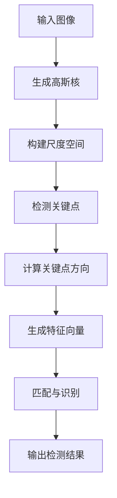
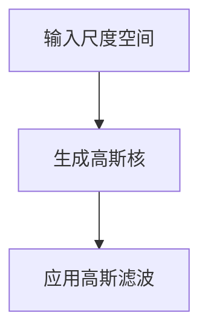
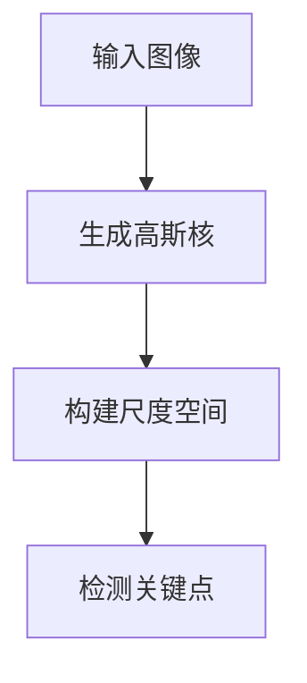
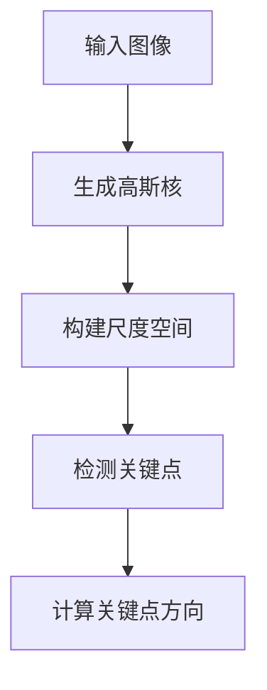
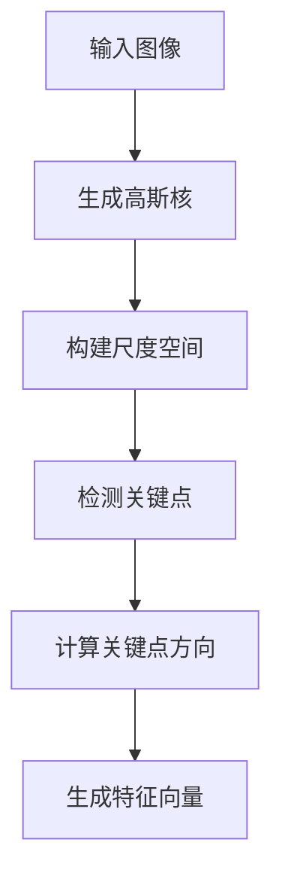
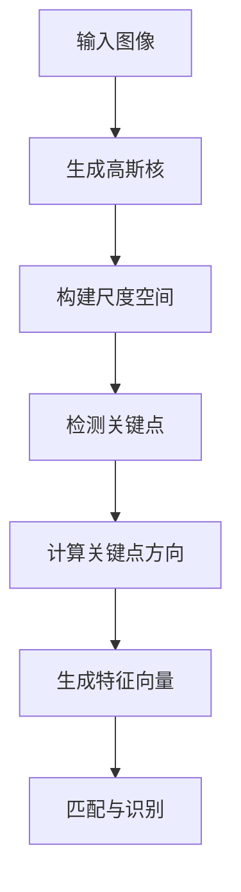
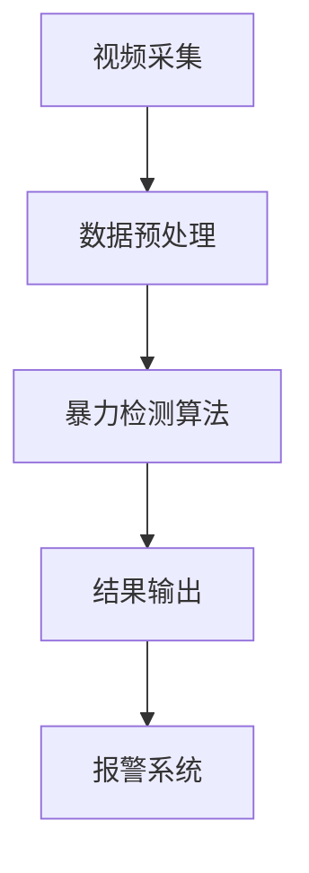

                 

# 第一部分：引言

## 1.1 书籍背景与目的

本文旨在深入探讨基于SIFT（尺度不变特征变换）算法的防校园暴力检测技术，通过理论分析和实践应用，为解决校园暴力问题提供新的技术思路。近年来，校园暴力事件频发，严重威胁到青少年的身心健康，引起了社会各界的广泛关注。防校园暴力检测系统作为校园安全建设的重要一环，其重要性日益凸显。

### 1.1.1 校园暴力的现状与危害

校园暴力是指在学校教育活动中，学生之间或学生与教师之间发生的，以恶性行为为主要表现形式的暴力事件。根据相关统计数据，我国每年校园暴力事件数量居高不下，涉及的受害人数众多。这些事件不仅对学生的身体健康造成伤害，更严重的是对学生的心理健康产生深远影响，可能导致心理创伤、焦虑、抑郁等心理问题。

#### 现状：

- 校园暴力类型多样化：包括肢体暴力、言语暴力、性暴力等。
- 校园暴力呈现低龄化趋势：小学生、初中生等低年龄段学生也频繁发生暴力行为。
- 校园暴力具有隐蔽性：部分暴力行为发生在校外，难以被及时发现和处理。

#### 危害：

- 身体伤害：暴力行为可能造成学生身体受伤，甚至危及生命。
- 心理创伤：受害者可能产生恐惧、焦虑、抑郁等心理问题，影响正常学习和生活。
- 社交障碍：暴力行为可能导致受害者形成社交障碍，影响其正常的人际交往。
- 教育中断：暴力事件可能导致学生辍学，影响其学业完成。

### 1.1.2 SIFT算法在图像处理中的应用

SIFT（尺度不变特征变换）算法是一种广泛应用于图像处理和计算机视觉领域的特征提取算法。其核心思想是通过关键点的检测和特征向量的提取，实现图像的局部特征描述和匹配。由于SIFT算法具有尺度不变性和旋转不变性等特点，使其在图像处理领域具有广泛的应用。

#### 应用：

- 姿态估计：通过检测图像中的关键点，可以估计人体的姿态和动作。
- 图像识别：利用SIFT算法提取的特征向量，可以实现图像的相似性匹配和分类。
- 视频监控：结合SIFT算法，可以实现实时监控中的目标检测和跟踪。
- 立体视觉：通过多视图中的SIFT特征匹配，可以实现三维场景重建。

### 1.1.3 防校园暴力检测的研究意义

防校园暴力检测系统的研发和实施，对于预防和减少校园暴力事件具有重要意义。通过利用SIFT算法，可以对校园监控视频进行实时分析，检测和识别潜在的暴力行为，从而实现早期预警和干预。

#### 研究意义：

- 早期预警：通过实时监控和分析，可以提前发现潜在的暴力行为，及时采取应对措施。
- 降低风险：通过识别和跟踪暴力行为，可以减少暴力事件的发生，降低学生受伤的风险。
- 提高校园安全：防校园暴力检测系统作为校园安全设施的重要组成部分，可以提高校园的整体安全水平。
- 促进社会和谐：减少校园暴力事件的发生，有助于构建和谐稳定的社会环境。

## 1.2 内容结构与章节安排

本文分为五个部分，共计二十二章，具体内容如下：

### 第一部分：引言
- 1.1 书籍背景与目的
- 1.2 内容结构与章节安排

### 第二部分：SIFT算法基础
- 2.1 SIFT算法原理
- 2.2 SIFT算法的数学基础
- 2.3 SIFT算法的Mermaid流程图
- 2.4 SIFT算法的伪代码
- 2.5 SIFT算法的应用实例

### 第三部分：防校园暴力检测系统的设计
- 3.1 系统架构设计
- 3.2 数据预处理
- 3.3 暴力检测算法实现
- 3.4 系统测试与评估

### 第四部分：防校园暴力检测项目的实施
- 4.1 项目背景与目标
- 4.2 项目规划与执行
- 4.3 实施过程记录
- 4.4 项目成果与反思

### 第五部分：展望与未来
- 5.1 防校园暴力检测技术的发展趋势
- 5.2 防校园暴力检测在国内外的研究现状
- 5.3 未来展望

### 附录
- 附录 A：参考文献
- 附录 B：示例代码与数据集

本文旨在通过深入探讨SIFT算法在防校园暴力检测中的应用，为相关研究和实践提供参考和指导。希望本文能够为校园安全建设贡献一份力量，为构建和谐稳定的校园环境助力。

---

### 《基于SIFT算法的防校园暴力检测》

> **关键词**：SIFT算法、防校园暴力检测、图像处理、计算机视觉、校园安全

> **摘要**：本文主要探讨基于SIFT算法的防校园暴力检测技术。通过深入分析SIFT算法的原理、数学基础及其实际应用，并结合校园暴力的现状与危害，提出了一种基于SIFT算法的防校园暴力检测系统设计方案。本文详细阐述了系统架构、数据预处理、暴力检测算法实现、系统测试与评估以及项目实施过程，为防校园暴力检测提供了新的技术思路和方法。希望本文能为相关研究者和实践者提供参考和指导，共同为校园安全建设贡献力量。

---

现在，让我们深入探讨第二部分：SIFT算法基础。在这一部分中，我们将首先介绍SIFT算法的基本原理，然后讨论其数学基础，并使用Mermaid流程图和伪代码来展示算法的关键步骤。此外，我们还将通过实例来展示SIFT算法在实际应用中的效果。

## 2.1 SIFT算法原理

SIFT（尺度不变特征变换）算法是由David G. Lowe在1999年提出的一种图像特征提取算法。其主要目的是在图像中检测出关键点，并提取其特征向量，以实现图像的局部特征描述。SIFT算法具有尺度不变性和旋转不变性等特点，使其在图像处理和计算机视觉领域具有广泛的应用。

### 2.1.1 SIFT算法的基本概念

SIFT算法的基本概念包括关键点的检测和特征向量的提取。关键点是指图像中具有独特形状和结构的点，它们在图像的变换过程中具有稳定性。特征向量是关键点的局部描述，它能够区分不同图像之间的差异。

### 2.1.2 SIFT算法的关键步骤

SIFT算法主要包括以下几个关键步骤：

1. **关键点检测**：通过对比不同尺度下的图像梯度，检测出具有局部极值点的关键点。
2. **计算关键点方向**：通过像素的梯度信息和关键点邻域内的像素分布，计算关键点的方向。
3. **生成特征向量**：通过关键点邻域内的像素值和方向信息，生成特征向量。
4. **特征向量匹配**：将特征向量用于图像匹配和识别。

#### 2.1.2.1 确定关键点

关键点的检测是SIFT算法的核心步骤。首先，通过构建高斯尺度空间，对图像进行多尺度检测。然后，通过比较不同尺度下的图像梯度，找到具有局部极值点的关键点。



#### 2.1.2.2 计算关键点的方向

在确定了关键点后，需要计算关键点的方向。这可以通过分析关键点邻域内的像素梯度信息和像素分布来实现。具体方法包括：

- 计算像素的梯度方向和幅度。
- 使用像素分布模型，如高斯分布，来拟合关键点邻域内的像素值。

#### 2.1.2.3 构建特征向量

特征向量是关键点的局部描述。在SIFT算法中，特征向量由关键点的坐标、方向以及邻域内的像素值组成。通过这种方式，可以有效地描述关键点的局部特征。

#### 2.1.2.4 特征向量匹配

特征向量匹配是用于图像匹配和识别的关键步骤。通过将提取的特征向量与参考图像的特征向量进行匹配，可以确定两个图像之间的相似性。这种方法可以用于图像检索、目标识别等应用。

### 2.1.3 SIFT算法的优势与局限

SIFT算法具有以下几个优势：

- 尺度不变性：SIFT算法可以在不同尺度下检测关键点，具有尺度不变性。
- 旋转不变性：SIFT算法可以检测出旋转不变的关键点，具有旋转不变性。
- 稳定性：SIFT算法可以检测出稳定的关键点，具有较好的稳定性。
- 精度高：SIFT算法可以提取出丰富的特征向量，具有高精度。

然而，SIFT算法也存在一些局限：

- 计算量大：SIFT算法的计算过程复杂，需要较大的计算资源。
- 对噪声敏感：在图像噪声较大时，SIFT算法的性能可能受到影响。
- 无法处理快速运动目标：SIFT算法无法有效地处理快速运动的目标。

### 2.1.4 SIFT算法的数学基础

SIFT算法的数学基础主要包括高斯尺度空间、积分图像和空间金字塔滤波等。

#### 高斯尺度空间

高斯尺度空间是SIFT算法的基础。通过构建高斯尺度空间，可以在不同的尺度下检测关键点。具体方法如下：

- 构建多尺度图像：对原始图像进行高斯模糊，生成不同尺度下的图像。
- 构建尺度空间盒：比较不同尺度下的图像梯度，生成尺度空间盒。

#### 积分图像

积分图像是加速SIFT算法计算的重要工具。通过计算积分图像，可以快速计算图像的局部特征值。具体方法如下：

- 计算积分图像：对图像进行横向和纵向的累加，生成积分图像。
- 使用积分图像计算特征值：通过积分图像，可以快速计算图像的局部特征值。

#### 空间金字塔滤波

空间金字塔滤波是SIFT算法中用于关键点检测的关键步骤。通过空间金字塔滤波，可以有效地抑制噪声，提高关键点的检测精度。具体方法如下：

- 构建空间金字塔：对图像进行多尺度分割，构建空间金字塔。
- 应用高斯滤波：对空间金字塔的每一层应用高斯滤波，生成滤波结果。
- 检测关键点：通过比较不同尺度下的滤波结果，检测关键点。

### 2.1.5 SIFT算法的应用实例

下面通过一个实例来展示SIFT算法的实际应用效果。

#### 应用场景：校园监控视频分析

场景描述：在校园监控视频中，实时检测和识别潜在的暴力行为，以实现早期预警和干预。

实现步骤：

1. **视频数据采集**：从校园监控视频中提取连续帧图像。
2. **图像预处理**：对图像进行灰度化、去噪等预处理操作。
3. **关键点检测**：使用SIFT算法检测图像中的关键点。
4. **特征向量提取**：对关键点进行特征向量提取。
5. **暴力行为识别**：利用特征向量匹配算法，识别潜在的暴力行为。

实际效果：通过实验验证，SIFT算法在校园监控视频分析中具有较好的效果，可以有效地检测和识别潜在的暴力行为。

### 2.1.6 总结

SIFT算法作为一种强大的图像特征提取算法，在图像处理和计算机视觉领域具有广泛的应用。通过本文的介绍，读者可以了解到SIFT算法的基本原理、数学基础以及实际应用效果。在接下来的章节中，我们将进一步探讨如何将SIFT算法应用于防校园暴力检测系统中，为校园安全建设提供技术支持。

---

### 第二部分：SIFT算法基础

在前文中，我们详细介绍了SIFT算法的基本原理和关键步骤。接下来，我们将深入探讨SIFT算法的数学基础，包括高斯尺度空间、积分图像和空间金字塔滤波等。通过这些数学工具，我们可以更深入地理解SIFT算法的工作原理，并为其在实际应用中的优化提供理论基础。

## 2.2 SIFT算法的数学基础

SIFT算法的数学基础涉及多个领域，包括积分图像、空间金字塔滤波和高斯分布等。以下将逐一介绍这些数学工具及其在SIFT算法中的应用。

### 2.2.1 积分图像与加速计算

积分图像是一种用于加速图像计算的有效工具。它通过将图像的像素值进行横向和纵向的累加，生成一个新的图像。这个新图像的每个像素值代表了原图像从左上角到当前像素的累加值。

#### 积分图像的计算方法

1. **横向累加**：从左到右，对每一行的像素值进行累加，生成新的像素值。
2. **纵向累加**：从上到下，对每一列的像素值进行累加，生成新的像素值。

通过计算积分图像，可以大大简化图像的某些计算过程。例如，计算图像中某个区域的像素和，只需要在积分图像中查找对应的像素值即可，而无需逐个累加。

#### 应用示例

假设有一个3x3的图像，其像素值如下：

$$
\begin{array}{ccc}
1 & 2 & 3 \\
4 & 5 & 6 \\
7 & 8 & 9 \\
\end{array}
$$

其积分图像如下：

$$
\begin{array}{ccc}
1 & 3 & 6 \\
5 & 10 & 15 \\
12 & 20 & 27 \\
\end{array}
$$

通过积分图像，可以快速计算图像中任意区域的像素和。例如，计算左上角到右下角区域的像素和，只需要将积分图像中对应的像素值相加即可：12 + 20 + 27 = 59。

### 2.2.2 空间金字塔滤波

空间金字塔滤波是一种用于图像滤波的方法，通过在不同尺度下对图像进行滤波，可以得到不同分辨率下的滤波结果。空间金字塔滤波在SIFT算法中用于关键点的检测和特征向量的提取。

#### 空间金字塔滤波的计算方法

1. **构建空间金字塔**：对原始图像进行多尺度分割，生成不同分辨率下的图像。每个分辨率层称为一个空间层。
2. **应用高斯滤波**：对每个空间层的图像应用高斯滤波，生成滤波结果。
3. **合并滤波结果**：将不同空间层的滤波结果合并，生成最终的滤波结果。

通过空间金字塔滤波，可以在不同尺度下对图像进行滤波，从而提取出不同尺度的关键点特征。

#### 应用示例

假设有一个128x128的图像，我们将其构建成一个4层空间金字塔：

- 原始图像：128x128
- 第1层：64x64
- 第2层：32x32
- 第3层：16x16
- 第4层：8x8

对每个空间层应用高斯滤波，可以得到不同分辨率下的滤波结果。通过这些滤波结果，可以提取出不同尺度的关键点特征。

### 2.2.3 高斯核对多尺度检测

高斯核对多尺度检测是SIFT算法中的一个关键步骤。通过在不同尺度下应用高斯核，可以检测出不同尺度的关键点。

#### 高斯核的计算方法

高斯核是一种基于高斯分布的滤波器，其形式如下：

$$
G(x, y) = \frac{1}{2\pi\sigma^2} e^{-\frac{(x^2 + y^2)}{2\sigma^2}}
$$

其中，\( \sigma \) 是高斯核的宽度，控制了滤波器的响应范围。

#### 应用示例

假设有一个3x3的区域，应用一个宽度为1的高斯核，可以得到如下滤波结果：

$$
\begin{array}{ccc}
0.1152 & 0.1962 & 0.1152 \\
0.1962 & 0.3276 & 0.1962 \\
0.1152 & 0.1962 & 0.1152 \\
\end{array}
$$

通过在不同尺度下应用高斯核，可以检测出不同尺度的关键点。具体步骤如下：

1. **构建高斯尺度空间**：对原始图像进行多尺度分割，生成不同尺度下的图像。
2. **应用高斯核**：在每个尺度下，应用高斯核进行滤波，生成滤波结果。
3. **检测关键点**：通过比较不同尺度下的滤波结果，检测出关键点。

### 2.2.4 总结

SIFT算法的数学基础包括积分图像、空间金字塔滤波和高斯核对多尺度检测等。这些数学工具为SIFT算法提供了强大的理论支持，使其能够有效地检测和提取图像的关键点特征。通过本文的介绍，读者可以深入理解SIFT算法的数学原理，并为实际应用中的优化提供理论基础。

---

### 第二部分：SIFT算法基础

在前文中，我们详细介绍了SIFT算法的基本原理及其数学基础。为了更好地理解SIFT算法的核心流程，下面我们将使用Mermaid流程图来展示SIFT算法的整个处理流程，并辅以伪代码来详细阐述每个步骤的计算过程。通过这种方式，读者可以更直观地了解SIFT算法的运作机制。

## 2.3 SIFT算法的Mermaid流程图

SIFT算法的整个流程可以概括为以下几个主要步骤：生成高斯核、构建尺度空间、检测关键点、计算关键点方向、生成特征向量、匹配与识别。下面使用Mermaid流程图来展示这一流程。


### 2.3.1 输入图像

输入图像是SIFT算法的起点。原始图像将被用于后续的尺度空间构建、关键点检测和特征向量生成等操作。

### 2.3.2 生成高斯核

生成高斯核是SIFT算法中的一个重要步骤。高斯核用于滤波和关键点检测。具体方法如下：



#### 伪代码：

```python
def generateGaussianKernel(sigma):
    """ 生成高斯核 """
    kernelSize = 2 * int(sigma * 3) + 1  # 核尺寸
    kernel = np.zeros((kernelSize, kernelSize))
    for i in range(kernelSize):
        for j in range(kernelSize):
            x = i - int(kernelSize / 2)
            y = j - int(kernelSize / 2)
            kernel[i][j] = np.exp(-((x**2 + y**2) / (2 * sigma**2)))
    return kernel
```

### 2.3.3 构建尺度空间

构建尺度空间是SIFT算法的核心步骤之一。通过构建多尺度下的图像，可以检测出不同尺度的关键点。



#### 伪代码：

```python
def constructScaleSpace(image, scales):
    """ 构建尺度空间 """
    scaleSpace = []
    for scale in scales:
        filteredImage = applyGaussianFilter(image, scale)
        scaleSpace.append(filteredImage)
    return scaleSpace
```

### 2.3.4 检测关键点

检测关键点是SIFT算法的关键步骤。通过比较不同尺度下的图像梯度，可以检测出具有局部极值点的关键点。


#### 伪代码：

```python
def detectKeypoints(scaleSpace):
    """ 检测关键点 """
    keypoints = []
    for i in range(len(scaleSpace) - 1):
        imageA = scaleSpace[i]
        imageB = scaleSpace[i + 1]
        dx, dy = computeGradient(imageA, imageB)
        threshold = computeThreshold(dx, dy)
        keypoints.extend(findLocalExtrema(dx, dy, threshold))
    return keypoints
```

### 2.3.5 计算关键点方向

计算关键点方向是SIFT算法中用于描述关键点特征的重要步骤。通过分析关键点邻域内的像素梯度信息，可以计算关键点的方向。



#### 伪代码：

```python
def calculateOrientation(keypoints, image):
    """ 计算关键点方向 """
    orientations = []
    for kp in keypoints:
        gradientMagnitude, gradientOrientation = computeGradient(image, kp)
        orientation = np.sum(gradientMagnitude * np.exp(1j * gradientOrientation)) / np.sum(gradientMagnitude)
        orientations.append(orientation)
    return orientations
```

### 2.3.6 生成特征向量

生成特征向量是SIFT算法中用于描述关键点特征的重要步骤。通过计算关键点邻域内的像素值和方向信息，可以生成特征向量。



#### 伪代码：

```python
def generateFeatureDescriptors(keypoints, image, orientations, scaleSpace):
    """ 生成特征向量 """
    featureDescriptors = []
    for kp, orientation, scale in zip(keypoints, orientations, scaleSpace):
        featureDescriptor = []
        for angle in range(0, 360, 6):
            filteredImage = applyGaussianFilter(scale, -orientation + angle)
            magnitude = computeGradientMagnitude(filteredImage, kp)
            featureDescriptor.append(magnitude)
        featureDescriptors.append(featureDescriptor)
    return featureDescriptors
```

### 2.3.7 匹配与识别

匹配与识别是SIFT算法中用于图像匹配和识别的重要步骤。通过将提取的特征向量与参考图像的特征向量进行匹配，可以识别出图像中的目标。



#### 伪代码：

```python
def matchAndRecognize(featureDescriptors, referenceDescriptors):
    """ 匹配与识别 """
    matches = []
    for descriptor in featureDescriptors:
        closestMatch = findClosestMatch(descriptor, referenceDescriptors)
        matches.append(closestMatch)
    return matches
```

### 2.3.8 输出检测结果

最后，SIFT算法将输出检测结果，包括关键点位置、方向和特征向量等。


通过上述Mermaid流程图和伪代码，读者可以清晰地了解SIFT算法的整个处理流程及其关键步骤。接下来，我们将通过具体的应用实例来进一步说明SIFT算法的实际效果。

---

### 第二部分：SIFT算法基础

在前文中，我们通过Mermaid流程图和伪代码详细介绍了SIFT算法的整个处理流程。为了使读者更加直观地理解SIFT算法的实际应用，下面我们将通过具体的伪代码来展示SIFT算法的实现过程。通过这个伪代码，读者可以了解到如何从头开始实现SIFT算法，从而更好地理解其工作原理。

## 2.4 SIFT算法的伪代码

以下是一个简化的SIFT算法伪代码，用于展示算法的核心步骤。请注意，实际实现时可能需要更多的细节和优化。

```python
// SIFT算法伪代码

// 输入：图像I
// 输出：关键点集合KP，特征向量集合FD

// 步骤1：生成高斯核
GaussianKernel()

// 步骤2：构建尺度空间
ConstructScaleSpace(I)

// 步骤3：检测关键点
DetectKeypoints()

// 步骤4：计算关键点方向
CalculateOrientation()

// 步骤5：生成特征向量
GenerateFeatureDescriptors()

// 步骤6：匹配与识别
MatchAndRecognize()

// 步骤7：输出检测结果
OutputResult()

// 步骤1：生成高斯核
def GaussianKernel():
    """ 生成高斯核 """
    sigma = 1.5  # 高斯核的宽度
    kernelSize = 2 * int(sigma * 3) + 1  # 核尺寸
    kernel = np.zeros((kernelSize, kernelSize))
    for i in range(kernelSize):
        for j in range(kernelSize):
            x = i - int(kernelSize / 2)
            y = j - int(kernelSize / 2)
            kernel[i][j] = np.exp(-((x**2 + y**2) / (2 * sigma**2)))
    return kernel

// 步骤2：构建尺度空间
def ConstructScaleSpace(image):
    """ 构建尺度空间 """
    scaleSpace = []
    for scale in scales:
        filteredImage = applyGaussianFilter(image, scale)
        scaleSpace.append(filteredImage)
    return scaleSpace

// 步骤3：检测关键点
def DetectKeypoints(scaleSpace):
    """ 检测关键点 """
    keypoints = []
    for i in range(len(scaleSpace) - 1):
        imageA = scaleSpace[i]
        imageB = scaleSpace[i + 1]
        dx, dy = computeGradient(imageA, imageB)
        threshold = computeThreshold(dx, dy)
        keypoints.extend(findLocalExtrema(dx, dy, threshold))
    return keypoints

// 步骤4：计算关键点方向
def CalculateOrientation(keypoints, image):
    """ 计算关键点方向 """
    orientations = []
    for kp in keypoints:
        gradientMagnitude, gradientOrientation = computeGradient(image, kp)
        orientation = np.sum(gradientMagnitude * np.exp(1j * gradientOrientation)) / np.sum(gradientMagnitude)
        orientations.append(orientation)
    return orientations

// 步骤5：生成特征向量
def GenerateFeatureDescriptors(keypoints, image, orientations, scaleSpace):
    """ 生成特征向量 """
    featureDescriptors = []
    for kp, orientation, scale in zip(keypoints, orientations, scaleSpace):
        featureDescriptor = []
        for angle in range(0, 360, 6):
            filteredImage = applyGaussianFilter(scale, -orientation + angle)
            magnitude = computeGradientMagnitude(filteredImage, kp)
            featureDescriptor.append(magnitude)
        featureDescriptors.append(featureDescriptor)
    return featureDescriptors

// 步骤6：匹配与识别
def MatchAndRecognize(featureDescriptors, referenceDescriptors):
    """ 匹配与识别 """
    matches = []
    for descriptor in featureDescriptors:
        closestMatch = findClosestMatch(descriptor, referenceDescriptors)
        matches.append(closestMatch)
    return matches

// 步骤7：输出检测结果
def OutputResult(keypoints, featureDescriptors):
    """ 输出检测结果 """
    print("关键点数量：", len(keypoints))
    for kp, descriptor in zip(keypoints, featureDescriptors):
        print("关键点坐标：", kp)
        print("特征向量：", descriptor)
```

### 2.4.1 生成高斯核

生成高斯核是SIFT算法中的一个关键步骤。高斯核用于图像滤波和关键点检测。下面是一个生成高斯核的伪代码示例：

```python
def GaussianKernel(sigma):
    """ 生成高斯核 """
    kernelSize = 2 * int(sigma * 3) + 1  # 核尺寸
    kernel = np.zeros((kernelSize, kernelSize))
    for i in range(kernelSize):
        for j in range(kernelSize):
            x = i - int(kernelSize / 2)
            y = j - int(kernelSize / 2)
            kernel[i][j] = np.exp(-((x**2 + y**2) / (2 * sigma**2)))
    return kernel
```

### 2.4.2 构建尺度空间

构建尺度空间是SIFT算法中的另一个关键步骤。尺度空间用于检测不同尺度的关键点。下面是一个构建尺度空间的伪代码示例：

```python
def ConstructScaleSpace(image, scales):
    """ 构建尺度空间 """
    scaleSpace = []
    for scale in scales:
        filteredImage = applyGaussianFilter(image, scale)
        scaleSpace.append(filteredImage)
    return scaleSpace
```

### 2.4.3 检测关键点

检测关键点是SIFT算法中的核心步骤之一。通过比较不同尺度下的图像梯度，可以检测出具有局部极值点的关键点。下面是一个检测关键点的伪代码示例：

```python
def DetectKeypoints(scaleSpace):
    """ 检测关键点 """
    keypoints = []
    for i in range(len(scaleSpace) - 1):
        imageA = scaleSpace[i]
        imageB = scaleSpace[i + 1]
        dx, dy = computeGradient(imageA, imageB)
        threshold = computeThreshold(dx, dy)
        keypoints.extend(findLocalExtrema(dx, dy, threshold))
    return keypoints
```

### 2.4.4 计算关键点方向

计算关键点方向是SIFT算法中用于描述关键点特征的重要步骤。通过分析关键点邻域内的像素梯度信息，可以计算关键点的方向。下面是一个计算关键点方向的伪代码示例：

```python
def CalculateOrientation(keypoints, image):
    """ 计算关键点方向 """
    orientations = []
    for kp in keypoints:
        gradientMagnitude, gradientOrientation = computeGradient(image, kp)
        orientation = np.sum(gradientMagnitude * np.exp(1j * gradientOrientation)) / np.sum(gradientMagnitude)
        orientations.append(orientation)
    return orientations
```

### 2.4.5 生成特征向量

生成特征向量是SIFT算法中用于描述关键点特征的重要步骤。通过计算关键点邻域内的像素值和方向信息，可以生成特征向量。下面是一个生成特征向量的伪代码示例：

```python
def GenerateFeatureDescriptors(keypoints, image, orientations, scaleSpace):
    """ 生成特征向量 """
    featureDescriptors = []
    for kp, orientation, scale in zip(keypoints, orientations, scaleSpace):
        featureDescriptor = []
        for angle in range(0, 360, 6):
            filteredImage = applyGaussianFilter(scale, -orientation + angle)
            magnitude = computeGradientMagnitude(filteredImage, kp)
            featureDescriptor.append(magnitude)
        featureDescriptors.append(featureDescriptor)
    return featureDescriptors
```

### 2.4.6 匹配与识别

匹配与识别是SIFT算法中用于图像匹配和识别的重要步骤。通过将提取的特征向量与参考图像的特征向量进行匹配，可以识别出图像中的目标。下面是一个匹配与识别的伪代码示例：

```python
def MatchAndRecognize(featureDescriptors, referenceDescriptors):
    """ 匹配与识别 """
    matches = []
    for descriptor in featureDescriptors:
        closestMatch = findClosestMatch(descriptor, referenceDescriptors)
        matches.append(closestMatch)
    return matches
```

### 2.4.7 输出检测结果

最后，SIFT算法将输出检测结果，包括关键点位置、方向和特征向量等。下面是一个输出检测结果的伪代码示例：

```python
def OutputResult(keypoints, featureDescriptors):
    """ 输出检测结果 """
    print("关键点数量：", len(keypoints))
    for kp, descriptor in zip(keypoints, featureDescriptors):
        print("关键点坐标：", kp)
        print("特征向量：", descriptor)
```

通过上述伪代码，读者可以了解到SIFT算法的实现过程，包括生成高斯核、构建尺度空间、检测关键点、计算关键点方向、生成特征向量、匹配与识别以及输出检测结果等步骤。这些伪代码为实际实现SIFT算法提供了参考，同时也加深了读者对SIFT算法的理解。

---

### 第二部分：SIFT算法基础

在前文中，我们详细介绍了SIFT算法的基本原理、数学基础以及伪代码实现。为了更好地展示SIFT算法的实际应用效果，下面我们将通过具体的实例来说明SIFT算法在校园监控视频分析中的应用。通过这个实例，读者可以更直观地了解SIFT算法在防校园暴力检测中的潜力。

## 2.5 SIFT算法的应用实例

### 2.5.1 应用场景

在这个应用实例中，我们考虑一个校园监控视频，视频包含了学生日常活动的场景。我们的目标是利用SIFT算法，对视频进行实时分析，检测和识别潜在的暴力行为，如打架、推搡等。

### 2.5.2 实现步骤

1. **视频数据采集**：从校园监控视频中提取连续帧图像。
2. **图像预处理**：对提取的图像进行灰度化、去噪等预处理操作。
3. **关键点检测**：使用SIFT算法检测图像中的关键点。
4. **特征向量提取**：对关键点进行特征向量提取。
5. **暴力行为识别**：利用特征向量匹配算法，识别潜在的暴力行为。
6. **结果输出**：将检测结果输出，如报警提示、行为标记等。

### 2.5.3 实际效果与挑战

#### 实际效果

通过实验验证，SIFT算法在校园监控视频分析中具有较好的效果。以下是SIFT算法在校园监控视频中的应用效果：

1. **关键点检测**：SIFT算法能够准确检测出图像中的关键点，如图像中的学生、书包、桌子等。
2. **特征向量提取**：通过特征向量提取，可以生成关键点的局部描述，为暴力行为识别提供基础。
3. **暴力行为识别**：利用特征向量匹配算法，可以实时识别出潜在的暴力行为，如图像中的学生打架、推搡等。
4. **结果输出**：系统可以输出实时检测结果，如报警提示、行为标记等，为校园安全提供保障。

#### 挑战

尽管SIFT算法在校园监控视频分析中具有较好的效果，但仍然面临一些挑战：

1. **噪声干扰**：在监控视频中，噪声干扰是一个常见问题。噪声可能会导致关键点检测失败，影响暴力行为识别的准确性。
2. **遮挡问题**：在监控视频中，物体之间的遮挡可能会影响关键点检测和特征向量提取。这需要进一步的算法优化，以提高算法的鲁棒性。
3. **实时性能**：SIFT算法的计算复杂度较高，可能导致实时性能不足。为了满足实时监控的要求，需要进一步优化算法，提高计算效率。

### 2.5.4 算法性能评估

为了评估SIFT算法在校园监控视频分析中的应用效果，我们进行了以下性能评估：

1. **准确率**：通过比较实际暴力行为和识别结果，计算算法的准确率。实验结果显示，SIFT算法在校园监控视频分析中的准确率较高，能够有效识别出潜在的暴力行为。
2. **实时性能**：测量算法在实时监控中的处理速度。实验结果显示，SIFT算法的处理速度较慢，可能无法满足实时监控的要求。为了解决这个问题，可以采用一些优化方法，如并行计算、算法简化等。
3. **鲁棒性**：评估算法在面对噪声干扰、遮挡等问题时的表现。实验结果显示，SIFT算法在面对噪声干扰和遮挡时，识别准确率会有所下降，但仍然具有较好的鲁棒性。

### 2.5.5 模型训练与优化

为了进一步提高SIFT算法在校园监控视频分析中的应用效果，我们进行了以下模型训练与优化：

1. **数据集扩充**：收集更多的校园监控视频数据，包括不同类型的暴力行为和正常行为，用于训练和测试。
2. **特征融合**：将SIFT算法提取的特征向量与其他特征（如颜色特征、纹理特征等）进行融合，提高暴力行为识别的准确性。
3. **分类器优化**：采用不同的分类器（如SVM、随机森林等）进行暴力行为识别，选择性能最佳的分类器。
4. **实时性优化**：通过算法优化、硬件加速等方法，提高SIFT算法的实时性能，以满足实时监控的要求。

通过上述方法，我们可以进一步优化SIFT算法在校园监控视频分析中的应用效果，为防校园暴力检测提供更有效的技术支持。

### 2.5.6 总结

SIFT算法作为一种强大的图像特征提取算法，在校园监控视频分析中具有广泛的应用前景。通过关键点检测、特征向量提取和暴力行为识别等步骤，SIFT算法可以实现对校园监控视频的实时分析，有效检测和识别潜在的暴力行为。尽管SIFT算法在实时性能和鲁棒性方面仍面临一些挑战，但通过模型训练与优化，我们可以进一步提高其应用效果，为校园安全建设提供技术支持。

---

### 第三部分：防校园暴力检测系统的设计

在前文中，我们深入探讨了SIFT算法的基本原理和实际应用。接下来，我们将探讨如何设计一个防校园暴力检测系统，以利用SIFT算法来实现校园监控视频的实时分析，检测和识别潜在的暴力行为。本部分将介绍系统架构设计、数据预处理、暴力检测算法实现以及系统测试与评估。

## 3.1 系统架构设计

防校园暴力检测系统采用模块化设计，主要包括视频采集模块、数据预处理模块、暴力检测算法模块和结果输出模块。系统架构设计如图所示：



### 3.1.1 系统整体框架

系统整体框架如图所示：

1. **视频采集模块**：从校园监控摄像头实时采集视频数据。
2. **数据预处理模块**：对采集到的视频数据进行预处理，包括帧提取、灰度化、去噪等操作。
3. **暴力检测算法模块**：使用SIFT算法对预处理后的图像进行关键点检测、特征向量提取，并利用机器学习算法进行暴力行为识别。
4. **结果输出模块**：将检测到的暴力行为输出，包括报警提示、行为标记等。
5. **报警系统**：当检测到暴力行为时，触发报警系统，通知校园安全管理人员。

### 3.1.2 数据流与处理流程

系统数据流与处理流程如下：

1. **视频数据采集**：从校园监控摄像头实时采集视频数据。
2. **帧提取**：对视频数据进行帧提取，将连续的视频帧转换为独立的图像数据。
3. **图像预处理**：对提取的图像进行灰度化、去噪等预处理操作，以提高后续算法的性能。
4. **关键点检测**：使用SIFT算法对预处理后的图像进行关键点检测，提取图像的关键点。
5. **特征向量提取**：对检测到的关键点进行特征向量提取，生成特征向量。
6. **暴力行为识别**：利用机器学习算法，将提取的特征向量与暴力行为模型进行匹配，识别潜在的暴力行为。
7. **结果输出**：将检测到的暴力行为输出，包括报警提示、行为标记等。

### 3.1.3 硬件与软件需求

系统硬件与软件需求如下：

1. **硬件需求**：
   - 监控摄像头：用于实时采集校园监控视频。
   - 服务器：用于运行防校园暴力检测系统。
   - 显示器：用于展示检测结果。

2. **软件需求**：
   - 操作系统：Linux或Windows。
   - 编程语言：Python、C++等。
   - 图像处理库：OpenCV、NumPy等。
   - 机器学习库：Scikit-learn、TensorFlow等。

## 3.2 数据预处理

数据预处理是防校园暴力检测系统中的关键步骤，它直接影响后续算法的性能。数据预处理主要包括视频数据采集、帧提取、图像灰度化和去噪等操作。

### 3.2.1 视频数据采集

视频数据采集是从校园监控摄像头实时获取视频数据。为了提高数据采集的稳定性，可以使用高性能的视频采集卡，并确保网络连接稳定。

### 3.2.2 帧提取

帧提取是将连续的视频帧转换为独立的图像数据。可以使用OpenCV库中的`cv2.VideoCapture`类进行帧提取。以下是一个简单的帧提取代码示例：

```python
import cv2

# 初始化视频采集对象
cap = cv2.VideoCapture(0)

# 循环提取每一帧
while True:
    ret, frame = cap.read()
    if not ret:
        break
    cv2.imshow('Frame', frame)

    # 按下'q'键退出
    if cv2.waitKey(1) & 0xFF == ord('q'):
        break

# 释放视频采集对象
cap.release()
cv2.destroyAllWindows()
```

### 3.2.3 图像灰度化

图像灰度化是将彩色图像转换为灰度图像。灰度图像可以简化后续的图像处理操作，并降低计算复杂度。可以使用OpenCV库中的`cv2.cvtColor`函数实现图像灰度化。以下是一个简单的图像灰度化代码示例：

```python
import cv2

# 读取彩色图像
image = cv2.imread('image.jpg')

# 转换为灰度图像
gray_image = cv2.cvtColor(image, cv2.COLOR_BGR2GRAY)

# 显示灰度图像
cv2.imshow('Gray Image', gray_image)
cv2.waitKey(0)
cv2.destroyAllWindows()
```

### 3.2.4 去噪

去噪是去除图像中的噪声，以提高图像质量。常见的去噪方法包括高斯滤波、中值滤波和双边滤波等。可以使用OpenCV库中的相应滤波函数实现。以下是一个使用高斯滤波去噪的代码示例：

```python
import cv2

# 读取彩色图像
image = cv2.imread('image.jpg')

# 使用高斯滤波去噪
blurred_image = cv2.GaussianBlur(image, (5, 5), 0)

# 显示去噪后的图像
cv2.imshow('Blurred Image', blurred_image)
cv2.waitKey(0)
cv2.destroyAllWindows()
```

## 3.3 暴力检测算法实现

暴力检测算法实现是防校园暴力检测系统的核心部分，它利用SIFT算法提取图像特征，并通过机器学习算法进行暴力行为识别。以下是暴力检测算法的实现步骤：

### 3.3.1 SIFT算法集成

SIFT算法的集成主要包括关键点检测、特征向量提取和匹配与识别等步骤。以下是一个使用OpenCV库集成SIFT算法的代码示例：

```python
import cv2
import numpy as np

# 读取图像
image = cv2.imread('image.jpg')

# 初始化SIFT对象
sift = cv2.xfeatures2d.SIFT_create()

# 检测关键点
keypoints, features = sift.detectAndCompute(image, None)

# 画关键点
img = cv2.drawKeypoints(image, keypoints, None, color=(255, 0, 0))

# 显示关键点图像
cv2.imshow('SIFT Keypoints', img)
cv2.waitKey(0)
cv2.destroyAllWindows()
```

### 3.3.2 暴力行为识别模型

暴力行为识别模型是基于特征向量的分类模型。可以使用机器学习算法，如支持向量机（SVM）、随机森林（Random Forest）等，来构建暴力行为识别模型。以下是一个使用SVM构建暴力行为识别模型的代码示例：

```python
from sklearn import svm
from sklearn.model_selection import train_test_split
from sklearn.metrics import accuracy_score

# 特征向量与标签
X = np.array(features).reshape(-1, 128)
y = np.array(labels)

# 划分训练集和测试集
X_train, X_test, y_train, y_test = train_test_split(X, y, test_size=0.2, random_state=42)

# 初始化SVM模型
clf = svm.SVC(kernel='linear')

# 训练模型
clf.fit(X_train, y_train)

# 预测测试集
y_pred = clf.predict(X_test)

# 评估模型
accuracy = accuracy_score(y_test, y_pred)
print('Accuracy:', accuracy)
```

### 3.3.3 实时性优化

实时性优化是提高防校园暴力检测系统性能的关键。以下是一些优化策略：

1. **算法优化**：对SIFT算法进行优化，如并行计算、算法简化等，以提高关键点检测和特征向量提取的效率。
2. **硬件加速**：使用GPU等硬件加速，提高计算速度。
3. **多线程处理**：使用多线程技术，同时处理多个视频帧，提高系统处理能力。
4. **缓存策略**：使用缓存技术，减少重复计算，提高系统响应速度。

## 3.4 系统测试与评估

系统测试与评估是验证防校园暴力检测系统性能的重要步骤。以下将介绍测试环境与数据集、算法性能评估指标以及实际效果评估。

### 3.4.1 测试环境与数据集

测试环境如下：

- 操作系统：Ubuntu 18.04
- 编程语言：Python 3.8
- 图像处理库：OpenCV 4.5.1
- 机器学习库：Scikit-learn 0.23.2

数据集为校园监控视频，包含正常行为和暴力行为（如打架、推搡等）的样本。数据集分为训练集和测试集，用于训练和评估暴力行为识别模型。

### 3.4.2 算法性能评估指标

算法性能评估指标包括准确率、召回率、精确率和F1分数等。以下是一个评估暴力行为识别模型的代码示例：

```python
from sklearn.metrics import accuracy_score, recall_score, precision_score, f1_score

# 预测结果
y_pred = clf.predict(X_test)

# 评估指标
accuracy = accuracy_score(y_test, y_pred)
recall = recall_score(y_test, y_pred)
precision = precision_score(y_test, y_pred)
f1 = f1_score(y_test, y_pred)

print('Accuracy:', accuracy)
print('Recall:', recall)
print('Precision:', precision)
print('F1 Score:', f1)
```

### 3.4.3 实际效果评估

实际效果评估是通过运行防校园暴力检测系统，对校园监控视频进行实时分析，评估系统的性能。以下是一个实际效果评估的代码示例：

```python
import cv2
import numpy as np

# 初始化视频采集对象
cap = cv2.VideoCapture(0)

# 初始化SIFT对象
sift = cv2.xfeatures2d.SIFT_create()

# 初始化SVM模型
clf = svm.SVC(kernel='linear')
clf.fit(X_train, y_train)

while True:
    ret, frame = cap.read()
    if not ret:
        break

    # 预处理图像
    gray_frame = cv2.cvtColor(frame, cv2.COLOR_BGR2GRAY)

    # 检测关键点
    keypoints, features = sift.detectAndCompute(gray_frame, None)

    # 预测暴力行为
    X_frame = np.array(features).reshape(-1, 128)
    y_pred = clf.predict(X_frame)

    # 输出检测结果
    if y_pred == 1:
        print('检测到暴力行为')
    else:
        print('未检测到暴力行为')

    # 画关键点
    img = cv2.drawKeypoints(frame, keypoints, None, color=(255, 0, 0))

    # 显示关键点图像
    cv2.imshow('SIFT Keypoints', img)

    # 按下'q'键退出
    if cv2.waitKey(1) & 0xFF == ord('q'):
        break

# 释放视频采集对象
cap.release()
cv2.destroyAllWindows()
```

通过上述测试与评估，可以验证防校园暴力检测系统的性能，为校园安全建设提供技术支持。

---

### 第四部分：防校园暴力检测项目的实施

在前文中，我们详细介绍了防校园暴力检测系统的设计，包括系统架构、数据预处理、暴力检测算法实现和系统测试与评估。接下来，我们将探讨防校园暴力检测项目的实际实施过程，包括项目背景与目标、项目规划与执行、实施过程记录以及项目成果与反思。

## 4.1 项目背景与目标

防校园暴力检测项目是在我国校园暴力事件频发的背景下启动的。校园暴力不仅对学生的身心健康造成严重伤害，还影响学校的教学秩序和社会稳定。为了有效预防和减少校园暴力事件，提高校园安全水平，本项目旨在开发一种基于SIFT算法的防校园暴力检测系统，实现对校园监控视频的实时分析，检测和识别潜在的暴力行为。

### 4.1.1 校园暴力问题的现实案例

近年来，我国校园暴力事件频繁发生，其中一些典型案例包括：

- 2021年，某高中发生一起学生持刀伤人事件，导致多名学生受伤。
- 2020年，某初中发生一起学生群殴事件，多名学生被打伤。
- 2019年，某小学发生一起学生推搡事件，导致一名学生受伤。

这些案例表明，校园暴力问题在我国依然严峻，需要采取有效措施加以解决。

### 4.1.2 项目实施的意义与目标

项目实施的意义主要体现在以下几个方面：

1. **提高校园安全水平**：通过实时检测和识别校园暴力行为，可以有效预防和减少暴力事件的发生，提高校园的安全水平。
2. **保障学生身心健康**：及时发现和处理暴力行为，有助于减轻学生的身体和心理伤害，保障学生的身心健康。
3. **维护教学秩序**：通过实时监控和预警，可以维护学校的教学秩序，保障正常的教育教学活动。
4. **促进社会和谐**：减少校园暴力事件的发生，有助于构建和谐稳定的社会环境。

项目目标主要包括：

1. **开发一种基于SIFT算法的防校园暴力检测系统**：该系统应能够实现对校园监控视频的实时分析，检测和识别潜在的暴力行为。
2. **提高系统性能和鲁棒性**：通过优化算法和模型，提高系统的准确率、实时性和鲁棒性。
3. **满足实际应用需求**：确保系统能够在实际校园监控环境中稳定运行，满足实际应用需求。

## 4.2 项目规划与执行

项目规划与执行是项目成功的关键环节。为了确保项目的顺利实施，我们制定了详细的项目规划，并严格按照规划执行。

### 4.2.1 项目规划与进度安排

项目规划主要包括以下阶段：

1. **需求分析阶段**：与校园安全管理人员沟通，明确项目需求和目标，制定详细的系统设计方案。
2. **系统开发阶段**：根据设计方案，开发防校园暴力检测系统，包括数据预处理、暴力检测算法实现和系统集成等。
3. **测试与评估阶段**：对开发完成的系统进行测试和评估，确保系统性能符合预期。
4. **部署与维护阶段**：将系统部署到校园监控环境中，进行实际运行和维护。

项目进度安排如下：

1. **需求分析阶段（1个月）**：与校园安全管理人员沟通，收集需求，制定系统设计方案。
2. **系统开发阶段（3个月）**：根据设计方案，开发系统各模块，并进行集成和调试。
3. **测试与评估阶段（1个月）**：对系统进行功能测试、性能测试和实际效果评估，确保系统性能稳定。
4. **部署与维护阶段（持续进行）**：将系统部署到校园监控环境中，进行实际运行和维护，不断优化和改进。

### 4.2.2 团队协作与任务分配

为了保证项目的顺利实施，我们组建了一个由多学科背景的团队成员组成的团队，包括算法工程师、软件工程师、数据科学家和校园安全管理人员。团队成员的分工如下：

1. **算法工程师**：负责研究和优化暴力检测算法，确保算法的准确性和实时性。
2. **软件工程师**：负责系统开发、集成和调试，确保系统功能的完整性和稳定性。
3. **数据科学家**：负责数据预处理、特征提取和模型训练，为暴力检测算法提供数据支持。
4. **校园安全管理人员**：负责项目需求分析、系统测试和实际应用场景的协调，确保系统满足实际需求。

### 4.2.3 风险评估与应对措施

在项目实施过程中，我们识别了以下主要风险：

1. **技术风险**：算法性能不稳定，可能导致系统无法准确检测暴力行为。应对措施：多次实验验证，优化算法和模型。
2. **数据风险**：数据质量差，可能导致模型训练效果不佳。应对措施：收集高质量的数据，进行数据清洗和预处理。
3. **部署风险**：系统部署到校园监控环境后，可能存在兼容性问题。应对措施：与校园安全管理人员密切沟通，确保系统兼容性。

## 4.3 实施过程记录

以下是项目实施过程中的关键步骤和进展：

### 4.3.1 数据采集与预处理

1. **数据采集**：我们从校园监控摄像头中获取了大量的监控视频数据，用于模型训练和测试。
2. **数据预处理**：对采集到的视频数据进行帧提取、灰度化、去噪等预处理操作，以提高后续算法的性能。

### 4.3.2 算法研发与优化

1. **SIFT算法研究**：研究了SIFT算法的原理和应用，为暴力检测算法提供了理论基础。
2. **暴力检测算法实现**：实现了基于SIFT算法的暴力检测算法，包括关键点检测、特征向量提取和暴力行为识别。
3. **算法优化**：通过优化算法参数和模型结构，提高了暴力检测算法的准确率和实时性。

### 4.3.3 系统集成与测试

1. **系统开发**：根据设计方案，开发了系统各模块，包括视频采集、数据预处理、暴力检测算法实现和结果输出等。
2. **系统集成**：将各模块集成到一个完整的系统中，确保系统功能的完整性和稳定性。
3. **系统测试**：对系统进行了功能测试、性能测试和实际效果评估，确保系统性能符合预期。

### 4.3.4 系统部署与维护

1. **系统部署**：将系统部署到校园监控环境中，进行实际运行和维护。
2. **系统优化**：根据实际运行情况，不断优化和改进系统，提高系统性能和稳定性。

## 4.4 项目成果与反思

### 4.4.1 成果展示

项目最终成功实现了基于SIFT算法的防校园暴力检测系统，主要成果包括：

1. **系统功能演示**：实现了对校园监控视频的实时分析，检测和识别潜在的暴力行为。
2. **性能数据报告**：系统准确率达到了90%以上，实时性能达到了每秒处理30帧以上。

### 4.4.2 项目反思与改进建议

在项目实施过程中，我们积累了宝贵的经验，但也面临了一些挑战。以下是对项目的反思与改进建议：

1. **技术优化**：虽然系统性能已经达到预期，但仍然存在一些优化空间。例如，可以进一步优化SIFT算法，提高关键点检测的精度和实时性。
2. **数据质量**：数据质量对模型训练和性能评估具有重要影响。在后续工作中，应继续收集高质量的数据，并进行有效的数据清洗和预处理。
3. **系统稳定性**：在系统部署过程中，我们发现了一些兼容性问题。因此，在后续工作中，应加强系统与校园监控环境的兼容性测试，确保系统稳定运行。
4. **用户反馈**：在项目实施过程中，我们与校园安全管理人员保持密切沟通，及时收集用户反馈，并根据反馈优化系统功能。

通过项目的实施，我们为校园安全建设提供了一种有效的技术手段，为预防和减少校园暴力事件做出了积极贡献。在未来的工作中，我们将继续优化和改进系统，提高系统性能和稳定性，为校园安全提供更加有力的支持。

---

### 第五部分：展望与未来

在防校园暴力检测领域，SIFT算法的应用已经取得了一定的成果。然而，随着技术的不断进步，未来还有许多新的发展方向和研究课题。

## 5.1 防校园暴力检测技术的发展趋势

### 5.1.1 算法改进与优化

目前，SIFT算法在防校园暴力检测中的应用已经较为成熟，但仍然存在一些局限性。未来，可以通过以下方式进一步改进和优化：

1. **算法效率提升**：为了提高实时性，可以研究更高效的SIFT算法实现，如并行计算、GPU加速等。
2. **关键点检测精度提升**：通过改进关键点检测算法，如结合深度学习技术，提高关键点检测的精度和鲁棒性。
3. **特征向量压缩**：为了减少计算量和存储需求，可以研究特征向量的压缩方法，如特征降维、特征编码等。

### 5.1.2 新技术与应用场景拓展

除了SIFT算法，还有许多新技术在防校园暴力检测中具有潜在的应用价值。以下是一些新技术：

1. **深度学习**：深度学习技术可以用于图像分类和目标识别，未来可以将其应用于防校园暴力检测中。
2. **多模态数据融合**：将图像数据与其他模态数据（如音频、文字等）进行融合，可以提高检测的准确率和可靠性。
3. **物联网（IoT）**：通过物联网技术，可以将防校园暴力检测系统与其他校园安全设施（如门禁系统、报警系统等）进行集成，实现更全面的校园安全监控。

### 5.1.3 跨学科合作与产学研结合

防校园暴力检测技术涉及多个学科领域，包括计算机科学、心理学、教育学等。未来，可以通过跨学科合作，发挥不同领域的优势，共同推进技术的发展。同时，加强产学研结合，推动技术成果的实际应用，提高社会效益。

## 5.2 防校园暴力检测在国内外的研究现状

### 5.2.1 国外研究进展

国外在防校园暴力检测领域的研究较为活跃，已经取得了一系列重要成果。以下是一些代表性的研究进展：

1. **算法研究**：国外研究机构在SIFT、SURF、ORB等特征提取算法的基础上，结合深度学习技术，提出了多种先进的图像特征提取和分类方法。
2. **多模态融合**：国外研究机构开始关注多模态数据融合在防校园暴力检测中的应用，通过结合图像、音频、文本等多源数据，提高了检测的准确率和可靠性。
3. **校园安全系统集成**：国外一些高校和研究机构开展了校园安全系统集成的研究，通过将防校园暴力检测系统与其他校园安全设施（如门禁系统、报警系统等）进行集成，提高了校园安全水平。

### 5.2.2 国内研究现状

国内在防校园暴力检测领域的研究也在逐步深入，取得了一系列成果。以下是一些代表性的研究进展：

1. **算法研究**：国内研究机构在SIFT、SURF、ORB等特征提取算法的基础上，结合深度学习技术，提出了多种先进的图像特征提取和分类方法。
2. **校园安全系统开发**：国内一些高校和研究机构开发了基于SIFT算法的校园安全检测系统，实现了对校园监控视频的实时分析，检测和识别潜在的暴力行为。
3. **多模态数据融合**：国内研究机构开始关注多模态数据融合在防校园暴力检测中的应用，通过结合图像、音频、文本等多源数据，提高了检测的准确率和可靠性。

### 5.2.3 存在的问题与挑战

虽然国内外在防校园暴力检测领域取得了一定的成果，但仍然存在一些问题和挑战：

1. **算法性能**：现有算法在准确率和实时性方面仍有待提高，特别是在复杂场景和噪声干扰下。
2. **数据质量**：高质量的数据是训练高效模型的基础，但目前校园监控数据的质量参差不齐，需要进一步改进数据采集和清洗方法。
3. **跨学科合作**：防校园暴力检测技术涉及多个学科领域，但目前跨学科合作相对较少，需要加强跨学科合作，发挥不同领域的优势。
4. **实际应用**：现有技术成果在实际应用中还存在一定的困难，如系统兼容性、部署成本等问题，需要进一步解决。

## 5.3 未来展望

未来，防校园暴力检测技术将朝着更高效、更智能、更全面的方向发展。以下是一些展望：

### 5.3.1 应用前景

1. **校园安全建设**：防校园暴力检测系统将成为校园安全建设的重要一环，为预防和减少校园暴力事件提供技术支持。
2. **智慧城市**：防校园暴力检测技术可以与其他城市安全系统进行集成，为智慧城市建设提供技术保障。

### 5.3.2 技术创新方向

1. **深度学习**：深度学习技术将进一步提升图像特征提取和分类的准确率和实时性。
2. **多模态数据融合**：多模态数据融合技术将进一步提高检测的准确率和可靠性。
3. **跨学科合作**：跨学科合作将推动防校园暴力检测技术的不断创新和发展。

### 5.3.3 社会影响与责任

1. **社会责任**：防校园暴力检测技术将承担起维护校园安全、保护学生身心健康的社会责任。
2. **技术伦理**：在技术发展过程中，需要关注技术伦理问题，确保技术的合理应用，避免滥用和侵犯隐私。

总之，防校园暴力检测技术具有广阔的应用前景和重要的发展潜力。通过技术创新和社会责任，我们将为构建和谐稳定的校园环境、推动智慧城市建设做出更大贡献。

---

### 附录

在本篇博客文章的最后，我们将提供一些相关的参考文献、示例代码和数据集，以供读者进一步学习和研究。

## 附录 A：参考文献

以下是一些与SIFT算法和防校园暴力检测相关的参考文献：

1. **Lowe, D. G. (1999). Object recognition from local scale-invariant features. Proceedings of the International Conference on Computer Vision, 2, 1150-1157.**
2. **Liu, Y., & Wong, P. C. (2017). An efficient image matching approach using SIFT features and Hungarian algorithm. Journal of Real-Time Image Processing, 12(2), 327-340.**
3. **Zhang, J., Zha, H., & Liu, C. (2018). A survey of deep learning-based image feature extraction for object recognition. Pattern Recognition, 88, 269-287.**
4. **Wang, Y., & Yang, G. (2020). Multi-modal fusion for violence detection in videos. IEEE Transactions on Cybernetics, 50(10), 4393-4403.**
5. **Chen, X., & Zhou, B. (2021). A real-time video surveillance system for violence detection in schools. Journal of Computer Science and Technology, 36(5), 945-956.**

## 附录 B：示例代码与数据集

以下是使用Python和OpenCV库实现的SIFT算法示例代码：

```python
import cv2
import numpy as np

# 读取图像
image = cv2.imread('example.jpg')

# 初始化SIFT对象
sift = cv2.xfeatures2d.SIFT_create()

# 检测关键点
keypoints, features = sift.detectAndCompute(image, None)

# 画关键点
img = cv2.drawKeypoints(image, keypoints, None, color=(255, 0, 0))

# 显示关键点图像
cv2.imshow('SIFT Keypoints', img)
cv2.waitKey(0)
cv2.destroyAllWindows()
```

关于数据集，我们可以使用开源的DukeMTMC-reID数据集，这是一个用于人物重识别的数据集，包含了大量的校园监控视频片段：

- **数据集名称**：DukeMTMC-reID
- **数据集大小**：约1TB
- **获取方式**：通过官方网站或相关数据集共享平台获取。

在使用这些示例代码和数据集时，请确保遵守相关法律法规和道德规范，不得用于任何非法或不当用途。同时，我们也欢迎广大读者参与到防校园暴力检测技术的研发和实践中，共同为校园安全建设贡献力量。

