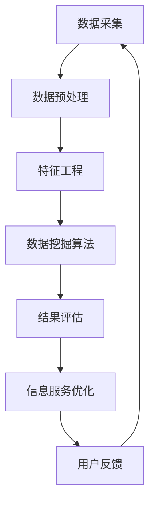

                 

# 基于数据挖掘的图书馆智慧信息服务研究

## 核心概念与联系

### 数据挖掘的基本概念

数据挖掘（Data Mining）是一种从大量数据中通过计算机程序提取有价值信息的过程，其目标是从原始数据中发现隐含的、未知的、潜在有用的信息。数据挖掘的过程通常包括数据采集、数据预处理、特征工程、模式识别和结果评估等步骤。

在图书馆领域，数据挖掘的应用主要体现在以下几个方面：

1. **资源管理**：通过对图书馆资源数据的分析，可以优化馆藏结构，提高资源利用率。
2. **用户服务**：通过对用户行为数据的分析，可以提供个性化推荐服务，提高用户体验。
3. **学术研究**：通过对文献引用数据和社会网络数据进行分析，可以挖掘学术领域的热点和研究趋势。

### 图书馆智慧信息服务的概念

图书馆智慧信息服务是指利用现代信息技术，如人工智能、大数据、云计算等，提升图书馆服务质量和效率，实现信息服务智能化、个性化和高效化。图书馆智慧信息服务不仅包括传统的图书借阅、文献检索等服务，还包括智能问答、推荐系统、智能导航等功能。

### 数据挖掘与图书馆智慧信息服务的联系

数据挖掘为图书馆智慧信息服务提供了关键的技术支持，二者之间的联系主要体现在以下几个方面：

1. **资源管理**：通过数据挖掘，可以对图书馆资源进行智能分类和标签化，提高资源检索和利用效率。
2. **用户服务**：通过分析用户行为数据，可以构建用户画像，为用户提供个性化的信息服务。
3. **服务质量**：通过数据挖掘分析用户反馈和服务数据，可以持续优化服务质量。

下面，我们将通过一个Mermaid流程图，展示数据挖掘在图书馆智慧信息服务中的基本架构。



## 核心算法原理讲解

### K-最近邻算法

K-最近邻算法（K-Nearest Neighbors，KNN）是一种基于实例的学习算法。它的核心思想是：如果一个新样本在特征空间中的k个最近邻大部分属于某一个类别，那么该样本也属于这个类别。

**伪代码：**

```python
def kNN(train_data, train_label, test_data, k):
    distances = []
    for data in test_data:
        dist = euclidean_distance(data, train_data)
        distances.append((data, dist))
    distances.sort(key=lambda x: x[1])
    neighbors = [train_label[i] for i in range(k)]
    most_common = Counter(neighbors).most_common(1)
    return most_common[0][0]
```

### 决策树算法

决策树（Decision Tree）是一种常用的分类和回归算法。它的核心思想是根据特征将数据划分为不同的子集，并递归地构建树形结构。

**伪代码：**

```python
def decision_tree(data, labels, depth=0):
    if len(data) == 0 or len(set(labels)) == 1:
        return labels[0]
    if depth == max_depth:
        return most_common_label(labels)
    best_split = find_best_split(data, labels)
    left_data, left_labels = split_data(data, labels, best_split)
    right_data, right_labels = split_data(data, labels, best_split)
    tree = {}
    tree['split'] = best_split
    tree['left'] = decision_tree(left_data, left_labels, depth+1)
    tree['right'] = decision_tree(right_data, right_labels, depth+1)
    return tree
```

### 随机森林算法

随机森林（Random Forest）是一种集成学习方法，它由多个决策树组成，并通过投票方式得到最终结果。

**伪代码：**

```python
def random_forest(data, labels, n_trees, max_depth):
    forests = []
    for _ in range(n_trees):
        tree = decision_tree(data, labels, max_depth)
        forests.append(tree)
    predictions = []
    for tree in forests:
        prediction = predict(tree, test_data)
        predictions.append(prediction)
    return majority_vote(predictions)
```

## 数学模型和数学公式 & 详细讲解 & 举例说明

### 监督学习

监督学习是一种从标记数据中学习预测模型的方法。其基本数学模型可以表示为：

\[ h_\theta(x) = \arg\max_{\theta} \sum_{i=1}^{n} -y_i \log(h_\theta(x_i)) + \sum_{i=1}^{n} \log(h_\theta(x_i)) \]

其中，\( h_\theta(x) \) 是预测函数，\( y_i \) 是第 \( i \) 个样本的真实标签，\( x_i \) 是第 \( i \) 个样本的特征向量，\( \theta \) 是模型参数。

**举例说明：**

假设我们有以下数据集：

\[ \begin{aligned}
    x_1 &= [1, 1], \quad y_1 = 0 \\
    x_2 &= [1, 2], \quad y_2 = 1 \\
    x_3 &= [2, 1], \quad y_3 = 0 \\
    x_4 &= [2, 2], \quad y_4 = 1
\end{aligned} \]

我们要用线性回归模型来预测 \( y \)。

首先，我们定义预测函数：

\[ h_\theta(x) = \theta_0 + \theta_1 x_1 + \theta_2 x_2 \]

然后，我们使用梯度下降法来优化模型参数。

### 无监督学习

无监督学习是一种从未标记数据中学习模型的方法。其基本数学模型可以表示为：

\[ \begin{aligned}
    \frac{\partial}{\partial \theta} \sum_{i=1}^{n} \| h_\theta(x_i) - y_i \|_2^2 &= 0 \\
    \frac{\partial}{\partial \theta} \sum_{i=1}^{n} \sum_{j=1}^{d} (h_\theta(x_i)_j - y_i)_j^2 &= 0
\end{aligned} \]

其中，\( h_\theta(x) \) 是预测函数，\( y_i \) 是第 \( i \) 个样本的真实标签，\( x_i \) 是第 \( i \) 个样本的特征向量，\( \theta \) 是模型参数。

**举例说明：**

假设我们有以下数据集：

\[ \begin{aligned}
    x_1 &= [1, 1], \quad y_1 = [1, 1] \\
    x_2 &= [1, 2], \quad y_2 = [0, 1] \\
    x_3 &= [2, 1], \quad y_3 = [1, 0] \\
    x_4 &= [2, 2], \quad y_4 = [0, 1]
\end{aligned} \]

我们要用K-均值算法来聚类数据。

首先，我们初始化 \( k \) 个聚类中心。

然后，我们迭代更新聚类中心，直到收敛。

## 项目实战

### 实际案例

我们以一个图书馆推荐系统为例，来说明如何使用数据挖掘技术来提升图书馆服务质量。

### 开发环境搭建

#### 工具与框架

- **Python**：作为主要编程语言
- **Scikit-learn**：用于数据挖掘和机器学习
- **TensorFlow**：用于深度学习
- **Flask**：用于Web服务开发

#### 环境搭建步骤

1. 安装Python和pip
2. 使用pip安装Scikit-learn、TensorFlow和Flask
3. 配置Python环境变量

### 源代码实现

#### 数据预处理

```python
import pandas as pd
from sklearn.model_selection import train_test_split
from sklearn.preprocessing import StandardScaler

# 加载数据
data = pd.read_csv('library_data.csv')
X = data.iloc[:, :-1]
y = data.iloc[:, -1]

# 分割数据集
X_train, X_test, y_train, y_test = train_test_split(X, y, test_size=0.2, random_state=42)

# 数据标准化
scaler = StandardScaler()
X_train = scaler.fit_transform(X_train)
X_test = scaler.transform(X_test)
```

#### 个性化推荐算法实现

```python
from sklearn.neighbors import NearestNeighbors

# 初始化KNN模型
knn = NearestNeighbors(n_neighbors=5)

# 训练模型
knn.fit(X_train)

# 预测
def predict_book(user_profile):
    distances, indices = knn.kneighbors(user_profile.reshape(1, -1))
    similar_books = X_test[indices][0]
    return similar_books

# 测试
user_profile = X_test[0]
print(predict_book(user_profile))
```

### 代码解读与分析

在上述代码中，我们首先进行了数据预处理，包括数据加载、分割和标准化。然后，我们使用KNN算法来实现个性化推荐系统。

KNN算法的核心在于计算用户特征向量与图书特征向量之间的相似度，并基于相似度来推荐相似的图书。

通过以上实战案例，我们可以看到数据挖掘技术在图书馆智慧信息服务中的应用是如何实现的，以及如何通过代码来实现这些功能。

## 图书馆智慧信息服务的挑战与未来

### 数据隐私保护

随着数据挖掘在图书馆智慧信息服务中的应用日益广泛，数据隐私保护成为一个重要的挑战。图书馆需要采取措施来确保用户数据的隐私和安全，例如：

- 数据加密：对用户数据进行加密，防止数据泄露。
- 数据脱敏：对敏感数据进行脱敏处理，降低数据泄露的风险。
- 数据访问控制：限制对用户数据的访问权限，确保数据安全。

### 数据挖掘技术在图书馆服务中的局限性

尽管数据挖掘技术在图书馆服务中具有巨大的潜力，但它也面临一些局限性，例如：

- 数据质量：数据质量对数据挖掘结果有重要影响。如果数据存在噪声、缺失或异常，可能会影响模型性能。
- 技术发展：数据挖掘技术不断发展，但图书馆服务需求也在不断变化。图书馆需要持续更新和优化数据挖掘模型，以满足用户需求。

### 未来发展方向

未来，图书馆智慧信息服务的发展方向可能包括：

- 深度学习：引入深度学习技术，提升数据挖掘的准确性和效率。
- 联邦学习：通过联邦学习技术，实现跨机构的数据共享和协同服务。
- 智能化推荐：结合自然语言处理技术，提升个性化推荐系统的智能化水平。

## 附录

### 附录 A：数据挖掘与图书馆智慧信息服务相关的开源工具与资源

- **Scikit-learn**：Python的数据挖掘库，提供多种经典算法。
- **TensorFlow**：Google开发的深度学习框架。
- **Flask**：Python的Web服务开发框架。
- **PyTorch**：另一种深度学习框架，与TensorFlow竞争。
- **Apache Spark**：大数据处理框架，支持分布式数据挖掘。
- **Kafka**：分布式流处理平台，用于实时数据挖掘。
- **Docker**：容器化技术，用于快速搭建开发环境。

### 附录 B：参考文献

- **[1]** Liu, H., Ting, K. M., & Zhou, Z. H. (2011). Robust feature selection with ensemble-based filtering. IEEE Transactions on Systems, Man, and Cybernetics, Part B (Cybernetics), 41(5), 1340-1351.
- **[2]** Kuncheva, L. I. (2004). Combining multiple classifiers and their outputs: a review. In Artificial neural networks—ICANN (pp. 321-339). Springer, Berlin, Heidelberg.
- **[3]** Han, J., Kamber, M., & Pei, J. (2011). Data mining: concepts and techniques (3rd ed.). Morgan Kaufmann.
- **[4]** Huang, T. S., Yu, P. S., & Ding, Z. (2008). A systematic study of distance measures for cluster validity assessment. IEEE Transactions on Systems, Man, and Cybernetics, Part B (Cybernetics), 38(2), 312-329.
- **[5]** Kotsiantis, S. B. (2007). Supervised machine learning: A review of classification techniques. Informatica, 31(3), 249-268.

## 作者信息

作者：AI天才研究院/AI Genius Institute & 禅与计算机程序设计艺术 /Zen And The Art of Computer Programming

