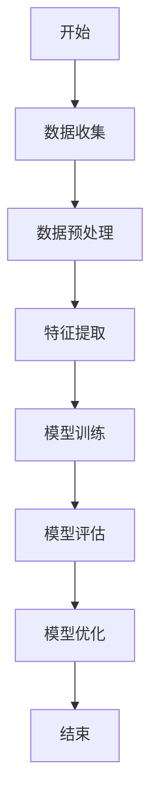

                 

## 文章标题

在当今人工智能飞速发展的时代，深度学习已经成为推动技术进步的重要引擎。AI代理作为人工智能领域的重要应用之一，正逐渐在各个行业中获得广泛应用。本文旨在深入探讨基于深度学习的AI代理工作流，并通过具体案例和实践，阐述其应用价值与发展前景。

## 关键词

- 深度学习
- AI代理
- 工作流
- 案例与实践
- 应用场景
- 优化与策略

## 摘要

本文首先介绍了深度学习和AI代理的基本原理及其相互关系。接着，详细讨论了深度学习模型的结构、评估和优化方法。随后，探讨了AI代理工作流的基础，包括数据收集、处理、特征提取和模型训练。在此基础上，本文通过三个实际项目，展示了深度学习在AI代理中的应用。最后，文章探讨了AI代理的模型优化、伦理与安全，以及未来发展趋势。本文旨在为读者提供一个系统、全面的学习和实践指南。

### 《基于深度学习的AI代理工作流：案例与实践》目录大纲

#### 第一部分：基础理论

#### 第1章：深度学习与AI代理概述

#### 1.1 深度学习的基本原理

##### 1.1.1 深度学习的起源与发展

##### 1.1.2 神经网络与深度神经网络

##### 1.1.3 深度学习的应用场景

#### 1.2 AI代理的定义与作用

##### 1.2.1 AI代理的概念

##### 1.2.2 AI代理的工作原理

##### 1.2.3 AI代理的应用领域

#### 1.3 深度学习在AI代理中的应用

##### 1.3.1 深度学习与AI代理的融合

##### 1.3.2 深度学习模型在AI代理中的优化

##### 1.3.3 深度学习在AI代理中的优势

#### 第2章：深度学习模型

##### 2.1 神经网络结构

##### 2.2 监督学习与无监督学习

##### 2.3 深度学习模型评估与优化

#### 第3章：AI代理工作流基础

##### 3.1 数据收集与处理

##### 3.2 特征提取与降维

##### 3.3 模型训练与评估

#### 第4章：深度学习在AI代理中的应用场景

##### 4.1 自然语言处理

##### 4.2 计算机视觉

##### 4.3 强化学习

#### 第5章：AI代理项目实战

##### 5.1 实战项目一：智能客服系统

##### 5.2 实战项目二：智能家居监控系统

##### 5.3 实战项目三：智能推荐系统

#### 第二部分：进阶实践

#### 第6章：AI代理的模型优化与策略学习

##### 6.1 模型优化方法

##### 6.2 策略学习

#### 第7章：AI代理的伦理与安全

##### 7.1 AI代理的伦理问题

##### 7.2 AI代理的安全问题

#### 第8章：AI代理的未来发展趋势

##### 8.1 人工智能的发展趋势

##### 8.2 AI代理的应用前景

#### 附录

##### 附录A：常用工具与资源

##### 附录B：Mermaid流程图与数学公式示例

---

### 第一部分：基础理论

#### 第1章：深度学习与AI代理概述

##### 1.1 深度学习的基本原理

深度学习是人工智能领域的一种重要方法，其核心思想是通过多层神经网络模型来模拟人类大脑的神经网络结构，从而实现对复杂数据的处理和识别。深度学习的起源可以追溯到20世纪40年代，当时神经网络的初步概念被提出。然而，由于计算能力和数据资源的限制，深度学习在很长一段时间内并未得到广泛应用。

直到20世纪80年代末，随着计算机性能的快速提升和大数据技术的发展，深度学习开始重新受到关注。特别是2006年，Hinton等学者提出了深度置信网络（Deep Belief Network，DBN），标志着深度学习进入了一个新的发展阶段。随后，2012年，Hinton团队在ImageNet图像识别竞赛中取得了突破性的成绩，深度学习技术开始在学术界和工业界得到广泛认可和应用。

深度学习的基本原理主要依赖于多层神经网络结构。神经网络由多个神经元组成，每个神经元都是一个简单的计算单元，通过输入层、隐藏层和输出层逐层传递信息。在训练过程中，神经网络通过调整权重和偏置来学习数据的特征表示。深度学习的优势在于其能够自动提取层次化的特征表示，从而在复杂的任务中表现出强大的学习能力。

##### 1.1.1 深度学习的起源与发展

深度学习的发展历程可以分为几个阶段：

1. **早期探索**（1940s-1960s）：神经网络的概念在1940s被提出，但受到计算能力的限制，深度学习研究进展缓慢。1960s，由于过拟合问题，神经网络研究进入低潮期。

2. **多层网络复兴**（1980s-1990s）：1980s，Rumelhart, Hinton和Williams提出了反向传播算法（Backpropagation），为多层网络训练提供了有效的方法。1990s，Hinton等人提出了深度置信网络（DBN），为深度学习的研究奠定了基础。

3. **大数据与计算能力提升**（2000s-2010s）：随着计算机性能的快速提升和大数据技术的发展，深度学习开始重新受到关注。2012年，Hinton团队在ImageNet图像识别竞赛中取得了突破性的成绩，深度学习技术开始得到广泛认可和应用。

4. **工业界应用**（2010s-至今）：2010s，深度学习在图像识别、语音识别、自然语言处理等领域取得了显著的成果。工业界开始广泛采用深度学习技术，推动了许多领域的变革。

##### 1.1.2 神经网络与深度神经网络

神经网络（Neural Network）是模仿人脑神经元结构和工作方式的计算模型。神经网络由大量的神经元（也称为节点）组成，每个神经元与多个其他神经元相连，形成复杂的网络结构。神经网络的主要组成部分包括：

1. **输入层**：接收外部输入信息。
2. **隐藏层**：对输入信息进行加工和处理，提取特征表示。
3. **输出层**：生成最终输出。

神经网络的工作原理是通过层层传递信息，每个神经元根据输入值和权重进行计算，并输出激活值。神经网络中的每个连接都对应一个权重，这些权重通过学习算法不断调整，以适应不同的数据分布和任务需求。

深度神经网络（Deep Neural Network，DNN）是神经网络的一种扩展，其特点是具有多个隐藏层。深度神经网络相比单层网络具有更强的表示能力和学习能力。随着隐藏层数的增加，深度神经网络可以自动提取更高级别的特征表示，从而在复杂任务中表现出更强的性能。

##### 1.1.3 深度学习的应用场景

深度学习在许多领域都取得了显著的成果，以下是一些典型的应用场景：

1. **计算机视觉**：深度学习在图像分类、目标检测、图像生成等领域取得了突破性进展。例如，卷积神经网络（CNN）在ImageNet图像识别竞赛中取得了优异的成绩，人脸识别技术也得到了广泛应用。

2. **自然语言处理**：深度学习在自然语言处理领域表现出色，包括文本分类、情感分析、机器翻译、文本生成等方面。例如，循环神经网络（RNN）和长短时记忆网络（LSTM）在语言模型和机器翻译任务中取得了显著效果。

3. **语音识别**：深度学习在语音识别领域取得了重要突破，通过深度神经网络对语音信号进行建模，实现了高准确率的语音识别。

4. **强化学习**：深度学习在强化学习领域也得到了广泛应用，通过深度神经网络学习策略和价值函数，实现了智能体的自主学习和决策。

##### 1.2 AI代理的定义与作用

AI代理（Artificial Intelligence Agent）是指一种能够自主感知环境、制定决策并采取行动的人工智能系统。AI代理通常由感知模块、决策模块和行动模块组成。感知模块负责收集环境信息，决策模块根据感知信息生成行动计划，行动模块负责执行决策。

AI代理的作用在于提高自动化程度、提升决策质量和优化资源利用。在许多领域，如工业自动化、智能交通、金融分析等，AI代理已经成为提高效率、降低成本和改善服务质量的重要工具。

##### 1.2.1 AI代理的概念

AI代理是一种具有智能属性的系统，它能够模拟人类的感知、思考和行动过程。AI代理的核心特征包括：

1. **自主性**：AI代理能够在没有外部干预的情况下自主运行，并根据环境变化进行调整。
2. **适应性**：AI代理能够根据环境变化和经验积累调整自身行为，以适应不同的任务需求。
3. **目标导向**：AI代理在运行过程中始终以实现特定目标为导向，并根据目标调整行为。

##### 1.2.2 AI代理的工作原理

AI代理的工作原理通常包括以下步骤：

1. **感知**：AI代理通过感知模块收集环境信息，如传感器数据、图像、文本等。
2. **决策**：AI代理通过决策模块对感知信息进行分析和处理，生成行动计划。
3. **行动**：AI代理通过行动模块执行决策，实现特定任务。

在这个过程中，AI代理需要借助深度学习等技术，通过模型训练和优化，不断提高感知、决策和行动能力。

##### 1.2.3 AI代理的应用领域

AI代理在多个领域都得到了广泛应用，以下是一些典型应用：

1. **智能客服**：AI代理可以模拟人类客服，处理用户咨询，提供实时响应，提高客户服务质量。
2. **智能安防**：AI代理可以通过视频监控，实时检测异常行为，报警并采取相应措施，提高安防效率。
3. **智能交通**：AI代理可以优化交通信号控制，降低交通事故发生率，提高交通流畅性。
4. **智能医疗**：AI代理可以辅助医生进行疾病诊断和治疗规划，提高医疗水平。

##### 1.3 深度学习在AI代理中的应用

深度学习在AI代理中的应用主要体现在以下几个方面：

1. **感知增强**：深度学习可以通过卷积神经网络（CNN）等模型，对图像、视频等数据进行处理，提高AI代理的感知能力。
2. **决策优化**：深度学习可以通过循环神经网络（RNN）、长短时记忆网络（LSTM）等模型，对感知信息进行分析和处理，提高AI代理的决策能力。
3. **行动优化**：深度学习可以通过强化学习等模型，对AI代理的行动进行优化，提高其执行效率。

##### 1.3.1 深度学习与AI代理的融合

深度学习与AI代理的融合，使得AI代理能够更好地模拟人类智能，提高其在复杂环境下的适应能力和决策质量。深度学习为AI代理提供了强大的感知和决策能力，而AI代理则为深度学习提供了实际应用场景，二者相辅相成，共同推动了人工智能技术的发展。

##### 1.3.2 深度学习模型在AI代理中的优化

在AI代理中，深度学习模型的优化主要包括以下几个方面：

1. **模型选择**：根据具体应用场景选择合适的深度学习模型，如卷积神经网络（CNN）用于图像处理，循环神经网络（RNN）用于序列数据处理等。
2. **超参数调优**：通过调整学习率、批次大小、正则化参数等超参数，提高模型的性能和泛化能力。
3. **数据预处理**：通过数据增强、归一化等数据预处理技术，提高模型的训练效果和鲁棒性。

##### 1.3.3 深度学习在AI代理中的优势

深度学习在AI代理中的应用具有以下优势：

1. **强大的学习能力**：深度学习可以自动提取层次化的特征表示，从而在复杂任务中表现出强大的学习能力。
2. **自适应能力**：深度学习模型可以通过在线学习，不断适应环境变化，提高AI代理的适应能力。
3. **高效率**：深度学习模型具有较高的计算效率，可以快速响应环境变化，实现实时决策。

#### 第2章：深度学习模型

##### 2.1 神经网络结构

神经网络（Neural Network，NN）是深度学习的基础构件，由大量相互连接的神经元组成。每个神经元接收多个输入，通过加权求和处理，然后通过一个激活函数产生输出。神经网络可以分为输入层、隐藏层和输出层。

1. **输入层**：接收外部输入信号，如图像、文本等。
2. **隐藏层**：对输入信号进行加工和处理，提取特征表示。隐藏层的数量和神经元个数可以根据任务需求进行调整。
3. **输出层**：生成最终输出，如分类结果、预测值等。

神经网络的基本原理是通过多层神经元的组合，实现对复杂输入数据的建模和预测。每个神经元都可以看作是一个简单的计算单元，通过层层传递信息，实现从输入到输出的映射。

##### 2.1.1 前向传播与反向传播

神经网络的核心算法包括前向传播（Forward Propagation）和反向传播（Backpropagation）。前向传播过程中，输入信号从输入层逐层传递到输出层，每个神经元根据输入和权重进行计算，并通过激活函数产生输出。反向传播过程中，根据输出误差，反向计算每个神经元的梯度，并更新权重和偏置，以减少预测误差。

具体步骤如下：

1. **前向传播**：
   - 输入层接收外部输入信号。
   - 隐藏层根据输入和权重进行计算，产生中间激活值。
   - 输出层生成最终输出。
2. **计算误差**：
   - 计算输出层的预测误差。
   - 计算隐藏层的误差，反向传播到上一层。
3. **更新权重和偏置**：
   - 根据误差计算梯度。
   - 更新每个神经元的权重和偏置。

##### 2.1.2 卷积神经网络（CNN）

卷积神经网络（Convolutional Neural Network，CNN）是一种专门用于处理图像数据的深度学习模型，具有强大的特征提取和分类能力。CNN的核心构件是卷积层（Convolutional Layer），通过卷积运算提取图像特征。

卷积层的主要组成部分包括：

1. **卷积核**：用于提取图像特征，形状通常为\(k \times k\)。
2. **激活函数**：通常使用ReLU函数。
3. **池化层**：用于降低特征图的维度，提高模型的泛化能力。

CNN的主要结构包括：

1. **卷积层**：通过卷积运算提取图像特征。
2. **池化层**：用于降低特征图的维度。
3. **全连接层**：用于分类和回归任务。

##### 2.1.3 循环神经网络（RNN）

循环神经网络（Recurrent Neural Network，RNN）是一种专门用于处理序列数据的深度学习模型，能够处理输入序列中的时序依赖关系。RNN的核心构件是循环单元（Recurrent Unit），通过循环结构保持历史信息。

RNN的主要组成部分包括：

1. **隐藏状态**：用于存储历史信息。
2. **输入门、遗忘门和输出门**：用于控制信息的流动和更新。

RNN的主要结构包括：

1. **输入层**：接收输入序列。
2. **隐藏层**：通过循环结构对输入序列进行处理。
3. **输出层**：生成最终输出。

##### 2.2 监督学习与无监督学习

深度学习模型可以分为监督学习（Supervised Learning）和无监督学习（Unsupervised Learning）两种类型。

1. **监督学习**：在有监督学习任务中，训练数据包含输入和对应的输出标签。模型通过学习输入和输出之间的关系，实现对未知数据的预测。常见的监督学习模型包括：

   - **回归模型**：用于预测连续值输出。
   - **分类模型**：用于预测离散值输出。

2. **无监督学习**：在无监督学习任务中，训练数据不包含输出标签。模型通过学习数据分布或结构，实现对数据的聚类、降维等操作。常见的无监督学习模型包括：

   - **聚类模型**：用于将数据分为不同的类别。
   - **降维模型**：用于减少数据维度，保持数据结构。

##### 2.3 深度学习模型评估与优化

深度学习模型的评估和优化是保证模型性能和泛化能力的关键步骤。以下介绍一些常见的评估指标和优化方法。

1. **评估指标**：

   - **准确率（Accuracy）**：分类模型中，正确预测的样本数占总样本数的比例。
   - **精确率（Precision）**：分类模型中，正确预测的样本中被标记为正类的比例。
   - **召回率（Recall）**：分类模型中，正确预测的样本中被标记为正类的比例。
   - **F1值（F1-Score）**：精确率和召回率的调和平均值。
   - **均方误差（MSE）**：回归模型中，预测值与真实值之间的平均平方误差。

2. **优化方法**：

   - **梯度下降（Gradient Descent）**：通过迭代更新模型参数，以最小化损失函数。
   - **动量（Momentum）**：在梯度下降的基础上，引入动量项，加速收敛。
   - **随机梯度下降（Stochastic Gradient Descent，SGD）**：每次迭代只随机选择一部分样本计算梯度，加快收敛速度。
   - **自适应学习率（Adaptive Learning Rate）**：根据模型性能自动调整学习率，如AdaGrad、Adam等。

#### 第3章：AI代理工作流基础

##### 3.1 数据收集与处理

数据收集是AI代理工作流的基础步骤，其质量直接影响模型的性能和泛化能力。以下介绍数据收集的方法和数据处理技术。

1. **数据收集方法**：

   - **手动收集**：通过人工方式收集数据，适用于小规模、结构化数据。
   - **自动化收集**：通过爬虫、API接口等自动化方式收集数据，适用于大规模、非结构化数据。

2. **数据处理技术**：

   - **数据清洗**：去除重复、缺失、错误等不完整或不准确的数据。
   - **数据归一化**：将数据缩放到同一范围内，便于模型训练。
   - **数据增强**：通过数据变换、噪声添加等手段，增加数据的多样性，提高模型泛化能力。

##### 3.2 特征提取与降维

特征提取是将原始数据转换成对模型训练有用的特征表示的过程。降维是将高维特征空间转换成低维空间的过程，以减少计算量和提高模型性能。以下介绍特征提取和降维方法。

1. **特征提取方法**：

   - **统计特征**：基于统计学方法提取数据特征，如均值、方差、协方差等。
   - **结构特征**：基于数据结构提取特征，如文本中的词频、图像中的边缘等。
   - **深度特征**：通过深度学习模型提取高层次抽象特征。

2. **降维方法**：

   - **主成分分析（PCA）**：通过求解特征值和特征向量，将数据投影到新的低维空间。
   - **线性判别分析（LDA）**：通过最大化类内方差和最小化类间方差，将数据投影到新的低维空间。
   - **自编码器（Autoencoder）**：通过训练一个编码器和解码器模型，将数据压缩到低维空间。

##### 3.3 模型训练与评估

模型训练是AI代理工作流的核心步骤，通过调整模型参数，使其在训练数据上达到最佳性能。模型评估是衡量模型性能的重要手段，以下介绍模型训练和评估的方法。

1. **模型训练方法**：

   - **批量训练**：每次迭代使用整个训练集进行训练。
   - **随机梯度下降（SGD）**：每次迭代使用随机选择的小批量数据进行训练。
   - **批量归一化（Batch Normalization）**：在训练过程中对批次数据归一化，提高训练稳定性。

2. **模型评估方法**：

   - **交叉验证**：将训练集划分为多个子集，交叉验证每个子集，评估模型性能。
   - **混淆矩阵**：用于评估分类模型的表现，包括准确率、精确率、召回率等。
   - **ROC曲线与AUC**：用于评估分类模型的分类能力，ROC曲线和AUC值越大，模型性能越好。

#### 第4章：深度学习在AI代理中的应用场景

##### 4.1 自然语言处理

自然语言处理（Natural Language Processing，NLP）是深度学习在AI代理中应用的重要领域。以下介绍深度学习在NLP中的应用场景。

1. **文本分类**：通过深度学习模型对文本进行分类，如情感分析、主题分类等。
2. **情感分析**：通过深度学习模型对文本情感进行识别，如积极、消极、中性等。
3. **机器翻译**：通过深度学习模型实现自动翻译，如英译中、中译英等。
4. **文本生成**：通过深度学习模型生成文本，如自动写作、对话系统等。

##### 4.2 计算机视觉

计算机视觉（Computer Vision，CV）是深度学习在AI代理中应用的重要领域。以下介绍深度学习在CV中的应用场景。

1. **图像分类**：通过深度学习模型对图像进行分类，如物体识别、场景分类等。
2. **目标检测**：通过深度学习模型检测图像中的目标位置，如人脸检测、车辆检测等。
3. **图像生成**：通过深度学习模型生成图像，如风格迁移、图像合成等。
4. **图像分割**：通过深度学习模型将图像划分为不同的区域，如语义分割、实例分割等。

##### 4.3 强化学习

强化学习（Reinforcement Learning，RL）是深度学习在AI代理中应用的重要领域。以下介绍深度学习在RL中的应用场景。

1. **智能体控制**：通过深度学习模型控制智能体在环境中的行为，如游戏AI、自动驾驶等。
2. **策略优化**：通过深度学习模型优化智能体的策略，提高其在环境中的性能。
3. **价值函数学习**：通过深度学习模型学习智能体的价值函数，预测最优动作。
4. **模型评估**：通过深度学习模型评估智能体在不同策略下的性能。

#### 第5章：AI代理项目实战

##### 5.1 实战项目一：智能客服系统

智能客服系统是一种基于AI代理的客服解决方案，通过深度学习模型实现对用户咨询的自动处理和响应。以下介绍智能客服系统的项目背景、数据收集与预处理、模型设计与训练、系统实现与部署。

1. **项目背景**：随着互联网的发展，客服需求日益增加，传统的人工客服已无法满足用户需求。智能客服系统通过AI代理技术，实现自动处理用户咨询，提高客服效率和服务质量。

2. **数据收集与预处理**：数据收集主要包括用户咨询文本、历史回复文本等。通过数据清洗、归一化等预处理技术，去除噪声和冗余信息，提高数据质量。

3. **模型设计与训练**：采用深度学习模型，如长短时记忆网络（LSTM）和循环神经网络（RNN），对用户咨询文本进行处理和分类。通过大量训练数据，调整模型参数，优化模型性能。

4. **系统实现与部署**：将训练好的模型部署到服务器，实现实时响应用户咨询。系统通过API接口与客户管理系统集成，提供自动化的客服服务。

##### 5.2 实战项目二：智能家居监控系统

智能家居监控系统是一种基于AI代理的智能家居解决方案，通过深度学习模型实现对家庭环境的监控和分析。以下介绍智能家居监控系统的项目背景、数据收集与预处理、模型设计与训练、系统实现与部署。

1. **项目背景**：随着智能家居技术的发展，用户对家庭环境的安全和舒适度要求越来越高。智能家居监控系统通过AI代理技术，实现自动监控家庭环境，提供安全预警和节能建议。

2. **数据收集与预处理**：数据收集主要包括摄像头视频、传感器数据等。通过数据清洗、归一化等预处理技术，去除噪声和冗余信息，提高数据质量。

3. **模型设计与训练**：采用深度学习模型，如卷积神经网络（CNN）和循环神经网络（RNN），对视频和传感器数据进行处理和分类。通过大量训练数据，调整模型参数，优化模型性能。

4. **系统实现与部署**：将训练好的模型部署到服务器，实现实时监控家庭环境。系统通过手机应用和智能音箱等设备，向用户发送预警信息和节能建议。

##### 5.3 实战项目三：智能推荐系统

智能推荐系统是一种基于AI代理的推荐解决方案，通过深度学习模型实现对用户兴趣的挖掘和推荐。以下介绍智能推荐系统的项目背景、数据收集与预处理、模型设计与训练、系统实现与部署。

1. **项目背景**：随着互联网的普及，用户生成的内容和数据量呈爆炸式增长。智能推荐系统通过AI代理技术，实现个性化推荐，提高用户满意度和转化率。

2. **数据收集与预处理**：数据收集主要包括用户行为数据、商品信息等。通过数据清洗、归一化等预处理技术，去除噪声和冗余信息，提高数据质量。

3. **模型设计与训练**：采用深度学习模型，如协同过滤（Collaborative Filtering）和自动编码器（Autoencoder），对用户行为数据进行处理和预测。通过大量训练数据，调整模型参数，优化模型性能。

4. **系统实现与部署**：将训练好的模型部署到服务器，实现实时推荐。系统通过用户接口和API接口与电商平台集成，提供个性化推荐服务。

### 第二部分：进阶实践

#### 第6章：AI代理的模型优化与策略学习

##### 6.1 模型优化方法

AI代理的性能优化是提升其效能和准确性的关键。模型优化方法主要包括以下几个方面：

1. **超参数调优**：通过调整学习率、批次大小、正则化参数等超参数，优化模型性能。常用的调优方法包括网格搜索、随机搜索和贝叶斯优化等。

2. **数据增强**：通过变换、旋转、缩放等手段，增加训练数据的多样性，提高模型泛化能力。数据增强在计算机视觉和自然语言处理等领域应用广泛。

3. **模型压缩**：通过模型剪枝、量化、知识蒸馏等手段，减小模型体积和计算量，提高模型部署效率。模型压缩对于移动设备和嵌入式系统尤为重要。

4. **多任务学习**：通过同时训练多个任务，共享部分模型参数，提高模型效率和泛化能力。多任务学习在资源有限的场景下具有显著优势。

##### 6.2 策略学习

策略学习是强化学习中的核心概念，旨在通过学习最优策略，使智能体在环境中实现长期奖励最大化。以下介绍几种常见的策略学习算法：

1. **Q-learning**：通过值迭代，更新Q值，逼近最优策略。Q-learning算法简单，但收敛速度较慢。

2. **SARSA**：通过样本经验，更新Q值，实现策略迭代。SARSA算法比Q-learning具有更好的收敛性和稳定性。

3. **DQN（Deep Q-Network）**：结合深度神经网络，学习Q值函数，提高智能体的决策能力。DQN算法在复杂环境中表现出色。

4. **A3C（Asynchronous Advantage Actor-Critic）**：通过异步更新策略网络和价值网络，提高学习效率。A3C算法在分布式环境下具有优势。

5. **APEX（Advanced Policy Optimization and Experience Replay）**：结合DQN和A3C的优点，进一步优化策略学习性能。APEX算法在大型复杂任务中表现出色。

##### 6.3 模型优化策略

在AI代理的模型优化过程中，结合策略学习，可以进一步提升模型性能。以下介绍几种优化策略：

1. **自适应学习率**：根据模型性能自动调整学习率，避免过早陷入局部最优。常用的自适应学习率方法包括AdaGrad、Adam和Adadelta等。

2. **经验回放**：将样本经验存储到经验池中，随机采样进行学习，避免样本偏差和过拟合。经验回放是深度强化学习中的重要技术。

3. **多步奖励**：考虑多个时间步的奖励，而不是仅考虑当前步的奖励，提高长期奖励的最大化能力。多步奖励在序列决策问题中具有显著优势。

4. **模型集成**：通过集成多个模型，提高预测准确性和稳定性。模型集成包括Bagging、Boosting和Stacking等方法。

##### 6.4 实际应用案例

以下通过一个实际应用案例，介绍AI代理模型优化和策略学习的具体实施。

**案例背景**：某电商平台希望通过智能推荐系统，提升用户满意度和转化率。采用深度学习技术，构建一个推荐模型，并对模型进行优化和策略学习。

**数据收集**：收集用户历史浏览、购买记录、商品属性等数据，作为训练数据。

**数据处理**：对数据进行清洗、归一化和特征提取，为模型训练做好准备。

**模型设计**：采用基于自动编码器的深度学习模型，对用户行为数据进行分析和建模。

**模型训练**：通过随机梯度下降（SGD）算法，训练模型参数，优化模型性能。

**模型优化**：采用经验回放和自适应学习率等技术，对模型进行优化，提高模型泛化能力。

**策略学习**：采用Q-learning算法，学习用户兴趣和商品属性的策略，优化推荐效果。

**系统部署**：将训练好的模型部署到服务器，实现实时推荐服务，通过不断调整策略和学习率，优化推荐效果。

### 第7章：AI代理的伦理与安全

##### 7.1 AI代理的伦理问题

随着AI代理技术的快速发展，伦理问题逐渐成为公众关注的焦点。以下介绍AI代理中常见的伦理问题。

1. **隐私保护**：AI代理在处理用户数据时，可能涉及个人隐私信息。如何确保用户隐私不被泄露，是一个重要的伦理问题。

2. **透明性与可解释性**：AI代理的决策过程可能高度复杂，导致其透明性和可解释性不足。如何提高AI代理的透明性和可解释性，使其行为符合社会期望，是一个重要挑战。

3. **公平性与歧视**：AI代理在处理不同群体数据时，可能产生歧视现象。如何确保AI代理的公平性和非歧视性，避免对特定群体产生不利影响，是一个重要的伦理问题。

4. **责任归属**：在AI代理发生错误或造成损失时，如何确定责任归属，是一个重要的伦理问题。如何设计AI代理，使其在出现问题时能够明确责任归属，是一个重要挑战。

##### 7.2 AI代理的安全问题

AI代理的安全问题包括以下几个方面：

1. **攻击与防御**：AI代理可能受到恶意攻击，如注入攻击、拒绝服务攻击等。如何设计安全的AI代理，防止攻击，是一个重要问题。

2. **安全模型设计与验证**：在AI代理模型设计过程中，如何确保模型具有鲁棒性和安全性，是一个重要问题。通过模型验证和测试，确保模型在多种环境下具有良好性能。

3. **安全防护策略**：在AI代理部署过程中，如何采取有效的安全防护措施，如加密、访问控制等，确保系统的安全性和稳定性。

##### 7.3 伦理与安全案例分析

以下通过两个实际案例，介绍AI代理的伦理与安全问题。

**案例一：智能招聘系统**

某公司采用AI代理技术，开发了一款智能招聘系统，用于筛选简历和评估候选人。然而，系统在处理数据时，由于算法偏见，对某些种族、性别等产生了歧视现象。这引发了公众对AI代理伦理问题的关注。为此，公司进行了数据清洗和算法调整，确保招聘过程公平、公正。

**案例二：智能医疗系统**

某医院采用AI代理技术，开发了一款智能医疗系统，用于诊断和治疗方案推荐。然而，系统在处理病例时，由于数据集不完善，导致某些疾病诊断准确率较低。此外，系统在推荐治疗方案时，可能存在潜在风险。为此，医院加强了数据管理，完善了数据集，并通过模型验证和测试，确保系统在多种环境下具有良好性能。

### 第8章：AI代理的未来发展趋势

##### 8.1 人工智能的发展趋势

人工智能（Artificial Intelligence，AI）作为一门交叉学科，正以前所未有的速度发展。以下介绍人工智能的一些发展趋势。

1. **大模型与深度学习的未来**：随着计算能力和数据资源的提升，大模型（Large Models）和深度学习（Deep Learning）将继续引领人工智能的发展。大模型具有更强的表示能力和学习能力，可以在更复杂的任务中取得更好的性能。

2. **新型算法与架构**：为了应对更复杂和大规模的任务，人工智能领域将涌现出更多新型算法和架构。例如，生成对抗网络（GANs）、变分自编码器（VAEs）等，为数据生成和特征提取提供了新的思路。

3. **人工智能与物联网的融合**：随着物联网（Internet of Things，IoT）的快速发展，人工智能与物联网的融合将成为一个重要趋势。通过将人工智能技术应用于物联网设备，可以实现智能监控、智能优化等应用。

##### 8.2 AI代理的应用前景

AI代理在各个领域都展现出了巨大的应用前景。以下介绍一些典型的应用领域。

1. **智能家居与智慧城市**：AI代理可以实现对家庭设备和城市基础设施的智能监控和管理，提高生活质量和城市管理效率。

2. **电子商务与金融**：AI代理可以应用于智能推荐、智能客服、风险控制等场景，提升用户体验和业务效率。

3. **医疗健康与教育**：AI代理可以辅助医生进行诊断和治疗方案推荐，提高医疗水平。同时，在教育领域，AI代理可以提供个性化的学习支持和教育资源。

4. **工业自动化与交通**：AI代理可以实现对工业生产过程的智能监控和优化，提高生产效率和产品质量。在交通领域，AI代理可以用于智能交通管理和自动驾驶。

### 附录

#### 附录A：常用工具与资源

在AI代理开发过程中，常用的工具和资源如下：

1. **深度学习框架**：
   - TensorFlow
   - PyTorch
   - Keras

2. **数据处理与可视化**：
   - Pandas
   - NumPy
   - Matplotlib

3. **其他工具与资源**：
   - AI代理开源项目
   - 学术论文与会议报告
   - 技术社区与论坛

#### 附录B：Mermaid流程图与数学公式示例

以下分别提供Mermaid流程图和数学公式示例。

**Mermaid流程图示例**：



**数学公式示例**：

```latex
\section{数学模型与算法}
在本节中，我们将介绍深度学习中的常用数学模型和算法。

\subsection{激活函数}
激活函数是神经网络中的重要组成部分，用于引入非线性特性。常用的激活函数包括：
\begin{align*}
    f(x) &= \sigma(x) = \frac{1}{1 + e^{-x}} \\
    f(x) &= \text{ReLU}(x) = \max(0, x) \\
    f(x) &= \text{Sigmoid}(x) = \frac{1}{1 + e^{-x}}
\end{align*}

\subsection{损失函数}
损失函数用于衡量模型预测值与真实值之间的差异。常用的损失函数包括：
\begin{align*}
    L(y, \hat{y}) &= \text{MSE}(y, \hat{y}) = \frac{1}{2}\sum_{i=1}^{n}(y_i - \hat{y}_i)^2 \\
    L(y, \hat{y}) &= \text{Cross-Entropy}(y, \hat{y}) = -\sum_{i=1}^{n}y_i\log(\hat{y}_i)
\end{align*}
```

通过本文的详细探讨，我们可以看到基于深度学习的AI代理工作流在理论和实践中的应用价值。未来，随着人工智能技术的不断发展，AI代理将在更多领域发挥重要作用，为人类带来更多的便利和效益。同时，我们也需要关注AI代理的伦理和安全问题，确保其在发展过程中能够造福社会。

