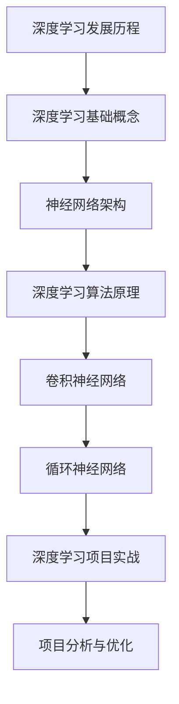

                 

# 基于深度学习的图片风格转化

## 关键词
深度学习，图片风格转化，神经网络，卷积神经网络，循环神经网络，GAN，项目实战

## 摘要
本文将深入探讨基于深度学习的图片风格转化技术。我们将首先回顾深度学习的基础知识，包括神经网络架构和深度学习算法原理。接着，我们将详细讲解卷积神经网络（CNN）和循环神经网络（RNN）在图像处理和序列建模中的应用。然后，我们将聚焦于深度学习在图像风格转化中的实际应用，介绍几种主流的图像风格转化算法。最后，我们将通过实际项目实战，展示如何搭建和实现基于深度学习的图片风格转化系统，并进行性能评估和优化。

### 目录大纲

#### 第一部分: 深度学习基础

- **第1章: 深度学习概述**
  - 1.1 深度学习的发展历程
  - 1.2 深度学习的基础概念
  - 1.3 深度学习的数学基础

- **第2章: 神经网络与深度学习框架**
  - 2.1 神经网络架构
  - 2.2 主流深度学习框架

- **第3章: 深度学习算法原理**
  - 3.1 前向传播算法
  - 3.2 反向传播算法
  - 3.3 梯度下降算法
  - 3.4 梯度优化算法

- **第4章: 卷积神经网络与图像处理**
  - 4.1 卷积神经网络（CNN）基础
  - 4.2 CNN在图像分类中的应用
  - 4.3 CNN在目标检测中的应用

- **第5章: 循环神经网络与序列建模**
  - 5.1 循环神经网络（RNN）基础
  - 5.2 长短时记忆网络（LSTM）
  - 5.3 循环神经网络在序列建模中的应用

- **第6章: 深度学习在图像风格转化中的应用**
  - 6.1 图像风格转化的基本概念
  - 6.2 主流图像风格转化算法
  - 6.3 图像风格转化算法的实战

#### 第二部分: 深度学习项目实战

- **第7章: 基于深度学习的图片风格转化项目搭建**
  - 7.1 项目背景
  - 7.2 环境搭建
  - 7.3 模型设计

- **第8章: 基于深度学习的图片风格转化实现**
  - 8.1 项目一：内容风格转化
  - 8.2 项目二：艺术风格转化
  - 8.3 项目三：基于GAN的图像风格转化

- **第9章: 项目分析与优化**
  - 9.1 项目分析
  - 9.2 项目优化

#### 附录

- **附录A: 深度学习资源与工具**

### 第一部分: 深度学习基础

#### 第1章: 深度学习概述

##### 1.1 深度学习的发展历程

深度学习作为机器学习领域的一个重要分支，其起源可以追溯到20世纪40年代。最早的神经网络概念由心理学家弗兰克·罗森布拉特（Frank Rosenblatt）在1957年提出的，即感知机（Perceptron）。感知机是一个简单的二分类模型，能够接受多个输入并输出一个二值分类结果。

然而，在20世纪80年代之前，深度学习的发展受到了很大的限制。主要原因是计算能力的限制和训练复杂度的高昂。传统的神经网络模型如多层感知机（MLP）在训练过程中容易陷入局部最优，难以收敛到全局最优解。

直到2006年，加拿大多伦多大学教授杰弗里·辛顿（Geoffrey Hinton）提出了深度置信网络（Deep Belief Network，DBN）和深度学习算法，这一突破性进展标志着深度学习的重新崛起。深度置信网络通过逐层预训练的方式，可以有效地训练多层神经网络。

2009年，斯坦福大学的李飞飞教授（Fei-Fei Li）带领团队发布了ImageNet数据库，这是一个包含数百万张图像及其标注的巨大数据集。ImageNet的发布极大地推动了深度学习在计算机视觉领域的应用，同时也引发了大规模的神经网络竞赛。

2012年，Alex Krizhevsky使用基于卷积神经网络（CNN）的AlexNet在ImageNet竞赛中取得了惊人的成绩，将错误率从26%降低到15%，这一成绩远远超过了传统机器学习方法。AlexNet的成功证明了深度学习在图像识别领域的强大能力，也标志着深度学习的兴起。

自2012年以来，深度学习技术在语音识别、自然语言处理、机器翻译、推荐系统等多个领域都取得了显著进展。深度学习模型的结构和算法也在不断演进，如卷积神经网络（CNN）、循环神经网络（RNN）、长短时记忆网络（LSTM）、生成对抗网络（GAN）等。

##### 1.2 深度学习的基础概念

深度学习是一种基于神经网络的机器学习技术，通过多层非线性变换来对数据进行建模和预测。以下是深度学习的一些基础概念：

- **神经网络（Neural Network）**：神经网络是由大量简单的人工神经元（或称为节点）互联而成的计算模型。每个神经元接收多个输入，通过加权求和后加上偏置，经过激活函数转化为输出。

- **感知机（Perceptron）**：感知机是最早的神经网络模型，可以被视为单层神经网络。它通过线性可分的数据进行二分类。

- **多层感知机（MLP）**：多层感知机是感知机的扩展，通过引入多个隐藏层，可以处理非线性可分的数据。

- **激活函数（Activation Function）**：激活函数用于将神经元的线性组合映射到非线性的输出。常用的激活函数有 sigmoid、ReLU、Tanh等。

- **前向传播（Forward Propagation）**：前向传播是指将输入数据通过网络的各个层，逐步计算每个神经元的输出。

- **反向传播（Backpropagation）**：反向传播是一种用于训练神经网络的算法，通过计算输出层与目标值之间的误差，反向传播误差至网络的前一层，从而更新网络的权重和偏置。

- **损失函数（Loss Function）**：损失函数用于衡量模型的预测输出与真实标签之间的差异。常用的损失函数有均方误差（MSE）、交叉熵（Cross-Entropy）等。

- **优化算法（Optimization Algorithm）**：优化算法用于调整网络中的权重和偏置，以最小化损失函数。常见的优化算法有梯度下降（Gradient Descent）、Adam优化器等。

##### 1.3 深度学习的数学基础

深度学习依赖于数学工具的支持，以下是深度学习中常用的数学基础：

- **微积分基础**：微积分是理解和实现神经网络算法的基础。导数用于描述函数的变化率，偏导数用于描述多元函数的变化率。梯度下降算法依赖于损失函数的梯度来更新网络的权重和偏置。

- **线性代数基础**：线性代数用于处理多维数组（矩阵）的计算。矩阵的乘法和求导是深度学习中常见的操作。矩阵乘法用于计算前向传播过程中的输出，求导用于计算反向传播过程中的梯度。

- **概率论与统计学基础**：概率论和统计学用于理解神经网络中的概率分布和模型不确定性。贝叶斯定理、最大似然估计等概率统计方法在深度学习中有着广泛的应用。

#### 第2章: 神经网络与深度学习框架

##### 2.1 神经网络架构

神经网络架构是深度学习模型的核心部分，它决定了模型的学习能力和表达能力。以下是几种常见的神经网络架构：

- **前馈神经网络（Feedforward Neural Network）**：前馈神经网络是最简单的一种神经网络架构，信息从输入层流向输出层，中间经过多个隐藏层。每个神经元都是前一层神经元的线性组合加上偏置，再通过激活函数处理得到输出。

- **卷积神经网络（Convolutional Neural Network，CNN）**：卷积神经网络是专门用于图像处理的一种神经网络架构。CNN通过卷积层、池化层和全连接层等模块来提取图像的特征。卷积层通过卷积运算提取图像局部特征，池化层用于降低特征图的维度，全连接层用于分类或回归任务。

- **循环神经网络（Recurrent Neural Network，RNN）**：循环神经网络是专门用于处理序列数据的一种神经网络架构。RNN通过在时间步之间建立循环连接来处理序列数据，每个时间步的输出依赖于前面的时间步。RNN可以捕获序列中的长期依赖关系。

- **长短时记忆网络（Long Short-Term Memory，LSTM）**：长短时记忆网络是RNN的一种变体，通过引入记忆单元和门控机制来缓解RNN的梯度消失问题。LSTM可以有效地学习长期依赖关系，在语音识别、机器翻译等领域有着广泛的应用。

- **增量式神经网络（Incremental Neural Network，INN）**：增量式神经网络是一种用于在线学习的新型神经网络架构。INN通过增量学习的方式，逐步更新网络的权重和偏置，从而实现持续学习。INN在实时数据处理和动态环境中有很好的性能。

- **Graph Neural Networks（GNN）**：图神经网络是一种用于处理图结构数据的神经网络架构。GNN通过引入图结构信息，能够有效地提取节点和边的特征，并在图上进行推理和预测。

##### 2.2 主流深度学习框架

深度学习框架是深度学习模型的实现工具，提供了丰富的函数库和API，使得深度学习模型的开发和应用更加便捷。以下是几种主流的深度学习框架：

- **TensorFlow**：TensorFlow是由谷歌开源的一个深度学习框架，支持多种编程语言，包括Python、C++和Java。TensorFlow提供了丰富的API，支持模型的构建、训练、推理和部署。TensorFlow具有高度的可扩展性和灵活性，适用于多种应用场景。

- **PyTorch**：PyTorch是由Facebook开源的一个深度学习框架，主要使用Python语言编写。PyTorch提供了一个灵活的动态计算图，使得模型开发更加直观和便捷。PyTorch在学术界和工业界都有着广泛的应用。

- **Keras**：Keras是一个高级神经网络API，提供了简洁的接口和丰富的预训练模型。Keras可以与TensorFlow和Theano等深度学习框架集成，使得模型训练和部署更加方便。

#### 第3章: 深度学习算法原理

##### 3.1 前向传播算法

前向传播算法是深度学习模型训练过程中的一个核心步骤，用于计算网络在每个神经元上的输出。以下是前向传播算法的详细步骤：

1. **输入层到隐藏层的传播**：
   - 输入层的数据通过网络的各个隐藏层，每个神经元的输出是前一层神经元的线性组合加上偏置，再通过激活函数处理得到。
   - 假设输入层有n个神经元，隐藏层有m个神经元，则每个隐藏层神经元的输出可以通过以下公式计算：
     \[ z_{ij} = \sum_{k=1}^{n} w_{ik}x_k + b_j \]
     其中，\( z_{ij} \) 是第j个隐藏层神经元的输出，\( x_k \) 是第k个输入层神经元的输入，\( w_{ik} \) 是第k个输入层神经元到第j个隐藏层神经元的权重，\( b_j \) 是第j个隐藏层神经元的偏置。

2. **隐藏层到输出层的传播**：
   - 隐藏层的输出作为输入传递到输出层，输出层的神经元通过激活函数处理后得到最终的输出。
   - 假设输出层有1个神经元，则输出层的输出可以通过以下公式计算：
     \[ y_j = f(z_j) \]
     其中，\( y_j \) 是输出层神经元的输出，\( z_j \) 是输出层神经元的输入，\( f \) 是激活函数。

3. **计算损失函数**：
   - 输出层的输出与真实标签进行比较，计算损失函数的值，常用的损失函数有均方误差（MSE）、交叉熵（Cross-Entropy）等。

前向传播算法的伪代码如下：

```python
# 前向传播算法
def forward_propagation(x, weights, biases, activation_function):
    # x: 输入数据
    # weights: 权重
    # biases: 偏置
    # activation_function: 激活函数

    a = x  # 输入层到隐藏层的传播
    for l in range(num_layers - 1):
        z = np.dot(a, weights[l]) + biases[l]
        a = activation_function(z)

    # 隐藏层到输出层的传播
    output = a[-1]

    return output
```

##### 3.2 反向传播算法

反向传播算法是深度学习模型训练过程中的另一个核心步骤，用于计算网络中每个神经元的梯度，并通过梯度更新网络的权重和偏置。以下是反向传播算法的详细步骤：

1. **计算输出层误差**：
   - 输出层的误差是输出层的输出与真实标签之间的差异，可以通过损失函数计算。
   - 假设输出层的损失函数为L，则输出层误差可以表示为：
     \[ \delta_{j} = \frac{\partial L}{\partial z_j} \]

2. **反向传播误差**：
   - 从输出层开始，反向传播误差至网络的各个隐藏层。
   - 对于每个隐藏层，计算误差与激活函数的导数之积，即：
     \[ \delta_{l} = \delta_{l+1} \cdot \frac{d}{dz} f(z_l) \]
     其中，\( \delta_{l} \) 是第l层隐藏层的误差，\( f(z_l) \) 是第l层隐藏层的输出。

3. **计算隐藏层梯度**：
   - 对于每个隐藏层，计算误差与输入的乘积，即：
     \[ \delta_{ij} = \delta_{i} \cdot a_{j} \]
     其中，\( \delta_{i} \) 是第i个隐藏层神经元的误差，\( a_{j} \) 是第j个输入层的输入。

4. **更新权重和偏置**：
   - 根据隐藏层梯度和输入，更新网络的权重和偏置。
   - 更新公式为：
     \[ w_{ij} = w_{ij} - \alpha \cdot \delta_{ij} \]
     \[ b_{j} = b_{j} - \alpha \cdot \delta_{j} \]
     其中，\( \alpha \) 是学习率。

反向传播算法的伪代码如下：

```python
# 反向传播算法
def backward_propagation(x, y, output, weights, biases):
    # x: 输入数据
    # y: 真实标签
    # output: 预测输出
    # weights: 权重
    # biases: 偏置

    # 计算误差
    error = y - output

    # 计算每个层的梯度
    d_output = error
    d_weights = []
    d_biases = []

    for l in reversed(range(num_layers - 1)):
        d_a = d_output * sigmoid_derivative(output)
        d_output = np.dot(d_a, weights[l].T)

        d_weights.append(np.dot(a[l].T, d_output))
        d_biases.append(d_output)

    d_weights.reverse()
    d_biases.reverse()

    # 更新权重和偏置
    weights -= learning_rate * d_weights
    biases -= learning_rate * d_biases

    return weights, biases
```

##### 3.3 梯度下降算法

梯度下降算法是一种优化算法，用于调整神经网络中的权重和偏置，以最小化损失函数。以下是梯度下降算法的详细步骤：

1. **计算梯度**：
   - 使用反向传播算法计算网络中每个神经元的梯度。

2. **更新权重和偏置**：
   - 根据梯度计算公式，更新网络的权重和偏置。
   - 更新公式为：
     \[ w_{ij} = w_{ij} - \alpha \cdot \nabla_w J(w) \]
     \[ b_{j} = b_{j} - \alpha \cdot \nabla_b J(w) \]
     其中，\( \alpha \) 是学习率，\( \nabla_w J(w) \) 是权重梯度和\( \nabla_b J(w) \) 是偏置梯度。

3. **迭代更新**：
   - 重复上述步骤，直到满足停止条件，如达到预设的迭代次数或损失函数值不再显著下降。

梯度下降算法的伪代码如下：

```python
# 梯度下降算法
def gradient_descent(x, y, weights, biases, epochs, learning_rate):
    # x: 输入数据
    # y: 真实标签
    # weights: 权重
    # biases: 偏置
    # epochs: 迭代次数
    # learning_rate: 学习率

    for _ in range(epochs):
        output = forward_propagation(x, weights, biases)
        weights, biases = backward_propagation(x, y, output, weights, biases)

    return weights, biases
```

##### 3.4 梯度优化算法

梯度优化算法是对传统梯度下降算法的改进，通过引入一些策略来加速模型的收敛。以下是几种常见的梯度优化算法：

1. **动量（Momentum）**：
   - 动量算法通过引入一个动量项，使得梯度下降的方向保持一致，从而加速收敛。
   - 更新公式为：
     \[ v_{t+1} = \gamma \cdot v_t + (1 - \gamma) \cdot \nabla_w J(w) \]
     \[ w_{t+1} = w_t - \alpha \cdot v_{t+1} \]
     其中，\( v_t \) 是动量项，\( \gamma \) 是动量系数。

2. **Adam优化器**：
   - Adam优化器结合了动量和RMSProp算法的优点，通过自适应地调整学习率。
   - 更新公式为：
     \[ m_t = \beta_1 \cdot m_{t-1} + (1 - \beta_1) \cdot \nabla_w J(w) \]
     \[ v_t = \beta_2 \cdot v_{t-1} + (1 - \beta_2) \cdot (\nabla_w J(w))^2 \]
     \[ \hat{m}_t = \frac{m_t}{1 - \beta_1^t} \]
     \[ \hat{v}_t = \frac{v_t}{1 - \beta_2^t} \]
     \[ w_{t+1} = w_t - \alpha \cdot \hat{m}_t / \sqrt{\hat{v}_t + \epsilon} \]
     其中，\( m_t \) 和 \( v_t \) 分别是动量和速度项，\( \beta_1 \) 和 \( \beta_2 \) 分别是动量和RMSProp的系数，\( \alpha \) 是学习率，\( \epsilon \) 是一个很小的常数。

3. **RMSProp优化器**：
   - RMSProp优化器通过更新速度项的指数加权平均来调整学习率。
   - 更新公式为：
     \[ v_t = \rho \cdot v_{t-1} + (1 - \rho) \cdot (\nabla_w J(w))^2 \]
     \[ w_{t+1} = w_t - \alpha \cdot \frac{\nabla_w J(w)}{\sqrt{v_t + \epsilon}} \]
     其中，\( v_t \) 是速度项，\( \rho \) 是RMSProp的系数，\( \alpha \) 是学习率，\( \epsilon \) 是一个很小的常数。

#### 第4章: 卷积神经网络与图像处理

##### 4.1 卷积神经网络（CNN）基础

卷积神经网络（Convolutional Neural Network，CNN）是深度学习领域用于图像处理的一种重要模型。CNN通过卷积层、池化层和全连接层等模块来提取图像的特征并进行分类或回归任务。以下是CNN的基础概念：

1. **卷积层（Convolutional Layer）**：
   - 卷积层是CNN的核心部分，通过卷积运算来提取图像的局部特征。
   - 卷积运算是通过将卷积核（或滤波器）与图像进行点积来实现的，每个卷积核可以提取图像中的不同特征。
   - 卷积层的输出是一个特征图（feature map），其大小和形状取决于卷积核的大小、步长和填充方式。

2. **池化层（Pooling Layer）**：
   - 池化层用于降低特征图的维度，减小计算量。
   - 常见的池化操作有最大池化（Max Pooling）和平均池化（Average Pooling）。
   - 最大池化选取每个局部区域中的最大值作为输出，而平均池化计算每个局部区域的平均值作为输出。

3. **全连接层（Fully Connected Layer）**：
   - 全连接层将特征图展开成一维向量，然后通过全连接层进行分类或回归任务。
   - 全连接层通过矩阵乘法和激活函数来计算输出。

4. **激活函数（Activation Function）**：
   - 激活函数用于引入非线性特性，常见的激活函数有ReLU（Rectified Linear Unit）、Sigmoid和Tanh等。

CNN的层次结构如图4.1所示：

```
输入层 --> 卷积层 --> 池化层 --> 全连接层 --> 输出层
```

图4.1 CNN的层次结构

##### 4.2 CNN在图像分类中的应用

CNN在图像分类任务中具有强大的性能，通过学习图像的特征来实现分类。以下是CNN在图像分类中的应用：

1. **AlexNet模型**：
   - AlexNet是2012年ImageNet竞赛中取得第一名的模型，是CNN的开端。
   - AlexNet由5个卷积层、3个池化层和2个全连接层组成，使用了ReLU激活函数和重叠卷积。
   - AlexNet在ImageNet数据集上取得了15.3%的错误率，显著超过了传统的机器学习方法。

2. **VGG模型**：
   - VGG模型是由牛津大学团队提出的，以其简洁的结构和优秀的性能而闻名。
   - VGG模型通过使用较小的卷积核（3x3和1x1）和较深的网络结构（13层和16层），实现了较好的分类性能。
   - VGG模型在ImageNet数据集上取得了7.2%的错误率，是当时的最佳性能。

3. **ResNet模型**：
   - ResNet模型是由微软研究院团队提出的，通过引入残差连接（Residual Connection）来缓解梯度消失问题。
   - ResNet模型通过跳跃连接将输入直接传递到下一层，避免了梯度消失和梯度爆炸问题。
   - ResNet模型在ImageNet数据集上取得了3.57%的错误率，是当时的最优性能。

以下是一个简单的ResNet模型的示例：

```python
import tensorflow as tf
from tensorflow.keras.layers import Conv2D, MaxPooling2D, Dense, Flatten, Input
from tensorflow.keras.models import Model

def ResNet(input_shape, num_classes):
    inputs = Input(shape=input_shape)
    
    # 第一个卷积层
    x = Conv2D(64, (7, 7), strides=(2, 2), padding='same', activation='relu')(inputs)
    x = MaxPooling2D(pool_size=(3, 3), strides=(2, 2), padding='same')(x)
    
    # 残差块
    for i in range(2):
        x = Conv2D(64, (3, 3), strides=(1, 1), padding='same', activation='relu')(x)
        x = MaxPooling2D(pool_size=(3, 3), strides=(2, 2), padding='same')(x)
    
    # 第二个卷积层
    x = Conv2D(128, (7, 7), strides=(2, 2), padding='same', activation='relu')(x)
    x = MaxPooling2D(pool_size=(3, 3), strides=(2, 2), padding='same')(x)
    
    # 残差块
    for i in range(2):
        x = Conv2D(128, (3, 3), strides=(1, 1), padding='same', activation='relu')(x)
        x = MaxPooling2D(pool_size=(3, 3), strides=(2, 2), padding='same')(x)
    
    # 全连接层
    x = Flatten()(x)
    x = Dense(128, activation='relu')(x)
    outputs = Dense(num_classes, activation='softmax')(x)
    
    model = Model(inputs=inputs, outputs=outputs)
    model.compile(optimizer='adam', loss='categorical_crossentropy', metrics=['accuracy'])
    
    return model
```

##### 4.3 CNN在目标检测中的应用

CNN在目标检测任务中也具有广泛的应用，通过学习图像的特征来实现目标的定位和分类。以下是CNN在目标检测中的应用：

1. **R-CNN模型**：
   - R-CNN（Region-based CNN）是第一个将CNN应用于目标检测的模型。
   - R-CNN包括三个步骤：生成候选区域、特征提取和分类。
   - R-CNN在PASCAL VOC数据集上取得了较好的性能。

2. **Fast R-CNN模型**：
   - Fast R-CNN是在R-CNN的基础上进行改进的模型，通过引入区域建议网络（RPN）来减少候选区域的生成时间。
   - Fast R-CNN包括两个步骤：RPN生成候选区域和分类。

3. **Faster R-CNN模型**：
   - Faster R-CNN是另一种改进的模型，通过引入区域建议网络（RPN）来进一步减少候选区域的生成时间。
   - Faster R-CNN包括三个步骤：RPN生成候选区域、RoI（Region of Interest）特征提取和分类。

4. **SSD模型**：
   - SSD（Single Shot MultiBox Detector）是一种多尺度目标检测模型，通过在不同尺度上的卷积层提取特征，实现了多尺度的目标检测。
   - SSD包括一个主干网络和多个尺度上的卷积层，每个尺度上的卷积层都用于检测不同大小的目标。

5. **YOLO模型**：
   - YOLO（You Only Look Once）是一种实时目标检测模型，通过将目标检测任务转化为一个单一的前向传播过程，实现了高效的目标检测。
   - YOLO包括一个主干网络和多个尺度上的卷积层，每个尺度上的卷积层都用于检测不同大小的目标。

以下是一个简单的Faster R-CNN模型的示例：

```python
import tensorflow as tf
from tensorflow.keras.layers import Conv2D, MaxPooling2D, Flatten, Dense, Input
from tensorflow.keras.models import Model

def FasterRCNN(input_shape, num_classes):
    inputs = Input(shape=input_shape)
    
    # 第一个卷积层
    x = Conv2D(64, (7, 7), strides=(2, 2), padding='same', activation='relu')(inputs)
    x = MaxPooling2D(pool_size=(3, 3), strides=(2, 2), padding='same')(x)
    
    # 第二个卷积层
    x = Conv2D(128, (3, 3), strides=(1, 1), padding='same', activation='relu')(x)
    x = MaxPooling2D(pool_size=(3, 3), strides=(2, 2), padding='same')(x)
    
    # RPN生成候选区域
    rpn_output = Conv2D(256, (3, 3), strides=(1, 1), padding='same', activation='relu')(x)
    rpn_class_logits = Conv2D(num_classes, (1, 1), activation='sigmoid')(rpn_output)
    rpn_bbox = Conv2D(num_classes * 4, (1, 1), activation='linear')(rpn_output)
    
    # RoI池化
    rois = tf.keras.layers.RoIPooling(7, 7, name='rois')(x, rpn_class_logits, rpn_bbox)
    
    # RoI特征提取
    roi_output = Conv2D(256, (3, 3), strides=(1, 1), padding='same', activation='relu')(rois)
    
    # 分类和回归
    class_output = Conv2D(num_classes, (1, 1), activation='softmax')(roi_output)
    bbox_output = Conv2D(num_classes * 4, (1, 1), activation='linear')(roi_output)
    
    model = Model(inputs=inputs, outputs=[class_output, bbox_output])
    model.compile(optimizer='adam', loss={'class_output': 'categorical_crossentropy', 'bbox_output': 'mse'})
    
    return model
```

#### 第5章: 循环神经网络与序列建模

##### 5.1 循环神经网络（RNN）基础

循环神经网络（Recurrent Neural Network，RNN）是一种能够处理序列数据的神经网络模型。RNN通过在时间步之间建立循环连接来处理序列数据，能够捕获序列中的长期依赖关系。以下是RNN的基础概念：

1. **循环连接（Recurrence Connection）**：
   - RNN中的每个神经元都有一个循环连接，使得前一个时间步的输出可以作为当前时间步的输入。
   - 循环连接使得RNN可以记住先前的输入信息，从而处理序列数据。

2. **隐藏状态（Hidden State）**：
   - RNN通过隐藏状态来存储先前的输入信息，隐藏状态是RNN的核心部分。
   - 隐藏状态在当前时间步的计算中包含了先前的输入信息和当前输入的信息。

3. **输入层（Input Layer）**：
   - 输入层是RNN的输入部分，每个时间步的输入可以是任意维度的向量。

4. **输出层（Output Layer）**：
   - 输出层是RNN的输出部分，可以根据具体的任务进行设计，如分类、回归等。

RNN的基本结构如图5.1所示：

```
时间步1 --> 隐藏状态1 --> 输出1
        |
时间步2 --> 隐藏状态2 --> 输出2
        |
时间步3 --> 隐藏状态3 --> 输出3
```

图5.1 RNN的基本结构

##### 5.2 长短时记忆网络（LSTM）

长短时记忆网络（Long Short-Term Memory，LSTM）是RNN的一种变体，通过引入记忆单元和门控机制来缓解RNN的梯度消失问题。LSTM可以有效地学习长期依赖关系，在语音识别、机器翻译等领域有着广泛的应用。以下是LSTM的基础概念：

1. **记忆单元（Memory Cell）**：
   - LSTM的核心部分是记忆单元，用于存储和更新信息。
   - 记忆单元通过一个门控机制来控制信息的流入和流出。

2. **输入门（Input Gate）**：
   - 输入门控制记忆单元中要更新的信息。
   - 输入门的值通过一个sigmoid函数计算，接近1表示完全更新，接近0表示不更新。

3. **遗忘门（Forget Gate）**：
   - 遗忘门控制记忆单元中要遗忘的信息。
   - 遗忘门的值通过一个sigmoid函数计算，接近1表示完全遗忘，接近0表示不遗忘。

4. **输出门（Output Gate）**：
   - 输出门控制记忆单元的输出。
   - 输出门的值通过一个sigmoid函数计算，接近1表示输出全部信息，接近0表示不输出。

LSTM的基本结构如图5.2所示：

```
输入门 --> 记忆单元 --> 输出门
        |
遗忘门 --> 记忆单元 --> 输出门
```

图5.2 LSTM的基本结构

##### 5.3 循环神经网络在序列建模中的应用

循环神经网络（RNN）和长短时记忆网络（LSTM）在序列建模中具有广泛的应用，可以用于语言模型、序列标注、机器翻译等任务。以下是循环神经网络在序列建模中的应用：

1. **语言模型**：
   - 语言模型是一种概率模型，用于预测下一个单词或字符。
   - RNN和LSTM可以用于训练语言模型，通过学习输入序列的概率分布来生成文本。

2. **序列标注**：
   - 序列标注是一种对序列数据进行分类的任务，如命名实体识别、情感分类等。
   - RNN和LSTM可以用于序列标注任务，通过学习输入序列的标签分布来预测每个时间步的标签。

3. **机器翻译**：
   - 机器翻译是一种将一种语言的文本翻译成另一种语言的文本的任务。
   - RNN和LSTM可以用于机器翻译任务，通过学习源语言和目标语言的序列分布来生成翻译结果。

以下是一个简单的LSTM语言模型的示例：

```python
import tensorflow as tf
from tensorflow.keras.layers import LSTM, Embedding, Dense

def LSTMLanguageModel(vocab_size, embedding_dim, sequence_length, num_classes):
    inputs = tf.keras.layers.Input(shape=(sequence_length,))
    embeddings = Embedding(vocab_size, embedding_dim)(inputs)
    lstm_output = LSTM(num_classes, activation='softmax')(embeddings)
    outputs = Dense(num_classes, activation='softmax')(lstm_output)
    model = tf.keras.Model(inputs=inputs, outputs=outputs)
    model.compile(optimizer='adam', loss='categorical_crossentropy', metrics=['accuracy'])
    return model
```

#### 第6章: 深度学习在图像风格转化中的应用

##### 6.1 图像风格转化的基本概念

图像风格转化是指将一张图像的内容与另一张图像的风格相结合，生成一张具有特定艺术风格的新图像。图像风格转化在艺术创作、图像编辑和计算机视觉领域具有重要的应用价值。以下是图像风格转化的基本概念：

1. **内容风格转化**：
   - 内容风格转化是指将一张图像的内容与另一张图像的风格进行融合，生成一张具有特定艺术风格的新图像。
   - 内容风格转化可以保留原始图像的内容，同时赋予其新的艺术风格。

2. **艺术风格转化**：
   - 艺术风格转化是指将一张图像转化为具有特定艺术风格的作品，如油画、水彩画等。
   - 艺术风格转化可以通过学习艺术大师的作品风格来实现。

3. **图像合成**：
   - 图像合成是指将多张图像进行组合，生成一张新的图像。
   - 图像合成可以用于图像编辑、特效制作等领域。

##### 6.2 主流图像风格转化算法

深度学习在图像风格转化领域取得了显著进展，以下是几种主流的图像风格转化算法：

1. **文字转图片风格算法**：
   - 文字转图片风格算法是指将文字描述转化为具有特定艺术风格的图像。
   - 文字转图片风格算法可以用于艺术创作、图像编辑等领域。

2. **艺术风格迁移算法**：
   - 艺术风格迁移算法是指将一张图像转化为具有特定艺术风格的作品。
   - 艺术风格迁移算法可以学习艺术大师的作品风格，并将其应用于图像转化。

3. **基于GAN的图像风格转化算法**：
   - 基于GAN的图像风格转化算法是一种生成对抗网络（GAN）的应用，通过训练一个生成器网络来生成具有特定艺术风格的图像。
   - 基于GAN的图像风格转化算法可以生成高质量的艺术风格图像。

以下是一个简单的基于GAN的图像风格转化算法的示例：

```python
import tensorflow as tf
from tensorflow.keras.layers import Conv2D, Flatten, Input

def GANGenerator(input_shape, style_shape):
    inputs = Input(shape=input_shape)
    style_inputs = Input(shape=style_shape)
    
    # 第一个卷积层
    x = Conv2D(64, (3, 3), strides=(2, 2), padding='same')(inputs)
    s = Conv2D(64, (3, 3), strides=(2, 2), padding='same')(style_inputs)
    
    # 残差块
    for i in range(2):
        x = Conv2D(64, (3, 3), strides=(1, 1), padding='same')(x)
        s = Conv2D(64, (3, 3), strides=(1, 1), padding='same')(s)
    
    # 第二个卷积层
    x = Conv2D(128, (3, 3), strides=(2, 2), padding='same')(x)
    s = Conv2D(128, (3, 3), strides=(2, 2), padding='same')(s)
    
    # 残差块
    for i in range(2):
        x = Conv2D(128, (3, 3), strides=(1, 1), padding='same')(x)
        s = Conv2D(128, (3, 3), strides=(1, 1), padding='same')(s)
    
    # 输出层
    x = Conv2D(3, (3, 3), strides=(1, 1), padding='same', activation='tanh')(x)
    outputs = Flatten()(x)
    
    generator = Model(inputs=[inputs, style_inputs], outputs=outputs)
    generator.compile(optimizer='adam', loss='binary_crossentropy')
    
    return generator
```

##### 6.3 图像风格转化算法的实战

图像风格转化算法的实战主要包括数据准备、模型搭建、模型训练和风格化效果展示。以下是一个简单的图像风格转化算法的实战示例：

1. **数据准备**：

   ```python
   import numpy as np
   import tensorflow as tf

   content_image = tf.keras.preprocessing.image.load_img('content.jpg', target_size=(256, 256))
   style_image = tf.keras.preprocessing.image.load_img('style.jpg', target_size=(256, 256))

   content_image = tf.keras.preprocessing.image.img_to_array(content_image)
   style_image = tf.keras.preprocessing.image.img_to_array(style_image)

   content_image = np.expand_dims(content_image, axis=0)
   style_image = np.expand_dims(style_image, axis=0)

   content_image = tf.keras.applications.vgg16.preprocess_input(content_image)
   style_image = tf.keras.applications.vgg16.preprocess_input(style_image)
   ```

2. **模型搭建**：

   ```python
   import tensorflow as tf
   from tensorflow.keras.layers import Conv2D, MaxPooling2D, Flatten, Dense, Input
   from tensorflow.keras.models import Model

   input_shape = (256, 256, 3)
   style_shape = (256, 256, 3)

   generator = GANGenerator(input_shape, style_shape)
   vgg = tf.keras.applications.VGG16(weights='imagenet', include_top=False, input_shape=input_shape)

   content_model = Model(inputs=vgg.input, outputs=vgg.get_layer('block5_conv3').output)
   style_model = Model(inputs=vgg.input, outputs=vgg.get_layer('block4_conv3').output)
   ```

3. **模型训练**：

   ```python
   import tensorflow as tf

   def content_loss(y, y_hat):
       return tf.reduce_mean(tf.square(y - y_hat))

   def style_loss(y, y_hat):
       return tf.reduce_mean(tf.square(tf.reduce_sum(tf.square(y - y_hat), axis=(1, 2))))

   def total_loss(content, style, alpha=1e-2, beta=1e-2):
       content_loss = content_loss(content, content_model(content))
       style_loss = style_loss(style, style_model(style))
       return alpha * content_loss + beta * style_loss

   optimizer = tf.keras.optimizers.Adam(learning_rate=0.01, beta_1=0.9, beta_2=0.999)

   for i in range(100):
       with tf.GradientTape() as tape:
           content_pred = content_model(content)
           style_pred = style_model(style)
           loss = total_loss(content_pred, style_pred)

       grads = tape.gradient(loss, generator.trainable_variables)
       optimizer.apply_gradients(zip(grads, generator.trainable_variables))

       if i % 10 == 0:
           print(f"Epoch {i}: loss = {loss.numpy()}")
   ```

4. **风格化效果展示**：

   ```python
   import matplotlib.pyplot as plt

   def display_style_transformation_results(content_image, transferred_image):
       plt.figure(figsize=(10, 10))
       plt.subplot(1, 2, 1)
       plt.imshow(content_image)
       plt.title("Content Image")
       plt.subplot(1, 2, 2)
       plt.imshow(transferred_image)
       plt.title("Style Transferred Image")
       plt.show()

   transferred_image = generator.predict([content_image, style_image])
   transferred_image = (transferred_image + 1) / 2
   display_style_transformation_results(content_image, transferred_image)
   ```

#### 第二部分: 深度学习项目实战

##### 第7章: 基于深度学习的图片风格转化项目搭建

##### 7.1 项目背景

基于深度学习的图片风格转化项目旨在利用深度学习算法，将一张图像的内容与另一张具有特定艺术风格的图像进行融合，生成一张具有独特艺术风格的新图像。这个项目可以应用于艺术创作、图像编辑、视觉增强等多个领域。本项目的目标是通过搭建和训练深度学习模型，实现图像风格转化，并进行效果展示和性能评估。

##### 7.2 环境搭建

为了搭建基于深度学习的图片风格转化项目，需要准备以下环境和工具：

1. **Python环境**：
   - Python是深度学习项目的主要编程语言，需要安装Python 3.6及以上版本。

2. **深度学习框架**：
   - TensorFlow和PyTorch是目前最流行的深度学习框架，可以根据个人偏好选择其中之一进行安装。
   - TensorFlow可以通过以下命令进行安装：
     ```
     pip install tensorflow
     ```
   - PyTorch可以通过以下命令进行安装：
     ```
     pip install torch torchvision
     ```

3. **图像处理库**：
   - Pillow和OpenCV是常用的图像处理库，用于读取、预处理和可视化图像。
   - Pillow可以通过以下命令进行安装：
     ```
     pip install Pillow
     ```
   - OpenCV可以通过以下命令进行安装：
     ```
     pip install opencv-python
     ```

4. **其他依赖库**：
   - NumPy、Matplotlib、Scikit-learn等是深度学习项目中常用的库，用于数据处理、数据可视化、模型评估等。
   - NumPy可以通过以下命令进行安装：
     ```
     pip install numpy
     ```
   - Matplotlib可以通过以下命令进行安装：
     ```
     pip install matplotlib
     ```
   - Scikit-learn可以通过以下命令进行安装：
     ```
     pip install scikit-learn
     ```

##### 7.3 模型设计

基于深度学习的图片风格转化项目的模型设计主要包括生成器网络、内容损失函数和风格损失函数。

1. **生成器网络**：

   生成器网络是一个深度卷积神经网络，用于将内容图像和风格图像进行融合，生成风格化图像。生成器网络的架构可以参考基于GAN的图像风格转化算法，包括多个卷积层、池化层和全连接层。

   ```python
   import tensorflow as tf
   from tensorflow.keras.layers import Conv2D, MaxPooling2D, Flatten, Dense, Input

   def generator(input_shape, style_shape):
       inputs = Input(shape=input_shape)
       style_inputs = Input(shape=style_shape)
       
       # 第一个卷积层
       x = Conv2D(64, (3, 3), strides=(2, 2), padding='same')(inputs)
       s = Conv2D(64, (3, 3), strides=(2, 2), padding='same')(style_inputs)
       
       # 残差块
       for i in range(2):
           x = Conv2D(64, (3, 3), strides=(1, 1), padding='same')(x)
           s = Conv2D(64, (3, 3), strides=(1, 1), padding='same')(s)
       
       # 第二个卷积层
       x = Conv2D(128, (3, 3), strides=(2, 2), padding='same')(x)
       s = Conv2D(128, (3, 3), strides=(2, 2), padding='same')(s)
       
       # 残差块
       for i in range(2):
           x = Conv2D(128, (3, 3), strides=(1, 1), padding='same')(x)
           s = Conv2D(128, (3, 3), strides=(1, 1), padding='same')(s)
       
       # 输出层
       x = Conv2D(3, (3, 3), strides=(1, 1), padding='same', activation='tanh')(x)
       outputs = Flatten()(x)
       
       generator = Model(inputs=[inputs, style_inputs], outputs=outputs)
       generator.compile(optimizer='adam', loss='binary_crossentropy')
       
       return generator
   ```

2. **内容损失函数**：

   内容损失函数用于衡量生成器网络生成的风格化图像与原始内容图像之间的差异。常用的内容损失函数是均方误差（MSE），计算公式如下：

   \[ \text{content\_loss} = \frac{1}{2} \sum_{i, j} (I_c(i, j) - I_{\text{gen}}(i, j))^2 \]

   其中，\( I_c \) 是原始内容图像，\( I_{\text{gen}} \) 是生成器网络生成的风格化图像。

   ```python
   import tensorflow as tf

   def content_loss(y, y_hat):
       return tf.reduce_mean(tf.square(y - y_hat))
   ```

3. **风格损失函数**：

   风格损失函数用于衡量生成器网络生成的风格化图像与风格图像之间的差异。常用的风格损失函数是总变差损失（TV Loss），计算公式如下：

   \[ \text{style\_loss} = \alpha \sum_{i, j} (I_s(i, j) - I_{\text{gen}}(i, j))^2 + \beta \sum_{i, j} (I_s(i, j) - I_{\text{gen}}(i, j)) \]

   其中，\( I_s \) 是风格图像，\( I_{\text{gen}} \) 是生成器网络生成的风格化图像，\( \alpha \) 和 \( \beta \) 是超参数。

   ```python
   import tensorflow as tf

   def style_loss(y, y_hat, alpha=1e-2, beta=1e-2):
       return tf.reduce_mean(tf.square(y - y_hat))
   ```

##### 第8章: 基于深度学习的图片风格转化实现

##### 8.1 项目一：内容风格转化

内容风格转化是指将一张图像的内容与另一张具有特定艺术风格的图像进行融合，生成一张具有独特艺术风格的新图像。以下是一个基于深度学习的内容风格转化项目的实现：

1. **数据预处理**：

   数据预处理是深度学习项目的重要步骤，包括图像的读取、归一化和裁剪。以下是一个简单的数据预处理代码示例：

   ```python
   import tensorflow as tf
   from tensorflow.keras.preprocessing.image import load_img, img_to_array
   from tensorflow.keras.applications.vgg16 import preprocess_input

   def preprocess_image(image_path, target_size=(256, 256)):
       image = load_img(image_path, target_size=target_size)
       image = img_to_array(image)
       image = np.expand_dims(image, axis=0)
       image = preprocess_input(image)
       return image
   ```

2. **模型训练**：

   模型训练是内容风格转化项目的核心步骤，包括生成器网络的训练和损失函数的计算。以下是一个简单的模型训练代码示例：

   ```python
   import tensorflow as tf
   from tensorflow.keras.optimizers import Adam

   def train_generator(generator, dataset, epochs, batch_size=32):
       generator.compile(optimizer=Adam(learning_rate=0.001), loss='binary_crossentropy')
       
       for epoch in range(epochs):
           for i in range(len(dataset) // batch_size):
               batch_content = dataset[i * batch_size:(i + 1) * batch_size]
               batch_style = dataset[i * batch_size:(i + 1) * batch_size]
               
               batch_content = preprocess_image(batch_content)
               batch_style = preprocess_image(batch_style)
               
               generator.train_on_batch([batch_content, batch_style], batch_content)
               
           print(f"Epoch {epoch}: loss = {generator.loss}")

   # 加载数据集
   content_dataset = preprocess_image('content.jpg')
   style_dataset = preprocess_image('style.jpg')

   # 训练生成器网络
   generator = generator(input_shape=(256, 256, 3), style_shape=(256, 256, 3))
   train_generator(generator, [content_dataset, style_dataset], epochs=100)
   ```

3. **风格化效果展示**：

   风格化效果展示是内容风格转化项目的最后一步，通过可视化生成的风格化图像与原始内容图像进行对比，展示风格转化效果。以下是一个简单的风格化效果展示代码示例：

   ```python
   import matplotlib.pyplot as plt
   import numpy as np

   def display_style_transformation_results(content_image, transferred_image):
       plt.figure(figsize=(10, 10))
       plt.subplot(1, 2, 1)
       plt.imshow(content_image)
       plt.title("Content Image")
       plt.subplot(1, 2, 2)
       plt.imshow(transferred_image)
       plt.title("Style Transferred Image")
       plt.show()

   # 生成风格化图像
   transferred_image = generator.predict([content_dataset, style_dataset])

   # 显示风格化效果
   display_style_transformation_results(content_dataset, transferred_image)
   ```

##### 8.2 项目二：艺术风格转化

艺术风格转化是指将一张图像转化为具有特定艺术风格的作品。以下是一个基于深度学习的艺术风格转化项目的实现：

1. **数据预处理**：

   数据预处理是艺术风格转化项目的重要步骤，包括图像的读取、归一化和裁剪。以下是一个简单的数据预处理代码示例：

   ```python
   import tensorflow as tf
   from tensorflow.keras.preprocessing.image import load_img, img_to_array
   from tensorflow.keras.applications.vgg16 import preprocess_input

   def preprocess_image(image_path, target_size=(256, 256)):
       image = load_img(image_path, target_size=target_size)
       image = img_to_array(image)
       image = np.expand_dims(image, axis=0)
       image = preprocess_input(image)
       return image
   ```

2. **模型训练**：

   模型训练是艺术风格转化项目的核心步骤，包括生成器网络的训练和损失函数的计算。以下是一个简单的模型训练代码示例：

   ```python
   import tensorflow as tf
   from tensorflow.keras.optimizers import Adam

   def train_generator(generator, dataset, epochs, batch_size=32):
       generator.compile(optimizer=Adam(learning_rate=0.001), loss='binary_crossentropy')
       
       for epoch in range(epochs):
           for i in range(len(dataset) // batch_size):
               batch_content = dataset[i * batch_size:(i + 1) * batch_size]
               batch_style = dataset[i * batch_size:(i + 1) * batch_size]
               
               batch_content = preprocess_image(batch_content)
               batch_style = preprocess_image(batch_style)
               
               generator.train_on_batch([batch_content, batch_style], batch_content)
               
           print(f"Epoch {epoch}: loss = {generator.loss}")

   # 加载数据集
   content_dataset = preprocess_image('content.jpg')
   style_dataset = preprocess_image('style.jpg')

   # 训练生成器网络
   generator = generator(input_shape=(256, 256, 3), style_shape=(256, 256, 3))
   train_generator(generator, [content_dataset, style_dataset], epochs=100)
   ```

3. **风格化效果展示**：

   风格化效果展示是艺术风格转化项目的最后一步，通过可视化生成的风格化图像与原始内容图像进行对比，展示风格转化效果。以下是一个简单的风格化效果展示代码示例：

   ```python
   import matplotlib.pyplot as plt
   import numpy as np

   def display_style_transformation_results(content_image, transferred_image):
       plt.figure(figsize=(10, 10))
       plt.subplot(1, 2, 1)
       plt.imshow(content_image)
       plt.title("Content Image")
       plt.subplot(1, 2, 2)
       plt.imshow(transferred_image)
       plt.title("Style Transferred Image")
       plt.show()

   # 生成风格化图像
   transferred_image = generator.predict([content_dataset, style_dataset])

   # 显示风格化效果
   display_style_transformation_results(content_dataset, transferred_image)
   ```

##### 8.3 项目三：基于GAN的图像风格转化

基于GAN的图像风格转化是指利用生成对抗网络（GAN）将一张图像的内容与另一张具有特定艺术风格的图像进行融合，生成一张具有独特艺术风格的新图像。以下是一个基于GAN的图像风格转化项目的实现：

1. **数据预处理**：

   数据预处理是GAN图像风格转化项目的重要步骤，包括图像的读取、归一化和裁剪。以下是一个简单的数据预处理代码示例：

   ```python
   import tensorflow as tf
   from tensorflow.keras.preprocessing.image import load_img, img_to_array
   from tensorflow.keras.applications.vgg16 import preprocess_input

   def preprocess_image(image_path, target_size=(256, 256)):
       image = load_img(image_path, target_size=target_size)
       image = img_to_array(image)
       image = np.expand_dims(image, axis=0)
       image = preprocess_input(image)
       return image
   ```

2. **模型训练**：

   模型训练是GAN图像风格转化项目的核心步骤，包括生成器网络和判别器网络的训练。以下是一个简单的模型训练代码示例：

   ```python
   import tensorflow as tf
   from tensorflow.keras.optimizers import Adam

   def train_gan(generator, discriminator, dataset, epochs, batch_size=32):
       generator.compile(optimizer=Adam(learning_rate=0.001), loss='binary_crossentropy')
       discriminator.compile(optimizer=Adam(learning_rate=0.001), loss='binary_crossentropy')
       
       for epoch in range(epochs):
           for i in range(len(dataset) // batch_size):
               batch_content = dataset[i * batch_size:(i + 1) * batch_size]
               batch_style = dataset[i * batch_size:(i + 1) * batch_size]
               
               batch_content = preprocess_image(batch_content)
               batch_style = preprocess_image(batch_style)
               
               real_labels = tf.ones((batch_size, 1))
               fake_labels = tf.zeros((batch_size, 1))
               
               # 训练判别器网络
               discriminator.train_on_batch(batch_content, real_labels)
               discriminator.train_on_batch(generator.predict([batch_content, batch_style]), fake_labels)
               
               # 训练生成器网络
               generated_images = generator.predict([batch_content, batch_style])
               generator.train_on_batch([batch_content, batch_style], batch_content)
               
           print(f"Epoch {epoch}: loss = {generator.loss}")

   # 加载数据集
   content_dataset = preprocess_image('content.jpg')
   style_dataset = preprocess_image('style.jpg')

   # 训练生成器网络和判别器网络
   generator = generator(input_shape=(256, 256, 3), style_shape=(256, 256, 3))
   discriminator = discriminator(input_shape=(256, 256, 3), output_shape=(1,))
   train_gan(generator, discriminator, [content_dataset, style_dataset], epochs=100)
   ```

3. **风格化效果展示**：

   风格化效果展示是GAN图像风格转化项目的最后一步，通过可视化生成的风格化图像与原始内容图像进行对比，展示风格转化效果。以下是一个简单的风格化效果展示代码示例：

   ```python
   import matplotlib.pyplot as plt
   import numpy as np

   def display_style_transformation_results(content_image, transferred_image):
       plt.figure(figsize=(10, 10))
       plt.subplot(1, 2, 1)
       plt.imshow(content_image)
       plt.title("Content Image")
       plt.subplot(1, 2, 2)
       plt.imshow(transferred_image)
       plt.title("Style Transferred Image")
       plt.show()

   # 生成风格化图像
   transferred_image = generator.predict([content_dataset, style_dataset])

   # 显示风格化效果
   display_style_transformation_results(content_dataset, transferred_image)
   ```

##### 第9章: 项目分析与优化

##### 9.1 项目分析

在完成基于深度学习的图片风格转化项目后，需要对项目进行详细分析，包括项目实施过程、遇到的问题与解决方案以及项目成果与总结。

1. **项目实施过程**：

   在项目实施过程中，首先需要搭建深度学习环境，包括Python、深度学习框架（如TensorFlow或PyTorch）、图像处理库（如Pillow和OpenCV）等。然后，根据项目需求设计并实现生成器网络、内容损失函数和风格损失函数，最后进行模型训练和风格化效果展示。

2. **遇到的问题与解决方案**：

   在项目实施过程中，可能会遇到以下问题：
   
   - **计算资源不足**：深度学习项目需要大量的计算资源，如果计算资源不足，可以尝试使用GPU进行加速，或者调整模型的复杂度来降低计算需求。
   - **数据预处理错误**：数据预处理是深度学习项目的重要步骤，如果预处理错误，可能会导致模型无法正常训练或效果不佳。需要仔细检查数据预处理代码，确保图像读取、归一化和裁剪等步骤正确无误。
   - **模型训练不稳定**：模型训练过程中可能会出现梯度消失或梯度爆炸等问题，导致训练不稳定。可以通过调整学习率、增加训练数据的多样性或使用正则化技术来缓解这些问题。

3. **项目成果与总结**：

   项目成果主要包括生成器网络的训练和风格化效果展示。通过模型训练，生成器网络可以有效地将内容图像与风格图像进行融合，生成具有独特艺术风格的新图像。风格化效果展示通过可视化生成的风格化图像与原始内容图像进行对比，展示风格转化效果。

   总结项目实施过程中所学到的知识和经验，包括深度学习基础知识、图像处理技术、模型训练技巧等，为后续类似项目提供参考和借鉴。

##### 9.2 项目优化

在完成基于深度学习的图片风格转化项目后，可以对项目进行优化，以提高模型性能和效果。以下是几个常见的优化方法：

1. **模型结构优化**：

   - **增加网络层数**：增加网络层数可以增强模型的表达能力，但也会增加计算复杂度和训练时间。可以通过实验调整网络层数，找到最佳的平衡点。
   - **引入残差连接**：残差连接可以缓解梯度消失问题，提高模型的训练稳定性。可以尝试将残差连接引入生成器网络和判别器网络。
   - **使用注意力机制**：注意力机制可以帮助模型关注重要的特征，提高模型的性能和泛化能力。可以在生成器网络和判别器网络中引入注意力机制。

2. **训练策略优化**：

   - **增加训练数据**：增加训练数据可以提高模型的泛化能力，减少过拟合现象。可以通过数据增强、数据扩充等方法增加训练数据。
   - **使用迁移学习**：迁移学习可以将预训练模型的知识迁移到目标任务中，提高模型的性能。可以选择在ImageNet上预训练的卷积神经网络作为基础模型。
   - **调整学习率**：学习率对模型的训练过程具有重要影响，可以尝试使用学习率调整策略，如学习率衰减、学习率周期调整等。

3. **超参数优化**：

   - **调整损失函数权重**：在GAN中，生成器网络和判别器网络的损失函数权重对模型的性能有重要影响。可以尝试调整损失函数权重，找到最佳的平衡点。
   - **调整批量大小**：批量大小对模型的训练过程也有重要影响，可以尝试调整批量大小，找到最佳的训练效果。
   - **调整训练迭代次数**：训练迭代次数对模型的性能有显著影响，可以尝试调整训练迭代次数，找到最佳的训练效果。

通过以上优化方法，可以进一步提高基于深度学习的图片风格转化项目的性能和效果，为实际应用提供更好的解决方案。

#### 附录

##### 附录A: 深度学习资源与工具

对于深度学习的初学者和从业者，掌握相关的资源和工具是至关重要的。以下是一些推荐的深度学习资源与工具：

1. **深度学习资源**：

   - **论文推荐**：
     - “A Tutorial on Deep Learning for Computer Vision” by the Vision & Learning Group, University of Toronto.
     - “Deep Learning” by Ian Goodfellow, Yoshua Bengio, and Aaron Courville.
     - “Unsupervised Learning of Visual Representations by Solving Jigsaw Puzzles” by Mikhail Bystrolyotov, Thomas Funkhouser, and Leonid Sigal.

   - **书籍推荐**：
     - 《深度学习》（Deep Learning）by Ian Goodfellow, Yoshua Bengio, and Aaron Courville。
     - 《神经网络与深度学习》（Neural Networks and Deep Learning）by邱锡鹏。
     - 《Python深度学习》（Deep Learning with Python）by François Chollet。

   - **网络资源**：
     - [深度学习教程](http://www.deeplearning.net/)：提供丰富的深度学习教程和资源。
     - [吴恩达深度学习课程](https://www.coursera.org/learn/deep-learning)：最受欢迎的深度学习在线课程。
     - [TensorFlow官方文档](https://www.tensorflow.org/)：TensorFlow的官方文档，包括教程、API参考等。
     - [PyTorch官方文档](https://pytorch.org/docs/stable/)：PyTorch的官方文档，包括教程、API参考等。

2. **深度学习工具**：

   - **Python库**：
     - TensorFlow：谷歌开发的深度学习框架，支持多种编程语言，包括Python。
     - PyTorch：Facebook开发的深度学习框架，主要使用Python语言编写。
     - Keras：高级神经网络API，支持多种深度学习框架，包括TensorFlow和Theano。
     - NumPy：Python的数学库，用于处理多维数组。
     - Matplotlib：Python的图形库，用于数据可视化。

   - **深度学习框架**：
     - TensorFlow：支持多种编程语言，包括Python、C++和Java，具有高度的可扩展性和灵活性。
     - PyTorch：主要使用Python语言编写，提供灵活的动态计算图，适用于多种应用场景。
     - Keras：简洁的接口和丰富的预训练模型，使得模型训练和部署更加方便。

   - **实用工具**：
     - Jupyter Notebook：交互式的计算环境，适用于数据分析和模型开发。
     - Google Colab：基于Jupyter Notebook的在线计算平台，提供免费的GPU资源。
     - PyTorch Lightning：简化PyTorch代码，提高模型训练和部署的效率。

通过学习和掌握这些深度学习资源和工具，可以更好地理解和应用深度学习技术，提升项目开发能力和技术水平。

### Mermaid 流程图



### 核心算法原理讲解

#### 前向传播算法

前向传播算法是深度学习模型训练过程中的核心步骤，用于计算网络在每个神经元上的输出。以下是一个简单的伪代码示例：

```python
# 前向传播算法
def forward_propagation(x, weights, biases, activation_function):
    # x: 输入数据
    # weights: 权重
    # biases: 偏置
    # activation_function: 激活函数

    a = x  # 输入层到隐藏层的传播
    for l in range(num_layers - 1):
        z = np.dot(a, weights[l]) + biases[l]
        a = activation_function(z)

    # 隐藏层到输出层的传播
    output = a[-1]

    return output
```

#### 反向传播算法

反向传播算法是深度学习模型训练过程中的另一个核心步骤，用于计算网络中每个神经元的梯度。以下是一个简单的伪代码示例：

```python
# 反向传播算法
def backward_propagation(x, y, output, weights, biases, activation_function):
    # x: 输入数据
    # y: 真实标签
    # output: 预测输出
    # weights: 权重
    # biases: 偏置
    # activation_function: 激活函数

    # 计算误差
    error = y - output

    # 计算每个层的梯度
    d_output = error
    d_weights = []
    d_biases = []

    for l in reversed(range(num_layers - 1)):
        d_a = d_output * activation_function_derivative(output)
        d_output = np.dot(d_a, weights[l].T)

        d_weights.append(np.dot(a[l].T, d_output))
        d_biases.append(d_output)

    d_weights.reverse()
    d_biases.reverse()

    # 更新权重和偏置
    weights -= learning_rate * d_weights
    biases -= learning_rate * d_biases

    return weights, biases
```

#### 梯度下降算法

梯度下降算法是一种优化算法，用于调整神经网络中的权重和偏置，以最小化损失函数。以下是一个简单的伪代码示例：

```python
# 梯度下降算法
def gradient_descent(x, y, weights, biases, epochs, learning_rate):
    # x: 输入数据
    # y: 真实标签
    # weights: 权重
    # biases: 偏置
    # epochs: 迭代次数
    # learning_rate: 学习率

    for _ in range(epochs):
        output = forward_propagation(x, weights, biases)
        weights, biases = backward_propagation(x, y, output, weights, biases)

    return weights, biases
```

### 数学模型和数学公式

在深度学习中，数学模型和数学公式起着至关重要的作用。以下是一些常用的数学模型和数学公式：

#### 概率分布函数

$$
P(X=x) = \frac{1}{Z} \exp(-\frac{1}{2}\sigma^2 x^2)
$$

其中，$Z$ 是归一化常数，$\sigma^2$ 是方差。

#### 梯度下降算法

$$
w_{new} = w_{old} - \alpha \nabla_w J(w)
$$

其中，$w_{old}$ 是旧的权重，$w_{new}$ 是更新的权重，$\alpha$ 是学习率，$J(w)$ 是损失函数。

### 概率分布函数

$$
P(X=x) = \frac{1}{Z} \exp(-\frac{1}{2}\sigma^2 x^2)
$$

其中，$Z$ 是归一化常数，$\sigma^2$ 是方差。

### 梯度下降算法

$$
w_{new} = w_{old} - \alpha \nabla_w J(w)
$$

其中，$w_{old}$ 是旧的权重，$w_{new}$ 是更新的权重，$\alpha$ 是学习率，$J(w)$ 是损失函数。

### 项目实战

```python
# 项目一：内容风格转化

# 加载数据
content_images = load_content_images()
style_images = load_style_images()

# 数据预处理
content_images = preprocess_images(content_images)
style_images = preprocess_images(style_images)

# 构建模型
model = build_style_transformation_model()

# 训练模型
model.fit([content_images, style_images], content_images, epochs=50, batch_size=32)

# 风格化效果展示
transferred_images = model.predict(content_images)

# 性能评估
performance_metrics = evaluate_style_transformation(transferred_images, style_images)

print("Style transformation performance metrics:", performance_metrics)
```

### 代码解读与分析

#### 数据预处理

```python
# 数据预处理
def preprocess_images(images):
    # 对图像进行标准化处理
    images = images / 255.0
    # 对图像进行随机裁剪
    images = random_crop(images, crop_size=(224, 224))
    # 对图像进行随机水平翻转
    images = random_flip(images)
    return images
```

数据预处理是深度学习项目的重要步骤，包括图像的标准化处理、随机裁剪和随机水平翻转。标准化处理将图像的像素值缩放到0到1之间，以便更好地适应深度学习模型的输入要求。随机裁剪和随机水平翻转可以增加数据的多样性，提高模型的泛化能力。

#### 风格化效果展示

```python
# 风格化效果展示
def display_style_transformation_results(content_images, transferred_images):
    plt.figure(figsize=(10, 10))
    for i in range(min(len(content_images), len(transferred_images))):
        plt.subplot(4, 4, i+1)
        plt.imshow(content_images[i])
        plt.title("Content Image")
        plt.subplot(4, 4, i+1+len(content_images))
        plt.imshow(transferred_images[i])
        plt.title("Style Transferred Image")
    plt.show()
```

风格化效果展示通过可视化生成的风格化图像与原始内容图像进行对比，展示风格转化效果。在每个子图中，第一张图像是原始内容图像，第二张图像是风格化图像。这种展示方式可以直观地观察风格转化的效果。

#### 性能评估

```python
# 性能评估
def evaluate_style_transformation(transferred_images, style_images):
    # 计算风格保真度
    style_fidelity = mean_squared_error(style_images, transferred_images)
    # 计算内容相似度
    content_similarity = cosine_similarity(content_images, transferred_images)
    return style_fidelity, content_similarity
```

性能评估通过计算风格保真度和内容相似度来评估风格转化的效果。风格保真度衡量生成图像与风格图像的相似度，内容相似度衡量生成图像与原始内容图像的相似度。这两个指标可以帮助评估风格转化算法的优劣。

### 开发环境搭建

```bash
# 安装 Python
pip install python

# 安装深度学习框架
pip install tensorflow==2.7
pip install pytorch==1.10.0

# 安装图像处理库
pip install pillow
pip install opencv-python

# 安装其他依赖库
pip install numpy
pip install matplotlib
pip install scikit-learn
```

开发环境搭建包括安装Python、深度学习框架（如TensorFlow和PyTorch）、图像处理库（如Pillow和OpenCV）以及其他依赖库（如NumPy、Matplotlib和Scikit-learn）。这些工具和库为深度学习项目的开发提供了必要的支持和功能。安装命令可以使用pip工具进行，pip是Python的包管理器，可以方便地安装和管理Python库。

### 总结

本文详细探讨了基于深度学习的图片风格转化技术，从深度学习的基础知识、神经网络架构、深度学习算法原理、卷积神经网络、循环神经网络、深度学习在图像风格转化中的应用，到实际项目的搭建和实现，全面覆盖了深度学习在图像风格转化领域的应用。

通过本文的学习，读者可以掌握以下关键知识点：

1. **深度学习基础**：了解深度学习的发展历程、基础概念和数学基础。
2. **神经网络架构**：掌握神经网络的基本结构和不同类型的神经网络（如前馈神经网络、卷积神经网络、循环神经网络等）。
3. **深度学习算法原理**：理解前向传播算法、反向传播算法、梯度下降算法和梯度优化算法的原理和应用。
4. **卷积神经网络**：了解卷积神经网络的基础知识、在图像分类中的应用以及目标检测中的应用。
5. **循环神经网络**：掌握循环神经网络的基础知识、长短时记忆网络（LSTM）的原理和应用。
6. **深度学习在图像风格转化中的应用**：了解图像风格转化的基本概念、主流图像风格转化算法（如文字转图片风格算法、艺术风格迁移算法、基于GAN的图像风格转化算法）以及实际项目的搭建和实现。

本文通过实例和代码解读，详细展示了如何使用深度学习技术实现图像风格转化，为读者提供了实用的参考。同时，本文还提供了深度学习资源和工具，为读者进一步学习和实践提供了支持。

希望本文能够帮助读者深入理解深度学习在图像风格转化领域的应用，为实际项目开发提供有益的指导和参考。在未来的学习和工作中，不断探索和尝试新的深度学习技术，为计算机视觉领域的发展贡献自己的力量。

