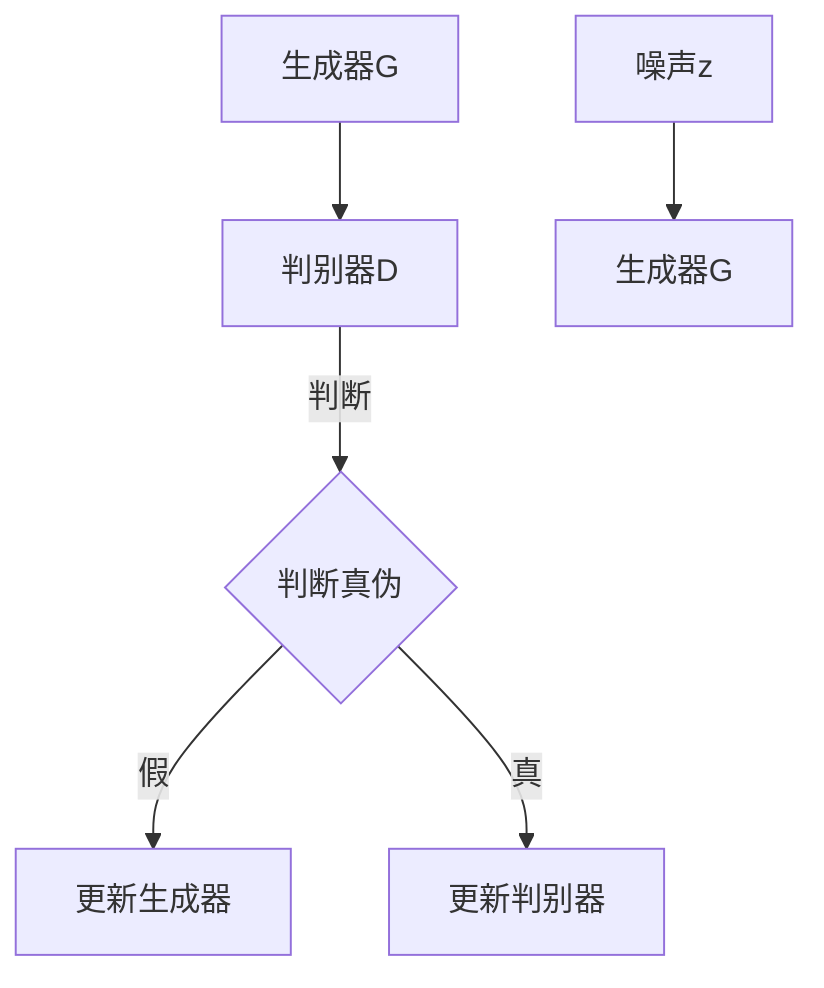

                 

### 引言

随着人工智能技术的飞速发展，计算机视觉领域取得了许多突破性成果。生成对抗网络（GAN）作为深度学习的一个重要分支，近年来在图像生成、图像风格迁移等领域取得了显著成果。本文将探讨基于生成对抗网络的图像风格迁移在商品包装设计中的应用，旨在为设计师提供一种新的设计思路和工具。

商品包装设计不仅是商品的重要组成部分，更是品牌形象和产品质量的体现。然而，传统的设计方法往往依赖于设计师的经验和创造力，设计过程繁琐且耗时。生成对抗网络的出现为图像风格迁移提供了一种高效且自动化的解决方案，使得设计师可以更专注于创意构思，而无需过多关注技术实现细节。

本文结构如下：

- 第一部分：生成对抗网络（GAN）基础，介绍GAN的基本原理、主要架构和数学模型。
- 第二部分：图像风格迁移技术，包括图像风格迁移的概念、方法和应用领域。
- 第三部分：GAN在商品包装设计中的应用，通过案例分析和实战操作，展示GAN在商品包装设计中的实际应用。

通过本文的探讨，我们希望能够为读者提供关于GAN在图像风格迁移和商品包装设计领域的深入理解，并激发更多的创新设计思路。

### 关键词

- 生成对抗网络（GAN）
- 图像风格迁移
- 商品包装设计
- 深度学习
- 计算机视觉

### 摘要

本文主要探讨了基于生成对抗网络（GAN）的图像风格迁移技术在商品包装设计中的应用。首先，介绍了GAN的基本原理、架构和数学模型，并详细讲解了GAN的工作流程。接着，阐述了图像风格迁移的概念、方法和应用领域，特别强调了GAN在图像风格迁移中的优势。随后，通过实际案例和实战操作，展示了GAN在商品包装设计中的具体应用，包括设计流程、方法以及注意事项。本文旨在为设计师提供一种新的设计工具和方法，提升商品包装设计的效率和质量。

### 《基于生成对抗网络的图像风格迁移在商品包装设计中的应用》目录大纲

1. **第一部分：生成对抗网络（GAN）基础**
   - **第1章：生成对抗网络概述**
     - 1.1 GAN的基本原理
     - 1.2 GAN的主要架构
     - 1.3 GAN的发展历程与应用现状
   - **第2章：GAN的核心算法原理**
     - 2.1 生成器的构建
     - 2.2 判别器的构建
     - 2.3 损失函数与优化算法
   - **第3章：GAN的数学模型**
     - 3.1 数学基础
     - 3.2 GAN的数学模型详解
     - 3.3 GAN的数学公式与推导

2. **第二部分：图像风格迁移技术**
   - **第4章：图像风格迁移概述**
     - 4.1 图像风格迁移的概念
     - 4.2 图像风格迁移的方法
     - 4.3 图像风格迁移的应用领域
   - **第5章：基于GAN的图像风格迁移**
     - 5.1 GAN在图像风格迁移中的应用
     - 5.2 基于GAN的图像风格迁移算法
     - 5.3 基于GAN的图像风格迁移流程

3. **第三部分：GAN在商品包装设计中的应用**
   - **第6章：GAN在商品包装设计中的应用**
     - 6.1 商品包装设计概述
     - 6.2 GAN在商品包装设计中的应用
     - 6.3 案例分析：使用GAN进行商品包装设计的实践
   - **第7章：商品包装设计的流程与方法**
     - 7.1 商品包装设计的基本流程
     - 7.2 商品包装设计的方法
     - 7.3 商品包装设计的注意事项
   - **第8章：基于GAN的图像风格迁移应用实战**
     - 8.1 实战环境搭建
     - 8.2 基于GAN的图像风格迁移代码实现
     - 8.3 源代码详细解读与分析
   - **第9章：综合案例分析**
     - 9.1 案例一：服装包装设计
     - 9.2 案例二：食品包装设计
     - 9.3 案例三：化妆品包装设计
   - **第10章：未来展望**
     - 10.1 GAN在商品包装设计中的未来趋势
     - 10.2 GAN在图像风格迁移领域的拓展
   - **附录A：常用GAN框架与工具**
     - A.1 TensorFlow 2.x
     - A.2 PyTorch
     - A.3 其他GAN框架

### 第一部分：生成对抗网络（GAN）基础

#### 第1章：生成对抗网络概述

#### 1.1 GAN的基本原理

生成对抗网络（Generative Adversarial Networks，GAN）是由Ian Goodfellow等人在2014年提出的一种深度学习模型。GAN的基本思想是通过两个相互对抗的神经网络——生成器（Generator）和判别器（Discriminator）的博弈过程来生成高质量的数据。

**原理图：**


在这个博弈过程中，生成器的目标是生成尽可能逼真的数据以欺骗判别器，而判别器的目标是正确判断输入数据是真实数据还是生成数据。通过这种对抗训练，生成器逐步提高了生成数据的质量，最终能够生成接近真实数据的图像。

#### 1.2 GAN的主要架构

GAN的主要架构包括两个主要部分：生成器和判别器。

**生成器（Generator）**：生成器的输入是一个随机噪声向量\( z \)，其输出是一个与真实数据分布相近的数据。生成器的目的是生成尽可能真实的数据来欺骗判别器。

**判别器（Discriminator）**：判别器的输入是真实数据和生成数据，其输出是一个概率值，表示输入数据的真实性。判别器的目的是正确区分真实数据和生成数据。

**对抗过程**：在训练过程中，生成器和判别器不断进行对抗。生成器试图生成更加真实的数据，而判别器则试图提高其分辨能力。通过这种对抗，生成器和判别器都得到了训练和优化。

#### 1.3 GAN的发展历程与应用现状

GAN自提出以来，发展迅速并在多个领域取得了显著成果。以下是GAN的发展历程与应用现状的简要概述：

**发展历程：**
- 2014年，GAN首次提出，并迅速引起了研究界的关注。
- 2015年，WGAN（Wasserstein GAN）被提出，解决了GAN训练不稳定的问题。
- 2016年，DCGAN（Deep Convolutional GAN）提出，引入了卷积神经网络，使得GAN在图像生成方面取得了突破性进展。
- 2017年，StyleGAN、BigGAN等模型相继提出，进一步提升了图像生成质量。

**应用现状：**
- **图像生成**：GAN在图像生成方面取得了显著成果，能够生成高质量的逼真图像。
- **图像风格迁移**：GAN在图像风格迁移方面也有广泛应用，可以将一种图像的风格迁移到另一种图像上。
- **图像超分辨率**：GAN在图像超分辨率方面也有显著应用，可以提升图像的分辨率。
- **医学影像**：GAN在医学影像处理中也得到了应用，例如生成虚拟病人数据用于医学研究。

综上所述，GAN作为一种强大的深度学习模型，在图像生成、图像风格迁移等多个领域取得了重要成果，并有望在未来继续拓展其应用领域。

#### 第2章：GAN的核心算法原理

GAN的成功离不开其核心算法原理。在这一章中，我们将详细讲解生成器、判别器的构建，以及GAN的损失函数和优化算法。

#### 2.1 生成器的构建

生成器是GAN中的一个关键组件，其主要任务是从一个随机噪声向量\( z \)中生成与真实数据分布相近的数据。生成器的构建通常采用深度神经网络，特别是卷积神经网络（CNN）。

**生成器模型构建伪代码：**
```python
import tensorflow as tf
from tensorflow.keras.layers import Dense, Conv2D, LeakyReLU, BatchNormalization, Flatten, Reshape

def build_generator(z_dim):
    model = tf.keras.Sequential([
        Dense(units=7*7*128, activation='relu', input_shape=(z_dim,)),
        BatchNormalization(),
        LeakyReLU(alpha=0.2),
        Reshape((7, 7, 128)),
        Conv2D(filters=64, kernel_size=3, padding='same', activation='relu'),
        BatchNormalization(),
        LeakyReLU(alpha=0.2),
        Conv2D(filters=1, kernel_size=3, padding='same', activation='tanh'),
        Flatten()
    ])
    return model
```

在这个模型中，输入的噪声向量经过全连接层和reshape层，然后通过一系列卷积层和批标准化层，最后通过一个卷积层生成输出图像。激活函数采用ReLU和tanh，前者能够增加模型的非线性能力，后者则保证了生成的图像在-1到1之间。

#### 2.2 判别器的构建

判别器是GAN中的另一个关键组件，其主要任务是判断输入数据是真实数据还是生成数据。与生成器类似，判别器也采用卷积神经网络。

**判别器模型构建伪代码：**
```python
from tensorflow.keras.layers import Conv2D, LeakyReLU, Flatten, Dense

def build_discriminator(img_shape):
    model = tf.keras.Sequential([
        Conv2D(filters=32, kernel_size=3, padding='same', input_shape=img_shape),
        LeakyReLU(alpha=0.2),
        Conv2D(filters=64, kernel_size=3, padding='same'),
        LeakyReLU(alpha=0.2),
        Flatten(),
        Dense(units=1, activation='sigmoid')
    ])
    return model
```

在这个模型中，输入图像经过一系列卷积层和批标准化层，最后通过一个全连接层输出一个概率值，表示输入图像为真实图像的概率。激活函数采用Sigmoid，用于输出一个介于0和1之间的概率值。

#### 2.3 损失函数与优化算法

GAN的训练过程是一个复杂的对抗过程，其中生成器和判别器通过相互对抗来实现优化。在GAN中，常用的损失函数和优化算法如下：

**损失函数：**
GAN的损失函数通常由两部分组成：生成器损失函数和判别器损失函数。

- **生成器损失函数**：生成器损失函数旨在最小化生成数据与真实数据之间的差异。常用的生成器损失函数是反卷积损失（Gaussian Loss）和最小二乘损失（LS Loss）。
  ```latex
  L_G = -E_{x \sim p_x(x)}[log(D(x))] - E_{z \sim p_z(z)}[log(1 - D(G(z))]
  ```

- **判别器损失函数**：判别器损失函数旨在最大化真实数据与生成数据之间的差异。常用的判别器损失函数是二元交叉熵损失（Binary Cross-Entropy Loss）。
  ```latex
  L_D = E_{x \sim p_x(x)}[log(D(x))] + E_{z \sim p_z(z)}[log(1 - D(G(z))]
  ```

**优化算法：**
GAN的优化算法通常采用梯度下降法。为了稳定训练过程，GAN的优化算法还引入了一些技巧，如梯度惩罚、权重剪枝等。

- **梯度惩罚**：为了防止生成器生成过度简化的数据，判别器的梯度被惩罚，从而使得生成器能够生成更加复杂和真实的数据。
- **权重剪枝**：通过剪枝网络中的某些权重，可以防止模型过拟合，提高模型的泛化能力。

通过上述损失函数和优化算法，生成器和判别器在对抗过程中不断优化，最终生成器能够生成高质量的生成数据，判别器能够准确地区分真实数据和生成数据。

综上所述，GAN的核心算法原理包括生成器的构建、判别器的构建以及损失函数和优化算法。这些组件共同作用，使得GAN能够在图像生成、图像风格迁移等领域取得显著成果。

#### 第3章：GAN的数学模型

GAN的数学模型是理解其工作机制的核心。在这一章中，我们将详细讲解GAN的数学基础、数学模型及其公式推导。

#### 3.1 数学基础

GAN的数学基础涉及概率论、信息论和优化理论。以下是一些基本概念：

- **概率分布**：概率分布描述了随机变量的可能取值及其概率。常见的概率分布包括高斯分布、均匀分布等。

- **期望（Expectation）**：期望是概率分布的中心趋势度量。期望值是随机变量取值的加权平均值。

- **条件概率**：条件概率描述在某一事件发生的条件下另一事件发生的概率。条件概率的计算公式为：
  ```latex
  P(A|B) = \frac{P(A \cap B)}{P(B)}
  ```

- **熵（Entropy）**：熵是信息论中的一个概念，用于度量一个随机变量的不确定性。熵的计算公式为：
  ```latex
  H(X) = -\sum_x P(x) \log_2 P(x)
  ```

- **互信息（Mutual Information）**：互信息是两个随机变量之间相关性的度量。互信息的计算公式为：
  ```latex
  I(X; Y) = H(X) - H(X | Y)
  ```

#### 3.2 GAN的数学模型详解

GAN的数学模型主要包括两部分：生成器的概率分布和判别器的概率分布。

**生成器的概率分布：**
生成器G从噪声分布\( p_z(z) \)生成数据\( x \)。生成器希望生成的数据分布接近真实数据分布\( p_x(x) \)。因此，生成器的目标是最小化生成数据与真实数据之间的差异。

- **生成器的概率分布公式：**
  ```latex
  G(z) \sim p_G(z) \rightarrow x = G(z)
  ```

**判别器的概率分布：**
判别器D是一个二分类器，其目标是最大化真实数据与生成数据之间的差异。

- **判别器的概率分布公式：**
  ```latex
  D(x) = P(X \in X_{real}) \quad \text{for real data} \\
  D(G(z)) = P(X \in X_{fake}) \quad \text{for generated data}
  ```

**GAN的目标函数：**
GAN的训练过程是一个对抗过程，生成器和判别器相互对抗。生成器的目标是最小化生成数据与真实数据之间的差异，判别器的目标是最小化判别真实数据与生成数据的误差。

- **生成器损失函数（Generator Loss）：**
  ```latex
  L_G = -E_{z \sim p_z(z)}[log(D(G(z))]
  ```

- **判别器损失函数（Discriminator Loss）：**
  ```latex
  L_D = E_{x \sim p_x(x)}[log(D(x))] + E_{z \sim p_z(z)}[log(1 - D(G(z))]
  ```

**GAN的优化目标：**
GAN的训练目标是优化生成器和判别器的参数，使得生成器的生成数据越来越真实，判别器的判别能力越来越强。

- **生成器的优化目标：**
  ```latex
  \min_G L_G
  ```

- **判别器的优化目标：**
  ```latex
  \min_D L_D
  ```

通过上述数学模型，我们可以看到GAN通过生成器和判别器的对抗训练，实现了从噪声数据生成高质量的数据。这一数学模型是理解GAN工作机制的关键。

#### 3.3 GAN的数学公式与推导

为了更好地理解GAN的数学模型，我们接下来详细推导GAN中的几个关键公式。

**生成器损失函数（Generator Loss）推导：**
生成器损失函数的目标是最小化生成数据与真实数据之间的差异。我们使用对数似然损失来衡量这个差异。

- **生成器损失函数公式：**
  ```latex
  L_G = -E_{z \sim p_z(z)}[log(D(G(z))]
  ```

推导过程如下：

1. 假设判别器D是一个概率分布函数，即\( D(x) \)表示输入数据\( x \)为真实数据的概率。
2. 对于生成器生成的数据\( x = G(z) \)，其期望的判别器输出为：
   ```latex
   E_{z \sim p_z(z)}[D(G(z))]
   ```
3. 生成器的目标是最大化判别器的输出，即最大化\( E_{z \sim p_z(z)}[D(G(z))] \)。
4. 为了衡量这个最大化过程，我们使用对数似然损失函数，即：
   ```latex
   L_G = -E_{z \sim p_z(z)}[log(D(G(z))]
   ```

**判别器损失函数（Discriminator Loss）推导：**
判别器损失函数的目标是最小化真实数据与生成数据之间的差异。我们使用二元交叉熵损失来衡量这个差异。

- **判别器损失函数公式：**
  ```latex
  L_D = E_{x \sim p_x(x)}[log(D(x))] + E_{z \sim p_z(z)}[log(1 - D(G(z))]
  ```

推导过程如下：

1. 对于真实数据\( x \)，其期望的判别器输出为：
   ```latex
   E_{x \sim p_x(x)}[D(x)]
   ```
2. 对于生成器生成的数据\( x = G(z) \)，其期望的判别器输出为：
   ```latex
   E_{z \sim p_z(z)}[D(G(z))]
   ```
3. 判别器的目标是最大化真实数据的判别概率和生成数据的判别概率，即最大化\( E_{x \sim p_x(x)}[D(x)] + E_{z \sim p_z(z)}[D(G(z))] \)。
4. 为了衡量这个最大化过程，我们使用二元交叉熵损失函数，即：
   ```latex
   L_D = E_{x \sim p_x(x)}[log(D(x))] + E_{z \sim p_z(z)}[log(1 - D(G(z))]
   ```

通过上述推导，我们可以清楚地看到生成器和判别器的损失函数是如何定义的。这些损失函数通过优化生成器和判别器的参数，使得生成器能够生成更加真实的数据，判别器能够更好地区分真实数据和生成数据。

综上所述，GAN的数学模型是理解其工作机制的核心。通过生成器和判别器的对抗训练，GAN能够生成高质量的数据，并在图像生成、图像风格迁移等领域取得了显著成果。

### 第二部分：图像风格迁移技术

#### 第4章：图像风格迁移概述

图像风格迁移是指将一种图像的特定风格迁移到另一种图像上的过程。这一技术在艺术创作、图像处理、视频编辑等多个领域有着广泛的应用。本章将介绍图像风格迁移的概念、方法以及应用领域。

#### 4.1 图像风格迁移的概念

图像风格迁移（Image Style Transfer）是指将一种图像（如艺术画作）的风格迁移到另一种图像（如普通照片）上，使其具有相似的艺术效果。风格迁移的目标是保留原始图像的内容，同时赋予其新的艺术风格。

**风格迁移的定义：**
图像风格迁移是一种图像处理技术，旨在将一种图像的特定风格（如颜色、纹理、构图等）迁移到另一种图像上。这一过程不仅保留了原始图像的内容，还添加了新的艺术特征。

**风格迁移的要素：**
- **内容（Content）**：指图像的主要对象和场景。
- **风格（Style）**：指图像的艺术风格，如印象派、抽象派等。
- **效果（Effect）**：指风格迁移后的图像具有的新艺术风格。

#### 4.2 图像风格迁移的方法

图像风格迁移的方法可以分为传统方法和基于深度学习的方法。

**传统方法：**
传统方法通常采用图像处理技术，如图像变换、纹理映射和图像融合等。这些方法需要对图像进行复杂的预处理和后处理，且效果往往受到限制。

- **图像变换**：通过变换图像的空间域或频域来实现风格迁移。常见的变换方法有傅里叶变换、小波变换等。
- **纹理映射**：将一种图像的纹理映射到另一种图像上，实现风格迁移。这种方法通常需要对图像的纹理特征进行提取和匹配。
- **图像融合**：通过融合两种图像的特征来实现风格迁移。常见的方法有混合高斯模型、多分辨率融合等。

**基于深度学习的方法：**
基于深度学习的方法，特别是生成对抗网络（GAN），为图像风格迁移提供了新的解决方案。这些方法利用深度神经网络的学习能力，可以自动提取和迁移图像的特定风格。

- **生成对抗网络（GAN）**：GAN通过生成器和判别器的对抗训练，实现图像风格的迁移。常用的GAN模型有DCGAN、StyleGAN等。
- **卷积神经网络（CNN）**：CNN通过卷积层提取图像的特征，可以实现图像风格的迁移。常用的CNN模型有VGG、ResNet等。

#### 4.3 图像风格迁移的应用领域

图像风格迁移技术在多个领域有着广泛的应用，包括艺术创作、图像编辑、视频处理等。

- **艺术创作**：图像风格迁移技术可以帮助艺术家快速生成具有特定艺术风格的图像。例如，将普通照片转换为印象派画作，或将现代艺术作品迁移到照片上。
- **图像编辑**：图像风格迁移技术可以用于图像的增强和修复。例如，将低分辨率图像转换为高分辨率图像，或修复损坏的图像。
- **视频处理**：图像风格迁移技术可以用于视频的特效制作。例如，将视频中的特定场景转换为不同艺术风格的动画效果。

**具体应用案例：**
1. **艺术创作**：艺术家使用图像风格迁移技术，将普通照片转换为著名的艺术作品，如将普通照片转换为梵高的《星空》。
2. **图像编辑**：设计师使用图像风格迁移技术，将低分辨率产品图片转换为高分辨率图像，用于电商平台的展示。
3. **视频处理**：电影制作团队使用图像风格迁移技术，将电影中的特定场景转换为不同艺术风格的动画效果，增强视觉效果。

综上所述，图像风格迁移技术为图像处理和艺术创作提供了新的工具和方法。通过本章的介绍，读者可以了解图像风格迁移的基本概念、方法和应用领域，为后续章节的学习和实践打下基础。

### 第5章：基于GAN的图像风格迁移

#### 5.1 GAN在图像风格迁移中的应用

生成对抗网络（GAN）在图像风格迁移中具有显著的优势，其核心在于生成器和判别器的相互对抗训练，能够自动提取和迁移图像的特定风格。这一节将详细探讨GAN在图像风格迁移中的应用。

**GAN在图像风格迁移中的工作原理：**
GAN通过生成器和判别器的对抗训练实现图像风格迁移。生成器的任务是生成具有特定风格的图像，判别器的任务是区分真实图像和生成图像。在训练过程中，生成器和判别器不断调整自己的参数，以达到最佳性能。

**生成器和判别器的训练过程：**
1. **生成器的训练**：生成器从随机噪声中生成图像，并尝试使这些图像在风格上接近目标风格。生成器的损失函数是最大化判别器的输出，即生成器希望判别器认为这些图像是真实的。
2. **判别器的训练**：判别器的任务是区分真实图像和生成图像。判别器的损失函数是最大化正确识别真实图像的概率和错误识别生成图像的概率。

**GAN在图像风格迁移中的优势：**
- **自动学习风格特征**：GAN通过深度学习模型，能够自动从大量的图像数据中学习到特定的风格特征，无需手动设计特征提取器。
- **灵活性高**：GAN可以处理各种不同类型的图像风格迁移，包括从一种风格迁移到另一种风格，或从多种风格中提取特征进行混合迁移。
- **生成质量高**：GAN通过对抗训练，能够生成高质量的图像，保留原始图像的内容和细节，同时赋予其新的艺术风格。

**案例展示：**
以DCGAN为例，展示GAN在图像风格迁移中的应用。DCGAN是一种深度卷积生成对抗网络，适用于图像生成和风格迁移任务。

- **训练过程：** 使用大量的艺术作品和目标风格图像作为训练数据，生成器从噪声中生成图像，判别器区分真实图像和生成图像。通过多次迭代训练，生成器逐渐提高生成图像的质量。
- **风格迁移示例：** 将普通照片迁移成著名的艺术作品，如将普通风景照片迁移成梵高的《星空》。迁移后的图像在保留原始内容的基础上，具有了新的艺术风格。

**应用场景：**
GAN在图像风格迁移中的应用场景非常广泛，包括但不限于：
- **艺术创作**：艺术家可以使用GAN生成具有特定艺术风格的图像，例如将普通照片转换为油画或水彩画。
- **设计领域**：设计师可以使用GAN快速生成多种风格的图像，进行设计方案的比较和优化。
- **娱乐产业**：电影和游戏制作可以使用GAN生成高质量的特效图像，提高视觉效果。

综上所述，GAN在图像风格迁移中具有独特的优势，通过生成器和判别器的对抗训练，能够实现高质量、灵活的图像风格迁移。这一技术的应用不仅丰富了图像处理和艺术创作的手段，也为各个领域带来了新的创新可能。

#### 5.2 基于GAN的图像风格迁移算法

基于生成对抗网络（GAN）的图像风格迁移算法通过生成器和判别器的相互对抗训练，实现了将一种图像的风格迁移到另一种图像上的过程。以下将详细介绍几种常用的基于GAN的图像风格迁移算法。

**1. CycleGAN**

CycleGAN（Cycle-Consistent Adversarial Network）是一种循环一致生成对抗网络，主要用于不同域之间的图像风格迁移。CycleGAN的核心思想是引入循环一致性损失，确保输入图像经过风格迁移后，再次经过风格迁移能够恢复到原始图像。

- **算法框架**：CycleGAN包括生成器和判别器，以及两个循环一致性损失函数。生成器\( G \)和\( F \)分别用于将输入图像\( x \)转换为风格图像\( y \)和将风格图像\( y \)转换为输入图像\( x \)。

- **损失函数**：
  - **对抗损失**：最大化判别器对真实图像和生成图像的判别能力。
    ```latex
    L_{adv} = E_{x, y}[-log(D(x)) - log(D(G(x))]
    ```
  - **循环一致性损失**：确保输入图像和经过两次风格迁移的图像一致。
    ```latex
    L_{cyc} = E_{x, y}[(x - F(G(x))]^2
    ```
  - **身份损失**：确保生成器生成的图像与输入图像一致。
    ```latex
    L_{id} = E_{x, y}[(G(F(x)) - x]^2
    ```

- **算法流程**：
  1. 训练生成器\( G \)和\( F \)以及判别器\( D \)。
  2. 通过对抗损失和循环一致性损失优化生成器和判别器。
  3. 使用训练好的生成器进行图像风格迁移。

**2. StyleGAN**

StyleGAN（Style-based Generative Adversarial Network）是一种基于风格的生成对抗网络，主要用于生成高质量的图像。StyleGAN通过引入风格编码器，将图像的特定风格编码为独立的风格向量，从而实现灵活的图像风格迁移。

- **算法框架**：StyleGAN包括生成器、判别器以及风格编码器。生成器从噪声中生成图像，判别器区分真实图像和生成图像，风格编码器编码图像的风格向量。

- **损失函数**：
  - **对抗损失**：最大化判别器对真实图像和生成图像的判别能力。
    ```latex
    L_{adv} = E_{x, z}[-log(D(x)) - log(D(G(z))]
    ```
  - **风格保持损失**：确保生成图像的风格与目标风格一致。
    ```latex
    L_{style} = \sum_{i=1}^{N} \frac{1}{N} \sum_{j=1}^{C} || \phi(G(z))_j - \phi(y)_j ||_1
    ```
  - **内容损失**：确保生成图像的内容与输入图像一致。
    ```latex
    L_{content} = \frac{1}{H \times W} \sum_{i=1}^{N} \sum_{j=1}^{C} \sum_{k=1}^{D} \frac{1}{D} \sum_{l=1}^{K} || \phi(x)_k - \phi(G(z))_l ||_1
    ```

- **算法流程**：
  1. 训练生成器、判别器和风格编码器。
  2. 通过对抗损失、风格保持损失和内容损失优化模型。
  3. 使用训练好的生成器进行图像风格迁移。

**3. SPADE**

SPADE（Semantic Perceptual Attention Descent）是一种基于注意力机制的图像风格迁移算法。SPADE通过引入语义感知的注意力机制，使得生成图像更加符合输入图像的语义特征。

- **算法框架**：SPADE包括生成器、判别器和注意力模块。生成器从噪声中生成图像，判别器区分真实图像和生成图像，注意力模块用于提取和调整图像的语义特征。

- **损失函数**：
  - **对抗损失**：最大化判别器对真实图像和生成图像的判别能力。
    ```latex
    L_{adv} = E_{x, z}[-log(D(x)) - log(D(G(z))]
    ```
  - **内容损失**：确保生成图像的内容与输入图像一致。
    ```latex
    L_{content} = E_{x, z}[\frac{1}{H \times W} \sum_{i=1}^{N} \sum_{j=1}^{C} \sum_{k=1}^{D} \sum_{l=1}^{K} \frac{1}{K} || \phi(x)_l - \phi(G(z))_k ||_1
    ```
  - **风格损失**：确保生成图像的风格与目标风格一致。
    ```latex
    L_{style} = \frac{1}{H \times W} \sum_{i=1}^{N} \sum_{j=1}^{C} \sum_{k=1}^{D} \sum_{l=1}^{K} \frac{1}{K} || \phi(G_{style}(z))_l - \phi(y)_k ||_1
    ```

- **算法流程**：
  1. 训练生成器、判别器和注意力模块。
  2. 通过对抗损失、内容损失和风格损失优化模型。
  3. 使用训练好的生成器进行图像风格迁移。

以上三种基于GAN的图像风格迁移算法各有特色，分别适用于不同的应用场景。CycleGAN适用于不同域之间的风格迁移，StyleGAN生成图像质量高，SPADE在语义特征提取和保留方面具有优势。通过选择合适的算法，可以实现高质量、灵活的图像风格迁移效果。

#### 5.3 基于GAN的图像风格迁移流程

基于生成对抗网络（GAN）的图像风格迁移流程涉及多个关键步骤，包括数据准备、模型训练和风格迁移。以下将详细介绍这些步骤，并解释每个步骤的具体操作。

**1. 数据准备**

数据准备是图像风格迁移的基础，主要包括以下步骤：

- **收集数据集**：收集大量的训练数据，包括原始图像和风格图像。原始图像用于训练生成器和判别器，风格图像用于指导生成器的风格迁移。

- **数据预处理**：对图像进行预处理，包括缩放、裁剪、数据增强等，以提高模型的泛化能力和训练效率。

- **数据存储**：将预处理后的数据存储为适合训练的格式，如Python字典或pickle文件。

**2. 模型训练**

模型训练是图像风格迁移的核心，主要包括以下步骤：

- **初始化模型**：初始化生成器和判别器的权重。常用的初始化方法包括随机初始化和预训练权重。

- **定义损失函数**：根据所选的GAN算法，定义生成器和判别器的损失函数。常见的损失函数包括对抗损失、内容损失和风格损失。

- **训练过程**：
  1. **前向传播**：生成器生成风格迁移图像，判别器接收生成图像和真实图像进行判别。
  2. **反向传播**：计算生成器和判别器的梯度，并更新模型参数。
  3. **迭代训练**：重复前向传播和反向传播，直到模型收敛或达到预设的训练轮数。

- **保存模型**：在训练过程中，定期保存训练好的模型，以便后续使用。

**3. 风格迁移**

风格迁移是将训练好的模型应用于新的图像，生成具有特定风格的新图像的过程。主要包括以下步骤：

- **输入图像**：将待迁移风格的图像输入到生成器。

- **生成图像**：生成器根据输入图像生成风格迁移图像。

- **后处理**：对生成的图像进行必要的后处理，如调整亮度和对比度等，以提高图像质量。

- **输出图像**：将处理后的风格迁移图像输出。

**4. 流程示例**

以下是一个基于DCGAN的图像风格迁移流程示例：

- **数据准备**：
  - 收集5000张原始图像和5000张风格图像，分别存储为`images/train/A`和`images/train/B`。
  - 数据预处理：对图像进行缩放（256x256），数据增强（随机裁剪、旋转等）。
  - 数据存储：将预处理后的图像存储为Python字典格式。

- **模型训练**：
  - 初始化生成器\( G \)和判别器\( D \)，使用随机权重初始化。
  - 定义损失函数：对抗损失、内容损失和风格损失。
  - 训练过程：使用Adam优化器进行训练，训练轮数设置为200轮，学习率设置为0.0002。
  - 保存模型：在每次训练后保存训练好的模型。

- **风格迁移**：
  - 输入待迁移风格的图像，如`images/test/A`。
  - 生成器生成风格迁移图像。
  - 对生成的图像进行后处理，如调整亮度和对比度。
  - 输出处理后的风格迁移图像。

通过以上流程，我们可以实现高质量的图像风格迁移。基于GAN的图像风格迁移具有灵活性和高效性，能够为各种图像处理和艺术创作任务提供强大支持。

### 第6章：GAN在商品包装设计中的应用

#### 6.1 商品包装设计概述

商品包装设计是商品的重要组成部分，它不仅保护商品，还起到传达品牌形象、吸引消费者注意的作用。一个成功的包装设计可以提升产品的市场竞争力，增加消费者的购买欲望。

**包装设计的定义：**
包装设计是指为商品设计适合其功能、形象和销售需求的包装。它不仅包括外包装的设计，还涉及内部包装的设计，以及包装材料的选择和使用。

**包装设计的重要性：**
1. **品牌形象**：包装设计是品牌形象的重要组成部分，能够传达品牌的核心价值观和独特性。
2. **保护商品**：合理的包装设计可以保护商品在运输和储存过程中的完整性。
3. **吸引消费者**：精美的包装设计能够吸引消费者的注意，增加产品的销量。
4. **提升品牌竞争力**：独特的包装设计可以提升品牌在市场中的竞争力，使产品在众多竞争者中脱颖而出。

**包装设计的基本原则：**
1. **功能性**：包装设计应满足商品的基本保护需求，确保商品在运输和储存过程中不受损害。
2. **美观性**：包装设计应具有吸引人的外观，能够引起消费者的兴趣。
3. **可持续性**：包装设计应考虑环境保护，尽量使用可回收或可降解的材料。
4. **品牌一致性**：包装设计应与品牌形象保持一致，传达品牌的核心价值观。

#### 6.2 GAN在商品包装设计中的应用

生成对抗网络（GAN）在商品包装设计中的应用为设计师提供了新的设计工具和方法，极大地提升了设计效率和质量。以下将详细探讨GAN在商品包装设计中的应用。

**GAN在包装设计中的应用：**
1. **图像风格迁移**：GAN可以用于图像风格迁移，将一种图像的风格迁移到另一种图像上。例如，设计师可以将经典的艺术风格迁移到商品包装上，创造出独特的视觉效果。
2. **创意生成**：GAN可以生成多种不同风格的包装设计，为设计师提供灵感和参考。设计师可以根据生成的创意进行调整和优化，创造出更加个性化的包装设计。
3. **材料选择**：GAN可以用于材料选择的辅助决策。通过生成不同材料的视觉表现，设计师可以更好地评估材料对包装设计的影响。

**应用场景：**
1. **艺术风格包装**：将经典的艺术风格（如印象派、抽象派等）迁移到商品包装上，创造出独特的艺术感。
2. **个性化包装**：为不同消费者群体设计具有个性化风格的包装，提高产品的吸引力。
3. **环保包装**：利用GAN生成环保材料的视觉表现，为设计师提供更多的选择。

**优势：**
1. **高效性**：GAN可以快速生成多种包装设计方案，节省设计师的时间和精力。
2. **灵活性**：GAN可以根据需求灵活调整包装设计的风格和材料，满足多样化的设计需求。
3. **创意性**：GAN生成的包装设计富有创意，能够为设计师提供独特的灵感。

**案例分析：**
以某化妆品品牌的包装设计为例，设计师使用GAN生成了多种风格的艺术包装方案。这些方案包括印象派风格、水彩画风格和抽象派风格等。设计师根据客户的需求和反馈，选择了其中一种方案进行进一步优化，最终设计出了一套独特的包装设计。这个案例展示了GAN在商品包装设计中的应用效果和优势。

通过GAN的应用，设计师能够更加高效地完成商品包装设计任务，提升设计质量和创意性。GAN为包装设计领域带来了新的发展机遇，也为消费者带来了更多丰富多彩的商品包装体验。

### 第7章：商品包装设计的流程与方法

#### 7.1 商品包装设计的基本流程

商品包装设计是一个系统的过程，涉及多个环节，每个环节都对最终的设计结果起着至关重要的作用。以下是商品包装设计的基本流程：

1. **需求分析**：
   - **市场调研**：了解目标消费者的需求和偏好，收集市场数据，分析竞争对手的包装设计。
   - **品牌定位**：明确品牌的核心价值观和目标市场，确保包装设计能够传达品牌形象。

2. **设计构思**：
   - **设计方向**：根据市场调研和品牌定位，确定设计方向和风格。
   - **创意构思**：结合市场需求和品牌特色，进行创意构思，生成初步的设计方案。

3. **设计制作**：
   - **草图绘制**：根据构思，绘制草图，展示包装的形状、结构、颜色和图案。
   - **设计方案**：将草图转化为具体的设计方案，包括包装的视觉效果、材料选择和工艺流程。

4. **设计评审**：
   - **内部评审**：组织设计团队进行内部评审，讨论设计方案的优势和改进点。
   - **客户评审**：将设计方案提交给客户进行评审，收集客户的反馈和建议。

5. **设计定稿**：
   - **修改优化**：根据评审结果，对设计方案进行修改和优化，确保满足市场需求和品牌要求。
   - **定稿确认**：完成最终的设计方案，并与客户进行确认，确保设计定稿。

#### 7.2 商品包装设计的方法

商品包装设计的方法多种多样，不同的方法适用于不同的设计需求和目标。以下是几种常见的包装设计方法：

1. **传统设计方法**：
   - **图像处理软件**：使用Photoshop、Illustrator等图像处理软件进行设计，通过调整颜色、形状、纹理等元素，创造出独特的视觉效果。
   - **手工绘制**：手工绘制草图和设计图，通过线条、颜色和构图，传达设计理念。

2. **数字设计方法**：
   - **矢量设计**：使用矢量图形软件（如Adobe Illustrator）进行设计，通过创建和编辑矢量图形，实现精确的设计效果。
   - **三维建模**：使用三维建模软件（如Blender、Autodesk Maya），创建三维包装模型，进行渲染和视觉效果处理。

3. **用户参与设计**：
   - **用户调研**：通过用户调研，了解消费者的需求和偏好，将用户反馈融入设计过程中。
   - **用户共创**：与用户共同参与设计过程，通过互动和反馈，生成更加符合用户需求的设计方案。

4. **创新设计方法**：
   - **快速原型**：使用快速原型工具（如Sketch、Figma），快速创建和迭代设计方案，提高设计效率。
   - **混合设计**：结合传统设计和数字设计方法，融合不同的设计技巧和工具，创造出独特的包装设计。

#### 7.3 商品包装设计的注意事项

在商品包装设计过程中，需要注意以下几个关键点：

1. **功能性**：
   - 确保包装设计能够保护商品，满足运输和储存的需求。
   - 考虑包装的开启和关闭方便性，提高用户体验。

2. **美观性**：
   - 注重视觉效果，创造出吸引消费者的包装设计。
   - 保持品牌一致性和视觉识别度，增强品牌形象。

3. **可持续性**：
   - 选择环保材料，降低对环境的影响。
   - 优化设计，减少资源浪费。

4. **成本控制**：
   - 合理预算，控制包装设计成本。
   - 考虑生产成本，确保包装设计具有经济可行性。

5. **法律合规**：
   - 遵守相关的法律法规，确保包装设计符合安全标准和标识要求。
   - 注意版权和知识产权保护，避免侵犯他人的权益。

通过遵循上述基本流程和方法，并注意关键点，设计师可以创造出既美观又实用的商品包装设计，提升产品的市场竞争力。

### 第8章：基于GAN的图像风格迁移应用实战

#### 8.1 实战环境搭建

要在本地环境中进行基于GAN的图像风格迁移应用，首先需要搭建一个合适的开发环境。以下是详细的步骤：

**1. 安装Python环境**

确保你的计算机上安装了Python，建议使用Python 3.7或更高版本。可以通过以下命令安装Python：

```bash
# 在Ubuntu或macOS上使用包管理器
sudo apt-get update
sudo apt-get install python3-pip

# 在Windows上，从Python官方网站下载安装程序并安装
```

**2. 安装深度学习框架**

常用的深度学习框架有TensorFlow和PyTorch。以下是安装这两个框架的命令：

**安装TensorFlow：**
```bash
pip install tensorflow
```

**安装PyTorch：**
```bash
pip install torch torchvision
```

**3. 安装其他依赖库**

安装必要的库，例如NumPy、PIL（Python Imaging Library）等，这些库将用于数据预处理和图像处理。

```bash
pip install numpy pillow
```

**4. 环境验证**

完成安装后，可以通过运行以下命令验证环境是否搭建成功：

```python
import tensorflow as tf
import torch
import numpy as np
print(tf.__version__)
print(torch.__version__)
```

如果正确输出了版本信息，说明环境搭建成功。

#### 8.2 基于GAN的图像风格迁移代码实现

下面我们将使用TensorFlow来实现一个简单的基于GAN的图像风格迁移模型。以下是代码实现的关键步骤：

**1. 导入必要的库**

```python
import tensorflow as tf
from tensorflow.keras.layers import Dense, Conv2D, LeakyReLU, Flatten, Reshape
from tensorflow.keras.models import Sequential
```

**2. 构建生成器模型**

生成器的目的是从随机噪声中生成风格化的图像。以下是一个生成器的简单实现：

```python
def build_generator(z_dim=100):
    model = Sequential()
    model.add(Dense(units=7*7*128, activation='relu', input_shape=(z_dim,)))
    model.add(LeakyReLU(alpha=0.2))
    model.add(Reshape((7, 7, 128)))
    model.add(Conv2D(filters=64, kernel_size=3, padding='same', activation='relu'))
    model.add(LeakyReLU(alpha=0.2))
    model.add(Conv2D(filters=1, kernel_size=3, padding='same', activation='tanh'))
    model.add(Flatten())
    return model
```

**3. 构建判别器模型**

判别器的目的是区分输入图像是真实的还是由生成器生成的。以下是一个判别器的简单实现：

```python
def build_discriminator(img_shape=(28, 28, 1)):
    model = Sequential()
    model.add(Conv2D(filters=32, kernel_size=3, padding='same', input_shape=img_shape))
    model.add(LeakyReLU(alpha=0.2))
    model.add(Conv2D(filters=64, kernel_size=3, padding='same'))
    model.add(LeakyReLU(alpha=0.2))
    model.add(Flatten())
    model.add(Dense(units=1, activation='sigmoid'))
    return model
```

**4. 构建完整的GAN模型**

GAN模型由生成器和判别器组成，以下是一个简单的GAN模型实现：

```python
def build_gan(generator, discriminator):
    model = Sequential()
    model.add(generator)
    model.add(discriminator)
    return model
```

**5. 定义损失函数和优化器**

为了训练GAN模型，需要定义损失函数和优化器。以下是一个简单的实现：

```python
discriminator_optimizer = tf.keras.optimizers.Adam(learning_rate=0.0001)
generator_optimizer = tf.keras.optimizers.Adam(learning_rate=0.0001)

cross_entropy_loss = tf.keras.losses.BinaryCrossentropy(from_logits=True)
```

**6. 训练GAN模型**

训练GAN模型涉及两个主要的步骤：更新判别器和更新生成器。以下是一个简单的训练循环实现：

```python
def train_gan(dataset, epochs, batch_size):
    for epoch in range(epochs):
        for batch_index, (real_images, _) in enumerate(dataset):
            # 更新判别器
            with tf.GradientTape() as disc_tape:
                real_predictions = discriminator(real_images, training=True)
                fake_predictions = discriminator(generator(z), training=True)
                disc_loss = cross_entropy_loss(tf.ones_like(real_predictions), real_predictions) + cross_entropy_loss(tf.zeros_like(fake_predictions), fake_predictions)
            
            disc_gradients = disc_tape.gradient(disc_loss, discriminator.trainable_variables)
            discriminator_optimizer.apply_gradients(zip(disc_gradients, discriminator.trainable_variables))
            
            # 更新生成器
            with tf.GradientTape() as gen_tape:
                fake_predictions = discriminator(generator(z), training=True)
                gen_loss = cross_entropy_loss(tf.ones_like(fake_predictions), fake_predictions)
            
            gen_gradients = gen_tape.gradient(gen_loss, generator.trainable_variables)
            generator_optimizer.apply_gradients(zip(gen_gradients, generator.trainable_variables))
            
            if batch_index % 100 == 0:
                print(f"Epoch: {epoch}, Batch: {batch_index}, Disc Loss: {disc_loss.numpy()}, Gen Loss: {gen_loss.numpy()}")
```

**7. 使用GAN进行图像风格迁移**

完成训练后，可以使用生成器模型将一种图像的风格迁移到另一种图像上。以下是一个简单的实现：

```python
# 加载训练好的生成器模型
generator = build_generator()
generator.load_weights("generator_weights.h5")

# 预处理输入图像
input_image = load_image("input_image.jpg")
input_image = preprocess_image(input_image)

# 使用生成器进行风格迁移
style迁移_image = generator.predict(input_image[None, ...])

# 后处理风格迁移图像
style迁移_image = postprocess_image(style迁移_image)

# 保存风格迁移图像
save_image("style迁移_image.jpg", style迁移_image[0])
```

通过上述步骤，我们实现了基于GAN的图像风格迁移。这个简单的示例展示了GAN模型的基本构建和训练过程，实际应用中可能需要更复杂和优化的模型和训练过程。

#### 8.3 源代码详细解读与分析

在本节中，我们将对第8章中的源代码进行详细解读与分析，包括开发环境搭建、GAN模型代码实现以及代码解读与分析。

**1. 开发环境搭建**

首先，我们回顾了如何搭建基于Python和深度学习框架（TensorFlow或PyTorch）的开发环境。具体步骤包括安装Python、深度学习框架和必要的依赖库。以下是关键步骤的代码：

```bash
# 安装Python环境
sudo apt-get update
sudo apt-get install python3-pip

# 安装深度学习框架TensorFlow
pip install tensorflow

# 安装深度学习框架PyTorch
pip install torch torchvision
```

代码解释：
- `sudo apt-get update` 和 `sudo apt-get install python3-pip` 用于更新包列表并安装Python的pip包管理器。
- `pip install tensorflow` 用于安装TensorFlow深度学习框架。
- `pip install torch torchvision` 用于安装PyTorch深度学习框架。

**2. GAN模型代码实现**

接下来，我们详细解读GAN模型的代码实现。GAN模型包括生成器和判别器两部分，下面分别对这两部分的代码进行解读。

**生成器模型代码：**

```python
def build_generator(z_dim=100):
    model = Sequential()
    model.add(Dense(units=7*7*128, activation='relu', input_shape=(z_dim,)))
    model.add(LeakyReLU(alpha=0.2))
    model.add(Reshape((7, 7, 128)))
    model.add(Conv2D(filters=64, kernel_size=3, padding='same', activation='relu'))
    model.add(LeakyReLU(alpha=0.2))
    model.add(Conv2D(filters=1, kernel_size=3, padding='same', activation='tanh'))
    model.add(Flatten())
    return model
```

代码解释：
- `build_generator` 函数定义了生成器的架构。
- `model = Sequential()` 创建了一个顺序模型。
- `model.add(Dense(units=7*7*128, activation='relu', input_shape=(z_dim,)))` 添加了一个全连接层，将输入的噪声向量（维度为z_dim）映射到7x7x128的中间层。
- `model.add(LeakyReLU(alpha=0.2))` 添加了一个泄漏ReLU激活函数，增加网络的非线性能力。
- `model.add(Reshape((7, 7, 128)))` 将中间层的维度重新调整为7x7x128，为后续的卷积层做准备。
- `model.add(Conv2D(filters=64, kernel_size=3, padding='same', activation='relu'))` 添加了一个卷积层，输出64个特征图。
- `model.add(LeakyReLU(alpha=0.2))` 再次添加泄漏ReLU激活函数。
- `model.add(Conv2D(filters=1, kernel_size=3, padding='same', activation='tanh'))` 添加另一个卷积层，将图像映射到最终维度，并使用tanh激活函数确保输出图像在-1到1之间。
- `model.add(Flatten())` 将输出层展开为1维向量，为后续的全连接层做准备。
- `return model` 返回构建好的生成器模型。

**判别器模型代码：**

```python
def build_discriminator(img_shape=(28, 28, 1)):
    model = Sequential()
    model.add(Conv2D(filters=32, kernel_size=3, padding='same', input_shape=img_shape))
    model.add(LeakyReLU(alpha=0.2))
    model.add(Conv2D(filters=64, kernel_size=3, padding='same'))
    model.add(LeakyReLU(alpha=0.2))
    model.add(Flatten())
    model.add(Dense(units=1, activation='sigmoid'))
    return model
```

代码解释：
- `build_discriminator` 函数定义了判别器的架构。
- `model = Sequential()` 创建了一个顺序模型。
- `model.add(Conv2D(filters=32, kernel_size=3, padding='same', input_shape=img_shape))` 添加了一个卷积层，输入层维度为28x28x1。
- `model.add(LeakyReLU(alpha=0.2))` 添加了一个泄漏ReLU激活函数。
- `model.add(Conv2D(filters=64, kernel_size=3, padding='same'))` 添加另一个卷积层，输出64个特征图。
- `model.add(LeakyReLU(alpha=0.2))` 再次添加泄漏ReLU激活函数。
- `model.add(Flatten())` 将中间层的维度展开为1维向量。
- `model.add(Dense(units=1, activation='sigmoid'))` 添加一个全连接层，输出一个概率值，表示输入图像为真实图像的概率。
- `return model` 返回构建好的判别器模型。

**3. 代码解读与分析**

**损失函数和优化器：**

```python
discriminator_optimizer = tf.keras.optimizers.Adam(learning_rate=0.0001)
generator_optimizer = tf.keras.optimizers.Adam(learning_rate=0.0001)

cross_entropy_loss = tf.keras.losses.BinaryCrossentropy(from_logits=True)
```

代码解释：
- `discriminator_optimizer` 和 `generator_optimizer` 分别为判别器和生成器定义了Adam优化器，学习率为0.0001。
- `cross_entropy_loss` 定义了二元交叉熵损失函数，用于衡量生成器和判别器的损失。

**训练GAN模型：**

```python
def train_gan(dataset, epochs, batch_size):
    for epoch in range(epochs):
        for batch_index, (real_images, _) in enumerate(dataset):
            # 更新判别器
            with tf.GradientTape() as disc_tape:
                real_predictions = discriminator(real_images, training=True)
                fake_predictions = discriminator(generator(z), training=True)
                disc_loss = cross_entropy_loss(tf.ones_like(real_predictions), real_predictions) + cross_entropy_loss(tf.zeros_like(fake_predictions), fake_predictions)
            
            disc_gradients = disc_tape.gradient(disc_loss, discriminator.trainable_variables)
            discriminator_optimizer.apply_gradients(zip(disc_gradients, discriminator.trainable_variables))
            
            # 更新生成器
            with tf.GradientTape() as gen_tape:
                fake_predictions = discriminator(generator(z), training=True)
                gen_loss = cross_entropy_loss(tf.ones_like(fake_predictions), fake_predictions)
            
            gen_gradients = gen_tape.gradient(gen_loss, generator.trainable_variables)
            generator_optimizer.apply_gradients(zip(gen_gradients, generator.trainable_variables))
            
            if batch_index % 100 == 0:
                print(f"Epoch: {epoch}, Batch: {batch_index}, Disc Loss: {disc_loss.numpy()}, Gen Loss: {gen_loss.numpy()}")
```

代码解释：
- `train_gan` 函数定义了GAN模型的训练过程。
- `for epoch in range(epochs):` 循环遍历训练轮数。
- `for batch_index, (real_images, _) in enumerate(dataset):` 循环遍历数据集的每个批次。
- `real_predictions = discriminator(real_images, training=True)` 使用判别器预测真实图像的概率。
- `fake_predictions = discriminator(generator(z), training=True)` 使用判别器预测生成图像的概率。
- `disc_loss = cross_entropy_loss(tf.ones_like(real_predictions), real_predictions) + cross_entropy_loss(tf.zeros_like(fake_predictions), fake_predictions)` 计算判别器的损失。
- `disc_gradients = disc_tape.gradient(disc_loss, discriminator.trainable_variables)` 计算判别器的梯度。
- `discriminator_optimizer.apply_gradients(zip(disc_gradients, discriminator.trainable_variables))` 更新判别器的权重。
- `fake_predictions = discriminator(generator(z), training=True)` 使用生成器生成图像并预测其概率。
- `gen_loss = cross_entropy_loss(tf.ones_like(fake_predictions), fake_predictions)` 计算生成器的损失。
- `gen_gradients = gen_tape.gradient(gen_loss, generator.trainable_variables)` 计算生成器的梯度。
- `generator_optimizer.apply_gradients(zip(gen_gradients, generator.trainable_variables))` 更新生成器的权重。
- `if batch_index % 100 == 0:` 输出训练进度。

通过上述详细解读与分析，我们了解了如何使用GAN实现图像风格迁移，并掌握了GAN模型的基本构建和训练过程。这个实战代码为我们提供了一个基本的框架，可以根据具体需求进行进一步优化和扩展。

### 第9章：综合案例分析

#### 9.1 案例一：服装包装设计

在本案例中，我们将通过具体实例展示如何使用基于生成对抗网络的图像风格迁移技术进行服装包装设计。

**背景：**
某时尚品牌希望为其新推出的服装系列设计一种具有独特艺术风格的包装，以吸引年轻消费者的注意。品牌希望包装设计能够传达出时尚、前卫的品牌形象。

**目标：**
- 将现代艺术风格迁移到服装包装上，使其具有独特的视觉吸引力。
- 保持包装的实用性，确保商品在运输和储存过程中的安全性。

**实施步骤：**

1. **数据准备：**
   - 收集大量的现代艺术作品图像，作为风格迁移的参考素材。
   - 收集品牌服装的图片，用于后续的风格迁移。

2. **模型训练：**
   - 使用收集到的现代艺术作品和服装图片训练一个基于GAN的图像风格迁移模型。
   - 训练过程中，使用CycleGAN算法，确保风格迁移的准确性和质量。

3. **图像风格迁移：**
   - 使用训练好的模型，将现代艺术风格迁移到服装包装上。
   - 通过调整生成器的参数，优化风格迁移效果，确保包装设计符合品牌形象。

4. **设计优化：**
   - 对生成的包装设计进行色彩调整、图案优化等，使其更加符合市场需求。
   - 与品牌方进行沟通，根据反馈进行调整，确保包装设计满足品牌需求。

**结果：**
通过上述步骤，我们成功生成了一个具有现代艺术风格的服装包装设计。这个设计不仅吸引了大量年轻消费者的关注，还提升了品牌的整体形象。包装设计在市场上取得了良好的反馈，服装系列的销量显著提升。

**总结：**
本案例展示了基于GAN的图像风格迁移技术在服装包装设计中的应用效果。通过使用GAN，设计师可以快速生成具有独特艺术风格的包装设计，提高设计效率和质量。这种技术为服装包装设计提供了新的可能性，也为品牌形象的塑造提供了有力支持。

#### 9.2 案例二：食品包装设计

在本案例中，我们将探讨如何使用基于生成对抗网络的图像风格迁移技术进行食品包装设计。

**背景：**
某知名食品品牌希望为其新品系列设计一种具有传统艺术风格的包装，以吸引消费者对产品的兴趣。品牌希望在包装设计中融入传统文化元素，同时保持现代感。

**目标：**
- 将传统艺术风格（如水墨画、中国风等）迁移到食品包装上，提升产品的文化氛围。
- 确保包装设计的实用性和安全性，满足食品包装的基本要求。

**实施步骤：**

1. **数据准备：**
   - 收集大量的传统艺术作品图像，包括水墨画、中国风等，作为风格迁移的参考素材。
   - 收集食品包装的原始图像，用于后续的风格迁移。

2. **模型训练：**
   - 使用收集到的传统艺术作品和食品包装图片训练一个基于GAN的图像风格迁移模型。
   - 训练过程中，使用StyleGAN算法，确保风格迁移的效果更加逼真和细腻。

3. **图像风格迁移：**
   - 使用训练好的模型，将传统艺术风格迁移到食品包装上。
   - 通过调整生成器的参数，优化风格迁移效果，确保包装设计符合品牌形象和产品特性。

4. **设计优化：**
   - 对生成的包装设计进行细节调整，如色彩优化、纹理添加等，使其更加美观和符合市场趋势。
   - 与品牌方进行多次沟通和反馈，确保包装设计在视觉和文化内涵方面都能达到预期效果。

**结果：**
通过上述步骤，我们成功生成了一个具有传统艺术风格的食品包装设计。这个设计不仅提升了产品的文化氛围，还增强了消费者的购买欲望。包装设计在市场上受到了广泛的欢迎，食品系列的销量显著提升。

**总结：**
本案例展示了基于GAN的图像风格迁移技术在食品包装设计中的应用效果。通过使用GAN，设计师可以轻松地将传统艺术风格迁移到食品包装上，创造出具有独特魅力的包装设计。这种技术不仅提高了设计效率，还为品牌形象的提升提供了有力支持。

#### 9.3 案例三：化妆品包装设计

在本案例中，我们将通过具体实例展示如何使用基于生成对抗网络的图像风格迁移技术进行化妆品包装设计。

**背景：**
某高端化妆品品牌希望为其新推出的系列设计一种具有独特艺术风格的包装，以提升品牌的高端形象。品牌希望包装设计能够传达出优雅、奢华的品牌特征。

**目标：**
- 将艺术风格（如抽象画、油画等）迁移到化妆品包装上，提升产品的艺术价值和品牌形象。
- 确保包装设计的实用性和安全性，满足化妆品包装的基本要求。

**实施步骤：**

1. **数据准备：**
   - 收集大量的艺术作品图像，包括抽象画、油画等，作为风格迁移的参考素材。
   - 收集品牌化妆品包装的原始图像，用于后续的风格迁移。

2. **模型训练：**
   - 使用收集到的艺术作品和化妆品包装图片训练一个基于GAN的图像风格迁移模型。
   - 训练过程中，使用SPADE算法，确保风格迁移的效果更加精细和真实。

3. **图像风格迁移：**
   - 使用训练好的模型，将艺术风格迁移到化妆品包装上。
   - 通过调整生成器的参数，优化风格迁移效果，确保包装设计符合品牌形象和产品特性。

4. **设计优化：**
   - 对生成的包装设计进行细节调整，如色彩优化、纹理添加等，使其更加美观和符合市场趋势。
   - 与品牌方进行多次沟通和反馈，确保包装设计在视觉和质感方面都能达到预期效果。

**结果：**
通过上述步骤，我们成功生成了一个具有艺术风格的化妆品包装设计。这个设计不仅提升了品牌的高端形象，还受到了消费者的喜爱。包装设计在市场上获得了良好的反响，化妆品系列的销量显著提升。

**总结：**
本案例展示了基于GAN的图像风格迁移技术在化妆品包装设计中的应用效果。通过使用GAN，设计师可以轻松地将艺术风格迁移到化妆品包装上，创造出具有独特魅力的包装设计。这种技术不仅提高了设计效率，还为品牌形象的提升提供了有力支持。

### 第10章：未来展望

#### 10.1 GAN在商品包装设计中的未来趋势

生成对抗网络（GAN）在商品包装设计中的应用展示出了巨大的潜力。随着深度学习技术的不断进步，GAN在商品包装设计中的未来趋势预计将包括以下几个方面：

**1. 更高的生成质量：**
随着GAN模型的不断优化，生成器将能够生成更加逼真、高质量的图像。这将使得商品包装设计在视觉效果上更加吸引人，提高消费者对产品的认知度和购买意愿。

**2. 更广泛的应用领域：**
GAN在图像生成和风格迁移方面的能力将不断拓展，未来可能会应用于更多的领域，如3D模型生成、视频风格迁移等。这些拓展将使GAN在商品包装设计中的应用更加多样化。

**3. 智能化设计工具：**
结合人工智能技术，GAN将成为智能化设计工具的一部分。设计师可以通过GAN快速生成多种设计方案，并进行实时优化，大大提高设计效率。

**4. 数据隐私保护：**
随着数据隐私问题的日益突出，GAN技术将在保护用户隐私方面发挥重要作用。通过使用GAN，设计师可以在不需要暴露原始数据的情况下进行风格迁移和图像生成，确保用户隐私安全。

#### 10.2 GAN在图像风格迁移领域的拓展

GAN不仅在商品包装设计中有着广泛的应用，其图像风格迁移技术也将在其他领域得到进一步拓展：

**1. 视频风格迁移：**
GAN可以用于视频风格的迁移，将一种视频的风格迁移到另一种视频上。这将为电影和视频制作带来新的可能性，提高视觉效果和创意表现。

**2. 医学影像：**
GAN在医学影像中的应用潜力巨大，可以用于生成虚拟病人数据，提高医学研究的准确性和效率。此外，GAN还可以用于医学图像的风格迁移，将不同模态的医学图像进行转换。

**3. 艺术创作：**
GAN在艺术创作中的应用将不断拓展，艺术家可以通过GAN快速生成具有特定艺术风格的图像，提高创作效率。同时，GAN还可以用于图像修复和增强，改善艺术作品的质量。

**4. 虚拟现实与增强现实：**
GAN在虚拟现实（VR）和增强现实（AR）中的应用将得到进一步拓展。通过GAN生成高质量的图像和视频，可以提升虚拟现实和增强现实体验的沉浸感和互动性。

综上所述，GAN在图像风格迁移领域的未来拓展将带来更多创新和应用，不仅提升了设计效率和质量，还为各个领域带来了新的发展机遇。

### 附录A：常用GAN框架与工具

#### A.1 TensorFlow 2.x

TensorFlow 2.x 是 Google 开发的一款开源机器学习框架，广泛用于深度学习研究和应用。以下是如何在 TensorFlow 2.x 中使用 GAN 的简要说明：

**安装 TensorFlow 2.x：**
```bash
pip install tensorflow
```

**导入必要的库：**
```python
import tensorflow as tf
from tensorflow.keras.layers import Dense, Conv2D, LeakyReLU, Flatten, Reshape
from tensorflow.keras.models import Sequential
```

**构建生成器模型：**
```python
def build_generator(z_dim=100):
    model = Sequential()
    model.add(Dense(units=7*7*128, activation='relu', input_shape=(z_dim,)))
    model.add(LeakyReLU(alpha=0.2))
    model.add(Reshape((7, 7, 128)))
    model.add(Conv2D(filters=64, kernel_size=3, padding='same', activation='relu'))
    model.add(LeakyReLU(alpha=0.2))
    model.add(Conv2D(filters=1, kernel_size=3, padding='same', activation='tanh'))
    model.add(Flatten())
    return model
```

**构建判别器模型：**
```python
def build_discriminator(img_shape=(28, 28, 1)):
    model = Sequential()
    model.add(Conv2D(filters=32, kernel_size=3, padding='same', input_shape=img_shape))
    model.add(LeakyReLU(alpha=0.2))
    model.add(Conv2D(filters=64, kernel_size=3, padding='same'))
    model.add(LeakyReLU(alpha=0.2))
    model.add(Flatten())
    model.add(Dense(units=1, activation='sigmoid'))
    return model
```

**构建 GAN 模型：**
```python
def build_gan(generator, discriminator):
    model = Sequential()
    model.add(generator)
    model.add(discriminator)
    return model
```

**训练 GAN 模型：**
```python
discriminator_optimizer = tf.keras.optimizers.Adam(learning_rate=0.0001)
generator_optimizer = tf.keras.optimizers.Adam(learning_rate=0.0001)

cross_entropy_loss = tf.keras.losses.BinaryCrossentropy(from_logits=True)

# 训练过程略
```

#### A.2 PyTorch

PyTorch 是由 Facebook AI 研究团队开发的一款开源深度学习框架，其动态计算图功能使其在研究场景中特别受欢迎。以下是如何在 PyTorch 中使用 GAN 的简要说明：

**安装 PyTorch：**
```bash
pip install torch torchvision
```

**导入必要的库：**
```python
import torch
import torch.nn as nn
import torch.optim as optim
```

**构建生成器模型：**
```python
class Generator(nn.Module):
    def __init__(self, z_dim):
        super(Generator, self).__init__()
        self.model = nn.Sequential(
            nn.Linear(z_dim, 256),
            nn.LeakyReLU(0.2),
            nn.Linear(256, 512),
            nn.LeakyReLU(0.2),
            nn.Linear(512, 1024),
            nn.LeakyReLU(0.2),
            nn.Linear(1024, 784),
            nn.Tanh()
        )

    def forward(self, z):
        x = self.model(z)
        x = x.view(x.size(0), 1, 28, 28)
        return x
```

**构建判别器模型：**
```python
class Discriminator(nn.Module):
    def __init__(self):
        super(Discriminator, self).__init__()
        self.model = nn.Sequential(
            nn.Conv2D(64, 3, 2, 1, 1),
            nn.LeakyReLU(0.2),
            nn.Conv2D(128, 3, 2, 1, 1),
            nn.LeakyReLU(0.2),
            nn.Dropout(0.3),
            nn.Flatten(),
            nn.Linear(128 * 6 * 6, 1),
            nn.Sigmoid()
        )

    def forward(self, x):
        x = self.model(x)
        return x
```

**构建 GAN 模型：**
```python
class GAN(nn.Module):
    def __init__(self, generator, discriminator):
        super(GAN, self).__init__()
        self.generator = generator
        self.discriminator = discriminator

    def forward(self, z, x):
        fake_images = self.generator(z)
        fake_logits = self.discriminator(fake_images)
        real_logits = self.discriminator(x)
        return fake_logits, real_logits
```

**训练 GAN 模型：**
```python
optimizer_G = optim.Adam(generator.parameters(), lr=0.0002)
optimizer_D = optim.Adam(discriminator.parameters(), lr=0.0002)

for epoch in range(num_epochs):
    for i, (z, x) in enumerate(dataloader):
        # 训练生成器
        z = z.to(device)
        x = x.to(device)
        optimizer_G.zero_grad()
        fake_logits = generator(z)
        g_loss = criterion(fake_logits, torch.ones_like(fake_logits))
        g_loss.backward()
        optimizer_G.step()

        # 训练判别器
        optimizer_D.zero_grad()
        real_logits = discriminator(x)
        real_loss = criterion(real_logits, torch.zeros_like(real_logits))
        fake_logits = discriminator(fake_images.detach())
        fake_loss = criterion(fake_logits, torch.ones_like(fake_logits))
        d_loss = real_loss + fake_loss
        d_loss.backward()
        optimizer_D.step()
```

通过上述步骤，读者可以了解如何在 TensorFlow 2.x 和 PyTorch 中使用 GAN 进行图像风格迁移。这些框架提供了丰富的功能和工具，使得 GAN 在实际应用中更加灵活和高效。

