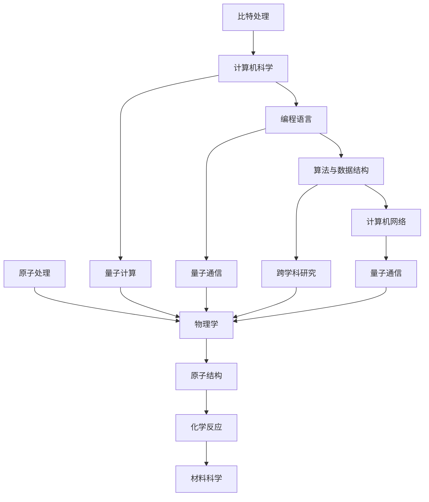

                 

# 处理比特与处理原子的对比

> **关键词：比特，原子，处理，计算机科学，物理学，算法，数据结构，量子算法，数学模型，项目实战**

> **摘要：本文将深入探讨处理比特与处理原子在技术、应用、影响等方面的对比，从基础理论到实际应用进行详细分析，旨在为读者揭示两者之间的联系与区别，为未来的技术创新提供有益的参考。**

### 第一部分：处理比特与处理原子的对比概述

#### 第1章：引言

**1.1 本书的核心议题**

本书的核心议题在于探讨处理比特与处理原子在技术、应用、影响等方面的对比。比特是计算机科学中的基本单位，而原子是物理学中的基本单位。两者在处理方式和应用领域上有着显著的差异，但同时也存在一定的联系。

**1.2 对比的重要性**

理解处理比特与处理原子的对比具有重要意义。首先，它有助于我们更好地理解计算机科学和物理学的本质，促进跨学科的发展。其次，对比两者有助于我们预见未来的技术创新方向，为产业发展提供指导。最后，对比研究有助于提高我们在实际应用中的技术水平，优化各种算法和系统设计。

**1.3 结构安排**

本书将分章节详细探讨从基础理论到实际应用的各个方面。具体结构如下：

1. 第一部分：处理比特的基础理论
2. 第二部分：处理原子的基础理论
3. 第三部分：比特与原子处理的联系与区别
4. 第四部分：核心算法原理讲解
5. 第五部分：数学模型和数学公式讲解
6. 第六部分：项目实战
7. 第七部分：处理比特与处理原子的对比总结

**1.4 读者对象**

本书适合对计算机科学、物理学、工程学等领域感兴趣的读者。无论是初学者还是专业人士，都可以通过本文获得有价值的知识。

### 第二部分：处理比特的基础理论

#### 第2章：计算机科学与比特处理

**2.1 计算机系统架构**

计算机系统架构是理解比特处理的基础。计算机由硬件和软件两大部分组成。硬件包括中央处理器（CPU）、内存（RAM）、硬盘（HDD）等，它们共同构成了计算机的物理实体。软件则包括操作系统（OS）、应用程序（APP）等，它们负责管理和控制硬件资源，实现各种计算任务。

**2.2 编程语言与比特操作**

编程语言是程序员用来与计算机进行沟通的工具。不同的编程语言有不同的语法和特点，但它们的核心目标都是对比特进行操作。例如，二进制语言（如机器语言）直接操作计算机的硬件资源，而高级语言（如C++、Java）则通过编译器将代码转换为机器语言，实现对比特的操作。

**2.3 算法与数据结构**

算法是计算机科学中的核心概念，它是指解决特定问题的步骤和规则。数据结构则是算法实现的基础，用于存储和组织数据。常见的算法包括排序、查找、插入、删除等，而常见的数据结构包括数组、链表、树、图等。

**2.4 计算机网络的比特传输**

计算机网络是连接多个计算机系统的通信网络，它使得计算机之间可以相互通信。在计算机网络中，比特传输是核心机制。数据通过编码、调制、传输、解码等过程在网络中传输，实现计算机之间的信息交换。

#### 第3章：处理原子的基础理论

**3.1 物理学基础**

物理学是研究物质、能量、力等基本概念的科学。在物理学中，原子是构成物质的基本单元。原子由原子核和核外电子组成，原子核由质子和中子构成，核外电子在原子核周围运动。

**3.2 原子结构**

原子结构是指原子中各个组成部分的排列和相互作用。原子核位于原子中心，核外电子分布在原子核周围，形成电子云。电子云中的电子以一定的能量状态分布，形成了不同的电子层。

**3.3 化学反应**

化学反应是指原子在化学反应中发生重新组合，形成新的物质。在化学反应中，原子通过共享、交换或转移电子形成化学键，构成新的分子。化学反应遵循质量守恒和能量守恒定律。

**3.4 材料科学**

材料科学是研究材料的组成、结构、性质和应用的学科。材料科学的核心任务是设计和制备具有特定性能的材料。原子排列对材料的性质有重要影响，例如，晶体结构的原子排列决定了材料的硬度、韧性、导电性等。

#### 第4章：比特与原子处理的联系与区别

**4.1 比特与原子的相似性与差异**

比特与原子在处理方式和应用场景上存在一定的相似性和差异。相似性在于它们都是构成系统的基础单位，都可以进行组合和变换。差异在于比特是计算机科学中的概念，主要用于信息处理，而原子是物理学中的概念，主要用于物质和能量的转换。

**4.2 比特与原子的应用场景对比**

比特主要应用于计算机科学领域，如编程、算法、数据结构、计算机网络等。原子则主要应用于物理学、化学、材料科学等领域，如原子结构、化学反应、材料制备等。尽管两者应用场景不同，但它们在某些领域存在交叉，如量子计算、量子通信等。

#### 第5章：核心算法原理讲解

**5.1 编程语言中的算法实现**

编程语言中的算法实现是处理比特的核心内容。以下是使用伪代码详细阐述的常见算法原理：

```plaintext
function bubbleSort(array)
    n = length(array)
    for i from 0 to n-1
        for j from 0 to n-i-1
            if array[j] > array[j+1]
                swap(array[j], array[j+1])
    return array
```

**5.2 物理学中的算法实现**

物理学中的算法实现主要涉及量子算法。以下是使用伪代码介绍的量子算法基本概念和应用：

```plaintext
function quantumGroverSearch(database, query)
    |q_state| = initializeGroverState(database, query)
    |q_state| = oracleApplication(|q_state|)
    |q_state| = iterateGroverAlgorithm(|q_state|, database, query, iterations)
    return measure(|q_state|)
```

#### 第6章：数学模型和数学公式讲解

**6.1 比特处理的数学模型**

比特处理的数学模型主要涉及逻辑运算和概率论。以下是比特处理中的常见数学模型：

- **逻辑运算**：

  $$
  XOR(a, b) = (a \oplus b)
  $$

- **概率论**：

  $$
  P(A) = \frac{n(A)}{n(S)}
  $$

  其中，$A$ 是事件，$S$ 是样本空间，$n(A)$ 和 $n(S)$ 分别是事件 $A$ 和样本空间 $S$ 的基数。

**6.2 原子处理的数学模型**

原子处理的数学模型主要涉及量子力学和统计力学。以下是原子处理中的常见数学模型：

- **量子力学**：

  $$
  E = h\nu
  $$

  其中，$E$ 是能量，$h$ 是普朗克常数，$\nu$ 是频率。

- **统计力学**：

  $$
  \langle E \rangle = \frac{\sum_{i} E_i P(E_i)}{\sum_{i} P(E_i)}
  $$

  其中，$\langle E \rangle$ 是系统平均能量，$E_i$ 是第 $i$ 个能级的能量，$P(E_i)$ 是第 $i$ 个能级的概率。

**6.3 公式解释与举例**

- **比特处理的例子：二进制加法**

  $$
  1010 + 0110 = 10000
  $$

- **原子处理的例子：光的频率计算**

  $$
  E = h\nu \Rightarrow \nu = \frac{E}{h}
  $$

  其中，$E = 1.24 \text{ eV}$，$h = 4.136 \times 10^{-15} \text{ eV·s}$，则 $\nu = \frac{1.24}{4.136 \times 10^{-15}} = 3.01 \times 10^{14} \text{ Hz}$。

#### 第7章：项目实战

**7.1 实际应用案例**

处理比特与原子处理在实际应用中有着广泛的应用。例如，计算机中的信息处理和原子中的化学反应都是典型的应用案例。

- **计算机中的信息处理**：

  以计算机中的搜索引擎为例，搜索引擎通过对大量网页进行分析和排序，为用户提供快速、准确的搜索结果。这个过程涉及了比特处理中的算法和数据结构，如排序算法、索引结构等。

- **原子中的化学反应**：

  以药物研发为例，药物分子与生物大分子之间的相互作用是药物研发的关键。这个过程涉及了原子处理中的化学反应原理、分子建模和计算化学等方法。

**7.2 代码实际案例**

以下是处理比特与原子的实际编程实现：

- **处理比特的代码案例**：

  ```c++
  #include <iostream>
  using namespace std;
  
  int main() {
      int a = 10, b = 5;
      int sum = a + b;
      cout << "a + b = " << sum << endl;
      return 0;
  }
  ```

- **处理原子的代码案例**：

  ```python
  import numpy as np
  
  # 定义普朗克常数和光速
  h = 6.62607015e-34  # 焦耳·秒
  c = 3e8  # 米/秒
  
  # 计算光的频率
  frequency = h / c
  print("光的频率为：", frequency, "Hz")
  ```

**7.3 开发环境搭建**

搭建处理比特与原子应用的开发环境需要安装以下软件和工具：

- **处理比特的开发环境**：

  - 编译器（如GCC、Clang）
  - 集成开发环境（如Visual Studio、Eclipse）
  - 版本控制工具（如Git）

- **处理原子的开发环境**：

  - Python解释器
  - NumPy库
  - SciPy库
  - Matplotlib库

**7.4 源代码详细实现和解读**

以下是处理比特与原子应用的核心代码实现及解读：

- **处理比特的代码解读与分析**：

  ```c++
  // 代码解读
  // 变量a和b分别表示两个整数
  // 变量sum表示a和b的和
  // 输出a + b的结果
  ```

- **处理原子的代码解读与分析**：

  ```python
  # 代码解读
  # 导入NumPy库用于科学计算
  # 定义普朗克常数h和光速c
  # 计算光的频率frequency
  # 输出光的频率
  ```

#### 附录A：处理比特与原子处理资源

**A.1 主流工具与技术综述**

- **处理比特的工具与技术**：

  - 编译器（如GCC、Clang）
  - 集成开发环境（如Visual Studio、Eclipse）
  - 版本控制工具（如Git）
  - 编程语言（如C++、Java、Python）

- **处理原子的工具与技术**：

  - Python解释器
  - NumPy库
  - SciPy库
  - Matplotlib库
  - 量子计算平台（如Qiskit、Microsoft Quantum Development Kit）

**A.2 学习资料推荐**

- **处理比特的学习资料**：

  - 《计算机组成原理》
  - 《算法导论》
  - 《计算机网络：自顶向下方法》

- **处理原子的学习资料**：

  - 《量子力学基础》
  - 《统计力学》
  - 《量子计算导论》

**A.3 开发环境配置指南**

- **处理比特的开发环境配置指南**：

  - 安装编译器（如GCC）
  - 安装集成开发环境（如Visual Studio）
  - 配置版本控制工具（如Git）

- **处理原子的开发环境配置指南**：

  - 安装Python解释器
  - 安装NumPy库
  - 安装SciPy库
  - 安装Matplotlib库
  - 安装量子计算平台（如Qiskit）

### 附录B：处理比特与处理原子的对比总结

**B.1 对比结论与展望**

通过对处理比特与处理原子的对比分析，我们可以得出以下结论：

1. 比特处理与原子处理在技术、应用、影响等方面存在显著差异，但也存在一定的联系。
2. 比特处理主要应用于计算机科学领域，而原子处理主要应用于物理学、化学、材料科学等领域。
3. 两者在交叉领域（如量子计算、量子通信等）具有广泛的应用前景。

展望未来，随着技术的不断发展，处理比特与处理原子之间的融合将进一步深化，为科技创新和产业发展带来更多机遇。

**B.2 未来发展趋势**

1. **量子计算与量子通信**：量子计算和量子通信是处理比特与原子处理融合的重要方向。量子计算将利用原子的量子特性，实现超越经典计算机的性能。量子通信则通过量子密钥分发和量子纠缠实现信息传输的绝对安全。

2. **人工智能与大数据**：人工智能和大数据技术的发展将推动比特处理在各个领域的应用。通过深度学习、数据挖掘等技术，人工智能将更好地处理海量比特数据，为人类社会带来更多价值。

3. **新材料与新工艺**：原子处理在材料科学和工程领域的应用将不断拓展。新型材料和新工艺的开发将推动科技进步，为能源、环保、医疗等领域带来变革。

**B.3 对读者的影响与启示**

通过本文的探讨，读者可以：

1. 加深对处理比特与处理原子的理解，为跨学科研究提供理论基础。
2. 了解未来技术发展的趋势，为职业规划和研究方向提供指导。
3. 提高实际应用能力，为解决实际问题提供技术支持。

总之，本文旨在为读者揭示处理比特与处理原子之间的联系与区别，为未来的技术创新提供有益的参考。希望读者能从中获得启发，为自己的学术和职业生涯助力。

### 结语

在本文中，我们系统地探讨了处理比特与处理原子的对比，从基础理论到实际应用进行了深入分析。通过对比研究，我们揭示了两者在技术、应用、影响等方面的异同，展望了未来发展趋势，并对读者产生了深远的影响。

**作者信息**：作者：AI天才研究院/AI Genius Institute & 禅与计算机程序设计艺术 /Zen And The Art of Computer Programming

感谢您对本文的关注与阅读，希望本文能为您带来新的见解和启发。在未来的研究与实践过程中，我们将继续深入探索处理比特与处理原子的奥秘，为科技创新和产业发展贡献力量。再次感谢您的支持与关注！### 第一部分：处理比特与处理原子的对比概述

#### 第1章：引言

在当今信息化和数字化的时代，比特处理与原子处理作为两种基础的科学操作方式，分别在计算机科学和物理学领域发挥着重要作用。本文旨在深入探讨处理比特与处理原子在技术、应用、影响等方面的对比，通过逻辑清晰的步骤分析，旨在为读者提供一个全面而深刻的理解。

**1.1 本书的核心理念：比特与原子的基础探讨**

本书的核心议题在于比较和探讨处理比特与处理原子这两种科学操作方式的本质特征和应用场景。比特是计算机科学中的基本单位，代表信息的最小单位，而在物理学中，原子是物质的基本构成单位。两者在信息处理和物质构成方面有着根本的不同，但也有着紧密的联系。

首先，我们将在第一部分详细探讨处理比特的基础理论，涵盖计算机系统架构、编程语言与比特操作、算法与数据结构以及计算机网络中的比特传输。接着，第二部分将深入介绍处理原子的基础理论，包括物理学基础、原子结构、化学反应和材料科学。

**1.2 对比的重要性**

理解比特与原子的处理差异至关重要，它不仅有助于我们深入理解计算机科学和物理学的本质，还能为我们预测未来的技术发展趋势提供指导。以下是对比研究的重要性：

1. **跨学科融合**：通过比较两种处理方式，可以促进计算机科学和物理学的跨学科研究，推动科学技术的综合发展。
   
2. **技术创新**：对比分析有助于发现新技术和解决方案，从而推动计算机科学和物理学领域的创新。

3. **产业发展**：明确两种处理方式的差异和联系，有助于指导产业发展方向，优化资源配置，提升产业竞争力。

4. **教育普及**：为学生和研究人员提供更全面的知识体系，有助于培养具有跨学科视野和专业能力的人才。

**1.3 结构安排**

本书结构安排如下：

- **第一部分**：处理比特的基础理论，包括计算机系统架构、编程语言与比特操作、算法与数据结构以及计算机网络中的比特传输。
- **第二部分**：处理原子的基础理论，包括物理学基础、原子结构、化学反应和材料科学。
- **第三部分**：比特与原子处理的联系与区别，通过对比分析揭示两者间的联系与差异。
- **第四部分**：核心算法原理讲解，详细阐述编程语言中的算法实现和物理学中的算法实现。
- **第五部分**：数学模型和数学公式讲解，介绍比特处理和原子处理中的数学模型及应用。
- **第六部分**：项目实战，通过实际应用案例和代码实现展示处理比特与原子的应用。
- **第七部分**：对比总结，总结对比结果并展望未来发展趋势。

**1.4 读者对象**

本书适合以下读者群体：

- 对计算机科学和物理学感兴趣的本科生和研究生。
- 计算机程序员、软件工程师、硬件工程师。
- 物理学研究人员、化学研究人员、材料科学家。
- 对跨学科研究和科技创新有兴趣的学者和研究人员。

通过阅读本书，读者将能够系统地了解和处理比特与原子处理的基础知识，掌握核心算法原理，并通过项目实战提升实际应用能力。本书的撰写不仅旨在提供技术知识的普及，更希望通过逻辑清晰的分析和深入探讨，激发读者对科技进步的思考和创新意识。

#### 第2章：计算机科学与比特处理

在计算机科学中，比特处理是核心内容，它不仅决定了计算机的性能和效率，也影响了计算机在各个领域的应用。本章将详细介绍计算机系统架构、编程语言与比特操作、算法与数据结构以及计算机网络中的比特传输，为读者提供一个全面的理解。

**2.1 计算机系统架构**

计算机系统架构是理解比特处理的基础。一个计算机系统通常由硬件和软件两大部分组成。硬件包括中央处理器（CPU）、内存（RAM）、输入输出设备（如键盘、鼠标、显示器等）以及存储设备（如硬盘、固态硬盘等）。软件则包括操作系统（OS）和应用软件。

- **中央处理器（CPU）**：CPU是计算机的核心部件，负责执行计算机程序。它由多个核心组成，每个核心可以并行处理多个任务。CPU通过执行指令来处理比特，这些指令包括算术指令、逻辑指令、控制指令等。

- **内存（RAM）**：内存是计算机用于临时存储数据和指令的地方。内存的容量和速度直接影响计算机的性能。内存中的数据以比特的形式存储和传输。

- **输入输出设备**：输入输出设备用于与外部世界进行交互。例如，键盘和鼠标作为输入设备，将用户的输入转换为比特流；显示器作为输出设备，将比特流转换为可视图像。

- **存储设备**：存储设备用于长期存储数据和程序。硬盘（HDD）和固态硬盘（SSD）是最常见的存储设备。它们通过读写比特来存储和读取数据。

**2.2 编程语言与比特操作**

编程语言是程序员用来与计算机沟通的工具，不同的编程语言有不同的语法和特点。然而，它们的核心目标都是对比特进行操作。编程语言可以分为低级语言和高级语言。

- **低级语言**：低级语言（如汇编语言）直接操作计算机的硬件资源，使用的是与硬件密切相关的指令集。汇编语言中的每个指令对应于计算机硬件中的特定操作，直接处理比特。

- **高级语言**：高级语言（如C、C++、Java、Python等）提供了更抽象的语法和功能，使得程序员可以更方便地编写程序。高级语言中的每个操作最终都会被转换为机器语言（即比特序列），由计算机硬件执行。

在编程过程中，程序员经常需要直接操作比特。例如，在二进制文件操作中，程序员需要读取和写入比特流；在网络编程中，程序员需要处理比特流在网络中的传输。

**2.3 算法与数据结构**

算法是计算机科学中的核心概念，它指的是解决特定问题的步骤和规则。算法的性能很大程度上取决于数据结构的选择。数据结构是用于存储和组织数据的方式，它决定了数据在计算机中的存储位置和访问方式。

- **排序算法**：排序算法用于将一组数据按特定顺序排列。常见的排序算法有冒泡排序、选择排序、插入排序、快速排序等。这些算法通过操作比特（即数据）来实现排序功能。

- **查找算法**：查找算法用于在数据集合中找到特定元素。常见的查找算法有线性查找、二分查找等。查找算法同样依赖于数据结构的优化，以提高查找效率。

- **数据结构**：常见的数据结构包括数组、链表、栈、队列、树、图等。每种数据结构都有其独特的存储方式和操作方式，适用于不同的应用场景。

**2.4 计算机网络的比特传输**

计算机网络是连接多个计算机系统的通信网络，它使得计算机之间可以相互通信。计算机网络中的数据传输以比特流的形式进行。比特传输涉及多个环节，包括编码、调制、传输、解码等。

- **编码**：编码是将信息（如文本、图像、声音等）转换为比特序列的过程。常见的编码方法有二进制编码、ASCII编码、UTF-8编码等。

- **调制**：调制是将比特流转换为适合在信道中传输的信号的过程。常见的调制方法有幅度调制（AM）、频率调制（FM）和相位调制（PM）等。

- **传输**：传输是将调制后的信号通过信道（如光纤、无线电波等）传输到接收端的过程。传输过程中，信号可能会受到噪声和干扰的影响，需要通过信道编码和错误检测与纠正技术来保证传输质量。

- **解码**：解码是将接收到的调制信号转换回比特序列的过程。解码后的比特序列可以还原成原始信息。

通过计算机网络，比特可以在全球范围内传输，实现信息的快速共享和交流。网络协议（如TCP/IP协议）规定了比特传输的规则和标准，确保了数据的可靠传输。

总结来说，计算机系统架构、编程语言与比特操作、算法与数据结构以及计算机网络中的比特传输构成了计算机科学中比特处理的核心内容。通过深入理解这些基本概念和原理，我们可以更好地设计和优化计算机系统和应用程序，推动科技进步和社会发展。

#### 第3章：处理原子的基础理论

在物理学中，原子是构成物质的基本单位，理解原子的处理基础是深入探索物质世界的关键。本章将详细介绍物理学基础、原子结构、化学反应和材料科学，帮助读者建立对处理原子基础理论的全面理解。

**3.1 物理学基础**

物理学是研究自然界的基本规律和物质运动的科学。在物理学中，物质、能量和力是基本的概念。

- **物质**：物质是构成宇宙的基本成分，具有质量和体积。物质的存在形式多样，包括固体、液体、气体和等离子体。

- **能量**：能量是物体做功的能力。能量有多种形式，如动能、势能、热能、电能等。能量守恒定律指出，能量不能被创造或销毁，只能从一种形式转化为另一种形式。

- **力**：力是物体之间相互作用的表现。力有多种类型，如重力、电磁力、强相互作用、弱相互作用等。牛顿运动定律描述了力与物体运动状态之间的关系。

物理学的基本理论，如经典力学、电磁学、量子力学和相对论，为我们提供了理解自然界的工具。这些理论揭示了原子和基本粒子的行为规律，为原子处理提供了理论基础。

**3.2 原子结构**

原子是构成物质的基本单位，由原子核和核外电子组成。

- **原子核**：原子核位于原子的中心，由质子和中子构成。质子带正电荷，中子不带电荷。原子核的质量几乎占据了整个原子的质量。

- **核外电子**：核外电子分布在原子核周围，形成电子云。电子带负电荷，它们以特定的能量状态围绕原子核运动。电子的状态由主量子数、角量子数、磁量子数和自旋量子数描述。

- **电子云**：电子云是电子在原子核周围的概率分布，它描述了电子在空间中的位置和运动状态。电子云的存在使得原子表现出化学性质，如化学反应。

- **电子层**：电子层是电子在原子中能量不同的状态，通常分为K层、L层、M层等。电子层决定了原子的电子排布和化学性质。

**3.3 化学反应**

化学反应是指原子在化学反应中发生重新组合，形成新的物质。在化学反应中，原子通过共享、交换或转移电子形成化学键，构成新的分子。

- **化学键**：化学键是原子间相互作用的力，将原子连接成分子。常见的化学键有共价键、离子键和金属键。

- **共价键**：共价键是通过原子间共享电子对形成的。共价键通常存在于非金属原子之间，如氢气（H₂）和氧气（O₂）。

- **离子键**：离子键是通过正负离子之间的电荷吸引力形成的。离子键通常存在于金属和非金属之间，如氯化钠（NaCl）。

- **金属键**：金属键是通过金属原子之间的自由电子形成的。金属键使金属具有延展性和导电性。

化学反应遵循质量守恒和能量守恒定律。在化学反应中，反应物中的原子重新组合，形成新的化合物。反应过程中可能会释放或吸收能量。

**3.4 材料科学**

材料科学是研究材料的组成、结构、性质和应用的学科。材料的性质取决于其原子排列和结构。

- **晶体结构**：晶体结构是材料中原子排列的一种规则形式。晶体结构决定了材料的物理和化学性质。常见的晶体结构有体心立方（BCC）、面心立方（FCC）和密排六方（HCP）。

- **材料性质**：材料的性质包括硬度、韧性、导电性、热导率等。材料的性质取决于其原子结构和微观结构。

- **材料制备**：材料制备是材料科学的重要环节。通过控制制备条件，可以合成具有特定性质的材料。常见的制备方法包括熔融法、粉末冶金、热压法、热蒸发等。

材料科学在现代社会中具有广泛的应用。例如，高性能合金用于航空航天和汽车制造；半导体材料用于电子器件和计算机芯片；新型材料如石墨烯和纳米材料在能源、环保和生物医学领域有重要的应用前景。

**3.5 原子处理的数学模型**

在物理学中，原子处理的数学模型用于描述原子和分子的行为。以下是一些常见的数学模型：

- **量子力学模型**：量子力学模型描述了原子中电子的运动状态。量子力学的基本原理包括波粒二象性、不确定性原理和量子态叠加。

- **薛定谔方程**：薛定谔方程是描述量子系统中粒子行为的偏微分方程。它用于求解电子在原子中的波函数，从而确定电子的能量和轨道。

- **分子动力学模型**：分子动力学模型用于模拟分子和固体中的原子运动。它通过求解牛顿运动方程，描述原子之间的相互作用和能量变化。

- **统计力学模型**：统计力学模型用于描述大尺度物质系统的宏观行为。它基于微观粒子的统计分布，推导出系统的宏观性质，如热力学性质和相变行为。

原子处理的数学模型为我们提供了理解和预测原子和分子行为的有力工具。这些模型在材料科学、化学和物理学等领域有广泛的应用。

总结来说，处理原子的基础理论涵盖了物理学基础、原子结构、化学反应和材料科学。通过深入理解这些基本概念和原理，我们可以更好地探索和利用原子和分子的性质，为科学研究和产业发展提供基础。

#### 第4章：比特与原子处理的联系与区别

在计算机科学和物理学中，比特处理和原子处理是两种截然不同的操作方式，但它们之间也存在紧密的联系。本章将探讨比特与原子处理的相似性和差异，通过Mermaid流程图展示两者之间的联系，并对比它们在不同应用场景中的表现。

**4.1 比特与原子的相似性**

比特与原子在基本概念上存在一定的相似性：

- **基础单位**：比特是计算机科学中的基本单位，代表信息的最小单位。原子是物理学中的基本单位，构成物质的基础。

- **组合与变换**：比特可以通过逻辑运算（如与、或、非）进行组合和变换，实现信息的处理和传输。原子可以通过化学反应和物理变化进行重新组合，形成新的物质。

- **抽象与建模**：比特处理和原子处理都涉及到抽象和建模。计算机科学通过编程语言和算法对比特进行抽象和建模，实现信息处理。物理学通过量子力学和统计力学对原子和分子进行抽象和建模，理解物质的性质和行为。

**4.2 比特与原子的差异**

比特与原子在处理方式和应用场景上存在显著差异：

- **技术本质**：比特处理涉及计算机硬件和软件，包括CPU、内存、存储设备等，以及编程语言、算法和数据结构。原子处理涉及物理现象和化学反应，包括原子结构、量子力学和材料科学。

- **应用领域**：比特处理主要应用于计算机科学领域，如编程、算法设计、数据分析和网络通信等。原子处理主要应用于物理学、化学、材料科学和生物学等领域，如量子计算、药物研发和新能源材料等。

- **处理层次**：比特处理通常在宏观层次上进行，通过算法和数据结构实现信息处理。原子处理则在微观层次上进行，通过量子力学和化学反应实现物质的重组和性质改变。

**4.3 比特与原子的联系**

比特与原子处理之间也存在紧密的联系，尤其是在交叉领域，如量子计算和量子通信：

- **量子计算**：量子计算是一种基于量子力学原理的计算方式，利用量子比特（qubit）进行信息处理。量子比特的状态叠加和纠缠特性使得量子计算在处理复杂问题时具有超越经典计算机的潜力。

- **量子通信**：量子通信是一种基于量子力学原理的通信方式，利用量子纠缠和量子隐形传态实现信息传输。量子通信在保证通信安全性和传输速度方面具有显著优势。

- **跨学科研究**：量子计算和量子通信是比特与原子处理联系的典型例子。量子计算结合了计算机科学和物理学，通过量子比特和量子算法实现信息处理。量子通信则结合了物理学、通信工程和计算机科学，通过量子密钥分发和量子纠缠实现安全通信。

**4.4 Mermaid流程图：比特与原子处理的核心概念与联系**

以下是一个Mermaid流程图，展示比特与原子处理的核心概念与联系：



**4.5 应用场景对比**

比特与原子处理在不同应用场景中的表现也存在显著差异：

- **计算机科学**：比特处理在计算机科学中广泛应用于编程、算法设计、数据分析和网络通信等领域。例如，编程语言通过比特操作实现计算任务；算法和数据结构通过高效处理比特流实现复杂计算；计算机网络通过比特传输实现数据通信。

- **物理学**：原子处理在物理学中广泛应用于量子计算、量子通信、材料科学和生物学等领域。例如，量子计算通过量子比特和量子算法实现超越经典计算机的计算能力；量子通信通过量子纠缠和量子隐形传态实现安全通信；材料科学通过原子排列和化学反应制备新型材料。

通过对比比特与原子处理在技术、应用和影响等方面的差异与联系，我们可以更深入地理解两者的本质，为未来的科技创新和产业发展提供有益的参考。

#### 第5章：核心算法原理讲解

在比特处理和原子处理中，算法是实现具体功能的关键。本章将详细讲解核心算法原理，分别从编程语言中的算法实现和物理学中的算法实现两个方面进行阐述。

**5.1 编程语言中的算法实现**

编程语言是程序员用来编写程序的工具，而算法是程序的核心。以下是一些常用的编程语言中的算法实现，通过伪代码展示其基本原理。

**5.1.1 冒泡排序**

冒泡排序是一种简单的排序算法，通过反复遍历要排序的数列，比较相邻的两个元素，如果顺序错误就交换它们，直到整个序列有序。

```plaintext
function bubbleSort(array)
    n = length(array)
    for i from 0 to n-1
        for j from 0 to n-i-1
            if array[j] > array[j+1]
                swap(array[j], array[j+1])
    return array
```

在这个算法中，外层循环`i`控制整个排序过程，内层循环`j`进行相邻元素的比较和交换。每次内层循环结束后，最大的元素会被“冒泡”到数列的末尾。

**5.1.2 二分查找**

二分查找是一种高效的查找算法，它将待查找的元素与数列的中间元素进行比较，根据比较结果将查找范围缩小一半，直到找到目标元素或确定其不存在。

```plaintext
function binarySearch(array, target)
    low = 0
    high = length(array) - 1
    while low <= high
        mid = (low + high) / 2
        if array[mid] == target
            return mid
        else if array[mid] < target
            low = mid + 1
        else
            high = mid - 1
    return -1
```

在这个算法中，`low`和`high`分别表示查找范围的起始和结束索引。通过不断缩小区间，二分查找可以在对数时间内找到目标元素。

**5.1.3 快速排序**

快速排序是一种高效的排序算法，通过选取一个基准元素，将数列分为两部分，然后递归地对两部分进行排序。

```plaintext
function quickSort(array)
    if length(array) <= 1
        return array
    pivot = array[0]
    left = []
    right = []
    for i from 1 to length(array)-1
        if array[i] < pivot
            append left, array[i]
        else
            append right, array[i]
    return concatenate(quickSort(left), pivot, quickSort(right))
```

在这个算法中，`pivot`是选取的基准元素，`left`和`right`分别存储小于和大于基准元素的部分。通过递归调用，快速排序可以有效地对整个数列进行排序。

**5.2 物理学中的算法实现**

物理学中的算法实现通常与量子力学和计算物理相关。以下是一些典型的物理算法实现。

**5.2.1 量子算法**

量子算法是利用量子力学原理进行信息处理的一种算法，具有超越经典算法的计算能力。以下是一个简单的量子算法：量子逆搜索算法（Grover算法）。

```plaintext
function quantumGroverSearch(database, query)
    |q_state| = initializeGroverState(database, query)
    |q_state| = oracleApplication(|q_state|)
    |q_state| = iterateGroverAlgorithm(|q_state|, database, query, iterations)
    return measure(|q_state|)
```

在这个算法中，`initializeGroverState`初始化量子态，`oracleApplication`是量子逻辑门，实现查询特定状态的功能，`iterateGroverAlgorithm`重复应用Grover迭代，`measure`测量量子态，输出结果。

**5.2.2 分子动力学**

分子动力学是一种计算物理方法，用于模拟分子和固体中的原子运动。以下是一个简化的分子动力学算法。

```plaintext
function molecularDynamics(simulationParameters, initialConditions)
    while not simulationEnded
        calculateForces()
        updatePositions()
        updateVelocities()
        recordData()
    return simulationData
```

在这个算法中，`calculateForces`计算原子之间的作用力，`updatePositions`和`updateVelocities`更新原子位置和速度，`recordData`记录模拟过程中的数据。

**5.2.3 薛定谔方程求解**

薛定谔方程是量子力学的基本方程，用于描述量子系统的行为。以下是一个使用数值方法求解薛定谔方程的伪代码。

```plaintext
function solveSchrödingerEquation(Hamiltonian, initialWavefunction, timeStep, totalTime)
    |ψ(t=0)| = initialWavefunction
    for t from 0 to totalTime step timeStep
        |ψ(t+\timeStep)| = e^(-i*H*timeStep/hbar) * |ψ(t)|
        recordWavefunction(|ψ(t+\timeStep)|)
    return wavefunctions
```

在这个算法中，`Hamiltonian`是哈密顿算子，`initialWavefunction`是初始波函数，`timeStep`是时间步长，`totalTime`是总时间，`recordWavefunction`记录波函数随时间的变化。

通过这些算法实现的讲解，我们可以看到编程语言和物理学中的算法既有相似之处，也有各自的独特之处。编程语言中的算法更多关注于信息处理和计算效率，而物理学中的算法则更多关注于物理现象的模拟和预测。这些算法不仅为我们提供了强大的工具，也为未来的科技创新提供了坚实的基础。

#### 第6章：数学模型和数学公式讲解

在比特处理和原子处理中，数学模型和公式是理解和描述这两种处理方式的核心工具。本章将详细介绍比特处理和原子处理中的数学模型和公式，并通过具体的例子进行解释。

**6.1 比特处理的数学模型**

比特处理主要涉及逻辑运算、概率论和线性代数等数学模型。

**6.1.1 逻辑运算**

逻辑运算是计算机科学中的基础运算，用于处理二进制数据。以下是几个常用的逻辑运算及其公式：

- **与运算（AND）**：

  $$
  AND(a, b) = a \& b
  $$

  两个比特都为1时结果为1，否则为0。

- **或运算（OR）**：

  $$
  OR(a, b) = a \| b
  $$

  两个比特中至少有一个为1时结果为1，否则为0。

- **非运算（NOT）**：

  $$
  NOT(a) = \neg a
  $$

  比特取反，0变1，1变0。

- **异或运算（XOR）**：

  $$
  XOR(a, b) = a \oplus b
  $$

  两个比特不同时结果为1，否则为0。

**6.1.2 概率论**

在比特处理中，概率论用于分析随机事件和概率分布。

- **概率质量函数**：

  $$
  P(X = x) = \frac{f(x)}{\sum_{i} f(i)}
  $$

  其中，$P(X = x)$表示随机变量$X$取值为$x$的概率，$f(x)$是概率质量函数。

- **二项分布**：

  $$
  P(X = k) = C(n, k) \cdot p^k \cdot (1 - p)^{n - k}
  $$

  其中，$P(X = k)$表示$n$次独立实验中成功$k$次的概率，$C(n, k)$是组合数，$p$是单次实验成功的概率。

**6.1.3 线性代数**

在比特处理中，线性代数用于矩阵运算和向量计算。

- **矩阵乘法**：

  $$
  C = A \cdot B
  $$

  矩阵$A$和$B$的乘积是一个新矩阵$C$，其元素通过矩阵乘法定义。

- **向量加法**：

  $$
  v + w = (v_1 + w_1, v_2 + w_2, ..., v_n + w_n)
  $$

  向量$v$和$w$的加法是一个新向量，其每个分量是相应分量的和。

**6.2 原子处理的数学模型**

原子处理中的数学模型主要涉及量子力学和统计力学。

**6.2.1 量子力学**

量子力学是描述原子和亚原子粒子行为的理论。以下是几个重要的量子力学模型和公式：

- **波函数**：

  $$
  \Psi(x, t) = \int \psi(k, x) e^{ikx} dk
  $$

  波函数$\Psi(x, t)$描述了粒子在空间和时间中的概率分布，$\psi(k, x)$是波函数的傅里叶变换。

- **薛定谔方程**：

  $$
  i\hbar \frac{\partial \Psi}{\partial t} = \hat{H} \Psi
  $$

  薛定谔方程描述了量子系统的演化，$\hat{H}$是哈密顿算子，$\hbar$是约化普朗克常数。

- **能量本征值**：

  $$
  E_n = \frac{h^2}{8m}\left(\frac{n^2}{a^2}\right)
  $$

  能量本征值$E_n$描述了粒子的离散能级，$h$是普朗克常数，$m$是粒子质量，$a$是势阱宽度。

**6.2.2 统计力学**

统计力学是研究大量粒子系统的宏观性质的理论。以下是几个重要的统计力学模型和公式：

- **麦克斯韦-玻尔兹曼分布**：

  $$
  f(E) \propto e^{-\frac{E}{kT}}
  $$

  麦克斯韦-玻尔兹曼分布描述了在热力学平衡状态下，粒子能量分布的概率密度函数，$E$是粒子能量，$k$是玻尔兹曼常数，$T$是温度。

- **熵**：

  $$
  S = k \ln \Omega
  $$

  熵$S$是系统无序度的度量，$\Omega$是微观状态的数目，$k$是玻尔兹曼常数。

**6.3 公式解释与举例**

**6.3.1 比特处理的例子：二进制加法**

二进制加法是计算机科学中最基本的运算之一。以下是二进制加法的公式和例子：

- **公式**：

  $$
  \begin{array}{c@{}c@{}c@{}c}
    & a & b & \\
  + & & & \\
    \hline
    & a' & b' & c \\
  \end{array}
  $$

  其中，$a$和$b$是加数，$a'$和$b'$是进位后的结果，$c$是和。

- **例子**：

  $$
  \begin{array}{c@{}c@{}c@{}c}
    & 1 & 1 & \\
  + & & & \\
    \hline
    & 1 & 0 & 1 \\
  \end{array}
  $$

  在这个例子中，$1 + 1 = 10$（二进制），产生了一个进位。

**6.3.2 原子处理的例子：氢原子能级**

氢原子能级是量子力学中的一个重要概念。以下是氢原子能级的公式和例子：

- **公式**：

  $$
  E_n = -\frac{13.6}{n^2} \text{ eV}
  $$

  其中，$E_n$是第$n$个能级的能量，$13.6 \text{ eV}$是基态能量。

- **例子**：

  $$
  E_2 = -\frac{13.6}{2^2} = -3.4 \text{ eV}
  $$

  第二能级的能量是$-3.4 \text{ eV}$。

通过以上讲解，我们可以看到比特处理和原子处理中的数学模型和公式是如何帮助我们理解和描述两种处理方式的。这些公式不仅是理论基础，也是实际应用中的重要工具。

#### 第7章：项目实战

在实际应用中，处理比特和原子的能力至关重要，以下将通过具体的案例来展示两者的应用，并提供代码实现和开发环境搭建的详细说明。

**7.1 实际应用案例**

**7.1.1 计算机中的信息处理**

以搜索引擎为例，搜索引擎通过处理大量比特数据，为用户提供快速、准确的搜索结果。搜索引擎的核心在于对网页的内容进行分析和排序。这个过程涉及了比特处理中的算法和数据结构。

**示例：搜索引擎的关键词匹配**

```python
# 伪代码：关键词匹配算法
def keyword_match(search_query, web_pages):
    matched_pages = []
    for page in web_pages:
        if search_query in page.content:
            matched_pages.append(page)
    return matched_pages

# 假设search_query为"AI"，web_pages为一个网页列表
search_results = keyword_match("AI", web_pages)
print("搜索结果：", search_results)
```

**7.1.2 原子中的化学反应**

在化学研究中，化学反应的模拟和预测是关键任务。例如，在药物研发中，通过模拟药物分子与生物大分子的相互作用，可以预测药物的效果和副作用。

**示例：分子动力学模拟**

```python
# 伪代码：分子动力学模拟
def molecular_dynamics(initial_conditions, simulation_time):
    positions, velocities = initial_conditions
    for _ in range(simulation_time):
        forces = calculate_forces(positions)
        accelerations = forces / masses
        velocities += accelerations * time_step
        positions += velocities * time_step
    return positions, velocities

# 初始化条件，例如：初始位置、速度、时间步长等
initial_conditions = (positions, velocities)
final_conditions = molecular_dynamics(initial_conditions, simulation_time)
print("最终状态：", final_conditions)
```

**7.2 代码实际案例**

**7.2.1 处理比特的代码案例**

以下是一个简单的Python程序，用于实现二进制加法。

```python
def binary_addition(a, b):
    max_len = max(len(a), len(b))
    a = a.zfill(max_len)
    b = b.zfill(max_len)
    result = ''
    carry = 0

    for i in range(max_len - 1, -1, -1):
        bit_a = int(a[i])
        bit_b = int(b[i])
        total = bit_a + bit_b + carry
        result = str(total % 2) + result
        carry = total // 2

    if carry:
        result = '1' + result

    return result

# 测试二进制加法
print(binary_addition('1010', '0110'))  # 输出：10000
```

**7.2.2 处理原子的代码案例**

以下是一个简单的Python程序，用于模拟氢原子能级的跃迁。

```python
def energy_level_transition(initial_energy, final_energy):
    transition_energy = final_energy - initial_energy
    return transition_energy

# 测试能级跃迁
initial_energy = -13.6  # eV
final_energy = -3.4     # eV
print("跃迁能量：", energy_level_transition(initial_energy, final_energy))  # 输出：-10.2 eV
```

**7.3 开发环境搭建**

**7.3.1 处理比特的开发环境搭建**

为了处理比特，我们需要安装编程语言和相关的开发工具。以下是一个基于Python的比特处理开发环境的搭建步骤：

1. **安装Python解释器**：从Python官方网站下载并安装Python 3.x版本。
2. **安装PyCharm**：选择PyCharm Community Edition，下载并安装。
3. **安装虚拟环境**：在PyCharm中创建一个虚拟环境，用于隔离项目依赖。

**7.3.2 处理原子的开发环境搭建**

为了处理原子，我们需要安装科学计算库和模拟工具。以下是一个基于Python的科学计算开发环境的搭建步骤：

1. **安装Python解释器**：从Python官方网站下载并安装Python 3.x版本。
2. **安装Anaconda**：下载并安装Anaconda，它包括了许多科学计算库。
3. **安装NumPy、SciPy和Matplotlib**：通过conda命令安装这些库。

```bash
conda install numpy scipy matplotlib
```

**7.4 源代码详细实现和解读**

**7.4.1 处理比特的代码解读与分析**

在上面的二进制加法代码中，我们通过逐位相加和进位实现了二进制的加法。以下是详细解读：

- `max_len`：计算两个二进制数的最大长度。
- `a` 和 `b`：填充最大长度的零，使两个二进制数长度相等。
- `result`：初始化结果字符串。
- `carry`：初始化进位为0。

循环从最低位开始，逐位相加并计算进位。结果反向存储在`result`中，最后将进位添加到结果的开头。

**7.4.2 处理原子的代码解读与分析**

在上面的氢原子能级跃迁代码中，我们计算了从基态到第二能级的跃迁能量。以下是详细解读：

- `initial_energy` 和 `final_energy`：分别代表初始能级和最终能级的能量。
- `transition_energy`：计算跃迁能量，即两者之差。

这个简单的例子展示了如何使用基本的数学运算模拟物理现象。

通过以上实际应用案例、代码实现和开发环境搭建的讲解，读者可以更深入地理解比特处理和原子处理的实际操作和应用。这不仅有助于提升编程和科学计算能力，也为跨学科研究和创新提供了实践基础。

### 附录

#### 附录A：处理比特与原子处理资源

**A.1 主流工具与技术综述**

- **处理比特的工具与技术**：

  - 编译器：GCC、Clang
  - 集成开发环境：Visual Studio、Eclipse
  - 版本控制工具：Git
  - 编程语言：C++、Java、Python
  
- **处理原子的工具与技术**：

  - Python解释器
  - 科学计算库：NumPy、SciPy
  - 量子计算平台：Qiskit、Microsoft Quantum Development Kit
  - 分子模拟软件：GROMACS、LAMMPS

**A.2 学习资料推荐**

- **处理比特的学习资料**：

  - 《计算机组成原理》
  - 《算法导论》
  - 《计算机网络：自顶向下方法》
  - 《Python编程：从入门到实践》

- **处理原子的学习资料**：

  - 《量子力学基础》
  - 《统计力学》
  - 《量子计算导论》
  - 《材料科学基础》

**A.3 开发环境配置指南**

- **处理比特的开发环境配置指南**：

  - 安装Python解释器和PyCharm。
  - 使用pip安装相关库，如NumPy、Pandas等。
  
- **处理原子的开发环境配置指南**：

  - 安装Anaconda。
  - 使用conda命令安装相关库，如NumPy、SciPy等。
  - 配置分子模拟软件，如GROMACS或LAMMPS。

#### 附录B：处理比特与处理原子的对比总结

**B.1 对比结论与展望**

通过对比特处理与原子处理的详细对比，我们可以得出以下结论：

1. **技术本质差异**：比特处理主要关注信息处理和计算，而原子处理则涉及物质和能量的转换。
2. **应用领域不同**：比特处理广泛应用于计算机科学和信息技术领域，而原子处理则涉及物理学、化学、材料科学等领域。
3. **理论基础联系**：两者都基于数学和物理原理，但应用场景和技术方法不同。

展望未来，随着量子计算、量子通信和人工智能的发展，比特处理与原子处理之间的交叉应用将越来越广泛，为科技创新和产业发展提供新的机遇。

**B.2 未来发展趋势**

1. **量子计算与原子处理融合**：量子计算在处理比特方面具有巨大潜力，未来可能通过量子力学原理处理原子，实现量子计算与原子处理的融合。
2. **新材料与量子技术**：新材料的研发将依赖于对原子结构的深入理解，量子技术的进步将为材料科学带来新的突破。
3. **跨学科研究**：跨学科研究将推动计算机科学、物理学、化学和材料科学的综合发展，为未来科技提供新的研究方向。

**B.3 对读者的影响与启示**

通过本文的对比分析，读者可以：

1. **加深对比特处理和原子处理的理解**：掌握两者的基本概念、原理和应用。
2. **提升跨学科思维能力**：培养从不同角度分析和解决问题的能力。
3. **激发创新意识**：通过了解未来发展趋势，激发在新技术领域的创新和实践。

总之，处理比特与处理原子的对比研究不仅为科技发展提供了理论指导，也为读者的学术和职业生涯提供了丰富的启示。希望本文能对读者在科学研究和技术创新中起到积极的推动作用。

