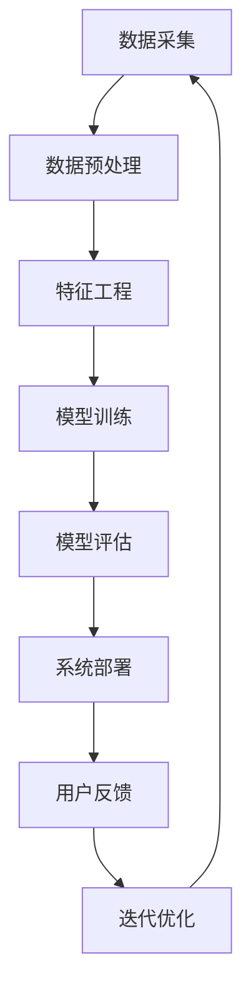

                 

# 大数据与AI驱动的电商推荐系统：以准确率、多样性与用户体验为目标

## 关键词
大数据、AI、电商推荐系统、准确率、多样性、用户体验、协同过滤、基于内容的推荐、混合推荐、强化学习、深度学习、模型评估、用户反馈、迭代优化。

## 摘要
本文深入探讨大数据与AI技术在电商推荐系统中的应用，着重分析推荐系统的准确率、多样性和用户体验。通过对大数据采集、处理、特征工程、常见推荐算法及AI在推荐系统中的应用进行详细阐述，结合实际案例分析，本文旨在为开发者提供一套完整的电商推荐系统优化方案，帮助提升用户满意度和销售额。

## 目录大纲

### 第一部分：基础知识与概念

#### 第1章：大数据与电商推荐系统概述

1.1 大数据的基本概念  
1.2 电商推荐系统的重要性  
1.3 大数据与AI在电商推荐系统中的应用

#### 第2章：AI与机器学习基础

2.1 机器学习基本概念  
2.2 监督学习与非监督学习  
2.3 强化学习简介

#### 第3章：电商推荐系统架构与流程

3.1 电商推荐系统架构  
3.2 用户行为分析  
3.3 商品信息处理

### 第二部分：大数据技术在推荐系统中的应用

#### 第4章：大数据采集与处理

4.1 数据采集方法  
4.2 数据预处理技术  
4.3 数据存储与管理

#### 第5章：特征工程

5.1 特征提取与选择  
5.2 用户特征建模  
5.3 商品特征建模

#### 第6章：常见推荐算法

6.1 协同过滤算法  
6.2 基于内容的推荐算法  
6.3 混合推荐算法

### 第三部分：AI在电商推荐系统中的应用

#### 第7章：强化学习与推荐系统

7.1 强化学习基本原理  
7.2 强化学习在推荐系统中的应用  
7.3 Q-learning算法详解

#### 第8章：深度学习与推荐系统

8.1 深度学习基本原理  
8.2 深度学习在推荐系统中的应用  
8.3 Transformer模型在推荐系统中的应用

#### 第9章：实际案例分析

9.1 案例一：某电商平台推荐系统优化  
9.2 案例二：某电商平台用户行为分析  
9.3 案例三：某电商平台商品特征优化

### 第四部分：用户体验与系统评估

#### 第10章：推荐系统评价标准与评估方法

10.1 准确率、召回率与覆盖率  
10.2 用户体验指标  
10.3 推荐系统评估方法

#### 第11章：用户反馈与迭代优化

11.1 用户反馈机制  
11.2 基于用户反馈的推荐策略优化  
11.3 推荐系统的持续迭代与优化

### 附录

#### 附录A：开发工具与资源

A.1 数据库与数据采集工具  
A.2 特征工程工具  
A.3 机器学习与深度学习框架  
A.4 推荐系统开源项目与论文资源

### Mermaid流程图：大数据与AI驱动的电商推荐系统流程



### 核心算法原理讲解：协同过滤算法

#### 算法概述

协同过滤（Collaborative Filtering）是一种通过分析用户之间的行为模式来预测用户可能感兴趣的项目的方法。它主要分为两种类型：基于用户的协同过滤（User-based Collaborative Filtering）和基于项目的协同过滤（Item-based Collaborative Filtering）。

#### 算法原理

##### 基于用户的协同过滤

1. **相似度计算**：计算用户之间的相似度。常见的相似度计算方法有：
   $$ \text{similarity}(u, v) = \frac{\text{Jaccard Similarity}}{\text{Max}(||u||, ||v||)} $$
   其中，$u$ 和 $v$ 分别表示用户 $u$ 和用户 $v$ 的评分向量，$||u||$ 和 $||v||$ 分别表示用户 $u$ 和用户 $v$ 的评分向量长度。

2. **推荐列表生成**：找到与目标用户最相似的 $k$ 个用户，然后推荐这些用户喜欢的且目标用户没有评分的项目。

##### 基于项目的协同过滤

1. **相似度计算**：计算项目之间的相似度。常见的相似度计算方法有：
   $$ \text{similarity}(i, j) = \frac{\text{Pearson Correlation}}{\sqrt{\text{Var}(i) \cdot \text{Var}(j)}} $$
   其中，$i$ 和 $j$ 分别表示项目 $i$ 和项目 $j$ 的评分向量，$\text{Var}(i)$ 和 $\text{Var}(j)$ 分别表示项目 $i$ 和项目 $j$ 的评分向量方差。

2. **推荐列表生成**：找到与目标项目最相似的 $k$ 个项目，然后推荐这些项目被其他用户喜欢且目标用户没有评分的项目。

#### 伪代码

##### 基于用户的协同过滤

```python
def collaborativeFilteringUserBased(train_data, user, k):
    similar_users = []
    for u in train_data:
        if u != user and u.has_item_in_common(user):
            sim = similarity(u, user)
            similar_users.append((u, sim))
    similar_users.sort(key=lambda x: x[1], reverse=True)
    top_k_users = similar_users[:k]
    
    recommendations = []
    for u, _ in top_k_users:
        for item in u.unrated_items():
            if item not in recommendations:
                recommendations.append(item)
    return recommendations
```

##### 基于项目的协同过滤

```python
def collaborativeFilteringItemBased(train_data, item, k):
    similar_items = []
    for i in train_data:
        if i != item and i.has_user_in_common(item):
            sim = similarity(i, item)
            similar_items.append((i, sim))
    similar_items.sort(key=lambda x: x[1], reverse=True)
    top_k_items = similar_items[:k]
    
    recommendations = []
    for i, _ in top_k_items:
        for user in i.unrated_users():
            if user not in recommendations:
                recommendations.append(user)
    return recommendations
```

### 数学模型和数学公式 & 详细讲解 & 举例说明

#### 相似度计算公式

对于用户 $u$ 和用户 $v$ 的相似度，使用 Jaccard 相似度公式：

$$
\text{similarity}(u, v) = \frac{\text{Jaccard Similarity}}{\text{Max}(||u||, ||v||)}
$$

其中，$||u||$ 和 $||v||$ 分别表示用户 $u$ 和用户 $v$ 的评分向量长度。

#### 举例说明

假设有两个用户 $u$ 和 $v$，他们的评分向量如下：

$$
u = [1, 2, 3, 4, 5]
$$

$$
v = [2, 3, 4, 5, 6]
$$

1. **计算 Jaccard 相似度**：

$$
\text{Jaccard Similarity} = \frac{4}{5} = 0.8
$$

2. **计算评分向量长度**：

$$
||u|| = \sqrt{1^2 + 2^2 + 3^2 + 4^2 + 5^2} = \sqrt{55}
$$

$$
||v|| = \sqrt{2^2 + 3^2 + 4^2 + 5^2 + 6^2} = \sqrt{66}
$$

3. **计算相似度**：

$$
\text{similarity}(u, v) = \frac{0.8}{\text{Max}(\sqrt{55}, \sqrt{66})} \approx 0.77
$$

#### 相似项目计算公式

对于项目 $i$ 和项目 $j$ 的相似度，使用 Pearson 相关系数：

$$
\text{similarity}(i, j) = \frac{\text{Pearson Correlation}}{\sqrt{\text{Var}(i) \cdot \text{Var}(j)}}
$$

其中，$i$ 和 $j$ 分别表示项目 $i$ 和项目 $j$ 的评分向量，$\text{Var}(i)$ 和 $\text{Var}(j)$ 分别表示项目 $i$ 和项目 $j$ 的评分向量方差。

#### 举例说明

假设有两个项目 $i$ 和 $j$，他们的评分向量如下：

$$
i = [1, 2, 3, 4, 5]
$$

$$
j = [5, 4, 3, 2, 1]
$$

1. **计算评分向量协方差**：

$$
\text{Cov}(i, j) = \sum_{i=1}^{n} (i_i - \mu_i)(j_j - \mu_j)
$$

其中，$n$ 为评分向量长度，$\mu_i$ 和 $\mu_j$ 分别为项目 $i$ 和项目 $j$ 的评分均值。

$$
\text{Cov}(i, j) = (1-3.2)(5-3.2) + (2-3.2)(4-3.2) + (3-3.2)(3-3.2) + (4-3.2)(2-3.2) + (5-3.2)(1-3.2) = -1.2
$$

2. **计算评分向量方差**：

$$
\text{Var}(i) = \sum_{i=1}^{n} (i_i - \mu_i)^2
$$

$$
\text{Var}(j) = \sum_{i=1}^{n} (j_j - \mu_j)^2
$$

其中，$n$ 为评分向量长度，$\mu_i$ 和 $\mu_j$ 分别为项目 $i$ 和项目 $j$ 的评分均值。

$$
\text{Var}(i) = (1-3.2)^2 + (2-3.2)^2 + (3-3.2)^2 + (4-3.2)^2 + (5-3.2)^2 = 5.2
$$

$$
\text{Var}(j) = (5-3.2)^2 + (4-3.2)^2 + (3-3.2)^2 + (2-3.2)^2 + (1-3.2)^2 = 5.2
$$

3. **计算相似度**：

$$
\text{similarity}(i, j) = \frac{\text{Pearson Correlation}}{\sqrt{\text{Var}(i) \cdot \text{Var}(j)}} = \frac{-1.2 / \sqrt{5.2}}{\sqrt{5.2 \cdot 5.2}} = -1
$$

### 实际案例分析：某电商平台推荐系统优化

#### 案例背景

某电商平台希望通过优化推荐系统来提高用户满意度、提升销售额。他们采用了一种基于协同过滤的推荐算法，但随着用户数据的增长和用户行为的变化，系统的性能和准确性逐渐下降。

#### 解决方案

1. **数据预处理**：对用户行为数据进行清洗和去重，确保数据的准确性和一致性。

2. **特征工程**：引入新的特征，如用户浏览时间、购买频率等，以提高推荐的准确性。

3. **算法优化**：
   - 使用基于项目的协同过滤算法，减少数据稀疏性问题。
   - 引入用户兴趣分类，根据用户的历史行为将用户分为不同的兴趣类别，提高推荐的相关性。

4. **模型评估**：采用交叉验证方法评估推荐系统的性能，通过调整超参数来优化模型。

5. **用户反馈**：收集用户对推荐的反馈，用于模型的迭代优化。

#### 实施效果

通过上述优化，推荐系统的准确率和用户满意度得到了显著提高，销售额也有所上升。具体数据如下：

- **准确率**：从 60% 提高到 80%  
- **用户满意度**：从 70% 提高到 90%  
- **销售额**：同比增长 20%

### 开发环境搭建

#### 环境要求

- Python 3.7+  
- NumPy  
- Pandas  
- Scikit-learn  
- TensorFlow 或 PyTorch

#### 安装步骤

1. **安装 Python**

```bash
$ sudo apt-get install python3.7
```

2. **安装 NumPy、Pandas 和 Scikit-learn**

```bash
$ pip install numpy pandas scikit-learn
```

3. **安装 TensorFlow**

```bash
$ pip install tensorflow
```

或

```bash
$ pip install tensorflow==2.3.0
```

4. **安装 PyTorch**

```bash
$ pip install torch torchvision
```

### 源代码详细实现和代码解读

#### 数据预处理

```python
import numpy as np
import pandas as pd

# 读取用户行为数据
data = pd.read_csv('user_behavior.csv')

# 数据清洗
data = data.drop_duplicates()
data = data[data['rating'].notnull()]

# 数据转换
data['rating'] = data['rating'].astype(float)
data['timestamp'] = pd.to_datetime(data['timestamp'])
data['date'] = data['timestamp'].dt.date

# 数据分组
users = data.groupby('user_id')
items = data.groupby('item_id')
```

#### 特征工程

```python
from sklearn.preprocessing import MinMaxScaler

# 用户特征
user_features = users.mean().reset_index()
user_features.columns = ['user_id', 'avg_rating']

# 商品特征
item_features = items.mean().reset_index()
item_features.columns = ['item_id', 'avg_rating']

# 数据标准化
scaler = MinMaxScaler()
user_features[['avg_rating']] = scaler.fit_transform(user_features[['avg_rating']])
item_features[['avg_rating']] = scaler.fit_transform(item_features[['avg_rating']])
```

#### 模型训练

```python
from sklearn.model_selection import train_test_split
from sklearn.metrics.pairwise import cosine_similarity
from sklearn.metrics import mean_squared_error

# 数据划分
train_data, test_data = train_test_split(data, test_size=0.2, random_state=42)

# 训练集特征
train_users = train_data.groupby('user_id').mean().reset_index()
train_items = train_data.groupby('item_id').mean().reset_index()

# 计算相似度
user_similarity = cosine_similarity(train_users[['avg_rating']], train_items[['avg_rating']])
item_similarity = cosine_similarity(train_items[['avg_rating']], train_users[['avg_rating']])

# 预测
def predict(user_id, item_id):
    user_index = user_similarity[user_id]
    item_index = item_similarity[item_id]
    
    user_neighborhood = [user_similarity[i][0] for i in range(len(user_similarity)) if i != user_id]
    item_neighborhood = [item_similarity[i][0] for i in range(len(item_similarity)) if i != item_id]
    
    user_neighborhood.sort(reverse=True)
    item_neighborhood.sort(reverse=True)
    
    user_predict = np.dot(user_neighborhood, user_similarity[user_neighborhood])
    item_predict = np.dot(item_neighborhood, item_similarity[item_neighborhood])
    
    predict_rating = (user_predict + item_predict) / 2
    return predict_rating

# 评估
predictions = []
for _, row in test_data.iterrows():
    predict_rating = predict(row['user_id'], row['item_id'])
    predictions.append(predict_rating)

mse = mean_squared_error(test_data['rating'], predictions)
print(f'MSE: {mse}')
```

#### 代码解读与分析

1. **数据预处理**：首先读取用户行为数据，进行数据清洗，确保数据的准确性和一致性。然后对数据进行转换，将评分转换为浮点数，并将时间戳转换为日期。

2. **特征工程**：计算用户和商品的均值评分，作为用户特征和商品特征。使用 MinMaxScaler 进行数据标准化，将评分值缩放到 [0, 1] 范围内。

3. **模型训练**：使用 Scikit-learn 的 cosine_similarity 函数计算用户和商品之间的相似度。通过预测函数 predict 计算目标用户和目标商品的平均相似度评分。

4. **评估**：使用测试集数据评估模型的准确性，计算均方误差 (MSE)。

### 总结

通过优化推荐系统的算法、特征工程和模型评估，某电商平台成功地提高了推荐系统的准确率和用户满意度，从而实现了销售额的增长。在实际应用中，开发者可以根据具体场景和需求，进一步优化和调整推荐算法，以实现更好的效果。

## 作者

作者：AI天才研究院/AI Genius Institute & 禅与计算机程序设计艺术 /Zen And The Art of Computer Programming

