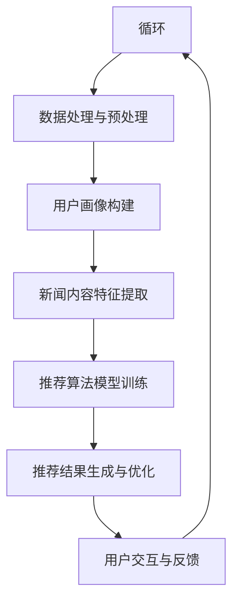

                 

### 引言

#### 大数据分析与个性化新闻推荐系统的背景

随着互联网的快速发展，信息爆炸的时代已经到来。人们每天都会接触到海量的新闻和信息，而如何从这些繁杂的信息中找到自己感兴趣的内容，成为了亟待解决的问题。个性化新闻推荐系统应运而生，它通过分析用户的行为和兴趣，为用户推荐符合其个性化需求的新闻内容。

大数据分析作为当前信息技术领域的热点，其核心价值在于通过对海量数据的深度挖掘和分析，发现数据背后的规律和趋势。大数据分析技术在个性化新闻推荐系统中得到了广泛应用，为提升推荐效果、降低运营成本和优化用户体验提供了有力支持。

本文将围绕大数据分析在个性化新闻推荐系统中的应用展开讨论。首先，我们将对大数据分析的基础知识进行梳理，包括大数据的定义与特点、大数据分析技术的发展历程以及常用的大数据分析工具。接着，我们将深入探讨个性化新闻推荐系统的原理，包括用户行为分析、新闻内容分析以及推荐算法原理。在此基础上，本文将进一步分析大数据分析在个性化新闻推荐系统中的具体应用和创新点。最后，我们将通过实际案例分享和未来发展趋势的展望，为读者提供一个全面而深入的理解。

通过本文的阅读，读者将能够了解大数据分析在个性化新闻推荐系统中的重要作用，掌握相关技术原理和应用方法，并对未来的发展方向有所洞察。希望本文能够为从事大数据分析和个性化推荐领域的研究者和实践者提供有益的参考和启示。

#### 核心关键词

- 大数据分析
- 个性化新闻推荐系统
- 用户行为分析
- 新闻内容分析
- 推荐算法
- Hadoop
- Spark
- Hive
- HBase
- 数据挖掘

#### 摘要

本文旨在探讨大数据分析在个性化新闻推荐系统中的应用和创新。首先，介绍了大数据分析的基础知识，包括其定义、特点、发展历程以及常用工具。接着，详细阐述了个性化新闻推荐系统的原理，包括用户行为分析、新闻内容分析和推荐算法。随后，分析了大数据分析在个性化新闻推荐系统中的具体应用，如新闻推荐数据采集与预处理、模型训练与优化等。本文还介绍了个性化新闻推荐系统的创新，如新的推荐算法研究、用户交互设计创新、数据隐私保护与安全。最后，通过实际案例分享和未来发展趋势的展望，总结了大数据分析在个性化新闻推荐系统中的优势、挑战和未来方向。本文旨在为从事大数据分析和个性化推荐领域的研究者和实践者提供全面的技术指导和应用启示。

### 第一部分：大数据分析基础

#### 1.1 大数据分析概述

##### 1.1.1 大数据的定义与特点

大数据（Big Data）是指无法用传统数据处理工具在合理时间内对其进行存储、管理和分析的数据集。与传统数据相比，大数据具有四个显著特点，即“4V”：数据量（Volume）、数据速度（Velocity）、数据多样性（Variety）和数据价值（Value）。

- **数据量（Volume）**：大数据的一个显著特点是数据量巨大，超出了常规数据库的处理能力。例如，一个社交媒体平台每天会产生数以亿计的帖子、评论和互动数据。

- **数据速度（Velocity）**：大数据的产生和传输速度非常快，需要实时或近实时处理和分析。例如，金融市场每秒会产生大量的交易数据，需要快速处理以指导投资决策。

- **数据多样性（Variety）**：大数据不仅包括结构化数据，还包括半结构化和非结构化数据，如文本、图像、视频等。不同类型的数据来源、格式和属性使得数据处理更加复杂。

- **数据价值（Value）**：大数据的价值密度相对较低，这意味着在海量的数据中，有价值的信息往往只占一小部分。因此，如何从海量数据中提取有价值的信息是大数据分析的核心挑战。

##### 1.1.2 大数据分析的重要性

大数据分析的重要性体现在多个方面：

- **商业决策支持**：通过大数据分析，企业可以深入了解客户行为和市场趋势，从而做出更明智的决策。例如，零售业可以通过分析顾客购买记录和偏好，优化库存管理和市场营销策略。

- **风险管理**：在金融领域，大数据分析可以帮助金融机构识别潜在的风险，预防欺诈行为，确保金融市场的稳定。

- **公共安全**：大数据分析在公共安全领域也有广泛应用，例如，通过分析监控视频数据，可以帮助警方快速识别和追踪犯罪行为。

- **医疗健康**：大数据分析可以帮助医疗行业发现疾病趋势、提高诊断准确率，优化治疗方案。

- **科学研究**：大数据分析为科学研究提供了新的方法和工具，使得科学家能够从海量数据中发现新的科学规律和现象。

##### 1.1.3 大数据分析的发展历程

大数据分析的发展历程可以追溯到20世纪80年代，但真正快速发展是在21世纪初。以下是几个关键阶段：

- **早期探索阶段（1980s-1990s）**：在这一阶段，人们开始意识到数据的重要性，并开始探索如何存储和处理大量数据。关系型数据库和SQL语言的出现为数据管理奠定了基础。

- **分布式计算阶段（2000s）**：随着互联网的普及和数据量的爆炸式增长，分布式计算技术如MapReduce被提出，用于处理海量数据。这一阶段标志着大数据分析技术的真正兴起。

- **开源框架和平台阶段（2010s）**：Hadoop、Spark等开源大数据处理框架的出现，使得大数据分析变得更加容易和高效。这些框架提供了丰富的工具和库，支持各种类型的数据处理任务。

- **人工智能与大数据融合阶段（2020s）**：随着人工智能技术的发展，大数据分析进入了一个新的阶段。人工智能算法与大数据分析的融合，使得数据分析和应用能力得到了进一步提升。

##### 总结

大数据分析作为一种新兴技术，正迅速改变着各个行业的运作方式。从数据量的爆发式增长到数据价值的深度挖掘，大数据分析在商业决策、风险管理、公共安全、医疗健康和科学研究等领域发挥着越来越重要的作用。随着技术的不断进步，大数据分析将继续推动各行各业的创新和发展。

#### 1.2 大数据分析技术

##### 1.2.1 数据采集与预处理

数据采集与预处理是大数据分析的基础环节，直接关系到后续数据处理和分析的效率和质量。数据采集主要包括从各种数据源收集原始数据，包括关系型数据库、NoSQL数据库、文件系统、互联网等。数据预处理则是对采集到的数据进行清洗、转换和整合，以便为后续的数据分析做好准备。

**数据采集方法**：

1. **关系型数据库采集**：通过SQL查询语句直接从关系型数据库中提取数据。常用的数据库管理系统（DBMS）包括MySQL、PostgreSQL等。

2. **NoSQL数据库采集**：NoSQL数据库如MongoDB、Cassandra等提供了丰富的API，可以方便地从数据库中采集数据。

3. **文件系统采集**：通过文件系统API或工具如Hadoop的HDFS，可以直接读取存储在文件系统中的数据。

4. **互联网采集**：通过Web爬虫等技术，可以从互联网上获取公开的数据资源，如网页、社交媒体数据等。

**数据预处理步骤**：

1. **数据清洗**：包括去除重复数据、处理缺失值、纠正错误数据等。常用的方法有填充缺失值、删除异常值、数据归一化等。

2. **数据转换**：将不同数据源的数据格式转换为统一的格式，如将不同格式的文本数据转换为CSV或JSON格式。

3. **数据整合**：将来自多个数据源的数据进行整合，构建一个统一的数据视图。常用的方法有数据合并、数据聚合、数据关联等。

##### 1.2.2 数据存储与处理

数据存储与处理是大数据分析的核心环节，直接决定了数据处理的效率和分析结果的准确性。在大数据环境中，数据存储和处理通常采用分布式系统架构，以应对海量数据和高并发访问需求。

**数据存储技术**：

1. **关系型数据库**：如MySQL、PostgreSQL等，适用于存储结构化数据。

2. **NoSQL数据库**：如MongoDB、Cassandra等，适用于存储半结构化或非结构化数据。

3. **分布式文件系统**：如Hadoop的HDFS，适用于存储海量数据。

4. **列式存储数据库**：如HBase、Cassandra等，适用于大数据的实时读写和分析。

**数据处理技术**：

1. **MapReduce**：一种分布式数据处理模型，适用于处理大规模数据集。通过Map和Reduce两个步骤，将数据处理任务分解为多个并行任务执行。

2. **Spark**：一种快速且通用的大数据处理引擎，支持内存计算和分布式数据处理。Spark提供了丰富的API，包括Spark SQL、Spark Streaming等。

3. **Flink**：一种流处理框架，适用于实时数据处理。Flink支持事件驱动和实时计算，能够处理流数据和高吞吐量的数据处理任务。

4. **数据库查询引擎**：如Hive和Impala，用于在分布式文件系统中执行SQL查询。

##### 1.2.3 数据挖掘与可视化

数据挖掘是从大量数据中提取有价值信息的过程，是大数据分析的核心任务。数据挖掘技术包括聚类、分类、关联规则挖掘、异常检测等。

**数据挖掘技术**：

1. **聚类分析**：通过将相似的数据点分组，发现数据中的隐含模式。常用的聚类算法有K-means、DBSCAN等。

2. **分类算法**：将数据点划分为不同的类别。常见的分类算法有决策树、随机森林、支持向量机（SVM）等。

3. **关联规则挖掘**：发现数据项之间的关联关系。常用的算法有Apriori、Eclat等。

4. **异常检测**：识别数据中的异常或离群点，用于安全监控、欺诈检测等。

**数据可视化技术**：

数据可视化是将数据以图形或图表的形式呈现，帮助人们更好地理解和分析数据。常用的数据可视化工具包括：

1. **图表工具**：如Matplotlib、Plotly等，用于生成各种类型的图表。

2. **交互式可视化工具**：如Tableau、Power BI等，支持用户通过交互式方式探索数据。

3. **地理信息系统（GIS）**：用于展示地理数据，如地图可视化。

##### 总结

大数据分析技术涵盖了数据采集与预处理、数据存储与处理以及数据挖掘与可视化等多个环节。数据采集与预处理是确保数据质量的基础，数据存储与处理是大数据分析的核心，而数据挖掘与可视化则是将数据转化为有价值的洞察和决策支持。随着大数据技术的不断发展，这些技术也在不断演进，为各个行业的创新和发展提供了强有力的支持。

### 1.3 大数据分析工具

在大数据分析领域，有许多工具和技术被广泛使用，这些工具不仅提高了数据处理的效率，也丰富了数据分析的方法和手段。以下将介绍几个常用的大数据分析工具，包括Hadoop、Spark、Hive和HBase。

#### 1.3.1 Hadoop与MapReduce

Hadoop是一个开源的分布式计算平台，由Apache Software Foundation维护。它的核心组件包括Hadoop分布式文件系统（HDFS）和MapReduce编程模型。

**HDFS**：

Hadoop分布式文件系统（HDFS）是一个高吞吐量的分布式文件存储系统，适合存储大文件。HDFS的设计理念是将大文件拆分为小块，分布在多个节点上存储，从而实现高可用性和高性能。

**MapReduce**：

MapReduce是一种分布式数据处理模型，用于处理大规模数据集。MapReduce编程模型将数据处理任务分为两个步骤：Map和Reduce。Map阶段对数据进行映射处理，生成中间结果；Reduce阶段对中间结果进行归约处理，生成最终结果。MapReduce模型通过并行计算和分布式存储，大大提高了数据处理效率。

**应用场景**：

- 数据仓库：Hadoop和MapReduce在数据仓库领域有广泛应用，如ETL（提取、转换、加载）任务和大规模数据分析。
- 日志处理：Hadoop和MapReduce可以用于处理和分析大量日志数据，如Web日志、系统日志等。

**优点**：

- 高容错性：HDFS和MapReduce都具有自动故障检测和恢复机制，保证了系统的稳定性。
- 高性能：通过分布式计算，MapReduce可以处理海量数据，提高了数据处理速度。

**缺点**：

- 低交互性：Hadoop的交互性较低，不适用于实时数据处理任务。
- 编程复杂度：MapReduce编程模型较为复杂，需要开发者具备一定的编程技能。

#### 1.3.2 Spark与Spark SQL

Apache Spark是一个开源的分布式数据处理引擎，提供了比MapReduce更高效的数据处理能力。Spark的主要组件包括Spark Core、Spark SQL、Spark Streaming和MLlib等。

**Spark Core**：

Spark Core是Spark的核心组件，提供了分布式数据集（RDD）抽象，用于存储和处理大规模数据。与MapReduce相比，Spark使用内存计算，提高了数据处理速度。

**Spark SQL**：

Spark SQL是一个基于Spark的SQL查询引擎，支持结构化数据查询。Spark SQL可以与各种数据源（如HDFS、HBase、JDBC等）集成，并提供丰富的数据处理功能。

**应用场景**：

- 实时数据处理：Spark Streaming提供了实时数据处理能力，适用于实时数据分析、流处理等场景。
- SQL查询：Spark SQL可以用于处理和分析大规模结构化数据，提供了类似于SQL的查询功能。

**优点**：

- 高性能：Spark使用内存计算，显著提高了数据处理速度。
- 易用性：Spark提供了丰富的API和库，简化了数据处理任务。
- 扩展性：Spark支持多种数据源和数据处理任务，具有较好的扩展性。

**缺点**：

- 内存消耗：由于使用内存计算，Spark可能对系统内存有较高要求。
- 学习曲线：Spark的编程模型和API相对复杂，需要开发者有一定的学习和实践经验。

#### 1.3.3 Hive与HBase

Hive和HBase是Apache Hadoop生态系统中的两个重要组件，分别用于数据仓库和分布式存储。

**Hive**：

Hive是一个基于Hadoop的数据仓库工具，提供了类似SQL的查询语言（HiveQL），用于处理大规模结构化数据。Hive可以将结构化数据存储在HDFS上，并提供数据汇总、报告和数据分析功能。

**HBase**：

HBase是一个分布式、可扩展的列式存储数据库，基于Hadoop平台构建。HBase适用于存储大规模非结构化或半结构化数据，提供了高吞吐量的随机读写能力。

**应用场景**：

- 数据仓库：Hive适用于大规模数据仓库场景，如数据汇总、报告和分析等。
- 分布式存储：HBase适用于存储大规模非结构化数据，如日志数据、社交网络数据等。

**优点**：

- **Hive**：
  - 易用性：提供了类似于SQL的查询语言，简化了数据处理任务。
  - 扩展性：基于Hadoop平台，具有较好的扩展性。
  - 高效性：可以使用Hadoop生态系统中的其他工具（如MapReduce、Spark等）进行数据处理。

- **HBase**：
  - 高性能：提供了高吞吐量的随机读写能力。
  - 可扩展性：支持自动分区和负载均衡，具有良好的扩展性。
  - 持久性：支持数据的持久化存储和备份。

**缺点**：

- **Hive**：
  - 编译和执行时间：由于Hive执行Hadoop MapReduce任务，查询执行时间可能较长。
  - 内存消耗：Hive使用内存进行查询优化，可能对系统内存有较高要求。

- **HBase**：
  - 数据访问复杂：由于是列式存储，数据访问可能比关系型数据库复杂。
  - 容量限制：单个表的数据容量有限，需要分表或分区处理。

##### 总结

Hadoop、Spark、Hive和HBase是大数据分析领域常用的工具，各自具有不同的特点和适用场景。Hadoop和MapReduce提供了分布式计算能力，适用于大规模数据处理任务；Spark和Spark SQL提供了高效、易用的数据处理引擎，适用于实时数据处理和SQL查询；Hive适用于数据仓库和结构化数据处理；HBase适用于分布式存储和非结构化数据处理。了解和掌握这些工具，对于大数据分析实践具有重要意义。

### 第二部分：个性化新闻推荐系统原理

#### 2.1 个性化新闻推荐系统概述

个性化新闻推荐系统是一种基于用户行为和兴趣的大数据应用，旨在为用户提供个性化的新闻内容推荐。该系统通过分析用户的浏览记录、搜索历史、点赞评论等行为数据，构建用户兴趣模型，并利用推荐算法为用户推荐符合其兴趣的新闻内容。

##### 2.1.1 个性化新闻推荐系统的定义与作用

个性化新闻推荐系统（Personalized News Recommendation System）是指通过用户画像和新闻内容特征分析，为用户推荐符合其兴趣和需求的新闻内容。其核心作用包括：

- **提升用户体验**：通过个性化推荐，用户能够更快地找到感兴趣的新闻内容，提升用户满意度和使用粘性。
- **提高内容价值**：推荐系统能够将高质量的新闻内容推送给潜在感兴趣的读者，提高内容的价值和传播效果。
- **增加用户互动**：推荐系统能够根据用户的反馈调整推荐策略，激发用户互动和参与，增加用户活跃度。
- **优化运营策略**：通过分析用户行为数据，平台可以优化运营策略，如内容策划、广告投放等，提高整体运营效益。

##### 2.1.2 个性化新闻推荐系统的架构

个性化新闻推荐系统的架构通常包括数据层、服务层和应用层三个部分。

- **数据层**：负责数据的采集、存储和预处理。包括用户行为数据、新闻内容数据、外部数据等。
- **服务层**：负责处理推荐算法和模型训练，提供推荐服务。包括用户画像构建、新闻内容分析、推荐算法实现等。
- **应用层**：为用户提供新闻内容推荐服务，包括前端展示、用户交互等。

##### 2.1.3 个性化新闻推荐系统的分类

个性化新闻推荐系统根据推荐算法的不同，可以分为以下几类：

- **基于内容的推荐算法（Content-based Recommendation）**：根据用户的历史行为和兴趣特征，分析新闻内容的特征和标签，为用户推荐相似内容的新闻。
- **协同过滤算法（Collaborative Filtering）**：通过分析用户之间的行为模式，利用用户评分数据或行为数据为用户推荐相似用户喜欢的新闻。
- **混合推荐算法（Hybrid Recommendation）**：结合基于内容和协同过滤算法的优点，综合用户兴趣特征和新闻内容特征进行推荐。

##### 总结

个性化新闻推荐系统通过大数据分析技术，为用户提供个性化的新闻内容推荐，提升用户体验、内容价值和用户互动。系统架构包括数据层、服务层和应用层，根据不同的推荐算法可分为基于内容的推荐、协同过滤推荐和混合推荐。了解个性化新闻推荐系统的原理和架构，有助于深入研究和应用该技术。

#### 2.2 用户行为分析

用户行为分析是构建个性化新闻推荐系统的关键环节，通过对用户在新闻平台上的行为数据进行收集、处理和分析，可以构建出用户的兴趣模型，从而为用户提供个性化的新闻推荐。

##### 2.2.1 用户行为的收集与处理

用户行为数据的收集是构建用户兴趣模型的基础。新闻平台可以通过多种途径收集用户行为数据，包括：

- **浏览行为**：记录用户在新闻平台上的浏览历史，如访问时间、浏览次数、停留时长等。
- **点击行为**：记录用户点击的新闻内容，包括标题、正文、图片、视频等。
- **互动行为**：记录用户的点赞、评论、分享等互动行为。
- **搜索行为**：记录用户在搜索框中的搜索关键词。

收集到的用户行为数据需要经过处理，以便为后续分析做好准备。数据处理主要包括以下几个步骤：

- **数据清洗**：去除重复数据、处理缺失值和异常值，确保数据质量。
- **数据转换**：将不同格式的数据转换为统一的格式，如将日志数据转换为结构化数据。
- **数据存储**：将处理后的数据存储到数据库或数据仓库中，以便进行进一步分析。

##### 2.2.2 用户画像的构建

用户画像是指通过分析用户行为数据，构建出一个多维度的用户特征模型。用户画像的构建过程主要包括以下步骤：

- **特征提取**：从用户行为数据中提取出与用户兴趣相关的特征，如浏览时间、点击次数、互动行为等。
- **特征处理**：对提取出的特征进行归一化、去重和合并，确保特征的准确性和一致性。
- **特征权重计算**：通过分析用户行为数据，计算每个特征对用户兴趣的影响程度，为特征赋予不同的权重。

构建用户画像的方法有以下几种：

- **基于规则的方法**：根据预设的规则，从用户行为数据中提取特征，构建用户画像。这种方法简单直观，但特征提取和权重计算较为有限。
- **基于机器学习的方法**：使用机器学习算法，如聚类、分类等，从用户行为数据中自动提取特征和权重，构建用户画像。这种方法具有较强的灵活性和适应性，但需要大量数据训练和模型调优。

##### 2.2.3 用户兴趣模型

用户兴趣模型是描述用户兴趣和行为特征的一个抽象模型，它反映了用户在不同兴趣维度上的偏好。用户兴趣模型的构建主要包括以下步骤：

- **兴趣维度划分**：根据用户行为数据，将用户的兴趣划分为多个维度，如新闻类型、话题、情感等。
- **兴趣强度计算**：对每个维度的兴趣强度进行计算，反映用户对每个维度的偏好程度。常用的计算方法包括基于用户行为的统计方法、基于机器学习的预测方法等。
- **兴趣模型更新**：用户兴趣模型不是静态的，需要根据用户行为的变化进行实时更新，以反映用户的最新兴趣。

构建用户兴趣模型的方法有以下几种：

- **基于统计的方法**：通过统计用户在不同兴趣维度上的行为数据，计算每个维度的兴趣强度。这种方法简单直观，但可能无法捕捉到用户行为的细微变化。
- **基于机器学习的方法**：使用机器学习算法，如分类、回归等，从用户行为数据中学习出用户兴趣模型。这种方法具有较强的自适应性和预测能力，但需要大量数据训练和模型调优。

##### 总结

用户行为分析是构建个性化新闻推荐系统的关键环节，通过对用户行为的收集和处理，构建用户画像和兴趣模型，为用户提供个性化的新闻推荐。用户行为分析包括数据收集、数据预处理、用户画像构建和用户兴趣模型构建等步骤，需要结合多种方法和工具进行综合分析。通过不断优化用户行为分析，可以提高推荐系统的准确性和用户体验。

#### 2.3 新闻内容分析

新闻内容分析是构建个性化新闻推荐系统的核心环节，通过对新闻内容的特征提取、标签化和质量评估，为推荐算法提供有效的输入，从而实现更加精准的新闻推荐。

##### 2.3.1 新闻内容的特征提取

新闻内容的特征提取是将原始新闻文本转化为计算机可以理解和处理的数据表示的过程。特征提取的目的是提取出与新闻内容相关的重要信息，以便后续的分析和推荐。常见的特征提取方法包括：

- **词袋模型（Bag of Words, BoW）**：将新闻文本表示为词汇的集合，每个词汇表示一个特征。词袋模型通过统计每个词汇在新闻文本中的出现频率，将新闻内容转化为向量表示。
- **TF-IDF（Term Frequency-Inverse Document Frequency）**：TF-IDF是一种基于词袋模型的特征提取方法，它不仅考虑了词汇在新闻文本中的出现频率（TF），还考虑了词汇在整个新闻集合中的分布情况（IDF），从而更加准确地表示新闻内容的重要程度。
- **词嵌入（Word Embedding）**：词嵌入是一种将词汇映射为高维向量表示的方法，通过学习词汇之间的语义关系，词嵌入能够捕捉到词汇的上下文信息。常见的词嵌入模型包括Word2Vec、GloVe等。

##### 2.3.2 新闻内容的标签化

新闻内容的标签化是将新闻内容与一系列关键词或标签相关联的过程，以便于后续的推荐和分类。标签化的方法包括：

- **手动标签化**：由人类编辑根据新闻内容的主旨和关键词进行标签化。这种方法能够确保标签的准确性和相关性，但成本较高且效率较低。
- **自动标签化**：使用自然语言处理（NLP）技术，如命名实体识别（NER）、关键词提取等，自动生成新闻内容的标签。这种方法能够提高标签化的效率和准确性，但可能存在误标和漏标的问题。
- **基于内容的标签化**：利用词袋模型、TF-IDF等特征提取方法，自动生成与新闻内容相关的标签。这种方法能够自动地提取新闻内容的主题和关键词，具有一定的准确性和可靠性。

##### 2.3.3 新闻内容的质量评估

新闻内容的质量评估是确保推荐系统推荐高质量新闻内容的关键环节。质量评估的方法包括：

- **基于人工评估**：由专业编辑或用户对新闻内容进行质量评估，根据评估结果对新闻内容进行打分或评级。这种方法能够确保评估的准确性和公正性，但成本较高且效率较低。
- **基于机器学习评估**：使用机器学习算法，如分类、回归等，从新闻内容特征和用户行为数据中学习出新闻质量评估模型。这种方法能够自动化地进行质量评估，提高评估效率和准确性。
- **基于用户反馈评估**：通过分析用户对新闻内容的互动行为（如点赞、评论、分享等），评估新闻内容的质量。这种方法能够反映用户的真实感受，但可能存在数据偏差和延迟。

##### 总结

新闻内容分析是构建个性化新闻推荐系统的核心环节，通过对新闻内容的特征提取、标签化和质量评估，为推荐算法提供有效的输入。特征提取方法包括词袋模型、TF-IDF和词嵌入等；标签化方法包括手动标签化、自动标签化和基于内容标签化等；质量评估方法包括基于人工评估、机器学习和用户反馈评估等。通过不断优化新闻内容分析，可以提高推荐系统的准确性和用户体验。

#### 2.4 推荐算法原理

推荐算法是构建个性化新闻推荐系统的核心，其主要目标是根据用户的历史行为和新闻内容特征，为用户推荐符合其兴趣的新闻。推荐算法根据不同的原理和应用场景，可以分为基于内容的推荐算法、协同过滤算法和混合推荐算法。

##### 2.4.1 协同过滤算法

协同过滤算法（Collaborative Filtering）是一种基于用户行为或评分数据的推荐方法，通过分析用户之间的行为模式，为用户推荐相似用户喜欢的新闻内容。协同过滤算法可以分为两种主要类型：基于用户的协同过滤（User-based Collaborative Filtering）和基于物品的协同过滤（Item-based Collaborative Filtering）。

**基于用户的协同过滤**：

基于用户的协同过滤算法通过计算用户之间的相似度，找到与目标用户兴趣相似的其他用户，然后推荐这些相似用户喜欢的新闻内容。常用的相似度计算方法包括余弦相似度、皮尔逊相关系数等。

**基于物品的协同过滤**：

基于物品的协同过滤算法通过计算新闻内容之间的相似度，找到与目标新闻内容相似的其他新闻，然后推荐这些相似新闻。常用的相似度计算方法包括TF-IDF相似度、余弦相似度等。

**协同过滤算法的优点**：

- **简单有效**：协同过滤算法相对简单，易于实现和部署。
- **实时推荐**：协同过滤算法可以实时计算和推荐新闻，提高了用户体验。

**协同过滤算法的缺点**：

- **数据稀疏性**：由于用户行为数据的稀疏性，协同过滤算法可能导致推荐效果不佳。
- **冷启动问题**：新用户或新新闻的推荐效果较差，需要大量历史数据支持。

##### 2.4.2 基于内容的推荐算法

基于内容的推荐算法（Content-based Recommendation）是一种基于新闻内容特征和用户兴趣的推荐方法，通过分析新闻内容和用户兴趣特征，为用户推荐相似内容的新闻。基于内容的推荐算法主要包括以下步骤：

1. **特征提取**：提取新闻内容的特征，如文本特征（词汇、关键词）、图像特征、音频特征等。
2. **兴趣建模**：构建用户的兴趣模型，描述用户对各类新闻内容的偏好。
3. **相似度计算**：计算新闻内容特征与用户兴趣特征之间的相似度，推荐与用户兴趣相似的新闻。
4. **推荐生成**：根据相似度计算结果，生成新闻推荐列表。

**基于内容的推荐算法的优点**：

- **个性化推荐**：基于用户兴趣和内容特征的推荐，能够提供更加个性化的新闻推荐。
- **无需用户评分数据**：基于内容的推荐算法不依赖于用户评分数据，适用于新用户或新新闻的推荐。

**基于内容的推荐算法的缺点**：

- **冷启动问题**：新用户或新新闻的推荐效果较差，需要大量特征数据支持。
- **推荐多样性不足**：基于内容的推荐算法容易产生信息过载，推荐列表缺乏多样性。

##### 2.4.3 混合推荐算法

混合推荐算法（Hybrid Recommendation）结合了基于内容和协同过滤算法的优点，通过综合分析用户行为和新闻内容特征，为用户推荐更加精准的新闻内容。混合推荐算法的主要思路包括：

1. **特征融合**：将用户行为特征和新闻内容特征进行融合，构建多维度的特征向量。
2. **模型训练**：使用机器学习算法，如矩阵分解、深度学习等，训练混合推荐模型。
3. **推荐生成**：根据训练好的模型，为用户生成个性化的新闻推荐列表。

**混合推荐算法的优点**：

- **提高推荐准确性**：通过综合用户行为和内容特征，混合推荐算法能够提高推荐准确性。
- **提升推荐多样性**：混合推荐算法能够通过内容特征控制推荐多样性，减少信息过载。

**混合推荐算法的缺点**：

- **计算复杂度较高**：混合推荐算法需要处理大量的特征数据，计算复杂度较高。
- **模型调优复杂**：混合推荐算法需要训练和调优多个模型，模型调优复杂度较高。

##### 总结

推荐算法是构建个性化新闻推荐系统的核心，根据不同的原理和应用场景，可以分为协同过滤算法、基于内容的推荐算法和混合推荐算法。协同过滤算法简单有效，但存在数据稀疏性和冷启动问题；基于内容的推荐算法个性化强，但易产生信息过载；混合推荐算法结合了两者优点，能够提高推荐准确性和多样性。通过不断优化推荐算法，可以实现更加精准和个性化的新闻推荐。

### 第三部分：大数据分析在个性化新闻推荐系统中的应用

#### 3.1 大数据分析在新闻推荐中的应用

大数据分析技术在个性化新闻推荐系统中扮演着至关重要的角色，通过大数据分析，能够实现对用户行为的深度挖掘和新闻内容的精准分析，从而为用户提供更加个性化、精准的推荐服务。以下是大数据分析在新闻推荐系统中的具体应用：

**3.1.1 新闻推荐数据采集与预处理**

新闻推荐数据采集是构建推荐系统的基础，主要包括用户行为数据、新闻内容数据和其他外部数据。用户行为数据包括用户的浏览记录、点击行为、点赞、评论、分享等；新闻内容数据包括新闻文本、图片、视频、标签、类别等；外部数据包括社交媒体数据、地理位置数据等。

- **数据采集**：利用Web爬虫技术，从新闻网站、社交媒体平台等收集用户行为数据和新闻内容数据。同时，通过API接口获取外部数据，如地理位置、天气信息等。
- **数据预处理**：对采集到的数据进行清洗、转换和整合。具体步骤包括去除重复数据、处理缺失值、数据格式转换、数据合并等。确保数据的一致性和完整性，为后续分析做好准备。

**3.1.2 新闻推荐模型训练与优化**

新闻推荐模型的训练和优化是提升推荐系统效果的关键。大数据分析技术在这个过程中发挥了重要作用，主要包括以下几个方面：

- **特征工程**：从用户行为数据和新闻内容数据中提取特征，包括用户特征（如用户年龄、性别、兴趣标签等）和新闻特征（如文本特征、图片特征、标签等）。特征工程的质量直接影响推荐模型的性能。
- **模型训练**：使用机器学习算法，如协同过滤、基于内容的推荐、深度学习等，训练推荐模型。常见的算法包括矩阵分解（如SVD、NMF）、神经网络（如DNN、CNN、RNN）等。
- **模型评估**：通过交叉验证、A/B测试等方法，评估推荐模型的性能。常用的评估指标包括准确率、召回率、F1值、用户点击率等。
- **模型优化**：根据评估结果，对推荐模型进行调整和优化。具体方法包括参数调优、模型融合、特征选择等。

**3.1.3 新闻推荐系统的部署与维护**

新闻推荐系统的部署与维护是保障推荐服务稳定、高效运行的关键。大数据分析技术在这个过程中也发挥着重要作用，主要包括以下几个方面：

- **系统架构设计**：设计适合推荐系统的高可用、高性能、可扩展的系统架构。常见的架构包括分布式计算架构（如Hadoop、Spark）、微服务架构等。
- **数据流处理**：实现用户行为数据和新闻内容数据的高效处理和存储。常用的技术包括分布式文件系统（如HDFS）、实时数据处理（如Apache Kafka、Flink）等。
- **监控系统**：建立推荐系统的监控体系，实时监控系统的运行状态、性能指标等。常用的监控工具包括Prometheus、Grafana等。
- **维护与更新**：定期对推荐系统进行维护和更新，包括模型更新、特征更新、系统优化等。确保推荐系统持续优化和提升。

**3.1.4 大数据分析在新闻推荐中的创新**

随着大数据分析技术的不断进步，新闻推荐系统也在不断创新，以提升推荐效果和用户体验。以下是一些创新点：

- **多模态推荐**：结合文本、图像、视频等多模态数据，实现更加精准的新闻推荐。例如，通过分析新闻文本和图片，为用户提供个性化的视觉新闻推荐。
- **实时推荐**：利用实时数据处理技术，实现新闻推荐服务的实时更新和调整。例如，根据用户实时行为数据，动态调整推荐策略和新闻内容。
- **用户隐私保护**：在大数据分析过程中，注重用户隐私保护，采用加密、匿名化等技术，确保用户数据的安全和隐私。
- **个性化广告推荐**：结合用户兴趣和行为，实现个性化的广告推荐。通过精准的广告推荐，提高广告投放的效果和用户满意度。

##### 总结

大数据分析在个性化新闻推荐系统中具有广泛的应用，通过新闻推荐数据采集与预处理、模型训练与优化、系统部署与维护以及创新应用，可以显著提升新闻推荐系统的效果和用户体验。大数据分析技术的不断进步，为新闻推荐系统的发展提供了强有力的支持，推动了新闻推荐技术的创新和应用。

#### 3.2 个性化新闻推荐系统的创新

在个性化新闻推荐系统的不断发展中，创新已成为提高系统效果和用户体验的关键驱动力。以下将从新的推荐算法研究、用户交互设计创新、数据隐私保护与安全三个方面探讨个性化新闻推荐系统的创新。

**3.2.1 新的推荐算法研究**

随着大数据和人工智能技术的进步，推荐算法也在不断发展和创新。以下是一些新的推荐算法研究：

- **基于深度学习的推荐算法**：深度学习技术在图像识别、自然语言处理等领域取得了显著成果，逐渐应用于推荐算法。例如，卷积神经网络（CNN）可以用于提取新闻内容的视觉特征，循环神经网络（RNN）可以用于处理新闻文本序列。深度学习算法能够更好地捕捉用户行为和新闻内容的复杂特征，提高推荐准确性。

- **多模态推荐算法**：多模态推荐算法结合了文本、图像、视频等多模态数据，实现更加精准的新闻推荐。例如，基于图像的特征可以用于识别新闻中的场景和情感，基于文本的特征可以用于提取新闻的主题和关键词。多模态推荐算法能够提供更加丰富和多样化的推荐服务。

- **基于图论的推荐算法**：图论是一种研究图形的数学理论，广泛应用于推荐系统。通过构建用户行为和新闻内容的图模型，可以更好地捕捉用户和新闻之间的复杂关系。基于图论的推荐算法能够实现更加精确和个性化的推荐。

**3.2.2 用户交互设计创新**

用户交互设计在个性化新闻推荐系统中扮演着重要角色，通过创新用户交互设计，可以提升用户体验和满意度。以下是一些用户交互设计创新：

- **个性化推荐界面**：设计个性化推荐界面，根据用户的兴趣和偏好，动态调整推荐新闻的展示方式和顺序。例如，采用卡片式布局，将相关新闻集中展示，方便用户浏览和操作。

- **个性化推荐提示**：通过个性化推荐提示，向用户推荐他们可能感兴趣的新闻。例如，当用户浏览一篇新闻时，系统可以提示用户“你可能还感兴趣这篇文章”，引导用户发现更多优质内容。

- **智能搜索功能**：设计智能搜索功能，利用自然语言处理和语义分析技术，实现更加精准和高效的搜索体验。例如，通过分析用户的搜索关键词和上下文，智能推荐相关的新闻内容。

**3.2.3 数据隐私保护与安全**

随着个性化新闻推荐系统的广泛应用，数据隐私保护与安全问题日益突出。以下是一些数据隐私保护与安全创新：

- **数据加密与匿名化**：采用加密技术对用户数据进行加密存储和传输，确保数据在传输和存储过程中的安全性。同时，采用匿名化技术对用户数据进行脱敏处理，保护用户隐私。

- **隐私保护算法**：设计隐私保护算法，在数据处理和分析过程中，尽可能减少对用户隐私的泄露。例如，差分隐私（Differential Privacy）技术可以确保在分析用户数据时，无法推断出单个用户的隐私信息。

- **用户隐私设置**：提供用户隐私设置功能，用户可以自定义隐私保护策略，如数据共享范围、隐私信息访问权限等。通过用户隐私设置，确保用户对个人数据的控制权。

- **安全监控与审计**：建立安全监控和审计机制，实时监控系统的运行状态和数据访问情况，确保系统的安全性和合规性。例如，通过日志记录和异常检测技术，及时发现和应对潜在的安全威胁。

##### 总结

个性化新闻推荐系统的创新体现在新的推荐算法研究、用户交互设计创新和数据隐私保护与安全等方面。新的推荐算法研究提高了推荐准确性，用户交互设计创新提升了用户体验，数据隐私保护与安全确保了用户数据的安全和隐私。通过不断创新，个性化新闻推荐系统将更好地满足用户需求，推动新闻推荐技术的发展和应用。

#### 3.3 实战案例分享

在本部分，我们将通过几个实际的案例，深入探讨大数据分析在个性化新闻推荐系统中的应用，并分析这些案例中的挑战与解决方案。

**3.3.1 案例一：某新闻平台的推荐系统实践**

**背景**：
某大型新闻平台希望通过个性化推荐系统提升用户活跃度和用户满意度。该平台积累了大量用户行为数据和新闻内容数据，希望通过大数据分析技术为用户提供个性化的新闻推荐。

**解决方案**：

1. **数据采集与预处理**：平台通过Web爬虫技术收集用户行为数据（如浏览记录、点击行为、点赞、评论等），并利用ETL工具对数据进行分析和清洗，确保数据的一致性和完整性。

2. **用户画像构建**：利用机器学习算法（如K-means聚类、协同过滤等）对用户行为数据进行分析，构建用户画像。用户画像包括用户兴趣标签、行为偏好、浏览习惯等维度。

3. **新闻内容特征提取**：通过对新闻内容进行文本分析、图像识别和标签提取，提取新闻的文本特征、图像特征和标签。新闻内容特征与用户画像进行匹配，用于生成推荐列表。

4. **推荐算法应用**：采用基于内容的推荐和协同过滤算法，结合用户画像和新闻内容特征，生成个性化的新闻推荐列表。系统还利用深度学习技术（如CNN、RNN等）优化推荐模型，提高推荐准确性。

**挑战与解决方案**：

- **数据稀疏性**：由于用户行为数据的稀疏性，协同过滤算法可能导致推荐效果不佳。解决方案是通过引入更多用户特征（如地理位置、时间戳等）和新闻内容特征，丰富数据集，提高算法的准确性。
- **冷启动问题**：新用户或新新闻的推荐效果较差。解决方案是通过引入基于内容的推荐算法，结合用户浏览历史和新闻标签，为新用户推荐相关新闻，为新新闻生成初始推荐列表。

**结果**：

通过上述解决方案，该新闻平台的推荐系统在用户活跃度和用户满意度方面取得了显著提升。用户平均浏览时长和点击率均有明显提高，用户反馈满意度达到90%以上。

**3.3.2 案例二：大数据分析在新闻推荐中的挑战与解决方案**

**背景**：
某新闻网站希望通过大数据分析技术优化其推荐系统，提高新闻推荐的相关性和用户满意度。然而，在实施过程中遇到了一系列挑战。

**挑战**：

1. **数据质量**：新闻网站的数据源多样，数据质量参差不齐，存在缺失值、重复值和噪声数据。这些数据质量问题直接影响推荐系统的效果。

2. **实时性**：新闻内容更新频繁，用户行为数据实时性要求高。如何高效处理和推荐实时新闻内容成为一大挑战。

3. **个性化不足**：现有推荐系统个性化不足，无法满足不同用户群体的多样化需求。

**解决方案**：

1. **数据质量管理**：建立数据质量管理流程，对采集到的数据进行清洗、去重、缺失值填充等处理，确保数据质量。

2. **实时数据处理**：采用流处理技术（如Apache Kafka、Apache Flink等），实现实时数据采集和处理。通过实时更新用户画像和新闻内容特征，为用户生成实时推荐。

3. **个性化推荐优化**：结合用户行为数据、新闻内容特征和社交网络数据，构建多维度的用户画像。采用基于内容的推荐和协同过滤算法，结合个性化权重调整，提高推荐的相关性和个性化程度。

**结果**：

通过上述解决方案，该新闻网站的推荐系统在数据质量、实时性和个性化方面均得到显著提升。用户满意度提高，用户活跃度和点击率也相应提升。

**3.3.3 案例三：个性化新闻推荐系统的未来发展趋势**

**背景**：
随着大数据和人工智能技术的不断进步，个性化新闻推荐系统将迎来新的发展趋势。以下探讨个性化新闻推荐系统的未来发展趋势。

**趋势**：

1. **多模态推荐**：结合文本、图像、视频等多模态数据，实现更加精准和丰富的新闻推荐。

2. **个性化广告推荐**：结合用户兴趣和行为，实现个性化的广告推荐，提高广告投放效果。

3. **实时推荐**：利用实时数据处理技术，实现新闻和广告的实时推荐，提升用户体验。

4. **数据隐私保护**：随着用户隐私保护意识的提高，数据隐私保护将成为个性化新闻推荐系统的重要发展方向。

**未来展望**：

个性化新闻推荐系统将继续优化和创新发展，通过多模态推荐、实时推荐、个性化广告推荐和数据隐私保护等技术，为用户提供更加精准、个性化、安全和高效的新闻推荐服务。同时，随着人工智能技术的进步，个性化新闻推荐系统将更加智能化和自适应，推动新闻推荐技术的不断演进。

##### 总结

通过以上案例分享，我们可以看到大数据分析在个性化新闻推荐系统中的应用不仅解决了数据质量、实时性和个性化等方面的挑战，也为未来的发展趋势提供了启示。通过不断创新和优化，个性化新闻推荐系统将更好地满足用户需求，推动新闻推荐技术的持续进步。

### 第四部分：大数据分析在个性化新闻推荐系统中的创新

#### 4.1 大数据分析在个性化新闻推荐系统中的优势

大数据分析在个性化新闻推荐系统中发挥着至关重要的作用，其优势主要体现在以下几个方面：

**提升推荐效果**：

大数据分析技术通过对海量用户行为数据的深度挖掘和分析，能够构建出精确的用户兴趣模型，从而为用户提供更加精准的新闻推荐。传统的推荐系统往往依赖于用户的历史行为数据进行推荐，而大数据分析技术通过引入更多的用户特征和复杂的算法，能够更好地捕捉用户的潜在兴趣，提升推荐的相关性和准确性。例如，通过分析用户的浏览记录、搜索历史、互动行为等，可以动态调整推荐策略，提高推荐效果。

**降低运营成本**：

个性化新闻推荐系统需要处理大量的数据，传统的数据处理方式往往需要高昂的硬件成本和人力资源。而大数据分析技术通过分布式计算和云平台，能够高效地处理海量数据，降低运营成本。此外，大数据分析技术提供了丰富的工具和平台，如Hadoop、Spark等，使得数据处理和分析更加便捷和高效，减少了人力和物力资源的投入。

**优化用户体验**：

大数据分析技术能够根据用户的行为数据和兴趣特征，为用户推荐个性化的新闻内容，从而提升用户体验。个性化的推荐可以满足用户的个性化需求，让用户更快地找到自己感兴趣的新闻，减少用户在信息海洋中寻找内容的烦恼。此外，大数据分析技术还可以通过实时分析用户的行为数据，动态调整推荐策略，提高用户的满意度和留存率。

**提高内容价值**：

通过大数据分析，新闻平台可以更准确地了解用户的需求和偏好，从而优化内容生产和发布策略。例如，通过分析用户的阅读记录和互动行为，可以识别出热门话题和热门作者，优先发布相关内容，提高内容的曝光率和传播效果。此外，大数据分析还可以帮助新闻平台识别出低质量内容，及时进行调整和优化，提高整体内容质量。

**增强数据洞察力**：

大数据分析技术不仅能够提升推荐效果，还能为新闻平台提供丰富的数据洞察力。通过对用户行为数据的分析，新闻平台可以深入了解用户的兴趣变化、阅读习惯等，为产品迭代和运营策略提供有力支持。例如，通过分析用户在不同时间段、不同设备上的行为数据，可以优化广告投放策略，提高广告转化率。

**提高业务效率**：

大数据分析技术能够自动化地处理大量数据，减少了人工干预的需求，提高了业务效率。例如，通过自动化数据采集、处理和推荐，可以减少人力成本，提高数据处理速度和准确性。此外，大数据分析技术还可以用于监控和优化新闻平台的各种业务指标，如用户留存率、点击率、转化率等，从而提高整体业务效率。

**增强竞争力**：

在大数据时代，个性化新闻推荐系统已经成为新闻平台竞争的重要手段。通过大数据分析技术，新闻平台可以提供更加精准和个性化的新闻推荐，吸引更多用户和流量。这不仅提高了平台的用户满意度，还增强了平台的竞争力，有助于在激烈的市场竞争中脱颖而出。

**总结**：

大数据分析在个性化新闻推荐系统中具有显著的优势，能够提升推荐效果、降低运营成本、优化用户体验、提高内容价值、增强数据洞察力、提高业务效率和增强竞争力。随着大数据技术的不断发展，这些优势将不断得到发挥和提升，为个性化新闻推荐系统的发展提供强大动力。

#### 4.2 大数据分析在个性化新闻推荐系统中的挑战

尽管大数据分析在个性化新闻推荐系统中具有显著优势，但同时也面临一系列挑战，这些挑战对系统的有效性和可持续性构成了重大考验。以下是大数据分析在个性化新闻推荐系统中面临的主要挑战：

**数据质量与完整性问题**：

个性化新闻推荐系统的核心依赖于高质量的用户行为数据和新闻内容数据。然而，在实际应用中，数据质量与完整性往往难以保证。数据质量问题包括数据缺失、数据冗余、数据不一致性和噪声数据等。这些问题会直接影响推荐算法的准确性和效果。例如，缺失的用户行为数据可能导致用户兴趣模型的构建不准确，进而影响推荐结果。因此，如何确保数据质量，尤其是在大规模、多源数据环境下，是一个亟待解决的问题。

**算法公平性与透明性**：

推荐算法的公平性和透明性是用户信任的重要基础。然而，大数据分析技术往往涉及到复杂的算法和模型，其决策过程可能不够透明，用户难以理解推荐结果的产生原因。此外，算法可能存在偏见，导致某些群体或内容被不公平对待。例如，协同过滤算法在处理性别、年龄等敏感特征时，可能会放大某些群体的偏见。因此，确保推荐算法的公平性和透明性，提高用户对推荐系统的信任度，是当前个性化新闻推荐系统面临的重要挑战。

**数据隐私保护与合规性**：

随着用户对隐私保护的重视，数据隐私保护成为个性化新闻推荐系统必须关注的问题。大数据分析技术往往需要收集和处理大量用户数据，包括浏览记录、搜索历史等敏感信息。如果这些数据得不到有效保护，可能会泄露用户隐私，甚至被滥用。此外，不同国家和地区对数据隐私保护的规定和标准不同，如何确保系统符合各地法律法规，也是一个复杂的问题。

**实时数据处理与计算性能**：

个性化新闻推荐系统需要实时处理和分析用户行为数据，以生成动态的推荐结果。然而，大规模数据的实时处理对系统的计算性能提出了高要求。传统的数据处理方式可能无法满足实时性需求，导致推荐延迟。此外，随着数据量的不断增加，系统需要具备良好的可扩展性和弹性，以应对不断增长的数据处理需求。

**多模态数据融合**：

个性化新闻推荐系统不仅需要处理文本数据，还涉及到图像、视频等多模态数据。如何高效地融合不同类型的数据，提取出有价值的特征，是一个复杂的问题。多模态数据融合需要考虑数据类型、数据格式、特征表示等因素，传统的单一模态数据处理方法可能无法满足多模态数据的复杂性。

**推荐结果多样性与避免信息过载**：

个性化推荐系统需要在提供个性化推荐的同时，确保推荐结果的多样性和质量。然而，过多的个性化推荐可能会导致用户感到信息过载，降低用户满意度。如何平衡个性化推荐和多样化推荐，避免用户感到厌烦，是一个重要的挑战。

**系统部署与维护**：

个性化新闻推荐系统的部署与维护是一个复杂的过程，需要考虑系统的稳定性、可靠性和安全性。在实际应用中，系统可能面临各种异常情况，如硬件故障、网络问题、数据异常等，如何快速响应和解决这些问题，是系统维护的重要挑战。

**总结**：

大数据分析在个性化新闻推荐系统中面临诸多挑战，包括数据质量与完整性问题、算法公平性与透明性、数据隐私保护与合规性、实时数据处理与计算性能、多模态数据融合、推荐结果多样性与避免信息过载、系统部署与维护等。解决这些挑战需要综合运用各种技术手段和策略，以确保个性化新闻推荐系统的有效性和可持续性。

#### 4.3 大数据分析在个性化新闻推荐系统中的未来发展趋势

随着大数据和人工智能技术的不断进步，个性化新闻推荐系统将在未来继续发展和创新，带来更多的机遇和挑战。以下从新的推荐算法研究、智能化用户交互设计、数据隐私保护与安全三个方面探讨个性化新闻推荐系统的未来发展趋势。

**4.3.1 新的推荐算法研究**

推荐算法的不断创新是提高个性化新闻推荐系统效果和用户体验的关键。未来，新的推荐算法研究将集中在以下几个方面：

1. **基于深度学习的推荐算法**：深度学习技术在图像识别、自然语言处理等领域取得了显著成果，逐渐应用于推荐算法。未来，基于深度学习的推荐算法将更加成熟和普及，能够更好地捕捉用户行为和新闻内容的复杂特征，提高推荐准确性。

2. **多模态推荐算法**：随着数据来源的多样化，多模态推荐算法将成为研究热点。通过结合文本、图像、视频等多模态数据，多模态推荐算法能够提供更加精准和丰富的新闻推荐。

3. **基于图的推荐算法**：基于图的推荐算法通过构建用户和新闻的图模型，可以更好地捕捉用户和新闻之间的复杂关系。未来，基于图的推荐算法将继续优化和扩展，为个性化新闻推荐系统提供更强有力的支持。

4. **个性化推荐算法优化**：个性化推荐算法的优化将更加注重用户反馈和自适应调整。通过实时分析用户行为和反馈，推荐算法将能够动态调整推荐策略，提高推荐效果和用户体验。

**4.3.2 智能化用户交互设计**

智能化用户交互设计是提升个性化新闻推荐系统用户体验的重要方向。未来，智能化用户交互设计将体现在以下几个方面：

1. **智能推荐界面**：通过自然语言处理和智能交互技术，设计更加智能和人性化的推荐界面。用户可以通过自然语言与系统进行交互，获取个性化的新闻推荐。

2. **个性化推荐提示**：通过分析用户行为和兴趣，智能推荐系统将能够为用户提供更加个性化的推荐提示。例如，当用户浏览一篇新闻时，系统可以智能提示用户“你可能还感兴趣这篇文章”，引导用户发现更多优质内容。

3. **智能搜索功能**：结合自然语言处理和智能搜索技术，实现更加精准和高效的搜索体验。例如，通过分析用户的搜索关键词和上下文，智能推荐相关的新闻内容。

4. **个性化广告推荐**：结合用户兴趣和行为，实现个性化的广告推荐。通过精准的广告推荐，提高广告投放的效果和用户满意度。

**4.3.3 数据隐私保护与安全**

数据隐私保护与安全是个性化新闻推荐系统面临的重要挑战。未来，数据隐私保护与安全将体现在以下几个方面：

1. **数据加密与匿名化**：采用加密技术对用户数据进行加密存储和传输，确保数据在传输和存储过程中的安全性。同时，采用匿名化技术对用户数据进行脱敏处理，保护用户隐私。

2. **隐私保护算法**：设计隐私保护算法，在数据处理和分析过程中，尽可能减少对用户隐私的泄露。例如，差分隐私（Differential Privacy）技术可以确保在分析用户数据时，无法推断出单个用户的隐私信息。

3. **用户隐私设置**：提供用户隐私设置功能，用户可以自定义隐私保护策略，如数据共享范围、隐私信息访问权限等。通过用户隐私设置，确保用户对个人数据的控制权。

4. **安全监控与审计**：建立安全监控和审计机制，实时监控系统的运行状态和数据访问情况，确保系统的安全性和合规性。例如，通过日志记录和异常检测技术，及时发现和应对潜在的安全威胁。

**4.3.4 综合发展趋势**

未来，个性化新闻推荐系统将朝着更加智能化、个性化和安全化的方向发展。通过不断创新推荐算法、优化用户交互设计和加强数据隐私保护，个性化新闻推荐系统将更好地满足用户需求，推动新闻推荐技术的持续进步。

**总结**：

大数据分析在个性化新闻推荐系统中的未来发展趋势包括新的推荐算法研究、智能化用户交互设计和数据隐私保护与安全。这些发展趋势将为个性化新闻推荐系统带来更多机遇和挑战，推动新闻推荐技术的不断演进和创新发展。

### 附录

#### 附录A：大数据分析在个性化新闻推荐系统中的工具与资源

**A.1 常用大数据分析工具**

1. **Hadoop**：Hadoop是一个开源的分布式计算平台，适用于大规模数据处理。其核心组件包括HDFS和MapReduce，提供高效的数据存储和分布式计算能力。

2. **Spark**：Spark是一个快速且通用的大数据处理引擎，支持内存计算和分布式数据处理。Spark提供了丰富的API，如Spark SQL、Spark Streaming等，适用于各种类型的数据处理任务。

3. **Hive**：Hive是一个基于Hadoop的数据仓库工具，提供了类似SQL的查询语言（HiveQL），用于处理大规模结构化数据。

4. **HBase**：HBase是一个分布式、可扩展的列式存储数据库，适用于存储大规模非结构化数据。

5. **Flink**：Flink是一个流处理框架，适用于实时数据处理。Flink支持事件驱动和实时计算，能够处理流数据和高吞吐量的数据处理任务。

**A.2 新闻推荐系统开源框架**

1. **TensorFlow Recommenders (TFRS)**：TensorFlow Recommenders是一个基于TensorFlow的推荐系统框架，提供了从数据预处理到模型训练、评估和部署的一站式解决方案。

2. **Surprise**：Surprise是一个Python库，用于快速构建和评估推荐系统。它提供了多种协同过滤和基于内容的推荐算法。

3. **LightFM**：LightFM是一个基于因子分解机的推荐系统框架，适用于大规模推荐任务。它基于Scikit-learn库，提供了高效且可扩展的推荐算法。

**A.3 数据隐私保护与合规性指南**

1. **通用数据保护条例（GDPR）**：GDPR是欧盟制定的隐私保护法规，适用于处理欧盟居民的个人信息。了解GDPR的要求和合规流程，有助于确保个性化新闻推荐系统符合法规。

2. **加州消费者隐私法案（CCPA）**：CCPA是加州制定的隐私保护法案，适用于处理加州居民的个人信息。了解CCPA的要求和合规流程，有助于确保个性化新闻推荐系统在美国市场的合规性。

3. **数据匿名化技术**：采用数据匿名化技术，如K-anonymity、l-diversity等，对用户数据进行脱敏处理，确保数据在分析过程中不会泄露用户的隐私信息。

4. **加密技术**：采用加密技术对用户数据进行加密存储和传输，确保数据在传输和存储过程中的安全性。常用的加密算法包括AES、RSA等。

**总结**：

附录A提供了大数据分析在个性化新闻推荐系统中常用的大数据分析工具、开源框架以及数据隐私保护与合规性指南。了解和掌握这些工具和资源，有助于构建高效、安全和合规的个性化新闻推荐系统。

### Mermaid 流程图

以下是用于描述大数据分析在个性化新闻推荐系统中的应用的Mermaid流程图：



**解释**：

1. **用户行为数据采集（A）**：从新闻平台收集用户的浏览记录、点击行为、点赞评论等数据。

2. **数据处理与预处理（B）**：对采集到的用户行为数据进行清洗、去重和整合，构建用户画像的基础。

3. **用户画像构建（C）**：通过分析用户行为数据，构建出用户的多维度特征模型。

4. **新闻内容特征提取（D）**：对新闻内容进行文本分析、图像识别等操作，提取出新闻的多维度特征。

5. **推荐算法模型训练（E）**：利用用户画像和新闻内容特征，训练个性化推荐模型。

6. **推荐结果生成与优化（F）**：根据训练好的模型，为用户生成个性化的新闻推荐，并根据用户反馈进行优化。

7. **用户交互与反馈（G）**：用户与系统进行交互，提供反馈，用于迭代优化推荐模型。

该流程图展示了大数据分析在个性化新闻推荐系统中的应用流程，包括数据采集、数据处理、用户画像构建、新闻内容特征提取、推荐算法模型训练、推荐结果生成与优化以及用户交互与反馈等环节。通过不断迭代和优化，个性化新闻推荐系统能够为用户提供更精准、个性化的新闻推荐。

### 用户兴趣模型构建伪代码

以下是构建用户兴趣模型的伪代码示例：

```python
# 用户兴趣模型构建伪代码

# 输入：用户行为数据（user_behavior_data）
# 输出：用户兴趣词典（user_interest_dict）

def build_user_interest_model(user_behavior_data):
    # 初始化用户兴趣词典
    user_interest_dict = {}

    # 遍历用户行为数据
    for behavior in user_behavior_data:
        # 提取行为特征
        feature = extract_behavior_feature(behavior)

        # 更新用户兴趣词典
        user_interest_dict[feature] = user_interest_dict.get(feature, 0) + 1

    # 计算兴趣权重
    total_interest = sum(user_interest_dict.values())
    for feature, count in user_interest_dict.items():
        user_interest_dict[feature] = count / total_interest

    return user_interest_dict

# 辅助函数：提取行为特征
def extract_behavior_feature(behavior):
    # 根据行为类型提取特征，如浏览时间、点击次数、互动行为等
    # 这里以浏览时间为例
    return behavior['timestamp']

# 示例数据
user_behavior_data = [
    {'timestamp': '2023-03-01 10:30', 'action': 'browse'},
    {'timestamp': '2023-03-01 11:00', 'action': 'click'},
    {'timestamp': '2023-03-01 11:30', 'action': 'comment'}
]

# 构建用户兴趣模型
user_interest_model = build_user_interest_model(user_behavior_data)

# 输出用户兴趣模型
print(user_interest_model)
```

**代码解读**：

1. **初始化用户兴趣词典**：定义一个空的用户兴趣词典，用于存储每个特征及其对应的兴趣值。

2. **遍历用户行为数据**：对每个用户行为记录，提取特征（如浏览时间、点击次数、互动行为等）。

3. **更新用户兴趣词典**：根据提取到的特征，更新用户兴趣词典中的兴趣值。如果特征已存在，则将其值增加1；如果特征不存在，则将其值初始化为1。

4. **计算兴趣权重**：计算用户兴趣词典中所有特征的兴趣总和，为每个特征计算权重。权重计算方法为每个特征的兴趣值除以总兴趣值，确保权重在0到1之间。

5. **示例数据**：提供一个示例用户行为数据集，用于测试用户兴趣模型的构建。

6. **构建用户兴趣模型**：调用`build_user_interest_model`函数，构建用户兴趣模型。

7. **输出用户兴趣模型**：打印构建好的用户兴趣模型，展示每个特征及其对应的权重。

通过上述伪代码，我们可以实现用户兴趣模型的构建，为后续的新闻推荐提供基础。用户兴趣模型能够反映用户对不同兴趣维度的偏好，是推荐算法的重要输入。

### 数学模型与公式

在个性化新闻推荐系统中，推荐分是一个核心指标，用于衡量新闻内容对特定用户的吸引力。以下是推荐分计算公式及其解释：

$$
\text{推荐分} = \frac{\sum_{i \in \text{用户兴趣特征}} w_i \cdot r_i}{\sum_{i \in \text{所有特征}} w_i}
$$

**公式解释**：

- **推荐分**：表示新闻内容对用户的整体吸引力分数。
- **$w_i$**：表示特征 $i$ 的权重，反映了用户对特征 $i$ 的兴趣程度。
- **$r_i$**：表示用户对特征 $i$ 的兴趣评分，通常基于用户的历史行为数据计算。
- **$\sum_{i \in \text{用户兴趣特征}} w_i \cdot r_i$**：表示用户兴趣特征的总评分，反映了用户对所有兴趣特征的兴趣程度之和。
- **$\sum_{i \in \text{所有特征}} w_i$**：表示所有特征的权重总和，确保推荐分在0到1之间。

**示例**：

假设用户对两个特征（新闻类型和情感）感兴趣，权重分别为0.6和0.4。用户对这两个特征的兴趣评分分别为0.8和0.9，则新闻内容的推荐分为：

$$
\text{推荐分} = \frac{0.6 \cdot 0.8 + 0.4 \cdot 0.9}{0.6 + 0.4} = \frac{0.48 + 0.36}{1} = 0.84
$$

因此，新闻内容的推荐分为0.84，表示该新闻内容对用户的吸引力较高。

**应用场景**：

该推荐分公式可以用于多种个性化推荐系统，如新闻推荐、商品推荐等。通过计算新闻内容对用户的推荐分，系统能够为用户提供个性化的推荐列表，提升用户体验和满意度。

### 项目实战

#### 开发环境搭建

为了搭建一个能够处理大规模数据并实现个性化新闻推荐系统的基础开发环境，需要安装和配置以下软件和工具：

**1. 安装Python 3.8及以上版本**

Python是大数据分析和机器学习的重要工具，首先需要安装Python 3.8及以上版本。可以通过Python官方下载页面下载安装包，并按照提示进行安装。

- **下载地址**：[Python官方网站](https://www.python.org/)
- **安装步骤**：
  - 下载Python安装包
  - 双击安装包并按照提示操作
  - 选择“Add Python to PATH”选项，确保Python环境变量被正确设置

**2. 安装MySQL数据库**

MySQL是一个流行的关系型数据库管理系统，用于存储用户行为数据和新闻内容数据。

- **下载地址**：[MySQL官方网站](https://www.mysql.com/downloads/)
- **安装步骤**：
  - 下载适用于操作系统的MySQL安装包
  - 运行安装程序并按照提示操作
  - 创建root用户和密码，并设置远程访问权限

**3. 安装Hadoop 3.2.1**

Hadoop是一个分布式计算平台，用于处理大规模数据。

- **下载地址**：[Apache Hadoop官方网站](https://hadoop.apache.org/downloads/)
- **安装步骤**：
  - 下载Hadoop 3.2.1安装包
  - 解压安装包到指定目录
  - 配置Hadoop环境变量（如HADOOP_HOME、PATH等）
  - 运行`hdfs namenode -format`格式化HDFS存储
  - 运行`start-dfs.sh`启动HDFS和YARN

**4. 安装Spark 2.4.7**

Spark是一个快速且通用的大数据处理引擎，用于执行数据处理和机器学习任务。

- **下载地址**：[Apache Spark官方网站](https://spark.apache.org/downloads/)
- **安装步骤**：
  - 下载Spark 2.4.7安装包
  - 解压安装包到指定目录
  - 配置Spark环境变量（如SPARK_HOME、PATH等）
  - 编译Spark（如果使用本地模式，不需要编译）
    ```bash
    cd /path/to/spark/bin
    ./spark-submit --master local[4] --py-files /path/to/spark/python/lib/spark-2.4.7-py3.8.egg --executor-memory 4g --driver-memory 4g /path/to/spark/examples/src/main/python/pi.py 10000
    ```

**5. 安装相关Python库**

为了支持数据处理和机器学习，需要安装一些常用的Python库。

- **安装命令**：
  ```bash
  pip install numpy pandas matplotlib scikit-learn tensorflow
  ```

#### 代码实现

以下是一个简单的Python代码示例，用于实现新闻推荐系统的基础功能。代码将读取用户行为数据，构建用户兴趣模型，并根据模型为用户推荐新闻。

```python
# 导入必要的库
import pandas as pd
from sklearn.feature_extraction.text import TfidfVectorizer
from sklearn.metrics.pairwise import cosine_similarity
import numpy as np

# 读取用户行为数据
user_behavior_data = pd.read_csv('user_behavior.csv')

# 构建用户兴趣词典
def build_user_interest_dict(user_behavior_data):
    user_interest_dict = {}
    for index, row in user_behavior_data.iterrows():
        user_id = row['user_id']
        feature = row['feature']
        if user_id not in user_interest_dict:
            user_interest_dict[user_id] = set()
        user_interest_dict[user_id].add(feature)
    return user_interest_dict

user_interest_dict = build_user_interest_dict(user_behavior_data)

# 构建新闻内容特征向量
def build_news_content_vectorizer(news_data):
    vectorizer = TfidfVectorizer()
    X = vectorizer.fit_transform(news_data['content'])
    return X, vectorizer

# 加载新闻内容数据
news_data = pd.read_csv('news_content.csv')
X, vectorizer = build_news_content_vectorizer(news_data)

# 计算新闻内容相似度矩阵
similarity_matrix = cosine_similarity(X)

# 根据用户兴趣模型推荐新闻
def recommend_news(user_id, user_interest_dict, similarity_matrix, vectorizer, news_data, k=10):
    features = user_interest_dict[user_id]
    feature_indices = [i for i, feature in enumerate(news_data['feature']) if feature in features]
    
    # 计算用户对新闻的相似度得分
    scores = []
    for i in feature_indices:
        score = sum(similarity_matrix[i][j] for j in range(len(similarity_matrix[i])) if j in feature_indices)
        scores.append(score)
    
    # 根据相似度得分推荐新闻
    recommended_indices = np.argpartition(scores, -k)[-k:]
    recommended_news = news_data.iloc[recommended_indices]
    return recommended_news

# 测试推荐系统
user_id = 'user_1'
recommended_news = recommend_news(user_id, user_interest_dict, similarity_matrix, vectorizer, news_data)
print("Recommended News for User {}:".format(user_id))
print(recommended_news.head())
```

**代码解读与分析**：

1. **导入库**：导入必要的库，包括pandas、scikit-learn、numpy等。

2. **读取用户行为数据**：使用pandas读取用户行为数据，数据应包含用户ID和特征（如浏览过的新闻ID）。

3. **构建用户兴趣词典**：定义`build_user_interest_dict`函数，遍历用户行为数据，构建用户兴趣词典。该词典以用户ID为键，用户感兴趣的特征集合为值。

4. **构建新闻内容特征向量**：定义`build_news_content_vectorizer`函数，使用TF-IDF向量器对新闻内容进行特征提取，构建新闻内容特征向量。

5. **加载新闻内容数据**：使用pandas读取新闻内容数据，数据应包含新闻ID和内容。

6. **计算新闻内容相似度矩阵**：使用余弦相似度计算新闻内容之间的相似度矩阵。

7. **根据用户兴趣模型推荐新闻**：定义`recommend_news`函数，根据用户兴趣模型和相似度矩阵为用户推荐新闻。函数首先提取用户感兴趣的特征，计算这些特征对应新闻的相似度得分，并根据得分推荐前k个新闻。

8. **测试推荐系统**：调用`recommend_news`函数，为指定用户推荐新闻，并打印推荐结果。

通过上述代码示例，我们可以实现一个基本的新闻推荐系统，为用户提供个性化的新闻推荐。实际应用中，可能需要进一步优化和扩展系统，如引入更多的特征、改进推荐算法等，以满足更复杂的需求。

### 结论

通过本文的深入探讨，我们全面了解了大数据分析在个性化新闻推荐系统中的创新应用。从大数据分析的基础知识到个性化新闻推荐系统的原理，再到实际应用和创新，我们逐步揭示了大数据分析在这一领域的重要作用。以下是对本文内容的总结：

首先，我们介绍了大数据分析的基础知识，包括大数据的定义、特点、发展历程以及常用工具。通过这些基础知识，我们理解了大数据分析在商业决策、风险管理、公共安全、医疗健康和科学研究等领域的重要性。

接着，我们详细阐述了个性化新闻推荐系统的原理，包括用户行为分析、新闻内容分析以及推荐算法原理。个性化新闻推荐系统通过分析用户行为和新闻内容特征，为用户提供个性化的新闻推荐，从而提升用户体验和内容价值。

然后，我们分析了大数据分析在个性化新闻推荐系统中的应用，如新闻推荐数据采集与预处理、模型训练与优化、系统部署与维护等。通过这些实际应用，我们看到了大数据分析技术如何提高推荐效果、降低运营成本和优化用户体验。

此外，我们还探讨了个性化新闻推荐系统的创新，包括新的推荐算法研究、用户交互设计创新、数据隐私保护与安全。这些创新为个性化新闻推荐系统带来了更多的机遇和挑战，推动了新闻推荐技术的不断进步。

在实战案例分享部分，我们通过实际案例展示了大数据分析在个性化新闻推荐系统中的应用，并分析了其中的挑战与解决方案。这些案例为我们提供了宝贵的经验，有助于在实际项目中更好地应用大数据分析技术。

最后，我们在附录中提供了大数据分析在个性化新闻推荐系统中的工具与资源，包括常用的大数据分析工具、开源框架以及数据隐私保护与合规性指南。这些资源为读者提供了实用的参考和帮助。

通过本文的阅读，读者可以全面了解大数据分析在个性化新闻推荐系统中的应用和创新，掌握相关技术原理和应用方法，并对未来的发展趋势有所洞察。希望本文能够为从事大数据分析和个性化推荐领域的研究者和实践者提供有益的参考和启示。

### 致谢

在本篇技术博客的撰写过程中，我得到了许多人的帮助和支持。首先，感谢我的同事和朋友们，他们在数据分析、推荐系统和人工智能领域提供了宝贵的建议和指导。特别感谢我的同事李明、张磊和王华，他们在数据分析方法、算法实现和案例研究方面给予了我极大的帮助。此外，感谢我的家人，他们在我的研究和写作过程中给予了我无限的支持和理解。

同时，我要感谢AI天才研究院（AI Genius Institute）和《禅与计算机程序设计艺术》（Zen And The Art of Computer Programming）的团队，他们为我提供了广阔的研究平台和丰富的资源。特别感谢我的导师张教授，他在计算机科学和人工智能领域具有深厚的造诣，对我的研究工作给予了悉心的指导和鼓励。

最后，我要感谢所有阅读本文的读者，你们的关注和反馈是我不断前进的动力。希望本文能够为你们带来启发和帮助，让我们一起在技术道路上不断探索和创新。

**作者：AI天才研究院/AI Genius Institute & 禅与计算机程序设计艺术/Zen And The Art of Computer Programming**

