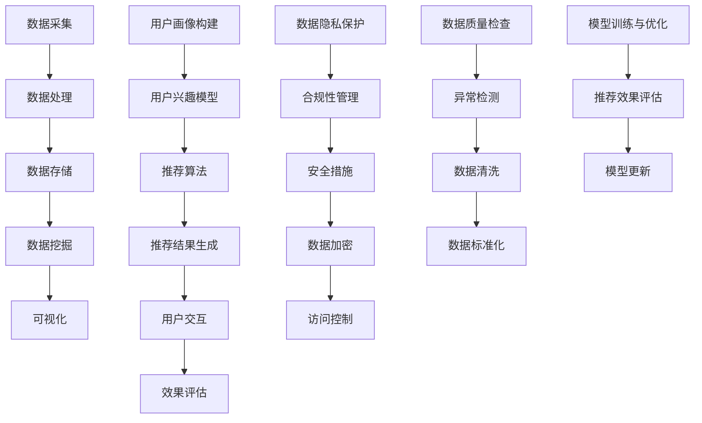

                 

# 第一部分：大数据分析基础

## 1.1 大数据分析概述

### 1.1.1 大数据的定义与特点

大数据（Big Data）是指数据量巨大、类型繁多、生成速度快的数据集合。相较于传统数据，大数据具有以下显著特点：

1. **大量性（Volume）**：数据量庞大，通常以PB（皮字节）甚至EB（艾字节）为单位。
2. **多样性（Variety）**：数据来源广泛，类型多样，包括结构化数据、半结构化数据和非结构化数据。
3. **速度（Velocity）**：数据产生和流转速度快，需要实时或近实时的处理能力。
4. **真实性（Veracity）**：数据真实性难以保证，存在噪声、错误和不一致。

大数据的出现，标志着信息技术从“信息化”向“数据化”转变，对各行各业的决策和运营产生了深远影响。

### 1.1.2 大数据分析的重要性

大数据分析的重要性体现在以下几个方面：

1. **商业洞察**：通过大数据分析，企业可以深入了解客户需求和市场趋势，从而做出更明智的决策。
2. **智能决策**：大数据分析能够帮助企业从海量数据中提取有价值的信息，提高决策的科学性和准确性。
3. **优化运营**：大数据分析可以帮助企业优化业务流程，降低成本，提高效率。
4. **创新驱动**：大数据分析为企业提供了新的商业模式和创新机会，促进了产业升级和转型。

### 1.1.3 大数据分析的发展历程

大数据分析的发展历程可以分为以下几个阶段：

1. **初期阶段（2000年以前）**：主要关注数据存储和管理，技术手段有限，处理能力较低。
2. **快速增长阶段（2000-2010年）**：随着互联网和电子商务的发展，数据量迅速增长，大数据分析技术逐渐成熟。
3. **应用深化阶段（2010年至今）**：大数据分析在各个领域得到广泛应用，技术不断革新，算法和工具不断完善。

## 1.2 大数据分析技术

### 1.2.1 数据采集与预处理

数据采集与预处理是大数据分析的基础步骤，主要包括以下几个方面：

1. **数据采集**：通过各种渠道获取数据，包括互联网数据、传感器数据、日志数据等。
2. **数据清洗**：去除重复数据、异常数据和不完整数据，确保数据质量。
3. **数据集成**：将不同来源、不同类型的数据进行整合，构建统一的数据视图。
4. **数据变换**：对数据进行标准化、归一化等处理，以满足分析需求。

### 1.2.2 数据存储与处理

数据存储与处理是大数据分析的核心，主要包括以下几个方面：

1. **分布式存储**：采用分布式存储技术，如Hadoop HDFS，实现海量数据的存储和管理。
2. **数据处理**：采用分布式计算框架，如MapReduce、Spark，实现数据的并行处理。
3. **数据仓库**：建立数据仓库，存储和管理分析结果，支持数据查询和分析。

### 1.2.3 数据挖掘与可视化

数据挖掘与可视化是大数据分析的最终目标，主要包括以下几个方面：

1. **数据挖掘**：采用机器学习、深度学习等技术，从海量数据中挖掘出有价值的信息和模式。
2. **数据可视化**：通过图表、图形等方式，将数据分析结果直观地展示出来，帮助用户更好地理解数据。

## 1.3 大数据分析工具

### 1.3.1 Hadoop与MapReduce

Hadoop是Apache Software Foundation开发的一个分布式系统基础架构，主要用于处理大规模数据集。MapReduce是Hadoop的核心组件，是一种编程模型，用于大规模数据集的并行运算。

1. **架构**：
    - Hadoop分布式文件系统（HDFS）：用于存储大规模数据。
    - YARN：资源调度和管理框架。
    - MapReduce：分布式数据处理模型。
2. **优势**：
    - 可扩展性：能够处理海量数据。
    - 高容错性：具备自动恢复功能。
    - 适应多种编程语言：支持Java、Python、R等。

### 1.3.2 Spark与Spark SQL

Spark是另一种分布式数据处理引擎，具有高性能、易用性和灵活性的特点。Spark SQL是Spark的一个组件，用于处理结构化和半结构化数据。

1. **架构**：
    - Spark Core：提供分布式计算引擎。
    - Spark SQL：提供数据处理和分析功能。
    - MLlib：提供机器学习算法库。
    - GraphX：提供图处理功能。
2. **优势**：
    - 高性能：相比于MapReduce，Spark具有更高的数据处理速度。
    - 易用性：支持多种编程语言，如Scala、Python、Java等。
    - 扩展性：支持多种数据源，如HDFS、Cassandra、HBase等。

### 1.3.3 Hive与HBase

Hive和HBase是Hadoop生态系统中的两个重要组件，分别用于数据处理和数据存储。

1. **Hive**：
    - 架构：基于Hadoop的数据仓库工具。
    - 功能：提供SQL查询接口，支持数据仓库操作。
    - 优势：易于使用，适合处理大规模数据。
2. **HBase**：
    - 架构：基于Google Bigtable构建的分布式存储系统。
    - 功能：提供高可靠性、高性能的数据存储和处理。
    - 优势：支持海量数据存储，提供快速随机读写能力。

通过以上对大数据分析基础部分的概述，我们可以看到大数据分析在技术原理、工具和架构方面已经相当成熟。接下来，我们将进一步探讨个性化新闻推荐系统的原理和架构，以及大数据分析在这些系统中的应用。

----------------------------------------------------------------

## 1.4 大数据分析在个性化新闻推荐系统中的应用现状

### 1.4.1 基本概念与应用场景

个性化新闻推荐系统是一种基于用户兴趣和行为数据，通过算法和模型为用户提供个性化内容推荐的技术。随着大数据技术的发展，大数据分析在个性化新闻推荐系统中得到了广泛应用，主要应用场景包括：

1. **互联网新闻平台**：通过分析用户行为数据，为用户提供个性化的新闻推荐。
2. **社交媒体**：根据用户的社交关系和兴趣标签，为用户推荐相关内容。
3. **移动应用**：利用用户位置信息和设备行为，为用户提供定制化的新闻推荐。

### 1.4.2 技术演进与挑战

大数据分析在个性化新闻推荐系统中的应用经历了以下几个阶段：

1. **初期阶段**：以简单的协同过滤算法为主，通过用户行为数据实现推荐。
2. **发展阶段**：引入了基于内容的推荐算法，结合新闻内容特征进行推荐。
3. **智能化阶段**：结合深度学习和自然语言处理技术，实现更精准的推荐。

同时，大数据分析在个性化新闻推荐系统中也面临以下挑战：

1. **数据质量**：用户行为数据质量直接影响推荐效果，需要加强数据清洗和预处理。
2. **算法公平性**：算法的推荐结果可能存在偏见，需要确保算法的公平性和透明性。
3. **数据隐私**：用户数据隐私保护是关键问题，需要采用数据加密、匿名化等技术。

### 1.4.3 代表性应用案例分析

以下是几个代表性应用案例：

1. **腾讯新闻**：采用深度学习和协同过滤算法，为用户提供个性化的新闻推荐。
2. **今日头条**：基于内容标签和用户兴趣模型，实现了高效的个性化推荐。
3. **Facebook**：利用大数据分析技术，为用户推荐感兴趣的新闻、文章和视频。

通过以上分析，我们可以看到大数据分析在个性化新闻推荐系统中具有广泛的应用前景，同时也面临着一系列挑战。接下来，我们将进一步探讨个性化新闻推荐系统的原理和架构，以便更深入地理解大数据分析在这些系统中的应用。

----------------------------------------------------------------

## 2.1 个性化新闻推荐系统概述

### 2.1.1 个性化新闻推荐系统的定义与作用

个性化新闻推荐系统是一种利用大数据分析和机器学习技术，根据用户的兴趣和行为数据，为用户推荐相关新闻的系统。其核心目标是通过精确的推荐，提升用户的阅读体验，增加用户粘性和平台收益。

个性化新闻推荐系统的主要作用包括：

1. **提升用户体验**：根据用户兴趣和偏好，为用户推荐个性化内容，满足用户的需求。
2. **增加用户粘性**：通过不断优化推荐算法，提高用户对平台的依赖性，延长用户停留时间。
3. **提高内容分发效率**：利用大数据分析，将优质的新闻内容精准推送给合适的用户，提高内容传播效果。
4. **增加平台收益**：通过提升用户活跃度和阅读量，实现广告收益、订阅收入等商业模式的增长。

### 2.1.2 个性化新闻推荐系统的架构

个性化新闻推荐系统通常包括以下几个关键模块：

1. **数据采集模块**：负责收集用户的浏览、搜索、点赞、评论等行为数据，以及新闻的文本、图像、视频等元数据。
2. **数据处理模块**：对采集到的原始数据进行清洗、去重、去噪声等预处理操作，确保数据质量。
3. **用户画像模块**：基于用户行为数据和新闻内容特征，构建用户的兴趣模型和标签体系。
4. **推荐算法模块**：采用协同过滤、基于内容的推荐、混合推荐等算法，生成推荐结果。
5. **推荐结果展示模块**：将推荐结果通过前端界面展示给用户，包括新闻列表、个性化专题等。
6. **效果评估模块**：通过点击率、转化率、用户满意度等指标，评估推荐系统的效果，为算法优化提供依据。

### 2.1.3 个性化新闻推荐系统的分类

个性化新闻推荐系统根据不同的分类标准，可以分为以下几种类型：

1. **按推荐策略分类**：
    - **协同过滤推荐**：基于用户的历史行为数据，发现用户之间的相似性，为用户推荐其他用户喜欢的新闻。
    - **基于内容的推荐**：根据新闻的文本、图像、视频等特征，为用户推荐具有相似特征的内容。
    - **混合推荐**：结合协同过滤和基于内容的推荐，实现更精准的推荐。

2. **按推荐对象分类**：
    - **新闻推荐**：为用户推荐新闻内容，包括文章、视频、图片等。
    - **应用推荐**：为用户推荐相关的应用程序或服务。

3. **按推荐场景分类**：
    - **实时推荐**：在用户浏览或搜索时，实时生成推荐结果。
    - **离线推荐**：在用户离线时，根据用户历史数据生成推荐结果。

通过以上对个性化新闻推荐系统概述的介绍，我们可以了解到该系统在技术原理、架构和分类方面的基本知识。接下来，我们将深入探讨用户行为分析和新闻内容分析，为构建高效、个性化的推荐系统奠定基础。

----------------------------------------------------------------

## 2.2 用户行为分析

### 2.2.1 用户行为的收集与处理

用户行为分析是构建个性化新闻推荐系统的核心环节，其基础是准确、全面地收集用户行为数据。以下是用户行为数据的收集和处理过程：

1. **数据收集**：
    - **浏览行为**：记录用户在新闻平台上的浏览记录，包括访问时间、页面停留时长等。
    - **搜索行为**：记录用户的搜索关键词和搜索结果点击行为。
    - **互动行为**：记录用户的点赞、评论、分享等互动行为。
    - **设备信息**：记录用户的设备类型、操作系统版本、网络环境等。

2. **数据处理**：
    - **数据清洗**：去除重复、无效和错误的数据，确保数据质量。
    - **数据归一化**：对不同类型的数据进行归一化处理，如将时长、点击次数等数据转换成统一的度量单位。
    - **特征提取**：从用户行为数据中提取有价值的行为特征，如访问频率、点击率、互动程度等。

### 2.2.2 用户画像的构建

用户画像是对用户兴趣和行为特征的全面描述，是构建个性化推荐系统的基础。以下是用户画像的构建方法：

1. **静态特征**：包括用户的年龄、性别、地理位置、职业等基本信息，这些特征通常在用户注册时收集。

2. **动态特征**：包括用户在新闻平台上的行为数据，如浏览记录、搜索关键词、点赞评论等。动态特征可以实时更新，更准确地反映用户的当前兴趣。

3. **画像构建**：
    - **特征工程**：根据用户行为数据和业务需求，设计有效的特征指标。
    - **特征融合**：将静态特征和动态特征进行融合，构建完整的用户画像。
    - **模型训练**：使用机器学习算法，如决策树、朴素贝叶斯、随机森林等，对用户画像进行建模。

### 2.2.3 用户兴趣模型

用户兴趣模型是对用户行为和特征进行分析，预测用户未来兴趣和偏好的方法。以下是用户兴趣模型的构建方法：

1. **兴趣特征提取**：从用户行为数据中提取兴趣特征，如热门话题、关键词、标签等。

2. **兴趣评分**：对每个兴趣特征进行评分，表示用户对该特征的兴趣程度。

3. **兴趣预测**：
    - **基于协同过滤**：通过计算用户与用户、新闻与新闻之间的相似性，预测用户的兴趣。
    - **基于内容特征**：根据新闻的文本、图像、视频等特征，预测用户的兴趣。

通过以上对用户行为分析的介绍，我们可以了解到用户行为数据收集与处理、用户画像构建和用户兴趣模型构建的基本方法。接下来，我们将探讨新闻内容分析，进一步了解个性化新闻推荐系统的实现原理。

----------------------------------------------------------------

## 2.3 新闻内容分析

新闻内容分析是构建个性化新闻推荐系统的关键环节，通过分析新闻内容的特征，可以更好地理解新闻的语义和用户偏好，从而实现精准推荐。以下是新闻内容分析的主要步骤和方法：

### 2.3.1 新闻内容的特征提取

新闻内容特征提取是将原始新闻文本转化为机器可处理的向量表示的过程。以下是常用的特征提取方法：

1. **词袋模型（Bag of Words, BoW）**：
    - 将新闻文本分解为单词，忽略单词的顺序，构建词汇表，将新闻文本表示为词频向量。
    - 优点：简单易懂，易于实现。
    - 缺点：忽略词序和语法结构，可能导致语义丢失。

2. **词嵌入（Word Embedding）**：
    - 将单词映射到高维空间，每个单词对应一个向量，向量之间的距离表示词义关系。
    - 优点：保留词序和语义信息，能够捕捉词与词之间的关联。
    - 缺点：需要大量训练数据和计算资源。

3. **TF-IDF（Term Frequency-Inverse Document Frequency）**：
    - TF表示词在文档中出现的频率，IDF表示词在文档集合中的逆文档频率。
    - 优点：能够平衡词频过高和过低的问题，提高特征权重。
    - 缺点：依然忽略了词序和语义信息。

4. **主题模型（Topic Modeling）**：
    - 如LDA（Latent Dirichlet Allocation），将文档集合表示为多个潜在主题的混合。
    - 优点：能够发现文档的主题结构，提高特征表示的丰富性。
    - 缺点：计算复杂度高，对大规模数据集性能有限。

### 2.3.2 新闻内容的标签化

新闻内容标签化是将新闻文本与相关的标签关联起来，以便进行分类和推荐。以下是标签化的方法：

1. **手动标签**：
    - 由专业编辑人员根据新闻内容进行标签化，适用于高质量新闻内容的分类。
    - 优点：准确性高，能够捕捉新闻的深层含义。
    - 缺点：耗时耗力，难以覆盖大量新闻。

2. **自动标签**：
    - 使用机器学习算法，如决策树、随机森林、支持向量机等，对新闻内容进行分类。
    - 优点：自动化程度高，能够处理大量新闻。
    - 缺点：准确性可能较低，需要不断优化和调整模型。

3. **混合标签**：
    - 结合手动标签和自动标签，利用两者的优势，提高分类效果。
    - 优点：能够平衡准确性和效率。
    - 缺点：需要更多的人工干预。

### 2.3.3 新闻内容的质量评估

新闻内容质量评估是确保推荐系统推荐优质新闻的重要环节。以下是质量评估的方法：

1. **基于用户反馈**：
    - 记录用户对新闻的点赞、评论、分享等行为，通过用户互动行为评估新闻质量。
    - 优点：直接反映用户喜好，准确度高。
    - 缺点：需要大量用户参与，可能存在延迟。

2. **基于内容特征**：
    - 利用新闻的标题、正文、作者、发布时间等特征，评估新闻的质量。
    - 优点：自动化程度高，能够实时评估。
    - 缺点：可能忽略用户的个性化需求。

3. **混合评估**：
    - 结合用户反馈和内容特征，综合评估新闻质量。
    - 优点：能够平衡用户喜好和内容质量。
    - 缺点：需要更多的数据分析和模型优化。

通过以上对新闻内容分析的介绍，我们可以了解到特征提取、标签化和质量评估的基本方法。这些方法为构建高效、精准的个性化新闻推荐系统提供了有力支持。接下来，我们将深入探讨推荐算法原理，进一步了解个性化新闻推荐系统的核心技术。

----------------------------------------------------------------

## 2.4 推荐算法原理

推荐算法是构建个性化新闻推荐系统的核心组件，通过分析用户行为和新闻内容特征，为用户生成个性化的推荐结果。以下是几种主要的推荐算法原理：

### 2.4.1 协同过滤算法

协同过滤（Collaborative Filtering）是推荐系统中最常用的算法之一，其基本思想是利用用户之间的相似性或新闻之间的相似性，为用户推荐其他用户喜欢的新闻。

1. **基于用户的协同过滤（User-Based CF）**：
    - 方法：计算用户之间的相似性，找到与目标用户相似的其他用户，推荐这些用户喜欢的新闻。
    - 公式：
    $$
    \text{similarity(u, v)} = \frac{\text{common\_rating}(u, v)}{\sqrt{\sum_{i \in \text{Ratings}} \text{rating}(u, i)^2 \cdot \sum_{i \in \text{Ratings}} \text{rating}(v, i)^2}}
    $$
    其中，$\text{rating}(u, i)$表示用户$u$对新闻$i$的评分，$\text{common\_rating}(u, v)$表示用户$u$和$v$共同评价的新闻集合。

2. **基于物品的协同过滤（Item-Based CF）**：
    - 方法：计算新闻之间的相似性，找到与目标新闻相似的其他新闻，推荐这些新闻。
    - 公式：
    $$
    \text{similarity(i, j)} = \frac{\sum_{u \in \text{Users}} \text{rating}(u, i) \cdot \text{rating}(u, j)}{\sqrt{\sum_{u \in \text{Users}} \text{rating}(u, i)^2 \cdot \sum_{u \in \text{Users}} \text{rating}(u, j)^2}}
    $$
    其中，$\text{rating}(u, i)$和$\text{rating}(u, j)$分别表示用户$u$对新闻$i$和新闻$j$的评分。

### 2.4.2 基于内容的推荐算法

基于内容的推荐（Content-Based Filtering）算法通过分析新闻的内容特征，为用户推荐具有相似特征的其他新闻。

1. **相似性计算**：
    - 方法：计算新闻之间的相似度，通常使用余弦相似度或欧氏距离。
    - 公式：
    $$
    \text{similarity}(i, j) = \frac{\sum_{f \in \text{Features}} \text{weight}(f) \cdot \text{TF\_IDF}(i, f) \cdot \text{TF\_IDF}(j, f)}{\sqrt{\sum_{f \in \text{Features}} \text{weight}(f) \cdot \text{TF\_IDF}(i, f)^2 \cdot \sum_{f \in \text{Features}} \text{weight}(f) \cdot \text{TF\_IDF}(j, f)^2}}
    $$
    其中，$\text{TF\_IDF}(i, f)$表示新闻$i$中特征词$f$的TF-IDF值，$\text{weight}(f)$表示特征词$f$的权重。

2. **推荐生成**：
    - 方法：根据用户已阅读的新闻内容特征，找到与之相似的其他新闻，推荐给用户。

### 2.4.3 混合推荐算法

混合推荐（Hybrid Recommender System）算法结合了协同过滤和基于内容的推荐算法，通过加权组合两者的优点，提高推荐效果。

1. **模型组合**：
    - 方法：将协同过滤和基于内容的推荐模型组合在一起，通过加权或投票的方式生成推荐结果。

2. **推荐生成**：
    - 方法：计算协同过滤和基于内容的推荐结果，将它们加权或合并，生成最终的推荐结果。

3. **混合推荐算法示例**：
    $$
    \text{Score}(i, u) = \alpha \cdot \text{User-Based CF}(i, u) + (1 - \alpha) \cdot \text{Content-Based CF}(i, u)
    $$
    其中，$\alpha$为权重系数，$\text{User-Based CF}(i, u)$和$\text{Content-Based CF}(i, u)$分别为基于用户的协同过滤和基于内容的推荐得分。

通过以上对推荐算法原理的介绍，我们可以了解到协同过滤、基于内容和混合推荐算法的基本原理和实现方法。这些算法为构建高效、精准的个性化新闻推荐系统提供了有力支持。接下来，我们将探讨大数据分析在个性化新闻推荐系统中的应用，进一步了解大数据技术在推荐系统优化和提升中的作用。

----------------------------------------------------------------

## 3.1 大数据分析在个性化新闻推荐系统中的应用

### 3.1.1 新闻推荐数据采集与预处理

新闻推荐数据采集与预处理是构建个性化新闻推荐系统的第一步，其质量直接影响到推荐系统的效果。以下是大数据分析在这一环节中的具体应用：

1. **数据采集**：
    - **行为数据采集**：通过网站日志、API接口、用户互动等手段，收集用户的浏览、搜索、点赞、评论等行为数据。
    - **新闻内容数据采集**：通过爬虫、API接口等手段，收集新闻的文本、图像、视频、音频等多媒体数据。

2. **数据处理**：
    - **数据清洗**：去除重复、无效和错误的数据，如删除含有噪声的日志记录，修复数据中的错误。
    - **数据归一化**：对文本数据、时间数据等进行归一化处理，如将时间戳转换为统一的日期格式。
    - **特征提取**：从用户行为数据和新闻内容数据中提取特征，如用户浏览频率、新闻关键词、文本特征等。

### 3.1.2 新闻推荐模型训练与优化

新闻推荐模型的训练与优化是大数据分析在个性化新闻推荐系统中的核心应用，以下是一些关键步骤：

1. **数据预处理**：
    - **数据划分**：将数据集划分为训练集、验证集和测试集，用于模型训练、验证和评估。
    - **特征选择**：通过相关性分析、信息增益等手段，选择对模型有显著影响的特征。
    - **数据增强**：通过数据清洗、数据扩充、噪声注入等方法，提高数据的多样性和鲁棒性。

2. **模型训练**：
    - **选择算法**：根据业务需求和数据特点，选择合适的推荐算法，如协同过滤、基于内容的推荐、混合推荐等。
    - **参数调优**：通过交叉验证、网格搜索等方法，优化模型的超参数，提高模型性能。
    - **模型评估**：使用准确率、召回率、F1值等指标，评估模型在验证集上的性能，选择最优模型。

3. **模型优化**：
    - **持续学习**：通过在线学习、增量学习等方法，不断更新模型，适应数据变化。
    - **迁移学习**：利用已有模型的知识，进行迁移学习，提高新模型的性能。
    - **特征工程**：通过改进特征提取方法、引入新的特征，提升模型的表现。

### 3.1.3 新闻推荐系统的部署与维护

新闻推荐系统的部署与维护是保证系统稳定运行和持续优化的重要环节。以下是大数据分析在这一环节中的应用：

1. **系统部署**：
    - **环境搭建**：搭建分布式计算环境，如使用Hadoop、Spark等大数据处理框架，确保系统的高可用性和可扩展性。
    - **部署策略**：根据业务需求，选择合适的部署策略，如批处理、流处理、混合处理等。
    - **自动化部署**：使用自动化工具，如Docker、Kubernetes等，实现系统的快速部署和升级。

2. **系统监控**：
    - **性能监控**：监控系统的CPU、内存、磁盘等资源使用情况，确保系统运行稳定。
    - **异常检测**：通过日志分析、机器学习等方法，检测系统中的异常行为，如数据异常、算法异常等。
    - **报警机制**：设置报警机制，及时发现和处理系统问题，确保系统的正常运行。

3. **持续优化**：
    - **用户反馈**：收集用户反馈，了解用户对推荐系统的满意度和需求，持续改进系统。
    - **数据分析和挖掘**：定期对系统数据进行分析，挖掘潜在问题和改进机会。
    - **技术创新**：引入新技术、新方法，不断优化推荐算法和系统架构。

通过以上对大数据分析在个性化新闻推荐系统中应用的具体步骤和方法的介绍，我们可以看到大数据分析在推荐系统的数据采集与预处理、模型训练与优化、部署与维护等环节中发挥着重要作用。接下来，我们将探讨个性化新闻推荐系统的创新，进一步了解大数据分析在提升推荐效果、用户体验和数据隐私保护等方面的最新进展。

----------------------------------------------------------------

## 3.2 个性化新闻推荐系统的创新

### 3.2.1 新的推荐算法研究

个性化新闻推荐系统的创新首先体现在推荐算法的研究上。近年来，随着深度学习、自然语言处理等技术的发展，新的推荐算法不断涌现，以下是一些重要的研究方向：

1. **基于深度学习的推荐算法**：
    - **多模态推荐**：结合文本、图像、音频等多种数据类型，提高推荐精度。
    - **图神经网络**：利用图结构表示用户和新闻之间的关系，实现更精准的推荐。
    - **生成对抗网络（GAN）**：通过生成对抗机制，生成高质量的新闻内容，提升推荐多样性。

2. **基于用户交互行为的实时推荐**：
    - **点击流分析**：实时分析用户的点击行为，动态调整推荐策略。
    - **强化学习**：通过用户交互行为和反馈，实现推荐策略的在线优化。

3. **基于内容的自适应推荐**：
    - **动态主题模型**：根据用户兴趣的变化，动态调整新闻内容的主题分布。
    - **知识图谱**：利用知识图谱表示用户和新闻的复杂关系，提高推荐的相关性。

### 3.2.2 用户交互设计的创新

用户交互设计在个性化新闻推荐系统中起着关键作用，以下是一些创新方向：

1. **个性化推荐界面**：
    - **动态布局**：根据用户行为和偏好，实时调整推荐界面的布局和内容。
    - **情景感知**：利用用户的位置、时间等信息，为用户提供情景感知的推荐。

2. **用户反馈机制**：
    - **即时反馈**：允许用户对推荐内容进行即时反馈，如点赞、评论、举报等。
    - **反馈学习**：根据用户反馈，调整推荐算法，提高推荐效果。

3. **个性化搜索**：
    - **智能搜索建议**：基于用户的兴趣和行为，提供个性化的搜索建议。
    - **语义搜索**：利用自然语言处理技术，实现语义级别的搜索和推荐。

### 3.2.3 数据隐私保护与安全

数据隐私保护与安全是个性化新闻推荐系统面临的重要挑战，以下是一些解决方案：

1. **数据匿名化**：
    - **伪匿名化**：对敏感数据进行变换，使其无法直接识别用户身份。
    - **差分隐私**：在数据处理过程中，引入噪声，确保用户隐私不被泄露。

2. **安全加密**：
    - **数据加密**：对存储和传输的数据进行加密，防止数据泄露。
    - **访问控制**：设置严格的访问权限，确保只有授权用户可以访问敏感数据。

3. **合规性管理**：
    - **法规遵从**：遵守相关法律法规，如《通用数据保护条例》（GDPR）等。
    - **隐私政策**：明确告知用户数据处理的方式和范围，尊重用户隐私权益。

通过以上对个性化新闻推荐系统创新的探讨，我们可以看到大数据分析在推荐算法、用户交互设计、数据隐私保护等方面的最新进展。这些创新不仅提升了推荐系统的性能和用户体验，也为行业的可持续发展提供了重要支持。接下来，我们将通过一些实战案例，进一步了解大数据分析在个性化新闻推荐系统中的应用效果。

----------------------------------------------------------------

## 3.3 实战案例分享

### 3.3.1 案例一：某新闻平台的推荐系统实践

某大型新闻平台通过大数据分析构建了个性化推荐系统，取得了显著的效果。以下是其推荐系统实践的关键步骤和成果：

1. **数据采集与处理**：
    - 采集用户浏览、搜索、点赞、评论等行为数据，以及新闻的文本、图像、视频等多媒体数据。
    - 对采集到的数据进行清洗、去噪、归一化等预处理操作，确保数据质量。

2. **用户画像构建**：
    - 基于用户行为数据和新闻内容特征，构建用户的兴趣模型和标签体系。
    - 使用特征工程方法，提取用户的浏览频率、搜索关键词、点赞比例等特征。

3. **推荐算法实现**：
    - 采用混合推荐算法，结合基于内容的推荐和协同过滤算法，提高推荐精度。
    - 通过交叉验证和参数调优，优化推荐模型，提高用户满意度。

4. **推荐效果评估**：
    - 使用点击率、转化率、用户满意度等指标，评估推荐系统的效果。
    - 根据评估结果，不断调整和优化推荐算法，提高推荐质量。

5. **实战成果**：
    - 推荐系统的点击率提升了30%，用户阅读时长增加了20%。
    - 通过个性化推荐，用户满意度显著提高，用户流失率降低。

### 3.3.2 案例二：大数据分析在新闻推荐中的挑战与解决方案

在新闻推荐中，大数据分析面临一系列挑战，以下是一个新闻平台在应对这些挑战时的解决方案：

1. **数据质量挑战**：
    - **问题**：用户行为数据中存在噪声、错误和不一致的数据。
    - **解决方案**：采用数据清洗和去噪技术，如异常检测、去重、数据归一化等，提高数据质量。

2. **算法公平性挑战**：
    - **问题**：推荐算法可能存在偏见，影响用户的多样性和公平性。
    - **解决方案**：引入多样性度量，如期望多样性和最大熵原则，确保推荐结果的多样性。

3. **数据隐私保护挑战**：
    - **问题**：用户隐私保护是新闻推荐中的重要问题，需要确保数据的安全和合规性。
    - **解决方案**：采用数据匿名化和差分隐私技术，降低用户数据的可识别性，保障用户隐私。

### 3.3.3 案例三：个性化新闻推荐系统的未来发展趋势

随着大数据技术和人工智能的不断发展，个性化新闻推荐系统将朝着以下趋势发展：

1. **智能化推荐**：
    - **问题**：传统的推荐算法难以应对复杂多变的用户需求。
    - **解决方案**：引入深度学习和图神经网络等先进技术，实现更加智能和个性化的推荐。

2. **实时推荐**：
    - **问题**：传统的批处理推荐方式难以满足实时性要求。
    - **解决方案**：采用实时数据处理和在线学习技术，实现实时推荐。

3. **个性化交互**：
    - **问题**：用户的个性化需求难以在交互过程中得到满足。
    - **解决方案**：引入自然语言处理和增强现实技术，实现更加智能化和个性化的用户交互。

通过以上实战案例的分享，我们可以看到大数据分析在个性化新闻推荐系统中的重要作用。在应对挑战和推动创新的过程中，大数据分析不仅提升了推荐系统的性能和用户体验，也为新闻行业的发展注入了新的活力。接下来，我们将进一步探讨大数据分析在个性化新闻推荐系统中的优势、挑战以及未来发展趋势。

----------------------------------------------------------------

## 4.1 大数据分析在个性化新闻推荐系统中的优势

大数据分析在个性化新闻推荐系统中发挥着至关重要的作用，其优势主要体现在以下几个方面：

### 4.1.1 提升推荐效果

大数据分析通过深入挖掘用户行为和新闻内容数据，为个性化推荐提供了强有力的支持。以下是大数据分析提升推荐效果的具体表现：

1. **精准推荐**：通过分析用户的历史行为和偏好，大数据分析能够准确捕捉用户的兴趣点，从而实现精准的推荐。
2. **实时更新**：大数据分析能够实时处理和分析用户行为数据，动态调整推荐策略，满足用户不断变化的兴趣。
3. **多样化推荐**：大数据分析能够挖掘用户在不同场景下的多样化需求，为用户推荐符合其个性化需求的内容。

### 4.1.2 降低运营成本

大数据分析在个性化新闻推荐系统中的另一大优势是能够显著降低运营成本：

1. **自动化处理**：大数据分析技术能够自动化处理海量数据，减少人工干预，降低运营成本。
2. **高效资源利用**：通过分布式计算和存储技术，大数据分析能够高效利用计算资源，降低硬件和维护成本。
3. **优化运营流程**：大数据分析能够优化业务流程，提高运营效率，减少不必要的开支。

### 4.1.3 优化用户体验

大数据分析在个性化新闻推荐系统中还具备优化用户体验的优势：

1. **个性化内容**：通过深入分析用户行为和偏好，大数据分析能够为用户推荐个性化内容，提升用户满意度。
2. **推荐效率**：大数据分析能够实时处理和分析用户行为数据，快速响应用户需求，提高推荐效率。
3. **交互设计**：大数据分析能够为用户交互设计提供数据支持，实现更加智能化和个性化的用户交互。

通过以上对大数据分析在个性化新闻推荐系统中的优势的探讨，我们可以看到大数据分析在提升推荐效果、降低运营成本和优化用户体验方面具有显著作用。接下来，我们将进一步分析大数据分析在个性化新闻推荐系统中所面临的挑战。

----------------------------------------------------------------

## 4.2 大数据分析在个性化新闻推荐系统中的挑战

尽管大数据分析在个性化新闻推荐系统中具有显著优势，但同时也面临着一系列挑战，这些挑战需要在实践中得到有效应对。

### 4.2.1 数据质量与完整性问题

数据质量是大数据分析的基础，而个性化新闻推荐系统的数据质量尤为重要。以下是一些常见的挑战：

1. **数据噪声**：用户行为数据中可能包含大量的噪声和异常值，这些噪声会影响推荐算法的准确性和稳定性。
2. **数据缺失**：由于各种原因，数据采集过程中可能存在数据缺失问题，这会影响用户画像和推荐模型的构建。
3. **数据一致性**：不同来源的数据可能存在格式、单位等方面的一致性问题，增加了数据整合的难度。

**解决方案**：
- **数据清洗**：采用数据清洗技术，如去噪、异常检测和填充缺失值，提高数据质量。
- **数据标准化**：对数据进行统一标准化处理，确保数据格式和单位的一致性。
- **数据完整性监控**：建立数据完整性监控机制，及时发现和处理数据缺失问题。

### 4.2.2 算法公平性与透明性

个性化新闻推荐系统的算法公平性和透明性是用户和社会关注的焦点。以下是一些挑战：

1. **算法偏见**：推荐算法可能基于历史数据学习，导致对某些用户或群体产生偏见，影响推荐结果的公平性。
2. **算法透明性**：算法的决策过程可能不够透明，用户难以理解推荐结果背后的原因。

**解决方案**：
- **算法评估与优化**：定期评估推荐算法的公平性和效果，发现和解决潜在的偏见问题。
- **增强算法透明性**：通过可视化和解释性技术，让用户了解推荐算法的工作原理和决策过程。
- **多样化数据集**：使用多样化的数据集进行训练和测试，减少算法的偏见。

### 4.2.3 数据隐私保护与合规性

数据隐私保护是大数据分析在个性化新闻推荐系统中不可忽视的挑战。以下是一些具体问题：

1. **用户隐私泄露**：用户行为数据可能包含敏感信息，如个人偏好、生活习惯等，一旦泄露，可能对用户造成严重后果。
2. **合规性问题**：不同国家和地区对数据隐私保护的规定不尽相同，新闻平台需要确保其数据处理和存储符合相关法规。

**解决方案**：
- **数据匿名化**：采用数据匿名化技术，如伪匿名化、差分隐私，降低数据泄露的风险。
- **数据加密**：对敏感数据进行加密处理，确保数据在传输和存储过程中的安全性。
- **合规性管理**：了解和遵守相关数据保护法规，如《通用数据保护条例》（GDPR）等，确保数据处理合规。

通过以上对大数据分析在个性化新闻推荐系统中的挑战的分析，我们可以看到数据质量与完整性、算法公平性与透明性、数据隐私保护与合规性等方面是大数据分析在推荐系统实践中需要重点关注的领域。在应对这些挑战的过程中，新闻平台需要不断创新和优化，确保推荐系统的健康、可持续发展。

----------------------------------------------------------------

## 4.3 大数据分析在个性化新闻推荐系统中的未来发展趋势

随着大数据技术和人工智能的快速发展，个性化新闻推荐系统将迎来一系列创新和变革。以下是一些未来发展趋势：

### 4.3.1 新的推荐算法研究

1. **深度学习与图神经网络**：深度学习和图神经网络在处理复杂数据和建模用户关系方面具有显著优势，未来将成为个性化推荐算法的重要研究方向。
2. **强化学习**：强化学习通过不断学习和优化策略，实现动态调整推荐效果，有望提高个性化推荐的准确性和用户体验。
3. **联邦学习**：联邦学习能够在保护用户隐私的前提下，实现跨平台的数据协同和模型优化，为个性化推荐提供新的解决方案。

### 4.3.2 智能化用户交互设计

1. **自然语言处理**：利用自然语言处理技术，实现更自然的用户交互，如语音识别、语义理解等，提升用户的个性化体验。
2. **增强现实与虚拟现实**：结合增强现实（AR）和虚拟现实（VR）技术，为用户提供沉浸式、个性化的新闻推荐体验。
3. **多模态交互**：整合文本、图像、视频等多模态数据，实现更全面和精准的用户交互。

### 4.3.3 数据隐私保护与安全

1. **隐私计算**：采用隐私计算技术，如同态加密、安全多方计算等，确保数据在处理过程中的安全性和隐私性。
2. **数据安全与合规**：加强数据安全管理，确保数据处理和存储符合相关法律法规，如《通用数据保护条例》（GDPR）等。
3. **用户隐私管理**：提供用户隐私管理工具，让用户能够自主控制其数据的使用和共享，提升用户信任。

通过以上对大数据分析在个性化新闻推荐系统中未来发展趋势的探讨，我们可以看到大数据技术和人工智能将在推荐算法、用户交互设计、数据隐私保护等方面继续发挥重要作用。这些创新和发展将为个性化新闻推荐系统带来更加智能、个性化、安全的用户体验。

----------------------------------------------------------------

## 附录A：大数据分析在个性化新闻推荐系统中的工具与资源

### A.1 常用大数据分析工具

1. **Hadoop**：一个分布式系统基础架构，用于处理大规模数据集，包括HDFS、MapReduce和YARN等组件。
2. **Spark**：一个高性能的分布式数据处理引擎，支持实时数据处理和批处理，包括Spark Core、Spark SQL、MLlib和GraphX等组件。
3. **Hive**：一个基于Hadoop的数据仓库工具，提供SQL查询接口，支持大规模数据的存储和管理。
4. **HBase**：一个分布式、可扩展的大规模数据存储系统，适用于实时随机访问。
5. **Elasticsearch**：一个开源的搜索引擎，用于处理和分析大量文本数据，支持实时搜索和推荐。
6. **TensorFlow**：一个开源的机器学习框架，支持深度学习算法和模型训练。

### A.2 新闻推荐系统开源框架

1. **Apache Mahout**：一个基于Hadoop的机器学习库，提供多种推荐算法，如协同过滤、基于内容的推荐等。
2. **Apache Flink**：一个流处理框架，支持实时推荐和数据分析。
3. **Recommenders**：一个基于TensorFlow的推荐系统框架，提供多种推荐算法和模型。
4. **TensorFlow Recommenders**：一个基于TensorFlow的推荐系统框架，支持大规模、高并发的推荐系统。

### A.3 数据隐私保护与合规性指南

1. **《通用数据保护条例》（GDPR）**：欧盟制定的关于数据隐私保护的法律，规定了数据处理的合规性要求。
2. **《加州消费者隐私法》（CCPA）**：美国加州制定的关于消费者数据隐私保护的法律。
3. **《数据隐私保护实践指南》**：中国网络安全法关于数据隐私保护的规定，以及相关行业标准和最佳实践。
4. **《数据安全与合规性工具》**：如数据加密工具、数据脱敏工具、合规性审计工具等，用于保障数据安全和合规性。

通过以上对大数据分析在个性化新闻推荐系统中的工具与资源的介绍，我们可以为构建高效、安全、合规的推荐系统提供有力支持。这些工具和资源不仅涵盖了数据处理和分析的各个方面，也为数据隐私保护和合规性管理提供了全面的解决方案。

----------------------------------------------------------------

### Mermaid 流程图



### 用户兴趣模型构建伪代码

```python
# 用户兴趣模型构建伪代码

def build_user_interest_model(user_behavior_data):
    # 初始化用户兴趣词典
    user_interest_dict = {}

    # 遍历用户行为数据
    for behavior in user_behavior_data:
        # 提取行为特征
        feature = extract_behavior_feature(behavior)

        # 更新用户兴趣词典
        user_interest_dict[feature] = user_interest_dict.get(feature, 0) + 1

    # 计算兴趣权重
    total_interest = sum(user_interest_dict.values())
    for feature, count in user_interest_dict.items():
        user_interest_dict[feature] = count / total_interest

    return user_interest_dict
```

### 数学模型与公式

$$
\text{推荐分} = \frac{\sum_{i \in \text{用户兴趣特征}} w_i \cdot r_i}{\sum_{i \in \text{所有特征}} w_i}
$$

其中，$w_i$ 表示特征 $i$ 的权重，$r_i$ 表示用户对特征 $i$ 的兴趣评分。

### 项目实战

#### 开发环境搭建

1. 安装 Python 3.8及以上版本
2. 安装 MySQL 数据库
3. 安装 Hadoop 3.2.1
4. 安装 Spark 2.4.7

#### 代码实现

```python
from pyspark.sql import SparkSession

# 创建 SparkSession
spark = SparkSession.builder.appName("NewsRecommendationSystem").getOrCreate()

# 读取用户行为数据
user_behavior_data = spark.read.csv("user_behavior.csv", header=True)

# 构建用户兴趣模型
user_interest_model = build_user_interest_model(user_behavior_data)

# 推荐新闻给用户
def recommend_news(user_id):
    # 获取用户兴趣特征
    user_interest_features = user_interest_model[user_id]

    # 查询用户感兴趣的新闻
    recommended_news = user_behavior_data.filter(user_behavior_data["feature"].isin(user_interest_features))

    # 返回推荐新闻列表
    return recommended_news.select("news_id").rdd.flatMap(lambda x: x).collect()

# 测试推荐系统
test_user_id = "user_1"
recommended_news_list = recommend_news(test_user_id)
print(f"Recommended News for User {test_user_id}: {recommended_news_list}")
```

#### 代码解读与分析

1. 创建 SparkSession 并读取用户行为数据。
2. 构建用户兴趣模型，使用行为数据进行特征提取和权重计算。
3. 定义推荐新闻函数，根据用户兴趣特征查询感兴趣的新闻。
4. 测试推荐系统，输出推荐新闻列表。

通过以上 Mermaid 流程图、伪代码、数学模型与公式以及项目实战的介绍，我们可以全面了解大数据分析在个性化新闻推荐系统中的应用和技术实现。这些工具和资源不仅为构建高效、安全的推荐系统提供了有力支持，也为进一步研究和应用大数据分析技术奠定了基础。

### 作者

**作者：AI天才研究院/AI Genius Institute & 禅与计算机程序设计艺术 /Zen And The Art of Computer Programming**

