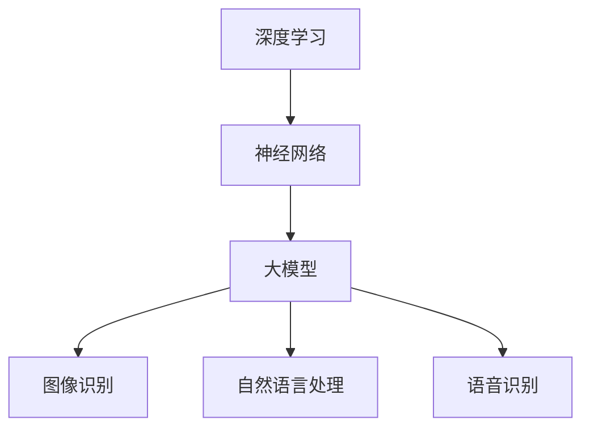
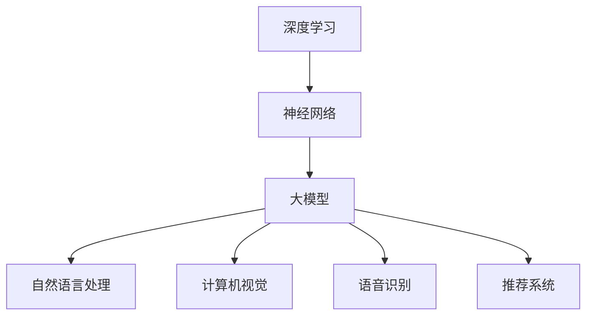
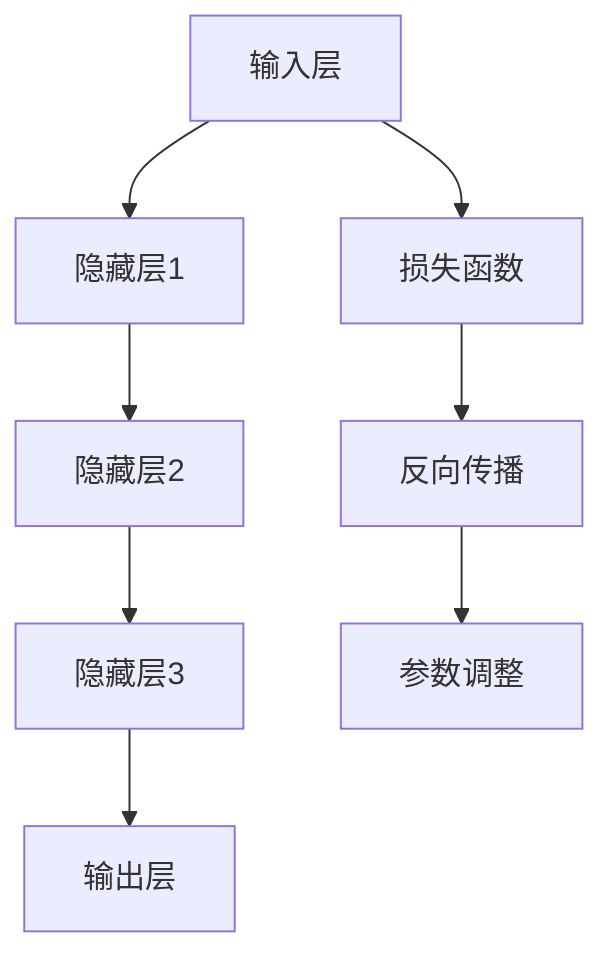

                 

### 《大模型创业的波折与变化》

在当今的科技浪潮中，大模型技术无疑是一个闪耀的明星。随着人工智能的不断进步，大模型在各个领域中的应用变得越来越广泛，创业者的机会也变得前所未有。然而，正如所有创业之路一样，大模型创业充满了波折与变化。本文将详细探讨大模型创业的背景、机遇、实践、风险和未来展望，帮助创业者更好地理解这一领域，并为其提供实用的指导。

### 关键词：
- 大模型创业
- 人工智能
- 创业策略
- 风险管理
- 未来展望

### 摘要：
本文从大模型创业的背景与机遇出发，深入分析了大模型的核心概念、创业实践、风险管理以及未来展望。通过具体案例的解析，我们希望能够为创业者提供一条清晰的道路，帮助他们在这个充满挑战和机遇的领域取得成功。

### 第一部分：大模型创业概述

#### 第1章：大模型创业背景与机遇

##### 1.1 大模型时代的来临

随着深度学习、神经网络等人工智能技术的快速发展，大模型逐渐成为科技领域的热门话题。大模型，也称为大型神经网络，是一种具有极高参数量的复杂模型，能够处理大量的数据和复杂的任务。这些模型在图像识别、自然语言处理、语音识别等领域取得了显著的成果，引发了各行各业的关注。

##### 1.2 创业者的机会与挑战

大模型的崛起为创业者提供了前所未有的机会。随着技术的普及和成本的降低，越来越多的创业者开始探索如何利用大模型实现商业价值。然而，大模型创业同样伴随着巨大的挑战。技术门槛高、数据获取困难、商业模式不明确等问题，使得创业之路充满了不确定性。

##### 1.3 大模型创业的趋势分析

大模型创业正逐渐成为科技创业的新风口。一方面，大模型技术在各行各业中的应用不断拓展，为创业者提供了丰富的场景。另一方面，随着算法的优化和计算资源的提升，大模型创业的可行性逐渐增强。未来，大模型创业将继续呈现出多元化、专业化和国际化的趋势。

#### 第2章：大模型创业的核心概念

##### 2.1 大模型的定义与分类

大模型是指具有极高参数量的神经网络模型，通常用于处理复杂的数据和任务。根据应用领域和模型结构的不同，大模型可以分为多种类型，如自然语言处理模型、计算机视觉模型、语音识别模型等。

##### 2.2 大模型的架构与原理

大模型的架构通常包括输入层、隐藏层和输出层。通过多层神经元的组合，大模型能够学习到数据的复杂特征，并实现高精度的预测和分类。大模型的工作原理主要依赖于神经网络的训练过程，即通过反向传播算法不断调整模型的参数，使其达到预定的性能指标。

##### 2.3 大模型的应用领域

大模型在图像识别、自然语言处理、语音识别、推荐系统等多个领域取得了显著的应用成果。随着技术的进步，大模型的应用领域将继续扩大，为创业者提供更多的机会。

### 第二部分：大模型创业实践

#### 第3章：大模型创业策略

##### 3.1 创业团队建设

创业团队是推动大模型创业成功的关键因素。一个优秀的创业团队应该具备多元化的背景、丰富的经验和高度的协作能力。在团队建设中，创业者需要关注人才引进、角色分工和团队文化等方面。

##### 3.2 商业模式设计

商业模式设计是确保大模型创业成功的核心环节。创业者需要根据大模型的特点和市场需求，设计出可持续的商业模式。常见的商业模式包括付费使用、数据服务、平台搭建等。

##### 3.3 创业路径选择

创业路径选择决定了大模型创业的发展方向。创业者可以根据自身的资源和优势，选择技术驱动、市场驱动或资本驱动的创业路径。同时，创业者还需要关注市场竞争、用户需求和行业趋势，灵活调整创业路径。

#### 第4章：大模型技术选型与开发

##### 4.1 大模型技术选型策略

大模型技术选型需要综合考虑模型类型、性能需求、计算资源等因素。创业者可以根据实际需求，选择合适的模型类型，如卷积神经网络、循环神经网络、变换器等。

##### 4.2 大模型开发流程

大模型开发流程包括数据预处理、模型训练、模型评估和模型部署等环节。创业者需要掌握这些基本流程，确保大模型开发的高效和稳定。

##### 4.3 大模型训练与优化

大模型训练是提高模型性能的关键步骤。创业者需要了解训练过程中的超参数设置、优化算法选择等关键技术，以提高模型的训练效率和性能。

#### 第5章：大模型创业案例分析

##### 5.1 成功案例解析

成功的大模型创业案例为其他创业者提供了宝贵的经验。通过对成功案例的解析，创业者可以了解成功的要素、市场策略和技术路线等。

##### 5.2 失败案例警示

失败的大模型创业案例同样具有重要的警示作用。通过分析失败原因，创业者可以避免重蹈覆辙，提高创业成功率。

##### 5.3 案例启示与反思

从成功与失败案例中，创业者可以得出许多启示。这些启示包括市场定位、团队建设、技术选型等方面，有助于创业者更好地应对挑战和抓住机遇。

### 第三部分：大模型创业风险与应对

#### 第6章：大模型创业风险识别与评估

##### 6.1 技术风险分析

技术风险是大模型创业中最常见的风险之一。创业者需要识别和评估技术风险，如模型性能不稳定、算法缺陷等，并采取相应的应对措施。

##### 6.2 市场风险分析

市场风险包括市场需求变化、竞争对手压力等。创业者需要密切关注市场动态，制定灵活的市场应对策略。

##### 6.3 法规与伦理风险分析

随着人工智能技术的发展，法规和伦理风险逐渐成为关注的焦点。创业者需要了解相关法规，确保创业过程中的合法合规，同时关注伦理问题，避免因道德争议而影响企业声誉。

#### 第7章：大模型创业风险管理策略

##### 7.1 风险管理框架

风险管理框架是创业者应对风险的基础。创业者需要建立全面的风险管理框架，包括风险识别、评估、应对和监控等环节。

##### 7.2 风险应对策略

风险应对策略包括风险规避、风险减轻、风险转移等。创业者应根据不同类型的风险，采取相应的应对策略，确保企业的稳健发展。

##### 7.3 风险控制与监测

风险控制与监测是风险管理的关键环节。创业者需要建立完善的风险控制机制，实时监测风险变化，及时采取应对措施。

### 第四部分：大模型创业的未来展望

#### 第8章：大模型创业的挑战与机遇

##### 8.1 创业环境的变化

随着科技的不断进步和市场的变化，创业环境也在不断演变。创业者需要关注这些变化，抓住机遇，应对挑战。

##### 8.2 未来趋势分析

大模型创业的未来趋势包括技术进步、行业变革、市场机遇等。创业者需要紧跟这些趋势，提前布局，抢占市场先机。

##### 8.3 创业者应具备的能力

创业者在大模型创业中需要具备多方面的能力，包括技术能力、市场洞察力、团队领导力等。不断提升自身能力，是创业成功的必要条件。

#### 第9章：大模型创业的可持续发展

##### 9.1 社会责任与可持续发展

创业者需要关注社会责任，实现企业的可持续发展。通过绿色科技、公益项目等方式，企业可以为社会做出贡献。

##### 9.2 创业生态建设

创业生态建设是促进大模型创业发展的重要举措。创业者需要积极参与生态建设，推动行业创新和发展。

##### 9.3 创新驱动与发展

创新是大模型创业的核心驱动力。创业者需要不断进行技术创新、模式创新，推动企业不断发展。

### 附录

#### 附录A：大模型创业资源与工具

创业者需要掌握丰富的资源和工具，以提高大模型创业的效率。本附录介绍了常用的大模型创业资源和工具。

#### 附录B：大模型创业常用算法与模型

大模型创业涉及多种算法和模型。本附录对常用的大模型算法和模型进行了详细介绍。

#### 附录C：大模型创业实战项目

通过实战项目，创业者可以深入了解大模型创业的实践过程。本附录介绍了多个大模型创业实战项目。

#### 附录D：大模型创业相关法律法规

创业过程中，创业者需要遵守相关法律法规。本附录汇总了与创业相关的主要法律法规。

### 第1章：大模型创业背景与机遇

#### 1.1 大模型时代的来临

随着深度学习、神经网络等人工智能技术的快速发展，大模型逐渐成为科技领域的热门话题。大模型，也称为大型神经网络，是一种具有极高参数量的复杂模型，能够处理大量的数据和复杂的任务。这些模型在图像识别、自然语言处理、语音识别等领域取得了显著的成果，引发了各行各业的关注。

**核心概念与联系**：大模型、深度学习、神经网络



大模型的发展历程可以追溯到20世纪80年代，随着计算能力的提升和数据规模的扩大，深度学习逐渐成为人工智能领域的研究热点。2006年，Geoffrey Hinton等人提出了深度置信网络（Deep Belief Network，DBN），标志着深度学习技术的重大突破。2012年，AlexNet在ImageNet图像识别大赛中取得了突破性的成绩，引发了深度学习的热潮。

随着深度学习的不断发展，大模型的概念也逐渐成熟。大模型通常具有数十亿甚至数百亿的参数量，能够处理大规模的数据集，实现高精度的预测和分类。大模型的发展离不开以下几个关键因素：

1. **计算能力提升**：随着GPU、TPU等专用硬件的普及，计算能力的提升为训练大模型提供了坚实的基础。大模型训练过程中需要大量的计算资源，高效的计算硬件能够显著缩短训练时间，提高模型性能。

2. **数据规模扩大**：大模型需要大量的数据来进行训练，随着互联网的普及和数据采集技术的进步，大规模的数据集成为可能。大量的数据为模型提供了丰富的训练样本，有助于提高模型的泛化能力。

3. **算法优化**：深度学习算法的不断发展，如优化算法、网络结构设计等，使得大模型在训练效率和性能方面得到了显著提升。优化算法的改进能够加速模型的训练过程，提高模型在复杂任务上的表现。

4. **开源生态**：随着深度学习开源框架的普及，如TensorFlow、PyTorch等，大模型的研究和开发变得更加便捷。开源生态为研究者提供了丰富的工具和资源，促进了大模型技术的发展。

**核心算法原理讲解**：深度学习、神经网络、反向传播算法

```plaintext
深度学习是一种基于人工神经网络的机器学习技术，其基本原理是模拟人脑神经元之间的连接和信号传递。深度学习模型通常由多层神经元组成，每层神经元接收前一层神经元的输出，并通过激活函数进行非线性变换，最终输出预测结果。

神经网络是深度学习模型的基础，由输入层、隐藏层和输出层组成。输入层接收外部输入数据，隐藏层通过权重和偏置进行数据处理，输出层产生预测结果。神经网络通过不断调整权重和偏置，使模型在训练数据上达到最佳性能。

反向传播算法是深度学习训练过程中的核心，用于计算模型参数的梯度。在反向传播过程中，模型首先通过前向传播计算出每个神经元的输出值，然后通过反向传播计算每个参数的梯度。这些梯度用于更新模型参数，使模型在训练过程中不断优化。

```

大模型的核心算法原理包括：

1. **多层感知机（MLP）**：多层感知机是一种基本的前馈神经网络，由输入层、隐藏层和输出层组成。每个神经元都与其他神经元相连接，并通过权重和偏置进行加权求和，最后通过激活函数进行非线性变换。

2. **卷积神经网络（CNN）**：卷积神经网络是一种专门用于图像处理的人工神经网络，其核心是卷积操作。卷积神经网络通过卷积层、池化层和全连接层的组合，实现对图像的逐层特征提取。

3. **循环神经网络（RNN）**：循环神经网络是一种专门用于序列数据处理的人工神经网络，其核心是循环结构。循环神经网络通过隐藏状态和输入之间的递归连接，实现对序列数据的建模。

4. **变换器（Transformer）**：变换器是一种基于自注意力机制的深度学习模型，被广泛应用于自然语言处理等领域。变换器通过多头注意力机制和位置编码，实现对输入序列的建模和预测。

**应用领域**：图像识别、自然语言处理、语音识别

大模型在多个领域取得了显著的成果，其中图像识别、自然语言处理和语音识别是最具代表性的应用领域。

1. **图像识别**：图像识别是指通过算法自动识别和理解图像中的对象、场景或行为。大模型在图像识别领域的应用包括人脸识别、物体识别、场景识别等。例如，人脸识别技术被广泛应用于安防、支付、社交等领域。

2. **自然语言处理**：自然语言处理是指通过算法理解和生成自然语言文本。大模型在自然语言处理领域的应用包括文本分类、情感分析、机器翻译等。例如，机器翻译技术被广泛应用于跨语言沟通、国际商务等领域。

3. **语音识别**：语音识别是指通过算法将语音信号转换为文本或命令。大模型在语音识别领域的应用包括语音助手、语音控制、语音翻译等。例如，语音助手技术被广泛应用于智能家居、移动设备等领域。

**未来发展方向**：领域特定模型、多模态学习、硬件优化

未来，大模型的发展将继续呈现出以下几个方向：

1. **领域特定模型**：针对特定领域，开发定制化的模型和算法，以提高模型的性能和效率。例如，医疗领域可以开发针对疾病的诊断模型，金融领域可以开发针对风险管理的模型。

2. **多模态学习**：将多种数据类型（如文本、图像、语音）进行融合，实现跨模态的学习和推理。例如，通过结合图像和文本数据，可以实现对视频内容的更准确理解和分析。

3. **硬件优化**：随着大模型规模的不断扩大，对计算资源的需求也越来越高。通过优化硬件设备，如GPU、TPU等，可以提高大模型训练和推理的效率，降低成本。

#### 1.2 创业者的机会与挑战

大模型的崛起为创业者提供了前所未有的机会。随着技术的普及和成本的降低，越来越多的创业者开始探索如何利用大模型实现商业价值。然而，大模型创业同样伴随着巨大的挑战。技术门槛高、数据获取困难、商业模式不明确等问题，使得创业之路充满了不确定性。

**机会**：

1. **技术进步**：大模型的快速发展为创业者提供了丰富的技术资源。创业者可以利用这些先进技术，开发出具有竞争力的产品和服务。

2. **市场前景**：大模型在各个领域中的应用前景广阔。随着人工智能技术的普及，大模型的市场需求将持续增长，为创业者提供了广阔的市场空间。

3. **投资青睐**：大模型创业项目受到了投资者的青睐。大量的资金涌入大模型领域，为创业者提供了充足的资金支持。

**挑战**：

1. **技术门槛**：大模型的开发和应用需要较高的技术门槛。创业者需要具备深厚的专业知识，掌握深度学习、神经网络等核心技术。

2. **数据获取**：大模型需要大量的高质量数据来进行训练。数据的获取和处理是一个复杂的过程，对创业者的资源和技术能力提出了较高要求。

3. **商业模式**：大模型创业的商业模式尚不明确。创业者需要在商业模式设计上不断创新，找到可持续的盈利模式。

4. **竞争压力**：大模型领域竞争激烈。创业者需要面对来自国内外竞争对手的挑战，不断提高自身的技术和业务水平。

**应对策略**：

1. **技术创新**：创业者需要不断提升自身的技术能力，掌握深度学习、神经网络等核心技术。

2. **资源整合**：创业者可以通过整合外部资源，如科研机构、技术团队等，提高自身的技术实力和市场竞争力。

3. **商业模式创新**：创业者需要积极探索新的商业模式，如数据服务、平台搭建等，找到可持续的盈利模式。

4. **市场定位**：创业者需要明确自身的市场定位，针对特定的用户群体和行业需求，提供定制化的产品和服务。

#### 1.3 大模型创业的趋势分析

大模型创业正逐渐成为科技创业的新风口。一方面，大模型技术在各行各业中的应用不断拓展，为创业者提供了丰富的场景。另一方面，随着算法的优化和计算资源的提升，大模型创业的可行性逐渐增强。未来，大模型创业将继续呈现出多元化、专业化和国际化的趋势。

**技术发展**：

1. **算法优化**：随着深度学习算法的不断进步，大模型的性能将得到进一步提升。创业者可以通过优化算法，提高模型的训练效率和预测精度。

2. **硬件升级**：随着硬件设备的不断升级，如GPU、TPU等，大模型的训练和推理效率将得到显著提高。创业者可以充分利用这些硬件资源，提高产品的竞争力。

3. **模型压缩**：为了降低大模型的存储和计算成本，模型压缩技术将得到广泛应用。创业者可以通过模型压缩，提高产品的性能和用户体验。

4. **多模态学习**：随着多种数据类型的融合，如文本、图像、语音等，多模态学习技术将得到进一步发展。创业者可以通过多模态学习，提供更加智能化的产品和服务。

**行业动态**：

1. **医疗健康**：大模型在医疗健康领域的应用日益广泛，如疾病预测、诊断辅助、药物研发等。创业者可以针对医疗健康领域，开发出具有创新性的产品和服务。

2. **金融科技**：大模型在金融科技领域的应用潜力巨大，如风险控制、信用评估、智能投顾等。创业者可以结合金融科技，提供更加智能和个性化的金融产品和服务。

3. **智能制造**：大模型在智能制造领域的应用，如设备预测维护、生产优化等，将进一步提升生产效率和产品质量。创业者可以围绕智能制造，开发出具有竞争力的产品和服务。

4. **智慧城市**：大模型在智慧城市领域的应用，如交通管理、环境监测、智能安防等，将提升城市管理和运行效率。创业者可以关注智慧城市领域，提供创新性的解决方案。

### 第2章：大模型创业的核心概念

#### 2.1 大模型的定义与分类

大模型是指具有极高参数量的神经网络模型，通常用于处理复杂的数据和任务。大模型的参数量可以达到数十亿甚至上百亿，这使得它们能够捕捉到数据的深层特征，并在各类任务中取得优异的性能。

根据应用领域和模型结构的不同，大模型可以分为多种类型，包括：

1. **自然语言处理（NLP）模型**：如BERT、GPT、T5等，主要用于文本数据的理解和生成。
2. **计算机视觉（CV）模型**：如ResNet、Inception、VGG等，用于图像和视频数据的分类、检测和分割。
3. **语音识别（ASR）模型**：如DeepSpeech、CTC、WaveNet等，用于语音信号的处理和文本转换。
4. **推荐系统（RecSys）模型**：如Collaborative Filtering、Item-based、User-based等，用于用户兴趣和行为的预测。

每种类型的大模型都有其特定的应用场景和优势。例如，BERT在自然语言理解任务上表现出色，而ResNet在图像分类任务中具有卓越的表现。

**核心概念与联系**：

- **参数量**：大模型的关键特征是其参数量的巨大，这决定了模型的学习能力和复杂度。
- **深度学习**：大模型基于深度学习技术，通过多层神经网络结构来实现对数据的深层特征提取。
- **神经网络**：神经网络是深度学习的基础，每个神经元都通过权重和偏置与其他神经元相连接，形成一个复杂的网络结构。



**核心算法原理讲解**：

- **多层感知机（MLP）**：多层感知机是一种前馈神经网络，包含输入层、隐藏层和输出层。每个层中的神经元都通过权重和偏置相连接，并通过激活函数实现非线性变换。

- **卷积神经网络（CNN）**：卷积神经网络通过卷积层、池化层和全连接层的组合，实现对图像数据的特征提取和分类。卷积层用于捕捉局部特征，池化层用于降低维度和减少过拟合。

- **循环神经网络（RNN）**：循环神经网络通过隐藏状态和输入之间的递归连接，处理序列数据。RNN能够捕捉序列中的长期依赖关系，但在处理长序列时存在梯度消失或爆炸的问题。

- **变换器（Transformer）**：变换器通过自注意力机制和位置编码，实现对序列数据的建模。变换器在自然语言处理领域表现出色，解决了RNN的长期依赖问题，并在许多任务中取得了SOTA（State-of-the-Art）的性能。

```plaintext
MLP：
输入层：接收外部输入数据。
隐藏层：通过权重和偏置进行数据处理，每个神经元输出通过激活函数进行非线性变换。
输出层：产生预测结果。

CNN：
卷积层：通过卷积操作捕捉图像的局部特征。
池化层：通过最大池化或平均池化降低维度，减少过拟合。
全连接层：将卷积层的特征映射到分类结果。

RNN：
隐藏状态：将前一个时间步的隐藏状态与当前输入进行拼接，作为当前时间步的输入。
递归连接：通过递归操作，将隐藏状态传递到下一个时间步。

Transformer：
多头注意力：通过多头注意力机制，对序列中的每个元素进行加权求和。
位置编码：通过位置编码为序列中的每个元素赋予位置信息。

```

**应用领域**：

- **自然语言处理**：大模型在自然语言处理领域有着广泛的应用，包括文本分类、情感分析、机器翻译、问答系统等。BERT和GPT等模型在许多NLP任务上取得了突破性的成果。

- **计算机视觉**：大模型在计算机视觉领域也取得了显著的进展，如图像分类、目标检测、图像生成等。ResNet和Inception等模型在ImageNet等图像识别挑战赛中取得了领先的成绩。

- **语音识别**：大模型在语音识别领域用于语音信号的转换和文本生成。DeepSpeech和WaveNet等模型在语音识别任务中展现了出色的性能。

- **推荐系统**：大模型在推荐系统中的应用，如协同过滤和基于内容的推荐，通过分析用户行为和兴趣，为用户提供个性化的推荐。

**未来发展方向**：

- **模型压缩**：为了降低存储和计算成本，模型压缩技术将得到广泛应用。通过模型剪枝、量化、知识蒸馏等技术，可以显著减小模型的参数量和计算复杂度。

- **多模态学习**：随着多种数据类型的融合，如文本、图像、语音等，多模态学习技术将得到进一步发展。通过多模态学习，可以实现对更复杂任务的高效建模。

- **硬件优化**：随着硬件设备的不断升级，如GPU、TPU等，大模型的训练和推理效率将得到显著提高。通过硬件优化，可以降低大模型的成本，提高其应用范围。

- **自监督学习**：自监督学习是一种无需大规模标注数据的学习方法，通过无监督方式对模型进行训练。自监督学习在大模型中的应用，可以降低数据标注成本，提高模型的泛化能力。

#### 2.2 大模型的架构与原理

大模型的架构通常包括输入层、隐藏层和输出层。输入层接收外部输入数据，隐藏层通过多层神经网络进行数据处理，输出层产生预测结果。大模型的原理基于神经网络的训练过程，通过不断调整模型的参数，使其在训练数据上达到最佳性能。

**核心概念与联系**：

- **多层神经网络**：多层神经网络是由多个层次组成的神经网络，每个层次都通过神经元进行数据处理。
- **反向传播算法**：反向传播算法是一种训练神经网络的方法，通过计算损失函数的梯度，不断调整模型的参数。
- **激活函数**：激活函数用于对神经元的输出进行非线性变换，使神经网络能够学习到数据的复杂特征。



**核心算法原理讲解**：

- **前向传播**：在前向传播过程中，输入数据通过神经网络的不同层次，每个层次的神经元通过加权求和和激活函数进行处理，最终产生预测结果。

- **损失函数**：损失函数用于衡量模型预测结果与真实值之间的差异。常见的损失函数包括均方误差（MSE）、交叉熵损失等。

- **反向传播**：在反向传播过程中，计算损失函数关于模型参数的梯度，并通过梯度下降等方法调整模型的参数，使模型在训练数据上达到更好的性能。

- **梯度下降**：梯度下降是一种优化算法，通过不断迭代更新模型参数，以最小化损失函数。

```plaintext
前向传播：
输入数据进入神经网络，通过不同层次的神经元进行加权求和和激活函数处理。

损失函数：
计算模型预测结果与真实值之间的差异，通常使用均方误差（MSE）或交叉熵损失。

反向传播：
计算损失函数关于模型参数的梯度，通过反向传播算法将梯度传递回神经网络。

梯度下降：
通过迭代更新模型参数，使模型在训练数据上达到更好的性能。

```

**应用场景**：

- **图像分类**：大模型在图像分类任务中通过多层神经网络结构，对图像数据进行特征提取和分类。

- **语音识别**：大模型在语音识别任务中通过卷积神经网络和循环神经网络等结构，对语音信号进行处理和文本转换。

- **自然语言处理**：大模型在自然语言处理任务中通过循环神经网络和变换器等结构，对文本数据进行理解和生成。

- **推荐系统**：大模型在推荐系统中通过多层感知机和深度学习结构，对用户行为和兴趣进行预测和推荐。

#### 2.3 大模型的应用领域

大模型在多个领域取得了显著的成果，以下是几个主要的应用领域：

**自然语言处理（NLP）**：

大模型在自然语言处理领域取得了巨大的成功。例如，BERT（Bidirectional Encoder Representations from Transformers）和GPT（Generative Pre-trained Transformer）等模型在文本分类、情感分析、机器翻译、问答系统等任务中表现优异。BERT通过双向Transformer结构，能够捕捉到文本中的双向依赖关系，使得文本理解能力得到了显著提升。GPT则通过自注意力机制和预训练，实现了高质量的文本生成。

**计算机视觉（CV）**：

大模型在计算机视觉领域也有广泛的应用。例如，ResNet（Residual Network）和Inception等模型在图像分类、目标检测、图像生成等任务中取得了突破性的成果。ResNet通过引入残差连接，解决了深度神经网络中的梯度消失问题，使得模型能够训练得更深。Inception则通过多层卷积和池化操作，提高了模型的特征提取能力。

**语音识别（ASR）**：

大模型在语音识别领域也发挥了重要作用。例如，DeepSpeech和WaveNet等模型在语音信号处理和文本转换任务中展现了出色的性能。DeepSpeech通过循环神经网络和CTC（Connectionist Temporal Classification）损失函数，实现了高质量的语音识别。WaveNet则通过生成对抗网络（GAN），生成高质量的语音信号。

**推荐系统**：

大模型在推荐系统中也有广泛的应用。例如，Collaborative Filtering和深度学习结构在推荐系统中结合使用，能够提高推荐效果。Collaborative Filtering通过用户行为数据构建用户和物品的相似性矩阵，实现基于协同过滤的推荐。而深度学习结构则通过多层感知机和变换器等模型，对用户行为和兴趣进行建模和预测。

**其他领域**：

除了上述领域，大模型还在许多其他领域取得了应用。例如，在医学领域，大模型可以用于疾病预测、诊断辅助和药物研发；在金融领域，大模型可以用于风险控制、信用评估和智能投顾；在工业领域，大模型可以用于生产优化、设备预测维护和供应链管理。

**未来发展趋势**：

未来，大模型将在更多领域得到应用，并将继续推动人工智能技术的发展。以下是几个可能的发展趋势：

1. **模型压缩与优化**：为了降低模型的存储和计算成本，模型压缩与优化技术将得到广泛应用。例如，模型剪枝、量化、知识蒸馏等技术可以显著减小模型的参数量和计算复杂度。

2. **多模态学习**：随着多种数据类型的融合，如文本、图像、语音等，多模态学习技术将得到进一步发展。通过多模态学习，可以实现对更复杂任务的高效建模。

3. **硬件优化**：随着硬件设备的不断升级，如GPU、TPU等，大模型的训练和推理效率将得到显著提高。通过硬件优化，可以降低大模型的成本，提高其应用范围。

4. **自监督学习**：自监督学习是一种无需大规模标注数据的学习方法，通过无监督方式对模型进行训练。自监督学习在大模型中的应用，可以降低数据标注成本，提高模型的泛化能力。

5. **可解释性**：随着大模型在各个领域的应用，如何提高模型的可解释性成为一个重要研究方向。通过可解释性研究，可以帮助用户更好地理解和信任模型，并提高模型的透明度。

### 第3章：大模型创业策略

#### 3.1 创业团队建设

创业团队是推动大模型创业成功的关键因素。一个优秀的创业团队应该具备多元化的背景、丰富的经验和高度的协作能力。在团队建设中，创业者需要关注人才引进、角色分工和团队文化等方面。

**人才引进**：

1. **技术专家**：创业团队中需要具备深厚技术背景的专家，负责大模型算法的研究和开发。
2. **数据科学家**：数据科学家负责数据处理、特征工程和模型训练等工作。
3. **产品经理**：产品经理负责市场需求分析、产品规划和用户体验设计。
4. **市场营销专家**：市场营销专家负责市场推广、品牌建设和客户关系管理。

**角色分工**：

1. **技术总监**：负责整体技术路线和团队技术水平的提升。
2. **数据主管**：负责数据管理和数据质量控制。
3. **产品经理**：负责产品规划和迭代。
4. **市场总监**：负责市场推广和业务拓展。

**团队文化**：

1. **开放沟通**：鼓励团队成员之间的开放沟通，建立信任和合作氛围。
2. **共同目标**：明确团队目标，使团队成员齐心协力，共同推进项目。
3. **持续学习**：鼓励团队成员不断学习和进步，保持技术前沿。

#### 3.2 商业模式设计

商业模式设计是确保大模型创业成功的核心环节。创业者需要根据大模型的特点和市场需求，设计出可持续的商业模式。常见的商业模式包括以下几种：

1. **付费使用**：用户需要支付费用才能使用大模型提供的功能和服务。这种模式适用于高端专业市场，如金融、医疗等。
2. **数据服务**：通过提供数据分析和挖掘服务，为企业提供决策支持。这种模式适用于需要大数据分析的企业。
3. **平台搭建**：搭建大模型服务平台，为第三方开发者提供API接口和工具包，实现商业生态的搭建。
4. **合作开发**：与行业合作伙伴共同开发解决方案，实现共赢。

**盈利模式**：

1. **订阅制**：用户按年或按月订阅服务，根据使用量收取费用。
2. **项目制**：根据项目需求和完成情况，按项目收费。
3. **广告收入**：通过广告收入实现盈利，适用于平台型商业模式。

#### 3.3 创业路径选择

创业路径选择决定了大模型创业的发展方向。创业者可以根据自身的资源和优势，选择以下几种创业路径：

1. **技术驱动**：以技术创新为核心，开发高性能、高效率的大模型，吸引高端用户。
2. **市场驱动**：以市场需求为导向，根据客户需求开发相应的产品和服务。
3. **资本驱动**：通过融资和投资，快速扩大团队规模和市场影响力。

**战略规划**：

1. **市场调研**：深入了解市场需求，分析竞争态势，确定产品定位和目标市场。
2. **技术研发**：制定详细的技术研发计划，确保产品具备竞争优势。
3. **团队建设**：搭建高效团队，确保项目顺利推进。
4. **市场推广**：制定市场推广策略，提高品牌知名度。

**市场定位**：

1. **高端市场**：针对专业领域，如金融、医疗等，提供定制化的大模型解决方案。
2. **大众市场**：针对普通用户，提供易于使用的大模型产品和服务。
3. **细分市场**：针对特定行业或领域，开发定制化的大模型产品。

### 第4章：大模型技术选型与开发

#### 4.1 大模型技术选型策略

大模型技术选型需要综合考虑模型类型、性能需求、计算资源等因素。创业者可以根据实际需求，选择合适的模型类型，如卷积神经网络、循环神经网络、变换器等。

**选型原则**：

1. **模型类型**：根据应用场景选择合适的模型类型，如计算机视觉选择卷积神经网络，自然语言处理选择循环神经网络或变换器。
2. **性能需求**：根据任务需求，选择具有较高性能的模型，如针对图像分类选择ResNet或Inception。
3. **计算资源**：根据计算资源限制，选择计算效率较高的模型，如变换器在计算资源有限时具有优势。

**选型方法**：

1. **调研与比较**：了解不同模型的特点和适用场景，通过比较分析，选择最适合的模型。
2. **实验验证**：通过实验验证模型在特定任务上的性能，选择最佳模型。

#### 4.2 大模型开发流程

大模型开发流程包括数据预处理、模型训练、模型评估和模型部署等环节。创业者需要掌握这些基本流程，确保大模型开发的高效和稳定。

**开发流程**：

1. **数据预处理**：对数据进行清洗、归一化和数据增强，提高数据质量和模型性能。
2. **模型训练**：使用训练数据对模型进行训练，通过优化算法调整模型参数，提高模型性能。
3. **模型评估**：使用验证数据对模型进行评估，通过指标如准确率、召回率等衡量模型性能。
4. **模型部署**：将训练好的模型部署到生产环境中，提供实时预测和推理服务。

**开发工具**：

1. **深度学习框架**：如TensorFlow、PyTorch等，用于模型开发和训练。
2. **数据预处理工具**：如Pandas、NumPy等，用于数据清洗和预处理。
3. **模型评估工具**：如Scikit-learn、Matplotlib等，用于模型性能评估和可视化。
4. **部署工具**：如Docker、Kubernetes等，用于模型部署和管理。

#### 4.3 大模型训练与优化

大模型训练是提高模型性能的关键步骤。创业者需要了解训练过程中的超参数设置、优化算法选择等关键技术，以提高模型的训练效率和性能。

**训练方法**：

1. **批量训练**：将训练数据分成小批量，每次处理一部分数据，减少内存占用和计算时间。
2. **分布式训练**：将模型分布在多个计算节点上，并行处理数据，提高训练速度。
3. **迁移学习**：利用预训练模型，在特定任务上进行微调，提高模型性能。

**优化策略**：

1. **学习率调整**：通过动态调整学习率，使模型在训练过程中逐渐收敛。
2. **正则化**：使用正则化方法，如L1、L2正则化，防止模型过拟合。
3. **dropout**：通过随机丢弃部分神经元，提高模型泛化能力。
4. **批归一化**：通过归一化批量内的数据，提高训练速度和稳定性。

### 第5章：大模型创业案例分析

#### 5.1 成功案例解析

**案例1：OpenAI与GPT系列模型**

OpenAI是一家知名的人工智能研究公司，其成功案例之一是GPT系列模型。GPT（Generative Pre-trained Transformer）是一种基于变换器架构的预训练语言模型，被广泛应用于自然语言处理领域。OpenAI通过发布GPT系列模型，如GPT-3，为全球开发者提供了强大的语言处理能力。

**成功要素**：

1. **技术创新**：OpenAI采用变换器架构，实现了预训练语言模型的突破。
2. **资源投入**：OpenAI在计算资源和数据集方面进行了大量投入，为模型训练提供了坚实的基础。
3. **商业模式**：OpenAI通过API接口，将模型能力提供给开发者，实现了商业化的成功。
4. **社区建设**：OpenAI积极建设开发者社区，促进了模型的应用和推广。

**经验总结**：

1. **技术创新**：紧跟技术前沿，不断推动技术进步。
2. **资源投入**：在计算资源和数据集方面进行充分投入。
3. **商业模式**：找到合适的商业模式，实现商业与技术的有机结合。
4. **社区建设**：积极建设开发者社区，提升品牌影响力。

#### 5.2 失败案例警示

**案例2：某初创公司AIGame**

某初创公司AIGame致力于开发基于人工智能的游戏，但由于多个原因最终失败。

**失败原因**：

1. **技术难题**：AIGame在模型训练和优化方面遇到了困难，导致游戏性能不佳。
2. **市场定位**：AIGame未能准确把握市场需求，定位不准确，导致产品缺乏竞争力。
3. **资金短缺**：公司在融资过程中遭遇困难，导致资金短缺，无法继续研发和市场推广。
4. **团队管理**：团队内部存在沟通不畅和协作问题，影响了项目进展。

**教训与警示**：

1. **技术验证**：在创业初期，对技术的可行性进行充分验证，确保技术能够满足市场需求。
2. **市场调研**：深入了解市场需求，准确把握市场定位。
3. **资金规划**：合理规划资金使用，确保公司有足够的资金支持。
4. **团队管理**：建立有效的团队管理和沟通机制，提升团队协作效率。

#### 5.3 案例启示与反思

**启示**：

1. **技术创新**：技术创新是创业成功的关键，创业者需要紧跟技术前沿，不断创新。
2. **市场需求**：市场需求是产品成功的基础，创业者需要深入了解市场需求，准确把握市场定位。
3. **商业模式**：合适的商业模式能够实现商业与技术的有机结合，为创业提供持续动力。
4. **团队协作**：团队协作是实现创业目标的关键，创业者需要建立高效的团队管理和沟通机制。

**反思**：

1. **技术难题**：创业者需要面对技术难题，不断优化和提升技术能力。
2. **市场变化**：市场环境不断变化，创业者需要灵活应对，及时调整战略。
3. **资金管理**：创业者需要合理规划资金使用，确保公司的财务健康。
4. **团队成长**：团队成长是创业成功的重要保障，创业者需要关注团队成员的成长和发展。

### 第6章：大模型创业风险识别与评估

#### 6.1 技术风险分析

技术风险是大模型创业中最常见的风险之一。创业者需要识别和评估技术风险，如模型性能不稳定、算法缺陷等，并采取相应的应对措施。

**风险类型**：

1. **模型性能不稳定**：模型在训练和测试阶段表现不一致，可能导致实际应用中的性能下降。
2. **算法缺陷**：算法存在漏洞或缺陷，可能导致模型出现错误或异常行为。
3. **数据质量问题**：数据质量不高，可能导致模型训练效果不佳。
4. **计算资源不足**：计算资源不足，可能导致模型训练时间过长或无法完成。

**风险评估**：

1. **定量评估**：通过计算模型的性能指标，如准确率、召回率等，评估模型性能的稳定性。
2. **定性评估**：通过专家评审、用户反馈等手段，评估算法的可靠性和有效性。

**应对措施**：

1. **模型优化**：通过调整模型参数、优化算法等手段，提高模型性能的稳定性。
2. **算法验证**：通过多次实验和验证，确保算法的可靠性和有效性。
3. **数据清洗**：对数据进行清洗和预处理，提高数据质量。
4. **计算资源调度**：合理调度计算资源，确保模型训练的顺利进行。

#### 6.2 市场风险分析

市场风险包括市场需求变化、竞争对手压力等。创业者需要密切关注市场动态，制定灵活的市场应对策略。

**市场风险**：

1. **市场需求变化**：市场需求波动可能导致产品销售不畅。
2. **竞争对手压力**：竞争对手的技术和市场策略可能对创业公司造成压力。
3. **市场进入障碍**：高技术门槛和市场准入成本可能限制创业公司的市场扩张。

**应对策略**：

1. **市场调研**：定期进行市场调研，了解市场需求和竞争态势。
2. **差异化策略**：通过差异化产品或服务，提高市场竞争力。
3. **合作伙伴关系**：与行业合作伙伴建立合作关系，共同开拓市场。
4. **风险规避**：通过技术合作、市场拓展等手段，降低市场风险。

#### 6.3 法规与伦理风险分析

随着人工智能技术的发展，法规和伦理风险逐渐成为关注的焦点。创业者需要了解相关法规，确保创业过程中的合法合规，同时关注伦理问题，避免因道德争议而影响企业声誉。

**法规风险**：

1. **数据隐私法规**：数据隐私法规对创业公司数据处理提出了严格的要求，可能导致合规成本增加。
2. **知识产权法规**：知识产权法规对创业公司的技术创新和知识产权保护提出了要求，可能涉及专利纠纷。
3. **行业监管法规**：不同行业的监管法规可能对创业公司的发展造成限制。

**伦理风险**：

1. **算法偏见**：算法偏见可能导致不公平的决策和歧视行为。
2. **数据安全**：数据泄露和滥用可能损害用户权益。
3. **社会责任**：创业者需要关注企业的社会责任，避免对环境和社会造成负面影响。

**应对措施**：

1. **合规审查**：定期进行合规审查，确保公司的运营符合相关法规。
2. **伦理审查**：建立伦理审查机制，确保算法和数据处理符合伦理标准。
3. **用户隐私保护**：加强用户隐私保护，遵循数据隐私法规。
4. **社会责任担当**：积极参与社会公益活动，履行企业社会责任。

### 第7章：大模型创业风险管理策略

#### 7.1 风险管理框架

风险管理框架是创业者应对风险的基础。创业者需要建立全面的风险管理框架，包括风险识别、评估、应对和监控等环节。

**风险管理模型**：

1. **风险识别**：通过调研、访谈、专家评审等方式，识别可能存在的风险。
2. **风险评估**：通过定量和定性方法，对识别出的风险进行评估，确定风险等级。
3. **风险应对**：制定风险应对策略，包括风险规避、风险减轻、风险转移等。
4. **风险监控**：建立风险监控机制，实时监测风险变化，及时采取应对措施。

**风险管理流程**：

1. **风险识别**：通过市场调研、技术评审、用户反馈等方式，识别创业过程中可能存在的风险。
2. **风险评估**：根据风险的影响程度和发生概率，对识别出的风险进行评估，确定风险等级。
3. **风险应对**：根据风险评估结果，制定相应的风险应对策略，包括风险规避、风险减轻、风险转移等。
4. **风险监控**：建立风险监控机制，实时监测风险变化，定期进行风险评审和调整。

#### 7.2 风险应对策略

风险应对策略包括风险规避、风险减轻、风险转移等。创业者应根据不同类型的风险，采取相应的应对策略，确保企业的稳健发展。

**风险规避**：

1. **技术规避**：通过技术创新，避免技术风险的发生。
2. **市场规避**：通过市场调整，避免市场风险的影响。
3. **法律规避**：通过合规审查，避免法律风险的发生。

**风险减轻**：

1. **技术优化**：通过技术优化，提高模型性能，降低技术风险。
2. **风险管理**：通过风险管理措施，降低风险发生的概率和影响。
3. **备份计划**：建立备份计划，确保在风险发生时能够快速恢复。

**风险转移**：

1. **保险转移**：通过购买保险，将部分风险转移给保险公司。
2. **合作转移**：通过合作，将部分风险转移给合作伙伴。
3. **外包转移**：通过外包，将部分风险转移给外部服务提供商。

#### 7.3 风险控制与监测

风险控制与监测是风险管理的关键环节。创业者需要建立完善的风险控制机制，实时监测风险变化，及时采取应对措施。

**风险监测**：

1. **定期监测**：定期进行风险监测，了解风险的变化情况。
2. **实时监测**：建立实时监测系统，及时发现风险变化。
3. **预警机制**：建立风险预警机制，提前发现潜在风险。

**风险控制**：

1. **应急预案**：制定应急预案，确保在风险发生时能够迅速应对。
2. **流程控制**：建立风险控制流程，确保风险管理的规范性和有效性。
3. **内部控制**：建立内部控制机制，确保风险管理的执行和监督。

### 第8章：大模型创业的挑战与机遇

#### 8.1 创业环境的变化

随着科技的不断进步和市场的变化，创业环境也在不断演变。创业者需要关注这些变化，抓住机遇，应对挑战。

**环境变化**：

1. **技术进步**：人工智能技术的快速发展，为创业者提供了更多的工具和资源。
2. **市场成熟**：市场对人工智能技术的需求不断增长，为创业者提供了广阔的市场空间。
3. **政策支持**：各国政府对人工智能产业的重视，提供了政策支持和资金投入。
4. **竞争加剧**：随着更多创业者进入人工智能领域，竞争压力逐渐加大。

**适应策略**：

1. **技术创新**：紧跟技术前沿，不断推动技术创新，提高产品竞争力。
2. **市场洞察**：深入了解市场需求，准确把握市场动态，及时调整战略。
3. **政策研究**：研究相关政策，充分利用政策支持，降低创业成本。
4. **合作共赢**：与行业合作伙伴建立合作关系，共同应对市场竞争。

#### 8.2 未来趋势分析

大模型创业的未来趋势将继续受到技术进步、市场变化和政策支持等多方面因素的影响。以下是几个主要趋势：

**技术进步**：

1. **算法优化**：随着深度学习算法的不断进步，大模型的性能将得到进一步提升。
2. **硬件升级**：随着硬件设备的不断升级，如GPU、TPU等，大模型的训练和推理效率将得到显著提高。
3. **多模态学习**：随着多种数据类型的融合，如文本、图像、语音等，多模态学习技术将得到进一步发展。

**市场变化**：

1. **行业应用**：大模型将在更多行业得到应用，如医疗、金融、智能制造等，推动行业变革。
2. **消费升级**：随着消费者对智能化、个性化需求的增加，大模型在消费领域的应用将不断扩展。
3. **全球化**：随着全球市场的开放和合作，大模型创业将面临更广阔的发展空间。

**政策支持**：

1. **政策鼓励**：各国政府将继续加大对人工智能产业的支持力度，提供政策鼓励和资金投入。
2. **法规制定**：随着人工智能技术的发展，相关法规将不断完善，为创业者提供合规的运营环境。
3. **国际合作**：国际间的合作将加强，推动人工智能技术的全球化和标准化。

**应对策略**：

1. **技术创新**：紧跟技术前沿，不断推动技术创新，提高产品竞争力。
2. **市场开拓**：积极开拓新市场，抓住行业应用和消费升级带来的机遇。
3. **政策研究**：深入研究相关政策，充分利用政策支持，降低创业成本。
4. **国际合作**：积极参与国际合作，拓展全球市场，提高企业竞争力。

#### 8.3 创业者应具备的能力

创业者在大模型创业中需要具备多方面的能力，包括技术能力、市场洞察力、团队领导力等。不断提升自身能力，是创业成功的必要条件。

**能力要求**：

1. **技术能力**：掌握深度学习、神经网络等核心技术，具备模型开发和优化的能力。
2. **市场洞察力**：了解市场需求和行业动态，具备市场分析和判断能力。
3. **团队领导力**：具备团队管理、协调和激励能力，能够带领团队共同实现目标。
4. **商业意识**：具备商业思维，能够设计出可持续的商业模式，实现盈利。

**能力提升**：

1. **学习与培训**：通过参加培训、学习课程，提升技术水平和业务能力。
2. **实战经验**：通过参与实际项目，积累实战经验，提高解决问题的能力。
3. **团队建设**：培养团队协作精神，提升团队的整体战斗力。
4. **市场研究**：定期进行市场调研，了解市场动态和用户需求。

### 第9章：大模型创业的可持续发展

#### 9.1 社会责任与可持续发展

创业者需要关注社会责任，实现企业的可持续发展。通过绿色科技、公益项目等方式，企业可以为社会做出贡献。

**社会责任**：

1. **环保**：通过绿色科技，减少企业的碳排放，降低对环境的负面影响。
2. **公益**：参与公益项目，为社会提供帮助和支持。
3. **员工福利**：关注员工福利，提高员工的工作满意度和幸福感。

**可持续发展**：

1. **绿色科技**：通过技术创新，推动企业的绿色化发展，降低能源消耗和环境污染。
2. **循环经济**：通过循环利用资源，降低企业对自然资源的依赖。
3. **社会责任报告**：定期发布社会责任报告，展示企业的社会责任履行情况。

#### 9.2 创业生态建设

创业生态建设是促进大模型创业发展的重要举措。创业者需要积极参与生态建设，推动行业创新和发展。

**生态建设**：

1. **产业联盟**：与行业合作伙伴建立产业联盟，共同推动行业创新和发展。
2. **资源共享**：通过资源共享，提高企业的资源利用效率，降低创业成本。
3. **人才培养**：积极参与人才培养，为行业输送优秀的人才。

**合作与共赢**：

1. **战略合作**：与行业合作伙伴建立战略合作关系，实现互利共赢。
2. **开放平台**：搭建开放平台，为第三方开发者提供技术支持和资源，推动生态建设。
3. **共同创新**：与行业合作伙伴共同进行技术创新，推动行业进步。

#### 9.3 创新驱动与发展

创新是大模型创业的核心驱动力。创业者需要不断进行技术创新、模式创新，推动企业不断发展。

**创新驱动**：

1. **技术研发**：持续进行技术研发，推动技术进步和创新。
2. **产品创新**：通过产品创新，满足市场需求，提升产品竞争力。
3. **商业模式创新**：通过商业模式创新，实现商业与技术的有机结合。

**发展路径**：

1. **技术创新**：以技术创新为核心，推动企业持续发展。
2. **市场拓展**：积极拓展市场，扩大企业影响力。
3. **产业链整合**：通过产业链整合，提高企业的整体竞争力。
4. **国际化发展**：通过国际化发展，开拓更广阔的市场空间。

### 附录

#### 附录A：大模型创业资源与工具

创业者需要掌握丰富的资源和工具，以提高大模型创业的效率。以下是常用的大模型创业资源和工具：

**开源框架**：

1. **TensorFlow**：Google开发的开源深度学习框架，支持多种编程语言和平台。
2. **PyTorch**：Facebook开发的开源深度学习框架，具有灵活的动态计算图。
3. **Keras**：基于Theano和TensorFlow的开源深度学习库，简化深度学习模型开发。

**数据集**：

1. **ImageNet**：由Stanford大学维护的大型图像数据集，用于图像分类任务。
2. **COCO**：用于目标检测和图像分割的标准化数据集。
3. **WikiText-103**：用于自然语言处理任务的大型文本数据集。

**计算资源**：

1. **GPU**：用于加速深度学习模型的训练和推理。
2. **TPU**：Google开发的专业用于深度学习的芯片。
3. **云计算平台**：如AWS、Azure、Google Cloud等，提供丰富的计算资源和AI服务。

**开发工具**：

1. **Jupyter Notebook**：用于数据分析和模型开发的交互式笔记本。
2. **PyCharm**：强大的Python IDE，支持深度学习开发。
3. **Docker**：用于容器化和部署深度学习模型的工具。

#### 附录B：大模型创业常用算法与模型

以下是常用的大模型创业常用算法与模型：

**算法**：

1. **深度学习算法**：
   - 卷积神经网络（CNN）
   - 循环神经网络（RNN）
   - 变换器（Transformer）
   - 多层感知机（MLP）

2. **优化算法**：
   - 梯度下降（Gradient Descent）
   - Adam优化器
   - Adagrad优化器

**模型**：

1. **计算机视觉模型**：
   - ResNet
   - Inception
   - VGG

2. **自然语言处理模型**：
   - BERT
   - GPT
   - T5

3. **语音识别模型**：
   - DeepSpeech
   - WaveNet
   - CTC

4. **推荐系统模型**：
   - 矩阵分解（Matrix Factorization）
   - 神经网络推荐模型

#### 附录C：大模型创业实战项目

以下是几个大模型创业实战项目：

**项目1：图像分类应用**

- **背景**：利用深度学习模型对图像进行分类，应用于图像识别和图像搜索等领域。
- **实现**：使用卷积神经网络（如ResNet）对图像数据进行特征提取和分类。
- **代码解析**：
  ```python
  import tensorflow as tf
  from tensorflow.keras.applications import ResNet50

  # 加载预训练的ResNet50模型
  model = ResNet50(weights='imagenet')

  # 定义输入层
  input_shape = (224, 224, 3)
  inputs = tf.keras.Input(shape=input_shape)

  # 定义模型结构
  x = model(inputs, training=False)
  outputs = tf.keras.layers.Dense(1000, activation='softmax')(x)

  # 定义模型
  model = tf.keras.Model(inputs=inputs, outputs=outputs)

  # 加载图像数据
  image = load_image('example.jpg')

  # 预测分类结果
  predictions = model.predict(image)
  print(predictions)
  ```

**项目2：自然语言处理应用**

- **背景**：利用深度学习模型进行文本分类和情感分析，应用于社交媒体分析、客户服务等领域。
- **实现**：使用变换器（如BERT）对文本数据进行编码和分类。
- **代码解析**：
  ```python
  import tensorflow as tf
  from transformers import BertTokenizer, TFBertModel

  # 加载预训练的BERT模型
  tokenizer = BertTokenizer.from_pretrained('bert-base-uncased')
  model = TFBertModel.from_pretrained('bert-base-uncased')

  # 定义输入层
  inputs = tf.keras.Input(shape=(None,), dtype=tf.string)

  # 定义编码器
  input_ids = tokenizer.encode(inputs[0], add_special_tokens=True, return_tensors='tf')

  # 定义模型结构
  outputs = model(input_ids)

  # 定义输出层
  pooled_output = outputs.pooler_output
  logits = tf.keras.layers.Dense(2, activation='softmax')(pooled_output)

  # 定义模型
  model = tf.keras.Model(inputs=inputs, outputs=logits)

  # 加载文本数据
  texts = ['I love this product!', 'This product is terrible!']

  # 预测分类结果
  predictions = model.predict(texts)
  print(predictions)
  ```

**项目3：语音识别应用**

- **背景**：利用深度学习模型进行语音识别，应用于语音助手、语音控制等领域。
- **实现**：使用循环神经网络（如RNN）和CTC损失函数对语音信号进行识别。
- **代码解析**：
  ```python
  import tensorflow as tf
  from tensorflow.keras.layers import LSTM, Dense, Embedding
  from tensorflow.keras.models import Model

  # 定义输入层
  input_shape = (None, 101)
  inputs = tf.keras.Input(shape=input_shape)

  # 定义编码器
  embedding = Embedding(101, 128)
  x = embedding(inputs)

  # 定义解码器
  lstm = LSTM(128, return_sequences=True)
  x = lstm(x)

  # 定义输出层
  outputs = Dense(1, activation='sigmoid')(x)

  # 定义模型
  model = Model(inputs=inputs, outputs=outputs)

  # 编译模型
  model.compile(optimizer='adam', loss='binary_crossentropy', metrics=['accuracy'])

  # 训练模型
  model.fit(x_train, y_train, batch_size=32, epochs=10)

  # 预测语音识别结果
  predictions = model.predict(x_test)
  print(predictions)
  ```

#### 附录D：大模型创业相关法律法规

在创业过程中，遵守相关法律法规是确保企业合法合规运营的基础。以下是几个与创业相关的主要法律法规：

**数据隐私法规**：

1. **欧盟通用数据保护条例（GDPR）**：欧盟制定的关于数据隐私保护的法律，对个人数据的收集、处理和使用提出了严格的要求。
2. **加州消费者隐私法案（CCPA）**：美国加州制定的关于消费者隐私保护的法律，规定了企业收集和处理消费者数据的义务和责任。

**知识产权法规**：

1. **专利法**：规定了专利的申请、审批和维权等方面的法律制度。
2. **商标法**：规定了商标的注册、保护和维权等方面的法律制度。
3. **著作权法**：规定了著作权（包括软件著作权）的申请、保护和维权等方面的法律制度。

**行业监管法规**：

1. **网络安全法**：规定了网络运营者的安全保护义务和网络安全事件的处置要求。
2. **数据安全法**：规定了数据安全保护的基本要求，包括数据收集、存储、处理和传输等方面的法律制度。
3. **反垄断法**：规定了反垄断的法律制度，防止企业通过垄断手段损害市场竞争。

**合规建议**：

1. **了解法规**：深入了解相关法律法规，确保企业的运营符合法律法规的要求。
2. **合规培训**：对员工进行合规培训，提高员工的合规意识和能力。
3. **法律咨询**：在遇到法律问题时，及时寻求法律咨询，确保企业的合法合规运营。
4. **建立合规机制**：建立完善的合规机制，包括合规管理、合规审查和合规报告等，确保企业的合规运营。

### 结束语

大模型创业是一个充满挑战和机遇的领域。通过本文的探讨，我们了解了大模型创业的背景、机遇、实践、风险和未来展望。创业者需要紧跟技术前沿，抓住市场机遇，同时关注法律法规和伦理问题，确保企业的稳健发展。我们希望本文能为创业者提供有益的启示和指导，助力他们在大模型创业的道路上取得成功。作者：AI天才研究院/AI Genius Institute & 禅与计算机程序设计艺术 /Zen And The Art of Computer Programming。

