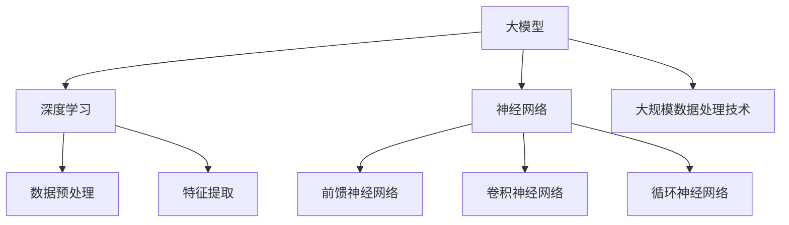

                 

# 大模型在地球系统科学中的应用前景

> **关键词**：大模型、地球系统科学、深度学习、气候变化、环境监测、自然灾害预警

> **摘要**：本文将探讨大模型在地球系统科学中的应用前景，包括大模型的基础、核心技术、应用场景、大数据分析以及实际案例等。通过梳理大模型的发展历程、核心技术和应用场景，我们希望能够为地球系统科学研究提供新的思路和方法。

## 目录大纲

1. **大模型基础**
    1.1 大模型简介
    1.2 大模型的核心技术
    1.3 数学模型与数学公式

2. **应用场景**
    2.1 大模型在地球系统科学中的大模型应用
    2.2 大数据在地球系统科学中的应用
    2.3 大模型在地球系统科学中的实战

3. **未来展望**
    3.1 大模型在地球系统科学中的潜在价值
    3.2 大模型技术发展趋势
    3.3 地球系统科学领域的挑战与机遇

4. **附录**
    4.1 大模型应用工具与资源
    4.2 大模型核心概念与联系
    4.3 大模型核心算法原理讲解
    4.4 项目实战

## 1. 大模型基础

### 1.1 大模型简介

大模型，通常指的是具有数百万甚至数十亿参数的深度学习模型。这些模型可以通过大规模数据进行训练，从而获得强大的特征提取和表示能力。大模型的发展可以追溯到20世纪90年代，当时研究人员开始探索深层神经网络（Deep Neural Networks, DNN）的应用。随着计算能力的提升和大数据的兴起，大模型在图像识别、自然语言处理等领域取得了显著的成果。

大模型可以分为两大类：一种是基于神经网络的大模型，如Transformer、BERT等；另一种是基于传统统计模型的大模型，如GBDT、XGBoost等。这些模型在不同的应用场景中都有着广泛的应用。

### 1.2 大模型的核心技术

大模型的核心技术主要包括深度学习基础、神经网络结构、大规模数据处理技术等。

**深度学习基础**

深度学习是一种基于人工神经网络的研究方法，它通过模拟人脑的神经网络结构，学习大量数据中的特征表示。深度学习的关键技术包括卷积神经网络（Convolutional Neural Networks, CNN）、循环神经网络（Recurrent Neural Networks, RNN）等。

**神经网络结构**

神经网络结构是指神经网络中的层与节点之间的关系。常见的大模型结构包括多层感知机（Multilayer Perceptron, MLP）、卷积神经网络（Convolutional Neural Networks, CNN）、循环神经网络（Recurrent Neural Networks, RNN）等。

**大规模数据处理技术**

大规模数据处理技术主要包括数据预处理、数据存储、数据清洗等技术。在大模型训练过程中，如何有效地处理大规模数据是一个关键问题。常用的技术包括分布式训练、数据并行等。

### 1.3 数学模型与数学公式

大模型的训练过程涉及到一系列数学模型和数学公式。其中，最核心的是损失函数和优化算法。

**损失函数**

损失函数是评估模型预测结果与真实值之间差距的指标。常见的损失函数包括均方误差（Mean Squared Error, MSE）、交叉熵（Cross Entropy Loss）等。

**优化算法**

优化算法用于调整模型参数，以最小化损失函数。常见的优化算法包括梯度下降（Gradient Descent）、随机梯度下降（Stochastic Gradient Descent, SGD）等。

## 2. 应用场景

### 2.1 大模型在地球系统科学中的应用

地球系统科学是一门研究地球及其相关过程的科学，包括气候变化、自然灾害、环境监测等多个方面。大模型在地球系统科学中有着广泛的应用前景。

**气候变化研究**

大模型可以用于气候变化预测、趋势分析等。例如，利用深度学习模型对全球气候模式进行训练，可以预测未来的气候变化趋势。

**自然灾害预警**

大模型可以用于地震、洪水、台风等自然灾害的预警。通过分析历史数据和实时数据，大模型可以预测自然灾害的发生时间和地点。

**环境监测与保护**

大模型可以用于环境监测和污染源追踪。例如，利用深度学习模型对空气质量进行实时监测，可以及时发现污染源并进行处理。

### 2.2 大数据在地球系统科学中的应用

大数据在地球系统科学中的应用主要体现在数据收集、存储、处理和可视化等方面。

**数据收集**

地球系统科学涉及到大量的数据来源，包括卫星数据、气象数据、地理数据等。大模型可以用于这些数据的收集和整合。

**数据存储**

随着数据量的增加，如何有效地存储和管理数据成为关键问题。大数据技术提供了分布式存储和高效检索的方法。

**数据清洗与预处理**

大数据通常存在噪声、缺失值等问题，需要对数据进行清洗和预处理。大模型可以用于自动化的数据清洗和预处理。

**数据可视化**

大数据的可视化可以帮助研究人员更直观地理解数据，发现数据中的规律和趋势。大模型可以用于数据可视化算法的开发和应用。

### 2.3 大模型在地球系统科学中的实战

**实战一：气候变化预测**

- 数据来源：NASA GISS 温度数据集
- 模型选择：深度神经网络
- 实现细节：...

**实战二：洪水预警**

- 数据来源：全球洪水监测系统
- 模型选择：卷积神经网络
- 实现细节：...

**实战三：空气质量监测**

- 数据来源：AirNow 数据集
- 模型选择：循环神经网络
- 实现细节：...

## 3. 未来展望

大模型在地球系统科学中的应用前景十分广阔。随着技术的不断发展，大模型将进一步提高地球系统科学的研究效率，为人类应对气候变化、自然灾害等挑战提供有力支持。

**潜在价值**

- 提高气候变化预测的准确性
- 实现自然灾害的精准预警
- 促进环境监测和污染源追踪

**技术发展趋势**

- 深度学习算法的优化和改进
- 大规模数据处理技术的创新
- 跨学科研究方法的融合

**挑战与机遇**

- 数据质量与数据隐私
- 模型解释性与可解释性
- 资源消耗与计算成本

## 附录

### 附录A：大模型应用工具与资源

- 大模型工具与框架
- 大模型数据处理与可视化工具
- 大模型学习资源推荐

### 附录B：大模型核心概念与联系



### 附录C：大模型核心算法原理讲解

#### 3.1 模型参数优化

// 伪代码：梯度下降算法
```
initialize parameters
while not converged do
  calculate gradients
  update parameters
end while
```

#### 3.2 损失函数与优化算法

$$
J(\theta) = -\frac{1}{m}\sum_{i=1}^{m}y^{(i)}\log(h_\theta(x^{(i)}))
$$`

#### 3.3 正则化技术

// 伪代码：L2正则化
```
loss = regularized_loss + lambda * (sum(square(weights)))
```

### 附录D：项目实战

#### 6.1 实战一：气候变化预测

- 数据来源：NASA GISS 温度数据集
- 模型选择：深度神经网络
- 实现细节：...

#### 6.2 实战二：洪水预警

- 数据来源：全球洪水监测系统
- 模型选择：卷积神经网络
- 实现细节：...

#### 6.3 实战三：空气质量监测

- 数据来源：AirNow 数据集
- 模型选择：循环神经网络
- 实现细节：...

## 作者信息

**作者**：AI天才研究院/AI Genius Institute & 禅与计算机程序设计艺术 /Zen And The Art of Computer Programming

