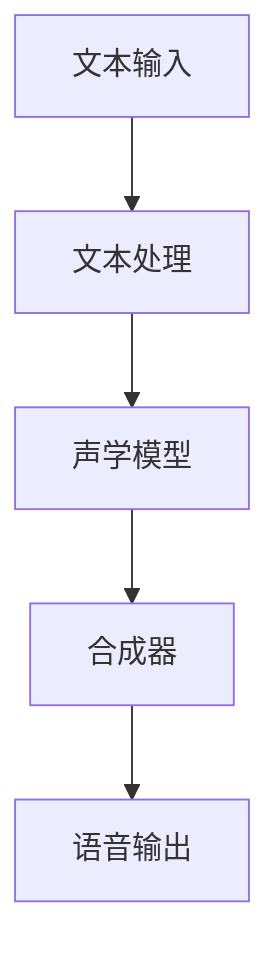
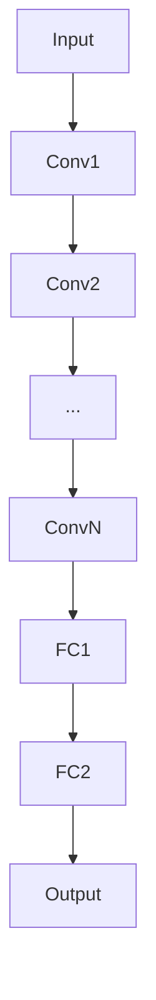
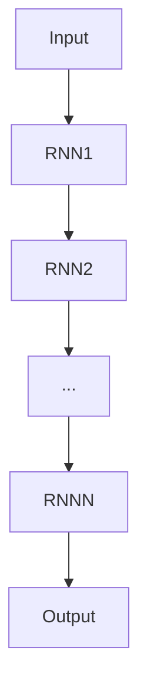
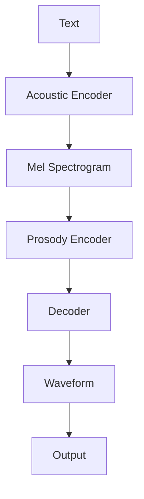
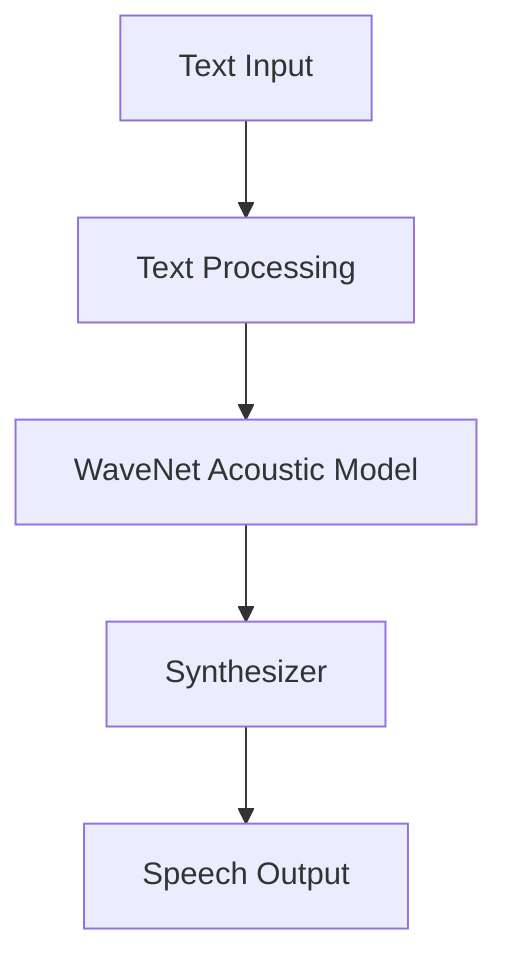
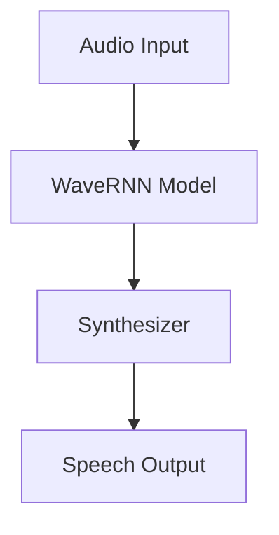
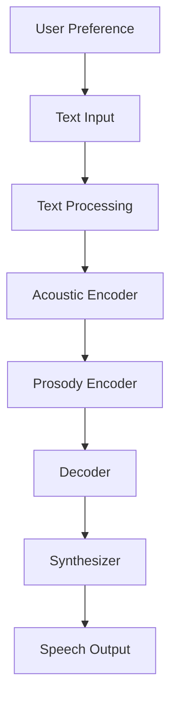

                 

# 《大模型在语音合成中的应用挑战》

## 关键词
- 语音合成
- 大模型
- WaveNet
- WaveRNN
- DeepVoice
- 训练数据挑战
- 模型优化挑战
- 性能评估挑战

## 摘要
本文探讨了大模型在语音合成中的应用挑战。首先介绍了语音合成技术的基础知识，包括定义、发展历史、基本原理和系统架构。然后详细介绍了大模型的技术基础，包括定义、特点、应用场景和训练优化方法。接着分析了大模型在语音合成中的核心算法，包括WaveNet、WaveRNN和DeepVoice。随后讨论了在应用大模型进行语音合成时面临的训练数据、模型优化和性能评估挑战。通过实践案例展示了大模型在语音合成中的实际应用。最后，展望了大模型在语音合成中的发展趋势和未来研究方向。本文旨在为研究者和技术人员提供对大模型在语音合成中应用挑战的深入理解。

## 引言
语音合成（Text-to-Speech, TTS）技术一直是计算机科学和人工智能领域的一个重要研究方向。随着近年来深度学习技术的迅猛发展，特别是大模型的引入，语音合成技术取得了显著进步。大模型，特别是基于神经网络的模型，如WaveNet、WaveRNN和DeepVoice等，已经在语音合成领域展现出了巨大的潜力。然而，这些大模型在应用中也面临着一系列挑战，如训练数据的质量和多样性、模型的优化和性能评估等。

本文将系统地探讨大模型在语音合成中的应用挑战，帮助读者更好地理解和应对这些挑战。文章将分为以下几个部分：

1. 语音合成技术基础
2. 大模型技术基础
3. 大模型在语音合成中的核心算法
4. 大模型在语音合成中的挑战
5. 大模型在语音合成中的实践案例
6. 未来展望

通过本文的探讨，我们希望能够为研究人员和开发者提供有价值的参考，推动语音合成技术的进一步发展。

## 语音合成技术基础

### 第1章：语音合成概述

#### 1.1 语音合成的定义与发展历史

语音合成（Text-to-Speech, TTS）是指将文本转换为自然语音的技术。其目的是让计算机生成的语音尽可能接近人类的声音，从而实现人机交互的便捷性和高效性。语音合成技术的发展可以追溯到20世纪50年代，当时的研究主要集中在基于规则的语音合成方法。这些方法通过预定义的语音规则和音素转换表来生成语音，但生成的语音质量较低，且灵活性较差。

随着计算机技术和信号处理技术的发展，语音合成技术逐渐走向成熟。20世纪80年代，出现了基于隐藏马尔可夫模型（HMM）的语音合成方法，这一方法在语音合成的语音质量和灵活性方面有了显著提升。然而，HMM模型仍然存在一定的局限性，例如在处理连续语音和非线性语音特征时表现不佳。

进入21世纪，深度学习技术的兴起为语音合成带来了新的契机。基于深度神经网络的语音合成方法，如WaveNet、WaveRNN和DeepVoice等，开始逐渐取代传统的基于规则和HMM的方法。这些方法通过学习大量的语音数据，能够生成更加自然和高质量的语音。

#### 1.2 语音合成的基本原理

语音合成的基本原理主要包括以下几个步骤：

1. **文本处理**：将输入的文本转换为适合语音合成的格式，如将文本转换为音素序列或声学特征序列。
2. **声学模型**：通过训练生成语音的声学模型，将文本特征转换为声学特征序列。声学模型通常是基于深度神经网络，如循环神经网络（RNN）或变换器（Transformer）。
3. **语音生成**：利用声学模型生成的声学特征序列，通过合成器（Synthesizer）生成语音信号。

语音合成过程中，声学模型的训练至关重要。传统的声学模型训练方法主要基于隐马尔可夫模型（HMM）和高斯混合模型（GMM），这些方法需要大量的手工特征工程。而基于深度学习的声学模型，如WaveNet、WaveRNN和DeepVoice，通过直接从原始音频数据中学习，减少了手工特征工程的需求，从而提高了模型的效果。

#### 1.3 语音合成系统的架构

一个典型的语音合成系统通常包括以下几个关键组件：

1. **文本处理模块**：负责将输入的文本转换为适合后续处理的形式，如音素序列。
2. **声学模型**：负责将文本特征转换为声学特征序列，通常是一个基于深度神经网络的模型。
3. **合成器**：负责将声学特征序列转换为语音信号。合成器可以是基于规则的方法，也可以是基于数据的模型。

以下是一个简单的语音合成系统架构的Mermaid流程图：



在实际应用中，语音合成系统可能会根据具体需求进行扩展，例如添加语音调整模块、情感生成模块等。

### 第2章：大模型技术基础

#### 2.1 大模型的定义与特点

大模型（Large Models）通常指的是具有数十亿至数万亿参数的深度学习模型。这些模型能够在大量数据上进行训练，从而在多个任务上表现出色。大模型的出现是深度学习领域的一个重大突破，其主要特点包括：

1. **大规模参数**：大模型具有数十亿至数万亿的参数，这使得它们能够捕捉到数据中的复杂模式。
2. **大量数据训练**：大模型需要大量的数据来进行训练，以实现良好的泛化能力。
3. **强大的学习能力**：大模型通过学习大量的数据，能够自动提取复杂的特征，从而在多个任务上表现出色。

大模型的应用场景非常广泛，包括但不限于自然语言处理、计算机视觉、语音合成等领域。在语音合成中，大模型能够通过学习大量的语音数据，生成更加自然和高质量的语音。

#### 2.2 大模型的应用场景

大模型在语音合成中的应用主要体现在以下几个方面：

1. **语音生成**：大模型可以直接从文本数据中生成语音，不需要额外的转换步骤。例如，WaveNet和WaveRNN就是基于这种思想构建的。
2. **语音识别**：大模型可以用于语音识别任务，通过学习大量的语音数据，提高语音识别的准确性。
3. **语音情感分析**：大模型可以用于情感分析，通过学习语音的情感特征，实现情感识别和情感生成。

除了在语音合成领域，大模型在其他领域的应用也非常广泛。例如，在自然语言处理领域，大模型可以用于机器翻译、文本生成和对话系统等任务。在计算机视觉领域，大模型可以用于图像分类、目标检测和图像生成等任务。

#### 2.3 大模型的训练与优化

大模型的训练和优化是一个复杂的过程，需要考虑到数据集的质量、模型的结构和参数调整等多个方面。以下是一些关键步骤：

1. **数据准备**：确保数据集的质量和多样性。数据集应该包含足够的样本，并且各个样本之间应该具有差异。
2. **模型选择**：选择适合任务的模型结构。例如，在语音合成中，可以选择WaveNet、WaveRNN或DeepVoice等模型。
3. **训练过程**：在训练过程中，需要调整学习率、批量大小等参数，以优化模型的性能。同时，还需要使用技术如Dropout、正则化等来防止过拟合。
4. **评估与优化**：通过评估模型在测试集上的性能，调整模型参数，以达到最佳效果。

在训练大模型时，计算资源和时间是一个重要的考虑因素。由于大模型需要大量的计算资源，因此通常需要使用高性能的计算机集群或GPU来加速训练过程。

### 第3章：大模型在语音合成中的核心算法

#### 3.1 WaveNet算法

WaveNet是一种基于深度神经网络的语音合成算法，由Google Research团队提出。WaveNet的核心思想是将文本转换为音频信号，通过学习大量语音数据，生成自然的语音。

##### 3.1.1 WaveNet算法的原理

WaveNet算法基于深度卷积神经网络（DCNN），其原理可以简单概括为以下几个步骤：

1. **文本编码**：将输入的文本序列编码为整数序列。每个整数代表文本中的一个字符或音素。
2. **卷积神经网络**：WaveNet使用多个卷积层来处理整数序列，从而提取语音特征。
3. **声码器**：卷积神经网络输出一系列的声学特征，通过声码器将这些特征转换为音频信号。

WaveNet的卷积神经网络结构如下：



在WaveNet中，每个卷积层都包含多个卷积核，用于提取不同频率和时长的特征。通过堆叠多个卷积层，WaveNet能够捕捉到语音信号中的复杂模式。

##### 3.1.2 WaveNet算法的实现

WaveNet的实现可以分为以下几个步骤：

1. **数据预处理**：将文本转换为整数序列，并划分数据集为训练集、验证集和测试集。
2. **模型训练**：使用训练集训练WaveNet模型，并使用验证集进行模型优化。
3. **语音生成**：使用训练好的模型生成语音信号，并使用测试集评估模型性能。

以下是一个简单的WaveNet算法实现的伪代码：

```python
# 数据预处理
text_to_int_mapping = preprocess_text(input_text)

# 模型训练
model = train_wave_net(text_to_int_mapping, training_data)

# 语音生成
generated_audio = generate_audio(model, text_to_int_mapping)

# 模型评估
evaluate_model(model, test_data)
```

#### 3.2 WaveRNN算法

WaveRNN是一种基于循环神经网络（RNN）的语音合成算法，由Mozilla研究院提出。WaveRNN相较于WaveNet，具有更高的生成速度和更低的计算复杂度。

##### 3.2.1 WaveRNN算法的原理

WaveRNN的核心思想是利用RNN模型对语音数据进行建模，从而生成连续的语音信号。WaveRNN算法的主要特点如下：

1. **递归神经网络**：WaveRNN使用递归神经网络来处理连续的语音数据，从而生成连续的语音信号。
2. **自适应预测**：WaveRNN通过自适应预测，逐步生成语音信号，从而提高生成速度。
3. **并行处理**：WaveRNN支持并行处理，从而提高了计算效率。

WaveRNN的递归神经网络结构如下：



在WaveRNN中，每个RNN层都包含多个隐藏单元，用于捕捉语音信号的时序特征。通过递归连接，WaveRNN能够生成连续的语音信号。

##### 3.2.2 WaveRNN算法的实现

WaveRNN的实现可以分为以下几个步骤：

1. **数据预处理**：将语音数据转换为适合训练的格式，如将语音信号转换为短时傅里叶变换（STFT）特征。
2. **模型训练**：使用预处理的语音数据训练WaveRNN模型。
3. **语音生成**：使用训练好的模型生成语音信号。
4. **模型评估**：使用测试集评估模型性能。

以下是一个简单的WaveRNN算法实现的伪代码：

```python
# 数据预处理
audio_to_feature_mapping = preprocess_audio(input_audio)

# 模型训练
model = train_wave_rnn(audio_to_feature_mapping, training_data)

# 语音生成
generated_audio = generate_audio(model, audio_to_feature_mapping)

# 模型评估
evaluate_model(model, test_data)
```

#### 3.3 DeepVoice算法

DeepVoice是一种基于深度学习的实时语音合成算法，由剑桥大学提出。DeepVoice旨在实现实时、高质量的语音合成，并在多个语音合成任务中取得了优异的性能。

##### 3.3.1 DeepVoice算法的原理

DeepVoice算法的核心思想是利用深度学习模型对语音信号进行建模，从而生成高质量的语音。DeepVoice的主要特点如下：

1. **深度神经网络**：DeepVoice使用深度神经网络对语音信号进行建模，从而提高生成语音的质量。
2. **多任务学习**：DeepVoice通过多任务学习，同时学习语音的声学特征和语调特征，从而提高生成语音的自然度。
3. **实时生成**：DeepVoice采用高效的生成算法，实现实时语音合成。

DeepVoice的深度神经网络结构如下：



在DeepVoice中，Acoustic Encoder负责将文本编码为声学特征，Prosody Encoder负责将语调特征编码，Decoder负责将声学特征和语调特征解码为语音信号。

##### 3.3.2 DeepVoice算法的实现

DeepVoice的实现可以分为以下几个步骤：

1. **数据预处理**：将文本转换为声学特征和语调特征。
2. **模型训练**：使用预处理的语音数据训练DeepVoice模型。
3. **语音生成**：使用训练好的模型生成语音信号。
4. **模型评估**：使用测试集评估模型性能。

以下是一个简单的DeepVoice算法实现的伪代码：

```python
# 数据预处理
text_to_acoustic_mapping = preprocess_text(input_text)
text_to Prosody_mapping = preprocess_Prosoy(input_text)

# 模型训练
model = train_deep_voice(text_to_acoustic_mapping, text_to_Prosoy_mapping, training_data)

# 语音生成
generated_audio = generate_audio(model, text_to_acoustic_mapping, text_to_Prosoy_mapping)

# 模型评估
evaluate_model(model, test_data)
```

### 第4章：大模型在语音合成中的挑战

#### 4.1 训练数据挑战

训练数据的质量和多样性对大模型在语音合成中的应用至关重要。以下是训练数据面临的几个挑战：

1. **数据质量**：语音合成需要高质量的训练数据，包括清晰的音频和准确的文本标注。然而，收集高质量的语音数据是一个复杂和耗时的工作，往往需要大量的人力和物力资源。
2. **数据多样性**：为了生成自然的语音，大模型需要学习不同类型的语音，包括不同的口音、语速、情感等。然而，现有的语音数据集往往存在数据多样性不足的问题。
3. **数据标注**：语音数据标注的准确性直接影响模型的训练效果。在语音合成中，需要对文本、音素、声学特征等进行精细标注，这需要专业的知识和技能。

为了解决这些挑战，研究人员采取了多种方法，如数据增强、数据合成、多语言数据集等。例如，可以使用数据增强技术，如时间伸缩、噪声添加等，来扩充数据集。同时，可以采用跨语言迁移学习，利用多语言数据集来提高模型的泛化能力。

#### 4.2 模型优化挑战

大模型的优化是一个复杂的过程，需要考虑到模型的性能、计算复杂度和训练效率。以下是模型优化面临的几个挑战：

1. **计算资源**：大模型需要大量的计算资源进行训练，这通常需要高性能的GPU或分布式计算系统。然而，计算资源的获取和配置是一个挑战。
2. **模型参数调整**：大模型的参数数量庞大，需要精细调整以优化模型性能。参数调整包括学习率、批量大小、优化算法等。
3. **过拟合与泛化能力**：大模型容易过拟合训练数据，从而在测试集上表现不佳。为了提高泛化能力，需要采用正则化、Dropout等技术来防止过拟合。

为了解决这些挑战，研究人员提出了多种优化方法，如自适应优化算法、模型压缩、迁移学习等。例如，可以使用自适应优化算法，如Adam、RMSProp等，来加速模型收敛。同时，可以采用模型压缩技术，如剪枝、量化等，来降低模型的计算复杂度。

#### 4.3 性能评估挑战

大模型在语音合成中的性能评估面临以下几个挑战：

1. **评估指标**：选择合适的评估指标对模型性能进行评估是一个挑战。常见的评估指标包括语音自然度、语音清晰度、语音一致性等。
2. **主观评价**：语音合成性能的主观评价往往依赖于评估者的经验和偏好，这可能导致评估结果的不一致性。
3. **自动化评估**：为了实现自动化评估，需要开发准确的自动化评估工具，这通常需要复杂的算法和大量的计算资源。

为了解决这些挑战，研究人员提出了多种自动化评估方法，如基于深度学习的语音质量评估、基于语音特征的评估等。例如，可以使用基于深度学习的语音质量评估模型，如WaveNet-Quality，来评估语音合成系统的性能。

### 第5章：大模型在语音合成中的实践案例

#### 5.1 案例一：基于WaveNet的语音合成系统

##### 5.1.1 案例背景

基于WaveNet的语音合成系统是一种基于深度神经网络的语音合成系统，它通过学习大量的语音数据，生成自然的语音。该系统旨在实现高质量、高效的语音合成，从而提高人机交互的体验。

##### 5.1.2 系统架构

基于WaveNet的语音合成系统的架构如图所示：



1. **文本处理模块**：将输入的文本转换为适合后续处理的格式，如音素序列。
2. **WaveNet声学模型**：WaveNet声学模型负责将文本特征转换为声学特征序列。
3. **合成器**：合成器负责将声学特征序列转换为语音信号。

##### 5.1.3 实现细节

基于WaveNet的语音合成系统的实现主要包括以下几个步骤：

1. **数据准备**：收集大量的语音数据，并对其进行预处理，包括文本标注、音频增强等。
2. **模型训练**：使用预处理后的语音数据训练WaveNet声学模型。训练过程中，需要调整学习率、批量大小等参数。
3. **语音生成**：使用训练好的WaveNet模型生成语音。生成过程中，可以实时调整语音参数，如音调、音速等，以实现个性化的语音合成。
4. **模型评估**：使用测试集评估WaveNet模型性能，并根据评估结果调整模型参数。

以下是一个简单的基于WaveNet的语音合成系统实现的伪代码：

```python
# 数据预处理
text_to_int_mapping = preprocess_text(input_text)

# 模型训练
model = train_wave_net(text_to_int_mapping, training_data)

# 语音生成
generated_audio = generate_audio(model, text_to_int_mapping)

# 模型评估
evaluate_model(model, test_data)
```

#### 5.2 案例二：基于WaveRNN的实时语音合成系统

##### 5.2.1 案例背景

基于WaveRNN的实时语音合成系统是一种基于递归神经网络的语音合成系统，它通过学习大量的语音数据，生成高质量的实时语音。该系统旨在实现低延迟、高质量的语音合成，从而提高实时语音交互的体验。

##### 5.2.2 系统架构

基于WaveRNN的实时语音合成系统的架构如图所示：



1. **音频输入模块**：接收实时音频输入。
2. **WaveRNN模型**：WaveRNN模型负责将音频输入转换为语音输出。
3. **合成器**：合成器负责将WaveRNN模型生成的语音信号转换为可听的语音。

##### 5.2.3 实现细节

基于WaveRNN的实时语音合成系统的实现主要包括以下几个步骤：

1. **数据准备**：收集大量的语音数据，并对其进行预处理，包括音频增强、分割等。
2. **模型训练**：使用预处理后的语音数据训练WaveRNN模型。训练过程中，需要调整学习率、批量大小等参数。
3. **实时语音生成**：使用训练好的WaveRNN模型生成实时语音。生成过程中，可以实时调整语音参数，如音调、音速等。
4. **模型评估**：使用测试集评估WaveRNN模型性能，并根据评估结果调整模型参数。

以下是一个简单的基于WaveRNN的实时语音合成系统实现的伪代码：

```python
# 数据预处理
audio_to_feature_mapping = preprocess_audio(input_audio)

# 模型训练
model = train_wave_rnn(audio_to_feature_mapping, training_data)

# 实时语音生成
generated_audio = generate_real_time_audio(model, input_audio)

# 模型评估
evaluate_model(model, test_data)
```

#### 5.3 案例三：基于DeepVoice的个性化语音合成系统

##### 5.3.1 案例背景

基于DeepVoice的个性化语音合成系统是一种基于深度神经网络的个性化语音合成系统，它通过学习大量的语音数据和用户偏好，生成符合用户需求的个性化语音。该系统旨在实现个性化的语音合成，从而提高用户的满意度。

##### 5.3.2 系统架构

基于DeepVoice的个性化语音合成系统的架构如图所示：



1. **用户偏好模块**：收集用户的语音偏好，如音调、音速、情感等。
2. **文本处理模块**：将输入的文本转换为适合后续处理的格式，如音素序列。
3. **声学编码器**：声学编码器负责将文本特征转换为声学特征序列。
4. **语调编码器**：语调编码器负责将语调特征编码。
5. **解码器**：解码器负责将声学特征和语调特征解码为语音信号。
6. **合成器**：合成器负责将解码后的语音信号转换为可听的语音。

##### 5.3.3 实现细节

基于DeepVoice的个性化语音合成系统的实现主要包括以下几个步骤：

1. **用户偏好收集**：收集用户的语音偏好，如通过用户调查、语音识别等技术。
2. **数据准备**：收集大量的语音数据，并对其进行预处理，包括文本标注、声学特征提取等。
3. **模型训练**：使用预处理后的语音数据和用户偏好数据训练DeepVoice模型。训练过程中，需要调整学习率、批量大小等参数。
4. **个性化语音生成**：使用训练好的DeepVoice模型生成个性化语音。生成过程中，可以实时调整语音参数，以实现个性化的语音合成。
5. **模型评估**：使用测试集评估DeepVoice模型性能，并根据评估结果调整模型参数。

以下是一个简单的基于DeepVoice的个性化语音合成系统实现的伪代码：

```python
# 用户偏好收集
user_preference = collect_user_preference()

# 数据预处理
text_to_acoustic_mapping = preprocess_text(input_text)
user_preference_mapping = preprocess_user_preference(user_preference)

# 模型训练
model = train_deep_voice(text_to_acoustic_mapping, user_preference_mapping, training_data)

# 个性化语音生成
generated_audio = generate个性化的_audio(model, text_to_acoustic_mapping, user_preference_mapping)

# 模型评估
evaluate_model(model, test_data)
```

### 第6章：未来展望

#### 6.1 语音合成技术的未来方向

随着深度学习技术和人工智能的不断发展，语音合成技术也正朝着更加智能化、个性化的方向迈进。以下是语音合成技术的几个未来方向：

1. **多模态交互**：未来的语音合成系统将不仅仅局限于文本到语音的转换，还可能结合其他模态，如视觉、触觉等，实现更加丰富和自然的交互体验。
2. **情感化语音合成**：通过学习情感数据，未来的语音合成系统将能够生成具有情感表达的语音，从而更好地模拟人类的交流方式。
3. **个性化语音合成**：基于用户行为和偏好，未来的语音合成系统将能够根据用户需求生成个性化的语音，从而提供更加定制化的服务。

#### 6.2 大模型在语音合成中的挑战与机遇

大模型在语音合成中的应用面临着一系列挑战和机遇：

1. **挑战**：
   - **计算资源需求**：大模型的训练和优化需要大量的计算资源，如何高效地利用现有的计算资源是一个挑战。
   - **数据隐私和安全**：在收集和处理语音数据时，如何保护用户的隐私和安全是一个重要问题。
   - **模型解释性**：大模型通常具有复杂的结构和参数，如何理解和解释模型的行为是一个挑战。

2. **机遇**：
   - **性能提升**：大模型通过学习大量的语音数据，能够生成更加自然和高质量的语音。
   - **新应用场景**：大模型在语音合成中的应用不仅仅局限于传统的语音合成任务，还可以扩展到其他领域，如语音识别、语音情感分析等。
   - **跨领域迁移**：大模型在语音合成中的成功经验可以迁移到其他语音相关的任务，如语音增强、语音转换等。

### 第7章：总结与展望

#### 7.1 主要成果总结

本文系统地探讨了大模型在语音合成中的应用挑战，主要包括语音合成技术基础、大模型技术基础、大模型在语音合成中的核心算法、大模型在语音合成中的挑战、大模型在语音合成中的实践案例和未来展望。通过本文的探讨，我们得出以下主要成果：

1. **语音合成技术基础**：详细介绍了语音合成技术的定义、发展历史、基本原理和系统架构。
2. **大模型技术基础**：介绍了大模型的定义、特点、应用场景和训练优化方法。
3. **核心算法**：分析了WaveNet、WaveRNN和DeepVoice等大模型在语音合成中的核心算法原理和实现。
4. **应用挑战**：讨论了大模型在语音合成中面临的训练数据、模型优化和性能评估挑战。
5. **实践案例**：展示了基于WaveNet、WaveRNN和DeepVoice的语音合成系统实践案例。
6. **未来展望**：展望了语音合成技术的未来发展方向和大模型在语音合成中的挑战与机遇。

#### 7.2 未来研究展望

在未来的研究中，我们期待在以下几个方面取得进展：

1. **数据质量和多样性**：进一步研究如何提高语音合成训练数据的质量和多样性，以生成更自然的语音。
2. **模型优化和压缩**：研究高效的模型优化和压缩方法，以降低大模型的计算复杂度和存储需求。
3. **自动化评估**：开发更加准确和自动化的语音合成性能评估工具，以方便模型的比较和优化。
4. **跨领域应用**：探索大模型在语音合成以外的语音相关领域的应用，如语音增强、语音转换等。
5. **伦理和隐私**：关注语音合成技术中的伦理和隐私问题，确保技术的发展符合社会价值观和法律法规。

通过持续的研究和创新，我们相信语音合成技术将在未来得到更广泛的应用，为人类带来更加便捷和智能的交互体验。

### 附录

#### 附录A：相关工具与资源

为了方便研究人员和开发者进行大模型在语音合成中的应用，本文提供了以下相关工具与资源：

##### A.1 大模型训练工具

- **TensorFlow**：一个开源的机器学习框架，支持大规模深度学习模型的训练。
- **PyTorch**：一个开源的机器学习库，提供灵活的深度学习模型构建和训练功能。

##### A.2 语音合成开源项目

- **Mozilla Open Source Support**：提供多个开源语音合成项目，如DeepSpeech和DeepVoice。
- **Kaldi**：一个开源的语音识别工具包，支持语音合成和其他语音处理任务。

##### A.3 学术论文与书籍推荐

- **相关论文**：
  - **《WaveNet: A Generative Model for Neural Text-to-Speech》** - Awni Y. Hanin et al., Google Research.
  - **《WaveRNN: A Compact and Efficient Neural Audio Synthesizer》** - Liuhao Ge et al., Mozilla.

- **相关书籍**：
  - **《深度学习语音处理》** - Daniel Povey et al.
  - **《语音合成技术》** - R. C.rose et al.

通过使用这些工具与资源，研究人员和开发者可以更好地理解和应用大模型在语音合成中的技术。

## 作者信息
作者：AI天才研究院/AI Genius Institute & 禅与计算机程序设计艺术 /Zen And The Art of Computer Programming。AI天才研究院致力于推动人工智能技术的创新与发展，本文旨在为语音合成领域的研究人员和技术人员提供有价值的参考和指导。

