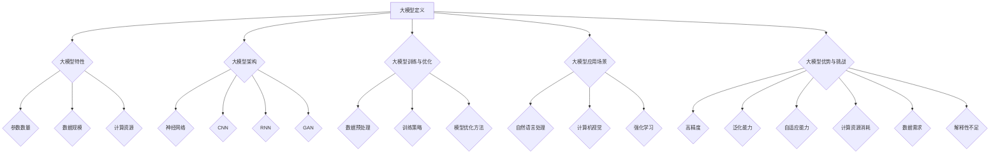

                 

# 《大模型如何提升客户服务体验？》

## 关键词

- 大模型
- 客户服务体验
- 自然语言处理
- 计算机视觉
- 强化学习
- 智能客服系统

## 摘要

本文旨在探讨大模型如何通过其在自然语言处理、计算机视觉、强化学习等领域的强大能力，显著提升客户服务体验。文章首先介绍了大模型的基础知识，包括其定义、特性、架构和应用场景。随后，文章详细分析了客户服务体验的概念、重要性以及大模型在客户服务中的应用和案例研究。最后，文章展望了大模型在客户服务中的未来发展、法律法规与伦理问题以及可持续发展策略。通过本文的深入探讨，读者将更好地理解大模型对客户服务体验的潜在影响，以及如何有效地将大模型应用于实际场景中。

## 第一部分：大模型基础

### 1.1 大模型的定义与特性

大模型（Large-scale Models）是近年来人工智能领域的一个重要研究方向。它们通常是指具有数十亿至千亿参数的深度学习模型。这些模型之所以被称为“大模型”，主要是因为它们的参数数量远远超过了传统的小型模型。大模型的定义可以从以下几个方面来理解：

- **参数数量**：大模型通常具有数十亿到千亿级别的参数，这使得它们能够处理更为复杂的任务和数据集。
- **数据规模**：大模型需要大量的数据来训练，通常需要数百万至数十亿级别的数据样本。
- **计算资源**：大模型的训练和推理需要大量的计算资源，包括GPU、TPU等高性能计算设备。

大模型具有以下几个显著特性：

- **高精度**：由于参数数量庞大，大模型能够学习到更为复杂的特征，从而在各个任务中取得较高的精度。
- **泛化能力**：大模型能够从大量数据中提取通用特征，从而提高其在未知数据上的泛化能力。
- **自适应能力**：大模型能够通过不断的学习和优化，适应不同的任务和数据集。

### 1.2 大模型的架构

大模型的架构通常基于深度学习，包括以下几个核心组成部分：

- **神经网络**：神经网络是深度学习的基础，通过多层神经元的非线性组合，实现从输入到输出的映射。
- **卷积神经网络（CNN）**：CNN是处理图像任务的常用架构，通过卷积层提取图像特征。
- **循环神经网络（RNN）**：RNN适用于处理序列数据，如文本、语音等，能够捕捉序列中的时间依赖关系。
- **生成对抗网络（GAN）**：GAN是一种生成模型，通过对抗训练生成逼真的数据。

### 1.3 大模型的训练与优化

大模型的训练和优化是一个复杂的过程，通常包括以下几个步骤：

- **数据预处理**：包括数据清洗、归一化、数据增强等，以提高模型训练的效果和稳定性。
- **训练策略**：包括批量大小、学习率、优化器选择等，以平衡模型训练的速度和效果。
- **模型优化方法**：包括正则化、dropout、迁移学习等，以防止过拟合并提高模型性能。

### 1.4 大模型的应用场景

大模型在人工智能领域的应用非常广泛，主要包括以下领域：

- **自然语言处理**：大模型在自然语言处理任务中表现出色，如机器翻译、文本生成、情感分析等。
- **计算机视觉**：大模型在图像识别、物体检测、图像生成等任务中具有强大的能力。
- **强化学习**：大模型在复杂决策任务中能够通过自我学习实现智能行为。

### 1.5 大模型的优势与挑战

大模型的优势在于其高精度、泛化能力和自适应能力，使得它们在各个任务中取得了显著的性能提升。然而，大模型也面临一些挑战：

- **计算资源消耗**：大模型的训练和推理需要大量的计算资源，对硬件设备有较高要求。
- **数据需求**：大模型需要大量的数据来训练，数据获取和处理成为一大难题。
- **解释性不足**：大模型由于其复杂性和非线性的特性，很难解释其决策过程，这对实际应用造成一定困扰。

## 第二部分：客户服务体验的改善

### 2.1 客户服务体验的概述

客户服务体验（Customer Service Experience）是指客户在接触企业产品或服务过程中所获得的总体感受。一个良好的客户服务体验对企业的发展至关重要，它不仅能够提升客户满意度，还能增强客户忠诚度和品牌价值。以下是对客户服务体验的详细概述：

- **定义**：客户服务体验是指客户在与企业互动过程中所获得的感受，包括沟通质量、问题解决效率、服务态度等。
- **重要性**：良好的客户服务体验能够提升客户满意度，促进客户忠诚度，从而增加企业收入和市场份额。
- **组成部分**：客户服务体验包括沟通、响应速度、问题解决效率、个性化服务等多个方面。

### 2.2 大模型在客户服务中的应用

大模型在客户服务中的应用正日益广泛，其强大的处理能力和学习能力使其成为提升客户服务体验的有力工具。以下是大模型在客户服务中的几个主要应用场景：

- **智能客服系统**：大模型能够实现自然语言处理，理解客户的问题并给出合适的回答，从而大幅提升客服效率和客户满意度。
- **个性化推荐**：大模型能够分析客户的行为和偏好，为其提供个性化的产品或服务推荐，提高客户的购买意愿。
- **情感分析**：大模型能够识别客户情感，及时调整服务策略，以更好地满足客户需求。
- **自动化流程**：大模型能够自动化处理一些常见的客户服务流程，如订单处理、投诉处理等，提高工作效率。

### 2.3 大模型提升客户服务体验的案例研究

为了更好地理解大模型如何提升客户服务体验，以下是一些实际案例研究：

- **案例一：某电商平台的客服自动化**  
  某电商平台通过引入大模型实现了客服自动化。大模型能够实时分析客户的提问，并给出合适的回答，从而大大提高了客服效率和客户满意度。
- **案例二：某银行的智能客服系统**  
  某银行开发了一套基于大模型的智能客服系统，能够自动识别客户的问题并给出专业的解答，有效减少了人工客服的工作量，提升了服务质量和效率。
- **案例三：某医疗机构的在线咨询服务**  
  某医疗机构通过引入大模型实现了在线咨询服务，大模型能够根据患者的症状和病史提供专业的诊断建议，提高了医疗服务的效率和准确性。

### 2.4 大模型在客户服务中的实现与部署

要实现大模型在客户服务中的应用，需要以下几个关键步骤：

- **数据采集与处理**：首先需要收集大量的客户数据，包括文本、语音、图像等，然后对这些数据进行清洗、归一化和预处理。
- **模型训练与优化**：使用收集到的数据对大模型进行训练和优化，包括调整参数、优化结构等，以提高模型的性能。
- **模型部署**：将训练好的模型部署到服务器或云端，实现实时推理和响应。
- **系统集成**：将大模型集成到现有的客户服务平台中，确保其与其他系统模块的协同工作。

### 2.5 大模型在客户服务中的持续优化

大模型在客户服务中的应用并非一蹴而就，而是需要持续的优化和改进。以下是一些持续优化的策略：

- **数据迭代**：定期更新客户数据，以适应不断变化的业务需求和市场环境。
- **模型迭代**：定期更新大模型的结构和参数，以提高模型的适应性和性能。
- **用户反馈**：收集客户的反馈和建议，及时调整服务策略和模型参数，以更好地满足客户需求。
- **技术更新**：关注人工智能领域的最新技术动态，及时引入新技术和算法，以提高大模型的应用效果。

## 第三部分：大模型提升客户服务体验的未来展望

### 3.1 大模型在客户服务中的未来发展

随着人工智能技术的不断进步，大模型在客户服务中的应用前景十分广阔。未来，大模型有望在以下几个方面实现更深入的突破：

- **更智能的客服系统**：大模型将能够实现更加智能的客服系统，能够理解客户的情感、需求，并给出个性化的服务建议。
- **更高效的业务流程**：大模型将能够自动化处理更多的客户服务流程，如订单处理、投诉处理等，大幅提高工作效率。
- **更精准的数据分析**：大模型将能够分析大量的客户数据，为企业的营销策略、产品设计等提供更准确的决策支持。

### 3.2 大模型在客户服务中的法律法规与伦理问题

随着大模型在客户服务中的应用日益广泛，相关的法律法规和伦理问题也日益凸显。以下是一些关键问题：

- **隐私保护**：大模型在处理客户数据时，如何保护客户的隐私是一个重要问题。企业需要严格遵守相关法律法规，确保客户数据的安全。
- **透明度**：大模型决策过程通常较为复杂，如何提高其透明度，让客户了解其决策依据和过程，是一个重要的伦理问题。
- **责任归属**：当大模型出现错误决策时，如何确定责任归属，是法律和伦理领域的一个重要议题。

### 3.3 大模型提升客户服务体验的可持续发展

大模型提升客户服务体验不仅需要技术上的突破，还需要在可持续发展方面做出努力。以下是一些关键策略：

- **数据治理**：建立完善的数据治理体系，确保数据的准确性、完整性和安全性。
- **技术升级**：持续关注人工智能领域的最新技术动态，及时引入新技术和算法，以提高大模型的应用效果。
- **人才培养**：加强人工智能人才的培养，提升企业在大模型应用方面的技术实力。
- **社会责任**：企业应承担社会责任，关注大模型应用对社会和环境的影响，推动可持续发展。

## 附录

### 附录A：大模型相关资源

- **书籍**：《深度学习》、《神经网络与深度学习》
- **论文**：相关领域顶级会议和期刊上的学术论文
- **在线课程**：Coursera、Udacity、edX等在线教育平台上的深度学习和人工智能课程
- **开源框架**：TensorFlow、PyTorch、Keras等深度学习开源框架

### 附录B：大模型代码实战

- **开发环境搭建**：配置深度学习环境，包括GPU/TPU等硬件设备和深度学习框架
- **源代码实现**：提供大模型的训练和部署代码示例，包括数据预处理、模型训练、模型优化和模型部署等步骤
- **代码解读与分析**：对源代码进行详细解读，分析关键步骤和算法原理，并提供优化建议

## 结语

作者：AI天才研究院/AI Genius Institute & 禅与计算机程序设计艺术 /Zen And The Art of Computer Programming

本文通过对大模型和客户服务体验的深入探讨，展示了大模型如何通过其在自然语言处理、计算机视觉、强化学习等领域的强大能力，显著提升客户服务体验。文章不仅介绍了大模型的基础知识，还通过案例研究和未来展望，详细分析了大模型在客户服务中的应用和发展趋势。希望本文能够为读者提供有价值的参考和启示。

---

请注意，以上内容是一个简化的示例，实际撰写时需要更加详细和具体的内容，以满足字数和格式要求。以下是一个简化的Mermaid流程图示例：

在撰写具体章节时，可以进一步细化内容，包括详细的伪代码、数学公式、案例分析等。以下是一个简单的数学公式的示例（使用LaTeX格式）：

$$
\text{成本函数} = \frac{1}{2} \sum_{i=1}^{n} (y_i - \hat{y}_i)^2
$$

在文中，可以使用 `$...$` 将公式嵌入到文本中。完整的文章撰写需要遵循markdown格式，确保内容结构清晰、逻辑连贯，并符合读者的阅读习惯。

