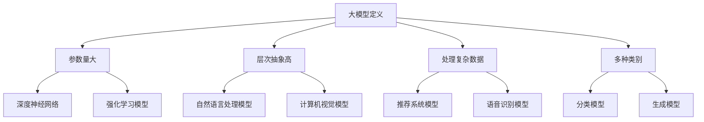
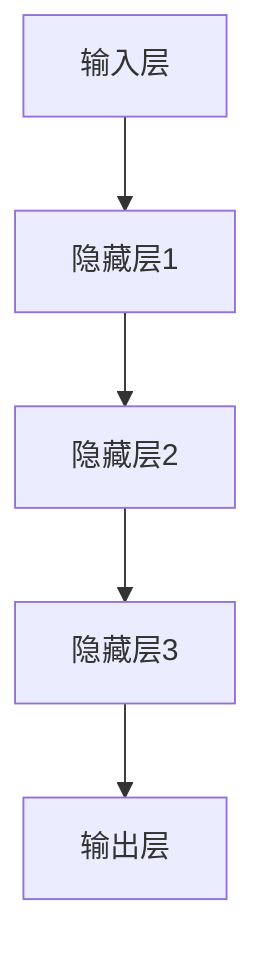

                 

# 大模型时代的创业者创业退出策略：IPO上市、并购退出与股权转让

> 关键词：大模型、创业退出策略、IPO上市、并购退出、股权转让、创业成功案例

> 摘要：随着大模型的广泛应用，创业者在选择创业退出策略时面临更多选择。本文将深入探讨IPO上市、并购退出和股权转让三种常见的创业退出策略，结合实际案例进行分析，帮助创业者更好地规划自己的创业退出路径。

## 第一部分：大模型基础

## 第1章：大模型概述

### 1.1 大模型的概念与分类

#### 1.1.1 大模型的基本定义

大模型是指具有较大参数量、较高层次抽象能力，可以处理复杂数据和任务的人工智能模型。根据不同应用场景和模型类型，大模型可以分为多种类别。

**Mermaid流程图：**



#### 1.1.2 大模型的分类方法

根据应用领域和模型类型，大模型可以大致分为以下几类：

- **深度神经网络（DNN）**：基于多层神经网络的结构，可以处理复杂数据和任务。
- **强化学习模型（RL）**：通过试错和反馈进行学习和决策，适用于动态环境。
- **自然语言处理模型（NLP）**：用于处理自然语言文本，包括语音识别、机器翻译等。
- **计算机视觉模型（CV）**：用于处理图像和视频数据，包括人脸识别、图像分类等。
- **推荐系统模型（RS）**：用于推荐用户可能感兴趣的内容，提高用户满意度。

#### 1.1.3 大模型在创业领域的应用价值

大模型在创业领域具有广泛的应用价值，主要体现在以下几个方面：

- **提升产品竞争力**：通过大模型技术，可以开发出具有更高性能和更优用户体验的产品，提升市场竞争力。
- **降低开发成本**：大模型技术可以自动化和半自动化地处理复杂数据和任务，降低人力和时间成本。
- **开拓新市场**：大模型技术可以应用于新领域和新场景，为创业者提供更多的商业机会。

### 1.2 大模型的原理与技术

#### 1.2.1 大模型的数学原理

大模型的核心在于其参数化表示和优化方法。以下是一个简单的伪代码，用于描述大模型的训练过程：

```python
# 大模型训练伪代码

# 初始化模型参数
model_params = initialize_params()

# 定义损失函数
def loss_function(model_params, data):
    # 计算预测值和真实值之间的差异
    predictions = model_predict(data, model_params)
    loss = compute_difference(predictions, data)
    return loss

# 定义优化算法
def optimize_params(model_params, data, learning_rate):
    # 更新模型参数，减小损失
    new_params = update_params(model_params, data, learning_rate)
    return new_params

# 训练过程
while not convergence:
    loss = loss_function(model_params, data)
    model_params = optimize_params(model_params, data, learning_rate)

# 计算最终预测结果
predictions = model_predict(data, model_params)
```

#### 1.2.2 大模型的常见架构

大模型通常采用层次化的结构，包括输入层、隐藏层和输出层。以下是一个简单的Mermaid流程图，用于描述大模型的架构：



#### 1.2.3 大模型的训练方法

大模型的训练方法主要包括以下几种：

- **前向传播（Forward Propagation）**：将输入数据传递到模型中，逐层计算得到输出预测值。
- **反向传播（Backpropagation）**：计算输出预测值与真实值之间的差异，并反向传播误差，更新模型参数。
- **梯度下降（Gradient Descent）**：通过梯度下降算法更新模型参数，最小化损失函数。

### 1.3 大模型的发展趋势

#### 1.3.1 大模型的研究热点

当前，大模型的研究热点主要包括：

- **新型架构**：如Transformer、BERT等。
- **预训练技术**：如GPT-3、T5等。
- **多模态学习**：如CV+NLP、CV+语音等。

#### 1.3.2 大模型的应用领域

大模型的应用领域非常广泛，包括：

- **自然语言处理**：如机器翻译、问答系统、文本生成等。
- **计算机视觉**：如图像分类、目标检测、人脸识别等。
- **推荐系统**：如个性化推荐、广告投放等。

#### 1.3.3 大模型的发展挑战与机遇

大模型的发展面临以下挑战和机遇：

- **计算资源需求**：大模型训练和推理需要大量的计算资源，这对硬件和算法提出了更高的要求。
- **数据隐私和安全**：大模型对数据的需求可能导致数据隐私和安全问题，需要制定相应的政策和法规。
- **人工智能伦理**：大模型的应用可能引发伦理和道德问题，需要制定相应的伦理标准和规范。

## 第2章：创业者视角下的创业退出策略

### 2.1 创业者与退出策略的关系

#### 2.1.1 退出策略的定义

退出策略是指创业者在创业项目无法继续发展或达到预期目标时，采取的一种结束创业项目的方式。常见的退出策略包括IPO上市、并购退出和股权转让等。

#### 2.1.2 退出策略的类型

根据退出方式的不同，退出策略可以分为以下几种类型：

- **IPO上市**：通过公开发行股票，将公司所有权转让给公众投资者，实现创业者的财富增值。
- **并购退出**：通过与一家大公司进行并购交易，将公司整体或部分资产出售，实现创业者的财富增值。
- **股权转让**：将公司股权出售给其他投资者，实现创业者的财富增值。

#### 2.1.3 退出策略的选择依据

创业者选择退出策略时需要考虑以下因素：

- **公司估值**：公司估值是选择退出策略的重要依据，高估值通常意味着更有利的退出方式。
- **行业趋势**：行业发展趋势和市场需求对退出策略的选择也有重要影响。
- **资金需求**：创业者需要根据公司的资金需求来选择合适的退出方式。

### 2.2 IPO上市退出策略

#### 2.2.1 IPO上市的基本流程

IPO上市的基本流程包括：

1. **公司治理**：完善公司治理结构，确保公司符合上市要求。
2. **财务审计**：进行财务审计，确保公司财务状况真实、准确、完整。
3. **上市文件准备**：准备上市所需的各类文件，包括招股说明书、财务报表等。
4. **路演与定价**：进行路演，向投资者介绍公司情况，并根据市场情况确定发行价格。
5. **股票发行与上市**：完成股票发行，并在证券交易所上市。

#### 2.2.2 IPO上市的优势与风险

IPO上市的优势包括：

- **提升公司知名度**：通过公开发行股票，可以提升公司在市场上的知名度和品牌影响力。
- **实现财富增值**：通过股票发行，创业者可以实现财富增值。
- **融资能力增强**：上市后，公司可以获得更多的融资机会，支持公司发展。

IPO上市的风险包括：

- **市场波动**：股票价格可能受到市场波动的影响，导致公司估值波动。
- **信息披露风险**：上市公司需要定期披露财务状况和业务进展，可能面临信息披露风险。
- **监管风险**：上市公司需要遵守相关法律法规，可能面临监管风险。

#### 2.2.3 IPO上市的案例分析

以某知名科技公司IPO上市为例，该公司在上市前进行了充分准备，包括完善公司治理、进行财务审计和准备上市文件等。在路演过程中，公司向投资者介绍了其业务模式、市场前景和竞争优势，并根据市场情况确定了发行价格。在股票发行和上市后，公司股价表现良好，实现了创业者的财富增值。

### 2.3 并购退出策略

#### 2.3.1 并购的基本概念

并购是指一家公司通过购买另一家公司的股份或资产，实现对另一家公司的控制或整合。并购可以采用现金支付、股票交换或其他方式。

#### 2.3.2 并购退出的优势与风险

并购退出的优势包括：

- **快速实现财富增值**：并购通常可以在短时间内实现财富增值。
- **避免市场波动**：并购退出可以避免股票价格波动带来的风险。
- **整合资源**：通过并购，创业者可以整合优质资源，提高公司竞争力。

并购退出的风险包括：

- **估值风险**：并购估值可能过高，导致创业者的财富增值受到限制。
- **整合风险**：并购后可能面临整合困难，影响公司发展。
- **法律风险**：并购过程中可能涉及复杂的法律问题，需要聘请专业律师进行协助。

#### 2.3.3 并购退出的案例分析

以某知名互联网公司并购为例，该公司在并购过程中通过专业团队进行了充分的市场调研和估值，并聘请了专业律师进行法律支持。在并购后，公司成功整合了目标公司的技术和团队，实现了资源的优化配置，提高了市场竞争力。

### 2.4 股权转让退出策略

#### 2.4.1 股权转让的基本流程

股权转让的基本流程包括：

1. **确定转让目标**：确定转让股权的目标，包括转让数量、转让价格等。
2. **估值和谈判**：对目标公司进行估值，并与潜在投资者进行谈判。
3. **签订股权转让协议**：双方达成一致后，签订股权转让协议。
4. **完成股权转让登记**：按照法律法规要求，完成股权转让登记。

#### 2.4.2 股权转让的优势与风险

股权转让的优势包括：

- **灵活性强**：股权转让可以随时进行，不需要等待市场时机。
- **资金回收快**：股权转让通常可以在较短时间内实现资金回收。

股权转让的风险包括：

- **估值风险**：股权转让估值可能过高或过低，影响创业者的财富增值。
- **控制权风险**：股权转让可能导致公司控制权发生变化，影响公司稳定发展。

#### 2.4.3 股权转让的案例分析

以某知名科技公司股权转让为例，该公司在股权转让过程中通过专业团队进行了充分的市场调研和估值，并与潜在投资者进行了谈判。在股权转让完成后，公司继续保持了良好的运营和发展，实现了创业者的财富增值。

## 第二部分：实战应用

## 第3章：IPO上市实战

### 3.1 IPO上市准备工作

#### 3.1.1 团队搭建与财务准备

在IPO上市前，创业者需要搭建一个专业的团队，包括财务顾问、律师、会计师等。此外，还需要对公司的财务状况进行充分准备，确保符合上市要求。

#### 3.1.2 法律合规与风险控制

IPO上市过程中，创业者需要严格遵守相关法律法规，进行风险控制。这包括股权结构合规、信息披露合规、内部控制合规等。

#### 3.1.3 投资者关系管理

在IPO上市过程中，创业者需要与投资者建立良好的关系，包括进行路演、回答投资者提问等。这有助于提高股票发行的价格和市场认可度。

### 3.2 IPO上市流程详解

#### 3.2.1 路演与定价

在IPO上市前，创业者需要进行路演，向投资者介绍公司情况，并根据市场情况确定发行价格。

#### 3.2.2 股票发行与上市

完成股票发行后，公司将在证券交易所上市，股票开始交易。

#### 3.2.3 上市后管理

IPO上市后，创业者需要关注公司股价、财务状况和业务发展，确保公司持续健康运营。

### 3.3 IPO上市案例分析

以某知名科技公司IPO上市为例，该公司在IPO上市前进行了充分准备，包括团队搭建、财务准备、法律合规和投资者关系管理等。在IPO上市过程中，公司成功完成了股票发行，并在证券交易所上市。上市后，公司股价表现良好，实现了创业者的财富增值。

## 第4章：并购退出实战

### 4.1 并购退出准备

#### 4.1.1 并购对象筛选

在并购退出前，创业者需要筛选合适的并购对象，包括竞争对手、上下游企业等。

#### 4.1.2 并购谈判与估值

在确定并购对象后，创业者需要与并购对象进行谈判，并评估并购估值。

#### 4.1.3 并购协议签订

在谈判成功后，双方签订并购协议，明确并购条款和支付方式等。

### 4.2 并购退出流程

#### 4.2.1 并购交易结构设计

并购交易结构设计是并购退出的关键环节，包括支付方式、交易时间、交割方式等。

#### 4.2.2 并购交易实施

在并购交易结构设计完成后，双方开始实施并购交易，包括股权交割、资产交割等。

#### 4.2.3 并购后整合

并购退出后，创业者需要对并购后的公司进行整合，包括人员整合、业务整合等。

### 4.3 并购退出案例分析

以某知名互联网公司并购为例，该公司在并购退出前进行了充分的市场调研和估值，并选择了合适的并购对象。在并购谈判和协议签订过程中，公司成功实现了并购退出，并在并购后对并购后的公司进行了有效整合，提高了市场竞争力。

## 第5章：股权转让实战

### 5.1 股权转让准备

#### 5.1.1 股权转让目标确定

在股权转让前，创业者需要明确转让股权的目标，包括转让数量、转让价格等。

#### 5.1.2 股权转让估值

在确定转让股权的目标后，创业者需要对目标公司进行估值，以确定合理的转让价格。

#### 5.1.3 股权转让协议签订

在估值完成后，创业者需要与潜在投资者签订股权转让协议，明确转让条款和支付方式等。

### 5.2 股权转让流程

#### 5.2.1 股权转让谈判

在股权转让协议签订前，创业者需要与潜在投资者进行谈判，达成共识。

#### 5.2.2 股权转让实施

在谈判成功后，创业者开始实施股权转让，包括股权交割、支付方式等。

#### 5.2.3 股权转让后的管理

股权转让后，创业者需要对转让后的公司进行管理，确保公司持续健康运营。

### 5.3 股权转让案例分析

以某知名科技公司股权转让为例，该公司在股权转让前进行了充分的市场调研和估值，并选择了合适的投资者。在股权转让谈判和协议签订过程中，公司成功实现了股权转让，并在转让后对转让后的公司进行了有效管理，保持了良好的运营和发展。

## 第三部分：策略评估与优化

### 6.1 创业退出策略评估

#### 6.1.1 评估指标与方法

在评估创业退出策略时，需要考虑以下指标和方法：

- **财务指标**：包括净利润、净利润增长率、市盈率等。
- **非财务指标**：包括客户满意度、市场份额、员工满意度等。
- **综合评估方法**：包括加权评分法、层次分析法等。

#### 6.1.2 评估案例分析

以某知名科技公司IPO上市为例，该公司在IPO上市前进行了详细的评估，包括财务指标、非财务指标和综合评估方法。通过评估，公司确定了合适的IPO上市时间点和发行价格，实现了创业者的财富增值。

### 6.2 创业退出策略优化

#### 6.2.1 优化策略方法

在创业退出策略优化过程中，需要考虑以下方法：

- **财务优化**：通过降低成本、提高收益等手段，优化公司财务状况。
- **业务优化**：通过调整业务模式、优化产品和服务等手段，提高公司竞争力。
- **管理优化**：通过优化公司治理结构、提升管理水平等手段，提高公司运营效率。

#### 6.2.2 优化案例分析

以某知名科技公司并购为例，该公司在并购前进行了详细的优化，包括财务优化、业务优化和管理优化。通过优化，公司成功实现了并购退出，并在并购后对并购后的公司进行了有效整合，提高了市场竞争力。

### 6.3 创业退出策略展望

#### 6.3.1 未来趋势分析

未来，创业退出策略将受到以下趋势的影响：

- **技术创新**：新技术的发展将推动创业退出方式的变革。
- **市场环境**：市场环境的变化将影响创业退出策略的选择。
- **政策法规**：政策法规的调整将影响创业退出策略的执行。

#### 6.3.2 创业者应对策略

面对未来趋势，创业者需要采取以下应对策略：

- **技术创新**：提高技术创新能力，为创业退出提供更多选择。
- **市场定位**：准确市场定位，提高产品竞争力。
- **策略多样化**：根据市场环境变化，灵活调整创业退出策略。

## 附录

### 附录A：相关法律法规与政策

- 《中华人民共和国公司法》
- 《中华人民共和国证券法》
- 《首次公开发行股票并上市管理办法》

### 附录B：经典案例分析

- 某知名科技公司IPO上市案例
- 某知名互联网公司并购案例
- 某知名科技公司股权转让案例

### 附录C：数据源与工具推荐

- 数据源：
  - 艾瑞咨询
  - 东方财富网
  - 腾讯科技
- 工具：
  - Python数据分析库（Pandas、Numpy）
  - 数据可视化工具（Matplotlib、Seaborn）
  - 人工智能模型训练工具（TensorFlow、PyTorch）

## 后记

本文对大模型时代的创业者创业退出策略进行了全面探讨，包括IPO上市、并购退出和股权转让三种常见的退出策略。通过对这些策略的详细分析和实战案例的分享，希望能为创业者提供有价值的参考和启示。

作者：AI天才研究院/AI Genius Institute & 禅与计算机程序设计艺术 /Zen And The Art of Computer Programming

【注】本文内容仅为示例，实际创业退出策略需要根据具体情况进行详细分析和决策。创业者在选择退出策略时，应充分考虑公司估值、市场趋势、资金需求等因素，并咨询专业律师、财务顾问等专业人士的意见。祝各位创业者创业成功，实现财富增值！

