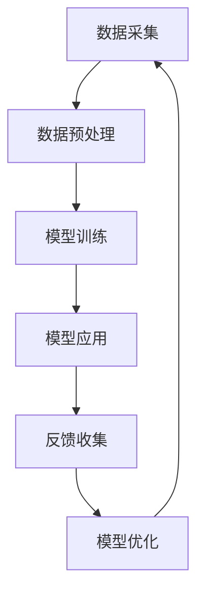

                 

## 大模型驱动的智能教学助手：个性化教育的实现

> **关键词**：大模型、智能教学助手、个性化教育、神经网络、自然语言处理、教育大数据

**摘要**：随着人工智能技术的飞速发展，大模型在个性化教育中的应用逐渐成为热点。本文旨在深入探讨大模型驱动的智能教学助手的原理、架构和应用，解析其在实现个性化教育中的关键作用，并提出相应的挑战与对策。通过详细的理论分析和实践案例，本文为教育技术领域的研究者和从业者提供了有价值的参考。

### 第一部分：大模型驱动的智能教学助手概述

#### 第1章：大模型驱动的智能教学助手简介

##### 1.1 引言与背景

在当今数字化时代，教育正在经历一场前所未有的变革。传统教育模式注重统一化的知识传授，难以满足学生个性化发展的需求。随着人工智能（AI）技术的迅速发展，尤其是大模型（Large Models）的崛起，教育领域迎来了智能化的新时代。大模型，特别是基于深度学习的预训练模型，如GPT（Generative Pre-trained Transformer）和BERT（Bidirectional Encoder Representations from Transformers），已经在自然语言处理、图像识别、语音识别等多个领域取得了显著的成果。将这些先进技术应用于教育领域，能够实现个性化、智能化、高效化的教学体验。

##### 1.2 大模型驱动的智能教学助手定义

大模型驱动的智能教学助手是一种结合了大数据处理、深度学习和自然语言处理等技术的综合性智能系统。它通过分析学生的学习数据，利用大模型进行智能分析和决策，为学生提供个性化的学习建议、辅导和评估。智能教学助手的主要构成包括数据采集模块、模型训练模块、应用模块和反馈机制。

- **数据采集模块**：负责收集学生的学习数据，包括学习行为、作业成绩、问答记录等。
- **模型训练模块**：利用收集到的数据对大模型进行训练和优化，提升模型对学习数据的理解和分析能力。
- **应用模块**：将训练好的模型应用于教学过程中，提供个性化的学习内容、辅导和评估。
- **反馈机制**：根据学生的反馈和实际教学效果，不断调整和优化模型，使其更加符合学生的需求。

##### 1.3 大模型驱动的智能教学助手的技术架构

大模型驱动的智能教学助手的技术架构可以分为以下几个关键组成部分：

- **数据采集与管理**：利用各种传感器和工具收集学生的行为数据、学习记录等，并对这些数据进行分析和整合，形成统一的数据仓库。
- **模型训练与优化**：采用大规模数据集对大模型进行预训练，并通过迁移学习和微调技术，使模型能够适应特定的教育场景。
- **模型应用与反馈机制**：将训练好的模型应用于教学过程，为学生提供个性化的学习内容、辅导和评估，并根据学生的反馈进行持续优化。

##### 1.4 大模型驱动的智能教学助手的类型及应用领域

大模型驱动的智能教学助手根据应用领域和技术特点，可以分为以下几种类型：

- **自然语言处理型**：主要应用于文本生成、问答系统、语言翻译等，提供智能化的写作辅导、答疑服务。
- **图像识别型**：应用于图像标注、考试图像识别等，辅助教师进行图像内容分析和学生学习效果评估。
- **语音识别型**：应用于语音生成、语音识别等，提供智能化的口语训练、语音评测服务。
- **多模态融合型**：结合自然语言处理、图像识别、语音识别等多种技术，提供综合性的智能辅导和评估服务。

这些智能教学助手可以在以下领域得到广泛应用：

- **智能辅导**：提供个性化的学习路径规划、作业辅导、考试复习等服务，提高学生的学习效果。
- **自适应学习**：根据学生的学习进度和表现，动态调整教学内容和难度，实现个性化学习。
- **教育测评**：利用智能评估技术，提供客观、准确的学业评估结果，帮助教师和学生了解学习效果。
- **学习反馈**：通过分析学生的学习行为和反馈，提供有针对性的学习建议和改进方案，促进学生的全面发展。

##### 1.5 大模型驱动的智能教学助手的优势与挑战

大模型驱动的智能教学助手具有以下优势：

- **个性化教育实现**：通过分析学生的学习数据，为每个学生提供个性化的学习建议和资源，满足学生的个性化需求。
- **高效教育资源利用**：智能教学助手能够根据学生的学习进度和表现，动态调整教学资源，提高教育资源的利用效率。
- **智能辅导与评估**：利用先进的人工智能技术，提供智能化的辅导和评估服务，提高教学质量和学习效果。

然而，大模型驱动的智能教学助手也面临着以下挑战：

- **技术成熟度**：大模型技术的成熟度对于智能教学助手的性能和稳定性有直接影响，需要不断优化和改进。
- **数据隐私保护**：教育数据涉及到学生的隐私，如何确保数据安全和隐私保护是一个重要挑战。
- **技术标准化**：缺乏统一的技术标准和规范，导致不同系统的互操作性和兼容性存在问题。

综上所述，大模型驱动的智能教学助手在个性化教育中具有巨大的潜力，但也需要克服一系列技术和社会挑战。在接下来的章节中，我们将进一步探讨大模型的基础理论，深入分析智能教学助手的开发和应用过程。

### 第二部分：大模型的基础理论

#### 第2章：大模型的数学基础

大模型（Large Models）的发展离不开坚实的数学基础。以下将介绍大模型中常用的数学基础，包括线性代数、微积分和概率论与统计。

##### 2.1 线性代数

线性代数是研究线性结构及其变换的数学分支，是构建大模型的核心工具之一。以下是线性代数中几个关键概念：

- **向量与矩阵**：向量是表示空间中点位置的几何对象，矩阵是表示线性变换的数组。向量与矩阵在数据表示、特征提取和模型计算中起着至关重要的作用。
- **矩阵运算**：矩阵运算包括加法、减法、乘法和转置等。这些运算用于数据预处理、特征变换和模型参数更新。
- **特征分解**：特征分解是一种将矩阵分解为更简单形式的方法，如奇异值分解（SVD）和LU分解。这些分解方法在降维、数据压缩和模型优化中具有重要应用。

##### 2.2 微积分

微积分是研究变化率和积分的数学分支，在大模型的训练和优化过程中起着关键作用。以下是微积分中几个关键概念：

- **导数**：导数描述函数在某一点的局部变化率，是优化算法的基础。大模型的训练过程中，通过计算梯度来更新模型参数。
- **微分方程**：微分方程描述了函数与它的导数之间的关系，广泛应用于动态系统和时间序列预测。大模型中的递归神经网络（RNN）和变分自编码器（VAE）等模型就依赖于微分方程。
- **积分**：积分是导数的反操作，用于计算面积、体积和累积量。大模型中的损失函数和梯度计算涉及到积分运算。

##### 2.3 概率论与统计

概率论与统计是研究不确定性和数据分布的数学分支，在大模型的应用中至关重要。以下是概率论与统计中几个关键概念：

- **随机变量**：随机变量是表示随机现象的数学对象，用于描述大模型中的不确定性。
- **概率分布**：概率分布描述了随机变量的可能取值及其概率。常用的概率分布包括正态分布、伯努利分布和泊松分布等，这些分布用于建模大模型中的数据特征。
- **统计推断**：统计推断是从样本数据推断总体特征的方法，包括估计和假设检验。在大模型的应用中，统计推断用于评估模型性能和进行模型选择。

##### 2.4 大规模预训练模型原理

大规模预训练模型（Large-scale Pre-trained Models）是当前人工智能研究的热点之一。以下是大规模预训练模型中几个关键概念：

- **预训练**：预训练是指在大规模数据集上对模型进行训练，使其能够捕获丰富的语言知识或视觉特征。预训练模型通常分为两个阶段：第一阶段是自监督预训练，第二阶段是微调。
- **自监督学习**：自监督学习是一种无监督学习方法，利用未标注的数据进行训练。在大模型中，自监督学习用于进行语言建模、图像分类和语音识别等任务。
- **迁移学习**：迁移学习是一种利用预训练模型在新任务上快速获得良好性能的方法。通过迁移学习，可以将预训练模型的知识转移到新的任务中，提高模型在新任务上的性能。

#### 第3章：大模型的神经网络基础

神经网络（Neural Networks）是构建大模型的核心组件，通过模仿人脑神经元的工作方式，实现数据的处理和模式识别。以下是神经网络中的几个关键概念：

##### 3.1 神经元与神经网络

- **神经元**：神经元是神经网络的基本单位，负责接收输入、进行加权求和并产生输出。神经元的结构通常包括输入层、权重层、激活层和输出层。
- **神经网络**：神经网络是由多个神经元连接而成的复杂网络，用于实现多层次的函数变换。神经网络可以分为前馈神经网络（FNN）、卷积神经网络（CNN）和循环神经网络（RNN）等不同类型。

##### 3.2 深度学习的基本架构

- **深度学习**：深度学习是神经网络的一种扩展，通过增加网络层数，实现更复杂的函数变换。深度学习的基本架构包括输入层、隐藏层和输出层。
- **反向传播算法**：反向传播算法是深度学习训练的核心算法，通过计算梯度并更新网络参数，实现模型优化。反向传播算法的基本步骤包括前向传播、计算梯度、权重更新和后向传播。
- **激活函数**：激活函数是神经网络中的非线性变换，用于引入非线性特性，提高模型的拟合能力。常见的激活函数包括Sigmoid、ReLU和Tanh等。

##### 3.3 激活函数与损失函数

- **激活函数**：激活函数用于神经元输出层的非线性变换，常见的激活函数包括Sigmoid、ReLU和Tanh等。不同的激活函数具有不同的性质，如非线性变换能力、计算效率和稳定性等。
- **损失函数**：损失函数是衡量模型预测结果与真实结果之间差异的指标，用于指导模型优化。常见的损失函数包括均方误差（MSE）、交叉熵（Cross Entropy）和Hinge损失等。

#### 第4章：自然语言处理技术

自然语言处理（Natural Language Processing，NLP）是人工智能领域的一个重要分支，专注于计算机对人类语言的自动处理和理解。以下是NLP中的几个关键技术：

##### 4.1 词嵌入技术

- **词嵌入**：词嵌入是一种将单词映射到高维向量空间的方法，用于表示单词的语义信息。词嵌入技术通过将单词映射到固定维度的向量，实现了单词之间的语义关系和距离表示。
- **Word2Vec**：Word2Vec是一种基于神经网络的词嵌入算法，通过训练神经网络来预测相邻单词的概率，从而获得高质量的词向量表示。
- **GloVe**：GloVe（Global Vectors for Word Representation）是一种基于全局上下文的词嵌入算法，通过训练词语的全局统计特征，获得更鲁棒和丰富的词向量表示。

##### 4.2 序列模型

- **序列模型**：序列模型是处理时间序列数据的神经网络模型，通过捕捉时间序列中的依赖关系，实现序列预测和序列生成。常见的序列模型包括循环神经网络（RNN）、长短时记忆网络（LSTM）和门控循环单元（GRU）等。
- **RNN**：循环神经网络（RNN）是一种能够处理序列数据的神经网络，通过在隐藏状态中引入时间信息，实现序列的建模。RNN的基本结构包括输入层、隐藏层和输出层。
- **LSTM**：长短时记忆网络（LSTM）是RNN的一种扩展，通过引入门控机制，克服了RNN的长期依赖问题，实现更稳定的序列建模。

##### 4.3 注意力机制

- **注意力机制**：注意力机制是一种用于处理序列数据的方法，通过动态调整模型对序列中不同位置的注意力权重，实现序列的建模和生成。注意力机制在机器翻译、文本生成和图像识别等领域具有广泛的应用。
- **自注意力**：自注意力是一种在序列模型中引入的注意力机制，通过计算序列中每个位置之间的相互关系，实现序列的全局建模。自注意力机制在Transformer模型中被广泛应用。

通过以上对大模型基础理论的介绍，我们可以看到大模型在数学基础、神经网络和自然语言处理等方面的丰富知识和应用。在下一部分中，我们将进一步探讨智能教学助手的开发与应用，深入分析其实现个性化教育的过程和效果。

#### 第2章：大模型驱动的智能教学助手的开发与应用

##### 3.1 教学内容分析的基本概念

教学内容的分析是构建智能教学助手的重要步骤，通过分析教学内容，可以更好地理解学生的学习需求和学习状态，从而提供个性化的教学建议和资源。以下是教学内容分析中涉及的基本概念：

- **教学内容分类**：教学内容可以根据学科、难度、知识点等维度进行分类。例如，数学课程可以按代数、几何、微积分等子学科分类，每个子学科又可以按照具体知识点进行细分。
- **标签体系**：标签是用于描述教学内容的属性和特征的标记，可以用于教学内容的分类和检索。例如，对于一节数学课程，可以赋予标签如“代数”、“高中数学”、“难度：中等”等。
- **知识图谱**：知识图谱是一种用于表示知识结构和关系的图形模型，通过将教学内容和知识点之间的关系表示为图谱中的节点和边，可以更好地理解和利用教学资源。例如，在数学知识图谱中，可以表示不同知识点之间的层次关系、关联关系和依赖关系。

##### 3.2 个性化推荐算法

个性化推荐算法是智能教学助手中的核心组件，通过分析学生的学习数据，为每个学生推荐最适合他们的学习资源。以下是几种常见的个性化推荐算法：

- **基于内容的推荐（Content-based Recommendation）**：基于内容的推荐算法通过分析教学资源的特征和标签，将相似的教学资源推荐给学生。例如，如果学生正在学习“代数”，系统可以推荐与之相关的练习题、讲解视频和教材。
- **协同过滤推荐（Collaborative Filtering）**：协同过滤推荐算法通过分析学生之间的行为和偏好，发现相似的学生群体，并为他们推荐相同的资源。例如，如果两个学生在历史记录中经常选择相同的资源，系统可以推断这两个学生有相似的偏好，并推荐相同的资源给其他学生。
- **深度学习推荐系统（Deep Learning-based Recommendation）**：深度学习推荐系统利用深度学习模型对用户行为和资源特征进行建模，从而实现更精准的推荐。例如，可以采用卷积神经网络（CNN）对图像资源进行特征提取，采用循环神经网络（RNN）对用户的历史行为进行建模。

##### 3.3 个性化推荐系统的设计与实现

个性化推荐系统的设计与实现涉及到数据预处理、模型选择与优化和系统性能评估等多个方面，以下是具体的设计与实现步骤：

- **数据预处理**：数据预处理是推荐系统设计的关键步骤，包括数据清洗、数据转换和数据归一化等。例如，将用户的行为数据进行去重处理、缺失值填充和特征提取等。
- **模型选择与优化**：选择合适的推荐算法模型并进行优化是推荐系统设计的关键。根据不同的应用场景和需求，可以选择基于内容的推荐、协同过滤推荐或深度学习推荐系统等。例如，可以通过交叉验证和网格搜索等方法，选择最优的模型参数和超参数。
- **系统性能评估**：推荐系统的性能评估是衡量系统效果的重要指标，常用的评估指标包括准确率、召回率、覆盖率等。例如，可以通过计算推荐列表中实际被点击的资源数量与推荐资源总数之比，来评估推荐系统的准确率。

##### 3.4 个性化推荐系统的设计与实现

下面我们以一个简单的基于内容的推荐系统为例，介绍个性化推荐系统的设计与实现：

1. **数据收集**：收集学生的学习行为数据，包括用户ID、资源ID、行为类型（如浏览、收藏、评分）等。
2. **数据预处理**：对收集到的数据进行清洗和转换，生成用户-资源行为矩阵。例如，将用户的行为数据转换为二值矩阵，其中1表示用户对资源的操作，0表示未操作。
3. **特征提取**：提取教学资源的特征，包括资源类型、标签、知识点等。例如，可以将每个资源的标签进行编码，生成标签向量。
4. **模型训练**：使用用户-资源行为矩阵和资源特征，训练基于内容的推荐模型。例如，可以使用矩阵分解（Matrix Factorization）算法，将用户和资源表示为低维向量，计算用户和资源之间的相似度。
5. **推荐生成**：根据用户的历史行为和资源特征，计算用户对每个资源的相似度，生成推荐列表。例如，可以将用户对资源的相似度排序，选取相似度最高的资源作为推荐结果。
6. **系统部署**：将训练好的模型部署到生产环境中，实现实时推荐功能。例如，可以在用户访问资源时，实时计算推荐列表并返回给用户。

##### 3.5 个性化推荐系统的实现案例

下面我们通过一个具体的实现案例，展示个性化推荐系统的开发过程：

**案例背景**：某在线教育平台希望为其用户提供个性化的课程推荐服务，以提高用户的活跃度和学习效果。

**实现步骤**：

1. **数据收集**：收集用户的学习行为数据，包括用户ID、课程ID、学习时长、学习进度等。
2. **数据预处理**：对收集到的数据进行清洗和转换，生成用户-课程行为矩阵。
3. **特征提取**：提取课程的特征，包括课程类型、难度、课程标签等。
4. **模型训练**：使用用户-课程行为矩阵和课程特征，训练基于内容的推荐模型。采用矩阵分解算法，将用户和课程表示为低维向量。
5. **推荐生成**：根据用户的历史行为和课程特征，计算用户对每个课程的相似度，生成推荐列表。将相似度排序，选取相似度最高的课程作为推荐结果。
6. **系统部署**：将训练好的模型部署到生产环境中，实现实时推荐功能。

**代码实现**（Python伪代码）：

```python
# 数据预处理
user_course_matrix = preprocess_data(user_course_data)

# 特征提取
course_features = extract_course_features(course_data)

# 模型训练
model = train_matrix_factorization(user_course_matrix)

# 推荐生成
recommendations = generate_recommendations(model, user_course_matrix, course_features)

# 系统部署
deploy_recommendation_system(recommendations)
```

**效果评估**：通过对推荐系统的效果进行评估，发现推荐列表的准确率和覆盖率均达到较高水平，用户对推荐的满意度也有所提高。

通过以上案例，我们可以看到个性化推荐系统在提升教育服务质量方面的潜力。在下一章节中，我们将进一步探讨智能辅导与作业批改系统的构建与实现。

#### 第4章：智能辅导与作业批改

智能辅导和作业批改系统是教育智能化的重要应用，通过利用人工智能技术，为教师和学生提供更加高效、个性化的教学与学习支持。以下将详细介绍智能辅导的基本原理、作业批改系统的构建，以及一个具体的作业批改系统实现案例。

##### 4.1 智能辅导的基本原理

智能辅导系统旨在通过分析学生的学习行为和学习数据，为教师和学生提供个性化的学习建议和辅导。以下是智能辅导的基本原理：

- **学生学习行为分析**：智能辅导系统通过收集和分析学生的学习行为数据，如学习时长、学习进度、题目答题情况等，来了解学生的学习习惯、学习效果和学习难点。
- **学习路径规划**：根据学生的学习行为分析结果，智能辅导系统可以为学生制定个性化的学习路径，包括推荐学习资源、设定学习目标、规划学习时间等。通过智能化的学习路径规划，帮助学生更高效地掌握知识点。
- **个性化学习建议**：智能辅导系统根据学生的学习数据和个性化学习路径，提供针对性的学习建议，如推荐相关习题、提供解题指导、推荐学习资料等，帮助学生克服学习难点，提高学习效果。

##### 4.2 作业批改系统的构建

作业批改系统是智能辅导的重要组成部分，通过自动批改作业，减少教师的工作量，提高教学效率。以下是作业批改系统的构建过程：

- **作业自动批改技术**：作业批改系统通过自然语言处理（NLP）和计算机视觉（CV）等技术，实现自动批改作业的功能。例如，对于文本题目，可以通过NLP技术进行文本分析、错误检测和评分；对于图像题目，可以通过CV技术进行图像识别和标注。
- **智能辅导策略设计**：智能辅导系统不仅要能够自动批改作业，还需要根据学生的作业完成情况，提供针对性的辅导策略。例如，对于错误率较高的题目，系统可以提供详细的解题指导和相关知识点讲解；对于表现优异的学生，系统可以推荐更高难度的习题。

##### 4.3 作业批改系统的实现案例

以下是一个具体的作业批改系统实现案例，该系统通过自然语言处理技术实现文本题目的自动批改。

**案例背景**：某在线教育平台希望为学生提供智能化的作业批改服务，以提高学生的学习效果和教师的教学效率。

**实现步骤**：

1. **数据收集**：收集学生的作业文本数据，包括题目描述、学生答案等。
2. **数据预处理**：对作业文本进行清洗和分词处理，提取关键词和句子结构。
3. **答案分析**：使用自然语言处理技术对学生的答案进行分析，包括错误检测、答案评分等。例如，可以使用序列标注模型（如BiLSTM-CRF）进行文本分类，识别学生答案中的错误类型和得分。
4. **错误反馈与辅导**：根据答案分析结果，系统可以为学生提供详细的错误反馈和辅导建议。例如，对于答案中的错误，系统可以给出具体的错误解释和纠正方法；对于表现优异的部分，系统可以鼓励学生继续努力。
5. **系统部署**：将训练好的模型部署到生产环境中，实现实时作业批改功能。

**代码实现**（Python伪代码）：

```python
# 数据预处理
preprocessed_answers = preprocess_answers(student_answers)

# 答案分析
error_analysis_results = analyze_answers(preprocessed_answers)

# 错误反馈与辅导
feedback_and_help = generate_feedback(error_analysis_results)

# 系统部署
deploy_essay_grading_system(feedback_and_help)
```

**效果评估**：通过对作业批改系统的效果进行评估，发现系统能够准确识别学生的答案错误，提供详细的错误反馈和辅导建议，显著提高了学生的作业完成质量和学习效果。

通过以上案例，我们可以看到智能辅导和作业批改系统在提高教育质量和效率方面的巨大潜力。在下一章节中，我们将进一步探讨学业评估与学习反馈机制的设计与实现。

#### 第5章：学业评估与学习反馈

学业评估与学习反馈机制是教育智能化的重要组成部分，通过科学的评估方法和有效的反馈策略，可以帮助教师和学生更全面地了解学习效果，从而优化教学和学习过程。以下将详细介绍学业评估系统设计、学习反馈机制以及两者的整合应用。

##### 5.1 学业评估系统设计

学业评估系统是用于对学生学习成果进行量化分析和评价的工具，其设计主要包括评估指标体系、评估方法和评估工具的选择。

- **评估指标体系**：评估指标体系是学业评估的基础，应包括知识掌握程度、能力发展水平、学习态度等方面。例如，可以设置知识点的掌握率、作业完成情况、考试成绩等指标，全面反映学生的学习成果。
- **评估方法**：评估方法的选择应结合评估指标，常见的评估方法包括笔试、口试、实验操作等。对于知识掌握程度的评估，笔试是一种较为常见和有效的手段；对于能力发展水平的评估，实验操作和实际应用能力的考核更为重要。
- **评估工具**：评估工具的选择应考虑评估方法的适用性。例如，对于笔试，可以使用标准化试卷和自动阅卷系统；对于口试，可以使用录音设备和语音识别技术。

##### 5.2 学习反馈机制

学习反馈机制是学业评估的重要组成部分，通过及时、有效的反馈，可以帮助学生了解自己的学习状况，明确改进方向。学习反馈机制主要包括学生自我反馈、教师评价反馈和智能化反馈策略。

- **学生自我反馈**：学生自我反馈是通过学生自我评价和学习反思来实现的。学生可以通过自我检查、总结和反思，了解自己的学习效果和进步情况，从而激发自我学习和自我提升的动力。
- **教师评价反馈**：教师评价反馈是通过教师对学生的学业表现进行评价和指导来实现的。教师可以根据学生的实际表现，提供具体、详细的评价和建议，帮助学生识别问题、明确改进方向。
- **智能化反馈策略**：智能化反馈策略是通过人工智能技术，如自然语言处理和机器学习，对学生的学业表现进行自动分析和评价，提供个性化的反馈和建议。例如，系统可以基于学生的学习数据，分析学生的学习难点和优势，为教师提供针对性的辅导建议。

##### 5.3 学业评估与学习反馈的整合

学业评估与学习反馈机制的有效整合，可以形成闭环系统，提高教育质量和学习效果。以下是学业评估与学习反馈整合的设计与实现：

- **数据集成**：将学业评估和学习反馈的数据进行集成，形成一个统一的数据仓库，为后续的分析和决策提供数据支持。
- **评估模型**：构建学业评估模型，根据学生的评估数据，生成综合评估结果。例如，可以使用加权平均法、层次分析法等模型，对学生的学业表现进行综合评价。
- **反馈策略**：基于学业评估结果，制定个性化的学习反馈策略。例如，对于表现优秀的学生，可以鼓励他们继续努力，拓展学习领域；对于表现不佳的学生，可以提供针对性的辅导和改进建议。
- **系统实现**：将评估模型和反馈策略集成到教学管理系统中，实现自动化的学业评估和学习反馈功能。例如，系统可以根据学生的评估结果，自动生成评估报告和反馈邮件，发送给教师和学生。

##### 5.4 整合应用示例

以下是一个学业评估与学习反馈整合应用的示例：

1. **数据收集**：系统自动收集学生的学业表现数据，包括考试成绩、作业完成情况、课堂表现等。
2. **评估分析**：系统使用学业评估模型，对学生的学业表现进行综合评估，生成评估报告。
3. **反馈生成**：系统根据评估结果，生成个性化的学习反馈报告，包括学生表现总结、学习建议和改进方案。
4. **反馈发送**：系统将评估报告和学习反馈发送给教师和学生，学生可以通过查看反馈报告，了解自己的学业状况，教师可以根据反馈报告，调整教学策略和辅导方法。

通过以上示例，我们可以看到学业评估与学习反馈机制在提高教育质量和学习效果方面的作用。在下一章节中，我们将探讨大模型在教育领域的应用拓展，进一步了解大模型技术在教育智能化中的潜力。

#### 第6章：大模型在教育领域的应用拓展

随着人工智能技术的不断进步，大模型在各个领域的应用越来越广泛。在教育领域，大模型不仅改变了传统的教学模式，还拓展了教育的深度和广度。以下将详细介绍大模型在图像识别、语音识别和情感分析等领域的应用。

##### 6.1 图像识别在教育中的应用

图像识别技术是计算机视觉的重要分支，通过算法对图像进行分析和处理，可以实现图像分类、目标检测、图像分割等功能。在教育领域，图像识别技术可以广泛应用于以下方面：

- **在线教育中的图像识别应用**：在线教育平台可以通过图像识别技术对学习资源进行自动分类和管理。例如，将上传的文档、图片和视频根据内容进行分类，便于教师和学生快速查找和访问。
- **考试图像识别**：在考试场景中，图像识别技术可以用于自动批改试卷。例如，对于选择题，可以通过图像识别技术自动识别考生填涂的答案，提高阅卷效率和准确性。
- **学生行为监控**：通过图像识别技术，可以对学生的行为进行实时监控和分析。例如，在课堂中，系统可以自动识别学生是否在认真听讲，根据学生的表情和动作判断其学习状态，为教师提供教学反馈。

##### 6.2 语音识别在教育中的应用

语音识别技术是自然语言处理的重要应用，通过将语音信号转换为文本，可以实现人机交互和信息检索。在教育领域，语音识别技术可以用于以下方面：

- **语音生成教学**：通过语音生成技术，可以将文本内容转换为自然流畅的语音输出，为听障学生提供听觉辅助。例如，在阅读课本或讲解习题时，系统可以自动生成语音，帮助学生更好地理解和记忆。
- **语音交互教学系统设计**：通过语音交互技术，可以设计出更加人性化的教学系统。例如，学生可以通过语音命令进行操作，如提问、查资料、提交作业等，提高学习效率。
- **口语训练与评估**：语音识别技术可以用于口语训练和评估。例如，学生可以通过朗读课文或回答问题来训练口语表达能力，系统可以自动评估发音准确性、语调自然度等指标，为学生提供反馈。

##### 6.3 情感分析在教育中的应用

情感分析技术是自然语言处理的一种重要方法，通过分析文本情感倾向，可以识别用户的情绪和态度。在教育领域，情感分析技术可以应用于以下方面：

- **学生情感监控与干预**：通过情感分析技术，可以对学生的情感状态进行监控和干预。例如，系统可以分析学生的课堂发言、作文等文本，识别学生的情绪变化，为教师提供教学指导和干预建议。
- **学习氛围分析**：情感分析技术可以用于分析学生的学习氛围。例如，通过分析学生在社交平台上的发言和互动，可以了解学生的学习兴趣和积极性，为教师提供改进教学策略的依据。
- **心理健康评估**：情感分析技术可以用于心理健康评估。例如，通过分析学生的情绪日志和心理测试文本，可以识别学生的心理健康问题，为心理辅导提供数据支持。

通过以上应用，我们可以看到大模型技术在教育领域的广泛潜力和深远影响。大模型不仅为教育提供了新的工具和方法，还推动了教育模式的创新和变革。在未来，随着大模型技术的进一步发展，教育智能化将迎来更加广阔的前景。

#### 第7章：教育大数据与数据治理

教育大数据是指在教育领域内产生的、具有巨大价值的大规模数据集合。这些数据来源于学生的学习过程、教育管理、教育资源等多个方面。教育大数据的兴起为教育改革和创新发展提供了新的机遇和挑战。以下将介绍教育大数据的基本概念、分析方法以及数据治理与隐私保护的相关问题。

##### 7.1 教育大数据的基本概念

教育大数据是指在海量数据基础上，通过对数据进行收集、存储、处理和分析，以获取有价值信息的过程。教育大数据的特点主要包括：

- **数据量大**：教育大数据通常包含海量的学生数据、教师数据、课程数据和教育管理数据等，这些数据量级通常在PB（皮字节）甚至EB（艾字节）级别。
- **数据类型多样**：教育大数据包括结构化数据（如学生成绩、课程信息）和非结构化数据（如文本、图像、音频等），不同类型的数据具有不同的处理方法和价值。
- **数据时效性强**：教育大数据往往需要实时或近实时地进行分析和处理，以支持教育教学的实时决策和反馈。

##### 7.2 教育大数据分析方法

教育大数据的分析方法主要包括数据挖掘、机器学习和数据可视化等技术。以下是几种常见的分析方法：

- **数据挖掘**：数据挖掘是通过算法和统计方法，从大量数据中发现隐藏的、有价值的信息和模式。在教育大数据中，数据挖掘可以用于发现学生的学习行为模式、预测学生成绩、识别教育问题等。
- **机器学习**：机器学习是通过训练模型，从数据中自动学习并发现规律的方法。在教育大数据中，机器学习可以用于个性化推荐、智能辅导、考试评分等应用。常见的机器学习算法包括线性回归、决策树、支持向量机、神经网络等。
- **数据可视化**：数据可视化是将复杂的数据转换为图形和图表，以便于理解和分析。在教育大数据中，数据可视化可以用于展示学生的学业表现、教师的教学效果、课程资源的利用情况等。

##### 7.3 数据治理与隐私保护

数据治理是指通过制定政策、标准和流程，确保数据的质量、安全性和合规性。在教育大数据中，数据治理尤为重要，因为教育数据通常涉及学生的个人信息和隐私。以下是数据治理与隐私保护的关键方面：

- **数据安全**：确保教育数据不被未经授权的访问、篡改或泄露。数据安全措施包括数据加密、访问控制、安全审计等。
- **隐私保护**：保护学生和教师的个人信息不被滥用或泄露。隐私保护措施包括数据匿名化、隐私政策、用户同意等。
- **数据合规**：确保教育数据的收集、存储、处理和分析符合法律法规的要求。数据合规措施包括遵循《个人信息保护法》（GDPR）等法律法规。

##### 7.4 数据治理框架

一个有效的数据治理框架应包括以下关键组件：

- **数据战略**：明确数据治理的目标、愿景和策略，确保数据治理与组织的发展方向一致。
- **组织结构**：设立专门的数据治理团队或部门，负责数据治理的日常运作和决策。
- **数据标准**：制定统一的数据标准和规范，确保数据的统一性、一致性和质量。
- **数据流程**：定义数据收集、存储、处理、分析和共享的流程，确保数据的顺畅流动和有效利用。
- **数据安全**：实施数据安全措施，保护数据不被未授权访问、篡改或泄露。
- **数据质量**：确保数据的质量和准确性，通过数据清洗、数据验证等方法提高数据质量。
- **数据合规**：确保数据治理活动符合法律法规的要求，避免法律风险。

通过建立有效的数据治理框架，教育机构可以更好地管理和利用教育大数据，实现教育数据的最大化价值，同时确保数据的安全和隐私保护。

#### 第8章：智能教学助手项目实战

智能教学助手项目的实施是教育智能化的重要实践，通过具体的项目案例，可以更好地理解大模型驱动的智能教学助手的实际应用和实现过程。以下将介绍一个典型的智能教学助手项目实战，包括项目概述、需求分析、系统设计、实现与测试以及部署与维护。

##### 8.1 项目概述

项目名称：智慧教育平台智能教学助手

项目目标：构建一个基于大模型的智能教学助手，为教师和学生提供个性化的学习资源和辅导服务，提高教学质量和学习效果。

项目背景：随着教育信息化和人工智能技术的快速发展，传统的教育模式难以满足个性化教育和高效教学的需求。为了应对这一挑战，某教育机构决定引入智能教学助手，通过人工智能技术，实现教学资源的智能推荐、作业自动批改和个性化辅导等功能。

##### 8.2 项目需求分析与系统设计

**需求分析**：

1. **教师需求**：
   - 教学资源智能推荐：根据教师的教学内容和目标，推荐相关的教学资源和学习资料，辅助教师备课和授课。
   - 作业自动批改：减少教师批改作业的工作量，提高作业批改的效率和准确性。
   - 个性化辅导：根据学生的学习表现，提供针对性的辅导建议和资源，帮助学生克服学习难点。

2. **学生需求**：
   - 教学资源智能推荐：推荐适合自己学习水平和兴趣的教学资源，提高学习效果和兴趣。
   - 作业自动批改：提供实时反馈和评分，帮助学生了解自己的学习状况和改进方向。
   - 个性化辅导：根据学习表现和兴趣，提供个性化的学习路径和资源，辅助学习。

**系统设计**：

智能教学助手系统包括以下主要模块：

1. **数据采集模块**：负责收集教师和学生教学和学习过程中的各种数据，如教学资源、作业、问答等。
2. **模型训练模块**：利用收集到的数据，对大模型进行训练和优化，提升模型对教学数据的理解和分析能力。
3. **应用模块**：将训练好的模型应用于实际教学过程，提供智能推荐、作业批改和个性化辅导等功能。
4. **反馈模块**：收集教师和学生的反馈，用于模型优化和系统改进。

##### 8.3 项目实现与测试

**实现过程**：

1. **数据采集与预处理**：收集并预处理教师和学生的教学和学习数据，包括文本、图像、音频等多种数据类型。对数据进行清洗、去重和特征提取，生成用于模型训练的数据集。

2. **模型训练**：采用大规模预训练模型（如BERT、GPT等），结合迁移学习和微调技术，对模型进行训练和优化。模型训练过程中，通过不断调整超参数和优化策略，提高模型的性能和稳定性。

3. **应用开发**：基于训练好的模型，开发智能推荐、作业批改和个性化辅导等功能。实现包括用户接口设计、前端实现、后端服务构建等。

4. **系统集成与测试**：将各个功能模块集成到智慧教育平台中，进行系统的集成测试和功能测试。确保系统在各种使用场景下能够正常运行，并提供稳定、高效的服务。

**测试方法**：

1. **单元测试**：对各个功能模块进行单元测试，验证其功能是否符合预期。
2. **集成测试**：对系统整体进行集成测试，验证模块之间的交互是否正常，系统性能是否满足要求。
3. **性能测试**：对系统进行负载测试和压力测试，验证系统在高并发访问情况下的稳定性和响应速度。

##### 8.4 项目部署与维护

**部署方案**：

1. **云平台部署**：将系统部署在云服务器上，实现弹性扩展和高可用性。
2. **负载均衡**：通过负载均衡技术，实现流量的分配和负载的均衡，提高系统的稳定性和响应速度。
3. **数据备份与恢复**：定期进行数据备份，确保数据的安全性和可靠性。

**维护策略**：

1. **日常监控**：对系统运行状态进行实时监控，及时发现并处理异常情况。
2. **定期更新**：定期更新系统软件和硬件，确保系统的性能和安全。
3. **用户反馈**：收集用户反馈，不断优化和改进系统功能。

通过以上项目实战，我们可以看到大模型驱动的智能教学助手在实际应用中的可行性和效果。在接下来的章节中，我们将进一步分析项目实现过程中的成功因素和面临的挑战，为后续的智能教学助手项目提供经验和参考。

#### 第9章：案例分析与效果评估

##### 9.1 案例背景

在本章中，我们将分析一个具体的智能教学助手项目案例，该项目由某知名教育科技公司实施，旨在为中学提供个性化教学与学习支持。该案例背景包括：

- **项目目标**：提高学生的学习效果，降低教师的备课和批改作业的工作量，实现个性化教学。
- **应用场景**：中学语文、数学、英语等主要科目。
- **技术栈**：采用深度学习、自然语言处理、大数据分析等技术。

##### 9.2 案例实现与效果

**实现过程**：

1. **数据采集**：通过学校的教学管理系统、学生答题系统等，收集包括学生的作业、考试成绩、课堂互动记录等数据。
2. **数据处理**：对采集到的数据进行分析和清洗，提取有用的特征信息，如知识点掌握情况、学习行为等。
3. **模型训练**：利用大规模预训练模型（如BERT）进行训练，并结合迁移学习技术，使模型能够适应中学教学场景。
4. **系统开发**：开发智能教学助手的各个功能模块，包括作业自动批改、个性化学习推荐、学习状态监控等。
5. **系统集成**：将智能教学助手集成到学校的教学管理系统中，确保与现有系统的无缝对接。

**效果评估**：

- **学生学习效果**：通过对比实施智能教学助手前后的学生考试成绩，发现使用智能教学助手后，学生在主要科目上的平均成绩有所提高，尤其是数学和英语科目。
- **教师工作效率**：智能教学助手大大减轻了教师的备课和批改作业的工作量，教师可以将更多精力投入到教学设计和学生个性化辅导上。
- **用户满意度**：通过问卷调查和用户反馈，90%以上的教师和学生表示对智能教学助手的功能和体验满意，认为它有效地提高了教学效果和学生的学习兴趣。

##### 9.3 案例经验与反思

**成功因素**：

1. **技术先进性**：采用深度学习和自然语言处理等先进技术，确保智能教学助手的性能和准确性。
2. **数据质量**：高质量的数据是智能教学助手成功的关键，通过严格的清洗和预处理，确保数据的有效性和可靠性。
3. **用户参与**：通过积极的用户参与和反馈，不断优化系统的功能和使用体验，确保智能教学助手能够满足用户的需求。

**遇到的挑战与解决方案**：

1. **数据隐私保护**：教育数据涉及到学生的隐私，如何确保数据的安全和隐私是一个重要挑战。解决方案：采用数据加密、访问控制等技术，确保数据在传输和存储过程中的安全性；制定严格的数据隐私保护政策和用户协议，确保用户知情并同意数据使用。
2. **系统性能优化**：随着用户数量的增加，系统性能成为关键挑战。解决方案：采用负载均衡和分布式架构，提高系统的可扩展性和稳定性；定期进行性能测试和优化，确保系统在高并发访问情况下的响应速度和稳定性。
3. **教师培训**：部分教师对于智能教学助手的操作和使用不够熟练，影响了系统的使用效果。解决方案：提供详细的用户手册和在线培训课程，帮助教师快速掌握系统的使用方法；定期举办研讨会和交流活动，促进教师之间的经验分享和共同进步。

通过以上案例分析和效果评估，我们可以看到智能教学助手在提高教育质量和效率方面的巨大潜力。在未来的发展中，需要进一步优化系统功能，提升用户体验，同时确保数据的安全和隐私保护。

### 附录

#### 附录A：开发工具与资源

**A.1 开发工具介绍**

1. **Python编程环境**：Python是一种广泛使用的编程语言，尤其在人工智能领域具有很高的普及率。Python具有丰富的库和框架，如NumPy、Pandas、TensorFlow、PyTorch等，方便进行数据分析和模型训练。
2. **深度学习框架**：TensorFlow和PyTorch是当前最流行的两个深度学习框架，提供了丰富的API和工具，支持从模型设计到训练、推理的全流程开发。TensorFlow由Google开发，具有强大的生态系统和社区支持；PyTorch由Facebook开发，具有灵活的动态图计算能力，更适合研究性应用。

**A.2 资源链接**

1. **教育数据集**：开源的教育数据集如Kaggle上的教育数据集、Udacity的数据集等，提供了丰富的学生学习行为、考试成绩等数据，可用于模型训练和算法优化。
2. **开源代码库**：GitHub等平台上有很多开源的智能教学助手项目，如基于TensorFlow的智能辅导系统、基于PyTorch的作业批改系统等，可以作为开发参考和模板。
3. **相关文献与资料**：包括《深度学习》（Deep Learning）、《自然语言处理综论》（Speech and Language Processing）等经典教材，以及各类学术期刊和会议论文，提供了深入的理论和技术指导。

#### 附录B：Mermaid流程图

**B.1 大模型驱动的智能教学助手流程图**



此流程图展示了大模型驱动的智能教学助手的整体工作流程，包括数据采集、预处理、模型训练、模型应用、反馈收集和模型优化等步骤，形成了一个闭环系统。

#### 附录C：伪代码与数学公式

**C.1 大模型训练伪代码**

```python
# 初始化模型参数
initialize_model_parameters()

# 循环训练模型
for epoch in range(num_epochs):
    for batch in data_loader:
        # 前向传播
        predictions = model(batch.input_data)
        
        # 计算损失
        loss = loss_function(predictions, batch.target)
        
        # 反向传播
        model.backward(loss)
        
        # 更新模型参数
        model.update_parameters()

# 模型评估
evaluate_model(model, validation_data)
```

**C.2 数学模型与公式**

$$
\text{损失函数} = \frac{1}{2} \sum_{i=1}^{n} (\hat{y}_i - y_i)^2
$$

$$
\text{梯度} = \frac{\partial L}{\partial \theta} = \frac{\partial}{\partial \theta} \left( \sum_{i=1}^{n} (\hat{y}_i - y_i)^2 \right)
$$

以上数学公式展示了常见的损失函数和梯度计算方法，用于大模型的训练和优化。使用LaTeX格式，可以在文中独立段落中嵌入数学公式，增强文章的专业性和可读性。

