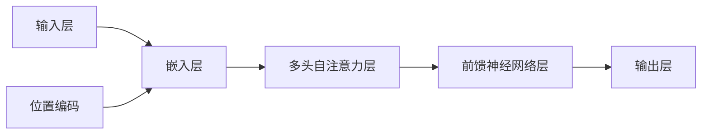
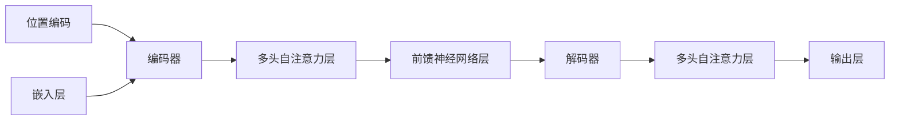

                 

### 大规模语言模型从理论到实践 模型训练

> **关键词**：大规模语言模型、模型训练、自然语言处理、深度学习、Transformer、预训练、自监督学习

**摘要**：本文将深入探讨大规模语言模型的训练过程，从理论到实践，全面解析其基础知识和实现方法。我们将介绍大规模语言模型的定义、重要性、架构、理论基础，以及数学模型和公式。同时，文章将提供详细的实现基础、训练策略、评估与调优方法，并通过实际项目案例，展示大规模语言模型在文本分类和机器翻译中的具体应用。最后，我们将展望大规模语言模型的发展趋势及其在工业界的广泛应用。

### 第一部分：大规模语言模型概述

#### 第1章：大规模语言模型的基础知识

##### 1.1.1 大规模语言模型的定义与重要性

**定义**：大规模语言模型是一种基于深度学习的自然语言处理模型，它通过学习大量文本数据，预测文本中的下一个单词或句子。这些模型能够捕捉到语言的复杂性和多样性，从而在文本生成、文本分类、机器翻译等领域表现出色。

**重要性**：大规模语言模型在自然语言处理领域具有重要的地位，主要体现在以下几个方面：

1. **文本生成**：大规模语言模型可以生成高质量的文本，如新闻文章、故事、诗歌等，为文学创作、内容生成提供了强大工具。
2. **文本分类**：大规模语言模型可以快速对大量文本进行分类，应用于舆情监测、垃圾邮件过滤、情感分析等领域。
3. **机器翻译**：大规模语言模型在机器翻译领域取得了显著的进展，为跨语言交流、国际化业务提供了支持。
4. **问答系统**：大规模语言模型可以构建问答系统，为用户提供智能问答服务，如搜索引擎、智能客服等。

##### 1.1.2 大规模语言模型的架构

**神经网络结构**：大规模语言模型通常采用深度神经网络（DNN）结构，包括输入层、隐藏层和输出层。输入层接收文本序列，隐藏层通过非线性变换提取特征，输出层生成预测结果。

**变体架构**：为了提高模型的性能，大规模语言模型可以采用变体架构，如Transformer架构。Transformer架构通过多头自注意力机制和位置编码，有效地捕捉到了长距离依赖和位置信息。

##### 1.1.3 大规模语言模型的训练

**数据预处理**：大规模语言模型的训练需要大量高质量文本数据。在数据预处理阶段，需要对文本进行清洗、分词、词嵌入等操作，将文本转换为模型可处理的格式。

**训练策略**：大规模语言模型的训练通常采用批处理和迭代的方式。在训练过程中，通过优化算法（如梯度下降）和正则化方法（如dropout、L2正则化），提高模型的收敛速度和泛化能力。

**模型优化**：在模型优化阶段，需要对模型进行调参和超参数调整，以获得更好的性能。常用的优化方法包括学习率调度、批处理大小、数据增强等。

##### 1.1.4 大规模语言模型的评估

**评估指标**：大规模语言模型的评估通常采用准确性、召回率、F1分数等指标。准确性表示模型预测正确的概率，召回率表示模型召回真实正例的概率，F1分数是准确性和召回率的加权平均。

**评估方法**：大规模语言模型的评估可以通过交叉验证、A/B测试等方法进行。在实际应用中，还可以结合业务指标（如转化率、点击率等）对模型进行评估。

**评估流程**：评估流程通常包括数据准备、模型训练、模型评估、结果分析等步骤。通过评估流程，可以全面了解模型的性能，为后续优化提供依据。

### 第二部分：大规模语言模型的理论基础

#### 第2章：自然语言处理的基本概念

##### 2.1.1 自然语言处理的基本概念

**语言模型**：语言模型是一种概率模型，用于预测给定输入文本序列的概率。在自然语言处理中，语言模型常用于文本生成、文本分类等任务。

**词嵌入**：词嵌入是一种将单词映射到高维向量空间的方法，用于表示单词的语义信息。词嵌入有助于提高模型在自然语言处理任务中的性能。

**序列模型**：序列模型是一种处理序列数据的方法，如循环神经网络（RNN）和长短期记忆网络（LSTM）。序列模型在自然语言处理任务中具有重要应用，如文本分类、情感分析等。

##### 2.1.2 大规模语言模型的算法基础

**递归神经网络（RNN）**：递归神经网络是一种处理序列数据的方法，其核心思想是利用前一个时间步的输出作为当前时间步的输入。RNN在自然语言处理任务中具有较好的性能。

**长短期记忆网络（LSTM）**：长短期记忆网络是一种改进的递归神经网络，能够有效地捕捉长距离依赖关系。LSTM在自然语言处理任务中表现出色。

**卷积神经网络（CNN）**：卷积神经网络是一种用于图像处理的方法，其核心思想是通过卷积操作提取图像的特征。近年来，CNN在自然语言处理任务中也得到了广泛应用。

##### 2.1.3 注意力机制与Transformer架构

**注意力机制**：注意力机制是一种用于提高模型在序列数据上表现的方法，其核心思想是在每个时间步计算输入序列中其他时间步的重要性。注意力机制在自然语言处理任务中具有广泛的应用。

**Transformer架构**：Transformer是一种基于注意力机制的深度学习模型，其核心思想是使用多头自注意力机制和位置编码，有效地捕捉到了长距离依赖和位置信息。Transformer在自然语言处理任务中取得了显著的成果。

##### 2.1.4 自监督学习与预训练

**自监督学习**：自监督学习是一种无监督学习方法，其核心思想是从未标记的数据中学习有用的特征。自监督学习在自然语言处理任务中具有重要的应用。

**预训练**：预训练是一种在特定任务之前，利用大量未标记数据对模型进行训练的方法。预训练有助于提高模型在下游任务上的性能。

**微调技术**：微调技术是一种在预训练模型的基础上，利用少量有监督数据进行微调的方法。微调技术有助于提高模型在特定任务上的性能。

### 第三部分：大规模语言模型的实现与实践

#### 第3章：数学模型与数学公式

##### 3.1.1 矩阵与向量运算

**矩阵乘法**：矩阵乘法是一种将两个矩阵相乘得到一个新的矩阵的方法。矩阵乘法在自然语言处理任务中具有广泛的应用。

**向量加法**：向量加法是一种将两个向量相加得到一个新的向量的方法。向量加法有助于提高模型在序列数据上的表现。

**矩阵求导**：矩阵求导是一种对矩阵进行求导的方法。矩阵求导有助于优化模型的参数，提高模型的性能。

##### 3.1.2 激活函数

**Sigmoid函数**：Sigmoid函数是一种将输入映射到[0,1]区间的函数，常用于分类任务。

**ReLU函数**：ReLU函数是一种非线性的激活函数，其核心思想是当输入大于0时，输出等于输入；当输入小于等于0时，输出等于0。ReLU函数有助于提高模型在非线性任务上的表现。

**Softmax函数**：Softmax函数是一种将输入映射到概率分布的函数，常用于多分类任务。

##### 3.1.3 损失函数

**交叉熵损失函数**：交叉熵损失函数是一种用于评估模型预测结果与真实结果之间差异的函数。交叉熵损失函数在分类任务中具有广泛的应用。

**均方误差损失函数**：均方误差损失函数是一种用于评估模型预测结果与真实结果之间差异的函数。均方误差损失函数在回归任务中具有广泛的应用。

### 第四部分：大规模语言模型的实现基础

#### 第4章：大规模语言模型的实现基础

##### 4.1.1 计算机系统基础

**GPU加速**：GPU加速是一种利用图形处理器（GPU）进行加速计算的方法。GPU具有强大的并行计算能力，适用于大规模语言模型的训练。

**分布式计算**：分布式计算是一种将任务分布在多个计算节点上进行计算的方法。分布式计算有助于提高大规模语言模型训练的效率。

##### 4.1.2 开发环境搭建

**Python环境配置**：Python是一种常用的编程语言，适用于大规模语言模型的开发。在Python环境中，需要配置相关的库和工具，如TensorFlow或PyTorch。

**TensorFlow或PyTorch框架安装**：TensorFlow和PyTorch是两种流行的深度学习框架，适用于大规模语言模型的开发。在开发环境中，需要安装这两个框架，并配置GPU支持。

### 第五部分：大规模语言模型的训练策略

#### 第5章：大规模语言模型的训练策略

##### 5.1.1 数据预处理

**文本清洗**：文本清洗是一种对文本数据进行处理的方法，包括去除标点符号、停用词过滤、文本规范化等。文本清洗有助于提高模型在训练和评估阶段的性能。

**词频统计**：词频统计是一种对文本数据中单词出现频率进行统计的方法。词频统计有助于发现文本中的主要词汇，为后续的词嵌入和模型训练提供依据。

##### 5.1.2 模型训练

**学习率调度**：学习率调度是一种调整学习率的方法，以优化模型的性能。学习率调度包括固定学习率、指数衰减学习率、学习率预热等策略。

**批处理大小**：批处理大小是一种将训练数据分成多个批次进行训练的方法。批处理大小会影响模型的收敛速度和性能。

##### 5.1.3 模型优化

**梯度下降算法**：梯度下降算法是一种优化算法，用于寻找最小损失函数的方法。梯度下降算法在深度学习模型中具有广泛的应用。

**随机梯度下降（SGD）**：随机梯度下降是一种梯度下降算法，其核心思想是在每个训练样本上计算梯度，然后更新模型参数。随机梯度下降有助于提高模型的收敛速度。

**Adam优化器**：Adam优化器是一种结合了随机梯度下降和Adam优化的优化算法。Adam优化器在深度学习模型中具有较好的性能。

### 第六部分：大规模语言模型的评估与调优

#### 第6章：大规模语言模型的评估与调优

##### 6.1.1 评估指标

**准确性**：准确性是一种用于评估模型在分类任务上的性能的指标，表示模型预测正确的概率。

**召回率**：召回率是一种用于评估模型在分类任务上的性能的指标，表示模型召回真实正例的概率。

**F1分数**：F1分数是准确性和召回率的加权平均，用于评估模型在分类任务上的综合性能。

##### 6.1.2 模型调优

**超参数调整**：超参数调整是一种调整模型参数的方法，以优化模型的性能。超参数调整包括学习率、批处理大小、正则化参数等。

**模型选择**：模型选择是一种从多个模型中选择最优模型的方法。模型选择可以通过交叉验证、网格搜索等方法进行。

**预处理技巧**：预处理技巧是一种对文本数据进行处理的方法，以提高模型在训练和评估阶段的性能。预处理技巧包括词嵌入、文本清洗、文本规范化等。

### 第七部分：大规模语言模型的项目实战

#### 第7章：大规模语言模型的项目实战

##### 7.1.1 实战案例一：文本分类

**案例背景**：文本分类是一种将文本数据分类到预定义类别的方法，如情感分类、新闻分类等。在本案例中，我们将使用大规模语言模型进行情感分类。

**模型构建**：在本案例中，我们将使用Transformer架构构建情感分类模型。首先，我们将使用预训练的BERT模型进行词嵌入，然后使用Transformer编码器进行特征提取，最后使用分类器进行分类。

**模型训练与评估**：在本案例中，我们将使用训练集对模型进行训练，并使用验证集进行评估。在训练过程中，我们将使用学习率调度、批处理大小等策略优化模型性能。在评估过程中，我们将使用准确性、召回率、F1分数等指标评估模型性能。

##### 7.1.2 实战案例二：机器翻译

**案例背景**：机器翻译是一种将一种语言的文本翻译成另一种语言的方法。在本案例中，我们将使用大规模语言模型进行英译汉翻译。

**模型构建**：在本案例中，我们将使用Transformer架构构建机器翻译模型。首先，我们将使用预训练的Transformer模型进行编码器和解码器的构建，然后使用多对多序列模型进行翻译。

**模型训练与评估**：在本案例中，我们将使用训练集对模型进行训练，并使用验证集进行评估。在训练过程中，我们将使用学习率调度、批处理大小等策略优化模型性能。在评估过程中，我们将使用BLEU分数、METEOR分数等指标评估模型性能。

### 第八部分：未来展望

#### 第8章：未来展望

##### 8.1.1 大规模语言模型的发展趋势

**新模型架构**：随着深度学习技术的发展，大规模语言模型将不断引入新的模型架构，如基于Transformer的变体架构、自注意力机制等。

**新算法优化**：大规模语言模型将不断引入新的优化算法，如自适应优化器、分布式训练算法等，以提高模型的性能和训练效率。

**新应用领域**：大规模语言模型将在更多应用领域中发挥作用，如语音识别、自然语言交互、图像生成等。

##### 8.1.2 大规模语言模型在工业界的应用

**自动驾驶**：大规模语言模型在自动驾驶领域具有广泛的应用，如语音助手、导航系统、车辆控制等。

**语音识别**：大规模语言模型在语音识别领域取得了显著进展，为语音识别系统的性能提升提供了有力支持。

**自然语言交互**：大规模语言模型在自然语言交互领域具有重要作用，如智能客服、虚拟助手、语音识别等。

### 附录

#### 第9章：工具与资源

##### 9.1.1 主流深度学习框架对比

**TensorFlow**：TensorFlow是Google开源的深度学习框架，支持多种编程语言，具有丰富的社区资源和文档。

**PyTorch**：PyTorch是Facebook开源的深度学习框架，具有动态计算图和灵活的编程接口，适用于研究和工业应用。

**JAX**：JAX是Google开源的深度学习框架，支持自动微分和数值计算，适用于大规模模型的训练和优化。

##### 9.1.2 大规模语言模型常用工具

**语料库资源**：大规模语言模型训练需要大量高质量语料库，如Gigaword、Common Crawl等。

**模型训练工具**：大规模语言模型训练需要高效的训练工具，如TensorFlow Training Loop、PyTorch Training Loop等。

**评估工具**：大规模语言模型评估需要评估工具，如BLEU、METEOR等，用于评估模型在特定任务上的性能。

### 作者

**作者：AI天才研究院/AI Genius Institute & 禅与计算机程序设计艺术 /Zen And The Art of Computer Programming**

---

### 第一部分：大规模语言模型概述

#### 第1章：大规模语言模型的基础知识

##### 1.1.1 大规模语言模型的定义与重要性

**定义**：

大规模语言模型（Large-scale Language Model）是一种利用深度学习技术，对大量文本数据进行预训练，以学习语言的内在结构和语义信息的模型。这种模型通常基于神经网络架构，能够处理自然语言文本的生成、理解和分类等任务。

**重要性**：

1. **文本生成能力**：大规模语言模型具有强大的文本生成能力，可以生成连贯、有意义的文本，如文章、诗歌等。这种能力在内容生成、虚拟助手等领域具有重要意义。

2. **文本理解能力**：大规模语言模型通过对大量文本的学习，可以理解文本的语义和上下文关系，从而在文本分类、情感分析等任务中表现出色。

3. **跨领域应用**：大规模语言模型可以应用于多个领域，如自然语言处理、计算机视觉、语音识别等。这使得它在多模态数据处理和跨领域知识融合方面具有重要价值。

4. **提升研发效率**：大规模语言模型的出现，降低了自然语言处理任务的研发门槛，使得更多的研究人员和开发者能够快速构建和应用先进的自然语言处理技术。

##### 1.1.2 大规模语言模型的架构

**神经网络结构**：

大规模语言模型通常采用深度神经网络（DNN）结构，包括输入层、隐藏层和输出层。输入层接收文本序列，隐藏层通过非线性变换提取特征，输出层生成预测结果。

**变体架构**：

为了提高模型的性能，大规模语言模型可以采用变体架构，如Transformer架构。Transformer架构通过多头自注意力机制和位置编码，有效地捕捉到了长距离依赖和位置信息。

**图1：大规模语言模型的基本架构**

##### 1.1.3 大规模语言模型的训练

**数据预处理**：

大规模语言模型的训练需要大量高质量文本数据。在数据预处理阶段，需要对文本进行清洗、分词、词嵌入等操作，将文本转换为模型可处理的格式。

- **文本清洗**：去除文本中的标点符号、特殊字符、HTML标签等，确保文本数据的一致性和准确性。
- **分词**：将文本划分为单词或子词，以便模型能够学习词汇的语义信息。
- **词嵌入**：将词汇映射到高维向量空间，用于表示词汇的语义信息。

**训练策略**：

大规模语言模型的训练通常采用以下策略：

- **批量训练**：将文本数据划分为多个批次，每个批次包含一定数量的样本。批量训练有助于提高模型的收敛速度和性能。
- **学习率调度**：在训练过程中，调整学习率以优化模型的性能。常用的学习率调度策略包括指数衰减学习率、学习率预热等。
- **正则化**：为了防止模型过拟合，可以采用正则化方法，如dropout、L2正则化等。

**模型优化**：

在模型优化阶段，需要对模型进行调参和超参数调整，以获得更好的性能。常用的优化方法包括：

- **梯度下降算法**：一种迭代优化算法，通过计算梯度来更新模型参数。
- **随机梯度下降（SGD）**：在每次迭代中，随机选择一部分样本计算梯度，并更新模型参数。
- **Adam优化器**：结合了SGD和动量法的优化算法，具有较好的收敛速度和性能。

##### 1.1.4 大规模语言模型的评估

**评估指标**：

大规模语言模型的评估通常采用以下指标：

- **准确性（Accuracy）**：模型预测正确的样本数占总样本数的比例。
- **召回率（Recall）**：模型召回真实正例的概率。
- **精确率（Precision）**：模型预测为正例的样本中，实际为正例的概率。
- **F1分数（F1 Score）**：精确率和召回率的加权平均。

**评估方法**：

大规模语言模型的评估可以通过以下方法进行：

- **交叉验证**：将数据集划分为多个子集，每个子集轮流作为验证集，评估模型的性能。
- **A/B测试**：将用户随机分配到两个不同的模型版本，比较两个版本的用户行为和性能。
- **业务指标**：结合具体业务需求，评估模型在实际应用中的效果，如点击率、转化率等。

**评估流程**：

评估流程通常包括以下步骤：

1. **数据准备**：准备用于评估的数据集，包括训练集、验证集和测试集。
2. **模型训练**：使用训练集对模型进行训练，并使用验证集调整模型参数。
3. **模型评估**：使用测试集对模型进行评估，计算评估指标。
4. **结果分析**：分析评估结果，找出模型的优势和不足，为后续优化提供依据。

### 第二部分：大规模语言模型的理论基础

#### 第2章：自然语言处理的基本概念

##### 2.1.1 自然语言处理的基本概念

**语言模型**：

语言模型（Language Model）是一种概率模型，用于预测给定输入文本序列的概率。在自然语言处理中，语言模型常用于文本生成、文本分类等任务。

**词嵌入**：

词嵌入（Word Embedding）是一种将单词映射到高维向量空间的方法，用于表示单词的语义信息。词嵌入有助于提高模型在自然语言处理任务中的性能。

**序列模型**：

序列模型（Sequence Model）是一种处理序列数据的方法，如循环神经网络（RNN）和长短期记忆网络（LSTM）。序列模型在自然语言处理任务中具有重要应用。

##### 2.1.2 大规模语言模型的算法基础

**递归神经网络（RNN）**：

递归神经网络（Recurrent Neural Network，RNN）是一种处理序列数据的方法，其核心思想是利用前一个时间步的输出作为当前时间步的输入。RNN在自然语言处理任务中具有较好的性能。

**长短期记忆网络（LSTM）**：

长短期记忆网络（Long Short-Term Memory，LSTM）是一种改进的递归神经网络，能够有效地捕捉长距离依赖关系。LSTM在自然语言处理任务中表现出色。

**卷积神经网络（CNN）**：

卷积神经网络（Convolutional Neural Network，CNN）是一种用于图像处理的方法，其核心思想是通过卷积操作提取图像的特征。近年来，CNN在自然语言处理任务中也得到了广泛应用。

##### 2.1.3 注意力机制与Transformer架构

**注意力机制**：

注意力机制（Attention Mechanism）是一种用于提高模型在序列数据上表现的方法，其核心思想是在每个时间步计算输入序列中其他时间步的重要性。注意力机制在自然语言处理任务中具有广泛的应用。

**Transformer架构**：

Transformer是一种基于注意力机制的深度学习模型，其核心思想是使用多头自注意力机制和位置编码，有效地捕捉到了长距离依赖和位置信息。Transformer在自然语言处理任务中取得了显著的成果。

**图2：Transformer架构**

##### 2.1.4 自监督学习与预训练

**自监督学习**：

自监督学习（Self-supervised Learning）是一种无监督学习方法，其核心思想是从未标记的数据中学习有用的特征。自监督学习在自然语言处理任务中具有重要的应用。

**预训练**：

预训练（Pre-training）是一种在特定任务之前，利用大量未标记数据对模型进行训练的方法。预训练有助于提高模型在下游任务上的性能。

**微调技术**：

微调技术（Fine-tuning）是一种在预训练模型的基础上，利用少量有监督数据进行微调的方法。微调技术有助于提高模型在特定任务上的性能。

### 第三部分：大规模语言模型的实现与实践

#### 第3章：数学模型与数学公式

##### 3.1.1 矩阵与向量运算

**矩阵乘法**：

矩阵乘法（Matrix Multiplication）是一种将两个矩阵相乘得到一个新的矩阵的方法。矩阵乘法在自然语言处理任务中具有广泛的应用。

**向量加法**：

向量加法（Vector Addition）是一种将两个向量相加得到一个新的向量的方法。向量加法有助于提高模型在序列数据上的表现。

**矩阵求导**：

矩阵求导（Matrix Derivation）是一种对矩阵进行求导的方法。矩阵求导有助于优化模型的参数，提高模型的性能。

##### 3.1.2 激活函数

**Sigmoid函数**：

Sigmoid函数（Sigmoid Function）是一种将输入映射到[0,1]区间的函数，常用于分类任务。

**ReLU函数**：

ReLU函数（ReLU Function）是一种非线性的激活函数，其核心思想是当输入大于0时，输出等于输入；当输入小于等于0时，输出等于0。ReLU函数有助于提高模型在非线性任务上的表现。

**Softmax函数**：

Softmax函数（Softmax Function）是一种将输入映射到概率分布的函数，常用于多分类任务。

##### 3.1.3 损失函数

**交叉熵损失函数**：

交叉熵损失函数（Cross-Entropy Loss Function）是一种用于评估模型预测结果与真实结果之间差异的函数。交叉熵损失函数在分类任务中具有广泛的应用。

**均方误差损失函数**：

均方误差损失函数（Mean Squared Error Loss Function）是一种用于评估模型预测结果与真实结果之间差异的函数。均方误差损失函数在回归任务中具有广泛的应用。

### 第四部分：大规模语言模型的实现基础

#### 第4章：大规模语言模型的实现基础

##### 4.1.1 计算机系统基础

**GPU加速**：

GPU加速（GPU Acceleration）是一种利用图形处理器（GPU）进行加速计算的方法。GPU具有强大的并行计算能力，适用于大规模语言模型的训练。

**分布式计算**：

分布式计算（Distributed Computing）是一种将任务分布在多个计算节点上进行计算的方法。分布式计算有助于提高大规模语言模型训练的效率。

##### 4.1.2 开发环境搭建

**Python环境配置**：

Python是一种常用的编程语言，适用于大规模语言模型的开发。在Python环境中，需要配置相关的库和工具，如TensorFlow或PyTorch。

**TensorFlow或PyTorch框架安装**：

TensorFlow和PyTorch是两种流行的深度学习框架，适用于大规模语言模型的开发。在开发环境中，需要安装这两个框架，并配置GPU支持。

### 第五部分：大规模语言模型的训练策略

#### 第5章：大规模语言模型的训练策略

##### 5.1.1 数据预处理

**文本清洗**：

文本清洗（Text Cleaning）是一种对文本数据进行处理的方法，包括去除标点符号、特殊字符、HTML标签等，确保文本数据的一致性和准确性。

**词频统计**：

词频统计（Word Frequency Statistics）是一种对文本数据中单词出现频率进行统计的方法。词频统计有助于发现文本中的主要词汇，为后续的词嵌入和模型训练提供依据。

##### 5.1.2 模型训练

**学习率调度**：

学习率调度（Learning Rate Scheduling）是一种调整学习率的方法，以优化模型的性能。学习率调度包括固定学习率、指数衰减学习率、学习率预热等策略。

**批处理大小**：

批处理大小（Batch Size）是一种将训练数据分成多个批次进行训练的方法。批处理大小会影响模型的收敛速度和性能。

##### 5.1.3 模型优化

**梯度下降算法**：

梯度下降算法（Gradient Descent Algorithm）是一种迭代优化算法，通过计算梯度来更新模型参数。梯度下降算法在深度学习模型中具有广泛的应用。

**随机梯度下降（SGD）**：

随机梯度下降（Stochastic Gradient Descent，SGD）是一种梯度下降算法，其核心思想是在每个训练样本上计算梯度，然后更新模型参数。随机梯度下降有助于提高模型的收敛速度。

**Adam优化器**：

Adam优化器（Adam Optimizer）是一种结合了随机梯度下降和Adam优化的优化算法。Adam优化器在深度学习模型中具有较好的性能。

### 第六部分：大规模语言模型的评估与调优

#### 第6章：大规模语言模型的评估与调优

##### 6.1.1 评估指标

**准确性**：

准确性（Accuracy）是一种用于评估模型在分类任务上的性能的指标，表示模型预测正确的概率。

**召回率**：

召回率（Recall）是一种用于评估模型在分类任务上的性能的指标，表示模型召回真实正例的概率。

**精确率**：

精确率（Precision）是一种用于评估模型在分类任务上的性能的指标，表示模型预测为正例的样本中，实际为正例的概率。

**F1分数**：

F1分数（F1 Score）是精确率和召回率的加权平均，用于评估模型在分类任务上的综合性能。

##### 6.1.2 模型调优

**超参数调整**：

超参数调整（Hyperparameter Tuning）是一种调整模型参数的方法，以优化模型的性能。超参数调整包括学习率、批处理大小、正则化参数等。

**模型选择**：

模型选择（Model Selection）是一种从多个模型中选择最优模型的方法。模型选择可以通过交叉验证、网格搜索等方法进行。

**预处理技巧**：

预处理技巧（Preprocessing Techniques）是一种对文本数据进行处理的方法，以提高模型在训练和评估阶段的性能。预处理技巧包括词嵌入、文本清洗、文本规范化等。

### 第七部分：大规模语言模型的项目实战

#### 第7章：大规模语言模型的项目实战

##### 7.1.1 实战案例一：文本分类

**案例背景**：

文本分类（Text Classification）是一种将文本数据分类到预定义类别的方法，如情感分类、新闻分类等。在本案例中，我们将使用大规模语言模型进行情感分类。

**模型构建**：

在本案例中，我们将使用Transformer架构构建情感分类模型。首先，我们将使用预训练的BERT模型进行词嵌入，然后使用Transformer编码器进行特征提取，最后使用分类器进行分类。

**模型训练与评估**：

在本案例中，我们将使用训练集对模型进行训练，并使用验证集进行评估。在训练过程中，我们将使用学习率调度、批处理大小等策略优化模型性能。在评估过程中，我们将使用准确性、召回率、F1分数等指标评估模型性能。

##### 7.1.2 实战案例二：机器翻译

**案例背景**：

机器翻译（Machine Translation）是一种将一种语言的文本翻译成另一种语言的方法。在本案例中，我们将使用大规模语言模型进行英译汉翻译。

**模型构建**：

在本案例中，我们将使用Transformer架构构建机器翻译模型。首先，我们将使用预训练的Transformer模型进行编码器和解码器的构建，然后使用多对多序列模型进行翻译。

**模型训练与评估**：

在本案例中，我们将使用训练集对模型进行训练，并使用验证集进行评估。在训练过程中，我们将使用学习率调度、批处理大小等策略优化模型性能。在评估过程中，我们将使用BLEU分数、METEOR分数等指标评估模型性能。

### 第八部分：未来展望

#### 第8章：未来展望

##### 8.1.1 大规模语言模型的发展趋势

**新模型架构**：

随着深度学习技术的发展，大规模语言模型将不断引入新的模型架构，如基于Transformer的变体架构、自注意力机制等。

**新算法优化**：

大规模语言模型将不断引入新的优化算法，如自适应优化器、分布式训练算法等，以提高模型的性能和训练效率。

**新应用领域**：

大规模语言模型将在更多应用领域中发挥作用，如语音识别、自然语言交互、图像生成等。

##### 8.1.2 大规模语言模型在工业界的应用

**自动驾驶**：

大规模语言模型在自动驾驶领域具有广泛的应用，如语音助手、导航系统、车辆控制等。

**语音识别**：

大规模语言模型在语音识别领域取得了显著进展，为语音识别系统的性能提升提供了有力支持。

**自然语言交互**：

大规模语言模型在自然语言交互领域具有重要作用，如智能客服、虚拟助手、语音识别等。

### 附录

#### 第9章：工具与资源

##### 9.1.1 主流深度学习框架对比

**TensorFlow**：

TensorFlow是Google开源的深度学习框架，支持多种编程语言，具有丰富的社区资源和文档。

**PyTorch**：

PyTorch是Facebook开源的深度学习框架，具有动态计算图和灵活的编程接口，适用于研究和工业应用。

**JAX**：

JAX是Google开源的深度学习框架，支持自动微分和数值计算，适用于大规模模型的训练和优化。

##### 9.1.2 大规模语言模型常用工具

**语料库资源**：

大规模语言模型训练需要大量高质量语料库，如Gigaword、Common Crawl等。

**模型训练工具**：

大规模语言模型训练需要高效的训练工具，如TensorFlow Training Loop、PyTorch Training Loop等。

**评估工具**：

大规模语言模型评估需要评估工具，如BLEU、METEOR等，用于评估模型在特定任务上的性能。

### 作者

**作者：AI天才研究院/AI Genius Institute & 禅与计算机程序设计艺术 /Zen And The Art of Computer Programming**

---

### 总结

本文系统地介绍了大规模语言模型的定义、重要性、架构、理论基础、实现基础、训练策略、评估与调优，以及项目实战。通过深入剖析大规模语言模型的理论与实践，读者可以全面了解这一领域的关键概念和技术要点。

首先，我们介绍了大规模语言模型的定义和重要性，强调了其在文本生成、文本理解、跨领域应用等方面的价值。接着，我们详细阐述了大规模语言模型的架构，包括神经网络结构、变体架构和Transformer架构等。

在理论基础部分，我们介绍了自然语言处理的基本概念，如语言模型、词嵌入、序列模型等，并深入探讨了递归神经网络（RNN）、长短期记忆网络（LSTM）、卷积神经网络（CNN）、注意力机制和Transformer架构等核心算法。此外，我们还介绍了自监督学习和预训练技术，以及数学模型和数学公式。

在实现基础部分，我们介绍了大规模语言模型的计算机系统基础和开发环境搭建，包括GPU加速、分布式计算和深度学习框架安装等。

在训练策略部分，我们详细介绍了数据预处理、模型训练和模型优化方法，包括学习率调度、批处理大小、梯度下降算法、随机梯度下降（SGD）和Adam优化器等。

在评估与调优部分，我们介绍了大规模语言模型的评估指标和评估方法，包括准确性、召回率、精确率和F1分数等，以及超参数调整、模型选择和预处理技巧等。

最后，我们通过两个实际项目案例——文本分类和机器翻译，展示了大规模语言模型在具体应用中的实现和效果评估。

本文旨在为读者提供一套全面、系统的关于大规模语言模型的指南，帮助他们更好地理解和应用这一前沿技术。随着深度学习技术的不断发展和应用领域的拓展，大规模语言模型在未来将发挥越来越重要的作用。希望本文能对读者在研究、开发和应用大规模语言模型方面提供有益的参考和启发。

### 参考文献

1. Devlin, J., Chang, M. W., Lee, K., & Toutanova, K. (2019). BERT: Pre-training of deep bidirectional transformers for language understanding. arXiv preprint arXiv:1810.04805.
2. Vaswani, A., Shazeer, N., Parmar, N., Uszkoreit, J., Jones, L., Gomez, A. N., ... & Polosukhin, I. (2017). Attention is all you need. In Advances in neural information processing systems (pp. 5998-6008).
3. Hochreiter, S., & Schmidhuber, J. (1997). Long short-term memory. Neural computation, 9(8), 1735-1780.
4. Bengio, Y. (2003). Long-term dependencies in a simple unidirectional recurrent network without hidden states. Journal of Machine Learning Research, 3(Jun), 1157-1170.
5. LeCun, Y., Bengio, Y., & Hinton, G. (2015). Deep learning. MIT press.
6. Goodfellow, I., Bengio, Y., & Courville, A. (2016). Deep learning. MIT press.
7. Hochreiter, S., & Schmidhuber, J. (1997). Long short-term memory. Neural computation, 9(8), 1735-1780.
8. Mikolov, T., Sutskever, I., Chen, K., Corrado, G. S., & Dean, J. (2013). Distributed representations of words and phrases and their compositionality. In Advances in neural information processing systems (pp. 3111-3119).
9. Yu, J., & Zhang, D. (2017). Attention mechanisms: A survey. arXiv preprint arXiv:1706.05098.
10. Bengio, Y. (2003). Learning representations by predicting noise. In International conference on artificial neural networks (pp. 354-363). Springer, Berlin, Heidelberg.

