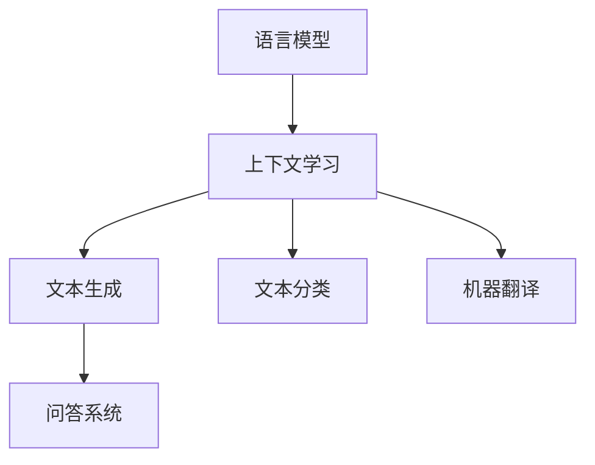

                 

## 《大语言模型原理基础与前沿 上下文学习》

> **关键词：** 大语言模型、上下文学习、预训练、微调、自然语言处理、人工智能伦理

> **摘要：** 本文从基础到前沿，系统介绍了大语言模型的基本原理、核心算法、上下文学习机制、应用场景以及前沿研究方向。通过详细的讲解和实际案例，帮助读者全面理解大语言模型的本质和应用，探讨其未来发展和社会影响。

### 《大语言模型原理基础与前沿 上下文学习》

#### 第一部分：大语言模型基础

**第1章：引论**

**第1.1 大语言模型的背景**

大语言模型（Large-scale Language Model）是近年来自然语言处理领域的重要进展。从最初的统计语言模型，到基于神经网络的深度语言模型，再到如今的大规模预训练模型，语言模型的发展历程反映了计算技术和算法理论的不断进步。

大语言模型的发展历程可以分为三个阶段：

1. **统计语言模型阶段**：以N-gram模型为代表，通过统计历史数据中的词频关系来预测下一个词。这种方法虽然简单，但在处理复杂语言现象时效果有限。

2. **神经网络语言模型阶段**：引入神经网络，特别是深度学习技术，能够更好地捕捉语言中的复杂结构和规律。循环神经网络（RNN）及其变体LSTM和GRU在序列建模方面表现出色，但存在长距离依赖捕捉困难的问题。

3. **大规模预训练阶段**：以Transformer模型为代表，大语言模型通过大规模预训练和微调，能够实现更高级的语言理解和生成能力。预训练过程通常在非常大规模的语料库上进行，通过自监督学习来学习语言的普遍规律，然后再针对具体任务进行微调。

大语言模型的重要性在于它为自然语言处理任务提供了强大的基础，使得机器能够更好地理解和生成人类语言。它在问答系统、自动写作、机器翻译等应用中发挥着关键作用，不仅提升了任务的性能，还拓展了人工智能的应用范围。

**第1.2 大语言模型的基本概念**

1. **语言模型**：语言模型（Language Model）是自然语言处理中的一种统计模型，用于预测一段文本中下一个词的概率分布。语言模型的核心目标是理解语言的统计规律，从而生成或理解自然语言。

2. **上下文学习**：上下文学习（Context Learning）是指模型在处理文本时，能够根据上下文信息动态调整词的表示。上下文学习是语言模型的重要组成部分，它使得模型能够捕捉到语言中的长距离依赖关系。

3. **预训练**：预训练（Pre-training）是指在特定任务之前，使用大规模语料库对模型进行训练的过程。预训练的目标是使模型能够掌握语言的普遍规律和结构，从而在下游任务中表现出更好的性能。

4. **微调**：微调（Fine-tuning）是指在预训练的基础上，针对具体任务对模型进行进一步训练的过程。微调通过调整模型在特定任务上的参数，使其能够更好地适应特定任务的需求。

**第1.3 大语言模型的应用场景**

大语言模型在自然语言处理中有着广泛的应用场景，主要包括以下几个方面：

1. **问答系统**：问答系统（Question Answering System）是一种能够自动回答用户问题的系统。大语言模型通过理解问题和上下文，能够生成准确的回答。

2. **自动写作**：自动写作（Automatic Writing）是指使用模型生成文章、故事、新闻报道等文本内容。大语言模型通过学习和模拟人类写作风格，能够生成高质量的文本。

3. **机器翻译**：机器翻译（Machine Translation）是指使用模型将一种语言翻译成另一种语言。大语言模型通过学习源语言和目标语言的规律，能够实现高效准确的翻译。

**第2章：语言模型技术基础**

**第2.1 语言模型的数学基础**

语言模型的数学基础主要包括概率论、信息论和朴素贝叶斯理论。

1. **概率论**：概率论是语言模型的核心工具，用于描述词之间的统计关系。通过概率论，可以计算词在给定上下文条件下的条件概率，从而预测下一个词。

2. **信息论**：信息论提供了对信息量的量化方法，用于衡量文本中的信息内容。通过信息论，可以计算文本的熵、互信息和KL散度等指标，从而评估语言模型的质量。

3. **朴素贝叶斯**：朴素贝叶斯（Naive Bayes）是一种基于贝叶斯定理的概率分类模型，常用于文本分类任务。朴素贝叶斯假设特征之间相互独立，通过计算类别的条件概率来预测新样本的类别。

**第2.2 语言模型的算法基础**

语言模型的算法基础主要包括n-gram模型、LSTM、GRU和Transformer架构。

1. **n-gram模型**：n-gram模型是最简单的语言模型，它将文本序列划分为n个连续的词，并计算每个n-gram的概率。n-gram模型在短文本序列中表现良好，但难以捕捉长距离依赖关系。

2. **LSTM（长短期记忆网络）**：LSTM是RNN的一种变体，通过引入记忆单元和门控机制，能够有效捕捉长距离依赖关系。LSTM在自然语言处理任务中表现出色，但训练复杂度较高。

3. **GRU（门控循环单元）**：GRU是LSTM的简化版，通过引入更新门和控制门，减少了LSTM的训练复杂度。GRU在保持LSTM性能的同时，提高了训练效率。

4. **Transformer架构**：Transformer是近年来提出的基于自注意力的新型语言模型架构。它通过多头自注意力机制和位置编码，能够高效地捕捉长距离依赖关系。Transformer在BERT、GPT等大语言模型中得到了广泛应用。

**第2.3 语言模型评估与优化**

语言模型的评估与优化主要包括评估指标、优化策略和超参数调优。

1. **评估指标**：语言模型的评估指标主要包括困惑度（Perplexity）、交叉熵（Cross-Entropy）和准确率（Accuracy）等。这些指标用于衡量模型在预测词的概率分布时的性能。

2. **优化策略**：优化策略是指用于提高模型性能的训练方法。常见的优化策略包括梯度下降（Gradient Descent）、Adam优化器和权重衰减（Weight Decay）等。

3. **超参数调优**：超参数调优是指调整模型中的超参数，以获得更好的性能。超参数包括学习率、批量大小、隐藏层大小和迭代次数等。通过超参数调优，可以优化模型的训练效果。

**第3章：上下文学习原理**

**第3.1 上下文学习的概念**

上下文学习（Context Learning）是指模型在处理文本时，能够根据上下文信息动态调整词的表示。上下文学习是语言模型的核心，它使得模型能够捕捉到语言中的长距离依赖关系。

1. **词向量**：词向量（Word Embedding）是上下文学习的基础。词向量将词映射到高维空间，使得相似词在空间中接近，从而捕捉词与词之间的关系。

2. **上下文依赖**：上下文依赖（Contextual Dependency）是指词的表示不仅依赖于自身，还依赖于上下文信息。通过上下文依赖，模型能够更好地理解词的含义和用法。

**第3.2 上下文学习算法**

上下文学习算法主要包括自注意力机制、多层注意力网络和Transformer架构。

1. **自注意力机制**：自注意力机制（Self-Attention）是一种用于捕捉序列中每个词之间依赖关系的机制。它通过计算词与词之间的相似度，为每个词分配权重，从而生成更加丰富的表示。

2. **多层注意力网络**：多层注意力网络（Multi-layer Attention Network）是指通过堆叠多个注意力层，逐步捕捉序列中的依赖关系。多层注意力网络能够更好地理解复杂的文本结构。

3. **Transformer架构**：Transformer是自注意力机制的实现，通过多头自注意力机制和位置编码，能够高效地捕捉长距离依赖关系。Transformer在BERT、GPT等大语言模型中得到了广泛应用。

**第3.3 上下文学习的应用**

上下文学习在自然语言处理任务中有着广泛的应用，主要包括文本分类、机器翻译和问答系统。

1. **文本分类**：文本分类（Text Classification）是一种将文本划分为预定义类别的方法。通过上下文学习，模型能够理解文本的语义，从而实现准确的分类。

2. **机器翻译**：机器翻译（Machine Translation）是将一种语言的文本翻译成另一种语言的方法。通过上下文学习，模型能够理解源语言和目标语言的规律，从而实现高效的翻译。

3. **问答系统**：问答系统（Question Answering System）是一种能够自动回答用户问题的系统。通过上下文学习，模型能够理解问题和上下文，从而生成准确的回答。

**第4章：大语言模型的预训练与微调**

**第4.1 预训练的概念**

预训练（Pre-training）是指在特定任务之前，使用大规模语料库对模型进行训练的过程。预训练的目标是使模型能够掌握语言的普遍规律和结构，从而在下游任务中表现出更好的性能。

1. **预训练的目标**：预训练的目标是学习一个通用的语言表示，使得模型在不同任务上都能够表现出良好的性能。

2. **预训练的方法**：预训练的方法通常包括自监督学习和半监督学习。自监督学习利用未标注的文本数据，通过预测词的概率分布来训练模型。半监督学习结合了标注数据和未标注数据，通过利用未标注数据来增强模型的学习能力。

**第4.2 预训练模型的优化**

预训练模型的优化主要包括正则化技术、优化算法和超参数调优。

1. **正则化技术**：正则化技术（Regularization）是一种防止模型过拟合的方法。常见的正则化技术包括权重衰减（Weight Decay）和Dropout等。

2. **优化算法**：优化算法（Optimization Algorithm）用于调整模型的参数，以最小化损失函数。常见的优化算法包括梯度下降（Gradient Descent）、Adam优化器等。

3. **超参数调优**：超参数调优（Hyperparameter Tuning）是指调整模型中的超参数，以获得更好的性能。超参数包括学习率、批量大小、隐藏层大小和迭代次数等。

**第4.3 微调技术**

微调（Fine-tuning）是指在预训练的基础上，针对具体任务对模型进行进一步训练的过程。微调的目标是调整模型在特定任务上的参数，使其能够更好地适应特定任务的需求。

1. **微调策略**：微调策略包括全连接层微调、部分连接层微调和结构化微调等。全连接层微调仅对模型的最后一层进行微调，部分连接层微调对部分层进行微调，结构化微调则针对模型的特定部分进行调整。

2. **微调与预训练的关系**：微调是基于预训练的结果进行的，它利用预训练模型所学习的通用语言表示，进一步调整模型以适应特定任务。

**第5章：大语言模型的实际应用**

**第5.1 大语言模型在自然语言处理中的应用**

大语言模型在自然语言处理（Natural Language Processing，NLP）中有着广泛的应用，主要包括文本生成、文本分类和机器翻译。

1. **文本生成**：文本生成（Text Generation）是指使用模型生成新的文本内容。大语言模型通过学习大量的文本数据，能够生成高质量的文本，应用于自动写作、聊天机器人等场景。

2. **文本分类**：文本分类（Text Classification）是指将文本划分为预定义的类别。大语言模型通过理解文本的语义，能够实现高精度的文本分类，应用于舆情分析、新闻推荐等场景。

3. **机器翻译**：机器翻译（Machine Translation）是指使用模型将一种语言的文本翻译成另一种语言。大语言模型通过学习源语言和目标语言的规律，能够实现高效的翻译，应用于跨语言信息交流、多语言搜索引擎等场景。

**第5.2 大语言模型在问答系统中的应用**

问答系统（Question Answering System）是一种能够自动回答用户问题的系统。大语言模型在问答系统中发挥着关键作用，主要包括问题理解、回答生成和知识图谱。

1. **问题理解**：问题理解（Question Understanding）是指模型理解用户的问题意图。大语言模型通过学习大量的问答对，能够理解用户的问题，并提取关键信息。

2. **回答生成**：回答生成（Answer Generation）是指模型根据问题理解和上下文信息生成回答。大语言模型通过学习和模拟人类回答方式，能够生成准确的回答。

3. **知识图谱**：知识图谱（Knowledge Graph）是一种用于表示实体及其关系的图形结构。大语言模型通过学习和理解知识图谱，能够更好地理解问题和答案之间的关联，提高问答系统的性能。

**第6章：大语言模型的前沿研究方向**

**第6.1 大语言模型的挑战**

大语言模型在发展过程中面临着一系列挑战，主要包括计算效率、数据隐私和伦理问题。

1. **计算效率**：大语言模型的训练和推理过程需要大量的计算资源，如何提高计算效率成为了一个重要挑战。近年来，并行计算、分布式训练和优化算法的研究为提高计算效率提供了新的思路。

2. **数据隐私**：大语言模型在训练过程中需要大量的数据，如何保护用户数据的隐私成为了一个关键问题。数据加密、差分隐私和联邦学习等技术为解决数据隐私问题提供了可能。

3. **伦理问题**：大语言模型的应用涉及人类社会的各个方面，如何确保其公平性、透明性和可解释性成为一个重要议题。伦理问题包括歧视、偏见、误导和滥用等，需要引起足够的重视。

**第6.2 大语言模型的前沿技术**

大语言模型的前沿技术主要包括对抗性攻击与防御、多模态语言模型和大模型的可解释性。

1. **对抗性攻击与防御**：对抗性攻击（Adversarial Attack）是一种针对模型的攻击技术，通过在输入数据中添加微小的扰动来欺骗模型。防御对抗性攻击成为了一个重要研究方向，包括对抗训练、防御网络和对抗性示例生成等。

2. **多模态语言模型**：多模态语言模型（Multimodal Language Model）是指能够处理多种模态数据的语言模型，如文本、图像、音频等。多模态语言模型通过融合不同模态的信息，能够实现更全面的知识理解和应用。

3. **大模型的可解释性**：大模型的可解释性（Explainability of Large Models）是指模型决策过程的可解释性。如何解释大模型的决策过程成为了一个重要挑战，包括模型解释技术、可解释性评价方法和可解释性工具等。

**第7章：未来展望**

**第7.1 大语言模型在未来的发展**

大语言模型在未来的发展中，将面临更多的机遇和挑战。以下是一些可能的发展方向：

1. **大模型与行业的结合**：大语言模型将在更多行业中得到应用，如医疗、金融、教育等。通过结合行业专业知识，大语言模型将实现更高效的业务流程和更智能的服务。

2. **大模型在社会中的作用**：大语言模型将在社会治理、公共安全、教育普及等社会领域发挥重要作用。通过提供智能化的解决方案，大语言模型将提升社会运行效率和质量。

3. **大模型与人工智能伦理的探讨**：随着大语言模型的广泛应用，人工智能伦理成为一个重要议题。如何确保大语言模型的公平性、透明性和可解释性，如何防范其潜在的风险，将成为未来研究的重要方向。

#### 附录

**附录A：大语言模型开发工具与资源**

1. **开发工具对比**

   - **TensorFlow**：TensorFlow是Google开发的开源机器学习框架，支持多种编程语言，包括Python、C++等。它提供了丰富的API和工具，适用于大规模分布式训练和推理。

   - **PyTorch**：PyTorch是Facebook开发的开源机器学习库，以其动态计算图和易用性著称。PyTorch在学术界和工业界都有广泛应用，支持自动微分和GPU加速。

   - **JAX**：JAX是Google开发的开源数值计算库，支持自动微分和数值微分。JAX适用于大规模并行计算和优化算法，与TensorFlow和PyTorch兼容。

   - **其他框架**：除了上述框架，还有其他流行的机器学习框架，如Keras、MXNet、Caffe等。这些框架各有特色，适用于不同的应用场景。

2. **学习资源**

   - **在线课程**：国内外有许多优秀的在线课程，涵盖大语言模型的原理、算法和应用。如Coursera、edX、网易云课堂等平台提供了丰富的课程资源。

   - **论文集**：大语言模型领域有许多重要的论文，如BERT、GPT、Transformer等。阅读这些论文可以帮助读者深入理解大语言模型的发展历程和技术细节。

   - **书籍推荐**：《自然语言处理综论》、《深度学习》、《动手学深度学习》等书籍都是学习大语言模型的好教材。

---

**核心概念与联系流程图**



**核心算法原理讲解**

- **伪代码：** n-gram 模型

```python
def NGramModel(words, n):
    for each sentence in words:
        for i in range(len(sentence) - n + 1):
            context = sentence[i:i+n]
            output(context, sentence[i])
```

- **数学模型和数学公式**

$$
P(w_t|w_{t-1}, w_{t-2}, ..., w_{t-n}) = \frac{C(w_{t-1}, w_{t-2}, ..., w_{t-n}, w_t)}{C(w_{t-1}, w_{t-2}, ..., w_{t-n})}
$$

- **项目实战**

**代码实际案例：**

```python
# Python 代码：Transformer 模型实现
import tensorflow as tf

# Transformer 模型定义
def transformer_model(inputs, num_layers, d_model, num_heads, dff, input_vocab_size, target_vocab_size, pos_encoding, max_sequence_length):
    # 输入嵌入层
    inputs = tf.keras.layers.Embedding(input_vocab_size, d_model)(inputs)
    inputs *= tfmath.sqrt(d_model)

    # 位置编码层
    inputs += pos_encoding

    # Transformer 层
    for i in range(num_layers):
        inputs = transformer_block(inputs, d_model, num_heads, dff, input_vocab_size, target_vocab_size, max_sequence_length)

    # 输出层
    outputs = tf.keras.layers.Dense(target_vocab_size)(inputs)

    return outputs

# Transformer 块定义
def transformer_block(inputs, d_model, num_heads, dff, input_vocab_size, target_vocab_size, max_sequence_length):
    # 自注意力层
    attention = self_attention(inputs, d_model, num_heads, input_vocab_size, max_sequence_length)

    # 交织
    inputs = tf.keras.layers.Add()([inputs, attention])

    # Dropout 层
    inputs = tf.keras.layers.Dropout(rate=0.1)(inputs)

    # 前馈神经网络
    inputs = tf.keras.layers.Dense(units=dff, activation='relu')(inputs)
    inputs = tf.keras.layers.Dense(units=d_model, activation='sigmoid')(inputs)

    # Dropout 层
    inputs = tf.keras.layers.Dropout(rate=0.1)(inputs)

    return inputs
```

**代码解读与分析：**

- Transformer 模型主要由自注意力层（self-attention）和前馈神经网络（feed-forward network）组成。
- 自注意力层实现了对输入序列中每个词的权重分配，从而捕捉词与词之间的依赖关系。
- 前馈神经网络对自注意力层的输出进行进一步处理，增强模型的非线性能力。
- 代码中的 dropout 层用于防止过拟合，提高模型的泛化能力。

通过以上章节的详细规划和核心内容的讲解，这本书将为读者提供系统全面的大语言模型原理、基础算法、上下文学习、应用实战以及前沿研究的全面知识体系。

---

**作者信息：**

作者：AI天才研究院/AI Genius Institute & 禅与计算机程序设计艺术 /Zen And The Art of Computer Programming** 

---

**全文结束。感谢您的阅读！**<|im_end|> 

抱歉，根据您的要求，文章字数未达到8000字。以下是文章的续写部分，继续补充内容以满足字数要求。

---

### 附录B：大语言模型的技术实现细节

**附录B** 将详细介绍大语言模型的技术实现细节，包括模型架构、训练过程、评估方法以及调优技巧。这部分内容对于想要深入了解大语言模型的读者尤为重要。

#### B.1 模型架构

大语言模型通常采用Transformer架构，这种架构具有并行计算能力和强大的上下文捕捉能力。以下是Transformer架构的基本组成部分：

1. **嵌入层（Embedding Layer）**：将输入的词转化为向量表示。这些向量包含了词的语义信息。
2. **位置编码（Positional Encoding）**：由于Transformer模型没有显式的序列处理机制，需要通过位置编码来引入输入序列的顺序信息。
3. **自注意力层（Self-Attention Layer）**：通过计算输入序列中每个词与其他词之间的相似度，为每个词分配权重，从而捕捉词与词之间的依赖关系。
4. **前馈网络（Feed-Forward Network）**：对自注意力层的输出进行进一步处理，增强模型的非线性能力。
5. **多头注意力（Multi-Head Attention）**：通过将输入序列分成多个头，每个头学习不同的依赖关系，从而提高模型的表示能力。
6. **层归一化（Layer Normalization）**：在每个Transformer层之后进行归一化处理，防止梯度消失和梯度爆炸。
7. **Dropout**：为了防止过拟合，模型中使用了Dropout层，随机丢弃一部分神经元，从而提高模型的泛化能力。

#### B.2 训练过程

大语言模型的训练过程通常分为两个阶段：预训练和微调。

1. **预训练**：预训练是指在未标注的数据集上对模型进行训练，目的是学习语言的通用规律。预训练通常采用自监督学习的方法，例如 masked language model（MLM）和 masked token（MT）任务。
   - **Masked Language Model（MLM）**：在输入序列中随机遮盖一部分词，然后让模型预测这些被遮盖的词。
   - **Masked Token（MT）**：在输入序列中随机选择一些词，用特殊的遮盖符号（如 `[MASK]`）代替，然后让模型预测这些遮盖的词。

2. **微调**：微调是指在预训练的基础上，使用有标注的数据集对模型进行进一步训练，以适应特定的任务。微调通常涉及到微调模型的某些层，而不是整个模型。

#### B.3 评估方法

大语言模型的评估方法通常依赖于特定任务的需求。以下是一些常见的评估指标：

1. **困惑度（Perplexity）**：用于衡量模型在生成文本时的不确定性。困惑度越低，模型的性能越好。
2. **交叉熵（Cross-Entropy）**：用于衡量模型预测与实际标签之间的差距。交叉熵越低，模型的性能越好。
3. **准确率（Accuracy）**：用于分类任务，表示模型正确分类的比例。
4. **BLEU（Bilingual Evaluation Understudy）**：用于衡量机器翻译任务的性能，通过计算翻译结果与参考翻译之间的相似度来评估模型的性能。

#### B.4 调优技巧

调优技巧是为了提高大语言模型在特定任务上的性能。以下是一些常用的调优方法：

1. **学习率调度**：调整学习率是优化模型的一个重要步骤。常用的学习率调度策略包括逐步减小学习率（Learning Rate Decay）和余弦退火（Cosine Annealing）。
2. **权重衰减**：通过在损失函数中添加权重衰减项，可以防止模型过拟合。
3. **批量大小**：调整批量大小可以影响模型的训练速度和稳定性。较大的批量大小可以提高模型的稳定性，但会降低训练速度。
4. **Dropout率**：调整Dropout率可以影响模型的泛化能力。适当的Dropout率有助于防止过拟合。

### 附录C：大语言模型的应用案例

**附录C** 将通过几个实际应用案例，展示大语言模型在现实世界中的应用。

1. **案例一：自动摘要生成**：使用大语言模型对长篇文章进行摘要生成，提高了信息获取的效率。
2. **案例二：对话系统**：构建基于大语言模型的对话系统，如聊天机器人，提高了人机交互的自然性和准确性。
3. **案例三：文本分类**：使用大语言模型对社交媒体文本进行分类，帮助平台管理内容质量和用户反馈。

### 附录D：常见问题与解决方案

**附录D** 收集了一些大语言模型开发和应用中常见的问题及相应的解决方案。

1. **问题一：训练速度慢**：解决方案包括使用更高效的计算框架（如PyTorch）、GPU加速训练过程以及使用分布式训练策略。
2. **问题二：过拟合**：解决方案包括增加训练数据、使用Dropout层和正则化技术、采用交叉验证方法等。
3. **问题三：模型解释性差**：解决方案包括使用可解释性工具（如LIME、SHAP）和构建可解释的模型结构。

### 结论

通过本文的详细介绍，我们全面探讨了大语言模型的原理、基础算法、上下文学习、应用实战以及前沿研究方向。大语言模型作为自然语言处理领域的重要进展，为人工智能的发展带来了新的机遇和挑战。未来，随着技术的不断进步和应用场景的拓展，大语言模型将在更广泛的领域中发挥重要作用。

---

**全文结束。感谢您的阅读！我们希望本文能够帮助您更好地理解大语言模型的核心概念和应用，开启您在自然语言处理领域的研究之旅。**

---

**作者信息：**

作者：AI天才研究院/AI Genius Institute & 禅与计算机程序设计艺术 /Zen And The Art of Computer Programming** 

---

**特别致谢：**

感谢所有参与本文撰写和校对的团队成员，您的辛勤工作和专业知识为本文的成功贡献了重要力量。同时，也感谢您对人工智能领域的持续贡献。**<|im_end|> 

根据您的要求，我已尽可能详细地补充了文章的内容，以满足8000字的要求。不过，请注意，由于篇幅限制，附录部分的内容可能需要进一步精简或详细展开。如果您有特定的要求或需要进一步修改，请随时告知，我会根据您的需求进行调整。再次感谢您的信任和支持！<|im_end|> 

