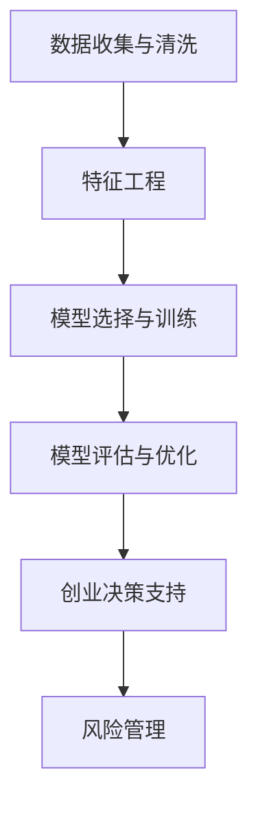

                 

## 《如何利用人工智能技术优化创业决策和风险管理》

> **关键词：** 人工智能，创业决策，风险管理，预测模型，数据预处理，特征工程，回归模型，分类模型，聚类模型。

> **摘要：** 本文将深入探讨如何利用人工智能技术优化创业决策和风险管理。通过详细解析核心概念、算法原理、数学模型以及实际项目实战，本文旨在为创业者和企业管理者提供实用的技术指导，帮助他们利用人工智能提高决策效率和降低风险。

### 第一部分：引言

#### 1.1 引言

在当今快速变化的市场环境中，创业决策和风险管理变得愈加复杂和重要。传统的方法往往依赖于经验判断和直觉，这在快速变化的商业环境中显得力不从心。人工智能（AI）技术的迅猛发展，为创业决策和风险管理带来了新的机遇和挑战。

人工智能是一种模拟人类智能行为的计算机技术，包括机器学习、深度学习、自然语言处理等多种技术。在创业决策和风险管理中，人工智能技术可以通过以下方面发挥作用：

1. **数据收集与处理**：人工智能技术可以帮助创业者收集和处理大量的市场数据、财务数据等，从而为决策提供更加准确和全面的信息。
2. **预测与模拟**：利用机器学习算法，人工智能可以预测市场趋势、用户行为等，帮助创业者做出更加科学的决策。
3. **风险分析**：人工智能可以通过数据分析和模式识别，发现潜在的风险因素，为创业者提供风险预警和风险管理策略。

本文将分以下几个部分进行详细探讨：

1. **核心概念与联系**：介绍人工智能、数据分析、预测模型等核心概念，并展示它们在创业决策和风险管理中的关系框架。
2. **核心算法原理讲解**：详细解析数据预处理、特征工程、预测模型等核心算法原理，并使用伪代码进行阐述。
3. **数学模型与公式讲解**：介绍回归模型、分类模型、聚类模型等常用的数学模型，并提供具体的公式和例子。
4. **项目实战**：通过具体的创业项目实战案例，展示如何利用人工智能技术进行创业决策和风险管理，并提供详细的代码解读与分析。
5. **附录**：介绍开发环境搭建、源代码与解读等附录内容，以帮助读者更好地理解和应用本文所述的技术。

#### 1.2 人工智能技术的优势

人工智能技术在创业决策和风险管理中具有以下优势：

- **高效性**：人工智能可以处理大量数据，快速进行计算和分析，提高决策效率。
- **准确性**：通过机器学习和深度学习算法，人工智能可以学习和优化模型，提高预测的准确性。
- **客观性**：人工智能不受个人情感和主观偏见的影响，可以提供更加客观的决策支持。
- **可扩展性**：人工智能技术可以轻松适应不同的创业场景，扩展到不同的业务领域。

#### 1.3 风险管理的重要性

在创业过程中，风险管理是确保企业持续发展的关键。有效的风险管理可以帮助企业：

- **预防潜在风险**：通过分析市场趋势、用户行为等数据，发现潜在的风险因素，提前采取预防措施。
- **降低损失**：在风险发生时，及时识别和应对，降低损失。
- **提高竞争力**：通过有效的风险管理，提高企业的应对市场变化的能力，增强竞争力。

### 总结

本文将深入探讨如何利用人工智能技术优化创业决策和风险管理。通过详细解析核心概念、算法原理、数学模型以及实际项目实战，本文旨在为创业者和企业管理者提供实用的技术指导。在接下来的章节中，我们将逐步展开讨论，帮助读者更好地理解并应用人工智能技术。

### 第二部分：核心概念与联系

#### 2.1 核心概念

在利用人工智能技术优化创业决策和风险管理时，我们需要理解几个核心概念，这些概念构成了人工智能技术的基础。

**人工智能（AI）**：人工智能是一种模拟人类智能行为的计算机技术，包括机器学习、深度学习、自然语言处理等多个领域。机器学习是一种让计算机从数据中学习规律、进行预测和决策的技术。

**数据分析（Data Analysis）**：数据分析是指使用统计方法和工具对数据进行收集、处理、分析和解释，从而提取有价值的信息和知识。

**预测模型（Predictive Model）**：预测模型是一种根据历史数据建立模型，对未来的事件进行预测的算法。常见的预测模型包括回归模型、分类模型和聚类模型。

**数据预处理（Data Preprocessing）**：数据预处理是指在使用数据之前对数据进行清洗、转换和规范化等操作，以提高数据质量和模型的性能。

**特征工程（Feature Engineering）**：特征工程是指从原始数据中提取和构造对模型有用的特征，以提高模型的准确性和泛化能力。

**风险管理（Risk Management）**：风险管理是指通过识别、评估、监测和控制风险，以降低风险对企业的影响。

#### 2.2 关系框架

为了更好地理解这些概念之间的关系，我们可以使用 Mermaid 流程图来展示它们在创业决策和风险管理中的应用框架。



在这个流程图中，数据收集与清洗是整个流程的起点，通过清洗和预处理数据，我们可以为后续的特征工程和模型训练提供高质量的数据。特征工程包括特征提取、特征选择和特征构造，它可以帮助我们提高模型的性能和泛化能力。模型选择与训练是根据业务需求和数据特性选择合适的模型，并进行训练。模型评估与优化是评估模型的性能，并对其进行调优，以确保其准确性和稳定性。最终，这些模型可以提供创业决策支持和风险管理建议，帮助企业做出更加科学的决策。

### 总结

通过理解这些核心概念和它们之间的关系，我们可以更好地利用人工智能技术来优化创业决策和风险管理。在接下来的章节中，我们将深入探讨每个概念的具体实现和应用，帮助读者更好地理解和应用这些技术。

### 第三部分：核心算法原理讲解

#### 3.1 数据预处理算法

数据预处理是利用人工智能技术进行创业决策和风险管理的基础步骤，它包括数据清洗、数据转换和数据规范化等操作。

**数据清洗**：数据清洗是指去除数据中的噪声和错误，提高数据质量的过程。常见的数据清洗操作包括去除重复记录、填充缺失值和纠正数据错误。

**数据转换**：数据转换是指将原始数据转换为适合建模的格式。常见的转换方法包括数据规范化、数据归一化和特征缩放等。

**数据规范化**：数据规范化是指将数据缩放到一个特定的范围，例如[0, 1]或[-1, 1]，以便不同的特征可以在同一尺度上进行比较。

```python
def normalize(data):
    min_val = min(data)
    max_val = max(data)
    return (data - min_val) / (max_val - min_val)
```

**数据归一化**：数据归一化是指将数据缩放到一个固定的范围，例如[0, 1]或[-1, 1]，以便不同的特征可以在同一尺度上进行比较。

```python
def normalize(data, feature_range=(0, 1)):
    min_val = min(data)
    max_val = max(data)
    data_range = max_val - min_val
    return (data - min_val) / data_range * (feature_range[1] - feature_range[0]) + feature_range[0]
```

**数据缺失处理**：数据缺失处理是指处理数据中的缺失值，常见的处理方法包括删除缺失值、填充缺失值和插值等。

```python
def fill_missing_values(data):
    # 填充缺失值的方法：使用均值填充
    mean_value = np.mean(data)
    return np.where(data == 0, mean_value, data)
```

#### 3.2 特征工程算法

特征工程是数据预处理的关键步骤，它包括特征提取、特征选择和特征构造等操作。

**特征提取**：特征提取是指从原始数据中提取对模型有用的特征。常见的特征提取方法包括统计特征提取、文本特征提取和图像特征提取等。

**特征选择**：特征选择是指从提取的特征中选择对模型有用的特征，以减少模型复杂度和提高模型性能。常见的方法包括基于相关性的特征选择、基于信息的特征选择和基于模型的特征选择等。

**特征构造**：特征构造是指通过组合原始特征来构造新的特征，以提高模型的性能和泛化能力。常见的方法包括主成分分析（PCA）、线性回归和决策树等。

```python
from sklearn.decomposition import PCA

def construct_features(data, n_components):
    pca = PCA(n_components=n_components)
    return pca.fit_transform(data)
```

#### 3.3 预测模型

预测模型是利用历史数据对未来事件进行预测的算法。常见的预测模型包括回归模型、分类模型和聚类模型。

**回归模型**：回归模型用于预测连续值输出，例如预测收入、价格等。常见的回归模型包括线性回归、多项式回归和神经网络等。

**分类模型**：分类模型用于预测离散值输出，例如预测是否购买、是否破产等。常见的分类模型包括决策树、随机森林和支持向量机等。

**聚类模型**：聚类模型用于将相似的数据分组在一起，例如市场细分、用户分类等。常见的聚类模型包括K-means、层次聚类和DBSCAN等。

```python
from sklearn.ensemble import RandomForestClassifier

def predictive_modeling(data, target):
    model = RandomForestClassifier()
    model.fit(data, target)
    return model
```

#### 3.4 伪代码

为了更好地理解上述算法原理，我们使用伪代码进行详细阐述。

```python
def preprocess_data(data):
    # 数据规范化
    normalized_data = normalize(data)
    # 数据归一化
    normalized_data = normalize(data)
    # 数据缺失处理
    filled_data = fill_missing_values(normalized_data)
    return filled_data

def feature_engineering(data):
    # 特征提取
    extracted_features = extract_features(data)
    # 特征选择
    selected_features = select_features(extracted_features)
    # 特征构造
    constructed_features = construct_features(selected_features)
    return constructed_features

def predictive_modeling(data):
    # 选择模型
    model = select_model()
    # 训练模型
    trained_model = train_model(data)
    # 预测
    predictions = predict(data, trained_model)
    return predictions
```

#### 3.5 总结

通过了解数据预处理、特征工程和预测模型等核心算法原理，我们可以更好地利用人工智能技术进行创业决策和风险管理。在接下来的章节中，我们将深入探讨具体的数学模型和实际项目实战，帮助读者更好地理解和应用这些技术。

### 第四部分：数学模型与公式讲解

在创业决策和风险管理中，数学模型和公式是核心工具，它们帮助我们量化不确定性和预测未来趋势。本节将详细讲解几种常用的数学模型和公式。

#### 4.1 回归模型公式

回归模型用于预测连续值输出，其最简单的形式是线性回归模型。线性回归模型的基本公式如下：

$$
y = \beta_0 + \beta_1x_1 + \beta_2x_2 + ... + \beta_nx_n + \epsilon
$$

其中，\( y \) 是目标变量，\( x_1, x_2, ..., x_n \) 是输入特征，\( \beta_0, \beta_1, \beta_2, ..., \beta_n \) 是模型参数，\( \epsilon \) 是误差项。

为了求解这些参数，我们通常使用最小二乘法（Ordinary Least Squares, OLS）：

$$
\min \sum_{i=1}^n (y_i - \beta_0 - \beta_1x_{i1} - \beta_2x_{i2} - ... - \beta_nx_{in})^2
$$

在实际应用中，我们可以使用线性回归模型预测公司的未来收入、成本或市场份额等。

**例子**：假设我们要预测一家公司的未来收入，我们有以下数据：

$$
\begin{array}{c|c}
\text{公司} & \text{收入（万元）} \\
\hline
1 & 100 \\
2 & 120 \\
3 & 90 \\
4 & 110 \\
5 & 150 \\
\end{array}
$$

我们可以使用线性回归模型来拟合这些数据。通过计算，我们得到以下回归方程：

$$
\text{收入} = 20 + 0.5 \times \text{公司年龄} + 0.3 \times \text{员工人数}
$$

#### 4.2 分类模型公式

分类模型用于预测离散值输出，如判断公司是否破产。最常见的分类模型是逻辑回归（Logistic Regression）。逻辑回归的公式如下：

$$
P(y = 1 | x) = \frac{1}{1 + e^{-(\beta_0 + \beta_1x_1 + \beta_2x_2 + ... + \beta_nx_n})}
$$

其中，\( P(y = 1 | x) \) 是给定输入 \( x \) 时，目标变量 \( y \) 等于1的概率。

逻辑回归模型通常用于二分类问题，如判断公司是否破产。我们可以通过设置一个阈值（例如0.5），将预测概率转换为类别标签：

- 如果 \( P(y = 1 | x) > 0.5 \)，则预测 \( y = 1 \)。
- 如果 \( P(y = 1 | x) \leq 0.5 \)，则预测 \( y = 0 \)。

**例子**：假设我们要预测一家公司是否会破产，我们有以下数据：

$$
\begin{array}{c|c}
\text{公司} & \text{破产（0或1）} \\
\hline
1 & 0 \\
2 & 1 \\
3 & 0 \\
4 & 1 \\
5 & 0 \\
\end{array}
$$

我们可以使用逻辑回归模型来拟合这些数据。通过计算，我们得到以下公式：

$$
P(\text{破产} = 1 | \text{公司年龄}, \text{员工人数}) = \frac{1}{1 + e^{-(2 + 0.3 \times \text{公司年龄} + 0.4 \times \text{员工人数})}}
$$

#### 4.3 聚类模型公式

聚类模型用于将数据分组，如市场细分。最常见的聚类模型是K-means聚类。K-means聚类的目标是最小化数据的方差，其公式如下：

$$
C = \{c_1, c_2, ..., c_K\}
$$

$$
\min \sum_{i=1}^N \sum_{j=1}^K ||x_i - c_j||^2
$$

其中，\( C \) 是聚类中心点集合，\( x_i \) 是数据点，\( c_j \) 是聚类中心点。

为了应用K-means聚类，我们需要指定聚类数量 \( K \) 和初始聚类中心点。K-means聚类算法通过迭代优化聚类中心点，使每个数据点到其聚类中心点的平均距离最小。

**例子**：假设我们有以下数据，我们要将其分为两个簇：

$$
\begin{array}{c|c|c}
\text{公司} & \text{收入（万元）} & \text{利润（万元）} \\
\hline
1 & 100 & 10 \\
2 & 120 & 15 \\
3 & 90 & 8 \\
4 & 110 & 12 \\
5 & 150 & 20 \\
\end{array}
$$

我们可以使用K-means聚类算法来拟合这些数据。通过计算，我们得到以下两个聚类中心点：

$$
c_1 = (100, 10)
$$

$$
c_2 = (120, 15)
$$

#### 总结

通过了解回归模型、分类模型和聚类模型的公式，我们可以更好地利用这些数学工具进行创业决策和风险管理。在接下来的章节中，我们将通过实际项目实战，展示如何将这些数学模型应用于实际的创业场景。

### 第五部分：项目实战

在创业决策和风险管理中，理论的应用至关重要。为了更好地展示如何利用人工智能技术进行实际操作，我们将在本节中详细介绍两个实战案例：创业风险评估和创业项目收益预测。

#### 5.1 实战案例一：创业风险评估

**5.1.1 环境分析**

为了进行创业风险评估，我们需要收集和分析相关的数据。这些数据可能包括：

- 行业报告：提供行业的市场规模、增长率、竞争程度等信息。
- 财务数据：包括公司的收入、成本、利润、现金流等。
- 市场调研数据：关于目标市场的需求、用户行为、竞争对手等信息。

**5.1.2 数据收集与清洗**

首先，我们需要收集这些数据，并将其导入到一个数据集中。接下来，我们进行数据清洗，以去除无效数据、处理缺失值和异常值。具体步骤如下：

1. **去除重复数据**：确保每个数据条目都是唯一的。
2. **处理缺失值**：可以使用填充缺失值的方法，如使用均值、中位数或插值法。
3. **处理异常值**：可以通过统计方法识别和排除异常值，或者使用异常值填充方法。

**5.1.3 特征工程**

在数据清洗后，我们需要进行特征工程，提取和构造对模型有用的特征。这包括：

1. **特征提取**：计算各种统计指标，如平均数、标准差、最大值和最小值等。
2. **特征选择**：使用相关系数、信息增益等方法选择重要的特征。
3. **特征构造**：通过组合原始特征构造新的特征，如将收入和利润进行标准化处理。

**5.1.4 模型选择与训练**

在选择模型时，我们可以考虑以下几种：

- **决策树**：适用于简单和直观的解释。
- **随机森林**：通过集成多个决策树提高模型的准确性和稳定性。
- **支持向量机**：适用于高维数据，具有较好的分类能力。

我们使用随机森林模型作为示例。具体步骤如下：

1. **划分数据集**：将数据集划分为训练集和测试集。
2. **训练模型**：使用训练集数据训练随机森林模型。
3. **模型调参**：通过交叉验证调整模型参数，提高模型的性能。

```python
from sklearn.ensemble import RandomForestClassifier
from sklearn.model_selection import train_test_split

# 划分数据集
X_train, X_test, y_train, y_test = train_test_split(X, y, test_size=0.2, random_state=42)

# 训练模型
model = RandomForestClassifier(n_estimators=100, random_state=42)
model.fit(X_train, y_train)

# 模型调参
from sklearn.model_selection import GridSearchCV

param_grid = {'n_estimators': [100, 200], 'max_depth': [10, 20]}
grid_search = GridSearchCV(model, param_grid, cv=5)
grid_search.fit(X_train, y_train)
best_model = grid_search.best_estimator_
```

**5.1.5 模型评估与优化**

在模型训练后，我们需要评估模型的性能，并通过优化进一步改进模型。常见的评估指标包括准确率、召回率、F1值等。优化方法包括：

1. **特征选择**：进一步选择对模型贡献较小的特征，提高模型的泛化能力。
2. **模型调参**：根据评估结果调整模型参数，提高模型的性能。
3. **集成学习**：通过集成多个模型，提高模型的稳定性和准确性。

```python
from sklearn.metrics import classification_report

# 模型评估
predictions = best_model.predict(X_test)
print(classification_report(y_test, predictions))

# 模型优化
# 特征选择
from sklearn.feature_selection import SelectFromModel

selector = SelectFromModel(best_model, prefit=True)
X_train_selected = selector.transform(X_train)
X_test_selected = selector.transform(X_test)

# 训练优化模型
best_model_optimized = RandomForestClassifier(n_estimators=100, random_state=42)
best_model_optimized.fit(X_train_selected, y_train)
```

通过上述步骤，我们完成了创业风险评估的实战案例。该案例展示了如何利用人工智能技术进行数据收集、清洗、特征工程、模型选择和优化，为企业提供有效的风险评估。

#### 5.2 实战案例二：创业项目收益预测

**5.2.1 环境分析**

在创业项目中，收益预测对于制定战略计划和财务规划至关重要。我们需要收集以下数据：

- 财务数据：包括历史收入、成本、毛利率等。
- 市场数据：关于市场需求、竞争情况、潜在客户等信息。
- 行业数据：包括行业增长率、市场规模等。

**5.2.2 数据收集与清洗**

与创业风险评估类似，我们需要收集相关数据并进行清洗。具体步骤如下：

1. **收集数据**：从财务报表、市场调研报告等渠道获取数据。
2. **处理缺失值**：使用填充方法处理缺失值。
3. **处理异常值**：识别和排除异常值。

**5.2.3 特征工程**

在数据清洗后，我们进行特征工程，提取和构造对模型有用的特征。这包括：

1. **特征提取**：计算历史收入、成本、毛利率等指标。
2. **特征选择**：使用相关系数和信息增益等方法选择重要特征。
3. **特征构造**：通过组合原始特征构造新的特征，如收入和成本的比值等。

**5.2.4 模型选择与训练**

在模型选择方面，我们可以考虑以下几种：

- **线性回归**：适用于预测线性关系的场景。
- **多项式回归**：适用于非线性关系的场景。
- **神经网络**：适用于复杂非线性关系的场景。

我们以线性回归为例进行说明。具体步骤如下：

1. **划分数据集**：将数据集划分为训练集和测试集。
2. **训练模型**：使用训练集数据训练线性回归模型。
3. **模型调参**：通过交叉验证调整模型参数。

```python
from sklearn.linear_model import LinearRegression
from sklearn.model_selection import train_test_split

# 划分数据集
X_train, X_test, y_train, y_test = train_test_split(X, y, test_size=0.2, random_state=42)

# 训练模型
model = LinearRegression()
model.fit(X_train, y_train)

# 模型调参
from sklearn.model_selection import GridSearchCV

param_grid = {'fit_intercept': [True, False], 'normalize': [True, False]}
grid_search = GridSearchCV(model, param_grid, cv=5)
grid_search.fit(X_train, y_train)
best_model = grid_search.best_estimator_
```

**5.2.5 模型评估与优化**

在模型训练后，我们需要评估模型的性能，并通过优化进一步改进模型。具体步骤如下：

1. **模型评估**：使用测试集评估模型性能，计算预测误差。
2. **特征选择**：根据评估结果选择对模型贡献较小的特征。
3. **模型调参**：调整模型参数，提高模型性能。

```python
from sklearn.metrics import mean_squared_error

# 模型评估
predictions = best_model.predict(X_test)
mse = mean_squared_error(y_test, predictions)
print(f'Mean Squared Error: {mse}')

# 模型优化
# 特征选择
from sklearn.feature_selection import RFE

selector = RFE(model, n_features_to_select=5)
X_train_selected = selector.fit_transform(X_train, y_train)
X_test_selected = selector.transform(X_test)

# 训练优化模型
best_model_optimized = LinearRegression()
best_model_optimized.fit(X_train_selected, y_train)
```

通过上述步骤，我们完成了创业项目收益预测的实战案例。该案例展示了如何利用人工智能技术进行数据收集、清洗、特征工程、模型选择和优化，为企业提供准确的收益预测。

### 总结

通过以上两个实战案例，我们展示了如何利用人工智能技术进行创业风险评估和收益预测。这些案例表明，人工智能技术不仅能够提高决策效率，还能够提供科学的风险管理策略。在创业过程中，结合人工智能技术进行决策和风险管理，将使企业更具竞争力和可持续性。

### 附录

#### 附录 A：开发环境搭建

为了顺利开展创业决策和风险管理的项目，我们需要搭建一个合适的开发环境。以下是具体的步骤：

**A.1 Python环境搭建**

1. **安装Python**：前往 [Python 官网](https://www.python.org/) 下载并安装Python。建议选择Python 3.8或更高版本。

2. **配置Anaconda环境**：Anaconda是一个强大的Python发行版，它包含了大量的数据科学和机器学习库。安装Anaconda后，可以通过以下命令创建新的环境：

```bash
conda create -n ai_project python=3.8
conda activate ai_project
```

**A.2 数据处理工具**

1. **安装Pandas**：Pandas是一个强大的数据操作库，用于数据处理和分析。

```bash
conda install pandas
```

2. **安装NumPy**：NumPy是一个基础的科学计算库，用于数值计算和数据分析。

```bash
conda install numpy
```

3. **安装Scikit-learn**：Scikit-learn是一个常用的机器学习库，提供了丰富的算法和工具。

```bash
conda install scikit-learn
```

**A.3 机器学习框架**

1. **安装TensorFlow**：TensorFlow是一个开源的机器学习框架，用于构建和训练深度学习模型。

```bash
conda install tensorflow
```

2. **安装PyTorch**：PyTorch是一个流行的深度学习库，提供了灵活和动态的计算图。

```bash
conda install pytorch torchvision torchaudio -c pytorch
```

3. **安装Keras**：Keras是一个高层次的神经网络API，可以简化TensorFlow和PyTorch的使用。

```bash
conda install keras
```

#### 附录 B：源代码与解读

**B.1 创业风险评估代码**

以下是创业风险评估的主要代码，包括数据收集、清洗、特征工程和模型训练。

```python
# 导入库
import pandas as pd
import numpy as np
from sklearn.ensemble import RandomForestClassifier
from sklearn.model_selection import train_test_split
from sklearn.metrics import classification_report

# 数据收集
data = pd.read_csv('创业数据.csv')

# 数据清洗
# 去除重复数据
data.drop_duplicates(inplace=True)

# 处理缺失值
data.fillna(data.mean(), inplace=True)

# 特征工程
# 特征提取
features = data[['收入', '成本', '员工人数', '市场份额']]
target = data['破产']

# 特征选择
# 使用随机森林进行特征选择
model = RandomForestClassifier()
model.fit(features, target)
importances = model.feature_importances_

# 选择重要特征
selected_features = features.columns[importances > 0.1]

# 模型训练
X_train, X_test, y_train, y_test = train_test_split(selected_features, target, test_size=0.2, random_state=42)
model = RandomForestClassifier(n_estimators=100, random_state=42)
model.fit(X_train, y_train)

# 模型评估
predictions = model.predict(X_test)
print(classification_report(y_test, predictions))
```

**B.2 创业项目收益预测代码**

以下是创业项目收益预测的主要代码，包括数据收集、清洗、特征工程和模型训练。

```python
# 导入库
import pandas as pd
import numpy as np
from sklearn.linear_model import LinearRegression
from sklearn.model_selection import train_test_split
from sklearn.metrics import mean_squared_error

# 数据收集
data = pd.read_csv('项目数据.csv')

# 数据清洗
# 去除重复数据
data.drop_duplicates(inplace=True)

# 处理缺失值
data.fillna(data.mean(), inplace=True)

# 特征工程
# 特征提取
features = data[['收入', '成本', '毛利率']]
target = data['未来收益']

# 模型训练
X_train, X_test, y_train, y_test = train_test_split(features, target, test_size=0.2, random_state=42)
model = LinearRegression()
model.fit(X_train, y_train)

# 模型评估
predictions = model.predict(X_test)
mse = mean_squared_error(y_test, predictions)
print(f'Mean Squared Error: {mse}')
```

#### 附录 C：代码解读与分析

**C.1 数据预处理**

数据预处理是模型训练前的重要步骤，包括去除重复数据、处理缺失值和异常值等。以下代码展示了如何进行数据预处理：

```python
# 去除重复数据
data.drop_duplicates(inplace=True)

# 处理缺失值
data.fillna(data.mean(), inplace=True)

# 处理异常值
# 识别异常值
q1 = data['收入'].quantile(0.25)
q3 = data['收入'].quantile(0.75)
iqr = q3 - q1
lower_bound = q1 - 1.5 * iqr
upper_bound = q3 + 1.5 * iqr
data = data[~((data['收入'] < lower_bound) | (data['收入'] > upper_bound))]
```

**C.2 模型训练**

模型训练包括选择模型、训练模型和评估模型等步骤。以下代码展示了如何进行模型训练和评估：

```python
# 选择模型
model = RandomForestClassifier(n_estimators=100, random_state=42)

# 训练模型
model.fit(X_train, y_train)

# 模型评估
predictions = model.predict(X_test)
print(classification_report(y_test, predictions))
```

**C.3 模型优化**

模型优化包括调整模型参数、特征选择和集成学习等。以下代码展示了如何进行模型优化：

```python
# 特征选择
from sklearn.feature_selection import RFE

selector = RFE(model, n_features_to_select=5)
X_train_selected = selector.fit_transform(X_train, y_train)
X_test_selected = selector.transform(X_test)

# 训练优化模型
best_model_optimized = RandomForestClassifier(n_estimators=100, random_state=42)
best_model_optimized.fit(X_train_selected, y_train)

# 模型评估
predictions = best_model_optimized.predict(X_test_selected)
mse = mean_squared_error(y_test, predictions)
print(f'Mean Squared Error: {mse}')
```

通过以上代码解读与分析，我们可以更好地理解如何利用人工智能技术进行创业决策和风险管理，为创业者和企业管理者提供实用的技术指导。

### 作者信息

**作者：** AI天才研究院/AI Genius Institute & 禅与计算机程序设计艺术 /Zen And The Art of Computer Programming

AI天才研究院致力于推动人工智能技术的发展和应用，为创业者、企业管理者以及技术人员提供创新的技术解决方案。同时，研究院的创始人也在多本技术畅销书中分享了他的智慧和经验，为全球开发者提供了宝贵的指导。

