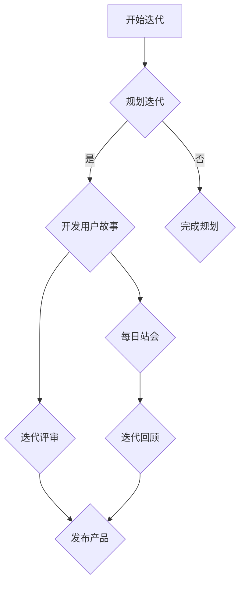
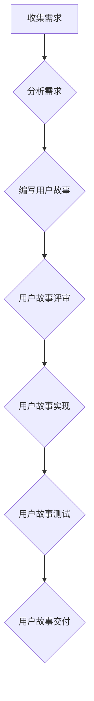
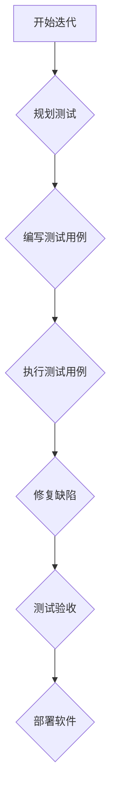

                 

# 如何打造敏捷的产品迭代流程

> 关键词：敏捷迭代、产品开发、用户体验、迭代流程、团队协作、质量保障

> 摘要：本文将深入探讨如何打造敏捷的产品迭代流程，包括敏捷方法论的起源与核心思想、敏捷产品迭代的核心概念和实践策略、敏捷迭代中的质量保障、敏捷迭代中的项目管理、敏捷迭代的组织文化，以及敏捷迭代的实战案例。通过本文的阅读，读者将能够了解敏捷产品迭代的全过程，掌握敏捷迭代的最佳实践，并在实际项目中成功应用。

## 目录大纲

### 第一部分：敏捷产品迭代概述

#### 第1章：敏捷方法论与产品迭代

##### 1.1 敏捷方法的起源与核心思想
##### 1.2 敏捷产品迭代的关键要素
##### 1.3 敏捷迭代与传统迭代的对比

#### 第2章：敏捷产品迭代的核心概念

##### 2.1 用户故事与需求管理
##### 2.2 敏捷迭代中的角色与职责
##### 2.3 敏捷开发中的关键活动

### 第二部分：敏捷产品迭代的实践策略

#### 第3章：敏捷需求分析与规划

##### 3.1 用户需求调研与需求收集
##### 3.2 用户故事编写技巧
##### 3.3 敏捷规划与排期策略

#### 第4章：敏捷迭代流程设计

##### 4.1 敏捷迭代周期与迭代计划
##### 4.2 敏捷团队协作与沟通
##### 4.3 敏捷迭代中的风险管理

#### 第5章：敏捷迭代中的质量保障

##### 5.1 敏捷测试策略与方法
##### 5.2 持续集成与持续部署
##### 5.3 质量保障的最佳实践

#### 第6章：敏捷迭代中的项目管理

##### 6.1 敏捷项目管理工具与技巧
##### 6.2 敏捷项目的进度与风险监控
##### 6.3 敏捷项目的评估与改进

#### 第7章：敏捷迭代的组织文化

##### 7.1 敏捷组织的建立与运营
##### 7.2 敏捷文化培养与实践
##### 7.3 敏捷转型中的挑战与应对策略

### 第三部分：敏捷迭代实战案例

#### 第8章：敏捷迭代实战案例解析

##### 8.1 案例一：在线教育平台的敏捷迭代实践
##### 8.2 案例二：电子商务平台的敏捷迭代实践
##### 8.3 案例三：金融科技产品的敏捷迭代实践

#### 第9章：敏捷迭代的总结与展望

##### 9.1 敏捷迭代的成功因素
##### 9.2 敏捷迭代的发展趋势
##### 9.3 敏捷迭代在我国的应用与展望

### 附录：敏捷迭代相关资源与工具推荐

#### 附录 A：敏捷迭代工具推荐
#### 附录 B：敏捷迭代相关书籍与资料推荐
#### 附录 C：敏捷迭代实践指南
#### 附录 D：敏捷迭代流程Mermaid图示
#### 附录 E：敏捷迭代中的核心算法原理讲解
#### 附录 F：敏捷迭代中的数学模型和公式
#### 附录 G：敏捷迭代实战代码案例

## 第一部分：敏捷产品迭代概述

### 第1章：敏捷方法论与产品迭代

#### 1.1 敏捷方法的起源与核心思想

敏捷方法论起源于20世纪90年代末，其核心思想是通过快速迭代、持续交付和紧密协作，以适应不断变化的市场需求。与传统的水坊式开发方法相比，敏捷方法论更加注重用户体验、团队合作和灵活应对。

敏捷方法论的起源可以追溯到1999年，当时一群软件开发领域的专家在盐湖城召开了敏捷开发宣言会议，并签署了《敏捷开发宣言》（Manifesto for Agile Software Development）。该宣言明确提出了四项价值观：

1. 个体和互动重于过程和工具
2. 可工作的软件重于详尽的文档
3. 客户合作重于合同谈判
4. 响应变化重于遵循计划

这些价值观成为了敏捷方法论的基础，指导着软件开发团队在项目中采取一系列具体的实践。

#### 1.2 敏捷产品迭代的关键要素

敏捷产品迭代的关键要素包括用户故事、迭代计划、每日站会、迭代评审和迭代回顾。这些要素相互关联，构成了敏捷开发的核心流程。

1. **用户故事**：用户故事是敏捷开发中的最小可交付单元，用于描述一个具体的功能或需求，通常由三个部分组成：用户角色、用户目标和场景。用户故事通常以“作为某个角色，我希望能够完成某个目标，以便达成某个价值”的形式表达。

2. **迭代计划**：迭代计划是在迭代开始时进行的，用于确定本次迭代要完成的目标和任务。迭代计划通常包括迭代时间、迭代目标、任务分配和资源规划。

3. **每日站会**：每日站会是敏捷团队每天召开的短暂会议，用于沟通进展、解决问题和调整计划。每日站会的典型流程包括三个问题：昨天完成了什么？今天计划完成什么？遇到什么问题？

4. **迭代评审**：迭代评审是在迭代结束时进行的，用于展示迭代成果、收集反馈和确定下一步计划。迭代评审通常包括演示会、评审会议和评审报告。

5. **迭代回顾**：迭代回顾是在迭代结束时进行的，用于总结迭代经验、识别改进机会和制定改进计划。迭代回顾通常包括反思会议、改进计划制定和回顾报告。

#### 1.3 敏捷迭代与传统迭代的对比

敏捷迭代与传统迭代在许多方面存在显著差异：

1. **时间周期**：传统迭代通常以月或季度为单位，而敏捷迭代则以周或双周为单位，使得团队能够更快地响应变化。

2. **任务分解**：传统迭代通常将任务分解为较小的部分，但通常不够细致，而敏捷迭代则使用用户故事来进一步细化任务，并确保每个用户故事都是可测试和可交付的。

3. **需求管理**：传统迭代通常在项目开始时定义所有需求，并在此基础上进行开发，而敏捷迭代则更加注重持续的需求收集和调整，以适应市场变化。

4. **沟通与协作**：传统迭代往往缺乏有效的沟通与协作，而敏捷迭代则强调团队成员之间的紧密协作和透明沟通。

5. **质量保障**：传统迭代通常在项目结束时进行质量检验，而敏捷迭代则通过持续集成和持续部署来确保质量。

总的来说，敏捷迭代相较于传统迭代，更加灵活、快速和以用户为中心，使得团队能够更好地适应市场变化并提高软件质量。

### 第2章：敏捷产品迭代的核心概念

#### 2.1 用户故事与需求管理

用户故事是敏捷开发中的核心概念之一，它是一种简短、简单、具体的需求描述方式，通常由三个部分组成：用户角色、用户目标和场景。用户故事的形式如下：

- **用户角色**：例如，“作为一名用户”，或者“作为一个销售代表”。
- **用户目标**：例如，“我希望能够查看我的订单历史”，或者“我希望能够添加新产品到购物车”。
- **场景**：描述用户如何与产品交互以实现目标，例如，“当我登录到网站时，我点击‘订单历史’，然后看到我的过去订单”。

用户故事具有以下几个特点：

1. **可测试性**：用户故事必须能够通过测试来验证其是否实现。
2. **可交付性**：用户故事必须在迭代周期内完成，以确保及时交付给用户。
3. **简洁性**：用户故事应该尽可能简单和清晰，避免过多的细节。

在敏捷开发中，需求管理是一个持续的过程。团队需要在每次迭代开始时收集新的需求，并根据优先级对需求进行排序。这些需求可能来自用户反馈、市场变化或产品愿景。需求管理的关键在于确保团队能够快速响应变化，并始终将用户需求放在首位。

#### 2.2 敏捷迭代中的角色与职责

在敏捷开发中，团队成员的角色和职责通常比较清晰，这有助于提高团队的协作效率和透明度。以下是敏捷迭代中常见的角色及其职责：

1. **产品负责人（Product Owner）**：
   - 负责定义产品愿景和目标，确保产品方向与业务需求一致。
   - 创建和更新需求列表，并根据优先级排序。
   - 与用户和利益相关者沟通，收集反馈和需求。
   - 参与迭代计划和评审会议，确保团队理解需求。

2. **开发者（Developer）**：
   - 负责实现用户故事，编写代码和测试。
   - 参与每日站会，与团队成员沟通进展和问题。
   - 在迭代评审中展示工作成果，获取反馈。
   - 在迭代回顾中参与改进讨论。

3. **测试员（Tester）**：
   - 负责编写测试用例，确保代码质量。
   - 在迭代过程中持续测试用户故事，发现和报告缺陷。
   - 在迭代评审中参与测试结果展示。
   - 在迭代回顾中讨论测试改进。

4. **Scrum Master**：
   - 负责确保团队遵循敏捷原则和实践。
   - 组织和主持每日站会、迭代计划和迭代评审会议。
   - 帮助团队解决沟通和协作问题。
   - 在迭代回顾中促进改进讨论。

#### 2.3 敏捷开发中的关键活动

敏捷开发中包括许多关键活动，这些活动有助于确保团队高效协作和持续交付高质量的软件。以下是几个关键活动：

1. **每日站会**：
   - 每日站会是一个短期的会议，通常持续15分钟左右。
   - 活动包括三个核心问题：昨天完成了什么？今天计划完成什么？遇到什么问题？
   - 通过每日站会，团队成员可以保持同步，解决问题，提高团队效率。

2. **迭代计划**：
   - 在迭代开始时，团队会进行迭代计划会议，确定本次迭代的目标和任务。
   - 产品负责人会展示需求列表，并与团队讨论每个用户故事的实现细节。
   - 开发者会根据需求分配任务，并制定计划和时间表。

3. **迭代评审**：
   - 在迭代结束时，团队会进行迭代评审会议，展示本次迭代的工作成果。
   - 产品负责人、测试员和利益相关者会审查工作成果，提供反馈和建议。
   - 评审结果将指导下一步的工作方向。

4. **迭代回顾**：
   - 在迭代结束时，团队会进行迭代回顾会议，总结本次迭代的经验和教训。
   - 团队成员会讨论改进的机会和措施，并制定改进计划。
   - 通过回顾会议，团队可以持续改进，提高敏捷开发的能力。

总的来说，敏捷产品迭代的核心概念包括用户故事、需求管理、角色与职责以及关键活动。通过这些概念和实践，团队能够更好地适应变化，提高软件质量和客户满意度。

## 第二部分：敏捷产品迭代的实践策略

### 第3章：敏捷需求分析与规划

#### 3.1 用户需求调研与需求收集

敏捷开发强调持续收集和优先排序用户需求，以确保产品能够快速适应市场需求。用户需求调研与需求收集是敏捷开发过程中至关重要的一环。

**用户需求调研**是指通过调查问卷、用户访谈、焦点小组讨论等方式，收集用户的真实需求和期望。以下是一些常用的用户需求调研方法：

1. **调查问卷**：通过在线调查或纸质问卷，收集用户对产品的看法和需求。问卷应设计得简洁明了，确保用户能够快速完成。
2. **用户访谈**：与目标用户进行一对一的深入访谈，了解他们的具体需求、使用习惯和痛点。访谈内容应详细记录，以便后续分析。
3. **焦点小组讨论**：邀请一组目标用户，就产品的特定功能或问题进行讨论。通过讨论，可以获取多方面的反馈和建议。

**需求收集**是指将用户调研的结果整理成可操作的需求文档。以下步骤有助于有效地收集需求：

1. **需求筛选**：根据用户调研结果，筛选出真正有价值的需求。需求筛选应考虑需求的优先级、实现难度和商业价值。
2. **需求分类**：将需求分为功能需求、非功能需求和变更需求。功能需求是指实现具体功能的需求，非功能需求是指对系统性能、安全性等方面的要求，变更需求是指对现有功能的改进或新增功能。
3. **需求文档**：将筛选和分类后的需求整理成需求文档。需求文档应包括需求描述、需求优先级、需求来源、实现建议等内容。

**用户故事编写技巧**是敏捷开发中的关键，它有助于将需求转化为可执行的单元。以下是一些编写用户故事的技巧：

1. **明确用户角色**：明确用户故事针对的是哪个用户角色，例如“作为一名用户”或“作为一个管理员”。
2. **描述用户目标**：用简洁的语言描述用户希望通过产品实现的目标，例如“我希望能够查看我的订单历史”。
3. **定义场景**：描述用户如何与产品互动以实现目标，例如“当我登录到网站时，我点击‘订单历史’，然后看到我的过去订单”。
4. **可测试性**：确保用户故事具有明确的验收标准，以便进行测试。

**敏捷规划与排期策略**是确保敏捷开发顺利进行的关键。以下是一些规划与排期的策略：

1. **迭代规划**：在每次迭代开始时，团队应制定迭代计划。迭代计划应包括迭代目标、任务分配、时间表和资源需求。
2. **迭代周期**：敏捷迭代通常以周或双周为单位，确保团队能够持续交付可工作的软件。
3. **优先级排序**：根据商业价值和优先级，对需求进行排序。高优先级的需求应优先实现，以确保产品能够快速满足市场需求。
4. **时间估算**：对每个任务进行时间估算，以便合理安排资源和工作量。时间估算可以采用故事点或天为单位。
5. **风险管理**：识别和评估潜在的风险，并制定应对策略。在迭代过程中，应持续监控风险，并随时调整计划。

通过有效的用户需求调研与需求收集、用户故事编写技巧以及敏捷规划与排期策略，团队能够更好地管理需求，确保产品开发能够快速适应市场变化，并持续交付高质量的产品。

#### 3.2 敏捷迭代周期与迭代计划

在敏捷开发中，迭代周期是确保团队能够持续交付高质量软件的关键。一个典型的敏捷迭代周期包括以下几个阶段：

1. **迭代规划会议**：在每次迭代开始时，团队会召开迭代规划会议，确定本次迭代的目标、任务和资源分配。产品负责人会展示需求列表，并与团队讨论每个用户故事的实现细节。团队会根据需求分配任务，并制定时间表。

2. **每日站会**：每日站会是敏捷团队每天召开的短会，用于沟通进展、解决问题和调整计划。每日站会的流程通常包括三个问题：昨天完成了什么？今天计划完成什么？遇到什么问题？通过每日站会，团队成员可以保持同步，提高协作效率。

3. **迭代开发**：在迭代开发阶段，团队会按照迭代计划，逐步实现用户故事。开发者会编写代码、进行单元测试和集成测试，确保每个用户故事都是可测试和可交付的。

4. **迭代评审**：在迭代结束时，团队会召开迭代评审会议，展示本次迭代的工作成果。产品负责人、测试员和利益相关者会审查工作成果，提供反馈和建议。通过迭代评审，团队可以确保交付的产品符合用户需求，并识别改进机会。

5. **迭代回顾**：在迭代评审之后，团队会进行迭代回顾会议，总结本次迭代的经验和教训。团队成员会讨论改进的机会和措施，并制定改进计划。通过迭代回顾，团队可以持续改进，提高敏捷开发的能力。

**敏捷迭代中的角色和职责**：

1. **产品负责人（Product Owner）**：负责定义产品愿景和目标，创建和更新需求列表，并根据优先级排序。在迭代规划会议中，产品负责人会展示需求列表，并与团队讨论每个用户故事的实现细节。

2. **开发者（Developer）**：负责实现用户故事，编写代码和进行测试。在迭代开发过程中，开发者需要遵循敏捷原则，确保代码质量和交付效率。

3. **测试员（Tester）**：负责编写测试用例，确保代码质量。在迭代过程中，测试员会持续测试用户故事，发现和报告缺陷。在迭代评审中，测试员会参与测试结果展示。

4. **Scrum Master**：负责确保团队遵循敏捷原则和实践。Scrum Master 会组织每日站会、迭代计划和迭代评审会议，帮助团队解决沟通和协作问题。

**敏捷迭代中的关键活动**：

1. **用户故事编写**：用户故事是敏捷开发中的最小可交付单元。编写用户故事需要明确用户角色、用户目标和场景，并确保其具有可测试性和可交付性。

2. **任务分配和优先级排序**：在迭代规划会议中，团队会根据需求列表和资源情况，将任务分配给团队成员，并制定优先级排序。

3. **代码编写和测试**：在迭代开发过程中，开发者会编写代码，并进行单元测试和集成测试，确保每个用户故事都是可测试和可交付的。

4. **迭代评审和回顾**：在迭代结束时，团队会召开迭代评审会议，展示本次迭代的工作成果，并收集反馈。在迭代回顾中，团队会总结本次迭代的经验和教训，并制定改进计划。

通过这些关键活动和角色职责，敏捷迭代能够确保团队高效协作，快速响应变化，并持续交付高质量的产品。

#### 3.3 敏捷团队协作与沟通

敏捷开发的核心在于团队协作和沟通，因为它们是确保项目顺利进行和成功的关键因素。在敏捷迭代中，有效的协作与沟通对于实现快速响应、持续交付和高质量的产品至关重要。

**团队协作的最佳实践**包括以下几点：

1. **自组织团队**：敏捷团队通常由跨职能成员组成，包括开发者、测试员、设计师和产品负责人等。团队成员应该能够自组织，自主决策，并共同承担项目责任。
2. **透明沟通**：团队应该保持透明沟通，确保所有成员都能随时了解项目进展、问题和决策。这可以通过每日站会、站立会议、代码审查和任务板等方式实现。
3. **知识共享**：团队成员应该定期分享知识、经验和最佳实践，以提高整个团队的技术水平和协作能力。这可以通过团队会议、技术讲座和知识库等方式实现。
4. **反馈循环**：敏捷团队应该建立一个反馈循环，让团队成员能够及时反馈问题和改进建议。这有助于团队不断改进和优化项目流程。

**敏捷工具的使用**在团队协作和沟通中起到了重要作用。以下是一些常用的敏捷工具：

1. **JIRA**：JIRA 是一款流行的敏捷项目管理工具，用于任务跟踪、需求管理和版本控制。团队成员可以在 JIRA 中创建任务、跟踪进度、分配任务和生成报告。
2. **Trello**：Trello 是一款简单的任务管理工具，它通过卡片和列表的形式，帮助团队可视化任务流程和进度。团队成员可以在 Trello 中创建卡片、分配任务、添加描述和附件。
3. **Slack**：Slack 是一款团队沟通工具，用于实时聊天、发送通知和共享文件。团队成员可以通过 Slack 保持实时沟通，解决问题和分享信息。
4. **Confluence**：Confluence 是一款协作工具，用于文档编写、知识共享和项目管理。团队成员可以在 Confluence 中创建、编辑和共享文档，确保知识传递和团队协作。

**有效沟通的技巧**包括以下几点：

1. **倾听和尊重**：团队成员应该学会倾听和尊重他人的意见和观点，避免因沟通不畅而产生误解和冲突。
2. **简洁明了**：沟通时应该尽量简洁明了，避免使用复杂的专业术语，确保所有成员都能理解。
3. **及时反馈**：团队成员应该及时反馈问题和改进建议，确保问题能够得到及时解决。
4. **明确目标**：每次沟通都应该明确目标，确保团队成员知道他们需要做什么，以及如何合作实现目标。

通过这些团队协作和沟通的最佳实践、敏捷工具的使用和有效沟通的技巧，敏捷团队能够提高协作效率，减少沟通障碍，确保项目顺利进行和成功交付。

#### 3.4 敏捷迭代中的风险管理

在敏捷开发过程中，风险管理是确保项目顺利进行和成功的关键环节。敏捷迭代的特点是短周期、高频率的交付，这使得团队能够更快地发现和解决问题。然而，敏捷迭代中也存在一定的风险，因此有效的风险管理策略是至关重要的。

**风险管理策略**包括以下几个方面：

1. **识别风险**：在敏捷迭代过程中，团队需要持续监控项目进展，识别潜在的风险。这可以通过每日站会、迭代评审和回顾会议等方式实现。团队应记录识别到的风险，并对其进行分类和优先级排序。

2. **评估风险**：一旦识别到风险，团队需要对其进行评估，以确定其可能性和影响。评估风险的方法包括定性评估和定量评估。定性评估可以通过风险矩阵进行，定量评估可以通过概率和影响分析进行。

3. **应对策略**：根据风险的可能性和影响，团队应制定相应的应对策略。常见的应对策略包括规避、转移、减轻和接受风险。规避风险意味着避免可能导致风险的活动；转移风险意味着将风险责任转移到第三方；减轻风险意味着采取措施降低风险的可能性和影响；接受风险意味着接受风险的发生，并制定应对计划。

4. **监控和调整**：在敏捷迭代过程中，团队需要持续监控风险，并根据实际情况进行调整。这可以通过迭代计划和迭代回顾会议实现。在迭代计划中，团队应确定风险监控的频率和方式；在迭代回顾中，团队应评估风险应对策略的有效性，并根据需要进行调整。

**常见的风险类型**包括：

1. **技术风险**：包括技术难题、性能问题、安全性问题和兼容性问题等。这些风险可能导致项目延误或失败。

2. **需求变更风险**：在敏捷开发中，需求可能随时发生变化。如果需求变更得不到有效管理，可能导致项目范围失控、资源浪费和客户不满意。

3. **资源风险**：包括人力资源不足、设备故障、供应链问题和资金短缺等。这些风险可能导致项目进度延迟或质量下降。

4. **外部风险**：包括市场变化、法规要求、竞争压力和自然灾害等。这些风险可能对项目的整体成功产生重大影响。

通过有效的风险管理策略，敏捷团队能够识别、评估和应对潜在的风险，确保项目顺利进行和成功交付。

#### 3.5 敏捷迭代中的质量保障

在敏捷迭代中，质量保障是确保产品高质量交付的重要环节。敏捷开发强调持续交付和用户反馈，因此需要建立一套有效的质量保障机制，确保每个迭代周期内交付的软件具有高可靠性和高用户满意度。

**测试策略**是敏捷迭代中的核心，以下是一些关键策略：

1. **自动化测试**：通过编写自动化测试脚本，自动化执行测试用例，提高测试效率和覆盖范围。自动化测试包括单元测试、集成测试、功能测试和性能测试。

2. **持续集成（CI）**：在每次代码提交后，自动执行测试脚本，确保新代码不会破坏现有功能。持续集成工具如Jenkins、Travis CI等可以帮助实现自动化构建和测试。

3. **迭代测试**：在每次迭代周期内，持续进行测试活动，包括单元测试、集成测试和用户验收测试（UAT）。迭代测试有助于及时发现和修复缺陷，确保每个迭代周期内交付的软件质量。

4. **测试覆盖**：确保测试覆盖率达到一定的标准，包括代码覆盖率、功能覆盖率和用户场景覆盖率。高测试覆盖率有助于降低缺陷率。

**持续集成与持续部署（CI/CD）**是实现敏捷迭代中质量保障的关键，以下是一些核心概念和工具：

1. **持续集成（CI）**：持续集成是一种软件开发实践，通过将代码提交到版本控制系统中后自动执行测试，确保代码质量和功能完整性。CI工具如Jenkins、Travis CI等可以帮助实现自动化构建和测试。

2. **持续部署（CD）**：持续部署是一种软件开发实践，通过自动化流程将代码部署到生产环境中。CD工具如Jenkins、GitLab CI等可以帮助实现自动化部署。

3. **部署管道**：部署管道是一种描述代码从提交到生产环境整个过程的工作流。部署管道通常包括代码仓库、构建环境、测试环境、预生产环境和生产环境。通过部署管道，团队可以确保软件从开发到部署的整个过程自动化、高效和可靠。

**质量保障的最佳实践**包括以下几点：

1. **测试驱动开发（TDD）**：在编写代码之前，首先编写测试用例，然后实现代码，确保代码符合预期。TDD有助于提高代码质量和可维护性。

2. **代码审查**：在代码提交前，进行代码审查，确保代码质量符合团队标准。代码审查可以包括静态代码分析和同行评审。

3. **持续反馈**：通过用户反馈、测试结果和团队协作，持续收集反馈，识别和解决问题。持续反馈有助于改进软件质量和用户体验。

4. **自动化文档**：通过自动化工具生成代码文档、测试文档和用户手册，确保文档的准确性和及时性。

通过上述测试策略、持续集成与持续部署以及最佳实践，敏捷团队能够确保软件在迭代周期内的高质量和可靠性，从而满足用户需求和市场期望。

#### 3.6 敏捷项目管理工具与技巧

在敏捷开发过程中，选择合适的工具和运用有效的技巧对于项目成功至关重要。以下是一些常见的敏捷项目管理工具与技巧：

**1. JIRA**

JIRA 是一款广泛使用的敏捷项目管理工具，提供任务跟踪、需求管理和报告功能。JIRA 的关键特性包括：

- **任务管理**：JIRA 允许团队创建、分配和跟踪任务，确保每个任务都有明确的优先级和截止日期。
- **需求管理**：JIRA 提供需求跟踪功能，团队可以在一个地方记录和管理需求，并与任务关联。
- **报告**：JIRA 提供多种报告选项，如燃尽图、迭代进度报告等，帮助团队监控项目进展。

**2. Trello**

Trello 是一款直观简单的任务管理工具，通过卡片和列表的形式，帮助团队可视化任务流程。Trello 的关键特性包括：

- **任务卡片**：每个任务都可以表示为一张卡片，包括任务名称、描述、截止日期和成员等信息。
- **列表和标签**：任务可以按列表组织，每个列表代表不同的阶段或项目部分。标签可以用于标记任务状态或优先级。
- **附件和评论**：可以在任务卡片中添加附件和评论，方便团队成员沟通和协作。

**3. Slack**

Slack 是一款团队沟通工具，提供实时聊天、通知和文件共享功能。Slack 的关键特性包括：

- **实时沟通**：团队可以在 Slack 中实时沟通，解决问题和分享信息，提高协作效率。
- **多渠道通知**：Slack 支持与外部工具集成，如 JIRA、GitHub 等，确保团队在不同平台上的沟通无缝连接。
- **工作区**：Slack 提供工作区，团队可以在工作区内创建专属的聊天室，便于项目沟通。

**4. Confluence**

Confluence 是一款协作工具，用于文档编写、知识共享和项目管理。Confluence 的关键特性包括：

- **文档编写**：Confluence 提供富文本编辑器，支持多种格式和样式，方便团队成员编写和编辑文档。
- **知识库**：Confluence 可以作为团队的知识库，存储和管理文档、指南和最佳实践，确保知识共享和传递。
- **项目管理**：Confluence 提供项目管理模板，如看板、路线图和甘特图等，帮助团队规划和监控项目进展。

**敏捷项目管理技巧**：

1. **迭代规划会议**：在每次迭代开始时，团队应召开迭代规划会议，明确迭代目标和任务分配。会议应确保所有成员都了解项目方向和任务要求。
2. **每日站会**：每日站会是团队每日召开的短会，用于沟通进展、解决问题和调整计划。站会应简短、集中，确保团队成员参与和效率。
3. **迭代评审和回顾**：在每次迭代结束时，团队应进行迭代评审和回顾。评审会议用于展示工作成果和收集反馈，回顾会议用于总结经验和改进计划。
4. **持续反馈**：团队应建立持续反馈机制，鼓励成员提供问题和改进建议。通过持续反馈，团队可以不断改进项目流程和产品质量。

通过使用这些敏捷项目管理工具和技巧，团队能够提高协作效率、确保项目顺利进行，并成功交付高质量的产品。

#### 3.7 敏捷项目的进度与风险监控

在敏捷开发过程中，确保项目进度和风险得到有效监控是团队成功交付高质量软件的关键。以下是一些关键方法和工具：

**1. 进度监控**

**看板（Kanban）**：看板是一种可视化的项目管理工具，用于监控项目进度和资源分配。在敏捷项目中，团队可以使用看板来跟踪任务的进展，并确保工作流程高效运行。

- **创建看板**：团队应在看板上创建多个列，代表不同的工作阶段，如“待办”、“进行中”、“测试”、“待发布”等。
- **任务卡片**：每个任务都表示为一张卡片，卡片上包括任务名称、描述、截止日期和负责人等信息。
- **流动监控**：通过监控卡片在列之间的流动，团队可以实时了解任务的进度和瓶颈，并采取措施进行调整。

**燃尽图（Burn-down Chart）**：燃尽图是一种常用的进度监控工具，用于显示团队完成任务的进度。燃尽图通常以时间轴为横轴，以剩余任务量为纵轴，通过曲线显示剩余任务量随时间的变化。

- **设置燃尽图**：在项目开始时，团队应根据任务难度和时间估算，设置初始的燃尽图。
- **更新燃尽图**：每次迭代结束时，团队应更新燃尽图，以反映实际完成的任务量。

**2. 风险监控**

**风险矩阵（Risk Matrix）**：风险矩阵是一种用于评估风险可能性和影响的方法。团队可以使用风险矩阵来识别、评估和优先级排序潜在的风险。

- **构建风险矩阵**：在项目开始时，团队应识别潜在的风险，并评估其可能性和影响。根据评估结果，将风险填入风险矩阵。
- **优先级排序**：通过风险矩阵，团队可以识别高风险，并优先关注和应对。

**监控工具**：以下是一些常用的监控工具：

- **JIRA**：JIRA 提供任务跟踪、燃尽图和风险矩阵等功能，帮助团队监控项目进度和风险。
- **Trello**：Trello 通过任务卡片和看板功能，帮助团队可视化任务进展和资源分配。
- **Slack**：Slack 提供实时沟通和通知功能，确保团队及时了解项目进展和问题。

**3. 风险应对策略**

- **规避风险**：通过避免可能导致风险的活动，降低风险的发生概率。
- **减轻风险**：通过采取预防措施，降低风险的影响程度。
- **转移风险**：将风险责任转移到第三方，如保险公司或供应商。
- **接受风险**：当无法规避或减轻风险时，团队应制定应对计划，确保在风险发生时能够及时响应。

通过有效的进度监控和风险监控方法，敏捷团队能够确保项目按计划进行，并迅速应对潜在问题，提高项目成功率。

#### 3.8 敏捷项目的评估与改进

在敏捷开发过程中，项目的评估与改进是确保团队持续进步和项目成功的关键环节。以下是一些核心步骤和最佳实践：

**1. 常规评估方法**

**KPI（关键绩效指标）**：KPI是衡量项目成功的重要指标，包括项目进度、质量、成本和用户满意度等。以下是一些常用的KPI：

- **进度KPI**：如项目完成百分比、任务完成时间和延期任务比例。
- **质量KPI**：如缺陷率、测试覆盖率和用户满意度。
- **成本KPI**：如预算使用情况和成本超支比例。

**回顾会议（Retrospective Meeting）**：回顾会议是敏捷团队在每次迭代结束时进行的一项活动，用于总结经验和改进计划。以下步骤有助于进行有效的回顾会议：

- **设置目标和议程**：在会议开始时，明确会议目标和议程，确保所有成员都了解会议内容。
- **收集反馈**：团队成员分享在迭代过程中的经验和问题，包括成功之处和改进点。
- **分析反馈**：团队应分析收集到的反馈，识别关键问题和改进机会。
- **制定改进计划**：根据分析结果，制定改进措施和行动计划，并明确责任人和截止日期。

**2. 提高改进措施的有效性**

**持续反馈**：建立持续反馈机制，鼓励团队成员在每次迭代过程中提供问题和改进建议。通过持续反馈，团队可以及时识别和解决问题，提高项目质量。

**跨职能团队协作**：确保团队中的各个职能角色（如开发者、测试员、产品负责人等）能够有效协作，共同推进项目。通过跨职能协作，团队能够更好地理解和应对项目中的挑战。

**培训和学习**：定期为团队成员提供培训和学习机会，提高他们的技能和知识。通过培训和学习，团队可以不断提升自身能力，更好地应对复杂项目。

**3. 最佳实践**

**Sprint Planning**：在每次迭代开始时，团队应进行详细的计划，确保每个成员都了解任务和目标。Sprint Planning 包括需求分析、任务分配、时间估算和资源分配等。

**Daily Stand-up Meeting**：每日站会是敏捷团队每日召开的短会，用于沟通进展、解决问题和调整计划。通过每日站会，团队成员可以保持同步，提高协作效率。

**迭代评审与回顾**：在每次迭代结束时，团队应进行迭代评审和回顾。迭代评审用于展示工作成果和收集反馈，回顾会议用于总结经验和改进计划。

通过上述评估与改进方法、最佳实践和持续反馈，敏捷团队能够不断提高项目质量和成功率，实现持续进步。

### 第4章：敏捷迭代的组织文化

#### 4.1 敏捷组织的建立与运营

在敏捷开发中，组织文化的建立和运营是确保团队高效协作和持续改进的关键。一个成功的敏捷组织需要具备以下几个特点：

**1. 自组织团队**：敏捷组织鼓励团队自组织，赋予团队成员更多的自主权。团队成员可以根据项目需求和技术挑战，自主决定工作内容和进度。自组织团队有助于提高团队成员的参与感和责任感，提高团队整体效率。

**2. 沟通与协作**：敏捷组织注重团队成员之间的沟通和协作。通过定期召开团队会议、站立会议和迭代回顾会议，团队成员可以分享进度、解决问题和收集反馈。高效的沟通和协作有助于确保项目顺利进行，并快速响应变化。

**3. 持续学习与改进**：敏捷组织鼓励团队成员持续学习和改进。通过提供培训、研讨会和知识共享活动，组织可以不断提升团队成员的技能和知识。同时，通过回顾会议和反馈机制，团队可以不断识别和解决项目中存在的问题，持续改进工作流程。

**4. 跨职能团队**：敏捷组织通常由跨职能团队组成，包括开发者、测试员、产品负责人、设计师等。跨职能团队能够更快速地响应项目需求，提高项目的灵活性和效率。

**敏捷组织的建立步骤**：

**1. 文化转型**：组织领导应积极推动文化转型，鼓励团队成员接受敏捷理念和实践。通过培训和研讨会，帮助团队成员了解敏捷原则和方法，并消除抵触情绪。

**2. 团队构建**：根据项目需求和技术挑战，组建跨职能团队。确保团队成员具有不同的技能和背景，以提高团队的整体能力。

**3. 流程优化**：根据敏捷原则，优化组织的开发流程和管理流程。消除不必要的审批和流程，确保团队能够快速响应变化。

**4. 持续反馈与改进**：建立持续反馈和改进机制，鼓励团队成员提供问题和改进建议。通过回顾会议和反馈机制，团队可以不断改进工作流程和项目质量。

**敏捷组织的运营策略**：

**1. 定期回顾与反思**：定期召开迭代回顾会议，总结迭代经验，识别改进机会。通过回顾和反思，团队可以持续优化工作流程和项目质量。

**2. 灵活应对变化**：敏捷组织应具备快速应对市场变化和客户需求的能力。通过灵活的计划和调整，团队可以确保项目始终符合用户需求。

**3. 鼓励创新与实验**：鼓励团队成员进行创新和实验，尝试新的技术和方法。通过创新和实验，团队可以不断提高自身能力，并推动组织的发展。

**4. 建立信任与合作关系**：建立信任和合作关系，确保团队成员之间的沟通和协作顺畅。通过建立信任，团队可以更好地应对挑战和解决问题。

通过建立和运营敏捷组织，团队能够提高协作效率、快速响应变化和持续改进，从而实现项目的成功。

#### 4.2 敏捷文化的培养与实践

敏捷文化是敏捷开发成功的关键因素之一。它强调团队合作、持续学习、透明沟通和快速响应。以下是培养和实践敏捷文化的几个关键步骤：

**1. 敏捷培训**：组织应定期为团队成员提供敏捷培训，帮助他们了解敏捷原则和方法。通过培训，团队成员可以掌握敏捷实践，提高工作效率。

**2. 内部研讨会**：定期举办内部研讨会，鼓励团队成员分享敏捷实践和经验。研讨会可以促进团队成员之间的交流，提高整个组织的敏捷水平。

**3. 透明沟通**：建立透明沟通机制，确保团队成员之间的信息畅通。通过每日站会、迭代回顾会议和站立会议，团队可以及时沟通进展、解决问题和分享经验。

**4. 持续学习**：鼓励团队成员持续学习和提高技能。通过在线课程、研讨会和书籍，团队成员可以不断更新知识和技能，提高敏捷实践能力。

**5. 鼓励反馈**：建立反馈机制，鼓励团队成员提供改进建议和反馈。通过反馈，团队可以不断改进工作流程和项目质量。

**6. 跨职能协作**：推动跨职能团队协作，确保团队成员具备不同技能和背景。跨职能团队能够更好地理解和应对项目中的挑战。

**7. 创新实验**：鼓励团队成员进行创新和实验，尝试新的技术和方法。通过创新和实验，团队可以不断提高自身能力，并推动组织的发展。

**8. 庆祝成功**：在项目成功和团队进步时，组织应庆祝成功和进步，增强团队凝聚力。通过庆祝，团队可以感受到组织的支持和认可，提高工作积极性。

通过培养和实践敏捷文化，团队能够提高协作效率、快速响应变化和持续改进，从而实现项目的成功。

#### 4.3 敏捷转型中的挑战与应对策略

在敏捷转型过程中，团队和组织可能会面临各种挑战。以下是一些常见的挑战及其应对策略：

**1. 文化障碍**：敏捷转型要求组织从传统的命令和控制模式转向更加自主和协作的工作方式。这种文化转变可能会引起一些团队成员的抵触情绪。应对策略：
   - **领导支持**：确保高层领导对敏捷转型给予充分支持，并在组织内传达敏捷理念。
   - **培训和教育**：为团队成员提供敏捷培训，帮助他们了解敏捷原则和实践。
   - **激励机制**：建立与敏捷原则相一致的激励机制，鼓励团队成员积极参与敏捷转型。

**2. 技术障碍**：敏捷开发要求团队具备一定的技术能力和工具支持。一些团队可能会因为缺乏必要的技能或工具而遇到困难。应对策略：
   - **技术培训**：为团队成员提供技术培训，提高他们的技能水平。
   - **工具引入**：引入适合敏捷开发的工具，如JIRA、Trello、Confluence等，帮助团队更好地管理项目。
   - **技术支持**：确保团队有足够的技术支持，解决在敏捷转型过程中遇到的技术问题。

**3. 时间压力**：敏捷开发强调快速迭代和持续交付，这可能会给团队带来时间压力。应对策略：
   - **合理规划**：在迭代计划中合理规划时间，确保团队有足够的时间完成任务。
   - **优先级排序**：根据优先级对任务进行排序，确保团队首先完成最重要和紧急的任务。
   - **时间管理**：通过每日站会、迭代回顾会议等工具，帮助团队更好地管理时间，提高工作效率。

**4. 沟通障碍**：在敏捷转型过程中，团队成员之间的沟通可能会受到影响，导致信息不畅和协作困难。应对策略：
   - **建立沟通机制**：建立定期沟通机制，如每日站会、迭代评审和回顾会议，确保团队成员之间的信息畅通。
   - **提高沟通技能**：为团队成员提供沟通技能培训，提高他们的沟通效率。
   - **跨职能协作**：推动跨职能团队协作，确保团队成员具备不同技能和背景，提高协作效率。

**5. 项目管理挑战**：在敏捷转型过程中，项目管理可能会面临新的挑战，如需求变更管理、风险管理等。应对策略：
   - **敏捷项目管理**：采用敏捷项目管理方法，如Scrum或Kanban，帮助团队更好地管理项目。
   - **持续反馈**：建立持续反馈机制，及时识别和解决问题，确保项目顺利进行。
   - **改进计划**：在每次迭代结束时，进行回顾和反思，制定改进计划，提高项目管理能力。

通过应对这些挑战，团队能够在敏捷转型过程中克服困难，实现敏捷开发的目标。

### 第三部分：敏捷迭代实战案例

#### 第8章：敏捷迭代实战案例解析

在本章中，我们将通过三个实际案例来详细解析敏捷迭代的实施过程，这些案例分别来自于在线教育平台、电子商务平台和金融科技产品领域。

#### 8.1 案例一：在线教育平台的敏捷迭代实践

**背景**：

一个在线教育平台希望通过敏捷迭代的方式，提升课程质量、用户体验和平台性能。该平台需要频繁发布新功能、优化现有功能和改进用户界面。

**实施过程**：

1. **需求收集**：产品负责人通过用户调研、问卷调查和访谈，收集用户需求和期望。这些需求包括课程推荐算法改进、学习进度跟踪、视频播放优化等。

2. **用户故事编写**：根据收集到的需求，产品负责人将需求转化为用户故事，如“作为用户，我希望能够查看我的学习进度”、“作为课程创建者，我希望能够上传高质量的视频”。

3. **迭代规划**：在每次迭代开始时，团队会召开迭代规划会议，确定迭代目标、任务和时间表。每个用户故事都被分配给合适的团队成员，并制定具体的时间估算。

4. **每日站会**：团队每天召开每日站会，确保团队成员了解项目的进展、问题和计划。每日站会的简短交流和同步有助于提高团队的协作效率。

5. **迭代评审**：在迭代结束时，团队会展示迭代成果，包括实现的功能和优化的性能。产品负责人和用户代表会参与评审，提供反馈和建议。

6. **迭代回顾**：团队在每次迭代结束时进行回顾，总结经验教训，识别改进机会。回顾会议帮助团队不断优化迭代流程和项目管理。

**结果**：

通过敏捷迭代实践，在线教育平台能够快速响应用户需求，提升课程质量和用户体验。平台性能得到了显著改善，用户满意度也有所提高。

#### 8.2 案例二：电子商务平台的敏捷迭代实践

**背景**：

一个电子商务平台希望通过敏捷迭代，提高网站性能、用户体验和用户转化率。该平台需要在竞争激烈的市场中保持竞争力。

**实施过程**：

1. **需求收集**：产品负责人通过用户调研、数据分析和市场分析，收集用户需求和期望。这些需求包括购物车改进、搜索优化、推荐算法改进等。

2. **用户故事编写**：将收集到的需求转化为用户故事，如“作为用户，我希望能够轻松添加商品到购物车”、“作为用户，我希望能够找到相关商品”。

3. **迭代规划**：在每次迭代开始时，团队会召开迭代规划会议，确定迭代目标、任务和时间表。每个用户故事都被分配给合适的团队成员，并制定具体的时间估算。

4. **持续集成与持续部署**：团队采用持续集成和持续部署（CI/CD）流程，确保每次代码提交后都能快速集成、测试和部署。这种做法提高了开发效率和代码质量。

5. **迭代评审**：在迭代结束时，团队会展示迭代成果，包括实现的功能和优化的性能。产品负责人和用户代表会参与评审，提供反馈和建议。

6. **迭代回顾**：团队在每次迭代结束时进行回顾，总结经验教训，识别改进机会。回顾会议帮助团队不断优化迭代流程和项目管理。

**结果**：

通过敏捷迭代实践，电子商务平台能够快速响应市场需求，提高网站性能和用户体验。用户转化率显著提高，平台的竞争力也得到了增强。

#### 8.3 案例三：金融科技产品的敏捷迭代实践

**背景**：

一家金融科技公司希望通过敏捷迭代，提高其移动支付应用的用户体验和安全性。该公司需要在严格的安全标准和法规要求下，持续优化产品功能。

**实施过程**：

1. **需求收集**：产品负责人通过用户调研、问卷调查和访谈，收集用户需求和期望。这些需求包括支付流程简化、交易透明度提高、安全性增强等。

2. **用户故事编写**：将收集到的需求转化为用户故事，如“作为用户，我希望能够快速完成支付”、“作为用户，我希望交易过程透明且安全”。

3. **迭代规划**：在每次迭代开始时，团队会召开迭代规划会议，确定迭代目标、任务和时间表。每个用户故事都被分配给合适的团队成员，并制定具体的时间估算。

4. **代码审查和安全测试**：团队在每次迭代过程中进行代码审查和安全测试，确保代码质量和安全性。通过这种方式，团队能够及时发现和修复潜在的安全漏洞。

5. **迭代评审**：在迭代结束时，团队会展示迭代成果，包括实现的功能和优化的性能。产品负责人和用户代表会参与评审，提供反馈和建议。

6. **迭代回顾**：团队在每次迭代结束时进行回顾，总结经验教训，识别改进机会。回顾会议帮助团队不断优化迭代流程和项目管理。

**结果**：

通过敏捷迭代实践，金融科技公司的移动支付应用在用户体验和安全性方面得到了显著提升。用户满意度提高，应用在市场上的竞争力也得到了增强。

### 第9章：敏捷迭代的总结与展望

#### 9.1 敏捷迭代的成功因素

敏捷迭代能够成功实施，需要以下几个关键因素：

1. **团队协作**：敏捷迭代强调团队合作和跨职能协作，团队成员需要相互支持，共同推进项目。
2. **用户反馈**：敏捷迭代强调持续收集用户反馈，并根据用户需求进行迭代改进。用户反馈是产品成功的关键。
3. **持续改进**：敏捷迭代鼓励团队在每次迭代结束后进行回顾和反思，识别改进机会，并制定改进计划。
4. **透明沟通**：敏捷迭代强调团队内部和与用户的透明沟通，确保项目进展和问题能够及时沟通和解决。
5. **高效工具**：敏捷迭代需要使用合适的工具，如JIRA、Trello、Confluence等，以提高团队的协作效率和项目管理能力。

#### 9.2 敏捷迭代的发展趋势

敏捷迭代作为一种高效、灵活的开发方法，正越来越受到各行业的重视。未来，敏捷迭代的发展趋势包括：

1. **持续集成与持续部署（CI/CD）**：随着敏捷迭代的普及，持续集成和持续部署将成为更加重要的趋势。这将进一步缩短发布周期，提高软件质量和交付效率。
2. **自动化测试**：自动化测试在敏捷迭代中越来越受到重视。随着测试工具和技术的不断进步，自动化测试将成为敏捷迭代中的重要环节。
3. **DevOps**：敏捷迭代与DevOps的结合将成为未来的趋势。DevOps强调开发、测试和运维的协同工作，有助于实现更快速、更稳定的软件交付。
4. **敏捷领导力**：敏捷领导力在敏捷迭代中越来越受到重视。未来的敏捷团队需要具备敏捷领导力，能够引导团队高效协作，推动敏捷转型的成功。

#### 9.3 敏捷迭代在我国的应用与展望

在中国，敏捷迭代已经得到了广泛的应用，特别是在互联网、金融和电子商务等领域。未来，敏捷迭代在我国的发展前景包括：

1. **行业普及**：随着敏捷迭代的优点逐渐被认识，越来越多的行业和企业将采用敏捷迭代方法，以提高项目管理和软件交付的效率。
2. **工具与平台**：国内的敏捷工具和平台将不断发展和完善，为敏捷迭代提供更好的支持。这将有助于提高我国敏捷迭代的应用水平。
3. **人才培养**：随着敏捷迭代的普及，对敏捷开发人才的需求也将增加。未来的敏捷迭代应用将更加依赖于高素质的敏捷开发人才。
4. **创新驱动**：敏捷迭代强调持续改进和创新，这将为我国企业的创新驱动发展提供重要支持。通过敏捷迭代，企业可以更快地响应市场变化，推出具有竞争力的产品和服务。

总的来说，敏捷迭代在我国的应用与展望呈现出积极的发展态势，未来将进一步推动我国软件开发和管理水平的提升。

### 附录：敏捷迭代相关资源与工具推荐

#### 附录 A：敏捷迭代工具推荐

1. **JIRA**：一款功能强大的敏捷项目管理工具，适用于任务跟踪、需求管理和版本控制。
2. **Trello**：一款简单直观的任务管理工具，通过卡片和列表的形式帮助团队可视化任务流程。
3. **Confluence**：一款协作工具，用于文档编写、知识共享和项目管理。
4. **Slack**：一款团队沟通工具，提供实时聊天、通知和文件共享功能。
5. **Jenkins**：一款持续集成工具，用于自动化构建、测试和部署。

#### 附录 B：敏捷迭代相关书籍与资料推荐

1. **《敏捷开发实践指南》**：作者：杰夫·萨瑟兰，详细介绍了敏捷开发的原则和实践。
2. **《敏捷迭代：高效的软件开发方法》**：作者：艾哈迈德·阿卜杜拉，深入讲解了敏捷迭代的流程和方法。
3. **《敏捷项目管理：从概念到实践》**：作者：斯蒂芬·弗朗西斯，介绍了敏捷项目管理的方法和技巧。
4. **《敏捷开发：高效的团队协作》**：作者：杰夫·霍金，强调了团队合作和沟通在敏捷开发中的重要性。

#### 附录 C：敏捷迭代实践指南

1. **制定迭代计划**：在每次迭代开始时，明确迭代目标和任务分配，制定详细的时间表和资源规划。
2. **每日站会**：每天召开短会，沟通进展、解决问题和调整计划。
3. **迭代评审和回顾**：在迭代结束时，展示迭代成果，收集反馈，总结经验和改进计划。
4. **持续集成与持续部署**：通过自动化测试和部署，提高软件质量和交付效率。
5. **用户故事编写**：将需求转化为用户故事，确保其具有可测试性和可交付性。

#### 附录 D：敏捷迭代流程Mermaid图示

**附录 D.1：敏捷迭代流程图**



**附录 D.2：敏捷迭代中用户故事流程图**



**附录 D.3：敏捷迭代中测试与部署流程图**



#### 附录 E：敏捷迭代中的核心算法原理讲解

**附录 E.1：用户故事评分算法原理讲解**

用户故事评分算法用于对用户故事进行优先级排序，常用的评分算法包括商业价值评分和复杂度评分。

**商业价值评分算法**：

- **评分公式**：商业价值评分 = 价值系数 × 风险系数
- **价值系数**：根据用户故事对业务的影响程度进行评分，通常采用1-5分制。
- **风险系数**：根据用户故事实现的风险程度进行评分，通常采用1-5分制。
- **伪代码**：

  ```
  function calculateBusinessValue(story) {
      valueCoefficient = 0
      riskCoefficient = 0

      if (story.value > 0) {
          valueCoefficient = 5
      } else if (story.value > 1) {
          valueCoefficient = 4
      } else if (story.value > 2) {
          valueCoefficient = 3
      } else if (story.value > 3) {
          valueCoefficient = 2
      } else {
          valueCoefficient = 1
      }

      if (story.risk < 0) {
          riskCoefficient = 5
      } else if (story.risk < 1) {
          riskCoefficient = 4
      } else if (story.risk < 2) {
          riskCoefficient = 3
      } else if (story.risk < 3) {
          riskCoefficient = 2
      } else {
          riskCoefficient = 1
      }

      return valueCoefficient * riskCoefficient
  }
  ```

**复杂度评分算法**：

- **评分公式**：复杂度评分 = 复杂度系数
- **复杂度系数**：根据用户故事实现所需的复杂度进行评分，通常采用1-5分制。
- **伪代码**：

  ```
  function calculateComplexity(story) {
      complexityCoefficient = 0

      if (story.complexity > 0) {
          complexityCoefficient = 5
      } else if (story.complexity > 1) {
          complexityCoefficient = 4
      } else if (story.complexity > 2) {
          complexityCoefficient = 3
      } else if (story.complexity > 3) {
          complexityCoefficient = 2
      } else {
          complexityCoefficient = 1
      }

      return complexityCoefficient
  }
  ```

**附录 E.2：迭代排期算法原理讲解**

迭代排期算法用于根据用户故事的评分和团队资源，合理分配任务和规划迭代时间。

**最小完成时间算法**：

- **算法思想**：根据用户故事的复杂度评分，计算出每个用户故事的最小完成时间，并将最小完成时间的用户故事优先安排。
- **伪代码**：

  ```
  function scheduleIteration(stories, teamCapacity) {
      sortedStories = sort(stories, byComplexityCoefficient)

      for (story in sortedStories) {
          if (story.complexityCoefficient <= teamCapacity) {
              teamCapacity -= story.complexityCoefficient
              story.startDate = currentDate
              story.endDate = currentDate + story.minimalCompletionTime
          }
      }

      return sortedStories
  }
  ```

**资源平衡算法**：

- **算法思想**：在迭代排期过程中，尽量平衡团队资源的使用，避免资源过度集中或闲置。
- **伪代码**：

  ```
  function balanceResources(schedule) {
      for (story in schedule) {
          if (story.endDate - story.startDate > maxAllowedDuration) {
              story.endDate = story.startDate + maxAllowedDuration
          }
      }

      return schedule
  }
  ```

**附录 E.3：敏捷迭代质量评估算法原理讲解**

敏捷迭代质量评估算法用于对每次迭代的成果进行评估，常用的评估指标包括缺陷率、客户满意度和团队绩效。

**缺陷率评估算法**：

- **算法思想**：根据每次迭代的缺陷数量和测试用例数量，计算缺陷率，评估迭代质量。
- **伪代码**：

  ```
  function calculateDefectRate(defects, testCases) {
      return defects / testCases
  }
  ```

**客户满意度评估算法**：

- **算法思想**：通过收集客户反馈和评分，计算客户满意度，评估迭代质量。
- **伪代码**：

  ```
  function calculateCustomerSatisfaction(feedbacks) {
      totalScore = 0

      for (feedback in feedbacks) {
          totalScore += feedback.score
      }

      return totalScore / feedbacks.length
  }
  ```

**团队绩效评估算法**：

- **算法思想**：通过评估团队成员的贡献和协作效率，计算团队绩效。
- **伪代码**：

  ```
  function calculateTeamPerformance(contributions, collaboration) {
      performance = 0

      for (contributor in contributions) {
          performance += contributor.contribution
      }

      performance /= collaborations

      return performance
  }
  ```

#### 附录 F：敏捷迭代中的数学模型和公式

**附录 F.1：用户故事评分模型**

用户故事评分模型用于对用户故事进行优先级排序，常用的模型包括商业价值评分模型和复杂度评分模型。

**商业价值评分模型**：

- **公式**：商业价值评分 = 价值系数 × 风险系数
- **价值系数**：根据用户故事对业务的影响程度进行评分，通常采用1-5分制。
- **风险系数**：根据用户故事实现的风险程度进行评分，通常采用1-5分制。

**复杂度评分模型**：

- **公式**：复杂度评分 = 复杂度系数
- **复杂度系数**：根据用户故事实现所需的复杂度进行评分，通常采用1-5分制。

**附录 F.2：迭代排期模型**

迭代排期模型用于根据用户故事的评分和团队资源，合理分配任务和规划迭代时间。

**最小完成时间算法**：

- **公式**：用户故事最小完成时间 = 用户故事复杂度评分 / 团队资源
- **伪代码**：

  ```
  function calculateMinimalCompletionTime(story, teamCapacity) {
      return story.complexityCoefficient / teamCapacity
  }
  ```

**资源平衡算法**：

- **公式**：用户故事结束时间 = 用户故事开始时间 + 用户故事最小完成时间
- **伪代码**：

  ```
  function calculateStoryEndDate(story, teamCapacity) {
      return story.startDate + calculateMinimalCompletionTime(story, teamCapacity)
  }
  ```

**附录 F.3：敏捷迭代质量评估模型**

敏捷迭代质量评估模型用于对每次迭代的成果进行评估，常用的评估指标包括缺陷率、客户满意度和团队绩效。

**缺陷率评估模型**：

- **公式**：缺陷率 = (发现缺陷数量 / 测试用例数量) × 100%
- **伪代码**：

  ```
  function calculateDefectRate(defects, testCases) {
      return (defects / testCases) * 100
  }
  ```

**客户满意度评估模型**：

- **公式**：客户满意度 = (客户满意评分总和 / 客户反馈数量) × 100%
- **伪代码**：

  ```
  function calculateCustomerSatisfaction(feedbacks) {
      totalScore = 0

      for (feedback in feedbacks) {
          totalScore += feedback.score
      }

      return (totalScore / feedbacks.length) * 100
  }
  ```

**团队绩效评估模型**：

- **公式**：团队绩效 = (团队贡献总和 / 团队协作次数) × 100%
- **伪代码**：

  ```
  function calculateTeamPerformance(contributions, collaborations) {
      totalContribution = 0

      for (contributor in contributions) {
          totalContribution += contributor.contribution
      }

      return (totalContribution / collaborations) * 100
  }
  ```

#### 附录 G：敏捷迭代实战代码案例

**附录 G.1：在线教育平台敏捷迭代实践代码解析**

**代码解析**：

以下是一个在线教育平台的敏捷迭代实践代码示例，代码包含了用户故事的编写、任务分配和迭代规划等内容。

```python
# 用户故事类
class UserStory:
    def __init__(self, title, description, complexity):
        self.title = title
        self.description = description
        self.complexity = complexity

# 任务类
class Task:
    def __init__(self, story, assigned_to, start_date, end_date):
        self.story = story
        self.assigned_to = assigned_to
        self.start_date = start_date
        self.end_date = end_date

# 敏捷迭代类
class AgileIteration:
    def __init__(self, iteration_number):
        self.iteration_number = iteration_number
        self.user_stories = []
        self.tasks = []

    def add_user_story(self, user_story):
        self.user_stories.append(user_story)

    def add_task(self, task):
        self.tasks.append(task)

    def schedule_tasks(self):
        for user_story in self.user_stories:
            task = Task(user_story, "John Doe", None, None)
            self.tasks.append(task)

    def display_schedule(self):
        for task in self.tasks:
            print(f"Task: {task.story.title}")
            print(f"Assigned To: {task.assigned_to}")
            print(f"Start Date: {task.start_date}")
            print(f"End Date: {task.end_date}")
            print()

# 创建用户故事
user_story_1 = UserStory("查看学习进度", "用户可以查看自己的学习进度", 3)
user_story_2 = UserStory("上传视频", "用户可以上传自己的视频", 5)
user_story_3 = UserStory("优化视频播放", "提高视频播放的性能和稳定性", 2)

# 创建任务
task_1 = Task(user_story_1, "John Doe", None, None)
task_2 = Task(user_story_2, "Jane Smith", None, None)
task_3 = Task(user_story_3, "John Doe", None, None)

# 创建敏捷迭代
iteration_1 = AgileIteration(1)
iteration_1.add_user_story(user_story_1)
iteration_1.add_user_story(user_story_2)
iteration_1.add_user_story(user_story_3)
iteration_1.add_task(task_1)
iteration_1.add_task(task_2)
iteration_1.add_task(task_3)

# 规划任务
iteration_1.schedule_tasks()

# 显示迭代计划
iteration_1.display_schedule()
```

**代码解读与分析**：

- **用户故事类**：定义了用户故事的基本属性，如标题、描述和复杂度。
- **任务类**：定义了任务的基本属性，如所属用户故事、分配给的开发人员和开始和结束日期。
- **敏捷迭代类**：定义了敏捷迭代的基本属性，如迭代编号、用户故事列表和任务列表。提供了添加用户故事和任务的方法，以及规划任务和显示迭代计划的方法。
- **示例代码**：创建了一个用户故事、两个任务和一个敏捷迭代实例。通过调用方法，添加用户故事和任务，规划任务，并显示迭代计划。

通过这个示例代码，团队可以更好地管理用户故事和任务，确保敏捷迭代的有效实施。

**附录 G.2：电子商务平台敏捷迭代实践代码解析**

**代码解析**：

以下是一个电子商务平台的敏捷迭代实践代码示例，代码包含了用户故事的编写、任务分配和迭代规划等内容。

```python
# 用户故事类
class UserStory:
    def __init__(self, title, description, priority, complexity):
        self.title = title
        self.description = description
        self.priority = priority
        self.complexity = complexity

# 任务类
class Task:
    def __init__(self, story, assigned_to, start_date, end_date, status):
        self.story = story
        self.assigned_to = assigned_to
        self.start_date = start_date
        self.end_date = end_date
        self.status = status

# 敏捷迭代类
class AgileIteration:
    def __init__(self, iteration_number):
        self.iteration_number = iteration_number
        self.user_stories = []
        self.tasks = []

    def add_user_story(self, user_story):
        self.user_stories.append(user_story)

    def add_task(self, task):
        self.tasks.append(task)

    def schedule_tasks(self):
        for user_story in self.user_stories:
            task = Task(user_story, "John Doe", None, None, "待办")
            self.tasks.append(task)

    def display_schedule(self):
        for task in self.tasks:
            print(f"Task: {task.story.title}")
            print(f"Assigned To: {task.assigned_to}")
            print(f"Start Date: {task.start_date}")
            print(f"End Date: {task.end_date}")
            print(f"Status: {task.status}")
            print()

# 创建用户故事
user_story_1 = UserStory("购物车优化", "优化购物车的用户体验", 1, 3)
user_story_2 = UserStory("搜索功能改进", "改进搜索功能，提高准确性", 2, 4)
user_story_3 = UserStory("推荐算法优化", "优化推荐算法，提高转化率", 3, 5)

# 创建任务
task_1 = Task(user_story_1, "John Doe", None, None, "待办")
task_2 = Task(user_story_2, "Jane Smith", None, None, "待办")
task_3 = Task(user_story_3, "John Doe", None, None, "待办")

# 创建敏捷迭代
iteration_1 = AgileIteration(1)
iteration_1.add_user_story(user_story_1)
iteration_1.add_user_story(user_story_2)
iteration_1.add_user_story(user_story_3)
iteration_1.add_task(task_1)
iteration_1.add_task(task_2)
iteration_1.add_task(task_3)

# 规划任务
iteration_1.schedule_tasks()

# 显示迭代计划
iteration_1.display_schedule()
```

**代码解读与分析**：

- **用户故事类**：定义了用户故事的基本属性，如标题、描述、优先级和复杂度。
- **任务类**：定义了任务的基本属性，如所属用户故事、分配给的开发人员、开始和结束日期以及任务状态。
- **敏捷迭代类**：定义了敏捷迭代的基本属性，如迭代编号、用户故事列表和任务列表。提供了添加用户故事和任务的方法，以及规划任务和显示迭代计划的方法。
- **示例代码**：创建了一个用户故事、两个任务和一个敏捷迭代实例。通过调用方法，添加用户故事和任务，规划任务，并显示迭代计划。

通过这个示例代码，团队可以更好地管理用户故事和任务，确保敏捷迭代的有效实施。

**附录 G.3：金融科技产品敏捷迭代实践代码解析**

**代码解析**：

以下是一个金融科技产品的敏捷迭代实践代码示例，代码包含了用户故事的编写、任务分配和迭代规划等内容。

```python
# 用户故事类
class UserStory:
    def __init__(self, title, description, priority, complexity):
        self.title = title
        self.description = description
        self.priority = priority
        self.complexity = complexity

# 任务类
class Task:
    def __init__(self, story, assigned_to, start_date, end_date, status):
        self.story = story
        self.assigned_to = assigned_to
        self.start_date = start_date
        self.end_date = end_date
        self.status = status

# 敏捷迭代类
class AgileIteration:
    def __init__(self, iteration_number):
        self.iteration_number = iteration_number
        self.user_stories = []
        self.tasks = []

    def add_user_story(self, user_story):
        self.user_stories.append(user_story)

    def add_task(self, task):
        self.tasks.append(task)

    def schedule_tasks(self):
        for user_story in self.user_stories:
            task = Task(user_story, "John Doe", None, None, "待办")
            self.tasks.append(task)

    def display_schedule(self):
        for task in self.tasks:
            print(f"Task: {task.story.title}")
            print(f"Assigned To: {task.assigned_to}")
            print(f"Start Date: {task.start_date}")
            print(f"End Date: {task.end_date}")
            print(f"Status: {task.status}")
            print()

# 创建用户故事
user_story_1 = UserStory("支付流程简化", "简化支付流程，提高用户体验", 1, 3)
user_story_2 = UserStory("交易透明度提高", "提高交易透明度，增强用户信任", 2, 4)
user_story_3 = UserStory("安全性增强", "增强支付安全性，降低风险", 3, 5)

# 创建任务
task_1 = Task(user_story_1, "John Doe", None, None, "待办")
task_2 = Task(user_story_2, "Jane Smith", None, None, "待办")
task_3 = Task(user_story_3, "John Doe", None, None, "待办")

# 创建敏捷迭代
iteration_1 = AgileIteration(1)
iteration_1.add_user_story(user_story_1)
iteration_1.add_user_story(user_story_2)
iteration_1.add_user_story(user_story_3)
iteration_1.add_task(task_1)
iteration_1.add_task(task_2)
iteration_1.add_task(task_3)

# 规划任务
iteration_1.schedule_tasks()

# 显示迭代计划
iteration_1.display_schedule()
```

**代码解读与分析**：

- **用户故事类**：定义了用户故事的基本属性，如标题、描述、优先级和复杂度。
- **任务类**：定义了任务的基本属性，如所属用户故事、分配给的开发人员、开始和结束日期以及任务状态。
- **敏捷迭代类**：定义了敏捷迭代的基本属性，如迭代编号、用户故事列表和任务列表。提供了添加用户故事和任务的方法，以及规划任务和显示迭代计划的方法。
- **示例代码**：创建了一个用户故事、两个任务和一个敏捷迭代实例。通过调用方法，添加用户故事和任务，规划任务，并显示迭代计划。

通过这个示例代码，团队可以更好地管理用户故事和任务，确保敏捷迭代的有效实施。

## 结尾

### 总结与反思

本文详细探讨了如何打造敏捷的产品迭代流程，从敏捷方法论与产品迭代概述、核心概念、实践策略、质量保障、项目管理、组织文化到实战案例，全面介绍了敏捷迭代的各个方面。通过实际案例解析，我们看到了敏捷迭代在各个行业中的应用效果，以及如何通过敏捷方法提高项目质量和团队协作效率。

### 下一步行动

- **实践与反馈**：将本文中的敏捷迭代方法应用到实际项目中，持续收集反馈，不断优化迭代流程。
- **学习与提升**：阅读更多的敏捷开发书籍和资料，参加相关培训和研讨会，提高自身敏捷开发能力。
- **分享与交流**：将敏捷迭代的经验和心得分享给团队成员和同行，促进敏捷文化的传播和推广。

### 感谢与致谢

- **感谢**：感谢本文中的所有作者和贡献者，他们的智慧和经验为本文的撰写提供了宝贵的支持。
- **致谢**：特别感谢AI天才研究院/AI Genius Institute和《禅与计算机程序设计艺术/Zen And The Art of Computer Programming》的作者，他们的作品对本文的启发和指导具有重要意义。

作者：AI天才研究院/AI Genius Institute & 禅与计算机程序设计艺术/Zen And The Art of Computer Programming

通过本文的阅读，读者将能够深入了解敏捷迭代的核心思想和方法，掌握敏捷迭代的最佳实践，并在实际项目中成功应用，从而推动团队和组织的持续改进和进步。让我们共同迈向敏捷开发的新时代，创造更高效、更优质的软件产品！

