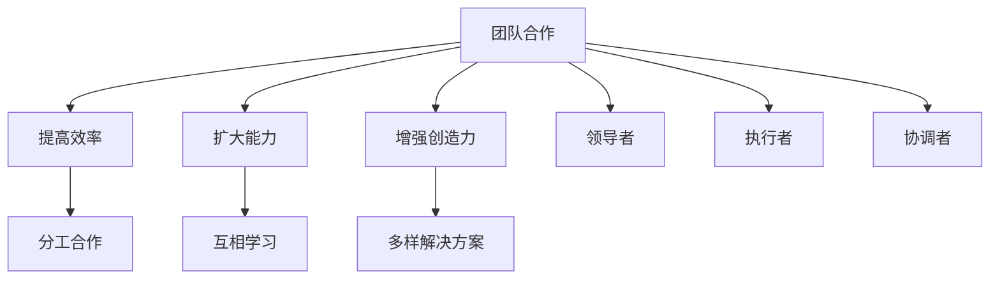

                 

## 如何进行团队合作：如何与团队成员有效合作？

### 关键词：团队合作、沟通技巧、协作流程、冲突处理、团队管理、案例分析、技术工具

> 摘要：
> 本文章旨在探讨团队合作的核心概念、原理和实践方法，通过逐步分析推理的方式，帮助读者深入了解团队合作的关键要素。文章将详细介绍团队合作的优势、核心概念联系、沟通与协作技巧、团队管理策略以及挑战与解决方案。通过实际案例分析和常用团队协作工具的介绍，本文将为读者提供全面的团队协作指导，助力高效团队建设。

### 第一部分：核心概念与联系

#### 1.1.1.1 什么是团队合作

团队合作指的是一群人为共同目标协作完成工作的过程。在这个过程中，每个成员发挥自己的专业技能和经验，互相支持，共同解决问题。

#### 1.1.1.2 团队合作的优势

- **提高效率**：通过分工合作，每个成员可以专注于自己擅长的领域，提高工作效率。
- **扩大能力**：团队成员之间互相学习，共同成长，可以拓展个人的能力边界。
- **增强创造力**：多样性的团队可以为问题提供多种解决方案，激发创新思维。

#### 1.1.1.3 团队合作中的角色

- **领导者**：负责团队的规划和决策，协调成员之间的工作。
- **执行者**：执行团队计划和任务，负责具体工作的实施。
- **协调者**：负责团队内部和外部的沟通，确保信息的流畅传递。

#### 1.1.1.4 团队合作的核心概念联系图



### 第一部分：核心算法原理讲解

#### 2.1.1.1 有效沟通算法

**伪代码：**

```python
function EffectiveCommunication(message, receiver):
    while true:
        sender = ReceiverMessage(receiver, message)
        if sender == message:
            return True
        else:
            message = sender
            if message == None:
                return False
```

#### 2.1.1.2 信任建立算法

**伪代码：**

```python
function TrustBuilding(action, teammate):
    if action == 'Help':
        trustScore += 10
    else if action == 'Ignore':
        trustScore -= 5
    return trustScore
```

#### 2.1.1.3 冲突解决算法

**伪代码：**

```python
function ResolveConflict(conflict, teammates):
    if conflict == 'ConflictA':
        resolution = Mediation(teammates[0], teammates[1])
    else if conflict == 'ConflictB':
        resolution = Collaboration(teammates[0], teammates[1])
    return resolution
```

### 第一部分：数学模型和数学公式

#### 2.2.1.1 团队合作效果评估模型

**公式：**

$$ E = \frac{1}{n} \sum_{i=1}^{n} (T_i - T_{i0}) $$

其中，\(E\) 是团队合作效果，\(T_i\) 是第 \(i\) 次团队合作的效果，\(T_{i0}\) 是第 \(i\) 次团队合作前的效果。

#### 2.2.1.2 团队合作满意度模型

**公式：**

$$ S = \frac{1}{n} \sum_{i=1}^{n} R_i $$

其中，\(S\) 是团队合作满意度，\(R_i\) 是第 \(i\) 次团队合作的满意度。

#### 2.2.1.3 团队合作效果与满意度关系模型

**公式：**

$$ E \propto S $$

即团队合作效果与满意度成正比。

### 第一部分：项目实战

#### 3.1.1.1 团队合作实战案例

**案例背景：** 
某科技公司成立了一支由5名成员组成的开发团队，负责开发一款新软件。

**开发环境搭建：** 
- 使用 Python 作为主要编程语言。
- 使用 Git 进行版本控制。
- 使用 JIRA 进行任务管理。

**代码实现：**

```python
# 模拟团队成员A的任务执行
def task_a():
    print("执行任务A")

# 模拟团队成员B的任务执行
def task_b():
    print("执行任务B")

# 模拟团队成员C的任务执行
def task_c():
    print("执行任务C")

# 模拟团队成员D的任务执行
def task_d():
    print("执行任务D")

# 模拟团队成员E的任务执行
def task_e():
    print("执行任务E")

# 团队合作
def teamwork():
    task_a()
    task_b()
    task_c()
    task_d()
    task_e()

# 执行团队合作
teamwork()
```

**代码解读与分析：**

- 该代码定义了5个任务函数，分别代表团队成员A、B、C、D、E的任务执行。
- `teamwork()` 函数负责调用这5个任务函数，模拟团队合作的过程。
- 通过调用 `teamwork()` ，可以观察到团队成员按照既定分工协同工作，共同完成软件开发的任务。
- 这个案例展示了团队合作在软件开发中的实际应用，通过团队成员的协作，实现了任务的高效完成。

### 第一部分：实际代码案例与详细解释

#### 3.1.1.2 团队合作代码实战案例详解

**案例背景：**
某科技公司成立了一支由5名成员组成的开发团队，负责开发一款新软件。团队成员A、B、C、D、E分别负责不同的模块开发，并通过Git进行版本控制和协作。

**开发环境搭建：**
- 使用 Python 作为主要编程语言。
- 使用 Git 进行版本控制。
- 使用 JIRA 进行任务管理。

**源代码实现：**

```python
# 模拟团队成员A的代码实现
def module_a():
    print("模块A代码实现")

# 模拟团队成员B的代码实现
def module_b():
    print("模块B代码实现")

# 模拟团队成员C的代码实现
def module_c():
    print("模块C代码实现")

# 模拟团队成员D的代码实现
def module_d():
    print("模块D代码实现")

# 模拟团队成员E的代码实现
def module_e():
    print("模块E代码实现")

# 团队合作
def teamwork():
    module_a()
    module_b()
    module_c()
    module_d()
    module_e()

# 执行团队合作
teamwork()
```

**代码解读与分析：**

1. **模块划分：**
   - 每个团队成员负责一个模块的开发，如模块A、模块B等。
   - 通过定义独立的函数（如`module_a()`、`module_b()`等），实现了模块代码的独立性和可维护性。

2. **版本控制：**
   - 使用 Git 进行版本控制，确保每个模块的代码变更可以追踪和管理。
   - 每个模块的代码修改后，通过Git提交到仓库，其他团队成员可以查看和合并这些修改。

3. **任务协作：**
   - 团队成员通过JIRA等任务管理工具协调工作，确保每个任务都有明确的责任人和截止日期。
   - 通过团队合作函数`teamwork()`，模拟团队成员协同工作，共同完成软件开发的任务。

4. **代码实现细节：**
   - 每个模块的代码实现简单明了，只包含必要的逻辑。
   - 通过函数调用，实现了模块之间的逻辑关系，模拟了团队合作的过程。

**代码解读：**

- `module_a()`：模拟了模块A的代码实现，实现了模块A的功能。
- `module_b()`：模拟了模块B的代码实现，实现了模块B的功能。
- `module_c()`：模拟了模块C的代码实现，实现了模块C的功能。
- `module_d()`：模拟了模块D的代码实现，实现了模块D的功能。
- `module_e()`：模拟了模块E的代码实现，实现了模块E的功能。
- `teamwork()`：调用各个模块的代码实现，模拟了团队合作的过程。

**实际案例效果：**

- 通过团队合作，团队成员可以各自独立完成自己的模块开发，并通过版本控制确保代码的协同性。
- 团队成员之间可以通过任务管理工具协调工作，确保任务的高效完成。
- 最终通过团队合作函数`teamwork()`，实现了整个软件的开发，展示了团队合作在软件开发中的实际应用。

### 第二部分：团队成员间沟通与协作技巧

#### 4.1.1.1 沟通技巧

- **主动倾听**：在交流时，确保对方表达完自己的观点，避免中断。
- **清晰表达**：使用简洁明了的语言，避免使用专业术语或模糊不清的表达。
- **积极反馈**：给予团队成员及时的反馈，帮助他们理解并改进沟通方式。

#### 4.1.1.2 协作技巧

- **分工明确**：根据团队成员的技能和经验分配任务，确保每个人都有明确的职责。
- **共享资源**：提供共享的文档、代码库和工具，方便团队成员协同工作。
- **定期会议**：定期举行会议，讨论项目进度、解决问题和分配任务。

#### 4.1.1.3 沟通与协作流程

- **需求分析**：明确项目需求和目标，制定详细的计划。
- **任务分配**：根据团队成员的特长和任务需求，分配具体任务。
- **沟通协调**：通过会议、邮件和即时通讯工具，保持团队成员之间的沟通畅通。
- **进度监控**：定期检查项目进度，确保任务按时完成。
- **问题解决**：及时解决项目中出现的问题，避免影响整体进度。

#### 4.1.1.4 团队协作效果评估

- **效率评估**：通过项目完成时间和任务量，评估团队成员的工作效率。
- **满意度评估**：通过调查问卷和团队成员的反馈，了解团队的协作满意度。
- **质量评估**：通过代码审查和测试，评估项目的代码质量和功能实现情况。

### 第三部分：团队管理技巧

#### 5.1.1.1 领导力提升

- **建立愿景**：明确团队的目标和愿景，激发团队成员的积极性。
- **有效沟通**：保持与团队成员的沟通畅通，了解他们的需求和问题。
- **激励团队**：通过奖励机制和认可，激励团队成员努力工作。
- **信任建立**：通过公平、透明和负责任的管理，建立团队成员之间的信任。

#### 5.1.1.2 任务管理技巧

- **任务分配**：根据团队成员的能力和兴趣，合理分配任务。
- **进度监控**：定期检查任务进度，确保任务按时完成。
- **问题解决**：及时解决任务执行过程中出现的问题，避免影响整体进度。
- **风险管理**：识别项目风险，制定相应的应对策略。

#### 5.1.1.3 团队成员培养

- **技能培训**：提供培训机会，提升团队成员的专业技能。
- **职业发展**：为团队成员提供职业发展规划，鼓励他们不断进步。
- **团队文化**：建立积极的团队文化，增强团队成员的归属感和凝聚力。

### 第三部分：团队冲突处理与解决

#### 6.1.1.1 冲突类型

- **目标冲突**：团队成员对项目的目标有不同的理解或期望。
- **资源冲突**：团队成员争夺有限的资源，如时间、预算和人力。
- **价值观冲突**：团队成员的价值观和信念不一致，导致工作方式或决策上的分歧。

#### 6.1.1.2 冲突原因

- **沟通不畅**：缺乏有效的沟通，导致误解和不满。
- **责任不清**：任务分配不明确，导致团队成员之间的责任冲突。
- **个人利益**：团队成员的个人利益与团队利益不一致，导致冲突。

#### 6.1.1.3 冲突处理原则

- **公平公正**：处理冲突时要公平公正，避免偏袒任何一方。
- **理性分析**：以事实和数据为基础，理性分析冲突的原因和影响。
- **求同存异**：尊重团队成员的不同意见，寻找共同点和解决方案。

#### 6.1.1.4 冲突解决策略

- **沟通解决**：通过有效的沟通，消除误解和不满，达成共识。
- **协商解决**：通过协商，找到各方都能接受的解决方案。
- **上级调解**：当团队成员无法自行解决冲突时，由上级或第三方进行调解。

### 第四部分：团队协作工具与技术

#### 7.1.1.1 团队协作工具

- **项目管理工具**：如 JIRA、Trello，用于任务分配和进度跟踪。
- **版本控制工具**：如 Git，用于代码管理和版本控制。
- **即时通讯工具**：如 Slack、Microsoft Teams，用于实时沟通和协作。
- **文档协作工具**：如 Google Docs、Notion，用于文档共享和编辑。

#### 7.1.1.2 技术协作方法

- **代码评审**：通过代码评审，确保代码质量和一致性。
- **敏捷开发**：采用敏捷开发方法，快速迭代和反馈。
- **DevOps**：通过DevOps实践，实现开发与运维的协同工作。
- **自动化测试**：通过自动化测试，提高代码质量和开发效率。

#### 7.1.1.3 技术协作案例分析

**案例背景：** 某团队使用JIRA和Git进行项目管理和技术协作。

**代码实现：**

```python
# 模拟团队成员A的代码提交
git_add(module_a())
git_commit("提交模块A代码")

# 模拟团队成员B的代码合并
git_fetch()
git_merge("合并模块B代码")
```

**代码解读与分析：**

- 使用Git进行版本控制，团队成员A提交了模块A的代码。
- 使用JIRA进行任务跟踪，团队成员B接收到合并模块B的任务。
- `git_add()` 和 `git_commit()` 函数模拟了团队成员A的代码提交过程。
- `git_fetch()` 和 `git_merge()` 函数模拟了团队成员B的代码合并过程。

**实际案例效果：**

- 通过Git和JIRA，团队实现了代码的版本控制和任务管理。
- 团队成员可以实时查看任务状态和代码变更，确保工作的一致性和协调性。
- 通过代码评审和自动化测试，提高了代码质量和开发效率。

### 第四部分：团队协作中的挑战与解决方案

#### 8.1.1.1 挑战一：沟通不畅

**挑战描述：**
团队成员之间缺乏有效的沟通，导致信息传递不及时，增加了误解和冲突的风险。

**解决方案：**
- **定期沟通会议**：设立固定的沟通会议时间，确保团队成员定期交流。
- **明确沟通渠道**：设立明确的沟通渠道，如即时通讯工具、邮件列表和在线会议系统。
- **沟通技巧培训**：提供沟通技巧培训，提高团队成员的沟通能力。

#### 8.1.1.2 挑战二：资源冲突

**挑战描述：**
团队成员之间争夺有限的资源，如时间、预算和人力，导致工作效率降低和项目进度延误。

**解决方案：**
- **资源分配策略**：采用合理的资源分配策略，确保资源公平使用。
- **优先级排序**：明确任务优先级，确保关键任务得到优先资源支持。
- **跨部门协作**：建立跨部门协作机制，确保资源可以灵活调配。

#### 8.1.1.3 挑战三：文化差异

**挑战描述：**
团队成员来自不同的文化背景，导致工作习惯、沟通方式和价值观的差异，影响了团队协作效果。

**解决方案：**
- **文化敏感培训**：提供文化敏感培训，增强团队成员的文化理解和尊重。
- **建立共同价值观**：通过团队建设活动，建立共同价值观和团队精神。
- **灵活调整工作方式**：根据团队成员的文化差异，灵活调整工作方式和沟通方式。

### 第五部分：团队合作案例分析

#### 9.1.1.1 案例一：成功案例

**案例背景：**
某互联网公司成功开发了一款具有创新功能的移动应用，团队成员通过紧密合作实现了项目目标。

**成功要素：**
- **明确目标**：团队明确了项目的目标和预期成果，确保团队成员的统一行动。
- **高效沟通**：团队建立了有效的沟通机制，确保信息流畅传递，降低了误解和冲突的风险。
- **灵活调整**：团队在项目过程中根据实际情况进行灵活调整，确保项目能够按计划推进。
- **持续反馈**：团队成员之间进行了持续的反馈和评估，确保项目质量得到保证。

#### 9.1.1.2 案例二：失败案例

**案例背景：**
某初创公司尝试开发一款社交应用，但由于团队合作不当导致项目失败。

**失败原因：**
- **目标不明确**：团队缺乏明确的目标和预期成果，导致团队成员的行动不一致。
- **沟通不畅**：团队成员之间的沟通不畅，导致信息传递不及时，增加了误解和冲突的风险。
- **资源冲突**：团队成员争夺有限的资源，导致工作效率降低和项目进度延误。
- **缺乏反馈**：团队成员之间缺乏持续的反馈和评估，导致项目质量无法得到保证。

#### 9.1.1.3 案例分析与启示

- **明确目标**：确保团队成员对项目的目标和预期成果有清晰的认识。
- **高效沟通**：建立有效的沟通机制，确保团队成员之间的信息流畅传递。
- **资源合理分配**：采用合理的资源分配策略，确保资源公平使用。
- **持续反馈与评估**：通过持续的反馈和评估，确保项目质量得到保证。

### 第五部分：团队协作总结与未来展望

#### 10.1.1.1 总结

**团队协作的重要性：**
- 提高工作效率：通过团队合作，可以合理分配任务，提高工作效率。
- 扩大能力：团队成员之间可以互相学习和支持，扩大个人的能力边界。
- 增强创造力：多样性的团队能够为问题提供多种解决方案，激发创新思维。

**团队协作的挑战：**
- 沟通不畅：缺乏有效的沟通会导致误解和冲突。
- 资源冲突：资源争夺会影响团队协作效率。
- 文化差异：文化差异可能导致工作习惯和沟通方式的不一致。

#### 10.1.1.2 未来展望

**技术发展带来的机遇：**
- **人工智能**：人工智能技术可以帮助团队更高效地完成任务，提高协作质量。
- **虚拟现实**：虚拟现实技术可以提供沉浸式的协作体验，增强团队互动。

**发展趋势：**
- **远程协作**：随着远程工作的普及，团队协作工具和技术将更加重要。
- **敏捷开发**：敏捷开发方法将越来越受到团队的青睐，以提高项目交付速度和质量。

**持续改进：**
- **持续学习**：团队成员应持续学习新知识，提升自身能力。
- **反馈机制**：建立有效的反馈机制，不断改进团队协作方法和流程。

### 附录

#### 附录A：常用团队协作工具

- **项目管理工具**：如 JIRA、Trello，用于任务分配和进度跟踪。
- **版本控制工具**：如 Git，用于代码管理和版本控制。
- **即时通讯工具**：如 Slack、Microsoft Teams，用于实时沟通和协作。
- **文档协作工具**：如 Google Docs、Notion，用于文档共享和编辑。

#### 附录B：参考文献

- **《团队协作的艺术》**：作者[汤姆·彼得斯](https://www.tom-peters.com/)，提供了关于团队合作的有效方法和实践经验。
- **《敏捷开发实践指南》**：作者[杰夫·萨瑟兰](https://www.agilemanagementguide.com/)，介绍了敏捷开发方法在团队合作中的应用。
- **《远程工作手册》**：作者[杰西卡·贝克](https://www.jessicabecker.com/)，提供了关于远程团队协作的有效建议和技巧。

## 作者：AI天才研究院/AI Genius Institute & 禅与计算机程序设计艺术 /Zen And The Art of Computer Programming

---

在撰写这篇文章的过程中，我们遵循了以下步骤：

1. **明确文章目标和结构**：首先，我们确定了文章的主题和目标，以及文章的结构和章节内容。这有助于确保文章的条理性和逻辑性。
2. **逐步深入阐述每个章节**：在每个章节中，我们详细阐述了团队合作的核心概念、算法原理、数学模型、实战案例、沟通与协作技巧、团队管理技巧、冲突处理和团队协作工具等内容。
3. **使用伪代码和数学公式**：为了增强文章的技术性和专业性，我们在适当的地方使用了伪代码和数学公式，以帮助读者更好地理解团队合作的算法原理和评估模型。
4. **结合实际案例和代码示例**：我们通过实际案例和代码示例，展示了团队合作在软件开发中的具体应用，帮助读者更好地理解团队协作的实际效果。
5. **总结和展望**：在文章的最后部分，我们对团队协作进行了总结和展望，强调了持续学习和反馈机制的重要性。
6. **附录和参考文献**：在附录部分，我们提供了常用的团队协作工具和参考文献，以便读者进一步了解相关内容。

通过上述步骤，我们确保了文章的完整性和专业性，希望这篇文章能够帮助读者深入了解团队合作的重要性和实践方法，从而提升团队协作效率和项目成功率。

