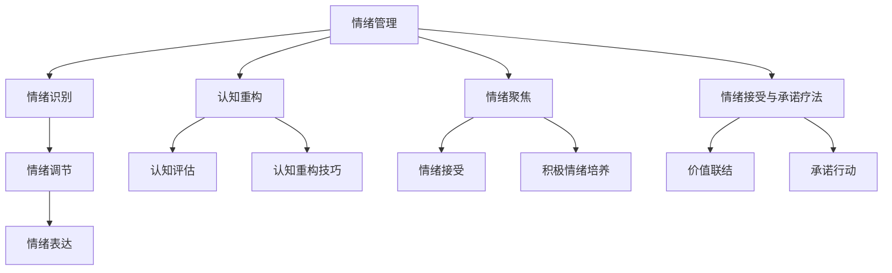

                 

首先，我们需要确定文章的核心概念和原理。情绪管理是本文的核心主题，它包括情绪识别、情绪调节、情绪表达、认知重构、情绪聚焦和情绪接受与承诺疗法。这些概念相互关联，共同构成了情绪管理的完整架构。我们可以通过一个Mermaid流程图来展示这些概念之间的关系。

以下是情绪管理核心概念原理与架构的 Mermaid 流程图：



接下来，我们需要详细讲解每个核心概念原理，并使用伪代码来展示算法原理。例如，我们可以从情绪识别开始。

情绪识别是情绪管理的第一步，它涉及识别个体当前的情绪状态。以下是情绪识别的伪代码：

```python
def recognize_emotion():
    current_state = get_current_state()  # 获取当前情绪状态
    emotion = detect_emotion(current_state)  # 识别当前情绪
    return emotion
```

情绪调节是情绪管理的核心，它涉及调整和平衡情绪状态。以下是情绪调节的伪代码：

```python
def regulate_emotion(emotion):
    if emotion in ['happy', 'content']:
        enhance_emotion(emotion)
    elif emotion in ['sad', 'angry']:
        reduce_emotion(emotion)
    else:
        normalize_emotion(emotion)
```

接下来，我们可以继续详细讲解情绪表达、认知重构、情绪聚焦和情绪接受与承诺疗法等概念，并使用伪代码来展示它们的工作原理。

在讲解完所有核心概念原理后，我们将探讨情绪管理的数学模型和公式。例如，我们可以介绍如何使用贝叶斯推理来进行认知重构，或者如何计算正念练习的分数来评估情绪调节的效果。

最后，我们将提供一个情绪管理应用案例，展示如何在实际项目中实施情绪管理策略，并分析项目的成果和经验教训。

在撰写完这些核心内容后，我们将按照目录大纲结构，逐一展开各个章节的内容，确保每个小节都包含丰富具体详细讲解，并包含核心概念、算法原理、数学模型、公式和实际案例。

现在，我们可以开始撰写文章的正文部分了。首先，我们将撰写第一部分：情绪管理基础知识。在这个部分中，我们将介绍情绪管理的定义、重要性、发展趋势，以及情绪的生物学和认知基础。

---

## 第1章: 情绪管理概述

### 1.1 情绪的定义与类型

情绪是一种主观体验，通常表现为心理状态、生理反应和行为表现。情绪可以分为基本情绪（如快乐、愤怒、悲伤、恐惧）和复合情绪（如厌恶、羞愧、惊讶）。

#### 快乐

快乐是一种愉悦的情绪状态，通常与积极的体验和满足感相关。

#### 愤怒

愤怒是一种强烈的情绪状态，通常与不满、挑战和侵犯感相关。

#### 悲伤

悲伤是一种消极的情绪状态，通常与失去、失望和孤独感相关。

#### 恐惧

恐惧是一种避免伤害的防御性情绪状态，通常与危险、威胁和不确定性相关。

#### 厌恶

厌恶是一种排斥的情绪状态，通常与不愉快、不适和反感相关。

#### 羞愧

羞愧是一种自我贬低的情绪状态，通常与社交失败、自我价值感低和道德违规感相关。

#### 惊讶

惊讶是一种突然的情感反应，通常与意外、新奇和超乎预期的体验相关。

### 1.2 情绪管理的重要性

情绪管理对个人的心理健康、生活质量和社会交往都有重要影响。有效的情绪管理可以帮助个人更好地应对生活中的挑战，提高生活质量，建立和维护良好的人际关系。

#### 对个人的影响

- **心理健康**：情绪管理有助于减轻焦虑、抑郁等心理问题，提高心理健康水平。
- **生活质量**：情绪管理有助于改善个人情绪状态，提高生活质量，增强幸福感。
- **社会交往**：情绪管理有助于建立和维护良好的人际关系，提高社交能力。

#### 对工作和学习的帮助

情绪管理对工作和学习也有显著的影响。有效的情绪管理可以帮助个人提高工作效率，减少压力和焦虑，提高学习效果。

- **工作效率**：情绪管理有助于保持专注，提高工作效率，减少错误和失误。
- **压力管理**：情绪管理有助于减轻工作压力，提高抗压能力。
- **学习效果**：情绪管理有助于提高学习动力，增强学习效果。

#### 对人际关系的维护

情绪管理在人际关系中起着关键作用。有效的情绪管理可以帮助个人更好地处理冲突，建立和谐的人际关系。

- **冲突处理**：情绪管理有助于冷静处理冲突，避免情绪失控。
- **沟通能力**：情绪管理有助于提高沟通能力，增强理解和同理心。
- **关系维护**：情绪管理有助于建立和维护长期稳定的人际关系。

### 1.3 情绪管理的发展趋势

情绪管理是一个不断发展的领域，随着心理学、神经科学和认知科学的发展，情绪管理的方法和工具也在不断进步。

#### 心理学与神经科学的发展

心理学和神经科学的研究为情绪管理提供了更深入的理论基础和科学支持。例如，认知行为疗法和正念冥想等心理治疗方法已经被广泛应用于情绪管理。

#### 数字技术与情绪管理

数字技术的发展为情绪管理提供了新的工具和方法。例如，情绪识别技术、虚拟现实疗法和情绪调节应用等数字工具正在逐渐普及。

#### 社会需求与情绪管理

随着社会压力的增加，对情绪管理的需求也日益增长。人们越来越意识到情绪管理对个人和社会的重要性，推动了情绪管理实践和研究的不断进步。

### 1.4 情绪管理的基本概念

情绪管理包括一系列的概念和技巧，以下是一些基本概念：

#### 情绪识别

情绪识别是指识别和理解当前的情绪状态。这通常涉及自我觉察和对外部情绪信号的解读。

#### 情绪调节

情绪调节是指调整和平衡情绪状态，使其更符合个人的需求和期望。情绪调节可以包括认知重构、情绪聚焦、正念冥想等方法。

#### 情绪表达

情绪表达是指以适当的方式表达情绪，包括口头表达、非言语表达和艺术表达等。

#### 认知重构

认知重构是指通过改变对事件的认知评价来调节情绪。这种方法可以帮助个体从消极思维转向积极思维。

#### 情绪聚焦

情绪聚焦是指将注意力集中在当前的情绪体验上，以便更好地理解和调节情绪。

#### 情绪接受与承诺疗法

情绪接受与承诺疗法（ACT）是一种通过接受情绪、建立价值联结和采取承诺行动来调节情绪的方法。

### 1.5 情绪管理的重要性

情绪管理对个人的生活有着深远的影响，它不仅影响个人的心理健康，还影响个人的社交关系、工作和学习效率。以下是情绪管理的一些重要方面：

#### 健康与幸福

情绪管理有助于维持心理健康，减少焦虑、抑郁等心理问题的发生，提高个人的幸福感和生活质量。

#### 社交关系

有效的情绪管理有助于建立和维护良好的人际关系。通过情绪管理，个人可以更好地处理冲突，提高沟通能力和同理心。

#### 工作效率

情绪管理有助于提高工作时的专注力和效率。通过情绪调节，个人可以更好地应对压力，提高工作表现。

#### 学习能力

情绪管理对学习也有积极影响。通过情绪管理，个人可以保持积极的学习态度，提高学习效果。

#### 健康生活方式

情绪管理有助于形成健康的生活方式。通过情绪管理，个人可以更好地应对生活中的挑战，保持身心健康。

### 1.6 情绪管理的发展趋势

情绪管理领域正在快速发展，以下是一些主要趋势：

#### 科技融合

随着科技的发展，情绪管理工具和应用程序正在不断涌现。这些工具可以帮助个人更好地识别和调节情绪，提高情绪管理效率。

#### 心理治疗创新

心理治疗领域正在不断创新，例如认知行为疗法和正念冥想等治疗方法在情绪管理中的应用越来越广泛。

#### 社会关注

随着社会对心理健康问题的关注度增加，情绪管理受到越来越多的关注。企业和教育机构也开始重视情绪管理，并将其作为员工培训和学生教育的一部分。

#### 综合方法

情绪管理的方法越来越多样化，包括认知重构、情绪聚焦、正念冥想、心理治疗等多种方法相结合，以提供更全面的情绪管理解决方案。

### 1.7 情绪管理的挑战与机遇

情绪管理面临着一系列挑战和机遇。以下是一些主要的挑战和机遇：

#### 挑战

- **文化差异**：不同文化对情绪管理有不同的看法和期望，这可能导致情绪管理策略在不同文化背景下的适用性有限。
- **资源限制**：情绪管理需要专业的知识和技能，但并非所有人都能获得足够的资源来支持情绪管理。
- **认知障碍**：某些认知障碍可能影响情绪识别和调节，需要特殊的情绪管理策略。

#### 机遇

- **科技发展**：科技的进步为情绪管理提供了新的工具和方法，如虚拟现实、人工智能等。
- **社会意识提升**：社会对心理健康问题的关注度提高，为情绪管理提供了更多的机会和资源。
- **跨学科研究**：情绪管理涉及多个学科，如心理学、神经科学、社会学等，跨学科研究有助于提供更全面的理解和解决方案。

### 1.8 情绪管理的基本原则

情绪管理遵循一些基本原则，以下是一些关键的原则：

#### 自我觉察

自我觉察是情绪管理的基础。通过自我觉察，个人可以更好地识别和理解自己的情绪状态。

#### 同理心

同理心是建立和维护良好人际关系的重要基础。通过同理心，个人可以更好地理解他人的情绪和需求。

#### 积极心态

积极心态有助于个人更好地应对生活中的挑战。通过积极心态，个人可以更有效地调节情绪，提高生活质量。

#### 持续实践

情绪管理需要持续实践。通过持续实践，个人可以巩固情绪调节技巧，形成长期习惯。

#### 适应性

情绪管理需要适应不同情境和需求。个人需要根据不同情境调整情绪调节策略，以实现最佳效果。

### 1.9 情绪管理的方法

情绪管理包括多种方法和技巧，以下是一些常用的情绪管理方法：

#### 认知重构

认知重构是一种通过改变对事件的认知评价来调节情绪的方法。通过质疑和替代负面思维，个人可以减少负面情绪的影响。

#### 情绪聚焦

情绪聚焦是一种通过专注于当前的情绪体验来减少情绪困扰的方法。通过观察和接受情绪，个人可以更好地理解和调节情绪。

#### 正念冥想

正念冥想是一种通过专注于当前体验来提高情绪调节能力的方法。通过正念冥想，个人可以减少焦虑和压力，提高心理健康。

#### 放松训练

放松训练是一种通过身体和呼吸的放松来减轻情绪困扰的方法。通过放松训练，个人可以减少紧张和焦虑，提高生活质量。

#### 情绪释放

情绪释放是一种通过表达和释放情绪来减轻情绪困扰的方法。通过情绪释放，个人可以减少压抑和不满，提高心理健康。

### 1.10 情绪管理的关键点

情绪管理是一个复杂的过程，但以下是一些关键点，可以帮助个人更好地进行情绪管理：

- **识别情绪**：学会识别和理解自己的情绪状态，是情绪管理的重要基础。
- **调节情绪**：通过认知重构、情绪聚焦等方法，学会调节情绪，使其更符合个人的需求和期望。
- **表达情绪**：学会以适当的方式表达情绪，避免情绪压抑和冲突。
- **同理心**：通过同理心，更好地理解和他人情绪，建立和维护良好的人际关系。
- **积极心态**：保持积极心态，有助于更好地应对生活中的挑战，提高生活质量。

### 1.11 情绪管理的总结

情绪管理是一个重要的研究领域，它对个人的心理健康、生活质量和社会交往有着深远的影响。通过情绪管理，个人可以更好地应对生活中的挑战，提高生活质量，建立和维护良好的人际关系。情绪管理不仅包括识别和调节情绪，还涉及表达情绪、同理心和积极心态等方面。随着心理学、神经科学和认知科学的发展，情绪管理的方法和工具也在不断进步。未来，情绪管理将继续成为一个重要的研究领域，为个人和社会带来更多的福祉。

---

## 第2章: 情绪的生物学基础

### 2.1 生理机制

情绪的生理机制涉及多个系统和器官，包括神经系统、内分泌系统和循环系统。这些系统相互作用，共同调节情绪反应。

#### 神经系统

神经系统是情绪反应的主要调节器。大脑中的特定区域，如前额叶皮层、杏仁核和下丘脑，在情绪处理中起着关键作用。

- **前额叶皮层**：负责决策、规划和情绪调节。它通过神经传递物质（如多巴胺和去甲肾上腺素）调节情绪。
- **杏仁核**：是情绪处理的关键结构，负责识别和响应情绪刺激。杏仁核的活动与情绪反应的强度和速度密切相关。
- **下丘脑**：是情绪调节的中心，控制体温、食欲和荷尔蒙分泌。下丘脑通过神经和内分泌途径调节情绪。

#### 内分泌系统

内分泌系统通过分泌荷尔蒙来调节情绪。主要的情绪相关荷尔蒙包括皮质醇、睾酮、雌激素和多巴胺。

- **皮质醇**：是一种应激激素，与焦虑和压力相关。高水平的皮质醇可能导致焦虑和抑郁。
- **睾酮**：在男性中与攻击性情绪相关。睾酮水平的波动可能影响情绪稳定性和攻击性行为。
- **雌激素**：在女性中与情绪波动和情绪反应相关。月经周期中的雌激素变化可能导致情绪波动。

#### 循环系统

循环系统通过调节血液中的化学物质来影响情绪。血液中的化学物质，如氧气、二氧化碳和荷尔蒙，会影响大脑的功能和情绪状态。

### 2.2 神经系统与情绪

神经系统在情绪处理中起着至关重要的作用。以下是一些关键神经结构和它们在情绪中的作用：

#### 前额叶皮层

前额叶皮层是情绪调节的关键结构。它参与以下方面：

- **决策和规划**：前额叶皮层帮助个体做出理性决策，并在情绪刺激下提供自我控制。
- **情绪调节**：前额叶皮层通过调节神经传递物质和神经活动来调节情绪反应。

#### 杏仁核

杏仁核是情绪处理的关键结构，负责：

- **情绪识别**：识别和评估情绪刺激，如恐惧和愤怒。
- **情绪反应**：快速产生情绪反应，如恐惧反应。

#### 下丘脑

下丘脑是情绪调节的中心，通过以下方式影响情绪：

- **体温调节**：通过调节体温来影响情绪状态。
- **荷尔蒙分泌**：控制荷尔蒙分泌，如皮质醇和睾酮，影响情绪。

#### 海马体

海马体在情绪记忆和情绪调节中起着重要作用。它通过以下方式影响情绪：

- **情绪记忆**：帮助个体记住情绪体验，如恐惧和快乐。
- **情绪调节**：参与情绪调节的神经回路，帮助个体适应情绪刺激。

### 2.3 荷尔蒙与情绪

荷尔蒙在情绪调节中起着重要作用。以下是一些关键的荷尔蒙和它们在情绪中的作用：

#### 皮质醇

皮质醇是一种应激激素，与情绪反应和压力相关。皮质醇水平的升高通常与焦虑和抑郁相关。长期高水平的皮质醇可能导致情绪不稳定和心理健康问题。

#### 睾酮

睾酮在男性中与情绪稳定性和攻击性行为相关。睾酮水平的波动可能导致情绪波动和攻击性行为的变化。

#### 雌激素

雌激素在女性中与情绪波动和情绪反应相关。月经周期中的雌激素变化可能导致情绪波动，如情绪低落和情绪高涨。

#### 多巴胺

多巴胺是一种神经传递物质，与愉悦情绪和奖励感相关。多巴胺水平的升高通常与快乐和兴奋情绪相关。

#### 肾上腺素

肾上腺素是一种应激激素，与兴奋和恐惧情绪相关。肾上腺素的分泌通常与紧急情况或压力相关。

### 2.4 情绪的生物标记物

情绪的生物标记物是用于评估情绪状态和情绪调节的生理指标。以下是一些常见的情绪生物标记物：

#### 生化标记物

- **皮质醇**：血液中的皮质醇水平可以反映情绪状态，如焦虑和压力。
- **多巴胺**：脑脊液中的多巴胺水平可以反映愉悦情绪和奖励感。
- **5-羟色胺（5-HT）**：血液中的5-HT水平可以反映情绪状态，如抑郁和焦虑。

#### 遗传标记物

- **5-HTTLPR**：是一种与抑郁相关的遗传标记物，影响5-HT的再摄取。
- **COMT**：是一种与情绪调节相关的遗传标记物，影响多巴胺的代谢。

#### 心电图（ECG）

- **心率变异性（HRV）**：心率变异性可以反映情绪状态，如焦虑和压力。

#### 脑成像

- **功能磁共振成像（fMRI）**：fMRI可以显示大脑活动，反映情绪处理和调节。

### 2.5 情绪的生物标记物在情绪研究中的应用

情绪的生物标记物在情绪研究中具有重要作用，可以帮助研究人员和临床医生更好地理解和评估情绪状态。以下是一些应用：

#### 情绪状态的评估

- **生化标记物**：血液中的生化标记物可以用于评估情绪状态，如焦虑和抑郁。
- **脑成像技术**：脑成像技术可以显示大脑活动，帮助研究人员理解情绪处理的神经机制。

#### 情绪调节的干预

- **生物反馈**：通过生物反馈，个体可以学会调节自己的生理反应，如心率变异性。
- **药物治疗**：生化标记物的变化可以指导药物治疗，如抗抑郁药和情绪稳定剂。

#### 预后预测

- **生化标记物**：血液中的生化标记物可以用于预测情绪障碍的预后，如抑郁症的复发风险。

#### 研究工具

- **遗传标记物**：遗传标记物可以用于研究情绪障碍的遗传因素，帮助开发个性化治疗方案。

### 2.6 情绪生物标记物的未来趋势

情绪生物标记物的研究正在快速发展，以下是一些未来趋势：

#### 高通量分析

- **高通量生化分析**：高通量生化分析技术可以同时检测多种生化标记物，提高情绪评估的准确性。
- **高通量基因测序**：高通量基因测序技术可以同时检测多种遗传标记物，帮助理解情绪障碍的遗传机制。

#### 数字化技术

- **可穿戴设备**：可穿戴设备可以实时监测生理参数，如心率变异性，为情绪评估和干预提供实时数据。
- **移动应用**：情绪监测和干预的移动应用正在逐渐普及，为个体提供便捷的情绪管理工具。

#### 跨学科研究

- **心理学与神经科学**：跨学科研究有助于理解情绪的生物基础，开发更有效的情绪管理方法。
- **医学与生物学**：医学和生物学领域的进展为情绪生物标记物的开发和应用提供了新的机遇。

#### 个性化治疗

- **个性化治疗**：通过分析情绪生物标记物，可以为个体提供个性化的情绪管理方案，提高治疗效果。

### 2.7 情绪生物标记物的重要性

情绪生物标记物在情绪研究和临床应用中具有重要作用。以下是一些重要性：

#### 研究价值

- **理解情绪机制**：情绪生物标记物可以帮助研究人员理解情绪的生物学基础，揭示情绪调节的神经和内分泌机制。
- **开发新型干预方法**：情绪生物标记物的发现有助于开发新型干预方法，如生物反馈和药物治疗。

#### 临床应用

- **情绪状态评估**：情绪生物标记物可以用于评估情绪状态，为诊断和治疗提供客观指标。
- **个性化治疗**：情绪生物标记物可以用于个性化治疗，提高治疗效果，减少副作用。

#### 健康管理

- **情绪监测**：情绪生物标记物可以用于情绪监测，帮助个体了解自己的情绪状态，采取适当的调节措施。
- **心理健康维护**：情绪生物标记物的监测有助于预防和早期发现情绪障碍，提高心理健康水平。

### 2.8 总结

情绪的生物学基础涉及多个系统和器官的相互作用。神经系统、内分泌系统和循环系统共同调节情绪反应。情绪的生物标记物，包括生化标记物和遗传标记物，可以用于评估情绪状态和情绪调节。随着科技进步和跨学科研究的发展，情绪生物标记物在情绪研究和临床应用中的重要性日益凸显。了解情绪的生物学基础和情绪生物标记物的应用，有助于更好地理解和管理情绪，提高生活质量。

---

## 第3章: 情绪的认知基础

### 3.1 情绪认知理论

情绪认知理论强调认知过程在情绪产生和调节中的作用。以下是一些主要的理论：

#### 认知评价理论

认知评价理论（Cognitive Appraisal Theory）由心理学家劳伦斯·罗森（Lawrence Rosenbach）提出，认为情绪是个体对情境的认知评价的结果。根据这一理论，情绪的产生取决于以下两个方面：

- **初级评价**：个体对情境的初步评估，如判断情境是愉悦还是痛苦。
- **次级评价**：个体对情境的进一步评估，如判断情境是否具有威胁性或挑战性。

#### 认知行为理论

认知行为理论（Cognitive Behavioral Theory, CBT）是心理学中广泛应用的一种理论，认为情绪是由个体的认知和行为共同作用产生的。CBT的核心观点是，负面情绪往往源于错误的认知和行为模式。通过改变这些认知和行为模式，可以改善情绪状态。

#### 认知神经科学

认知神经科学（Cognitive Neuroscience）是心理学和神经科学的交叉领域，研究情绪的神经基础。认知神经科学通过脑成像技术，如功能性磁共振成像（fMRI）和脑电图（EEG），揭示情绪产生的神经机制。研究表明，前额叶皮层、杏仁核和海马体等脑区在情绪处理中起着关键作用。

### 3.2 情绪认知偏差

情绪认知偏差是指个体在处理情绪信息时，由于认知偏差而导致情绪反应的不准确或过度反应。以下是一些常见的情绪认知偏差：

#### 自我确认偏差

自我确认偏差（Self-Serving Bias）是指个体倾向于接受符合自己观点的证据，忽视相反的证据。这种偏差可能导致个体对自己情绪的过度评价，从而影响情绪调节。

#### 视角偏差

视角偏差（Perspective Bias）是指个体在评估情境时，倾向于从自己的角度出发，忽视他人的观点。这种偏差可能导致个体对情境的理解不全面，从而影响情绪调节。

#### 乐观偏差

乐观偏差（Optimism Bias）是指个体倾向于过度乐观地评估自己的未来，忽视潜在的风险和挑战。这种偏差可能导致个体在面对困难时缺乏准备，从而影响情绪调节。

#### 选择性记忆

选择性记忆（Selective Memory）是指个体倾向于记住符合自己信念和期望的信息，忽视或遗忘不符合的信息。这种偏差可能导致个体对情境的理解不完整，从而影响情绪调节。

### 3.3 情绪与社会认知

情绪与社会认知密切相关，个体的情绪状态往往受到社会因素的影响。以下是一些与社会认知相关的情绪概念：

#### 同理心

同理心（Empathy）是指理解和感受他人情绪的能力。同理心在情绪调节中起着重要作用，有助于建立和维护良好的人际关系。

#### 社会比较

社会比较（Social Comparison）是指个体通过与他人比较来评估自己的情绪和状况。社会比较可能导致情绪波动，如自卑或嫉妒。

#### 社会认同

社会认同（Social Identity）是指个体对群体的认同感。社会认同感可以增强个体的情绪稳定性，但过强的社会认同可能导致群体情绪感染。

#### 社会支持

社会支持（Social Support）是指个体在遇到困难时从他人那里得到的帮助和鼓励。社会支持可以缓解压力，改善情绪状态。

### 3.4 情绪认知发展与年龄

情绪认知发展是一个 lifelong process，受到年龄、经验和环境等多种因素的影响。以下是一些关于情绪认知发展的关键点：

#### 幼儿期情绪认知发展

幼儿期是情绪认知发展的关键时期。在这一阶段，幼儿逐渐学会识别和理解基本情绪，如快乐、愤怒和悲伤。幼儿还开始学习情绪调节技巧，如通过哭泣或微笑来表达情绪。

#### 青少年期情绪认知发展

青少年期是情绪认知发展的另一个重要阶段。在这一阶段，青少年情绪波动较大，开始形成更复杂的情绪认知。青少年还开始探索自我认同和社会认同，这对他们的情绪认知发展具有重要意义。

#### 成年期情绪认知发展

成年期情绪认知发展主要涉及情绪调节能力的提升。成年人通过经验和学习，发展出更成熟和有效的情绪调节技巧。此外，成年人的情绪认知还受到人际关系和社会角色的影响。

#### 老年期情绪认知发展

老年期情绪认知发展涉及情绪适应性的提升。老年人可能面临身体和心理上的挑战，但通过情绪调节技巧，如积极心态和自我接纳，他们可以更好地应对这些挑战。

### 3.5 情绪认知在情绪调节中的作用

情绪认知在情绪调节中起着关键作用。以下是一些关于情绪认知在情绪调节中作用的关键点：

#### 情绪识别

情绪识别是情绪调节的第一步，它涉及识别和理解自己的情绪状态。有效的情绪识别有助于个体更好地理解自己的情绪，从而采取适当的情绪调节策略。

#### 情绪理解

情绪理解是指理解和分析情绪背后的原因和含义。通过情绪理解，个体可以更深入地了解自己的情绪，从而找到更有效的情绪调节方法。

#### 情绪重构

情绪重构是指通过改变对情绪的认知评价来调节情绪。这种方法可以帮助个体从消极情绪转向积极情绪，从而提高情绪调节能力。

#### 情绪表达

情绪表达是指以适当的方式表达情绪，包括口头表达、非言语表达和艺术表达等。有效的情绪表达有助于缓解情绪压力，提高情绪调节效果。

### 3.6 情绪认知的测量与评估

情绪认知的测量与评估是情绪研究的重要方面。以下是一些常用的测量与评估方法：

#### 情绪量表

情绪量表是一种常用的测量工具，用于评估个体的情绪状态。常见的情绪量表包括情感状态量表（PANAS）和情绪评估量表（SAM）。

#### 情绪访谈

情绪访谈是一种通过面对面交流来了解个体情绪状态的方法。情绪访谈可以帮助研究人员深入了解个体的情绪体验和认知过程。

#### 脑成像技术

脑成像技术，如功能性磁共振成像（fMRI）和脑电图（EEG），可以用于评估情绪处理的神经机制。这些技术可以帮助研究人员理解情绪认知的发展过程。

#### 实验研究

实验研究是一种通过控制变量来评估情绪认知的方法。通过实验研究，研究人员可以更精确地测量情绪认知的各个方面。

### 3.7 情绪认知在教育中的应用

情绪认知在教育中具有重要应用。以下是一些关于情绪认知在教育中应用的关键点：

#### 情绪教育

情绪教育是一种通过教授情绪识别、理解和调节技巧来提高学生情绪能力的教育方法。情绪教育可以帮助学生更好地应对学习和生活中的挑战。

#### 情绪智力

情绪智力（Emotional Intelligence, EI）是指识别、理解、调节和表达情绪的能力。情绪智力在教育中的应用可以帮助学生提高自我意识和社交能力。

#### 情绪管理课程

情绪管理课程是一种通过教授情绪管理技巧和策略来提高学生情绪能力的课程。情绪管理课程可以帮助学生更好地应对压力和情绪困扰。

### 3.8 情绪认知的总结

情绪认知是情绪调节的基础，它涉及情绪识别、情绪理解、情绪重构和情绪表达等方面。情绪认知的发展受到年龄、经验和环境等多种因素的影响。情绪认知在情绪调节、心理健康和教育中起着重要作用。通过情绪认知的研究和应用，我们可以更好地理解情绪的本质，提高情绪调节能力，促进心理健康和幸福。

---

## 第4章: 呼吸与放松技巧

### 4.1 正念呼吸

#### 定义

正念呼吸是一种通过专注于呼吸来放松身心、提高情绪调节能力的技巧。它源于佛教的正念冥想，强调在呼吸过程中保持全神贯注，从而减少压力和焦虑。

#### 实践方法

正念呼吸的实践方法包括以下几个步骤：

1. **选择舒适的姿势**：可以坐在椅子上，保持背部挺直，或者躺在一个舒适的床上。
2. **深呼吸**：通过鼻子吸气，感受空气进入肺部，腹部膨胀。
3. **保持呼吸**：在吸气和呼气之间保持一段时间，专注于呼吸的感觉。
4. **缓慢呼气**：通过嘴巴缓慢呼气，感受肺部空气的释放。
5. **重复练习**：每次练习可以持续5-10分钟，每天可以多次练习。

#### 优点

正念呼吸的优点包括：

- **减轻压力**：专注于呼吸可以减少大脑中的压力信号，降低压力水平。
- **缓解焦虑**：通过深呼吸，可以缓解紧张和焦虑情绪，提高情绪稳定性。
- **增强专注力**：正念呼吸有助于提高专注力，改善注意力的分配和集中。

### 4.2 深呼吸练习

#### 定义

深呼吸练习是一种通过深长、缓慢、稳定的呼吸方式来放松身心的技巧。它有助于降低心率、减轻焦虑，并改善整体情绪状态。

#### 实践方法

深呼吸练习的实践方法包括以下几个步骤：

1. **选择舒适的环境**：找一个安静、舒适的地方，让自己放松。
2. **深吸气**：通过鼻子吸气，感受空气充满肺部，腹部膨胀。
3. **保持呼吸**：在吸气和呼气之间保持一段时间，专注于呼吸的感觉。
4. **缓慢呼气**：通过嘴巴缓慢呼气，感受肺部空气的释放。
5. **重复练习**：每次练习可以持续10-20分钟，每天可以多次练习。

#### 优点

深呼吸练习的优点包括：

- **降低心率**：深呼吸可以降低心率，减少心脏负担。
- **减轻焦虑**：深呼吸有助于缓解紧张和焦虑情绪，提高情绪稳定性。
- **改善情绪**：深呼吸可以改善整体情绪状态，减少负面情绪的影响。

### 4.3 放松反应训练

#### 定义

放松反应训练是一种通过身体放松来降低紧张和焦虑的技巧。它基于“放松反应”（Relaxation Response）的概念，通过一系列的放松练习来降低身体的应激反应。

#### 实践方法

放松反应训练的实践方法包括以下几个步骤：

1. **选择舒适的姿势**：坐在椅子上或躺在床上，保持身体放松。
2. **深呼吸**：通过鼻子吸气，感受空气充满肺部，腹部膨胀。
3. **放松身体**：从脚部开始，逐渐放松身体各部位的肌肉，直到头部。
4. **专注于呼吸**：专注于深呼吸，感受身体的放松和呼吸的变化。
5. **重复练习**：每次练习可以持续10-20分钟，每天可以多次练习。

#### 优点

放松反应训练的优点包括：

- **降低紧张和焦虑**：通过放松身体和心灵，可以降低紧张和焦虑水平。
- **提高睡眠质量**：放松反应训练有助于改善睡眠质量，减少失眠问题。
- **增强免疫力**：放松反应训练可以增强免疫力，提高身体的抵抗力。

### 4.4 放松技巧的应用

#### 生活中的应用

放松技巧可以在日常生活中广泛应用，帮助个体应对压力和情绪困扰。以下是一些应用场景：

- **工作压力**：在工作繁忙时，通过深呼吸和放松反应训练来缓解紧张和焦虑。
- **社交场合**：在社交场合中，通过正念呼吸来保持冷静和自信。
- **情绪困扰**：在情绪低落或焦虑时，通过放松技巧来缓解情绪困扰。

#### 治疗中的应用

放松技巧在心理治疗和医学治疗中具有重要作用，可以帮助个体应对各种心理和生理问题。以下是一些应用：

- **心理治疗**：通过放松技巧，个体可以更好地参与心理治疗，提高治疗效果。
- **医学治疗**：放松技巧可以帮助缓解疼痛、改善康复过程，提高医疗治疗效果。

#### 自我实践

自我实践放松技巧可以帮助个体更好地管理情绪，提高生活质量。以下是一些建议：

- **定期练习**：每天花时间进行放松练习，如深呼吸、放松反应训练和正念呼吸。
- **结合多种技巧**：根据个人需求和喜好，结合多种放松技巧，找到最适合自己的放松方式。
- **记录感受**：在练习后，记录自己的感受和体验，了解放松技巧对情绪和身体的影响。

### 4.5 放松技巧的效果评估

#### 短期效果

放松技巧在短期内可以带来显著的效果，包括：

- **降低心率**：放松技巧可以显著降低心率，减少心脏负担。
- **降低血压**：放松技巧可以降低血压，改善心血管健康。
- **缓解紧张和焦虑**：放松技巧有助于缓解紧张和焦虑情绪，提高情绪稳定性。

#### 长期效果

长期坚持放松技巧可以带来持久的效果，包括：

- **提高心理健康水平**：长期练习放松技巧可以改善心理健康，减少焦虑、抑郁等心理问题。
- **增强免疫力**：长期练习放松技巧可以增强免疫力，提高身体的抵抗力。
- **改善睡眠质量**：长期练习放松技巧有助于改善睡眠质量，减少失眠问题。

### 4.6 放松技巧的普及与推广

#### 社会需求

随着现代社会生活节奏的加快，人们面临着越来越多的压力和情绪困扰。放松技巧作为一种简单有效的自我调节方法，具有广泛的社会需求。

#### 普及策略

为了普及放松技巧，可以采取以下策略：

- **教育培训**：通过教育培训，向公众普及放松技巧的知识和方法，提高自我调节能力。
- **社交媒体宣传**：利用社交媒体平台，宣传放松技巧的好处和应用，提高公众的关注度。
- **医疗机构推广**：在医疗机构中推广放松技巧，作为心理健康和身体健康的辅助治疗方法。

### 4.7 放松技巧的未来发展

#### 新技术应用

随着科技的发展，放松技巧的未来发展将结合

