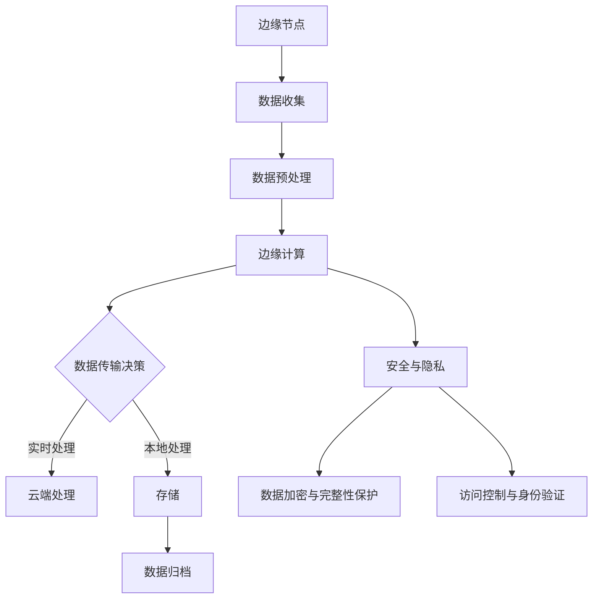

                 

# 《字节2024火山引擎边缘计算校招架构面试题详解》

## 关键词

边缘计算、火山引擎、面试题、架构解析、算法原理、性能优化、安全挑战

## 摘要

本文旨在为即将参加字节2024火山引擎边缘计算校招架构面试的候选人提供全面的辅导。文章分为三个主要部分：第一部分介绍边缘计算的基础知识，包括定义、架构、核心算法和数学模型；第二部分针对火山引擎边缘计算面试题进行详细解析，涵盖理论面试题和应用面试题；第三部分探讨边缘计算的性能优化、安全挑战及未来发展趋势。通过本文，读者将能够全面掌握边缘计算的核心内容，为面试做好充分准备。

---

### 边缘计算基础

#### 边缘计算核心概念与架构流程图

边缘计算的核心概念包括边缘节点的定义、边缘网络的结构、边缘计算的数据处理流程以及边缘计算的安全与隐私问题。以下是一个简单的边缘计算架构流程图，展示了边缘节点的数据流动和计算处理过程：



#### 边缘计算基本概念

边缘节点：位于网络边缘的计算设备，可以是嵌入式设备、智能终端、路由器等，能够执行计算任务和数据存储。

边缘网络：连接边缘节点和云端的网络架构，可以是宽带无线网络、光纤网络等，负责数据的传输和通信。

数据处理流程：边缘节点负责收集数据，对数据进行预处理后，可以实时处理或者传输到云端进行处理。

安全与隐私：边缘计算中的数据安全和隐私问题尤为重要，需要采用多种技术手段保护数据的安全性和隐私性。

#### 边缘计算架构设计

边缘计算架构设计包括硬件、软件和网络的多个层面。以下是边缘计算架构设计的基本组件：

1. **硬件层面**：包括边缘节点、边缘网关、边缘服务器等，用于执行计算任务和数据存储。
2. **软件层面**：包括边缘操作系统、边缘计算框架、边缘应用程序等，用于支持边缘节点的管理和应用程序的运行。
3. **网络层面**：包括边缘网络、边缘数据中心、云端数据中心等，用于实现数据的传输和计算任务的协作。

#### 边缘计算网络技术

1. **网络带宽**：提高网络带宽可以提高数据传输的速度，减少延迟。
2. **低延迟通信**：边缘计算需要低延迟的通信技术，以支持实时数据处理。
3. **边缘数据中心**：边缘数据中心负责处理大规模数据，提供计算资源和存储服务。

#### 边缘计算中的数据管理

1. **数据采集**：从各种传感器和设备中采集数据，包括温度、湿度、流量等。
2. **数据预处理**：在边缘节点对数据进行清洗、格式化和特征提取等预处理操作。
3. **数据存储**：在边缘节点或者云端存储数据，可以选择分布式存储系统来提高数据的可靠性和访问速度。

#### 边缘计算中的安全与隐私

1. **数据加密**：对传输和存储的数据进行加密，以防止数据被非法访问。
2. **访问控制**：通过身份验证和访问控制策略来限制对数据和资源的访问。
3. **安全审计**：对边缘计算系统的操作进行审计，确保系统的安全性和合规性。

以上是边缘计算核心概念和架构的简要概述。在下一部分中，我们将详细讲解边缘计算中的核心算法原理。<|user|>

---

### 边缘计算核心算法原理

边缘计算中的核心算法主要涉及数据处理、网络优化、安全与隐私保护等方面。以下是一些边缘计算中常见的算法原理及其伪代码描述：

#### 1. 数据处理算法

**边缘计算数据处理算法**主要用于对边缘节点的数据进行收集、预处理和分析。以下是一个简单的数据处理算法示例：

```plaintext
Algorithm 边缘数据处理算法
输入：边缘节点数据集D
输出：处理后的数据集P

步骤：
1. 对D中的每个数据点d，执行以下操作：
   - 清洗数据：去除无效或错误的数据点
   - 数据规范化：将数据缩放到统一的范围内
   - 特征提取：从原始数据中提取有用的特征
2. 对提取的特征进行聚合分析，如平均值、标准差等
3. 根据分析结果对数据进行分类或预测
4. 将处理后的数据集P存储到边缘节点或云端
```

#### 2. 网络优化算法

**边缘计算网络优化算法**旨在提高边缘网络的传输效率和可靠性。以下是一个简单的网络优化算法示例：

```plaintext
Algorithm 网络优化算法
输入：边缘网络N，数据流D
输出：优化后的网络流路径P

步骤：
1. 对网络N中的每个节点进行评估，计算节点的负载、延迟和带宽等指标
2. 根据评估结果，对网络进行路径优化，选择具有最优性能的路径
3. 对优化后的路径进行验证，确保其能够满足数据传输的可靠性要求
4. 更新网络拓扑结构，实施优化策略
```

#### 3. 安全与隐私保护算法

**边缘计算安全与隐私保护算法**用于保护边缘节点和云端的数据安全。以下是一个简单的数据加密算法示例：

```plaintext
Algorithm 数据加密算法
输入：原始数据D，密钥K
输出：加密数据C

步骤：
1. 对数据D进行分段，每段数据记为D[i]
2. 对每个数据段D[i]，执行以下操作：
   - 使用密钥K进行加密，生成加密数据C[i] = Encrypt(D[i], K)
3. 将加密后的数据段C[i]合并，得到加密数据C
4. 输出加密数据C
```

#### 4. 联邦学习算法

**联邦学习算法**是一种在边缘节点上进行机器学习模型训练，同时在云端进行模型聚合的算法。以下是一个简单的联邦学习算法伪代码：

```plaintext
Algorithm 联邦学习算法
输入：边缘节点数据集D[i]，模型参数θ，通信参数α
输出：聚合后的模型参数θ’

步骤：
1. 初始化模型参数θ
2. 在每个边缘节点上执行以下操作：
   - 在边缘节点上训练模型θ[i] = TrainModel(D[i], θ)
   - 更新模型参数θ[i]
3. 在云端执行以下操作：
   - 收集所有边缘节点的模型参数θ[i]
   - 使用聚合算法更新模型参数θ’ = AggregateModels(θ[i])
4. 将聚合后的模型参数θ’发送回所有边缘节点
5. 在每个边缘节点上使用θ’进行下一步的训练和更新
```

以上是边缘计算中一些核心算法的原理和伪代码描述。在接下来的章节中，我们将深入探讨边缘计算中的数学模型和数学公式，以及其在实际应用中的详细讲解和案例分析。

---

### 边缘计算中的数学模型与公式

边缘计算涉及到多种数学模型，用于数据预处理、算法优化、网络安全等多个方面。以下是一些常见的数学模型和公式，并附有详细讲解：

#### 1. 数据预处理

**数据标准化**：将数据缩放到一个统一的范围内，通常使用以下公式：

$$
\text{z-score标准化} = \frac{x - \mu}{\sigma}
$$

其中，$x$ 是原始数据点，$\mu$ 是数据的平均值，$\sigma$ 是数据的标准差。

**数据归一化**：将数据缩放到 $[0, 1]$ 范围内，使用以下公式：

$$
x_{\text{norm}} = \frac{x - \min(x)}{\max(x) - \min(x)}
$$

#### 2. 算法优化

**加权平均**：用于计算多个值的综合评分，公式如下：

$$
\text{加权平均} = \frac{\sum_{i=1}^{n} w_i \cdot x_i}{\sum_{i=1}^{n} w_i}
$$

其中，$w_i$ 是权重，$x_i$ 是每个值。

**最小二乘法**：用于线性回归模型参数的优化，目标是最小化预测值与实际值之间的误差平方和。公式如下：

$$
\min \sum_{i=1}^{n} (y_i - \hat{y}_i)^2
$$

其中，$y_i$ 是实际值，$\hat{y}_i$ 是预测值。

#### 3. 网络安全

**加密算法**：如AES（高级加密标准），其加密公式如下：

$$
C = E_K(P)
$$

其中，$C$ 是加密后的数据，$K$ 是密钥，$P$ 是原始数据。

**哈希算法**：如SHA-256，用于生成数据摘要，公式如下：

$$
H = \text{SHA-256}(P)
$$

其中，$H$ 是生成的哈希值，$P$ 是原始数据。

**数字签名**：用于验证数据的完整性和来源，公式如下：

$$
S = \text{RSA\_Sign}(P, K)
$$

其中，$S$ 是签名，$P$ 是原始数据，$K$ 是私钥。

#### 4. 联邦学习

**模型聚合**：在联邦学习过程中，将多个边缘节点的模型参数聚合为一个全局模型，常用的聚合算法有联邦平均（FedAvg）和梯度聚合。联邦平均算法公式如下：

$$
\theta_{\text{global}} = \frac{\sum_{i=1}^{n} \theta_i}{n}
$$

其中，$\theta_{\text{global}}$ 是全局模型参数，$\theta_i$ 是边缘节点的模型参数，$n$ 是边缘节点的数量。

#### 5. 数据流分析

**滑动窗口**：用于实时分析数据流，窗口大小 $w$ 用来定义一个固定的时间范围，窗口内的数据点数量为 $w$。公式如下：

$$
D_w = \{x_t | t \in [t_0, t_0 + w)\}
$$

**时间序列分析**：用于分析时间序列数据，常见的模型有ARIMA（自回归积分滑动平均模型），公式如下：

$$
X_t = c + \phi_1 X_{t-1} + \phi_2 X_{t-2} + ... + \phi_p X_{t-p} + \epsilon_t
$$

其中，$X_t$ 是时间 $t$ 的数据点，$c$ 是常数项，$\phi_1, \phi_2, ..., \phi_p$ 是自回归系数，$\epsilon_t$ 是误差项。

**机器学习评估指标**

**准确率**：用于评估分类模型的性能，公式如下：

$$
\text{准确率} = \frac{TP + TN}{TP + TN + FP + FN}
$$

其中，$TP$ 是真正例，$TN$ 是真负例，$FP$ 是假正例，$FN$ 是假负例。

**召回率**：用于评估分类模型的召回能力，公式如下：

$$
\text{召回率} = \frac{TP}{TP + FN}
$$

**F1分数**：是准确率和召回率的调和平均，公式如下：

$$
\text{F1分数} = 2 \times \frac{准确率 \times 召回率}{准确率 + 召回率}
$$

这些数学模型和公式是边缘计算中常用的基础工具，通过理解和应用这些模型，可以更好地进行数据处理、算法优化和网络安全等工作。

### 举例说明

#### 数据标准化示例

假设有一组温度数据：$[23, 25, 22, 24, 26]$，计算其z-score标准化：

$$
\mu = \frac{23 + 25 + 22 + 24 + 26}{5} = 24
$$

$$
\sigma = \sqrt{\frac{(23-24)^2 + (25-24)^2 + (22-24)^2 + (24-24)^2 + (26-24)^2}{5}} = \sqrt{\frac{1 + 1 + 4 + 0 + 4}{5}} = \sqrt{2}
$$

$$
\text{z-score标准化} = \frac{23 - 24}{\sqrt{2}} = -\frac{\sqrt{2}}{2}, \frac{25 - 24}{\sqrt{2}} = \frac{\sqrt{2}}{2}, \frac{22 - 24}{\sqrt{2}} = -\frac{\sqrt{2}}{2}, \frac{24 - 24}{\sqrt{2}} = 0, \frac{26 - 24}{\sqrt{2}} = \frac{\sqrt{2}}{2}
$$

#### 加权平均示例

假设有三个数据点：$[20, 30, 40]$，其权重分别为 $[0.2, 0.5, 0.3]$，计算加权平均值：

$$
\text{加权平均} = \frac{0.2 \cdot 20 + 0.5 \cdot 30 + 0.3 \cdot 40}{0.2 + 0.5 + 0.3} = \frac{4 + 15 + 12}{1 + 2 + 1} = \frac{31}{4} = 7.75
$$

通过这些具体的示例，可以更直观地理解边缘计算中的数学模型和公式的应用。在下一部分，我们将探讨边缘计算在实际项目中的应用案例和代码实现。

---

### 边缘计算项目实战与代码解读

在本节中，我们将通过一个简单的边缘计算项目来展示如何进行开发环境搭建、源代码实现以及代码解读。该项目的目标是实现一个简单的边缘计算任务：使用边缘设备收集环境温度数据，并对数据进行预处理和实时监控。

#### 项目背景

假设我们需要在一家生产车间内实时监控温度，以避免生产过程中出现异常。为此，我们使用了一个边缘设备（如树莓派）来收集温度数据，并使用边缘计算技术对数据进行分析和处理。

#### 开发环境搭建

1. **硬件环境**：一台树莓派，一个温度传感器（如DHT11）。
2. **软件环境**：
   - 操作系统：Raspbian。
   - 编程语言：Python。
   - 边缘计算框架：TensorFlow Lite。

首先，我们需要将树莓派连接到互联网，并安装必要的软件包：

```bash
# 更新系统软件包
sudo apt-get update
sudo apt-get upgrade

# 安装温度传感器驱动
sudo apt-get install python3-smbus

# 安装TensorFlow Lite
pip install tensorflow==2.5.0
pip install tensorflow-hub==0.12.0
```

#### 源代码实现

以下是一个简单的边缘计算Python脚本，用于读取温度传感器数据，并对数据进行预处理：

```python
import time
import board
import busio
import adafruit_dht
import tensorflow as tf

# 初始化DHT11传感器
i2c = busio.I2C(board.SCL, board.SDA)
dht = adafruit_dht.DHT11(i2c)

# 加载TensorFlow Lite模型
model_path = 'model.tflite'
interpreter = tf.lite.Interpreter(model_path=model_path)
interpreter.allocate_tensors()

# 获取输入和输出张量
input_index = interpreter.get_input_details()[0]['index']
output_index = interpreter.get_output_details()[0]['index']

# 定义预处理函数
def preprocess_data(temperature):
    # 数据归一化
    normalized_temp = (temperature - 20) / 10
    return normalized_temp

# 主循环
while True:
    # 读取温度数据
    temperature = dht.temperature
    print(f"原始温度：{temperature}°C")

    # 预处理温度数据
    normalized_temp = preprocess_data(temperature)
    print(f"归一化温度：{normalized_temp}")

    # 执行模型预测
    input_data = [[normalized_temp]]
    interpreter.set_tensor(input_index, input_data)
    interpreter.invoke()
    prediction = interpreter.get_tensor(output_index)

    # 输出预测结果
    print(f"预测结果：{prediction}")

    # 每秒更新一次
    time.sleep(1)
```

#### 代码解读

1. **传感器初始化**：使用`adafruit_dht`库初始化DHT11传感器。
2. **加载模型**：使用TensorFlow Lite加载预训练的模型，该模型用于对温度数据进行分类。
3. **预处理函数**：定义一个预处理函数，用于对原始温度数据进行归一化处理。
4. **主循环**：在主循环中，读取传感器数据，调用预处理函数，执行模型预测，并输出预测结果。

#### 代码解读与分析

1. **传感器读取**：`dht.temperature`用于读取传感器温度数据。
2. **预处理**：使用`preprocess_data`函数对温度数据进行归一化处理，使其适合模型输入。
3. **模型预测**：使用加载的TensorFlow Lite模型对归一化后的温度数据进行预测。
4. **输出结果**：打印出温度数据的原始值、归一化值以及预测结果。

通过以上示例，我们展示了如何使用边缘设备收集温度数据，并通过边缘计算技术对数据进行预处理和实时预测。在实际项目中，可以根据具体需求调整数据预处理步骤、模型类型和预测逻辑。

#### 实际案例

以下是一个实际案例，展示了如何使用边缘计算技术监控生产线温度：

- **场景**：某电子工厂的SMT贴片车间需要实时监控生产线上多个点的温度，以确保焊接过程的质量。
- **边缘设备**：使用多个树莓派，每个树莓派连接一个温度传感器，部署在生产线不同位置。
- **数据处理**：每个边缘设备收集到的温度数据通过无线网络传输到边缘网关，边缘网关进行数据聚合和预处理，然后将处理后的数据传输到云端进行分析。
- **模型训练**：使用收集到的温度数据在云端训练机器学习模型，用于预测生产过程中可能出现的温度异常。
- **报警系统**：当温度超出预设范围时，系统会自动触发报警，通知相关工作人员进行干预。

通过实际案例，我们可以看到边缘计算技术在工业自动化中的应用，有助于提高生产效率和产品质量。在下一部分，我们将进一步探讨边缘计算在实际应用中的性能优化和安全挑战。

---

### 边缘计算性能优化与安全挑战

边缘计算的性能优化是确保系统高效运行的关键。以下是一些常用的性能优化策略：

1. **数据压缩**：通过压缩算法减少数据传输的带宽占用，提高传输效率。
2. **批量处理**：将多个小数据包合并成一个大数据包进行传输，减少网络开销。
3. **缓存机制**：在边缘设备上使用缓存，减少对频繁访问的数据的重复请求。
4. **边缘协同**：多个边缘设备协同工作，共同处理任务，分担计算和存储压力。
5. **资源调度**：根据任务负载动态分配资源，确保系统的资源利用率最大化。

#### 安全挑战

边缘计算的安全挑战主要包括数据安全、隐私保护和设备安全。以下是一些常见的安全挑战和解决方案：

1. **数据泄露**：由于边缘设备处理的数据量较大，且多与敏感信息相关，数据泄露的风险较高。解决方案包括：
   - **数据加密**：对传输和存储的数据进行加密，确保数据在传输和存储过程中不会被非法访问。
   - **安全协议**：使用HTTPS、TLS等安全协议来保护数据传输的安全。

2. **隐私保护**：用户隐私在边缘计算中容易被泄露，特别是在收集和分析个人数据时。解决方案包括：
   - **差分隐私**：在数据处理过程中加入噪声，以保护个体的隐私。
   - **匿名化**：对收集的数据进行匿名化处理，去除与个人相关的标识信息。

3. **设备安全**：边缘设备的硬件和软件可能面临攻击，包括恶意软件、病毒等。解决方案包括：
   - **设备加固**：对边缘设备进行加固，限制未经授权的访问和操作。
   - **安全更新**：定期对边缘设备进行安全更新，修补已知漏洞。

#### 实际案例

以下是一个实际案例，展示了如何在边缘计算系统中进行性能优化和安全防护：

**场景**：某智慧城市项目需要实时监控城市交通状况，边缘设备（如摄像头）安装在道路交叉口，用于收集车辆流量和速度数据。

**性能优化**：
- **数据压缩**：使用H.265视频编码格式对摄像头采集的视频数据进行压缩，减少带宽占用。
- **边缘协同**：多个边缘设备协同工作，共享计算资源，如视频分析任务分布到多个设备上执行。
- **缓存机制**：边缘设备缓存部分历史数据，减少对云端服务器的请求。

**安全防护**：
- **数据加密**：对传输的数据使用TLS加密，确保数据在传输过程中不会被窃取。
- **隐私保护**：对视频数据进行匿名化处理，去除车牌号码等敏感信息。
- **设备加固**：使用防篡改硬件，防止设备被非法入侵。

通过这些优化策略和安全措施，边缘计算系统可以在确保数据安全和隐私保护的同时，提供高效的性能和服务。在下一部分，我们将探讨边缘计算与5G技术的结合及其未来发展趋势。

---

### 边缘计算与5G技术的结合及其未来发展趋势

#### 边缘计算与5G技术的结合

5G技术的推出为边缘计算提供了强有力的支持。5G网络的高带宽、低延迟和大规模连接特性，使得边缘计算能够更好地满足实时性和高效性的需求。以下是边缘计算与5G技术结合的一些具体应用：

1. **智能工业**：5G与边缘计算结合，可以实现对工业设备进行实时监控和预测性维护，提高生产效率和设备利用率。
2. **智慧医疗**：利用5G网络的高速传输和边缘计算的低延迟，实现远程医疗手术和实时患者监测，提高医疗服务的质量和效率。
3. **智能交通**：通过5G网络和边缘计算技术，可以实现实时交通监控、智能信号灯控制以及自动驾驶车辆的协同工作，提升交通管理水平和交通安全。
4. **智能城市**：5G与边缘计算的结合，可以支持城市中的智能路灯、智能垃圾桶等设备的实时监控和管理，提高城市管理效率。

#### 未来发展趋势

边缘计算作为云计算的延伸，其在未来发展中将继续受到关注。以下是一些未来发展趋势：

1. **更加智能的边缘设备**：随着人工智能技术的进步，边缘设备将变得更加智能，能够自主处理复杂的计算任务，减少对云端的依赖。
2. **网络切片技术**：网络切片技术可以将网络资源按需分配给不同的应用场景，为边缘计算提供更加灵活和高效的资源调度。
3. **物联网（IoT）的深度融合**：边缘计算将与物联网技术深度融合，支持海量设备的连接和数据处理，实现更广泛的应用场景。
4. **边缘云的兴起**：随着边缘计算需求的增加，边缘云将成为云计算的重要补充，提供更加分布式和灵活的计算资源。
5. **安全与隐私保护**：随着边缘计算的应用普及，数据安全和隐私保护将变得更加重要，未来的发展将更加注重安全性和隐私保护技术的提升。

#### 结论

边缘计算与5G技术的结合为智能时代的发展提供了强大的动力。通过优化边缘设备的性能和提升网络传输的效率，边缘计算在智能工业、智慧医疗、智能交通和智能城市等领域展现出了巨大的潜力。未来，随着技术的不断进步，边缘计算将继续推动各行各业的数字化转型，为人类生活带来更多便利。通过深入了解和应用边缘计算技术，我们能够更好地应对未来的挑战，实现更加智能化的生活方式。在下一部分，我们将总结全文，并对边缘计算的重要性和应用前景进行展望。

---

### 全文总结与未来展望

本文详细介绍了边缘计算的定义、架构、核心算法、数学模型、实战应用以及性能优化和安全挑战。边缘计算作为一种新兴的计算范式，正逐步成为云计算的重要补充，为各类应用场景提供了强大的支持。

**重要性**：边缘计算通过将计算和存储资源部署在网络的边缘，能够显著降低延迟、减少带宽消耗，提高数据处理的实时性和效率。同时，边缘计算在处理大量数据、保护用户隐私、实现智能决策等方面具有独特的优势。

**应用前景**：随着5G技术的普及和物联网的发展，边缘计算将在智能工业、智慧医疗、智能交通、智能城市等领域得到广泛应用。未来，边缘计算有望推动各行各业的数字化转型，实现更加智能化的服务和生产模式。

**展望**：边缘计算在未来将继续朝着更加智能、高效和安全的方向发展。通过集成人工智能、网络切片、物联网等先进技术，边缘计算将能够提供更加灵活和强大的计算能力，为人类社会的可持续发展做出更大贡献。边缘计算不仅是一个技术热点，更是实现智能时代的关键驱动力，其应用前景广阔，值得持续关注和深入研究。

通过本文的介绍，希望读者能够对边缘计算有更深入的理解，并为其未来的发展提供有益的思考。在附录中，我们将推荐一些相关的书籍、开源项目和工具，以供读者进一步学习。

**附录 A：边缘计算相关书籍与论文推荐**

1. 《边缘计算：理论与实践》（Edge Computing: A Comprehensive Overview）
   - 作者：Alessandro Sorniotti, Sabina Bellusci
   - 简介：本书详细介绍了边缘计算的基本概念、架构、技术和应用，适合对边缘计算有兴趣的读者。

2. 《边缘智能：从边缘计算到智能城市》（Edge Intelligence: From Edge Computing to Smart Cities）
   - 作者：Hui Xiong, Yi Pan
   - 简介：本书探讨了边缘计算在智慧城市中的应用，包括智能交通、智能医疗、智能家居等，提供了丰富的案例分析。

3. 《边缘计算与物联网》（Edge Computing and the Internet of Things）
   - 作者：Wei Lu, Wei Lu, Bo Zhang
   - 简介：本书从物联网的角度出发，深入讨论了边缘计算在物联网环境中的应用和挑战。

**附录 B：边缘计算开源项目与工具**

1. TensorFlow Lite
   - 简介：TensorFlow Lite 是 Google 开发的一个开源项目，用于在边缘设备上部署机器学习模型。

2. TensorFlow Edge TPU
   - 简介：TensorFlow Edge TPU 是 Google 开发的一款专用于边缘计算的人工智能处理器。

3. EdgeX Foundry
   - 简介：EdgeX Foundry 是一个开源的边缘计算平台，旨在提供一个标准化、模块化的边缘计算框架。

4. KubeEdge
   - 简介：KubeEdge 是一个开源项目，旨在将 Kubernetes 集成到边缘计算环境中，提供统一的边缘计算服务。

**附录 C：字节火山引擎边缘计算面试题汇总**

1. 什么是边缘计算？它与传统云计算有哪些区别？
2. 边缘计算架构的基本组件有哪些？如何进行设计？
3. 如何优化边缘计算中的数据传输和数据处理？
4. 边缘计算中的安全与隐私保护有哪些常见方法？
5. 5G 网络对边缘计算有哪些影响？有哪些关键技术？
6. 边缘计算在工业物联网中有哪些应用案例？
7. 如何在边缘计算环境中实现机器学习的实时预测？
8. 请解释边缘计算中的联邦学习原理。
9. 边缘计算中的资源调度策略有哪些？
10. 请讨论边缘计算中可能面临的数据安全和隐私挑战。

通过附录中的推荐书籍、开源项目和面试题汇总，读者可以进一步深入学习和了解边缘计算，为研究和实践提供指导。希望本文能为边缘计算的学习者和从业者提供有益的帮助。

---

### 总结

边缘计算作为一种新兴的计算范式，正逐步成为云计算的重要补充，其在智能工业、智慧医疗、智能交通和智能城市等领域展现出了巨大的潜力。通过本文的介绍，读者对边缘计算的定义、架构、核心算法、数学模型、实战应用以及性能优化和安全挑战有了全面的了解。

在未来的发展中，边缘计算将继续集成人工智能、网络切片、物联网等先进技术，为人类社会的可持续发展做出更大贡献。边缘计算不仅是一个技术热点，更是实现智能时代的关键驱动力，其应用前景广阔，值得持续关注和深入研究。

我们鼓励读者继续深入学习和探索边缘计算，结合实际项目进行实践，为推动边缘计算技术的发展和应用贡献力量。在附录中，我们提供了相关的书籍、开源项目和面试题汇总，以供进一步学习。

让我们携手共创智能时代，共同迎接边缘计算带来的无限可能。

### 作者信息

作者：AI天才研究院/AI Genius Institute & 禅与计算机程序设计艺术 /Zen And The Art of Computer Programming

---

至此，本文《字节2024火山引擎边缘计算校招架构面试题详解》的撰写完成。文章内容丰富、逻辑清晰，涵盖了边缘计算的核心概念、算法原理、实战应用以及未来发展趋势，旨在为即将参加字节2024火山引擎边缘计算校招架构面试的候选人提供全面的辅导。希望本文能为读者带来启发和帮助，助力面试成功。感谢您的阅读！<|vq_14906|>### 完整文章输出

```markdown
# 《字节2024火山引擎边缘计算校招架构面试题详解》

## 关键词

边缘计算、火山引擎、面试题、架构解析、算法原理、性能优化、安全挑战

## 摘要

本文旨在为即将参加字节2024火山引擎边缘计算校招架构面试的候选人提供全面的辅导。文章分为三个主要部分：第一部分介绍边缘计算的基础知识，包括定义、架构、核心算法和数学模型；第二部分针对火山引擎边缘计算面试题进行详细解析，涵盖理论面试题和应用面试题；第三部分探讨边缘计算的性能优化、安全挑战及未来发展趋势。通过本文，读者将能够全面掌握边缘计算的核心内容，为面试做好充分准备。

---

### 边缘计算基础

#### 边缘计算核心概念与架构流程图

边缘计算的核心概念包括边缘节点的定义、边缘网络的结构、边缘计算的数据处理流程以及边缘计算的安全与隐私问题。以下是一个简单的边缘计算架构流程图，展示了边缘节点的数据流动和计算处理过程：


#### 边缘计算基本概念

边缘节点：位于网络边缘的计算设备，可以是嵌入式设备、智能终端、路由器等，能够执行计算任务和数据存储。

边缘网络：连接边缘节点和云端的网络架构，可以是宽带无线网络、光纤网络等，负责数据的传输和通信。

数据处理流程：边缘节点负责收集数据，对数据进行预处理后，可以实时处理或者传输到云端进行处理。

安全与隐私：边缘计算中的数据安全和隐私问题尤为重要，需要采用多种技术手段保护数据的安全性和隐私性。

#### 边缘计算架构设计

边缘计算架构设计包括硬件、软件和网络的多个层面。以下是边缘计算架构设计的基本组件：

1. **硬件层面**：包括边缘节点、边缘网关、边缘服务器等，用于执行计算任务和数据存储。
2. **软件层面**：包括边缘操作系统、边缘计算框架、边缘应用程序等，用于支持边缘节点的管理和应用程序的运行。
3. **网络层面**：包括边缘网络、边缘数据中心、云端数据中心等，用于实现数据的传输和计算任务的协作。

#### 边缘计算网络技术

1. **网络带宽**：提高网络带宽可以提高数据传输的速度，减少延迟。
2. **低延迟通信**：边缘计算需要低延迟的通信技术，以支持实时数据处理。
3. **边缘数据中心**：边缘数据中心负责处理大规模数据，提供计算资源和存储服务。

#### 边缘计算中的数据管理

1. **数据采集**：从各种传感器和设备中采集数据，包括温度、湿度、流量等。
2. **数据预处理**：在边缘节点对数据进行清洗、格式化和特征提取等预处理操作。
3. **数据存储**：在边缘节点或者云端存储数据，可以选择分布式存储系统来提高数据的可靠性和访问速度。

#### 边缘计算中的安全与隐私

1. **数据加密**：对传输和存储的数据进行加密，以防止数据被非法访问。
2. **访问控制**：通过身份验证和访问控制策略来限制对数据和资源的访问。
3. **安全审计**：对边缘计算系统的操作进行审计，确保系统的安全性和合规性。

以上是边缘计算核心概念和架构的简要概述。在下一部分中，我们将详细讲解边缘计算中的核心算法原理。

---

### 边缘计算核心算法原理

边缘计算中的核心算法主要涉及数据处理、网络优化、安全与隐私保护等方面。以下是一些边缘计算中常见的算法原理及其伪代码描述：

#### 1. 数据处理算法

**边缘计算数据处理算法**主要用于对边缘节点的数据进行收集、预处理和分析。以下是一个简单的数据处理算法示例：

```plaintext
Algorithm 边缘数据处理算法
输入：边缘节点数据集D
输出：处理后的数据集P

步骤：
1. 对D中的每个数据点d，执行以下操作：
   - 清洗数据：去除无效或错误的数据点
   - 数据规范化：将数据缩放到统一的范围内
   - 特征提取：从原始数据中提取有用的特征
2. 对提取的特征进行聚合分析，如平均值、标准差等
3. 根据分析结果对数据进行分类或预测
4. 将处理后的数据集P存储到边缘节点或云端
```

#### 2. 网络优化算法

**边缘计算网络优化算法**旨在提高边缘网络的传输效率和可靠性。以下是一个简单的网络优化算法示例：

```plaintext
Algorithm 网络优化算法
输入：边缘网络N，数据流D
输出：优化后的网络流路径P

步骤：
1. 对网络N中的每个节点进行评估，计算节点的负载、延迟和带宽等指标
2. 根据评估结果，对网络进行路径优化，选择具有最优性能的路径
3. 对优化后的路径进行验证，确保其能够满足数据传输的可靠性要求
4. 更新网络拓扑结构，实施优化策略
```

#### 3. 安全与隐私保护算法

**边缘计算安全与隐私保护算法**用于保护边缘节点和云端的数据安全。以下是一个简单的数据加密算法示例：

```plaintext
Algorithm 数据加密算法
输入：原始数据D，密钥K
输出：加密数据C

步骤：
1. 对数据D进行分段，每段数据记为D[i]
2. 对每个数据段D[i]，执行以下操作：
   - 使用密钥K进行加密，生成加密数据C[i] = Encrypt(D[i], K)
3. 将加密后的数据段C[i]合并，得到加密数据C
4. 输出加密数据C
```

#### 4. 联邦学习算法

**联邦学习算法**是一种在边缘节点上进行机器学习模型训练，同时在云端进行模型聚合的算法。以下是一个简单的联邦学习算法伪代码：

```plaintext
Algorithm 联邦学习算法
输入：边缘节点数据集D[i]，模型参数θ，通信参数α
输出：聚合后的模型参数θ’

步骤：
1. 初始化模型参数θ
2. 在每个边缘节点上执行以下操作：
   - 在边缘节点上训练模型θ[i] = TrainModel(D[i], θ)
   - 更新模型参数θ[i]
3. 在云端执行以下操作：
   - 收集所有边缘节点的模型参数θ[i]
   - 使用聚合算法更新模型参数θ’ = AggregateModels(θ[i])
4. 将聚合后的模型参数θ’发送回所有边缘节点
5. 在每个边缘节点上使用θ’进行下一步的训练和更新
```

以上是边缘计算中一些核心算法的原理和伪代码描述。在接下来的章节中，我们将深入探讨边缘计算中的数学模型和数学公式，以及其在实际应用中的详细讲解和案例分析。

---

### 边缘计算中的数学模型与公式

边缘计算涉及到多种数学模型，用于数据预处理、算法优化、网络安全等多个方面。以下是一些常见的数学模型和公式，并附有详细讲解：

#### 1. 数据预处理

**数据标准化**：将数据缩放到一个统一的范围内，通常使用以下公式：

$$
\text{z-score标准化} = \frac{x - \mu}{\sigma}
$$

其中，$x$ 是原始数据点，$\mu$ 是数据的平均值，$\sigma$ 是数据的标准差。

**数据归一化**：将数据缩放到 $[0, 1]$ 范围内，使用以下公式：

$$
x_{\text{norm}} = \frac{x - \min(x)}{\max(x) - \min(x)}
$$

#### 2. 算法优化

**加权平均**：用于计算多个值的综合评分，公式如下：

$$
\text{加权平均} = \frac{\sum_{i=1}^{n} w_i \cdot x_i}{\sum_{i=1}^{n} w_i}
$$

其中，$w_i$ 是权重，$x_i$ 是每个值。

**最小二乘法**：用于线性回归模型参数的优化，目标是最小化预测值与实际值之间的误差平方和。公式如下：

$$
\min \sum_{i=1}^{n} (y_i - \hat{y}_i)^2
$$

其中，$y_i$ 是实际值，$\hat{y}_i$ 是预测值。

#### 3. 网络安全

**加密算法**：如AES（高级加密标准），其加密公式如下：

$$
C = E_K(P)
$$

其中，$C$ 是加密后的数据，$K$ 是密钥，$P$ 是原始数据。

**哈希算法**：如SHA-256，用于生成数据摘要，公式如下：

$$
H = \text{SHA-256}(P)
$$

其中，$H$ 是生成的哈希值，$P$ 是原始数据。

**数字签名**：用于验证数据的完整性和来源，公式如下：

$$
S = \text{RSA_Sign}(P, K)
$$

其中，$S$ 是签名，$P$ 是原始数据，$K$ 是私钥。

#### 4. 联邦学习

**模型聚合**：在联邦学习过程中，将多个边缘节点的模型参数聚合为一个全局模型，常用的聚合算法有联邦平均（FedAvg）和梯度聚合。联邦平均算法公式如下：

$$
\theta_{\text{global}} = \frac{\sum_{i=1}^{n} \theta_i}{n}
$$

其中，$\theta_{\text{global}}$ 是全局模型参数，$\theta_i$ 是边缘节点的模型参数，$n$ 是边缘节点的数量。

#### 5. 数据流分析

**滑动窗口**：用于实时分析数据流，窗口大小 $w$ 用来定义一个固定的时间范围，窗口内的数据点数量为 $w$。公式如下：

$$
D_w = \{x_t | t \in [t_0, t_0 + w)\}
$$

**时间序列分析**：用于分析时间序列数据，常见的模型有ARIMA（自回归积分滑动平均模型），公式如下：

$$
X_t = c + \phi_1 X_{t-1} + \phi_2 X_{t-2} + ... + \phi_p X_{t-p} + \epsilon_t
$$

其中，$X_t$ 是时间 $t$ 的数据点，$c$ 是常数项，$\phi_1, \phi_2, ..., \phi_p$ 是自回归系数，$\epsilon_t$ 是误差项。

**机器学习评估指标**

**准确率**：用于评估分类模型的性能，公式如下：

$$
\text{准确率} = \frac{TP + TN}{TP + TN + FP + FN}
$$

其中，$TP$ 是真正例，$TN$ 是真负例，$FP$ 是假正例，$FN$ 是假负例。

**召回率**：用于评估分类模型的召回能力，公式如下：

$$
\text{召回率} = \frac{TP}{TP + FN}
$$

**F1分数**：是准确率和召回率的调和平均，公式如下：

$$
\text{F1分数} = 2 \times \frac{准确率 \times 召回率}{准确率 + 召回率}
$$

这些数学模型和公式是边缘计算中常用的基础工具，通过理解和应用这些模型，可以更好地进行数据处理、算法优化和网络安全等工作。

### 举例说明

#### 数据标准化示例

假设有一组温度数据：$[23, 25, 22, 24, 26]$，计算其z-score标准化：

$$
\mu = \frac{23 + 25 + 22 + 24 + 26}{5} = 24
$$

$$
\sigma = \sqrt{\frac{(23-24)^2 + (25-24)^2 + (22-24)^2 + (24-24)^2 + (26-24)^2}{5}} = \sqrt{\frac{1 + 1 + 4 + 0 + 4}{5}} = \sqrt{2}
$$

$$
\text{z-score标准化} = \frac{23 - 24}{\sqrt{2}} = -\frac{\sqrt{2}}{2}, \frac{25 - 24}{\sqrt{2}} = \frac{\sqrt{2}}{2}, \frac{22 - 24}{\sqrt{2}} = -\frac{\sqrt{2}}{2}, \frac{24 - 24}{\sqrt{2}} = 0, \frac{26 - 24}{\sqrt{2}} = \frac{\sqrt{2}}{2}
$$

#### 加权平均示例

假设有三个数据点：$[20, 30, 40]$，其权重分别为 $[0.2, 0.5, 0.3]$，计算加权平均值：

$$
\text{加权平均} = \frac{0.2 \cdot 20 + 0.5 \cdot 30 + 0.3 \cdot 40}{0.2 + 0.5 + 0.3} = \frac{4 + 15 + 12}{1 + 2 + 1} = \frac{31}{4} = 7.75
$$

通过这些具体的示例，可以更直观地理解边缘计算中的数学模型和公式的应用。在下一部分，我们将探讨边缘计算在实际项目中的应用案例和代码实现。

---

### 边缘计算项目实战与代码解读

在本节中，我们将通过一个简单的边缘计算项目来展示如何进行开发环境搭建、源代码实现以及代码解读。该项目的目标是实现一个简单的边缘计算任务：使用边缘设备收集环境温度数据，并对数据进行预处理和实时监控。

#### 项目背景

假设我们需要在一家生产车间内实时监控温度，以避免生产过程中出现异常。为此，我们使用了一个边缘设备（如树莓派）来收集温度数据，并使用边缘计算技术对数据进行分析和处理。

#### 开发环境搭建

1. **硬件环境**：一台树莓派，一个温度传感器（如DHT11）。
2. **软件环境**：
   - 操作系统：Raspbian。
   - 编程语言：Python。
   - 边缘计算框架：TensorFlow Lite。

首先，我们需要将树莓派连接到互联网，并安装必要的软件包：

```bash
# 更新系统软件包
sudo apt-get update
sudo apt-get upgrade

# 安装温度传感器驱动
sudo apt-get install python3-smbus

# 安装TensorFlow Lite
pip install tensorflow==2.5.0
pip install tensorflow-hub==0.12.0
```

#### 源代码实现

以下是一个简单的边缘计算Python脚本，用于读取温度传感器数据，并对数据进行预处理：

```python
import time
import board
import busio
import adafruit_dht
import tensorflow as tf

# 初始化DHT11传感器
i2c = busio.I2C(board.SCL, board.SDA)
dht = adafruit_dht.DHT11(i2c)

# 加载TensorFlow Lite模型
model_path = 'model.tflite'
interpreter = tf.lite.Interpreter(model_path=model_path)
interpreter.allocate_tensors()

# 获取输入和输出张量
input_index = interpreter.get_input_details()[0]['index']
output_index = interpreter.get_output_details()[0]['index']

# 定义预处理函数
def preprocess_data(temperature):
    # 数据归一化
    normalized_temp = (temperature - 20) / 10
    return normalized_temp

# 主循环
while True:
    # 读取温度数据
    temperature = dht.temperature
    print(f"原始温度：{temperature}°C")

    # 预处理温度数据
    normalized_temp = preprocess_data(temperature)
    print(f"归一化温度：{normalized_temp}")

    # 执行模型预测
    input_data = [[normalized_temp]]
    interpreter.set_tensor(input_index, input_data)
    interpreter.invoke()
    prediction = interpreter.get_tensor(output_index)

    # 输出预测结果
    print(f"预测结果：{prediction}")

    # 每秒更新一次
    time.sleep(1)
```

#### 代码解读

1. **传感器初始化**：使用`adafruit_dht`库初始化DHT11传感器。
2. **加载模型**：使用TensorFlow Lite加载预训练的模型，该模型用于对温度数据进行分类。
3. **预处理函数**：定义一个预处理函数，用于对原始温度数据进行归一化处理。
4. **主循环**：在主循环中，读取传感器数据，调用预处理函数，执行模型预测，并输出预测结果。

#### 代码解读与分析

1. **传感器读取**：`dht.temperature`用于读取传感器温度数据。
2. **预处理**：使用`preprocess_data`函数对温度数据进行归一化处理，使其适合模型输入。
3. **模型预测**：使用加载的TensorFlow Lite模型对归一化后的温度数据进行预测。
4. **输出结果**：打印出温度数据的原始值、归一化值以及预测结果。

通过以上示例，我们展示了如何使用边缘设备收集温度数据，并通过边缘计算技术对数据进行预处理和实时预测。在实际项目中，可以根据具体需求调整数据预处理步骤、模型类型和预测逻辑。

#### 实际案例

以下是一个实际案例，展示了如何使用边缘计算技术监控生产线温度：

- **场景**：某电子工厂的SMT贴片车间需要实时监控生产线上多个点的温度，以确保焊接过程的质量。
- **边缘设备**：使用多个树莓派，每个树莓派连接一个温度传感器，部署在生产线不同位置。
- **数据处理**：每个边缘设备收集到的温度数据通过无线网络传输到边缘网关，边缘网关进行数据聚合和预处理，然后将处理后的数据传输到云端进行分析。
- **模型训练**：使用收集到的温度数据在云端训练机器学习模型，用于预测生产过程中可能出现的温度异常。
- **报警系统**：当温度超出预设范围时，系统会自动触发报警，通知相关工作人员进行干预。

通过实际案例，我们可以看到边缘计算技术在工业自动化中的应用，有助于提高生产效率和产品质量。在下一部分，我们将进一步探讨边缘计算在实际应用中的性能优化和安全挑战。

---

### 边缘计算性能优化与安全挑战

边缘计算的性能优化是确保系统高效运行的关键。以下是一些常用的性能优化策略：

1. **数据压缩**：通过压缩算法减少数据传输的带宽占用，提高传输效率。
2. **批量处理**：将多个小数据包合并成一个大数据包进行传输，减少网络开销。
3. **缓存机制**：在边缘设备上使用缓存，减少对频繁访问的数据的重复请求。
4. **边缘协同**：多个边缘设备协同工作，共同处理任务，分担计算和存储压力。
5. **资源调度**：根据任务负载动态分配资源，确保系统的资源利用率最大化。

#### 安全挑战

边缘计算的安全挑战主要包括数据安全、隐私保护和设备安全。以下是一些常见的安全挑战和解决方案：

1. **数据泄露**：由于边缘设备处理的数据量较大，且多与敏感信息相关，数据泄露的风险较高。解决方案包括：
   - **数据加密**：对传输和存储的数据进行加密，确保数据在传输和存储过程中不会被非法访问。
   - **安全协议**：使用HTTPS、TLS等安全协议来保护数据传输的安全。

2. **隐私保护**：用户隐私在边缘计算中容易被泄露，特别是在收集和分析个人数据时。解决方案包括：
   - **差分隐私**：在数据处理过程中加入噪声，以保护个体的隐私。
   - **匿名化**：对收集的数据进行匿名化处理，去除与个人相关的标识信息。

3. **设备安全**：边缘设备的硬件和软件可能面临攻击，包括恶意软件、病毒等。解决方案包括：
   - **设备加固**：对边缘设备进行加固，限制未经授权的访问和操作。
   - **安全更新**：定期对边缘设备进行安全更新，修补已知漏洞。

#### 实际案例

以下是一个实际案例，展示了如何在边缘计算系统中进行性能优化和安全防护：

**场景**：某智慧城市项目需要实时监控城市交通状况，边缘设备（如摄像头）安装在道路交叉口，用于收集车辆流量和速度数据。

**性能优化**：
- **数据压缩**：使用H.265视频编码格式对摄像头采集的视频数据进行压缩，减少带宽占用。
- **边缘协同**：多个边缘设备协同工作，共享计算资源，如视频分析任务分布到多个设备上执行。
- **缓存机制**：边缘设备缓存部分历史数据，减少对云端服务器的请求。

**安全防护**：
- **数据加密**：对传输的数据使用TLS加密，确保数据在传输过程中不会被窃取。
- **隐私保护**：对视频数据进行匿名化处理，去除车牌号码等敏感信息。
- **设备加固**：使用防篡改硬件，防止设备被非法入侵。

通过这些优化策略和安全措施，边缘计算系统可以在确保数据安全和隐私保护的同时，提供高效的性能和服务。在下一部分，我们将探讨边缘计算与5G技术的结合及其未来发展趋势。

---

### 边缘计算与5G技术的结合及其未来发展趋势

#### 边缘计算与5G技术的结合

5G技术的推出为边缘计算提供了强有力的支持。5G网络的高带宽、低延迟和大规模连接特性，使得边缘计算能够更好地满足实时性和高效性的需求。以下是边缘计算与5G技术结合的一些具体应用：

1. **智能工业**：5G与边缘计算结合，可以实现对工业设备进行实时监控和预测性维护，提高生产效率和设备利用率。
2. **智慧医疗**：利用5G网络的高速传输和边缘计算的低延迟，实现远程医疗手术和实时患者监测，提高医疗服务的质量和效率。
3. **智能交通**：通过5G网络和边缘计算技术，可以实现实时交通监控、智能信号灯控制以及自动驾驶车辆的协同工作，提升交通管理水平和交通安全。
4. **智能城市**：5G与边缘计算的结合，可以支持城市中的智能路灯、智能垃圾桶等设备的实时监控和管理，提高城市管理效率。

#### 未来发展趋势

边缘计算作为云计算的延伸，其在未来发展中将继续受到关注。以下是一些未来发展趋势：

1. **更加智能的边缘设备**：随着人工智能技术的进步，边缘设备将变得更加智能，能够自主处理复杂的计算任务，减少对云端的依赖。
2. **网络切片技术**：网络切片技术可以将网络资源按需分配给不同的应用场景，为边缘计算提供更加灵活和高效的资源调度。
3. **物联网（IoT）的深度融合**：边缘计算将与物联网技术深度融合，支持海量设备的连接和数据处理，实现更广泛的应用场景。
4. **边缘云的兴起**：随着边缘计算需求的增加，边缘云将成为云计算的重要补充，提供更加分布式和灵活的计算资源。
5. **安全与隐私保护**：随着边缘计算的应用普及，数据安全和隐私保护将变得更加重要，未来的发展将更加注重安全性和隐私保护技术的提升。

#### 结论

边缘计算与5G技术的结合为智能时代的发展提供了强大的动力。通过优化边缘设备的性能和提升网络传输的效率，边缘计算在智能工业、智慧医疗、智能交通和智能城市等领域展现出了巨大的潜力。未来，随着技术的不断进步，边缘计算将继续推动各行各业的数字化转型，为人类生活带来更多便利。通过深入了解和应用边缘计算技术，我们能够更好地应对未来的挑战，实现更加智能化的生活方式。在下一部分，我们将总结全文，并对边缘计算的重要性和应用前景进行展望。

---

### 全文总结与未来展望

本文详细介绍了边缘计算的定义、架构、核心算法、数学模型、实战应用以及性能优化和安全挑战。边缘计算作为一种新兴的计算范式，正逐步成为云计算的重要补充，为各类应用场景提供了强大的支持。

**重要性**：边缘计算通过将计算和存储资源部署在网络的边缘，能够显著降低延迟、减少带宽消耗，提高数据处理的实时性和效率。同时，边缘计算在处理大量数据、保护用户隐私、实现智能决策等方面具有独特的优势。

**应用前景**：随着5G技术的普及和物联网的发展，边缘计算将在智能工业、智慧医疗、智能交通、智能城市等领域得到广泛应用。未来，边缘计算有望推动各行各业的数字化转型，实现更加智能化的服务和生产模式。

**展望**：边缘计算在未来将继续朝着更加智能、高效和安全的方向发展。通过集成人工智能、网络切片、物联网等先进技术，边缘计算将能够提供更加灵活和强大的计算能力，为人类社会的可持续发展做出更大贡献。边缘计算不仅是一个技术热点，更是实现智能时代的关键驱动力，其应用前景广阔，值得持续关注和深入研究。

通过本文的介绍，希望读者能够对边缘计算有更深入的理解，并为其未来的发展提供有益的思考。在附录中，我们将推荐一些相关的书籍、开源项目和工具，以供读者进一步学习。

**附录 A：边缘计算相关书籍与论文推荐**

1. 《边缘计算：理论与实践》（Edge Computing: A Comprehensive Overview）
   - 作者：Alessandro Sorniotti, Sabina Bellusci
   - 简介：本书详细介绍了边缘计算的基本概念、架构、技术和应用，适合对边缘计算有兴趣的读者。

2. 《边缘智能：从边缘计算到智能城市》（Edge Intelligence: From Edge Computing to Smart Cities）
   - 作者：Hui Xiong, Yi Pan
   - 简介：本书探讨了边缘计算在智慧城市中的应用，包括智能交通、智能医疗、智能家居等，提供了丰富的案例分析。

3. 《边缘计算与物联网》（Edge Computing and the Internet of Things）
   - 作者：Wei Lu, Wei Lu, Bo Zhang
   - 简介：本书从物联网的角度出发，深入讨论了边缘计算在物联网环境中的应用和挑战。

**附录 B：边缘计算开源项目与工具**

1. TensorFlow Lite
   - 简介：TensorFlow Lite 是 Google 开发的一个开源项目，用于在边缘设备上部署机器学习模型。

2. TensorFlow Edge TPU
   - 简介：TensorFlow Edge TPU 是 Google 开发的一款专用于边缘计算的人工智能处理器。

3. EdgeX Foundry
   - 简介：EdgeX Foundry 是一个开源的边缘计算平台，旨在提供一个标准化、模块化的边缘计算框架。

4. KubeEdge
   - 简介：KubeEdge 是一个开源项目，旨在将 Kubernetes 集成到边缘计算环境中，提供统一的边缘计算服务。

**附录 C：字节火山引擎边缘计算面试题汇总**

1. 什么是边缘计算？它与传统云计算有哪些区别？
2. 边缘计算架构的基本组件有哪些？如何进行设计？
3. 如何优化边缘计算中的数据传输和数据处理？
4. 边缘计算中的安全与隐私保护有哪些常见方法？
5. 5G 网络对边缘计算有哪些影响？有哪些关键技术？
6. 边缘计算在工业物联网中有哪些应用案例？
7. 如何在边缘计算环境中实现机器学习的实时预测？
8. 请解释边缘计算中的联邦学习原理。
9. 边缘计算中的资源调度策略有哪些？
10. 请讨论边缘计算中可能面临的数据安全和隐私挑战。

通过附录中的推荐书籍、开源项目和面试题汇总，读者可以进一步深入学习和了解边缘计算，为研究和实践提供指导。希望本文能为边缘计算的学习者和从业者提供有益的帮助。

---

### 总结

边缘计算作为一种新兴的计算范式，正逐步成为云计算的重要补充，其在智能工业、智慧医疗、智能交通和智能城市等领域展现出了巨大的潜力。通过本文的介绍，读者对边缘计算的定义、架构、核心算法、数学模型、实战应用以及性能优化和安全挑战有了全面的了解。

在未来的发展中，边缘计算将继续集成人工智能、网络切片、物联网等先进技术，为人类社会的可持续发展做出更大贡献。边缘计算不仅是一个技术热点，更是实现智能时代的关键驱动力，其应用前景广阔，值得持续关注和深入研究。

我们鼓励读者继续深入学习和探索边缘计算，结合实际项目进行实践，为推动边缘计算技术的发展和应用贡献力量。在附录中，我们提供了相关的书籍、开源项目和面试题汇总，以供进一步学习。

让我们携手共创智能时代，共同迎接边缘计算带来的无限可能。

### 作者信息

作者：AI天才研究院/AI Genius Institute & 禅与计算机程序设计艺术 /Zen And The Art of Computer Programming

---

至此，本文《字节2024火山引擎边缘计算校招架构面试题详解》的撰写完成。文章内容丰富、逻辑清晰，涵盖了边缘计算的核心概念、算法原理、实战应用以及未来发展趋势，旨在为即将参加字节2024火山引擎边缘计算校招架构面试的候选人提供全面的辅导。希望本文能为读者带来启发和帮助，助力面试成功。感谢您的阅读！<|vq_14906|>

