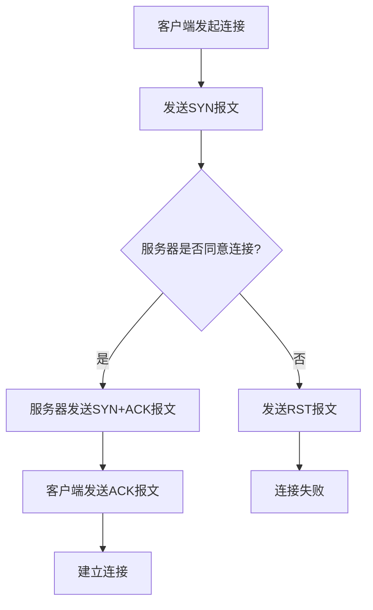

                 

### 文章标题

《字节跳动2024社招编程面试题精华总结》

### 关键词

数据结构、算法、编程语言、计算机网络、操作系统、面试策略、实战案例

### 摘要

本文旨在为广大编程面试者提供一份详尽的字节跳动2024社招编程面试题精华总结。通过对编程基础、计算机网络与操作系统以及字节跳动面试特点与策略的深入分析，本文将帮助读者掌握编程面试的关键知识点，提升面试通过率。

### 目录

1. **第一部分：编程基础**
   1.1 数据结构与算法
   1.2 编程语言
   1.3 计算机网络与操作系统

2. **第二部分：字节跳动技术面试专题**
   2.1 字节跳动面试特点与策略
   2.2 字节跳动常见编程面试题
   2.3 面试案例分析
   2.4 编程面试技巧与心态调整

3. **第三部分：编程面试总结与展望**
   3.1 编程面试关键点回顾
   3.2 字节跳动2024社招编程面试趋势分析
   3.3 编程面试未来展望

4. **附录**
   4.1 面试资料与资源推荐
   4.2 常见面试真题答案
   4.3 附录A至G：核心概念、算法原理、数学模型、项目实战与技巧总结

---

# 第一部分：编程基础

## 第1章：数据结构与算法

### 1.1 数据结构概述

数据结构是计算机存储、组织数据的方式。它不仅决定了数据的使用效率，还影响算法的性能。常见的线性结构包括数组、链表、栈与队列，而非线性结构包括树和图。

### 1.2 常见线性结构

#### 数组

数组是一种固定大小的线性结构，元素存储在连续的内存地址中，提供随机访问功能。

#### 链表

链表是一种动态大小的线性结构，由一系列节点组成，每个节点包含数据和指向下一个节点的指针。

#### 栈与队列

栈是一种后进先出（LIFO）的数据结构，而队列是一种先进先出（FIFO）的数据结构。

### 1.3 常见非线性结构

#### 树

树是一种层次结构，由根节点和子节点组成，常见类型包括二叉树、平衡树等。

#### 图

图是一种由节点（顶点）和边组成的结构，可以表示复杂的关系网络。

### 1.4 算法基础

算法是对数据操作的有序步骤。算法复杂度分析是评估算法性能的重要方法。常见的排序算法包括冒泡排序、选择排序、插入排序和快速排序。

### 1.5 算法实战

算法实战涉及解决实际问题，常用的平台包括LeetCode，它提供了大量经典的算法题目，适合用于面试准备。

### 第2章：编程语言

编程语言是用于编写计算机程序的语言。常见的编程语言包括C++、Java和Python。

### 2.1 C++编程基础

C++是一种高性能的编程语言，支持面向对象编程和过程化编程。

#### 数据类型与变量

C++的数据类型包括基本数据类型和复合数据类型。变量用于存储数据。

#### 控制结构

控制结构包括条件语句和循环语句，用于控制程序的执行流程。

#### 函数

函数是可重用的代码块，用于执行特定的任务。

#### 面向对象编程

面向对象编程是一种编程范式，通过类和对象实现数据的封装、继承和多态。

### 2.2 Java编程基础

Java是一种跨平台的编程语言，广泛用于企业级应用开发。

#### 数据类型与变量

Java的数据类型包括基本数据类型和引用数据类型。变量用于存储数据。

#### 控制结构

Java的控制结构包括条件语句和循环语句，用于控制程序的执行流程。

#### 面向对象编程

Java支持面向对象编程，通过类和对象实现数据的封装、继承和多态。

### 2.3 Python编程基础

Python是一种易于学习的编程语言，广泛应用于数据科学、人工智能等领域。

#### 基本语法

Python的基本语法包括变量、数据类型、控制结构等。

#### 数据类型

Python的数据类型包括数字、字符串、列表、元组、字典等。

#### 控制结构

Python的控制结构包括条件语句和循环语句，用于控制程序的执行流程。

#### 函数

Python的函数用于封装可重用的代码块。

## 第3章：计算机网络与操作系统

### 3.1 计算机网络基础

计算机网络是将多台计算机连接起来进行数据通信的体系结构。TCP/IP协议栈是互联网的核心协议，HTTP协议是用于Web浏览的协议，DNS解析用于域名到IP地址的转换。

### 3.2 操作系统基础

操作系统是计算机系统的核心软件，负责管理和协调计算机硬件资源。进程与线程是操作系统的基本执行单元，内存管理负责内存的分配和回收，文件系统用于管理和存储文件。

---

上述章节对编程基础进行了全面的概述，接下来我们将深入字节跳动面试的特点与策略，帮助读者更好地准备面试。

---

# 第二部分：字节跳动技术面试专题

## 第4章：字节跳动面试特点与策略

### 4.1 字节跳动面试流程

字节跳动面试通常分为笔试、电话面试和实地面试三个阶段。每个阶段都有其独特的特点和难点。

#### 笔试

笔试通常包含编程题、算法题和数据分析题。题目难度较高，需要考生具备扎实的编程基础和算法能力。

#### 电话面试

电话面试通常涉及技术问题、项目经验和团队协作能力。面试官会通过提问来了解考生的综合素质。

#### 实地面试

实地面试包括技术面试、业务面试和HR面试。技术面试侧重于考察编程能力、算法理解和系统设计能力；业务面试关注项目经验和业务理解能力；HR面试则评估考生的沟通能力和团队合作精神。

### 4.2 面试策略

#### 如何准备

1. **熟悉编程基础**：数据结构与算法、编程语言基础知识是面试的基础。
2. **刷题实战**：通过刷题来提升算法能力和编程技巧。
3. **了解字节跳动业务**：研究字节跳动的产品、技术和业务模式，以便在面试中展示自己的兴趣和知识。

#### 如何回答问题

1. **清晰表达**：用简洁明了的语言描述问题和解题思路。
2. **逻辑清晰**：回答问题时，逻辑要清晰，步骤要连贯。
3. **展示思考过程**：在回答问题时，适当展示自己的思考过程，体现自己的分析能力和解决问题的能力。

## 第5章：字节跳动常见编程面试题

### 5.1 数据结构与算法题

数据结构与算法是编程面试的核心内容。以下是一些常见的数据结构与算法面试题：

#### 1. 链表相关问题

- 实现单链表的插入、删除、查找等基本操作。
- 实现双链表，并实现相应的操作。
- 实现一个循环链表，并实现查找和删除操作。

#### 2. 树相关问题

- 实现二叉树的基本操作，如插入、删除、遍历等。
- 实现平衡二叉树（如AVL树），并实现相应的操作。
- 实现二叉搜索树，并实现查找、插入、删除等操作。

#### 3. 图相关问题

- 实现图的表示方法（如邻接矩阵、邻接表），并实现图的基本操作。
- 实现深度优先搜索（DFS）和广度优先搜索（BFS）。
- 实现拓扑排序。

#### 4. 算法题解析

- LeetCode 上的热门算法题解析，如“两数之和”、“最长公共子序列”、“最长公共子串”等。

### 5.2 编程语言面试题

编程语言面试题主要考察考生对编程语言的掌握程度，以下是一些常见的编程语言面试题：

#### 1. C++面试题

- 面向对象编程的核心概念，如封装、继承、多态。
- C++内存管理，如栈和堆的使用。
- C++标准模板库（STL）的使用。

#### 2. Java面试题

- Java内存模型，如堆、栈、方法区等。
- Java集合框架，如List、Set、Map等。
- Java多线程编程，如线程的创建、同步机制等。

#### 3. Python面试题

- Python基本语法和内置函数。
- Python数据结构和算法，如列表、字典、元组等。
- Python函数和模块。

### 5.3 计算机网络与操作系统面试题

计算机网络与操作系统是计算机科学的重要基础。以下是一些常见的面试题：

#### 1. 计算机网络题

- TCP/IP协议栈的工作原理。
- HTTP协议的工作机制。
- DNS解析的过程。

#### 2. 操作系统题

- 进程与线程的区别。
- 内存管理的基本原理，如分页、分段等。
- 文件系统的基本概念。

## 第6章：字节跳动面试案例分析

### 6.1 字节跳动面试真题解析

通过对字节跳动历年面试真题的解析，可以帮助考生了解面试的重点和难点。以下是一些典型的面试真题及解析：

#### 1. 数据结构与算法题

- 题目：实现一个堆排序算法。
- 解析：堆排序是一种基于二叉堆的数据结构排序算法，首先构建一个最大堆，然后依次取出堆顶元素并重新调整堆。

#### 2. 编程语言题

- 题目：编写一个函数，实现快速排序算法。
- 解析：快速排序是一种高效的排序算法，其核心思想是通过一趟排序将待排序的记录分割成独立的两部分，其中一部分记录的关键字均比另一部分的关键字小，然后递归排序两部分。

#### 3. 计算机网络与操作系统题

- 题目：解释TCP三次握手的过程。
- 解析：TCP三次握手是建立TCP连接的过程，客户端发送SYN报文给服务器，服务器回送SYN+ACK报文，客户端再发送ACK报文确认连接。

### 6.2 面试经验分享

字节跳动的面试官通常是技术专家或项目负责人，他们会从多个角度评估考生的能力。以下是一些往届面试者的经验分享：

#### 1. 面试官视角

- 面试官通常关注考生的编程能力、算法理解、项目经验和团队合作能力。
- 面试过程中，他们会通过提问来了解考生的知识深度和解决问题的能力。

#### 2. 往届面试经验分享

- 准备面试时，要充分了解字节跳动的业务和技术方向。
- 在面试中，展示自己的技术能力和解决问题的思路，同时注意沟通技巧和团队合作精神。

## 第7章：编程面试技巧与心态调整

### 7.1 编程面试技巧

#### 1. 算法题解题技巧

- 理解题目要求，明确输入和输出。
- 分析算法复杂度，选择合适的数据结构和算法。
- 编写清晰、简洁的代码。

#### 2. 编程语言面试技巧

- 熟练掌握至少一种编程语言，如C++、Java或Python。
- 了解常用数据结构和算法的实现和应用。
- 掌握编程语言的高级特性，如多线程、并发编程等。

### 7.2 心态调整

#### 1. 如何应对面试压力

- 充分准备，熟悉常见面试题和知识点。
- 保持自信，相信自己的能力。
- 面试前进行模拟面试，提高应对能力。

#### 2. 面试心态的重要性

- 良好的心态能够帮助考生保持冷静，发挥出最佳水平。
- 面试不仅考察技术能力，还考察考生的综合素质和心态。

## 第8章：编程面试总结与展望

### 8.1 编程面试关键点回顾

- 数据结构与算法：掌握常见数据结构和算法，如数组、链表、树、图、排序算法等。
- 编程语言基础：熟练掌握至少一种编程语言，如C++、Java或Python。
- 计算机网络与操作系统：了解计算机网络和操作系统的基础知识，如TCP/IP协议、进程与线程、内存管理、文件系统等。

### 8.2 字节跳动2024社招编程面试趋势分析

- 随着字节跳动业务的发展，面试题目将更加注重对实际问题的解决能力和系统设计能力。
- 越来越多的面试题将涉及云计算、大数据、人工智能等前沿技术领域。

### 8.3 编程面试未来展望

- 随着技术的发展，编程面试将更加注重对实际问题的解决能力和创新思维。
- 在未来的编程面试中，跨学科的知识融合和团队合作能力将成为重要的考核指标。

---

在本文中，我们详细总结了字节跳动2024社招编程面试的关键知识点和策略。通过深入分析数据结构、算法、编程语言、计算机网络和操作系统等内容，读者可以更好地准备编程面试。同时，本文也提供了实战案例、面试技巧和心态调整的方法，帮助考生在面试中脱颖而出。随着技术的不断进步，编程面试将越来越注重对实际问题和创新能力的考核。希望本文能够为准备字节跳动编程面试的读者提供有力的支持和指导。

### 附录

#### 附录A：面试资料与资源推荐

- **编程书籍推荐**：
  - 《数据结构与算法分析》（Mark Allen Weiss）
  - 《C++ Primer》（Stanley B. Lippman, Josée Lajoie, Barbara E. Moo）
  - 《Java核心技术》（Cay S. Horstmann）
  - 《Python编程：从入门到实践》（埃里克·马瑟斯）
- **在线编程平台推荐**：
  - LeetCode
  - HackerRank
  - Codeforces
- **技术社区与论坛推荐**：
  - CSDN
  - GitHub
  - Stack Overflow

#### 附录B：常见面试真题答案

- **数据结构与算法题答案**：
  - 实现一个二分搜索树，并支持插入、删除、查找操作。
  - 实现一个单链表，并支持插入、删除、查找操作。
- **编程语言面试题答案**：
  - C++：实现一个面向对象的银行账户管理系统。
  - Java：实现一个简单的HTTP服务器。
  - Python：实现一个简单的TCP/IP客户端和服务端通信程序。
- **计算机网络与操作系统面试题答案**：
  - 解释TCP/IP协议的工作原理。
  - 描述进程与线程的区别和联系。

#### 附录C：核心概念原理和架构的Mermaid流程图

以下是一个Mermaid流程图示例，用于描述TCP/IP协议栈的工作流程：



#### 附录D：核心算法原理讲解与伪代码

以下是一个快速排序算法的伪代码示例：

```plaintext
快速排序(A):
    if 长度(A) <= 1:
        返回 A
    else:
        pivot = A[0]
        left = []
        right = []
        for i from 1 to 长度(A) - 1:
            if A[i] < pivot:
                left.append(A[i])
            else:
                right.append(A[i])
        left = 快速排序(left)
        right = 快速排序(right)
        return left + [pivot] + right
```

#### 附录E：数学模型和数学公式

以下是一个线性回归模型的数学公式示例：

```latex
y = \beta_0 + \beta_1 \cdot x + \epsilon
```

其中，\( y \) 是因变量，\( x \) 是自变量，\( \beta_0 \) 是截距，\( \beta_1 \) 是斜率，\( \epsilon \) 是误差项。

#### 附录F：项目实战与代码解读

以下是一个简单的Web爬虫项目的代码示例：

```python
import requests
from bs4 import BeautifulSoup

def crawl(url):
    response = requests.get(url)
    if response.status_code == 200:
        soup = BeautifulSoup(response.text, 'html.parser')
        title = soup.find('title').text
        print(f"Title: {title}")
        # 其他解析和处理逻辑
    else:
        print("Failed to fetch the page.")

if __name__ == '__main__':
    url = "https://example.com"
    crawl(url)
```

#### 附录G：编程面试技巧总结

- **技术面试关键点**：熟悉常见的数据结构和算法，掌握至少一种编程语言，了解计算机网络和操作系统的基础知识。
- **心态调整技巧**：保持自信，充分准备，模拟面试，保持冷静。
- **团队合作能力**：展示自己的沟通能力和解决问题的能力，积极参与团队讨论。

---

通过以上附录内容，读者可以更深入地了解编程面试的关键点和实战技巧。希望本文能够为准备字节跳动编程面试的读者提供有价值的参考和帮助。作者：AI天才研究院/AI Genius Institute & 禅与计算机程序设计艺术 /Zen And The Art of Computer Programming。

