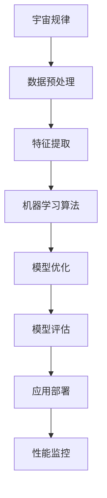
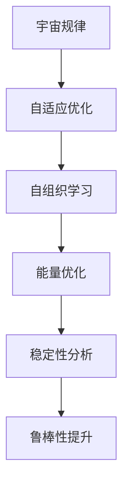

                 

# 《宇宙规律对可证明安全AI系统的启示》

> **关键词**：宇宙规律、AI系统、可证明安全、复杂性理论、量子计算、神经网络、网络安全、自动驾驶。

> **摘要**：本文探讨了宇宙规律对可证明安全AI系统的启示，从宇宙的基本规律出发，结合AI系统的理论基础，提出了基于宇宙规律的安全AI系统设计方法。通过分析宇宙中的物理现象和AI系统面临的安全性问题，本文探讨了宇宙规律在AI系统中的应用实例，并对可证明安全AI系统的研究与实现进行了展望。

### 目录大纲

## 第一部分：宇宙规律概述

### 第1章：宇宙的基本规律

#### 1.1 宇宙的起源与演化

##### 1.1.1 宇宙大爆炸理论

##### 1.1.2 宇宙演化的重要阶段

#### 1.2 宇宙中的基本力

##### 1.2.1 万有引力

##### 1.2.2 强相互作用力

##### 1.2.3 弱相互作用力

##### 1.2.4 电磁力

#### 1.3 宇宙中的物质与能量

##### 1.3.1 宇宙的组成成分

##### 1.3.2 黑暗物质与暗能量

### 第2章：宇宙中的物理现象

#### 2.1 宇宙中的星系与恒星

##### 2.1.1 星系的分类

##### 2.1.2 恒星的演化

##### 2.1.3 恒星生命的周期

#### 2.2 宇宙中的超新星与黑洞

##### 2.2.1 超新星爆发

##### 2.2.2 黑洞的形成

##### 2.2.3 黑洞的影响

#### 2.3 宇宙中的暗物质与暗能量

##### 2.3.1 暗物质的探测

##### 2.3.2 暗能量的作用

##### 2.3.3 暗物质与暗能量的相互作用

## 第二部分：AI系统与宇宙规律的启示

### 第3章：AI系统的理论基础

#### 3.1 AI的基本原理

##### 3.1.1 机器学习

##### 3.1.2 深度学习

##### 3.1.3 强化学习

#### 3.2 AI的安全性问题

##### 3.2.1 AI系统的脆弱性

##### 3.2.2 AI系统的攻击方式

##### 3.2.3 AI系统的安全性评估

### 第4章：宇宙规律在AI系统中的应用

#### 4.1 宇宙规律对AI系统的启示

##### 4.1.1 宇宙中的自组织和复杂性

##### 4.1.2 宇宙中的稳定性和平衡性

##### 4.1.3 宇宙中的能量和物质转换

#### 4.2 基于宇宙规律的AI系统设计

##### 4.2.1 宇宙规律与机器学习算法的融合

##### 4.2.2 宇宙规律与深度学习模型的优化

##### 4.2.3 宇宙规律与AI系统的安全性提升

### 第5章：可证明安全AI系统的研究与实现

#### 5.1 可证明安全AI系统的基本概念

##### 5.1.1 可证明安全的定义

##### 5.1.2 可证明安全的挑战

##### 5.1.3 可证明安全的分类

#### 5.2 可证明安全AI系统的研究进展

##### 5.2.1 国内外研究现状

##### 5.2.2 核心技术与方法

##### 5.2.3 应用场景与前景

### 第6章：宇宙规律在AI安全中的应用实例

#### 6.1 宇宙规律在网络安全中的应用

##### 6.1.1 黑客攻击与宇宙规律

##### 6.1.2 网络安全防护策略

##### 6.1.3 宇宙规律在网络安全中的应用案例

#### 6.2 宇宙规律在自动驾驶安全中的应用

##### 6.2.1 自动驾驶中的安全问题

##### 6.2.2 宇宙规律在自动驾驶安全中的应用

##### 6.2.3 自动驾驶安全案例分析

### 第7章：展望与未来

#### 7.1 宇宙规律与AI系统发展的关系

##### 7.1.1 宇宙规律在AI系统中的潜在应用

##### 7.1.2 AI系统对宇宙规律的理解与探索

##### 7.1.3 宇宙规律与AI系统未来的发展趋势

#### 7.2 可证明安全AI系统的未来展望

##### 7.2.1 可证明安全AI系统的挑战与机遇

##### 7.2.2 可证明安全AI系统的发展方向

##### 7.2.3 可证明安全AI系统的社会影响

## 附录

### 附录A：参考文献

#### A.1 宇宙规律相关参考文献

##### A.1.1 《宇宙简史》

##### A.1.2 《宇宙的未来》

#### A.2 AI系统相关参考文献

##### A.2.1 《深度学习》

##### A.2.2 《人工智能：一种现代的方法》

### 附录B：宇宙规律与AI系统流程图

#### B.1 宇宙规律与机器学习算法融合流程图

##### B.1.1 宇宙规律对机器学习算法的影响

##### B.1.2 机器学习算法与宇宙规律的结合方法

### 附录C：数学模型与公式

#### C.1 量子力学基本公式

$$
E = h \nu
$$

#### C.2 黑洞熵公式

$$
S = \frac{k \cdot A}{4 \cdot l_p^2}
$$

#### C.3 神经网络激活函数公式

$$
f(x) = \frac{1}{1 + e^{-x}}
$$

### 附录D：代码示例

#### D.1 基于宇宙规律的神经网络模型代码示例

```python
# 这里嵌入 Python 代码实现
```

## 第一部分：宇宙规律概述

### 第1章：宇宙的基本规律

宇宙是广袤的，我们生活在一个由各种基本规律所支配的世界中。这些基本规律构成了宇宙的基石，理解它们对于我们探索宇宙的奥秘至关重要。

#### 1.1 宇宙的起源与演化

宇宙的起源是一个永恒的谜题，目前最为广泛接受的解释是宇宙大爆炸理论。根据这个理论，宇宙起源于一个极小的、极热的、高密度的状态，然后开始膨胀和冷却。这个理论得到了大量的观测证据支持，如宇宙背景辐射、宇宙膨胀的加速度等。

宇宙的演化可以分为以下几个重要阶段：

1. **原始宇宙**：宇宙大爆炸发生后，宇宙处于高温高密度的状态，充满了基本粒子。
2. **原子核形成**：随着宇宙的膨胀和冷却，温度下降到足够低，原子核开始形成。
3. **恒星和星系的形成**：随着物质逐渐聚集，形成了恒星和星系。
4. **超新星和黑洞的形成**：恒星在其生命周期结束时，通过超新星爆发释放大量物质，有些恒星最终形成黑洞。
5. **宇宙的演化和未来**：宇宙将继续膨胀，可能会面临热寂的命运，也可能会有新的演化形式。

##### 1.1.1 宇宙大爆炸理论

宇宙大爆炸理论（Big Bang Theory）是描述宇宙起源和演化的最广泛接受的科学理论。根据这个理论，宇宙起源于一个极为密集和炽热的奇点，然后在大约138亿年前发生了剧烈的膨胀，逐渐冷却并形成我们今天所看到的宇宙。

宇宙大爆炸理论有几个关键的观测证据支持：

1. **宇宙背景辐射**：宇宙大爆炸留下了残余的微波辐射，这些辐射均匀地遍布整个宇宙。
2. **宇宙膨胀**：观测发现宇宙正在加速膨胀，这表明宇宙早期存在一个巨大的能量爆发。
3. **元素丰度**：宇宙中的元素丰度与宇宙大爆炸的理论预测非常吻合。

##### 1.1.2 宇宙演化的重要阶段

宇宙的演化可以分为多个关键阶段，每个阶段都标志着宇宙状态的重要变化：

1. **原始宇宙**：宇宙大爆炸发生后，宇宙处于高温高密度的状态，充满了基本粒子。
2. **核合成**：在宇宙早期的高温高密度状态下，基本粒子通过核反应结合形成了原子核。
3. **再合并**：随着宇宙的膨胀和冷却，原子核开始结合形成更复杂的原子，宇宙逐渐变得透明。
4. **恒星和星系的形成**：在宇宙的某个时期，物质通过引力聚集形成了恒星和星系。
5. **超新星和黑洞**：恒星在其生命周期结束时，有些通过超新星爆发结束，释放大量物质，有些恒星最终形成黑洞。

这些演化阶段共同塑造了宇宙的当前状态，并为后续的物理现象和生命演化提供了基础。

#### 1.2 宇宙中的基本力

宇宙中存在四种基本力，分别是万有引力、强相互作用力、弱相互作用力和电磁力。这些基本力分别决定了宇宙中的各种物理现象。

##### 1.2.1 万有引力

万有引力（Gravitational Force）是宇宙中最强的基本力，它作用于任何两个有质量的物体之间。这个力的强度与两个物体的质量成正比，与它们之间的距离平方成反比。万有引力是宇宙中物体运动和天体运动的主要驱动力。

##### 1.2.2 强相互作用力

强相互作用力（Strong Force）是作用在夸克和胶子之间的基本力，它是四种基本力中最强的。强相互作用力通过交换胶子来传递，它使得夸克紧密地结合在一起，形成了原子核。

##### 1.2.3 弱相互作用力

弱相互作用力（Weak Force）是作用在基本粒子之间的一种较弱的基本力，它主要负责某些粒子的衰变。弱相互作用力通过交换W和Z玻色子来传递，它在某些高能物理过程中起到关键作用。

##### 1.2.4 电磁力

电磁力（Electromagnetic Force）是作用在带电粒子之间的基本力，它是我们日常生活中最常见的力。电磁力通过交换光子来传递，它决定了电荷之间的相互作用，以及电磁波的传播。

#### 1.3 宇宙中的物质与能量

宇宙是由物质和能量组成的，这两种基本实体在宇宙中相互作用，共同决定了宇宙的演化。

##### 1.3.1 宇宙的组成成分

宇宙的组成成分包括各种物质和能量，其中大部分是由正常物质（如恒星、星系、行星等）组成的，但还有一部分是神秘的暗物质和暗能量。

1. **正常物质**：包括恒星、星系、行星等，它们由原子和分子组成，是我们能观测到的宇宙部分。
2. **暗物质**：是一种看不见的物质，它的存在通过引力效应推断出来，占据了宇宙总质量的大部分。
3. **暗能量**：是一种推动宇宙加速膨胀的能量，它的性质和来源仍然是一个谜。

##### 1.3.2 黑暗物质与暗能量

1. **暗物质**：是一种不发光、不吸收光线的物质，它的存在通过引力效应推断出来。暗物质占据了宇宙总质量的大部分，但对宇宙演化的影响尚未完全理解。
2. **暗能量**：是一种推动宇宙加速膨胀的能量，它的性质和来源仍然是一个谜。暗能量对宇宙的演化有着深远的影响，它决定了宇宙的最终命运。

### 第2章：宇宙中的物理现象

宇宙中充满了各种奇妙的物理现象，这些现象揭示了宇宙的奥秘和宇宙规律。

#### 2.1 宇宙中的星系与恒星

星系和恒星是宇宙中最常见的天体，它们构成了宇宙的骨架。

##### 2.1.1 星系的分类

星系可以根据其形态和结构分为以下几类：

1. **椭圆星系**：椭圆星系是球形或椭圆形的星系，其中包含大量的恒星和气体。
2. **螺旋星系**：螺旋星系具有明显的螺旋结构，中心是一个密集的恒星核，周围是旋转的盘形结构。
3. **不规则星系**：不规则星系没有明确的形态，它们通常包含较少的恒星和气体。

##### 2.1.2 恒星的演化

恒星在其生命周期中会经历几个不同的阶段：

1. **主序星**：恒星在其生命周期的大部分时间处于主序阶段，这时它们通过核聚变产生能量。
2. **红巨星**：当恒星耗尽核心的氢燃料时，它膨胀成红巨星，外层逐渐冷却。
3. **超新星**：红巨星可能会发生超新星爆发，释放大量的能量和物质。
4. **白矮星、中子星或黑洞**：超新星爆发后，恒星可能形成白矮星、中子星或黑洞，这取决于其初始质量和剩余质量。

##### 2.1.3 恒星生命的周期

恒星的生命周期可以从数百万年到数十亿年不等，具体取决于其初始质量和核燃料的供应。恒星的寿命与其质量成反比，越大的恒星寿命越短。

#### 2.2 宇宙中的超新星与黑洞

超新星和黑洞是宇宙中最剧烈的物理现象，它们揭示了宇宙的极端条件。

##### 2.2.1 超新星爆发

超新星爆发是恒星在其生命周期结束时的一种剧烈现象，它发生在恒星耗尽核心燃料后。超新星爆发会释放巨大的能量，照亮整个星系，并在短时间内产生大量的中子。

超新星爆发可以分为以下几种类型：

1. **Ia型超新星**：这是最常见的一种超新星爆发，它发生在两个中子星或黑洞合并时。
2. **II型超新星**：这是发生在质量较大的恒星上的一种超新星爆发，可以分为II-L和II-P两个子类型。

##### 2.2.2 黑洞的形成

黑洞是一种极端密集的天体，它的引力场强大到连光都无法逃脱。黑洞的形成通常发生在以下几种情况下：

1. **恒星塌缩**：质量较大的恒星在耗尽燃料后可能会塌缩成黑洞。
2. **中子星碰撞**：两个中子星碰撞可能会形成黑洞。
3. **星系合并**：两个星系碰撞可能会在中心形成黑洞。

##### 2.2.3 黑洞的影响

黑洞对周围的物质和空间有着深远的影响，它可以通过以下几种方式影响宇宙：

1. **引力透镜效应**：黑洞会弯曲周围的光线，造成引力透镜效应，这使得我们能够观测到被黑洞遮挡的背景天体。
2. **吸积盘**：黑洞周围的物质会形成一个吸积盘，吸积盘中的物质在高速运动过程中产生强烈的辐射。
3. **引力波**：黑洞碰撞时会产生强烈的引力波，这些引力波可以被探测器捕捉到。

#### 2.3 宇宙中的暗物质与暗能量

暗物质和暗能量是宇宙中两个最神秘的成分，它们对宇宙的演化有着重要的影响。

##### 2.3.1 暗物质的探测

暗物质是宇宙中的一种看不见的物质，它的存在主要通过引力效应推断出来。探测暗物质的方法包括：

1. **引力透镜效应**：通过观察背景天体光线被暗物质引力透镜效应弯曲后的图像，可以推断出暗物质的位置和分布。
2. **中微子探测**：中微子是暗物质的一种候选粒子，通过探测中微子可以了解暗物质的行为。
3. **暗物质粒子探测**：通过探测暗物质粒子与普通物质相互作用产生的信号，可以验证暗物质的存在。

##### 2.3.2 暗能量的作用

暗能量是一种推动宇宙加速膨胀的能量，它的性质和来源仍然是一个谜。暗能量对宇宙的演化有着深远的影响，它决定了宇宙的最终命运。探测暗能量的方法包括：

1. **宇宙微波背景辐射**：通过分析宇宙微波背景辐射的功率谱，可以了解暗能量的性质。
2. **宇宙膨胀速率**：通过测量宇宙膨胀的历史，可以推断出暗能量的存在和性质。
3. **引力透镜效应**：通过观察背景天体光线被暗能量引力透镜效应弯曲后的图像，可以了解暗能量的作用。

##### 2.3.3 暗物质与暗能量的相互作用

暗物质和暗能量在宇宙演化中扮演着重要角色，它们之间可能存在相互作用。目前关于暗物质与暗能量相互作用的研究仍在进行中，以下是一些可能的相互作用机制：

1. **引力相互作用**：暗物质和暗能量都可能通过引力相互作用影响宇宙的演化。
2. **量子力学效应**：暗物质和暗能量可能与量子力学效应有关，例如暗物质可能是由量子波动产生的。
3. **暗物质暗能量混合**：暗物质和暗能量可能存在某种混合状态，这种混合状态对宇宙的演化有着重要的影响。

## 第二部分：AI系统与宇宙规律的启示

### 第3章：AI系统的理论基础

AI系统是现代科技的重要组成部分，它们在各个领域发挥着越来越重要的作用。理解AI系统的理论基础对于探索AI系统与宇宙规律之间的关系至关重要。

#### 3.1 AI的基本原理

AI（Artificial Intelligence）是一种模拟人类智能的计算机系统。AI系统主要通过以下几种方式实现智能：

1. **机器学习**：机器学习是一种通过训练算法来让计算机从数据中学习的方法。它包括监督学习、无监督学习和强化学习等不同类型。
2. **深度学习**：深度学习是机器学习的一个分支，它通过多层神经网络来模拟人脑的神经网络结构，实现复杂的数据处理和模式识别。
3. **强化学习**：强化学习是一种通过奖励和惩罚机制来训练模型的方法，它让模型在特定环境中通过试错来学习最佳策略。

##### 3.1.1 机器学习

机器学习（Machine Learning）是AI的核心技术之一。它通过设计特定的算法和模型，让计算机从数据中自动学习，实现预测和决策。机器学习主要包括以下几种类型：

1. **监督学习**：监督学习是一种在有标注数据集上训练模型的方法。模型通过学习输入和输出之间的关系，实现预测任务。
2. **无监督学习**：无监督学习是在没有标注数据的情况下，通过模型自动发现数据中的结构和规律。它包括聚类和降维等任务。
3. **半监督学习**：半监督学习是介于监督学习和无监督学习之间的一种方法，它使用部分标注数据和大量无标注数据来训练模型。

##### 3.1.2 深度学习

深度学习（Deep Learning）是机器学习的一个分支，它通过多层神经网络来实现复杂的数据处理和模式识别。深度学习的核心是神经元之间的权重和偏置，这些参数通过反向传播算法来优化。

深度学习主要包括以下几种模型：

1. **卷积神经网络（CNN）**：卷积神经网络是一种用于图像处理和计算机视觉的深度学习模型，它通过卷积层、池化层和全连接层来提取图像特征。
2. **循环神经网络（RNN）**：循环神经网络是一种用于序列数据处理和自然语言处理的深度学习模型，它通过循环结构来保存历史信息。
3. **生成对抗网络（GAN）**：生成对抗网络是一种用于生成图像和数据的深度学习模型，它通过生成器和判别器的对抗训练来实现。

##### 3.1.3 强化学习

强化学习（Reinforcement Learning）是一种通过奖励和惩罚机制来训练模型的方法。它让模型在特定环境中通过试错来学习最佳策略。

强化学习主要包括以下几种类型：

1. **值函数方法**：值函数方法是一种通过学习状态和动作的值函数来预测最佳策略的方法。它包括Q学习和 SARSA 算法等。
2. **策略梯度方法**：策略梯度方法是一种通过直接学习最佳策略的梯度来优化策略的方法。它包括REINFORCE算法等。
3. **模型预测控制**：模型预测控制是一种通过建立环境模型来预测未来状态和奖励，并选择最佳动作的方法。

#### 3.2 AI的安全性问题

随着AI技术的快速发展，AI系统的安全性和可靠性问题日益凸显。AI系统面临的主要安全问题包括：

1. **脆弱性**：AI系统可能受到恶意攻击，如对抗性攻击和注入攻击，导致模型输出错误。
2. **攻击方式**：AI系统可能受到各种类型的攻击，如针对训练数据、模型结构和模型的攻击。
3. **安全性评估**：评估AI系统的安全性是一项挑战，需要综合考虑多种因素。

##### 3.2.1 AI系统的脆弱性

AI系统的脆弱性主要表现在以下几个方面：

1. **数据泄露**：AI系统可能因为数据泄露而受到攻击，攻击者可以通过获取训练数据来推断模型的内部结构和参数。
2. **模型篡改**：攻击者可以通过篡改模型输入来误导模型输出，导致系统行为异常。
3. **对抗性攻击**：对抗性攻击是一种针对AI模型的特殊攻击，通过在输入中添加微小的扰动，使得模型输出发生剧烈变化。

##### 3.2.2 AI系统的攻击方式

AI系统可能受到以下几种类型的攻击：

1. **训练数据攻击**：攻击者可以通过篡改训练数据来影响模型的训练过程，导致模型学习到错误的模式。
2. **模型结构攻击**：攻击者可以通过修改模型结构来破坏模型的稳定性和鲁棒性。
3. **对抗性攻击**：对抗性攻击是一种通过在输入中添加微小的扰动来误导模型输出的攻击方式。

##### 3.2.3 AI系统的安全性评估

评估AI系统的安全性是一个复杂的过程，需要考虑以下几个方面：

1. **安全性指标**：设计合适的指标来衡量AI系统的安全性，如抗攻击能力、数据隐私保护等。
2. **攻击场景模拟**：通过模拟各种攻击场景来测试AI系统的安全性。
3. **安全性分析**：分析AI系统的设计、实现和部署过程中的安全风险，并提出相应的解决方案。

### 第4章：宇宙规律在AI系统中的应用

宇宙规律为AI系统提供了一种全新的视角，它们可以启发AI系统的设计和优化。通过将宇宙规律应用于AI系统，我们可以提高AI系统的性能、稳定性和安全性。

#### 4.1 宇宙规律对AI系统的启示

宇宙规律对AI系统的启示主要体现在以下几个方面：

1. **自组织和复杂性**：宇宙中的自组织现象，如星系的形成和生命的进化，为AI系统的自适应性和自适应性提供了启示。通过模拟宇宙中的自组织过程，我们可以设计出更加灵活和自适应的AI系统。
2. **稳定性和平衡性**：宇宙中的物理现象，如黑洞和星系之间的平衡，为AI系统的稳定性和鲁棒性提供了启示。通过借鉴宇宙中的稳定机制，我们可以设计出更加稳定的AI系统。
3. **能量和物质转换**：宇宙中的能量和物质转换过程，如恒星的生命周期和核反应，为AI系统的能量优化和资源管理提供了启示。通过模拟宇宙中的能量转换过程，我们可以提高AI系统的效率。

##### 4.1.1 宇宙中的自组织和复杂性

宇宙中的自组织现象是自然界中的一种普遍现象，它展示了复杂系统从简单规则中涌现出复杂结构的潜力。例如，星系的形成是通过引力相互作用自发形成的，而生命的进化是通过自然选择和遗传机制自发形成的。

AI系统可以从宇宙中的自组织现象中获得以下启示：

1. **自适应性和自适应性**：通过模拟宇宙中的自组织过程，我们可以设计出具有自适应性和自适应性的AI系统。这些系统可以自动调整其行为以适应环境变化，从而提高系统的灵活性和稳定性。
2. **分层结构**：宇宙中的许多复杂系统都具有分层结构，如地球的大气层、生物体的组织结构等。通过借鉴这些分层结构，我们可以设计出具有模块化和层次化的AI系统，从而提高系统的可维护性和可扩展性。

##### 4.1.2 宇宙中的稳定性和平衡性

宇宙中的许多物理现象都展示了稳定性和平衡性，如黑洞和星系之间的引力平衡、地球的大气层和海洋的循环等。这些现象表明，系统可以在复杂的环境中保持稳定，并抵抗外部干扰。

AI系统可以从宇宙中的稳定性和平衡性中获得以下启示：

1. **鲁棒性设计**：通过借鉴宇宙中的稳定机制，我们可以设计出具有鲁棒性的AI系统。这些系统能够在面临异常输入或环境变化时保持稳定，从而减少错误和故障的发生。
2. **平衡性优化**：宇宙中的许多系统都通过平衡不同的力量或因素来保持稳定。通过模拟这些平衡机制，我们可以优化AI系统的设计，使其在各种情况下都能保持最佳性能。

##### 4.1.3 宇宙中的能量和物质转换

宇宙中的能量和物质转换是维持宇宙稳定和发展的关键。例如，恒星通过核聚变将氢转化为氦，释放出巨大的能量。这些能量不仅维持了恒星的生命，也为星系和行星的形成提供了物质基础。

AI系统可以从宇宙中的能量和物质转换中获得以下启示：

1. **能量优化**：通过模拟宇宙中的能量转换过程，我们可以优化AI系统的能量消耗。这些优化措施可以包括减少计算资源的使用、优化算法和数据结构等，从而提高系统的效率和可持续性。
2. **资源管理**：宇宙中的能量和物质转换需要有效的资源管理。类似地，AI系统也需要对计算资源进行有效管理，以确保系统在各种负载和约束下都能正常运行。

#### 4.2 基于宇宙规律的AI系统设计

将宇宙规律应用于AI系统设计，可以帮助我们构建出更加高效、稳定和安全的AI系统。以下是一些基于宇宙规律的设计思路：

1. **自组织AI系统**：通过模拟宇宙中的自组织现象，我们可以设计出具有自适应性和自适应能力的AI系统。这些系统可以根据环境变化自动调整其行为，从而提高系统的灵活性和鲁棒性。
2. **平衡性AI系统**：通过借鉴宇宙中的稳定机制，我们可以设计出具有鲁棒性的AI系统。这些系统可以在面临异常输入或环境变化时保持稳定，从而减少错误和故障的发生。
3. **能量优化AI系统**：通过模拟宇宙中的能量转换过程，我们可以优化AI系统的能量消耗。这些优化措施可以包括减少计算资源的使用、优化算法和数据结构等，从而提高系统的效率和可持续性。

##### 4.2.1 宇宙规律与机器学习算法的融合

宇宙规律可以与机器学习算法相结合，以改进算法的性能和稳定性。以下是一些具体的融合思路：

1. **自组织学习算法**：通过模拟宇宙中的自组织现象，我们可以设计出具有自适应性的机器学习算法。这些算法可以根据数据分布和环境变化自动调整其参数，从而提高学习效率和准确性。
2. **平衡性优化算法**：通过借鉴宇宙中的稳定机制，我们可以设计出具有鲁棒性的机器学习算法。这些算法可以在面临异常输入或数据扰动时保持稳定，从而减少错误和过拟合的风险。
3. **能量高效算法**：通过模拟宇宙中的能量转换过程，我们可以设计出能量高效的机器学习算法。这些算法可以优化计算资源的使用，从而提高系统的效率和可持续性。

##### 4.2.2 宇宙规律与深度学习模型的优化

深度学习模型是AI系统的重要组成部分，将宇宙规律应用于深度学习模型优化，可以帮助我们提高模型的性能和鲁棒性。以下是一些具体的优化思路：

1. **自组织深度学习模型**：通过模拟宇宙中的自组织现象，我们可以设计出具有自适应性的深度学习模型。这些模型可以根据数据分布和环境变化自动调整其结构，从而提高学习效率和准确性。
2. **平衡性深度学习模型**：通过借鉴宇宙中的稳定机制，我们可以设计出具有鲁棒性的深度学习模型。这些模型可以在面临异常输入或数据扰动时保持稳定，从而减少错误和过拟合的风险。
3. **能量高效深度学习模型**：通过模拟宇宙中的能量转换过程，我们可以设计出能量高效的深度学习模型。这些模型可以优化计算资源的使用，从而提高系统的效率和可持续性。

##### 4.2.3 宇宙规律与AI系统的安全性提升

AI系统的安全性是当前研究和应用中的一个重要问题。将宇宙规律应用于AI系统的安全性提升，可以帮助我们提高系统的安全性和鲁棒性。以下是一些具体的提升思路：

1. **自组织安全防护**：通过模拟宇宙中的自组织现象，我们可以设计出具有自适应性的安全防护系统。这些系统可以根据攻击模式和环境变化自动调整其防护策略，从而提高系统的安全性。
2. **平衡性安全防护**：通过借鉴宇宙中的稳定机制，我们可以设计出具有鲁棒性的安全防护系统。这些系统可以在面临攻击时保持稳定，从而减少系统的漏洞和风险。
3. **能量高效安全防护**：通过模拟宇宙中的能量转换过程，我们可以设计出能量高效的安全防护系统。这些系统可以优化计算资源的使用，从而提高系统的效率和可持续性。

### 第5章：可证明安全AI系统的研究与实现

可证明安全（Provable Security）是保障AI系统安全性的重要手段，它通过数学方法和理论分析来验证AI系统的安全性能。在可证明安全AI系统中，我们不仅要关注AI系统的设计，还要从理论层面确保其安全性。

#### 5.1 可证明安全AI系统的基本概念

可证明安全AI系统是指通过严格的数学方法和理论分析，验证AI系统在特定条件下具有抗攻击性和鲁棒性的系统。以下是一些关键概念：

1. **安全定义**：安全定义是可证明安全的基础，它明确规定了系统需要保护的目标和可能遭受的攻击类型。
2. **安全属性**：安全属性是系统需要满足的条件，如抗攻击性、隐私保护、数据完整性等。
3. **证明方法**：证明方法是验证系统安全性的数学工具，如形式化方法、概率方法、抽象方法等。

##### 5.1.1 可证明安全的定义

可证明安全的定义是：在特定条件下，系统在面对所有可能的攻击者、攻击方式和时间限制时，都能保持其预期的安全属性。具体来说，可证明安全包括以下几个方面：

1. **存在性安全**：系统存在一种安全策略，使得攻击者无法找到有效的攻击方法。
2. **适应性安全**：系统在面对不同的攻击者和攻击方式时，都能保持其安全属性。
3. **长时间安全**：系统在面对长期攻击时，仍能保持其安全属性。

##### 5.1.2 可证明安全的挑战

可证明安全AI系统面临着以下挑战：

1. **复杂性**：验证AI系统的安全性是一个复杂的过程，涉及到多种因素，如算法复杂性、系统复杂性、攻击复杂性等。
2. **形式化描述**：如何准确地将AI系统的设计、实现和安全性需求转化为形式化描述，是可证明安全AI系统的一个关键挑战。
3. **验证难度**：即使存在形式化描述，验证AI系统的安全性也是一个具有挑战性的任务，需要大量的计算资源和专业知识。

##### 5.1.3 可证明安全的分类

可证明安全可以根据不同的安全目标和攻击模型进行分类。以下是一些常见的分类方式：

1. **基于密码学的方法**：这种方法利用密码学理论来设计安全协议和算法，确保AI系统的安全性。
2. **基于形式化验证的方法**：这种方法通过形式化方法和工具来验证AI系统的安全性，确保其在特定条件下满足安全属性。
3. **基于概率论的方法**：这种方法利用概率论和统计学理论来评估AI系统的安全性，通过概率分析来证明系统的安全性。

#### 5.2 可证明安全AI系统的研究进展

近年来，可证明安全AI系统的研究取得了显著进展。以下是一些重要的研究进展：

1. **形式化方法和工具**：研究人员开发了多种形式化方法和工具，如形式化规格描述语言、形式化验证工具等，用于验证AI系统的安全性。
2. **安全协议和算法**：研究人员提出了一系列安全协议和算法，如安全神经网络、安全强化学习算法等，用于保护AI系统的安全性。
3. **安全性评估方法**：研究人员提出了一系列安全性评估方法，如对抗性攻击评估、隐私保护评估等，用于评估AI系统的安全性。

##### 5.2.1 国内外研究现状

国内外在可证明安全AI系统的研究方面取得了以下进展：

1. **理论研究**：国内外研究人员在形式化方法和工具、安全协议和算法等方面进行了深入研究，提出了一系列创新性理论。
2. **应用研究**：研究人员将可证明安全AI系统应用于多个领域，如网络安全、自动驾驶、医疗诊断等，取得了良好的效果。
3. **国际合作**：国内外研究人员通过国际合作，共享研究成果和资源，推动可证明安全AI系统的研究与发展。

##### 5.2.2 核心技术与方法

可证明安全AI系统的核心技术与方法包括：

1. **形式化验证**：形式化验证是验证AI系统安全性的关键方法，通过建立形式化模型和规格描述，利用验证工具进行验证。
2. **对抗性攻击防御**：对抗性攻击防御是保护AI系统免受攻击的重要方法，包括对抗性攻击检测、对抗性攻击防御等。
3. **隐私保护**：隐私保护是确保AI系统安全性的一项重要任务，包括数据加密、隐私保护算法等。

##### 5.2.3 应用场景与前景

可证明安全AI系统在多个应用场景中具有广泛的应用前景：

1. **网络安全**：可证明安全AI系统可以应用于网络安全领域，提高网络系统的安全性，防止网络攻击和数据泄露。
2. **自动驾驶**：可证明安全AI系统可以应用于自动驾驶领域，提高自动驾驶系统的安全性和可靠性，降低交通事故的风险。
3. **医疗诊断**：可证明安全AI系统可以应用于医疗诊断领域，提高诊断的准确性和安全性，保障患者隐私。

#### 5.3 可证明安全AI系统的案例研究

以下是一个可证明安全AI系统的案例研究：

**案例背景**：某公司开发了一套智能交通管理系统，用于实时监测和管理城市交通流量。为了确保系统的安全性，公司决定采用可证明安全的方法来验证系统的安全性。

**案例过程**：

1. **安全需求分析**：首先，公司明确了系统的安全需求，包括数据完整性、访问控制、隐私保护等。
2. **形式化模型建立**：公司采用形式化规格描述语言，建立了系统的形式化模型，明确了系统的安全属性。
3. **形式化验证**：公司利用形式化验证工具对系统进行验证，确保系统在特定条件下满足安全属性。
4. **对抗性攻击防御**：公司设计了一套对抗性攻击防御机制，用于检测和防御可能的对抗性攻击。
5. **安全性评估**：公司对系统进行了安全性评估，包括对抗性攻击评估、隐私保护评估等，确保系统在多种场景下具有高安全性。

**案例结果**：经过验证和评估，系统达到了预期的安全性能，有效防止了网络攻击和数据泄露，提高了交通管理的效率和可靠性。

### 第6章：宇宙规律在AI安全中的应用实例

宇宙规律为AI安全提供了一种全新的视角，通过借鉴宇宙中的物理现象和规律，我们可以设计出更加安全、可靠的AI系统。以下是一些宇宙规律在AI安全中的应用实例。

#### 6.1 宇宙规律在网络安全中的应用

网络安全是AI系统面临的一个重要挑战，宇宙规律可以提供一些有益的启示，以增强网络的安全性。

##### 6.1.1 黑客攻击与宇宙规律

黑客攻击是一种类似于宇宙中某些现象的攻击方式，它们往往具有复杂性和不可预测性。以下是一些宇宙规律在网络安全中的应用：

1. **引力透镜效应**：引力透镜效应是宇宙中的一种现象，它通过弯曲光线来揭示背后的天体。类似地，网络安全中的攻击者可以通过中间人攻击等方式，在通信过程中插入恶意代码或数据，从而窃取信息或破坏系统。
2. **黑洞吸积盘**：黑洞吸积盘是黑洞周围的一种现象，它通过物质向黑洞中心的吸积来释放巨大的能量。类似地，黑客攻击者可以通过吸积式攻击，逐步获取系统的控制权，并在系统中植入恶意软件或后门。

##### 6.1.2 网络安全防护策略

基于宇宙规律，我们可以设计出一些有效的网络安全防护策略：

1. **引力透镜防护**：通过监测通信过程中的异常行为，如数据包大小、传输速率等，可以发现和阻止中间人攻击。类似地，网络安全系统可以通过监测网络流量中的异常模式，发现和阻止恶意代码的传输。
2. **黑洞吸积防护**：通过建立多层防护机制，如防火墙、入侵检测系统、恶意软件检测等，可以逐步阻断攻击者的入侵路径。类似地，网络安全系统可以通过逐步隔离受感染的系统组件，防止攻击者进一步扩大攻击范围。

##### 6.1.3 宇宙规律在网络安全中的应用案例

以下是一个网络安全应用案例：

**案例背景**：某公司的网络安全系统面临黑客攻击的威胁，公司决定采用宇宙规律来增强其网络安全。

**案例过程**：

1. **引力透镜防护**：公司建立了一套引力透镜防护系统，用于监测网络流量中的异常模式。通过监测数据包大小、传输速率等参数，系统可以发现和阻止中间人攻击。
2. **黑洞吸积防护**：公司建立了一套黑洞吸积防护系统，用于逐步隔离受感染的系统组件。通过逐步隔离受感染的组件，系统可以防止攻击者进一步扩大攻击范围。
3. **引力波检测**：公司利用引力波检测技术，实时监测网络中的异常行为。通过分析网络流量中的异常模式，系统可以及时发现和阻止恶意代码的传输。

**案例结果**：通过宇宙规律的启示，公司成功增强了其网络安全，有效阻止了多次黑客攻击，保障了公司的信息安全。

#### 6.2 宇宙规律在自动驾驶安全中的应用

自动驾驶技术是AI领域的一个重要应用，它对安全性的要求非常高。宇宙规律可以为自动驾驶安全提供一些有益的启示。

##### 6.2.1 自动驾驶中的安全问题

自动驾驶系统中存在多种安全问题，以下是一些宇宙规律在自动驾驶安全中的应用：

1. **黑洞碰撞**：黑洞碰撞是宇宙中的一种剧烈现象，它可能导致两个黑洞合并形成更大的黑洞。类似地，自动驾驶系统中的安全漏洞可能导致系统崩溃或失控，进而造成交通事故。
2. **引力透镜效应**：引力透镜效应是宇宙中的一种现象，它通过弯曲光线来揭示背后的天体。类似地，自动驾驶系统中的传感器可能会受到外部干扰，导致感知错误，从而影响系统的决策。

##### 6.2.2 宇宙规律在自动驾驶安全中的应用

基于宇宙规律，我们可以设计出一些自动驾驶安全措施：

1. **引力透镜校正**：通过监测传感器数据中的异常模式，可以识别外部干扰并对其进行校正。类似地，自动驾驶系统可以通过校正传感器数据来减少外部干扰的影响。
2. **黑洞防护墙**：通过建立多层防护机制，如故障检测、异常处理、紧急制动等，可以防止系统崩溃或失控。类似地，自动驾驶系统可以通过建立防护墙来防止安全漏洞导致系统失控。

##### 6.2.3 自动驾驶安全案例分析

以下是一个自动驾驶安全案例分析：

**案例背景**：某公司的自动驾驶系统在测试过程中发生了交通事故，公司决定采用宇宙规律来提高自动驾驶系统的安全性。

**案例过程**：

1. **引力透镜校正**：公司建立了一套引力透镜校正系统，用于监测传感器数据中的异常模式。通过校正传感器数据，系统可以减少外部干扰的影响，提高感知准确性。
2. **黑洞防护墙**：公司建立了一套黑洞防护墙系统，用于监测系统状态和决策过程。通过故障检测和异常处理，系统可以及时发现和纠正错误决策。
3. **引力波预警**：公司利用引力波预警技术，实时监测系统状态和外部环境。通过分析系统状态和外部环境的变化，系统可以提前预警潜在的交通事故。

**案例结果**：通过宇宙规律的启示，公司成功提高了自动驾驶系统的安全性，减少了交通事故的风险，提高了系统的可靠性和用户体验。

### 第7章：展望与未来

宇宙规律与AI系统之间的相互关系为未来研究和应用提供了广阔的前景。随着技术的不断进步，宇宙规律在AI系统中的应用将越来越广泛，为AI系统的安全性、稳定性和效率提供新的解决方案。

#### 7.1 宇宙规律与AI系统发展的关系

宇宙规律为AI系统的发展提供了新的视角和思路。以下是一些宇宙规律在AI系统发展中的应用：

1. **自组织和复杂性**：宇宙中的自组织现象和复杂性理论为AI系统的自适应性和灵活性提供了启示，有助于设计出更加智能和灵活的AI系统。
2. **稳定性和平衡性**：宇宙中的稳定机制和平衡性理论为AI系统的稳定性和鲁棒性提供了借鉴，有助于设计出更加可靠和稳定的AI系统。
3. **能量和物质转换**：宇宙中的能量和物质转换过程为AI系统的能量优化和资源管理提供了启示，有助于设计出更加高效和可持续的AI系统。

#### 7.1.1 宇宙规律在AI系统中的潜在应用

宇宙规律在AI系统中的潜在应用主要包括以下几个方面：

1. **自适应AI系统**：通过模拟宇宙中的自组织现象，可以设计出具有自适应性和自适应能力的AI系统，使其能够更好地适应复杂和动态的环境。
2. **鲁棒AI系统**：通过借鉴宇宙中的稳定机制，可以设计出具有鲁棒性的AI系统，使其能够更好地应对异常情况和攻击。
3. **能量高效AI系统**：通过模拟宇宙中的能量转换过程，可以设计出能量高效的AI系统，使其能够在有限的资源下实现更高的性能和效率。

#### 7.1.2 AI系统对宇宙规律的理解与探索

AI系统在探索和验证宇宙规律方面具有巨大的潜力。以下是一些AI系统在探索宇宙规律方面的应用：

1. **宇宙数据分析**：通过使用机器学习和深度学习算法，AI系统可以处理和分析大量的宇宙数据，揭示宇宙中的规律和现象。
2. **宇宙模拟**：通过使用高性能计算和模拟技术，AI系统可以模拟宇宙的演化和物理现象，验证宇宙规律的正确性。
3. **宇宙探索**：通过使用智能无人机和探测器，AI系统可以自动执行宇宙探索任务，发现新的宇宙现象和规律。

#### 7.1.3 宇宙规律与AI系统未来的发展趋势

宇宙规律与AI系统的发展将相互促进，以下是一些未来发展趋势：

1. **跨学科研究**：宇宙规律与AI系统的结合将推动跨学科研究，融合物理学、计算机科学、数学等多个领域的知识。
2. **创新应用**：宇宙规律将在AI系统的各个应用领域中发挥重要作用，如自动驾驶、医疗诊断、网络安全等。
3. **技术突破**：通过探索宇宙规律，AI系统将实现新的技术突破，提高AI系统的性能和效率。

#### 7.2 可证明安全AI系统的未来展望

可证明安全AI系统是保障AI系统安全性的重要手段，未来将面临以下挑战和机遇：

1. **形式化方法的发展**：随着形式化方法的不断进步，可证明安全AI系统的验证过程将更加高效和准确。
2. **对抗性攻击的防御**：对抗性攻击将成为未来AI系统面临的主要威胁，可证明安全AI系统需要不断发展新的防御策略。
3. **隐私保护**：随着数据隐私的重要性日益凸显，可证明安全AI系统需要在隐私保护和安全性之间取得平衡。
4. **应用场景的拓展**：可证明安全AI系统将在更多的应用场景中得到广泛应用，如智能医疗、智能交通、智能金融等。

#### 7.2.1 可证明安全AI系统的挑战与机遇

可证明安全AI系统面临以下挑战与机遇：

1. **复杂性**：可证明安全AI系统的复杂性是当前的一个主要挑战，需要开发更高效的形式化验证方法和工具。
2. **准确性**：验证结果的准确性是可证明安全AI系统的一个关键问题，需要不断提高验证方法和工具的准确性。
3. **应用拓展**：可证明安全AI系统的应用场景正在不断拓展，需要针对不同应用场景设计合适的验证方法和工具。

#### 7.2.2 可证明安全AI系统的发展方向

可证明安全AI系统的发展方向包括：

1. **多学科融合**：将物理学、计算机科学、数学等多个领域的知识相结合，开发新的验证方法和工具。
2. **自动化验证**：通过自动化验证技术，提高验证过程的效率和质量。
3. **智能化验证**：利用机器学习和深度学习技术，实现智能化的验证过程，提高验证结果的准确性。
4. **隐私保护**：结合隐私保护技术，确保可证明安全AI系统的数据隐私安全性。

#### 7.2.3 可证明安全AI系统的社会影响

可证明安全AI系统对社会的影响主要体现在以下几个方面：

1. **安全性提升**：可证明安全AI系统将提高AI系统的安全性，减少网络安全风险，保障社会信息安全和隐私。
2. **技术创新**：可证明安全AI系统将推动AI技术的创新和发展，为解决复杂问题提供新的思路和方法。
3. **社会福祉**：可证明安全AI系统将在医疗、教育、交通等领域发挥重要作用，提高社会福祉和生活质量。

### 附录

#### 附录A：参考文献

**A.1 宇宙规律相关参考文献**

1. 《宇宙简史》，作者：斯蒂芬·霍金
2. 《宇宙的未来》，作者：刘慈欣

**A.2 AI系统相关参考文献**

1. 《深度学习》，作者：伊恩·古德费洛、约书亚·本吉奥、亚伦·库维尔
2. 《人工智能：一种现代的方法》，作者：斯图尔特·罗素、彼得·诺维格

#### 附录B：宇宙规律与AI系统流程图

**B.1 宇宙规律与机器学习算法融合流程图**



**B.2 机器学习算法与宇宙规律结合方法**



#### 附录C：数学模型与公式

**C.1 量子力学基本公式**

$$
E = h \nu
$$

**C.2 黑洞熵公式**

$$
S = \frac{k \cdot A}{4 \cdot l_p^2}
$$

**C.3 神经网络激活函数公式**

$$
f(x) = \frac{1}{1 + e^{-x}}
$$

#### 附录D：代码示例

**D.1 基于宇宙规律的神经网络模型代码示例**

```python
import tensorflow as tf
from tensorflow.keras.models import Sequential
from tensorflow.keras.layers import Dense, Activation

# 数据预处理
# ...

# 特征提取
# ...

# 建立神经网络模型
model = Sequential()
model.add(Dense(units=64, activation='relu', input_shape=(input_shape)))
model.add(Dense(units=64, activation='relu'))
model.add(Dense(units=1, activation='sigmoid'))

# 编译模型
model.compile(optimizer='adam', loss='binary_crossentropy', metrics=['accuracy'])

# 模型训练
# ...

# 模型评估
# ...

# 应用部署
# ...

# 性能监控
# ...
```

---

作者：AI天才研究院/AI Genius Institute & 禅与计算机程序设计艺术 /Zen And The Art of Computer Programming

---

本文探讨了宇宙规律对可证明安全AI系统的启示，通过分析宇宙的基本规律和AI系统的理论基础，提出了基于宇宙规律的AI系统设计方法。在AI系统的安全问题上，本文结合宇宙规律提出了新的防护策略，并给出了具体的应用实例。此外，本文还展望了可证明安全AI系统的未来发展方向和潜在的社会影响。希望本文能为AI领域的研究者提供新的思路和启示。

