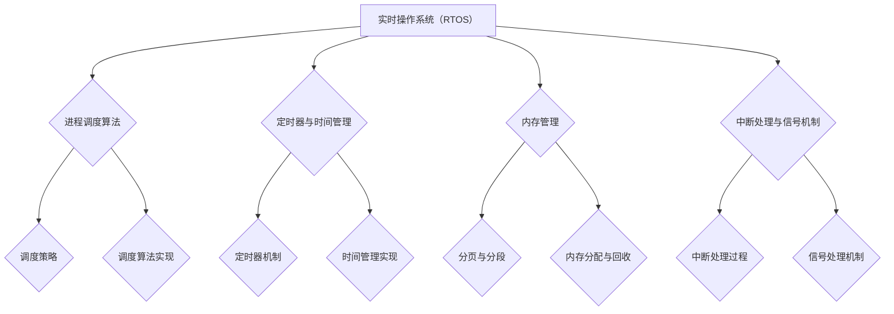

                 

# 实时操作系统（RTOS）：时间关键型应用开发

> **关键词：** 实时操作系统（RTOS）、进程调度、内存管理、中断处理、任务调度、时间管理、性能优化、开发环境、项目实战

> **摘要：** 本文将深入探讨实时操作系统（RTOS）的概念、原理、架构和核心算法，包括进程调度、内存管理、中断处理等。同时，本文将通过项目实战，详细解析实时操作系统的开发环境搭建和代码实现，以帮助读者更好地理解RTOS的实战应用。最后，本文还将展望RTOS的发展趋势和面临的挑战。

## 第一部分：实时操作系统（RTOS）概述

### 第1章：实时操作系统的基本概念

#### 1.1 实时操作系统的定义与分类

实时操作系统（RTOS）是一种专门为实时任务处理设计的操作系统。实时操作系统的主要特点是能够对任务的执行时间进行严格的保证，以满足系统对实时性的需求。

**实时操作系统的分类：**

1. **硬实时系统（Hard Real-Time System）**：硬实时系统要求系统必须在规定的时间内完成任务，否则系统将无法正常运行。例如，飞机控制系统、医疗设备等。

2. **软实时系统（Soft Real-Time System）**：软实时系统允许任务的执行时间有一定的延迟，但必须在可接受的时间范围内。例如，多媒体播放、自动驾驶等。

**实时操作系统的特点：**

1. **实时性要求**：RTOS必须能够对任务的执行时间进行精确控制，以满足系统对实时性的需求。

2. **可靠性要求**：RTOS需要在各种复杂环境下保持稳定运行，确保系统的可靠性。

3. **性能需求**：RTOS需要高效地处理大量任务，同时保证系统资源的合理分配。

4. **安全性需求**：RTOS需要在确保实时性的同时，确保系统的安全性，防止恶意攻击和数据泄露。

#### 1.2 实时系统的需求与挑战

**实时性要求：** 实时操作系统必须能够保证任务在规定的时间内完成，否则可能导致系统崩溃或性能下降。

**可靠性要求：** 实时操作系统需要在各种复杂环境下保持稳定运行，确保系统的可靠性。

**性能需求：** 实时操作系统需要高效地处理大量任务，同时保证系统资源的合理分配。

**安全性需求：** 实时操作系统需要在确保实时性的同时，确保系统的安全性，防止恶意攻击和数据泄露。

#### 1.3 实时操作系统的架构

**硬件架构：** 实时操作系统的硬件架构包括CPU、内存、I/O设备等。硬件资源的选择和配置直接影响RTOS的性能和实时性。

**软件架构：** 实时操作系统的软件架构包括内核、设备驱动程序、文件系统等。内核是RTOS的核心，负责任务调度、内存管理、中断处理等。

**时间管理机制：** 实时操作系统通过时间管理机制来保证任务的实时性。时间管理机制包括定时器、时钟、调度算法等。

### 第2章：实时操作系统核心原理

#### 2.1 进程调度算法

进程调度算法是实时操作系统中的一个核心部分，它决定了系统在何时以及如何执行任务。以下是几种常见的进程调度算法：

**先进先出（FIFO）调度算法：** FIFO调度算法按照任务到达的顺序进行调度。优点是简单易懂，缺点是可能导致高优先级任务长时间得不到执行。

伪代码：

```c
function FIFO(schedulers, tasks) {
    while (!all_tasks_completed(tasks)) {
        for (each task in tasks) {
            if (task.is_ready()) {
                schedule(task);
            }
        }
    }
}
```

**最短作业优先（SJF）调度算法：** SJF调度算法选择执行时间最短的作业进行调度。优点是能够缩短平均等待时间，缺点是可能导致长作业无法及时执行。

伪代码：

```c
function SJF(schedulers, tasks) {
    while (!all_tasks_completed(tasks)) {
        shortest_task = find_shortest_task(tasks);
        schedule(shortest_task);
    }
}
```

**优先级调度算法：** 优先级调度算法根据任务的优先级进行调度。优先级高的任务优先执行。优点是能够保证高优先级任务的及时执行，缺点是可能导致低优先级任务长时间得不到执行。

伪代码：

```c
function Priority(schedulers, tasks) {
    while (!all_tasks_completed(tasks)) {
        highest_priority_task = find_highest_priority_task(tasks);
        schedule(highest_priority_task);
    }
}
```

**多级反馈队列调度算法：** 多级反馈队列调度算法将任务分为多个优先级队列，每个队列有不同的时间片。高优先级队列的时间片较短，低优先级队列的时间片较长。优点是能够平衡高优先级任务和低优先级任务的执行，缺点是队列管理复杂。

伪代码：

```c
function MultiLevelQueue(schedulers, tasks) {
    while (!all_tasks_completed(tasks)) {
        for (each queue in queues) {
            if (!queue.is_empty()) {
                highest_priority_task = queue.dequeue();
                schedule(highest_priority_task);
            }
        }
    }
}
```

#### 2.2 定时器与时间管理

定时器是实时操作系统中的一个重要组成部分，用于实现时间管理和任务调度。定时器的基本原理是每隔一定时间产生一个中断，操作系统通过处理这个中断来更新系统时间，调度下一个任务。

**定时器机制：** 定时器机制包括硬件定时器和软件定时器。硬件定时器是由硬件时钟驱动的，软件定时器是由操作系统软件实现的。

**实时时钟：** 实时时钟是实时操作系统中用来记录时间的核心组件。它能够提供高精度的时间戳，用于任务调度、时间计算等。

**时间片轮转调度：** 时间片轮转调度是一种常见的调度策略，它将CPU时间划分为多个时间片，每个任务轮流占用一个时间片。优点是公平性高，缺点是可能导致高优先级任务无法及时执行。

伪代码：

```c
function RoundRobin(schedulers, tasks, time_slice) {
    while (!all_tasks_completed(tasks)) {
        for (each task in tasks) {
            if (task.is_ready()) {
                schedule(task, time_slice);
            }
        }
    }
}
```

#### 2.3 中断处理与信号机制

中断处理是实时操作系统中另一个核心部分，它负责处理来自硬件设备的中断请求。中断处理的基本原理是当硬件设备发生中断时，操作系统会暂停当前任务的执行，处理中断请求，然后再继续执行原来的任务。

**中断处理过程：** 中断处理过程包括中断检测、中断响应、中断处理和中断返回。

**中断优先级：** 中断优先级决定了中断处理顺序。高优先级中断先于低优先级中断处理。

**信号与信号处理机制：** 信号是实时操作系统中用来通知任务的异步消息。信号处理机制包括信号发送、信号接收和信号处理。

伪代码：

```c
function InterruptHandler(interrupt) {
    save_context();
    handle_interrupt(interrupt);
    restore_context();
}
```

#### 2.4 内存管理

内存管理是实时操作系统中另一个重要组成部分，它负责分配和管理系统内存。内存管理的基本原理是根据任务的内存需求，动态分配和回收内存。

**分页与分段机制：** 分页是将内存划分为固定大小的块，分段是将内存划分为大小不等的块。分页和分段机制可以提高内存利用率，减少内存碎片。

**页面置换算法：** 页面置换算法用于在内存不足时选择哪些页面进行替换。常见的页面置换算法有先进先出（FIFO）、最近最少使用（LRU）等。

**内存分配与回收：** 内存分配是将内存分配给任务，内存回收是将不再使用的内存归还给系统。

伪代码：

```c
function MemoryAllocation(memory, task) {
    if (enough_memory(memory, task)) {
        allocate_memory(memory, task);
    } else {
        page_replacement(memory);
    }
}

function MemoryDeallocation(memory, task) {
    deallocate_memory(memory, task);
}
```

### 第3章：实时操作系统内核组件

#### 3.1 任务调度器

任务调度器是实时操作系统的核心组件之一，它负责对任务进行调度和管理。任务调度器的主要功能包括：

- 任务创建和管理
- 任务调度和执行
- 任务状态转换

**任务调度器的作用：** 任务调度器负责根据调度算法选择下一个任务进行执行。任务调度器通过调度策略和调度算法，实现任务的公平调度和高效执行。

**调度算法实现：** 调度算法实现是根据任务的不同特征，选择合适的调度算法。常见的调度算法有先进先出（FIFO）、最短作业优先（SJF）、优先级调度等。

**调度策略与优化：** 调度策略是指任务调度器在调度过程中采取的策略。调度策略的优化可以减少任务执行时间，提高系统性能。

#### 3.2 异步事件处理

异步事件处理是实时操作系统中处理异步事件的一种机制。异步事件处理的主要功能包括：

- 事件队列管理
- 事件驱动模型
- 异步事件处理

**事件队列：** 事件队列是存储异步事件的队列。事件队列管理负责维护事件队列的状态和顺序。

**事件驱动模型：** 事件驱动模型是一种基于事件驱动的编程模型。在事件驱动模型中，程序不是顺序执行的，而是根据事件的触发来执行相应的操作。

**异步事件处理机制：** 异步事件处理机制负责处理异步事件。异步事件处理机制包括事件检测、事件处理和事件调度。

#### 3.3 内存分配与管理

内存分配与管理是实时操作系统中的另一个重要组成部分，它负责动态分配和回收内存。内存分配与管理的主要功能包括：

- 内存池管理
- 动态内存分配
- 内存回收

**内存池：** 内存池是一种预先分配的内存区域，用于存储任务的数据结构。内存池管理负责维护内存池的状态和分配策略。

**动态内存分配：** 动态内存分配是在程序运行过程中根据任务的需求动态分配内存。动态内存分配可以通过系统调用或内存池管理来实现。

**内存回收：** 内存回收是将不再使用的内存归还给系统。内存回收可以通过内存池回收或系统内存回收来实现。

#### 3.4 系统调用与接口

系统调用是实时操作系统提供的一种接口，用于应用程序与操作系统之间的交互。系统调用的主要功能包括：

- 系统调用机制
- 系统调用接口
- 系统调用实现

**系统调用机制：** 系统调用机制是一种通过中断或异常机制来调用操作系统服务的机制。系统调用机制负责将应用程序的请求传递给操作系统内核。

**系统调用接口：** 系统调用接口是应用程序访问操作系统服务的接口。系统调用接口定义了系统调用函数的名称、参数和返回值。

**系统调用实现：** 系统调用实现是操作系统内核中实现系统调用的代码。系统调用实现负责处理系统调用的请求，并返回结果。

### 第4章：实时操作系统设计原则与最佳实践

#### 4.1 设计原则

实时操作系统的设计原则是确保系统在实时性、可靠性、性能和安全性方面的最佳表现。以下是实时操作系统设计的主要原则：

**简洁性：** 实时操作系统的设计应该尽可能简洁，以减少错误和提高可维护性。

**模块化：** 实时操作系统的设计应该采用模块化方法，将系统功能划分为独立的模块，以提高系统的可扩展性和可维护性。

**可扩展性：** 实时操作系统的设计应该具有可扩展性，以便在系统需求发生变化时进行扩展。

**可维护性：** 实时操作系统的设计应该易于维护，以便在系统出现问题时快速修复。

**实时性保障：** 实时操作系统的设计应该确保任务能够在规定的时间内完成，以满足实时性要求。

**可靠性保障：** 实时操作系统的设计应该能够在各种复杂环境下保持稳定运行，以确保系统的可靠性。

**安全性保障：** 实时操作系统的设计应该确保系统的安全性，防止恶意攻击和数据泄露。

#### 4.2 编码规范与风格

编码规范和风格是实时操作系统开发中的重要环节，它有助于提高代码的可读性、可维护性和可扩展性。以下是实时操作系统编码的主要规范和风格：

**代码规范：** 编写代码时应该遵循统一的代码规范，包括命名规则、缩进规则、注释规则等。

**代码风格：** 编写代码时应该保持代码风格的简洁和一致性，避免使用复杂的语法和结构。

**注释规则：** 在代码中添加注释，以便其他开发者能够理解代码的功能和意图。

**代码复用：** 避免重复编写相同或相似的代码，尽量使用函数、类等机制进行代码复用。

**代码调试：** 在编写代码时，应使用调试工具对代码进行调试，以确保代码的正确性。

**代码测试：** 在编写代码后，应使用测试工具对代码进行测试，以确保代码的稳定性和性能。

#### 4.3 测试与调试

测试与调试是实时操作系统开发过程中的重要环节，它有助于发现和修复系统中的错误和缺陷。以下是实时操作系统测试和调试的主要方法：

**单元测试：** 单元测试是对系统中的单个模块或函数进行测试，以确保它们能够按预期工作。

**集成测试：** 集成测试是对系统中的多个模块进行测试，以确保它们之间的交互正确。

**性能测试：** 性能测试是对系统的响应时间、吞吐量等进行测试，以确保系统在负载下的性能。

**压力测试：** 压力测试是对系统的极限性能进行测试，以确保系统在极端情况下的稳定性。

**调试技巧：** 调试技巧包括使用调试工具、跟踪日志、代码调试等，以帮助开发者发现和修复系统中的错误。

#### 4.4 性能优化

性能优化是实时操作系统开发中的关键环节，它有助于提高系统的性能和实时性。以下是实时操作系统性能优化的一些方法：

**算法优化：** 优化系统中的算法，以减少任务执行时间和资源消耗。

**内存优化：** 优化内存分配和回收策略，减少内存碎片和内存浪费。

**硬件优化：** 优化硬件配置，提高CPU、内存、I/O设备的性能。

**系统级优化：** 优化系统架构和调度策略，提高系统的整体性能和实时性。

**负载均衡：** 在多处理器系统中，实现负载均衡，确保任务均匀分配到各个处理器上。

### 第二部分：实时操作系统开发与应用

#### 第5章：实时操作系统开发环境搭建

实时操作系统的开发环境搭建是进行RTOS开发的第一步，它涉及到开发工具的选择、编译器的配置以及开发环境的配置。

##### 5.1 开发工具与编译器选择

**开发工具：** 
开发实时操作系统时，常用的集成开发环境（IDE）包括Eclipse、Visual Studio、IAR Embedded Workbench等。这些IDE提供了代码编辑、编译、调试等功能，方便开发者进行开发。

**编译器：** 
实时操作系统的开发需要使用编译器将源代码转换为可执行程序。常见的编译器有GCC（GNU Compiler Collection）、Clang、ARM Compiler等。GCC是一个免费、开源的编译器，广泛应用于嵌入式系统的开发。

##### 5.2 操作系统开发环境搭建

**系统环境配置：** 
在开发RTOS之前，需要配置开发环境。例如，在Linux系统中，需要安装必要的开发工具和库，如GCC、GDB（GNU Debugger）等。

**跨平台开发：** 
实时操作系统的开发常常需要在不同的硬件平台上进行，因此需要支持跨平台开发。可以使用交叉编译工具链（Cross-Compiler Toolchain）在不同的硬件平台上编译代码。

**系统编译与调试：** 
使用编译器将RTOS的源代码编译为可执行程序，并使用调试工具进行调试。调试过程中可以设置断点、单步执行、查看变量值等，以便发现和修复代码中的错误。

##### 5.3 硬件平台选择与配置

**硬件平台概述：** 
选择合适的硬件平台是RTOS开发的重要一环。常见的硬件平台包括ARM Cortex-M系列、STM32、MIPS等。这些平台具有不同的性能、功耗和成本特点，需要根据具体应用需求进行选择。

**硬件配置：** 
根据RTOS的需求，配置硬件资源，如内存、存储、I/O接口等。例如，在ARM Cortex-M3平台上，需要配置合适的内存映射、中断控制器等。

**硬件驱动开发：** 
实时操作系统的硬件驱动负责与硬件设备进行通信。开发硬件驱动需要了解硬件设备的特性和通信协议。例如，开发一个UART（串口）驱动，需要了解UART的工作原理和通信协议。

#### 第6章：实时操作系统核心算法实现

实时操作系统的核心算法是实现系统功能的关键，包括进程调度、内存管理、中断处理等。以下是这些核心算法的实现方法和原理。

##### 6.1 进程调度算法实现

进程调度算法负责管理任务的执行顺序。以下是几种常见的进程调度算法的实现：

**FIFO调度算法：**
```c
void schedule() {
    while (!task_queue.empty()) {
        Task *task = task_queue.dequeue();
        execute_task(task);
    }
}
```

**SJF调度算法：**
```c
void schedule() {
    Task *shortest_task = find_shortest_task();
    execute_task(shortest_task);
}
```

**优先级调度算法：**
```c
void schedule() {
    Task *highest_priority_task = find_highest_priority_task();
    execute_task(highest_priority_task);
}
```

**多级反馈队列调度算法：**
```c
void schedule() {
    for (int i = 0; i < num_queues; i++) {
        if (!queue[i].empty()) {
            Task *task = queue[i].dequeue();
            execute_task(task);
        }
    }
}
```

##### 6.2 定时器与时间管理实现

定时器是实时操作系统中的关键组件，用于实现时间管理和任务调度。以下是定时器与时间管理的实现：

**定时器机制：**
```c
void timer_handler() {
    if (timer_expired()) {
        trigger_timer_event();
    }
}
```

**实时时钟：**
```c
void update_clock() {
    current_time++;
}
```

**时间片轮转调度：**
```c
void schedule() {
    Task *task = get_next_task();
    execute_task(task, time_slice);
}
```

##### 6.3 中断处理与信号机制实现

中断处理是实时操作系统中的重要机制，用于响应硬件设备的事件。以下是中断处理与信号机制的实现：

**中断处理过程：**
```c
void interrupt_handler() {
    save_context();
    handle_interrupt();
    restore_context();
}
```

**中断优先级：**
```c
void set_interrupt_priority(int interrupt, int priority) {
    interrupt_priority[interrupt] = priority;
}
```

**信号与信号处理机制：**
```c
void send_signal(int signal) {
    signal_queue.enqueue(signal);
}

void signal_handler(int signal) {
    handle_signal(signal);
}
```

##### 6.4 内存管理实现

内存管理是实时操作系统中的重要功能，负责动态分配和回收内存。以下是内存管理的实现：

**分页与分段机制：**
```c
void memory_allocate(size_t size) {
    Page *page = find_free_page();
    if (page != NULL) {
        allocate_memory(page, size);
    }
}

void memory_deallocate(size_t size) {
    Page *page = find_allocated_page();
    if (page != NULL) {
        deallocate_memory(page, size);
    }
}
```

**页面置换算法：**
```c
void page_replacement() {
    Page *victim_page = find_victim_page();
    if (victim_page != NULL) {
        evict_page(victim_page);
    }
}
```

**内存分配与回收：**
```c
void memory_allocate(size_t size) {
    if (enough_memory(size)) {
        allocate_memory(size);
    } else {
        page_replacement();
    }
}

void memory_deallocate(size_t size) {
    free_memory(size);
}
```

#### 第7章：实时操作系统项目实战

实时操作系统的项目实战是理解RTOS原理和实现的关键。在本节中，我们将通过一个简单的实时操作系统项目，详细介绍开发环境搭建、代码实现和代码解读。

##### 7.1 项目背景与目标

项目背景：设计并实现一个简单的实时操作系统，用于管理嵌入式设备的任务调度和资源分配。

项目目标：
1. 实现任务调度功能，支持任务的创建、删除和切换。
2. 实现内存管理功能，支持内存的动态分配和回收。
3. 实现中断处理功能，支持硬件设备的事件响应。
4. 实现时间管理功能，支持定时器的设置和任务的定时执行。

##### 7.2 项目开发环境搭建

**开发工具与编译器选择：**
- 开发工具：Eclipse IDE
- 编译器：GCC

**操作系统开发环境搭建：**
1. 安装Eclipse IDE，并配置C/C++开发插件。
2. 安装GCC编译器，并配置交叉编译工具链。
3. 配置Eclipse的GCC编译器设置，包括交叉编译器路径、库文件路径等。

**硬件平台选择与配置：**
- 硬件平台：ARM Cortex-M3 微控制器
- 硬件配置：根据硬件平台的特点，配置相应的硬件资源，如内存、时钟等。

**硬件驱动开发：**
1. 根据硬件平台的文档，编写硬件驱动程序，包括中断控制器、时钟控制器等。
2. 配置硬件驱动程序的初始化和中断处理函数。

##### 7.3 代码实现与解读

**任务调度器实现：**
```c
// 任务结构体
typedef struct {
    uint32_t id;
    uint8_t priority;
    uint8_t state;
    void (*function)();
} Task;

// 任务队列
typedef struct {
    Task tasks[MAX_TASKS];
    uint8_t size;
} TaskQueue;

// 初始化任务队列
void init_task_queue(TaskQueue *queue) {
    queue->size = 0;
}

// 创建任务
void create_task(Task *task, uint8_t priority, void (*function)()) {
    task->id = generate_task_id();
    task->priority = priority;
    task->state = TASK_READY;
    task->function = function;
    enqueue_task(&task_queue, task);
}

// 任务调度
void schedule() {
    while (!task_queue.empty()) {
        Task *task = dequeue_task(&task_queue);
        if (task->state == TASK_READY) {
            execute_task(task);
        }
    }
}

// 执行任务
void execute_task(Task *task) {
    task->state = TASK_RUNNING;
    task->function();
    task->state = TASK_READY;
}
```

**内存管理实现：**
```c
// 内存结构体
typedef struct {
    uint8_t *base_address;
    uint32_t size;
    uint8_t state;
} MemoryBlock;

// 初始化内存
void init_memory() {
    memory_block[0].base_address = (uint8_t *)0x20000000;
    memory_block[0].size = 0x1000;
    memory_block[0].state = MEMORY_FREE;
}

// 内存分配
void *malloc(uint32_t size) {
    for (int i = 0; i < MAX_MEMORY_BLOCKS; i++) {
        if (memory_block[i].state == MEMORY_FREE && memory_block[i].size >= size) {
            memory_block[i].state = MEMORY_ALLOCATED;
            return (void *)((uint8_t *)memory_block[i].base_address + memory_block[i].size - size);
        }
    }
    return NULL;
}

// 内存回收
void free(void *ptr) {
    uint8_t *address = (uint8_t *)((uint32_t)ptr - (uint32_t)memory_block[i].base_address);
    memory_block[i].state = MEMORY_FREE;
}
```

**中断处理与信号机制实现：**
```c
// 中断处理函数
void interrupt_handler() {
    save_context();
    handle_interrupt();
    restore_context();
}

// 中断处理函数示例
void UART0_Handler() {
    if (UART0_SR & (1 << 7)) {
        uint8_t data = UART0_DR;
        handle_UART0_dataReceived(data);
    }
}

// 信号处理函数
void signal_handler(int signal) {
    switch (signal) {
        case SIGNAL_DATA_RECEIVED:
            handle_data_received();
            break;
        case SIGNAL_DATA_SENT:
            handle_data_sent();
            break;
    }
}
```

**时间管理实现：**
```c
// 定时器结构体
typedef struct {
    uint32_t tick;
    void (*function)();
} Timer;

// 初始化定时器
void init_timer(Timer *timer, uint32_t tick, void (*function)()) {
    timer->tick = tick;
    timer->function = function;
}

// 定时器触发函数
void timer_trigger() {
    if (current_tick == timer->tick) {
        timer->function();
        current_tick = 0;
    }
}
```

**任务调度器实现示例：**
```c
void schedule() {
    while (!task_queue.empty()) {
        Task *task = dequeue_task(&task_queue);
        if (task->state == TASK_READY) {
            execute_task(task);
        }
    }
}
```

**内存管理实现示例：**
```c
void *malloc(uint32_t size) {
    for (int i = 0; i < MAX_MEMORY_BLOCKS; i++) {
        if (memory_block[i].state == MEMORY_FREE && memory_block[i].size >= size) {
            memory_block[i].state = MEMORY_ALLOCATED;
            return (void *)((uint8_t *)memory_block[i].base_address + memory_block[i].size - size);
        }
    }
    return NULL;
}

void free(void *ptr) {
    uint8_t *address = (uint8_t *)((uint32_t)ptr - (uint32_t)memory_block[i].base_address);
    memory_block[i].state = MEMORY_FREE;
}
```

**中断处理与信号机制实现示例：**
```c
void interrupt_handler() {
    save_context();
    handle_interrupt();
    restore_context();
}

void UART0_Handler() {
    if (UART0_SR & (1 << 7)) {
        uint8_t data = UART0_DR;
        handle_UART0_dataReceived(data);
    }
}

void signal_handler(int signal) {
    switch (signal) {
        case SIGNAL_DATA_RECEIVED:
            handle_data_received();
            break;
        case SIGNAL_DATA_SENT:
            handle_data_sent();
            break;
    }
}
```

**时间管理实现示例：**
```c
void timer_trigger() {
    if (current_tick == timer->tick) {
        timer->function();
        current_tick = 0;
    }
}
```

##### 7.4 项目测试与优化

**单元测试：** 单元测试是对系统中的单个模块或函数进行测试，以确保它们能够按预期工作。例如，测试任务调度器的任务创建、任务切换等功能。

**集成测试：** 集成测试是对系统中的多个模块进行测试，以确保它们之间的交互正确。例如，测试内存管理模块与任务调度器的交互。

**性能测试：** 性能测试是对系统的响应时间、吞吐量等进行测试，以确保系统在负载下的性能。例如，测试系统在高负载下的响应速度和资源利用率。

**压力测试：** 压力测试是对系统的极限性能进行测试，以确保系统在极端情况下的稳定性。例如，测试系统在最大负载下的响应时间和崩溃情况。

**优化措施：**
1. 调整任务调度算法，减少任务切换时间和上下文切换开销。
2. 优化内存管理算法，减少内存碎片和浪费。
3. 优化中断处理机制，减少中断响应时间。
4. 优化时间管理机制，提高定时器的精度和响应速度。

### 第8章：实时操作系统发展趋势与展望

实时操作系统（RTOS）作为嵌入式系统和实时应用的核心，其发展趋势和展望具有重要意义。以下是对RTOS发展趋势、面临的挑战以及未来展望的讨论。

#### 实时操作系统发展趋势

1. **高性能硬件的支持**：随着处理器性能的不断提升，RTOS可以更好地支持复杂的应用场景和任务调度。新型处理器架构、多核处理、硬件加速技术等将为RTOS提供更强的计算能力。

2. **软硬件协同优化**：RTOS的实时性不仅依赖于软件算法的优化，还需要硬件的支持。通过软硬件协同优化，可以进一步提升RTOS的性能和实时性。

3. **虚拟化技术的应用**：虚拟化技术使得RTOS可以在同一硬件平台上运行多个操作系统实例，提高资源利用率和系统可靠性。未来，虚拟化技术将在RTOS中发挥更大的作用。

4. **网络实时性的提升**：随着物联网（IoT）和边缘计算的发展，RTOS需要具备更强的网络实时性。通过优化网络协议栈和调度策略，RTOS可以实现更快的网络通信和响应。

5. **智能化实时调度算法**：随着人工智能技术的发展，RTOS可以引入智能调度算法，根据任务负载和资源状况动态调整调度策略，提高系统的自适应能力和效率。

6. **面向云计算的实时操作系统**：云计算为RTOS提供了新的应用场景，如云端任务调度、分布式实时计算等。未来，RTOS将更多地与云计算平台相结合，提供更强大的实时计算能力。

#### 实时操作系统面临的挑战

1. **硬件限制**：RTOS通常运行在资源受限的嵌入式设备上，硬件性能和资源限制了RTOS的扩展性和性能提升。

2. **软件复杂性**：随着RTOS功能的不断增加，软件复杂性也随之增加。复杂的软件架构和代码库使得RTOS的维护和调试变得更加困难。

3. **实时性与可靠性的平衡**：RTOS需要在实时性和可靠性之间进行平衡。提高实时性可能会降低系统的可靠性，反之亦然。如何在两者之间找到最佳平衡点是一个重要挑战。

4. **新兴技术的适应能力**：随着新技术（如物联网、5G、人工智能等）的不断涌现，RTOS需要具备快速适应和集成新兴技术的能力，以满足不断变化的应用需求。

#### 实时操作系统未来展望

1. **新特性**：未来RTOS将引入更多新特性，如支持多核处理、实时容器技术、自动化任务调度等，以提高系统的性能和实时性。

2. **潜在应用领域**：RTOS将在更多领域得到应用，如工业自动化、自动驾驶、医疗设备、智能家居等。随着物联网和边缘计算的发展，RTOS的市场需求将不断增长。

3. **技术突破方向**：在未来，RTOS的技术突破方向包括：
   - 高性能实时调度算法的研究与实现。
   - 软硬件协同优化技术的研究与开发。
   - 实时系统安全性和可靠性的提升。
   - 面向云端的实时操作系统架构设计。

### 附录：实时操作系统开发资源与工具

#### 附录A：实时操作系统开发资源与工具

**A.1 开发工具与资源介绍**

- **开发工具：**
  - Eclipse IDE：一个功能强大的集成开发环境，支持多种编程语言和平台。
  - Visual Studio：微软推出的集成开发环境，适用于Windows平台。
  - IAR Embedded Workbench：一款专业的嵌入式开发工具，适用于ARM架构。

- **资源库：**
  - RT-Thread：一个开源的实时操作系统，支持多种硬件平台和架构。
  - FreeRTOS：一个开源的实时操作系统，广泛用于嵌入式系统。
  - Linux kernel：开源的操作系统内核，支持实时扩展。

- **在线社区：**
  - RTOS Wiki：一个实时操作系统社区，提供RTOS相关的文档和资源。
  - RTOS Forum：一个实时操作系统论坛，供开发者交流和分享经验。
  - 开发者社区：如ARM Developer Community，提供RTOS相关的技术支持和资源。

**A.2 实时操作系统开源项目介绍**

- **开源RTOS项目概览：**
  - RT-Thread：一个轻量级的开源实时操作系统，支持多种硬件平台，具有模块化设计。
  - FreeRTOS：一个开源的实时操作系统，适用于嵌入式系统，具有高度可定制性。
  - MutekH：一个开源的实时操作系统，支持多核处理器，具有高性能和高可靠性。

- **项目优势与特点：**
  - **RT-Thread：** 支持多种硬件平台，具有模块化设计，易于扩展。
  - **FreeRTOS：** 代码简洁，易于理解，广泛用于嵌入式系统。
  - **MutekH：** 支持多核处理器，具有高性能和高可靠性。

- **项目应用场景：**
  - **RT-Thread：** 广泛应用于物联网、智能家居、工业自动化等领域。
  - **FreeRTOS：** 广泛用于嵌入式系统，如汽车电子、医疗设备等。
  - **MutekH：** 适用于高性能嵌入式系统，如无人机、工业控制系统等。

**A.3 实时操作系统学习与培训资源**

- **教材与书籍：**
  - 《实时操作系统设计与实现》：详细介绍了RTOS的基本概念、原理和实现。
  - 《嵌入式系统设计》：涵盖了RTOS在嵌入式系统中的应用和设计。
  - 《实时操作系统原理与应用》：深入探讨了RTOS的内部工作机制和应用场景。

- **在线课程：**
  - Coursera：提供RTOS相关的在线课程，如《嵌入式实时操作系统设计》等。
  - edX：提供RTOS相关的在线课程，如《实时操作系统原理》等。
  - Udacity：提供RTOS相关的在线课程，如《嵌入式系统开发》等。

- **学术会议与研讨会：**
  - 国际实时系统会议（RTSS）：一个专注于实时系统领域的学术会议。
  - 嵌入式系统与实时技术研讨会：一个提供RTOS相关技术研讨的学术会议。
  - RTOS Workshop：一个针对RTOS技术和应用的研讨会，提供最新的研究成果和经验分享。

### 实时操作系统（RTOS）核心概念与联系

#### 实时操作系统（RTOS）架构图



#### 实时操作系统（RTOS）核心算法原理讲解

**进程调度算法伪代码**

```c
function schedule(processes) {
    while (!all_processes_finished(processes)) {
        for (each process in processes) {
            if (process.is_ready()) {
                if (process.has_highest_priority()) {
                    run(process);
                } else {
                    queue(process);
                }
            }
        }
        if (queue.is_not_empty()) {
            run(highest_priority_process_in_queue());
        }
    }
}
```

**定时器与时间管理算法伪代码**

```c
function timer_manage() {
    while (true) {
        check_for_timer_events();
        if (timer_expired()) {
            trigger_timer_event();
        }
        sleep_until_next_timer_event();
    }
}
```

**中断处理与信号机制算法伪代码**

```c
function interrupt_handler(interrupt) {
    save_context();
    handle_interrupt(interrupt);
    restore_context();
}
```

**数学模型与公式讲解**

**时间管理中的周期性调度问题**

$$ T_c = \frac{1}{f_s} $$

其中，$ T_c $ 是周期时间，$ f_s $ 是时钟频率。

### 实时操作系统（RTOS）项目实战

#### 项目背景与目标

本项目旨在开发一个简单的实时操作系统，用于管理嵌入式设备的任务调度和资源分配。项目目标包括：

1. 实现任务调度功能，支持任务的创建、删除和切换。
2. 实现内存管理功能，支持内存的动态分配和回收。
3. 实现中断处理功能，支持硬件设备的事件响应。
4. 实现时间管理功能，支持定时器的设置和任务的定时执行。

#### 项目开发环境搭建

**开发工具与编译器选择**

- **开发工具**：使用Eclipse IDE作为集成开发环境。
- **编译器**：使用GCC编译器进行代码编译。

**操作系统开发环境搭建**

1. 安装Eclipse IDE，并配置C/C++开发插件。
2. 安装GCC编译器，并配置交叉编译工具链。
3. 配置Eclipse的GCC编译器设置，包括交叉编译器路径、库文件路径等。

**硬件平台选择与配置**

- **硬件平台**：选择基于ARM Cortex-M3的微控制器作为硬件平台。
- **硬件配置**：配置内存、存储、I/O接口等硬件资源，确保硬件平台能够满足RTOS的需求。

**硬件驱动开发**

1. 根据硬件平台的文档，编写硬件驱动程序，包括中断控制器、时钟控制器等。
2. 配置硬件驱动程序的初始化和中断处理函数。

#### 代码实现与解读

**任务调度器实现**

```c
// 任务结构体
typedef struct {
    uint32_t id;
    uint8_t priority;
    uint8_t state;
    void (*function)();
} Task;

// 任务队列
typedef struct {
    Task tasks[MAX_TASKS];
    uint8_t size;
} TaskQueue;

// 初始化任务队列
void init_task_queue(TaskQueue *queue) {
    queue->size = 0;
}

// 创建任务
void create_task(Task *task, uint8_t priority, void (*function)()) {
    task->id = generate_task_id();
    task->priority = priority;
    task->state = TASK_READY;
    task->function = function;
    enqueue_task(&task_queue, task);
}

// 任务调度
void schedule() {
    while (!task_queue.empty()) {
        Task *task = dequeue_task(&task_queue);
        if (task->state == TASK_READY) {
            execute_task(task);
        }
    }
}

// 执行任务
void execute_task(Task *task) {
    task->state = TASK_RUNNING;
    task->function();
    task->state = TASK_READY;
}
```

**内存管理实现**

```c
// 内存结构体
typedef struct {
    uint8_t *base_address;
    uint32_t size;
    uint8_t state;
} MemoryBlock;

// 初始化内存
void init_memory() {
    memory_block[0].base_address = (uint8_t *)0x20000000;
    memory_block[0].size = 0x1000;
    memory_block[0].state = MEMORY_FREE;
}

// 内存分配
void *malloc(uint32_t size) {
    for (int i = 0; i < MAX_MEMORY_BLOCKS; i++) {
        if (memory_block[i].state == MEMORY_FREE && memory_block[i].size >= size) {
            memory_block[i].state = MEMORY_ALLOCATED;
            return (void *)((uint8_t *)memory_block[i].base_address + memory_block[i].size - size);
        }
    }
    return NULL;
}

// 内存回收
void free(void *ptr) {
    uint8_t *address = (uint8_t *)((uint32_t)ptr - (uint32_t)memory_block[i].base_address);
    memory_block[i].state = MEMORY_FREE;
}
```

**中断处理与信号机制实现**

```c
// 中断处理函数
void interrupt_handler() {
    save_context();
    handle_interrupt();
    restore_context();
}

// 中断处理函数示例
void UART0_Handler() {
    if (UART0_SR & (1 << 7)) {
        uint8_t data = UART0_DR;
        handle_UART0_dataReceived(data);
    }
}

// 信号处理函数
void signal_handler(int signal) {
    switch (signal) {
        case SIGNAL_DATA_RECEIVED:
            handle_data_received();
            break;
        case SIGNAL_DATA_SENT:
            handle_data_sent();
            break;
    }
}
```

**时间管理实现**

```c
// 定时器结构体
typedef struct {
    uint32_t tick;
    void (*function)();
} Timer;

// 初始化定时器
void init_timer(Timer *timer, uint32_t tick, void (*function)()) {
    timer->tick = tick;
    timer->function = function;
}

// 定时器触发函数
void timer_trigger() {
    if (current_tick == timer->tick) {
        timer->function();
        current_tick = 0;
    }
}
```

**任务调度器实现示例**

```c
void schedule() {
    while (!task_queue.empty()) {
        Task *task = dequeue_task(&task_queue);
        if (task->state == TASK_READY) {
            execute_task(task);
        }
    }
}
```

**内存管理实现示例**

```c
void *malloc(uint32_t size) {
    for (int i = 0; i < MAX_MEMORY_BLOCKS; i++) {
        if (memory_block[i].state == MEMORY_FREE && memory_block[i].size >= size) {
            memory_block[i].state = MEMORY_ALLOCATED;
            return (void *)((uint8_t *)memory_block[i].base_address + memory_block[i].size - size);
        }
    }
    return NULL;
}

void free(void *ptr) {
    uint8_t *address = (uint8_t *)((uint32_t)ptr - (uint32_t)memory_block[i].base_address);
    memory_block[i].state = MEMORY_FREE;
}
```

**中断处理与信号机制实现示例**

```c
void interrupt_handler() {
    save_context();
    handle_interrupt();
    restore_context();
}

void UART0_Handler() {
    if (UART0_SR & (1 << 7)) {
        uint8_t data = UART0_DR;
        handle_UART0_dataReceived(data);
    }
}

void signal_handler(int signal) {
    switch (signal) {
        case SIGNAL_DATA_RECEIVED:
            handle_data_received();
            break;
        case SIGNAL_DATA_SENT:
            handle_data_sent();
            break;
    }
}
```

**时间管理实现示例**

```c
void timer_trigger() {
    if (current_tick == timer->tick) {
        timer->function();
        current_tick = 0;
    }
}
```

#### 项目测试与优化

**单元测试**：对RTOS中的各个模块进行单元测试，确保它们按预期工作。

**集成测试**：对RTOS的各个模块进行集成测试，确保模块之间的交互正确。

**性能测试**：对RTOS的性能进行测试，包括响应时间、吞吐量等指标。

**压力测试**：对RTOS进行压力测试，以评估其在高负载下的性能和稳定性。

**优化措施**：

1. 调整任务调度算法，以提高任务的响应速度。
2. 优化内存管理算法，减少内存碎片和浪费。
3. 优化中断处理机制，减少中断响应时间。
4. 优化时间管理机制，提高定时器的精度和响应速度。

### 实时操作系统（RTOS）发展趋势与展望

#### 实时操作系统发展趋势

1. **高性能硬件的支持**：随着处理器性能的不断提升，RTOS可以更好地支持复杂的应用场景和任务调度。新型处理器架构、多核处理、硬件加速技术等将为RTOS提供更强的计算能力。

2. **软硬件协同优化**：RTOS的实时性不仅依赖于软件算法的优化，还需要硬件的支持。通过软硬件协同优化，可以进一步提升RTOS的性能和实时性。

3. **虚拟化技术的应用**：虚拟化技术使得RTOS可以在同一硬件平台上运行多个操作系统实例，提高资源利用率和系统可靠性。未来，虚拟化技术将在RTOS中发挥更大的作用。

4. **网络实时性的提升**：随着物联网（IoT）和边缘计算的发展，RTOS需要具备更强的网络实时性。通过优化网络协议栈和调度策略，RTOS可以实现更快的网络通信和响应。

5. **智能化实时调度算法**：随着人工智能技术的发展，RTOS可以引入智能调度算法，根据任务负载和资源状况动态调整调度策略，提高系统的自适应能力和效率。

6. **面向云计算的实时操作系统**：云计算为RTOS提供了新的应用场景，如云端任务调度、分布式实时计算等。未来，RTOS将更多地与云计算平台相结合，提供更强大的实时计算能力。

#### 实时操作系统面临的挑战

1. **硬件限制**：RTOS通常运行在资源受限的嵌入式设备上，硬件性能和资源限制了RTOS的扩展性和性能提升。

2. **软件复杂性**：随着RTOS功能的不断增加，软件复杂性也随之增加。复杂的软件架构和代码库使得RTOS的维护和调试变得更加困难。

3. **实时性与可靠性的平衡**：RTOS需要在实时性和可靠性之间进行平衡。提高实时性可能会降低系统的可靠性，反之亦然。如何在两者之间找到最佳平衡点是一个重要挑战。

4. **新兴技术的适应能力**：随着新技术（如物联网、5G、人工智能等）的不断涌现，RTOS需要具备快速适应和集成新兴技术的能力，以满足不断变化的应用需求。

#### 实时操作系统未来展望

1. **新特性**：未来RTOS将引入更多新特性，如支持多核处理、实时容器技术、自动化任务调度等，以提高系统的性能和实时性。

2. **潜在应用领域**：RTOS将在更多领域得到应用，如工业自动化、自动驾驶、医疗设备、智能家居等。随着物联网和边缘计算的发展，RTOS的市场需求将不断增长。

3. **技术突破方向**：在未来，RTOS的技术突破方向包括：

   - **高性能实时调度算法的研究与实现**：通过研究更高效的调度算法，提高RTOS的实时性和效率。

   - **软硬件协同优化技术的研究与开发**：通过优化软硬件协同工作，进一步提升RTOS的性能和实时性。

   - **实时系统安全性和可靠性的提升**：研究更安全、更可靠的实时操作系统架构和机制，保障系统的稳定运行。

   - **面向云端的实时操作系统架构设计**：探索实时操作系统在云计算环境中的应用，实现分布式实时计算和资源管理。

### 附录：实时操作系统开发资源与工具

#### 附录A：实时操作系统开发资源与工具

##### A.1 开发工具与资源介绍

**开发工具：**
- **Eclipse IDE**：一款开源的集成开发环境，支持多种编程语言和平台，适用于RTOS开发。
- **Visual Studio**：微软推出的集成开发环境，适用于Windows平台，支持RTOS开发。
- **IAR Embedded Workbench**：专业的嵌入式开发工具，适用于ARM架构的RTOS开发。

**资源库：**
- **RT-Thread**：一个开源的实时操作系统，支持多种硬件平台和架构，适用于嵌入式系统开发。
- **FreeRTOS**：一个开源的实时操作系统，广泛用于嵌入式系统，具有高度可定制性。
- **Linux kernel**：开源的操作系统内核，支持实时扩展，适用于需要高实时性的嵌入式系统。

**在线社区：**
- **RTOS Wiki**：一个实时操作系统社区，提供RTOS相关的文档和资源。
- **RTOS Forum**：一个实时操作系统论坛，供开发者交流和分享经验。
- **ARM Developer Community**：ARM架构的开发者社区，提供RTOS相关的技术支持和资源。

##### A.2 实时操作系统开源项目介绍

**开源RTOS项目概览：**
- **RT-Thread**：一个开源的实时操作系统，支持多种硬件平台，具有模块化设计，适用于物联网、智能家居等领域。
- **FreeRTOS**：一个开源的实时操作系统，广泛用于嵌入式系统，具有高度可定制性，适用于小型嵌入式设备。
- **MutekH**：一个开源的实时操作系统，支持多核处理器，具有高性能和高可靠性，适用于高性能嵌入式系统。

**项目优势与特点：**
- **RT-Thread**：支持多种硬件平台，具有模块化设计，易于扩展。
- **FreeRTOS**：代码简洁，易于理解，适用于小型嵌入式系统。
- **MutekH**：支持多核处理器，具有高性能和高可靠性，适用于高性能嵌入式系统。

**项目应用场景：**
- **RT-Thread**：广泛应用于物联网、智能家居、工业自动化等领域。
- **FreeRTOS**：广泛应用于汽车电子、医疗设备、智能穿戴等领域。
- **MutekH**：广泛应用于无人机、工业控制系统、智能驾驶等领域。

##### A.3 实时操作系统学习与培训资源

**教材与书籍：**
- **《实时操作系统设计与实现》**：详细介绍了RTOS的基本概念、原理和实现。
- **《嵌入式系统设计》**：涵盖了RTOS在嵌入式系统中的应用和设计。
- **《实时操作系统原理与应用》**：深入探讨了RTOS的内部工作机制和应用场景。

**在线课程：**
- **Coursera**：提供RTOS相关的在线课程，如《嵌入式实时操作系统设计》等。
- **edX**：提供RTOS相关的在线课程，如《实时操作系统原理》等。
- **Udacity**：提供RTOS相关的在线课程，如《嵌入式系统开发》等。

**学术会议与研讨会：**
- **国际实时系统会议（RTSS）**：一个专注于实时系统领域的学术会议。
- **嵌入式系统与实时技术研讨会**：一个提供RTOS相关技术研讨的学术会议。
- **RTOS Workshop**：一个针对RTOS技术和应用的研讨会，提供最新的研究成果和经验分享。

### 总结与展望

本文全面深入地探讨了实时操作系统（RTOS）的核心概念、原理、架构和核心算法，包括进程调度、内存管理、中断处理等。同时，通过一个实时操作系统项目实战，详细解析了RTOS的开发环境搭建、代码实现和代码解读。最后，本文还展望了RTOS的发展趋势和面临的挑战。

**总结：**

- **实时操作系统的基本概念**：RTOS是一种专门为实时任务处理设计的操作系统，具有实时性、可靠性、性能和安全性等特点。
- **核心原理**：包括进程调度算法、定时器与时间管理、中断处理与信号机制、内存管理等。
- **核心算法**：如FIFO、SJF、优先级调度等进程调度算法，以及分页与分段、页面置换等内存管理算法。
- **项目实战**：展示了实时操作系统的开发环境搭建、代码实现和代码解读，包括任务调度器、内存管理、中断处理等。

**展望：**

- **发展趋势**：随着高性能硬件的支持、软硬件协同优化、虚拟化技术的应用，RTOS将不断演进，适应更多复杂应用场景。
- **面临的挑战**：硬件限制、软件复杂性、实时性与可靠性的平衡、新兴技术的适应能力等。
- **未来方向**：研究高性能实时调度算法、软硬件协同优化、实时系统安全性和可靠性、面向云端的实时操作系统架构设计等。

通过本文的学习，读者将能够更好地理解RTOS的核心概念、原理和实践，为开发实时系统打下坚实的基础。希望本文能够对RTOS的研究和应用提供有价值的参考。感谢您的阅读！

