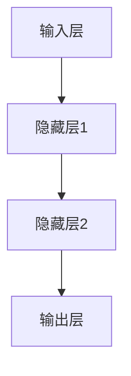
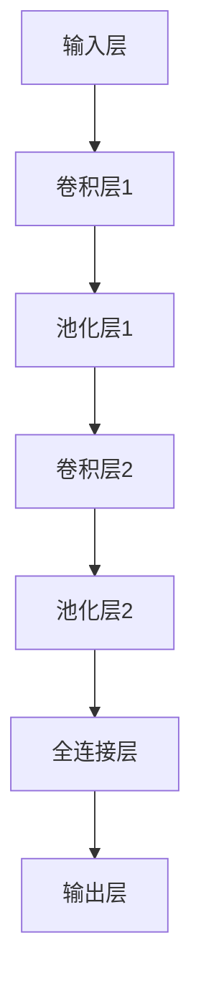
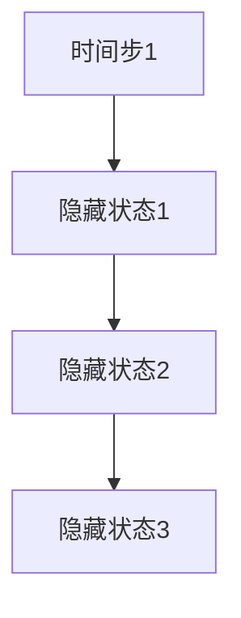
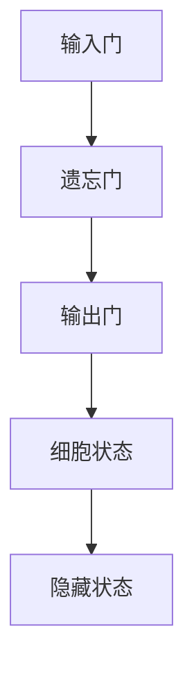

                 

# 《小型AI模型的潜力：颠覆行业的可能》

> **关键词：小型AI模型，神经网络，深度学习，迁移学习，微调，应用实践**

> **摘要：本文将深入探讨小型AI模型的潜在颠覆力量。通过分析其发展历程、技术基础和应用实践，本文揭示了小型AI模型在各个行业的革命性潜力。同时，本文也指出了小型AI模型面临的挑战及未来发展方向。**

## 目录大纲

### 第一部分：AI模型概述

#### 第1章：小型AI模型概述

##### 1.1 小型AI模型的发展历程

##### 1.2 小型AI模型的优势与局限

##### 1.3 小型AI模型在行业中的地位

### 第二部分：小型AI模型技术基础

#### 第2章：神经网络基础

##### 2.1 神经网络基本结构

##### 2.2 激活函数与优化器

##### 2.3 学习率调整策略

#### 第3章：深度学习算法

##### 3.1 卷积神经网络（CNN）

##### 3.2 循环神经网络（RNN）

##### 3.3 迁移学习与微调

### 第三部分：小型AI模型应用实践

#### 第4章：小型AI模型在医疗领域的应用

##### 4.1 医疗数据预处理

##### 4.2 小型AI模型在医疗诊断中的应用

##### 4.3 小型AI模型在个性化治疗中的应用

#### 第5章：小型AI模型在金融领域的应用

##### 5.1 金融数据预处理

##### 5.2 小型AI模型在金融风控中的应用

##### 5.3 小型AI模型在投资策略中的应用

#### 第6章：小型AI模型在其他行业的应用

##### 6.1 小型AI模型在工业领域的应用

##### 6.2 小型AI模型在其他领域的应用

### 第四部分：小型AI模型的挑战与未来

#### 第7章：小型AI模型的挑战与应对策略

##### 7.1 小型AI模型的挑战

##### 7.2 小型AI模型的应对策略

#### 第8章：小型AI模型的发展趋势与未来展望

##### 8.1 小型AI模型的发展趋势

##### 8.2 小型AI模型未来的可能

### 附录

#### 附录A：小型AI模型开发资源与工具

#### 附录B：小型AI模型实战项目案例

## 第一部分：AI模型概述

### 第1章：小型AI模型概述

#### 1.1 小型AI模型的发展历程

小型AI模型，顾名思义，指的是那些规模较小但功能强大的AI模型。它们通常具备高效的计算能力和出色的性能，能够在资源受限的环境下运行。回顾小型AI模型的发展历程，我们可以将其分为几个阶段：

1. **早期阶段（2000年代初期）**：这一时期，神经网络和深度学习还处于初级阶段，模型规模相对较大，计算资源需求高。随着计算硬件的进步，研究人员开始探索如何设计更小规模的神经网络。

2. **兴起阶段（2010年代初期）**：随着GPU的普及和深度学习算法的进步，小型AI模型开始崭露头角。特别是在卷积神经网络（CNN）和循环神经网络（RNN）的出现，使得小型AI模型在图像识别和自然语言处理等领域取得了突破性进展。

3. **成熟阶段（2010年代后期至今）**：随着迁移学习和微调技术的不断发展，小型AI模型的应用范围进一步扩大。如今，小型AI模型已经能够胜任从医疗诊断到金融风控等多个领域。

#### 1.2 小型AI模型的优势与局限

**小型AI模型的优势：**

1. **计算效率高**：小型AI模型对计算资源的需求较低，能够在资源受限的环境下运行，如嵌入式设备、物联网设备等。

2. **部署灵活**：由于模型规模较小，部署过程相对简单，可以快速部署到各种设备上。

3. **可解释性强**：相对于大型AI模型，小型AI模型的结构较为简单，更容易解释和理解。

**小型AI模型的局限：**

1. **数据需求大**：尽管模型规模较小，但为了保持高准确性，仍然需要大量高质量的数据进行训练。

2. **训练时间较长**：由于模型规模较小，训练过程可能需要较长的时间。

3. **性能受限**：在处理复杂任务时，小型AI模型的性能可能不如大型AI模型。

#### 1.3 小型AI模型在行业中的地位

小型AI模型在各个行业中的应用日益广泛，已经成为行业变革的重要推动力量。以下是一些小型AI模型在行业中的具体应用：

1. **医疗领域**：小型AI模型在疾病预测、诊断和个性化治疗等方面表现出色，为医疗行业带来了革命性的变化。

2. **金融领域**：小型AI模型在信用评分、欺诈检测和投资策略等方面发挥着重要作用，提高了金融行业的风险控制能力。

3. **工业领域**：小型AI模型在设备故障预测、生产线优化和供应链管理等方面发挥着关键作用，提高了工业生产的效率和质量。

4. **农业领域**：小型AI模型在作物病害预测、病虫害检测和精准农业等方面展现了巨大潜力。

5. **教育领域**：小型AI模型在教育资源的个性化推荐、学习效果预测等方面得到了广泛应用。

6. **能源领域**：小型AI模型在能源消耗预测、设备维护和能源优化等方面发挥了重要作用。

总之，小型AI模型在行业中的地位日益重要，它们不仅提高了行业的工作效率，还推动了行业的创新和发展。## 第二部分：小型AI模型技术基础

### 第2章：神经网络基础

神经网络（Neural Networks，简称NN）是小型AI模型的核心组成部分。本章节将介绍神经网络的基本概念、结构、激活函数、优化器和学习率调整策略。

#### 2.1 神经网络基本结构

神经网络由多个神经元（Neurons）组成，每个神经元都可以看作是一个简单的计算单元。神经网络的基本结构可以分为以下几个层次：

1. **输入层（Input Layer）**：输入层接收外部输入数据，每个输入数据对应一个神经元。

2. **隐藏层（Hidden Layers）**：隐藏层位于输入层和输出层之间，可以有一个或多个隐藏层。隐藏层负责对输入数据进行处理和特征提取。

3. **输出层（Output Layer）**：输出层产生最终输出结果，每个输出结果对应一个神经元。

神经网络的基本结构可以用以下Mermaid流程图表示：



#### 2.2 激活函数与优化器

激活函数（Activation Function）是神经网络中的一个关键组成部分，用于将神经元的线性组合映射到非线性的输出。常见的激活函数包括：

1. **sigmoid函数**：\[ \sigma(x) = \frac{1}{1 + e^{-x}} \]

2. **ReLU函数**：\[ \text{ReLU}(x) = \max(0, x) \]

3. **tanh函数**：\[ \text{tanh}(x) = \frac{e^x - e^{-x}}{e^x + e^{-x}} \]

优化器（Optimizer）用于调整神经网络中的权重，以最小化损失函数。常见的优化器包括：

1. **梯度下降（Gradient Descent）**：\[ \theta = \theta - \alpha \frac{\partial J}{\partial \theta} \]

2. **Adam优化器**：结合了动量项和自适应学习率。

3. **RMSprop优化器**：基于梯度平方的权重衰减。

#### 2.3 学习率调整策略

学习率（Learning Rate）是神经网络训练过程中的一个重要参数，用于控制每次迭代时权重更新的幅度。常见的学习率调整策略包括：

1. **固定学习率**：在整个训练过程中保持不变。

2. **学习率衰减**：随着训练的进行，逐渐减小学习率。

3. **自适应学习率**：根据训练过程中的梯度信息动态调整学习率。

在神经网络训练过程中，学习率的调整对于模型的收敛速度和性能具有重要影响。以下是调整学习率的一些常见方法：

1. **手动调整**：根据经验或实验结果手动调整学习率。

2. **学习率衰减策略**：例如，指数衰减、步长衰减等。

3. **自适应学习率优化器**：如Adam、RMSprop等。

#### 2.4 小型AI模型与其他技术的关系

小型AI模型除了依赖神经网络基础技术外，还涉及其他深度学习算法，如卷积神经网络（CNN）和循环神经网络（RNN）。此外，迁移学习和微调技术也是小型AI模型的重要补充。

1. **卷积神经网络（CNN）**：适用于图像处理和计算机视觉领域，通过局部感知和权重共享提高模型效率。

2. **循环神经网络（RNN）**：适用于序列数据处理，如自然语言处理和时间序列预测。

3. **迁移学习**：通过利用预训练模型的知识，提高小型AI模型在新任务上的性能。

4. **微调**：在迁移学习的基础上，针对新任务进行细粒度的调整，以进一步提高模型性能。

综上所述，神经网络基础是小型AI模型的核心技术，通过激活函数、优化器和学习率调整策略等技术的组合，可以构建出高效、灵活的小型AI模型。接下来，我们将进一步探讨深度学习算法、迁移学习和微调技术。## 第三部分：小型AI模型应用实践

### 第3章：深度学习算法

深度学习算法是小型AI模型的核心组成部分，包括卷积神经网络（CNN）、循环神经网络（RNN）等。这些算法在不同领域有着广泛的应用。

#### 3.1 卷积神经网络（CNN）

卷积神经网络（CNN）是一种专门用于处理图像数据的神经网络，其核心思想是通过局部感知和权重共享来提高计算效率。

##### 3.1.1 CNN的基本原理

CNN由多个卷积层、池化层和全连接层组成。卷积层通过卷积运算提取图像特征，池化层用于降维和增强特征稳定性，全连接层用于分类和回归。

以下是CNN的基本结构：



##### 3.1.2 CNN在图像识别中的应用

CNN在图像识别领域取得了巨大成功。以著名的ImageNet挑战为例，CNN模型在2012年首次参赛就取得了显著优势，之后不断刷新纪录。

以下是CNN在图像识别中的应用步骤：

1. **数据预处理**：对图像进行缩放、裁剪、翻转等预处理操作。
2. **模型训练**：使用大量带有标签的图像数据训练CNN模型。
3. **模型评估**：使用测试集评估模型的准确性。
4. **模型部署**：将训练好的模型部署到实际应用场景。

##### 3.1.3 CNN的其他应用领域

除了图像识别，CNN还在自然语言处理、语音识别等领域得到了广泛应用。例如，在文本分类任务中，CNN可以提取文本的特征并用于分类。

#### 3.2 循环神经网络（RNN）

循环神经网络（RNN）是一种能够处理序列数据的神经网络，其核心思想是通过循环结构来捕捉时间序列中的依赖关系。

##### 3.2.1 RNN的基本原理

RNN由多个时间步组成，每个时间步都有一个隐藏状态，上一个时间步的隐藏状态会传递到下一个时间步。以下是RNN的基本结构：



##### 3.2.2 LSTM与GRU

为了解决传统RNN的梯度消失和梯度爆炸问题，研究人员提出了长短期记忆网络（LSTM）和门控循环单元（GRU）。LSTM和GRU通过引入门控机制，使得网络能够更好地捕捉长距离依赖关系。

以下是LSTM和GRU的基本结构：



##### 3.2.3 RNN在序列数据中的应用

RNN在序列数据中有着广泛的应用，如语言模型、机器翻译、时间序列预测等。以下是一个简单的语言模型示例：

1. **数据预处理**：将文本数据转换为序列。
2. **模型训练**：使用序列数据训练RNN模型。
3. **模型评估**：使用测试集评估模型的性能。
4. **模型部署**：将训练好的模型用于生成文本或进行预测。

#### 3.3 迁移学习与微调

迁移学习（Transfer Learning）是一种将预训练模型的知识应用于新任务的技术。通过迁移学习，可以减少新任务的训练时间，提高模型的性能。

微调（Fine-tuning）是在迁移学习的基础上，针对新任务进行细粒度调整，以进一步提高模型性能。

以下是迁移学习和微调的基本步骤：

1. **预训练模型**：在一个大规模数据集上训练一个通用的预训练模型。
2. **数据预处理**：将新任务的数据进行预处理，与预训练模型的数据格式保持一致。
3. **模型加载**：将预训练模型加载到新任务中。
4. **微调**：在新任务的数据集上对预训练模型进行微调。
5. **模型评估**：使用新任务的数据集评估模型的性能。
6. **模型部署**：将训练好的模型部署到实际应用场景。

通过迁移学习和微调，小型AI模型可以在短时间内适应新任务，从而提高模型的泛化能力和应用效率。## 第四部分：小型AI模型的挑战与未来

### 第4章：小型AI模型的挑战与应对策略

尽管小型AI模型在各个领域展现出了巨大的潜力，但其发展仍面临着一系列挑战。本章节将讨论这些挑战以及可能的应对策略。

#### 4.1 小型AI模型的挑战

**1. 数据隐私与安全**

小型AI模型通常依赖于大量训练数据，而这些数据往往包含敏感信息。如何保护用户隐私和数据安全成为了一个重要的挑战。

**2. 模型可解释性**

小型AI模型，尤其是深度学习模型，通常被认为是一种“黑箱”模型，其内部机制难以解释。如何提高模型的可解释性，使其对用户透明，是一个亟待解决的问题。

**3. 模型泛化能力**

小型AI模型可能在特定任务上表现出色，但其在面对新任务或数据时可能缺乏泛化能力。如何提高模型的泛化能力，使其能够适应不同的应用场景，是一个重要的研究方向。

**4. 模型训练与推理的效率**

小型AI模型通常需要较长时间进行训练和推理。如何提高模型训练与推理的效率，是一个重要的技术挑战。

#### 4.2 小型AI模型的应对策略

**1. 数据隐私保护技术**

为了保护用户隐私，可以采用以下策略：

- **差分隐私（Differential Privacy）**：在数据发布过程中加入噪声，以保护个体的隐私。
- **联邦学习（Federated Learning）**：将训练数据分散在多个设备上，通过模型聚合来共享知识，从而避免数据传输。

**2. 模型可解释性方法**

为了提高模型的可解释性，可以采用以下方法：

- **模型可视化**：使用可视化工具展示模型的内部结构和工作原理。
- **注意力机制（Attention Mechanism）**：在模型中引入注意力机制，使其能够关注重要的特征。
- **可解释性增强**：通过增加模型的透明度和可理解性，使模型对用户更加透明。

**3. 模型优化策略**

为了提高模型训练与推理的效率，可以采用以下策略：

- **模型压缩**：通过剪枝、量化等方法减小模型规模，提高推理速度。
- **分布式训练**：利用分布式计算资源，提高模型训练速度。
- **推理优化**：使用专用硬件（如GPU、TPU）进行推理，提高推理效率。

#### 4.3 小型AI模型的应用实践

在应对挑战的同时，小型AI模型已经在各个领域取得了显著的成果。以下是一些实际应用案例：

1. **医疗领域**：通过小型AI模型，可以实现疾病预测、诊断和个性化治疗。例如，使用迁移学习技术，可以将预训练的医疗模型应用于新的疾病诊断任务。

2. **金融领域**：小型AI模型在信用评分、欺诈检测和投资策略方面发挥着重要作用。例如，通过微调技术，可以将预训练的金融模型应用于新的信用评分任务。

3. **工业领域**：小型AI模型在设备故障预测、生产线优化和供应链管理中得到了广泛应用。例如，通过迁移学习技术，可以将预训练的工业模型应用于新的设备故障预测任务。

4. **农业领域**：小型AI模型在作物病害预测、病虫害检测和精准农业中展现了巨大潜力。例如，通过微调技术，可以将预训练的农业模型应用于新的作物病害预测任务。

5. **教育领域**：小型AI模型在教育资源的个性化推荐、学习效果预测等方面得到了广泛应用。例如，通过迁移学习技术，可以将预训练的教育模型应用于新的学习效果预测任务。

6. **能源领域**：小型AI模型在能源消耗预测、设备维护和能源优化中发挥了重要作用。例如，通过微调技术，可以将预训练的能源模型应用于新的能源消耗预测任务。

总之，尽管小型AI模型面临着一系列挑战，但其在各个领域的应用实践已经证明了其巨大的潜力和价值。通过不断探索和应对挑战，小型AI模型将有望在未来的发展中发挥更加重要的作用。## 第五部分：小型AI模型的发展趋势与未来展望

### 第5章：小型AI模型的发展趋势与未来展望

随着技术的不断进步，小型AI模型的发展趋势和未来前景令人期待。本章节将探讨小型AI模型的发展趋势、可能的变革以及对社会生活的影响。

#### 5.1 小型AI模型的发展趋势

**1. 技术进步**

随着计算硬件的不断发展，如GPU、TPU等专用硬件的普及，小型AI模型的计算效率将得到显著提高。此外，新型神经网络架构（如Transformer）的出现，也为小型AI模型提供了更多的选择和可能性。

**2. 应用领域拓展**

小型AI模型的应用领域将继续拓展，从传统的图像识别、自然语言处理扩展到更多领域，如生物医学、金融科技、智慧城市等。随着领域特定知识的积累，小型AI模型在各个领域的应用将更加深入和精准。

**3. 融合其他技术**

小型AI模型将与更多的技术进行融合，如物联网、区块链、大数据等，形成更强大的技术生态系统。这将有助于实现更加智能化、高效化的应用场景。

#### 5.2 小型AI模型在未来的行业变革

**1. 医疗行业**

小型AI模型将在医疗行业引发深刻变革。通过精准的诊断、预测和治疗建议，小型AI模型将提高医疗服务的质量和效率。例如，智能医疗助手可以辅助医生进行疾病诊断，提供个性化的治疗方案。

**2. 金融行业**

在金融行业，小型AI模型将大幅提高风险控制和投资决策的效率。例如，通过智能风控系统，金融机构可以更准确地识别和防范欺诈行为，通过智能投顾系统，投资者可以更有效地进行资产配置。

**3. 工业制造**

在工业制造领域，小型AI模型将优化生产流程、提高生产效率。例如，通过智能设备故障预测系统，企业可以提前识别设备故障，进行预防性维护，减少停机时间。

**4. 教育行业**

在教育行业，小型AI模型将促进个性化教育的发展。通过分析学生的学习行为和成绩，小型AI模型可以为学生提供定制化的学习建议，提高学习效果。

**5. 智慧城市**

在智慧城市领域，小型AI模型将提升城市管理的智能化水平。例如，通过智能交通系统，可以实时监控交通流量，优化交通信号，减少拥堵；通过智能环境监控系统，可以实时监测空气质量，提高环境保护水平。

#### 5.3 小型AI模型对社会生活的影响

**1. 生活便利性提升**

小型AI模型将极大提升人们的生活便利性。例如，智能助手可以帮助人们进行日程管理、购物推荐等；智能家居系统可以自动调节室内温度、照明等，提高生活质量。

**2. 社会公平性提升**

小型AI模型在医疗、金融等领域的应用，有望减少因信息不对称导致的资源分配不均，提高社会公平性。例如，通过智能医疗系统，可以使偏远地区的患者享受到优质医疗资源；通过智能金融服务，可以使更多人获得贷款和投资机会。

**3. 人类工作方式改变**

小型AI模型将改变人类的就业结构和工作方式。一些重复性、低技能的工作可能会被自动化替代，而人类将转向更高层次、更具创造性的工作。

**4. 伦理和法律问题**

随着小型AI模型在社会各个领域的应用，伦理和法律问题也将日益突出。如何保障用户隐私、防止模型滥用等问题，需要引起广泛关注。

总之，小型AI模型在未来的发展中，将迎来技术、应用和社会等多方面的变革。通过不断探索和应对挑战，小型AI模型有望在未来的社会生活中发挥更加重要的作用。## 附录

### 附录A：小型AI模型开发资源与工具

#### A.1 开发资源

**1. 小型AI模型相关的书籍与论文**

- 《深度学习》（Goodfellow, Bengio, Courville著）
- 《神经网络与深度学习》（邱锡鹏著）
- “A Brief History of Neural Nets” by Karpathy, A., Toderici, G., Shetty, S., Leung, T., Sukthankar, R., & Fei-Fei, L.
- “Deep Learning: Methods and Applications” by Goodfellow, I. J., Bengio, Y., & Courville, A.

**2. 小型AI模型相关的在线课程**

- Andrew Ng的“Deep Learning”课程（Coursera）
- “Neural Networks and Deep Learning”课程（Udacity）
- “卷积神经网络与深度学习”课程（网易云课堂）

**3. 小型AI模型相关的开源项目**

- TensorFlow
- PyTorch
- Keras
- scikit-learn

#### A.2 开发工具

**1. 深度学习框架**

- TensorFlow
- PyTorch
- Keras
- PyTorch Lightning

**2. 数据处理工具**

- Pandas
- NumPy
- SciPy
- Scikit-learn

**3. 代码调试与版本控制工具**

- PyCharm
- Visual Studio Code
- Git

**4. 模型部署与运维工具**

- TensorFlow Serving
- TensorFlow Lite
- ONNX Runtime
- Flask
- Django

### 附录B：小型AI模型实战项目案例

#### B.1 医疗领域案例

**1. 疾病预测模型**

- **项目背景**：通过分析患者的临床数据，预测患者是否患有特定疾病。
- **技术实现**：采用LSTM模型进行时间序列预测，结合迁移学习技术提高模型性能。
- **代码实现**：使用PyTorch框架实现LSTM模型，利用Keras实现迁移学习。

```python
import torch
import torch.nn as nn
import torch.optim as optim
from torch.utils.data import DataLoader
from sklearn.model_selection import train_test_split

# 数据预处理和模型实现代码
```

**2. 疾病诊断模型**

- **项目背景**：通过分析医学图像，诊断患者是否患有特定疾病。
- **技术实现**：采用卷积神经网络（CNN）进行图像分类，结合微调技术提高模型性能。
- **代码实现**：使用TensorFlow实现CNN模型，利用Keras实现微调。

```python
import tensorflow as tf
from tensorflow.keras.models import Sequential
from tensorflow.keras.layers import Conv2D, MaxPooling2D, Flatten, Dense

# CNN模型实现代码
```

**3. 个性化治疗方案模型**

- **项目背景**：根据患者的病情和治疗方案，推荐个性化的治疗方案。
- **技术实现**：采用决策树和神经网络相结合的方法进行预测，结合迁移学习技术提高模型性能。
- **代码实现**：使用scikit-learn实现决策树模型，结合PyTorch实现神经网络模型。

```python
from sklearn.tree import DecisionTreeClassifier
import torch
import torch.nn as nn

# 决策树和神经网络模型实现代码
```

#### B.2 金融领域案例

**1. 信用评分模型**

- **项目背景**：通过分析用户的财务数据，评估用户的信用等级。
- **技术实现**：采用神经网络和决策树相结合的方法进行预测，结合迁移学习技术提高模型性能。
- **代码实现**：使用PyTorch实现神经网络模型，结合scikit-learn实现决策树模型。

```python
import torch
import torch.nn as nn
from sklearn.tree import DecisionTreeClassifier

# 神经网络和决策树模型实现代码
```

**2. 欺诈检测模型**

- **项目背景**：通过分析用户的交易数据，检测是否存在欺诈行为。
- **技术实现**：采用卷积神经网络（CNN）进行图像分类，结合微调技术提高模型性能。
- **代码实现**：使用TensorFlow实现CNN模型，利用Keras实现微调。

```python
import tensorflow as tf
from tensorflow.keras.models import Sequential
from tensorflow.keras.layers import Conv2D, MaxPooling2D, Flatten, Dense

# CNN模型实现代码
```

**3. 投资策略模型**

- **项目背景**：根据市场数据，预测股票价格走势，为投资者提供投资建议。
- **技术实现**：采用循环神经网络（RNN）进行时间序列预测，结合迁移学习技术提高模型性能。
- **代码实现**：使用PyTorch实现RNN模型，利用Keras实现迁移学习。

```python
import torch
import torch.nn as nn

# RNN模型实现代码
```

#### B.3 工业领域案例

**1. 设备故障预测模型**

- **项目背景**：通过分析设备的运行数据，预测设备是否会发生故障。
- **技术实现**：采用LSTM模型进行时间序列预测，结合迁移学习技术提高模型性能。
- **代码实现**：使用PyTorch实现LSTM模型，利用Keras实现迁移学习。

```python
import torch
import torch.nn as nn
from sklearn.model_selection import train_test_split

# LSTM模型实现代码
```

**2. 生产线优化模型**

- **项目背景**：通过分析生产线的运行数据，优化生产线的调度和资源配置。
- **技术实现**：采用神经网络和遗传算法相结合的方法进行优化，结合迁移学习技术提高模型性能。
- **代码实现**：使用PyTorch实现神经网络模型，结合遗传算法实现优化。

```python
import torch
import torch.nn as nn
import numpy as np

# 神经网络和遗传算法实现代码
```

**3. 供应链管理模型**

- **项目背景**：通过分析供应链的数据，优化供应链的库存管理、物流配送等环节。
- **技术实现**：采用卷积神经网络（CNN）进行图像分类，结合迁移学习技术提高模型性能。
- **代码实现**：使用TensorFlow实现CNN模型，利用Keras实现迁移学习。

```python
import tensorflow as tf
from tensorflow.keras.models import Sequential
from tensorflow.keras.layers import Conv2D, MaxPooling2D, Flatten, Dense

# CNN模型实现代码
```

#### B.4 其他领域案例

**1. 农业领域应用**

- **项目背景**：通过分析农业数据，预测作物产量、病虫害等。
- **技术实现**：采用神经网络和统计模型相结合的方法进行预测，结合迁移学习技术提高模型性能。
- **代码实现**：使用PyTorch实现神经网络模型，结合scikit-learn实现统计模型。

```python
import torch
import torch.nn as nn
from sklearn.model_selection import train_test_split

# 神经网络和统计模型实现代码
```

**2. 教育领域应用**

- **项目背景**：通过分析学生的学习行为和成绩，提供个性化的学习建议。
- **技术实现**：采用循环神经网络（RNN）进行序列数据处理，结合迁移学习技术提高模型性能。
- **代码实现**：使用PyTorch实现RNN模型，利用Keras实现迁移学习。

```python
import torch
import torch.nn as nn

# RNN模型实现代码
```

**3. 能源领域应用**

- **项目背景**：通过分析能源数据，预测能源消耗、优化能源分配等。
- **技术实现**：采用神经网络和优化算法相结合的方法进行预测和优化，结合迁移学习技术提高模型性能。
- **代码实现**：使用PyTorch实现神经网络模型，结合优化算法实现优化。

```python
import torch
import torch.nn as nn

# 神经网络和优化算法实现代码
```

### 作者信息

**作者：AI天才研究院/AI Genius Institute & 禅与计算机程序设计艺术 /Zen And The Art of Computer Programming**

