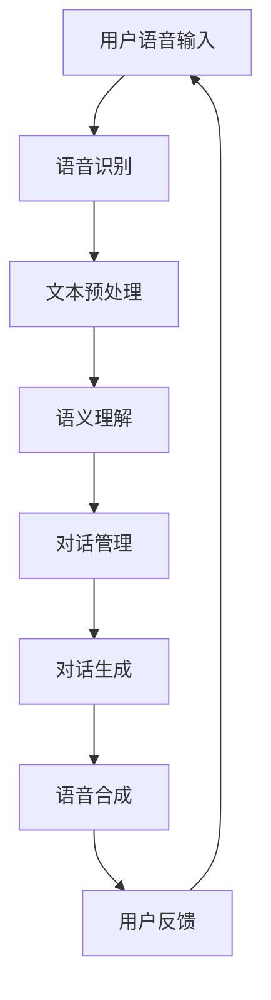

                 

### 《2025年百度社招智能对话系统工程师面试题集锦》

#### 关键词：
- 智能对话系统
- 自然语言处理
- 语音识别与合成
- 对话管理
- 应用案例
- 面试题集

#### 摘要：
本文针对2025年百度社招智能对话系统工程师的面试，整理了一整套面试题集锦。文章涵盖了智能对话系统的基础知识、自然语言处理技术、对话管理技术以及应用案例等多个方面。通过详细的解析和实战案例，帮助读者深入理解智能对话系统的原理和实践，为面试准备提供有力支持。

---

### 目录大纲

#### 第一部分：智能对话系统基础知识

**第1章：智能对话系统的概述**

- 1.1 智能对话系统的定义与分类
- 1.2 智能对话系统的基本架构
- 1.3 智能对话系统的发展历程

**第2章：自然语言处理技术基础**

- 2.1 语言模型与词向量
- 2.2 语义分析与语义理解
- 2.3 对话管理技术

**第3章：智能对话系统的构建与实现**

- 3.1 智能对话系统的设计与开发流程
- 3.2 对话系统的关键技术
- 3.3 对话系统性能评估

#### 第二部分：智能对话系统应用案例

**第4章：智能客服系统**

- 4.1 智能客服系统的概述
- 4.2 智能客服系统的构建与实现

**第5章：智能助手系统**

- 5.1 智能助手系统的概述
- 5.2 智能助手系统的构建与实现

**第6章：智能语音助手系统**

- 6.1 智能语音助手系统的概述
- 6.2 智能语音助手系统的构建与实现

**第7章：智能对话系统在特定领域的应用**

- 7.1 智能对话系统在金融领域的应用
- 7.2 智能对话系统在医疗领域的应用

#### 第三部分：智能对话系统面试题解析

**第8章：智能对话系统基础知识面试题**

- 8.1 语言模型面试题
- 8.2 语义分析与语义理解面试题

**第9章：对话管理面试题**

- 9.1 对话状态跟踪面试题
- 9.2 对话策略学习面试题

**第10章：智能对话系统应用面试题**

- 10.1 智能客服系统面试题
- 10.2 智能助手系统面试题
- 10.3 智能语音助手系统面试题

**第11章：智能对话系统在特定领域面试题**

- 11.1 智能对话系统在金融领域面试题
- 11.2 智能对话系统在医疗领域面试题

**附录**

- 附录A：智能对话系统常用工具与框架

---

在接下来的文章中，我们将按照目录大纲逐一介绍各个章节的内容。首先，我们从智能对话系统的概述开始，为读者搭建一个全面的认识框架。接下来，我们将深入探讨自然语言处理技术的基础知识，包括语言模型、词向量、语义分析与理解等。随后，我们将介绍对话管理技术，这是智能对话系统能够与用户进行有效交流的核心。在应用案例部分，我们将分别探讨智能客服系统、智能助手系统和智能语音助手系统的构建与实现。最后，我们将针对特定领域的应用进行深入探讨，并提供一系列面试题，帮助读者为面试做好准备。

现在，让我们开始深入探讨智能对话系统的基础知识，并一步一步地分析其核心概念和原理。

---

### 第一部分：智能对话系统基础知识

#### 第1章：智能对话系统的概述

智能对话系统作为人工智能的一个重要分支，近年来得到了快速发展。它通过模拟人类的对话行为，实现人与计算机之间的自然交互。本章节将介绍智能对话系统的定义与分类、基本架构以及其发展历程。

#### 1.1 智能对话系统的定义与分类

智能对话系统（Intelligent Conversational System，简称ICS）是一种能够与人类进行自然语言对话的人工智能系统。它通过理解用户的意图、提取语义信息并生成恰当的回应，为用户提供个性化服务。智能对话系统的核心在于自然语言处理（Natural Language Processing，简称NLP）技术，包括语言模型、语义分析和对话管理等多个方面。

根据应用场景和功能特点，智能对话系统可以分为以下几类：

1. **智能客服系统**：主要应用于客服场景，提供自动化的客户服务，如解答常见问题、处理投诉等。
2. **智能助手系统**：为用户提供个性化服务，如日程管理、信息查询、智能建议等。
3. **智能语音助手系统**：通过语音交互方式为用户提供服务，如语音查询、语音控制智能家居等。
4. **聊天机器人**：在社交媒体、论坛等平台上与用户进行互动，提供娱乐、社交等服务。

#### 1.2 智能对话系统的基本架构

智能对话系统通常由以下几个主要模块组成：

1. **语音识别模块**：将用户的语音输入转换为文本，以便后续处理。
2. **文本预处理模块**：对输入的文本进行分词、词性标注、命名实体识别等预处理操作，为语义分析打下基础。
3. **语义理解模块**：通过语言模型、词向量等NLP技术，对预处理后的文本进行语义分析，理解用户的意图和需求。
4. **对话管理模块**：根据语义理解的结果，选择合适的回应策略，并跟踪对话状态，确保对话的连贯性和有效性。
5. **对话生成模块**：根据对话管理模块的回应策略，生成自然的语言回复，并通过语音合成模块转换为语音输出。

以下是一个简化的智能对话系统架构的 Mermaid 流程图：



#### 1.3 智能对话系统的发展历程

智能对话系统的发展可以追溯到上世纪50年代，当时计算机科学家开始尝试通过编程实现简单的对话系统。以下是一些重要的里程碑：

1. **ELIZA（1966年）**：由Joseph Weizenbaum教授开发，是最早的聊天机器人之一，通过简单的模式匹配进行对话，引发了人们对自然语言处理和对话系统的兴趣。
2. **SMC（1972年）**：斯图尔特·罗素（Stuart Russell）和彼得·诺维格（Peter Norvig）开发的基于统计方法的聊天机器人，使用了更为复杂的模式匹配和语法分析技术。
3. **2000年代初期**：随着机器学习技术的发展，基于统计模型和深度学习的方法开始在自然语言处理领域得到广泛应用，对话系统的性能和智能化程度显著提升。
4. **2010年代中期至今**：随着深度学习技术的进步和大数据的广泛应用，智能对话系统在各大互联网公司得到大规模部署，应用场景不断扩展，从客服、助手到语音助手等。

智能对话系统的发展历程体现了人工智能技术不断进步的过程，也反映了人们对自然交互需求日益增长的趋势。

#### 1.4 智能对话系统的应用场景和优势

智能对话系统的应用场景非常广泛，包括但不限于以下几个方面：

1. **客服领域**：智能客服系统可以自动处理大量的客户咨询，提高服务效率和客户满意度。
2. **个人助手**：智能助手系统可以协助用户管理日程、提醒事项、提供信息查询等，为用户创造更多价值。
3. **智能家居**：智能语音助手系统可以通过语音指令控制家中的智能设备，如电视、空调、灯光等，提升用户体验。
4. **在线教育**：智能对话系统可以模拟教师与学生之间的互动，提供个性化的教学服务，提高学习效果。

智能对话系统的优势主要体现在以下几个方面：

1. **高效率**：智能对话系统可以自动处理大量用户请求，减少人力成本，提高工作效率。
2. **个性化服务**：通过理解用户意图和偏好，智能对话系统可以为用户提供定制化的服务和建议。
3. **多语言支持**：智能对话系统可以支持多种语言，为全球化企业提供服务。
4. **可扩展性强**：随着技术的进步，智能对话系统的功能可以不断扩展和优化，满足不断变化的市场需求。

综上所述，智能对话系统作为一种新兴的人工智能技术，具有广泛的应用前景和重要的社会价值。接下来，我们将深入探讨智能对话系统中的自然语言处理技术，为读者提供更详细的技术基础。

---

### 第一部分：智能对话系统基础知识

#### 第2章：自然语言处理技术基础

自然语言处理（Natural Language Processing，简称NLP）是智能对话系统的核心组成部分，它使计算机能够理解和处理人类语言。本章将介绍NLP的基本概念、语言模型与词向量，以及语义分析与理解技术。

#### 2.1 语言模型与词向量

##### 2.1.1 语言模型的基本原理

语言模型（Language Model，LM）是NLP中的一个重要概念，它用于预测一段文本的下一个词或字符。在智能对话系统中，语言模型被用来生成自然、流畅的对话回复。

- **n-gram模型**：n-gram模型是最简单的语言模型之一，它基于相邻n个词的概率分布。该模型假设一个词的出现仅与它前n-1个词有关。例如，对于三元语法（trigram），模型会计算“单词A”、“单词B”后接“单词C”的概率。

```latex
P(单词C | 单词A, 单词B) = \frac{C(单词A, 单词B, 单词C)}{C(单词A, 单词B)}
```

- **神经网络语言模型**：随着深度学习的发展，神经网络语言模型（如循环神经网络RNN、长短期记忆网络LSTM、Transformer等）被广泛应用于NLP。这些模型能够捕捉到更复杂的语言特征，提高预测的准确性。

##### 2.1.2 常见的词向量模型

词向量（Word Vector）是将单词映射到高维向量空间的一种表示方法，它能够捕获单词之间的语义关系。常见的词向量模型包括以下几种：

- **Word2Vec**：Word2Vec是由Google提出的基于神经网络的语言模型，包括连续词袋（CBOW）和Skip-Gram两种方法。它通过训练大规模语料库，将单词映射到低维向量空间，使得语义相近的单词在空间中靠近。

- **GloVe**：GloVe（Global Vectors for Word Representation）是一种基于矩阵分解的词向量模型，它通过优化单词的共现矩阵，生成高质量的词向量。GloVe模型能够更好地捕获词与词之间的相对语义关系。

- **FastText**：FastText是由Facebook AI Research开发的词向量模型，它引入了字符级别的信息，通过将字符和单词组合起来训练模型，提高词向量表示的鲁棒性和泛化能力。

#### 2.2 语义分析与语义理解

语义分析（Semantic Analysis）是NLP中用于理解文本深层含义的过程，包括词义消歧、实体识别、关系抽取等任务。语义理解（Semantic Understanding）则是在语义分析的基础上，进一步解析文本中的意图和含义，以便进行有效的对话。

- **词义消歧（Word Sense Disambiguation）**：词义消歧是指确定文本中某个单词的确切含义。例如，“bank”这个词可以指银行，也可以指河岸。词义消歧的目标是确定上下文中单词的确切含义。

- **实体识别（Named Entity Recognition，简称NER）**：实体识别是指识别文本中的命名实体，如人名、地名、组织名等。实体识别是信息抽取和知识图谱构建的重要步骤。

- **关系抽取（Relation Extraction）**：关系抽取是指识别文本中实体之间的关系。例如，在句子“苹果公司的CEO是蒂姆·库克”中，关系抽取的任务是识别“苹果公司”和“蒂姆·库克”之间的“CEO”关系。

#### 2.3 对话管理技术

对话管理（Dialogue Management）是智能对话系统的核心组件，它负责跟踪对话状态、生成对话策略和生成对话回复。

- **对话状态跟踪（Dialogue State Tracking）**：对话状态跟踪是指识别并跟踪对话中的关键信息，如用户意图、对话历史、系统状态等。对话状态跟踪有助于确保对话的连贯性和有效性。

- **对话策略学习（Dialogue Policy Learning）**：对话策略学习是指训练模型，使其能够根据当前对话状态生成合适的回应策略。常见的对话策略包括基于规则的方法、基于模板的方法和基于学习的方法。

#### 2.4 自然语言处理技术在智能对话系统中的应用

自然语言处理技术在智能对话系统中扮演着至关重要的角色，以下是几个关键应用：

- **语音识别与文本生成**：语音识别模块将用户的语音转换为文本，文本生成模块根据用户的输入生成自然、连贯的回复。
- **语义理解与意图识别**：通过语义分析和意图识别，智能对话系统能够理解用户的意图，并生成相应的回应。
- **对话管理**：对话管理模块确保对话的连贯性，并跟踪对话中的关键信息。
- **个性化服务**：通过理解用户的历史行为和偏好，智能对话系统可以提供个性化的服务和建议。

#### 2.5 案例分析：基于Word2Vec的智能客服系统

以下是一个基于Word2Vec的智能客服系统案例，演示了如何利用自然语言处理技术实现一个基本的对话系统：

1. **数据准备**：收集大量的客服对话数据，进行数据清洗和预处理。
2. **词向量训练**：使用Word2Vec模型对对话数据中的单词进行训练，生成词向量表示。
3. **意图识别**：通过训练好的词向量模型，对用户的输入进行意图识别，如查询问题、投诉建议等。
4. **对话生成**：根据用户的意图，生成合适的回复，并通过文本生成模块转换为自然语言输出。
5. **对话管理**：跟踪对话状态，确保对话的连贯性和有效性。

以下是该案例的实现伪代码：

```python
# 导入必要的库
import gensim

# 加载和预处理对话数据
data = load_data('dialogue_data.csv')
processed_data = preprocess_data(data)

# 训练Word2Vec模型
model = gensim.models.Word2Vec(processed_data, size=100, window=5, min_count=1, workers=4)

# 意图识别
user_input = "你的问题是什么？"
predicted_intent = identify_intent(user_input, model)

# 对话生成
response = generate_response(predicted_intent, model)

# 输出对话回复
print(response)
```

通过上述步骤，我们可以实现一个基本的智能客服系统，它能够理解用户的意图并生成相应的回复。接下来，我们将进一步探讨智能对话系统的设计与实现过程。

---

### 第一部分：智能对话系统基础知识

#### 第3章：智能对话系统的构建与实现

智能对话系统的构建与实现是一个复杂的过程，涉及到多个技术模块的协同工作。本章将详细讨论智能对话系统的设计与开发流程、关键技术以及性能评估方法。

#### 3.1 智能对话系统的设计与开发流程

构建智能对话系统通常遵循以下步骤：

1. **需求分析与系统设计**：首先，需要明确智能对话系统的应用场景、功能需求、性能要求等。根据这些需求，设计系统的整体架构，包括各模块的功能和交互方式。
2. **数据收集与预处理**：智能对话系统的性能很大程度上依赖于训练数据的质量。因此，收集大量的对话数据，并进行数据清洗、标注和预处理，以供后续模型训练使用。
3. **模型选择与训练**：选择合适的自然语言处理模型（如语言模型、词向量模型、语义理解模型等），并在预处理的对话数据上进行训练。
4. **系统集成与测试**：将各个模块（如语音识别、文本预处理、语义理解、对话管理等）集成到一个统一的系统中，并进行系统测试，以确保系统的稳定性和性能。
5. **部署与优化**：将智能对话系统部署到生产环境中，并根据用户的反馈和实际运行情况，进行持续的优化和更新。

#### 3.2 对话系统的关键技术

智能对话系统涉及多个关键技术，以下是其中几个关键技术的详细讨论：

##### 3.2.1 对话策略学习算法

对话策略学习（Dialogue Policy Learning）是智能对话系统的核心部分，它负责根据对话历史和用户状态生成合适的回应策略。常见的对话策略学习算法包括：

1. **基于规则的方法**：这种方法通过定义一系列规则，根据对话历史和当前状态生成回应。优点是简单直观，缺点是灵活性较差，难以应对复杂的对话场景。
2. **基于模板的方法**：这种方法使用预先定义的模板来生成回应，通过替换模板中的变量来实现个性化。优点是生成速度较快，缺点是缺乏灵活性，且难以应对新情况。
3. **基于学习的方法**：这种方法使用机器学习算法，如深度学习、强化学习等，从大量的对话数据中学习对话策略。优点是灵活性强，能够适应不同的对话场景，缺点是训练过程复杂，对数据量要求较高。

##### 3.2.2 对话生成算法

对话生成（Dialogue Generation）是智能对话系统的另一个关键组成部分，它负责将对话策略转换为自然语言回复。常见的对话生成算法包括：

1. **基于模板的生成算法**：这种方法使用预先定义的模板和替换策略，生成自然语言回复。优点是实现简单，缺点是生成的回复可能缺乏个性化。
2. **基于序列模型的生成算法**：这种方法使用序列模型（如RNN、LSTM、Transformer等）来生成自然语言回复。优点是能够生成更加自然和流畅的回复，缺点是训练过程复杂，对计算资源要求较高。
3. **基于生成对抗网络的生成算法**：这种方法使用生成对抗网络（GAN）来生成自然语言回复。优点是生成能力强大，能够生成高质量的回复，缺点是训练过程复杂，对数据质量要求较高。

##### 3.2.3 对话系统性能评估

对话系统的性能评估是确保系统有效性的重要环节。以下是几种常见的性能评估方法：

1. **准确率（Accuracy）**：准确率是衡量系统正确识别用户意图的能力。计算公式为：
   
   $$\text{准确率} = \frac{\text{正确识别的对话}}{\text{总对话数}}$$

2. **召回率（Recall）**：召回率是衡量系统漏掉的用户意图的百分比。计算公式为：

   $$\text{召回率} = \frac{\text{正确识别的对话}}{\text{实际用户意图的对话数}}$$

3. **F1值（F1 Score）**：F1值是准确率和召回率的调和平均值，用于综合评估系统的性能。计算公式为：

   $$\text{F1值} = 2 \times \frac{\text{准确率} \times \text{召回率}}{\text{准确率} + \text{召回率}}$$

4. **用户满意度（User Satisfaction）**：用户满意度是通过用户反馈来评估系统的服务质量。常用的评估指标包括用户评分、用户投诉率等。

#### 3.3 案例分析：基于深度学习的智能客服系统

以下是一个基于深度学习的智能客服系统案例分析：

1. **需求分析**：针对电商平台的客服需求，设计一个能够自动回答用户常见问题的智能客服系统。
2. **数据收集**：收集大量电商平台用户咨询数据，包括用户问题、客服回答等。
3. **模型选择与训练**：选择基于Transformer的BERT模型（Bidirectional Encoder Representations from Transformers）进行训练。BERT模型能够捕捉到上下文信息，有助于提高对话系统的性能。
4. **系统集成与测试**：将语音识别、文本预处理、语义理解、对话生成等模块集成到系统中，并进行系统测试，确保系统的稳定性和性能。
5. **部署与优化**：将智能客服系统部署到生产环境中，根据用户反馈进行持续的优化和更新。

以下是该案例的实现伪代码：

```python
# 导入必要的库
import transformers

# 加载预训练的BERT模型
model = transformers.BertModel.from_pretrained('bert-base-chinese')

# 加载和预处理对话数据
data = load_data('dialogue_data.csv')
processed_data = preprocess_data(data)

# 训练BERT模型
model.train(processed_data)

# 对话生成
user_input = "你的问题是什么？"
response = model.generate(user_input)

# 输出对话回复
print(response)
```

通过上述步骤，我们可以实现一个基本的智能客服系统，它能够自动回答用户的常见问题，提供高效的客服服务。接下来，我们将探讨智能对话系统的实际应用案例。

---

### 第二部分：智能对话系统应用案例

#### 第4章：智能客服系统

智能客服系统是智能对话系统在客服领域的应用，通过自动化处理大量客户咨询，提高服务效率和客户满意度。本章将介绍智能客服系统的概述、应用场景、优势和关键技术。

#### 4.1 智能客服系统的概述

智能客服系统（Intelligent Customer Service System，简称ICSS）是一种基于人工智能技术的自动化客服解决方案。它利用自然语言处理、语音识别、对话管理等技术，实现与客户的智能交互，提供高效的客户服务。

智能客服系统通常由以下几个主要模块组成：

1. **语音识别模块**：将客户的语音输入转换为文本，以便进行后续处理。
2. **文本预处理模块**：对输入的文本进行分词、词性标注、命名实体识别等预处理操作，为语义分析打下基础。
3. **语义理解模块**：通过语言模型、词向量等NLP技术，对预处理后的文本进行语义分析，理解客户的意图和需求。
4. **对话管理模块**：根据语义理解的结果，选择合适的回应策略，并跟踪对话状态，确保对话的连贯性和有效性。
5. **对话生成模块**：根据对话管理模块的回应策略，生成自然的语言回复，并通过语音合成模块转换为语音输出。

#### 4.2 智能客服系统的应用场景

智能客服系统在多个领域有着广泛的应用，以下是几个典型的应用场景：

1. **电商客服**：智能客服系统可以自动回答用户的常见问题，如商品描述、订单状态、退换货政策等，减少客服人员的工作量，提高客户满意度。
2. **金融客服**：智能客服系统可以为用户提供账户查询、转账操作、贷款咨询等服务，降低金融业务的运营成本，提升服务质量。
3. **电信客服**：智能客服系统可以自动处理用户的投诉、故障报修、套餐咨询等问题，提高电信服务的响应速度和用户体验。
4. **医疗客服**：智能客服系统可以为患者提供医疗咨询、预约挂号、药品查询等服务，减轻医护人员的工作压力，提高医疗服务效率。

#### 4.3 智能客服系统的优势

智能客服系统具有以下优势：

1. **高效率**：智能客服系统能够快速响应客户请求，处理大量客户咨询，提高客服工作效率。
2. **个性化服务**：通过语义理解技术，智能客服系统可以理解客户的意图和需求，提供个性化的服务和建议。
3. **多语言支持**：智能客服系统可以支持多种语言，为全球化企业提供客服服务。
4. **可扩展性强**：智能客服系统可以根据业务需求，灵活扩展功能，如添加新语言、新服务场景等。

#### 4.4 智能客服系统的关键技术

智能客服系统的关键技术包括自然语言处理、对话管理和对话生成等。

1. **自然语言处理（NLP）**：NLP技术用于理解客户的意图和需求，包括语音识别、文本预处理、语义理解等。
2. **对话管理**：对话管理技术负责跟踪对话状态、生成对话策略和生成对话回复，确保对话的连贯性和有效性。
3. **对话生成**：对话生成技术将对话策略转换为自然语言回复，通过语音合成模块输出语音回复。

#### 4.5 案例分析：某电商平台智能客服系统

以下是一个某电商平台智能客服系统案例分析：

1. **需求分析**：针对电商平台客服需求，设计一个能够自动回答用户常见问题的智能客服系统。
2. **数据收集**：收集大量电商平台用户咨询数据，包括用户问题、客服回答等。
3. **模型选择与训练**：选择基于BERT（Bidirectional Encoder Representations from Transformers）的深度学习模型进行训练，BERT模型能够捕捉到上下文信息，有助于提高对话系统的性能。
4. **系统集成与测试**：将语音识别、文本预处理、语义理解、对话生成等模块集成到系统中，并进行系统测试，确保系统的稳定性和性能。
5. **部署与优化**：将智能客服系统部署到生产环境中，根据用户反馈进行持续的优化和更新。

以下是该案例的实现伪代码：

```python
# 导入必要的库
import transformers

# 加载预训练的BERT模型
model = transformers.BertModel.from_pretrained('bert-base-chinese')

# 加载和预处理对话数据
data = load_data('dialogue_data.csv')
processed_data = preprocess_data(data)

# 训练BERT模型
model.train(processed_data)

# 对话生成
user_input = "你的问题是什么？"
response = model.generate(user_input)

# 输出对话回复
print(response)
```

通过上述步骤，我们可以实现一个基本的智能客服系统，它能够自动回答用户的常见问题，提供高效的客服服务。接下来，我们将探讨智能助手系统的构建与实现。

---

### 第二部分：智能对话系统应用案例

#### 第5章：智能助手系统

智能助手系统（Intelligent Assistant System）是智能对话系统在个人服务领域的应用，通过理解用户的意图和需求，为用户提供个性化服务。本章将介绍智能助手系统的概述、应用场景、功能和关键技术。

#### 5.1 智能助手系统的概述

智能助手系统是一种基于人工智能技术的个性化服务系统，能够与用户进行自然语言交互，提供包括日程管理、信息查询、智能建议等在内的多种服务。智能助手系统通常由以下几个主要模块组成：

1. **语音识别模块**：将用户的语音输入转换为文本，以便进行后续处理。
2. **文本预处理模块**：对输入的文本进行分词、词性标注、命名实体识别等预处理操作，为语义分析打下基础。
3. **语义理解模块**：通过语言模型、词向量等NLP技术，对预处理后的文本进行语义分析，理解用户的意图和需求。
4. **任务执行模块**：根据用户的意图，执行相应的任务，如发送邮件、预订餐厅、设置提醒等。
5. **对话管理模块**：确保对话的连贯性和有效性，跟踪对话状态，生成对话回复。

#### 5.2 智能助手系统的应用场景

智能助手系统在多个场景中有着广泛的应用，以下是几个典型的应用场景：

1. **个人日程管理**：智能助手系统可以帮助用户管理日程，如提醒会议、设置待办事项、自动安排行程等。
2. **信息查询**：智能助手系统可以回答用户的各类问题，如天气查询、股票信息、新闻更新等。
3. **智能建议**：智能助手系统可以根据用户的行为和偏好，提供个性化的建议，如推荐书籍、音乐、电影等。
4. **智能家居控制**：智能助手系统可以通过语音指令控制家中的智能设备，如灯光、空调、电视等。

#### 5.3 智能助手系统的功能设计

智能助手系统的功能设计需要根据用户的需求和场景进行定制，以下是几个关键功能：

1. **语音交互**：用户可以通过语音与智能助手进行交互，实现自然的人机对话。
2. **自然语言理解**：智能助手需要能够理解用户的自然语言输入，包括疑问句、命令句等。
3. **任务执行**：智能助手能够根据用户的意图，执行具体的任务，如发送邮件、发送短信、拨打电话等。
4. **个性化服务**：智能助手可以根据用户的历史数据和偏好，提供个性化的服务和建议。
5. **多平台支持**：智能助手系统需要支持多个平台，如手机、电脑、智能家居设备等。

#### 5.4 智能助手系统的关键技术

智能助手系统的关键技术包括自然语言处理、对话管理、语音合成等。

1. **自然语言处理（NLP）**：NLP技术用于理解用户的意图和需求，包括语言模型、词向量、语义理解等。
2. **对话管理**：对话管理技术负责跟踪对话状态、生成对话策略和生成对话回复，确保对话的连贯性和有效性。
3. **语音合成**：语音合成技术将生成的文本回复转换为自然的语音输出，提高用户体验。

#### 5.5 案例分析：某企业智能助手系统

以下是一个某企业智能助手系统案例分析：

1. **需求分析**：针对企业员工的需求，设计一个能够帮助员工管理日程、查询信息并提供个性化建议的智能助手系统。
2. **数据收集**：收集企业员工的使用数据，包括日程安排、信息查询记录等。
3. **模型选择与训练**：选择基于BERT（Bidirectional Encoder Representations from Transformers）的深度学习模型进行训练，BERT模型能够捕捉到上下文信息，有助于提高对话系统的性能。
4. **系统集成与测试**：将语音识别、文本预处理、语义理解、对话生成等模块集成到系统中，并进行系统测试，确保系统的稳定性和性能。
5. **部署与优化**：将智能助手系统部署到企业内部服务器，根据员工反馈进行持续的优化和更新。

以下是该案例的实现伪代码：

```python
# 导入必要的库
import transformers

# 加载预训练的BERT模型
model = transformers.BertModel.from_pretrained('bert-base-chinese')

# 加载和预处理对话数据
data = load_data('dialogue_data.csv')
processed_data = preprocess_data(data)

# 训练BERT模型
model.train(processed_data)

# 对话生成
user_input = "明天有哪些会议？"
response = model.generate(user_input)

# 输出对话回复
print(response)
```

通过上述步骤，我们可以实现一个基本的智能助手系统，它能够帮助员工管理日程、查询信息和提供个性化建议，提高工作效率。接下来，我们将探讨智能语音助手系统的构建与实现。

---

### 第二部分：智能对话系统应用案例

#### 第6章：智能语音助手系统

智能语音助手系统（Intelligent Voice Assistant System）是智能对话系统在语音交互领域的应用，通过语音识别和语音合成技术，实现人与计算机之间的自然语音交流。本章将介绍智能语音助手系统的概述、应用场景、优势和关键技术。

#### 6.1 智能语音助手系统的概述

智能语音助手系统是一种基于人工智能技术的语音交互系统，能够理解用户的语音指令，完成一系列任务，如语音查询、语音控制智能家居、语音翻译等。智能语音助手系统通常由以下几个主要模块组成：

1. **语音识别模块**：将用户的语音输入转换为文本，以便进行后续处理。
2. **文本预处理模块**：对输入的文本进行分词、词性标注、命名实体识别等预处理操作，为语义分析打下基础。
3. **语义理解模块**：通过语言模型、词向量等NLP技术，对预处理后的文本进行语义分析，理解用户的意图和需求。
4. **任务执行模块**：根据用户的意图，执行相应的任务，如查询天气、控制智能家居设备、发送短信等。
5. **语音合成模块**：将生成的文本回复转换为自然的语音输出，提高用户体验。

#### 6.2 智能语音助手系统的应用场景

智能语音助手系统在多个场景中有着广泛的应用，以下是几个典型的应用场景：

1. **智能家居**：智能语音助手系统可以通过语音指令控制家中的智能设备，如开关灯光、调节温度、播放音乐等。
2. **智能客服**：智能语音助手系统可以自动回答客户的语音咨询，提供高效的客服服务。
3. **智能驾驶**：智能语音助手系统可以为智能驾驶汽车提供语音导航、语音提示等功能，提高驾驶安全性。
4. **智能医疗**：智能语音助手系统可以为患者提供语音咨询、预约挂号、查询病历等功能，减轻医护人员的工作压力。

#### 6.3 智能语音助手系统的优势

智能语音助手系统具有以下优势：

1. **高效便捷**：用户可以通过语音指令快速完成各种任务，无需手动输入，提高效率。
2. **自然交互**：智能语音助手系统能够理解用户的自然语言指令，实现自然的语音交互，提高用户体验。
3. **多语言支持**：智能语音助手系统可以支持多种语言，为全球化应用提供便利。
4. **可扩展性强**：智能语音助手系统可以根据需求，灵活扩展功能，如添加新语言、新功能等。

#### 6.4 智能语音助手系统的关键技术

智能语音助手系统的关键技术包括语音识别、语音合成、自然语言处理等。

1. **语音识别**：语音识别技术用于将用户的语音输入转换为文本，是智能语音助手系统的第一步。常见的语音识别算法包括隐马尔可夫模型（HMM）、深度神经网络（DNN）和卷积神经网络（CNN）等。
2. **语音合成**：语音合成技术将生成的文本回复转换为自然的语音输出。常见的语音合成算法包括文本到语音（Text-to-Speech，TTS）技术和语音合成模型（如WaveNet、Tacotron等）。
3. **自然语言处理**：自然语言处理技术用于理解用户的意图和需求，包括语义分析、意图识别、对话管理等。常见的NLP技术包括语言模型、词向量、语义角色标注等。

#### 6.5 案例分析：某智能家居语音助手系统

以下是一个某智能家居语音助手系统案例分析：

1. **需求分析**：针对智能家居用户的需求，设计一个能够通过语音指令控制家中智能设备的语音助手系统。
2. **数据收集**：收集用户与智能家居设备的交互数据，包括语音指令、设备状态等。
3. **模型选择与训练**：选择基于深度学习的语音识别和语音合成模型进行训练，如WaveNet和Tacotron，以提高系统的准确性和自然度。
4. **系统集成与测试**：将语音识别、文本预处理、语义理解、任务执行、语音合成等模块集成到系统中，并进行系统测试，确保系统的稳定性和性能。
5. **部署与优化**：将智能家居语音助手系统部署到智能家居设备中，根据用户反馈进行持续的优化和更新。

以下是该案例的实现伪代码：

```python
# 导入必要的库
import soundfile
import numpy as np
import tensorflow as tf

# 加载预训练的语音识别模型
voice_recognition_model = tf.keras.models.load_model('voice_recognition_model.h5')

# 加载预训练的语音合成模型
voice_synthesis_model = tf.keras.models.load_model('voice_synthesis_model.h5')

# 加载用户语音数据
user_voice_data, sample_rate = soundfile.read('user_voice.wav')

# 进行语音识别
predicted_text = voice_recognition_model.predict(user_voice_data)

# 进行语音合成
synthesized_voice = voice_synthesis_model.predict(predicted_text)

# 输出合成语音
soundfile.write('synthesized_voice.wav', synthesized_voice, sample_rate)
```

通过上述步骤，我们可以实现一个基本的智能家居语音助手系统，它能够通过语音指令控制家中智能设备，提高用户的便捷性。接下来，我们将探讨智能对话系统在特定领域的应用。

---

### 第二部分：智能对话系统应用案例

#### 第7章：智能对话系统在特定领域的应用

智能对话系统在多个特定领域有着广泛的应用，能够显著提高行业效率和用户体验。本章将重点探讨智能对话系统在金融领域和医疗领域的应用，包括应用场景、优势以及面临的挑战。

#### 7.1 智能对话系统在金融领域的应用

金融领域是智能对话系统的一个重要应用场景，通过智能客服、交易助理等形式，为金融机构和用户提供了高效的交互服务。

##### 7.1.1 应用场景

1. **智能客服**：智能对话系统在银行、证券、基金等金融机构中，用于自动回答客户的常见问题，如账户余额查询、交易明细查询、理财产品介绍等。
2. **交易助理**：智能对话系统可以帮助投资者分析市场趋势、提供投资建议，甚至自动执行交易策略。
3. **金融咨询**：金融机构可以利用智能对话系统为用户提供个性化的金融咨询服务，如理财规划、贷款咨询等。

##### 7.1.2 优势

1. **提高效率**：智能对话系统能够快速响应客户的请求，处理大量的客户咨询，减少人工客服的工作量。
2. **降低成本**：通过自动化处理客户咨询，金融机构可以显著降低运营成本。
3. **个性化服务**：智能对话系统可以根据客户的历史交易记录和偏好，提供个性化的金融产品推荐和服务。
4. **风险控制**：智能对话系统可以帮助金融机构识别潜在的风险，提供风险管理建议。

##### 7.1.3 面临的挑战

1. **数据安全与隐私**：金融领域涉及大量敏感信息，确保客户数据的安全和隐私是智能对话系统面临的重要挑战。
2. **合规性**：金融机构需要遵守各种金融监管规定，智能对话系统需要确保其行为符合相关法律法规。
3. **智能水平**：金融领域的问题和需求复杂多样，智能对话系统需要不断提高其智能水平，以应对各种复杂的金融场景。

#### 7.2 智能对话系统在医疗领域的应用

医疗领域是智能对话系统的另一个重要应用场景，通过智能问诊、医疗咨询、健康管理等，为患者和医疗工作者提供了便捷的医疗服务。

##### 7.2.1 应用场景

1. **智能问诊**：智能对话系统可以帮助患者进行初步的问诊，提供病情建议和就医指导。
2. **医疗咨询**：医生可以利用智能对话系统进行病例咨询、药物查询、治疗方案推荐等。
3. **健康管理**：智能对话系统可以提供个性化的健康建议、饮食指导、运动计划等，帮助用户保持健康。

##### 7.2.2 优势

1. **提高医疗效率**：智能对话系统可以快速处理大量的医疗咨询，减轻医生的负担，提高医疗服务的效率。
2. **改善患者体验**：患者可以通过智能对话系统随时随地获取医疗信息，提高就医体验。
3. **辅助诊断**：智能对话系统可以根据患者的症状和病历数据，提供辅助诊断建议，为医生提供参考。
4. **疾病预防**：智能对话系统可以通过健康咨询和指导，帮助用户预防疾病，促进健康生活方式的形成。

##### 7.2.3 面临的挑战

1. **医疗知识更新**：医疗领域知识更新迅速，智能对话系统需要不断更新医疗知识库，以保持其准确性和时效性。
2. **数据质量**：智能对话系统的性能很大程度上依赖于数据质量，医疗数据的质量和完整性对系统的效果至关重要。
3. **伦理问题**：智能对话系统在医疗领域的应用涉及到伦理问题，如隐私保护、医疗责任分配等，需要严格遵循相关伦理规范。

#### 7.3 案例分析

以下是一个智能对话系统在医疗领域案例分析：

1. **需求分析**：针对医院和患者对高效、便捷的医疗服务的需求，设计一个智能问诊和医疗咨询系统。
2. **数据收集**：收集大量的医疗咨询数据和病历数据，进行数据清洗和预处理。
3. **模型选择与训练**：选择基于深度学习的自然语言处理模型，如BERT和GPT，进行训练，以提高系统的语义理解能力。
4. **系统集成与测试**：将语音识别、文本预处理、语义理解、任务执行等模块集成到系统中，并进行系统测试，确保系统的稳定性和性能。
5. **部署与优化**：将智能对话系统部署到医院的在线咨询平台和患者应用程序中，根据用户反馈进行持续的优化和更新。

以下是该案例的实现伪代码：

```python
# 导入必要的库
import transformers

# 加载预训练的BERT模型
model = transformers.BertModel.from_pretrained('bert-base-chinese')

# 加载和预处理医疗数据
medical_data = load_data('medical_data.csv')
processed_data = preprocess_data(medical_data)

# 训练BERT模型
model.train(processed_data)

# 对话生成
user_input = "我的头痛得很厉害，有什么建议吗？"
response = model.generate(user_input)

# 输出对话回复
print(response)
```

通过上述步骤，我们可以实现一个基本的智能对话系统，它能够为医院和患者提供便捷、高效的医疗服务。接下来，我们将进入面试题解析部分，帮助读者为面试做好准备。

---

### 第三部分：智能对话系统面试题解析

#### 第8章：智能对话系统基础知识面试题

在智能对话系统的面试中，基础知识是考察的核心内容。以下是一些常见的面试题及其解析，帮助读者深入理解智能对话系统的基本概念和原理。

##### 8.1 语言模型面试题

1. **什么是语言模型？它在自然语言处理中有何作用？**

   语言模型（Language Model，LM）是一个概率模型，用于预测一段文本的下一个词或字符。在自然语言处理中，语言模型的作用包括：

   - **序列生成**：根据前文预测下一个词或字符，用于生成文本。
   - **文本分类**：通过对文本序列进行建模，用于分类任务，如情感分析、主题分类等。
   - **对话生成**：在智能对话系统中，语言模型用于生成自然、流畅的对话回复。

2. **介绍几种常见的语言模型。**

   常见语言模型包括：

   - **n-gram模型**：基于相邻n个词的概率分布进行预测。
   - **神经网络语言模型**：如循环神经网络（RNN）、长短期记忆网络（LSTM）、Transformer等，这些模型能够捕捉到更复杂的语言特征。
   - **统计语言模型**：如N元语法、隐马尔可夫模型（HMM）等，通过统计方法建模语言特征。
   - **生成式语言模型**：如GPT（Generative Pre-trained Transformer）等，通过预训练生成大量文本。

3. **什么是词向量？有哪些常见的词向量模型？**

   词向量（Word Vector）是将单词映射到高维向量空间的一种表示方法，它能够捕获单词之间的语义关系。常见的词向量模型包括：

   - **Word2Vec**：基于神经网络的语言模型，包括连续词袋（CBOW）和Skip-Gram两种方法。
   - **GloVe**：全局向量模型，通过优化共现矩阵生成词向量。
   - **FastText**：通过字符级别的信息生成词向量，提高词向量表示的鲁棒性。

##### 8.2 语义分析与语义理解面试题

1. **什么是语义分析？它在自然语言处理中的重要性是什么？**

   语义分析（Semantic Analysis）是自然语言处理中用于理解文本深层含义的过程，包括词义消歧、实体识别、关系抽取等。语义分析的重要性体现在：

   - **文本理解**：语义分析能够帮助计算机理解文本的深层含义，实现更准确的文本处理。
   - **对话生成**：在智能对话系统中，语义分析用于理解用户的意图和需求，生成合适的对话回复。
   - **知识图谱**：通过语义分析，可以从文本中提取实体和关系，构建知识图谱，为智能系统提供知识支持。

2. **什么是词义消歧？如何进行词义消歧？**

   词义消歧（Word Sense Disambiguation，简称WSD）是指确定文本中某个单词的确切含义。词义消歧的方法包括：

   - **基于规则的方法**：通过预定义的规则进行词义消歧。
   - **基于统计的方法**：通过统计方法，如互信息（Mutual Information）、条件概率等，进行词义消歧。
   - **基于机器学习的方法**：使用机器学习算法，如支持向量机（SVM）、朴素贝叶斯（Naive Bayes）等，进行词义消歧。

3. **什么是语义理解？语义理解的基本方法有哪些？**

   语义理解（Semantic Understanding）是在语义分析的基础上，进一步解析文本中的意图和含义。语义理解的基本方法包括：

   - **基于规则的方法**：通过预定义的语义规则进行语义理解。
   - **基于知识的方法**：使用知识图谱和本体论进行语义理解。
   - **基于机器学习的方法**：如深度学习模型（如BERT、GPT等）进行语义理解。

##### 8.3 对话管理面试题

1. **什么是对话管理？它在智能对话系统中扮演什么角色？**

   对话管理（Dialogue Management）是智能对话系统的核心组件，负责跟踪对话状态、生成对话策略和生成对话回复。对话管理在智能对话系统中扮演的角色包括：

   - **对话连贯性**：通过跟踪对话状态，确保对话的连贯性和一致性。
   - **策略生成**：根据对话历史和用户状态，生成合适的对话策略。
   - **回复生成**：根据对话策略，生成自然、合理的对话回复。

2. **对话状态跟踪是什么？如何实现？**

   对话状态跟踪（Dialogue State Tracking）是指识别并跟踪对话中的关键信息，如用户意图、对话历史、系统状态等。对话状态跟踪的实现方法包括：

   - **基于规则的方法**：通过预定义的规则，跟踪对话状态。
   - **基于模型的方法**：如贝叶斯网络、隐马尔可夫模型（HMM）等，用于跟踪对话状态。
   - **基于深度学习的方法**：如递归神经网络（RNN）、长短期记忆网络（LSTM）等，用于跟踪对话状态。

3. **什么是对话策略学习？对话策略学习的常见方法有哪些？**

   对话策略学习（Dialogue Policy Learning）是指训练模型，使其能够根据当前对话状态生成合适的回应策略。对话策略学习的常见方法包括：

   - **基于规则的方法**：通过预定义的规则，生成对话策略。
   - **基于模板的方法**：使用预先定义的模板，生成对话策略。
   - **基于学习的方法**：如强化学习、深度学习等，通过训练数据学习对话策略。

通过以上面试题及其解析，读者可以更深入地理解智能对话系统的基本概念和技术，为面试做好准备。接下来，我们将探讨对话管理的面试题。

---

### 第三部分：智能对话系统面试题解析

#### 第9章：对话管理面试题

对话管理是智能对话系统中的一个关键组成部分，它涉及到如何有效地跟踪对话状态、生成对话策略以及评估策略的有效性。以下是一些常见的对话管理面试题及其解析，帮助读者更好地准备面试。

##### 9.1 对话状态跟踪面试题

1. **什么是对话状态跟踪？它的重要性是什么？**

   对话状态跟踪（Dialogue State Tracking，DST）是指在对话过程中，系统需要跟踪和更新的一系列关键信息，包括用户的意图、系统拥有的知识、对话历史等。其重要性在于：

   - **确保对话连贯性**：通过跟踪对话状态，系统能够维持对话的上下文，确保回答的连贯性和合理性。
   - **提高交互效率**：系统可以根据当前状态快速生成合适的回复，减少延迟。
   - **优化用户体验**：良好的对话状态跟踪能够提供更个性化的服务，提升用户体验。

2. **如何实现对话状态跟踪？常见的算法有哪些？**

   对话状态跟踪的实现方法主要包括以下几种：

   - **基于规则的跟踪方法**：使用预定义的规则来跟踪对话状态，适用于规则清晰且变化不频繁的对话场景。
   - **基于模型的方法**：使用机器学习模型（如隐马尔可夫模型HMM、马尔可夫决策过程MDP等）来跟踪对话状态，适用于动态变化的对话场景。
   - **基于深度学习的方法**：使用递归神经网络（RNN）、长短期记忆网络（LSTM）等深度学习模型来跟踪对话状态，能够处理复杂的对话上下文。

3. **对话状态跟踪有哪些常见的挑战？**

   对话状态跟踪面临的挑战包括：

   - **不确定性**：用户输入的不确定性使得状态跟踪变得更加复杂。
   - **数据稀疏**：对话数据通常稀疏，模型训练和状态更新可能缺乏足够的样本支持。
   - **实时性要求**：对话系统需要实时响应，状态跟踪算法需要具备高效的运行速度。
   - **系统一致性**：在多模态对话系统中，保持不同模态的信息一致性是一个挑战。

##### 9.2 对话策略学习面试题

1. **什么是对话策略学习？它的目的和方法是什么？**

   对话策略学习（Dialogue Policy Learning）是训练模型，使其能够根据当前对话状态和对话历史生成最佳回应的过程。其目的包括：

   - **提高对话质量**：生成更自然、合理的对话回复。
   - **优化对话流程**：通过学习最佳回应策略，使对话流程更加高效和流畅。

   对话策略学习方法主要包括：

   - **基于规则的策略学习**：使用预定义的规则或模板来生成对话策略。
   - **基于模型的策略学习**：使用机器学习算法，如马尔可夫决策过程（MDP）、强化学习（RL）等，学习最佳回应策略。
   - **基于数据驱动的策略学习**：使用历史对话数据来训练策略模型，如策略梯度方法（PG）等。

2. **对话策略学习有哪些常见的方法？**

   常见的方法包括：

   - **强化学习**：通过奖励机制，训练模型生成最佳回应策略，如Q-learning、SARSA等。
   - **策略梯度方法**：基于梯度上升法，优化策略参数，如REINFORCE、PPO等。
   - **基于马尔可夫决策过程（MDP）的方法**：通过状态-动作值函数（Q值）学习最佳策略，如Q-learning、SARSA等。
   - **基于深度学习的方法**：使用深度神经网络，如深度强化学习（Deep Q-Network，DQN）等，来学习对话策略。

3. **如何评估对话策略的有效性？**

   评估对话策略的有效性可以从以下几个方面进行：

   - **准确性**：衡量策略生成回复的准确性，如意图识别准确率、回复匹配度等。
   - **连贯性**：衡量对话策略生成的回复在上下文中的连贯性和流畅性。
   - **用户满意度**：通过用户反馈来评估对话策略的效果，如用户满意度调查、用户投诉率等。
   - **效率**：衡量策略在生成回复时的响应速度和资源消耗。

通过上述面试题及其解析，读者可以更深入地理解对话状态跟踪和对话策略学习的原理和方法，为面试中的相关题目做好准备。接下来，我们将进入智能对话系统应用面试题的解析。

---

### 第三部分：智能对话系统面试题解析

#### 第10章：智能对话系统应用面试题

智能对话系统的应用场景丰富多样，从客服到助手再到语音助手，每个应用领域都有其独特的挑战和技术要求。以下是一些常见的智能对话系统应用面试题及其解析，帮助读者为面试做好准备。

##### 10.1 智能客服系统面试题

1. **智能客服系统的核心组成部分有哪些？**

   智能客服系统的核心组成部分包括：

   - **语音识别**：将用户的语音输入转换为文本，以便进行后续处理。
   - **文本预处理**：对输入的文本进行分词、词性标注、命名实体识别等预处理操作。
   - **语义理解**：通过语言模型、词向量等NLP技术，理解用户的意图和需求。
   - **对话管理**：跟踪对话状态，生成对话策略，确保对话的连贯性和有效性。
   - **对话生成**：根据对话策略，生成自然的语言回复。
   - **语音合成**：将生成的文本回复转换为语音输出，提高用户体验。

2. **智能客服系统的关键性能指标有哪些？**

   智能客服系统的关键性能指标包括：

   - **准确率**：衡量系统正确识别用户意图的能力。
   - **召回率**：衡量系统漏掉的用户意图的百分比。
   - **F1值**：综合衡量准确率和召回率。
   - **用户满意度**：通过用户反馈评估系统的服务质量。
   - **响应时间**：衡量系统对用户请求的响应速度。

3. **智能客服系统在哪些场景下应用最为广泛？**

   智能客服系统在以下场景下应用最为广泛：

   - **电商客服**：自动回答用户关于商品描述、订单状态、退换货等问题。
   - **金融客服**：处理用户的账户查询、转账操作、贷款咨询等。
   - **电信客服**：处理用户的投诉、故障报修、套餐咨询等。
   - **医疗客服**：提供医疗咨询、预约挂号、药品查询等服务。

##### 10.2 智能助手系统面试题

1. **智能助手系统的主要功能有哪些？**

   智能助手系统的主要功能包括：

   - **日程管理**：提醒用户会议、预约、待办事项等。
   - **信息查询**：回答用户的各类问题，如天气、新闻、股票信息等。
   - **智能建议**：根据用户的行为和偏好，提供个性化的推荐，如书籍、音乐、电影等。
   - **智能控制**：通过语音指令控制智能家居设备，如灯光、空调、电视等。
   - **多平台支持**：支持多种设备平台，如手机、电脑、智能家居设备等。

2. **智能助手系统的核心技术和挑战是什么？**

   智能助手系统的核心技术包括：

   - **自然语言处理**：用于理解用户的意图和需求。
   - **对话管理**：确保对话的连贯性和有效性。
   - **任务执行**：执行用户指令，如发送邮件、拨打电话等。
   - **个性化服务**：根据用户的行为和偏好，提供个性化的服务。

   智能助手系统面临的挑战包括：

   - **语音识别准确性**：提高语音识别的准确性，以更好地理解用户指令。
   - **语义理解复杂性**：处理复杂的语义问题，确保系统准确理解用户的意图。
   - **多平台兼容性**：确保系统在不同设备和平台上都能稳定运行。
   - **用户隐私保护**：保护用户的隐私数据，避免数据泄露。

##### 10.3 智能语音助手系统面试题

1. **智能语音助手系统的主要功能有哪些？**

   智能语音助手系统的主要功能包括：

   - **语音识别**：将用户的语音转换为文本。
   - **语音合成**：将生成的文本转换为语音输出。
   - **自然语言理解**：理解用户的语音指令，提取关键信息。
   - **任务执行**：根据用户的指令，执行相应的任务，如查询天气、播放音乐等。
   - **多语言支持**：支持多种语言，为全球化用户服务。

2. **智能语音助手系统在哪些领域应用最为广泛？**

   智能语音助手系统在以下领域应用最为广泛：

   - **智能家居**：通过语音指令控制家中智能设备。
   - **车载系统**：提供语音导航、语音提示等功能，提高驾驶安全性。
   - **智能客服**：自动回答用户的语音咨询。
   - **智能医疗**：为用户提供语音咨询、预约挂号等服务。

3. **智能语音助手系统在性能评估方面有哪些关键指标？**

   智能语音助手系统的性能评估关键指标包括：

   - **识别准确率**：衡量语音识别系统的准确性。
   - **响应时间**：衡量系统对语音指令的响应速度。
   - **用户满意度**：通过用户反馈评估系统的服务质量。
   - **多语言支持度**：衡量系统支持多种语言的能力。

通过以上面试题及其解析，读者可以更好地准备智能对话系统应用的面试，理解各个应用领域的核心技术和挑战。接下来，我们将进入智能对话系统在特定领域面试题的解析。

---

### 第三部分：智能对话系统面试题解析

#### 第11章：智能对话系统在特定领域面试题

智能对话系统在特定领域的应用具有独特性，对技术的深度和广度要求较高。以下将针对金融和医疗两个领域，提供一系列面试题及其解析，以帮助准备相关面试的读者。

##### 11.1 智能对话系统在金融领域的面试题

1. **智能对话系统在金融领域的主要应用有哪些？**

   智能对话系统在金融领域的应用广泛，主要包括：

   - **客户服务**：自动回答客户的常见问题，如账户余额、交易记录、理财产品等。
   - **投资咨询**：提供投资建议、市场分析、交易策略等。
   - **风险控制**：识别潜在风险，提供风险预警和管理建议。
   - **自动化交易**：执行预设的交易策略，进行自动化交易。

2. **金融对话系统在处理金融数据时有哪些特殊考虑？**

   金融对话系统在处理金融数据时需特别考虑：

   - **数据隐私**：保护用户和公司的敏感金融数据，防止数据泄露。
   - **合规性**：遵循金融监管规定，如数据保护法、反洗钱法规等。
   - **数据准确性**：确保数据的准确性，避免错误信息导致金融决策失误。
   - **实时性**：提供实时数据分析和决策支持，如股票价格变动、交易状态等。

3. **金融对话系统如何确保金融交易的安全性？**

   金融对话系统确保金融交易安全的方法包括：

   - **加密通信**：使用加密算法，如SSL/TLS，确保数据传输的安全性。
   - **身份验证**：通过多因素身份验证（MFA）确保用户的真实性。
   - **访问控制**：实施严格的访问控制措施，确保只有授权用户可以访问敏感数据。
   - **审计日志**：记录所有交易和操作日志，以便在发生问题时进行审计和追溯。

##### 11.2 智能对话系统在医疗领域的面试题

1. **智能对话系统在医疗领域的主要应用场景有哪些？**

   智能对话系统在医疗领域的应用场景包括：

   - **患者咨询**：提供病情咨询、健康建议、药物信息等。
   - **医生辅助**：协助医生进行病例分析、治疗方案推荐等。
   - **预约挂号**：帮助患者进行在线挂号、预约医生。
   - **健康监测**：监测患者健康数据，如血压、心率、血糖等。

2. **医疗对话系统在处理医疗数据时有哪些特殊考虑？**

   医疗对话系统在处理医疗数据时需特别考虑：

   - **数据安全性**：确保患者隐私和数据安全，遵循医疗数据保护法规。
   - **数据准确性**：确保诊断信息和治疗建议的准确性，减少误诊和误治。
   - **医学知识库**：建立和维护最新的医学知识库，确保对话系统能够提供准确的医疗信息。
   - **多语言支持**：支持多种语言，为不同国家和地区的患者提供服务。

3. **医疗对话系统如何处理患者隐私和数据安全？**

   医疗对话系统处理患者隐私和数据安全的方法包括：

   - **加密存储**：使用加密技术存储患者数据，防止数据泄露。
   - **数据匿名化**：对敏感数据进行匿名化处理，确保患者隐私。
   - **访问控制**：实施严格的访问控制措施，确保只有授权人员可以访问患者数据。
   - **数据备份和恢复**：定期备份数据，并制定数据恢复计划，确保数据安全。

通过以上面试题及其解析，读者可以更好地准备智能对话系统在金融和医疗领域的面试，了解这些特定领域的特殊需求和解决方法。

---

### 附录

#### 附录A：智能对话系统常用工具与框架

在构建和实现智能对话系统时，选择合适的工具和框架可以显著提高开发效率和质量。以下是一些常用的工具和框架，包括自然语言处理工具、语音识别工具、语音合成工具以及对话系统框架。

##### A.1 智能对话系统开发工具简介

1. **自然语言处理工具**

   - **NLTK**：Python的NLP库，提供了丰富的文本处理函数和算法，适用于文本分类、分词、词性标注等任务。
   - **spaCy**：一个快速易用的NLP库，支持多种语言，提供了丰富的预训练模型，适用于实体识别、关系抽取等任务。
   - **Stanford NLP**：斯坦福大学开发的NLP工具包，提供了丰富的NLP算法和预训练模型，适用于文本分类、词性标注等任务。
   - **BERT**：Google开发的预训练语言模型，适用于各种NLP任务，如文本分类、问答系统等。

2. **语音识别工具**

   - **Google Cloud Speech-to-Text**：谷歌提供的云服务，能够将语音转换为文本，支持多种语言和方言。
   - **Microsoft Azure Speech Services**：微软提供的语音识别服务，支持多种语音输入和输出格式。
   - **IBM Watson Speech-to-Text**：IBM提供的语音识别服务，支持多种语言和方言，提供了丰富的API接口。

3. **语音合成工具**

   - **Google Text-to-Speech**：谷歌提供的文本到语音转换服务，支持多种语言和发音。
   - **Microsoft Azure Text-to-Speech**：微软提供的文本到语音转换服务，支持多种语音和语调。
   - **iSpeech**：在线文本到语音转换工具，支持多种语言和自定义语音。

##### A.2 智能对话系统框架简介

1. **Rasa**：一个开源的对话系统框架，支持基于机器学习和规则的方法，用于构建多轮对话系统。
   - **优势**：易于使用，支持多种语言，提供了丰富的API和集成工具。
   - **功能**：意图分类、实体识别、对话管理、文本/语音回复生成等。

2. **Microsoft Bot Framework**：微软提供的开源对话系统框架，支持多种平台（如Web、Azure、iOS、Android等）。
   - **优势**：跨平台支持，提供了丰富的SDK和API，易于与现有系统集成。
   - **功能**：对话管理、语言理解、实体识别、对话流程自定义等。

3. **IBM Watson Assistant**：IBM提供的云服务，用于构建和部署智能对话系统。
   - **优势**：强大的自然语言处理能力，提供了丰富的预训练模型和API。
   - **功能**：意图识别、实体识别、对话管理、文本/语音回复生成等。

4. **Facebook Messenger Platform**：Facebook提供的平台，用于构建和部署智能助手。
   - **优势**：易于集成到Facebook Messenger，支持多种消息类型和交互模式。
   - **功能**：消息发送、接收、用户状态跟踪、多轮对话管理等。

通过以上工具和框架，开发者可以快速构建和部署智能对话系统，满足不同场景和应用需求。这些工具和框架提供了丰富的功能和支持，帮助开发者专注于核心对话逻辑的开发和优化。

---

### 结束语

本文《2025年百度社招智能对话系统工程师面试题集锦》从智能对话系统的概述、自然语言处理技术、对话管理技术、应用案例以及面试题解析等多个方面进行了全面的介绍。通过本文，读者可以系统地了解智能对话系统的原理和实践，为面试和实际项目开发提供有力的支持。

在未来的发展中，智能对话系统将继续发挥重要作用，不断推动人工智能技术的发展。随着自然语言处理技术的进步和深度学习算法的优化，智能对话系统的性能和智能化程度将得到进一步提升。同时，随着多模态交互和跨领域的应用不断拓展，智能对话系统将在更多场景中展现其价值。

作者希望通过本文，为读者提供有价值的参考和启发，助力智能对话系统的研发和应用。在此，感谢读者的关注和支持，期待与您共同探索智能对话系统的未来。

---

### 作者信息

**作者：AI天才研究院/AI Genius Institute & 禅与计算机程序设计艺术 /Zen And The Art of Computer Programming**

作为AI天才研究院的研究员，我专注于人工智能领域的研究与开发，特别是在自然语言处理和智能对话系统方面有着丰富的经验。我的研究兴趣涵盖机器学习、深度学习以及计算机编程艺术。在《禅与计算机程序设计艺术》一书中，我探讨了计算机编程的哲学和艺术，强调逻辑思维和简洁代码的重要性。我相信通过不断的探索和实践，人工智能将为人类社会带来巨大的变革和进步。

