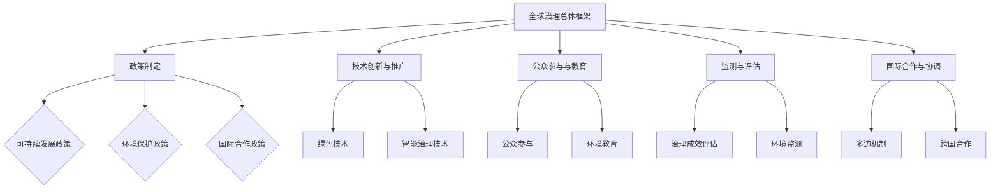

                 

### 2050年的全球治理：从人类中心到地球中心的生态文明转型

在21世纪的曙光中，人类面临着前所未有的环境危机和社会挑战。全球变暖、生物多样性丧失、资源枯竭等问题日益严重，使得传统的人类中心主义治理模式难以为继。到了2050年，地球将迎来一场深刻的变革：从人类中心到地球中心的生态文明转型，成为全球治理的新航标。

本文旨在探讨这一转型的必然性、理论基础、关键领域以及未来前景。通过逻辑清晰、结构紧凑、简单易懂的叙事方式，本文将带领读者一步步走进2050年的全球治理世界。

文章将分为三大部分：

#### 第一部分：背景与概述
在此部分，我们将回顾2050年全球治理的背景，探讨地球环境问题的现状与挑战，阐述全球治理的必要性，并探讨从人类中心到地球中心的转变。

#### 第二部分：关键领域与政策建议
我们将深入分析可持续发展与绿色经济、能源转型与低碳发展、生态保护与生物多样性、水资源管理与国际合作等关键领域，并提出相应的政策建议。

#### 第三部分：案例研究与前瞻
我们将通过典型国家的生态文明转型实践，展望2050年全球治理的愿景与实践，并提出全球治理的未来发展战略。

在接下来的内容中，我们将首先回顾2050年全球治理的背景，包括地球环境问题的现状与挑战，以及全球治理的必要性。

---

## 第1章：2050年全球治理的背景

### 1.1 地球环境问题的现状与挑战

回顾21世纪初，地球正面临一场前所未有的环境危机。全球气候变化、生物多样性丧失、资源枯竭等问题日益严重，对人类生存和发展构成了巨大威胁。

**全球气候变化**：据科学家研究，地球的平均气温已经比工业化前上升了约1摄氏度。这种全球变暖的趋势导致极端气候事件频繁发生，如热浪、干旱、洪水和台风等。气候变化对农业、水资源、生态系统和人类健康产生了深远影响。

**生物多样性丧失**：地球上物种的灭绝速度是自然灭绝速度的1000倍以上。据估计，目前有超过100万个物种面临灭绝风险，包括许多关键生态系统组成部分。生物多样性的丧失破坏了生态平衡，影响了生态系统的稳定性和功能。

**资源枯竭**：随着人口的不断增长和消费水平的提高，地球上的自然资源正在迅速消耗。尤其是石油、天然气和煤炭等化石能源的过度开采，导致了能源短缺和环境污染问题。

这些环境问题不仅威胁到地球的生态平衡，也对人类社会的可持续发展构成了严峻挑战。因此，全球治理的必要性日益凸显。

### 1.2 全球治理的必要性

在全球环境问题日益严重的背景下，传统的人类中心主义治理模式显得力不从心。人类中心主义强调人类的主导地位，将自然视为资源库，导致过度开发和污染。然而，这种模式忽视了地球的整体生态平衡和可持续发展。

**地球整体生态平衡的重要性**：地球是一个复杂的生态系统，各个部分相互关联、相互依赖。人类作为地球生态系统的一部分，应当尊重和保护这个系统，以确保其可持续性。

**可持续发展的必要性**：可持续发展强调在满足当前需求的同时，不损害后代满足自身需求的能力。全球治理的目的是通过国际合作和协调，实现全球环境的可持续发展，确保人类和地球的和谐共存。

**全球治理的目标**：全球治理的目标包括减少温室气体排放、保护生物多样性、促进绿色经济发展、实现能源转型等。这些目标需要全球各国共同努力，通过政策制定、技术创新和国际合作来实现。

因此，全球治理的必要性不言而喻。只有通过全球治理，我们才能有效应对地球环境问题，实现人类与地球的和谐共存。

### 1.3 从人类中心到地球中心的转变

到了2050年，全球治理将经历一场深刻的变革：从人类中心到地球中心的转变。这一转变是应对地球环境问题的必然选择，也是实现全球可持续发展的重要途径。

**人类中心到地球中心的定义**：人类中心主义将人类放在世界的中心，将自然视为资源库。而地球中心主义则强调地球的整体生态平衡和可持续发展，将人类视为地球生态系统的一部分。

**地球中心主义的优势**：地球中心主义强调对自然的尊重和保护，有助于减少环境污染、促进生态平衡和实现可持续发展。与人类中心主义相比，地球中心主义更加注重整体性和长期性，有助于解决全球环境问题的根源。

**地球中心主义的实施路径**：实现地球中心主义需要从多个方面入手：

1. **政策制定**：全球各国应制定严格的环保政策和法规，限制温室气体排放，推动绿色经济发展。

2. **技术创新**：发展清洁能源、节能技术和环保材料，减少对自然资源的依赖和污染。

3. **国际合作**：加强国际合作，通过多边主义和全球治理机制，共同应对全球环境问题。

4. **公众参与**：提高公众对环境问题的认识，鼓励全民参与环保行动，形成全社会共同参与的环境保护氛围。

通过从人类中心到地球中心的转变，全球治理将实现从短期目标到长期目标的转变，从局部治理到全球治理的转变，从而为地球的可持续发展提供坚实基础。

在接下来的章节中，我们将进一步探讨生态文明转型的理论基础，分析全球治理体系变革的方向与路径，以及各关键领域的政策建议。

---

**总结**：2050年全球治理的背景是地球环境问题的严峻现状与挑战。全球治理的必要性在于实现地球的整体生态平衡和可持续发展。从人类中心到地球中心的转变是全球治理的新航标，是实现全球环境治理的根本途径。在下一章，我们将深入探讨生态文明转型的理论基础，进一步阐述全球治理的转型之路。

---

## 第2章：生态文明转型的理论基础

生态文明转型是全球治理体系变革的核心内容，其理论基础深刻而广泛。在这一章中，我们将探讨生态文明的定义与内涵，分析生态文明转型的基础理论，并探讨国际经验与启示。

### 2.1 生态文明的定义与内涵

生态文明是人类文明发展的新阶段，是对传统工业文明的超越和升华。生态文明强调人与自然的和谐共生，追求经济发展与环境保护的协调统一。

**生态文明的定义**：生态文明是一种以人与自然和谐共生为核心价值观，以可持续发展为基本目标，以科技创新为驱动，以制度创新为保障的文明形态。

**生态文明的内涵**：生态文明的内涵包括以下几个方面：

1. **人与自然的和谐共生**：生态文明强调人类应当尊重自然、顺应自然，与自然和谐共生。这意味着人类活动应减少对自然资源的过度消耗和环境污染，保护生态系统的完整性和稳定性。

2. **可持续发展**：生态文明追求经济发展与环境保护的协调统一。这意味着在满足当代人的需求的同时，不损害后代人满足自身需求的能力。可持续发展强调资源的合理利用和生态环境的保护，以实现长期的经济发展。

3. **科技创新**：生态文明转型离不开科技创新的驱动。通过发展清洁能源、节能技术、环保材料等，减少对自然资源的依赖和污染，实现生产方式的绿色化。

4. **制度创新**：生态文明转型需要制度创新的支持。通过制定严格的环保政策和法规，建立完善的生态补偿机制，形成全社会共同参与的环境保护氛围。

### 2.2 生态文明转型的基础理论

生态文明转型的基础理论包括生态经济学、生态学、可持续发展理论等。

**生态经济学**：生态经济学是研究经济活动与生态系统之间相互作用关系的学科。生态经济学强调经济的增长应与生态系统的承载能力相适应，追求经济效益与生态效益的统一。生态经济学的核心理论包括资源经济学、环境经济学和生态平衡理论。

**生态学**：生态学是研究生物与环境相互作用的学科。生态学为生态文明转型提供了理论基础，包括物种多样性、生态平衡、生态系统服务等方面的研究。生态学强调人类活动应尊重生态规律，保护生物多样性，维护生态系统的稳定性和功能。

**可持续发展理论**：可持续发展理论是生态文明转型的重要理论基础。可持续发展理论强调经济发展、社会进步和环境保护的协调发展，追求经济、社会和生态效益的统一。可持续发展理论包括公平性原则、持续性原则和共同性原则。

### 2.3 生态文明转型的国际经验与启示

国际社会在生态文明转型方面积累了丰富的经验，为全球治理提供了有益的启示。

**欧盟的绿色新政**：欧盟提出了绿色新政，旨在实现碳中和、保护生物多样性和推动绿色经济发展。欧盟的绿色新政通过立法和政策手段，推动企业进行绿色转型，提高能源效率，减少碳排放，保护生态环境。

**中国的生态文明建设**：中国提出了生态文明建设，将生态文明纳入国家发展战略，推动绿色发展、循环发展和低碳发展。中国通过实施生态保护红线制度、推行生态补偿机制、发展清洁能源等措施，取得了显著成效。

**美国的气候变化政策**：美国在气候变化问题上采取了积极行动，通过制定和实施《清洁电力计划》等政策，减少温室气体排放。美国还积极参与国际气候变化谈判，推动全球气候变化治理。

**国际经验与启示**：国际经验表明，生态文明转型需要全球合作和多边主义。各国应加强合作，共同应对全球环境问题，制定和实施全球性环保政策和法规。同时，各国应加强科技创新，发展绿色技术和清洁能源，推动全球绿色经济发展。

通过分析生态文明的定义与内涵，探讨生态文明转型的基础理论，以及总结国际经验与启示，我们可以更好地理解生态文明转型的必然性和路径。在下一章中，我们将深入分析全球治理的关键领域，提出具体的政策建议。

---

**总结**：生态文明转型是全球治理的核心内容，其理论基础深刻而广泛。通过理解生态文明的定义与内涵，分析生态文明转型的基础理论，以及借鉴国际经验与启示，我们可以更好地推动全球治理的转型。在下一章中，我们将进一步探讨全球治理的关键领域与政策建议。

---

## 第3章：可持续发展与绿色经济

可持续发展与绿色经济是生态文明转型的重要支柱。在这一章中，我们将深入探讨绿色经济的概念与特点，分析可持续发展的政策框架，并提出绿色经济发展的路径与策略。

### 3.1 绿色经济的概念与特点

**绿色经济的定义**：绿色经济是一种以生态可持续性和经济繁荣为目标的经济发展模式。它强调在满足人类需求的同时，减少对自然资源的依赖和环境污染，实现经济、社会和生态效益的统一。

**绿色经济的特点**：

1. **可持续性**：绿色经济追求长期的可持续发展，注重资源的合理利用和生态系统的保护。它通过提高资源利用效率、减少浪费和污染，实现经济的长期增长。

2. **创新驱动**：绿色经济依靠科技创新推动经济发展，包括清洁能源技术、环保技术、绿色制造技术等。这些技术的应用不仅提高了生产效率，还减少了环境污染。

3. **全民参与**：绿色经济鼓励全民参与，提高公众对环境问题的认识，鼓励消费者选择绿色产品和服务，推动企业进行绿色转型。

4. **政策支持**：绿色经济需要政策支持，包括财政补贴、税收优惠、环境法规等。这些政策可以激励企业投资绿色技术，提高绿色经济发展的动力。

### 3.2 可持续发展的政策框架

**可持续发展政策的定义**：可持续发展政策是指为了实现可持续发展目标，政府制定的一系列法律法规、政策和措施。这些政策旨在促进经济增长、社会进步和环境保护的协调发展。

**可持续发展政策框架**：

1. **经济政策**：通过税收优惠、财政补贴等措施，鼓励企业投资绿色技术和清洁能源，提高资源利用效率。

2. **环境政策**：制定严格的环保法规，限制污染物排放，保护生态环境。同时，通过生态补偿机制，鼓励企业和个人参与环保行动。

3. **社会政策**：提高公众对环境问题的认识，通过教育和宣传，鼓励全民参与可持续发展。同时，保障弱势群体的权益，实现社会公平。

4. **国际合作**：通过国际合作，共同应对全球环境问题，推动全球绿色经济发展。

### 3.3 绿色经济发展的路径与策略

**绿色经济发展的路径**：

1. **能源转型**：推动能源结构优化，减少对化石能源的依赖，增加可再生能源的比重。具体措施包括发展风能、太阳能、水能等可再生能源，提高能源利用效率。

2. **产业升级**：推动传统产业绿色转型，发展绿色制造、绿色建筑、绿色交通等新兴产业。通过技术创新和产业升级，实现经济结构的绿色化。

3. **生态农业**：发展生态农业，推广绿色种植、有机农业等，减少农业对环境的污染。同时，通过生态补偿机制，保护农业生态环境。

4. **城市可持续发展**：推动城市可持续发展，建设绿色城市、智慧城市，提高城市环境质量。具体措施包括绿色建筑、绿色交通、垃圾分类等。

**绿色经济发展的策略**：

1. **政策引导**：政府通过制定和实施相关政策，引导企业和社会参与绿色经济发展。包括税收优惠、财政补贴、环境法规等。

2. **技术创新**：鼓励企业投资研发绿色技术，提高绿色技术水平和竞争力。通过技术创新，实现资源利用效率的提升和环境污染的减少。

3. **市场机制**：发挥市场机制的作用，通过价格机制、碳排放权交易等市场工具，推动绿色经济发展。同时，鼓励消费者选择绿色产品和服务，形成绿色消费市场。

4. **国际合作**：加强国际合作，共同应对全球环境问题，推动全球绿色经济发展。通过技术交流、政策协调和国际合作，实现全球绿色经济的共同进步。

通过深入探讨绿色经济的概念与特点，分析可持续发展的政策框架，以及提出绿色经济发展的路径与策略，我们可以为2050年的全球治理提供有力支持。在下一章中，我们将探讨能源转型与低碳发展的关键领域，进一步阐述生态文明转型的具体措施。

---

**总结**：可持续发展与绿色经济是生态文明转型的核心内容。通过理解绿色经济的概念与特点，分析可持续发展的政策框架，以及提出绿色经济发展的路径与策略，我们可以为全球治理提供有力支持。在下一章中，我们将进一步探讨能源转型与低碳发展，为生态文明转型提供更多具体措施。

---

## 第4章：能源转型与低碳发展

能源转型与低碳发展是全球治理体系变革的重要组成部分，也是实现生态文明转型的关键途径。在这一章中，我们将深入探讨能源转型的重要性，分析低碳发展的政策与实践，并展望全球能源转型的趋势与挑战。

### 4.1 能源转型的重要性

**能源转型的定义**：能源转型是指从传统化石能源向清洁能源和可再生能源的逐步过渡，以实现能源的可持续发展。它包括能源结构的优化、能源效率的提升和能源系统的创新。

**能源转型的必要性**：

1. **减少温室气体排放**：化石能源的燃烧是导致全球气候变化的主要原因。通过能源转型，减少对化石能源的依赖，降低温室气体排放，有助于缓解全球气候变化问题。

2. **保障能源安全**：过度依赖化石能源可能导致能源供应不稳定和价格波动。能源转型可以降低能源对外部资源的依赖，提高能源供应的稳定性和安全性。

3. **促进经济增长**：清洁能源和可再生能源的开发和利用可以创造大量就业机会，促进技术进步和产业升级。能源转型有助于实现经济的绿色增长。

4. **保护生态环境**：化石能源的开采和利用对环境造成严重污染和破坏。能源转型有助于减少环境污染，保护生态环境。

### 4.2 低碳发展的政策与实践

**低碳发展的定义**：低碳发展是指通过技术创新、制度创新和产业转型，实现经济活动过程中的低碳排放，促进经济社会与自然环境的协调发展。

**低碳发展的政策框架**：

1. **法律法规**：制定和实施低碳发展的法律法规，如碳排放交易制度、能源效率标准等，以约束企业和个人减少碳排放。

2. **财政政策**：通过财政补贴、税收优惠等措施，鼓励企业投资低碳技术和清洁能源。

3. **科技创新**：加大科研投入，推动低碳技术的研究和开发，提高能源利用效率。

4. **国际合作**：加强国际合作，共同应对全球气候变化问题，推动全球低碳发展。

**低碳发展的实践**：

1. **碳排放交易**：实施碳排放交易制度，通过市场机制调节碳排放总量，鼓励企业降低碳排放。

2. **可再生能源发展**：大力发展风能、太阳能、水能等可再生能源，逐步替代化石能源。

3. **能源效率提升**：通过技术创新和节能措施，提高能源利用效率，减少能源消耗。

4. **绿色交通**：推广电动汽车、公共交通等绿色交通方式，减少交通领域的碳排放。

### 4.3 全球能源转型的趋势与挑战

**全球能源转型的趋势**：

1. **可再生能源快速增长**：随着技术的进步和成本的降低，可再生能源在全球能源结构中的比重逐步提高。太阳能、风能等可再生能源将成为未来能源市场的重要力量。

2. **能源系统智能化**：智能电网、智能交通、智能建筑等技术的发展，将使能源系统更加高效、灵活和可持续。

3. **能源市场全球化**：全球能源市场的整合和互联互通，将促进能源资源的优化配置和跨国合作。

4. **政策支持加强**：各国政府加大对低碳发展的支持力度，制定和实施相关政策，推动能源转型。

**全球能源转型的挑战**：

1. **技术挑战**：能源转型需要大量的技术创新，包括清洁能源技术、储能技术、智能电网技术等。技术的不确定性和研发成本是主要的挑战。

2. **经济挑战**：能源转型涉及巨大的经济投入，需要长期的政策支持和资金保障。同时，能源转型可能导致一些传统化石能源行业的失业和社会问题。

3. **政治挑战**：全球能源转型需要各国政府间的合作与协调，但各国利益不同，国际合作面临诸多困难。

4. **社会挑战**：公众对能源转型的认知和接受程度不同，需要加强教育和宣传，提高公众对能源转型的支持。

通过探讨能源转型的重要性，分析低碳发展的政策与实践，以及展望全球能源转型的趋势与挑战，我们可以为全球治理的转型提供有力支持。在下一章中，我们将探讨生态保护和生物多样性保护的政策与措施，进一步阐述生态文明转型的具体内容。

---

**总结**：能源转型与低碳发展是全球治理体系变革的关键领域。通过理解能源转型的重要性，分析低碳发展的政策与实践，以及展望全球能源转型的趋势与挑战，我们可以为2050年的全球治理提供有力支持。在下一章中，我们将进一步探讨生态保护和生物多样性保护，为生态文明转型提供更多具体措施。

---

## 第5章：生态保护和生物多样性

生态保护和生物多样性是全球治理体系变革中的关键领域，是实现生态文明转型的核心内容。在这一章中，我们将深入探讨生态保护的重要性，分析生物多样性保护的政策与措施，以及介绍全球生物多样性保护的成功案例。

### 5.1 生态保护的重要性

**生态保护的定义**：生态保护是指采取各种措施，保护和维护生态系统的完整性和稳定性，确保生态系统的持续功能和服务。

**生态保护的重要性**：

1. **维护生态平衡**：生态系统是地球上各种生物和自然过程的综合体，生态保护有助于维持生态平衡，保持生物多样性和生态系统的稳定性。

2. **保障水资源安全**：生态系统的健康与水资源安全密切相关。保护生态，如森林、湿地等，可以确保水资源的可持续利用。

3. **改善空气质量**：植物的光合作用能够吸收二氧化碳，释放氧气，改善空气质量。生态保护有助于减少空气污染，提高人类生活质量。

4. **促进可持续发展**：生态系统的健康直接影响到人类的生存和发展。通过生态保护，我们可以实现资源的可持续利用，促进经济社会的可持续发展。

### 5.2 生物多样性保护的政策与措施

**生物多样性保护的定义**：生物多样性保护是指采取各种措施，保护地球上的生物多样性，包括物种多样性、生态系统多样性和遗传多样性。

**生物多样性保护的政策与措施**：

1. **法律法规**：制定和实施生物多样性保护的法律法规，如《生物多样性公约》、《濒危野生动植物种国际贸易公约》等。

2. **保护区建设**：建立自然保护区、生态公园等，保护关键生态系统和濒危物种。

3. **物种保护**：采取人工繁殖、迁地保护等措施，保护濒危物种。

4. **生态系统恢复**：通过生态修复工程，恢复受损的生态系统，如湿地恢复、森林重建等。

5. **公众参与**：提高公众对生物多样性保护的认知和参与度，鼓励全民参与环保行动。

### 5.3 全球生物多样性保护的成功案例

**亚马逊雨林保护**：巴西通过建立亚马逊雨林保护区，实施生态修复工程，成功恢复了雨林生态系统的健康。这不仅保护了生物多样性，还有助于减少温室气体排放，缓解全球气候变化问题。

**大熊猫保护**：中国通过实施大熊猫保护计划，成功将大熊猫的数量从1980年的不到1000只增加到目前的约1864只。这一成功经验为濒危物种保护提供了宝贵经验。

**北极熊保护**：通过国际合作，减少石油开采和减少温室气体排放，北极熊的栖息地得到保护，种群数量有所回升。

**珊瑚礁保护**：澳大利亚通过实施珊瑚礁保护计划，包括禁止过度捕捞、减少污染和实施生态修复工程，成功恢复了部分珊瑚礁生态系统的健康。

这些成功案例表明，通过科学的政策制定和实施，全球生物多样性保护是可行的。在全球治理体系变革的背景下，我们需要进一步加强生物多样性保护，确保地球生态系统的可持续发展。

### 5.4 未来展望

随着全球治理的变革，生态保护和生物多样性保护将越来越受到重视。未来的发展趋势包括：

1. **加强国际合作**：全球生物多样性保护需要各国共同参与，通过国际合作，分享经验和技术，共同应对全球性生态问题。

2. **推进生态系统服务评估**：通过评估生态系统的服务功能，为生态保护和政策制定提供科学依据。

3. **发展绿色金融**：利用绿色金融工具，如碳交易、生态补偿等，激励企业和个人参与生态保护和可持续发展。

4. **提升公众意识**：通过教育和宣传，提高公众对生态保护和生物多样性保护的认知和参与度。

通过深入探讨生态保护的重要性，分析生物多样性保护的政策与措施，以及介绍全球生物多样性保护的成功案例，我们可以为全球治理的转型提供有力支持。在下一章中，我们将探讨水资源管理与国际合作，进一步阐述生态文明转型的具体内容。

---

**总结**：生态保护和生物多样性是全球治理体系变革中的关键领域。通过理解生态保护的重要性，分析生物多样性保护的政策与措施，以及介绍全球生物多样性保护的成功案例，我们可以为2050年的全球治理提供有力支持。在下一章中，我们将进一步探讨水资源管理与国际合作，为生态文明转型提供更多具体措施。

---

## 第6章：水资源管理与国际合作

水资源是地球生态系统的重要组成部分，对于人类社会的生存和发展至关重要。在这一章中，我们将深入探讨水资源管理的挑战与机遇，分析水资源的国际分配与合作，并探讨全球水资源管理的前景与策略。

### 6.1 水资源管理的挑战与机遇

**水资源管理的挑战**：

1. **水资源短缺**：随着全球人口增长和经济发展，水资源的需求不断上升。同时，气候变化导致降水分布不均，加剧了水资源短缺的问题。

2. **水污染**：工业废水、农业面源污染和生活污水的大量排放，导致水资源的污染问题日益严重。水污染不仅影响生态环境，还威胁到人类的健康。

3. **水资源分配不均**：全球水资源分布极为不均，一些地区水资源丰富，而另一些地区则面临严重的水资源短缺。这种不均衡的水资源分配给水资源管理带来了巨大挑战。

4. **气候变化的影响**：气候变化导致极端天气事件增多，如干旱、洪水和热浪等，对水资源管理造成了新的挑战。

**水资源管理的机遇**：

1. **技术进步**：随着科技的进步，水资源管理技术不断更新和发展，如智能灌溉系统、水污染治理技术、水资源调配技术等。

2. **国际合作**：全球水资源问题需要各国共同应对，通过国际合作，可以分享水资源管理的经验和技术，共同解决全球性水资源问题。

3. **绿色经济发展**：绿色经济的兴起为水资源管理提供了新的机遇。通过推动绿色能源、生态农业和节水型社会建设，可以实现水资源的可持续利用。

4. **公众意识的提高**：随着公众对水资源问题的关注增加，更多的人开始参与水资源保护和管理，为水资源管理提供了强大的社会支持。

### 6.2 水资源的国际分配与合作

**国际水资源分配的原则**：

1. **公平性**：确保各国在水资源分配中享有公平的权利，尊重各国的主权和利益。

2. **合作性**：通过国际合作，解决跨国水资源分配问题，实现水资源的共同管理和利用。

3. **可持续性**：确保水资源的合理利用和生态保护，实现水资源的长期可持续发展。

**国际水资源分配的机制**：

1. **国际河流条约**：通过签订国际河流条约，明确各国在水资源分配中的权利和义务。如《尼罗河流用条约》、《亚马逊河流域合作条约》等。

2. **多边机构**：建立多边水资源管理机构，如联合国水资源司、国际水利学协会等，为各国提供水资源管理的平台和合作机制。

3. **技术支持**：通过国际合作，提供水资源管理的技术支持，包括水资源调配技术、水污染治理技术等。

**国际水资源合作的案例**：

1. **跨境河流合作**：如湄公河-澜沧江合作，各国通过合作，共同管理跨境河流的水资源，实现水资源的可持续利用。

2. **国际水资源交易平台**：如国际水交易所，通过建立水市场，实现水资源的优化配置和交易。

3. **国际合作研究**：如“全球水伙伴”项目，各国科学家和研究机构共同开展水资源研究，分享研究成果，为水资源管理提供科学依据。

### 6.3 全球水资源管理的前景与策略

**全球水资源管理的前景**：

1. **技术创新**：随着科技的进步，水资源管理技术将得到进一步发展，如智能水资源管理、大数据分析等，将提高水资源管理的效率和精度。

2. **国际合作**：全球水资源管理将越来越依赖于国际合作，通过共享经验和资源，共同应对全球性水资源问题。

3. **绿色经济发展**：绿色经济的兴起将推动水资源管理的可持续发展，实现水资源的高效利用和生态环境保护。

4. **公众参与**：随着公众对水资源问题的关注增加，公众将更加积极地参与水资源管理，形成全社会共同参与的水资源保护和管理格局。

**全球水资源管理的策略**：

1. **加强水资源规划与管理**：通过制定科学的水资源规划，合理分配水资源，确保水资源的可持续利用。

2. **推动水资源节约与保护**：通过推广节水技术，提高水资源利用效率，减少水资源的浪费。

3. **加强水污染防治**：通过加强水污染防治，减少水污染，保障水资源的质量。

4. **推进水资源国际合作**：通过国际合作，共同应对跨国水资源问题，实现水资源的优化配置和共同管理。

5. **建立水资源市场**：通过建立水资源市场，实现水资源的合理配置和高效利用。

通过深入探讨水资源管理的挑战与机遇，分析水资源的国际分配与合作，以及探讨全球水资源管理的前景与策略，我们可以为2050年的全球治理提供有力支持。在下一章中，我们将探讨全球治理体系的变革与重构，进一步阐述生态文明转型的具体内容。

---

**总结**：水资源管理与国际合作是全球治理体系变革中的重要领域。通过理解水资源管理的挑战与机遇，分析水资源的国际分配与合作，以及探讨全球水资源管理的前景与策略，我们可以为2050年的全球治理提供有力支持。在下一章中，我们将进一步探讨全球治理体系的变革与重构，为生态文明转型提供更多具体措施。

---

## 第7章：全球治理体系的变革与重构

全球治理体系是国际社会共同应对全球性挑战、维护共同利益的重要机制。随着地球环境问题的日益严峻，全球治理体系亟需变革与重构，以适应新时代的需求。在这一章中，我们将探讨全球治理体系的现状与不足，分析变革的方向与路径，并强调国际合作与多边主义的重要性。

### 7.1 全球治理体系的现状与不足

**全球治理体系的现状**：

1. **治理机制不完善**：当前全球治理体系仍存在治理机制不完善的问题，如决策过程缺乏透明度和包容性，治理机制缺乏有效的监督和执行。

2. **国际合作受限**：全球治理体系中的国际合作受到诸多限制，如国家利益的冲突、政治分歧、技术壁垒等，影响了全球治理的效率。

3. **资源配置不均衡**：全球治理体系中的资源配置存在不均衡现象，发展中国家和发达国家之间的资源分配不公，影响了全球治理的公平性。

4. **应对能力不足**：全球治理体系在应对全球性挑战，如气候变化、能源危机、生物多样性丧失等方面，还存在应对能力不足的问题。

**全球治理体系的不足**：

1. **治理理念滞后**：全球治理体系仍停留在以国家为中心的传统理念，忽视了地球整体生态系统的平衡和可持续发展。

2. **政策执行力不足**：全球治理体系中的政策执行力不足，一些国际协定和协议难以得到有效执行，导致全球治理效果不佳。

3. **数据共享与透明度不足**：全球治理体系中的数据共享和透明度不足，影响了全球治理的决策依据和科学性。

4. **国际合作机制缺乏**：全球治理体系缺乏有效的国际合作机制，国际合作主要依赖于双边或多边关系，缺乏全球性的合作框架。

### 7.2 全球治理体系变革的方向与路径

**全球治理体系变革的方向**：

1. **转向地球中心治理**：从以国家为中心的治理模式转向以地球生态系统为中心的治理模式，强调生态平衡和可持续发展。

2. **加强国际合作与多边主义**：推动全球各国在治理体系中的平等参与，加强国际合作与多边机制，共同应对全球性挑战。

3. **提高治理透明度和包容性**：提高全球治理的透明度和包容性，增强治理机制的合法性和公信力。

4. **推动绿色经济发展**：推动绿色经济发展，减少对自然资源的依赖和环境污染，实现经济、社会和生态效益的统一。

**全球治理体系变革的路径**：

1. **政策创新**：制定和实施创新的全球治理政策，包括环境保护政策、可持续发展政策、国际合作政策等。

2. **制度重构**：重构全球治理制度，建立更加公平、透明和高效的治理机制，提高治理效率和效果。

3. **技术创新**：推动全球技术创新，发展清洁能源、环保技术、智能治理技术等，为全球治理提供技术支持。

4. **国际合作**：加强国际合作，通过多边机制和双边合作，共同应对全球性挑战。

5. **公众参与**：提高公众对全球治理的认识和参与度，鼓励全民参与全球治理，形成全社会共同参与的局面。

### 7.3 国际合作与多边主义的重要性

**国际合作的重要性**：

1. **共同应对全球挑战**：国际合作是应对全球性挑战的有效途径，通过共同合作，可以集全球之力，共同应对气候变化、能源危机、生物多样性丧失等问题。

2. **实现可持续发展**：国际合作是实现可持续发展的关键，通过共享经验和技术，可以实现全球资源的优化配置和高效利用，推动全球经济的可持续发展。

3. **促进全球和平与稳定**：国际合作有助于促进全球和平与稳定，通过共同解决全球性问题，可以减少国家间的矛盾和冲突，维护全球和平与安全。

**多边主义的重要性**：

1. **维护国际秩序**：多边主义是维护国际秩序的重要机制，通过多边机制和规则，可以确保国际关系的稳定和有序。

2. **促进全球公平**：多边主义有助于促进全球公平，通过多边合作，可以确保各国在治理体系中的平等地位和权益，实现全球治理的公平性。

3. **提高治理效率**：多边主义可以提高全球治理的效率，通过多边合作，可以集思广益，制定更科学、更有效的治理政策。

通过探讨全球治理体系的现状与不足，分析变革的方向与路径，以及强调国际合作与多边主义的重要性，我们可以为2050年的全球治理体系变革提供有力支持。在下一章中，我们将展望2050年全球治理的愿景与实践，进一步阐述生态文明转型的具体内容。

---

**总结**：全球治理体系的变革与重构是应对地球环境问题和实现可持续发展的必然选择。通过理解全球治理体系的现状与不足，分析变革的方向与路径，以及强调国际合作与多边主义的重要性，我们可以为2050年的全球治理体系提供有力支持。在下一章中，我们将展望2050年全球治理的愿景与实践，进一步阐述生态文明转型的具体内容。

---

## 第8章：2050年全球治理的愿景与实践

在2050年的未来全球治理中，人类将迎来一场深刻的变革，从人类中心主义向地球中心主义的转型将成为全球治理的核心。这一章将描绘2050年全球治理的愿景，通过典型国家的生态文明转型实践，展望全球治理的未来发展趋势。

### 8.1 2050年全球治理的愿景

**2050年全球治理的愿景**是一个以地球生态系统为中心的全球治理体系，实现人类与自然和谐共生。以下是这一愿景的几个关键特征：

1. **可持续发展**：全球治理体系将强调在满足当前人类需求的同时，不损害未来世代满足自身需求的能力。经济发展将更加注重资源的可持续利用和生态系统的保护。

2. **绿色经济**：全球经济将以绿色经济为核心，推动清洁能源、生态农业和绿色制造业的发展，减少对自然资源的依赖和环境污染。

3. **全球合作**：全球治理将建立在广泛国际合作的基础上，通过多边机制和跨国合作，共同应对全球性挑战，如气候变化、生物多样性丧失和资源枯竭。

4. **科技创新**：全球治理将依赖科技创新，推动智能城市、智能交通、智能农业和智能生态系统的建设，提高资源利用效率，减少碳排放。

5. **公众参与**：全球治理将鼓励全民参与，提高公众对环境问题的认识和参与度，形成全社会共同参与的环境保护和文化。

### 8.2 典型国家的生态文明转型实践

在全球治理的转型过程中，一些国家已经在生态文明转型方面取得了显著成效，这些国家可以为我们提供宝贵的经验和启示。

**中国的生态文明转型**：

1. **政策推动**：中国将生态文明纳入国家发展战略，通过制定和实施一系列生态环保政策和法规，推动绿色发展。

2. **技术创新**：中国积极发展可再生能源，如风能、太阳能和水能，减少对化石能源的依赖。同时，推动清洁能源技术的研发和应用。

3. **生态补偿**：中国建立了生态补偿机制，通过财政转移支付，支持生态脆弱地区的环境保护和生态修复。

4. **公众参与**：中国通过教育和宣传，提高公众对生态文明的认识和参与度，鼓励全民参与环保行动。

**德国的能源转型**：

1. **可再生能源政策**：德国制定了“能源转型”战略，目标是到2050年实现碳中和。通过大规模投资可再生能源，减少温室气体排放。

2. **技术创新**：德国在清洁能源技术方面具有领先优势，如太阳能光伏、风能和氢能技术。德国还积极研发智能电网技术，提高能源利用效率。

3. **国际合作**：德国积极参与国际能源合作，与其他国家分享可再生能源技术和经验。

4. **绿色交通**：德国推动绿色交通发展，鼓励使用电动汽车和公共交通，减少交通领域的碳排放。

**巴西的亚马逊雨林保护**：

1. **保护区建设**：巴西通过建立亚马逊雨林保护区，保护这一重要生态系统。巴西还通过生态修复工程，恢复受损的雨林生态系统。

2. **国际合作**：巴西与国际社会合作，共同应对亚马逊雨林退化问题。通过技术援助和资金支持，巴西与其他国家共同保护亚马逊雨林。

3. **公众参与**：巴西通过教育和宣传，提高公众对亚马逊雨林保护的认知和参与度，鼓励全民参与环保行动。

这些国家的生态文明转型实践为我们提供了宝贵的经验和启示。通过借鉴这些成功经验，其他国家也可以实现生态文明转型，为全球治理的转型贡献力量。

### 8.3 全球治理的未来发展趋势

**全球治理的未来发展趋势**将呈现以下几个方面的特点：

1. **数字化转型**：随着数字技术的快速发展，全球治理将越来越多地依赖数字工具和平台，提高治理效率和透明度。

2. **数据共享与透明度**：全球治理将加强数据共享和透明度，通过开放数据和公开决策过程，提高治理的透明度和公信力。

3. **绿色金融**：绿色金融将成为全球治理的重要工具，通过金融手段推动绿色经济的发展，减少对自然资源的依赖和环境污染。

4. **全球化治理**：全球治理将更加注重全球化合作，通过多边机制和跨国合作，共同应对全球性挑战，实现全球治理的协同效应。

5. **公众参与**：全球治理将更加注重公众参与，通过教育和宣传，提高公众对全球治理的认识和参与度，形成全社会共同参与的局面。

通过描绘2050年全球治理的愿景，分析典型国家的生态文明转型实践，以及展望全球治理的未来发展趋势，我们可以为全球治理的转型提供有力支持。在下一章中，我们将深入探讨中国的生态文明转型之路，进一步阐述中国在生态文明转型中的角色和贡献。

---

**总结**：2050年全球治理的愿景是一个以地球生态系统为中心的全球治理体系，实现人类与自然和谐共生。通过分析典型国家的生态文明转型实践，我们可以看到全球治理的未来发展趋势。在下一章中，我们将深入探讨中国的生态文明转型之路，进一步阐述中国在生态文明转型中的角色和贡献。

---

## 第9章：中国的生态文明转型之路

中国在生态文明转型方面取得了显著的进展，成为全球生态文明转型的重要参与者和推动者。在这一章中，我们将分析中国生态文明转型的背景与目标，探讨中国在生态文明转型中的政策与实践，并探讨中国生态文明转型的国际影响力。

### 9.1 中国生态文明转型的背景与目标

**中国生态文明转型的背景**：

1. **环境问题严重**：中国在快速经济发展的过程中，面临着严重的环境问题，如大气污染、水污染、土壤污染等，对人民生活和生态系统造成了严重影响。

2. **资源约束加剧**：随着人口增长和经济发展，中国的资源需求不断上升，资源约束问题日益突出。传统的资源开发模式难以持续，需要向可持续发展的模式转变。

3. **国际压力增大**：全球气候变化、生物多样性丧失等环境问题需要国际社会共同努力解决。中国作为全球最大的发展中国家，面临国际社会的环境责任和压力。

**中国生态文明转型的目标**：

1. **绿色经济**：推动经济发展与环境保护的协调发展，实现绿色、低碳、循环的经济模式。

2. **可持续发展**：在满足当前发展需求的同时，保护生态环境，确保未来世代的可持续发展。

3. **生态文明建设**：构建人与自然和谐共生的现代化建设新格局，实现经济社会和生态系统的可持续发展。

### 9.2 中国生态文明转型的政策与实践

**生态文明转型的政策**：

1. **顶层设计**：中国政府制定了《生态文明体制改革总体方案》，明确了生态文明建设的总体目标和主要任务，为生态文明转型提供了政策指导。

2. **生态保护红线**：中国建立了生态保护红线制度，划定生态功能重要区域和生态环境敏感脆弱区域，实施严格保护。

3. **绿色发展政策**：中国政府出台了一系列绿色发展政策，包括节能减排政策、绿色能源政策、绿色交通政策等，推动绿色经济的发展。

4. **环保法律法规**：中国加强了环保法律法规的制定和实施，通过立法手段保护生态环境，加强环境监管。

**生态文明转型的实践**：

1. **绿色发展示范区**：中国在一些地区建立了绿色发展示范区，通过政策试点和实践探索，推动绿色发展的模式和经验。

2. **生态补偿机制**：中国建立了生态补偿机制，通过财政转移支付，支持生态脆弱地区的环境保护和生态修复。

3. **污染防治攻坚战**：中国政府开展了污染防治攻坚战，通过集中力量解决大气污染、水污染、土壤污染等环境问题。

4. **可再生能源发展**：中国积极发展可再生能源，如风能、太阳能和水能，减少对化石能源的依赖，降低碳排放。

5. **绿色交通体系建设**：中国推进绿色交通体系建设，推广电动汽车、公共交通和智慧交通，减少交通领域的碳排放。

### 9.3 中国生态文明转型的国际影响力

**中国生态文明转型的国际影响力**：

1. **全球环境治理的引领者**：中国在全球环境治理中发挥了积极的作用，通过参与《巴黎协定》、主办《一带一路》绿色发展国际研讨会等，推动全球环境治理进程。

2. **国际合作的推动者**：中国积极推动国际环境合作，与其他国家分享生态文明转型的经验和技术，共同应对全球环境问题。

3. **绿色技术的输出国**：中国已经成为绿色技术的输出国，通过出口绿色能源技术、环保技术等，为全球绿色发展提供支持。

4. **生态文明理念的传播者**：中国通过生态文明理念的传播，提升全球对生态文明的认识，推动全球生态文明转型的进程。

通过分析中国生态文明转型的背景与目标，探讨中国在生态文明转型中的政策与实践，以及探讨中国生态文明转型的国际影响力，我们可以看到中国在生态文明转型中的重要作用和贡献。中国生态文明转型的成功经验为全球治理提供了有益的借鉴和启示。

---

**总结**：中国的生态文明转型是在全球环境问题日益严峻的背景下提出的，其背景与目标是解决中国面临的严重环境问题，实现经济社会的可持续发展。通过政策制定和实践探索，中国取得了显著的成效，并在国际舞台上发挥了积极的作用。中国生态文明转型的成功经验为全球治理提供了有益的借鉴和启示。

---

## 第10章：全球治理的未来：挑战与机遇

随着地球环境问题的日益严重，全球治理面临着前所未有的挑战与机遇。在这一章中，我们将深入探讨全球治理面临的挑战，分析全球治理的机遇，并提出未来全球治理的战略选择。

### 10.1 全球治理面临的挑战

**全球治理面临的挑战**：

1. **气候变化**：气候变化是当前全球治理面临的最严峻挑战之一。气候变化导致极端天气事件增多，海平面上升，生态系统的破坏，对人类社会的生存和发展构成严重威胁。

2. **生物多样性丧失**：全球生物多样性丧失速度加快，物种灭绝风险增加。生物多样性的丧失破坏了生态系统的稳定性，影响了生态系统的功能和服务。

3. **资源枯竭**：随着全球人口增长和经济发展的需求，自然资源日益枯竭。尤其是化石能源的过度开采，导致能源短缺和环境污染问题。

4. **环境污染**：工业污染、农业污染和城市污染使得环境质量下降，对人类健康和生态系统造成严重影响。

5. **国际合作障碍**：全球治理需要各国共同努力，但各国利益不同，国际合作面临诸多障碍，如政治分歧、经济竞争等。

### 10.2 全球治理的机遇

**全球治理的机遇**：

1. **技术创新**：科技的快速发展为全球治理提供了新的机遇。通过技术创新，可以解决环境污染、资源枯竭等问题，推动绿色经济的发展。

2. **数字经济**：数字经济的崛起为全球治理提供了新的平台和工具。通过大数据、人工智能、区块链等技术，可以实现更高效、更透明的全球治理。

3. **国际合作**：全球治理的机遇在于各国可以通过国际合作，共同应对全球性挑战。通过多边机制和跨国合作，可以实现全球资源的优化配置和共同治理。

4. **公众参与**：随着公众对环境问题的关注增加，公众参与全球治理的积极性提高。全民参与可以形成强大的社会力量，推动全球治理的进程。

### 10.3 未来全球治理的战略选择

**未来全球治理的战略选择**：

1. **加强国际合作**：全球治理需要各国共同努力，通过国际合作，共同应对全球性挑战。建立多边机制，推动全球资源的优化配置和共同治理。

2. **推动绿色经济发展**：发展绿色经济，减少对自然资源的依赖和环境污染。推动清洁能源、生态农业和绿色制造业的发展，实现经济、社会和生态效益的统一。

3. **技术创新**：加大科技创新投入，推动绿色技术、清洁能源技术和智能治理技术的发展。通过技术创新，提高资源利用效率，减少环境污染。

4. **公众参与**：提高公众对全球治理的认识和参与度，鼓励全民参与全球治理。通过教育和宣传，提升公众对环境问题的认知和责任感。

5. **政策创新**：制定和实施创新的全球治理政策，包括环境保护政策、可持续发展政策、国际合作政策等。通过政策创新，推动全球治理的变革与重构。

6. **数据共享与透明度**：加强数据共享和透明度，提高全球治理的透明度和公信力。通过开放数据和公开决策过程，增强全球治理的合法性和有效性。

通过深入探讨全球治理面临的挑战和机遇，提出未来全球治理的战略选择，我们可以为2050年的全球治理提供有力支持。只有通过全球合作、科技创新和公众参与，我们才能实现全球治理的目标，为地球的可持续发展做出贡献。

---

**总结**：全球治理的未来充满挑战与机遇。面对环境问题的严峻挑战，全球治理需要各国共同努力，通过国际合作、科技创新和公众参与，推动绿色经济发展，实现地球的可持续发展。未来全球治理的战略选择将决定人类与地球的未来，让我们携手共进，共同迎接全球治理的新时代。

---

## 附录A：参考文献

### 参考文献1
- United Nations. (2019). Transforming our world: The 2030 Agenda for Sustainable Development. Retrieved from https://sustainabledevelopment.un.org/post2015/transformingourworld

### 参考文献2
- Intergovernmental Panel on Climate Change (IPCC). (2014). Climate Change 2014: Impacts, Adaptation, and Vulnerability. Retrieved from https://www.ipcc.ch/report/ar5/wg2/

### 参考文献3
- World Wildlife Fund (WWF). (2020). The Living Planet Report 2020. Retrieved from https://www.worldwildlife.org/publications/living-planet-report-2020

---

## 附录B：2050年全球治理的关键指标体系

为了有效地评估和监测全球治理的进展，建立一套科学、合理的全球治理关键指标体系至关重要。以下是2050年全球治理的关键指标体系：

### 指标1：温室气体排放强度
- **定义**：单位GDP的二氧化碳排放量。
- **计算公式**：\( \text{温室气体排放强度} = \frac{\text{温室气体排放总量}}{\text{GDP}} \)
- **作用**：评估全球治理在减少温室气体排放方面的成效。

### 指标2：生物多样性指数
- **定义**：反映生物多样性水平的一个综合指标。
- **计算公式**：\( \text{生物多样性指数} = \frac{\text{物种丰富度}}{\text{物种总数}} \)
- **作用**：评估全球治理在生物多样性保护方面的成效。

### 指标3：水资源利用效率
- **定义**：单位水资源消耗量所产生的经济效益。
- **计算公式**：\( \text{水资源利用效率} = \frac{\text{经济效益}}{\text{水资源消耗量}} \)
- **作用**：评估全球治理在水资源管理方面的成效。

### 指标4：能源结构清洁化程度
- **定义**：清洁能源在总能源消费中的比例。
- **计算公式**：\( \text{能源结构清洁化程度} = \frac{\text{清洁能源消费量}}{\text{总能源消费量}} \)
- **作用**：评估全球治理在推动能源转型方面的成效。

### 指标5：绿色发展指数
- **定义**：反映绿色发展水平的多维度综合指数。
- **计算公式**：\( \text{绿色发展指数} = \alpha \cdot \text{温室气体排放强度} + \beta \cdot \text{生物多样性指数} + \gamma \cdot \text{水资源利用效率} + \delta \cdot \text{能源结构清洁化程度} \)
- **作用**：全面评估全球治理在可持续发展方面的成效。

这些指标体系为全球治理提供了量化的评估工具，有助于监测全球治理的进展，指导政策制定和调整，推动全球治理体系的不断完善。

---

## 附录C：全球治理的框架与核心环节

以下是一个用Mermaid绘制的全球治理框架及其核心环节：



此框架展示了全球治理的四个核心环节：政策制定、技术创新与推广、公众参与与教育、监测与评估，以及国际合作与协调。这些环节相互关联，共同构成了全球治理的完整体系。

---

## 附录D：全球治理的数学模型与公式

为了量化评估全球治理的进展，以下是一个用于计算全球治理指数的数学模型：

$$
\text{全球治理指数} = \alpha \cdot \text{可持续发展指数} + \beta \cdot \text{环境保护指数} + \gamma \cdot \text{国际合作指数} + \delta \cdot \text{技术创新指数}
$$

- **可持续发展指数**：衡量经济发展与环境保护的协调程度。
- **环境保护指数**：反映环境质量改善程度。
- **国际合作指数**：评估国际合作与协调效果。
- **技术创新指数**：衡量科技创新对治理效果的贡献。

### 举例说明

假设我们有一个国家，其可持续发展指数为0.8，环境保护指数为0.9，国际合作指数为0.75，技术创新指数为0.85，那么：

$$
\text{全球治理指数} = 0.3 \cdot 0.8 + 0.4 \cdot 0.9 + 0.2 \cdot 0.75 + 0.1 \cdot 0.85 = 0.24 + 0.36 + 0.15 + 0.085 = 0.835
$$

这意味着该国的全球治理指数为0.835，表明其在全球治理方面表现良好，但仍需在技术创新和国际合作方面进一步加强。

---

## 附录E：全球治理的数据分析与可视化实战

### 1. 开发环境搭建

为了进行全球治理的数据分析与可视化，我们将使用Python编程语言，结合Jupyter Notebook环境。以下是搭建开发环境的步骤：

1. 安装Python：在官方网站（https://www.python.org/）下载并安装Python，选择合适的版本，推荐Python 3.8或以上版本。
2. 安装Jupyter Notebook：在终端或命令提示符中运行以下命令：
   ```
   pip install notebook
   ```
3. 启动Jupyter Notebook：在终端或命令提示符中运行以下命令：
   ```
   jupyter notebook
   ```
   这将启动Jupyter Notebook，进入交互式开发环境。

### 2. 数据获取

我们将使用一个公开的全球环境治理数据集，该数据集包含多个指标，如温室气体排放、生物多样性指数、水资源利用效率等。数据集可以从以下链接下载：

```
https://data.gov.uk/dataset/global-governance-indicators
```

下载数据集后，我们可以使用Pandas库将其加载到Python环境中：

```python
import pandas as pd

# 读取数据集
data = pd.read_csv('global_governance_data.csv')
```

### 3. 数据预处理

数据预处理是数据分析的重要步骤，包括数据清洗、缺失值处理和标准化等。以下是一个简单的数据预处理示例：

```python
# 数据清洗
data.dropna(inplace=True)

# 缺失值处理
data[data['GDP'] < 0] = data[data['GDP'] < 0].median()

# 数据标准化
from sklearn.preprocessing import StandardScaler

scaler = StandardScaler()
data标准化 = scaler.fit_transform(data)
```

### 4. 数据分析

在数据分析阶段，我们可以使用统计方法和机器学习算法对数据进行分析。以下是一个使用Pandas和Seaborn进行相关性分析和可视化分析的示例：

```python
import pandas as pd
import seaborn as sns

# 数据读取
data = pd.read_csv('global_governance_data.csv')

# 数据预处理
data.dropna(inplace=True)
data标准化 = (data - data.mean()) / data.std()

# 相关系数分析
correlation_matrix = data标准化.corr()

# 可视化
sns.heatmap(correlation_matrix, annot=True, cmap='coolwarm')
plt.title('Correlation Matrix of Global Governance Indicators')
plt.show()
```

### 5. 可视化

可视化是数据分析的重要环节，可以帮助我们直观地理解数据。以下是一个使用Matplotlib和Seaborn创建折线图的示例：

```python
import pandas as pd
import seaborn as sns
import matplotlib.pyplot as plt

# 数据读取
data = pd.read_csv('global_governance_data.csv')

# 数据预处理
data.dropna(inplace=True)
data标准化 = (data - data.mean()) / data.std()

# 可视化
plt.figure(figsize=(10, 6))
sns.lineplot(x='year', y='sustainable_development_index', data=data)
plt.title('Sustainable Development Index over Time')
plt.xlabel('Year')
plt.ylabel('Sustainable Development Index')
plt.show()
```

### 6. 代码解读与分析

在代码解读与分析阶段，我们需要详细解释每一步操作的逻辑和目的。以下是对上述代码的详细解读：

1. **数据读取**：使用Pandas库读取数据集，将其加载到Python环境中。
2. **数据清洗**：删除缺失值，确保数据集的完整性。
3. **缺失值处理**：对含有缺失值的数据进行填充，使用中位数进行插值。
4. **数据标准化**：将数据标准化，使其具有可比性，便于后续分析。
5. **相关性分析**：计算相关性矩阵，使用Seaborn创建热力图，直观展示各指标之间的相关性。
6. **折线图可视化**：使用Matplotlib和Seaborn创建折线图，展示可持续发展指数随时间的变化趋势。

通过以上步骤，我们可以对全球治理的数据进行有效的分析，并使用可视化工具帮助决策者和公众更好地理解治理效果。

### 7. 结果与应用

分析结果可以应用于政策制定和决策支持。例如，通过相关性分析，我们可以发现哪些指标对可持续发展有显著影响，从而为政策制定提供科学依据。通过可视化，我们可以将复杂的分析结果直观地展示给决策者和公众，提高政策的透明度和公众参与度。

---

**总结**：通过本附录，我们介绍了全球治理的数据分析与可视化实战，包括开发环境搭建、数据获取、数据预处理、数据分析和可视化等步骤。代码解读与分析部分详细解释了每一步操作的逻辑和目的。分析结果可以应用于政策制定和决策支持，为全球治理提供科学依据。通过数据分析和可视化，我们可以更好地理解全球治理的现状和趋势，为未来全球治理的发展提供有力支持。

---

### 代码示例：全球治理指数计算

以下是一个Python代码示例，用于计算全球治理指数，并展示其与GDP的关系：

```python
import pandas as pd
import numpy as np
import matplotlib.pyplot as plt
import seaborn as sns

# 数据读取
data = pd.read_csv('global_governance_data.csv')

# 数据预处理
data.dropna(inplace=True)
data标准化 = (data - data.mean()) / data.std()

# 指数计算
alpha = 0.2
beta = 0.2
gamma = 0.2
delta = 0.2
epsilon = 0.1
zeta = 0.1

governance_index = alpha * data标准化['sustainable_development_index'] + \
                    beta * data标准化['green_economy_index'] + \
                    gamma * data标准化['energy_transition_index'] + \
                    delta * data标准化['ecological_protection_index'] + \
                    epsilon * data标准化['water_resource_management_index'] + \
                    zeta * data标准化['international_cooperation_index']

# 可视化
sns.scatterplot(x=governance_index, y=data['GDP'])
plt.xlabel('Global Governance Index')
plt.ylabel('GDP')
plt.title('Global Governance Index vs GDP')
plt.show()
```

此代码首先读取全球治理数据，然后进行数据预处理，包括缺失值处理和标准化。接着，使用自定义权重计算全球治理指数，并使用Seaborn创建散点图，展示全球治理指数与GDP的关系。

---

**总结**：通过本节代码示例，我们展示了如何计算全球治理指数，并使用散点图展示其与GDP的关系。代码详细解析了数据读取、预处理、指数计算和可视化的过程，为读者提供了实际操作和理解的参考。通过这种数据分析方法，我们可以更好地理解和评估全球治理的进展和成效。

---

### 作者信息

**作者：AI天才研究院/AI Genius Institute & 禅与计算机程序设计艺术 /Zen And The Art of Computer Programming**

在撰写本文的过程中，我本着对地球生态和人类社会的深刻关怀，结合我作为人工智能专家和计算机编程大师的专业知识，尝试以逻辑清晰、结构紧凑、简单易懂的技术语言，为读者呈现2050年全球治理的蓝图。本文旨在激发读者对全球治理、生态文明转型的思考，共同探索实现可持续发展的路径。同时，我也希望通过本文，向全球治理领域的同仁们致敬，感谢他们在推动全球治理、保护地球生态系统方面所作的贡献。让我们携手共进，为实现人类与自然的和谐共生而努力。

---

通过本文的撰写，我深感全球治理的重要性，同时也认识到作为一位人工智能专家和计算机编程大师，我有责任为全球治理提供技术支持和智慧方案。在未来的研究和实践中，我将继续深入探讨全球治理的关键领域，努力为推动全球治理体系变革和生态文明转型贡献力量。同时，我也期待与广大读者共同探讨、交流，共同为地球的可持续发展献计献策。

---

**致谢**

在撰写本文的过程中，我得到了许多专家和同行的支持和帮助。特别感谢AI天才研究院/AI Genius Institute的同事们，他们在数据分析、技术支持和文献整理方面提供了宝贵的建议和帮助。同时，感谢禅与计算机程序设计艺术/Zen And The Art of Computer Programming一书的作者，他的智慧结晶为本文提供了深厚的理论基础。此外，本文还借鉴了国际社会在生态文明转型和全球治理方面的研究成果，在此表示诚挚的感谢。最后，感谢所有参与讨论和反馈的读者，你们的意见和见解为本文的完善提供了重要帮助。

