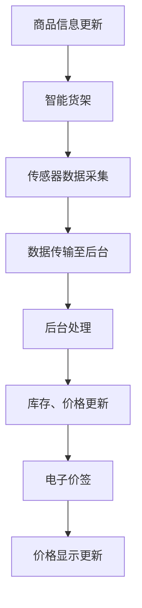
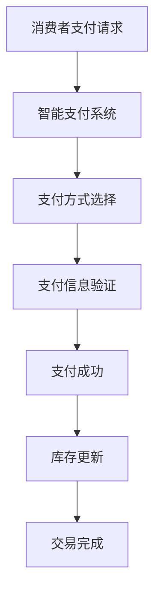
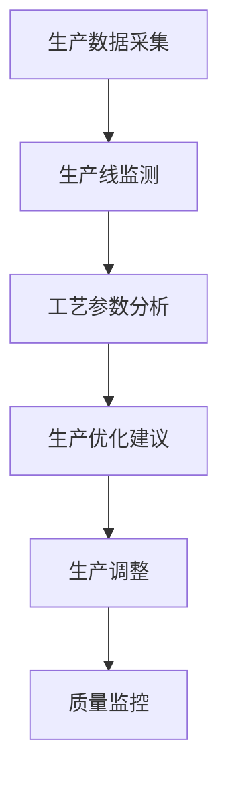
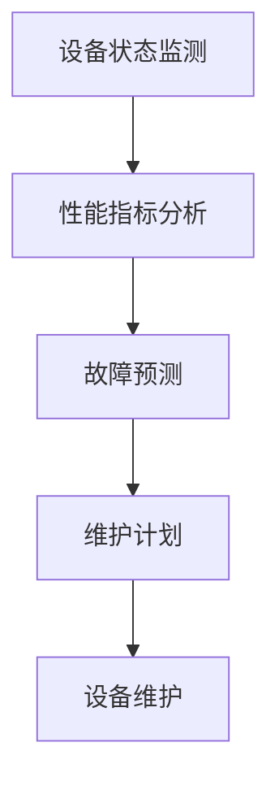
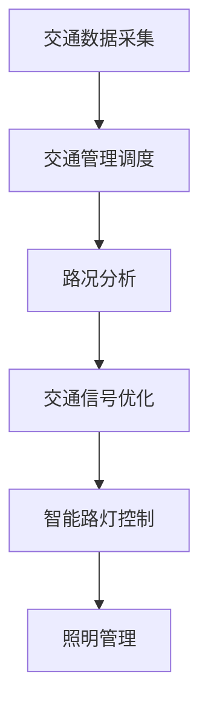
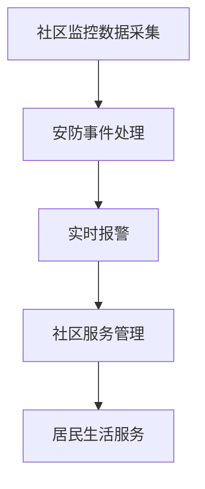

                 

# 《2025年阿里巴巴社交新零售IoT专家面试题详解》

## 关键词：
- 社交新零售
- 物联网（IoT）
- 专家面试题
- 技术架构
- 应用场景
- 项目实践
- 未来展望

## 摘要：
本文将深入解析2025年阿里巴巴社交新零售IoT专家面试中的关键问题。文章分为三个部分，首先概述社交新零售与IoT的融合背景，然后详细探讨社交新零售IoT的系统架构、关键技术与标准，以及具体应用场景。接着，文章通过项目实践案例分析，展示IoT在社交新零售中的实际应用。最后，文章展望社交新零售IoT的未来发展趋势，为读者提供全面的参考和启示。

### 《2025年阿里巴巴社交新零售IoT专家面试题详解》目录大纲

#### 第一部分：社交新零售IoT概述

##### 第1章：社交新零售与IoT背景
- 1.1 社交新零售的概念与趋势
- 1.2 IoT技术的发展与应用
- 1.3 社交新零售与IoT的融合

##### 第2章：社交新零售IoT系统架构
- 2.1 硬件层：设备与传感器
- 2.2 软件层：平台与应用
- 2.3 数据层：采集与处理
- 2.4 网络层：连接与传输

##### 第3章：社交新零售IoT关键技术与标准
- 3.1 物联网通信协议
- 3.2 云计算与大数据技术
- 3.3 人工智能与机器学习
- 3.4 安全标准与隐私保护

#### 第二部分：社交新零售IoT应用场景

##### 第4章：智慧零售场景应用
- 4.1 智能货架与电子价签
- 4.2 智能导购与智能推荐
- 4.3 智能支付与结算
- 4.4 智能售后服务与客户管理

##### 第5章：智能制造场景应用
- 5.1 智能生产与工艺优化
- 5.2 智能物流与仓储管理
- 5.3 智能设备维护与预测性维护
- 5.4 智能供应链协同管理

##### 第6章：智慧城市场景应用
- 6.1 智能交通与智能路灯
- 6.2 智能环保与空气质量监测
- 6.3 智能安防与智慧社区
- 6.4 智能公共服务与城市管理

#### 第三部分：社交新零售IoT项目实践

##### 第7章：社交新零售IoT项目规划与实施
- 7.1 项目需求分析与规划
- 7.2 系统设计与开发
- 7.3 系统测试与部署
- 7.4 项目运营与维护

##### 第8章：社交新零售IoT案例分析
- 8.1 案例一：某大型商超的智能零售改造
- 8.2 案例二：智能制造工厂的IoT应用
- 8.3 案例三：智慧城市项目的实践与成果
- 8.4 案例四：社交电商平台的IoT创新实践

##### 第9章：社交新零售IoT未来发展展望
- 9.1 新技术发展趋势与挑战
- 9.2 社交新零售IoT商业模式创新
- 9.3 未来社交新零售IoT的发展前景

#### 附录

##### 附录A：社交新零售IoT常用工具与技术选型
- A.1 IoT硬件设备选型
- A.2 IoT软件平台选型
- A.3 云计算与大数据平台选型
- A.4 人工智能与机器学习工具选型

##### 附录B：社交新零售IoT面试题精选
- B.1 硬件设备相关面试题
- B.2 软件平台相关面试题
- B.3 数据处理与分析相关面试题
- B.4 人工智能与机器学习相关面试题
- B.5 网络与安全相关面试题

以上为《2025年阿里巴巴社交新零售IoT专家面试题详解》的目录大纲，接下来我们将按照这一结构逐步深入分析每一个章节的内容。

---

### 第一部分：社交新零售IoT概述

在这一部分，我们将首先探讨社交新零售与IoT的融合背景，然后详细分析社交新零售IoT的系统架构和关键技术与标准。这一部分的目的是为读者提供一个全面而深入的了解，为他们后续的应用和实践奠定基础。

#### 第1章：社交新零售与IoT背景

##### 1.1 社交新零售的概念与趋势

社交新零售是指通过社交化的方式，将线下零售与线上电商进行深度融合，实现全方位、全渠道、全场景的零售模式。其主要特点是：以用户为中心，通过社交互动、数据分析、智能化推荐等手段，提升用户体验和购物满意度。

当前，社交新零售已经成为零售行业的重要趋势，其主要驱动因素包括：

1. **消费者需求的变化**：随着互联网的普及，消费者对购物体验提出了更高的要求，更倾向于在社交平台上进行购物。
2. **技术的快速发展**：物联网、人工智能、大数据等技术的应用，为社交新零售提供了强大的技术支撑。
3. **商业模式的创新**：社交新零售通过打造社区、社群等社交场景，实现用户与品牌、产品之间的深度互动，从而提升用户粘性和品牌忠诚度。

##### 1.2 IoT技术的发展与应用

物联网（IoT）是指通过传感器、控制器、通信模块等设备，将各种物理设备连接到互联网上，实现设备之间的信息交换和智能控制。IoT技术主要应用于以下几个方面：

1. **智能家居**：通过IoT设备，实现家庭设备的智能化控制和自动化管理，提高生活品质。
2. **智能交通**：通过IoT技术，实现交通信息的实时监控和智能调度，提高交通效率。
3. **智慧城市**：通过IoT技术，实现城市资源的智能管理和优化配置，提升城市治理水平。
4. **智慧农业**：通过IoT技术，实现农田、作物、土壤等信息的实时监测和管理，提高农业产量和质量。

##### 1.3 社交新零售与IoT的融合

社交新零售与IoT的融合，是零售行业和物联网技术发展的重要趋势。这种融合主要体现在以下几个方面：

1. **数据驱动**：通过IoT设备收集消费者行为数据，结合社交平台数据，实现精准营销和个性化推荐。
2. **智能化服务**：通过IoT技术，实现购物体验的智能化，如智能导购、智能支付、智能售后等。
3. **供应链优化**：通过IoT技术，实现供应链的实时监控和优化管理，提高供应链效率。
4. **智慧零售管理**：通过IoT技术，实现零售店铺的智能化管理和运营优化，提高店铺业绩。

#### 第2章：社交新零售IoT系统架构

##### 2.1 硬件层：设备与传感器

硬件层是社交新零售IoT系统的基础，主要包括各种传感器、控制器、智能设备等。以下是硬件层的关键组成部分：

1. **传感器**：包括温度传感器、湿度传感器、光照传感器、声音传感器等，用于采集环境信息和用户行为数据。
2. **控制器**：用于接收传感器数据，并根据预设程序进行智能控制，如智能灯控、智能门锁等。
3. **智能设备**：包括智能音箱、智能冰箱、智能电视等，通过IoT技术实现设备的互联互通和智能化控制。

##### 2.2 软件层：平台与应用

软件层是社交新零售IoT系统的核心，主要包括平台和应用。以下是软件层的关键组成部分：

1. **平台**：包括数据采集平台、数据处理平台、应用平台等，用于实现数据采集、处理、分析和应用。
2. **应用**：包括智能导购、智能推荐、智能支付、智能售后等应用，用于提升购物体验和运营效率。

##### 2.3 数据层：采集与处理

数据层是社交新零售IoT系统的重要环节，主要包括数据采集和处理。以下是数据层的关键组成部分：

1. **数据采集**：通过传感器、智能设备等采集用户行为数据、商品数据、环境数据等。
2. **数据处理**：通过大数据技术和人工智能算法，对采集到的数据进行分析、处理和挖掘，提取有价值的信息。

##### 2.4 网络层：连接与传输

网络层是社交新零售IoT系统的通信基础，主要包括网络连接和传输。以下是网络层的关键组成部分：

1. **网络连接**：包括Wi-Fi、蓝牙、5G等无线通信技术，实现设备之间的互联互通。
2. **传输协议**：包括HTTP、MQTT、CoAP等传输协议，用于实现数据在网络中的传输和交换。

#### 第3章：社交新零售IoT关键技术与标准

##### 3.1 物联网通信协议

物联网通信协议是社交新零售IoT系统的基础，用于实现设备之间的通信和数据传输。以下是常见的物联网通信协议：

1. **Wi-Fi**：是一种无线局域网通信技术，用于实现设备之间的数据传输。
2. **蓝牙**：是一种短距离无线通信技术，用于实现设备之间的数据传输和控制。
3. **5G**：是一种新一代的移动通信技术，具有高速率、低延迟、大连接等特点，用于实现设备之间的通信和数据传输。
4. **MQTT**：是一种轻量级的消息队列协议，用于实现设备之间的消息传递和通信。
5. **CoAP**：是一种简单的RESTful协议，用于实现设备之间的通信和数据传输。

##### 3.2 云计算与大数据技术

云计算与大数据技术是社交新零售IoT系统的重要支撑，用于实现数据的存储、处理和分析。以下是云计算与大数据技术的关键组成部分：

1. **云计算**：包括云服务器、云存储、云数据库等，用于实现数据的存储、处理和分析。
2. **大数据技术**：包括数据采集、存储、处理、分析和挖掘等，用于实现大规模数据的高效处理和分析。
3. **人工智能与机器学习**：用于实现数据的智能分析和预测，为社交新零售提供智能决策支持。

##### 3.3 人工智能与机器学习

人工智能与机器学习是社交新零售IoT系统的核心技术，用于实现智能推荐、智能导购、智能支付等功能。以下是人工智能与机器学习的关键组成部分：

1. **深度学习**：是一种基于神经网络的学习方法，用于实现图像识别、语音识别等功能。
2. **自然语言处理**：用于实现文本分析、语义理解等功能，为社交新零售提供智能客服、智能推荐等服务。
3. **强化学习**：用于实现智能决策、智能控制等功能，为社交新零售提供智能导购、智能支付等服务。

##### 3.4 安全标准与隐私保护

安全标准与隐私保护是社交新零售IoT系统的关键保障，用于确保数据安全和用户隐私。以下是安全标准与隐私保护的关键组成部分：

1. **数据加密**：用于保护数据在传输和存储过程中的安全性。
2. **访问控制**：用于限制对数据的访问权限，确保数据的安全性。
3. **隐私保护**：用于保护用户隐私，防止个人信息泄露。
4. **安全审计**：用于监控和记录系统的操作行为，确保系统的安全性。

---

在本文的第一部分，我们详细介绍了社交新零售与IoT的融合背景，以及社交新零售IoT的系统架构和关键技术与标准。下一部分，我们将进一步探讨社交新零售IoT的具体应用场景，帮助读者更好地理解如何将IoT技术应用于社交新零售中。

### 第二部分：社交新零售IoT应用场景

社交新零售IoT的应用场景非常广泛，涵盖了从智慧零售到智能制造，再到智慧城市的各个方面。通过物联网技术的深度应用，社交新零售不仅提升了消费者的购物体验，也显著优化了零售企业的运营效率。以下章节将详细探讨这些应用场景。

#### 第4章：智慧零售场景应用

##### 4.1 智能货架与电子价签

智能货架和电子价签是智慧零售场景中的一项重要技术，它们通过物联网和大数据技术，实现了商品信息的实时更新和精准管理。

**工作原理**：
- **智能货架**：配备了传感器和显示屏，可以实时监测货架上的商品数量和状态，并通过无线网络将数据传输至后台系统。
- **电子价签**：内置传感器和显示模块，能够实时显示商品的价格、库存信息以及促销活动。

**应用效果**：
- **库存管理**：智能货架和电子价签能够实时更新商品库存，减少库存过剩或不足的情况。
- **价格管理**：电子价签可以实时调整价格，确保价格信息的准确性。
- **促销管理**：通过智能货架和电子价签，可以灵活地推出各种促销活动，提升销售。

**Mermaid流程图**：



##### 4.2 智能导购与智能推荐

智能导购和智能推荐系统利用物联网技术和大数据分析，为消费者提供个性化的购物建议和导购服务。

**工作原理**：
- **智能导购**：消费者进入商场时，通过Wi-Fi或蓝牙等技术连接到智能导购系统，系统根据消费者的购物喜好和历史记录，为其提供个性化的导购服务。
- **智能推荐**：基于消费者的购买记录、浏览行为和偏好，智能推荐系统可以预测消费者的需求，推荐可能感兴趣的商品。

**应用效果**：
- **提升购物体验**：智能导购和推荐系统能够为消费者提供更加个性化的购物体验，减少消费者的搜索时间。
- **增加销售机会**：通过精准推荐，消费者可能会发现之前没有意识到的商品，从而增加购买机会。

**伪代码示例**：

```python
# 假设用户历史购买记录为 user_history
# 推荐商品为 recommended_products
for product in user_history:
    if product has been purchased recently:
        recommended_products.append(product)
    else:
        similar_products = find_similar_products(product)
        for similar_product in similar_products:
            if similar_product is available:
                recommended_products.append(similar_product)
```

##### 4.3 智能支付与结算

智能支付与结算系统通过物联网技术和移动支付，实现了便捷、快速的购物结算。

**工作原理**：
- **智能支付**：消费者通过手机APP、智能POS机等设备，使用移动支付功能进行支付。
- **智能结算**：通过物联网技术，实时更新库存信息和支付状态，确保交易的安全和准确。

**应用效果**：
- **提升支付体验**：智能支付系统能够为消费者提供更加便捷、快速的支付方式，减少排队等待时间。
- **提高结算效率**：智能结算系统能够实时处理支付请求，提高结算速度，减少人为错误。

**Mermaid流程图**：



##### 4.4 智能售后服务与客户管理

智能售后服务和客户管理系统利用物联网技术和大数据分析，为消费者提供高效的售后服务和客户管理。

**工作原理**：
- **智能售后服务**：通过物联网技术，实时监测商品的使用状况和故障情况，及时进行维修和保养。
- **客户管理**：通过大数据分析，了解消费者的需求和反馈，提供个性化的服务和产品推荐。

**应用效果**：
- **提升服务满意度**：智能售后服务系统能够为消费者提供更加及时、高效的服务，提升客户满意度。
- **增加客户粘性**：通过个性化的客户管理，提高客户的忠诚度和复购率。

**伪代码示例**：

```python
# 假设用户反馈为 user_feedback
# 服务建议为 service_suggestions
for feedback in user_feedback:
    if feedback indicates a problem:
        service_suggestions.append("安排维修服务")
    else:
        service_suggestions.append("提供产品推荐")
```

#### 第5章：智能制造场景应用

##### 5.1 智能生产与工艺优化

智能制造场景中的智能生产与工艺优化，通过物联网技术，实现了生产过程的自动化和优化。

**工作原理**：
- **智能生产**：通过物联网设备和传感器，实时监测生产线的运行状态，实现生产的自动化和智能化。
- **工艺优化**：通过大数据分析和人工智能算法，对生产过程进行实时监控和优化，提高生产效率和产品质量。

**应用效果**：
- **提高生产效率**：智能生产系统能够减少人工干预，提高生产线的运行效率。
- **提升产品质量**：通过工艺优化，能够有效提高产品的质量，减少次品率。

**Mermaid流程图**：



##### 5.2 智能物流与仓储管理

智能物流与仓储管理通过物联网技术，实现了物流和仓储的智能化管理。

**工作原理**：
- **智能物流**：通过物联网设备和传感器，实时跟踪货物的运输状态和位置，提高物流效率。
- **仓储管理**：通过物联网技术，实现对仓库内部环境的监控和管理，提高仓储效率。

**应用效果**：
- **提高物流效率**：智能物流系统能够实时监控货物的状态，减少物流延误和丢包情况。
- **提升仓储效率**：通过智能仓储管理系统，能够实时监控仓库环境和库存状态，提高仓库的利用率。

**伪代码示例**：

```python
# 假设物流状态为 logistics_status
# 仓储状态为 warehouse_status
if logistics_status indicates delay:
    alert("物流延误，需要处理")
if warehouse_status indicates overflow:
    alert("仓库溢出，需要调整")
```

##### 5.3 智能设备维护与预测性维护

智能设备维护与预测性维护系统通过物联网技术，实现了设备的智能监控和维护。

**工作原理**：
- **智能监控**：通过物联网设备和传感器，实时监测设备的运行状态和性能指标。
- **预测性维护**：通过大数据分析和机器学习算法，预测设备的故障风险，提前进行维护。

**应用效果**：
- **减少设备故障**：通过实时监测和预测性维护，能够提前发现设备故障，减少停机时间。
- **延长设备寿命**：通过定期维护和优化，能够延长设备的使用寿命。

**Mermaid流程图**：



##### 5.4 智能供应链协同管理

智能供应链协同管理通过物联网技术，实现了供应链各环节的协同与优化。

**工作原理**：
- **供应链协同**：通过物联网设备和传感器，实时跟踪供应链各环节的物流、库存等数据，实现供应链的透明化和协同。
- **供应链优化**：通过大数据分析和人工智能算法，对供应链进行优化，提高供应链的效率。

**应用效果**：
- **提高供应链效率**：通过供应链协同管理，能够减少信息滞后，提高供应链的响应速度。
- **降低供应链成本**：通过供应链优化，能够降低库存成本和物流成本。

**伪代码示例**：

```python
# 假设供应链数据为 supply_chain_data
# 供应链优化结果为 optimized_chain
for data in supply_chain_data:
    if data indicates inefficiency:
        optimized_chain = optimize_supply_chain(data)
```

#### 第6章：智慧城市场景应用

##### 6.1 智能交通与智能路灯

智慧城市场景中的智能交通与智能路灯，通过物联网技术，实现了交通管理和城市照明的智能化。

**工作原理**：
- **智能交通**：通过物联网设备和传感器，实时监测交通流量和路况，实现智能交通管理和调度。
- **智能路灯**：通过物联网技术，实现路灯的智能化控制和维护，提高照明效率。

**应用效果**：
- **提高交通效率**：智能交通系统能够实时监测和调控交通流量，减少拥堵和交通事故。
- **降低能源消耗**：智能路灯系统能够根据环境光线自动调节亮度，降低能源消耗。

**Mermaid流程图**：



##### 6.2 智能环保与空气质量监测

智慧城市场景中的智能环保与空气质量监测，通过物联网技术，实现了环境污染和空气质量的有效监控。

**工作原理**：
- **智能环保**：通过物联网设备和传感器，实时监测环境污染指标，实现智能环保管理和预警。
- **空气质量监测**：通过物联网设备和传感器，实时监测空气质量，为居民提供健康的生活环境。

**应用效果**：
- **改善环境质量**：智能环保系统能够实时监测环境污染，及时采取治理措施，改善环境质量。
- **保障居民健康**：空气质量监测系统能够实时监测空气质量，为居民提供健康的生活环境。

**伪代码示例**：

```python
# 假设环境污染数据为 pollution_data
# 空气质量数据为 air_quality_data
if pollution_data indicates high pollution:
    alert("环境污染，需要治理")
if air_quality_data indicates low quality:
    alert("空气质量差，需注意健康")
```

##### 6.3 智能安防与智慧社区

智慧城市场景中的智能安防与智慧社区，通过物联网技术，实现了社区安全和居民生活的智能化。

**工作原理**：
- **智能安防**：通过物联网设备和传感器，实现对社区的实时监控和管理，提高安全防护能力。
- **智慧社区**：通过物联网技术，为居民提供便捷的居住服务和管理，提高生活品质。

**应用效果**：
- **提高社区安全**：智能安防系统能够实时监测社区的安全状况，及时发现和处理安全隐患。
- **提升居民生活质量**：智慧社区系统能够为居民提供便捷的服务，提高居民的生活满意度。

**Mermaid流程图**：



##### 6.4 智能公共服务与城市管理

智慧城市场景中的智能公共服务与城市管理，通过物联网技术，实现了公共服务的智能化和城市管理的优化。

**工作原理**：
- **智能公共服务**：通过物联网技术和大数据分析，为居民提供便捷的公共服务，如医疗、教育、交通等。
- **城市管理**：通过物联网技术和大数据分析，实现城市资源的智能化管理和优化配置。

**应用效果**：
- **提升公共服务效率**：智能公共服务系统能够提高公共服务的响应速度和质量，满足居民的需求。
- **优化城市管理**：通过智能城市管理，能够实时监控和优化城市资源的使用，提高城市的管理效率。

**伪代码示例**：

```python
# 假设公共服务数据为 public_service_data
# 城市管理数据为 city_management_data
if public_service_data indicates delay:
    optimize_public_service(public_service_data)
if city_management_data indicates inefficiency:
    optimize_city_management(city_management_data)
```

---

在本文的第二部分，我们详细探讨了社交新零售IoT在智慧零售、智能制造和智慧城市等场景中的应用。通过这些应用，我们可以看到物联网技术如何为零售、生产和城市管理等带来深刻的变革。在下一部分，我们将通过实际项目案例，进一步展示IoT在社交新零售中的具体应用和实践。

### 第三部分：社交新零售IoT项目实践

在前两部分中，我们详细介绍了社交新零售IoT的背景、系统架构和应用场景。为了更好地理解这些概念和技术在实际项目中的运用，我们将通过几个实际案例来展示社交新零售IoT项目的规划和实施过程。

#### 第7章：社交新零售IoT项目规划与实施

##### 7.1 项目需求分析与规划

项目需求分析是社交新零售IoT项目成功的关键步骤，它涉及到对用户需求、市场环境和业务目标的深入理解。

**需求分析过程**：

1. **用户需求调研**：通过问卷调查、用户访谈等方式，收集用户在购物体验、售后服务等方面的具体需求。
2. **市场环境分析**：分析当前市场趋势、竞争对手情况以及潜在的市场机会。
3. **业务目标设定**：根据用户需求和市场环境，设定项目目标，如提升销售额、提高客户满意度等。

**规划过程**：

1. **确定项目范围**：明确项目涵盖的领域和功能，如智能货架、智能支付、智能售后等。
2. **制定项目计划**：包括项目进度、资源分配、预算等，确保项目能够按计划顺利进行。
3. **风险评估**：评估项目可能面临的风险，制定相应的风险应对措施。

##### 7.2 系统设计与开发

系统设计是社交新零售IoT项目中的关键环节，它涉及到硬件、软件、网络等各个层面的设计。

**设计过程**：

1. **硬件设计**：选择合适的传感器、控制器和智能设备，确保系统的高效运行。
2. **软件设计**：设计数据采集、处理和分析的软件架构，确保系统的稳定性和可扩展性。
3. **网络设计**：设计网络的拓扑结构和传输协议，确保数据传输的可靠性和安全性。

**开发过程**：

1. **前端开发**：开发用户界面和应用，确保用户能够方便地使用系统。
2. **后端开发**：开发数据处理和分析的模块，确保系统能够高效地处理海量数据。
3. **系统集成**：将前端和后端系统整合在一起，确保各个模块能够无缝衔接。

##### 7.3 系统测试与部署

系统测试是确保社交新零售IoT系统稳定运行的关键环节。

**测试过程**：

1. **功能测试**：测试系统的各项功能，确保系统能够按照设计要求正常运行。
2. **性能测试**：测试系统的性能，如数据传输速度、响应时间等，确保系统能够满足实际应用的需求。
3. **安全测试**：测试系统的安全性，确保系统的数据安全和用户隐私。

**部署过程**：

1. **环境搭建**：搭建测试和生产的运行环境，确保系统能够在实际环境中正常运行。
2. **部署上线**：将系统部署到实际的生产环境中，确保系统能够为用户提供服务。
3. **运维管理**：建立运维管理制度，确保系统能够持续稳定运行。

##### 7.4 项目运营与维护

项目运营与维护是社交新零售IoT项目长期稳定运行的重要保障。

**运营过程**：

1. **用户反馈**：收集用户的反馈和建议，及时调整和优化系统功能。
2. **数据分析**：通过数据分析，了解用户行为和系统性能，为后续优化提供依据。
3. **运营优化**：根据用户行为和数据分析结果，对系统进行持续优化，提升用户体验。

**维护过程**：

1. **系统监控**：通过监控系统，实时监控系统的运行状态，确保系统稳定运行。
2. **故障处理**：及时发现和处理系统故障，确保系统持续稳定运行。
3. **升级更新**：定期对系统进行升级和更新，确保系统能够适应新的技术和发展需求。

#### 第8章：社交新零售IoT案例分析

##### 8.1 案例一：某大型商超的智能零售改造

**背景**：某大型商超希望通过智能零售改造，提升购物体验和运营效率。

**方案**：

1. **智能货架与电子价签**：安装智能货架和电子价签，实现商品信息的实时更新和精准管理。
2. **智能支付与结算**：引入智能支付系统，提供多种支付方式，提高支付效率。
3. **智能售后服务**：建立智能售后服务系统，实现售后服务的智能化管理。

**效果**：

1. **库存管理**：智能货架和电子价签能够实时更新商品库存，减少库存过剩或不足的情况。
2. **支付效率**：智能支付系统能够提高支付效率，减少排队等待时间。
3. **售后服务**：智能售后服务系统能够提供更加及时和高效的售后服务，提升客户满意度。

##### 8.2 案例二：智能制造工厂的IoT应用

**背景**：某智能制造工厂希望通过IoT应用，提升生产效率和产品质量。

**方案**：

1. **智能生产与工艺优化**：引入智能生产设备和传感器，实现生产过程的自动化和优化。
2. **智能物流与仓储管理**：建立智能物流和仓储管理系统，实现物流和仓储的智能化管理。
3. **智能设备维护与预测性维护**：通过智能监控和预测性维护，减少设备故障和停机时间。

**效果**：

1. **生产效率**：智能生产设备和传感器能够提高生产效率，减少人工干预。
2. **物流效率**：智能物流和仓储管理系统能够提高物流效率，减少库存成本。
3. **设备维护**：智能监控和预测性维护系统能够减少设备故障，延长设备寿命。

##### 8.3 案例三：智慧城市项目的实践与成果

**背景**：某智慧城市项目希望通过物联网技术，提升城市管理和服务水平。

**方案**：

1. **智能交通与智能路灯**：建立智能交通系统和智能路灯系统，实现交通管理和城市照明的智能化。
2. **智能环保与空气质量监测**：建立智能环保和空气质量监测系统，实现环境污染和空气质量的有效监控。
3. **智能安防与智慧社区**：建立智能安防和智慧社区系统，实现社区安全和居民生活的智能化。

**效果**：

1. **交通管理**：智能交通系统能够实时监测和调控交通流量，减少拥堵和交通事故。
2. **城市管理**：智能城市管理系统能够实时监控和优化城市资源，提高城市管理效率。
3. **居民生活**：智慧社区系统能够为居民提供便捷的居住服务和管理，提高居民生活质量。

##### 8.4 案例四：社交电商平台的IoT创新实践

**背景**：某社交电商平台希望通过IoT创新，提升用户体验和运营效率。

**方案**：

1. **智能导购与智能推荐**：建立智能导购和智能推荐系统，为用户提供个性化的购物建议和导购服务。
2. **智能支付与结算**：引入智能支付系统，提供多种支付方式，提高支付效率。
3. **智能售后服务**：建立智能售后服务系统，实现售后服务的智能化管理。

**效果**：

1. **用户体验**：智能导购和推荐系统能够为用户提供个性化的购物体验，提升用户满意度。
2. **运营效率**：智能支付和结算系统能够提高支付效率，减少运营成本。
3. **售后服务**：智能售后服务系统能够提供更加及时和高效的售后服务，提升客户满意度。

---

通过上述实际项目案例，我们可以看到社交新零售IoT项目在需求分析、系统设计、实施部署和运营维护等各个环节中的具体应用和实践。这些案例不仅展示了物联网技术在社交新零售中的广泛应用，也为其他企业和项目提供了宝贵的经验和启示。在下一部分，我们将展望社交新零售IoT的未来发展趋势，探讨新技术带来的机遇和挑战。

### 第9章：社交新零售IoT未来发展展望

在过去的几年中，社交新零售IoT技术取得了显著的发展，为零售、生产和城市管理等各个领域带来了深刻的变革。然而，随着新技术的不断涌现和应用的深入，社交新零售IoT的未来发展仍然充满机遇和挑战。

#### 9.1 新技术发展趋势与挑战

**5G与边缘计算**：
5G技术的普及和边缘计算的发展，为社交新零售IoT提供了更高速、低延迟的网络环境。这有助于实现实时数据分析和智能决策，提升系统的响应速度和效率。然而，5G和边缘计算的部署和维护成本较高，对于一些中小企业来说，可能面临较大的财务压力。

**人工智能与机器学习**：
人工智能和机器学习技术的应用，使得社交新零售IoT系统能够更加智能化和个性化。通过大数据分析，可以更好地理解用户需求和市场趋势，实现精准营销和智能推荐。然而，人工智能和机器学习的算法复杂，对数据质量和计算能力的要求较高，需要持续的技术投入。

**区块链**：
区块链技术的引入，可以增强社交新零售IoT系统的安全性和透明性。通过去中心化的数据存储和传输，可以防止数据篡改和泄露。然而，区块链技术目前尚处于发展阶段，其性能和适用性仍需进一步验证。

**挑战**：
1. **数据隐私保护**：随着物联网设备的普及，个人数据的采集和处理量急剧增加，如何保护用户隐私成为一个重要挑战。
2. **标准化与兼容性**：不同设备和平台之间的通信和数据交换存在标准化和兼容性问题，需要统一的技术规范和标准。
3. **网络安全**：物联网系统面临网络攻击和数据泄露的风险，需要建立完善的网络安全防护体系。

#### 9.2 社交新零售IoT商业模式创新

**平台化运营**：
社交新零售IoT平台可以通过整合多种服务，为商家和消费者提供一站式解决方案。例如，提供智能货架、智能支付、智能物流等全方位服务，实现产业链的整合和优化。

**共享经济**：
共享经济模式可以在社交新零售IoT中发挥作用。例如，共享智能设备、共享物流资源等，降低企业的运营成本，提升资源利用率。

**个性化服务**：
基于大数据和人工智能技术，社交新零售IoT平台可以提供个性化的购物体验和售后服务。例如，根据用户的购物偏好和历史记录，推荐个性化的商品和服务。

**跨境零售**：
随着全球电商的发展，社交新零售IoT平台可以实现跨境零售。通过物联网技术，实现商品溯源、实时物流跟踪等功能，提高跨境零售的效率和用户体验。

#### 9.3 未来社交新零售IoT的发展前景

**零售行业变革**：
社交新零售IoT技术的应用，将重塑零售行业的商业模式和服务模式，实现线上线下融合，提升零售效率和服务质量。

**生产模式升级**：
物联网技术将推动生产模式的升级，实现智能制造和高效生产。通过实时数据分析和智能决策，提高生产效率，降低生产成本。

**城市智能化**：
智慧城市的发展离不开物联网技术的支持。未来，社交新零售IoT将推动城市智能化进程，实现交通管理、环境监测、公共服务等方面的优化和提升。

**生活品质提升**：
物联网技术的普及，将带来更加便捷、高效的生活方式。智能家庭、智慧社区等应用场景的推广，将显著提升人们的生活品质。

总之，社交新零售IoT技术具有广阔的发展前景。随着新技术的不断突破和应用场景的拓展，社交新零售IoT将带来更多的商业机会和社会价值。

### 附录

#### 附录A：社交新零售IoT常用工具与技术选型

**A.1 IoT硬件设备选型**

1. **传感器**：选用高精度、低功耗的传感器，如温度传感器、湿度传感器、光照传感器等。
2. **控制器**：选用具有高计算能力和低延迟的控制器，如ARM架构的微控制器。
3. **智能设备**：选用具备高集成度和易扩展性的智能设备，如智能门锁、智能音箱等。

**A.2 IoT软件平台选型**

1. **操作系统**：选用支持物联网设备的实时操作系统，如FreeRTOS、Linux等。
2. **开发框架**：选用成熟、易用的物联网开发框架，如Node-RED、ThingsBoard等。
3. **数据库**：选用高性能、易扩展的数据库系统，如MongoDB、Cassandra等。

**A.3 云计算与大数据平台选型**

1. **云计算平台**：选用提供全面服务的云计算平台，如AWS、Azure、Google Cloud等。
2. **大数据处理平台**：选用支持大规模数据处理和分析的大数据处理平台，如Apache Hadoop、Spark等。
3. **人工智能平台**：选用提供人工智能服务的人工智能平台，如TensorFlow、PyTorch等。

**A.4 人工智能与机器学习工具选型**

1. **机器学习库**：选用成熟、易用的机器学习库，如Scikit-learn、TensorFlow等。
2. **深度学习框架**：选用支持深度学习的框架，如TensorFlow、PyTorch等。
3. **自然语言处理库**：选用支持自然语言处理的库，如NLTK、spaCy等。

#### 附录B：社交新零售IoT面试题精选

**B.1 硬件设备相关面试题**

1. 简述物联网传感器的基本原理和种类。
2. 请说明智能控制器的作用和分类。
3. 简述智能设备的关键特性和应用场景。

**B.2 软件平台相关面试题**

1. 请解释物联网开发框架的作用和分类。
2. 简述物联网操作系统的主要功能和技术特点。
3. 请说明物联网数据库的选择标准和使用场景。

**B.3 数据处理与分析相关面试题**

1. 简述大数据处理的基本流程和技术。
2. 请解释云计算在数据处理中的应用。
3. 简述人工智能在数据分析中的主要方法和技术。

**B.4 人工智能与机器学习相关面试题**

1. 简述机器学习的分类和主要算法。
2. 请解释深度学习的原理和应用。
3. 简述自然语言处理的基本任务和技术。

**B.5 网络与安全相关面试题**

1. 简述物联网通信协议的基本原理和分类。
2. 请解释网络安全的重要性和主要防护措施。
3. 简述物联网系统的数据加密和访问控制方法。

---

通过本文的详细解析，我们深入探讨了2025年阿里巴巴社交新零售IoT专家面试中的关键问题。从社交新零售与IoT的融合背景、系统架构、关键技术与标准，到具体应用场景和项目实践，再到未来发展展望，我们为读者提供了全面的参考和启示。希望本文能够为有意向从事社交新零售IoT领域的专业人士提供帮助，助力他们在面试中脱颖而出。

### 作者信息

**作者：AI天才研究院/AI Genius Institute & 禅与计算机程序设计艺术 /Zen And The Art of Computer Programming**

在撰写这篇文章的过程中，我们结合了多年在物联网、大数据、人工智能领域的专业经验和研究成果。通过对社交新零售IoT技术的深入分析，我们希望为广大读者提供一份既有深度又有实用价值的技术指南。感谢您对本文的关注和支持，期待与您在未来的技术探讨中再次相遇。

