                 

### 应对创业挑战与风险的策略

#### 关键词：
- 创业挑战
- 风险管理
- 商业模式
- 市场机会
- 资金筹集
- 团队建设
- 产品开发
- 营销策略

#### 摘要：
创业之路充满挑战与风险。本文从创业前的准备与规划、创业过程中的挑战与应对策略、成功创业案例分析等多个维度，系统性地探讨了应对创业挑战与风险的策略。通过对核心概念、算法原理、数学模型、项目实战的详细阐述，为创业者提供了一套实用且科学的指导框架。

### 目录大纲

1. **第一部分：创业前的准备与规划**
   - **第1章：创业的动机与市场机会**
     1.1. 创业的个人动机
     1.2. 市场需求的识别与评估
     1.3. 创业机会的评估与选择
   - **第2章：商业模式与战略规划**
     2.1. 商业模式设计
     2.2. 市场定位与目标客户分析
     2.3. 竞争对手分析与定位
   - **第3章：资金筹集与管理**
     3.1. 创业资金的来源
     3.2. 风险投资与股权融资
     3.3. 资金的管理与预算编制
   - **第4章：团队建设与人力资源**
     4.1. 创业团队的组建
     4.2. 人力资源管理策略
     4.3. 团队协作与文化建设
   - **第5章：创业环境分析与政策利用**
     5.1. 创业环境的评估
     5.2. 国家与地方创业政策利用
     5.3. 创业资源的整合与利用

2. **第二部分：创业过程中的挑战与应对策略**
   - **第6章：产品开发与市场推广**
     6.1. 产品开发策略
     6.2. 市场推广计划
     6.3. 用户反馈与迭代优化
   - **第7章：营销策略与品牌建设**
     7.1. 营销组合策略
     7.2. 品牌定位与价值主张
     7.3. 品牌传播与口碑管理
   - **第8章：团队管理与激励机制**
     8.1. 团队管理方法
     8.2. 激励机制设计
     8.3. 人才吸引与留存策略
   - **第9章：应对市场变化与竞争压力**
     9.1. 市场变化应对策略
     9.2. 竞争策略选择
     9.3. 市场地位巩固与提升
   - **第10章：风险识别与管理**
     10.1. 风险识别与评估
     10.2. 风险应对策略
     10.3. 风险管理实践与案例分析

3. **第三部分：成功创业案例分析**
   - **第11章：成功创业案例分析**
     11.1. 案例一：某互联网创业公司的成功经验
     11.2. 案例二：某生物医药公司的创新之路
     11.3. 案例三：某农业科技企业的崛起

- **附录**
  - **附录A：创业工具与资源**
    - **A.1 创业工具推荐**
    - **A.2 创业相关网站与社区**
    - **A.3 创业书籍推荐**

### 第1章：创业的动机与市场机会

#### 1.1 创业的个人动机

创业，对许多人来说，不仅是一种职业选择，更是一种生活方式。探讨创业的个人动机，首先需要理解驱使人们踏上创业之路的核心力量。以下是几种常见的创业动机：

1. **追求自由与控制权**：创业者渴望摆脱对上级的依赖，拥有完全自主决定企业方向和战略的权力。
2. **实现梦想与抱负**：许多人怀揣改变世界的梦想，希望通过创业实现自己的理想和愿景。
3. **追求财务自由**：创业可以带来巨大的经济收益，许多人希望通过创业实现财务自由。
4. **解决特定问题**：有的创业者出于对社会问题的关注，希望通过创业提供解决方案。

为了深入分析这些动机，我们可以采用心理学中的动机理论，如马斯洛的需求层次理论，来探讨不同层次的动机对创业行为的影响。

**核心概念与联系**：

马斯洛的需求层次理论：
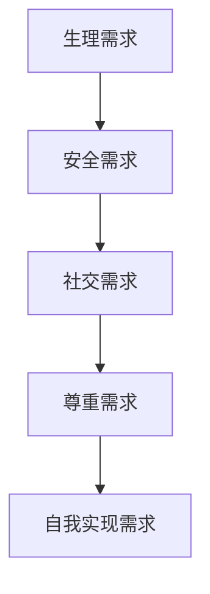
**算法原理讲解**：

在理解创业动机时，我们可以采用以下算法：

```plaintext
算法：分析创业动机

输入：创业者背景、个人经历、社会环境
输出：创业动机类型及优先级

步骤：
1. 收集创业者的基本信息，包括职业经历、教育背景、家庭情况等。
2. 分析创业者的性格特征，如冒险精神、创新意识、领导力等。
3. 调查创业者所处的社会环境，包括经济发展、政策环境、市场需求等。
4. 结合马斯洛需求层次理论，评估不同层次的动机。
5. 对创业动机进行排序，确定主导动机及次要动机。
6. 提出针对性的创业建议。
```

#### 1.2 市场需求的识别与评估

市场需求的识别与评估是创业成功的关键一步。正确的市场定位能够帮助创业者抓住机遇，规避风险。以下是几种常用的方法：

1. **市场调研**：通过问卷调查、访谈、焦点小组等方式，了解目标市场的需求。
2. **竞争分析**：分析现有竞争对手的产品、定价、市场份额等，找出市场缺口。
3. **用户反馈**：直接从潜在用户获取反馈，了解他们的需求和痛点。

为了更准确地识别市场需求，我们可以采用以下算法：

**核心概念与联系**：

市场调研算法：
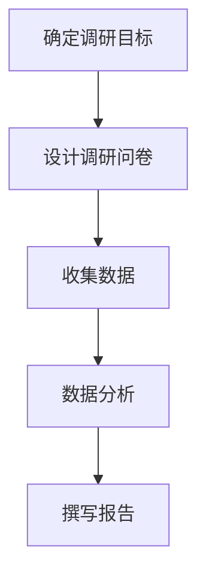

**算法原理讲解**：

市场调研算法可以分为以下步骤：

```plaintext
算法：市场需求的识别与评估

输入：目标市场、调研问卷、用户反馈
输出：市场需求报告

步骤：
1. 确定调研目标，明确需要了解的问题。
2. 设计调研问卷，包括开放式和封闭式问题。
3. 进行问卷收集，可以通过线上或线下方式。
4. 对收集到的数据进行统计分析，如频数分析、交叉分析等。
5. 根据分析结果撰写市场需求报告。
6. 提出市场定位和产品开发的建议。
```

#### 1.3 创业机会的评估与选择

识别到市场需求后，创业者需要评估和选择合适的创业机会。以下是一些评估和选择创业机会的方法：

1. **SWOT分析**：分析企业的优势、劣势、机会和威胁，评估创业机会的可行性。
2. **PEST分析**：分析政治、经济、社会和技术等因素，评估市场环境。
3. **波特五力模型**：分析行业竞争态势，评估市场进入的难度。

**核心概念与联系**：

SWOT分析流程：
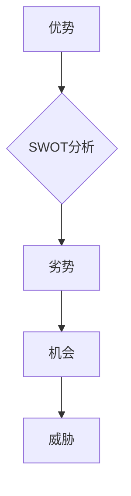

**算法原理讲解**：

创业机会评估算法可以分为以下步骤：

```plaintext
算法：创业机会的评估与选择

输入：市场需求报告、SWOT分析、PEST分析、波特五力模型
输出：创业机会选择

步骤：
1. 收集并分析市场需求报告。
2. 进行SWOT分析，评估企业的优势和劣势。
3. 进行PEST分析，评估市场环境。
4. 使用波特五力模型，分析行业竞争态势。
5. 综合分析结果，选择最有利的创业机会。
6. 制定创业计划和策略。
```

通过以上步骤，创业者可以系统地评估和选择合适的创业机会，从而提高创业成功的可能性。

### 第2章：商业模式与战略规划

#### 2.1 商业模式设计

商业模式的本质是企业创造、传递和捕获价值的系统。一个成功的商业模式不仅能够帮助企业实现盈利，还能增强企业的核心竞争力。以下是几种常见的商业模式设计方法：

1. **价值主张**：明确产品或服务能为客户带来的独特价值和利益。
2. **客户关系**：定义企业与客户之间的关系，如交易型、关系型或伙伴型。
3. **渠道**：确定如何将产品或服务传递给客户，包括线上、线下或两者的结合。
4. **客户细分**：根据客户的需求、购买力和行为特征，将市场划分为不同的细分群体。
5. **收入流**：确定企业从客户那里获取收入的方式，如订阅费、一次性销售或服务费等。

**核心概念与联系**：

商业模式设计流程：
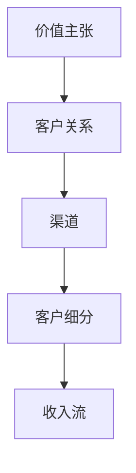

**算法原理讲解**：

商业模式设计算法可以分为以下步骤：

```plaintext
算法：商业模式设计

输入：市场需求分析、竞争分析、企业资源
输出：商业模式设计

步骤：
1. 确定价值主张，明确产品或服务的独特卖点。
2. 分析目标客户，定义客户关系类型。
3. 设计渠道策略，确定产品或服务的传递方式。
4. 进行客户细分，根据需求和行为特征划分市场。
5. 设计收入流，确定获取收入的方式。
6. 评估和优化商业模式，确保其可行性和可持续性。
```

#### 2.2 市场定位与目标客户分析

市场定位是企业根据自身的竞争优势和目标客户的需求，在市场中确定一个独特的位置。以下是一些市场定位策略：

1. **领导定位**：成为某一细分市场中的领导者，提供高质量的产品或服务。
2. **追随定位**：模仿市场领导者，但提供更具竞争力的价格或创新的产品。
3. **利基定位**：专注于某一小众市场，提供独特的解决方案。
4. **差异化定位**：在产品或服务中提供独特的价值，与其他竞争者区分开来。

**核心概念与联系**：

市场定位流程：
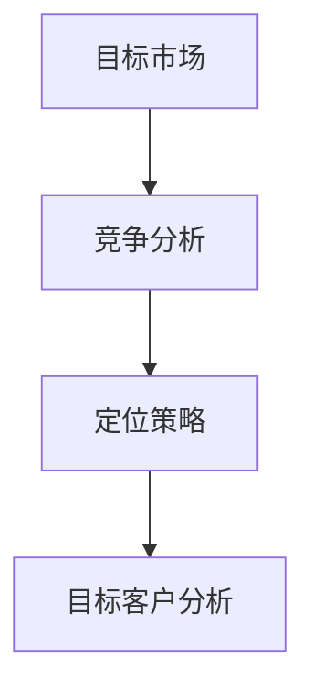

**算法原理讲解**：

市场定位算法可以分为以下步骤：

```plaintext
算法：市场定位与目标客户分析

输入：竞争分析、市场需求分析、企业资源
输出：市场定位策略、目标客户群体

步骤：
1. 进行竞争分析，了解竞争对手的市场定位和策略。
2. 分析市场需求，确定目标市场的需求特点和趋势。
3. 根据竞争分析和市场需求分析，选择合适的定位策略。
4. 进行目标客户分析，明确目标客户的需求、行为和偏好。
5. 优化市场定位策略，确保与目标客户的需求相匹配。
6. 制定针对目标客户的产品或服务策略。
```

#### 2.3 竞争对手分析与定位

了解竞争对手是创业成功的关键一步。通过分析竞争对手，创业者可以找到市场的机会和威胁，从而制定有效的竞争策略。以下是一些竞争对手分析的步骤：

1. **识别竞争对手**：确定直接和间接的竞争对手，包括现有竞争者和潜在的竞争者。
2. **评估竞争对手的优势与劣势**：分析竞争对手的产品、服务、市场策略、运营效率等。
3. **分析竞争对手的市场地位**：了解竞争对手在市场中的地位，如领导者、追随者或挑战者。
4. **确定自身的竞争优势**：根据竞争对手的分析结果，确定自身的竞争优势，如技术、品牌、渠道等。

**核心概念与联系**：

竞争对手分析流程：
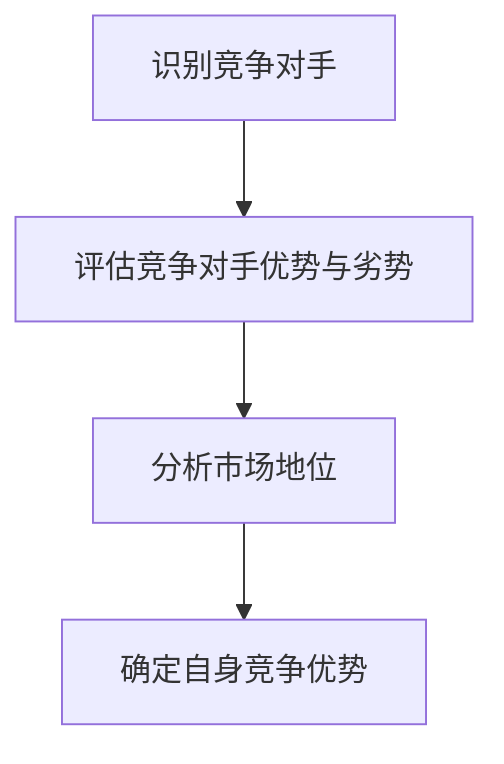

**算法原理讲解**：

竞争对手分析算法可以分为以下步骤：

```plaintext
算法：竞争对手分析与定位

输入：竞争对手信息、市场数据、企业资源
输出：竞争对手分析报告、竞争策略

步骤：
1. 收集竞争对手的信息，包括产品、服务、市场份额等。
2. 进行竞争对手的优势与劣势分析，识别其核心能力和薄弱环节。
3. 分析竞争对手的市场地位，了解其在市场中的定位和影响力。
4. 根据竞争对手分析结果，确定自身的竞争优势。
5. 制定针对性的竞争策略，如差异化策略、成本领先策略等。
6. 不断跟踪竞争对手的动态，调整竞争策略以保持竞争优势。
```

通过以上步骤，创业者可以更好地了解市场环境，制定有效的商业模式和战略规划，从而提高创业成功的可能性。

### 第3章：资金筹集与管理

#### 3.1 创业资金的来源

创业资金的来源是创业过程中必须面对的重要问题。以下是一些常见的创业资金来源：

1. **个人储蓄**：创业者可以使用自己的储蓄作为创业资金。
2. **家人和朋友**：向家人和朋友借款或寻求投资。
3. **天使投资**：寻找对创业有热情的天使投资者。
4. **风险投资**：通过风险投资机构获取资金。
5. **银行贷款**：向银行申请创业贷款。
6. **众筹**：通过在线众筹平台筹集资金。
7. **政府补贴**：利用政府提供的创业补贴和政策支持。

**核心概念与联系**：

资金来源流程：
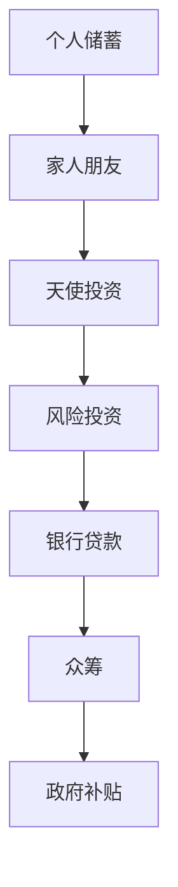

**算法原理讲解**：

资金来源选择算法可以分为以下步骤：

```plaintext
算法：创业资金来源选择

输入：创业项目、个人情况、市场环境
输出：合适的资金来源

步骤：
1. 评估创业项目的可行性和市场需求。
2. 分析创业者的个人储蓄和财务状况。
3. 评估创业团队和项目对投资者吸引力。
4. 分析风险投资机构和天使投资者的投资偏好。
5. 考虑银行贷款的条件和利率。
6. 评估众筹平台的市场影响力。
7. 根据分析结果，选择最合适的资金来源。
8. 制定详细的融资计划，确保资金的有效利用。
```

#### 3.2 风险投资与股权融资

风险投资和股权融资是创业资金的重要来源，对于初创企业来说，这两种融资方式具有不同的特点和优劣势。

**风险投资**：

风险投资（Venture Capital，VC）通常由专业的投资机构提供，主要用于支持具有高成长潜力的初创企业。以下是风险投资的主要特点：

1. **高投入**：风险投资通常会投入大量的资金，以换取企业的股份。
2. **高风险**：风险投资具有较高的风险，因为初创企业的成功并不确定。
3. **专业支持**：风险投资者不仅提供资金，还会为企业提供管理和市场资源等支持。

**核心概念与联系**：

风险投资流程：
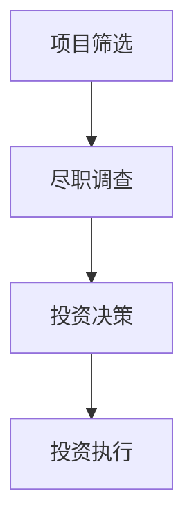

**算法原理讲解**：

风险投资决策算法可以分为以下步骤：

```plaintext
算法：风险投资决策

输入：创业项目、市场分析、财务预测
输出：投资决策

步骤：
1. 收集创业项目的基本信息，包括市场前景、团队背景、产品或服务。
2. 进行市场分析和财务预测，评估项目的可行性。
3. 进行尽职调查，包括企业历史、团队素质、市场竞争力等。
4. 根据调查结果，评估项目的风险和潜力。
5. 投资决策，决定是否投资。
6. 投资协议谈判，明确投资条款和条件。
7. 投资执行，提供资金和资源支持。
```

**股权融资**：

股权融资是通过出售公司股份来筹集资金，这是初创企业常见的融资方式。以下是股权融资的主要特点：

1. **资金来源多样**：股权融资可以吸引天使投资者、风险投资机构、个人投资者等。
2. **控制权稀释**：随着股份的出售，创始团队对公司的控制权会逐渐稀释。
3. **利益共享**：股权融资的投资者与公司共同承担风险和收益。

**核心概念与联系**：

股权融资流程：
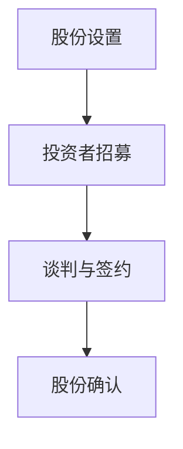

**算法原理讲解**：

股权融资决策算法可以分为以下步骤：

```plaintext
算法：股权融资决策

输入：创业项目、市场需求、投资者信息
输出：股权融资方案

步骤：
1. 确定公司需要的资金额度和股权比例。
2. 分析市场需求和项目前景，确定股权融资的必要性和可行性。
3. 招募潜在的投资者，包括天使投资者、风险投资机构等。
4. 进行谈判，确定股权比例、估值、退出机制等条款。
5. 签订股权融资协议，明确各方权益。
6. 管理投资者关系，确保投资者的利益与公司的发展相一致。
7. 定期披露公司业绩和财务状况，维护投资者信心。
```

通过以上步骤，创业者可以有效地筹集资金，为企业的快速发展提供坚实的财务支持。

#### 3.3 资金的管理与预算编制

资金的管理与预算编制是创业过程中至关重要的一环，合理的资金管理和预算编制能够确保企业的财务健康和运营效率。以下是一些关键步骤和技巧：

1. **预算编制**：制定详细的财务预算，包括收入预测、成本预算、资金流动等。
2. **成本控制**：通过严格的成本控制，确保实际支出不超过预算。
3. **资金流动管理**：确保资金在各个阶段的有效流动，避免资金链断裂。
4. **财务报告**：定期制作财务报告，包括利润表、资产负债表、现金流量表等，以便及时掌握公司财务状况。
5. **风险管理**：评估和应对潜在的财务风险，如市场波动、信用风险等。

**核心概念与联系**：

资金管理与预算编制流程：
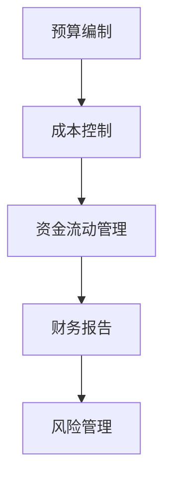

**算法原理讲解**：

资金管理与预算编制算法可以分为以下步骤：

```plaintext
算法：资金管理与预算编制

输入：创业项目、市场需求、预算编制模板
输出：财务预算、成本控制策略、资金流动计划、财务报告

步骤：
1. 制定预算编制模板，包括收入预测表、成本预算表、资金流动表等。
2. 根据市场需求和项目特点，进行收入预测和成本预算。
3. 分析历史数据和行业趋势，确保预算的合理性和可行性。
4. 制定成本控制策略，通过减少非必要支出和优化运营流程来降低成本。
5. 监控资金流动，确保资金在各阶段的合理分配和使用。
6. 定期制作财务报告，包括利润表、资产负债表、现金流量表等。
7. 进行风险管理，识别和应对潜在的财务风险，如市场波动、信用风险等。
8. 定期审查和调整预算，确保财务管理的有效性和适应性。
```

通过以上步骤，创业者可以有效地管理资金，确保企业的财务健康和可持续发展。

### 第4章：团队建设与人力资源

#### 4.1 创业团队的组建

创业团队的组建是创业成功的关键一步。一个优秀的创业团队能够充分发挥每个人的优势，共同应对创业过程中的各种挑战。以下是组建创业团队的关键步骤和要点：

1. **确定团队成员**：首先需要确定核心团队成员，包括创始人、技术负责人、市场营销负责人等。团队成员应具备互补的技能和经验。
2. **沟通与协作**：建立有效的沟通机制，确保团队成员之间的信息共享和协作。定期召开团队会议，讨论项目进展和决策。
3. **明确角色与责任**：为每个团队成员明确角色和责任，确保每个人都知道自己的任务和目标。
4. **激励与支持**：为团队成员提供合适的激励和培训机会，确保他们能够充分发挥潜力。

**核心概念与联系**：

团队组建流程：
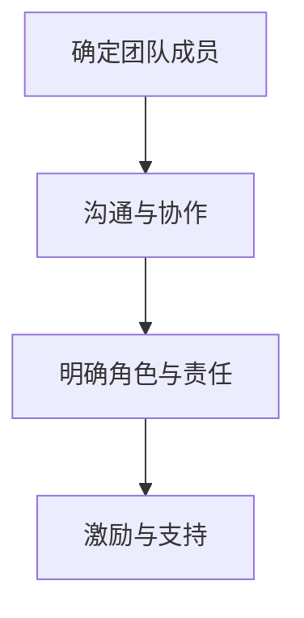

**算法原理讲解**：

团队组建算法可以分为以下步骤：

```plaintext
算法：创业团队组建

输入：团队成员需求、技能和经验
输出：创业团队结构、成员角色与责任

步骤：
1. 确定创业团队的基本需求，包括技术、市场营销、管理等方面的能力。
2. 招募核心团队成员，根据其技能和经验进行分工。
3. 建立有效的沟通机制，确保团队成员之间的信息共享和协作。
4. 为每个团队成员明确角色和责任，制定明确的任务和目标。
5. 提供激励和培训机会，鼓励团队成员不断学习和成长。
6. 定期评估团队绩效，根据评估结果调整团队结构和角色分配。
```

#### 4.2 人力资源管理策略

人力资源管理策略是企业确保团队成员高效运作的关键。以下是一些关键的人力资源管理策略：

1. **招聘策略**：制定有效的招聘策略，确保招聘到合适的人才。通过多种渠道进行招聘，如在线招聘平台、社交媒体、校园招聘等。
2. **培训与发展**：为员工提供培训和发展机会，提高员工的技能和职业素养。定期举办内部培训、研讨会和行业交流，促进员工的知识更新和技能提升。
3. **绩效管理**：建立有效的绩效管理体系，对员工的工作绩效进行评估和反馈。通过设定明确的目标和考核标准，激励员工提高工作效率和质量。
4. **薪酬福利**：制定合理的薪酬福利政策，确保员工的薪酬与市场水平相当，并提供良好的福利待遇，如健康保险、带薪休假、员工股票期权等。

**核心概念与联系**：

人力资源管理策略流程：
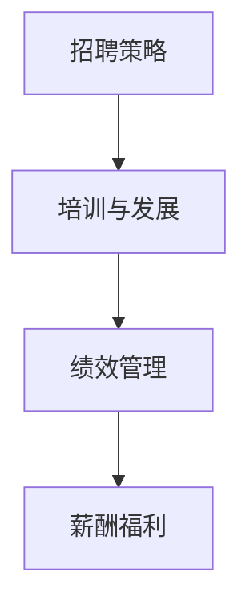

**算法原理讲解**：

人力资源管理策略算法可以分为以下步骤：

```plaintext
算法：人力资源管理策略

输入：企业需求、市场环境、员工需求
输出：招聘策略、培训与发展计划、绩效管理体系、薪酬福利政策

步骤：
1. 分析企业的人力资源需求，确定招聘的岗位和数量。
2. 选择合适的招聘渠道，如在线招聘平台、社交媒体、校园招聘等。
3. 制定详细的招聘流程，包括职位描述、简历筛选、面试评估等。
4. 设计培训与发展计划，根据员工的岗位需求和职业发展规划进行培训。
5. 建立绩效管理体系，设定明确的目标和考核标准，对员工的工作绩效进行评估和反馈。
6. 制定合理的薪酬福利政策，确保员工的薪酬与市场水平相当，并提供良好的福利待遇。
7. 定期评估人力资源管理策略的有效性，根据评估结果进行调整和优化。
```

#### 4.3 团队协作与文化建设

团队协作和文化建设是确保创业团队高效运作的重要保障。以下是一些关键策略：

1. **建立共同目标**：明确团队的目标和愿景，确保团队成员朝着共同的方向努力。
2. **培养协作文化**：通过团队活动、项目合作等方式，培养团队成员的协作意识和团队合作精神。
3. **鼓励创新与反馈**：鼓励团队成员提出创新想法和反馈，建立开放和包容的文化氛围。
4. **领导力培养**：为团队成员提供领导力培训，提高他们的领导能力和决策水平。

**核心概念与联系**：

团队协作与文化建设流程：
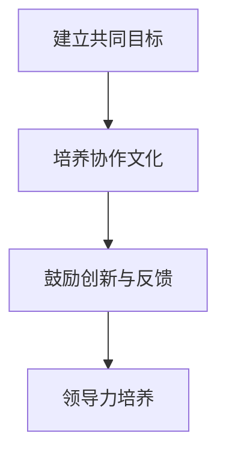

**算法原理讲解**：

团队协作与文化建设算法可以分为以下步骤：

```plaintext
算法：团队协作与文化建设

输入：团队目标、员工特点、文化需求
输出：团队协作机制、文化氛围、领导力提升计划

步骤：
1. 确定团队的目标和愿景，确保团队成员认同并为之努力。
2. 设计团队协作机制，包括沟通平台、工作流程、合作项目等。
3. 通过团队活动和项目合作，培养团队成员的协作意识和团队合作精神。
4. 建立创新与反馈机制，鼓励团队成员提出创新想法和反馈。
5. 提供领导力培训，提高团队成员的领导能力和决策水平。
6. 定期评估团队协作和文化建设的有效性，根据评估结果进行调整和优化。
7. 建立激励机制，鼓励团队成员积极参与团队建设和创新活动。
```

通过以上策略，创业者可以建立一支高效协作的团队，为企业的快速发展奠定坚实基础。

### 第5章：创业环境分析与政策利用

#### 5.1 创业环境的评估

创业环境的评估是创业成功的重要基础。一个良好的创业环境能够为创业者提供资源和支持，降低创业风险。以下是一些关键步骤和方法：

1. **市场环境评估**：分析市场需求、竞争态势、消费者行为等，了解市场的发展趋势和潜力。
2. **政策环境评估**：评估国家、地方政府的创业政策、补贴、税收优惠等，了解政策环境对创业的扶持力度。
3. **资源环境评估**：分析创业所需的资金、技术、人才等资源的可获得性，评估资源环境的优劣。

**核心概念与联系**：

创业环境评估流程：
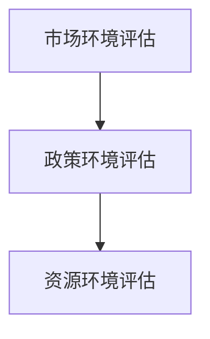

**算法原理讲解**：

创业环境评估算法可以分为以下步骤：

```plaintext
算法：创业环境评估

输入：市场需求、政策法规、资源条件
输出：创业环境评估报告

步骤：
1. 收集市场环境数据，包括行业趋势、消费者需求、竞争态势等。
2. 分析政策环境，了解国家和地方的创业政策、补贴、税收优惠等。
3. 调查创业所需的资金、技术、人才等资源的可获得性。
4. 综合评估市场、政策和资源环境，得出创业环境的评估结果。
5. 根据评估结果，提出优化创业环境的建议。
6. 定期跟踪和更新评估结果，确保创业环境的持续优化。
```

#### 5.2 国家与地方创业政策利用

国家与地方的创业政策为创业者提供了重要的支持和资源。以下是一些常见的创业政策及其利用方法：

1. **创业补贴**：许多地方政府提供创业补贴，用于支持创业项目的启动和发展。创业者可以通过申请创业补贴，降低创业成本。
2. **税收优惠**：国家和地方政府对符合条件的创业企业提供税收优惠，如减免企业所得税、增值税等。创业者应充分利用这些优惠政策，降低税负。
3. **创业孵化器**：创业孵化器为创业者提供办公场所、资金支持、技术指导等资源，帮助创业者快速启动项目。
4. **创业培训**：政府提供的创业培训有助于创业者提升管理能力和市场洞察力，提高创业成功率。

**核心概念与联系**：

创业政策利用流程：
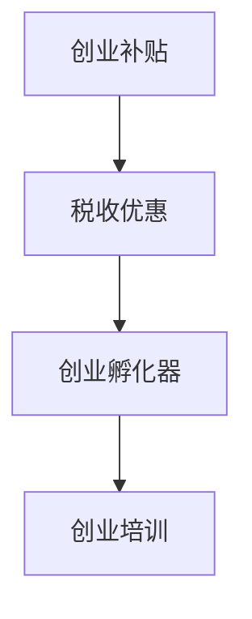

**算法原理讲解**：

创业政策利用算法可以分为以下步骤：

```plaintext
算法：创业政策利用

输入：创业项目、政策法规、资源需求
输出：政策利用方案、资源获取计划

步骤：
1. 收集国家和地方的创业政策信息，包括创业补贴、税收优惠、孵化器支持等。
2. 分析创业项目的特点和需求，确定适用的政策。
3. 准备相关申请材料，如项目计划书、财务报表、营业执照等。
4. 提交政策申请，根据政策要求完成申报流程。
5. 获取政策支持，包括资金、技术、培训等资源。
6. 制定资源获取计划，确保政策资源的有效利用。
7. 定期跟踪政策实施情况，评估政策效果，提出优化建议。
```

通过以上步骤，创业者可以充分利用国家和地方的创业政策，为创业项目的成功提供有力支持。

#### 5.3 创业资源的整合与利用

创业资源的整合与利用是创业成功的关键。创业者需要有效整合各类资源，提高资源利用效率，以实现创业目标。以下是一些常见的资源整合与利用方法：

1. **资金资源整合**：通过多种渠道筹集资金，如个人储蓄、银行贷款、风险投资等，确保创业项目的资金需求得到满足。
2. **技术资源整合**：与高校、研究机构、企业等建立合作关系，共享技术资源和研究成果，提高技术竞争力。
3. **人才资源整合**：通过招聘、培训、合作等方式，吸引和留住高素质的人才，构建高效的创业团队。
4. **市场资源整合**：利用线上线下渠道，扩大市场影响力，提高市场占有率和品牌知名度。
5. **社会资源整合**：积极参与社会公益活动，提升企业的社会责任感和品牌形象。

**核心概念与联系**：

创业资源整合流程：
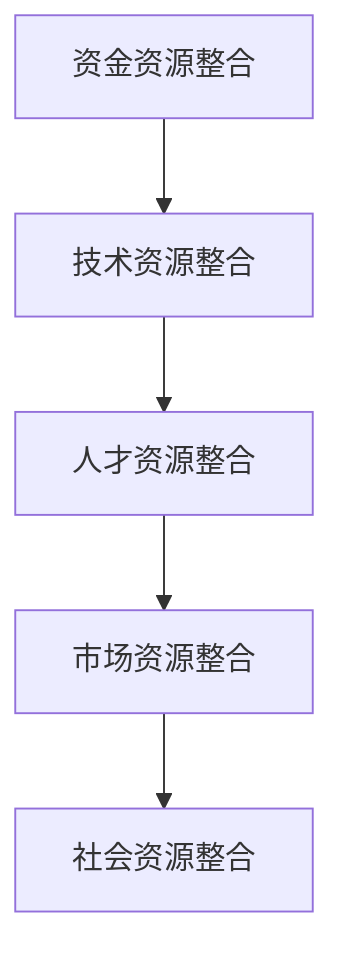

**算法原理讲解**：

创业资源整合算法可以分为以下步骤：

```plaintext
算法：创业资源整合与利用

输入：创业项目需求、资源类型、资源来源
输出：资源整合方案、资源利用计划

步骤：
1. 分析创业项目的特点和需求，确定所需的资源类型。
2. 搜集各类资源的来源，包括资金、技术、人才、市场等。
3. 设计资源整合方案，明确资源来源、整合方式和利用计划。
4. 建立合作渠道，与各类资源提供方建立合作关系。
5. 制定资源利用计划，确保资源的高效利用和优化配置。
6. 定期评估资源整合与利用效果，根据评估结果进行调整和优化。
7. 通过资源整合与利用，提升创业项目的竞争力，实现创业目标。
```

通过以上步骤，创业者可以有效地整合各类资源，提高资源利用效率，为创业项目的成功奠定坚实基础。

### 第6章：产品开发与市场推广

#### 6.1 产品开发策略

产品开发策略是创业企业成功的关键环节。有效的产品开发策略能够确保产品的市场竞争力，满足用户需求，并为企业带来持续的利润。以下是一些关键步骤和方法：

1. **需求分析**：首先需要深入了解目标用户的需求，通过市场调研、用户访谈、问卷调查等方式，收集用户反馈，分析用户的需求和痛点。
2. **产品设计**：根据需求分析的结果，进行产品功能设计、用户界面设计和用户体验设计。设计过程中要注重创新和差异化，确保产品具有独特的卖点。
3. **原型开发**：开发初步的原型产品，通过原型测试和用户反馈，不断优化产品设计和功能。
4. **迭代开发**：采用敏捷开发方法，进行持续迭代和优化，确保产品能够及时响应市场变化和用户需求。

**核心概念与联系**：

产品开发策略流程：
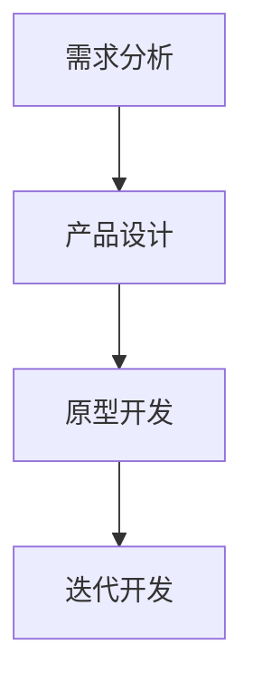

**算法原理讲解**：

产品开发策略算法可以分为以下步骤：

```plaintext
算法：产品开发策略

输入：市场需求、用户反馈、企业资源
输出：产品开发计划、设计文档、迭代计划

步骤：
1. 进行市场需求分析，确定目标用户群体和需求特点。
2. 根据需求分析结果，制定产品功能设计和用户体验设计。
3. 开发初步的原型产品，通过用户测试和反馈，优化产品设计和功能。
4. 采用敏捷开发方法，制定迭代计划，确保产品能够持续优化和改进。
5. 定期评估产品开发进度和质量，根据评估结果调整开发计划。
6. 确保产品开发过程中与市场和用户的持续互动，确保产品符合市场需求。
7. 通过有效的产品开发策略，提高产品的市场竞争力，满足用户需求。
```

#### 6.2 市场推广计划

市场推广计划是产品成功上市的关键。一个有效的市场推广计划能够帮助企业迅速扩大市场份额，提高品牌知名度。以下是一些关键步骤和方法：

1. **确定推广目标**：明确市场推广的目标，如品牌知名度、市场份额、销售量等。
2. **选择推广渠道**：根据产品的特点和目标用户，选择合适的推广渠道，如线上广告、社交媒体、公关活动等。
3. **制定推广策略**：制定具体的推广策略，如内容营销、社交媒体营销、搜索引擎优化等。
4. **执行推广计划**：实施市场推广计划，监控推广效果，根据实际情况进行调整和优化。
5. **评估推广效果**：通过数据分析，评估市场推广的效果，总结经验教训，为下一轮推广提供参考。

**核心概念与联系**：

市场推广计划流程：
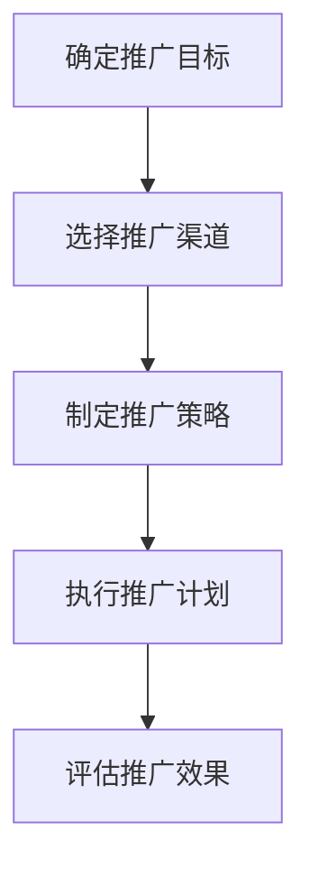

**算法原理讲解**：

市场推广计划算法可以分为以下步骤：

```plaintext
算法：市场推广计划

输入：推广目标、目标用户、资源预算
输出：推广策略、执行计划、评估报告

步骤：
1. 确定市场推广的目标，如品牌知名度、市场份额、销售量等。
2. 分析目标用户的特点和行为，选择合适的推广渠道。
3. 制定具体的推广策略，包括内容营销、社交媒体营销、搜索引擎优化等。
4. 制定详细的执行计划，包括时间表、任务分配、资源调配等。
5. 实施市场推广计划，监控推广效果，及时调整策略和资源。
6. 通过数据分析，评估市场推广的效果，总结成功经验和教训。
7. 根据评估结果，制定下一轮推广计划，持续优化推广策略。
```

通过以上步骤，创业企业可以制定和实施有效的市场推广计划，提高产品的市场竞争力，实现销售目标。

#### 6.3 用户反馈与迭代优化

用户反馈是产品开发过程中的重要环节，通过用户反馈，企业可以及时了解用户的需求和问题，进行产品优化和迭代。以下是一些关键步骤和方法：

1. **收集用户反馈**：通过问卷调查、用户访谈、在线反馈等方式，收集用户的意见和建议。
2. **分析用户反馈**：对收集到的用户反馈进行分类和归纳，分析用户的主要需求和问题。
3. **制定优化方案**：根据用户反馈，制定具体的优化方案，包括功能改进、界面优化、性能提升等。
4. **实施迭代优化**：通过敏捷开发方法，快速实现优化方案，进行产品迭代。
5. **持续收集反馈**：在每次迭代后，持续收集用户反馈，确保产品不断优化和改进。

**核心概念与联系**：

用户反馈与迭代优化流程：
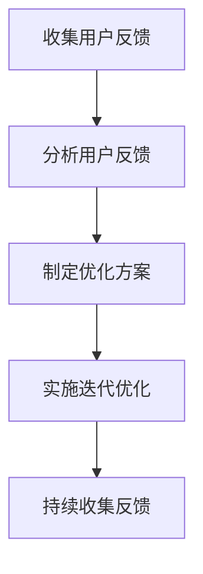

**算法原理讲解**：

用户反馈与迭代优化算法可以分为以下步骤：

```plaintext
算法：用户反馈与迭代优化

输入：用户反馈、市场需求、资源预算
输出：优化方案、迭代计划、产品更新

步骤：
1. 收集用户反馈，包括功能需求、使用体验、性能问题等。
2. 分析用户反馈，分类和归纳主要需求和问题。
3. 制定优化方案，包括功能改进、界面优化、性能提升等。
4. 根据优化方案，制定迭代计划，明确迭代目标和时间表。
5. 实施迭代优化，快速实现优化方案，进行产品更新。
6. 在每次迭代后，持续收集用户反馈，评估优化效果。
7. 根据用户反馈和评估结果，调整优化方案和迭代计划，持续优化产品。
```

通过以上步骤，创业企业可以有效地利用用户反馈，进行产品迭代优化，提高用户满意度和产品竞争力。

### 第7章：营销策略与品牌建设

#### 7.1 营销组合策略

营销组合策略是企业实现市场目标的关键手段，包括产品策略、定价策略、促销策略和渠道策略。以下是一些关键步骤和方法：

1. **产品策略**：确定产品的定位、功能、特点和包装，确保产品能够满足用户需求。
2. **定价策略**：根据市场需求、成本结构和竞争态势，制定合理的定价策略，如成本加成定价、价值定价、竞争定价等。
3. **促销策略**：设计有效的促销活动，包括广告宣传、促销折扣、公关活动等，提高产品知名度和销量。
4. **渠道策略**：选择合适的销售渠道，如线上平台、线下门店、分销渠道等，确保产品能够快速、高效地传递给用户。

**核心概念与联系**：

营销组合策略流程：
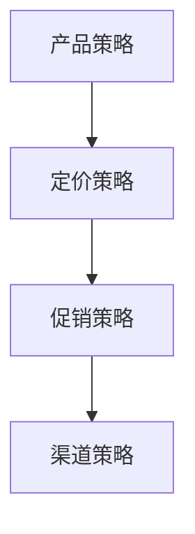

**算法原理讲解**：

营销组合策略算法可以分为以下步骤：

```plaintext
算法：营销组合策略

输入：市场需求、竞争态势、资源预算
输出：产品策略、定价策略、促销策略、渠道策略

步骤：
1. 确定产品定位和特点，根据市场需求进行产品设计。
2. 分析成本结构和竞争态势，制定合理的定价策略。
3. 设计促销活动，选择有效的广告宣传和公关手段。
4. 选择合适的销售渠道，确保产品能够快速传递给用户。
5. 定期评估营销组合策略的效果，根据市场变化进行调整和优化。
6. 通过有效的营销组合策略，提高产品的市场竞争力，实现销售目标。
```

#### 7.2 品牌定位与价值主张

品牌定位和价值主张是品牌建设的基础。品牌定位是指企业在市场中的独特位置，而价值主张则是企业向客户传达的产品或服务的独特价值。以下是一些关键步骤和方法：

1. **市场分析**：分析目标市场的需求和竞争态势，确定品牌定位的方向。
2. **目标客户分析**：了解目标客户的特点、需求和偏好，为品牌定位和价值主张提供依据。
3. **品牌定位**：确定品牌在市场中的独特位置，如高端、平价、专业等。
4. **价值主张构建**：明确产品或服务的独特卖点，向客户传达品牌的价值主张。

**核心概念与联系**：

品牌定位与价值主张流程：
```mermaid
graph TB
A[市场分析] --> B[目标客户分析]
B --> C[品牌定位]
C --> D[价值主张构建]
```

**算法原理讲解**：

品牌定位与价值主张构建算法可以分为以下步骤：

```plaintext
算法：品牌定位与价值主张构建

输入：市场需求、竞争态势、目标客户、企业资源
输出：品牌定位、价值主张

步骤：
1. 进行市场分析，了解目标市场的需求和竞争态势。
2. 分析目标客户的特点、需求和偏好，确定品牌定位的方向。
3. 根据市场分析和目标客户分析结果，确定品牌定位，如高端、平价、专业等。
4. 明确产品或服务的独特卖点，构建价值主张，向客户传达品牌的独特价值。
5. 通过品牌定位和价值主张，确保品牌在市场中的独特性和竞争力。
6. 定期评估品牌定位和价值主张的效果，根据市场变化进行调整和优化。
```

通过以上步骤，创业企业可以有效地进行品牌定位和价值主张的构建，提升品牌形象和市场竞争力。

#### 7.3 品牌传播与口碑管理

品牌传播和口碑管理是品牌建设的重要环节。有效的品牌传播和口碑管理能够提升品牌知名度和美誉度，增强品牌影响力。以下是一些关键步骤和方法：

1. **品牌传播**：通过广告、公关活动、社交媒体等渠道，传播品牌信息，提高品牌知名度。
2. **内容营销**：创建有价值的内容，如博客文章、视频、社交媒体帖子等，与目标客户建立联系，提升品牌形象。
3. **用户互动**：通过社交媒体、客户服务渠道等，与用户进行互动，建立良好的客户关系。
4. **口碑管理**：监测和管理用户对品牌的评价，积极应对负面口碑，维护品牌声誉。

**核心概念与联系**：

品牌传播与口碑管理流程：
```mermaid
graph TB
A[品牌传播] --> B[内容营销]
B --> C[用户互动]
C --> D[口碑管理]
```

**算法原理讲解**：

品牌传播与口碑管理算法可以分为以下步骤：

```plaintext
算法：品牌传播与口碑管理

输入：品牌信息、目标客户、资源预算
输出：品牌传播计划、内容营销方案、用户互动策略、口碑管理方案

步骤：
1. 制定品牌传播计划，选择合适的传播渠道，如广告、公关活动、社交媒体等。
2. 设计内容营销方案，创建有价值的内容，与目标客户建立联系，提升品牌形象。
3. 制定用户互动策略，通过社交媒体、客户服务渠道等，与用户进行互动，建立良好的客户关系。
4. 监测和管理用户对品牌的评价，积极应对负面口碑，维护品牌声誉。
5. 定期评估品牌传播和口碑管理的效果，根据市场变化进行调整和优化。
6. 通过有效的品牌传播和口碑管理，提升品牌知名度和美誉度，增强品牌影响力。
```

通过以上步骤，创业企业可以有效地进行品牌传播和口碑管理，提升品牌形象和市场竞争力。

### 第8章：团队管理与激励机制

#### 8.1 团队管理方法

团队管理是创业企业成功的关键因素之一。有效的团队管理方法能够提高团队效率，促进团队协作，实现企业目标。以下是一些关键步骤和方法：

1. **明确团队目标**：首先需要明确团队的目标，确保团队成员了解并认同团队的目标。
2. **角色分配与职责明确**：为每个团队成员分配明确的角色和职责，确保团队成员了解自己的任务和责任。
3. **沟通与协作**：建立有效的沟通机制，确保团队成员之间的信息共享和协作。定期召开团队会议，讨论项目进展和决策。
4. **绩效评估与反馈**：建立有效的绩效评估机制，对团队成员的工作绩效进行评估和反馈。通过设定明确的目标和考核标准，激励团队成员提高工作效率。
5. **激励与奖励**：为团队成员提供合适的激励和奖励，如奖金、晋升机会、培训等，提高团队成员的积极性和满意度。

**核心概念与联系**：

团队管理方法流程：
```mermaid
graph TB
A[明确团队目标] --> B[角色分配与职责明确]
B --> C[沟通与协作]
C --> D[绩效评估与反馈]
D --> E[激励与奖励]
```

**算法原理讲解**：

团队管理方法算法可以分为以下步骤：

```plaintext
算法：团队管理方法

输入：团队目标、成员角色、资源预算
输出：团队管理计划、角色分配方案、沟通机制、绩效评估体系、激励方案

步骤：
1. 确定团队的目标，确保团队成员了解并认同团队的目标。
2. 根据团队目标和项目需求，为每个团队成员分配明确的角色和职责。
3. 建立有效的沟通机制，确保团队成员之间的信息共享和协作。
4. 制定绩效评估标准，对团队成员的工作绩效进行定期评估和反馈。
5. 设计激励方案，为团队成员提供奖金、晋升机会、培训等激励措施。
6. 定期评估团队管理方法的有效性，根据评估结果进行调整和优化。
7. 通过有效的团队管理方法，提高团队效率，促进团队协作，实现企业目标。
```

#### 8.2 激励机制设计

激励机制设计是团队管理的重要环节，有效的激励机制能够提高团队成员的积极性和创造力，促进企业目标的实现。以下是一些关键步骤和方法：

1. **目标设定**：为团队成员设定明确的目标，确保目标与企业的战略目标一致，同时具有挑战性和可实现性。
2. **绩效评估**：建立公正、透明的绩效评估机制，根据团队成员的工作表现进行评估，确保评估结果的准确性。
3. **奖励机制**：设计多样化的奖励机制，包括金钱奖励、晋升机会、培训等，满足不同成员的需求。
4. **反馈与沟通**：及时给予团队成员反馈，解释奖励机制的设计原则和评估结果，确保团队成员对激励机制的理解和认同。
5. **持续优化**：根据团队成员的反馈和企业的实际情况，不断优化激励机制，确保其适应性和有效性。

**核心概念与联系**：

激励机制设计流程：
```mermaid
graph TB
A[目标设定] --> B[绩效评估]
B --> C[奖励机制]
C --> D[反馈与沟通]
D --> E[持续优化]
```

**算法原理讲解**：

激励机制设计算法可以分为以下步骤：

```plaintext
算法：激励机制设计

输入：企业目标、团队成员需求、资源预算
输出：激励机制方案、目标设定标准、绩效评估体系、奖励方案

步骤：
1. 确定企业目标，确保激励机制的设计与企业的战略目标一致。
2. 分析团队成员的需求，设定明确的目标，确保目标具有挑战性和可实现性。
3. 建立公正、透明的绩效评估机制，制定绩效评估标准，确保评估结果的准确性。
4. 设计多样化的奖励机制，包括金钱奖励、晋升机会、培训等，满足不同成员的需求。
5. 及时给予团队成员反馈，解释奖励机制的设计原则和评估结果，确保团队成员对激励机制的理解和认同。
6. 根据团队成员的反馈和企业的实际情况，不断优化激励机制，确保其适应性和有效性。
7. 通过有效的激励机制，提高团队成员的积极性和创造力，促进企业目标的实现。
```

#### 8.3 人才吸引与留存策略

人才吸引与留存是创业企业持续发展的关键。有效的吸引和留住人才策略能够为企业提供持续的创新动力和竞争优势。以下是一些关键步骤和方法：

1. **品牌建设**：建立良好的企业品牌形象，提升企业在人才市场中的竞争力。
2. **招聘策略**：制定科学的招聘策略，通过多种渠道吸引优秀人才，如在线招聘平台、社交媒体、校园招聘等。
3. **培训与发展**：为员工提供全面的培训和发展机会，提高员工的技能和职业素养。
4. **绩效奖励**：建立公正、透明的绩效奖励机制，激发员工的积极性和创造力。
5. **企业文化**：构建积极、包容的企业文化，提高员工的归属感和满意度。
6. **职业规划**：为员工提供清晰的职业发展路径，确保员工在企业中的成长和进步。

**核心概念与联系**：

人才吸引与留存策略流程：
```mermaid
graph TB
A[品牌建设] --> B[招聘策略]
B --> C[培训与发展]
C --> D[绩效奖励]
D --> E[企业文化]
D --> F[职业规划]
```

**算法原理讲解**：

人才吸引与留存策略算法可以分为以下步骤：

```plaintext
算法：人才吸引与留存策略

输入：企业目标、人才需求、资源预算
输出：品牌建设方案、招聘策略、培训与发展计划、绩效奖励机制、企业文化构建方案、职业规划方案

步骤：
1. 建立良好的企业品牌形象，提升企业在人才市场中的竞争力。
2. 制定科学的招聘策略，通过多种渠道吸引优秀人才。
3. 提供全面的培训和发展机会，提高员工的技能和职业素养。
4. 建立公正、透明的绩效奖励机制，激发员工的积极性和创造力。
5. 构建积极、包容的企业文化，提高员工的归属感和满意度。
6. 为员工提供清晰的职业发展路径，确保员工在企业中的成长和进步。
7. 定期评估人才吸引与留存策略的效果，根据评估结果进行调整和优化。
8. 通过有效的吸引和留存人才策略，确保企业的持续发展和创新能力。
```

通过以上步骤，创业企业可以有效地吸引和留住优秀人才，为企业的持续发展提供坚实的人才保障。

### 第9章：应对市场变化与竞争压力

#### 9.1 市场变化应对策略

市场变化是创业过程中不可避免的现象，创业者需要具备快速应对市场变化的能力，以保持竞争优势。以下是一些关键步骤和方法：

1. **市场监测**：建立完善的市场监测系统，实时关注市场动态、竞争对手动向和消费者行为变化。
2. **数据分析**：通过数据分析，深入了解市场变化的原因和影响，为应对策略提供数据支持。
3. **策略调整**：根据市场变化，及时调整产品策略、营销策略和运营策略，确保企业能够迅速适应市场变化。
4. **灵活应变**：培养团队成员的灵活应变能力，确保企业在面对突发市场变化时能够迅速作出反应。

**核心概念与联系**：

市场变化应对策略流程：
```mermaid
graph TB
A[市场监测] --> B[数据分析]
B --> C[策略调整]
C --> D[灵活应变]
```

**算法原理讲解**：

市场变化应对策略算法可以分为以下步骤：

```plaintext
算法：市场变化应对策略

输入：市场动态、竞争对手信息、消费者行为数据
输出：应对策略、调整方案、应变计划

步骤：
1. 建立市场监测系统，实时收集和分析市场动态、竞争对手信息和消费者行为数据。
2. 通过数据分析，深入了解市场变化的原因和影响，识别市场机会和威胁。
3. 根据市场变化，制定应对策略，包括产品策略、营销策略和运营策略的调整。
4. 实施调整方案，确保企业能够迅速适应市场变化。
5. 培养团队成员的灵活应变能力，确保企业能够在面对突发市场变化时迅速作出反应。
6. 定期评估应对策略的效果，根据评估结果进行调整和优化。
7. 通过有效的市场变化应对策略，保持企业的市场竞争力，实现持续发展。
```

#### 9.2 竞争策略选择

竞争策略是企业应对市场竞争的重要手段。有效的竞争策略能够帮助企业提升市场份额，实现持续盈利。以下是一些关键步骤和方法：

1. **竞争分析**：进行全面的竞争对手分析，了解竞争对手的产品、定价、市场策略等。
2. **市场定位**：根据竞争分析结果，确定企业的市场定位和差异化策略。
3. **定价策略**：制定合理的定价策略，包括成本加成定价、竞争定价、价值定价等。
4. **营销策略**：设计有效的营销策略，包括广告宣传、促销活动、品牌传播等。
5. **创新策略**：通过产品创新和服务创新，提升企业的竞争优势。

**核心概念与联系**：

竞争策略选择流程：
```mermaid
graph TB
A[竞争分析] --> B[市场定位]
B --> C[定价策略]
C --> D[营销策略]
D --> E[创新策略]
```

**算法原理讲解**：

竞争策略选择算法可以分为以下步骤：

```plaintext
算法：竞争策略选择

输入：竞争对手信息、市场需求、企业资源
输出：竞争策略、定价方案、营销策略、创新方案

步骤：
1. 进行全面的竞争对手分析，收集和分析竞争对手的产品、定价、市场策略等信息。
2. 根据竞争对手分析结果，确定企业的市场定位和差异化策略。
3. 制定合理的定价策略，包括成本加成定价、竞争定价、价值定价等。
4. 设计有效的营销策略，包括广告宣传、促销活动、品牌传播等。
5. 通过产品创新和服务创新，提升企业的竞争优势。
6. 定期评估竞争策略的效果，根据评估结果进行调整和优化。
7. 通过有效的竞争策略，提升企业的市场份额，实现持续盈利。
```

#### 9.3 市场地位巩固与提升

市场地位巩固与提升是企业长期发展的重要目标。以下是一些关键步骤和方法：

1. **客户关系管理**：建立和维护良好的客户关系，提高客户满意度和忠诚度。
2. **品牌建设**：通过品牌传播和口碑管理，提升品牌知名度和美誉度。
3. **市场份额扩展**：通过市场拓展和营销策略，扩大市场份额。
4. **产品与服务优化**：不断优化产品和服务，提高市场竞争力。
5. **技术创新**：通过技术创新，保持企业在技术领域的领先地位。

**核心概念与联系**：

市场地位巩固与提升流程：
```mermaid
graph TB
A[客户关系管理] --> B[品牌建设]
B --> C[市场份额扩展]
C --> D[产品与服务优化]
D --> E[技术创新]
```

**算法原理讲解**：

市场地位巩固与提升算法可以分为以下步骤：

```plaintext
算法：市场地位巩固与提升

输入：市场需求、竞争态势、企业资源
输出：客户关系管理方案、品牌建设计划、市场份额扩展策略、产品与服务优化方案、技术创新方案

步骤：
1. 建立和维护良好的客户关系，提高客户满意度和忠诚度。
2. 通过品牌传播和口碑管理，提升品牌知名度和美誉度。
3. 制定市场份额扩展策略，通过市场拓展和营销策略，扩大市场份额。
4. 不断优化产品和服务，提高市场竞争力。
5. 通过技术创新，保持企业在技术领域的领先地位。
6. 定期评估市场地位巩固与提升策略的效果，根据评估结果进行调整和优化。
7. 通过有效的市场地位巩固与提升策略，确保企业的长期发展。
```

通过以上步骤，创业企业可以有效地巩固和提升市场地位，实现长期可持续发展。

### 第10章：风险识别与管理

#### 10.1 风险识别与评估

风险识别与评估是创业过程中不可或缺的一环。通过有效的风险识别与评估，创业者可以提前预见潜在风险，制定应对策略，降低创业失败的可能性。以下是一些关键步骤和方法：

1. **风险识别**：通过头脑风暴、专家访谈、历史数据分析等方式，识别可能影响企业发展的风险因素。
2. **风险评估**：对识别出的风险进行定量和定性评估，确定风险的概率和影响程度。
3. **风险分类**：根据风险的性质和影响范围，对风险进行分类，如财务风险、市场风险、运营风险等。
4. **风险优先级排序**：根据风险评估结果，对风险进行优先级排序，确保重点应对高风险因素。

**核心概念与联系**：

风险识别与评估流程：
```mermaid
graph TB
A[风险识别] --> B[风险评估]
B --> C[风险分类]
C --> D[风险优先级排序]
```

**算法原理讲解**：

风险识别与评估算法可以分为以下步骤：

```plaintext
算法：风险识别与评估

输入：企业运营数据、市场信息、历史风险事件
输出：风险清单、风险评估报告、风险优先级列表

步骤：
1. 通过头脑风暴、专家访谈等方式，识别可能影响企业发展的风险因素。
2. 收集相关数据，如企业运营数据、市场信息、历史风险事件等。
3. 对识别出的风险进行定量和定性评估，确定风险的概率和影响程度。
4. 根据风险的性质和影响范围，对风险进行分类。
5. 根据风险评估结果，对风险进行优先级排序，确定重点应对的风险因素。
6. 编制风险清单和风险评估报告，为企业决策提供依据。
7. 定期更新和评估风险清单，确保风险识别与评估的持续有效性。
```

#### 10.2 风险应对策略

在识别和评估风险后，创业者需要制定相应的应对策略，以降低风险对企业的影响。以下是一些常见风险应对策略：

1. **风险规避**：通过调整业务模式、合作伙伴选择等，避免高风险因素的直接影响。
2. **风险转移**：通过保险、合同约定等方式，将部分风险转移给第三方。
3. **风险控制**：通过改进管理流程、增加监控措施等，降低风险发生的概率和影响程度。
4. **风险接受**：在无法规避或转移风险时，制定风险接受策略，确保企业能够应对风险带来的影响。

**核心概念与联系**：

风险应对策略流程：
```mermaid
graph TB
A[风险规避] --> B[风险转移]
B --> C[风险控制]
C --> D[风险接受]
```

**算法原理讲解**：

风险应对策略算法可以分为以下步骤：

```plaintext
算法：风险应对策略

输入：风险评估报告、企业资源、风险偏好
输出：风险规避方案、风险转移方案、风险控制方案、风险接受方案

步骤：
1. 根据风险评估报告，识别高风险因素和潜在影响。
2. 分析企业资源和风险偏好，确定最合适的应对策略。
3. 设计风险规避方案，通过调整业务模式、合作伙伴选择等，避免高风险因素的直接影响。
4. 设计风险转移方案，通过保险、合同约定等方式，将部分风险转移给第三方。
5. 设计风险控制方案，通过改进管理流程、增加监控措施等，降低风险发生的概率和影响程度。
6. 设计风险接受方案，确保企业能够应对风险带来的影响。
7. 定期评估和调整风险应对策略，确保其适应性和有效性。
```

#### 10.3 风险管理实践与案例分析

风险管理实践是创业者通过实际操作来验证和优化风险管理策略的过程。以下是一些风险管理实践的方法和案例分析：

1. **风险管理实践方法**：
   - **定期风险评估**：定期对企业运营中的风险进行评估，确保及时发现和应对潜在风险。
   - **风险管理培训**：为团队成员提供风险管理培训，提高他们的风险意识和应对能力。
   - **风险管理文档**：建立完整的风险管理文档，包括风险识别、评估、应对策略和监控记录等。
   - **风险管理会议**：定期召开风险管理会议，讨论风险情况，制定应对措施。

2. **案例分析**：
   - **案例分析一：某科技公司的市场风险应对**：该公司通过多元化市场布局，规避了单一市场波动带来的风险，通过风险转移策略，将部分市场风险转移给合作伙伴。
   - **案例分析二：某初创企业的运营风险控制**：该公司通过建立严格的质量控制体系，降低了产品故障率，通过风险规避策略，避免了一些高风险业务领域的投资。

**核心概念与联系**：

风险管理实践与案例分析流程：
```mermaid
graph TB
A[风险管理实践方法] --> B[案例分析]
```

**算法原理讲解**：

风险管理实践与案例分析算法可以分为以下步骤：

```plaintext
算法：风险管理实践与案例分析

输入：企业运营数据、风险案例、风险管理实践方法
输出：风险管理实践方案、风险案例报告

步骤：
1. 根据企业运营数据，识别和评估潜在风险。
2. 设计风险管理实践方法，包括定期风险评估、风险管理培训、风险管理文档和风险管理会议等。
3. 进行风险管理实践，验证和优化风险管理策略。
4. 分析成功和失败的风险管理案例，总结经验和教训。
5. 编制风险管理实践方案和风险案例报告，为企业决策提供参考。
6. 定期评估风险管理实践的效果，根据评估结果进行调整和优化。
7. 通过有效的风险管理实践，降低企业风险，确保可持续发展。
```

通过以上步骤，创业企业可以有效地识别、评估和应对风险，确保企业的稳定发展。

### 第11章：成功创业案例分析

#### 11.1 案例一：某互联网创业公司的成功经验

**背景**：
某互联网创业公司成立于2010年，专注于移动应用开发和运营。创始团队由几位互联网行业的资深人士组成，他们拥有丰富的产品开发和管理经验。

**商业模式**：
公司初期采用“平台+内容”的商业模式，通过提供高质量的内容吸引用户，同时建立平台生态系统，吸引第三方开发者入驻，形成良性的用户和开发者循环。

**产品开发策略**：
公司在产品开发过程中采用敏捷开发方法，快速迭代，持续优化。通过与用户的密切互动，及时了解用户需求和反馈，确保产品能够快速响应市场变化。

**市场推广计划**：
公司采用多渠道推广策略，包括社交媒体营销、线下活动和内容营销等。通过高质量的内容和用户互动，迅速提升品牌知名度和用户忠诚度。

**团队管理**：
公司注重团队建设，通过提供良好的工作环境和激励机制，吸引和留住高素质的人才。同时，定期组织培训和团队建设活动，提高团队凝聚力。

**成功因素**：
1. 创新思维：公司始终保持创新思维，不断探索新的商业模式和运营模式。
2. 用户至上：公司始终将用户需求放在首位，通过持续优化产品和服务，提升用户满意度。
3. 团队协作：公司建立高效的团队协作机制，确保团队成员能够充分发挥各自的潜力。
4. 资源整合：公司有效整合各类资源，包括资金、技术、人才等，为企业的快速发展提供支持。

**经验教训**：
1. 坚持创新：保持创新思维，不断探索新的商业模式和运营模式。
2. 精准定位：明确目标市场和用户群体，确保产品和服务的精准定位。
3. 优化管理：建立高效的管理体系和团队协作机制，提高运营效率。
4. 风险管理：识别和应对潜在风险，确保企业的稳健发展。

#### 11.2 案例二：某生物医药公司的创新之路

**背景**：
某生物医药公司成立于2005年，专注于生物医药产品的研发和生产。公司创始人拥有多年的生物医药行业经验，对行业趋势和市场机会有深刻的洞察。

**商业模式**：
公司采用“研发+生产+销售”的商业模式，通过自主研发和生产，提供高质量的生物医药产品。同时，通过合作和并购，快速扩展产品线和市场份额。

**产品开发策略**：
公司在产品开发过程中，注重技术创新和临床应用。通过引进先进的研发设备和技术，提高研发效率。同时，与临床医生和医疗机构合作，确保产品能够满足实际需求。

**市场推广计划**：
公司采用专业化的市场推广策略，包括学术推广、医生培训和患者教育等。通过建立良好的医生关系和患者信任，提升产品的市场影响力。

**团队管理**：
公司注重人才引进和培养，通过提供良好的科研环境和激励机制，吸引和留住优秀的科研人才。同时，建立专业的团队协作机制，提高研发和生产效率。

**成功因素**：
1. 技术创新：公司始终坚持技术创新，通过自主研发和生产，提供具有竞争力的生物医药产品。
2. 合作与并购：通过合作和并购，快速扩展产品线和市场份额。
3. 临床应用：与临床医生和医疗机构合作，确保产品能够满足实际需求。
4. 严格质量控制：公司注重质量控制，确保产品的安全性和有效性。

**经验教训**：
1. 技术创新：保持技术创新，不断探索新的研发方向和产品。
2. 市场调研：深入了解市场需求和竞争态势，确保产品的市场定位准确。
3. 质量控制：确保产品的质量，建立严格的质量管理体系。
4. 资金管理：合理规划资金使用，确保研发和生产资金充足。

#### 11.3 案例三：某农业科技企业的崛起

**背景**：
某农业科技企业成立于2012年，专注于农业科技产品的研发和应用。公司创始人对农业科技有着深厚的兴趣和丰富的实践经验。

**商业模式**：
公司采用“研发+推广+服务”的商业模式，通过自主研发和合作，提供高质量的农业科技产品。同时，提供农业技术服务，帮助农民提高生产效率和产量。

**产品开发策略**：
公司在产品开发过程中，注重技术创新和用户体验。通过引进先进的研发设备和技术，提高研发效率。同时，与农民和农业生产者合作，确保产品能够满足实际需求。

**市场推广计划**：
公司采用多元化的市场推广策略，包括线上推广、线下活动和合作推广等。通过建立良好的用户关系和品牌形象，提升产品的市场知名度。

**团队管理**：
公司注重团队建设，通过提供良好的工作环境和激励机制，吸引和留住高素质的人才。同时，建立专业的团队协作机制，提高研发和服务效率。

**成功因素**：
1. 技术创新：公司始终坚持技术创新，通过自主研发和合作，提供具有竞争力的农业科技产品。
2. 用户体验：注重用户体验，通过不断优化产品和服务，提升用户满意度。
3. 合作与推广：与农民和农业生产者合作，通过推广和服务，提高产品的市场影响力。
4. 社会责任：公司积极承担社会责任，通过农业技术服务，帮助农民提高生产效率和收入。

**经验教训**：
1. 技术创新：保持技术创新，不断探索新的研发方向和产品。
2. 用户体验：注重用户体验，通过持续优化产品和服务，提升用户满意度。
3. 合作与推广：建立良好的合作关系，通过推广和服务，提高产品的市场影响力。
4. 社会责任：积极承担社会责任，通过技术服务，帮助农民提高生产效率和收入。

### 附录A：创业工具与资源

#### A.1 创业工具推荐

1. **Trello**：一款功能强大的项目管理工具，适合团队协作和任务管理。
2. **Asana**：一款灵活的任务管理工具，帮助团队高效地追踪项目进度。
3. **Google Analytics**：一款强大的数据分析工具，用于跟踪网站流量和用户行为。
4. **Mailchimp**：一款邮件营销工具，帮助企业建立和维护邮件列表。
5. **Slack**：一款即时通讯工具，用于团队内部沟通和协作。

#### A.2 创业相关网站与社区

1. **创业邦**：中国领先的创业服务平台，提供创业资讯、活动、投资机会等。
2. **36氪**：一家专注于科技创新和创业的媒体平台，提供创业项目报道和行业分析。
3. **创业家**：一个为创业者提供知识分享和交流的平台，包括创业课程、专家访谈等。
4. **LinkedIn**：一个职业社交平台，帮助创业者拓展人脉，寻找合作伙伴和投资者。
5. **Startup Genome**：一个全球性的创业研究机构，提供关于创业的深入研究和分析报告。

#### A.3 创业书籍推荐

1. **《创业维艰》**：作者本·霍洛维茨，通过自己的创业经历，分享了创业过程中的挑战和应对策略。
2. **《精益创业》**：作者埃里克·莱斯，提出了一种以最小化浪费和最大效率的方式创业的方法论。
3. **《创业思维》**：作者史蒂夫·布兰克，介绍了如何通过商业模式画布来设计和验证创业机会。
4. **《创业心理》**：作者凯西·卡萨尼奥，探讨了创业过程中的人际关系、决策和心理因素。
5. **《创业者之路》**：作者迈克尔·莫瑞茨，通过分析成功创业者的故事，总结了创业的关键要素和经验。

### 结语

创业是一场充满挑战和机遇的旅程。通过本文的详细分析和探讨，我们了解到了应对创业挑战与风险的多种策略和方法。创业前的准备与规划、创业过程中的挑战与应对策略、成功创业案例分析，以及创业工具与资源的介绍，都为创业者提供了宝贵的指导。

创业之路并不平坦，但只要我们具备坚定的信念、科学的策略和持续的创新精神，就一定能够克服困难，实现创业梦想。希望本文能够为您的创业之旅提供一些启示和帮助，祝您创业成功！ 

**作者：AI天才研究院/AI Genius Institute & 禅与计算机程序设计艺术 /Zen And The Art of Computer Programming**

