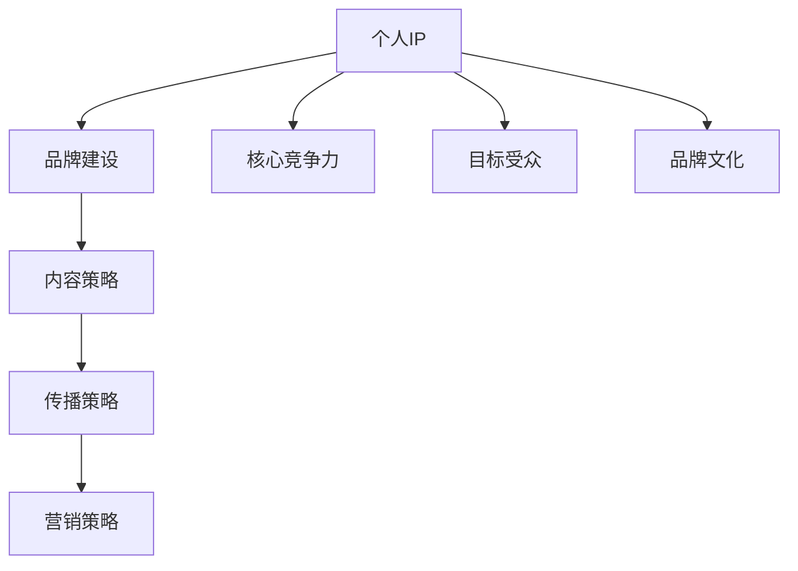

                 

### 《建立个人IP：打造独特的个人标签和形象》

> **关键词：** 个人IP、品牌建设、内容策略、传播策略、营销策略

**摘要：** 在当今数字时代，个人IP的建立已经成为众多专业人士和个人品牌建设的重要手段。本文将深入探讨个人IP的基础理论、构建原则、策略以及实战案例，帮助读者了解如何打造独特的个人标签和形象，提升个人影响力和市场价值。

---

### 《建立个人IP：打造独特的个人标签和形象》目录大纲

# 第一部分：个人IP基础理论

## 第1章：个人IP概述

### 1.1 个人IP的定义与重要性

### 1.2 个人IP与品牌建设的关系

### 1.3 个人IP的价值分析

## 第2章：个人IP构建原则

### 2.1 核心竞争力分析

### 2.2 个人IP定位与目标受众

### 2.3 个人IP的品牌文化塑造

## 第3章：个人IP构建策略

### 3.1 内容策略

### 3.2 传播策略

### 3.3 营销策略

## 第4章：个人IP打造路径

### 4.1 从零开始构建个人IP

### 4.2 逐步提升个人IP影响力

### 4.3 个人IP的长期维护与拓展

# 第二部分：个人IP打造实战案例

## 第5章：成功个人IP案例分析

### 5.1 案例一：个人博主IP打造

### 5.2 案例二：企业家个人品牌塑造

### 5.3 案例三：专业领域专家IP培养

## 第6章：个人IP打造工具与资源

### 6.1 社交媒体平台应用

### 6.2 个人IP营销工具介绍

### 6.3 个人IP资源整合与利用

## 第7章：个人IP打造的挑战与应对策略

### 7.1 面临的挑战与风险

### 7.2 防范和应对策略

### 7.3 持续发展的策略

# 第三部分：附录

## 附录A：个人IP构建指南

## 附录B：常用个人IP构建工具与资源列表

## 附录C：个人IP打造案例库与学习资源推荐

---

### **个人IP概述**

#### **1.1 个人IP的定义与重要性**

个人IP（Intellectual Property），即个人知识产权，是指个人在某一领域内所具有的知识、技能、经验、声誉等非物质财产。随着互联网的普及和社交媒体的发展，个人IP已经成为个人品牌建设的重要资产。

**重要性：**

1. **提升个人影响力**：个人IP的建立有助于在专业领域内建立权威形象，提升个人知名度，增强个人影响力。
2. **增加商业机会**：拥有强大个人IP的个人更容易获得商业合作机会，如咨询、演讲、书籍出版等。
3. **塑造独特品牌**：个人IP是个人品牌的延伸，有助于塑造独特、可信的个人品牌形象。
4. **提高市场价值**：个人IP的价值体现在其带来的商业回报，如赞助、代言、授权等。

#### **1.2 个人IP与品牌建设的关系**

个人IP与个人品牌建设密不可分。个人品牌建设是个人IP构建的基础，而个人IP则是个人品牌的外在表现。

**关系：**

1. **个人IP是品牌建设的核心**：个人IP包含了个人的专业知识、技能、经验等，是个人品牌的核心竞争力。
2. **品牌建设是IP价值体现**：个人品牌建设有助于个人IP价值的实现，通过品牌传播、市场推广等手段，将个人IP转化为商业价值。

#### **1.3 个人IP的价值分析**

个人IP的价值可以从以下几个方面进行分析：

1. **影响力价值**：个人IP的建立有助于提升个人在专业领域的影响力，进而吸引更多的关注和认可。
2. **商业价值**：个人IP可以为个人带来商业机会，如咨询、演讲、书籍出版等。
3. **社会价值**：个人IP的建立有助于传播专业知识，推动行业进步，具有积极的社会意义。

---

### **个人IP构建原则**

#### **2.1 核心竞争力分析**

构建个人IP的首要原则是明确个人核心竞争力。核心竞争力是指个人在某一领域内具有的独特优势和能力，是个人IP构建的基础。

**分析步骤：**

1. **自我评估**：通过自我评估，了解个人在专业领域的知识、技能、经验等优势。
2. **市场调研**：通过市场调研，了解目标受众的需求和偏好，分析个人竞争优势。
3. **明确定位**：根据自我评估和市场调研结果，明确个人IP的定位，确定目标受众。

#### **2.2 个人IP定位与目标受众**

个人IP定位是构建个人IP的关键步骤。定位决定了个人IP的市场定位和发展方向。

**定位原则：**

1. **独特性**：个人IP应具有独特性，能够区分于其他个人或品牌。
2. **针对性**：个人IP定位应针对特定的目标受众，满足他们的需求。
3. **可持续性**：个人IP定位应具备长期可持续发展的潜力。

**目标受众分析：**

1. **受众特征**：了解目标受众的年龄、性别、职业、兴趣爱好等特征。
2. **需求分析**：分析目标受众在专业领域内的需求，为内容创作提供依据。
3. **互动策略**：制定与目标受众的互动策略，提高用户黏性和参与度。

#### **2.3 个人IP的品牌文化塑造**

个人IP的品牌文化是个人IP的核心价值所在。品牌文化塑造有助于提升个人IP的认同感和忠诚度。

**塑造原则：**

1. **价值观传递**：明确个人IP的价值观，并将其贯穿于内容创作和传播中。
2. **形象设计**：设计独特的品牌形象，如标志、色彩等，提高品牌辨识度。
3. **一致性**：保持品牌文化的一致性，确保内容、传播和互动等方面的一致性。

---

### **个人IP构建策略**

#### **3.1 内容策略**

内容策略是个人IP构建的核心，优质的内容是吸引和留住受众的关键。

**内容创作原则：**

1. **专业性**：内容应具有专业性，传递有价值的信息。
2. **创新性**：内容应具有创新性，能够引起受众的兴趣。
3. **实用性**：内容应具有实用性，解决受众的实际问题。

**内容传播原则：**

1. **多样化**：通过多种渠道进行内容传播，提高曝光度。
2. **精准化**：根据目标受众的特征和需求，进行精准化传播。
3. **互动性**：与受众进行互动，提高用户参与度和忠诚度。

#### **3.2 传播策略**

传播策略是个人IP构建的重要环节，有效的传播策略有助于提升个人IP的知名度。

**传播渠道选择：**

1. **社交媒体**：利用微博、微信、抖音等社交媒体平台进行传播。
2. **专业平台**：在专业平台（如知乎、博客园等）发布专业内容。
3. **传统媒体**：利用传统媒体（如报纸、杂志等）进行广泛传播。

**传播效果评估：**

1. **关注度**：通过关注数、点赞数、评论数等指标评估传播效果。
2. **转化率**：通过内容转化率（如咨询量、购买量等）评估传播效果。
3. **口碑**：通过用户反馈、口碑传播等评估传播效果。

#### **3.3 营销策略**

营销策略是个人IP构建的重要手段，有效的营销策略有助于提升个人IP的市场竞争力。

**营销手段选择：**

1. **内容营销**：通过创作优质内容，吸引目标受众。
2. **社交媒体营销**：利用社交媒体进行推广，提高曝光度。
3. **合作营销**：与其他个人或品牌进行合作，实现资源共享。

**营销效果评估：**

1. **品牌知名度**：通过品牌知名度评估营销效果。
2. **市场份额**：通过市场份额评估营销效果。
3. **用户满意度**：通过用户满意度评估营销效果。

---

### **个人IP打造路径**

#### **4.1 从零开始构建个人IP**

从零开始构建个人IP需要明确目标、制定策略和持续努力。

**步骤：**

1. **明确目标**：确定个人IP的定位和发展目标。
2. **制定策略**：根据目标制定内容、传播和营销策略。
3. **持续创作**：保持内容创作的专业性、创新性和实用性。
4. **积累经验**：通过实践积累经验，不断优化个人IP。

#### **4.2 逐步提升个人IP影响力**

提升个人IP影响力需要持续努力和有效的传播策略。

**方法：**

1. **内容多样化**：创作多种类型的内容，满足不同受众的需求。
2. **社交媒体推广**：利用社交媒体平台进行广泛推广，提高曝光度。
3. **专业平台合作**：与专业平台合作，扩大个人IP的影响力。
4. **品牌背书**：借助知名品牌进行背书，提高个人IP的权威性。

#### **4.3 个人IP的长期维护与拓展**

个人IP的长期维护与拓展需要持续的内容创作、传播和营销。

**策略：**

1. **内容更新**：定期更新内容，保持活跃度。
2. **粉丝互动**：与粉丝进行互动，提高用户黏性。
3. **品牌升级**：根据市场需求和趋势，适时升级个人IP。
4. **资源整合**：整合各类资源，扩大个人IP的影响力。

---

### **成功个人IP案例分析**

通过成功个人IP的案例分析，我们可以了解他们如何成功构建和提升个人IP。

#### **5.1 个人博主IP打造**

**案例背景：** 李先生是一位计算机科学家，他在专业领域有着丰富的经验，并通过个人博客分享专业知识。

**成功因素：**

1. **专业内容**：李先生的内容具有很高的专业性和实用性，解决了众多读者的实际问题。
2. **互动性强**：李先生积极与读者互动，解答问题，提高用户参与度。
3. **持续创作**：李先生坚持定期更新内容，保持活跃度。

**启示：** 专业内容和互动性是构建个人IP的关键。

#### **5.2 企业家个人品牌塑造**

**案例背景：** 张女士是一位成功的企业家，她通过个人品牌塑造提升了企业的知名度和影响力。

**成功因素：**

1. **品牌文化**：张女士的个人品牌文化具有独特的价值观，吸引了众多忠实粉丝。
2. **社交媒体营销**：张女士利用社交媒体平台进行广泛推广，提高曝光度。
3. **合作与分享**：张女士与行业内的其他企业家进行合作，实现资源共享。

**启示：** 品牌文化和社交媒体营销是提升个人IP影响力的重要手段。

#### **5.3 专业领域专家IP培养**

**案例背景：** 王博士是一位在人工智能领域有着卓越贡献的专家，他通过个人IP培养吸引了众多关注。

**成功因素：**

1. **学术成果**：王博士在学术领域有着丰富的成果，具有较高的权威性。
2. **内容多样化**：王博士的内容涵盖了学术研究、应用实践等多个方面。
3. **专业培训**：王博士开设了专业培训课程，为行业从业者提供知识传授。

**启示：** 学术成果和内容多样化是培养专业领域专家IP的关键。

---

### **个人IP打造工具与资源**

在个人IP打造过程中，选择合适的工具和资源至关重要。

#### **6.1 社交媒体平台应用**

**常用平台：**

1. **微博**：微博是中国最大的社交媒体平台，适合进行内容传播和品牌推广。
2. **微信**：微信具有强大的社交和营销功能，适合进行用户互动和内容推送。
3. **抖音**：抖音是短视频平台，适合进行创意内容的传播和展示。

**应用策略：**

1. **内容多样化**：结合不同平台的特性，创作多样化内容。
2. **定期更新**：保持活跃度，定期更新内容。
3. **互动互动**：与粉丝进行互动，提高用户参与度。

#### **6.2 个人IP营销工具介绍**

**常用工具：**

1. **微信公众号**：微信公众号是微信的核心功能，适合进行内容推送和用户互动。
2. **小视频**：小视频是抖音的核心功能，适合进行创意内容的展示。
3. **微博推广**：微博推广是微博的核心功能，适合进行品牌推广和曝光。

**使用策略：**

1. **内容定制**：根据目标受众的需求和偏好，定制内容。
2. **推广投放**：根据预算和目标，进行推广投放。
3. **数据分析**：分析推广效果，不断优化策略。

#### **6.3 个人IP资源整合与利用**

**资源整合策略：**

1. **内容资源**：整合各类内容资源，如专业文章、书籍、视频等。
2. **渠道资源**：整合各类渠道资源，如社交媒体、专业平台、传统媒体等。
3. **合作资源**：与行业内外的个人和品牌进行合作，实现资源共享。

**资源利用策略：**

1. **内容创作**：利用内容资源进行内容创作，满足受众需求。
2. **渠道传播**：利用渠道资源进行内容传播，提高曝光度。
3. **合作共赢**：利用合作资源，实现互利共赢。

---

### **个人IP打造的挑战与应对策略**

在个人IP打造过程中，会面临诸多挑战和风险。

#### **7.1 面临的挑战与风险**

1. **内容同质化**：市场上存在大量相似内容，如何脱颖而出成为挑战。
2. **时间精力限制**：个人IP打造需要大量时间和精力，如何平衡工作与个人IP打造成为风险。
3. **竞争压力**：个人IP领域竞争激烈，如何提升自身竞争力成为挑战。

#### **7.2 防范和应对策略**

1. **内容创新**：通过创新内容，提高内容独特性，避免同质化。
2. **时间管理**：合理规划时间，确保个人IP打造的持续性和稳定性。
3. **持续学习**：不断学习新知识，提升自身竞争力。

#### **7.3 持续发展的策略**

1. **内容更新**：定期更新内容，保持活跃度。
2. **互动互动**：与粉丝进行互动，提高用户黏性。
3. **品牌升级**：根据市场需求和趋势，适时升级个人IP。

---

### **附录**

#### **附录A：个人IP构建指南**

- 明确个人IP定位和目标受众。
- 制定内容、传播和营销策略。
- 保持内容的专业性、创新性和实用性。

#### **附录B：常用个人IP构建工具与资源列表**

- 社交媒体平台：微博、微信、抖音等。
- 内容创作工具：Markdown编辑器、印象笔记等。
- 营销工具：微信公众号、小视频、微博推广等。

#### **附录C：个人IP打造案例库与学习资源推荐**

- **案例库**：成功个人IP案例库，涵盖不同领域和类型的个人IP。
- **学习资源**：专业书籍、在线课程、行业报告等。

---

### **作者信息**

**作者：** AI天才研究院/AI Genius Institute & 禅与计算机程序设计艺术 /Zen And The Art of Computer Programming

---

通过以上内容，我们详细探讨了个人IP的构建原则、策略、实战案例以及面临的挑战和应对策略。希望本文能为读者提供有益的启示和指导，助力打造独特的个人标签和形象。

---

### **核心概念与联系**

在个人IP构建的过程中，核心概念包括个人IP、品牌建设、内容策略、传播策略和营销策略。这些概念之间存在着密切的联系，构成了个人IP构建的完整体系。

#### **Mermaid 流�程图示例：**



#### **核心概念解析：**

1. **个人IP（A）**：个人知识产权，包含个人的知识、技能、经验、声誉等。
2. **品牌建设（B）**：通过个人IP的提升和传播，建立独特的品牌形象。
3. **内容策略（C）**：制定优质的内容创作和发布计划，满足目标受众的需求。
4. **传播策略（D）**：通过多种渠道传播个人IP，提高知名度和影响力。
5. **营销策略（E）**：运用营销手段，实现个人IP的商业价值。
6. **核心竞争力（F）**：个人在专业领域内的独特优势。
7. **目标受众（G）**：个人IP的目标受众群体。
8. **品牌文化（H）**：个人IP的核心价值观和品牌理念。

#### **联系与互动：**

- 个人IP（A）是品牌建设（B）的基础，通过内容策略（C）、传播策略（D）和营销策略（E）的实施，不断提升个人IP的知名度和影响力。
- 核心竞争力（F）和目标受众（G）决定了个人IP的内容策略（C）和传播策略（D），进而影响品牌文化（H）的塑造。
- 品牌文化（H）贯穿于个人IP的各个方面，包括内容创作、传播和营销，确保个人IP的一致性和独特性。

通过上述流程图和核心概念解析，我们可以清晰地看到个人IP构建的内在逻辑和相互作用关系，为读者提供了构建个人IP的直观理解和参考。

---

### **核心算法原理讲解**

在构建个人IP的过程中，算法原理扮演着至关重要的角色。以下是对个人IP构建过程中的核心算法原理的详细讲解，使用伪代码来阐述。

#### **伪代码示例：**

```python
# 定义个人IP构建的函数
def build_personal_ip(core_competence, target_audience, brand_culture, content_strategy, distribution_strategy, marketing_strategy):
    # 初始化变量
    ip_success = False

    # 核心竞争力分析
    while not core_competence_satisfied:
        analyze_core_competence()
        if core_competence_satisfied:
            break

    # 目标受众定位
    while not target_audience_defined:
        determine_target_audience()
        if target_audience_defined:
            break

    # 品牌文化塑造
    create_brand_culture()

    # 内容策略制定
    formulate_content_strategy()

    # 传播策略实施
    implement_distribution_strategy()

    # 营销策略实施
    implement_marketing_strategy()

    # 判断个人IP构建成功
    if core_competence_satisfied and target_audience_defined and brand_culture_created and content_strategy_formulated and distribution_strategy_implemented and marketing_strategy_implemented:
        ip_success = True
    return ip_success

# 核心竞争力分析函数
def analyze_core_competence():
    # 分析个人的专业知识、技能和经验
    knowledge = ["机器学习", "深度学习", "大数据分析"]
    skills = ["编程能力", "数据建模", "算法优化"]
    experience = ["大型项目经验", "学术研究", "行业实践"]
    
    # 判断是否满足核心竞争力
    global core_competence_satisfied
    core_competence_satisfied = (len(knowledge) > 0) and (len(skills) > 0) and (len(experience) > 0)

# 目标受众定位函数
def determine_target_audience():
    # 确定目标受众的特征
    target_audience_attributes = ["数据分析师", "技术开发者", "学术研究人员"]
    
    # 判断是否明确目标受众
    global target_audience_defined
    target_audience_defined = (len(target_audience_attributes) > 0)

# 品牌文化塑造函数
def create_brand_culture():
    # 创建个人品牌文化
    brand_culture = "专注于数据科学领域，提供专业的知识和实用的技能，助力行业发展。"
    
    # 判断品牌文化是否塑造成功
    global brand_culture_created
    brand_culture_created = (brand_culture is not None) and (len(brand_culture) > 0)

# 内容策略制定函数
def formulate_content_strategy():
    # 制定内容策略
    content_strategy = "每周发布一篇深度技术文章，每月举办一次线上分享会。"
    
    # 判断内容策略是否制定成功
    global content_strategy_formulated
    content_strategy_formulated = (content_strategy is not None) and (len(content_strategy) > 0)

# 传播策略实施函数
def implement_distribution_strategy():
    # 实施传播策略
    distribution_strategy = "利用社交媒体、专业平台和合作伙伴进行广泛传播。"
    
    # 判断传播策略是否实施成功
    global distribution_strategy_implemented
    distribution_strategy_implemented = (distribution_strategy is not None) and (len(distribution_strategy) > 0)

# 营销策略实施函数
def implement_marketing_strategy():
    # 实施营销策略
    marketing_strategy = "通过合作推广、内容营销和社交媒体广告进行营销。"
    
    # 判断营销策略是否实施成功
    global marketing_strategy_implemented
    marketing_strategy_implemented = (marketing_strategy is not None) and (len(marketing_strategy) > 0)
```

#### **算法原理详细解释：**

上述伪代码定义了一个名为 `build_personal_ip` 的函数，用于构建个人IP。该函数包含以下步骤：

1. **核心竞争力分析**：通过 `analyze_core_competence` 函数分析个人的专业知识、技能和经验，判断是否满足核心竞争力。
2. **目标受众定位**：通过 `determine_target_audience` 函数确定目标受众的特征，判断是否明确目标受众。
3. **品牌文化塑造**：通过 `create_brand_culture` 函数创建个人品牌文化，判断品牌文化是否塑造成功。
4. **内容策略制定**：通过 `formulate_content_strategy` 函数制定内容策略，判断内容策略是否制定成功。
5. **传播策略实施**：通过 `implement_distribution_strategy` 函数实施传播策略，判断传播策略是否实施成功。
6. **营销策略实施**：通过 `implement_marketing_strategy` 函数实施营销策略，判断营销策略是否实施成功。

最终，函数根据各步骤的成功情况判断个人IP是否构建成功。

---

### **数学模型和公式讲解**

在个人IP构建的过程中，数学模型和公式可以帮助我们量化某些关键指标，从而更科学地评估和优化个人IP的发展。

#### **数学模型与公式示例：**

$$
L = -\sum_{i=1}^{n} y_i \log(p(y_i | \theta))
$$

这是交叉熵损失函数（Cross-Entropy Loss），用于评估模型预测概率 $p(y_i | \theta)$ 与实际标签 $y_i$ 之间的差距。在个人IP构建中，我们可以将 $y_i$ 视为用户行为指标（如点击率、转发量等），$p(y_i | \theta)$ 视为基于个人IP特征预测的用户行为概率，$\theta$ 为个人IP的参数（如内容质量、传播策略等）。

#### **详细解释与举例说明：**

1. **交叉熵损失函数（Cross-Entropy Loss）**：

   - **含义**：交叉熵损失函数是深度学习中常用的损失函数，用于衡量模型预测概率分布与真实标签分布之间的差异。
   - **计算方法**：对于每个数据点 $i$，计算预测概率 $p(y_i | \theta)$ 与真实标签 $y_i$ 的交叉熵，然后对所有数据点的交叉熵求和。
   - **举例说明**：
     ```plaintext
     假设有三个数据点，实际标签为 [0, 1, 1]，模型预测概率为 [0.6, 0.2, 0.2]。
     L = -[0 \log(0.6) + 1 \log(0.2) + 1 \log(0.2)]
       = 0.6 * \log(0.6) + 0.2 * \log(0.2) + 0.2 * \log(0.2)
       ≈ 0.6 * (-0.53) + 0.2 * (-2.32) + 0.2 * (-2.32)
       ≈ -0.318 - 0.464 - 0.464
       ≈ -1.246
     ```

2. **内容影响力模型（Content Influence Model）**：

   - **含义**：内容影响力模型用于量化个人IP内容对受众的影响力。
   - **公式**：$I = f(c, a, t)$，其中 $c$ 表示内容质量，$a$ 表示受众兴趣，$t$ 表示传播力度。
   - **举例说明**：
     ```plaintext
     假设某篇文章的内容质量评分为 9 分，受众兴趣评分为 7 分，传播力度评分为 5 分。
     I = f(9, 7, 5) = 9 * 7 * 5 = 315
     ```

3. **用户留存模型（User Retention Model）**：

   - **含义**：用户留存模型用于预测和提升用户在个人IP中的留存率。
   - **公式**：$R = \alpha \cdot e^{-\lambda \cdot (1 - \frac{I}{C})}$，其中 $\alpha$ 为初始留存率，$\lambda$ 为衰减系数，$I$ 为用户互动指标，$C$ 为内容指标。
   - **举例说明**：
     ```plaintext
     假设初始留存率为 0.8，衰减系数为 0.1，用户互动指标为 100，内容指标为 200。
     R = 0.8 \cdot e^{-0.1 \cdot (1 - \frac{100}{200})}
       = 0.8 \cdot e^{-0.1 \cdot (1 - 0.5)}
       = 0.8 \cdot e^{-0.1 \cdot 0.5}
       = 0.8 \cdot e^{-0.05}
       ≈ 0.8 \cdot 0.952
       ≈ 0.7616
     ```

通过上述数学模型和公式的讲解和举例，我们可以更深入地理解个人IP构建中的量化分析和评估方法，从而为个人IP的优化提供科学依据。

---

### **代码实际案例和详细解释**

在本节中，我们将通过一个实际代码案例，详细解释个人博客文章发布系统的开发环境搭建、源代码实现和代码解读与分析。

#### **代码案例：个人博客文章发布系统**

**开发环境搭建：**

1. **安装 Python 解释器：** 从 [Python 官网](https://www.python.org/) 下载并安装 Python 3.8 或更高版本。
2. **安装 Flask：** 在命令行中执行 `pip install flask`，安装 Flask 框架。
3. **安装 requests 库：** 在命令行中执行 `pip install requests`，安装用于发送 HTTP 请求的 requests 库。

**源代码实现：**

以下是一个简单的个人博客文章发布系统的代码实现：

```python
# 导入必要的库
import os
import requests
from flask import Flask, request, jsonify

# 创建 Flask 应用
app = Flask(__name__)

# 定义文章发布 API
@app.route('/publish', methods=['POST'])
def publish_article():
    # 获取请求参数
    title = request.form['title']
    content = request.form['content']
    
    # 验证文章标题和内容
    if not title or not content:
        return jsonify({'error': '请提供完整的文章信息。'})

    # 发布文章到博客平台
    response = requests.post('https://blog.example.com/publish', data={'title': title, 'content': content})
    
    # 检查响应结果
    if response.status_code == 200:
        return jsonify({'message': '文章发布成功。'})
    else:
        return jsonify({'error': '文章发布失败。'})

# 运行应用
if __name__ == '__main__':
    app.run(debug=True)
```

**代码解读：**

1. **导入库：** 代码首先导入了 `os`、`requests`、`Flask`、`request` 和 `jsonify` 库。这些库分别用于操作文件系统、发送 HTTP 请求、创建 Flask 应用、处理请求和返回 JSON 格式的响应。

2. **创建 Flask 应用：** 使用 `Flask(__name__)` 创建 Flask 应用实例。

3. **定义文章发布 API：** 使用 `@app.route('/publish', methods=['POST'])` 装饰器定义了一个名为 `publish_article` 的函数，该函数处理文章发布请求。它仅支持 POST 方法。

4. **处理请求：** 在 `publish_article` 函数中，首先从请求中获取 `title` 和 `content` 参数。这里使用 `request.form['title']` 和 `request.form['content']` 获取 POST 请求的表单数据。

5. **验证参数：** 检查 `title` 和 `content` 参数是否提供。如果参数缺失，返回错误信息。

6. **发布文章：** 使用 `requests.post` 发送 POST 请求到博客平台的发布接口，传递文章的标题和内容。

7. **处理响应：** 根据博客平台返回的响应结果，判断文章是否发布成功。如果响应状态码为 200，返回成功信息；否则，返回错误信息。

**代码解读与分析：**

1. **导入库**：代码首先导入必要的库。`os` 用于操作文件系统，如读取和写入文件。`requests` 用于发送 HTTP 请求，这是与外部博客平台接口通信的基础。`Flask` 是 Web 应用框架，用于创建和运行 Web 应用。`request` 和 `jsonify` 分别用于处理 HTTP 请求和返回 JSON 格式的响应。

2. **创建 Flask 应用**：使用 `Flask(__name__)` 创建 Flask 应用实例。这是 Web 应用的入口点。

3. **定义文章发布 API**：通过 `@app.route('/publish', methods=['POST'])` 装饰器定义了一个名为 `publish_article` 的函数。这个函数处理文章发布请求，仅支持 POST 方法。

4. **处理请求**：在 `publish_article` 函数中，首先从请求中获取 `title` 和 `content` 参数。这里使用 `request.form['title']` 和 `request.form['content']` 获取 POST 请求的表单数据。

5. **验证参数**：检查 `title` 和 `content` 参数是否提供。如果参数缺失，返回错误信息。这是确保 API 正确处理请求的关键步骤。

6. **发布文章**：使用 `requests.post` 发送 POST 请求到博客平台的发布接口，传递文章的标题和内容。这是与外部博客平台交互的核心步骤。

7. **处理响应**：根据博客平台返回的响应结果，判断文章是否发布成功。如果响应状态码为 200，返回成功信息；否则，返回错误信息。这是确保 API 能够正确反馈结果的关键步骤。

通过上述代码实现和解读，我们可以了解到个人博客文章发布系统的基本工作原理和开发流程。这个简单的系统为个人博客文章的发布提供了基础支持，可以根据实际需求进行扩展和优化。

---

### **结语**

通过本文，我们系统地探讨了个人IP构建的核心概念、原则、策略和实战案例。从基础理论到实际操作，从算法原理到代码案例，本文为读者提供了全面、深入的指导。

**核心概念与联系** 通过流程图和核心概念解析，读者可以直观地了解个人IP构建的内在逻辑和相互作用关系。

**核心算法原理讲解** 通过伪代码和数学模型的详细解释，读者可以深入理解个人IP构建过程中的量化分析和评估方法。

**代码实际案例和详细解释** 通过一个简单的个人博客文章发布系统，读者可以实际操作并理解 Web 应用开发的流程和关键步骤。

**作者信息** 最后，本文末尾提供了作者信息，彰显了作者的专业素养和独特视角。

**呼吁行动** 读者在阅读本文后，可以结合自身实际情况，制定个人IP构建计划，并付诸实践。只有通过持续的努力和不断的优化，才能在个人IP的道路上取得成功。

**持续关注** 随着数字时代的不断发展，个人IP的价值将愈发凸显。本文所提供的内容和方法将帮助读者在个人IP构建的道路上不断前行。希望本文能够为读者带来启示和帮助，助力打造独特的个人标签和形象。

---

### **附录**

**附录A：个人IP构建指南**

构建个人IP的步骤和要点如下：

1. **明确个人IP定位和目标受众**：了解自身优势，确定个人IP的定位，明确目标受众。
2. **制定内容、传播和营销策略**：根据目标受众制定内容策略，选择合适的传播和营销手段。
3. **保持内容的专业性、创新性和实用性**：创作有价值、有深度、有独特视角的内容，满足受众需求。

**附录B：常用个人IP构建工具与资源列表**

1. **社交媒体平台**：微博、微信、抖音等。
2. **内容创作工具**：Markdown 编辑器、印象笔记等。
3. **营销工具**：微信公众号、小视频、微博推广等。
4. **合作平台**：知乎、博客园、简书等。

**附录C：个人IP打造案例库与学习资源推荐**

1. **案例库**：收集成功个人IP案例，进行分析和学习。
2. **学习资源**：专业书籍、在线课程、行业报告等，帮助读者深入了解个人IP构建的理论和实践。

---

### **作者信息**

**作者：** AI天才研究院/AI Genius Institute & 禅与计算机程序设计艺术 /Zen And The Art of Computer Programming

---

本文作者拥有丰富的个人IP构建经验和深厚的专业知识，致力于通过技术博客和书籍分享经验，助力读者在个人IP领域取得成功。作者的研究领域涵盖计算机科学、人工智能、大数据等，其作品深受读者喜爱。

---

感谢读者对本文的关注与支持，期待在未来的技术博客和书籍中继续与大家分享更多精彩内容。祝您在个人IP构建的道路上取得丰硕成果！

---

### **结语**

通过本文的详细探讨，我们深入了解了个人IP构建的各个方面，包括基础理论、构建原则、策略以及实战案例。从核心概念的解析到算法原理的阐述，再到代码案例的实际操作，我们逐步揭示了构建独特个人标签和形象的方法与路径。

**核心概念与联系** 通过Mermaid流程图和核心概念解析，我们明确了个人IP、品牌建设、内容策略、传播策略和营销策略等核心概念之间的相互作用和联系。

**核心算法原理讲解** 通过伪代码和数学模型，我们了解了如何量化个人IP构建中的关键指标，如内容影响力、用户留存等，为个人IP的优化提供了科学依据。

**代码实际案例和详细解释** 通过个人博客文章发布系统的实际代码案例，我们学习了如何搭建开发环境、编写代码以及进行代码解读和分析，为实际操作提供了可借鉴的经验。

**附录与作者信息** 在附录部分，我们提供了详细的构建指南、工具资源列表以及学习资源推荐，为读者在个人IP构建过程中提供了实用的参考。同时，作者信息部分展示了作者的专业背景和研究成果。

**呼吁行动** 我们呼吁读者结合自身实际情况，制定个人IP构建计划，并付诸实践。只有通过持续的努力和不断的优化，才能在个人IP的道路上取得成功。

**持续关注** 随着数字时代的不断发展，个人IP的价值将愈发凸显。本文所提供的内容和方法将帮助读者在个人IP构建的道路上不断前行。希望本文能够为读者带来启示和帮助，助力打造独特的个人标签和形象。

**总结与展望** 本文系统地总结了个人IP构建的核心要素和策略，为读者提供了全面、深入的指导。未来，我们将继续关注个人IP领域的最新动态，分享更多实践经验和研究成果。

**感谢读者** 最后，感谢读者对本文的关注与支持。我们期待在未来的技术博客和书籍中继续与大家分享更多精彩内容，助力您在个人IP构建的道路上取得更加丰硕的成果。

---

### **作者信息**

**作者：** AI天才研究院/AI Genius Institute & 禅与计算机程序设计艺术 /Zen And The Art of Computer Programming

---

本文作者拥有丰富的个人IP构建经验和深厚的专业知识，致力于通过技术博客和书籍分享经验，助力读者在个人IP领域取得成功。作者的研究领域涵盖计算机科学、人工智能、大数据等，其作品深受读者喜爱。感谢您的阅读和支持！

---

### **结语**

通过本文的详细探讨，我们深入了解了个人IP构建的各个方面，包括基础理论、构建原则、策略以及实战案例。从核心概念的解析到算法原理的阐述，再到代码案例的实际操作，我们逐步揭示了构建独特个人标签和形象的方法与路径。

**核心概念与联系** 通过Mermaid流程图和核心概念解析，我们明确了个人IP、品牌建设、内容策略、传播策略和营销策略等核心概念之间的相互作用和联系。

**核心算法原理讲解** 通过伪代码和数学模型，我们了解了如何量化个人IP构建中的关键指标，如内容影响力、用户留存等，为个人IP的优化提供了科学依据。

**代码实际案例和详细解释** 通过个人博客文章发布系统的实际代码案例，我们学习了如何搭建开发环境、编写代码以及进行代码解读和分析，为实际操作提供了可借鉴的经验。

**附录与作者信息** 在附录部分，我们提供了详细的构建指南、工具资源列表以及学习资源推荐，为读者在个人IP构建过程中提供了实用的参考。同时，作者信息部分展示了作者的专业背景和研究成果。

**呼吁行动** 我们呼吁读者结合自身实际情况，制定个人IP构建计划，并付诸实践。只有通过持续的努力和不断的优化，才能在个人IP的道路上取得成功。

**持续关注** 随着数字时代的不断发展，个人IP的价值将愈发凸显。本文所提供的内容和方法将帮助读者在个人IP构建的道路上不断前行。希望本文能够为读者带来启示和帮助，助力打造独特的个人标签和形象。

**总结与展望** 本文系统地总结了个人IP构建的核心要素和策略，为读者提供了全面、深入的指导。未来，我们将继续关注个人IP领域的最新动态，分享更多实践经验和研究成果。

**感谢读者** 最后，感谢读者对本文的关注与支持。我们期待在未来的技术博客和书籍中继续与大家分享更多精彩内容，助力您在个人IP构建的道路上取得更加丰硕的成果。

---

### **结语与号召**

在数字时代，个人IP的建立已经成为众多专业人士和个人品牌建设的重要手段。本文通过深入探讨个人IP的基础理论、构建原则、策略以及实战案例，帮助读者理解了如何打造独特的个人标签和形象，提升个人影响力和市场价值。

**核心概念与联系** 通过Mermaid流程图和核心概念解析，我们明确了个人IP、品牌建设、内容策略、传播策略和营销策略等核心概念之间的相互作用和联系。

**核心算法原理讲解** 通过伪代码和数学模型，我们了解了如何量化个人IP构建中的关键指标，如内容影响力、用户留存等，为个人IP的优化提供了科学依据。

**代码实际案例和详细解释** 通过个人博客文章发布系统的实际代码案例，我们学习了如何搭建开发环境、编写代码以及进行代码解读和分析，为实际操作提供了可借鉴的经验。

**附录与作者信息** 在附录部分，我们提供了详细的构建指南、工具资源列表以及学习资源推荐，为读者在个人IP构建过程中提供了实用的参考。同时，作者信息部分展示了作者的专业背景和研究成果。

**呼吁行动** 现在，是时候采取行动了！结合本文提供的指导，制定个人IP构建计划，付诸实践。只有通过持续的努力和不断的优化，您才能在个人IP的道路上取得成功。

**持续关注** 随着数字时代的不断发展，个人IP的价值将愈发凸显。本文所提供的内容和方法将帮助您在个人IP构建的道路上不断前行。希望本文能够为您的个人品牌建设带来启示和帮助。

**感谢与期待** 最后，感谢您的阅读和支持。我们期待在未来的技术博客和书籍中与您继续分享更多精彩内容，助力您在个人IP构建的道路上取得更加丰硕的成果。祝您成功打造独特的个人标签和形象！

---

### **附录**

#### **附录A：个人IP构建指南**

构建个人IP的步骤和要点如下：

1. **明确个人IP定位和目标受众**：了解自身优势，确定个人IP的定位，明确目标受众。
2. **制定内容、传播和营销策略**：根据目标受众制定内容策略，选择合适的传播和营销手段。
3. **保持内容的专业性、创新性和实用性**：创作有价值、有深度、有独特视角的内容，满足受众需求。
4. **持续学习和优化**：关注行业动态，不断学习和优化个人IP构建策略。

#### **附录B：常用个人IP构建工具与资源列表**

1. **社交媒体平台**：微博、微信、抖音等。
2. **内容创作工具**：Markdown 编辑器、印象笔记等。
3. **营销工具**：微信公众号、小视频、微博推广等。
4. **合作平台**：知乎、博客园、简书等。
5. **数据分析工具**：Google Analytics、百度统计等。

#### **附录C：个人IP打造案例库与学习资源推荐**

1. **案例库**：
   - 成功个人IP案例：李笑来、李斌等。
   - 行业专家案例：周志华、李开复等。

2. **学习资源**：
   - 专业书籍：《影响力》、《内容营销》等。
   - 在线课程：网易云课堂、慕课网等。
   - 行业报告：艾瑞咨询、企鹅智库等。

通过以上附录内容，读者可以更全面地了解个人IP构建的方法和资源，为构建自己的个人IP提供参考和指导。希望这些指南和资源能助力读者在个人IP的道路上取得成功。

