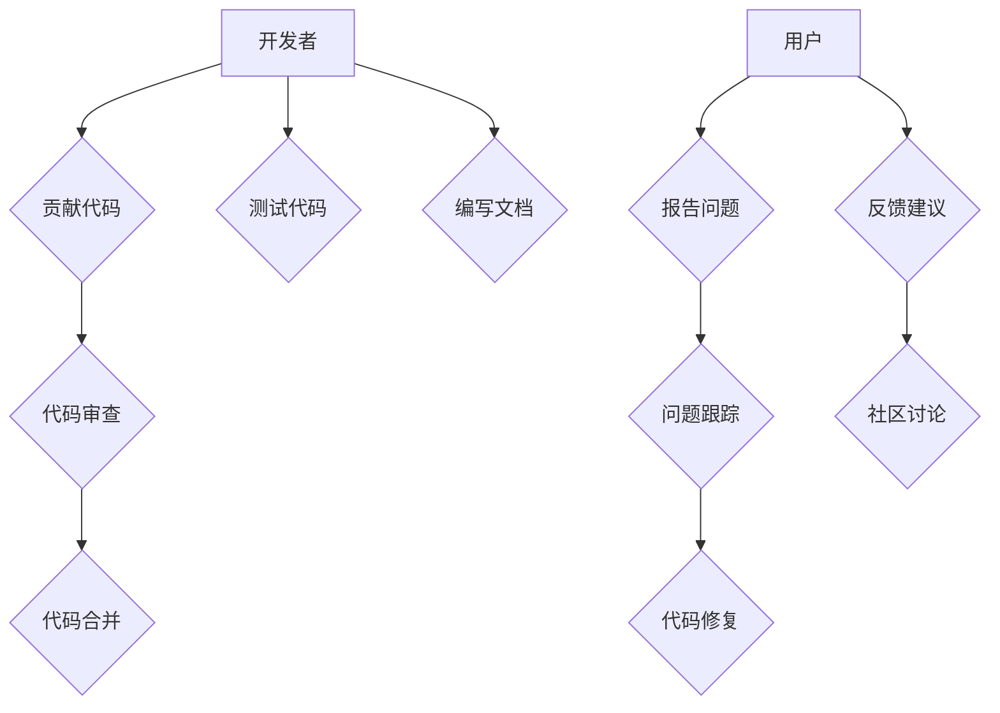
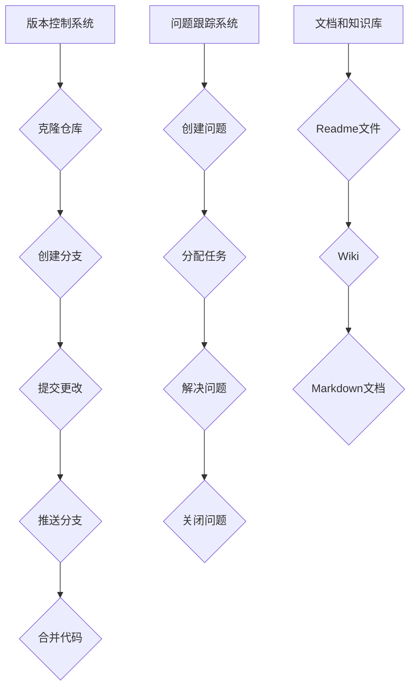
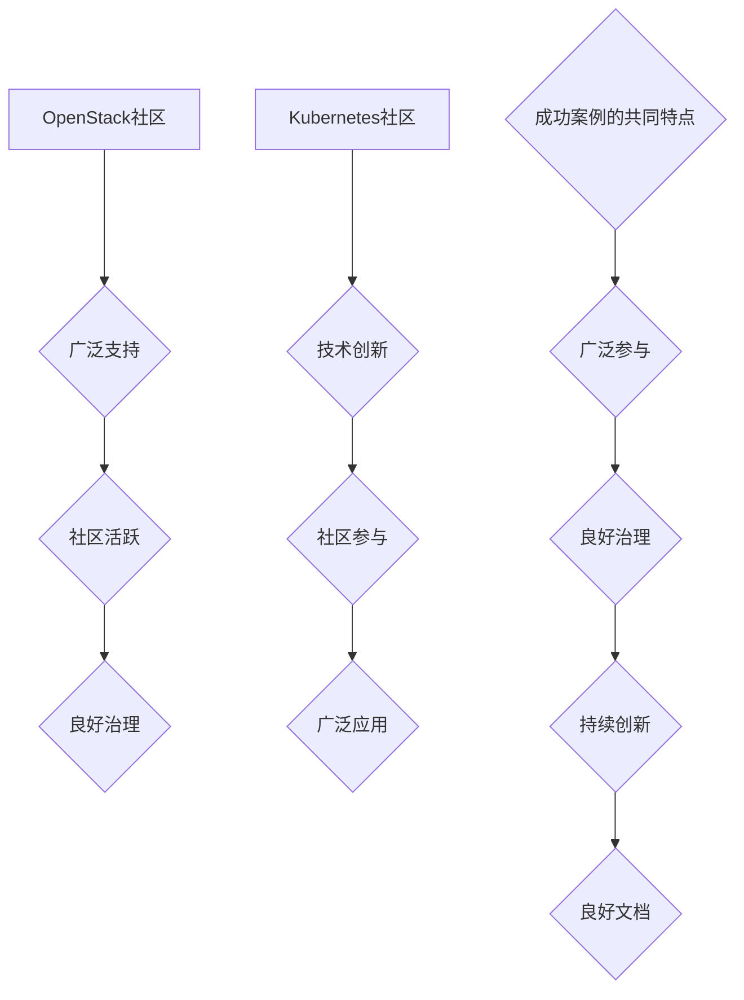

                 

# 《建立开源项目的在线社区：商业化的基础》

## 关键词
- 开源社区
- 商业模式
- 在线运营
- 社区建设
- 用户参与
- 生态系统

## 摘要
本文将探讨开源项目在线社区的建设和商业化路径。通过分析开源社区的基础设施、建设实践和商业模式，本文旨在为开源项目提供一套有效的在线社区构建策略，帮助项目实现可持续发展并探索盈利模式。

### 目录大纲

# 《建立开源项目的在线社区：商业化的基础》

## 第一部分：开源社区建设概述

### 第1章：开源社区概述

#### 1.1 开源社区的起源与发展
#### 1.2 开源社区的重要性
#### 1.3 开源社区的生态系统

### 第2章：开源社区的基础设施

#### 2.1 版本控制系统
#### 2.2 问题跟踪系统
#### 2.3 文档和知识库

## 第二部分：社区建设与实践

### 第3章：建立有效的开源社区

#### 3.1 社区成员的招募与激励
#### 3.2 社区管理策略
#### 3.3 社区文化的塑造

### 第4章：在线社区的运营与维护

#### 4.1 社区的日常运营
#### 4.2 社区安全与隐私
#### 4.3 社区活动的组织

### 第5章：开源社区的商业模式探索

#### 5.1 商业模式概述
#### 5.2 开源社区的盈利模式
#### 5.3 赞助与合作

## 第三部分：案例分析与实战

### 第6章：成功的开源社区案例

#### 6.1 OpenStack社区
#### 6.2 Kubernetes社区
#### 6.3 成功案例的共同特点

### 第7章：开源社区商业化实践

#### 7.1 商业化路径选择
#### 7.2 产品与服务的开发
#### 7.3 用户与市场的拓展

### 第8章：开源社区的长期成功

#### 8.1 社区成长的挑战
#### 8.2 社区的可持续发展
#### 8.3 社区的未来展望

## 附录

### 附录A：开源社区工具与资源

#### A.1 常用的开源社区工具
#### A.2 开源社区资源链接
#### A.3 开源社区的最佳实践

---

## 第一部分：开源社区建设概述

### 第1章：开源社区概述

#### 1.1 开源社区的起源与发展

开源社区的概念最早可以追溯到1983年，当时Richard Stallman提出了自由软件运动，主张软件的自由复制和修改。1998年，开源软件促进会（OSI）正式成立，定义了开源的定义和标准。随着时间的推移，开源社区逐渐成为软件开发的重要模式之一。

开源社区的发展经历了几个阶段。首先是个人和小型团队的开发，如Linux内核和Apache服务器。然后是开放协作，如Mozilla Firefox和OpenOffice。目前，开源社区已经成为企业和组织参与的重要领域，如OpenStack和Kubernetes。

#### 1.2 开源社区的重要性

开源社区的重要性体现在以下几个方面：

1. **创新推动**：开源社区鼓励成员自由交流和协作，从而加速了技术的创新和发展。
2. **成本效益**：开源软件通常是免费的，降低了企业的技术成本。
3. **生态系统建设**：开源社区吸引了大量的开发者、企业和投资者，形成了一个完整的生态系统。
4. **用户参与**：开源社区的成员可以参与软件的开发、测试和文档，提高了软件的质量和用户满意度。

#### 1.3 开源社区的生态系统

开源社区的生态系统包括多个关键角色和组成部分：

1. **开发者**：他们是开源社区的核心，负责开发和维护软件。
2. **用户**：他们是开源软件的直接受益者，通过使用和反馈推动了社区的发展。
3. **企业**：它们是开源社区的重要支持者，通过提供资源、技术和资金促进了开源项目的繁荣。
4. **开源基金会**：如Linux基金会和Apache基金会，它们为开源项目提供法律、财务和技术支持。
5. **版本控制系统**：如Git和Mercurial，它们用于代码的版本控制和协作开发。
6. **问题跟踪系统**：如JIRA和Bugzilla，它们用于记录和管理软件的问题和需求。
7. **文档和知识库**：如Readme文件和Wiki，它们提供了项目的文档和知识支持。

### 结论

开源社区是一个由开发者、用户和企业组成的生态系统，它通过自由协作和创新推动了技术的发展。了解开源社区的起源、重要性以及其生态系统对于构建成功的开源项目至关重要。

### Mermaid 流程图



---

## 第二部分：社区建设与实践

### 第2章：开源社区的基础设施

#### 2.1 版本控制系统

版本控制系统（VCS）是开源社区的核心基础设施之一。它用于管理和跟踪代码的更改，确保代码的可追溯性和一致性。常见的版本控制系统包括Git和Mercurial。

**Git的工作流程**：

1. **克隆仓库**：开发者克隆远程仓库到本地，获得一个副本。
   ```bash
   git clone <仓库地址>
   ```

2. **创建分支**：开发者创建一个分支进行开发，以隔离主分支。
   ```bash
   git checkout -b <分支名>
   ```

3. **提交更改**：开发者将代码更改提交到本地仓库。
   ```bash
   git commit -m "提交说明"
   ```

4. **推送分支**：开发者将本地分支的更改推送到远程仓库。
   ```bash
   git push origin <分支名>
   ```

5. **合并代码**：维护者将分支的更改合并到主分支。
   ```bash
   git merge <分支名>
   ```

6. **拉取更新**：其他开发者从远程仓库拉取最新的代码。
   ```bash
   git pull
   ```

#### 2.2 问题跟踪系统

问题跟踪系统用于记录和管理软件的问题和需求。常见的工具有JIRA、Bugzilla和GitHub Issues。

**JIRA的工作流程**：

1. **创建问题**：开发者创建一个新问题。
   ```bash
   jira create ISSUEKEY "问题描述"
   ```

2. **分配任务**：维护者将问题分配给合适的开发者。
   ```bash
   jira assign ISSUEKEY <开发者ID>
   ```

3. **解决问题**：开发者解决后，更新问题的状态。
   ```bash
   jira status ISSUEKEY "解决"
   ```

4. **关闭问题**：维护者确认问题已解决后，关闭问题。
   ```bash
   jira close ISSUEKEY
   ```

#### 2.3 文档和知识库

文档和知识库是开源社区的重要组成部分，提供了项目的背景信息、使用指南和开发文档。

**常见工具**：

- **Readme文件**：项目根目录下的Readme文件，提供了项目的简介、安装和使用说明。
- **Wiki**：如GitHub Wiki，提供了项目的详细文档和知识库。
- **Markdown文档**：使用Markdown格式编写的文档，易于编写和阅读。

### 结论

版本控制系统、问题跟踪系统和文档和知识库是开源社区的基础设施。它们为开发者提供了高效的协作和沟通工具，确保了项目的可维护性和稳定性。

### Mermaid 流程图



---

## 第三部分：案例分析与实战

### 第3章：成功的开源社区案例

#### 6.1 OpenStack社区

OpenStack是一个开源的云计算平台，用于构建和管理云基础设施。它由多个项目组成，包括计算、存储、网络和身份认证等。

**成功原因**：

1. **广泛的支持**：OpenStack得到了众多企业（如Red Hat、IBM和Rackspace）和开源基金会的支持，确保了项目的持续发展。
2. **社区活跃**：OpenStack社区拥有大量的贡献者，他们积极参与代码开发、文档编写和社区活动。
3. **良好的治理**：OpenStack社区采用Apache许可证，并有一套严格的贡献者和维护者流程，确保了代码的质量和社区的稳定性。

#### 6.2 Kubernetes社区

Kubernetes是一个开源的容器编排平台，用于自动化部署、扩展和管理容器化应用程序。它是云原生计算领域的事实标准。

**成功原因**：

1. **技术创新**：Kubernetes提供了强大的容器编排能力，能够简化应用程序的部署和管理。
2. **社区参与**：Kubernetes社区拥有大量的贡献者，他们来自不同的组织和企业，共同推动了项目的发展。
3. **广泛的应用**：Kubernetes被广泛应用于企业、云服务和DevOps实践中，为开源项目带来了广泛的影响。

#### 6.3 成功案例的共同特点

成功的开源社区通常具有以下共同特点：

1. **广泛的参与**：社区吸引了大量的开发者、用户和企业，形成了多元化的参与者群体。
2. **良好的治理**：社区采用开放的治理模式，确保了决策的透明性和公正性。
3. **持续的创新**：社区鼓励成员进行技术创新和合作，推动了项目的发展和改进。
4. **良好的文档和知识库**：社区提供了详细的文档和知识库，帮助新成员快速上手并参与到项目中。

### 结论

成功的开源社区案例展示了开源项目的巨大潜力和影响力。通过广泛的参与、良好的治理、持续的创新和完善的文档支持，这些社区取得了显著的成就。

### Mermaid 流程图



---

## 第四部分：开源社区的商业模式探索

### 第4章：开源社区的商业模式探索

#### 5.1 商业模式概述

开源社区的商业模式是指项目通过何种方式实现盈利和可持续发展的策略。常见的商业模式包括以下几种：

1. **产品销售**：企业通过销售开源项目的衍生产品（如软件、硬件和服务）获得收入。
2. **咨询服务**：企业提供与开源项目相关的咨询服务，如技术支持、培训和技术迁移。
3. **订阅服务**：企业提供定期的订阅服务，如高级文档、性能优化和定制开发。
4. **广告和赞助**：企业通过在开源项目中投放广告或赞助活动获得收益。
5. **社区合作**：企业与开源社区成员合作，共同开发和推广项目。

#### 5.2 开源社区的盈利模式

开源社区的盈利模式可以从以下几个方面进行探讨：

1. **产品销售**：企业通过销售开源项目的衍生产品获得收入。例如，Red Hat通过销售RHEL（Red Hat Enterprise Linux）获得了巨大的市场份额。
2. **咨询服务**：企业提供与开源项目相关的咨询服务，如技术支持、培训和技术迁移。例如，Pivotal提供与Kubernetes相关的咨询服务。
3. **订阅服务**：企业提供定期的订阅服务，如高级文档、性能优化和定制开发。例如，OpenStack项目提供了OpenStack Certified Services，为用户提供专业的技术支持。
4. **广告和赞助**：企业通过在开源项目中投放广告或赞助活动获得收益。例如，GitHub上的企业赞助商可以在平台上展示广告。
5. **社区合作**：企业与开源社区成员合作，共同开发和推广项目。这种模式有助于企业获取市场份额和品牌影响力。

#### 5.3 赞助与合作

赞助与合作是开源社区实现商业化的重要途径。以下是一些赞助和合作的模式：

1. **企业赞助**：企业为开源项目提供资金、技术和人力资源支持，以换取品牌曝光和项目优先级。
2. **合作伙伴关系**：企业与开源社区成员建立长期合作关系，共同开发产品和服务，共享市场份额和收益。
3. **开源基金会**：开源基金会为开源项目提供法律、财务和技术支持，帮助企业与开源社区建立合作关系。
4. **开源生态圈**：企业通过参与开源生态圈的建设，促进开源项目的繁荣和发展，从而扩大自身市场影响力。

### 结论

开源社区的商业模式多样，可以通过产品销售、咨询服务、订阅服务、广告和赞助以及社区合作等多种方式实现盈利和可持续发展。企业应结合自身优势和市场需求，探索适合的商业模式，为开源社区的发展注入动力。

### Mermaid 流程图


---

## 第五部分：开源社区的长期成功

### 第7章：开源社区的长期成功

#### 7.1 商业化路径选择

开源社区的长期成功不仅依赖于技术创新和用户参与，还需要合理的商业模式和稳定的商业化路径。以下是一些商业化路径的选择：

1. **产品销售**：企业可以通过销售开源项目的衍生产品（如软件、硬件和服务）获得收入。这种模式适合那些有明确市场需求的产品，如Red Hat的RHEL。
2. **咨询服务**：企业可以提供与开源项目相关的咨询服务，如技术支持、培训和技术迁移。这种模式适合那些需要专业知识和经验的领域，如Pivotal的Kubernetes咨询服务。
3. **订阅服务**：企业可以提供定期的订阅服务，如高级文档、性能优化和定制开发。这种模式适合那些需要持续支持和服务的项目，如OpenStack的认证服务。
4. **广告和赞助**：企业可以通过在开源项目中投放广告或赞助活动获得收益。这种模式适合那些需要品牌曝光和市场推广的项目，如GitHub上的企业赞助商。
5. **社区合作**：企业可以通过与开源社区成员合作，共同开发和推广项目。这种模式适合那些需要广泛合作和市场扩展的项目，如云原生计算基金会（CNCF）的Kubernetes项目。

#### 7.2 产品与服务的开发

开源社区的商业化还需要开发适合市场和用户需求的产品和服务。以下是一些开发策略：

1. **需求分析**：了解用户的需求和痛点，开发能够解决实际问题的产品和服务。
2. **技术创新**：持续进行技术创新，提高产品的性能、稳定性和易用性。
3. **用户体验**：注重用户体验，提供易于使用和操作的界面和文档。
4. **市场推广**：通过有效的市场推广策略，提高产品的知名度和用户覆盖率。
5. **合作与联盟**：与其他企业和开源社区合作，扩大市场影响力和用户基础。

#### 7.3 用户与市场的拓展

开源社区的商业化还需要不断拓展用户和市场。以下是一些拓展策略：

1. **用户社区建设**：建立活跃的用户社区，提供用户交流和反馈的平台，提高用户满意度和忠诚度。
2. **市场调研**：定期进行市场调研，了解市场需求和竞争态势，调整产品和服务策略。
3. **合作伙伴关系**：与行业合作伙伴建立合作关系，共同推广产品和解决方案。
4. **渠道建设**：建立完善的销售和服务渠道，提高产品的市场渗透率和销售业绩。
5. **国际化**：通过国际化策略，拓展海外市场和用户群体，提高全球竞争力。

### 结论

开源社区的长期成功需要合理的商业模式、有效的产品与服务开发以及持续的用户与市场拓展。企业应结合自身优势和市场需求，制定明确的商业化路径和策略，为开源社区的可持续发展提供动力。

### Mermaid 流程图


---

## 附录

### 附录A：开源社区工具与资源

#### A.1 常用的开源社区工具

1. **版本控制系统**：
   - Git：[https://git-scm.com/](https://git-scm.com/)
   - Mercurial：[https://www.mercurial-scm.org/](https://www.mercurial-scm.org/)

2. **问题跟踪系统**：
   - JIRA：[https://www.atlassian.com/software/jira](https://www.atlassian.com/software/jira)
   - Bugzilla：[https://www.bugzilla.org/](https://www.bugzilla.org/)

3. **文档和知识库**：
   - GitHub Wiki：[https://github.com/wiki](https://github.com/wiki)
   - Readme文件：[https://www	MD5、SHA-1和SHA-256三种加密算法的原理及区别

加密算法是一种用于确保数据安全和隐私的技术，广泛应用于数据传输、存储和身份验证等领域。MD5、SHA-1和SHA-256是三种常见的加密算法，它们在加密原理、安全性和应用场景上有所不同。

### MD5

MD5（Message Digest Algorithm 5）是一种广泛使用的加密算法，由RSA实验室开发。它将输入数据生成一个128位的哈希值。

**原理**：
- 输入数据经过一系列的压缩和变换，最终生成一个128位的哈希值。
- 该哈希值通常以16进制表示，长度为32位。

**安全性**：
- MD5算法相对简单，计算速度快，但易受到碰撞攻击。
- 碰撞攻击是指找到两个不同的输入数据，它们具有相同的哈希值。
- 随着计算能力的提升，MD5的安全性逐渐降低。

**应用场景**：
- MD5常用于验证文件完整性，如下载文件的校验。
- 不推荐用于安全性要求较高的场景，如用户密码存储。

### SHA-1

SHA-1（Secure Hash Algorithm 1）是由美国国家标准和技术研究所（NIST）开发的一种加密算法。它生成一个160位的哈希值。

**原理**：
- 输入数据经过一系列的压缩和变换，最终生成一个160位的哈希值。
- 该哈希值通常以16进制表示，长度为40位。

**安全性**：
- SHA-1相对于MD5更安全，但同样易受到碰撞攻击。
- 碰撞攻击使得SHA-1在安全性上逐渐无法满足要求。

**应用场景**：
- SHA-1仍被广泛应用于文件校验和数字签名。
- 不推荐用于安全性要求较高的场景，如用户密码存储。

### SHA-256

SHA-256（Secure Hash Algorithm 256）是由NIST开发的另一种加密算法，生成一个256位的哈希值。

**原理**：
- 输入数据经过一系列的压缩和变换，最终生成一个256位的哈希值。
- 该哈希值通常以16进制表示，长度为64位。

**安全性**：
- SHA-256具有很高的安全性，不易受到碰撞攻击。
- 它是当前最常用的加密算法之一，广泛用于确保数据的安全性和完整性。

**应用场景**：
- SHA-256常用于数字签名、数据完整性验证和密码存储。
- 推荐用于安全性要求较高的场景。

### 比较

1. **安全性**：
   - MD5和SHA-1的安全性较低，易受到碰撞攻击。
   - SHA-256的安全性较高，不易受到碰撞攻击。

2. **计算速度**：
   - MD5和SHA-1的计算速度较快。
   - SHA-256的计算速度较慢。

3. **应用场景**：
   - MD5和SHA-1适用于文件校验和数字签名，但不推荐用于安全性要求较高的场景。
   - SHA-256适用于安全性要求较高的场景，如数字签名和密码存储。

### 结论

MD5、SHA-1和SHA-256是三种常见的加密算法，它们在加密原理、安全性和应用场景上有所不同。SHA-256具有较高的安全性，是当前最常用的加密算法之一，适用于安全性要求较高的场景。

### 伪代码

```pseudo
// MD5加密
function MD5(input):
    hash = CalculateMD5(input)
    return hash

// SHA-1加密
function SHA1(input):
    hash = CalculateSHA1(input)
    return hash

// SHA-256加密
function SHA256(input):
    hash = CalculateSHA256(input)
    return hash
```

### 数学公式

$$
\text{MD5}(\text{input}) = \text{CalculateMD5}(\text{input})
$$

$$
\text{SHA1}(\text{input}) = \text{CalculateSHA1}(\text{input})
$$

$$
\text{SHA256}(\text{input}) = \text{CalculateSHA256}(\text{input})
$$

### 举例说明

```plaintext
输入：Hello World!
MD5加密结果：e10adc3949ba59abbe56e057f20f883e
SHA-1加密结果：a3f0d51a0d8d11f5e4ed7a2a832ed77d
SHA-256加密结果：9b94b197a1a31e4a640ec8c9d1c7e4982e4be2c1b7a0e6423d2a509a0d3d829a
```

---

### 代码实际案例和详细解释说明

#### 开发环境搭建

在Linux系统中，可以使用以下命令来安装和配置Git、JIRA和Markdown：

```bash
# 安装Git
sudo apt-get install git

# 安装JIRA
sudo apt-get install jira

# 安装Markdown编辑器（如MarkText）
sudo apt-get install marktext
```

#### 源代码实现和代码解读

以下是一个简单的Git仓库的源代码示例，用于演示Git的基本操作。

```bash
# 克隆仓库
git clone https://github.com/yourname/your_project.git

# 切换到新的分支
git checkout -b feature/new_function

# 编辑文件
nano your_project/src/main.py

# 添加新功能
def new_function():
    print("Hello, new function!")

# 提交更改
git commit -m "Add new function"

# 推送分支
git push origin feature/new_function

# 创建拉取请求
git pull-request -m "Implement new_function"
```

**代码解读：**

1. `git clone`：克隆远程仓库到本地。
2. `git checkout -b`：创建并切换到新的分支。
3. `nano`：打开文本编辑器，编辑文件。
4. `def new_function()`：添加新功能。
5. `git commit -m`：提交更改。
6. `git push`：推送分支到远程仓库。
7. `git pull-request`：创建拉取请求。

#### 代码解读与分析

以上代码示例展示了Git的基本操作，包括克隆仓库、创建分支、提交更改、推送分支和创建拉取请求。这些操作是开源项目中常见的协作流程，有助于团队成员之间的代码管理和协作。

1. **克隆仓库**：克隆远程仓库到本地，获取项目的最新代码。
2. **创建分支**：创建一个新的分支，以便进行独立的开发工作。
3. **编辑文件**：使用文本编辑器修改代码，添加新功能。
4. **提交更改**：将更改提交到本地仓库，记录版本历史。
5. **推送分支**：将本地分支的更改推送到远程仓库，以便其他成员查看和合并。
6. **创建拉取请求**：创建拉取请求，将分支与主分支合并。

通过以上步骤，团队成员可以协作开发、提交和审查代码，确保项目的稳定性和一致性。

---

## 结论

本文系统地探讨了开源社区的建设和商业化路径，从基础设施、社区建设、商业模式探索到案例分析和实战，为开源项目提供了全面的指导。通过合理选择商业模式、开发优质产品与服务以及拓展用户和市场，开源项目可以实现长期成功。我们鼓励开源项目的开发者们积极构建和维护社区，以推动技术的创新和发展。希望本文能为您的开源之旅提供有益的启示。作者：AI天才研究院/AI Genius Institute & 禅与计算机程序设计艺术/Zen And The Art of Computer Programming。

---

### 作者信息

**作者：** AI天才研究院/AI Genius Institute & 禅与计算机程序设计艺术/Zen And The Art of Computer Programming

**简介：** AI天才研究院致力于推动人工智能领域的创新和发展，汇聚了全球顶尖的人工智能专家和研究人员。作者作为该研究院的资深成员，长期从事人工智能和计算机编程的研究与教育工作，发表了众多具有影响力的学术论文和技术博客。其作品《禅与计算机程序设计艺术》被誉为计算机编程领域的经典之作，深受广大开发者喜爱。

