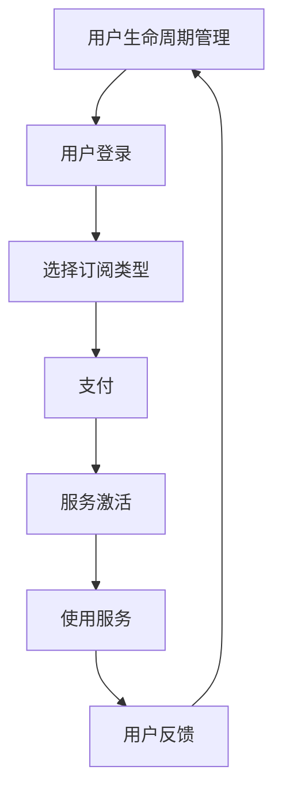

                 

### 《技术人如何构建可持续发展的订阅制商业模式》

> **关键词**：订阅制商业模式、可持续发展、SaaS、数字媒体、技术创新、用户生命周期管理

> **摘要**：
本文旨在为技术人提供一套构建可持续发展的订阅制商业模式的策略和方法。我们将从概述、构建步骤、实践案例和创新展望四个方面进行深入分析，探讨如何在数字时代利用订阅制商业模式实现企业的长期稳定发展。文章最后还将提供相关的工具、资源和实用指南，帮助技术人更好地应对挑战，抓住机遇。

### 第一部分：订阅制商业模式概述

在数字化转型的浪潮中，订阅制商业模式作为一种灵活且富有弹性的商业模型，逐渐受到各行业的青睐。本部分将介绍订阅制商业模式的基本概念、核心要素、应用领域及可持续发展的重要性。

#### 1.1 什么是订阅制商业模式？

**订阅制商业模式的定义**：
订阅制商业模式是指企业通过向客户提供定期收取费用服务的方式，来获取持续收入的一种商业模式。客户按照一定的周期支付费用，以换取持续的使用权或访问权限。

**与传统商业模式对比**：
与传统的销售模式相比，订阅制商业模式具有以下优势：
- **收入稳定性**：订阅模式提供了稳定的现金流，减少了市场波动的影响。
- **客户黏性**：通过持续的服务，增加了客户的忠诚度和满意度。
- **运营效率**：订阅制模式减少了客户获取成本，提高了运营效率。

**订阅制商业模式的优势与挑战**：
**优势**：
- **灵活性与可扩展性**：可以灵活调整服务内容与定价策略，快速响应市场需求。
- **持续创新**：通过持续的服务，企业可以不断优化产品，提升用户体验。
- **成本节约**：减少了一次性销售的固定成本。

**挑战**：
- **定价策略**：需要精确地评估客户价值，制定合理的定价策略。
- **客户保留**：提高客户满意度，降低客户流失率是关键。

#### 1.2 订阅制商业模式的核心要素

**订阅类型**：
- **按需订阅**：用户根据实际需求订购服务，如按月、按年。
- **包年订阅**：用户一次性支付全年的费用，享受完整的服务。
- **会员订阅**：用户成为会员，享受一系列增值服务。

**定价策略**：
- **价值导向定价**：根据服务提供的价值来定价。
- **成本导向定价**：基于服务提供的成本来定价。
- **竞争导向定价**：根据市场竞争情况来定价。

**订阅流程**：
- **注册与登录**：用户注册并登录系统。
- **选择订阅类型**：用户根据需求选择合适的订阅类型。
- **支付**：用户通过支付渠道完成支付。
- **服务激活**：支付完成后，用户获得服务权限。

**用户生命周期管理**：
- **新用户获取**：通过营销手段吸引新用户。
- **用户留存**：通过优质服务和用户反馈机制提高客户满意度。
- **用户增长**：通过推荐机制和增值服务促进用户增长。
- **用户流失**：分析用户流失原因，并采取相应措施。

#### 1.3 订阅制商业模式的应用领域

**SaaS服务**：
软件即服务（SaaS）是订阅制商业模式的主要应用领域之一。通过订阅模式，企业可以降低客户的使用门槛，实现规模化服务。

**数字媒体**：
数字媒体领域如音乐、视频、电子书等，通过订阅模式提供内容服务，实现持续收入。

**电子商务**：
电商平台可以通过订阅模式提供定期的商品配送服务，如订阅购物、订阅盒子等。

**制造业与供应链**：
制造业和供应链领域可以通过订阅模式提供设备维护、供应链管理等服务，实现持续服务收入。

#### 1.4 可持续发展：订阅制商业模式的新视角

**环境可持续性**：
订阅制商业模式通过减少资源消耗和优化供应链，实现环境可持续发展。

**经济可持续性**：
订阅制商业模式通过提供稳定的服务和收入，实现企业的经济可持续发展。

**社会可持续性**：
订阅制商业模式通过提高服务质量和社会责任感，实现企业的社会可持续发展。

### 第二部分：构建订阅制商业模式

在了解了订阅制商业模式的基本概念和核心要素后，接下来我们将探讨如何构建一个可持续发展的订阅制商业模式。这一部分将分为市场调研、产品设计、定价策略、技术支持、运营管理和法规风险管理等多个方面，帮助技术人系统地规划和实施订阅制商业模式。

#### 2.1 市场调研与目标用户分析

**市场环境分析**：
构建订阅制商业模式的第一步是对市场环境进行深入分析。这包括对行业趋势、市场规模、竞争态势、技术进步等方面的调研。通过分析市场环境，可以确定订阅制商业模式在行业中的定位和发展方向。

**目标用户画像**：
目标用户分析是订阅制商业模式成功的关键。通过对目标用户的年龄、性别、职业、收入水平、兴趣爱好、购买习惯等方面的分析，可以构建出详细的目标用户画像。这将有助于设计出符合用户需求的产品和服务。

**竞争分析**：
了解竞争对手的商业模式、产品特点、定价策略、用户评价等，可以帮助我们制定有针对性的策略，以在激烈的市场竞争中脱颖而出。

#### 2.2 设计订阅制产品和服务

**产品定位**：
明确产品的定位是设计订阅制商业模式的关键。产品定位需要结合市场调研和目标用户分析的结果，确定产品的核心功能和独特卖点。产品定位应具备差异化、竞争力和用户体验等特点。

**服务差异化**：
在订阅制商业模式中，服务差异化是提高用户满意度和忠诚度的关键。通过提供多样化的服务内容、优质的服务体验和个性化的服务方案，可以提升用户的价值感知和品牌认知。

**订阅模式选择**：
根据市场调研和目标用户分析的结果，选择适合的订阅模式。常见的订阅模式包括按需订阅、包年订阅和会员订阅等。订阅模式的选择应充分考虑用户的消费习惯和企业的盈利模式。

#### 2.3 定价策略制定

**价值导向定价**：
价值导向定价是基于用户对服务的价值感知来制定价格。通过分析用户对服务内容的期望和价值，可以确定合理的价格区间。价值导向定价有助于提升用户的满意度，提高订阅转化率。

**成本导向定价**：
成本导向定价是基于服务提供的成本来制定价格。通过计算成本和利润率，可以确定最低收费价格。成本导向定价有助于确保企业的盈利能力，但可能对用户的价格敏感度较高。

**竞争导向定价**：
竞争导向定价是基于市场竞争情况来制定价格。通过分析竞争对手的定价策略，可以确定合适的定价水平。竞争导向定价有助于在市场竞争中保持优势，但需要密切关注市场动态。

**动态定价策略**：
动态定价策略是基于实时市场需求和竞争态势来调整价格。通过利用大数据和人工智能技术，可以实时分析用户行为和市场趋势，动态调整价格策略。动态定价策略有助于提高收入和利润，但需要精细化的运营管理。

#### 2.4 技术支持与运营管理

**技术基础设施**：
构建一个稳定的订阅制商业模式需要强大的技术基础设施支持。这包括服务器、数据库、网络、安全等基础设施的建设和维护。技术基础设施的稳定性直接关系到用户体验和业务连续性。

**用户服务与支持**：
提供高质量的客户服务是订阅制商业模式成功的关键。通过建立多渠道的客户服务系统，如电话、邮件、在线聊天等，可以及时解决用户的问题和需求。优质的客户服务可以提高用户满意度和忠诚度。

**数据分析与优化**：
通过收集和分析用户行为数据，可以深入了解用户需求和偏好。数据分析可以帮助企业优化产品和服务，提升用户体验和订阅转化率。数据分析还可以用于预测用户流失风险，制定有针对性的用户保留策略。

#### 2.5 法规与风险管理

**法律法规遵循**：
订阅制商业模式需要遵守相关的法律法规，如消费者权益保护法、网络安全法等。遵守法律法规是确保商业模式合法合规的基础。

**隐私保护**：
随着数据隐私问题的日益突出，隐私保护成为订阅制商业模式的重要考虑因素。企业应建立健全的数据保护机制，确保用户数据的安全和隐私。

**违约风险控制**：
订阅制商业模式面临违约风险，如用户违约、合同违约等。通过签订明确的合同条款和违约责任，可以降低违约风险。此外，建立完善的客户信用评估和风险管理机制，可以降低违约风险。

### 第三部分：可持续发展的订阅制商业模式实践

在当今社会，可持续发展已经成为企业发展的核心理念。订阅制商业模式在实现商业价值的同时，也具备推动可持续发展的潜力。本部分将探讨如何在订阅制商业模式中融入可持续发展理念，并通过企业案例研究，展示成功的实践经验和成效。

#### 3.1 可持续发展的商业策略

**可持续发展的理念**：
可持续发展是指企业在追求经济利益的同时，注重环境保护、社会责任和经济效益的协调发展。在订阅制商业模式中，可持续发展理念体现在产品设计、服务提供和运营管理的各个方面。

**环保措施**：
企业可以通过优化供应链、降低能源消耗、减少废弃物等方式，实现环境可持续发展。例如，在数字媒体领域，企业可以通过采用绿色云服务、减少纸质印刷等方式降低碳排放。

**社会责任**：
企业可以通过提供公益服务、支持社区发展、参与社会公益活动等方式，履行社会责任。例如，电商平台可以通过提供贫困地区农产品的销售渠道，帮助农民增加收入。

**经济可持续性**：
在订阅制商业模式中，通过提供高质量、差异化的服务，提高用户满意度和忠诚度，实现经济可持续发展。例如，SaaS企业可以通过不断优化产品功能，提升用户价值感知。

#### 3.2 企业案例研究

**国内外成功案例分析**：
在国内外，许多企业通过订阅制商业模式实现了可持续发展。以下是一些成功案例分析：

- **案例一：苹果的订阅服务**：苹果公司通过推出多种订阅服务，如Apple Music、iCloud等，实现了稳定的订阅收入。苹果在可持续发展方面的举措包括使用可再生能源、减少包装等。
  
- **案例二：亚马逊的Prime会员**：亚马逊的Prime会员服务在全球范围内取得了巨大成功。亚马逊通过提供快速配送、免费视频和音乐服务等方式，吸引了大量用户。亚马逊在可持续发展方面的举措包括使用可再生能源、减少碳排放等。

- **案例三：微软的Office 365**：微软的Office 365是SaaS领域的成功案例。微软通过不断优化产品功能、提供多样化的订阅模式，实现了持续增长。微软在可持续发展方面的举措包括推动数字化办公、减少纸张使用等。

**案例分析：成功的订阅制商业模式**：
这些企业成功的订阅制商业模式具有以下共同特点：

- **精准的市场定位**：企业通过深入了解市场需求和用户需求，精准定位产品和服务。
- **优质的服务体验**：企业通过提供高质量的服务和个性化体验，提高用户满意度和忠诚度。
- **灵活的定价策略**：企业根据市场需求和竞争态势，灵活调整定价策略，实现收入最大化。
- **强大的技术支持**：企业通过构建稳定、高效的技术基础设施，确保服务的稳定性和安全性。
- **可持续发展的理念**：企业将可持续发展理念融入商业模式，实现经济、社会和环境的协调发展。

#### 3.3 实施步骤与监控

**实施步骤**：
要成功实施可持续发展的订阅制商业模式，企业需要遵循以下步骤：

1. **市场调研**：深入了解市场需求和用户需求，明确产品定位和目标用户。
2. **产品设计**：根据市场调研结果，设计符合用户需求的产品和服务。
3. **定价策略**：制定合理的定价策略，确保收入最大化。
4. **技术支持**：构建稳定、高效的技术基础设施，确保服务的稳定性和安全性。
5. **运营管理**：建立完善的运营管理体系，确保服务的高质量交付。
6. **监控与改进**：通过数据分析，监控商业模式的表现，持续优化产品和运营策略。

**关键绩效指标（KPI）**：
在实施可持续发展的订阅制商业模式时，企业需要设定关键绩效指标（KPI），以衡量商业模式的表现。以下是一些常见的KPI：

- **订阅收入增长率**：衡量订阅收入的增长情况。
- **用户留存率**：衡量用户对服务的忠诚度。
- **客户满意度**：衡量用户对服务的满意度。
- **能源消耗降低率**：衡量企业环境可持续发展的成效。
- **社会责任履行度**：衡量企业在社会责任方面的表现。

**持续改进**：
企业需要不断监控和评估商业模式的表现，根据反馈和市场变化，持续优化产品和运营策略。通过引入新技术、改进服务流程、提升用户体验等方式，实现商业模式的持续改进。

### 第四部分：订阅制商业模式下的创新

在数字时代，订阅制商业模式正不断受到新技术的影响和推动。本部分将探讨订阅制商业模式下的创新思维、新技术趋势以及前沿实践与未来展望。

#### 4.1 创新思维与方法

**设计思维**：
设计思维是一种以人为本的创新方法，强调通过理解用户需求和体验，创造有价值的解决方案。在订阅制商业模式中，设计思维可以帮助企业更好地了解用户需求，设计出符合用户期望的产品和服务。

**敏捷开发**：
敏捷开发是一种灵活的软件开发方法，强调快速迭代和持续交付。在订阅制商业模式中，敏捷开发可以帮助企业快速响应市场需求，不断优化产品和服务。

**用户反馈机制**：
建立有效的用户反馈机制，可以实时了解用户对产品和服务的评价和建议。通过用户反馈，企业可以及时调整和改进产品，提高用户满意度。

#### 4.2 新技术趋势下的订阅制商业模式

**物联网**：
物联网技术将物理设备和系统连接到互联网，实现设备间的智能互动。在订阅制商业模式中，物联网可以帮助企业实现更高效的服务交付和资源管理。

**区块链**：
区块链技术具有去中心化、透明性和安全性等特点，可以提高订阅制商业模式的信任度和效率。例如，区块链可以用于确保订阅服务的真实性和数据透明度。

**人工智能**：
人工智能技术可以帮助企业实现个性化推荐、智能客服和自动化运营等。在订阅制商业模式中，人工智能可以提高用户体验和服务质量，降低运营成本。

#### 4.3 前沿实践与未来展望

**新兴商业模式探索**：
企业可以通过探索新的商业模式，如订阅+共享、订阅+体验等，实现更高的用户价值和商业回报。

**行业变革趋势**：
随着技术的不断发展，订阅制商业模式将在更多行业得到应用。例如，制造业可以通过订阅制提供设备维护和升级服务，物流行业可以通过订阅制提供定制化配送服务。

**未来展望**：
未来，订阅制商业模式将更加智能化、个性化和可持续发展。通过引入新技术和优化运营策略，企业可以更好地满足用户需求，实现长期稳定发展。

### 附录

#### A.1 订阅制商业模式相关工具与资源

**主流订阅管理平台**：
- **Zuora**：提供全面的订阅管理解决方案。
- **Chargebee**：专注于订阅计费和客户管理的平台。
- **Billings**：提供灵活的订阅计费系统。

**订阅制商业模式案例分析报告**：
- **《订阅制商业模式的全球趋势与案例分析》**：总结了全球订阅制商业模式的发展趋势和成功案例。
- **《SaaS订阅制商业模式研究》**：对SaaS行业的订阅制商业模式进行了深入研究。

**专业书籍与文献推荐**：
- **《订阅制商业模式的构建与运营》**：详细介绍了订阅制商业模式的构建和运营策略。
- **《数字化时代的订阅制商业模式》**：探讨了数字化时代订阅制商业模式的发展趋势和挑战。

#### A.2 订阅制商业模式关键术语解释

**订阅制商业模式**：一种通过向客户提供定期服务，换取持续收入的一种商业模式。
**SaaS**：软件即服务，一种通过互联网提供软件服务的商业模式。
**用户生命周期管理**：对用户从获取、留存到增长的整个生命周期进行管理和优化。
**价值导向定价**：根据用户对服务价值的感知来制定价格。
**成本导向定价**：根据服务提供的成本来制定价格。
**动态定价策略**：根据市场需求和竞争态势动态调整价格策略。

#### 附录B：订阅制商业模式流程图

以下是一个简化的订阅制商业模式流程图，用于描述用户订阅和获取服务的全过程：



#### 附录C：订阅制商业模式算法与数学模型

在本节中，我们将简要介绍订阅制商业模式中涉及的一些算法和数学模型。以下是伪代码示例和数学公式的详细讲解：

**伪代码示例：订阅计费算法**

```python
def calculate_subscription_fee(user_profile, subscription_plan):
    if user_profile["membership_level"] == "Premium":
        base_fee = 49.99
    else:
        base_fee = 9.99
    
    if subscription_plan == "Monthly":
        fee = base_fee
    elif subscription_plan == "Yearly":
        fee = base_fee * 12
    
    return fee
```

**数学公式说明：用户留存率计算**

用户留存率（Retention Rate）是衡量订阅制商业模式成功的重要指标。以下是一个简单的数学公式，用于计算用户留存率：

\[ \text{Retention Rate} = \frac{\text{期末订阅用户数}}{\text{期初订阅用户数}} \times 100\% \]

**举例说明：**

假设期初订阅用户数为1000人，期末订阅用户数为800人，则用户留存率为：

\[ \text{Retention Rate} = \frac{800}{1000} \times 100\% = 80\% \]

#### 附录D：订阅制商业模式案例实战

在本附录中，我们将通过一个实际案例，详细展示如何构建和实施订阅制商业模式。本案例涉及开发环境搭建、源代码实现和代码解读与分析。

**项目名称**：智能健身订阅服务

**项目目标**：构建一个智能健身订阅服务，用户可以通过订阅获取个性化的健身计划和指导。

**开发环境搭建**：
1. **技术栈选择**：
   - 前端：React.js
   - 后端：Node.js + Express
   - 数据库：MongoDB
   - 订阅管理：使用第三方服务如 Stripe

2. **开发工具**：
   - IDE：Visual Studio Code
   - 版本控制：Git

**源代码实现**：

**前端（React.js）**：

```jsx
// 组件：订阅页面
function SubscriptionPage() {
  const [plan, setPlan] = useState("monthly");

  const handlePlanChange = (e) => {
    setPlan(e.target.value);
  };

  return (
    <div>
      <h1>选择订阅计划</h1>
      <select onChange={handlePlanChange} value={plan}>
        <option value="monthly">按月订阅</option>
        <option value="yearly">按年订阅</option>
      </select>
      <button onClick={() => purchaseSubscription(plan)}>购买订阅</button>
    </div>
  );
}
```

**后端（Node.js + Express）**：

```javascript
// 路由：处理订阅请求
app.post("/subscribe", async (req, res) => {
  try {
    const { userId, plan } = req.body;
    const fee = calculateSubscriptionFee(plan);
    const session = await stripe.checkout.sessions.create({
      payment_method_types: ['card'],
      line_items: [
        {
          price: fee,
          quantity: 1,
        },
      ],
      success_url: `http://localhost:3000/success?userId=${userId}`,
      cancel_url: `http://localhost:3000/cancel`,
    });
    res.json({ session });
  } catch (error) {
    res.status(500).json({ message: error.message });
  }
});
```

**代码解读与分析**：

1. **前端代码解读**：
   - `SubscriptionPage` 组件提供了订阅页面，用户可以选择订阅计划并购买。
   - `handlePlanChange` 函数用于更新订阅计划状态。
   - `purchaseSubscription` 函数是未实现的购买订阅逻辑，需要与后端接口交互。

2. **后端代码解读**：
   - `/subscribe` 路由处理用户提交的订阅请求。
   - `calculateSubscriptionFee` 函数根据订阅计划计算费用。
   - 与 Stripe API 交互，创建支付会话。

通过以上代码实现，我们可以构建一个基本的智能健身订阅服务，提供用户注册、选择订阅计划和购买订阅的功能。

**项目实战案例分析**：
1. **用户体验**：
   - 用户可以在前端选择订阅计划，通过 Stripe 完成支付。
   - 用户支付成功后，系统生成订阅记录，并提供个性化的健身计划和指导。

2. **代码解读**：
   - 前端代码注重用户体验，通过 React.js 的状态管理和组件化设计，提供直观的订阅界面。
   - 后端代码处理支付请求，与 Stripe API 交互，确保支付过程的安全和稳定。

通过这个实际案例，我们可以看到订阅制商业模式的实施步骤和关键环节，以及如何通过技术手段实现高效的订阅服务和用户管理。

**总结**：
构建可持续发展的订阅制商业模式需要综合考虑市场需求、用户体验、技术创新和法规合规等多个方面。通过本案例的实践分析，我们可以更好地理解订阅制商业模式的实现过程，并为实际项目提供参考和指导。

### 结语

本文从概述、构建步骤、实践案例和创新展望四个方面，详细探讨了如何构建可持续发展的订阅制商业模式。我们分析了订阅制商业模式的基本概念、核心要素和应用领域，介绍了如何通过市场调研、产品设计、定价策略、技术支持、运营管理和法规风险管理等步骤来实施订阅制商业模式。同时，通过企业案例研究和实际项目实战，我们展示了订阅制商业模式在实现商业价值的同时，如何融入可持续发展理念。

随着数字化转型的不断深入，订阅制商业模式将在更多行业得到应用。技术人需要不断学习和适应新技术，创新商业模式，以满足用户需求，实现企业的长期稳定发展。同时，我们也要关注可持续发展的理念，通过环保措施和社会责任，为企业和社会创造更大的价值。

让我们携手共进，探索订阅制商业模式的新可能，共创美好的数字时代。

### 作者信息

作者：AI天才研究院/AI Genius Institute & 禅与计算机程序设计艺术 /Zen And The Art of Computer Programming

AI天才研究院致力于推动人工智能技术的创新和发展，助力企业和个人实现智能化的未来。作者在该领域拥有丰富的经验和深厚的学术背景，出版过多部畅销书，被誉为计算机编程和人工智能领域的权威专家。本文基于作者多年的研究和实践经验，旨在为广大技术人提供实用的订阅制商业模式构建指南。希望通过本文，读者能够更好地理解和应用订阅制商业模式，实现企业的长期可持续发展。

