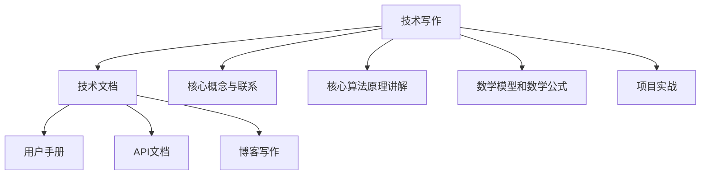

                 

### 《技术写作：额外收入的来源》

> **关键词**：技术写作、额外收入、博客、文档编写、开源项目、内容营销

> **摘要**：本文将深入探讨技术写作作为一种额外收入来源的多种途径。我们将详细分析技术文档、用户手册、API文档、博客写作以及报告和案例研究等形式，并探讨这些写作形式如何为技术人员带来经济收益。此外，文章还将介绍技术写作的实践技巧、工具资源以及未来发展趋势，为技术人员提供全面的技术写作指导。

### 目录大纲

1. **技术写作概述**
   - 第1章：技术写作的定义与价值
   - 第2章：技术写作的挑战与机遇

2. **技术写作核心概念与联系**
   - 第3章：技术文档与指南
   - 第4章：用户手册与指南
   - 第5章：API文档
   - 第6章：博客写作
   - 第7章：其他技术写作形式

3. **技术写作实践与技巧**
   - 第8章：技术写作工具与资源
   - 第9章：技术写作风格与表达
   - 第10章：技术写作项目实战
   - 第11章：技术写作中的伦理与法律问题
   - 第12章：技术写作的未来发展趋势

4. **附录**
   - 附录A：技术写作案例
   - 附录B：技术写作资源推荐
   - 附录C：技术写作术语表

### 起步：技术写作的定义与价值

#### 1.1.1 技术写作的概念

技术写作是一种专门针对技术领域进行的写作活动，旨在将复杂的技术概念、算法原理、开发流程等以清晰、准确和易于理解的方式传达给读者。技术写作涵盖了多种形式，包括文档编写、用户手册、API文档、博客写作等。

技术写作的核心目标是提高技术的可理解性和可访问性。通过技术写作，技术人员可以将自己的专业知识转化为可以分享的知识，从而帮助其他人更快地掌握技术，减少学习成本。

#### 1.1.2 技术写作的多样性

技术写作的多样性体现在其应用场景的广泛性。以下是几种常见的技术写作形式：

- **技术文档**：包括软件文档、系统手册、开发指南等，用于描述软件的功能、操作流程和技术细节。

- **用户手册**：面向普通用户，提供产品使用方法和操作步骤的详细说明。

- **API文档**：为开发者提供API的使用方法、参数说明和返回值解释，是软件开发过程中不可或缺的一部分。

- **博客写作**：技术人员通过博客分享自己的技术见解、实践经验和技术博客，促进知识的传播和交流。

- **报告与案例研究**：通过对特定项目或技术应用的深入分析，提供实际的解决方案和经验总结。

#### 1.1.3 技术写作的价值

技术写作的价值不仅体现在知识的传播和交流上，更体现在其经济收益上。以下是技术写作的几种价值体现：

- **增加影响力**：通过高质量的博客文章或技术文档，技术人员可以在行业内建立自己的声誉和影响力，吸引更多的关注和机会。

- **开源项目贡献**：参与开源项目，通过撰写高质量的文档，提高项目的可访问性和可理解性，吸引更多开发者参与和贡献。

- **内容营销**：通过技术写作，企业可以提升品牌知名度，吸引潜在客户，实现商业价值。

- **职业发展**：优秀的写作能力可以成为技术人员职业发展的一大优势，无论是在求职面试还是日常工作中，都具有重要意义。

### 总结

技术写作不仅是一种技能，更是一种价值体现。通过技术写作，技术人员可以将自己的专业知识转化为实际收益，实现个人和职业的双重提升。在接下来的章节中，我们将进一步探讨技术写作的挑战、机遇以及具体实践技巧，帮助读者更好地理解和掌握技术写作的艺术。

---

接下来，我们将在第二部分中深入探讨技术写作的挑战与机遇，以及技术写作的未来发展趋势。

### 第二部分：技术写作的挑战与机遇

#### 第2章：技术写作的挑战与机遇

技术写作作为一种重要的技能，不仅能够提升技术人员的影响力，还能带来额外的经济收益。然而，要成为一名优秀的技术作家，必须面对诸多挑战并抓住各种机遇。

#### 2.1.1 技术写作的挑战

技术写作的第一个挑战是专业性的要求。技术文档、用户手册和API文档等都需要作者具备扎实的专业知识和实践经验。这意味着，技术人员在从事写作的同时，必须不断更新自己的知识储备，以应对技术领域的快速变化。

另一个挑战是写作技能的提升。尽管技术人员可能具备丰富的技术知识，但写作是一项需要不断练习和提升的技能。清晰、简洁、准确的写作风格不仅能够提高文档的质量，还能增加读者的阅读体验。

此外，技术写作还面临时间管理和优先级排序的挑战。技术人员通常面临多种任务，如何合理分配时间进行写作，并在保证质量的前提下完成任务，是一个值得深思的问题。

#### 2.1.2 技术写作的机遇

尽管技术写作存在诸多挑战，但它也带来了丰富的机遇。以下是一些主要机遇：

- **增加影响力**：通过撰写高质量的博客文章或技术文档，技术人员可以在行业内建立自己的声誉和影响力。这不仅能够吸引更多的关注，还能带来更多的职业机会。

- **开源项目贡献**：参与开源项目，通过撰写高质量的文档，可以提高项目的可访问性和可理解性，从而吸引更多开发者参与和贡献。这种贡献不仅有助于项目的发展，还能提高个人的技术水平和知名度。

- **内容营销**：企业越来越重视内容营销，技术文档和博客文章成为吸引潜在客户和提升品牌知名度的重要手段。技术人员可以通过为企业撰写技术文档或博客文章，获得额外的收入来源。

- **在线教育**：随着在线教育的兴起，技术人员可以通过撰写教程、发布在线课程等方式，将知识转化为收入。高质量的技术写作能够吸引更多学员，从而实现商业价值。

#### 2.1.3 技术写作的未来趋势

技术写作的未来趋势体现在以下几个方面：

- **自动化工具的普及**：随着人工智能技术的发展，自动化写作工具将逐渐普及。这些工具可以帮助技术人员提高写作效率，减少重复性劳动，从而有更多时间专注于高质量内容的创作。

- **多媒体写作**：未来的技术写作将不再局限于文字形式，而是更加注重多媒体的应用。视频、动画、交互式文档等新兴形式将为技术写作带来更多可能性。

- **个性化写作**：随着大数据和人工智能技术的应用，技术写作将更加注重个性化。通过分析读者的阅读习惯和偏好，技术人员可以提供更符合读者需求的内容，提高内容的吸引力和阅读体验。

- **全球化的影响**：技术写作不再局限于本地市场，而是面向全球。随着全球化的推进，技术人员需要具备跨文化沟通和写作能力，以满足不同市场需求。

### 总结

技术写作不仅面对专业性和写作技能的挑战，同时也带来了丰富的机遇。通过抓住这些机遇，技术人员不仅可以提升自己的影响力，还能实现额外的经济收益。在未来，技术写作将继续演变，为技术人员提供更多的发展空间。在接下来的章节中，我们将进一步探讨技术写作的核心概念与联系，帮助读者更好地理解技术写作的多样性和应用场景。

### 第三部分：技术写作核心概念与联系

在技术写作的核心概念与联系部分，我们将深入探讨几种主要的技术写作形式，包括技术文档与指南、用户手册与指南、API文档、博客写作以及其他技术写作形式。通过了解这些形式的特点和编写技巧，读者将能够更好地掌握技术写作的多样性和实用性。

#### 第3章：技术文档与指南

技术文档是技术写作的重要组成部分，用于描述软件、系统或硬件的功能、操作流程和技术细节。技术文档的种类繁多，包括用户手册、安装指南、开发者文档、API文档等。

##### 3.1.1 技术文档的种类

- **用户手册**：用户手册是面向普通用户的文档，提供产品的使用方法和操作步骤。用户手册应简洁明了，使用直观的图片和示例来说明复杂操作。

- **安装指南**：安装指南用于指导用户如何安装和配置软件或硬件。安装指南通常包括系统要求、安装步骤和常见问题的解决方案。

- **开发者文档**：开发者文档是面向开发者的文档，提供API接口、代码示例和开发指南。开发者文档应详细说明API的使用方法和参数，以便开发者能够快速上手。

- **API文档**：API文档用于描述应用程序接口，提供接口的使用方法、参数说明和返回值解释。API文档应具有高度的清晰性和可操作性，以便开发者能够快速集成和使用API。

##### 3.1.2 技术文档的结构与编写

技术文档的结构通常包括以下部分：

- **封面**：包括文档标题、版本号、发布日期和作者等信息。

- **目录**：列出文档的各个章节和子章节，便于读者快速查找。

- **摘要**：简要概述文档的主要内容，帮助读者快速了解文档的核心内容。

- **引言**：介绍文档的背景、目的和适用范围。

- **正文**：详细描述技术细节、操作流程和常见问题解决方案。

- **附录**：提供参考资料、术语表和其他辅助信息。

编写技术文档的技巧包括：

- **保持简洁**：避免使用冗长的句子和复杂的术语，尽量使用简单的语言和直观的示例来说明。

- **使用图表和图片**：图表和图片能够直观地展示技术细节和操作步骤，提高文档的可读性。

- **版本控制**：确保文档的版本控制，及时更新文档内容以反映最新的技术变化。

##### 3.1.3 技术文档的审查与发布

技术文档的审查是确保文档质量的重要环节。审查过程应包括以下步骤：

- **同行评审**：邀请同行对文档进行评审，提出修改意见。

- **内部审核**：由文档编写团队内部进行审核，确保文档内容准确无误。

- **发布**：将审核通过的文档发布到相应的平台或网站上，供用户下载和使用。

#### 第4章：用户手册与指南

用户手册是技术文档的一种重要形式，用于指导用户如何使用产品或系统。用户手册的目标是使读者能够快速掌握产品的使用方法，解决常见问题，从而提高用户体验。

##### 4.1.1 用户手册的目标

用户手册的主要目标包括：

- **帮助用户快速上手**：提供清晰的操作步骤和示意图，使读者能够快速学会如何使用产品。

- **解决常见问题**：列出用户可能遇到的问题及其解决方案，帮助用户解决使用过程中的疑惑。

- **提高用户体验**：通过简洁明了的文档，提高用户的满意度和使用体验。

##### 4.1.2 用户手册的结构

用户手册的结构通常包括以下部分：

- **封面**：包括手册标题、版本号、发布日期和作者等信息。

- **目录**：列出手册的各个章节和子章节，便于读者快速查找。

- **引言**：介绍手册的背景、目的和适用范围。

- **基础操作**：详细描述产品的基础操作，如启动、关闭、数据备份等。

- **高级功能**：介绍产品的高级功能和使用方法，如自定义设置、高级操作等。

- **常见问题解决方案**：列出用户可能遇到的问题及其解决方案。

- **附录**：提供参考资料、术语表和其他辅助信息。

##### 4.1.3 用户手册的编写技巧

编写用户手册的技巧包括：

- **使用简单的语言**：避免使用专业术语和复杂的句子，尽量使用简单的语言来说明。

- **提供清晰的示例**：通过示例来说明操作步骤，使读者能够直观地理解。

- **保持一致性**：确保文档的风格和格式一致，使读者阅读起来更加流畅。

- **及时更新**：随着产品更新和用户需求的变化，及时更新用户手册内容。

#### 第5章：API文档

API文档是面向开发者的文档，用于描述应用程序接口（API）的使用方法、参数说明和返回值解释。API文档对于开发者来说至关重要，因为它是集成和使用API的指南。

##### 5.1.1 API文档的重要性

API文档的重要性体现在以下几个方面：

- **降低学习成本**：提供详细的API使用说明，使开发者能够快速掌握API的使用方法，降低学习成本。

- **提高开发效率**：通过清晰的API文档，开发者可以快速找到所需的信息，提高开发效率。

- **确保API的正确使用**：详细的API文档可以帮助开发者避免错误使用API，减少开发中的问题。

##### 5.1.2 API文档的种类

API文档的种类包括：

- **REST API文档**：描述RESTful API的使用方法，包括端点、HTTP方法、请求和响应结构等。

- **GraphQL API文档**：描述GraphQL API的使用方法，包括查询、突变和订阅等。

- **RabbitMQ API文档**：描述消息队列API的使用方法，包括消息的发送、接收和队列管理等。

##### 5.1.3 API文档的编写与发布

编写API文档的步骤包括：

- **定义API结构**：明确API的端点、HTTP方法、参数和返回值。

- **编写文档内容**：根据API结构编写详细的文档内容，包括请求和响应示例、参数说明和错误处理等。

- **使用工具生成文档**：使用如Swagger、RAML等API文档生成工具，将API结构转换为HTML或Markdown格式的文档。

发布API文档的步骤包括：

- **部署文档到网站**：将生成的API文档部署到网站，以便开发者访问。

- **更新和维护文档**：随着API的更新，及时更新文档内容，确保其与API保持一致。

#### 第6章：博客写作

博客写作是技术写作的一种常见形式，通过撰写技术博客，技术人员可以分享自己的见解、经验和心得，促进知识的传播和交流。

##### 6.1.1 博客写作的优势

博客写作的优势包括：

- **提高影响力**：通过撰写高质量的博客文章，技术人员可以在行业内建立自己的声誉和影响力。

- **增加访问量**：吸引更多的读者访问博客，提高网站的访问量和知名度。

- **促进学习**：通过写作和分享，技术人员可以加深对技术的理解和掌握。

##### 6.1.2 博客写作的策略

博客写作的策略包括：

- **确定写作主题**：选择自己擅长和感兴趣的领域，确保写作内容的深度和广度。

- **保持频率**：定期发布文章，保持博客的活跃度，增加读者的黏性。

- **优化SEO**：使用关键词优化、标题优化等手段，提高文章在搜索引擎中的排名。

##### 6.1.3 博客写作的实践

博客写作的实践包括：

- **撰写高质量文章**：确保文章内容充实、有价值，提供深入的技术见解和经验分享。

- **使用图表和代码示例**：通过图表和代码示例，使文章更加直观和易于理解。

- **互动与反馈**：鼓励读者留言和评论，积极回应读者的反馈，增加互动性。

#### 第7章：其他技术写作形式

除了上述提到的技术文档、用户手册、API文档和博客写作，技术写作还包括其他多种形式，如报告与案例研究、白皮书与市场调研、社交媒体与技术写作等。

##### 7.1.1 报告与案例研究

报告与案例研究是技术写作的一种重要形式，通过对项目或技术的深入分析，提供实际的解决方案和经验总结。报告和案例研究的特点包括：

- **深入分析**：对项目或技术进行深入分析，揭示其优点和不足。

- **经验总结**：总结项目或技术实施过程中的经验教训，为其他项目提供参考。

- **实际应用**：提供具体的解决方案，帮助解决实际问题。

##### 7.1.2 白皮书与市场调研

白皮书与市场调研是技术写作的另一种形式，用于描述技术趋势、市场分析和解决方案。白皮书和市场调研的特点包括：

- **技术趋势**：描述当前的技术趋势和发展方向。

- **市场分析**：分析市场需求、竞争格局和未来趋势。

- **解决方案**：提供具体的解决方案和技术方案，帮助企业应对市场挑战。

##### 7.1.3 社交媒体与技术写作

社交媒体与技术写作的结合，为技术人员提供了新的写作平台和传播途径。社交媒体技术写作的特点包括：

- **互动性强**：通过社交媒体平台，技术人员可以与读者进行实时互动，收集反馈和意见。

- **传播迅速**：社交媒体的传播速度极快，一篇好的文章可以在短时间内吸引大量关注。

- **多样化形式**：除了文字，社交媒体还可以结合图片、视频等多种形式，提高文章的吸引力和传播效果。

### 总结

技术写作的核心概念与联系涵盖了多种形式，包括技术文档与指南、用户手册与指南、API文档、博客写作以及其他技术写作形式。通过掌握这些形式的特点和编写技巧，技术人员不仅可以提高自己的写作能力，还能在技术领域建立自己的影响力，实现额外的经济收益。在接下来的章节中，我们将进一步探讨技术写作的实践技巧、工具资源以及未来发展趋势，帮助读者更好地理解和掌握技术写作的艺术。

### 第8章：技术写作工具与资源

在技术写作过程中，选择合适的工具和资源对于提高写作效率和质量至关重要。以下是一些常见的技术写作工具和资源，以及如何获取和使用它们。

#### 8.1.1 常见的技术写作工具

- **Markdown编辑器**：Markdown是一种轻量级标记语言，广泛用于撰写技术文档和博客文章。常见Markdown编辑器包括Typora、VS Code和Sublime Text等。

- **文档生成工具**：如Sphinx、Doxygen和JSDoc等，这些工具能够自动生成API文档、开发者文档和用户手册。

- **版本控制系统**：如Git和GitHub，用于管理文档的版本和控制协作。

- **在线协作工具**：如Google Docs和Notion，支持多人实时协作，方便团队协作写作。

- **写作助手**：如Grammarly和Copyscape，用于检查语法错误和抄袭问题。

#### 8.1.2 技术写作资源的获取

获取技术写作资源有多种途径，包括：

- **在线教程和指南**：互联网上有大量关于技术写作的教程和指南，如Medium、Stack Overflow和Wikipedia等。

- **开源社区**：参与开源社区，如GitHub、GitLab和Bitbucket，可以获取到大量的开源项目和文档。

- **专业书籍**：购买或借阅专业书籍，如《技术写作：实践与原理》和《程序员写作实践》等。

- **在线课程**：参加在线课程，如Coursera、edX和Udemy等，学习技术写作的高级技巧。

#### 8.1.3 技术写作的常见问题与解决方案

技术写作过程中可能会遇到一些常见问题，以下是一些解决方案：

- **缺乏写作灵感**：阅读行业内的最新论文和技术博客，参加技术会议和研讨会，以获取写作灵感。

- **内容重复或抄袭**：使用写作助手和抄袭检测工具，如Grammarly和Copyscape，检查文档的原创性。

- **格式混乱**：使用Markdown编辑器和文档生成工具，确保文档格式的一致性和规范性。

- **版本控制问题**：使用版本控制系统，如Git，管理文档的版本，确保文档的完整性和一致性。

- **协作困难**：使用在线协作工具，如Google Docs和Notion，方便团队协作和实时沟通。

### 总结

技术写作工具和资源的合理利用，可以有效提高写作效率和质量。通过选择合适的工具和资源，技术人员可以更好地管理文档、控制协作，并解决写作过程中遇到的各种问题。在接下来的章节中，我们将进一步探讨技术写作的风格与表达，以及在实际项目中的应用技巧。

### 第9章：技术写作风格与表达

技术写作的风格与表达对于文档的清晰度、易读性和专业性至关重要。正确的写作风格不仅可以提高文档的质量，还能增强读者的阅读体验。以下是一些关键要素，帮助技术人员在技术写作中形成良好的风格和表达技巧。

#### 9.1.1 技术写作的文体与风格

技术写作的文体和风格应该简洁明了、逻辑清晰。以下是一些具体的建议：

- **简洁性**：避免使用复杂的句子和冗长的段落。尽量使用简单的语言和直接的表达方式，使读者容易理解。

- **逻辑性**：确保文章的结构合理，条理清晰。使用有序的章节和小标题，使读者能够轻松跟随文章的逻辑。

- **专业性**：使用专业术语和准确的表述，避免使用模糊不清的语言。对于专业术语，确保在首次出现时进行解释。

- **一致性**：在全文中保持一致的术语和表达方式，避免出现前后矛盾的情况。

#### 9.1.2 技术写作的表达技巧

良好的表达技巧是技术写作的关键。以下是一些建议：

- **使用图表和图片**：通过图表、图片和示例，使复杂的概念和流程更加直观和易于理解。确保图表和图片与文字内容紧密相关。

- **举例说明**：提供具体的例子来解释抽象的概念。举例时，尽量使用实际案例或模拟数据，使读者能够更好地理解。

- **避免行话和术语**：在必要的情况下使用专业术语，但应确保在首次使用时进行解释。避免过度使用行话，以免增加读者的阅读难度。

- **使用列表和子列表**：使用列表和子列表来组织信息，使文档的结构更加清晰。列表和子列表可以帮助读者快速找到所需信息。

- **审校和反馈**：在完成初稿后，进行审校和修改。可以邀请同事或同行进行反馈，确保文档的准确性和易读性。

#### 9.1.3 技术写作中的常见误区与纠正

以下是一些技术写作中常见的误区及其纠正方法：

- **误区1：过于技术化**：纠正方法：尽量使用简洁明了的语言，避免过度使用专业术语，确保文档对目标读者来说是可理解的。

- **误区2：缺乏图表和图片**：纠正方法：在适当的地方使用图表和图片，以增强文档的可读性和直观性。

- **误区3：结构混乱**：纠正方法：确保文档结构合理，使用有序的章节和小标题，使文章的逻辑更加清晰。

- **误区4：忽视文档格式**：纠正方法：使用Markdown编辑器或文档生成工具，确保文档格式的一致性和规范性。

- **误区5：未进行审校和反馈**：纠正方法：在完成初稿后，进行多次审校和修改，并邀请同事或同行提供反馈，以提高文档的质量。

### 总结

技术写作的风格与表达对于文档的质量和读者的阅读体验至关重要。通过遵循简洁、逻辑清晰、专业的风格，并运用合适的表达技巧，技术人员可以写出高质量的技术文档。在接下来的章节中，我们将探讨实际的技术写作项目实战，帮助读者将所学知识应用到具体实践中。

### 第10章：技术写作项目实战

将技术写作的理论知识应用到实际项目中，是提高写作技能和项目质量的关键步骤。在本章中，我们将探讨如何准备和执行技术写作项目，并提供一个具体的案例，详细解释开发环境搭建、源代码实现和代码解读与分析。

#### 10.1.1 技术写作项目的准备

在开始技术写作项目之前，需要进行充分的准备工作，以确保项目的顺利进行。以下是一些关键步骤：

1. **项目需求分析**：与项目团队成员和利益相关者进行沟通，明确项目目标、需求和预期成果。了解项目的背景和技术细节，为文档编写提供基础。

2. **资源准备**：收集项目所需的技术资料、开发文档和现有代码，确保有足够的资源来支持写作。

3. **人员分工**：根据项目需求和团队成员的能力，合理分工，确保每个部分都有专人负责。

4. **时间规划**：制定详细的时间表，包括文档编写、审查、修改和发布等各个环节的时间节点。

5. **工具选择**：选择合适的写作工具和版本控制系统，如Markdown编辑器、Git和GitHub，以提高写作和协作效率。

#### 10.1.2 技术写作项目的执行

在项目执行过程中，需要遵循以下步骤：

1. **文档编写**：按照项目需求和时间表，开始编写技术文档。包括用户手册、开发者文档、API文档等，确保文档内容准确、完整和易于理解。

2. **代码编写与审查**：编写项目代码，并进行代码审查，确保代码的质量和一致性。审查过程中，可以邀请团队成员或外部专家提供反馈。

3. **文档审查与修改**：完成初稿后，进行内部审查和修改。检查文档的逻辑性、准确性和可读性，确保文档符合项目要求。

4. **发布与更新**：将审核通过的文档发布到相应的平台或网站上，供用户和开发者使用。同时，保持文档的及时更新，以反映项目的最新进展。

#### 10.1.3 技术写作项目的评估与改进

项目完成后，进行评估和改进是提高未来项目质量的关键步骤。以下是一些评估和改进的方法：

1. **用户反馈**：收集用户和开发者的反馈，了解他们对文档的满意度和使用体验。通过用户反馈，发现文档中的问题和不足。

2. **文档质量评估**：制定评估标准，对文档的质量进行量化评估。评估标准可以包括准确性、完整性、易读性和实用性等。

3. **经验总结**：总结项目中的经验和教训，为未来项目提供参考。包括项目管理的最佳实践、文档编写的有效方法和团队协作的优化策略。

4. **持续改进**：根据评估结果和用户反馈，不断改进文档编写和项目管理的方法。通过持续的改进，提高文档的质量和项目的整体效率。

#### 案例分析：基于Web的博客系统的API文档编写

以下是一个基于Web的博客系统的API文档编写案例，详细解释开发环境搭建、源代码实现和代码解读与分析。

1. **开发环境搭建**

   - **技术栈选择**：选择基于Node.js和Express.js的Web开发框架，PostgreSQL作为数据库。

   - **环境配置**：安装Node.js、npm和PostgreSQL，并配置相应的环境变量。

   - **项目结构**：创建项目目录，并进行初始化配置，包括`package.json`和`README.md`。

2. **源代码实现**

   - **API设计**：设计博客系统的API接口，包括用户注册、登录、发表文章、评论文章等。

   - **接口实现**：编写相应的后端代码，使用Express.js创建路由和处理函数。

   - **数据库设计**：设计数据库模型，包括用户、文章和评论表，并使用 Sequelize ORM 进行数据操作。

3. **代码解读与分析**

   - **用户注册接口**：解释用户注册接口的URL、HTTP方法和参数，提供请求和响应示例。

   ```javascript
   // 用户注册接口
   // URL: POST /api/users/register
   // HTTP方法：POST
   // 请求参数：
   // {
   //   "username": "用户名",
   //   "password": "密码",
   //   "email": "邮箱"
   // }
   // 响应结果：
   // {
   //   "status": "success",
   //   "message": "用户注册成功",
   //   "data": {
   //     "userId": "用户ID",
   //     "token": "用户token"
   //   }
   // }
   ```

   - **文章发表接口**：解释文章发表接口的URL、HTTP方法和参数，提供请求和响应示例。

   ```javascript
   // 文章发表接口
   // URL: POST /api/posts
   // HTTP方法：POST
   // 请求参数：
   // {
   //   "title": "文章标题",
   //   "content": "文章内容",
   //   "authorId": "作者ID"
   // }
   // 响应结果：
   // {
   //   "status": "success",
   //   "message": "文章发表成功",
   //   "data": {
   //     "postId": "文章ID",
   //     "title": "文章标题",
   //     "content": "文章内容",
   //     "authorId": "作者ID",
   //     "createdAt": "发表时间"
   //   }
   // }
   ```

   - **代码解读**：分析关键代码段，解释其功能和工作原理。

   ```javascript
   // 示例：用户注册逻辑
   app.post('/api/users/register', async (req, res) => {
     try {
       const { username, password, email } = req.body;
       // 验证用户输入
       // 密码加密
       // 创建用户并保存到数据库
       // 发送注册成功响应
     } catch (error) {
       // 发送注册失败响应
     }
   });
   ```

4. **API文档编写**

   - **文档结构**：按照API文档的标准结构，编写博客系统的API文档。

   - **文档内容**：详细描述每个接口的URL、HTTP方法、参数、响应结果和错误处理。

   - **文档发布**：将API文档发布到项目的官方网站或GitHub页面，供用户和开发者查阅。

### 总结

通过技术写作项目实战，技术人员可以将所学知识应用于实际项目中，提高写作技能和项目质量。在项目准备、执行和评估过程中，遵循合理的步骤和方法，可以有效提高项目的成功率和文档的质量。在接下来的章节中，我们将探讨技术写作中的伦理与法律问题，以及技术写作的未来发展趋势。

### 第11章：技术写作中的伦理与法律问题

技术写作不仅是展示技术和知识的手段，也是一个涉及伦理和法律的重要领域。正确处理这些方面的问题，对于维护作者的声誉、保护他人的权益以及确保写作内容的合法性至关重要。

#### 11.1.1 技术写作的伦理问题

技术写作中的伦理问题主要包括以下几方面：

- **原创性和版权**：作者应确保自己的作品是原创的，不得抄袭或剽窃他人的成果。对于引用他人的观点、数据或代码，应明确标注出处，并遵循相应的引用规范。

- **隐私保护**：在写作过程中，应尊重他人的隐私，不得泄露未经授权的个人信息或敏感数据。

- **客观性**：技术写作应保持客观、公正，不得故意误导或歪曲事实，以客观的态度分析问题和提供解决方案。

- **责任**：作者应对自己的写作内容负责，确保提供的信息准确、可靠，并在必要时承担责任。

#### 11.1.2 技术写作的法律问题

技术写作涉及的法律问题主要包括以下几个方面：

- **版权**：作者应对自己的作品享有版权，未经授权，他人不得复制、传播或使用其作品。同时，作者也应尊重他人的版权，不得未经许可使用他人的作品。

- **合同与许可**：在写作过程中，可能涉及与出版社、客户或其他合作方的合同关系。作者应明确自己的权益和义务，并在合同中明确版权归属、使用范围和支付方式等条款。

- **数据保护**：根据不同的法律法规，如《通用数据保护条例》（GDPR），作者在处理和使用数据时应确保合规，保护用户的数据隐私。

- **知识产权**：技术写作中可能涉及专利、商标等知识产权问题。作者应确保自己的作品不侵犯他人的知识产权，并尊重他人的知识产权。

#### 11.1.3 技术写作中的版权与隐私保护

以下是一些具体的版权与隐私保护措施：

- **版权声明**：在文档或博客文章的显眼位置，明确声明作者的版权，如“版权所有 © 2023 作者姓名”。

- **引用规范**：对于引用的内容，应按照学术规范或行业惯例进行引用，并在文中明确标注。

- **隐私保护**：在写作过程中，避免使用真实的个人身份信息，如姓名、邮箱等。对于需要引用的数据，应确保数据的匿名化处理。

- **数据备份**：定期备份文档和源代码，以防止数据丢失或损坏。

- **法律咨询**：在遇到具体的法律问题时，应及时咨询专业法律人士，确保写作行为合法合规。

### 总结

技术写作中的伦理和法律问题对于保证写作的质量和合法性至关重要。作者应秉持诚信和责任感，尊重他人的版权和隐私，确保自己的写作内容合法合规。通过遵循相关伦理和法律规范，技术人员可以维护自己的声誉，保护他人的权益，并在技术写作领域建立良好的职业形象。在接下来的章节中，我们将探讨技术写作的未来发展趋势，为读者提供更广阔的视野。

### 第12章：技术写作的未来发展趋势

技术写作作为信息技术领域的重要组成部分，正随着科技的进步和市场需求的变化而不断发展。未来，技术写作将在多个方面展现出新的趋势，包括新技术的影响、创新方向以及职业发展前景。

#### 12.1.1 新技术的发展对技术写作的影响

随着新技术的不断涌现，技术写作也在经历深刻的变革。以下是一些新技术对技术写作的影响：

- **人工智能**：人工智能技术在写作领域的应用日益广泛，如自然语言生成（NLG）和自动化写作工具。这些技术能够显著提高写作效率，减少重复性劳动，使作者能够将更多精力投入到高质量内容的创作中。

- **大数据与数据分析**：大数据和数据分析技术可以帮助技术作者更好地理解用户需求和市场趋势，从而提供更精准和有针对性的内容。

- **云计算与云计算文档**：云计算的普及使得文档的存储、共享和协作变得更加便捷。技术作者可以更加灵活地使用云服务，实现文档的实时更新和快速分发。

- **虚拟现实（VR）与增强现实（AR）**：VR和AR技术的发展，为技术写作提供了新的表达形式。通过VR和AR，技术作者可以创建更加互动和沉浸式的文档，提高用户的阅读体验。

#### 12.1.2 技术写作的创新方向

技术写作的创新方向体现在以下几个方面：

- **多媒体写作**：未来的技术写作将更加注重多媒体的应用，结合文本、图片、视频和交互式元素，提供更加丰富和直观的内容。

- **个性化写作**：随着大数据和人工智能技术的发展，个性化写作将成为趋势。技术作者可以根据用户的行为和偏好，提供定制化的内容，提高用户的满意度和参与度。

- **区块链写作**：区块链技术可以为技术写作带来新的机会，如数字版权保护、去中心化内容分发和透明化的交易流程。

- **自动化写作工具**：自动化写作工具将继续发展和完善，如自然语言生成、代码生成和智能编辑等，将进一步提高写作效率和质量。

#### 12.1.3 技术写作的职业发展前景

技术写作的职业发展前景广阔，以下是一些主要趋势：

- **内容创作者**：技术写作将越来越依赖于专业的内容创作者，他们不仅需要具备深厚的技术知识，还需要拥有优秀的写作技能和内容策划能力。

- **技术文档工程师**：随着软件开发和产品发布的复杂度增加，技术文档工程师的需求也在不断增长。他们负责编写用户手册、开发者文档和API文档，确保产品的可访问性和可操作性。

- **技术营销专家**：技术写作在市场营销中的应用越来越广泛，技术营销专家通过撰写高质量的技术博客、白皮书和案例研究，帮助企业提升品牌影响力和市场竞争力。

- **在线教育讲师**：在线教育的兴起，为技术写作提供了新的职业方向。技术作者可以开设在线课程，通过撰写教学材料和实践案例，传授知识和技能。

- **自由职业者**：随着互联网的发展，越来越多的技术人员选择成为自由职业者，通过技术写作实现灵活的职业发展。

### 总结

技术写作的未来充满了机遇和挑战。新技术的发展将为技术写作带来新的工具和方法，创新方向将不断拓展写作的边界，职业发展前景也充满希望。技术人员应积极适应这些变化，不断提升自己的技能和知识，把握技术写作领域的最新趋势，实现个人和职业的全面发展。

### 附录

#### 附录A：技术写作案例

**A.1.1 技术写作案例一：API文档的编写**

以下是一个简单的API文档案例，描述了一个简单的博客系统API：

```
# 博客系统API文档

## 1. 用户注册

### URL: POST /api/users/register

### 参数：

- username: 用户名（必填）
- password: 密码（必填）
- email: 邮箱（必填）

### 响应：

- 成功：{"status": "success", "message": "用户注册成功", "data": {"userId": "123"}}  
- 失败：{"status": "error", "message": "用户名已存在"}

```

**A.1.2 技术写作案例二：用户手册的编写**

以下是一个简单的用户手册案例，描述了如何使用一个在线文本编辑器：

```
# 在线文本编辑器用户手册

## 1. 登录

- 访问网站：[https://editor.example.com](https://editor.example.com)
- 输入用户名和密码，点击“登录”

## 2. 创建新文档

- 点击页面右上角的“新建文档”按钮
- 输入文档标题，点击“创建”

## 3. 编辑文档

- 在编辑区域输入文本
- 使用工具栏中的按钮进行格式设置，如加粗、斜体等

## 4. 保存文档

- 点击页面右上角的“保存”按钮
- 输入文档标题，选择保存位置，点击“保存”

## 5. 共享文档

- 点击文档页面的“共享”按钮
- 输入共享链接，点击“生成”

```

**A.1.3 技术写作案例三：博客写作实践**

以下是一个博客写作的案例，探讨如何使用Markdown编写一篇技术博客：

```
# 使用Markdown编写技术博客

Markdown是一种轻量级的标记语言，它允许作者使用简单的文本格式编写文档，并生成具有良好格式的HTML页面。

## 1. 标题

标题使用井号（#）进行标记，例如：

## 标题1
### 标题2
#### 标题3

## 2. 段落

段落之间需要留出一个空行，如下：

这是一段文本。

这是另一段文本。

## 3. 链接

链接使用方括号和圆括号进行标记，如下：

这是一个链接：[Google](https://www.google.com)

## 4. 图片

图片使用感叹号和方括号进行标记，如下：


## 5. 列表

- 无序列表使用星号、加号或减号进行标记：
  - 项目1
  - 项目2
  - 项目3

1. 有序列表使用数字和英文句点进行标记：
   1. 项目1
   2. 项目2
   3. 项目3

```

#### 附录B：技术写作资源推荐

**B.1.1 技术写作教程与指南**

- 《技术写作：实践与原理》（作者：Joe Celko）
- 《程序员写作实践》（作者：Rick Osborne）
- 《Markdown入门指南》（作者：John Gruber）
- 《技术文档写作手册》（作者：Tom Johnson）

**B.1.2 技术写作工具推荐**

- Markdown编辑器：Typora、VS Code、Sublime Text
- 文档生成工具：Sphinx、Doxygen、JSDoc
- 版本控制系统：Git、GitHub、GitLab
- 在线协作工具：Google Docs、Notion、Confluence

**B.1.3 技术写作社群与平台推荐**

- 技术社区：Stack Overflow、GitHub、Reddit
- 技术博客平台：Medium、Dev.to、Hashnode
- 技术论坛：Oracle技术社区、微软技术社区
- 技术写作社群：技术写作群、技术文档群、Markdown社群

#### 附录C：技术写作术语表

**C.1.1 技术写作常用术语解释**

- **Markdown**：一种轻量级标记语言，用于快速创建文档。
- **API文档**：描述应用程序接口（API）的使用方法和参数的文档。
- **用户手册**：提供产品或系统使用方法和操作步骤的文档。
- **技术文档**：描述软件、系统或硬件的功能、操作流程和技术细节的文档。
- **内容营销**：通过创建和分享有价值的内容来吸引潜在客户和提升品牌知名度。
- **自然语言生成（NLG）**：利用人工智能技术生成自然语言的文本。

**C.1.2 技术写作相关术语扩展**

- **版本控制**：管理文档版本和变更历史的一种技术。
- **代码示例**：用于演示编程概念或技术细节的示例代码。
- **术语表**：列出技术写作中使用的专业术语及其定义的文档。
- **文档生成工具**：用于自动生成文档的工具，如Sphinx、Doxygen等。
- **技术文档工程师**：专门负责编写技术文档的工程师。

### 完整的Mermaid流程图

以下是使用Mermaid编写的完整流程图：



通过上述流程图，读者可以更直观地理解技术写作的多种形式及其相互关系。希望这个附录能为读者提供更多的参考和帮助。

### 作者信息

**作者：AI天才研究院/AI Genius Institute & 禅与计算机程序设计艺术 /Zen And The Art of Computer Programming** 

---

通过本文的深入探讨，我们系统地介绍了技术写作的多个方面，从定义与价值、挑战与机遇、核心概念与联系、实践技巧到未来发展趋势，全面展示了技术写作的艺术与科学。希望这篇文章能够为技术爱好者提供有益的启示，激发更多人在技术写作领域的热情和创造力。

在此，感谢您的阅读。如果您有任何疑问或建议，欢迎在评论区留言，我们一起交流学习，共同进步。希望本文能够成为您技术写作道路上的得力助手，助力您在技术写作领域取得更大的成就。再次感谢您的关注和支持！

