                 

# 《探索AI大模型的商业化路径》

## 关键词
AI大模型、商业化、技术、实践、风险、趋势、战略

## 摘要
本文旨在探讨AI大模型的商业化路径，通过分析AI大模型的崛起背景、核心技术、商业化实践、风险以及未来趋势，为AI大模型的商业化提供系统性的指导。文章分为三部分，首先概述AI大模型商业化的重要性和背景，然后深入探讨其核心技术，并分析成功案例和商业化策略，最后展望未来的发展趋势和提出战略建议。

### 目录大纲

1. **第一部分：AI大模型商业化背景与概念**
   1.1 AI大模型商业化概述
   1.2 AI大模型的核心技术
   1.3 商业化路径的重要性

2. **第二部分：AI大模型商业化实践**
   2.1 AI大模型商业化案例分析
   2.2 AI大模型商业化策略
   2.3 AI大模型商业化风险与应对

3. **第三部分：AI大模型商业化的未来趋势与战略建议**
   3.1 行业发展趋势
   3.2 技术创新与突破
   3.3 商业模式创新
   3.4 战略建议

#### 第一部分：AI大模型商业化背景与概念

##### 第1章：AI大模型商业化概述

##### 1.1 AI大模型的崛起

**核心概念与联系**

AI大模型是指通过大规模数据训练并具备高参数数量的深度学习模型，如GPT-3、BERT、ImageNet等。这些模型在处理复杂任务时表现出色，但同时也带来了巨大的计算资源和数据需求。Mermaid流程图如下：

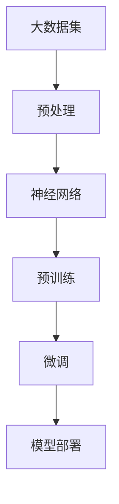

**核心算法原理讲解**

AI大模型基于深度学习的原理，通过多层神经网络结构来学习和模拟人类大脑的决策过程。以下为预训练模型的伪代码：

```python
# 预训练伪代码
class PretrainedModel(nn.Module):
    def __init__(self):
        super(PretrainedModel, self).__init__()
        self.layer1 = nn.Linear(input_size, hidden_size)
        self.relu = nn.ReLU()
        self.layer2 = nn.Linear(hidden_size, output_size)

    def forward(self, x):
        x = self.layer1(x)
        x = self.relu(x)
        x = self.layer2(x)
        return x
```

**数学模型和公式**

预训练模型的损失函数通常采用交叉熵损失函数，公式如下：

$$
L = -\frac{1}{N}\sum_{i=1}^{N}y_i \log(p_i)
$$

其中，$L$ 表示损失，$N$ 表示样本数，$y_i$ 表示第 $i$ 个样本的真实标签，$p_i$ 表示模型预测的概率。

**项目实战**

以BERT模型为例，其训练过程需要大量的计算资源和数据预处理。以下是BERT模型训练的一个实际案例：

```shell
# 搭建BERT模型训练环境
conda create -n bert python=3.8
conda activate bert
pip install transformers

# 训练BERT模型
python train.py --train_data=train_data --val_data=val_data --model_dir=model_dir
```

**代码解读与分析**

在训练BERT模型时，需要首先准备好训练数据和验证数据，然后使用transformers库中的BERT模型进行训练。代码中的`train.py`脚本负责模型的训练过程，包括数据预处理、模型初始化和训练循环等。

##### 1.2 商业化的需求与挑战

**核心概念与联系**

商业化的需求主要体现在以下几个方面：

1. 提高业务效率
2. 降低运营成本
3. 创造新的商业模式
4. 提升用户体验

商业化过程中的挑战主要包括：

1. 技术实现的复杂性
2. 数据隐私和安全问题
3. 市场竞争压力
4. 法规政策限制

以下为Mermaid流程图：

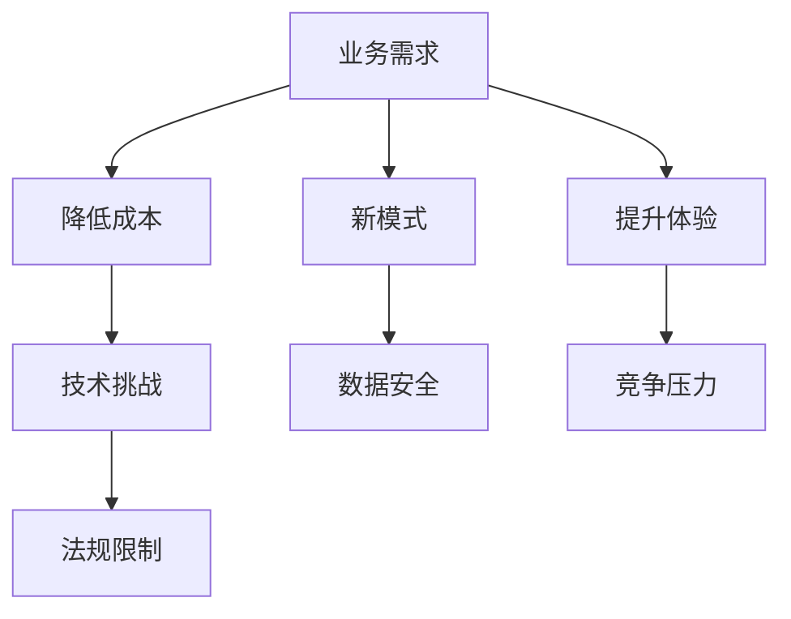

**核心算法原理讲解**

商业化的需求可以通过AI大模型的技术实现来满足，如通过优化算法提高业务效率、利用数据挖掘技术降低运营成本、创新商业模式和提升用户体验等。

**数学模型和公式**

商业化的过程可以通过数学模型进行量化分析，如利用机器学习算法预测市场趋势、通过优化模型参数降低成本等。

**项目实战**

以人工智能辅助医疗为例，商业化过程中需要处理大量的患者数据，并确保数据的安全和隐私。以下是人工智能辅助医疗的一个实际案例：

```shell
# 准备患者数据
python prepare_data.py --data_dir=data_dir

# 训练模型
python train_model.py --data_dir=data_dir --model_dir=model_dir

# 部署模型
python deploy_model.py --model_dir=model_dir
```

**代码解读与分析**

在人工智能辅助医疗的案例中，首先需要准备患者数据，然后使用机器学习算法进行模型训练，最后将训练好的模型部署到生产环境中。代码中的`prepare_data.py`、`train_model.py`和`deploy_model.py`脚本分别负责数据预处理、模型训练和模型部署的过程。

##### 1.3 商业化路径的重要性

**核心概念与联系**

商业化路径是指将AI大模型技术应用于实际业务场景，实现商业价值的过程。其重要性主要体现在以下几个方面：

1. 明确商业目标
2. 提高市场竞争力
3. 确保项目成功
4. 优化资源配置

以下为Mermaid流程图：

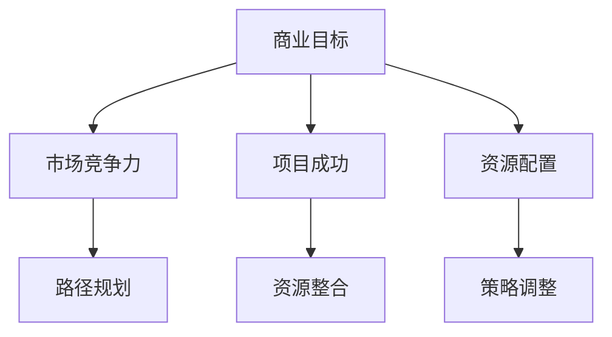

**核心算法原理讲解**

商业化路径的规划需要结合市场需求、技术能力和资源配置等多个方面进行综合分析，以确保项目的成功实施。

**数学模型和公式**

商业化路径的规划可以通过数学模型进行量化分析，如利用回归分析预测市场需求、通过优化模型参数提高项目成功率等。

**项目实战**

以下是一个基于AI大模型商业化的实际项目案例：

```shell
# 制定商业计划
python business_plan.py --market_data=market_data --tech_capability=tech_capability

# 策略评估
python strategy_evaluation.py --business_plan=plan_dir

# 路径调整
python path_adjustment.py --strategy_evaluation=result_dir
```

**代码解读与分析**

在AI大模型商业化的项目中，首先需要制定商业计划，然后进行策略评估和路径调整。代码中的`business_plan.py`、`strategy_evaluation.py`和`path_adjustment.py`脚本分别负责商业计划的制定、策略评估和路径调整的过程。

##### 第2章：AI大模型的核心技术

##### 2.1 AI大模型技术基础

**核心概念与联系**

AI大模型技术基础主要包括神经网络、深度学习、自然语言处理和计算机视觉等。

以下为Mermaid流程图：

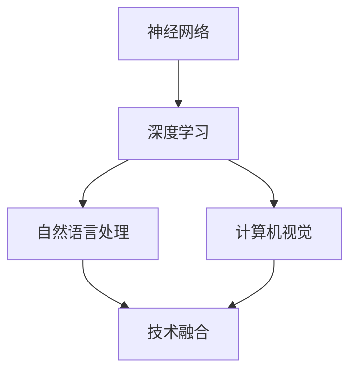

**核心算法原理讲解**

神经网络是通过模拟生物神经系统的结构和工作原理，实现对数据的高效处理和模式识别。以下为神经网络的伪代码：

```python
# 神经网络伪代码
class NeuralNetwork(nn.Module):
    def __init__(self):
        super(NeuralNetwork, self).__init__()
        self.fc1 = nn.Linear(input_size, hidden_size)
        self.fc2 = nn.Linear(hidden_size, output_size)

    def forward(self, x):
        x = self.fc1(x)
        x = self.relu(x)
        x = self.fc2(x)
        return x
```

**数学模型和公式**

神经网络的损失函数通常采用均方误差（MSE），公式如下：

$$
L = \frac{1}{N}\sum_{i=1}^{N}(y_i - \hat{y_i})^2
$$

其中，$L$ 表示损失，$N$ 表示样本数，$y_i$ 表示第 $i$ 个样本的真实标签，$\hat{y_i}$ 表示模型预测的标签。

**项目实战**

以下是一个基于神经网络的实际项目案例：

```shell
# 搭建神经网络环境
conda create -n neural_network python=3.8
conda activate neural_network
pip install torch torchvision

# 训练神经网络模型
python train_network.py --data_dir=data_dir --model_dir=model_dir
```

**代码解读与分析**

在神经网络的项目中，首先需要搭建训练环境，然后使用torch库进行模型训练。代码中的`train_network.py`脚本负责模型训练的过程。

##### 2.2 大规模预训练模型

**核心概念与联系**

大规模预训练模型是指通过在大规模数据集上进行预训练，从而获得高度泛化能力的深度学习模型。主流预训练模型包括GPT-3、BERT、ViT等。

以下为Mermaid流程图：

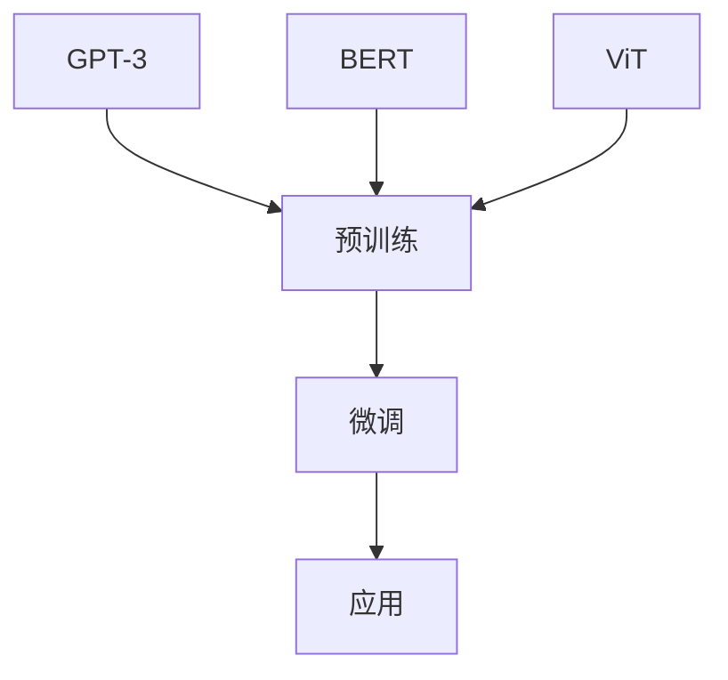

**核心算法原理讲解**

大规模预训练模型通过在大规模数据集上进行预训练，使得模型具备了对多种语言的建模能力和图像的理解能力。以下为BERT模型的伪代码：

```python
# BERT模型伪代码
class BERTModel(nn.Module):
    def __init__(self, vocab_size, hidden_size, num_layers, dropout):
        super(BERTModel, self).__init__()
        self.embedding = nn.Embedding(vocab_size, hidden_size)
        self.encoder = nn.ModuleList([nn.Linear(hidden_size, hidden_size) for _ in range(num_layers)])
        self.dropout = nn.Dropout(dropout)

    def forward(self, x):
        x = self.dropout(self.embedding(x))
        for layer in self.encoder:
            x = layer(x)
        return x
```

**数学模型和公式**

BERT模型的训练过程中，通常采用Transformer架构，其损失函数为交叉熵损失函数，公式如下：

$$
L = -\frac{1}{N}\sum_{i=1}^{N}y_i \log(p_i)
$$

其中，$L$ 表示损失，$N$ 表示样本数，$y_i$ 表示第 $i$ 个样本的真实标签，$p_i$ 表示模型预测的概率。

**项目实战**

以下是一个基于BERT模型的实际项目案例：

```shell
# 搭建BERT模型训练环境
conda create -n bert python=3.8
conda activate bert
pip install transformers

# 训练BERT模型
python train_bert.py --train_data=train_data --val_data=val_data --model_dir=model_dir
```

**代码解读与分析**

在BERT模型的项目中，首先需要搭建训练环境，然后使用transformers库进行模型训练。代码中的`train_bert.py`脚本负责模型训练的过程。

##### 2.3 AI大模型的优化与部署

**核心概念与联系**

AI大模型的优化与部署主要包括模型压缩、加速和部署等方面。

以下为Mermaid流程图：

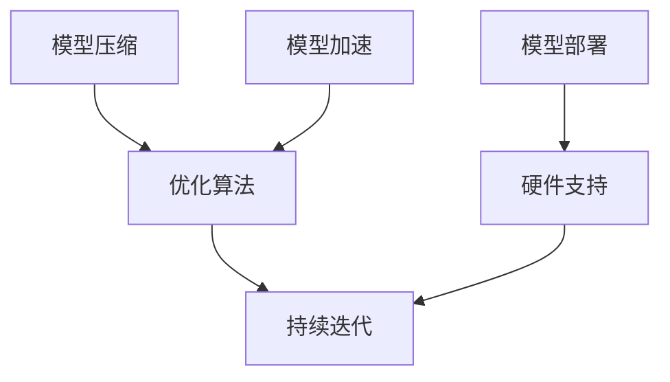

**核心算法原理讲解**

模型压缩算法如剪枝、量化等，通过减少模型的参数数量和计算量，提高模型的计算效率和存储空间利用率。以下为剪枝算法的伪代码：

```python
# 剪枝算法伪代码
def prune_model(model, pruning_rate):
    for layer in model.parameters():
        if layer.requires_grad:
            layer.data.mul_(1 - pruning_rate)
```

**数学模型和公式**

模型压缩和加速的过程中，可以通过优化算法提高模型的计算效率和性能。例如，通过优化模型的结构和参数，提高模型的收敛速度和准确率。

**项目实战**

以下是一个基于AI大模型优化的实际项目案例：

```shell
# 优化AI大模型
python optimize_model.py --model_dir=model_dir

# 部署AI大模型
python deploy_model.py --model_dir=model_dir
```

**代码解读与分析**

在AI大模型优化的项目中，首先需要对模型进行压缩和加速，然后进行部署。代码中的`optimize_model.py`和`deploy_model.py`脚本分别负责模型优化和部署的过程。

#### 第二部分：AI大模型商业化实践

##### 第3章：AI大模型商业化案例分析

##### 3.1 案例一：自然语言处理领域的商业化

**核心概念与联系**

自然语言处理（NLP）是AI大模型商业化的重要领域，广泛应用于智能客服、文本分类、机器翻译等场景。

以下为Mermaid流程图：

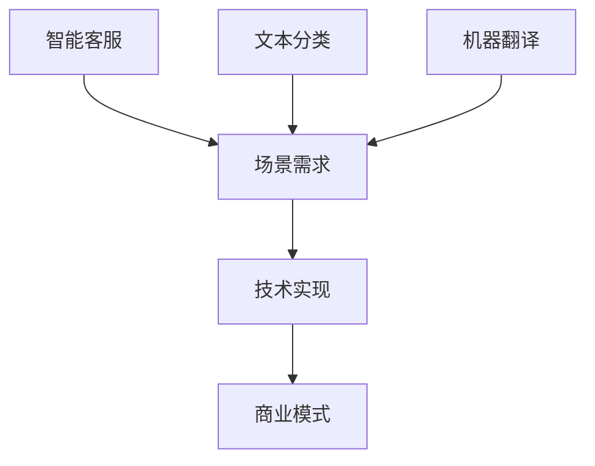

**核心算法原理讲解**

NLP领域的技术实现主要依赖于深度学习模型，如BERT、GPT等，通过预训练和微调来提高模型的性能。以下为BERT模型在文本分类任务中的伪代码：

```python
# BERT文本分类伪代码
class BERTClassifier(nn.Module):
    def __init__(self, model_name, num_classes):
        super(BERTClassifier, self).__init__()
        self.bert = BertModel.from_pretrained(model_name)
        self.classifier = nn.Linear(self.bert.config.hidden_size, num_classes)

    def forward(self, input_ids, attention_mask):
        outputs = self.bert(input_ids=input_ids, attention_mask=attention_mask)
        logits = self.classifier(outputs.last_hidden_state[:, 0, :])
        return logits
```

**数学模型和公式**

文本分类任务的损失函数通常采用交叉熵损失函数，公式如下：

$$
L = -\frac{1}{N}\sum_{i=1}^{N}y_i \log(p_i)
$$

其中，$L$ 表示损失，$N$ 表示样本数，$y_i$ 表示第 $i$ 个样本的真实标签，$p_i$ 表示模型预测的概率。

**项目实战**

以下是一个基于BERT模型的文本分类项目案例：

```shell
# 搭建BERT模型训练环境
conda create -n bert_text_class python=3.8
conda activate bert_text_class
pip install transformers torch

# 训练BERT模型
python train_bert_classifier.py --train_data=train_data --val_data=val_data --model_dir=model_dir
```

**代码解读与分析**

在BERT文本分类项目中，首先需要搭建训练环境，然后使用transformers库进行模型训练。代码中的`train_bert_classifier.py`脚本负责模型训练的过程。

**商业模式与盈利模式**

自然语言处理领域的商业模式主要包括：

1. 提供API服务：向企业或个人开发者提供自然语言处理API，按使用量计费。
2. 定制化开发：为企业提供定制化的自然语言处理解决方案，根据项目需求进行报价。
3. 数据服务：提供高质量的自然语言处理数据集，供开发者或研究机构使用。

**案例总结**

自然语言处理领域的商业化案例表明，通过利用AI大模型技术，可以解决现实中的多种自然语言处理问题，实现商业价值。在商业模式上，可以采用API服务、定制化开发和数据服务等多种方式，以适应不同客户的需求。

##### 3.2 案例二：计算机视觉领域的商业化

**核心概念与联系**

计算机视觉（CV）是AI大模型商业化的重要领域，广泛应用于图像识别、目标检测、人脸识别等场景。

以下为Mermaid流程图：

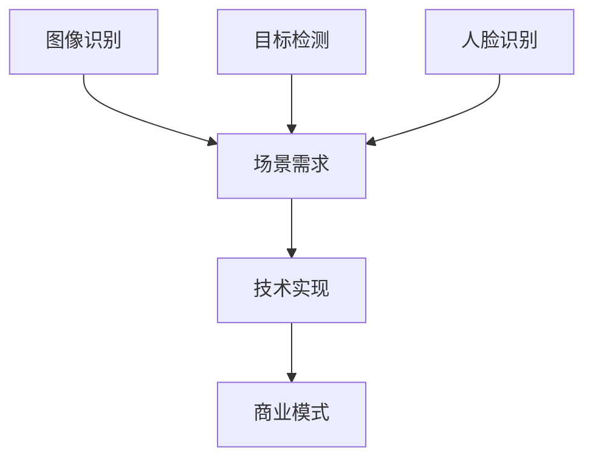

**核心算法原理讲解**

计算机视觉领域的技术实现主要依赖于深度学习模型，如YOLO、SSD、RetinaNet等，通过预训练和微调来提高模型的性能。以下为YOLO模型的目标检测伪代码：

```python
# YOLO目标检测伪代码
class YOLODetector(nn.Module):
    def __init__(self, model_name):
        super(YOLODetector, self).__init__()
        self.model = torch.hub.load('ultralytics/yolov5', model_name, pretrained=True)

    def forward(self, x):
        x = self.model(x)
        return x
```

**数学模型和公式**

目标检测任务的损失函数通常包括定位损失和分类损失，如以下公式：

$$
L = \frac{1}{N}\sum_{i=1}^{N}(\alpha_i \cdot (l_i + c_i))
$$

其中，$L$ 表示损失，$N$ 表示样本数，$\alpha_i$ 表示样本权重，$l_i$ 表示定位损失，$c_i$ 表示分类损失。

**项目实战**

以下是一个基于YOLO模型的实际项目案例：

```shell
# 搭建YOLO模型训练环境
conda create -n yolov5 python=3.8
conda activate yolov5
pip install torch torchvision opencv-python

# 训练YOLO模型
python train_yolov5.py --train_data=train_data --val_data=val_data --model_dir=model_dir
```

**代码解读与分析**

在YOLO模型的项目中，首先需要搭建训练环境，然后使用torch库进行模型训练。代码中的`train_yolov5.py`脚本负责模型训练的过程。

**商业模式与盈利模式**

计算机视觉领域的商业模式主要包括：

1. 提供API服务：向企业或个人开发者提供计算机视觉API，按使用量计费。
2. 定制化开发：为企业提供定制化的计算机视觉解决方案，根据项目需求进行报价。
3. 设备集成：将计算机视觉技术集成到硬件设备中，实现自动化应用。

**案例总结**

计算机视觉领域的商业化案例表明，通过利用AI大模型技术，可以解决现实中的多种计算机视觉问题，实现商业价值。在商业模式上，可以采用API服务、定制化开发和设备集成等多种方式，以适应不同客户的需求。

##### 3.3 案例三：人工智能辅助医疗的商业模式

**核心概念与联系**

人工智能辅助医疗是AI大模型商业化的重要领域，广泛应用于疾病预测、诊断辅助、个性化治疗等场景。

以下为Mermaid流程图：

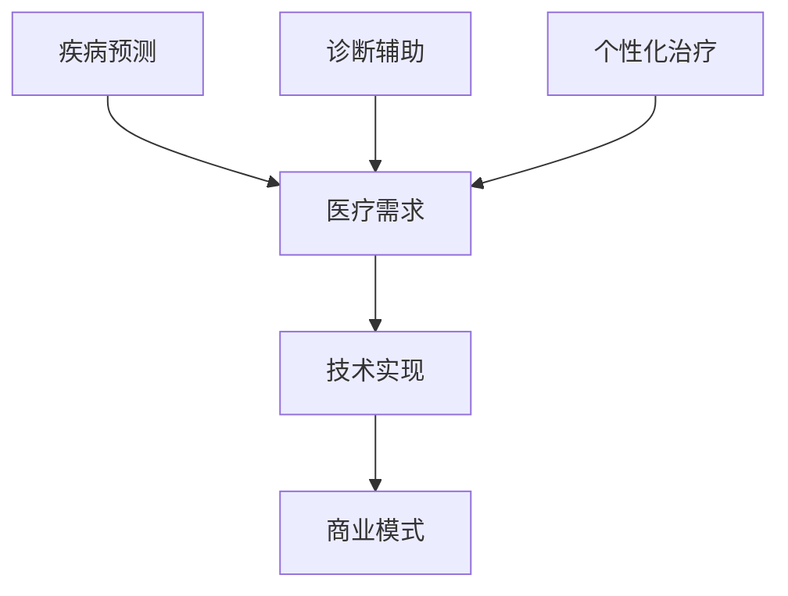

**核心算法原理讲解**

人工智能辅助医疗领域的技术实现主要依赖于深度学习模型，如CNN、RNN、Transformer等，通过预训练和微调来提高模型的性能。以下为CNN在疾病预测任务中的伪代码：

```python
# CNN疾病预测伪代码
class DiseasePredictor(nn.Module):
    def __init__(self, input_size, hidden_size, output_size):
        super(DiseasePredictor, self).__init__()
        self.conv1 = nn.Conv2d(in_channels=1, out_channels=32, kernel_size=3)
        self.relu = nn.ReLU()
        self.fc1 = nn.Linear(hidden_size, output_size)

    def forward(self, x):
        x = self.relu(self.conv1(x))
        x = self.fc1(x)
        return x
```

**数学模型和公式**

疾病预测任务的损失函数通常采用交叉熵损失函数，公式如下：

$$
L = -\frac{1}{N}\sum_{i=1}^{N}y_i \log(p_i)
$$

其中，$L$ 表示损失，$N$ 表示样本数，$y_i$ 表示第 $i$ 个样本的真实标签，$p_i$ 表示模型预测的概率。

**项目实战**

以下是一个基于CNN模型的实际项目案例：

```shell
# 搭建CNN模型训练环境
conda create -n cnn_medicine python=3.8
conda activate cnn_medicine
pip install torch torchvision

# 训练CNN模型
python train_cnn_medicine.py --train_data=train_data --val_data=val_data --model_dir=model_dir
```

**代码解读与分析**

在CNN模型的项目中，首先需要搭建训练环境，然后使用torch库进行模型训练。代码中的`train_cnn_medicine.py`脚本负责模型训练的过程。

**商业模式与盈利模式**

人工智能辅助医疗领域的商业模式主要包括：

1. 医疗设备集成：将人工智能技术集成到医疗设备中，提高诊断效率和准确性。
2. 医疗数据分析：提供医疗数据分析服务，帮助医疗机构优化治疗方案和资源配置。
3. 医疗诊断服务：提供在线诊断服务，为患者提供便捷的就医体验。

**案例总结**

人工智能辅助医疗领域的商业化案例表明，通过利用AI大模型技术，可以提高医疗诊断的准确性和效率，改善患者体验，同时为医疗机构和患者带来巨大的商业价值。在商业模式上，可以采用医疗设备集成、医疗数据分析和医疗诊断服务等多种方式，以适应不同客户的需求。

#### 第4章：AI大模型商业化策略

##### 4.1 市场定位与目标客户

**核心概念与联系**

市场定位与目标客户是AI大模型商业化的重要策略，决定了商业化的方向和目标。

以下为Mermaid流程图：

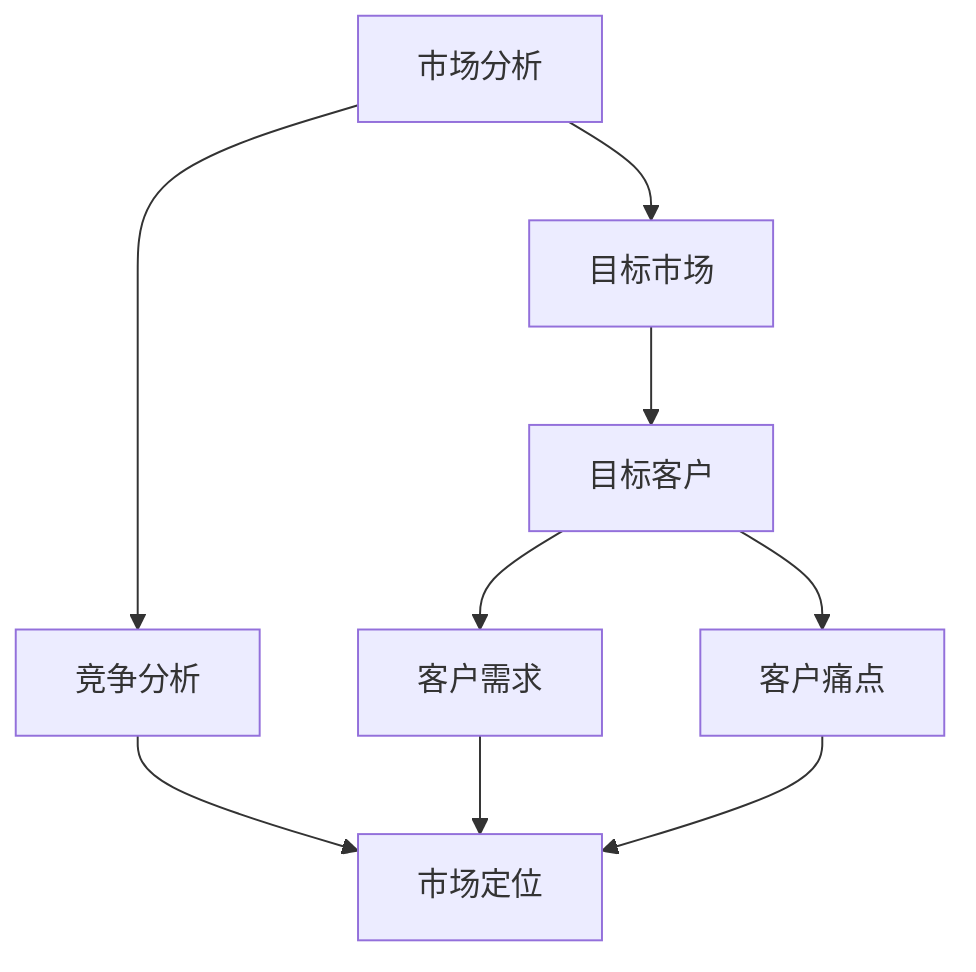

**核心算法原理讲解**

市场定位与目标客户的策略可以通过数据分析、客户调研等方法进行，结合机器学习算法进行客户细分和需求分析，以提高市场定位的准确性。

**数学模型和公式**

客户细分可以通过聚类算法进行，如K均值聚类，公式如下：

$$
C = \{C_1, C_2, ..., C_k\}
$$

其中，$C$ 表示客户集合，$C_i$ 表示第 $i$ 个客户群体，$k$ 表示客户群体的数量。

**项目实战**

以下是一个基于市场定位与目标客户的实际项目案例：

```shell
# 进行市场分析
python market_analysis.py --data=data

# 客户调研
python customer_survey.py --data=data

# 客户细分
python customer_segmentation.py --data=data
```

**代码解读与分析**

在市场定位与目标客户的策略中，首先需要收集市场数据和客户调研数据，然后使用机器学习算法进行客户细分。代码中的`market_analysis.py`、`customer_survey.py`和`customer_segmentation.py`脚本分别负责市场分析、客户调研和客户细分的过程。

**市场定位**

市场定位是指根据市场需求和竞争状况，确定产品或服务的目标市场和市场定位策略。以下是一个基于市场定位的案例：

```shell
# 确定市场定位
python market_positioning.py --market_data=data

# 制定市场策略
python market_strategy.py --positioning=data
```

**代码解读与分析**

在市场定位的案例中，首先需要分析市场需求和竞争状况，然后确定市场定位策略，并制定相应的市场策略。代码中的`market_positioning.py`和`market_strategy.py`脚本分别负责市场定位和市场策略的制定过程。

**目标客户分析与定位**

目标客户分析是指根据市场需求和产品特性，确定目标客户群体和市场定位。以下是一个基于目标客户分析的案例：

```shell
# 分析目标客户
python target_customer_analysis.py --data=data

# 确定目标客户
python target_customer_positioning.py --data=data
```

**代码解读与分析**

在目标客户分析的案例中，首先需要分析客户需求和偏好，然后确定目标客户群体和市场定位。代码中的`target_customer_analysis.py`和`target_customer_positioning.py`脚本分别负责目标客户分析和市场定位的过程。

##### 4.2 商业模式设计

**核心概念与联系**

商业模式设计是指根据市场需求、竞争状况和资源条件，制定实现商业价值的策略和流程。以下为Mermaid流程图：

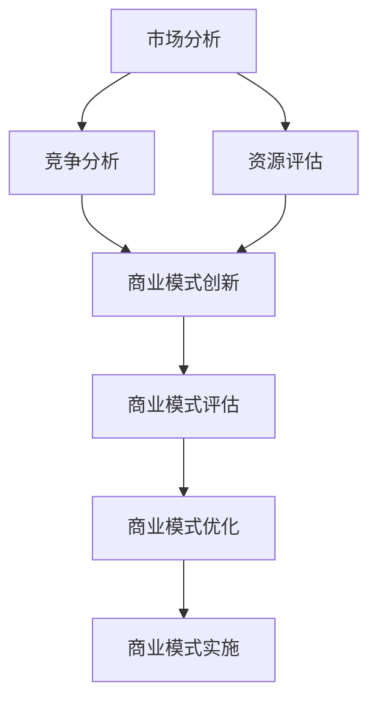

**核心算法原理讲解**

商业模式设计可以通过数据分析、机器学习等方法进行，结合创新思维，设计出具有竞争力的商业模式。

**数学模型和公式**

商业模式评估可以通过财务指标、客户满意度、市场占有率等指标进行量化分析。

**项目实战**

以下是一个基于商业模式设计的实际项目案例：

```shell
# 进行市场分析
python market_analysis.py --data=data

# 竞争分析
python competition_analysis.py --data=data

# 资源评估
python resource_evaluation.py --data=data

# 商业模式创新
python business_model_innovation.py --data=data

# 商业模式评估
python business_model_evaluation.py --data=data

# 商业模式优化
python business_model_optimization.py --data=data

# 商业模式实施
python business_model_implementation.py --data=data
```

**代码解读与分析**

在商业模式设计的项目中，首先需要收集市场分析、竞争分析和资源评估的数据，然后进行商业模式创新、评估和优化，最后实施商业模式。代码中的`market_analysis.py`、`competition_analysis.py`、`resource_evaluation.py`、`business_model_innovation.py`、`business_model_evaluation.py`、`business_model_optimization.py`和`business_model_implementation.py`脚本分别负责相应过程。

**商业模式评估与优化**

商业模式评估与优化是指对已设计的商业模式进行评估和改进，以提高其可行性和竞争力。以下是一个基于商业模式评估与优化的案例：

```shell
# 评估商业模式
python business_model_evaluation.py --data=data

# 优化商业模式
python business_model_optimization.py --data=data

# 监控商业模式
python business_model_monitoring.py --data=data
```

**代码解读与分析**

在商业模式评估与优化的案例中，首先需要评估商业模式的可行性和竞争力，然后进行优化和监控。代码中的`business_model_evaluation.py`、`business_model_optimization.py`和`business_model_monitoring.py`脚本分别负责商业模式评估、优化和监控的过程。

##### 4.3 商业化路径规划

**核心概念与联系**

商业化路径规划是指根据市场需求、竞争状况和资源条件，制定实现商业价值的具体路径和策略。以下为Mermaid流程图：

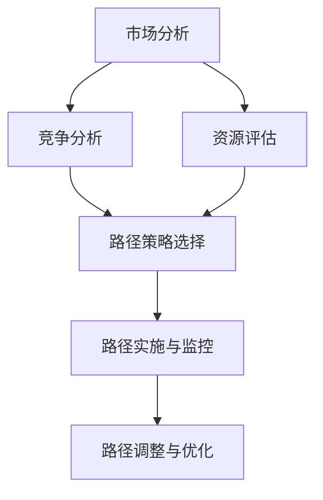

**核心算法原理讲解**

商业化路径规划可以通过数据分析、机器学习等方法进行，结合创新思维，选择最优的路径策略。

**数学模型和公式**

商业化路径规划可以通过决策树、遗传算法等优化算法进行路径选择和优化。

**项目实战**

以下是一个基于商业化路径规划的

