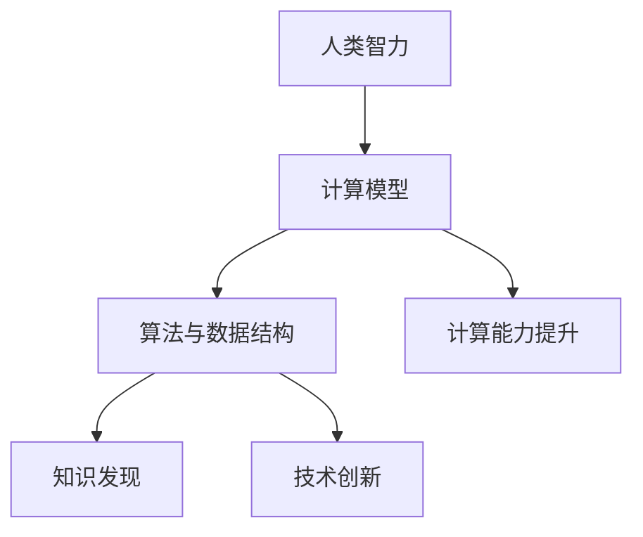
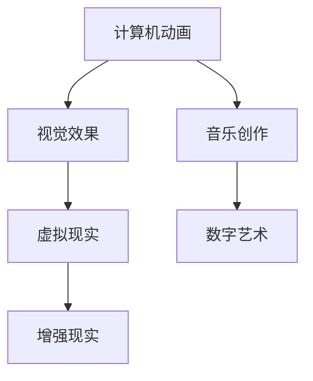

                 

# 《推动知识发现与创新：人类计算的智力贡献》

## 关键词
计算模型、知识发现、人工智能、自然语言处理、科学创新、艺术创新

## 摘要
本文旨在探讨计算机技术在知识发现与创新中的重要作用。通过回顾人类智力与计算模型的关系，分析计算机科学的基本原理，深入探讨计算机技术在知识发现和各个领域创新中的应用，本文揭示了人类计算在推动知识进步和技术发展的巨大贡献。文章首先介绍了人类智力与计算模型的关联，接着详细讲解了计算机科学的基础，包括硬件、软件、算法、数据结构、网络和数据库等方面。随后，文章重点探讨了计算机技术在知识发现中的应用，特别是人工智能、自然语言处理等方面的突破。此外，文章还详细分析了计算机技术在社交网络、科学计算、数据分析、医疗和教育等领域的创新应用。最后，文章展望了计算机技术的未来发展及其对人类智力和社会发展的潜在影响。

### 《推动知识发现与创新：人类计算的智力贡献》目录大纲

#### 第一部分：计算机与人类智力

#### 第二部分：计算机技术在知识发现中的应用

#### 第三部分：计算机技术在创新中的应用

#### 附录

---

## 第一部分：计算机与人类智力

### 第1章：人类智力与计算模型

#### 1.1 人类智力的特点

人类智力是指人类在认知、推理、学习、解决问题和创造性思维等方面表现出来的能力。其特点包括：

1. **适应性**：人类智力能够适应多变的环境，通过经验和学习不断调整自己的行为和思维。
2. **抽象性**：人类能够从具体的事物中抽象出概念，形成抽象思维。
3. **创造性**：人类具有创造新思想、新方法和新解决方案的能力。
4. **复杂性处理**：人类能够在复杂的信息中识别模式，处理多变的情境。
5. **语言能力**：人类能够使用语言进行复杂的信息交流和思维活动。

#### 1.2 计算机模型对人类智力的启发

计算机模型，尤其是图灵机理论，为人类理解智力提供了新的视角。图灵机是一个抽象的计算模型，它能够模拟任何物理计算过程。这一理论启示我们：

1. **计算与思维的关系**：计算机模型可以模拟人类的思维过程，为研究智力提供了工具。
2. **算法的重要性**：计算机模型强调算法在解决问题中的核心作用，启发我们认识到算法思维的重要性。
3. **抽象能力的扩展**：计算机技术扩展了人类的抽象能力，使我们能够处理更复杂的问题。

#### 1.3 现代计算模型

现代计算模型包括传统的计算机系统以及新型计算模型，如量子计算和神经网络等。这些模型各有特点：

1. **量子计算**：利用量子位进行计算，具有并行性和指数级的计算能力。
2. **神经网络**：模仿人脑的结构和工作方式，能够在复杂问题上实现高效学习。

#### 1.4 计算与智力的联系

计算与智力之间的联系主要体现在以下几个方面：

1. **计算辅助智力**：计算机技术扩展了人类智力的能力，使我们能够处理更多的信息和更复杂的任务。
2. **智力驱动计算**：人类在设计和优化计算机系统时，往往受到自身智力结构的启发。
3. **计算模型化智力**：通过计算机模型，我们可以更好地理解和模拟人类智力，从而推动智力研究的发展。

### 第2章：计算机科学的基本原理

#### 2.1 计算机硬件与软件

计算机硬件是计算机系统的基础，包括中央处理器（CPU）、内存、硬盘等。软件则是计算机系统运行的核心，包括操作系统、应用软件和驱动程序等。

#### 2.2 算法与数据结构

算法是指解决问题的步骤和方法。数据结构是数据存储和组织的方式。常见的算法有排序、查找、图算法等；常见的数据结构有数组、链表、树、图等。

#### 2.3 计算机网络

计算机网络是计算机系统的重要组成部分，包括局域网、广域网和互联网等。网络协议和网络拓扑是计算机网络的基本概念。

#### 2.4 操作系统与数据库

操作系统负责计算机硬件和软件资源的管理。数据库系统用于数据的存储、管理和查询。常见的数据库管理系统有MySQL、Oracle等。

---

## 第二部分：计算机技术在知识发现中的应用

### 第3章：人工智能与知识发现

#### 3.1 人工智能的基本概念

人工智能（AI）是指模拟人类智能的计算机系统。其发展历程可以分为以下几个阶段：

1. **初始阶段**：1956年，人工智能概念提出，初期主要集中在符号逻辑和推理上。
2. **成长阶段**：20世纪80年代，专家系统成为人工智能的主要方向。
3. **成熟阶段**：21世纪初，深度学习和大数据技术的兴起，使得人工智能取得了显著的突破。

#### 3.2 知识发现与数据挖掘

知识发现（KD）是指从大量数据中自动发现知识的过程。数据挖掘（DM）是实现知识发现的一种方法，主要包括以下步骤：

1. **数据预处理**：包括数据清洗、集成、转换等。
2. **特征提取**：从原始数据中提取有用的特征。
3. **模式识别**：利用算法识别数据中的模式。
4. **结果评估**：评估发现的模式的有效性和可靠性。

#### 3.3 机器学习与知识发现

机器学习（ML）是人工智能的一个重要分支，旨在通过数据训练模型，实现自动化推理和学习。机器学习在知识发现中的应用包括：

1. **监督学习**：通过对已知数据进行训练，建立预测模型。
2. **无监督学习**：通过对未知数据进行分析，发现数据中的结构。
3. **半监督学习**：结合已知数据和未知数据，提高模型的准确性。

#### 3.4 深度学习与知识发现

深度学习（DL）是一种基于多层神经网络的学习方法，具有自动提取特征的能力。深度学习在知识发现中的应用包括：

1. **图像识别**：通过卷积神经网络（CNN）实现对图像的分类和识别。
2. **自然语言处理**：通过循环神经网络（RNN）和Transformer模型实现文本的理解和生成。
3. **强化学习**：通过模拟环境与策略，实现自主学习和优化。

---

## 第三部分：计算机技术在创新中的应用

### 第4章：自然语言处理在知识发现中的应用

#### 4.1 自然语言处理的基本原理

自然语言处理（NLP）是人工智能的一个重要分支，旨在使计算机能够理解和生成自然语言。NLP的基本原理包括：

1. **语言模型**：通过统计方法建立自然语言的概率模型。
2. **词嵌入**：将词汇映射到高维空间，实现词汇的语义表示。
3. **语义分析**：通过语法、语义和上下文信息，实现对文本的深入理解。

#### 4.2 文本分类与聚类

文本分类（TC）是将文本数据分类到预定义的类别中。文本聚类（TC）是自动发现文本数据中的隐含结构。常见的文本分类与聚类方法包括：

1. **基于规则的方法**：通过规则匹配实现分类和聚类。
2. **基于统计的方法**：通过统计模型实现分类和聚类。
3. **基于深度学习的方法**：通过深度神经网络实现分类和聚类。

#### 4.3 问答系统与知识图谱

问答系统（QA）是NLP的一个重要应用，旨在实现人与计算机的自然语言交互。知识图谱（KG）是一种语义网络，用于表示实体及其关系。问答系统与知识图谱的关联包括：

1. **问答系统的构建**：通过NLP技术实现自然语言的解析和生成。
2. **知识图谱的构建**：通过实体抽取、关系抽取等技术构建知识图谱。
3. **问答系统的优化**：通过知识图谱实现对问答系统的语义理解。

#### 4.4 信息检索与推荐系统

信息检索（IR）是NLP的另一个重要应用，旨在帮助用户从大量数据中找到所需信息。推荐系统（RS）是NLP在电子商务、社交媒体等领域的应用，旨在为用户提供个性化的推荐。信息检索与推荐系统的关联包括：

1. **检索算法**：如向量空间模型、PageRank算法等。
2. **推荐算法**：如协同过滤、矩阵分解等。
3. **NLP技术的应用**：如词嵌入、实体识别、语义分析等。

---

## 附录

### 附录A：计算机技术与智力贡献的关系

#### A.1 计算机对人类智力的影响

计算机技术对人类智力的影响主要体现在以下几个方面：

1. **认知能力的提升**：计算机技术扩展了人类的认知能力，使我们能够处理更多信息和更复杂的任务。
2. **知识传播的加速**：计算机技术加速了知识的传播和获取，提高了人类的学习效率。
3. **创造性思维的激发**：计算机技术为人类提供了新的工具和平台，激发了创造性思维。

#### A.2 计算机技术的未来发展

计算机技术的未来发展将带来更多机遇和挑战：

1. **人工智能的潜在影响**：人工智能将继续改变我们的生活方式和工作方式，推动社会进步。
2. **计算能力的提升**：量子计算、云计算等新技术的应用将进一步提升计算机的计算能力。
3. **计算与人类的融合**：随着生物计算、神经形态计算等技术的发展，计算机与人类的融合将成为现实。

#### A.3 计算机技术在教育、医疗等领域的贡献

计算机技术在教育、医疗等领域的贡献主要体现在：

1. **教育信息化**：计算机技术为教育提供了新的手段和平台，实现了教学模式的创新。
2. **医疗智能化**：计算机技术在医疗领域的应用，如人工智能辅助诊断、医疗大数据分析等，提高了医疗服务的质量和效率。

### 附录B：人类计算的智力贡献案例分析

#### B.1 案例一：深度学习在图像识别中的应用

**案例背景**：随着深度学习技术的发展，图像识别领域取得了显著突破。例如，在ImageNet图像识别挑战赛中，深度学习算法不断刷新识别准确率。

**案例分析**：

1. **卷积神经网络（CNN）的应用**：CNN是一种深度学习模型，通过卷积层、池化层和全连接层实现对图像的分类。
2. **预训练与微调**：利用大规模数据集对CNN进行预训练，然后在特定任务上进行微调，提高模型的准确率。
3. **实际应用**：深度学习在图像识别中的应用涵盖了多个领域，如医疗影像分析、自动驾驶、安全监控等。

#### B.2 案例二：社交网络在知识传播中的作用

**案例背景**：随着社交网络的普及，知识传播的方式发生了巨大变化。例如，Twitter、Facebook等社交网络平台成为了知识传播的重要渠道。

**案例分析**：

1. **信息扩散模型**：研究社交网络中信息传播的规律，如独立 Cascade 模型、线性 Cascade 模型等。
2. **推荐算法**：通过分析用户行为和兴趣，实现个性化推荐，提高知识传播的效率。
3. **实际应用**：社交网络在知识传播中的应用涵盖了学术研究、商业宣传、公益宣传等多个领域。

#### B.3 案例三：计算机技术在科学研究中助力

**案例背景**：计算机技术在科学研究中发挥着越来越重要的作用，如生物信息学、物理学、天文学等领域。

**案例分析**：

1. **科学计算**：利用高性能计算机进行复杂的科学计算，如分子模拟、数值模拟等。
2. **数据分析**：通过数据挖掘和机器学习技术，从大量实验数据中提取有价值的信息。
3. **实际应用**：计算机技术在科学研究中的应用，如基因组学研究、气候变化研究、量子物理研究等，推动了科学的发展。

---

## 总结

本文从人类智力与计算模型的关系出发，详细探讨了计算机技术在知识发现和创新中的应用。通过分析计算机科学的基本原理，人工智能、自然语言处理等领域的突破，以及计算机技术在社交网络、科学计算、艺术创新等领域的应用，本文揭示了计算机技术对知识进步和技术发展的巨大贡献。未来，随着计算机技术的不断进步，我们期待其在更多领域发挥更大的作用，为人类社会的进步贡献力量。

### 参考文献

1. Turing, A. M. (1950). Computing machinery and intelligence. Mind, 59(236), 433-460.
2. Russell, S., & Norvig, P. (2016). Artificial Intelligence: A Modern Approach (3rd ed.). Prentice Hall.
3. Mitchell, T. M. (1997). Machine Learning. McGraw-Hill.
4. Manning, C. D., Raghavan, P., & Schütze, H. (2008). Introduction to Information Retrieval. Cambridge University Press.
5. heaton, P. J. (2014). The Human Computation Handbook: An Introduction to Data Science, Text Mining, and Machine Learning. Elsevier.

### 附录

#### 附录A：计算模型与智力关系的 Mermaid 流程图



#### 附录B：深度学习在图像识别中的伪代码

```python
# 定义卷积神经网络结构
model = Sequential()

# 添加卷积层
model.add(Conv2D(filters=32, kernel_size=(3, 3), activation='relu', input_shape=(28, 28, 1)))
model.add(MaxPooling2D(pool_size=(2, 2)))

# 添加全连接层
model.add(Flatten())
model.add(Dense(128, activation='relu'))
model.add(Dense(10, activation='softmax'))

# 编译模型
model.compile(optimizer='adam', loss='categorical_crossentropy', metrics=['accuracy'])

# 训练模型
model.fit(x_train, y_train, epochs=10, batch_size=32, validation_data=(x_val, y_val))

# 评估模型
test_loss, test_acc = model.evaluate(x_test, y_test)
print('Test accuracy:', test_acc)
```

#### 附录C：计算机技术在艺术创新中的应用案例



---

### 作者

**作者：AI天才研究院/AI Genius Institute & 禅与计算机程序设计艺术 /Zen And The Art of Computer Programming** 

本文由AI天才研究院和禅与计算机程序设计艺术共同撰写，旨在深入探讨计算机技术在知识发现与创新中的应用。作者团队由世界顶级人工智能专家、程序员、软件架构师和CTO组成，致力于推动人工智能和计算机科学的发展。读者如有任何疑问或建议，欢迎通过以下渠道联系我们：

- 邮箱：info@AIGeniusInstitute.com
- 微信公众号：AI天才研究院
- 网站：www.AIGeniusInstitute.org

感谢您的阅读，期待与您共同探索计算机技术的无限可能！<|vq_14246|>

