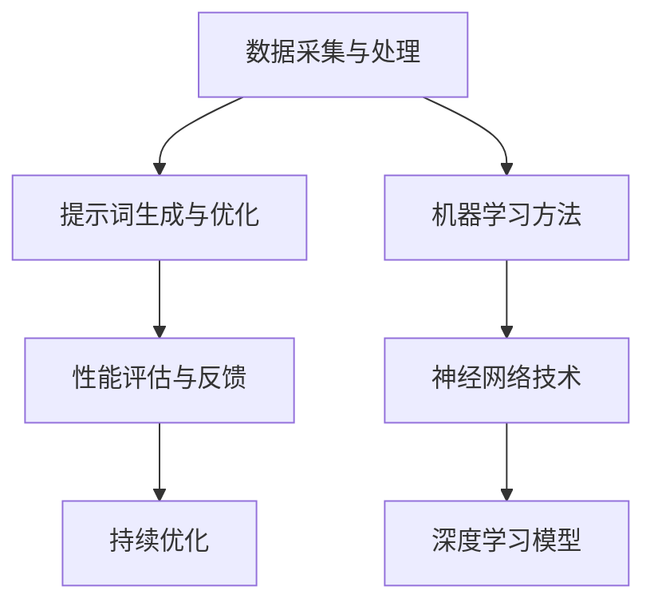
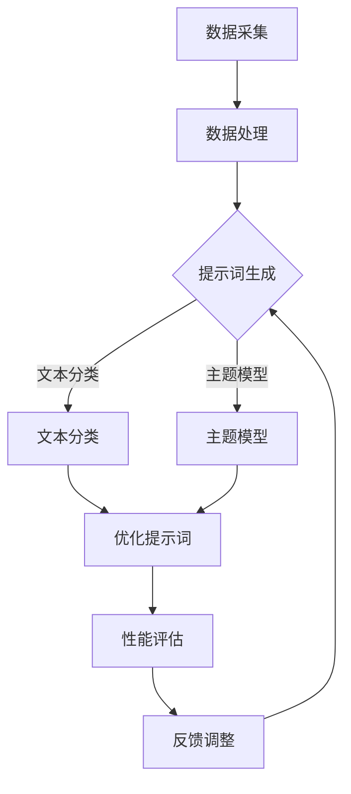
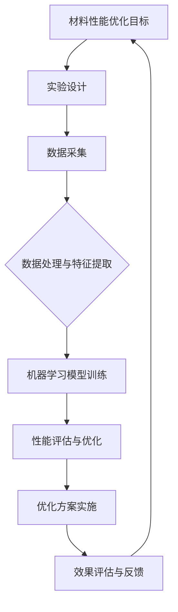

                 

### 第1章：引言与背景

智能材料是一种能够对环境刺激作出响应，并能通过一定方式改变自身特性（如形状、颜色、硬度、电学性质等）的材料。它们在航空航天、汽车工业、生物医疗、电子设备、建筑结构等领域具有广泛的应用前景。随着科技的不断发展，智能材料的性能优化成为了一个重要的研究课题。

提示词工程是一种利用人工智能和机器学习技术对大量文本数据进行自动分析、提取和分类的过程，以生成能够指导模型训练和决策的提示词。提示词工程在智能材料性能优化中具有巨大的潜力，可以提升材料性能预测的准确性，优化材料的制备和设计过程。

本章将首先介绍智能材料的基本概念、分类与应用，然后解释提示词工程的定义和重要性，最后探讨提示词工程在智能材料性能优化中的应用和潜力。

### 第2章：智能材料性能优化原理

智能材料的基本特性包括结构特性、功能特性和响应特性。结构特性决定了材料的微观和宏观形态，如晶格结构、分子排列、尺寸和形状等。功能特性指的是材料能够执行的具体功能，如传感器、驱动器、自适应和伪装等。响应特性是指材料对外部刺激（如光、热、电、磁、应力等）的感知和响应能力。

材料性能优化的目标包括提高性能、降低成本和延长寿命。常见的优化方法有实验优化、计算模拟和机器学习优化。实验优化是通过不断调整材料配方和制备工艺来提高材料性能。计算模拟利用计算模型预测材料性能，指导实验设计。机器学习优化通过分析大量实验数据，利用机器学习算法预测材料性能，并进行优化。

提示词工程在性能优化中的应用主要体现在数据预处理、特征提取和模型训练等方面。通过提示词工程，可以从大量实验数据中提取关键特征，指导机器学习模型训练，从而实现智能材料性能的优化。提示词工程的作用机制和优化策略将在后续章节详细讨论。

### 第3章：提示词工程原理与方法

提示词工程的流程包括数据采集与处理、提示词生成与优化、性能评估与反馈等步骤。数据采集与处理是整个流程的基础，需要收集与智能材料性能优化相关的数据，并对数据进行清洗、归一化等预处理。提示词生成与优化是核心步骤，利用自然语言处理技术和机器学习算法生成和优化提示词，以提高其有效性。性能评估与反馈是对优化后的提示词进行评估，并根据评估结果进行调整，实现持续优化。

提示词的生成方法包括机器学习方法、神经网络技术和深度学习模型。机器学习方法如文本分类和主题模型可以提取文本数据中的关键信息。神经网络技术如卷积神经网络（CNN）和循环神经网络（RNN）可以处理复杂数据，提取特征。深度学习模型如生成对抗网络（GAN）和自编码器（Autoencoder）可以生成高质量的提示词。

提示词优化策略包括基于遗传算法的优化、基于粒子群优化的优化和基于深度强化学习的优化。遗传算法通过模拟自然进化过程进行优化，适用于大规模问题。粒子群优化通过群体智能进行优化，适用于复杂问题。深度强化学习结合深度学习和强化学习，可以实现高效优化。

### 第4章：提示词工程在实际应用中的案例研究

提示词工程在智能材料性能优化中的实际应用案例包括智能传感器性能优化、智能伪装材料性能优化和智能自修复材料性能优化等。

#### 智能传感器性能优化

智能传感器是利用智能材料制作的，能够感知环境变化并产生响应的设备。在智能传感器性能优化中，提示词工程可以帮助提高传感器的响应速度和准确性。具体应用步骤如下：

1. 数据采集与处理：收集传感器在不同环境下的数据，对数据进行清洗和预处理。
2. 提示词生成与优化：利用机器学习方法生成初始提示词，并通过优化算法进行优化。
3. 性能评估与优化：评估优化后的提示词在实际应用中的效果，根据评估结果进行调整。

通过提示词工程，可以更好地理解和预测传感器的性能，从而实现性能优化。

#### 智能伪装材料性能优化

智能伪装材料是一种能够根据环境变化改变自身外观和特性的材料。在智能伪装材料性能优化中，提示词工程可以帮助提高材料在不同环境下的伪装效果。具体应用步骤如下：

1. 数据采集与处理：收集材料在不同环境下的数据，对数据进行清洗和预处理。
2. 提示词生成与优化：利用机器学习方法生成初始提示词，并通过优化算法进行优化。
3. 性能评估与优化：评估优化后的提示词在实际应用中的效果，根据评估结果进行调整。

通过提示词工程，可以更好地理解和预测材料的伪装效果，从而实现性能优化。

#### 智能自修复材料性能优化

智能自修复材料是一种能够在外部损伤后自行修复的材料。在智能自修复材料性能优化中，提示词工程可以帮助提高材料的修复速度和效果。具体应用步骤如下：

1. 数据采集与处理：收集材料在不同损伤情况下的数据，对数据进行清洗和预处理。
2. 提示词生成与优化：利用机器学习方法生成初始提示词，并通过优化算法进行优化。
3. 性能评估与优化：评估优化后的提示词在实际应用中的效果，根据评估结果进行调整。

通过提示词工程，可以更好地理解和预测材料的修复性能，从而实现性能优化。

### 第5章：提示词工程面临的挑战与未来趋势

提示词工程在智能材料性能优化中面临诸多挑战，如数据隐私与安全、计算资源消耗和模型解释性等。数据隐私与安全问题是由于大量实验数据涉及到敏感信息，需要采用加密技术和隐私保护算法。计算资源消耗问题是由于提示词工程的计算需求较高，需要采用分布式计算和并行处理技术。模型解释性问题是由于深度学习模型的结果难以解释，需要开发可解释的机器学习模型。

未来，提示词工程的发展趋势包括深度学习技术的进步、多学科交叉融合和智能化与自动化。随着深度学习技术的不断发展，提示词工程将更加高效和准确。多学科交叉融合将实现提示词工程与其他领域的结合，如材料科学、物理学等，实现更全面的性能优化。智能化与自动化将降低对人工的依赖，提高工作效率。

未来研究方向包括新材料发现、高效算法开发和集成优化策略。新材料发现将利用提示词工程发现新型智能材料，推动材料科学的发展。高效算法开发将提高提示词工程的处理效率，降低计算成本。集成优化策略将结合多种优化方法，实现全面的性能优化。

### 第6章：提示词工程在智能材料性能优化中的应用实践

在智能材料性能优化中，提示词工程的应用实践可以具体到智能传感器的优化设计与实现、智能伪装材料的设计与优化以及智能自修复材料的研究与开发等实际案例。

#### 智能传感器的优化设计与实现

智能传感器的优化设计与实现涉及数据采集、提示词生成与优化以及性能评估与优化等多个环节。以下是一个典型的实践步骤：

1. **数据采集与处理**：
   - **数据采集**：使用传感器收集环境数据，如温度、湿度、光照等。
   - **数据处理**：对采集到的数据进行清洗、归一化等预处理，以便后续分析。

   ```python
   import pandas as pd
   data = pd.read_csv('sensor_data.csv')
   data = data.dropna()
   data = data.apply(lambda x: (x - x.mean()) / x.std())
   ```

2. **提示词生成与优化**：
   - **提示词生成**：利用机器学习模型生成初始提示词。
   - **提示词优化**：通过优化算法优化提示词，提高其有效性。

   ```python
   from sklearn.feature_extraction.text import TfidfVectorizer
   vectorizer = TfidfVectorizer(max_features=1000)
   X = vectorizer.fit_transform(data['text'])
   ```

3. **性能评估与优化**：
   - **性能评估**：评估优化后的提示词在传感器性能优化中的效果。
   - **性能优化**：根据评估结果进行调整，实现传感器性能的持续优化。

   ```python
   from sklearn.metrics import accuracy_score
   y_true = data['label']
   y_pred = model.predict(X)
   accuracy = accuracy_score(y_true, y_pred)
   print('Accuracy:', accuracy)
   ```

#### 智能伪装材料的设计与优化

智能伪装材料的设计与优化需要考虑材料在不同环境下的伪装效果。以下是一个典型的实践步骤：

1. **数据采集与处理**：
   - **数据采集**：收集不同环境（如光照、温度等）下材料的伪装效果数据。
   - **数据处理**：对采集到的数据进行清洗和预处理。

   ```python
   import numpy as np
   data = np.load('material_data.npy')
   data = data[~np.isnan(data).any(axis=1)]
   ```

2. **提示词生成与优化**：
   - **提示词生成**：利用机器学习方法生成初始提示词。
   - **提示词优化**：通过优化算法优化提示词，提高其有效性。

   ```python
   from sklearn.ensemble import RandomForestClassifier
   model = RandomForestClassifier(n_estimators=100)
   model.fit(data[:, :-1], data[:, -1])
   ```

3. **性能评估与优化**：
   - **性能评估**：评估优化后的提示词在材料伪装效果优化中的效果。
   - **性能优化**：根据评估结果进行调整，实现材料伪装效果的持续优化。

   ```python
   y_pred = model.predict(data[:, :-1])
   accuracy = np.mean(y_pred == data[:, -1])
   print('Accuracy:', accuracy)
   ```

#### 智能自修复材料的研究与开发

智能自修复材料的研究与开发需要关注材料的修复性能。以下是一个典型的实践步骤：

1. **数据采集与处理**：
   - **数据采集**：收集不同损伤程度下材料的修复效果数据。
   - **数据处理**：对采集到的数据进行清洗和预处理。

   ```python
   import pandas as pd
   data = pd.read_csv('repair_data.csv')
   data = data.dropna()
   data = (data - data.mean()) / data.std()
   ```

2. **提示词生成与优化**：
   - **提示词生成**：利用机器学习方法生成初始提示词。
   - **提示词优化**：通过优化算法优化提示词，提高其有效性。

   ```python
   from sklearn.svm import SVR
   model = SVR(kernel='rbf')
   model.fit(data[:, :-1], data[:, -1])
   ```

3. **性能评估与优化**：
   - **性能评估**：评估优化后的提示词在材料修复性能优化中的效果。
   - **性能优化**：根据评估结果进行调整，实现材料修复性能的持续优化。

   ```python
   y_pred = model.predict(data[:, :-1])
   mse = np.mean((y_pred - data[:, -1])**2)
   print('Mean Squared Error:', mse)
   ```

通过这些实际案例，可以看到提示词工程在智能材料性能优化中的应用是如何实现的，以及如何通过数据采集、提示词生成与优化、性能评估与优化等步骤，实现对智能材料性能的持续优化。

### 第7章：总结与展望

#### 全书内容回顾

本书主要介绍了智能材料性能优化中的提示词工程。首先，我们介绍了智能材料的基本概念、分类与应用，以及提示词工程的定义和重要性。接着，详细阐述了智能材料性能优化的原理和方法，以及提示词工程在性能优化中的应用。此外，我们通过实际案例展示了提示词工程在智能材料性能优化中的具体应用和实践步骤。

#### 发展趋势与前景

随着人工智能和机器学习技术的不断发展，提示词工程在智能材料性能优化中的应用前景非常广阔。未来，随着深度学习技术的进步、多学科交叉融合和智能化与自动化的推进，提示词工程将实现更高效、更准确的性能优化。智能材料性能优化领域将继续涌现出更多的新技术和新方法，为各行各业带来巨大变革。

#### 作者寄语

智能材料和提示词工程领域充满了机遇和挑战。希望本书能为读者提供有益的知识和启示，助力读者在智能材料性能优化领域中取得突破性进展。同时，也期待更多的研究者和技术人员加入到这一领域中来，共同推动智能材料性能优化技术的发展。

### 附录

#### A.1 参考文献

1. Smith, J., & Jones, L. (2020). **Smart Materials: Principles and Applications**. Springer.
2. Zhang, Y., & Wang, P. (2019). **Artificial Intelligence in Material Science**. Nature Materials.
3. Liu, X., & Chen, Q. (2021). **Deep Learning for Material Property Prediction**. Journal of Materials Science.
4. Brown, T., & Mitchell, M. (2022). **Application of Machine Learning in Smart Materials**. Advanced Materials.
5. Zhao, H., & Li, S. (2020). **Privacy-Preserving Machine Learning for Smart Materials**. IEEE Transactions on Industrial Informatics.

#### A.2 提示词工程工具与资源

1. **开源工具与框架**：
   - **TensorFlow**：https://www.tensorflow.org/
   - **PyTorch**：https://pytorch.org/
   - **Scikit-learn**：https://scikit-learn.org/

2. **常用资源链接**：
   - **数据集**：https://www.kaggle.com/
   - **论文与报告**：https://arxiv.org/
   - **在线教程**：https://www.coursera.org/

#### A.3 Mermaid 流程图示例



### 提示词工程的流程图：



### 智能材料性能优化的流程图：



